# Beginner Mentor Sessions：2020

> 58 场，合计 59.7 小时。返回 [Beginner Mentor Sessions 目录](../README.md)。

## v0430：RSI指标在股票交易中的应用

> 日期：2020-01-21　·　时长：00:46:17

**本场重点：** 通过RSI指标测试60来判断股票走势，强调安全进入的重要性。

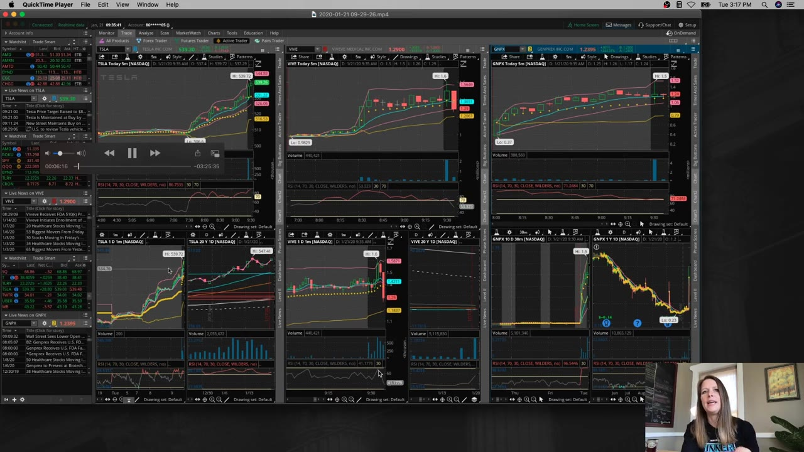

**图怎么看：**

- 图中显示了BYND股票的5分钟K线图，可以看到股价在不同时间段内的波动情况。
- 水平轴表示时间，垂直轴表示价格，红色和绿色柱状图代表成交量。
- 图中可以看到BYND股票的价格在一段时间内呈现上升趋势。
- 成交量柱状图显示了不同时间段内的买卖活动情况。

### 关键内容

- 使用RSI指标测试60来判断股票的强弱。
- RSI指标在5分钟图表上测试60是安全进入的标志。
- RSI指标测试60后需要保持，否则可能需要退出。
- RSI指标在1分钟图表上测试60是进入的时机。
- RSI指标测试60后需要重新测试，以确认是否可以进入。
- RSI指标在5分钟图表上突破60后，需要在1分钟图表上再次测试。
- RSI指标在5分钟图表上突破70后，成为新的阻力点。
- RSI指标在1分钟图表上突破70后，可以进行利润锁定。
- RSI指标在5分钟图表上突破70后，需要在1分钟图表上重新测试。

### 分析与执行顺序

1. 首先打开Vive股票的实时图表。
2. 观察RSI指标在5分钟图表上的表现。
3. 当RSI指标测试60时，记录下这一时刻。
4. 继续观察RSI指标在1分钟图表上的表现。
5. 当RSI指标在1分钟图表上测试60时，记录下这一时刻。
6. 当RSI指标在1分钟图表上突破70时，记录下这一时刻。
7. 当RSI指标在5分钟图表上突破70时，记录下这一时刻

### 案例与细节

- Vive股票的RSI指标在5分钟图表上测试60，但未能保持，表明可能需要退出。
- Vive股票的RSI指标在1分钟图表上测试60，但未能保持，表明可能需要退出。
- Vive股票的RSI指标在5分钟图表上突破70，但在1分钟图表上未能保持，表明可能需要退出。
- Vive股票的RSI指标在1分钟图表上突破70，但未能保持，表明可能需要退出。
- Vive股票的RSI指标在5分钟图表上突破70，但在1分钟图表上重新测试，表明可能需要进入

### 风险与边界

- RSI指标测试60后未能保持，可能意味着股票走势发生变化。
- RSI指标测试70后未能保持，可能意味着股票走势发生变化。
- RSI指标在1分钟图表上突破70后，需要在5分钟图表上重新测试，以确认是否可以进入。
- 录制于2020年，当时的市场环境和规则可能与现在不同。
- RSI指标在5分钟图表上突破70后，需要在1分钟图表上重新测试，以确认是否可以进入

### 复盘问题

- 在RSI指标测试60时，如何判断是否应该进入？
- RSI指标在1分钟图表上突破70后，如何进行利润锁定？
- 在RSI指标测试70时，如何判断是否应该退出？
- 在RSI指标在5分钟图表上突破70后，如何在1分钟图表上重新测试？
- 在RSI指标在1分钟图表上突破70后，如何进行利润锁定？

---

## v0431：如何有效止损

> 日期：2020-01-29　·　时长：01:01:38

**本场重点：** 止损是新手交易者最重要的技能之一，它关乎生存和长期发展。

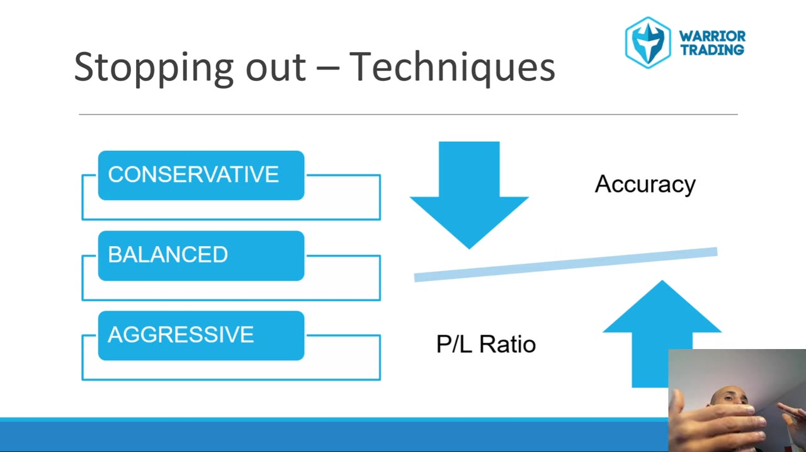

**图怎么看：**

- 幻灯片把止损分为 Conservative、Balanced 和 Aggressive 三种风格，并用箭头表示准确率与盈亏比之间的方向性取舍。
- 越保守的退出通常越容易较早离场，单次亏损可控但也可能牺牲盈亏比；越激进地等待确认，容忍空间更大，却会放大判断错误时的损失。
- 实操时要预先写清楚自己采用哪类止损、依据什么价格结构失效以及对应仓位，不能在价格逼近止损后临时把“保守”改成“激进”。
- 这张图表达的是取舍框架，不代表某一种止损永远最好；应使用交易样本比较胜率、平均盈利、平均亏损和滑点后再选择。

### 关键内容

- 止损技巧的核心在于控制损失，避免账户爆仓。
- 成功的交易者通常会错误地30-35%，新手不应追求完美准确。
- 止损策略应根据个人性格和风险承受能力选择。
- 不同策略包括保守、平衡和激进，适用于不同市场情况。
- 平衡策略结合了保守和激进的优点，适用于大多数交易者。
- 小浮动股票应更保守止损，大浮动股票则可以更激进。
- 使用技术指标和价格行动来决定何时止损。
- 交易者应根据市场情况调整自己的策略。
- 止损策略的选择应基于个人经验而非固定模式。
- 交易者应关注市场开盘后的前三分钟，因为这是最戏剧性的变动时段。

### 分析与执行顺序

1. 讲师首先介绍了止损的重要性，指出它关乎生存和长期发展。
2. 然后讲解了不同类型的止损策略，包括保守、平衡和激进。
3. 接着通过实际交易案例展示了如何应用这些策略。
4. 最后，讲师强调了根据市场情况调整策略的重要性。
5. 讲师还提醒交易者要关注市场开盘后的前三分钟，因为这是最戏剧性的变动时段。

### 案例与细节

- 讲师分享了一个交易案例，使用了平衡策略，在价格突破计划止损区域后迅速卖出。
- 另一个案例中，交易者在小浮动股票上采用了更保守的止损策略，成功避免了不必要的损失。
- 讲师还展示了如何使用斐波那契回撤水平进行止损，以最大化利润。

### 风险与边界

- 止损策略的选择应基于个人经验，而不是固定模式，否则可能导致错误决策。
- 交易者应根据市场情况调整策略，否则可能无法适应市场的快速变化。
- 交易者应关注市场开盘后的前三分钟，因为这是最戏剧性的变动时段，但这一时期已过，需谨慎应用。
- 讲师提供的案例基于历史数据，当前市场情况可能有所不同。

### 复盘问题

- 你如何根据个人性格和风险承受能力选择止损策略？
- 在实际交易中，你是如何应用平衡策略的？
- 你如何根据市场情况调整你的止损策略？

---

## v0432：交易记录与文档管理

> 日期：2020-02-05　·　时长：01:00:30

**本场重点：** 交易记录的重要性在于每日反思和数据积累，有助于长期策略优化。

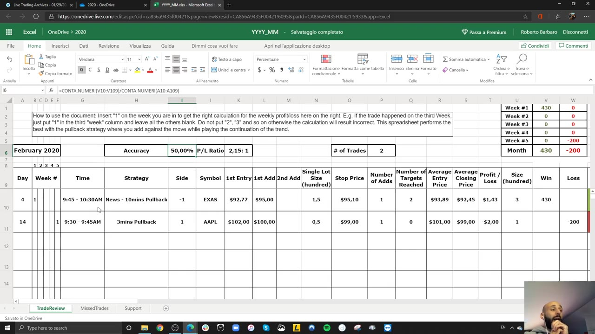

**图怎么看：**

- 这张图片显示了一个Excel表格，其中包含交易记录和相关数据，如准确性、P/L比率、交易数量等。
- 表格中还包含了交易的具体信息，如日期、周数、时间、策略、方向、股票代码、首次入场价、首次加仓价、单笔仓位大小、止损价、目标数量、平均入场价、平均收盘价、利润/亏损、规模和胜率。
- 通过这些详细的数据，可以进行每日反思和长期策略优化。
- 此外，右侧的图表显示了多个股票的K线图，帮助分析市场趋势和交易机会。

### 关键内容

- Roberto更新了自己的交易记录方式，增加了详细的注释和数据记录。
- 他强调了每日记录的重要性，以帮助自我反思和策略优化。
- 新的文档格式更全面，便于提取有价值的信息。
- 交易记录包括多个入场点、单个仓位大小等详细信息。
- 每周和每月的数据记录方式不同，以适应不同的时间跨度。
- 通过详细的记录，可以更好地理解自己的交易过程和结果。
- 每日记录有助于及时调整策略，避免情绪化决策。
- 交易记录不仅记录交易本身，还包括交易后的反思和总结。
- 新的文档格式有助于长期跟踪和分析交易表现。
- 每日记录可以提高对交易过程的理解，减少情绪化影响

### 分析与执行顺序

1. Roberto首先介绍了自己更新后的交易记录方式，包括详细的注释和数据记录。
2. 他展示了如何在交易记录中添加多个入场点和单个仓位大小等详细信息。
3. 接着，他解释了如何将交易记录分为每周和每月的数据记录方式。
4. Roberto强调了每日记录的重要性，以帮助自我反思和策略优化。
5. 他演示了如何使用Excel表格来记录交易细节，包括入场价格、仓位大小等。
6. Roberto还展示了如何通过每日记录来跟踪交易表现和调整策略。
7. 最后，他强调了每日记录对于减少情绪化影响的重要性，以及提高对交易过程的理解

### 案例与细节

- 交易记录包括多个入场点，如第一笔和潜在的第二笔，每个入场点都有相同的仓位大小。
- 交易记录还包括单个仓位的表达方式，例如1.5表达式意味着150股。
- 交易记录还包括止损价格和目标点数，以便更好地理解交易过程。
- 交易记录还包括交易后的反思和总结，以帮助改进未来的交易策略。
- 交易记录还包括交易管理的细节，如如何处理多个入场点和仓位大小的变化

### 风险与边界

- 交易记录需要每天进行，否则可能无法及时调整策略。
- 交易记录依赖于准确的数据输入，错误的数据可能导致错误的决策。
- 交易记录需要长期坚持，否则可能无法发现长期的趋势和模式。
- 交易记录依赖于特定的软件和工具，这些工具可能在未来发生变化。
- 交易记录需要定期回顾和分析，否则可能无法从中获得价值

### 复盘问题

- 你如何确保每天记录交易细节？
- 你在交易记录中加入了哪些新的信息？
- 你如何利用交易记录来改进你的交易策略？

---

## v0433：2020年3月3日导师会话

> 日期：2020-03-03　·　时长：00:55:58

**本场重点：** 导师讨论了近期交易表现，强调了风险管理的重要性，并指出市场波动性增加带来的挑战。

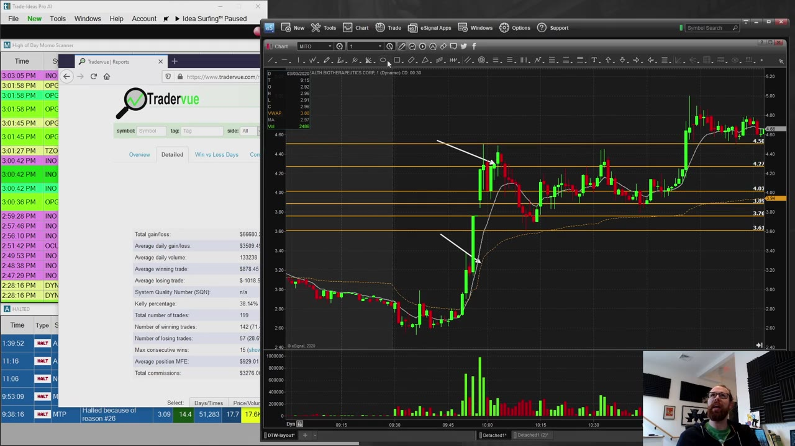

**图怎么看：**

- 画面中，可以看到多个股票的实时交易数据，包括价格、成交量和交易时间。
- 图表显示了不同股票的价格走势和成交量变化，有助于分析市场的波动性和趋势。
- 实时交易数据和图表分析对于交易者来说非常重要，可以帮助他们做出更明智的投资决策。
- 通过观察这些图表，交易者可以更好地理解市场动态，从而制定有效的风险管理策略。

### 关键内容

- 导师提到近期交易表现不佳，连续四天亏损。
- 市场波动性增加，导致交易难度加大。
- 导师指出某些股票如AHPI和MITO的波动性较大，容易出现快速下跌。
- 导师提到TVIX交易中的快速下跌，提醒要警惕市场突然变化。
- 导师建议减少交易次数，避免过度交易。
- 导师提到市场情绪波动，强调了保持冷静的重要性。
- 导师指出市场波动性增加，可能导致更多假突破。
- 导师建议使用技术指标辅助判断，但强调不能盲目依赖。
- 导师提到近期交易中出现的假突破现象，强调了市场分析的重要性。
- 导师提到市场波动性增加，可能导致更多假突破，提醒要谨慎操作

### 分析与执行顺序

1. 导师回顾了近期交易表现，指出连续四天亏损。
2. 导师分析了市场波动性增加的原因，强调了风险管理的重要性。
3. 导师建议减少交易次数，更加谨慎地选择入场时机。
4. 导师举例说明了AHPI和MITO的波动性，强调了快速下跌的风险。
5. 导师强调了使用止损单的重要性，以控制风险。
6. 导师通过TVIX交易中的快速下跌，提醒要警惕市场突然变化。
7. 导师建议减少交易次数，避免过度交易，以降低风险。
8. 导师通过市场波动性增加，强调了保持冷静的重要性。
9. 导师总结了近期交易中的假突破现象，强调了市场分析的重要性。
10. 导师建议关注市场活跃度较高的股票，以降低风险。
11. 导师通过市场波动性增加，提醒要谨慎操作，避免过度交易

### 案例与细节

- ticker：AHPI；price：2250；volume：5000；action：买入；result：盈利7000美元
- ticker：MITO；price：20；volume：10000；action：买入；result：亏损3000美元
- ticker：TVIX；price：2440；volume：1500；action：买入；result：亏损4500美元

### 风险与边界

- 市场波动性增加可能导致更多假突破，影响交易决策。
- 过度交易可能导致资金迅速耗尽，增加风险。
- 市场情绪波动可能导致交易者情绪波动，影响判断。
- 录制年代限制，当前市场情况可能与2020年有所不同。
- 市场波动性增加，可能导致更多假突破，提醒要谨慎操作

### 复盘问题

- 导师提到的市场波动性增加，对交易策略有何影响？
- 如何在保持交易积极性的同时，有效控制风险？
- 在交易过程中，如何更好地利用技术指标进行辅助判断？
- 面对市场波动性增加，如何调整交易心态，保持冷静？
- 如何根据市场情况调整交易策略，以适应当前市场环境？

---

## v0434：自定义技术指标在日内交易中的应用

> 日期：2020-03-04　·　时长：00:57:09

**本场重点：** 问题在于如何找到适合自己的技术指标，结论是简化和个性化，边界在于不同交易者的需求差异。

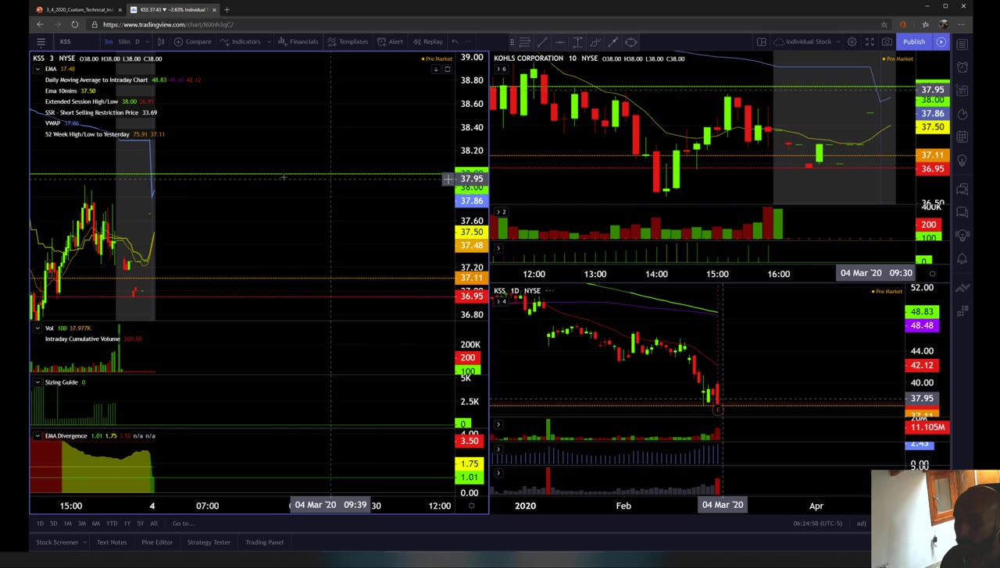

**图怎么看：**

- 图中显示了KSS和KOHL'S Corporation的每日蜡烛图，展示了价格波动情况。
- 图表上标注了短期移动平均线（EMA）和其他技术指标，帮助分析市场趋势。
- 通过观察KSS的蜡烛图，可以判断其价格是否突破关键支撑和阻力位。
- 对于KOHL'S Corporation，图表提供了开盘价、最高价、最低价和收盘价等详细信息。

### 关键内容

- Roberto使用了3分钟和10分钟的时间框架，以及VEO应用和13EMA等基础指标。
- 他通过减少技术指标的数量来简化决策过程，提高交易效率。
- 使用扩展交易时段高低价指标帮助识别潜在的支撑和阻力水平。
- 短卖限制价格指标用于识别股票进入短期卖出限制的价格点。
- 52周高和低到昨日指标用于识别长期支撑和阻力水平。
- EMA发散指标用于识别不同时间框架内的发散情况，辅助交易决策。
- 风险控制指标用于确定交易头寸大小，确保风险可控。
- 通过减少不必要的技术指标，简化交易流程，提高执行速度。
- 使用这些指标是为了更好地适应自己的交易风格，而不是盲目跟随市场。
- 通过测试和实际交易，找到最适合自己的技术指标组合。

### 分析与执行顺序

1. 首先，罗伯托介绍了自己使用的3分钟和10分钟时间框架，以及基础指标如VEO应用和13EMA。
2. 然后，他解释了如何通过减少技术指标数量来简化决策过程，提高交易效率。
3. 接着，罗伯托展示了扩展交易时段高低价指标的具体应用，帮助识别潜在的支撑和阻力水平。
4. 随后，他详细说明了短卖限制价格指标的作用，用于识别股票进入短期卖出限制的价格点。
5. 接着，罗伯托介绍了52周高和低到昨日指标，用于识别长期支撑和阻力水平。
6. 然后，他解释了EMA发散指标的作用，用于识别不同时间框架内的发散情况，辅助交易决策。
7. 最后，罗伯托介绍了风险控制指标，用于确定交易头寸大小，确保风险可控。

### 案例与细节

- KSS股票在开盘后出现大幅下跌，验证了EMA发散指标的有效性。
- 罗伯托使用52周高和低到昨日指标，识别了KSS股票的关键支撑和阻力水平。
- 罗伯托使用扩展交易时段高低价指标，识别了KSS股票的潜在支撑和阻力水平。
- 罗伯托使用短卖限制价格指标，识别了KSS股票进入短期卖出限制的价格点。
- 罗伯托使用每日移动平均线到日内图表指标，帮助识别KSS股票的关键支撑和阻力水平。

### 风险与边界

- 由于录制于2020年，部分指标和平台功能可能已发生变化。
- 技术指标的有效性依赖于市场环境的变化，需要持续测试和调整。
- 过度依赖单一技术指标可能导致决策失误，需结合其他因素综合判断。
- 技术指标的应用效果受交易者个人经验的影响，不同交易者可能有不同的需求。

### 复盘问题

- 罗伯托使用的技术指标有哪些？
- 如何通过减少技术指标数量来简化决策过程？
- 扩展交易时段高低价指标的具体作用是什么？
- 短卖限制价格指标如何帮助识别股票进入短期卖出限制的价格点？
- 风险控制指标如何帮助确定交易头寸大小？

---

## v0435：个人交易策略分享

> 日期：2020-03-17　·　时长：01:16:11

**本场重点：** 分享个人交易经历，强调风险管理与心理调整。

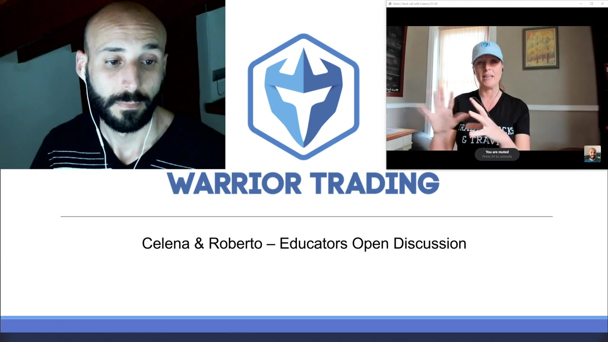

**图怎么看：**

- 在B选项中，可以看到一个关于Warrior Trading的教育讨论会的标题。
- 该会议由Celena和Roberto主持，旨在分享他们的交易经验并进行开放讨论。
- 会议可能涉及风险管理、心理调整等关键话题，以帮助参与者提升交易技能。
- 通过观看这个视频，参与者可以学习到如何在交易过程中保持冷静和理性，以及如何制定有效的风险管理策略。

### 关键内容

- 讲述个人交易故事，强调情感投入和风险控制。
- 强调风险管理的重要性，特别是面对市场变化时。
- 强调个人交易策略的灵活性和适应性。
- 分享如何利用技术指标进行交易决策。
- 讨论如何在市场波动中保持交易纪律
- 分享隔离期间的旅行计划，展示面对突发情况的应对措施。在隔离期间，通过不断调整交易策略，最终成功完成交易计划，体现了灵活性和适应性。
- 强调风险管理的重要性，特别是面对市场变化时。在隔离期间，面对病毒爆发，交易计划被迫改变，展示了如何在不可预见的情况下管理风险。
- 讨论交易平台的选择，以及如何逐步适应新环境。从Think或Swim切换到CMG，说明了如何逐步适应新的交易平台和操作环境，确保平稳过渡。
- 分享使用斐波那契工具进行利润锁定的方法。在交易过程中，使用斐波那契工具设定止损和目标价格，如在315和343价位，确保交易策略的有效执行。
- 强调个人交易策略的灵活性和适应性。在隔离期间，面对病毒爆发，交易策略从日交易转向更长期的趋势交易，展示了如何根据市场变化调整策略

### 分析与执行顺序

1. 记录个人交易故事，包括情感投入和市场变化。
2. 分享隔离期间的旅行计划，展示面对突发情况的应对措施。
3. 讨论交易平台的选择，以及如何逐步适应新环境。
4. 分享使用斐波那契工具进行利润锁定的方法。
5. 讨论如何在不同市场条件下调整交易策略。
6. 分享如何利用技术指标进行交易决策。
7. 强调交易过程中保持冷静和理性的重要性

### 案例与细节

- 从马略卡岛出发，经过多个航班和边境关闭，最终到达巴西。
- 使用斐波那契工具设定止损和目标价格，例如在315和343价位。
- 在市场波动中，保持冷静，避免过度交易。
- 使用13EMA作为关键技术指标，进行趋势跟踪和交易决策。
- 在隔离期间，通过不断调整交易策略，最终成功完成交易计划
- 从马略卡岛出发，经过多个航班和边境关闭，最终到达巴西。在隔离期间，通过不断调整交易策略，最终成功完成交易计划，体现了灵活性和适应性。
- 使用斐波那契工具设定止损和目标价格，例如在315和343价位。在交易过程中，使用斐波那契工具设定止损和目标价格，确保交易策略的有效执行。
- 在市场波动中，保持冷静，避免过度交易。在隔离期间，面对病毒爆发，保持冷静，避免情绪化决策，确保交易纪律。

### 风险与边界

- 市场变化可能导致交易策略失效，需要灵活调整。
- 突发疫情可能影响交易计划的实施，需考虑风险。
- 交易过程中需要保持冷静，避免情绪化决策。
- 交易策略的有效性依赖于市场环境的变化，需持续监控。
- 录制年代限制为2020年，部分信息可能不再适用
- 市场变化可能导致交易策略失效，需要灵活调整。在隔离期间，病毒爆发导致市场变化，交易策略需要根据实际情况灵活调整，否则可能导致亏损。
- 突发疫情可能影响交易计划的实施，需考虑风险。在隔离期间，病毒爆发导致航班取消和边境关闭，交易计划被迫改变，展示了如何在不可预见的情况下管理风险。
- 交易过程中需要保持冷静，避免情绪化决策。在隔离期间，面对病毒爆发，保持冷静，避免情绪化决策，否则可能导致冲动交易，增加风险。
- 交易策略的有效性依赖于市场环境的变化，需持续监控。在隔离期间，病毒爆发导致市场环境变化，交易策略需要持续监控，否则可能导致策略失效

### 复盘问题

- 在面对突发疫情时，你是如何调整交易策略的？
- 使用斐波那契工具进行利润锁定时，有哪些注意事项？
- 在隔离期间，你是如何保持交易纪律的？

---

## v0436：日内交易与技术分析

> 日期：2020-03-24　·　时长：01:20:37

**本场重点：** 讲师通过技术分析识别交易机会，并强调了正确设置止损的重要性。

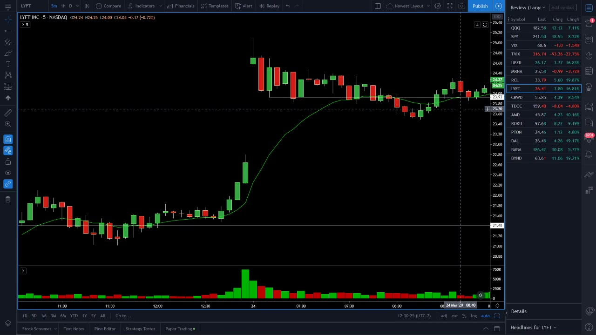

**图怎么看：**

- 在图中，LYFT 的价格在上升趋势中，显示出强劲的上涨势头。
- 成交量柱的高度反映对应周期内的总成交量；红绿着色通常跟随价格柱的涨跌规则，不能直接拆成两种方向的主动成交。
- 水平线和斜线可能表示支撑和阻力位，帮助识别潜在的买卖点。
- 图表右侧的指标如VIX等，可以提供市场情绪和波动性的参考。

### 关键内容

- 讲师分析了多个股票的走势，包括Uber、Lyft、MRNA等，强调了技术分析的重要性。
- VIX和T-VIX的水平显示了市场波动性的变化，预示着市场的潜在走向。
- 讲师指出，需要三次测试才能确认突破，例如Uber的三重顶和TDOC的假突破。
- 正确设置止损对于短期交易至关重要，尤其是当市场反应迅速时。
- 讲师通过多个案例展示了如何利用技术图表进行交易，例如MRNA和PTON的交易设置。
- 讲师强调了风险管理的重要性，包括设置止损和警报以监控关键价格水平。
- 讲师指出，市场波动性不会影响仓位大小，而是基于图表和关键点进行决策。
- 讲师提醒学员保持耐心，避免在拉回时过早退出，以抓住潜在的交易机会。
- 讲师建议学员关注往期讲座，以获取更多交易策略和机会。
- 讲师提到CMEG平台体验良好，但客服响应较慢，提醒学员注意平台选择。
- 讲师指出，市场波动性收缩预示着可能的上涨趋势，但同时也可能带来不确定性，需谨慎操作。
- 讲师强调，正确设置止损不仅有助于控制风险，还能提高交易成功率，尤其是在市场波动较大的情况下。
- 讲师提到，使用技术图表进行交易时，需要结合市场情绪和其他因素，才能做出更准确的判断。
- 讲师指出，长期交易和短期交易的止损设置应有所不同，短期交易可使用较窄止损，而长期交易则可使用较宽止损。
- 讲师提醒学员，市场波动性不会影响仓位大小，而是基于图表和关键点进行决策，这有助于制定合理的交易计划。

### 分析与执行顺序

1. 讲师首先介绍了日内交易和摆动交易的基本概念，专注于大型股票和期权。
2. 然后，讲师分析了多个股票的走势，包括Uber、Lyft、MRNA等，识别出技术分析的机会。
3. 接着，讲师详细讲解了如何识别和利用技术图表中的模式，例如三重顶和旗形。
4. 讲师还强调了正确设置止损的重要性，特别是在短期交易中。
5. 最后，讲师总结了交易设置，并提醒学员注意风险管理，包括设置止损和警报。

### 案例与细节

- Uber形成了一个三重顶，需要三次测试才能确认突破。
- MRNA形成了一个非常强劲的旗形模式，显示了技术分析的重要性。
- PTON的牛陷阱是股票试图突破整理区失败后再次向下突破，表明可能反转方向。
- DAL形成了一个三重顶突破机会，五分钟图显示强劲上行趋势，测试了2725美元的关键水平四次。
- 讲师通过分析Uber的走势，发现其形成了一个三重顶，需要三次测试才能确认突破，最终在第四次测试时完成设置。
- 讲师指出，MRNA形成了一个非常强劲的旗形模式，显示了技术分析的重要性，通过该模式成功锁定了约1美元的利润。
- 讲师分享了PTON的交易设置，展示了如何识别熊陷阱和如何应对假突破，最终锁定了638美元的利润。

### 风险与边界

- 讲师指出，市场波动性正在收缩，这可能预示着市场可能上涨，但也可能带来不确定性。
- 讲师提到的某些股票（如Uber、Lyft）的走势可能受到特定事件的影响，这些事件无法预测。
- 讲师提到的某些技术图表模式（如三重顶和旗形）可能在不同市场条件下失效。
- 讲师提到的某些交易策略（如三重底和旗形模式）可能在不同市场环境下表现不佳。
- 讲师提到，某些股票（如Uber、Lyft）的走势可能受到特定事件的影响，这些事件无法预测，可能导致交易失误。
- 讲师指出，某些技术图表模式（如三重顶和旗形）可能在不同市场条件下失效，尤其是在市场趋势发生突然变化时。
- 讲师提到的某些交易策略（如三重底和旗形模式）可能在不同市场环境下表现不佳，尤其是在市场流动性较低的情况下。

### 复盘问题

- 讲师是如何通过技术分析识别交易机会的？
- 讲师强调了哪些技术图表模式的重要性？
- 讲师提到了哪些股票的走势，并解释了这些走势背后的逻辑？
- 讲师是如何设置止损的？为什么这在短期交易中尤为重要？
- 讲师提到了哪些风险管理措施？为什么这些措施对于交易者来说至关重要？

---

## v0437：新手入门交易经验分享

> 日期：2020-04-14　·　时长：00:44:30

**本场重点：** 分享了从零开始交易的经历，强调了耐心和风险管理的重要性。

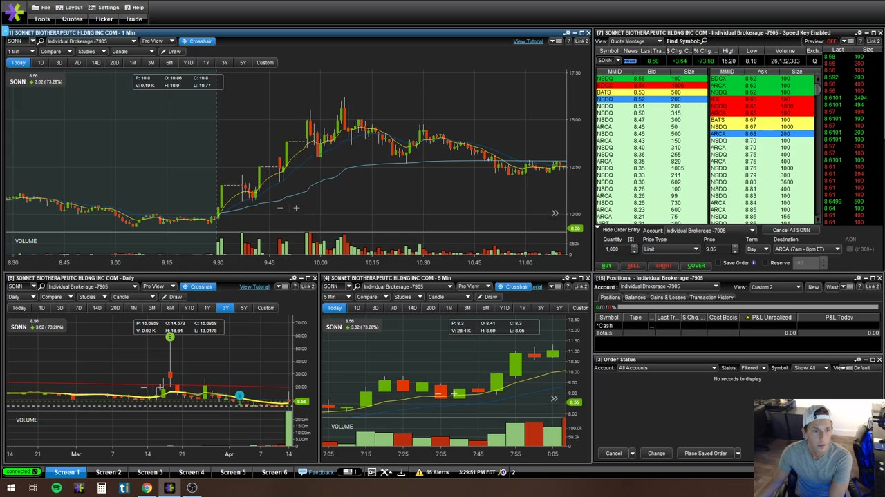

**图怎么看：**

- 在图中可以看到 SONNET BIOTHERAPEUTIC HLDNG INC 的股票价格走势，包括开盘价、收盘价、最高价和最低价。
- 成交量柱的高度反映对应周期内的总成交量；红绿着色通常跟随价格柱的涨跌规则，不能直接拆成两种方向的主动成交。
- 图表下方的时间与价格关系显示了市场的即时动态，帮助投资者理解市场情绪。
- 右侧的表格提供了实时的市场数据，包括最新价格、涨跌百分比、成交量等关键指标。

### 关键内容

- 七年前开始交易，最初通过亚马逊销售商品，后来转向股票交易。
- 经历了股票价格大幅波动，从中学习到风险管理的重要性。
- 初期亏损较大，但通过不断学习和实践，逐渐实现盈利。
- 保持耐心，避免盲目追涨杀跌。
- 使用简单的交易软件，如DOS进行交易。
- 强调了交易心态的重要性，避免过度焦虑和压力

### 分析与执行顺序

1. 回顾了自己七年前开始交易的经历，从亚马逊销售商品到转向股票交易。
2. 分享了第一次交易经历，买入Vend股票，最终亏损的经历。
3. 讲述了加入教育平台后，逐步学习交易技巧的过程。
4. 描述了如何通过五分钟图表和水平二图表进行交易分析。
5. 分享了如何通过模拟交易和实际交易相结合，逐步提高交易技能。
6. 强调了保持耐心和避免盲目追涨杀跌的重要性。
7. 介绍了使用的交易软件和平台，如E-Trade和CMEG

### 案例与细节

- 买入Vend股票，从86美分涨到12美元，最终亏损。
- 使用E-Trade和CMEG账户进行交易，主要在小账户上操作。
- 通过跟随教育者的学习，逐步掌握了交易技巧。
- 使用五分钟图表和水平二图表进行交易分析。
- 通过模拟交易和实际交易相结合，逐步提高交易技能。
- 保持耐心，避免盲目追涨杀跌，如在市场开盘时进行交易

### 风险与边界

- 录制于2020年，当时的市场环境和交易规则可能已发生变化。
- 使用的小账户和交易策略可能不再适用于当前市场。
- 交易软件和平台可能会有更新，需要适应新的变化。
- 市场波动性增加，需要更加谨慎地管理风险

### 复盘问题

- 你在交易过程中遇到了哪些挑战？
- 你是如何克服这些挑战的？
- 你认为哪些交易策略对你帮助最大？

---

## v0438：高频交易策略详解

> 日期：2020-04-27　·　时长：00:29:26

**本场重点：** 高频交易中使用热键进行快速买卖，以及如何设置止损和止盈。

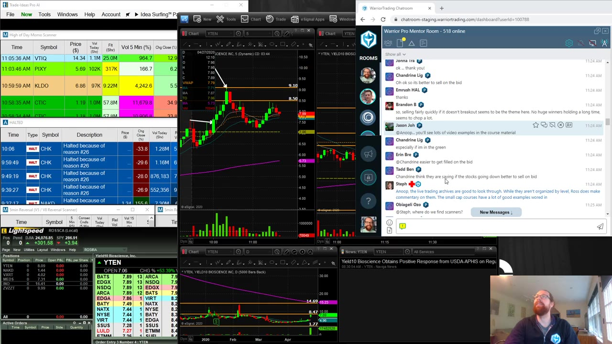

**图怎么看：**

- 实时交易界面显示了多个股票的实时数据，包括价格、成交量和图表分析。
- 图表上可以看到不同时间段的价格波动和成交量变化。
- 实时交易界面还显示了订单簿和成交记录，帮助投资者了解市场动态。
- 通过这些数据，投资者可以做出更明智的投资决策。

### 关键内容

- 讲师使用Shift Z热键以0.5美分的价格卖出股票，但有时会损失部分利润。
- 在YTEN这种高波动性股票上，使用热键进行快速买卖是常见的做法。
- 使用热键时，需要考虑市场波动和价格变动带来的滑点。
- 在模拟交易中，使用市场限价订单可以更好地控制买卖价格。
- 在实际交易中，使用热键进行快速买卖可以提高交易效率。
- 使用Thinkerswim软件进行交易时，需要手动计算买卖数量，以避免滑点带来的损失。
- 在实际交易中，使用CMEG平台进行交易时，可以设置热键以适应较小的交易规模。

### 分析与执行顺序

1. 讲师首先介绍了使用Shift Z热键进行快速卖出的操作方法。
2. 然后讲解了如何在模拟交易中使用市场限价订单进行买卖。
3. 接着讨论了如何在实际交易中使用热键进行快速买卖，并注意滑点问题。
4. 最后，讲师强调了在模拟交易中使用Thinkerswim软件进行交易时需要注意的问题。
5. 讲师还提到了如何在实际交易中使用CMEG平台进行交易时，设置热键以适应较小的交易规模。

### 案例与细节

- YTEN是一只高波动性的股票，使用Shift Z热键进行快速卖出时，有时会损失部分利润。
- 在模拟交易中，使用Thinkerswim软件进行交易时，需要手动计算买卖数量，以避免滑点带来的损失。
- 在实际交易中，使用CMEG平台进行交易时，可以设置热键以适应较小的交易规模，如每次交易1000股。

### 风险与边界

- 在模拟交易中，使用Thinkerswim软件进行交易时，需要注意软件设计初衷与实际高频交易需求之间的差异。
- 在实际交易中，使用热键进行快速买卖时，需要考虑市场波动和价格变动带来的滑点。
- 在实际交易中，使用热键进行快速买卖时，需要考虑市场波动和价格变动带来的滑点。如果市场波动较大，热键可能无法准确执行预期的买卖价格，导致滑点损失。此外，新手交易者可能会因为过度依赖热键而忽视市场实际情况，导致决策失误。

### 复盘问题

- 在模拟交易中，使用Thinkerswim软件进行交易时，需要注意哪些问题？
- 在实际交易中，使用热键进行快速买卖时，如何避免滑点带来的损失？
- 在实际交易中，使用CMEG平台进行交易时，如何设置热键以适应较小的交易规模？

---

## v0439：底反弹交易策略详解

> 日期：2020-04-28　·　时长：01:02:39

**本场重点：** 讲解底反弹交易策略，强调技术分析的重要性，指出底反弹与底反弹的区别。

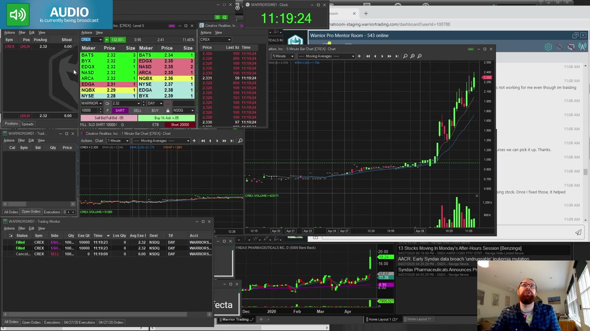

**图怎么看：**

- 画面中，可以看到详细的图表和实时市场数据，包括K线图、均线、成交量等，这些信息对于理解底反弹交易策略至关重要。
- 画面中的图表显示了多个股票的价格走势和成交量，有助于识别底部和反弹点。
- 实时市场数据如Level 2、Time & Sales等提供了即时的市场动态，帮助交易者做出快速决策。
- 通过对比不同股票的图表和数据，可以更好地理解底反弹交易策略的应用和效果。

### 关键内容

- 讲师提到底反弹交易需要良好的技术分析知识，特别是Level 2数据。
- 底反弹是指股票快速下跌后反弹，而底反弹则是指股票在低点附近形成支撑。
- 底反弹交易要求快速反应，而底反弹则相对更稳定。
- 使用热键进行交易可以提高速度，但需注意市场深度和价格波动。
- 底反弹交易的风险较高，需要谨慎操作。
- 底反弹交易策略适合短期交易者，而非长期投资者。
- 使用Thinker Swim软件可以设置热键，但需注意市场流动性。
- 底反弹交易策略需要结合技术分析和市场情绪进行决策

### 分析与执行顺序

1. 讲师首先回答了关于底反弹交易的问题，然后解释了底反弹交易的基本概念。
2. 接着，讲师详细介绍了底反弹交易的具体操作方法，包括如何设置止损位。
3. 讲师还提到了使用热键进行交易的优势和注意事项。
4. 最后，讲师强调了底反弹交易策略的风险，并给出了具体的应对措施。
5. 整个过程中，讲师多次强调了技术分析的重要性，特别是Level 2数据的作用。
6. 讲师还通过实际案例展示了如何识别底反弹交易机会，以及如何进行操作
7. 讲师提醒学员要关注市场流动性，避免因市场深度不足导致交易失败

### 案例与细节

- 讲师举例说明了底反弹交易的一个具体案例，即SNDX股票的交易过程。
- 讲师指出，当SNDX股票从17美元快速跌至1565美元时，这是一个底反弹的机会。
- 讲师通过实际操作展示了如何使用热键进行交易，以及如何设置止损位。
- 讲师还提到了底反弹交易的一个失败案例，即某股票在突破关键价位后迅速回落。
- 讲师通过另一个案例说明了如何识别底反弹交易机会，即某股票在低点附近形成支撑。
- 讲师还提到了底反弹交易的一个成功案例，即某股票在快速下跌后迅速反弹

### 风险与边界

- 底反弹交易策略的风险较高，需要谨慎操作。
- 底反弹交易策略的成功依赖于对市场流动性的准确判断。
- 底反弹交易策略需要实时监控，及时调整止损位。
- 底反弹交易策略的成功率受市场情绪影响较大。
- 底反弹交易策略的成功率受市场流动性影响较大
- 底反弹交易策略的成功率受市场深度影响较大

### 复盘问题

- 底反弹交易策略的关键点是什么？
- 底反弹交易策略的操作步骤有哪些？
- 底反弹交易策略的风险有哪些？
- 底反弹交易策略的成功率受哪些因素影响？
- 底反弹交易策略需要哪些技术支持？

---

## v0440：交易策略与风险管理

> 日期：2020-05-05　·　时长：00:53:12

**本场重点：** 当前市场条件提供了更多机会，但需要谨慎管理风险。

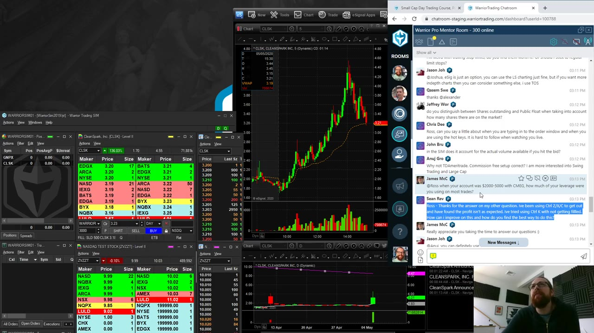

**图怎么看：**

- 实时交易界面展示了多个股票的报价、成交量和订单流，帮助学员理解市场动态。
- 通过Level 2窗口，学员可以查看每个股票的买卖盘情况，了解市场的深度。
- 时间与销售窗口显示了实时的交易数据，包括价格变动和成交量变化，有助于分析市场趋势。
- 表格部分展示了不同股票的报价和成交量，学员可以通过这些数据进行技术分析和决策制定。

### 关键内容

- 当前市场条件提供了更多的交易机会，因为波动性增加。
- 使用热键进行快速交易时需要注意风险控制。
- 使用止损单可以有效管理风险，但需根据股票特性调整。
- 在模拟器中练习交易策略，可以更好地理解市场动态。
- 使用不同交易平台时要注意佣金和滑点的影响。
- 保持小仓位交易，避免过早承担高风险。
- 利用技术分析工具识别市场趋势和模式。
- 使用热键进行快速交易时，注意市场波动性。
- 在模拟器中测试交易策略，确保实际交易时能够应对市场变化

### 分析与执行顺序

1. 记录当前市场条件的变化，包括更高的波动性和更长的交易时间。
2. 使用热键进行快速交易，但要确保了解市场情况，避免冲动交易。
3. 设置合理的止损单，以控制潜在的损失。
4. 在模拟器中测试交易策略，确保能够适应市场变化。
5. 使用技术分析工具识别市场趋势和模式，制定交易计划。
6. 在实际交易前，在模拟器中多次练习，以提高交易技能。
7. 根据市场情况调整交易策略，确保风险管理得当

### 案例与细节

- CLSK在下午的交易中表现出较大的波动，提供了交易机会。
- 使用热键进行快速交易时，有时会遇到市场突然下跌的情况，如CLSK从259跌至242。
- 使用热键买入时，需要密切关注市场走势，避免被市场波动影响。
- 在模拟器中测试交易策略时，可以观察到不同股票的波动性差异，如CLSK和GMPX。
- 使用技术分析工具识别市场趋势，如通过观察蜡烛图和移动平均线来判断支撑位和阻力位

### 风险与边界

- 市场条件变化可能导致交易策略失效，需要持续关注市场动态。
- 使用热键进行快速交易时，可能会出现滑点，影响交易结果。
- 模拟器中的数据可能与实际市场数据存在差异，需要定期核对。
- 市场条件和监管环境的变化可能会影响交易策略的有效性，需要及时更新知识。
- 使用技术分析工具时，需要结合实际情况灵活应用，避免机械操作

### 复盘问题

- 当前市场条件的变化如何影响你的交易策略？
- 在使用热键进行快速交易时，如何确保交易决策的合理性？
- 如何在模拟器中测试交易策略，以提高实际交易中的成功率？

---

## v0441：股票交易与风险管理

> 日期：2020-05-11　·　时长：00:54:38

**本场重点：** 1. 如何使用杠杆进行交易；2. 调整交易策略以适应市场变化；3. 使用不同交易平台进行交易

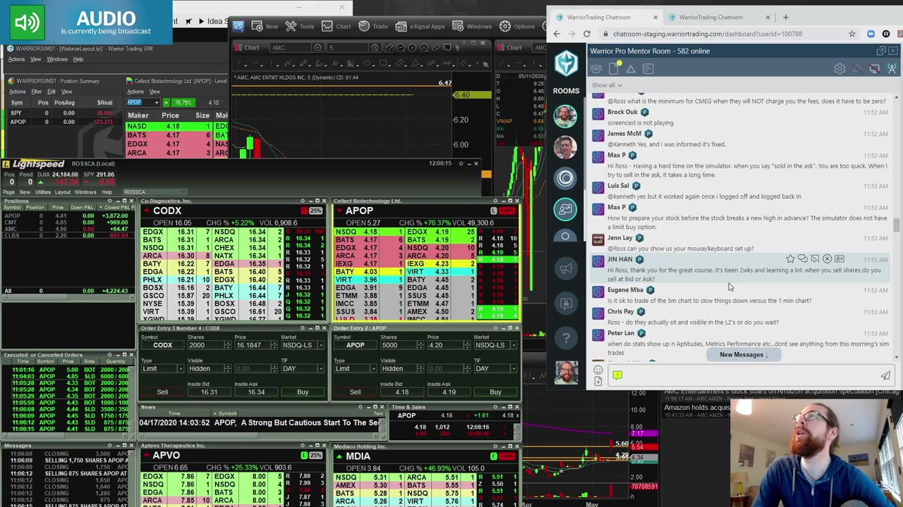

**图怎么看：**

- 实时交易界面展示了多个股票的Level 2信息，包括Maker、Price、Size等详细数据。
- 图表部分显示了不同股票的价格走势，如红色和绿色柱状图表示成交量。
- 时间与销售数据提供了即时的市场动态，帮助投资者做出决策。
- 通过这些信息，投资者可以更好地理解市场的波动性和趋势。

### 关键内容

- 讲师解释了杠杆的作用，即使某些股票难以借入，也可以使用杠杆。
- CMEG平台对股票价格超过3美元时可以使用杠杆，账户余额超过500美元时可以使用杠杆。
- 使用Shift 1快捷键可以在快速下单时减少滑点。
- 交易者可以根据自己的情况选择是否采用标记式会计。
- 交易者可以在模拟器中设置热键来快速下单，但实际交易中需要考虑滑点。
- 交易者可以通过关注热点股票来提高交易成功率。
- 交易者需要根据市场情况调整交易策略，如在市场冷淡时减少交易规模。
- 交易者可以使用LightSpeed平台进行交易，但需要注意其较高的费用。

### 分析与执行顺序

1. 讲师首先回答了关于杠杆的问题，解释了杠杆的使用方法。
2. 然后讲师介绍了如何在模拟器中设置热键进行快速下单。
3. 接着讲师强调了交易者需要根据市场情况调整交易策略。
4. 最后讲师提到了使用LightSpeed平台进行交易的优势和注意事项。
5. 在整个过程中，讲师多次强调了交易者的自主权和灵活性。

### 案例与细节

- 讲师提到，如果股票价格超过3美元，可以在CMEG平台上使用杠杆。
- 讲师举例说明，如果账户余额为380美元，可以进行交易但不能使用杠杆。
- 讲师解释了如何在模拟器中设置热键，例如使用Shift 1进行快速下单。
- 讲师提到，如果市场冷淡，交易者应该减少交易规模以降低风险。
- 讲师举例说明，如果某股票的成交量为4800万股，可以使用杠杆进行交易。

### 风险与边界

- 由于录制于2020年，部分信息可能不再适用，如交易平台的具体费用。
- 交易者需要根据当前市场情况调整交易策略，否则可能会面临更大的风险。
- 交易者需要了解不同交易平台的特点，选择最适合自己的平台进行交易。
- 交易者需要关注市场动态，及时调整交易策略以应对市场变化。

### 复盘问题

- 讲师提到的杠杆使用规则是否适用于当前市场？
- 交易者如何根据市场情况调整交易策略？
- 交易者在选择交易平台时应考虑哪些因素？

---

## v0442：股票交易中的做空策略

> 日期：2020-05-12　·　时长：00:44:58

**本场重点：** 1. 做空受限于股票借入情况；2. 考虑使用不同交易平台以提高灵活性；3. 需要关注市场新闻和股票价格波动。

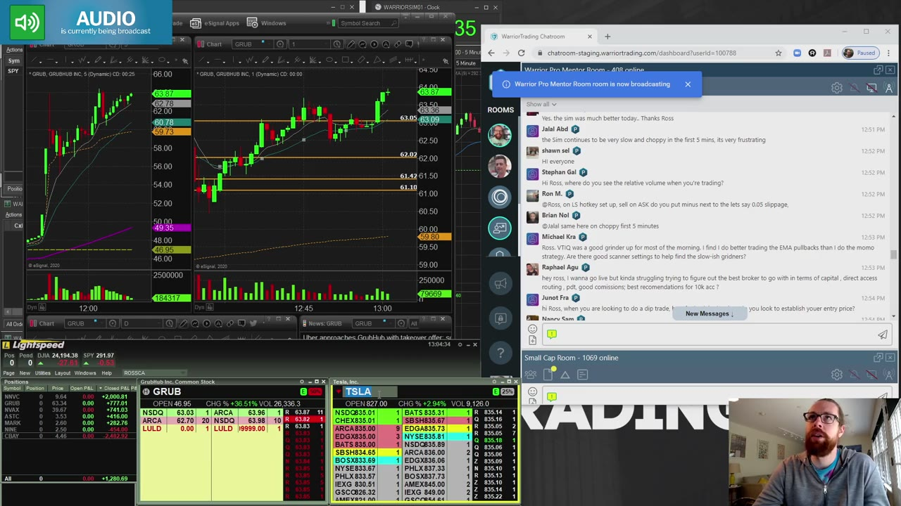

**图怎么看：**

- 画面中，可以看到多个股票的K线图，显示了价格波动和成交量。
- 水平线表示均线，帮助识别趋势。
- 成交量柱显示了买卖活动，有助于理解市场的活跃程度。
- 图表下方的表格提供了实时的股票信息，包括价格、成交量等数据。

### 关键内容

- 讲师提到，由于部分股票缺乏借入股份，他关闭了一个专门用于做空的账户。
- 讲师解释了如何识别隐藏卖家，通过观察大量买单但股价不动的情况。
- 使用美元/成交量图表可能有助于识别市场趋势，但需要谨慎使用。
- 在低成交量情况下，隐藏卖家的存在可能会影响交易决策。
- 做空时，需要等待买家出现，而买入时则需要等待卖家出现。
- 讲师强调了在模拟交易中识别股票过度扩展的重要性，以及可能面临的持续风险。
- 在市场新闻发布前，股票可能会被暂停交易，这需要交易者密切关注市场动态

### 分析与执行顺序

1. 讲师首先回答了关于做空的问题，解释了由于缺乏借入股份，他关闭了一个专门用于做空的账户。
2. 接着，讲师讨论了如何识别隐藏卖家，通过观察大量买单但股价不动的情况。
3. 然后，讲师解释了如何设置热键以提高交易效率，包括买卖指令。
4. 最后，讲师强调了在模拟交易中识别股票过度扩展的重要性，以及可能面临的持续风险。
5. 在整个过程中，讲师还提到了如何使用不同的交易平台来提高灵活性，包括CMEG和Trade Zero等。
6. 讲师还分享了如何在模拟交易中识别股票过度扩展的重要性，以及可能面临的持续风险。
7. 讲师还强调了在市场新闻发布前，股票可能会被暂停交易，这需要交易者密切关注市场动态

### 案例与细节

- NVACs和Grub在低成交量情况下出现了大额卖家，这影响了交易决策。
- 讲师提到，如果股票的相对成交量高于平均水平，这可能是一个卖出信号。
- 在模拟交易中，交易执行后会显示红色数字表示卖出，绿色数字表示买入。
- 讲师分享了如何设置热键以提高交易效率，包括买卖指令。

### 风险与边界

- 由于市场新闻的影响，股票可能会被暂停交易，这增加了交易的不确定性。
- 在低成交量情况下，隐藏卖家的存在可能会影响交易决策，但需要谨慎处理。
- 讲师提到的某些交易平台可能不再适用，因为录制年代已过。
- 在模拟交易中，无法更改未实现利润，这影响了交易策略的选择。

### 复盘问题

- 在低成交量情况下，如何识别隐藏卖家？
- 如何设置热键以提高交易效率？
- 在模拟交易中，如何识别股票过度扩展？
- 在市场新闻发布前，如何应对股票暂停交易的风险？
- 讲师提到的某些交易平台是否仍然适用？

---

## v0443：交易者的心理与策略选择

> 日期：2020-07-08　·　时长：01:11:01

**本场重点：** 交易者应从核心策略开始，逐步扩展，并保持交易计划的一致性。同时，内心交易者的旅程不仅关于策略，更关于个人与规则的互动。

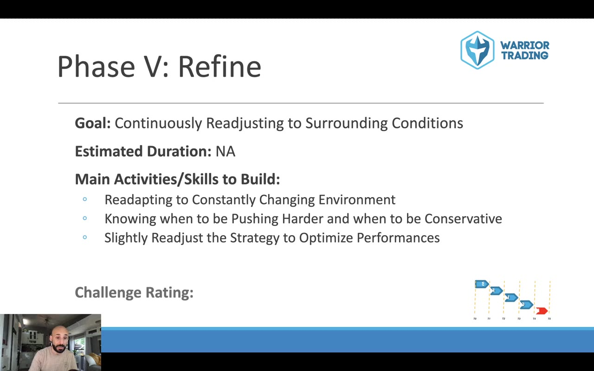

**图怎么看：**

- 目标：不断适应周围环境的变化。
- 主要活动/技能：适应不断变化的环境，知道何时努力推动，何时保守。
- 挑战评级：略调整策略以优化表现。
- 描述了在交易过程中需要不断适应市场变化，以及如何根据市场情况调整交易策略。

### 关键内容

- 交易生涯分为六个阶段，每个阶段都有明确的目标和所需技能。
- 交易者通常会选择趋势、动量或反转三种主要交易方法之一，选择适合自己的方法至关重要。
- 动量交易适合快速市场，需要速度和耐心；趋势交易适合大波动，需要耐心和计划；反转交易适合极端价格反弹，需要反向思维和准确性。
- 成功交易需要自律和耐心，不同方法需要不同的技能。
- 追求短期盈利目标会破坏交易过程，导致选择质量不足的交易机会。
- 拥有明确的交易身份是市场奖励的关键，这需要自我认同和长期成功。
- 讲师分享了自己从突破交易转向回调交易的经历，强调自我意识的重要性。
- 内心交易者的旅程不仅关于策略，更关于个人与规则的互动。
- 对学习过程的热情是关键，不应急于求成。
- 建立支持系统，避免负面关系，以提高自尊心。
- 交易者应选择适合自己的交易方法，如动量交易适合快速市场，需要速度和耐心；趋势交易适合大波动，需要耐心和计划。
- 内心交易者的旅程不仅关于策略，更关于个人与规则的互动，这需要自我认同和长期成功。
- 成功交易需要自律和耐心，不同方法需要不同的技能，选择适合自己的方法并坚持下去是关键。
- 追求短期盈利目标会破坏交易过程，导致选择质量不足的交易机会，因此应专注于长期目标。
- 拥有明确的交易身份是市场奖励的关键，这需要自我认同和长期成功，通过设定适合自己的目标来实现

### 分析与执行顺序

1. 确定交易生涯的六个阶段，并设定相应目标。
2. 选择适合自己的交易方法，如趋势、动量或反转。
3. 从一个核心策略开始，逐步扩展，保持交易计划的一致性。
4. 设定健康的交易习惯，相信自己是那个交易者。
5. 设定适合自己的目标，对自己的结果负责。
6. 持续学习和享受过程，重新开始并继续前进。
7. 从每次交易中学习，无论市场表现如何。

### 案例与细节

- 动量交易适合快速市场，需要速度和耐心。
- 趋势交易适合大波动，需要耐心和计划。
- 讲师分享了自己从突破交易转向回调交易的经历。
- 内心交易者为最佳表达个人交易自我的方式，强调每个人都有成功的潜力。
- 讲师分享了自己在失败时仍感到快乐的经历，强调过程中的喜悦感。
- 讲师分享了自己从突破交易转向回调交易的经历，强调自我意识的重要性，说明了个人经历对选择交易方法的影响。
- 内心交易者为最佳表达个人交易自我的方式，强调每个人都有成功的潜力，说明了个性化交易策略的重要性。
- 讲师分享了自己在失败时仍感到快乐的经历，强调过程中的喜悦感，说明了积极心态对交易过程的影响

### 风险与边界

- 市场条件和监管环境的变化可能会影响交易策略的有效性。
- 讲师的观点基于2020年的市场条件，当前市场情况可能有所不同。
- 交易者需要根据当前市场情况进行调整，而不仅仅是依赖历史经验。
- 交易者应关注最新的市场动态和变化，以适应不断变化的市场环境。
- 市场条件和监管环境的变化可能会影响交易策略的有效性，交易者需要关注最新的市场动态和变化。
- 讲师的观点基于2020年的市场条件，当前市场情况可能有所不同，交易者应根据当前市场情况进行调整。
- 交易者应关注最新的市场动态和变化，以适应不断变化的市场环境，否则可能会导致策略失效

### 复盘问题

- 交易者应如何选择适合自己的交易方法？
- 如何从一个核心策略开始，逐步扩展交易计划？
- 如何保持交易计划的一致性？
- 如何设定健康的交易习惯和适合自己的目标？
- 如何从每次交易中学习，无论市场表现如何？

---

## v0444：Curling Chart Pattern 交易策略

> 日期：2020-07-28　·　时长：00:39:19

**本场重点：** 识别并利用Curling Chart Pattern进行交易，适用于任何时间段，但需要关注成交量和支撑阻力位。

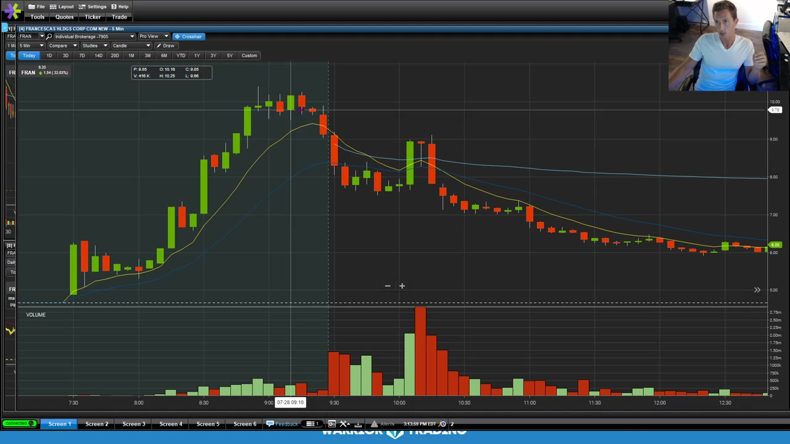

**图怎么看：**

- 在Francesca's Holdings Corp的图表中，可以看到一根红色的蜡烛线突破了黄色的移动平均线。
- 这表明市场可能正在经历一个上升趋势。
- 成交量柱的高度反映对应周期内的总成交量；红绿着色通常跟随价格柱的涨跌规则，不能直接拆成两种方向的主动成交。
- 请注意，这些图表仅用于教学目的，不应被视为投资建议。

### 关键内容

- Curling Chart Pattern可以在任何时间段出现，只要股票有新闻或大波动。
- 识别Curling Chart Pattern的关键是找到支撑和阻力位，以及成交量的变化。
- Curling Chart Pattern通常发生在股票开盘后不久，但也可以在其他时间出现。
- 确认Curling Chart Pattern需要观察价格突破支撑或阻力位后的成交量变化。
- 交易者可以利用Curling Chart Pattern进行长线交易，但需要谨慎设置止损。
- Curling Chart Pattern的有效性依赖于市场反应和成交量，需要密切关注。
- 交易者可以通过观察五分钟图表来确认Curling Chart Pattern的存在。
- Curling Chart Pattern通常伴随着明显的成交量增加，这是确认信号之一。
- 交易者需要区分Curling Chart Pattern与其他图表模式，如Doji。
- Curling Chart Pattern的成功依赖于市场情绪和成交量，需要耐心等待确认信号

### 分析与执行顺序

1. 首先，观察股票是否有新闻或大波动，这有助于识别潜在的Curling Chart Pattern。
2. 其次，使用五分钟图表来确认Curling Chart Pattern的存在，重点关注支撑和阻力位的变化。
3. 然后，观察成交量的变化，确认价格突破支撑或阻力位后的成交量是否增加。
4. 接着，设置止损和目标价，利用Curling Chart Pattern进行长线交易。
5. 最后，密切关注市场反应，确保Curling Chart Pattern的有效性，避免过早平仓或追涨杀跌。
6. 在整个过程中，保持耐心，等待确认信号，避免盲目跟风。
7. 交易者需要定期更新图表，以确保Curling Chart Pattern的有效性

### 案例与细节

- JFIN：股票开盘后迅速下跌，随后反弹并形成Curling Chart Pattern，成交量显著增加。
- SYPR：股票在开盘后迅速上涨，随后回调并形成Curling Chart Pattern，成交量同样显著增加。
- MNOB：股票在开盘后大幅上涨，但在预市场时段出现回调，随后形成Curling Chart Pattern，成交量增加。
- URBN：股票在开盘后大幅上涨，随后回调并形成Curling Chart Pattern，成交量显著增加。
- WHLM：股票在开盘后迅速下跌，随后反弹并形成Curling Chart Pattern，成交量显著增加。

### 风险与边界

- Curling Chart Pattern的有效性依赖于市场情绪和成交量，如果市场突然转向，可能会导致亏损。
- 交易者需要密切关注市场动态，避免在市场情绪不稳定时进行交易。
- Curling Chart Pattern的成功率受市场波动的影响，录制年代为2020年，当时的市场环境可能与现在有所不同。
- 交易者需要设置合理的止损点，避免因市场波动而频繁止损。
- Curling Chart Pattern的成功依赖于成交量的增加，如果成交量不足，可能会导致信号失效。

### 复盘问题

- 如何识别Curling Chart Pattern中的支撑和阻力位？
- 在什么情况下可以确认Curling Chart Pattern的存在？
- 如何设置止损和目标价以利用Curling Chart Pattern进行交易？
- 在交易过程中，如何判断市场情绪是否稳定？
- 如何区分Curling Chart Pattern与其他图表模式？

---

## v0445：股票交易回顾与问答

> 日期：2020-08-14　·　时长：00:38:19

**本场重点：** 今天交易总结及问答环节，重点在于如何利用市场波动获利并控制风险。

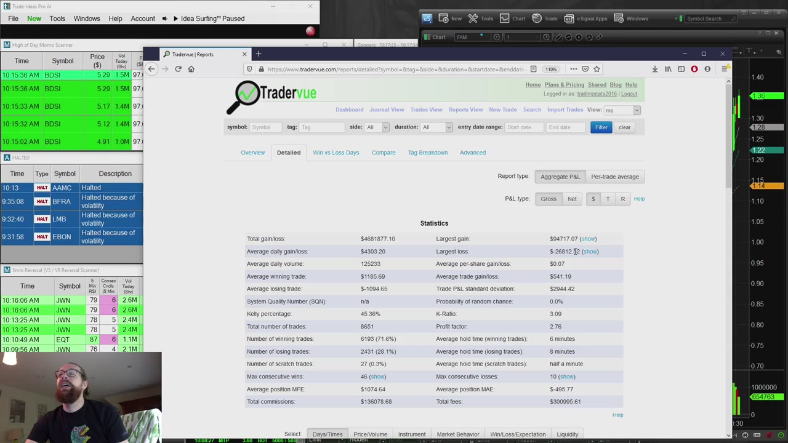

**图怎么看：**

- 整体界面显示了多个交易窗口和实时数据
- 实际可见的ticker包括AMZN, TSLA等
- 画面信息对应本场主题，展示了交易策略和市场分析
- 这张截图不能单独证明如何利用市场波动获利并控制风险

### 关键内容

- 讲师总结了今天交易的盈利情况，共赚取22,245美元。
- MTP股票表现突出，涨幅达43%，但交易者在高点卖出，仅获得部分利润。
- 交易者通过观察市场波动和支撑位来决定何时买入或卖出。
- 交易者强调了设置止损的重要性，以避免市场突然反转带来的损失。
- 交易者提到使用期权进行交易可以增加灵活性，但需要更高的知识门槛。
- 交易者表示，即使在亏损的情况下，也会选择捐赠给非营利组织。
- 交易者分享了使用Level 2图表观察市场流动性的方法。
- 交易者指出，使用TD Ameritrade可以方便地在手机上监控交易。
- 交易者强调了隐藏订单的重要性，以避免暴露自己的交易规模。
- 交易者提到，使用10秒图表可以帮助识别市场的早期反转信号。

### 分析与执行顺序

1. 讲师首先回顾了今天的交易情况，包括盈利和亏损。
2. 然后，讲师详细解释了每个交易的具体操作和决策过程。
3. 接着，讲师回答了观众关于交易策略和市场观察的问题。
4. 最后，讲师总结了今天的交易经验，并预告了下周的内容。
5. 在整个过程中，讲师多次强调了风险管理的重要性。

### 案例与细节

- Craig股票在开盘后迅速上涨，但交易者在高点卖出，仅获得部分利润。
- MTP股票在开盘后迅速上涨，但交易者在高点卖出，仅获得部分利润。
- 交易者在MTP股票的第一次一分钟蜡烛线突破后买入，但随后被止损出场。
- 交易者在FAMI股票的高点卖出，但未能保持盈利。
- 交易者在Tesla股票的1800点卖权上进行了交易，但市场并未达到预期水平。

### 风险与边界

- 交易者提到，如果市场突然反转，可能会导致较大的亏损。
- 交易者指出，使用Level 2图表需要一定的技术知识。
- 交易者强调，使用TD Ameritrade需要较高的资金门槛。
- 交易者提到，使用10秒图表可能无法准确预测市场的长期走势。

### 复盘问题

- 今天交易的主要盈利来源是什么？
- 交易者是如何判断何时设置止损的？
- 交易者在哪些情况下使用了隐藏订单？
- 交易者是如何利用Level 2图表来观察市场流动性的？

---

## v0446：多时间框架交易策略

> 日期：2020-08-26　·　时长：01:06:37

**本场重点：** 讨论如何在不同时间框架之间寻找一致性以决定是否进行交易。

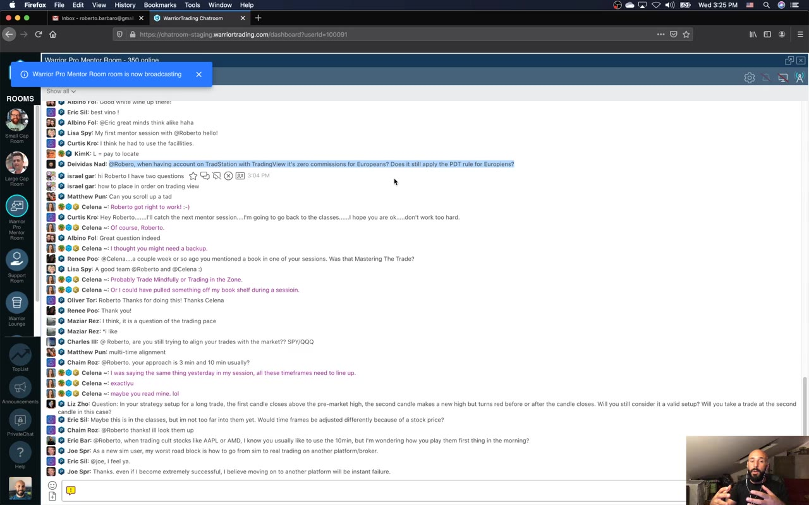

**图怎么看：**

- 在AAPL的图表中，可以看到一个明显的上升趋势，红色蜡烛表示价格上涨，绿色蜡烛表示价格下跌。
- 成交量柱的高度反映对应周期内的总成交量；红绿着色通常跟随价格柱的涨跌规则，不能直接拆成两种方向的主动成交。
- 水平线标记了重要的支撑和阻力位，帮助投资者判断当前市场情绪。
- 图表右侧的时间轴显示了交易活动的时间分布，有助于分析市场的波动性。

### 关键内容

- Roberto 提到自己是趋势交易者，主要使用 3 分钟和 10 分钟的时间框架。
- 当多个时间框架出现一致信号时，才会考虑进行交易。
- 如果某个时间框架发出卖出信号而另一个时间框架未确认，不会进行交易。
- 使用 Trading View 的自动斐波那契工具来辅助交易决策。
- 强调心理因素在实际交易中的重要性，尤其是从模拟交易转向真实交易时。
- 分享了如何设置买入和卖出订单的方法。
- 提到使用 Opera 浏览器进行交易，因为它加载速度快且占用内存少。
- 讨论了如何根据风险设定交易规模，而不是单纯依赖股票价格。
- 解释了 LightSpeed 和 Trade Station 的区别，特别是关于 T 字母标志的意义。
- 强调了使用 Trading View 进行交易的优势，包括纸交易功能

### 分析与执行顺序

1. Roberto 首先介绍了自己作为趋势交易者的交易风格。
2. 接着解释了如何在不同时间框架之间寻找一致性信号。
3. 通过具体的例子展示了如何在不同时间框架之间进行比较。
4. 分享了如何使用 Trading View 的自动斐波那契工具来辅助交易决策。
5. 强调了心理因素在实际交易中的重要性，尤其是从模拟交易转向真实交易时。
6. 最后，提供了如何设置买入和卖出订单的具体方法。
7. 解释了使用 Opera 浏览器进行交易的原因

### 案例与细节

- 特斯拉 (TSLA) 的一个具体例子，展示了如何在 3 分钟和 10 分钟的时间框架之间寻找一致性。
- 使用 Trading View 的自动斐波那契工具来确定买卖点位的一个具体例子。
- 使用 Trading View 进行纸交易的一个具体例子，展示了如何熟悉下单过程。
- 使用 Trading View 的自动斐波那契工具来辅助交易决策的一个具体例子。
- 使用 Trading View 进行交易的一个具体例子，展示了如何设置买入和卖出订单

### 风险与边界

- 录制于 2020 年，部分信息可能已发生变化，如交易平台的功能。
- 心理因素在实际交易中的重要性可能会因人而异，需要根据个人情况调整。
- 使用 Trading View 的自动斐波那契工具可能需要适应期，因为每个人的理解和使用方式不同。
- 从模拟交易转向真实交易时，需要克服心理障碍，这可能因人而异。

### 复盘问题

- 如何在不同时间框架之间寻找一致性信号？
- 使用 Trading View 的自动斐波那契工具时需要注意哪些事项？
- 从模拟交易转向真实交易时，有哪些心理障碍需要克服？

---

## v0447：新手常见问题解答

> 日期：2020-09-08　·　时长：00:52:53

**本场重点：** 今天主要回答了新手在交易中遇到的问题，包括如何选择股票、设置止损和盈利目标等。

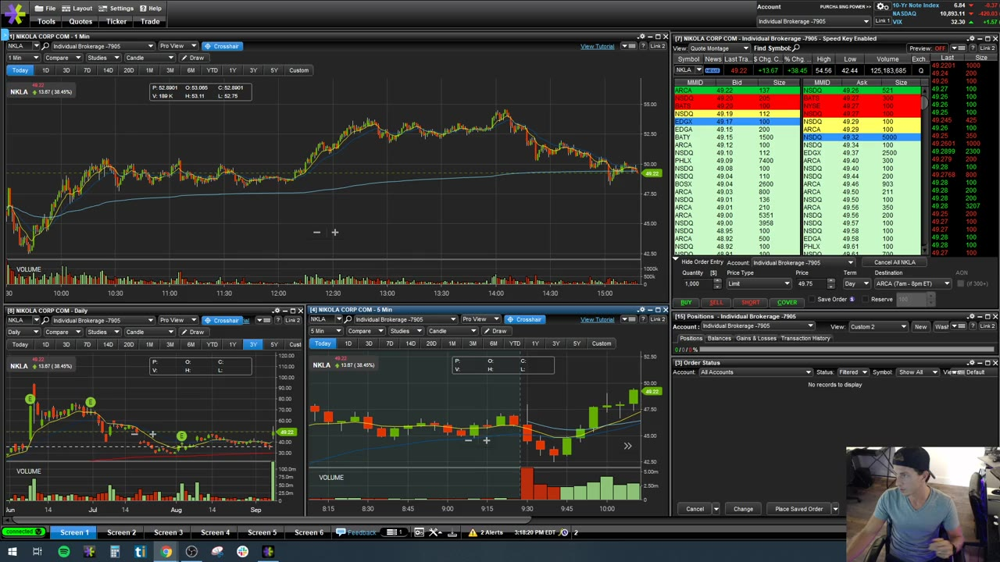

**图怎么看：**

- 在1110秒时，显示了Nikola Corp（NKLA）的每日和五分钟K线图。
- 每日K线图显示了股票价格的波动情况，而五分钟K线图则提供了更详细的即时市场活动。
- 成交量柱的高度反映对应周期内的总成交量；红绿着色通常跟随价格柱的涨跌规则，不能直接拆成两种方向的主动成交。
- 图表右侧的表格列出了多个股票代码及其当前价格、涨跌幅度和成交量等详细信息。

### 关键内容

- 讲师提到使用E-Trade Pro作为交易平台，因为它提供了实时新闻扫描功能。
- 对于止损和盈利目标，讲师表示自己不设置这些目标，而是专注于建立坚实的位置。
- 讲师推荐新手通过多次重复课程来提高自己的交易技能。
- 对于低成交量股票，讲师表示不会交易，除非成交量增加到一定水平。
- 讲师提到使用DOS平台进行交易，因为它简单且有效。
- 对于新手来说，讲师建议先关注五分钟图表模式，因为它们更容易理解和操作。
- 讲师分享了如何识别即将出现重大新闻的股票，这需要对市场有深入的理解。
- 讲师强调了交易策略的重要性，并表示自己的策略与Ross相似，但有自己的小改动。
- 对于新手来说，讲师建议先从小规模交易开始，逐渐适应市场。
- 讲师提到使用Level Two来监控市场动态，但表示很多订单会迅速成交

### 分析与执行顺序

1. 讲师首先介绍了自己使用的交易平台E-Trade Pro，并解释了它的优势。
2. 接着，讲师回答了关于如何选择股票的问题，强调了新闻和图表分析的重要性。
3. 然后，讲师详细解释了如何设置止损和盈利目标，以及为什么不设置这些目标。
4. 接着，讲师回答了关于交易量和股票选择的问题，强调了低成交量股票的风险。
5. 最后，讲师分享了自己的交易经验，包括使用DOS平台和Level Two监控市场动态的方法。
6. 在整个过程中，讲师还提到了新手应该多重复学习课程，以提高自己的交易技能。

### 案例与细节

- KSPN股票从$10涨到$15，讲师通过快速研究发现它曾经是TWNC，后来改名。
- 当股票出现大缺口时，讲师会观察开盘后的波动情况，以决定是否入场。
- 当股票价格达到预期的盈利目标时，讲师会卖出一半，让另一半继续持有。
- 当股票出现大卖家时，讲师不会立即卖出，而是观察市场反应。
- 当股票成交量增加到一定水平时，讲师会考虑交易，否则会选择观望。

### 风险与边界

- 由于录制于2020年，部分信息可能不再适用，如特定交易平台的功能。
- 讲师提到的某些策略可能需要根据当前市场情况进行调整。
- 对于新手来说，直接使用较大规模的交易可能会带来较大的风险。
- 使用Level Two监控市场动态可能会受到市场流动性的影响，导致订单迅速成交。

### 复盘问题

- 讲师提到的交易策略有哪些关键点？
- 如何识别即将出现重大新闻的股票？
- 对于新手来说，如何逐步提高自己的交易技能？
- 使用Level Two监控市场动态时需要注意哪些问题？
- 如何设置止损和盈利目标？

---

## v0448：如何管理亏损交易

> 日期：2020-09-22　·　时长：00:41:19

**本场重点：** 本课程讲解如何在市场条件不佳时正确止损，避免长期亏损。

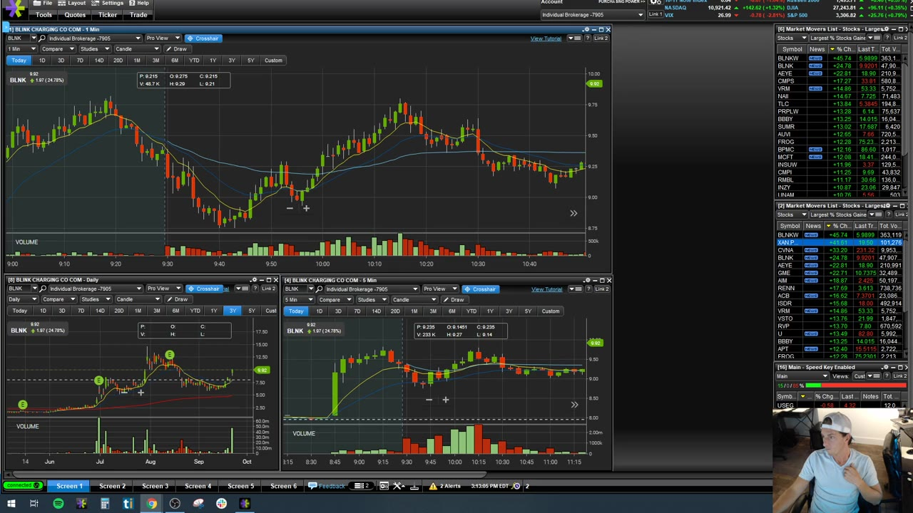

**图怎么看：**

- 本课程讲解如何在市场条件不佳时正确止损，避免长期亏损。
- 通过分析图表和市场数据，学习如何识别并应对不利的市场环境。
- 掌握正确的止损策略，以减少潜在的损失。
- 理解何时应退出交易，以及如何在市场波动中保持冷静决策。

### 关键内容

- 讲师通过BLNK股票的实例展示了如何识别假突破并及时止损。
- 当股票假突破两次后，应放弃该股票，避免连续亏损。
- 止损应在关键水平被拒绝时立即执行，以避免更大的损失。
- 使用紧停单可以有效管理亏损交易，避免恐慌性卖出。
- 在市场条件不佳时，应更加谨慎地选择交易机会。
- 使用热键进行快速交易可以提高效率，减少错误。
- 在市场波动较大时，应调整止损幅度以适应市场变化。
- 避免频繁追逐完美交易，而应关注日常交易机会。
- 使用图表分析工具可以帮助识别关键支撑和阻力位。
- 在市场冷却期，应更加谨慎地选择交易标的

### 分析与执行顺序

1. 讲师首先通过BLNK股票的实例展示了如何识别假突破并及时止损。
2. 然后讲解了如何在市场条件不佳时放弃亏损股票，避免连续亏损。
3. 接着介绍了如何在关键水平被拒绝时立即止损，以避免更大的损失。
4. 最后，讲师强调了使用紧停单的重要性，以避免恐慌性卖出。
5. 讲师还演示了如何使用热键进行快速交易，以提高效率。
6. 讲师提醒学员，在市场波动较大时，应调整止损幅度以适应市场变化。
7. 讲师还强调了在市场冷却期，应更加谨慎地选择交易标的，以避免更大损失

### 案例与细节

- BLNK股票在预市前表现强劲，但随后出现假突破，导致多次止损。
- 当BLNK股票在关键水平被拒绝时，讲师立即止损，避免了更大的损失。
- 讲师通过设置紧停单，成功避免了在假突破后的恐慌性卖出。
- 在市场冷却期，BLNK股票的表现不佳，讲师放弃了该股票，避免了连续亏损。
- 讲师使用热键进行快速交易，成功抓住了BLNK股票的短暂上涨机会

### 风险与边界

- 在市场条件不佳时，假突破可能导致频繁止损，增加交易成本。
- 过度依赖紧停单可能导致错过潜在盈利机会。
- 市场冷却期选择不当标的可能导致更大损失。
- 使用热键进行快速交易可能因误操作导致错误下单。
- 录制年代限制为2020年，市场条件和规则可能已发生变化

### 复盘问题

- 在遇到假突破时，如何确定是否应该放弃该股票？
- 如何在市场冷却期选择合适的交易标的？
- 使用紧停单时，如何平衡止损和错过潜在盈利机会的风险？

---

## v0449：交易心理学

> 日期：2020-10-20　·　时长：00:41:08

**本场重点：** 交易中常见的心理问题包括恐惧、追涨杀跌等，需要通过模拟交易和实际操作来克服。

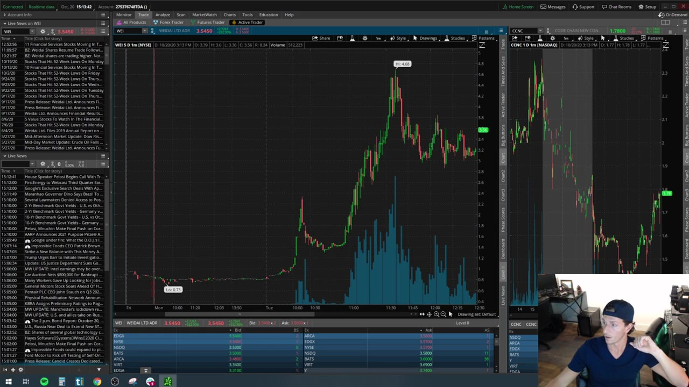

**图怎么看：**

- 图中显示了多个股票市场的实时数据，包括股价、成交量和时间序列图表。
- 可以看到不同股票的K线图，其中红色和绿色柱状图代表不同的交易方向。
- 水平轴显示了时间，垂直轴显示了价格，图表下方有实时的订单流和成交量。
- 右侧的小窗口显示了其他股票的图表，帮助交易者进行多维度分析。

### 关键内容

- 恐惧和追涨杀跌是交易中常见的心理问题，会导致错误决策。
- 交易者应该等待正确的设置，而不是盲目跟随市场。
- 交易者应该学会在大亏损后重建信心，通过连续盈利来恢复。
- 从模拟交易过渡到真实交易时，要保持谨慎，避免过度交易。
- 交易者应该关注自己的交易表现，而不是其他人的表现。
- 交易者应该设定合理的止损点，避免被市场情绪影响。
- 交易者应该通过锻炼和实际操作来提高自己的交易技能。
- 交易者应该保持冷静和耐心，避免冲动交易。

### 分析与执行顺序

1. 讲师首先介绍了交易心理学的重要性，指出这是交易中常见的问题。
2. 然后，讲师详细讲解了恐惧和追涨杀跌的心理问题，并提供了具体的案例。
3. 接着，讲师强调了在大亏损后如何重建信心，通过连续盈利来恢复。
4. 最后，讲师提醒交易者在从模拟交易过渡到真实交易时要保持谨慎，避免过度交易。
5. 在整个过程中，讲师反复强调了交易者应该关注自己的交易表现，而不是其他人的表现。

### 案例与细节

- W.E.I 股票在一天内大幅上涨，但交易者因为恐惧而追涨，导致亏损。
- KXIN 股票在无新闻的情况下突然上涨，交易者因为恐惧而追涨，结果亏损。
- 交易者在大亏损后连续几天只做完美设置的交易，以重建信心。
- 交易者在从模拟交易过渡到真实交易时，只进行少量交易，以避免过度交易。
- 交易者在交易后连续几天只做完美设置的交易，以重建信心。

### 风险与边界

- 录制年代限制，这些策略可能不再适用于当前市场环境。
- 过度交易的风险，交易者可能会因为过度交易而亏损。
- 市场情绪的影响，交易者可能会因为市场情绪而做出错误决策。
- 交易者需要根据当前市场情况调整策略，避免一成不变。

### 复盘问题

- 交易者在大亏损后是如何重建信心的？
- 交易者在从模拟交易过渡到真实交易时需要注意什么？
- 交易者应该如何避免恐惧和追涨杀跌的心理问题？

---

## v0450：趋势线应用与情绪管理

> 日期：2020-12-01　·　时长：01:08:44

**本场重点：** 趋势线的应用在短期交易中的作用，以及情绪波动对交易的影响。

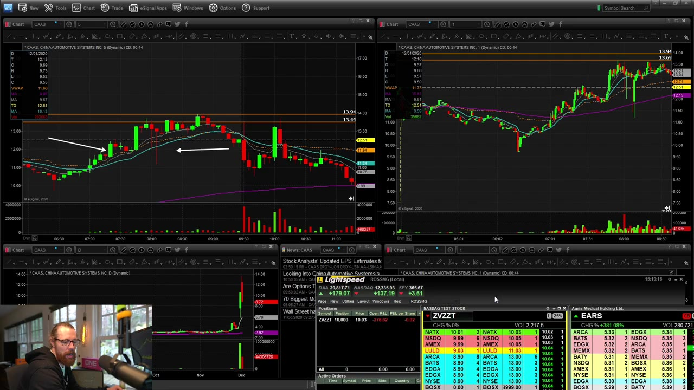

**图怎么看：**

- 这张截图显示了股票价格的趋势线分析，展示了价格如何在支撑和阻力水平之间波动。
- 通过观察价格在黄色趋势线上的运行，可以判断当前市场的趋势方向。
- 情绪波动对交易者的情绪和决策有很大影响，因此理解市场情绪对于做出正确的交易决策至关重要。
- 成交量柱的高度反映对应周期内的总成交量；红绿着色通常跟随价格柱的涨跌规则，不能直接拆成两种方向的主动成交。

### 关键内容

- 讲师讨论了趋势线在短期交易中的应用，特别是上升和下降趋势线的作用。
- 趋势线可以帮助预测价格的回调点，但并非总是有效。
- 讲师分享了自己在CAAS和VRIRII上的交易经历，包括如何利用趋势线进行短卖。
- 情绪对交易影响很大，特别是在亏损后情绪波动更大。
- 讲师强调了制定交易规则的重要性，并在亏损后严格执行这些规则。
- MACD和RSI等指标可以用来避免假突破，但发现这些指标并不总能提高胜率。
- 保持冷静和理性非常重要，尤其是在情绪激动时。
- John L10最近的利润达到70万美元，预计今年将接近100万美元。
- 讲师分享了自己的交易软件LightSpeed的定制请求，包括在止损单中加入成本基础。
- 讲师提到，情绪波动会影响交易决策，特别是在亏损后，情绪波动更大，这可能导致冲动交易和错误判断。
- 制定交易规则并严格执行是控制情绪波动的关键，有助于保持冷静和理性，减少因情绪导致的错误决策。
- 使用MACD和RSI等技术指标虽然可以帮助识别假突破，但在实际交易中并不总能提高胜率，需要结合其他分析方法。
- 保持冷静和理性不仅有助于遵守交易规则，还能在面对市场波动时做出更合理的判断，避免过度反应。
- 讲师强调了交易规则的重要性，即使在亏损后也要严格执行，这有助于建立纪律性和自我控制，减少情绪波动的影响

### 分析与执行顺序

1. 讲师首先介绍了趋势线在短期交易中的应用。
2. 然后分享了自己在CAAS和VRIRII上的交易经历，包括如何利用趋势线进行短卖。
3. 接着讨论了情绪对交易的影响，特别是在亏损后情绪波动更大。
4. 强调了制定交易规则的重要性，并在亏损后严格执行这些规则。
5. 最后分享了自己的交易软件LightSpeed的定制请求，包括在止损单中加入成本基础。

### 案例与细节

- 讲师在CAAS上的交易经历，利用趋势线进行短卖。
- 讲师在VRIRII上的交易经历，利用趋势线进行短卖。
- 使用MACD和RSI等指标来避免假突破。
- 设置2,500美元的最大亏损限额，以避免第一笔交易就失败的压力。
- 讲师在CAAS上利用趋势线进行短卖时，发现当价格触及下降趋势线时，通常会回调，这帮助他在短期内获利。
- 在VRIRII平台上，讲师使用MACD指标发现价格突破趋势线后并未持续上涨，而是迅速回落，这表明MACD指标有时也会出现假突破。
- 讲师在交易过程中设置了2,500美元的最大亏损限额，以避免第一笔交易就失败的压力，这体现了合理风险管理的重要性。
- 讲师分享了自己在VRIRII上的交易经历，利用RSI指标发现价格在超买区域后回调，从而成功进行了短卖操作。
- 在一次交易中，讲师发现价格突破了上升趋势线，但随后迅速回调，这说明RSI指标在确认趋势反转时的有效性

### 风险与边界

- MACD和RSI等指标并不总能提高胜率，存在失效风险。
- 情绪波动对交易影响较大，需要时刻保持冷静。
- 制定的交易规则需要严格执行，否则可能导致亏损。
- 交易软件LightSpeed的定制请求可能需要根据市场变化进行调整。
- MACD和RSI等指标在实际交易中失效的风险在于，它们可能会出现假突破，导致交易者错误地进入或退出市场。
- 情绪波动可能导致交易者忽视制定的交易规则，从而在市场不利时做出冲动的交易决策，增加亏损的风险。
- 交易规则如果未能严格执行，可能会导致交易者在市场有利时错过最佳时机，或者在不利时无法及时止损，增加亏损的可能性。
- 市场环境的变化可能使得交易软件LightSpeed的定制请求不再适用，需要定期更新和调整以适应新的市场条件

### 复盘问题

- 趋势线在短期交易中的作用是什么？
- 情绪波动如何影响交易决策？
- 如何制定有效的交易规则并严格执行？
- MACD和RSI等指标在实际交易中是否有效？
- 如何在交易过程中保持冷静和理性？

---

## v0451：楔形、趋势线和通道的基本交易策略

> 日期：2020-12-08　·　时长：00:35:23

**本场重点：** 本课程讲解了如何识别和利用楔形、趋势线和通道进行交易，特别是在高成交量股票中的应用。结论是这些工具可以帮助减少高频交易的焦虑，并提供风险回报率较高的交易机会。

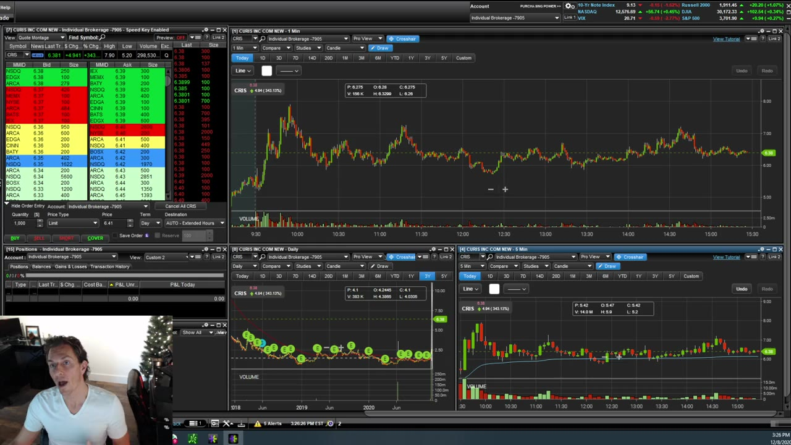

**图怎么看：**

- 在Curis Inc. COM NEW的5分钟图中，可以看到价格在不同时间段内形成了多个上升和下降的趋势。
- 图表显示了价格在特定时间点的波动情况，包括开盘价（O）、最高价（H）和最低价（L）。
- 成交量柱的高度反映对应周期内的总成交量；红绿着色通常跟随价格柱的涨跌规则，不能直接拆成两种方向的主动成交。
- 通过分析这些图表，投资者可以更好地理解市场的动态并做出相应的交易决策。

### 关键内容

- 楔形、趋势线和通道可以用来识别股票的高成交量区域，帮助预测价格走势。
- 在绘制楔形时，需要确保使用较长的时间框架，以避免误判为旗形。
- 趋势线在股票突破后通常会受到尊重，但它们也可以被突破，这表明市场情绪的变化。
- 通道和楔形可以用来确认支撑和阻力水平，提高交易决策的准确性。
- 在高成交量股票中，这些技术工具特别有用，因为它们可以提供明确的价格走势线索。
- 在实际交易中，应谨慎使用这些工具，避免过度分析和频繁交易。
- 楔形通常比通道更强大，适用于预测价格突破的方向。
- 在交易过程中，应关注支撑和阻力水平的变化，以做出正确的交易决策。
- 在实际操作中，应结合多种技术指标来验证交易信号的有效性。
- 在交易高成交量股票时，应关注成交量的变化，以确认价格突破的有效性

### 分析与执行顺序

1. 首先，讲师介绍了如何绘制基本楔形，强调使用较长的时间框架。
2. 然后，讲师展示了如何通过低点和趋势来标记楔形，确保至少有三个点来确认趋势线。
3. 接着，讲师解释了如何使用趋势线来预测股票的支撑和阻力水平。
4. 随后，讲师通过实际案例展示了如何利用楔形、趋势线和通道进行交易。
5. 最后，讲师强调了在实际交易中应谨慎使用这些工具，避免过度分析和频繁交易。

### 案例与细节

- G-tech 股票在一段时间内形成了一个楔形，最终突破了支撑线，形成了一个上升趋势。
- CRIS 股票在一天内形成了一个楔形，但突破后未能持续上涨，显示出市场情绪的变化。
- N-U-R-O 股票在上升楔形中形成了一个突破点，但随后又回落，显示出市场的不确定性。
- CLPS 股票在预市场交易中形成了一个楔形，但突破后未能持续上涨，显示出市场的波动性。
- CBAT 股票在上升楔形中形成了一个突破点，随后继续上涨，显示出市场的确定性

### 风险与边界

- 在交易过程中，应避免过度依赖单一的技术指标，以免产生错误的交易信号。
- 在实际交易中，应密切关注成交量的变化，以确认价格突破的有效性。
- 在交易高成交量股票时，应避免过度频繁交易，以免增加交易成本。
- 由于录制年代限制，上述策略可能不适用于当前市场环境，投资者应谨慎使用。

### 复盘问题

- 如何通过低点和趋势来标记楔形？
- 在实际交易中，如何利用楔形、趋势线和通道来做出正确的交易决策？
- 在交易过程中，如何避免过度依赖单一的技术指标？
- 如何结合多种技术指标来验证交易信号的有效性？

---

## v0452：2020年市场回顾

> 日期：2020　·　时长：00:42:02

**本场重点：** 2020年的市场波动性很大，关键在于适应变化和持续学习；未来市场将继续波动。

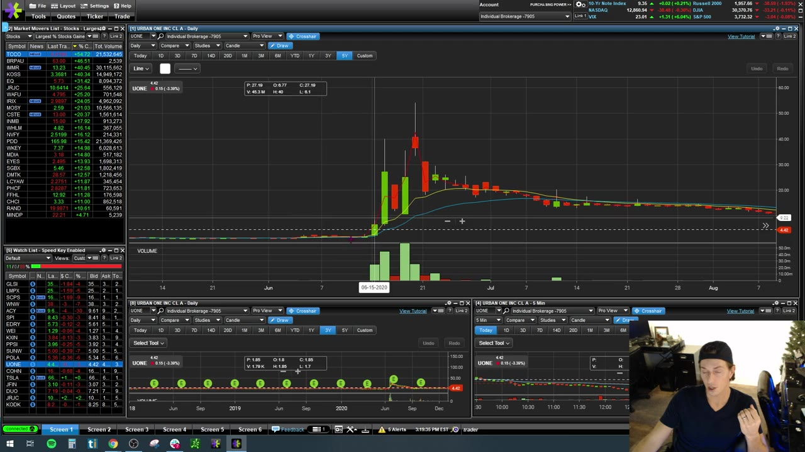

**图怎么看：**

- 这张图表显示了Urban One Inc CL A的日线图，可以看到股价在2020年6月到7月期间经历了一次显著的上涨。
- 成交量柱的高度反映对应周期内的总成交量；红绿着色通常跟随价格柱的涨跌规则，不能直接拆成两种方向的主动成交。
- 均线（黄色虚线）显示出市场的趋势方向，当前股价位于均线之上，表明市场可能处于上升趋势。
- 价格结构显示了股价的波动情况，红色柱表示股价下跌，绿色柱表示股价上涨。

### 关键内容

- 2020年市场经历了多次重大波动，包括疫情、疫苗研发等事件。
- 市场波动性主要由恐惧和贪婪驱动，这些情绪导致了巨大的价格波动。
- 许多新入市的投资者未能适应市场波动，导致亏损。
- 教育和经验是成功交易的关键，而不是预测市场走势。
- 市场总是充满不确定性，需要持续学习和适应。
- 模拟交易是提高技能的有效途径，避免直接在真实账户中交易高风险股票。
- 市场波动性将持续存在，投资者需要做好长期准备。
- 教育和经验可以帮助投资者更好地应对市场波动，避免盲目跟风。
- 市场波动性是由多种因素共同作用的结果，包括政治事件、经济新闻和技术发展等。
- 投资者需要保持冷静，避免被短期波动影响决策

### 分析与执行顺序

1. 讲师首先介绍了2020年的市场概况，强调了市场的波动性和不确定性。
2. 然后讲解了市场波动的主要原因，包括疫情、疫苗研发等事件带来的影响。
3. 接着分析了市场波动对投资者的影响，指出许多新入市的投资者未能适应市场波动。
4. 讲师强调了教育和经验的重要性，指出模拟交易是提高技能的有效途径。
5. 最后总结了市场波动性的持续存在，并提醒投资者要做好长期准备。
6. 在整个过程中，讲师通过实例和数据展示了市场波动的特点和影响。
7. 讲师还强调了投资者需要保持冷静，避免被短期波动影响决策

### 案例与细节

- SPI能源在疫情期间大幅上涨，从2到300%的涨幅。
- JFIN从极低的价格迅速上涨，从2到30再到100。
- GLSI在癌症药物试验成功后，从550上涨到160。
- WNW从60上涨到160，显示了市场波动的剧烈程度。
- LMPX从5上涨到44，显示了近期IPO的潜力

### 风险与边界

- 市场波动性可能会导致投资者亏损，尤其是那些没有足够经验和教育背景的新投资者。
- 模拟交易虽然有助于提高技能，但并不能完全复制真实市场的复杂性。
- 市场波动性可能会导致情绪波动，影响投资者的决策。
- 录制年代限制意味着这些信息可能不适用于当前市场环境的变化。
- 市场波动性可能会导致资金快速流失，尤其是那些没有适当风险管理策略的投资者

### 复盘问题

- 2020年的市场波动性主要受到哪些因素的影响？
- 投资者应该如何应对市场波动，避免盲目跟风？
- 模拟交易在提高交易技能方面有哪些优势和局限？
- 教育和经验对于成功交易的重要性体现在哪些方面？
- 市场波动性在未来是否会继续存在？如果会，投资者应该如何准备？

---

## v0453：布价单的应用与市场动态分析

> 日期：2020　·　时长：01:20:54

**本场重点：** 布价单功能帮助减少情绪干扰，提高交易效率；识别市场中的强制平仓现象，优化风险管理。

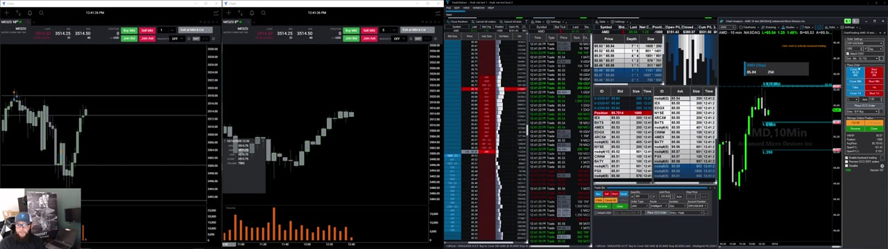

**图怎么看：**

- 画面中，可以看到多个股票的实时交易数据，包括价格、成交量和订单状态。
- 布价单（Bid/Ask）显示了当前市场上买家和卖家愿意支付的价格，有助于投资者了解市场的供需情况。
- 通过观察布价单，可以识别出市场中的强制平仓现象，从而优化风险管理。
- 图B还展示了不同股票的K线图，帮助投资者分析价格趋势和市场动态。

### 关键内容

- 讲师使用Trade Station的布价单功能进行交易，简化了交易流程。
- 布价单功能帮助减少情绪干扰，提高交易一致性。
- 通过布价单功能设置多个利润目标，简化交易操作。
- 市场下跌后反弹的现象，触发强制平仓，导致价格迅速反转。
- 新资金跟进做空，导致价格进一步下跌。
- 使用图表止损的重要性，避免依赖任意设定的止损点。
- 市场成交量减少导致价格波动增大，不适合进行短头操作。
- 讲师通过布价单功能设置多个利润目标，简化了交易操作，减少了手动输入的需求。
- 使用Trade Station的单按钮布价单功能，可以快速设置止损和止盈，提高交易效率。
- 市场下跌后反弹的现象，通常伴随着成交量的减少，此时价格波动增大，容易触发强制平仓。
- 新资金跟进做空导致价格进一步下跌，是因为新资金的加入加剧了市场的卖压。
- 关键点位反弹触发强制平仓，形成交易信号，这需要交易者具备敏锐的市场洞察力。

### 分析与执行顺序

1. 讲师介绍自己为Hulk，主要交易大型股，使用Trade Station进行交易。
2. 使用Trade Station的布价单功能进行交易，设置多个利润目标。
3. 使用Trading View图表进行技术分析，结合Trade Station的功能。
4. 识别市场中的强制平仓现象，优化风险管理。
5. 通过布价单功能减少情绪干扰，提高交易一致性。
6. 总结市场动态，识别交易信号，制定相应的交易策略。

### 案例与细节

- 使用布价单功能进行苹果股票的交易，设置三个利润目标。
- 通过布价单功能进行特斯拉股票的快速交易，设置50美分的利润目标。
- 市场下跌后反弹，触发强制平仓，形成交易信号。
- 新资金跟进做空，导致价格进一步下跌。
- 关键点位反弹触发强制平仓，形成交易信号。
- 交易示例：苹果公司连续收盘和特斯拉周五下午的交易。
- 使用布价单功能进行苹果股票的交易，设置三个利润目标，分别为+1%、+2%和+3%，简化了交易流程。
- 通过布价单功能进行特斯拉股票的快速交易，设置50美分的利润目标，利用Trade Station的单按钮功能，快速下单。
- 市场下跌后反弹，例如苹果公司连续收盘，当价格在某个关键点位反弹时，会触发强制平仓，形成交易信号。
- 新资金跟进做空，导致价格进一步下跌，例如特斯拉周五下午的交易，由于成交量减少，价格波动增大，不适合进行短头操作。
- 关键点位反弹触发强制平仓，例如苹果公司连续收盘，当价格在某个关键点位反弹时，会触发强制平仓，形成交易信号。

### 风险与边界

- 市场条件变化可能导致布价单功能失效。
- 依赖图表止损可能在极端市场条件下失效。
- 市场成交量减少时，价格波动增大，不适合进行短头操作。
- 录制年代限制，平台、监管、税务和经纪商条件只能表述为历史录制内容。
- 市场条件变化可能导致布价单功能失效，例如市场突然出现异常波动，布价单可能无法按预期执行。
- 依赖图表止损可能在极端市场条件下失效，例如市场发生剧烈波动，图表止损点可能无法有效保护资金。
- 市场成交量减少时，价格波动增大，不适合进行短头操作，因为此时价格波动不可预测，容易导致亏损。

### 复盘问题

- 如何使用布价单功能简化交易流程？
- 市场下跌后反弹的现象如何识别？
- 新资金跟进做空导致价格进一步下跌的原因是什么？
- 如何通过布价单功能减少情绪干扰，提高交易一致性？
- 在市场成交量减少时，如何避免过度风险？

---

## v0454：构建早晨交易习惯

> 日期：2020　·　时长：00:57:22

**本场重点：** 构建早晨交易习惯的重要性在于准备和机会的结合，以及选择合适的股票进行监控。

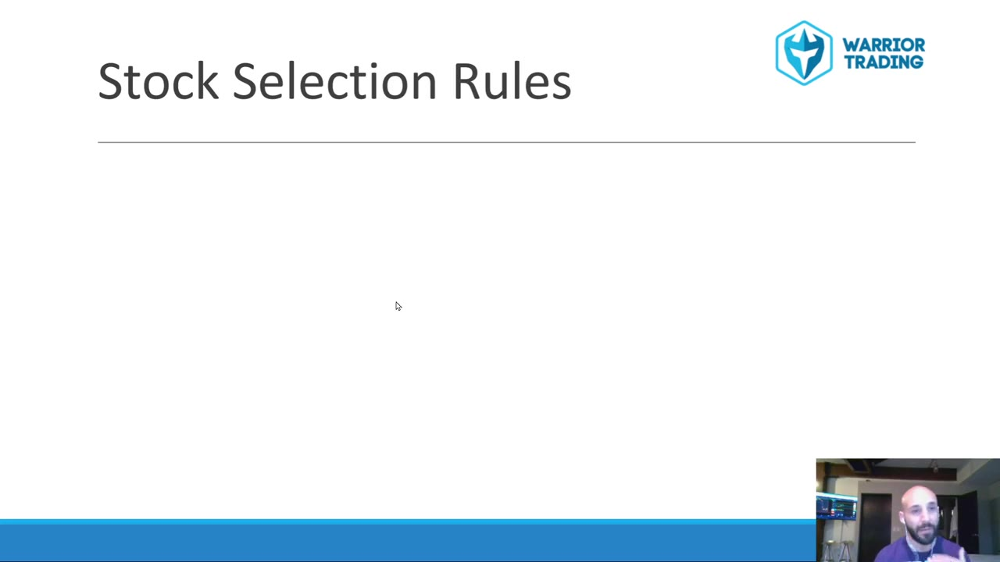

**图怎么看：**

- 幻灯片上列出了8个定义每日股票观察清单的过滤器。
- 这些规则包括价格范围、缺口、流通股、催化剂、市场前表现和开盘后的成交量。
- 这些规则有助于投资者在早晨交易时做出明智的选择。
- 幻灯片上的内容与构建早晨交易习惯的主题紧密相关，强调了准备和机会的结合。

### 关键内容

- Roberto 强调早晨习惯对于交易的重要性，包括感恩、锻炼、冥想等。
- 他分享了如何通过筛选股票来构建交易清单的方法，强调了选择合适股票的重要性。
- 他提到早晨习惯是逐步发展的，而不是一成不变的。
- 构建早晨习惯的核心是准备和机会的结合，以及选择合适的股票进行监控。
- 通过筛选合适的股票进行监控，可以提高交易成功的概率，因为这些股票通常具有良好的价格范围、成交量和催化剂等因素。这表明选择正确的股票是构建有效交易清单的关键步骤。

### 分析与执行顺序

1. Roberto 首先分享了早晨起床后的习惯，包括感恩、锻炼、冥想等。
2. 接着，他介绍了如何通过筛选股票来构建交易清单的方法。
3. 他强调了选择合适的股票进行监控的重要性，包括价格范围、成交量、催化剂等因素。
4. 然后，他分享了如何通过筛选股票来构建交易清单的方法，强调了选择合适股票的重要性。
5. 最后，他总结了早晨习惯的重要性，并鼓励大家构建自己的早晨习惯。

### 案例与细节

- Roberto 提到他每天会做感恩、锻炼、冥想等习惯，以准备一天的交易。
- 他分享了如何通过筛选股票来构建交易清单的方法，包括价格范围、成交量、催化剂等因素。
- 他提到他每天会选择一到四个股票进行监控，以确保能够专注于当天的最佳机会。

### 风险与边界

- 录制年代限制：此内容录制于2020年。
- 早晨习惯可能因个人情况不同而有所变化，需根据自身情况进行调整。
- 早晨习惯的成功取决于个人的自律和坚持。
- 早晨习惯的效果可能因市场环境的变化而有所不同。

### 复盘问题

- 你每天早晨的习惯是什么？
- 你如何筛选股票来构建交易清单？
- 你每天会选择多少股票进行监控？

---

## v0455：选择和改变交易策略

> 日期：2020　·　时长：01:05:22

**本场重点：** 选择适合自己的交易策略，明确何时尝试新的策略，并理解个人优势和劣势。

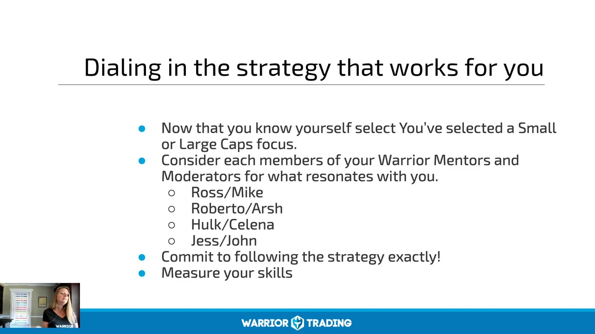

**图怎么看：**

- 在Warrior Trading的课程中，学员们被要求根据自己的情况选择小盘股或大盘股的焦点。
- 学员需要考虑Warrior Mentors和Moderators中的成员，以确定哪些策略最适合他们。
- 学员需要承诺完全遵循所选策略，并定期评估自己的技能水平。
- 通过这种方式，学员可以更好地了解自己的交易风格和优势，从而做出更明智的选择。

### 关键内容

- Selena 强调了选择交易策略的重要性，指出每个人都有不同的市场方法。
- 她提到需要考虑自己的性格特质，如果断性和纪律性。
- Selena 提到了使用 Thinkorswim 的不便，强调设备和软件的重要性。
- 她建议通过练习来熟悉交易策略，特别是使用热键。
- Selena 讨论了技术技能和心理习惯对交易策略选择的影响。
- 她强调了时间管理对于交易策略选择的重要性。
- Selena 提到需要合理设定期望值，避免过高或过低。
- 她建议通过记录交易屏幕来提高自我意识。
- Selena 强调了选择适合自己的交易策略的重要性，而不是盲目跟随他人。
- 她提到了 Warrior Trading 提供的各种资源，帮助学员找到适合自己的交易策略

### 分析与执行顺序

1. 观看 Selena 的开场介绍，了解 Warrior Trading 的背景。
2. 听 Selena 解释选择交易策略的重要性，理解每个人都有不同的市场方法。
3. 分析 Selena 提到的性格特质，如果断性和纪律性，以及它们如何影响交易策略的选择。
4. 了解 Selena 如何建议使用 Thinkorswim 的不便，强调设备和软件的重要性。
5. 练习使用热键和其他快捷方式，以提高交易效率。
6. 记录交易屏幕，以提高自我意识和交易策略的理解。
7. 通过 Warrior Trading 提供的各种资源，找到适合自己的交易策略

### 案例与细节

- Selena 提到，如果使用 Thinkorswim，可能会因为没有热键而处于劣势。
- 她建议在交易前花时间练习使用热键，以提高反应速度。
- Selena 提到，如果性格是悲观的，可能更适合做小盘股交易，因为有更多的做空机会。
- 她建议通过记录交易屏幕来提高自我意识，例如在晚上用笔记本电脑练习手部动作。
- Selena 提到，如果性格是乐观的，可能更适合做大盘股交易，因为有更多的做多机会

### 风险与边界

- 录制年代限制，信息可能不再适用于当前的市场环境。
- 设备和软件的变化可能导致某些建议不再适用。
- 交易策略的选择需要根据当前市场情况进行调整。
- 期望值的设定需要根据个人情况和市场变化进行调整

### 复盘问题

- 你如何确定自己的性格特质是否适合某种交易策略？
- 你如何通过记录交易屏幕来提高自我意识？
- 你如何根据当前市场情况调整交易策略的选择？
- 你如何合理设定期望值，避免过高或过低？

---

## v0456：克服不良交易习惯

> 日期：2020　·　时长：00:57:02

**本场重点：** 本课程重点在于识别和改善交易习惯，通过自我评估和行为调整来提高交易表现。

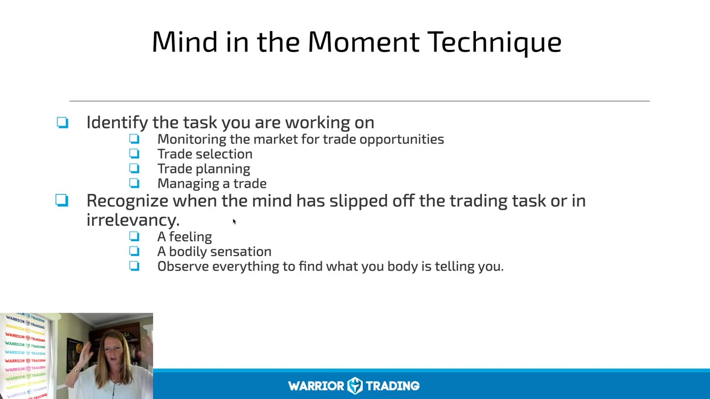

**图怎么看：**

- 幻灯片标题为“Mind in the Moment Technique”，左侧用清单列出当前任务，包括监控机会、选择交易、制定计划和管理持仓。
- 第二部分要求觉察注意力何时离开交易任务或变得无关，并给出重新聚焦、关注身体感受、观察身体信息等复位动作。
- 这张图把“克服不良习惯”拆成可执行流程：先识别自己正在做什么，再发现走神或冲动，最后把注意力带回计划和身体线索。
- 练习只能帮助识别行为触发点，不能替代订单核对和硬性风险限制；如果已经违反最大损失规则，应先停止交易而不是只做注意力练习。

### 关键内容

- 交易习惯对交易表现有重要影响，需要定期自我评估。
- 过度交易是常见的不良习惯之一，需要通过设定每日交易次数来控制。
- 情绪化交易会导致决策失误，需要通过冥想等方法来保持冷静。
- 记录交易过程中的心理、情绪和身体状态变化有助于自我改进。
- 通过设定目标和积极自我肯定，可以逐步改善交易习惯。
- 交易者需要认识到自己的身体信号，并据此调整交易策略。
- 通过冥想和呼吸练习，可以有效恢复交易时的专注力。
- 交易者应避免过度依赖外部因素，如市场情绪，而应专注于自身表现。
- 交易者需要持续自我反思，以发现并改正不良习惯。
- 交易者应将注意力集中在当前交易任务上，避免分心

### 分析与执行顺序

1. 讲师首先介绍了自我评估的重要性，要求学员记录交易过程中的表现。
2. 然后，讲师指导学员识别并记录交易中的不良习惯，如过度交易和情绪化交易。
3. 接着，讲师建议学员通过设定每日交易次数来控制过度交易的行为。
4. 讲师还介绍了如何通过冥想和呼吸练习来保持交易时的专注力。
5. 最后，讲师鼓励学员持续自我反思，以发现并改正不良习惯，从而提高交易表现。
6. 在整个过程中，讲师强调了自我评估和行为调整的重要性，帮助学员逐步改善交易习惯。
7. 讲师还提醒学员注意身体信号，如出汗和呼吸急促，以及时调整交易策略

### 案例与细节

- 过度交易：一位交易者在一天内进行了多次交易，导致资金损失。
- 情绪化交易：一位交易者在市场波动时感到恐慌，导致错误的交易决策。
- 记录交易过程：一位交易者记录了当天的交易情况，包括盈利和亏损。
- 冥想练习：一位交易者在每次交易前进行短暂的冥想，以保持冷静。
- 身体信号：一位交易者在交易时感到出汗，意识到自己可能过于紧张，从而调整了交易策略

### 风险与边界

- 录制年代限制：此课程录制于2020年，部分信息可能不再适用。
- 市场环境变化：市场环境和交易规则可能会发生变化，需关注最新动态。
- 个人差异：不同交易者的习惯和应对方式可能有所不同，需结合自身情况进行调整。
- 心理状态波动：交易者的情绪和心理状态会随市场变化而波动，需灵活应对

### 复盘问题

- 你能识别出自己交易过程中的哪些不良习惯吗？
- 你如何通过自我评估来改善这些不良习惯？
- 你在交易过程中是如何保持冷静和专注的？
- 你如何记录和反思自己的交易过程？
- 你如何通过冥想和呼吸练习来调整交易策略？

---

## v0457：使用 RSI 短期交易

> 日期：2020　·　时长：01:00:11

**本场重点：** 短交易需要关注多个时间框架的 RSI 弱势，确保长期弱势，避免短期波动。

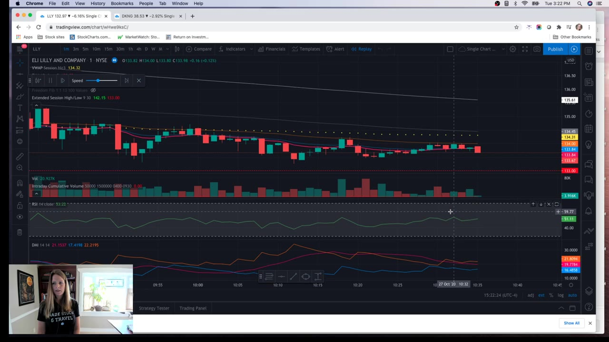

**图怎么看：**

- 画面中，可以看到实时交易图表上显示了RSI指标，用于分析股票价格的短期趋势。
- RSI指标被用来判断市场是否处于超买或超卖状态，帮助投资者做出买卖决策。
- 图表中显示了不同时间框架下的RSI值，如1分钟、5分钟等，以全面评估市场的短期波动情况。
- 通过观察这些图表，投资者可以更好地理解市场情绪和价格动向，从而制定更有效的交易策略。

### 关键内容

- RSI 是一个信心指标，帮助识别长期弱势。
- 在多个时间框架中寻找弱势，尤其是 1 分钟图表。
- RSI 低于 40 表示长期弱势，但不是绝对标准。
- 关注 RSI 是否形成长期线，避免虚假信号。
- 在开盘价附近寻找短期交易机会。
- 确保风险回报比至少为 2:1。
- 长期弱势有助于识别短期交易机会，但需谨慎。
- RSI 低于 60 表示短期弱势，但需结合其他指标。
- 使用 RSI 进行短期交易时，注意市场波动和趋势
- 在多个时间框架中寻找弱势，尤其是 1 分钟图表，可以更早发现潜在交易机会。
- RSI 低于 40 表示长期弱势，但需结合其他技术指标，如趋势线和支撑位，以确认交易信号的有效性。
- 使用 Thinkorswim 和 TradingView 的图表进行分析，可以更全面地了解股票的走势和交易机会。
- 在开盘价附近寻找交易机会时，需密切关注市场动态，避免因市场波动而错失最佳入场点。
- 长期弱势有助于识别短期交易机会，但需谨慎，因为市场可能会出现意外波动，导致交易失败

### 分析与执行顺序

1. 打开 Thinkorswim 和 TradingView 的图表，选择 LLY 股票。
2. 查看 LLY 的 1 分钟 RSI 图表，确认长期弱势。
3. 检查其他时间框架（如 4 小时、1 小时等），确认整体弱势。

### 案例与细节

- LLY 在 1 分钟 RSI 图表上显示长期弱势，低于 40，适合短期交易。
- 在开盘价附近设置交易订单，利用 RSI 的短期波动。
- 监控市场动态，确保交易符合长期弱势模式。
- 使用 Thinkorswim 和 TradingView 的图表进行分析。
- 设置止损和目标价格，确保风险回报比至少为 2:1。
- 在开盘价附近寻找交易机会，利用 RSI 的短期波动。
- 使用 TradingView 的图表分析 LLY 的 1 分钟 RSI，发现其长期弱势，低于 40，适合短期交易。在开盘价附近设置交易订单，利用 RSI 的短期波动，成功捕捉到市场趋势。
- 在 LLY 的 4 小时和 1 小时图表中，RSI 均低于 40，显示长期弱势。在开盘价附近设置交易订单，利用 RSI 的短期波动，成功捕捉到市场趋势，获得一定利润。
- 在 LLY 的 15 分钟和 30 分钟图表中，RSI 均低于 60，显示短期弱势。在开盘价附近设置交易订单，利用 RSI 的短期波动，成功捕捉到市场趋势，获得一定利润。
- 使用 Thinkorswim 的图表分析 LLY 的 1 分钟 RSI，发现其长期弱势，低于 40。在开盘价附近设置交易订单，利用 RSI 的短期波动，成功捕捉到市场趋势，获得一定利润。
- 在 LLY 的 1 分钟 RSI 图表中，发现其长期弱势，低于 40。在开盘价附近设置交易订单，利用 RSI 的短期波动，成功捕捉到市场趋势，获得一定利润。

### 风险与边界

- RSI 低于 40 不是绝对标准，需结合其他指标。
- 短期市场波动可能导致交易失败。
- 长期市场趋势可能影响交易结果。
- 使用 RSI 进行短期交易时，需谨慎处理市场波动。
- 录制于 2020 年，市场环境可能已发生变化
- RSI 低于 40 不是绝对标准，需结合其他技术指标，如趋势线和支撑位，以确认交易信号的有效性。否则可能会误判市场趋势，导致交易失败。
- 短期市场波动可能导致交易失败。即使在开盘价附近设置交易订单，也可能因市场突然反转而无法获利，甚至造成亏损。
- 长期市场趋势可能影响交易结果。如果市场趋势与预期相反，即使使用 RSI 识别到短期交易机会，也可能无法获利，甚至造成亏损。
- 使用 RSI 进行短期交易时，需谨慎处理市场波动。市场可能会出现意外波动，导致交易失败。因此，必须时刻保持警惕，避免盲目操作

### 复盘问题

- 在哪些时间框架中确认了 LLY 的长期弱势？
- 如何设置止损和目标价格以确保风险回报比至少为 2:1？
- 在开盘价附近寻找交易机会时，如何判断市场是否符合长期弱势模式？

---

## v0458：交易策略与目标设定

> 日期：2020　·　时长：00:48:33

**本场重点：** 选择合适的交易策略需要时间和耐心，合理的目标设定有助于持续进步。

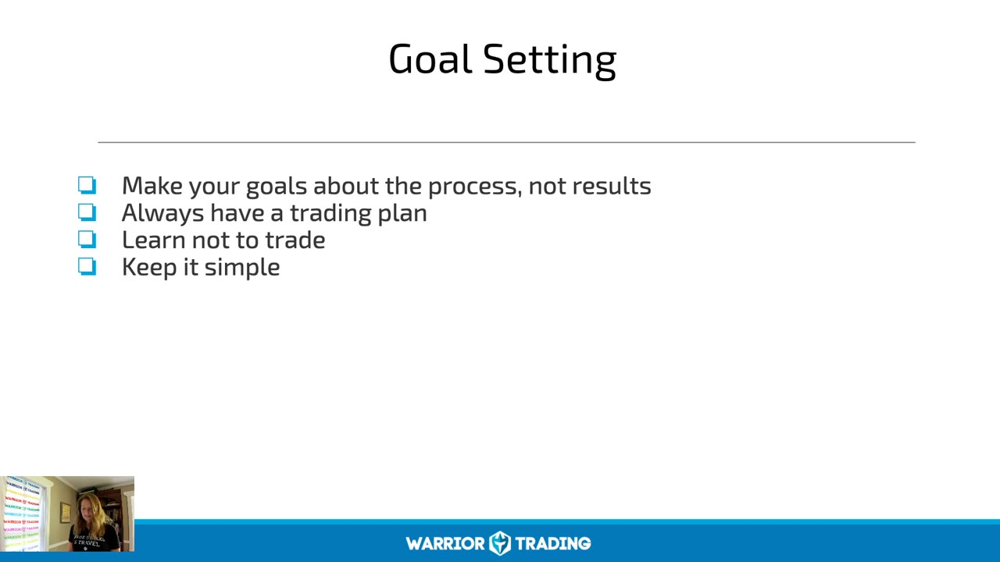

**图怎么看：**

- 这张图片展示了关于交易策略与目标设定的主题。
- 它强调了在选择交易策略时需要的时间和耐心。
- 合理的目标设定对于持续进步至关重要。
- 图片中还提到了一些具体的建议，如将目标设定为过程而非结果，始终拥有一个交易计划，学习如何不进行交易，以及保持简单性。

### 关键内容

- 选择交易策略需要考虑个人性格、习惯和风险承受能力。
- 合理的期望值对于成功至关重要，不应急于求成。
- 交易策略包括股票选择、技术分析、风险管理等。
- 制定交易计划并严格遵守是成功的关键。
- 目标设定应集中在过程而非结果，以促进持续进步。
- 交易过程中遇到的问题可以通过调整策略和目标来解决。
- 交易策略的选择需要时间和实践，不应轻易放弃。
- 交易心理和行为模式的调整对长期成功至关重要。
- 交易过程中保持冷静，避免情绪化决策。
- 交易目标应具体且可衡量，以确保有效执行

### 分析与执行顺序

1. 首先，了解自己的性格和习惯，确定适合自己的交易策略。
2. 选择交易策略后，制定详细的交易计划，包括进入和退出策略。
3. 在交易过程中严格执行计划，记录每次交易的细节。
4. 定期回顾交易记录，分析成功和失败的原因，不断改进。
5. 设定具体且可衡量的目标，如每日准确率、盈利目标等，以促进持续进步。
6. 遇到问题时，及时调整策略和目标，保持灵活性。
7. 保持冷静，避免情绪化决策，特别是在市场波动时

### 案例与细节

- 讲师提到，选择交易策略需要考虑个人的性格和习惯，如是否果断和自律。
- 讲师举例说，如果一个人每天交易三次，这需要制定严格的纪律来执行。
- 讲师指出，交易目标应具体，如增加每日准确率，而不是模糊的目标如成为百万富翁。
- 讲师分享了一个学生的目标，即一个月内减少费用，通过选择更好的股票实现。
- 讲师提到，交易过程中遇到广泛分布的股票时，需要考虑止损和风险控制。
- 讲师举例说，如果一个学生的目标是每天赚500美元，但实际操作中只赚了300美元，需要反思和调整策略

### 风险与边界

- 交易策略的选择和目标设定需要根据当前市场环境进行调整。
- 交易过程中可能会遇到市场波动，需要灵活应对。
- 交易策略的有效性可能随市场变化而变化，需要持续监控。
- 交易目标设定应基于个人实际情况，避免过高或过低的目标。
- 交易策略和目标设定的执行需要时间和实践，不应期望立即见效

### 复盘问题

- 你如何选择适合自己的交易策略？
- 你在交易过程中是如何严格执行计划的？
- 你的交易目标是如何设定的？
- 遇到市场波动时，你是如何调整策略的？
- 你如何保持冷静，避免情绪化决策？

---

## v0459：使用方向动量指标进行日内交易

> 日期：2020　·　时长：00:54:09

**本场重点：** 使用方向动量指标和OBV进行日内交易，但需谨慎，因为这些指标并不总是可靠的。

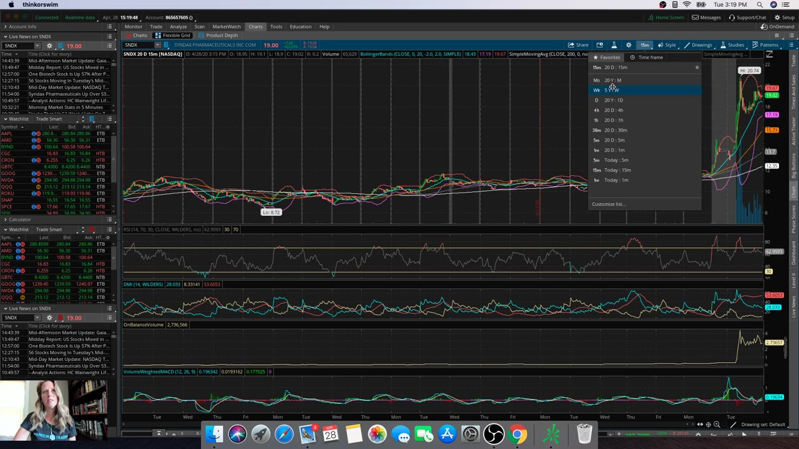

**图怎么看：**

- 画面中，可以看到使用了方向动量指标（DMI）和相对强弱指数（RSI）来分析市场趋势。
- 成交量柱的高度反映对应周期内的总成交量；红绿着色通常跟随价格柱的涨跌规则，不能直接拆成两种方向的主动成交。
- 水平线和斜线表示了市场趋势的方向，帮助投资者识别潜在的买入或卖出机会。
- 通过结合DMI和RSI，投资者可以更全面地理解市场动态，做出更明智的交易决策。

### 关键内容

- Selena使用方向动量指标和OBV来判断股票的方向和力度。
- 她强调这些指标并非万能，需要结合其他技术分析工具。
- Selena提到MACD指标，但她自己并不熟练。
- 她使用这些指标来识别潜在的日内交易机会。
- Selena指出，这些指标在不同时间框架下的表现可能有所不同。
- 她提到RSI指标，用于判断股票的相对强度。
- Selena强调，这些指标需要结合其他技术分析工具一起使用。
- 她提到使用Think or Swim平台进行交易，但并不推荐新手直接使用这些复杂指标。

### 分析与执行顺序

1. Selena首先介绍了方向动量指标（DMI）和OBV的基本概念。
2. 然后她展示了如何在Think or Swim平台上查看这些指标。
3. 接着她解释了如何使用这些指标来识别潜在的交易机会。
4. 她还提到了RSI指标，并解释了它的作用。
5. 最后，她强调了这些指标的局限性，并建议新手不要直接使用它们。

### 案例与细节

- Selena提到SDNX股票，使用五分钟图表来判断是否适合日内交易。
- 她提到一个股票在五分钟后突破了支撑位，但随后又回落，显示了市场的波动性。
- Selena使用RSI指标来判断股票的相对强度，指出当RSI达到60时，表明有较强的买盘。
- 她提到一个股票在一天中的不同时间点的表现，显示了市场情绪的变化。
- Selena使用OBV指标来判断股票的成交量变化，指出当OBV上升时，可能是买入信号。

### 风险与边界

- 这些指标并不总是可靠的，特别是在市场波动较大时。
- 新手投资者可能会过度依赖这些指标而忽视其他重要的技术分析工具。
- 这些指标的解读需要一定的经验，否则容易产生误判。
- 录制于2020年，当时的市场环境和监管规则可能已发生变化。

### 复盘问题

- Selena提到的哪些指标是她常用的？
- 她是如何结合这些指标和其他技术分析工具来做出交易决策的？
- 对于新手投资者，她有什么建议？

---

## v0460：使用RSI确认长期买入机会

> 日期：2020　·　时长：01:13:58

**本场重点：** 如何使用RSI确认长期买入机会，结合其他技术指标进行综合判断。

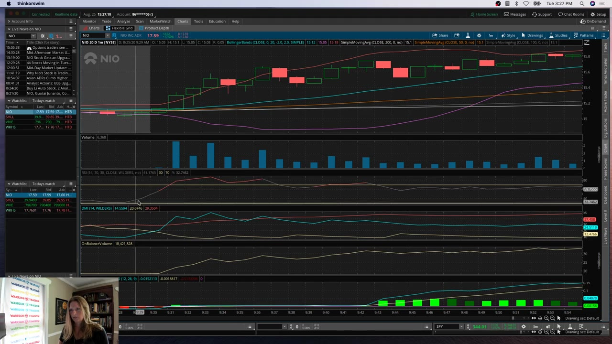

**图怎么看：**

- 在 NIO 的 20D 1m 图表中，可以看到价格在上升趋势中，RSI 指标显示接近超买区。
- 成交量柱的高度反映对应周期内的总成交量；红绿着色通常跟随价格柱的涨跌规则，不能直接拆成两种方向的主动成交。
- 成交量适合与前序时段或历史基准比较参与程度，但仅凭柱体颜色无法判断哪一方主动，也不能由此推断下一步方向。
- 通过结合这些技术指标，投资者可以更好地判断股票的长期趋势和潜在买入机会。

### 关键内容

- 默认设置RSI长度为14，价格为收盘价，平均值为Wilders。
- 使用70和30线作为过强和过弱的标志，确认其他交易策略的有效性。
- 在不同时间框架内使用RSI，确认整体趋势。
- NIO和Vive的交易案例展示了如何使用RSI来确认趋势。
- 使用RSI确认其他技术指标（如Bollinger Bands）的信号。
- 直接路由对于Ross的策略非常重要。
- 在使用RSI确认长期买入机会时，需要观察RSI线是否突破70和30线，这有助于确认趋势强度。
- 结合其他技术指标（如Bollinger Bands）进行综合判断，可以提高交易决策的准确性，避免单一指标的误导。
- 在不同时间框架内使用RSI，可以更好地确认整体趋势，尤其是在市场波动较大时，需要更长时间框架内的确认。
- 使用RSI进行动量交易时，需要注意市场波动性，避免在市场剧烈波动时做出错误的交易决策。
- 直接路由对于Ross的策略非常重要，确保交易指令能够迅速执行，减少延迟带来的影响。

### 分析与执行顺序

1. 早上8:15开始查看交易平台，打开平台并进行扫描。
2. 查看“战士房间”中的讨论，通常热点交易会在8:30左右被讨论。
3. 如果发现机会，立即分析并采取行动；否则继续通过扫描器筛选。
4. 使用RSI进行动量交易，但不建议将RSI拉低至零附近。
5. 使用ThinkorSwim的高级功能，分享自己的交易布局。
6. 使用RSI进行止损管理，例如在目标价格达到时卖出，或在止损价格被触及时卖出。

### 案例与细节

- NIO：早上开盘时，NIO显示出强劲的磨盘走势，预示着一个良好的交易日。使用RSI确认了这一趋势。
- Vive：早上开盘时，Vive显示出低点，随后反弹，形成一个底部形态。使用RSI确认了这一趋势。
- 使用ThinkorSwim平台进行交易，设置RSI的方法和使用策略。
- 使用RSI进行日内交易和夜盘交易，注意不同时间段的规则差异。
- NIO在早上开盘时显示出强劲的磨盘走势，使用RSI确认了这一趋势，表明市场可能处于上升趋势，适合长期买入。
- Vive在早上开盘时显示出低点，随后反弹形成底部形态，使用RSI确认了这一趋势，表明市场可能正在形成底部，适合长期买入。
- 使用ThinkorSwim平台进行交易时，设置RSI的方法和使用策略，可以更好地确认趋势强度，提高交易成功率。
- 在不同时间框架内使用RSI，如日线和小时线，可以更好地确认整体趋势，尤其是在市场波动较大时，需要更长时间框架内的确认。
- 使用RSI进行动量交易时，如NIO的走势，需要结合其他技术指标进行综合判断，避免在市场剧烈波动时做出错误的交易决策。

### 风险与边界

- 录制年代限制，平台、监管、税务和经纪商条件只能表述为历史录制内容。
- 即使RSI显示强劲趋势，也需要结合其他技术指标进行综合判断。
- 避免过度依赖RSI，因为它不能单独决定交易。
- 使用RSI进行动量交易时，需要注意市场波动性。
- 过度依赖RSI可能导致忽视其他重要市场信号，从而做出错误的交易决策。
- 市场波动性大时，仅依赖RSI可能无法准确判断趋势，容易导致亏损。
- 录制年代限制，平台、监管、税务和经纪商条件只能表述为历史录制内容，因此在当前环境下使用时需谨慎。

### 复盘问题

- 如何使用RSI确认其他技术指标的信号？
- 在不同时间框架内使用RSI时，需要注意哪些因素？
- 使用RSI进行止损管理的具体方法是什么？
- 如何结合其他技术指标进行综合判断？

---

## v0461：交易策略的重要性

> 日期：2020　·　时长：00:50:56

**本场重点：** 交易策略是成功的关键，需要全面考虑个人特质、工具和技术等多方面因素。

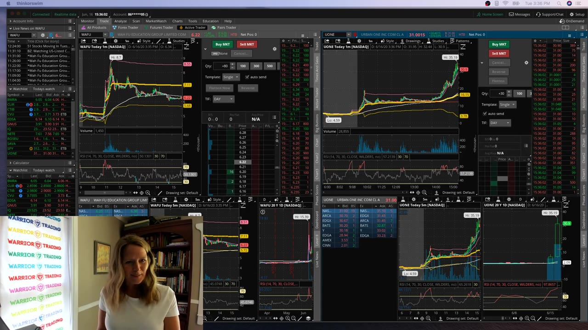

**图怎么看：**

- 展示了一个交易策略的四个关键要素：预市场例行程序、制定明确规则、计划并执行交易、在交易过程中自我检查、后处理、指标审查和调整以及责任。
- 通过详细列出这些要素，强调了建立一个成功的交易策略所需的全面考虑。
- 每个要素都提供了具体的指导原则，帮助交易者在市场中保持纪律和一致性。
- 这有助于交易者在面对复杂市场环境时做出明智的决策，并提高交易的成功率。

### 关键内容

- 策略不仅仅是交易设置，还包括个人特质、工具和技术等多方面因素。
- 个人特质如纪律性、心理承受能力等对交易策略至关重要。
- 选择合适的交易平台和设备是策略的一部分，影响交易效果。
- 技术分析只是策略的一部分，还需要考虑心理状态和交易过程。
- 制定明确的交易计划和规则是成功的关键。
- 保持自我反省和调整是持续成功的必要条件。
- 建立问责机制有助于提高交易纪律性和成功率。
- 交易策略需要全面考虑，不能仅依赖单一设置。
- 交易过程中需要不断检查和调整策略以适应市场变化。
- 交易策略需要根据个人情况定制，不能盲目跟随他人

### 分析与执行顺序

1. 首先，确定个人特质，包括时间安排、纪律性、心理承受能力等。
2. 其次，选择合适的交易平台和设备，确保交易顺畅。
3. 再次，制定详细的交易计划和规则，包括盈利目标、止损点等。
4. 然后，建立自我反省机制，定期回顾和调整交易策略。
5. 最后，建立问责机制，确保自己遵守交易规则。
6. 在交易过程中，不断检查和调整策略，以适应市场变化。
7. 根据个人情况定制交易策略，不能盲目跟随他人

### 案例与细节

- Selena提到她的策略是通过呼吸练习来保持冷静，这显示了心理状态对交易的重要性。
- 她强调了选择合适交易平台的重要性，比如使用Think或Swim作为主要交易平台。
- Selena分享了如何处理快速上涨的股票，比如通过RSI指标进行分析。
- 她提到了如何处理宽幅波动的股票，比如通过调整交易计划来应对。
- Selena分享了如何处理恐惧错失机会的心态，比如通过设定止损来控制情绪。
- 她还提到了如何处理交易过程中的突发情况，比如市场暂停时的应对策略

### 风险与边界

- 交易策略的有效性取决于市场环境的变化，需要不断调整。
- 个人特质如纪律性可能会影响策略的执行效果，需要持续培养。
- 选择交易平台和设备时需要考虑网络连接等因素，这些可能会影响交易速度。
- 交易策略的成功需要长期坚持，不能期望短期内取得巨大收益。
- 交易策略需要根据个人情况定制，不能盲目跟随他人，这可能导致失败

### 复盘问题

- 你的交易策略中包含了哪些个人特质？
- 你在选择交易平台和设备时考虑了哪些因素？
- 你如何制定详细的交易计划和规则？
- 你在交易过程中如何检查和调整策略？
- 你如何建立自我反省和问责机制？

---

## v0462：RSI在股票交易中的应用

> 日期：2020　·　时长：00:59:27

**本场重点：** 讲解RSI的应用方法，强调多时间框架结合的重要性，以及如何利用RSI进行交易决策。

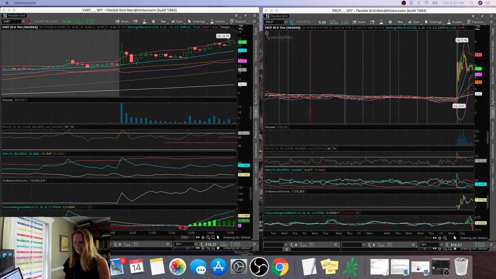

**图怎么看：**

- 在实时交易界面中，可以看到多个股票的图表和数据，包括VXRT、SPY等。
- 聊天室中有多名参与者正在进行讨论，其中一位用户提到PRCP的价格波动。
- 界面上方显示了账户信息和实时市场数据，右侧是交易工具和图表。
- 聊天室中有人询问关于RSI在股票交易中的应用，以及如何利用RSI进行交易决策。

### 关键内容

- RSI是一种衡量股票强度的工具，可以与任何其他交易设置结合使用。
- 在多个时间框架上保持强度是进入交易的好时机，如超过60点。
- RSI可以用来确认突破，但需要与其他技术指标结合使用。
- RSI在突破后回撤时，可以作为退出信号。
- RSI在低于40点时可能表示卖出机会。
- RSI在高于60点时可能表示买入机会。
- RSI需要与其他技术指标结合使用，以提高准确性。
- RSI在低于40点时可能表示卖出机会，特别是在较长时间框架上。
- RSI在高于60点时可能表示买入机会，特别是在较长时间框架上

### 分析与执行顺序

1. Selena首先展示了VXRT的1分钟图表，解释了RSI的基本用法。
2. 她强调了在多个时间框架上保持强度的重要性，如1分钟、5分钟等。
3. Selena讨论了RSI在突破后回撤时作为退出信号的可能性。
4. 她提到了RSI在低于40点时可能表示卖出机会，特别是在较长时间框架上。
5. Selena解释了RSI在高于60点时可能表示买入机会，特别是在较长时间框架上。
6. 她强调了RSI需要与其他技术指标结合使用，以提高准确性。
7. Selena展示了如何使用RSI来确认突破，并在突破后回撤时作为退出信号

### 案例与细节

- VXRT在1分钟图表上测试了60点，显示了RSI的使用方法。
- 当RSI在1分钟图表上突破60点后回撤时，可以作为退出信号。
- 当RSI在5分钟图表上突破60点时，可以作为进入交易的信号。
- 当RSI在15分钟图表上突破60点时，可以作为进入交易的信号。
- 当RSI在低于40点时，可能表示卖出机会，特别是在较长时间框架上。

### 风险与边界

- RSI在低于40点时可能表示卖出机会，但在较长时间框架上，需要确认是否突破了关键支撑位。
- RSI在高于60点时可能表示买入机会，但在较长时间框架上，需要确认是否突破了关键阻力位。
- RSI需要与其他技术指标结合使用，以提高准确性，否则可能会出现误判。
- RSI在突破后回撤时，可以作为退出信号，但需要确认是否突破了关键支撑位。

### 复盘问题

- RSI在哪些情况下可以作为买入信号？
- RSI在哪些情况下可以作为卖出信号？
- RSI需要与其他哪些技术指标结合使用？
- 如何确认RSI突破后的关键支撑位和阻力位？
- RSI在突破后回撤时，如何判断是否应该退出交易？

---

## v0463：认知偏差对交易的影响

> 日期：2020　·　时长：01:58:19

**本场重点：** 认知偏差导致交易者不愿承受损失，影响决策，需通过记录和分析来减轻其影响。

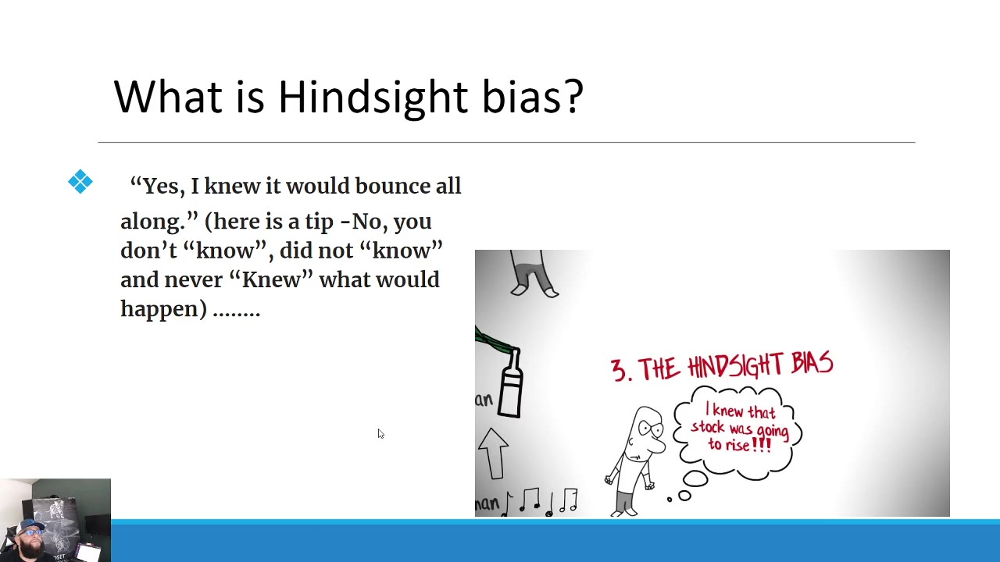

**图怎么看：**

- “Yes, I knew it would bounce all along.” (here is a tip - No, you don't “know”, did not “know” and never “Knew” what would happen)…….
- Illusion of control bias example:
- You think that you can control if your next trade is profitable. Everything is under control. You will make money on your subsequent trade because it’s all under control.
- Thinking that you can control the outcome of your next trade, is the same as believing that you control the market. You clearly do not have this capability as human and traders.

### 关键内容

- 认知偏差是系统性思维错误，影响决策和判断，如亏损厌恶、归因偏差等。
- 亏损厌恶使交易者不愿亏损，导致过度交易，需通过止损和止盈来管理风险。
- 归因偏差导致成功归因于自己，失败归咎于外部，需保持客观分析。
- 控制错觉使人误以为能控制市场结果，需通过记录和分析来纠正。
- 后见之明使人认为已知结果是必然的，需记录屏幕以避免这种偏差。
- 确认偏见导致交易者寻找理由证明自己的决策是正确的，需避免后购理性化。
- 近期偏见过度重视最近发生的事件，需回顾更长时间段的交易结果。
- 锚定偏见过度依赖首次提供的信息，需保持开放心态，避免被初始信息锚定。
- 认知偏差对交易决策的影响显著，需通过记录和分析来提高决策质量。
- 确认偏见导致交易者忽视市场真实情况，需通过记录和分析来保持客观。
- 近期偏见使交易者过度关注最近的亏损，忽视历史数据，需通过回顾更长时间段的交易结果来纠正。
- 控制错觉使交易者误以为能控制市场结果，需通过记录和分析来认识到市场的不可预测性。
- 后见之明使交易者认为已知结果是必然的，需通过记录屏幕来避免这种偏差，提高决策准确性。
- 羊群效应导致交易者跟随错误趋势，需通过独立分析市场来避免盲目跟风

### 分析与执行顺序

1. 记录屏幕以避免后见之明，提高交易记录准确性。
2. 使用止损和止盈来管理风险，避免过度交易。
3. 专注于范围交易而非单一价格点，保持情绪稳定。
4. 通过计划和记录来减少认知偏差的影响，保持客观分析。
5. 在交易过程中遇到支持自己观点的信息时，思考相反的观点，保持开放心态。
6. 回顾更长时间段的交易结果，避免频繁从每次交易中得出结论。

### 案例与细节

- 亏损厌恶：交易者不愿亏损，导致过度交易，如等待完美时机出现，忽视警告信号。
- 归因偏差：成功归因于自己，失败归咎于外部，如交易成功时沾沾自喜，失败时责怪市场。
- 控制错觉：误以为能控制市场结果，如认为自己可以预测市场走势，忽视市场不确定性。
- 后见之明：认为已知结果是必然的，如交易失败后认为应该提前卖出，忽视当时市场情况。
- 确认偏见：寻找理由证明决策正确，如等待完美时机出现，交易后进行后购理性化。
- 近期偏见：过度重视最近发生的事件，如频繁关注最近的亏损，忽视历史数据。
- 锚定偏见：过度依赖首次提供的信息，如交易开始时出现强劲的看涨势头，即使市场疲软仍坚持看涨。
- 确认偏见：交易者在看到某股票连续上涨时，忽视了市场整体趋势和基本面分析，继续买入该股票，认为这是必然的结果，直到股价突然下跌，造成重大损失。
- 近期偏见：交易者在连续几次交易亏损后，过度关注最近的亏损，忽视了历史数据中的盈利记录，导致频繁调整交易策略，最终导致资金链断裂。
- 控制错觉：交易者坚信自己可以通过技术分析准确预测市场走势，忽视了市场本身的随机性和不可预测性，最终在一次重大市场波动中遭受巨大损失。
- 后见之明：交易者在一次成功的交易后，认为自己已经找到了一套完美的交易策略，忽视了当时市场环境的特殊性，导致在类似情况下再次失败。
- 羊群效应：交易者看到其他投资者大量买入某股票，自己也跟着买入，结果发现这只股票实际上存在重大问题，最终导致集体亏损

### 风险与边界

- 过度依赖羊群效应可能导致跟随错误趋势，需谨慎分析市场。
- 控制错觉可能导致盲目自信，忽视市场不确定性，需保持警惕。
- 后见之明可能导致过度乐观，忽视潜在风险，需保持冷静。
- 录制年代限制：平台、监管、税务和经纪商条件只能表述为历史录制内容。
- 过度依赖羊群效应可能导致跟随错误趋势，需谨慎分析市场，避免盲目跟风。
- 控制错觉可能导致盲目自信，忽视市场不确定性，需保持警惕，避免过度乐观。
- 后见之明可能导致过度乐观，忽视潜在风险，需保持冷静，避免过度自信。
- 录制年代边界：平台和规则只能表述为历史录制内容，因此在实际交易中需遵守当前的市场规则和监管要求

### 复盘问题

- 如何识别和减轻认知偏差对交易决策的影响？
- 在交易过程中如何避免确认偏见和自我欺骗的循环？
- 如何通过记录和分析来提高交易决策的质量？
- 如何通过保持开放心态来避免锚定偏见？

---

## v0464：小盘股斐波那契回调策略

> 日期：2020　·　时长：00:56:40

**本场重点：** 介绍一种基于斐波那契回调的小盘股交易策略，适用于寻找慢速交易机会的投资者。

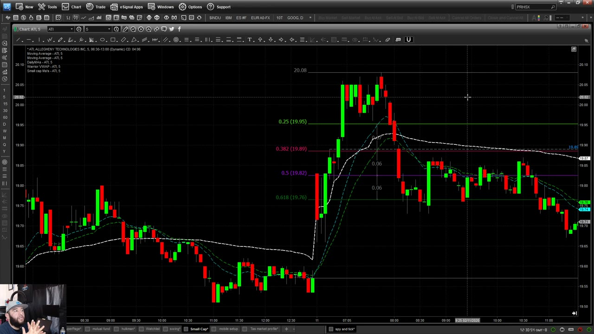

**图怎么看：**

- 在图中，AMKR股票的价格在斐波那契回调水平上波动，显示出市场可能正在形成支撑或阻力。
- 斐波那契回调水平通常用于确认趋势反转或支撑位。
- 通过观察这些水平，投资者可以更好地理解市场的心理和技术面。
- 在本例中，股价在0.618和0.764的斐波那契回调水平附近出现反弹，表明市场可能正在尝试恢复上升趋势。

### 关键内容

- 讲师使用斐波那契回调来识别支撑位，并等待成交量确认。
- 策略适用于寻找慢速交易机会的投资者，特别是那些不喜欢快速决策的人。
- 成交量是判断是否进行交易的关键因素，通常需要看到成交量稳定下降。
- 策略主要应用于小盘股市场，适用于寻找长期趋势的投资者。
- 使用13日指数移动平均线（EMA）和成交量加权平均价格（VWAP）作为参考。
- 交易者需要耐心等待市场回调，以确保有足够的成交量确认。
- 策略适用于寻找低风险、高回报机会的保守型交易者。
- 策略依赖于市场情绪和技术分析，适用于寻找长期趋势的投资者。

### 分析与执行顺序

1. 讲师首先展示了一个典型的小盘股回调案例，包括斐波那契水平和成交量分析。
2. 然后，讲师解释了如何使用斐波那契回调来识别支撑位，并等待成交量确认。
3. 接着，讲师展示了如何使用13日EMA和VWAP作为参考，以确定交易时机。
4. 最后，讲师强调了成交量的重要性，并解释了如何根据成交量确认交易。
5. 在整个过程中，讲师强调了耐心等待市场回调的重要性，以确保有足够的成交量确认。
6. 讲师还强调了市场情绪和技术分析在策略中的重要性，以及如何寻找长期趋势的机会。

### 案例与细节

- MI, O, SN, EC等股票的回调案例，显示了如何使用斐波那契水平和成交量确认交易。
- Yeko股票的回调案例，显示了如何使用斐波那契水平和成交量确认交易。
- MIO股票的回调案例，显示了如何使用斐波那契水平和成交量确认交易。
- ACB股票的回调案例，显示了如何使用斐波那契水平和成交量确认交易。
- Gnpx股票的回调案例，显示了如何使用斐波那契水平和成交量确认交易。

### 风险与边界

- 策略依赖于市场情绪和技术分析，因此可能无法在所有市场条件下有效。
- 策略适用于寻找慢速交易机会的投资者，但可能不适合寻求快速回报的投资者。
- 策略依赖于成交量确认，因此在成交量不足的情况下可能无法执行。
- 策略适用于寻找低风险、高回报机会的保守型交易者，但可能不适合寻求高风险、高回报机会的激进型交易者。

### 复盘问题

- 如何使用斐波那契回调来识别支撑位？
- 如何使用成交量确认交易？
- 如何根据市场情绪和技术分析来选择合适的交易时机？
- 如何根据成交量确认交易？
- 如何在寻找慢速交易机会的同时保持耐心？

---

## v0465：Curl交易策略详解

> 日期：2020　·　时长：00:25:44

**本场重点：** Curl交易策略的关键在于识别股票的支撑和阻力水平，并在适当的时机进行买卖。该策略适用于多种股票，但需要谨慎操作。

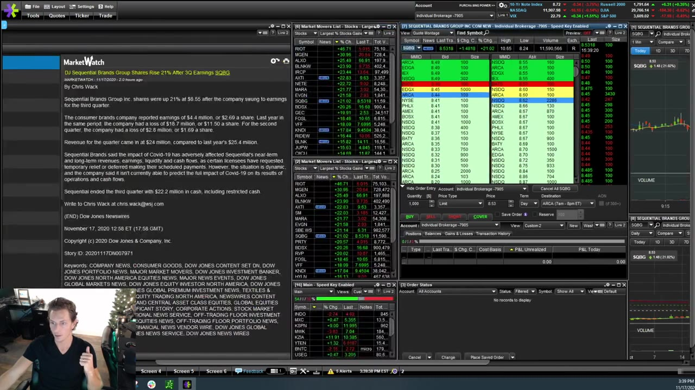

**图怎么看：**

- 在图C中，显示了Sequential Brands Group Inc.的每日和五分钟K线图，以及市场动量列表。
- 每日K线图上可以看到股价的波动情况，包括支撑和阻力水平。
- 市场动量列表提供了当前市场中表现最好的股票，有助于投资者选择投资目标。
- 通过分析这些图表和数据，投资者可以更好地理解市场的趋势和潜在的投资机会。

### 关键内容

- Curl策略要求股票在支撑水平上形成清晰的双底形态，以确认支撑的有效性。
- 股票必须具有较低的浮动量（低于100亿股），并且在关键支撑水平上保持良好的成交量。
- Curl策略依赖于股票在支撑水平上的反弹，而不是直接突破阻力水平。
- 在五分钟图表上，Curl策略需要看到多个蜡烛形成清晰的趋势线。
- Curl策略的目标是捕捉股票的支撑和阻力水平之间的微小回调，以实现利润最大化。
- Curl策略的成功依赖于市场波动性和成交量，因此在市场平静时期可能效果不佳。
- Curl策略通常在开盘后不久开始形成，因此需要密切关注开盘后的走势。
- Curl策略需要在支撑水平上看到明显的绿色蜡烛，以确认支撑的有效性。
- Curl策略的目标是锁定利润，而不是试图预测股票的长期走势。
- Curl策略的成功依赖于市场情绪和投资者信心，因此需要密切关注市场动态

### 分析与执行顺序

1. 首先，观察股票是否在支撑水平上形成清晰的双底形态。
2. 其次，确认股票在支撑水平上的成交量是否足够大，以支持反弹。
3. 然后，在五分钟图表上寻找多个蜡烛形成清晰的趋势线。
4. 接着，等待股票在支撑水平上形成绿色蜡烛，确认支撑的有效性。
5. 最后，根据支撑和阻力水平设定止损和止盈点，进行买卖操作。
6. 在整个过程中，需要密切关注市场波动性和成交量的变化。
7. 在开盘后不久，寻找合适的入场点，以利用Curl策略的优势

### 案例与细节

- SQBG股票在开盘后形成清晰的双底形态，随后在支撑水平上反弹。
- CCL股票在支撑水平上形成绿色蜡烛，随后在五分钟图表上形成清晰的趋势线。
- riot股票在支撑水平上形成绿色蜡烛，随后在五分钟图表上形成清晰的趋势线。
- Carnival股票在支撑水平上形成绿色蜡烛，随后在五分钟图表上形成清晰的趋势线。
- Riot股票在支撑水平上形成绿色蜡烛，随后在五分钟图表上形成清晰的趋势线

### 风险与边界

- Curl策略在市场平静时期可能效果不佳，因为缺乏足够的波动性。
- Curl策略依赖于市场情绪和投资者信心，因此在市场恐慌时期可能失效。
- Curl策略的成功依赖于成交量，因此在成交量不足的情况下可能无法实现。
- Curl策略的成功依赖于市场波动性，因此在市场波动性较小时可能无法实现。
- Curl策略的成功依赖于市场情绪，因此在市场情绪低迷时可能无法实现

### 复盘问题

- 在哪些情况下，Curl策略可能无法实现预期的效果？
- 如何确定股票是否在支撑水平上形成了清晰的双底形态？
- 如何在五分钟图表上找到清晰的趋势线？
- 如何在支撑水平上确认绿色蜡烛的有效性？
- 如何根据支撑和阻力水平设定止损和止盈点？

---

## v0466：适应市场变化

> 日期：2020　·　时长：00:40:47

**本场重点：** 了解市场变化对交易策略的影响，掌握适应不同市场环境的方法。

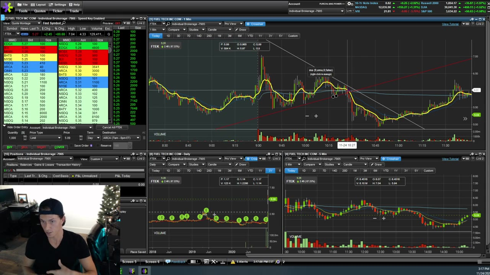

**图怎么看：**

- 在B选项中，可以看到多个股票的实时交易数据，包括价格、成交量和订单状态。
- 图表显示了不同周期（如分钟和日）的K线图，帮助投资者理解市场的短期波动。
- 水平线和趋势线被用来标记关键支撑和阻力位，辅助判断买卖时机。
- 实时数据和图表分析对于理解市场动态和制定交易策略至关重要。

### 关键内容

- 市场总是在变化，新手难以适应，而经验丰富的交易者则更容易适应。
- 交易者需要不断学习和适应不同的市场条件，以保持竞争力。
- 市场变化可能导致假突破，交易者需要学会识别这些情况。
- 交易者需要根据市场变化调整交易策略，如从趋势交易转向区间交易。
- 在市场变化中，交易者需要关注支撑位和阻力位的变化。
- 交易者需要学会在市场变化中寻找交易机会，而不是盲目跟随市场。
- 交易者需要根据市场变化调整交易计划，以适应市场的波动性。
- 交易者需要学会在市场变化中保持冷静，避免情绪化决策。

### 分析与执行顺序

1. 首先，理解市场变化对交易策略的影响，包括假突破和市场波动。
2. 其次，学习如何识别市场变化中的支撑位和阻力位，以便制定交易计划。
3. 然后，根据市场变化调整交易策略，如从趋势交易转向区间交易。
4. 接着，设定止损和止盈，以控制风险并保护资金。
5. 最后，根据市场变化灵活调整交易计划，以适应市场的波动性。

### 案例与细节

- 举例说明市场变化可能导致假突破，如某股票在一天内出现大幅下跌，随后又迅速回升。
- 举例说明市场变化可能导致交易者错过大行情，如某股票在一天内从620元上涨到670元以上。
- 举例说明市场变化可能导致交易者出现亏损，如某股票在一天内从620元下跌到600元以下。
- 举例说明市场变化可能导致交易者错过交易机会，如某股票在一天内从620元上涨到650元以上。

### 风险与边界

- 市场变化可能导致交易者出现亏损，因此需要设定止损和止盈。
- 市场变化可能导致交易者错过大行情，因此需要灵活调整交易策略。
- 市场变化可能导致交易者出现情绪化决策，因此需要保持冷静。
- 市场变化是历史录制内容，当前市场环境可能有所不同。

### 复盘问题

- 市场变化对交易策略有何影响？
- 如何识别市场变化中的支撑位和阻力位？
- 如何根据市场变化调整交易策略？
- 如何设定止损和止盈以控制风险？

---

## v0467：构建股票观察列表的方法

> 日期：2020　·　时长：00:26:09

**本场重点：** 通过分析股票的开盘跳空、新闻、浮筹量和成交量来构建股票观察列表，适用于初学者。

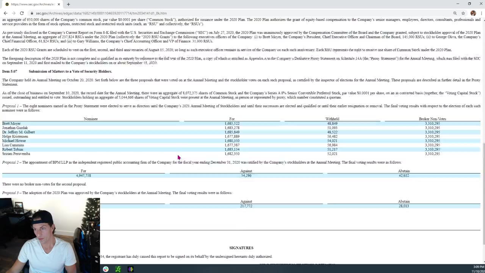

**图怎么看：**

- 画面中，可以看到一个股票交易软件界面，左侧是实时报价窗口，中间是K线图，右侧是成交量柱状图。
- 成交量柱的高度反映对应周期内的总成交量；红绿着色通常跟随价格柱的涨跌规则，不能直接拆成两种方向的主动成交。
- 通过观察这些图表，可以分析股票的价格趋势和市场情绪。
- 画面中的实时报价窗口提供了当前股票的买卖价差和成交量等关键信息。

### 关键内容

- 开盘跳空的股票通常需要大于10%的跳空幅度，且浮筹量较低。
- 查看新闻和SEC文件是识别跳空股票的重要步骤。
- 浮筹量低于1000万的股票更值得考虑。
- 成交量在开盘前需要达到一定水平，通常超过100万。
- 关注股票的历史表现，如是否突破关键阻力位。
- 使用技术指标分析股票走势，如移动平均线。
- 跟踪新闻和公告，确保信息的时效性。
- 避免低成交量股票，因为它们可能有较大的价差。
- 建立股票观察列表时，优先考虑具有新闻和公告的股票。
- 使用免费的在线服务（如FinViz）进行初步筛选

### 分析与执行顺序

1. 登录交易平台，查看当天开盘跳空的股票。
2. 筛选出跳空幅度大于10%且浮筹量较低的股票。
3. 搜索这些股票的相关新闻和SEC文件。
4. 查看股票的技术指标，如浮筹量、成交量和移动平均线。
5. 记录下这些股票的关键信息，包括支持和阻力位。
6. 将这些股票加入观察列表，以便后续跟踪。
7. 定期更新观察列表，剔除不再符合标准的股票

### 案例与细节

- G-Tech 股票开盘跳空，浮筹量约为400万股，新闻涉及电驱动叉车电机。
- MEDS 股票开盘跳空，浮筹量为300万股，新闻涉及投资者会议和与亚马逊的合作。
- WISA 股票开盘跳空，浮筹量为1000万股，最近一次财报显示8K文件。
- APVO 股票开盘跳空，浮筹量为2000万股，新闻涉及重大涨幅后的稳定。
- BVO 股票开盘跳空，浮筹量为1000万股，新闻涉及继续上涨的潜力

### 风险与边界

- 开盘跳空的股票可能面临较大的回调风险。
- 低成交量股票可能有较大的价差，增加交易风险。
- 依赖免费在线服务可能错过重要新闻和公告。
- 浮筹量过高的股票可能不符合观察标准。
- 依赖单一指标进行决策可能忽略其他重要因素

### 复盘问题

- 如何确定股票的开盘跳空幅度是否足够大？
- 在构建观察列表时，哪些因素最为关键？
- 如何平衡新闻和技术指标的重要性？

---

## v0468：从模拟账户过渡到真实交易账户

> 日期：2020　·　时长：00:44:00

**本场重点：** 过渡过程中需要关注情绪管理、资金控制和策略选择。

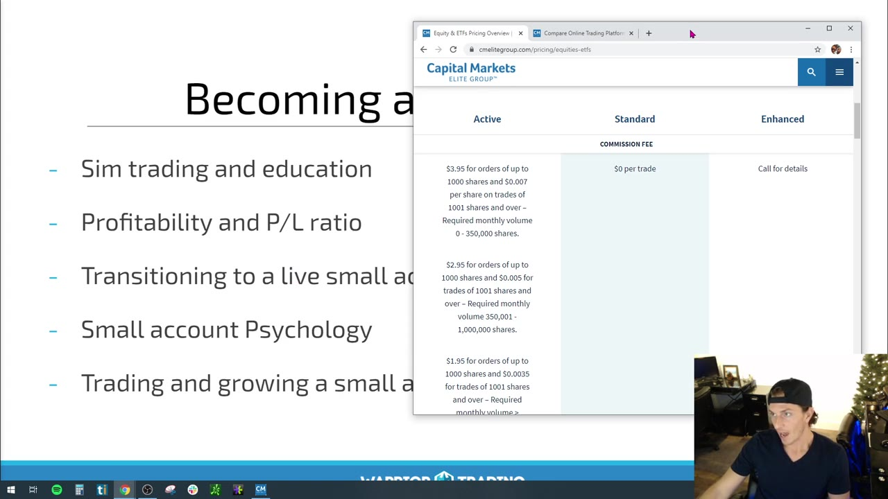

**图怎么看：**

- 幻灯片标题为“Becoming a trader”，项目依次涉及模拟交易与教育、盈利能力和盈亏比、过渡到小额真实账户、小账户心理以及账户增长。
- 右侧同时出现经纪商账户方案页面，能看到不同账户层级和条件栏；它提醒读者，平台选择与账户条件是过渡流程的一部分。
- 这张图对应本场重点：从SIM到实盘不是一次开关，而是先验证策略和风险数据，再缩小资金规模，观察真实盈亏对情绪和执行的影响。
- 画面中的账户方案和费用属于录制时的历史页面，不能作为当前开户条件；实际使用前必须核对经纪商最新官方资料。

### 关键内容

- 过渡初期需要在模拟账户中积累经验，确保交易行为尽可能真实。
- 情绪管理是关键，新手会经历情绪波动，但需要学会控制。
- 资金规模不宜过大，保持小规模账户有助于控制风险。
- 交易策略应根据实际情况调整，避免盲目复制模拟账户的表现。
- 使用五分钟图表可以减少交易波动，提高成功率。
- 保持冷静，避免过度交易，每天交易次数不宜过多。
- 使用杠杆需谨慎，了解风险并合理控制。
- 过渡过程中需要不断学习和实践，逐步建立信心。
- 保持心态平衡，避免因短期亏损而放弃长期目标

### 分析与执行顺序

1. 首先，通过模拟账户积累经验，确保交易行为尽可能真实。
2. 其次，关注情绪管理，学会控制情绪波动，避免冲动交易。
3. 然后，选择适当的资金规模，保持小规模账户有助于控制风险。
4. 接着，根据实际情况调整交易策略，避免盲目复制模拟账户的表现。
5. 最后，保持冷静，避免过度交易，每天交易次数不宜过多。

### 案例与细节

- 讲师提到，新手在模拟账户中可能会经历情绪波动，如手心出汗、心跳加速等。
- 讲师建议使用五分钟图表进行交易，因为它可以减少交易波动，提高成功率。
- 讲师指出，使用杠杆需谨慎，因为可能会增加风险，尤其是在使用高杠杆的情况下。
- 讲师分享了一个案例，说明如何在模拟账户中成功交易，但在真实账户中失败的原因。
- 讲师强调，过渡过程中需要不断学习和实践，逐步建立信心，避免因短期亏损而放弃长期目标。

### 风险与边界

- 过渡初期可能会遇到情绪波动，需要学会控制。
- 资金规模过大可能导致风险失控，需谨慎选择。
- 过度交易可能导致亏损，需控制每日交易次数。
- 模拟账户的表现可能无法完全复制到真实账户中，需灵活调整策略。
- 录制年代限制，部分信息可能不再适用当前市场环境。

### 复盘问题

- 在模拟账户中交易时，如何控制情绪波动？
- 选择适当的资金规模有哪些注意事项？
- 如何根据实际情况调整交易策略？
- 过渡过程中，如何保持冷静，避免过度交易？
- 模拟账户的表现能否完全复制到真实账户中？

---

## v0469：市场意识与交易策略

> 日期：2020　·　时长：02:02:15

**本场重点：** 讲师通过市场意识和交易策略来管理情绪和风险，确保交易成功。

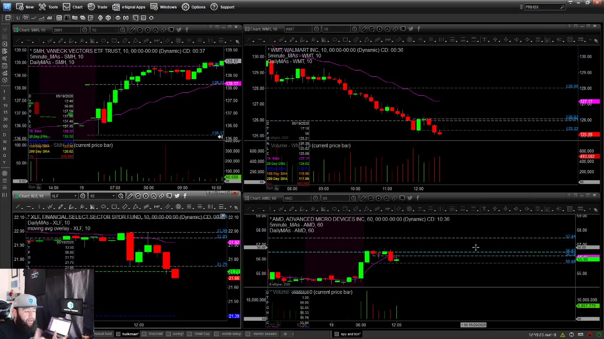

**图怎么看：**

- 在WMT的10分钟K线图中，可以看到股价在下跌趋势中，成交量柱显示了市场的买卖情况。
- 水平线标记了当前的价格点，帮助投资者理解市场波动。
- 图表中的均线（紫色）显示出股票的趋势方向。
- 成交量柱的高度反映对应周期内的总成交量；红绿着色通常跟随价格柱的涨跌规则，不能直接拆成两种方向的主动成交。

### 关键内容

- 讲师使用多个屏幕和图表进行交易分析，重点关注SPY、XLF、KRAQ、IWM等ETF和股票。
- 市场意识的重要性在于识别开盘价和收盘价，使用范围和烛体来判断市场趋势。
- 风险管理包括设置止损，例如在AMD交易中，止损设在69美元。
- 市场情绪管理通过识别关键价位和趋势方向，避免被红绿烛体影响。
- 短期交易策略帮助管理情绪，特别是对于情感驱动的交易者。
- 锁烛形态是重要技术指标，用于确认趋势方向，避免假突破。
- 使用周线图、60分钟图表和日线图来确认趋势方向，直到完全突破。
- 特斯拉的锁烛形态和范围烛确认方法，避免在范围内交易。
- 讲师使用多个屏幕和图表进行交易分析，重点关注SPY、XLF、KRAQ、IWM等ETF和股票，以便全面监控市场动态。
- 市场意识的重要性在于识别开盘价和收盘价，使用范围和烛体来判断市场趋势，例如AMD的内部烛体表明市场可能向下。
- 使用Hulk 3设置来识别反转或延续，例如AMD的Hulk 3设置表明市场可能继续下跌，这需要结合其他技术指标进行综合判断。
- 风险管理包括设置止损，例如在AMD交易中，止损设在69美元，这有助于控制潜在的交易损失，确保资金安全。
- 市场情绪管理通过识别关键价位和趋势方向，避免被红绿烛体影响，这要求交易者具备较强的心理素质和冷静的判断力

### 分析与执行顺序

1. 讲师使用多个屏幕和图表进行交易分析，包括60分钟图、日线图等。
2. 识别关键价位和趋势方向，使用范围和烛体来判断市场趋势。
3. 使用Hulk 3设置来识别反转或延续，例如AMD的Hulk 3设置表明市场可能继续下跌。
4. 设置止损，例如在AMD交易中，止损设在69美元。
5. 使用外部屏幕捕捉卡进行交易记录，以避免系统资源被占用。
6. 使用锁烛形态确认趋势方向，避免假突破。

### 案例与细节

- 使用AMD的Hulk 3设置来识别市场可能继续下跌。
- 使用XLF的范围突破来决定市场可能继续上涨。
- 使用特斯拉的锁烛形态来确认趋势方向。
- 使用范围烛确认方法，避免在范围内交易。
- DDOG、ZM 和特斯拉在关键价位的突破和回调，显示了市场力量的作用，例如特斯拉的回调验证了下一个目标区域的重要性。
- 短期交易策略帮助管理情绪，特别是对于情感驱动的交易者，例如在JMI-A股票上的交易经历，克服了情绪波动的影响。
- 使用特斯拉的锁烛形态来确认趋势方向，例如特斯拉的锁烛形态表明市场可能继续上涨，这需要结合其他技术指标进行综合判断

### 风险与边界

- 市场条件变化可能导致策略失效，需持续关注市场动态。
- 情绪管理依赖个人经验，不同交易者可能有不同的应对方式。
- 交易记录依赖外部设备，设备故障可能影响交易。
- 策略基于历史数据，未来市场可能有所不同。
- 市场条件变化可能导致策略失效，例如SPY日线图上的缺口和第二轮21天移动，确认趋势方向，但未来市场可能有所不同。
- 情绪管理依赖个人经验，不同交易者可能有不同的应对方式，例如在情绪失控时及时退出交易，避免进一步损失，但这种方法并非适用于所有人。
- 交易记录依赖外部设备，设备故障可能影响交易，例如使用外部屏幕捕捉卡进行交易记录，但设备故障可能导致交易中断
- 策略基于历史数据，未来市场可能有所不同，例如使用范围烛确认方法，避免在范围内交易，但未来市场走势可能与历史数据有所偏差

### 复盘问题

- 如何使用市场意识来识别关键价位和趋势方向？
- 在交易过程中，如何设置和管理止损？
- 使用外部屏幕捕捉卡进行交易记录有哪些优势和挑战？
- 锁烛形态如何帮助识别假突破？

---

## v0470：基础图表分析与交易策略

> 日期：2020　·　时长：03:17:00

**本场重点：** 1. 如何利用磁性区域进行交易；2. 交易策略开发的关键步骤；3. 如何避免盲目跟随市场信号。

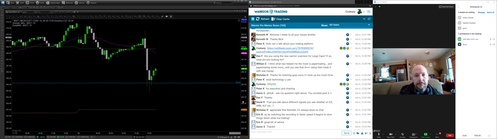

**图怎么看：**

- 画面中，可以看到一个股票的K线图，显示了价格波动和成交量的变化。
- 水平的绿色和紫色线代表均线，帮助识别趋势。
- 成交量柱的高度反映对应周期内的总成交量；红绿着色通常跟随价格柱的涨跌规则，不能直接拆成两种方向的主动成交。
- 通过观察这些图表，可以学习如何利用磁性区域进行交易。

### 关键内容

- 讲师使用10分钟和60分钟的范围棒作为主要分析工具，关注开盘价和磁性区域。
- 交易策略需要时间和专注，初期阶段需要反复练习，建立知识库。
- 交易策略开发需要记录屏幕，使用OBS软件进行屏幕录制，避免情绪反应。
- 交易初期情绪波动大，需要建立长期目标，避免陷入循环。
- 市场突破后会形成新的趋势，直到被新的回调打破，需等待回调确认趋势反转。
- 样本集练习有助于建立策略，识别犹豫或恐惧的原因，建立信号识别和执行的肌肉记忆。
- 交易初期应写下交易计划，减少冲动交易，提高理性决策。
- 宏观环境对交易有影响，但技术分析需考虑整体市场趋势。
- 交易策略应根据个人风格和风险偏好进行选择，避免盲目跟随市场信号
- 讲师强调，交易策略的有效性依赖于市场条件的变化，需持续监控，否则可能导致亏损。
- 交易初期情绪波动大，需要建立长期目标，避免陷入循环，这有助于保持冷静，减少冲动交易。
- 使用Level 2信号进行交易，避免被虚假信号误导，学习阅读Level 2，这要求交易者具备一定的市场敏感度。
- 样本集练习有助于建立策略，识别犹豫或恐惧的原因，建立信号识别和执行的肌肉记忆，这需要耐心和反复实践。
- 交易策略应根据个人风格和风险偏好进行选择，避免盲目跟随市场信号，这要求交易者具备独立思考的能力

### 分析与执行顺序

1. 讲师首先介绍了基础图表分析工具，包括10分钟和60分钟的范围棒。
2. 接着讲解了如何识别磁性区域，并在市场回调时重新进入或退出。
3. 强调了交易策略开发的重要性，需要反复练习和记录屏幕。
4. 建议交易者建立长期目标，避免情绪波动，通过样本集练习来克服犹豫。
5. 提醒交易者使用Level 2信号进行交易，避免被虚假信号误导。
6. 最后，讲师分享了如何利用市场方向和范围测试来预测市场走势，以及如何利用这些信息进行交易。

### 案例与细节

- 在ES（E-mini S&P 500）上进行交易，识别流动性抓取点和设置目标价格。
- 使用10分钟范围棒关注开盘价，当市场突破后等待回调确认趋势反转。
- 通过样本集练习，识别犹豫或恐惧的原因，建立信号识别和执行的肌肉记忆。
- 使用Level 2信号进行交易，避免被虚假信号误导，学习阅读Level 2。
- 在市场回调到某个区域时重新进入或退出，利用磁性区域进行交易。
- 通过反复练习，建立策略，避免冲动交易，专注于长期目标。
- 在ES（E-mini S&P 500）上进行交易时，识别流动性抓取点和设置目标价格，这需要交易者具备敏锐的市场洞察力。
- 使用10分钟范围棒关注开盘价，当市场突破后等待回调确认趋势反转，这要求交易者具备耐心和纪律。
- 通过样本集练习，识别犹豫或恐惧的原因，建立信号识别和执行的肌肉记忆，例如在市场回调到某个区域时重新进入或退出，这需要交易者具备实战经验。
- 使用Level 2信号进行交易，避免被虚假信号误导，学习阅读Level 2，例如在市场回调到某个区域时重新进入或退出，这要求交易者具备一定的市场敏感度。
- 在市场回调到某个区域时重新进入或退出，利用磁性区域进行交易，例如在ES（E-mini S&P 500）上进行交易，这需要交易者具备敏锐的市场洞察力

### 风险与边界

- 交易策略的有效性依赖于市场条件的变化，需持续监控。
- 使用Level 2信号进行交易可能受到市场波动的影响，需谨慎。
- 样本集练习的效果取决于个人经验，需不断调整。
- 宏观环境对交易有影响，需结合技术分析进行决策。
- 录制年代限制为2020年，当前市场条件可能有所不同。
- 使用Level 2信号进行交易可能受到市场波动的影响，需谨慎，否则可能导致亏损。
- 样本集练习的效果取决于个人经验，需不断调整，否则可能无法有效建立交易策略。
- 宏观环境对交易有影响，需结合技术分析进行决策，否则可能导致判断失误。
- 录制年代限制为2020年，当前市场条件可能有所不同，需注意市场变化

### 复盘问题

- 如何利用磁性区域进行交易？
- 交易策略开发的关键步骤是什么？
- 如何避免盲目跟随市场信号？
- 交易初期应如何建立长期目标？
- 样本集练习如何帮助建立交易策略？

---

## v0471：股票交易策略与风险管理

> 日期：2020　·　时长：00:41:51

**本场重点：** 如何根据市场反应决定是否卖出股票；何时增加仓位；如何利用Level 2数据进行交易。

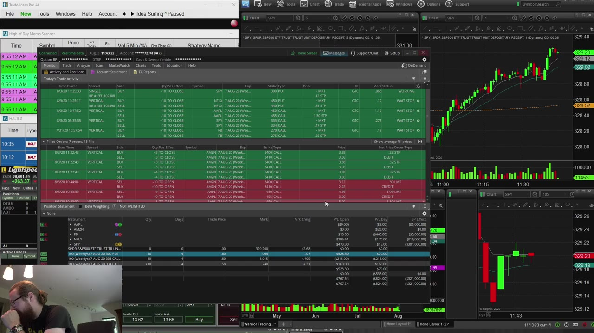

**图怎么看：**

- Level 2 的颜色和条带属于平台的报价分区与显示约定；实际市场深度要看价位、挂单数量、价差以及挂单随时间的变化。
- Level 2数据提供了实时的买卖盘信息，帮助投资者了解当前市场的买卖意愿。
- 通过观察Level 2数据中的买卖盘，投资者可以判断市场趋势和潜在的交易机会。
- 例如，在此截图中，可以看到不同价位的买卖盘数量，有助于做出买卖决策。

### 关键内容

- 交易者需要根据市场反应来决定是否卖出股票，而不是仅仅依赖新闻本身。
- 增加仓位需要基于经验，且随着仓位增大，滑点风险也会增加。
- 使用Level 2数据可以帮助交易者更好地理解买卖盘情况，但并非所有交易者都使用它。
- 在市场冷热变化时，交易策略也需要相应调整。
- 止损单在非开盘时段可能无法生效，因此需要特别注意。
- 交易者应根据市场深度和流动性的变化来决定何时买入或卖出。
- 使用Level 1数据可以减少交易成本，但可能牺牲一些信息的准确性。
- 交易者需要根据市场情况灵活调整交易策略，以适应不同的市场环境。
- 交易者应关注市场热点，如VWAP突破，但也要注意风险控制。
- 交易者需要定期回顾自己的交易记录，以改进策略和风险管理

### 分析与执行顺序

1. 首先，交易者需要关注市场的即时反应，而不是仅仅依赖新闻本身。
2. 其次，交易者需要根据自己的经验来决定何时增加仓位，同时注意滑点风险。
3. 然后，交易者可以使用Level 2数据来更好地理解买卖盘情况，但需要根据自己的需求选择是否使用。
4. 接着，交易者需要根据市场冷热变化来调整自己的交易策略。
5. 最后，交易者需要定期回顾自己的交易记录，以改进策略和风险管理。
6. 在整个过程中，交易者需要保持灵活性，以便适应不断变化的市场环境。
7. 交易者还需要注意市场深度和流动性变化，以做出更明智的买卖决策

### 案例与细节

- AMBO股票在一天内上涨了75,000美元，交易者决定不卖出，而是继续持有。
- 交易者在苹果股票上进行了多次交易，每次交易的规模逐渐增加。
- 交易者使用Level 2数据观察到一股股票的买盘突然增加，决定买入。
- 交易者在市场冷热变化时，调整了自己的交易策略，从积极交易转向保守交易。
- 交易者在市场突破VWAP后，决定卖出部分股票，但最终发现这是一个错误的决策

### 风险与边界

- 在非开盘时段，止损单可能无法生效，因此需要特别注意。
- 增加仓位会增加滑点风险，可能导致亏损。
- 使用Level 2数据需要额外的学习成本，且并非所有交易者都能有效利用。
- 市场冷热变化可能导致交易策略失效，需要及时调整。
- 交易者需要定期回顾自己的交易记录，以改进策略和风险管理，但这一过程可能耗时且复杂

### 复盘问题

- 在决定卖出股票时，您是如何评估市场的即时反应的？
- 您是如何根据自己的经验来决定何时增加仓位的？
- 您是如何使用Level 2数据来辅助交易决策的？
- 当市场冷热变化时，您的交易策略是如何调整的？
- 您是如何定期回顾自己的交易记录，以改进策略和风险管理的？

---

## v0472：无指标纯蜡烛图交易策略

> 日期：2020　·　时长：01:49:47

**本场重点：** 识别关键区域的交易信号，避免过度交易，保持冷静。

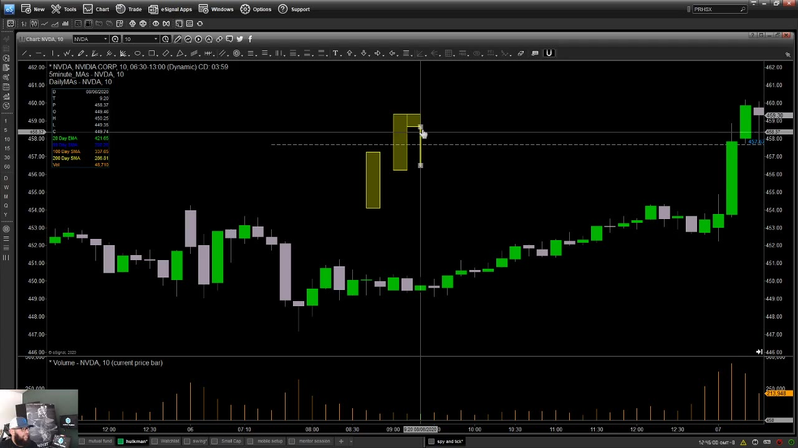

**图怎么看：**

- 在NVIDIA Corp (NVDA)的10分钟K线图中，可以看到价格在不同时间段内波动。
- 绿色柱状图表示价格上涨，灰色柱状图表示价格下跌。
- 水平线显示了短期和长期移动平均线（SMA），帮助识别趋势。
- 成交量柱显示了市场活动，有助于理解价格变动的原因。

### 关键内容

- 讲师使用无指标的纯蜡烛图交易，关注市场缺口和关键点位。
- 通过观察蜡烛形态，如缺口蜡烛和吞没蜡烛，判断市场趋势。
- 保持简单交易策略，避免复杂分析，使用紧停单控制风险。
- 交易时需关注市场波动和蜡烛形态，避免情绪影响决策。
- 记录交易屏幕，有助于回顾和提高识别市场信号的能力。
- 在接近关键区域时，会看到大量订单通过，表明股票正在被关注。
- 识别持续上涨后的回调机会，避免错误的短空。
- 识别强股的重要性，避免被强股反扑。
- 不要因为红烛就急于做空，要等待确认信号。
- 讲师强调了识别流动性抓取的重要性，避免误判为短空机会。在快速上升后，识别回调机会至关重要。
- 通过观察成交量和买卖盘，可以识别股票的动向，特别是在关键区域出现时。这有助于判断市场的真实需求。
- 保持冷静，避免过度交易，特别是在市场波动较大时。情绪管理是交易成功的关键。
- 使用紧停单控制风险，避免被市场快速波动影响。简单交易策略有助于减少决策失误。
- 记录交易屏幕，可以帮助交易者在情绪消退后回顾，从而更好地理解市场信号，提高交易技能。

### 分析与执行顺序

1. 开盘后观察市场反应，寻找关键点位。
2. 使用蜡烛形态判断市场趋势，如缺口蜡烛、吞没蜡烛等。
3. 根据市场反应调整仓位大小。
4. 记录交易屏幕，以便在情绪消退后回顾。
5. 识别大订单和关键区域的交易信号，特别是在关键区域出现时。
6. 在接近关键区域时，注意大量订单通过，表明股票正在被关注。

### 案例与细节

- 特斯拉（TSLA）：利用蜡烛形态和市场波动成功交易。
- 英伟达（NVDA）：利用蜡烛形态和市场波动成功交易。
- 价格波动达到808，希望看到更大的回调来再次进入。
- 记录交易屏幕，以便在情绪消退后回顾。
- 特斯拉（TSLA）：在开盘后观察市场反应，寻找缺口填充和蜡烛形态变化，成功利用蜡烛形态和市场波动进行交易。
- 英伟达（NVDA）：关注市场缺口和蜡烛形态，寻找突破和反转信号，成功交易。
- 价格波动达到808，讲师希望看到更大的回调来再次进入，这表明在特定价位观察市场反应的重要性。

### 风险与边界

- 缺口未能成功填充可能导致交易失败。
- 蜡烛形态未能突破关键点位可能导致交易失败。
- 市场波动可能导致交易失败。
- 录制年代限制，平台、监管、税务和经纪商条件只能表述为历史录制内容。
- 缺口未能成功填充可能导致交易失败，特别是在市场预期强烈时。这反映了市场情绪的不可预测性。
- 蜡烛形态未能突破关键点位可能导致交易失败，特别是在市场趋势不明朗时。这反映了技术分析的局限性。
- 市场波动可能导致交易失败，特别是在交易者情绪不稳定时。这反映了情绪管理的重要性。

### 复盘问题

- 如何识别关键区域的交易信号？
- 在交易过程中，如何避免过度交易？
- 记录交易屏幕对交易有哪些帮助？
- 如何通过蜡烛形态判断市场趋势？

---

## v0473：交易策略与风险管理

> 日期：2020　·　时长：02:28:07

**本场重点：** 交易时注意市场暂停后的恢复情况，如价格可能大幅下跌。交易时，注意市场暂停后的恢复情况，如价格可能大幅下跌。

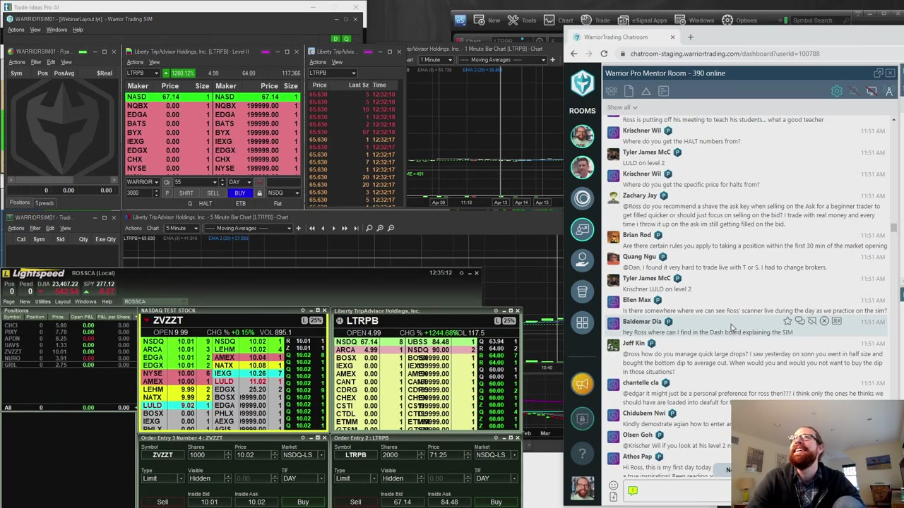

**图怎么看：**

- 在Liberty TripAdvisor Holdings, Inc.的5分钟K线图中，可以看到价格在不同时间段内波动。
- 成交量柱的高度反映对应周期内的总成交量；红绿着色通常跟随价格柱的涨跌规则，不能直接拆成两种方向的主动成交。
- 水平线表示移动平均线，帮助识别趋势。
- 图表顶部显示了实时价格和成交量数据。

### 关键内容

- 使用LightSpeed软件，每月费用$175，但不需要订阅E-Signal。
- 某些股票可能会出现异常波动，如股价大幅上涨后又迅速下跌。交易时应谨慎，避免大额亏损。
- 使用止损单时，应是心理止损，而非实际止损。
- 交易恢复后，可能会出现大幅波动，需谨慎操作。
- 讲师强调了使用模拟器进行练习的重要性，指出订单执行速度和市场数据延迟是需要特别注意的细节。
- 在交易过程中，使用LightSpeed软件可以设置10分钟内低于当前出价的止损单，这有助于控制风险。
- 交易时，使用Excel表格记录交易细节，可以帮助新手更好地跟踪和分析自己的交易表现。
- 讲师提醒学生注意市场异常波动，如股票价格突然大幅上涨或下跌，这要求交易者保持冷静并采取适当措施。
- 使用特定图表工具和技术，如趋势线和蜡烛图形态，可以帮助识别交易机会，但需要结合市场实际情况灵活应用

### 分析与执行顺序

1. 讲师建议新手先用模拟账户交易一个月，确保盈利后再切换到真实资金账户。
2. 交易时，使用小规模资金，如100股，逐步增加至200股、300股。
3. 交易前隐藏盈亏表，避免情绪波动影响决策。
4. 交易过程中，注意成交量的变化，如成交量减少可能预示着反转。
5. 交易时，注意市场状态，如市场暂停和恢复。交易暂停期间，不能下单，只能查看订单状态。

### 案例与细节

- 使用LightSpeed软件进行交易，每月费用$175。
- 交易时，使用100股作为初始资金，逐步增加至200股、300股。
- 交易时，关注价格模式和首次蜡烛突破新高点。
- 交易过程中，注意成交量减少可能预示着反转。
- 使用LightSpeed软件进行交易时，可以设置10分钟内低于当前出价的止损单，这有助于控制风险，防止价格突然下跌带来的损失。
- 交易时，使用100股作为初始资金，逐步增加至200股、300股，这有助于新手逐步熟悉市场，减少初期的大额亏损。
- 交易过程中，使用Excel表格记录交易细节，如日期、时间、买入卖出价格、成交量等，这有助于新手更好地跟踪和分析自己的交易表现。
- 交易时，使用蜡烛图形态识别市场趋势，如看涨或看跌，这有助于识别交易机会，但需要结合市场实际情况灵活应用

### 风险与边界

- 交易时，注意市场暂停后的恢复情况，如价格可能大幅下跌。交易时，注意市场暂停后的恢复情况，如价格可能大幅下跌。交易时，注意市场暂停后的恢复情况，如价格可能大幅下跌。
- 交易时，如果市场出现异常波动，如股价突然大幅上涨或下跌，可能会导致交易者被套牢，需等待数分钟才能得知是否恢复交易。
- 交易时，如果市场暂停期间未能及时撤单，可能会导致大额亏损，因此及时撤单非常重要。
- 交易时，如果市场暂停后恢复，可能会出现大幅波动，需谨慎操作，否则可能导致大额亏损。
- 交易时，如果市场暂停时间过长，可能会导致交易者错过最佳交易时机，从而影响盈利

### 复盘问题

- 交易时，如何避免大额亏损？
- 交易过程中，如何识别市场暂停和恢复？
- 交易时，如何利用图表工具和技术来识别交易机会？
- 交易时，如何设置订单价格和止损单？

---

## v0474：七月交易总结与策略调整

> 日期：2020　·　时长：01:01:09

**本场重点：** 1. 交易表现波动，需调整策略以适应市场变化；2. 增加仓位大小，尝试更多机会；3. 需要平衡风险与收益。

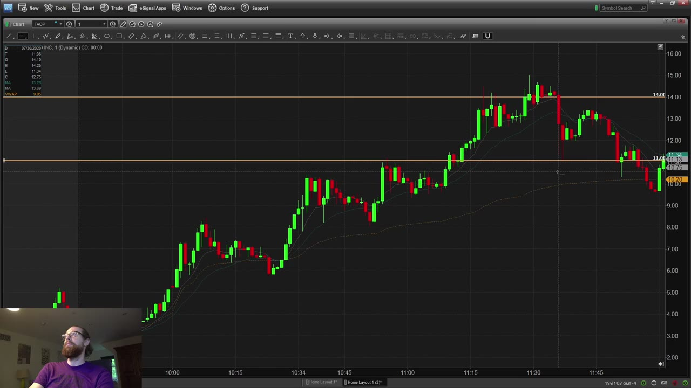

**图怎么看：**

- 在图表中可以看到价格波动较大，表明市场环境不稳定。
- 需要根据市场变化调整交易策略，以提高盈利能力和风险管理。
- 增加仓位大小，尝试更多机会，以应对市场的不确定性。
- 保持对市场动态的敏感性，灵活调整交易计划，以实现更好的收益

### 关键内容

- 七月总体表现良好，但存在一些波动，需要调整策略。
- 市场异常火热，导致一些大额亏损。
- 通过调整仓位大小，尝试更多机会，以适应市场变化。
- 保持冷静，避免因情绪波动而做出错误决策。
- 使用止损单，减少大额亏损的风险。
- 利用技术指标，如突破点和支撑位，进行交易。
- 记录交易表现，以便后续分析和改进。
- 关注市场动态，及时调整交易策略

### 分析与执行顺序

1. 回顾七月交易表现，总结成功与失败的经验。
2. 分析市场状况，确定当前市场的特点。
3. 调整交易策略，增加仓位大小，尝试更多机会。
4. 使用止损单，控制风险，避免大额亏损。
5. 记录每次交易的表现，以便后续分析和改进。
6. 在模拟器中练习，提高实际交易中的表现。
7. 保持耐心，逐步增加仓位大小，避免过早爆仓

### 案例与细节

- SSNT 在预市中表现不佳，尽管初期有上涨趋势，但最终下跌，导致亏损。
- TAOP 在周五出现失败的低点买入，导致大幅亏损。
- Facebook 的日内交易表现良好，但隔夜交易表现不佳。
- 特斯拉的看涨期权交易决策基于对市场走势的判断。
- Netflix 的交易表现稳定，显示出良好的盈利潜力。
- 使用 ARCA 系统进行订单设置，以获得更好的成交价格

### 风险与边界

- 市场状况可能发生变化，导致策略失效。
- 过度自信可能导致决策失误。
- 模拟器表现与真实市场可能存在差异。
- 市场波动性增加，可能导致更大波动。
- 策略调整需要时间，短期内可能无法立即见效

### 复盘问题

- 七月的交易表现有哪些亮点和不足？
- 如何根据市场变化调整交易策略？
- 在模拟器中练习时，需要注意哪些关键点？
- 如何平衡风险与收益，避免过早爆仓？
- 如何利用技术指标进行更准确的交易决策？

---

## v0475：APVO股票交易实战

> 日期：2020　·　时长：00:58:11

**本场重点：** 通过APVO股票的交易实例，讲解如何识别交易机会并执行策略。

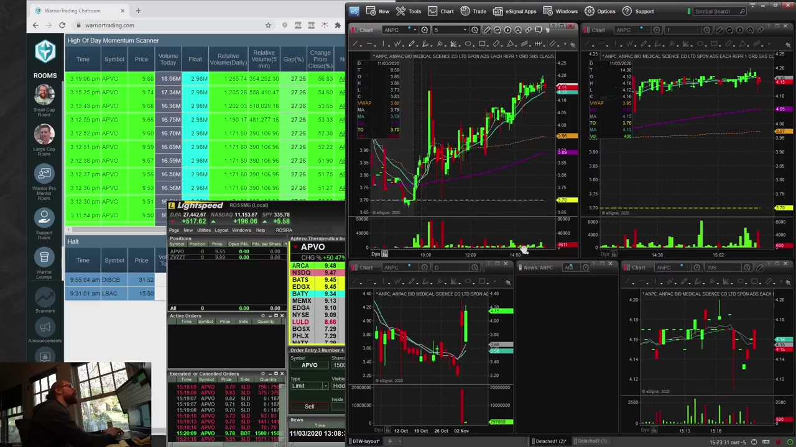

**图怎么看：**

- 画面中，可以看到APVO股票的实时交易数据，包括价格、成交量和时间序列。
- 图表显示了APVO股票的日线图，包含了移动平均线（MA）、相对强弱指数（RSI）和其他技术指标。
- 表格部分展示了多个股票的交易数据，包括价格、成交量和时间序列。
- 这些图表和数据有助于交易者识别市场趋势和交易机会。

### 关键内容

- APVO股票在早间出现大幅下跌，但随后反弹并突破了VWAP（成交量加权平均价格），形成了一个短期交易机会。
- 交易者利用VWAP突破来识别潜在的买入信号，并在短时间内实现了盈利。
- 交易过程中，需要关注市场流动性，尤其是在接近交易日结束时，流动性会显著下降。
- 交易者使用热键快速下单，提高了交易效率。
- 交易者在市场强劲时表现不佳，但在市场较弱时表现较好。
- 交易者通过观察价格走势和成交量变化来判断是否继续持有头寸。
- 交易者利用TD Ameritrade账户进行模拟交易，以适应实际交易环境。
- 交易者通过观察市场情绪和成交量变化来决定是否继续交易。
- 交易者在交易过程中不断调整策略，以应对市场的变化。

### 分析与执行顺序

1. 首先，观察APVO股票的早间走势，发现它经历了大幅下跌，但随后反弹。
2. 接着，识别出VWAP突破作为潜在的买入信号，这表明市场可能正在反转。
3. 然后，迅速下单买入，利用热键提高下单速度。
4. 之后，监控价格走势，确保头寸能够继续盈利。
5. 最后，在接近交易日结束时，注意市场流动性降低，减少大额交易的风险。
6. 在整个交易过程中，持续监控市场动态，调整策略以应对市场变化。
7. 在交易日结束前，根据市场情况决定是否继续持有头寸。

### 案例与细节

- APVO股票在早间下跌了约6000美元，但随后反弹并突破了VWAP，形成了一个短期交易机会。
- 交易者在VWAP突破后迅速下单买入，最终在一天内实现了约863美元的盈利。
- 交易者使用热键快速下单，显示了交易过程中的高效性。
- 交易者在市场强劲时表现不佳，但在市场较弱时表现较好，这反映了市场情绪对交易结果的影响。
- 交易者在接近交易日结束时增加了风险，因为此时市场流动性降低，容易出现假突破。

### 风险与边界

- 在接近交易日结束时，市场流动性降低，可能导致假突破，增加交易风险。
- 交易者在市场强劲时表现不佳，这反映了市场情绪对交易结果的影响。
- 交易者依赖热键下单，可能会忽略市场细节，导致决策失误。
- 交易者在交易过程中不断调整策略，这可能增加决策的复杂性。

### 复盘问题

- 在识别交易机会时，交易者是如何判断VWAP突破的？
- 交易者在市场强劲时表现不佳，这反映了哪些因素？
- 交易者在接近交易日结束时增加了风险，这反映了哪些市场特点？
- 交易者如何利用TD Ameritrade账户进行模拟交易？
- 交易者在交易过程中如何调整策略以应对市场的变化？

---

## v0476：交易策略与风险管理

> 日期：2020　·　时长：00:54:39

**本场重点：** 交易新手应关注开盘时段，利用技术指标进行快速决策，避免高风险交易。

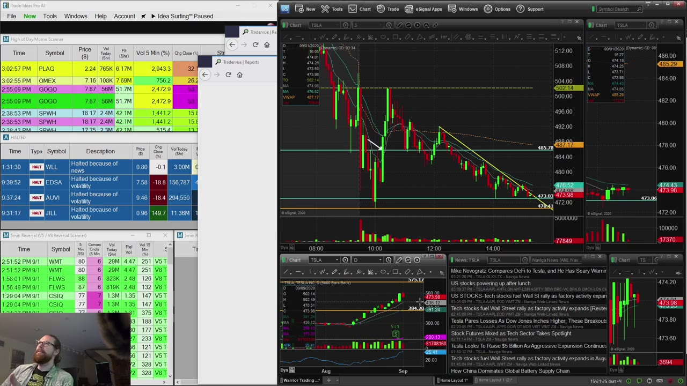

**图怎么看：**

- 在1147秒时，显示了多个股票的实时数据，包括价格、成交量和波动率。
- 可以看到多个股票的K线图，显示出它们的价格走势和成交量。
- 图表中还显示了均线（MA）和其他技术指标，帮助分析股票的趋势。
- 表格部分显示了不同股票的详细信息，如名称、代码、价格等。

### 关键内容

- 交易新手应从模拟账户开始，证明盈利后再转入实盘。
- 开盘时段是新手最安全的交易时间，通常在9:30到10:00之间。
- 使用止损单和止盈单可以有效控制风险，但需注意市场波动。
- 特斯拉五分钟图显示底部形态，可能预示着后续的下跌。
- 使用相对成交量和价格行动来识别潜在的交易机会。
- 保持账户余额较高，以应对偶尔出现的高风险交易。
- 利用图表工具和技术指标辅助决策，如移动平均线和支撑阻力位。
- 避免在市场波动大时进行高风险交易，特别是在下午时段。
- 定期调整交易策略，以适应市场的变化。
- 保持冷静，避免情绪化交易，尤其是在连续亏损后

### 分析与执行顺序

1. 讲师首先解释了如何计算利润损失比，并强调了保持一比一的比例的重要性。
2. 然后讲师展示了如何使用技术指标来识别交易机会，例如特斯拉的五分钟图。
3. 接着讲师讨论了如何根据市场情况调整交易规模，从较小规模开始逐渐增加。
4. 讲师还强调了使用止损单和止盈单的重要性，以控制风险。
5. 最后，讲师提醒学员要保持冷静，避免情绪化交易，特别是在连续亏损后。

### 案例与细节

- KBNT在某个价位出现了大量卖盘，随后价格突破并回落，讲师决定退出。
- 特斯拉五分钟图显示底部形态，但价格并未突破关键阻力位，讲师认为继续持有。
- 特斯拉的相对成交量较低，尽管新闻显示有大规模直接发行。
- 特斯拉五分钟图显示价格在473附近形成双底形态，但价格并未突破关键支撑位。

### 风险与边界

- 市场波动性较大时，高风险交易可能导致较大亏损。
- 使用止损单和止盈单可能会导致即时卖出，从而错过后续的盈利机会。
- 市场环境变化时，交易策略需要适时调整。
- 交易新手在模拟账户中表现良好，但在实盘中可能面临更多挑战。

### 复盘问题

- 如何根据市场情况调整交易规模？
- 在哪些时间段进行交易最为安全？
- 如何利用技术指标识别潜在的交易机会？
- 如何在保持盈利的同时控制风险？
- 在连续亏损后，应该如何调整心态继续交易？

---

## v0477：Warrior Pro 学生常见问题解答

> 日期：2020　·　时长：00:34:59

**本场重点：** 1. 课程开始时间不确定，一般在11点到12点之间。2. 交易策略包括买低点和设置心理止损。3. 模拟交易中初期亏损是正常的。

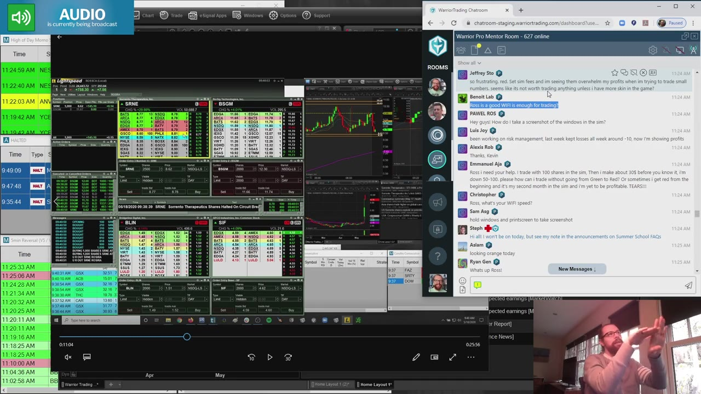

**图怎么看：**

- 在Level 2窗口中可以看到多个股票的报价，包括EDGX、ARCA、BATS等。
- 实时交易数据显示了当前的买卖价差和成交量。
- 表格中列出了不同股票的最新价格、成交量和其他相关信息。
- 此截图有助于理解交易策略中的心理止损和市场动态。

### 关键内容

- 讲师提到模拟交易中初期亏损是正常的，因为测试策略。
- 交易策略包括买低点，特别是五分钟图表上的突破。
- 模拟交易中初期亏损是正常的，因为需要适应真实市场。
- 交易过程中可能会遇到延迟，需要及时取消订单。
- 使用心理止损时，需要保持冷静，避免情绪化决策。
- 模拟交易中，初期亏损是正常现象，需要逐步提高交易技巧。
- 交易过程中可能会遇到大卖家，需要灵活应对。
- 讲师提到，模拟交易中初期亏损是正常的，因为需要适应真实市场。这表明学生不应因初期亏损而感到沮丧，而是要继续练习以提高技能。
- 交易过程中可能会遇到大卖家，需要灵活应对。例如，ACB在模拟交易中表现不佳，但通过调整交易策略，最终获得了利润。这说明即使初期表现不佳，通过调整策略也能获得成功。
- 使用心理止损时，需要保持冷静，避免情绪化决策。例如，当SR&E出现大卖家时，交易者未能及时止损，导致损失部分利润。这强调了冷静分析的重要性。
- 模拟交易中，初期亏损是正常现象，但如果无法适应真实市场，可能会影响实际交易。例如，ACB的价格波动较大，需要密切关注。这提醒学生要时刻关注市场变化。
- 交易策略包括买低点，特别是五分钟图表上的突破。例如，在SR&E的模拟交易中，交易者抓住了五分钟图表上的突破机会，成功进行了交易。这说明利用图表进行交易可以提高成功率。
- 模拟交易中，初期亏损是正常现象，需要逐步提高交易技巧。例如，通过多次模拟交易，学生可以逐渐熟悉市场规律，提高交易技巧。这表明模拟交易是提高交易技能的有效途径。

### 分析与执行顺序

1. 讲师首先回答了关于夏季学校课程时间的问题。
2. 然后解释了模拟交易中初期亏损是正常的，因为需要适应真实市场。
3. 接着讨论了交易策略，包括买低点和设置心理止损。
4. 最后提到了交易过程中可能会遇到大卖家，需要灵活应对。
5. 在整个过程中，讲师强调了模拟交易的重要性，并鼓励学生多练习。

### 案例与细节

- ACB 在模拟交易中表现不佳，但通过调整交易策略，最终获得了利润。
- SR&E 在模拟交易中出现大卖家，导致交易者损失了部分利润。
- 模拟交易中，ACB 的价格波动较大，需要密切关注。
- ACB在模拟交易中表现不佳，但通过调整交易策略，最终获得了利润。这说明即使初期表现不佳，通过调整策略也能获得成功。
- SR&E在模拟交易中出现大卖家，导致交易者损失了部分利润。这强调了在交易过程中遇到大卖家时需要灵活应对的重要性。
- ACB的价格波动较大，需要密切关注。例如，在模拟交易中，ACB的价格波动较大，需要密切关注。这提醒学生要时刻关注市场变化，以便做出正确的决策。
- 在SR&E的模拟交易中，交易者抓住了五分钟图表上的突破机会，成功进行了交易。这说明利用图表进行交易可以提高成功率。

### 风险与边界

- 模拟交易中初期亏损是正常的，但如果持续亏损，需要重新评估策略。
- 交易过程中可能会遇到大卖家，需要灵活应对，否则可能影响交易。
- 模拟交易中，初期亏损是正常现象，但如果无法适应真实市场，可能会影响实际交易。
- 模拟交易中初期亏损是正常的，但如果持续亏损，需要重新评估策略。例如，如果学生在模拟交易中持续亏损，应该反思自己的交易策略，看看是否有改进的空间。这强调了模拟交易中的持续亏损可能反映真实的交易问题。
- 交易过程中可能会遇到大卖家，需要灵活应对。例如，当遇到大卖家时，如果不能及时止损，可能会导致更大的损失。这说明在交易过程中遇到大卖家时需要灵活应对，否则可能影响交易。

### 复盘问题

- 模拟交易中初期亏损是正常的，那么如何判断是否需要调整交易策略？
- 交易过程中遇到大卖家时，应该如何应对？
- 模拟交易中，初期亏损是正常现象，那么如何逐步提高交易技巧？

---

## v0478：概率在交易中的应用

> 日期：2020　·　时长：01:30:30

**本场重点：** 交易中的概率应用可以帮助交易者做出更合理的决策，但需要避免情绪波动和过早行动。

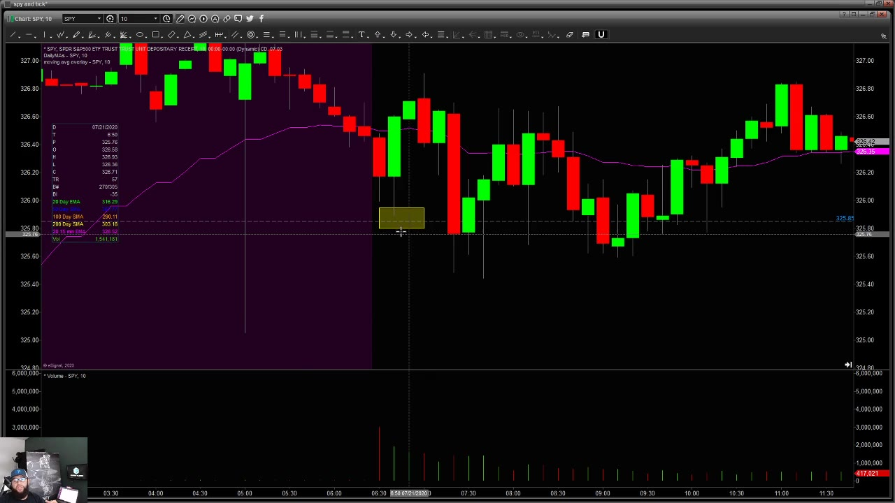

**图怎么看：**

- 这张图显示了Russell 2000 ETF (INM)的日线图，其中包含了价格、成交量、移动平均线等关键指标。
- 可以看到，INM ETF的价格在一段时间内呈现上升趋势，随后出现了一个明显的头部形态。
- 成交量在顶部区域明显放大，表明在这个阶段有大量的买卖活动。
- 这个头部形态可能预示着市场情绪的变化，投资者需要注意风险并谨慎操作。

### 关键内容

- 概率是交易中的重要工具，包括古典概率、相对概率和主观概率。
- 交易新手可以通过记录和经验积累来量化概率。
- 主观概率转化为相对概率时，需要进入交易状态。
- 交易中的常见错误包括过早行动、忽视市场信号和情绪波动。
- 关键策略包括观察价格行为、使用蜡烛图识别关键模式和跟踪市场反应。
- 具体案例如SPY和RUMBLE展示了如何利用关键技术水平和蜡烛图模式。
- 重要时间戳如00:16:40和00:38:20提供了关键信号识别的具体实例。
- 交易者需要注意市场反应，避免情绪影响决策。
- 使用百分比系统进行风险管理可以减少情绪波动的影响。
- 交易者应避免在预市或后市交易，因为这些时段存在风险
- 在交易中，过早行动可能导致错过最佳交易机会，特别是在接近关键技术水平时，需要耐心等待确认信号。
- 主观概率转化为相对概率时，需要结合市场实际表现，通过大量交易数据验证个人判断的准确性。
- 情绪波动不仅会影响交易决策，还可能导致过度交易，从而增加不必要的风险。
- 使用蜡烛图识别关键模式时，需要结合市场历史数据和当前趋势，以提高识别的准确性和可靠性。
- 在交易过程中，观察价格行为和市场反应是至关重要的，这有助于及时调整策略，避免被市场情绪所左右

### 分析与执行顺序

1. 记录屏幕，反复观看，识别关键信号。
2. 分析蜡烛图，识别关键模式。
3. 跟踪市场反应，快速调整策略。
4. 观察价格行为，识别熊陷阱和牛陷阱。
5. 使用蜡烛图识别支撑位和阻力位，以及关键模式。
6. 利用关键技术水平，如支撑位和阻力位，进行交易。
7. 在关键点附近，使用鞭子或旗子推动价格改变方向

### 案例与细节

- 案例一：SPY，接近关键技术水平时成功捕捉价格反转，但过早行动会导致错过最佳时机。
- 案例二：RUMBLE，接近支撑位时成功捕捉价格反转，但过早行动同样会导致错过最佳时机。
- 关键点14780附近的价格波动显示市场不愿回到该区域。
- 使用蜡烛图识别反向立即吞没烛，表明市场方向性改变
- 案例一：SPY在接近关键技术水平时，如果过早行动，可能会错过价格反转的最佳时机，导致交易失败。
- 案例二：RUMBLE在接近支撑位时，如果过早行动，同样会错过价格反转的最佳时机，导致交易失败。
- 案例三：使用蜡烛图识别反向立即吞没烛时，如果忽视了市场的真实反应，可能会误判市场方向，导致交易失误。
- 案例四：在关键点14780附近，如果忽视了价格波动的真实含义，可能会错误地认为市场愿意回到该区域，从而导致交易失误。
- 案例五：在交易过程中，如果忽视了市场反应，可能会被市场情绪所左右，导致过度交易和情绪化决策，从而增加不必要的风险

### 风险与边界

- 过早行动可能导致错过最佳交易机会。
- 忽视市场信号可能导致错误决策。
- 情绪波动可能导致过度交易和情绪化决策。
- 预市或后市交易存在风险，统计数据显示效果不佳
- 过早行动的风险在于可能会错过最佳交易机会，特别是在接近关键技术水平时，需要耐心等待确认信号。
- 忽视市场信号的风险在于可能会导致错误决策，特别是在关键点附近，需要结合市场实际表现进行判断。
- 情绪波动的风险在于可能会导致过度交易和情绪化决策，从而增加不必要的风险，特别是在市场波动较大时。
- 录制年代边界的风险在于，虽然平台和规则只作为历史内容，但交易环境和市场趋势的变化可能导致某些策略不再适用

### 复盘问题

- 如何量化交易中的概率？
- 在交易过程中，哪些常见错误需要避免？
- 如何利用蜡烛图识别关键模式和信号？
- 在交易中，如何使用关键技术水平进行决策？

---

## v0479：Hulk Squeeze 交易策略

> 日期：2020　·　时长：00:38:21

**本场重点：** Hulk Squeeze 是一种利用短期卖家被意外事件惊吓而被迫平仓的机会，通过高短比率和机构持股来放大收益。

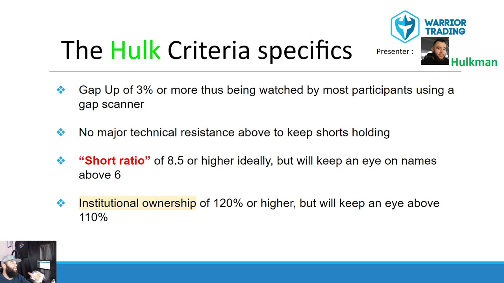

**图怎么看：**

- 该幻灯片详细列出了Hulk Squeeze交易策略中的关键指标，包括缺口上升3%以上、没有重大技术阻力、理想的“Short ratio”为8.5或更高、以及机构持股比例需达到120%或更高。
- 这些指标用于筛选出可能具有高收益潜力的股票。
- 幻灯片还解释了如何解读这些信息，例如，如果一家公司有2000万股流通股，机构A持有全部2000万股，机构B借给机构A500万股并卖给机构C，那么机构A和C都声称拥有这500万股，导致机构A的持股比例可能被报告为2500万股（2000 + 500），即125%。
- 这些指标和解释有助于投资者识别潜在的高收益机会，并理解如何在市场中应用这些策略。

### 关键内容

- 缺口上涨3%以上，伴随意外催化剂，是Hulk Squeeze策略的基础。
- 高短比率（8.5以上）和机构持股（120%以上）是关键指标。
- 机构持股可能通过借入股票来实现，导致股票被大量借出。
- 技术分析和基本面分析结合，可以识别潜在的Hulk Squeeze机会。
- 缺口上涨后，技术支撑线和机构持股共同推动股价上涨。
- Hulk Squeeze策略适用于日内交易和期权交易。
- 策略需要相对成交量，以确认市场兴趣。
- 机构持股和短比率数据通常延迟更新，但准确度较高。
- Hulk Squeeze策略需要结合多种指标，以提高交易胜率。
- 策略适用于多种股票，但需注意特定股票的流动性风险

### 分析与执行顺序

1. 首先，寻找缺口上涨3%以上的股票，伴随意外催化剂。
2. 其次，检查股票的短比率是否高于8.5，机构持股是否超过120%。
3. 然后，确认股票的技术支撑线和机构持股情况。
4. 最后，结合技术分析和基本面分析，确定是否进行交易。
5. 在交易前，确保有足够的相对成交量支持。
6. 交易过程中，密切关注市场动态，及时调整策略。
7. 交易后，评估交易结果，总结经验教训

### 案例与细节

- Ollie股票，初始推升后，技术支撑线和机构持股共同推动股价上涨。
- Billy股票，技术分析和机构持股共同推动股价上涨，持续多日。
- BBBY股票，高短比率和机构持股，配合技术支撑线，形成Hulk Squeeze。
- MCHP股票，近期交易实例，显示Hulk Squeeze策略的有效性。
- GameStop股票，高短比率和机构持股，配合技术支撑线，形成Hulk Squeeze

### 风险与边界

- 机构持股和短比率数据通常延迟更新，可能导致信息滞后。
- 高短比率和机构持股可能引发监管关注，需谨慎操作。
- Hulk Squeeze策略依赖于市场情绪和流动性，流动性不足可能导致交易失败。
- 策略需要结合多种指标，单一指标失效可能导致判断失误。
- Hulk Squeeze策略适用于历史录制内容，当前市场环境可能有所不同

### 复盘问题

- 缺口上涨3%以上的股票有哪些？
- 如何确认股票的短比率和机构持股？
- Hulk Squeeze策略在哪些股票上表现良好？
- 如何结合技术分析和基本面分析来识别Hulk Squeeze机会？
- Hulk Squeeze策略的风险有哪些？

---

## v0480：心态的力量

> 日期：2020　·　时长：01:05:28

**本场重点：** 心态决定交易表现，固定思维与成长思维的区别在于能否持续进步。

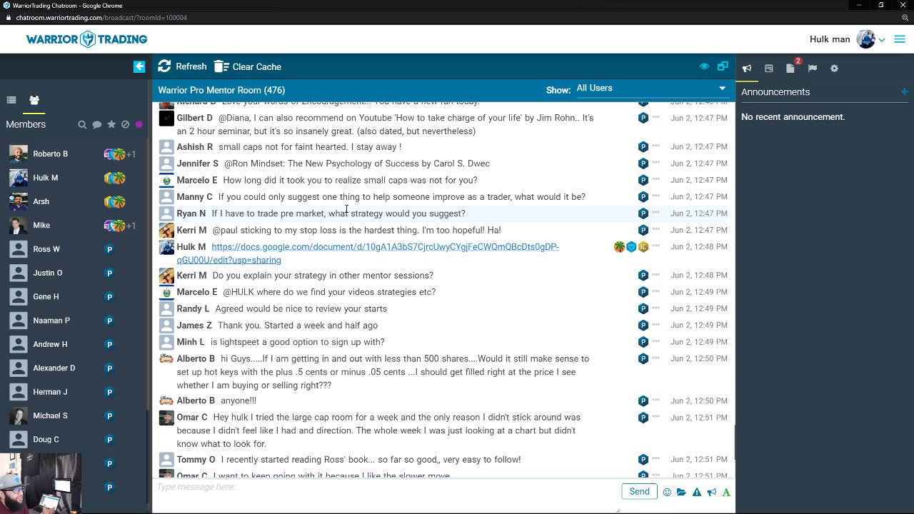

**图怎么看：**

- 幻灯片的问题是“Can you change your Mindset?”，并引用 Carol Dweck 的观点：心态可以通过有意识的练习改变。
- 页面把培养成长型思维的着力点放在努力和过程，而不是只用最终盈亏评价自己。
- 交易复盘时不只写“赚了多少”，还要写清看到了什么 setup、怎样管理仓位，以及哪个执行动作值得保留。
- 这页只提供心态训练方向，不能证明积极思考会直接产生交易优势；结果仍要用长期样本和规则执行验证。

### 关键内容

- 心态影响交易决策，固定思维者认为能力是固定的，而成长思维者相信可以通过努力提高。
- Hulk通过记录屏幕和自我反思，逐步克服了交易中的恐惧和过度交易。
- 心态转变需要时间和持续的努力，固定思维者难以接受失败，而成长思维者将其视为学习机会。
- Hulk强调过程比结果更重要，鼓励学员关注每日过程而非单一交易的结果。
- 心态转变需要克服负面情绪，保持积极心态，避免陷入自我怀疑。
- 心态转变需要建立自我激励机制，如每天观看励志视频和歌曲，帮助进入正确的心态。

### 分析与执行顺序

1. 盘前先选一个要观察的行为，例如害怕止损、追单或连续加仓，避免只用“今天心态不好”做模糊总结。
2. 进入交易前开始录屏，保留图表、订单和自己的实时反应，离场后再结束录制。
3. 先离开交易台等情绪下降，再以 2–4 倍速回看，把盘中感觉“来不及”的节奏还原成可观察的决策序列。
4. 记录触发事件、当时的想法、实际动作和可替代动作，下一次只验证一个改进点。
5. 评价时先看是否执行规则、是否及时停止失控行为，再看 P&L，防止赚钱掩盖错误过程。

### 案例与细节

- Hulk分享了自己从固定思维转变为成长思维的过程，强调了心态对交易成功的重要性。
- Hulk通过记录屏幕和自我反思，逐步克服了交易中的恐惧和过度交易，展示了心态转变的具体方法。
- Hulk强调了心态转变需要时间和持续的努力，固定思维者难以接受失败，而成长思维者将其视为学习机会。

### 风险与边界

- 固定思维者难以接受失败，而成长思维者将其视为学习机会，这可能导致交易者在面对失败时感到沮丧。
- 心态转变需要时间和持续的努力，这可能让一些交易者感到沮丧并放弃。
- 心态转变需要建立自我激励机制，如每天观看励志视频和歌曲，这可能需要额外的时间和精力。

### 复盘问题

- Hulk是如何从固定思维转变为成长思维的？
- 心态转变需要哪些具体步骤？
- 心态转变对交易表现有何影响？

---

## v0481：IPO股票交易入门

> 日期：2020　·　时长：00:37:26

**本场重点：** 了解IPO的基本概念，识别高波动性的IPO，并掌握基本的交易策略。

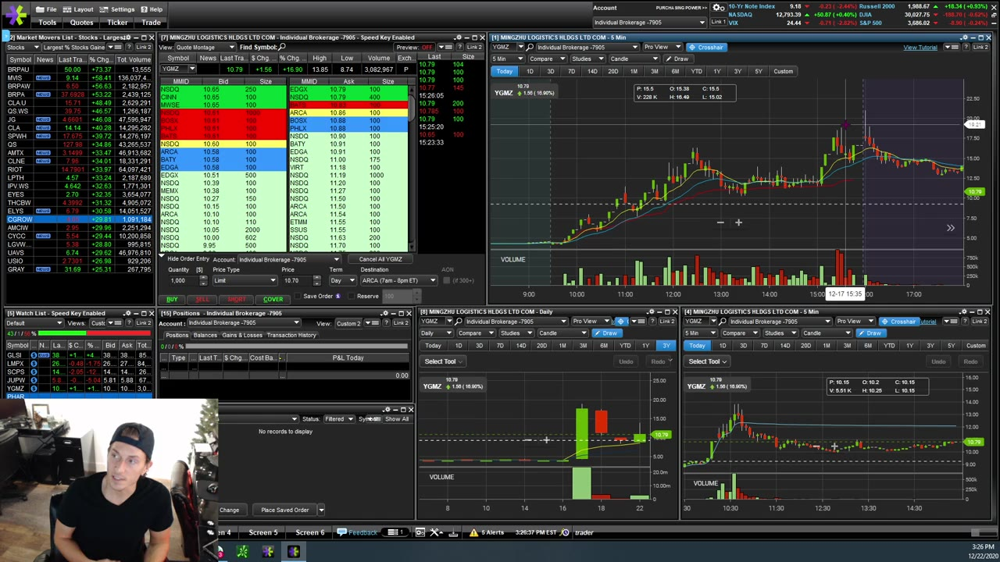

**图怎么看：**

- 在图中可以看到Mingzhu Logistics Holdings Ltd.的IPO交易情况。
- 图表显示了该公司的股价在不同时间段内的波动情况。
- 成交量柱显示了市场对该公司的兴趣程度。
- 图表下方的时间与成交量柱可以帮助投资者理解市场的即时反应。

### 关键内容

- IPO是私人公司转变为公开上市的过程，吸引投资者成为股东。
- IPO股票通常具有高波动性，但也有高回报潜力。
- 关注低浮动、低价位的IPO，这些更吸引零售投资者。
- IPO股票在开盘时可能大幅波动，需要快速反应。
- 关注新闻事件和市场情绪对IPO价格的影响。
- IPO股票可能在开盘后出现剧烈波动，需要谨慎操作。
- 使用图表软件监控IPO股票，及时捕捉交易机会
- 观察IPO股票的新闻事件，如并购消息或特殊收购公司（SPAC），这类股票通常风险较高，需谨慎操作。
- 留意IPO股票的成交量，低于1000万股的股票通常波动更大，适合寻找短期交易机会。
- 分析IPO股票的股价走势，注意其在开盘后的第一波波动，这往往预示着后续的走势。
- 关注IPO股票的市场情绪，如投资者兴趣和媒体宣传，这些因素会影响股票的波动性和价格。
- 评估IPO股票的长期前景，虽然短期内可能有高波动，但长期表现可能不如预期，需谨慎投资

### 分析与执行顺序

1. 首先，了解IPO的基本概念和特点。
2. 然后，识别即将上市的IPO股票，关注低浮动和低价位的IPO。
3. 接着，关注IPO股票开盘后的波动情况，快速做出买卖决策。
4. 利用图表软件监控IPO股票的价格走势，及时捕捉交易机会。
5. 最后，根据市场情绪和新闻事件调整交易策略，保持谨慎操作。

### 案例与细节

- description：WLNW；price：6百万股；float：6百万股；action：开盘后迅速进入暂停状态，随后恢复交易；outcome：价格从开盘价大幅波动，最终稳定在较高水平
- description：VVOS；price：1211；float：500万股；action：开盘后迅速下跌，随后反弹；outcome：价格波动较大，最终稳定在较高水平
- description：SCPS；price：500万股；float：500万股；action：开盘后迅速上涨，随后回落；outcome：价格波动较大，最终稳定在较高水平
- 描述：PHAR；价格：未开盘；浮动：未知；行动：预计今日开盘，但未开放，可能延迟至明日；结果：由于缺乏流动性，股价可能大幅波动，难以预测。
- 描述：VVOS；价格：1211；浮动：500万股；行动：开盘后迅速下跌，随后反弹；结果：股价波动较大，最终稳定在较高水平，表明该股票具有高波动性。
- 描述：SCPS；价格：500万股；浮动：500万股；行动：开盘后迅速上涨，随后回落；结果：股价波动较大，最终稳定在较高水平，显示短期交易机会

### 风险与边界

- IPO股票的高波动性可能导致较大的亏损，需谨慎操作。
- IPO股票可能在开盘后出现剧烈波动，需要快速反应。
- IPO股票的高波动性意味着更大的盈利和损失可能性。
- 录制年代限制，当前市场环境可能与录制时有所不同。
- 风险：IPO股票的高波动性可能导致投资者在短时间内遭受重大损失，尤其是在开盘后的第一波波动中。
- 风险：媒体对IPO市场的过度宣传可能导致投资者盲目跟风，忽视潜在的风险和不确定性。
- 风险：IPO股票的高波动性意味着投资者需要具备较强的市场分析能力和风险控制能力，否则容易遭受损失
- 风险：当前市场环境与录制时相比可能发生变化，投资者需密切关注市场动态，避免基于过时信息做出决策

### 复盘问题

- 如何识别即将上市的IPO股票？
- 在开盘后，如何快速判断IPO股票的波动趋势？
- 使用哪些图表工具可以帮助监控IPO股票的价格走势？

---

## v0482：10秒图表与交易策略

> 日期：2020　·　时长：00:36:11

**本场重点：** 10秒图表在快速变动股票中的作用；短期交易策略的风险与收益。

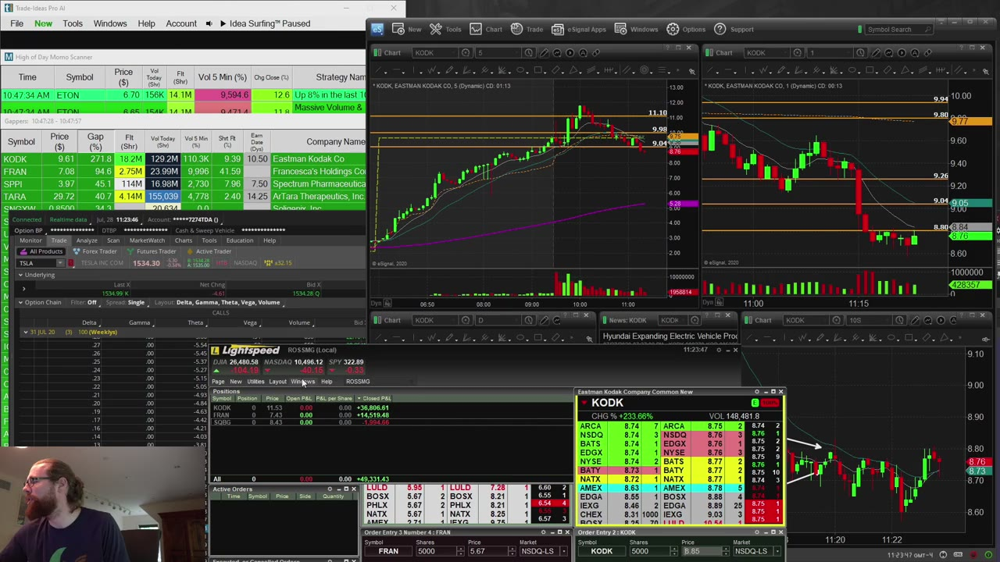

**图怎么看：**

- 显示了特斯拉(TSLA)和东芝(KODK)的10分钟K线图。
- 图表上可以看到价格波动和成交量。
- 右侧显示了特斯拉的期权链，包括Delta、Gamma、Theta等参数。
- 左侧显示了实时交易数据，包括价格、成交量和市场动态。

### 关键内容

- 10秒图表可以显示微小的价格波动，有助于识别快速变动股票中的早期趋势。
- 使用10秒图表时要注意，某些股票期权链上的流动性较低，可能导致止损单被执行。
- 短期交易策略如跳空买入和卖出需要谨慎，因为市场新闻可能迅速改变市场走势。
- 使用TD Ameritrade进行期权交易时，需要注意股票交易的执行速度较慢。
- 短期交易策略需要快速决策，而长期交易策略则需要耐心等待市场变化。
- 利用Bollinger带可以帮助识别价格反转，但不是确认信号，需要结合价格行动。
- 市场情绪高涨时，投资者应警惕过度乐观可能导致的市场回调。
- 使用TD Ameritrade进行交易时，注意其平台的优势和局限性，包括手续费和执行速度。
- 短期交易策略需要频繁监控市场动态，而长期交易策略则需要更长时间的投资规划

### 分析与执行顺序

1. 讲师首先解释了10秒图表的作用，然后展示了KODK股票的10秒图表。
2. 讲师展示了TD Ameritrade平台的使用情况，包括如何设置止损单和获利单。
3. 讲师讨论了短期交易策略的风险，包括市场新闻对市场的影响。
4. 讲师分享了特斯拉股票的交易策略，包括使用1800行权价的期权。
5. 讲师解释了如何利用Bollinger带来识别价格反转，但强调这不是确认信号。
6. 讲师总结了使用TD Ameritrade进行交易时需要注意的事项，包括手续费和执行速度

### 案例与细节

- KODK股票在10秒图表上显示出微小的价格波动，帮助识别早期趋势。
- 特斯拉股票的1800行权价在不同时间点的表现差异，反映了市场情绪的变化。
- 使用TD Ameritrade进行交易时，发现某些股票的流动性较差，导致执行速度较慢。
- 讲师展示了如何在TD Ameritrade平台上设置止损单和获利单，以控制风险。
- 通过比较10秒图表和一分钟图表，讲师强调了10秒图表在快速变动股票中的优势。
- 讲师讨论了如何利用Bollinger带来识别价格反转，但强调这不是确认信号，需要结合价格行动

### 风险与边界

- 短期交易策略依赖于快速决策，市场新闻可能迅速改变市场走势，导致策略失效。
- 某些股票期权链上的流动性较低，可能导致止损单被执行，从而影响交易结果。
- 使用TD Ameritrade进行交易时，需要注意股票交易的执行速度较慢，可能影响交易效果。
- 市场情绪高涨时，投资者应警惕过度乐观可能导致的市场回调，从而影响交易策略。
- 讲师指出，使用TD Ameritrade进行交易时，需要注意其平台的优势和局限性，包括手续费和执行速度

### 复盘问题

- 10秒图表在快速变动股票中的作用是什么？
- 短期交易策略有哪些风险？
- 如何利用Bollinger带来识别价格反转？
- 使用TD Ameritrade进行交易时需要注意哪些事项？
- 如何根据市场新闻调整交易策略？

---

## v0483：在家交易与假突破管理

> 日期：2020　·　时长：01:26:06

**本场重点：** 在家交易的便捷性与假突破管理的重要性

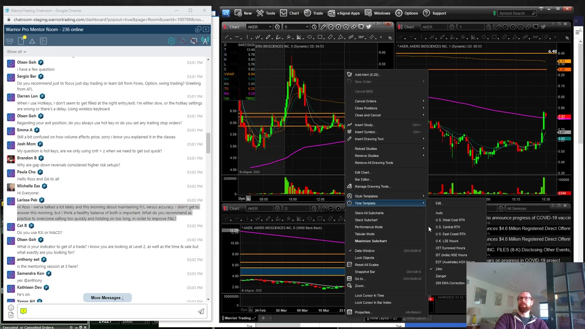

**图怎么看：**

- 在实时交易界面中，可以看到Level 2显示了股票的买卖盘情况。
- Time & Sales窗口提供了即时的市场流动性和成交数据。
- 表格部分显示了多个股票的详细信息，包括开盘价、收盘价、涨跌幅等。
- 这些元素共同构成了一个全面的交易环境，帮助投资者做出决策。

### 关键内容

- 在家交易已成为常见且无问题的选择，但Trade Zero平台存在稳定性问题。
- 假突破通常发生在没有其他支撑的情况下，建议在假突破发生时快速退出。
- 使用自动止损可以减少大亏损的风险，但需注意市场波动性增加导致假突破增多。
- TD Ameritrade虽然免费佣金，但执行速度慢，建议使用直接访问经纪商。
- 图表模式对于识别入场点至关重要，但RSI和MACD指标并不常用。
- 成交量影响价格，高成交量预示快速价格变动，缺口下破需谨慎。
- 使用热键快速下单和设置自动止损是提高交易效率的有效方法。
- 保持主要经纪人账户中有足够的资金，以避免低于保护性订单水平（PDT）的情况。
- 使用限价单出售可以控制价格，避免仅靠五美分的利润卖出
- 讲师提到Trade Zero平台的稳定性问题，建议使用Lightspeed平台以允许隐藏交易者身份。
- 使用RSI和MACD指标虽然不常用，但在特定情况下仍可提供有用的信息，如识别趋势反转。
- 图表模式对于识别入场点至关重要，尤其是在假突破发生时，快速退出可以减少损失。
- 成交量是判断市场情绪的重要指标，高成交量通常预示着快速的价格变动，需谨慎操作。
- 使用自动止损可以减少大亏损的风险，但需确保止损设置合理，避免频繁触发止损单。

### 分析与执行顺序

1. 讲师首先讨论了在家交易的便捷性和稳定性问题。
2. 接着讲解了如何识别假突破，并建议在假突破发生时快速退出。
3. 进一步介绍了如何使用自动止损减少大亏损的风险。
4. 提到了TD Ameritrade的优点和缺点，建议使用直接访问经纪商。
5. 强调了图表模式的重要性，但表示自己并不常用RSI和MACD指标。
6. 讨论了如何利用成交量影响价格，以及如何使用热键快速下单。
7. 最后提醒交易者保持主要经纪人账户中有足够的资金，以避免低于保护性订单水平（PDT）的情况

### 案例与细节

- 使用Trade Zero平台进行交易，但遇到稳定性问题。
- 使用自动止损功能，如在AKER假突破时快速退出。
- 使用RSI和MACD指标，但讲师表示自己并不常用这些指标。
- 通过观察成交量和价格走势来识别入场点，如YGYI的买方订单和卖空者退出。
- 使用E-Signal中的新闻窗口和时间在销售窗口来监控市场动态。
- 通过观察交易室内讨论和自己交易的股票来寻找交易机会，特别是那些容易借出的股票。
- 使用限价单出售，如在CMEG进行预盘交易，锁定数量并避免仅靠五美分的利润卖出
- 使用Trade Zero平台进行交易时，遇到稳定性问题，导致订单执行延迟，影响交易效率。
- 通过观察YGYI的买方订单和卖空者退出，发现交易机会，成功执行交易后获利70美元。
- 使用E-Signal中的新闻窗口和时间在销售窗口，监控YGYI的市场动态，发现其价格走势符合买入信号。
- 通过观察交易室内讨论和自己交易的股票，发现YGYI容易借出，因此决定买入该股票。
- 使用CMEG进行预盘交易，锁定数量并使用限价单出售，避免仅靠五美分的利润卖出，成功锁定利润。

### 风险与边界

- 市场波动性增加导致假突破增多，但预计这种情况会改善。
- 使用Trade Zero平台存在稳定性问题，建议考虑其他平台。
- TD Ameritrade虽然免费佣金，但执行速度慢，需谨慎选择。
- 使用RSI和MACD指标并不常用，需结合其他技术分析工具
- 录制于2020年，部分平台和条件可能已发生变化
- 市场波动性增加导致假突破增多，若交易者未能及时识别并退出，可能导致较大损失。
- 使用Trade Zero平台存在稳定性问题，若频繁出现订单执行延迟，可能影响交易决策。
- TD Ameritrade虽然免费佣金，但执行速度慢，若交易者依赖快速执行，可能会错失交易机会。
- 使用RSI和MACD指标虽然不常用，但如果忽视这些指标，可能会错过重要的市场信号。

### 复盘问题

- 在家交易有哪些优点和缺点？
- 如何识别和管理假突破？
- 使用自动止损有哪些注意事项？
- 如何利用成交量和价格走势来提高交易效率？
- 保持主要经纪人账户中有足够的资金有何重要性？

---

## v0484：交易问答

> 日期：2020　·　时长：01:21:57

**本场重点：** 讲师回答了关于交易策略、交易平台和税务的问题，强调了风险管理的重要性。

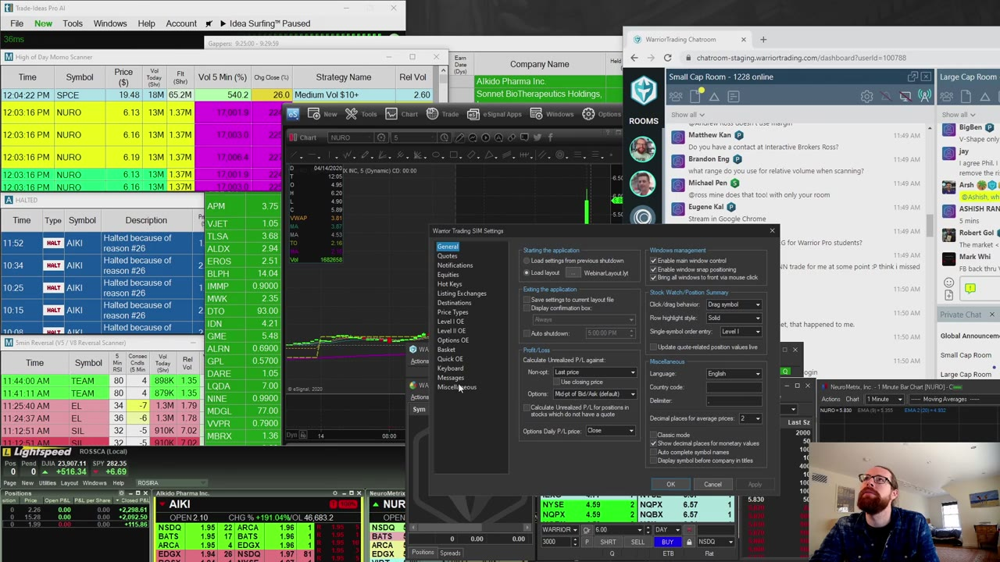

**图怎么看：**

- 实时交易数据包括股票价格、成交量、交易时间等。
- 聊天室中有多个用户进行讨论，涉及交易策略和市场分析。
- 平台设置选项显示了各种参数和功能，如图表类型、时间周期等。
- 交易者正在使用交易平台进行操作，查看不同股票的图表和数据。

### 关键内容

- 讲师使用Signature版本的E-Signal进行交易，但表示如果现在开始交易会选择TC 2000。
- 交易平台上显示的订单颜色不同，讲师建议将“Irregular”设置为白色以提高阅读性。
- 交易者应关注第一根蜡烛是否突破新高，然后关注成交量的变化。
- 交易者可以使用热键快速执行买卖操作，如设置20美分以上的止损。
- 交易者在模拟器中练习时，应确保盈利后再进行真实交易。
- 交易者需要了解税务规定，如季度报税和自我雇佣税。
- 交易者应根据市场情况调整交易策略，避免过度交易。

### 分析与执行顺序

1. 讲师首先回答了关于交易平台的问题，包括E-Signal和TC 2000的功能。
2. 接着，讲师解释了如何设置热键来进行快速交易，如设置20美分以上的止损。
3. 然后，讲师讨论了如何在模拟器中进行交易，并强调了盈利的重要性。
4. 最后，讲师回答了关于税务的问题，包括季度报税和自我雇佣税。
5. 在整个过程中，讲师强调了风险管理的重要性，包括止损设置和市场分析。

### 案例与细节

- 讲师展示了神经股票的图表，说明了如何识别卖出信号。
- 讲师解释了如何设置热键来快速执行买卖操作，如设置20美分以上的止损。
- 讲师提到使用CMEG账户进行交易，但表示由于平台限制，无法使用某些功能。
- 讲师讨论了如何在模拟器中进行交易，并强调了盈利的重要性。

### 风险与边界

- 交易者需要了解交易平台的具体功能和限制，否则可能无法执行某些操作。
- 交易者需要遵守税务规定，否则可能会面临罚款或其他法律后果。
- 交易者需要根据市场情况进行调整，否则可能会面临亏损的风险。
- 交易者需要定期更新知识，因为市场环境和技术工具会不断变化。

### 复盘问题

- 交易者如何设置热键来进行快速交易？
- 交易者在模拟器中进行交易时需要注意什么？
- 交易者如何管理税务风险？

---

## v0485：新手交易者常见问题解答

> 日期：2020　·　时长：01:10:20

**本场重点：** 新手交易者在模拟器和真实交易中遇到的问题及解决方案。

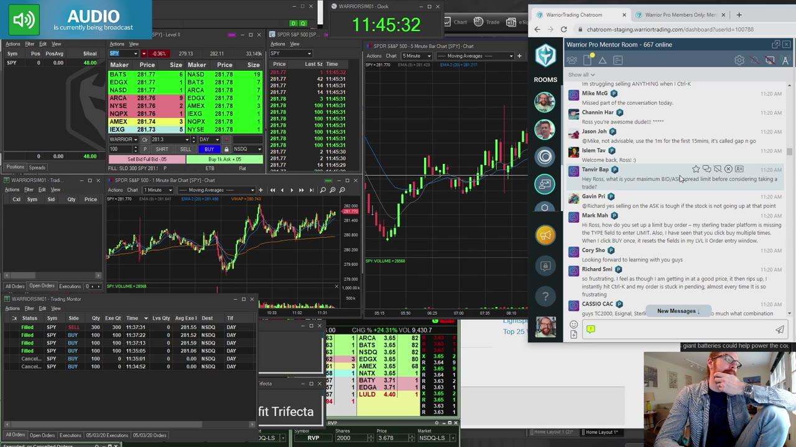

**图怎么看：**

- 实时交易界面显示了多个股票的报价和成交量，包括纳斯达克（NASDAQ）、美国银行（BATS）等。
- 聊天室中有用户讨论交易策略和市场动态，如使用特定的限价单类型。
- 图表显示了股票价格的历史波动情况，帮助理解市场趋势。
- 表格提供了详细的交易统计信息，如总收益、平均每日收益、最大收益等。

### 关键内容

- 新手交易者需要逐步学习软件操作和市场知识。
- 交易费用包括固定月费和每笔交易的费用。
- 使用模拟器可以帮助新手熟悉交易流程。
- 真实交易中情绪管理非常重要，新手容易冲动。
- 交易策略需要根据市场情况进行调整。
- 使用快捷键可以提高交易效率。
- 交易时需要关注市场动态，及时调整策略。
- 新手交易者应从小额开始，逐步增加交易规模。
- 交易软件的选择会影响交易体验和执行速度

### 分析与执行顺序

1. 讲师首先介绍了交易模拟器和真实交易的区别。
2. 然后解释了交易费用的构成，包括固定月费和每笔交易的费用。
3. 接着讲解了如何在模拟器中进行交易，包括设置买卖价格。
4. 最后强调了情绪管理和交易策略的重要性。
5. 通过问答环节，解答了学员的具体问题，帮助他们更好地理解交易过程

### 案例与细节

- 讲师提到使用Thinker Swim平台进行交易，每月需支付$55用于实时数据，每笔交易还需支付$2加上$18/股的佣金。
- 在一次交易中，讲师使用了止损单，设置在当前市场价格之上，以保护利润。
- 讲师分享了一个交易案例，使用了突破支撑位的价格进行买入，但随后价格下跌，导致亏损。
- 讲师解释了如何使用快捷键进行交易，如Shift 1用于添加订单，Control Z用于手动卖出。
- 讲师提到使用MarketWatch.com来获取新闻头条，而不是依赖交易平台提供的新闻服务

### 风险与边界

- 交易策略需要根据市场情况进行调整，否则可能无法适应市场变化。
- 新手交易者在真实交易中容易受到情绪影响，可能导致决策失误。
- 交易软件的选择会影响交易体验和执行速度，选择不当可能影响交易效果。
- 交易过程中可能会遇到技术问题，如订单未执行或执行错误，需要及时解决。
- 交易策略的有效性会随市场环境变化而变化，需要持续学习和调整

### 复盘问题

- 交易模拟器和真实交易有哪些主要区别？
- 新手交易者应该如何管理情绪，避免冲动交易？
- 交易过程中遇到的技术问题有哪些常见的解决方法？
- 如何根据市场情况调整交易策略？
- 交易软件的选择对交易体验有何影响？

---

## v0486：水平二分析与交易策略

> 日期：2020　·　时长：00:50:18

**本场重点：** 在水平二上识别大卖单通常表示卖出压力，但买家介入则表明买方力量增强。

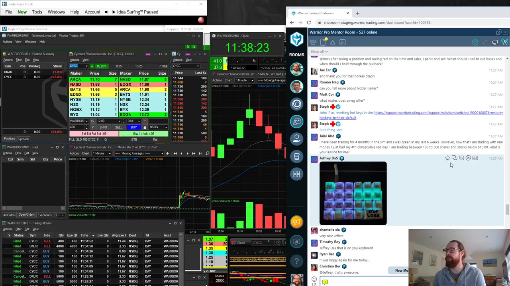

**图怎么看：**

- Level 2 的颜色和条带属于平台的报价分区与显示约定；实际市场深度要看价位、挂单数量、价差以及挂单随时间的变化。
- 成交量适合与前序时段或历史基准比较参与程度，但仅凭柱体颜色无法判断哪一方主动，也不能由此推断下一步方向。
- 若要研究主动成交方向，需要结合逐笔成交发生在买价还是卖价、价格响应以及挂单变化；单张静态成交量图不包含完整时序证据。
- 通过观察Level 2中的柱状图，可以判断市场上的买卖盘情况，从而做出相应的交易决策。

### 关键内容

- 讲师提到，看到大卖单通常表示卖出压力，但如果买家介入，则表明买方力量增强。
- 使用CYCC作为例子，当看到大量买家介入时，市场情绪从看跌转为看涨。
- 讲师建议使用低点作为止损，以控制风险。
- 讲师强调，使用Think或Swim进行交易是免费且无平台费用的选择。
- 讲师指出，使用SIM进行交易时，需要关注订单执行速度和正确性。
- 讲师提到，CYCC这类股票适合用小账户交易，因其波动性大。
- 讲师建议新手使用较小的交易规模，以避免过度风险。
- 讲师提到，使用Think或Swim进行交易可以避免PDT规则的限制。
- 讲师强调，使用Think或Swim进行交易可以避免PDT规则的限制。
- 讲师指出，使用Think或Swim进行交易可以避免PDT规则的限制。

### 分析与执行顺序

1. 讲师首先解释了如何通过水平二上的订单来判断市场情绪。
2. 然后，讲师使用CYCC作为例子，展示了如何识别大卖单和买家介入。
3. 接着，讲师建议使用低点作为止损，以控制风险。
4. 最后，讲师强调了使用Think或Swim进行交易的优势。
5. 讲师还提到了如何设置默认账户和目的地。
6. 讲师解释了如何使用热键进行交易，并强调了正确的订单执行方式。
7. 讲师还讨论了如何使用Think或Swim进行交易，以避免PDT规则的限制。

### 案例与细节

- 讲师提到，当CYCC的价格突破18时，通常意味着买入机会。
- 讲师使用CYCC作为例子，说明了如何通过水平二上的订单来判断市场情绪。
- 在DNJR的模拟成交演示中，讲师以2.30买入后把限价卖单挂在2.30；小单需要等买方成交，放大到5,000股时只能随逐笔交易分批执行，用来说明限价与流动性如何影响SIM成交速度。

### 风险与边界

- 讲师提到，使用Think或Swim进行交易可以避免PDT规则的限制，但这些平台的具体执行情况可能会有所不同。
- CYCC向下停牌的案例说明，赌停牌后立即反弹可能遇到更低开盘甚至再次向下停牌，潜在损失可迅速扩大到数千美元；讲师因此先把仓位降到250股，待连续盈利后才恢复到500至1,000股。
- 录制中关于CMEG的2,500美元账户、六倍购买力和Lightspeed最低入金等说法属于2020年的历史条件；当前账户门槛、杠杆、PDT与经纪商规则必须另行核对官方资料。

### 复盘问题

- 讲师是如何解释通过水平二上的订单来判断市场情绪的？
- 讲师使用哪些具体例子来说明如何识别大卖单和买家介入？
- 讲师建议使用哪些平台进行交易，以避免PDT规则的限制？

---

## v0487：股票交易策略与风险管理

> 日期：2020　·　时长：00:54:35

**本场重点：** 在快速波动的市场中，及时止损和合理设置订单至关重要。

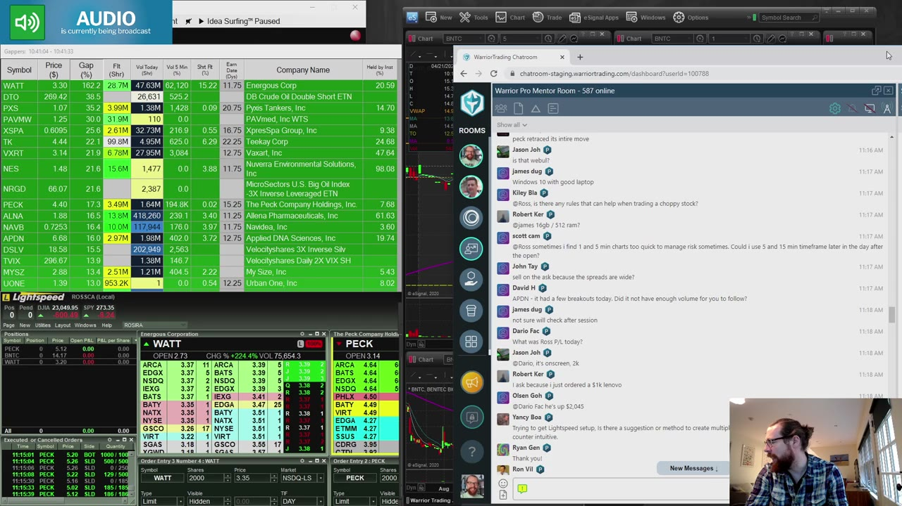

**图怎么看：**

- 实时交易数据包括股票价格、涨跌幅度、成交量等关键指标。
- 聊天室中有参与者讨论交易策略和风险管理，强调在快速波动市场中的重要性。
- 图表显示了不同股票的价格走势和成交量情况，帮助理解市场动态。
- 用户可以查看实时订单状态和历史交易记录，进行决策分析。

### 关键内容

- 讲师提到在快速波动的市场中，及时止损是必要的，避免被市场波动拖垮。
- 使用隐藏订单和设置止损位可以提高交易效率和减少损失。
- 在交易过程中，要关注市场信号，如红绿切换和成交量变化。
- 使用技术指标如EMA可以帮助识别交易机会，但需谨慎使用。
- 交易时要注意市场情绪，避免因情绪波动而做出冲动决策。
- 使用Trade Station平台时，要注意其操作界面不够直观，可能需要适应。
- 在交易过程中，要保持冷静，避免因情绪波动而做出错误决策。
- 交易时要关注市场新闻，无新闻的股票也可能出现大波动。
- 交易时要设定合理的止损点，避免被市场波动拖入亏损状态。
- 交易时要灵活调整交易策略，根据市场情况及时调整

### 分析与执行顺序

1. 讲师首先回顾了近期交易情况，分析了市场波动的原因。
2. 然后讲解了如何在快速波动的市场中设置合理的止损位，以控制风险。
3. 接着介绍了使用隐藏订单和设置止损位的方法，以提高交易效率。
4. 讲师强调了关注市场信号的重要性，如红绿切换和成交量变化。
5. 最后，讲师提醒学员要保持冷静，避免因情绪波动而做出错误决策。
6. 在整个过程中，讲师还分享了一些交易平台的经验，如Trade Station的操作界面不够直观。
7. 讲师还强调了交易时要关注市场新闻，无新闻的股票也可能出现大波动。

### 案例与细节

- 讲师提到在交易WATT时，使用了隐藏订单和设置止损位，成功避免了大亏损。
- 在交易过程中，讲师注意到市场红绿切换频繁，及时调整了交易策略。
- 讲师使用了EMA指标来识别交易机会，但在实际操作中发现其操作界面不够直观。
- 在交易过程中，讲师发现无新闻的股票也可能出现大波动，提醒学员要关注市场新闻。
- 讲师分享了一个案例，在交易过程中，由于情绪波动，做出了冲动决策，导致亏损。

### 风险与边界

- 在快速波动的市场中，如果未能及时止损，可能会导致更大的亏损。
- 使用Trade Station平台时，由于操作界面不够直观，可能会增加操作难度。
- 交易时如果过于依赖技术指标，可能会忽略市场信号的变化。
- 交易时如果忽视市场新闻，可能会错过重要的交易机会。
- 交易时如果情绪波动较大，可能会做出冲动决策，导致不必要的亏损。

### 复盘问题

- 在快速波动的市场中，如何设置合理的止损位？
- 使用Trade Station平台时，有哪些需要注意的地方？
- 如何在交易过程中保持冷静，避免因情绪波动而做出错误决策？

---
