# Beginner Mentor Sessions：2021

> 23 场，合计 18.6 小时。返回 [Beginner Mentor Sessions 目录](../README.md)。

## v0488：SPY 和 Qs 对交易的影响

> 日期：2021-04-14　·　时长：00:56:55

**本场重点：** SPY 和 Qs 的波动性对交易决策的影响，以及如何利用这些指标进行交易。

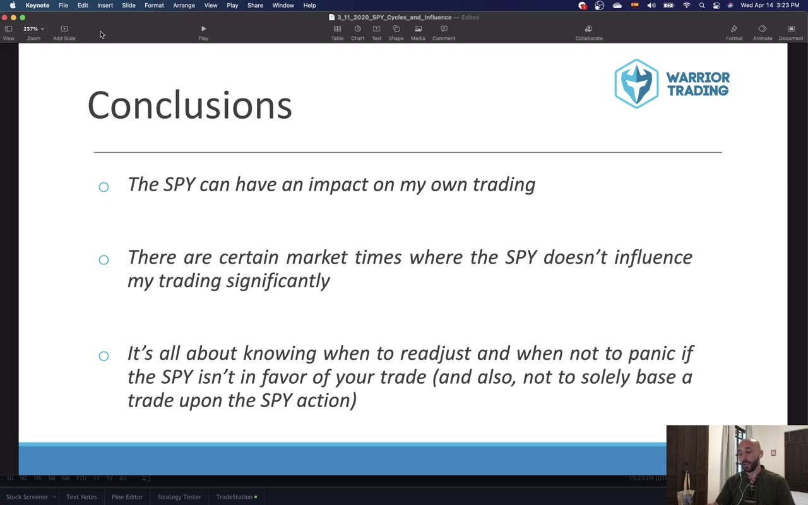

**图怎么看：**

- 画面中，可以看到SPY和Qs的波动性对交易决策的影响。
- 画面中的图表显示了SPY和Qs的波动性变化，帮助交易者理解市场情绪和趋势。
- 通过分析这些图表，交易者可以更好地制定交易策略并做出更明智的决策。
- 画面中的数据表明，当SPY和Qs的波动性较高时，可能需要谨慎对待交易机会。

### 关键内容

- SPY是跟踪S&P 500指数的ETF，Qs是纳斯达克指数的ETF。
- 市场波动性增加时，SPY和Qs的波动性也会增加，影响单个股票的表现。
- 通过监控SPY的范围和成交量，可以评估市场的总体环境。
- 当SPY的平均真实范围超过1.75%，表明市场波动性较大，需要更加谨慎地进行交易。
- 当SPY的相对成交量低于1.75%，表明市场波动性较小，可以更加放松地进行交易。
- 在高波动性市场中，单个股票的表现更容易受到市场整体环境的影响。
- 使用ATR百分比指标来衡量市场波动性，可以帮助制定交易策略。
- 在高波动性市场中，交易者应更加关注SPY的行为，以做出更合理的交易决策。
- 在低波动性市场中，交易者可以更加放松地进行交易，减少对SPY的依赖。
- 交易者应根据市场情况调整自己的交易策略，以适应不同的市场环境

### 分析与执行顺序

1. 首先定义SPY和Qs的概念，SPY跟踪S&P 500指数，Qs跟踪纳斯达克指数。
2. 接着解释市场波动性对交易的影响，波动性增加时，单个股票的表现更容易受到影响。
3. 然后介绍如何通过监控SPY的范围和成交量来评估市场的总体环境。
4. 进一步解释如何使用ATR百分比指标来衡量市场波动性，并设定阈值（1.75%）来判断市场波动性大小。
5. 最后强调在不同市场环境中调整交易策略的重要性，以适应不同的市场条件。

### 案例与细节

- 当SPY的平均真实范围超过1.75%，表明市场波动性较大，此时交易者应更加谨慎地进行交易。
- 当SPY的相对成交量低于1.75%，表明市场波动性较小，此时交易者可以更加放松地进行交易。
- 在高波动性市场中，单个股票的表现更容易受到市场整体环境的影响，例如，苹果公司（AAPL）的表现可能更多地取决于市场整体趋势而非自身原因。
- 当SPY的平均真实范围超过1.75%，交易者应更加关注SPY的行为，以做出更合理的交易决策。
- 在低波动性市场中，交易者可以更加放松地进行交易，减少对SPY的依赖，例如，当SPY的相对成交量低于1.75%时，交易者可以更加专注于自己的交易计划。

### 风险与边界

- 录制于2021年，当前市场环境可能已发生变化，因此需要结合最新数据进行调整。
- SPY和Qs的波动性受多种因素影响，包括宏观经济状况、政策变化等，因此需要持续关注这些因素的变化。
- 使用ATR百分比指标来衡量市场波动性，可能会出现误判的情况，特别是在极端市场条件下。

### 复盘问题

- 在高波动性市场中，交易者应该如何调整自己的交易策略？
- 如何利用SPY和Qs的波动性来制定交易计划？
- 在低波动性市场中，交易者应该采取哪些措施来提高交易效率？

---

## v0489：成为旅行交易者的秘诀

> 日期：2021-04-28　·　时长：01:08:53

**本场重点：** 1. 如何选择最佳交易地点；2. 保持交易心态的重要性；3. 如何利用有限资源实现自由交易。

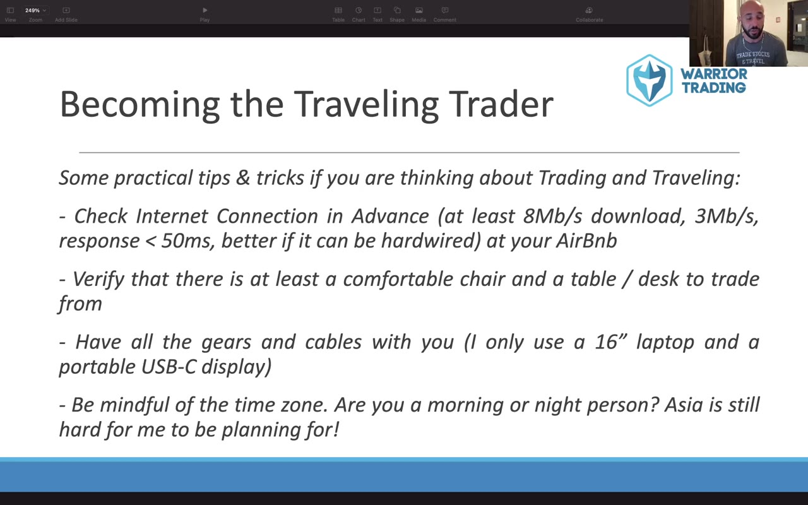

**图怎么看：**

- 幻灯片“Becoming the Traveling Trader”列出出行前检查项，首要是提前测试网络：至少约 8 Mb/s 下载、3 Mb/s 上传、响应低于 50 ms，并优先使用有线连接。
- 住宿还要确认有合适的桌椅和稳定工作位置；设备清单包括笔记本、便携显示器以及所需电源、转接头和线材。
- 时区与个人作息同样影响执行质量：课程提醒先考虑自己是早起型还是夜间型，再判断当地市场开盘时间是否适合持续交易。
- 网速测试和设备齐全只能降低操作风险，不能消除断网、供电、券商连接或时差疲劳；旅行时仍需准备备用网络和无法交易时的停手机制。

### 关键内容

- Roberto 在2016年放弃工作后，花费了两年时间在意大利的小公寓中寻找最佳交易地点。
- 他强调了选择交易地点的重要性，包括网络连接、舒适的工作环境和时间区。
- 他分享了如何通过日记记录自己的交易经历，以保持清晰的思考。
- 他建议交易者要保持耐心，不要因为短期的挫折而放弃。
- 他强调了减少携带物品的重要性，以提高旅行交易的体验。
- 他提到社交技能对于独自旅行的人来说非常重要，但需要时间来提高。
- 他分享了如何通过自由交易费来设定止损点，以避免过度交易。
- 他建议使用轻量级设备进行交易，以减少损坏的风险。
- 他提到使用TradingView和TradeStation作为交易工具，而不是LightSpeed或Signal。

### 分析与执行顺序

1. Roberto 分享了自己从2016年开始寻找最佳交易地点的经历。
2. 他描述了如何在意大利的小公寓中度过两年多的时间，期间一直在寻找最佳交易地点。
3. 他强调了选择交易地点的重要性，包括网络连接、舒适的工作环境和时间区。
4. 他分享了如何通过日记记录自己的交易经历，以保持清晰的思考。
5. 他建议交易者要保持耐心，不要因为短期的挫折而放弃。
6. 他强调了减少携带物品的重要性，以提高旅行交易的体验。
7. 他提到社交技能对于独自旅行的人来说非常重要，但需要时间来提高。

### 案例与细节

- Roberto 在2016年放弃了他在汽车工程领域的职位，全身心投入到交易中。
- 他分享了自己在意大利的小公寓中度过的两年多时间，期间一直在寻找最佳交易地点。
- 他提到在交易过程中，如何通过日记记录自己的交易经历，以保持清晰的思考。
- 他分享了如何通过自由交易费来设定止损点，以避免过度交易。
- 他建议使用轻量级设备进行交易，以减少损坏的风险。

### 风险与边界

- 录制于2018年至2021年，当时的市场环境和交易规则可能已发生变化。
- 虽然建议使用轻量级设备进行交易，但设备的耐用性可能会影响交易体验。
- 使用TradingView和TradeStation作为交易工具，但这些工具的更新和维护情况未知。

### 复盘问题

- 你如何选择最佳交易地点？
- 在独自旅行时，如何保持良好的社交技能？
- 如何通过日记记录自己的交易经历，以保持清晰的思考？

---

## v0490：2020年交易总结

> 日期：2021　·　时长：00:59:43

**本场重点：** 2020年交易成绩显著提升，主要得益于高成交量股票的交易机会增多，但同时也面临较大的波动性和风险。

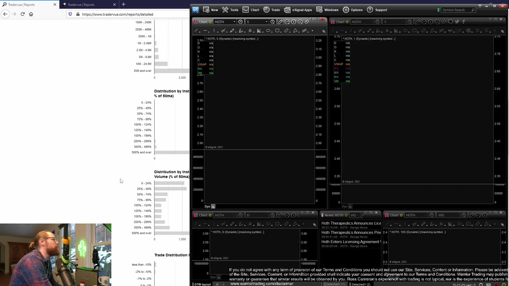

**图怎么看：**

- 在2020年的交易中，主要得益于高成交量股票的交易机会增多。
- 同时，也面临着较大的波动性和风险。
- 通过分析图表、Level 2、时间与销售等信息，可以更好地理解市场动态。
- 例如，图B显示了不同时间段的价格变动情况，有助于识别潜在的交易机会。

### 关键内容

- 2020年交易利润超过500万美元，远超以往。
- 2020年交易次数是2017年的八倍多，表明交易频率大幅增加。
- 2020年市场波动性大，出现多次暴涨暴跌。
- 2020年交易策略侧重于高成交量股票，成功率较高。
- 2020年交易中出现了多次亏损，最大单日亏损达62,000美元。
- 2020年交易中抓住了多次高波动性的股票，如GLSI等。
- 2020年交易中采用了更大的仓位，增加了风险。
- 2020年交易中多次出现连续亏损的情况，需要谨慎管理。
- 2020年交易中多次抓住了市场热点，如MXC等。
- 2020年交易中多次出现大额盈利，但也伴随大额亏损。
- 2020年市场经历了多次暴涨暴跌，尤其是高成交量股票如GLSI，这为交易提供了更多机会，但也增加了波动性。
- 2020年交易中，尽管有大量盈利，但也出现了多次连续亏损的情况，这提醒交易者需要谨慎管理风险。
- 2020年交易策略侧重于高相对成交量的股票，这使得交易者能够更好地预测市场走势，但也增加了交易成本。
- 2020年交易中，交易者通过大量交易和更大仓位来追求更高收益，这虽然提高了盈利潜力，但也增加了资金压力。
- 2020年交易中，交易者在市场热点如MXC等上取得了成功，但也因此承担了更高的风险，这说明市场热点的不可持续性

### 分析与执行顺序

1. 记录2020年交易数据，包括交易次数、盈利和亏损。
2. 分析2020年交易表现，识别成功和失败的原因。
3. 总结2020年交易策略，强调高成交量股票的重要性。
4. 回顾2020年交易中的关键事件，如GLSI等。
5. 评估2020年交易中的风险和收益，制定未来策略。

### 案例与细节

- 2020年1月，交易表现不佳，仅微亏。
- 2020年3月，市场开始反弹，交易表现好转。
- 2020年6月，交易表现最佳，单月盈利120万美元。
- 2020年11月，交易出现较大亏损，单月亏损27,000美元。
- 2020年12月，交易表现强劲，单月盈利近70万美元。
- 2020年3月，市场开始反弹，交易者抓住了GLSI等股票的机会，单日盈利达到42,000美元，显示了市场热点带来的巨大收益。
- 2020年11月，交易者在GLSI上遭遇重大损失，单日亏损58,000美元，这反映了高波动性股票的风险。
- 2020年12月，交易者在MXC等股票上取得了成功，单日盈利达到90,000美元，这展示了抓住市场热点的重要性。
- 2020年6月，交易者在BNGO等股票上取得了巨大成功，单日盈利达到185,000美元，这体现了高成交量股票的交易机会。
- 2020年3月至4月，交易者在LFIN等股票上经历了连续亏损，这提醒交易者需要谨慎管理风险，避免过度交易

### 风险与边界

- 2020年市场波动性大，可能导致交易频繁出现大幅波动。
- 2020年采用更大仓位，增加了交易风险。
- 2020年交易中多次出现连续亏损，需要谨慎管理。
- 2020年交易策略依赖于市场热点，可能无法持续。
- 2020年市场波动性大，可能导致交易频繁出现大幅波动，这增加了交易者的心理压力。
- 2020年采用更大仓位，增加了交易风险，如果市场走势不利，可能会导致重大亏损。
- 2020年交易策略依赖于市场热点，这些热点可能无法持续，这增加了交易者的不确定性。
- 2020年交易中多次出现连续亏损的情况，这要求交易者必须具备较强的心理素质和风险管理能力

### 复盘问题

- 2020年交易中哪些股票表现最好？
- 2020年交易中哪些策略最有效？
- 2020年交易中哪些因素导致了亏损？

---

## v0491：使用 RSI 为小盘股交易提供保险

> 日期：2021　·　时长：00:51:24

**本场重点：** 本节课主要讲解如何利用 RSI 作为小盘股交易的保险策略，帮助新投资者避免冲动交易。

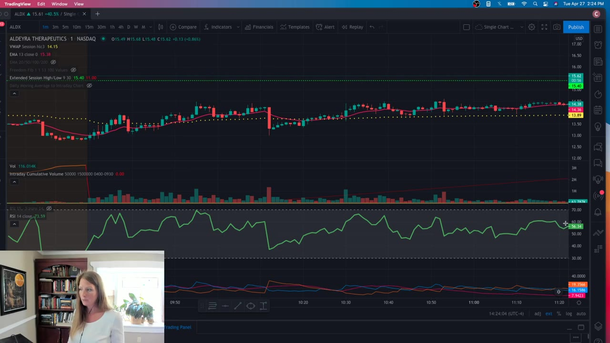

**图怎么看：**

- 画面中，可以看到一个股票的 K 线图，显示了价格波动情况。
- RSI（相对强弱指数）指标位于图表下方，用于衡量市场超买或超卖的程度。
- 成交量柱的高度反映对应周期内的总成交量；红绿着色通常跟随价格柱的涨跌规则，不能直接拆成两种方向的主动成交。
- 通过观察 K 线图和 RSI 指标的变化，可以判断当前市场的趋势和风险水平。

### 关键内容

- RSI 用于辅助其他交易策略，不是独立策略。
- RSI 标准设置为 14 天，使用 30 和 70 线，60 线是关键支撑位。
- RSI 用于确认交易强度，特别是当价格测试 60 线时。
- 交易计划对于新手非常重要，需要明确止损和目标。
- RSI 在不同时间框架下的信号需要综合考虑。
- 交易时应关注价格形态，特别是支撑位和阻力位。
- 交易决策应基于充分的信息，避免冲动操作。
- 使用 RSI 作为保险策略可以帮助新手更好地管理交易风险。
- 交易时应关注蜡烛收盘，确认交易强度。
- RSI 在不同时间框架下的信号需要综合考虑，特别是 15 分钟和 1 小时图表

### 分析与执行顺序

1. 讲师首先介绍了 RSI 的基本用法，强调它作为辅助策略的重要性。
2. 讲师展示了 RSI 的 60 线在 5 分钟图表上的应用，解释了如何使用它来确认交易强度。
3. 讲师强调了交易计划的重要性，包括明确止损和目标。
4. 讲师通过实例演示了如何利用 RSI 作为交易保险，特别是在遇到快速下跌时。
5. 讲师提醒学员注意蜡烛收盘的重要性，以确认交易强度。
6. 讲师强调了不同时间框架下 RSI 信号的综合考虑，特别是 15 分钟和 1 小时图表的重要性。
7. 讲师通过实例展示了如何利用 RSI 作为交易保险，特别是在遇到快速下跌时。

### 案例与细节

- ALDX 股票在一天中的表现，展示了如何利用 RSI 作为交易保险。
- 讲师展示了如何在 5 分钟图表上使用 RSI 来确认交易强度，特别是当价格测试 60 线时。
- 讲师通过实例展示了如何在遇到快速下跌时利用 RSI 作为交易保险，特别是在 15 分钟和 1 小时图表上。
- 讲师展示了如何在 1 小时图表上使用 RSI 来确认交易强度，特别是当价格测试 60 线时。
- 讲师通过实例展示了如何在 15 分钟图表上使用 RSI 来确认交易强度，特别是当价格测试 60 线时。

### 风险与边界

- 本策略适用于小盘股交易，不适合大型股票。
- RSI 信号可能会出现混杂情况，需要谨慎处理。
- 交易时应关注价格形态，特别是支撑位和阻力位。
- 交易时应关注蜡烛收盘，确认交易强度。
- 本策略适用于 2018-2021 年的市场环境，可能不适用于当前市场。

### 复盘问题

- 如何利用 RSI 作为交易保险？
- 在遇到快速下跌时，如何利用 RSI 作为交易保险？
- 交易时应关注哪些关键指标？

---

## v0492：2021年首次问答会

> 日期：2021　·　时长：00:58:56

**本场重点：** 讨论如何识别和管理股票交易中的趋势和波动，以及如何利用这些信息进行交易。

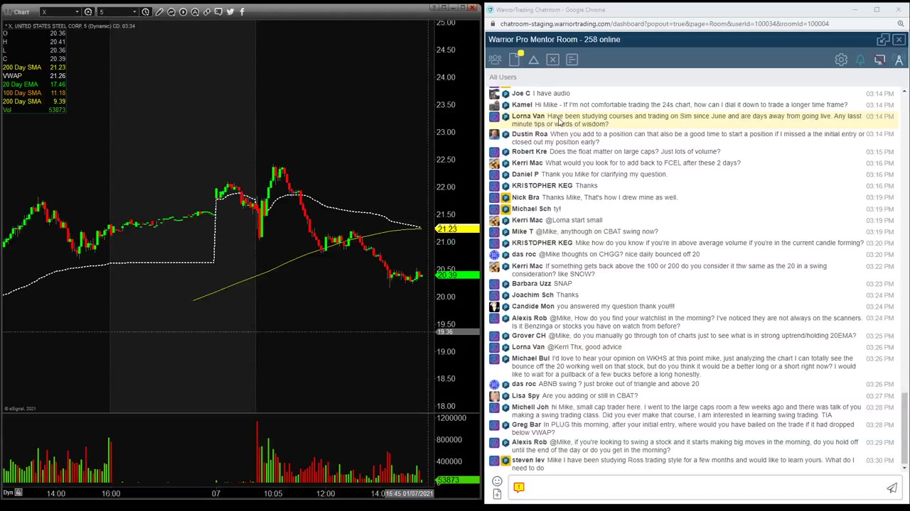

**图怎么看：**

- 画面中，可以看到一个股票的K线图，显示了价格的趋势和波动情况。图中使用了多个均线（如20日均线、50日均线等），帮助识别长期趋势。
- 成交量柱的高度反映对应周期内的总成交量；红绿着色通常跟随价格柱的涨跌规则，不能直接拆成两种方向的主动成交。
- 图A还展示了其他技术指标，如VWAP（虚拟加权平均价格）和MACD（移动平均收敛/发散），这些指标可以帮助投资者判断市场的强弱和趋势。
- 通过分析这些图表和技术指标，投资者可以更好地理解和预测股票的价格走势，从而做出更明智的投资决策。

### 关键内容

- 寻找强势趋势的股票，通常会回撤到20日移动平均线附近。
- 使用技术指标如20日移动平均线来判断是否继续持有或卖出。
- 在市场出现大缺口时，可以利用这些机会进行交易。
- 使用锤子形态作为可能反转的信号，但需要结合其他因素。
- 保持交易账户分离，以避免资金链断裂。
- 在市场波动较大时，谨慎增加仓位。
- 使用Excel进行简单的数据分析和交易决策。
- 在市场出现大幅下跌时，利用这些机会进行交易。
- 在市场出现大幅上涨时，利用这些机会进行交易

### 分析与执行顺序

1. 首先，讲师介绍了如何识别强势趋势的股票，通常会回撤到20日移动平均线附近。
2. 然后，讲师展示了如何使用技术指标如20日移动平均线来判断是否继续持有或卖出。
3. 接着，讲师讨论了如何利用市场出现的大缺口进行交易。
4. 随后，讲师解释了如何使用锤子形态作为可能反转的信号，但需要结合其他因素。
5. 最后，讲师强调了保持交易账户分离的重要性，以避免资金链断裂。

### 案例与细节

- GE股票在重新获得20日移动平均线后，出现了强劲的反弹。
- F-Cell股票在突破20日移动平均线后，表现良好。
- CBAT股票在新闻推动下，出现了较大的涨幅。
- 苹果股票在下午出现反转，表明市场可能继续上涨。
- Excel被用来进行简单的数据分析和交易决策。

### 风险与边界

- 在市场出现大幅下跌时，可能会错过最佳交易机会。
- 在市场出现大幅上涨时，可能会过度乐观，导致亏损。
- 使用锤子形态作为反转信号时，需要结合其他因素，否则可能误判。
- 保持交易账户分离有助于避免资金链断裂，但在实际操作中可能难以完全实现。
- 市场环境的变化可能导致某些策略不再有效。

### 复盘问题

- 如何识别强势趋势的股票？
- 如何使用技术指标来判断是否继续持有或卖出？
- 如何利用市场出现的大缺口进行交易？
- 如何使用锤子形态作为可能反转的信号？
- 如何保持交易账户分离以避免资金链断裂？

---

## v0493：选择合适的交易平台

> 日期：2021　·　时长：01:01:05

**本场重点：** TOS平台操作复杂，E-Trade Pro操作流畅但速度较慢，DAS平台操作简单且快速。

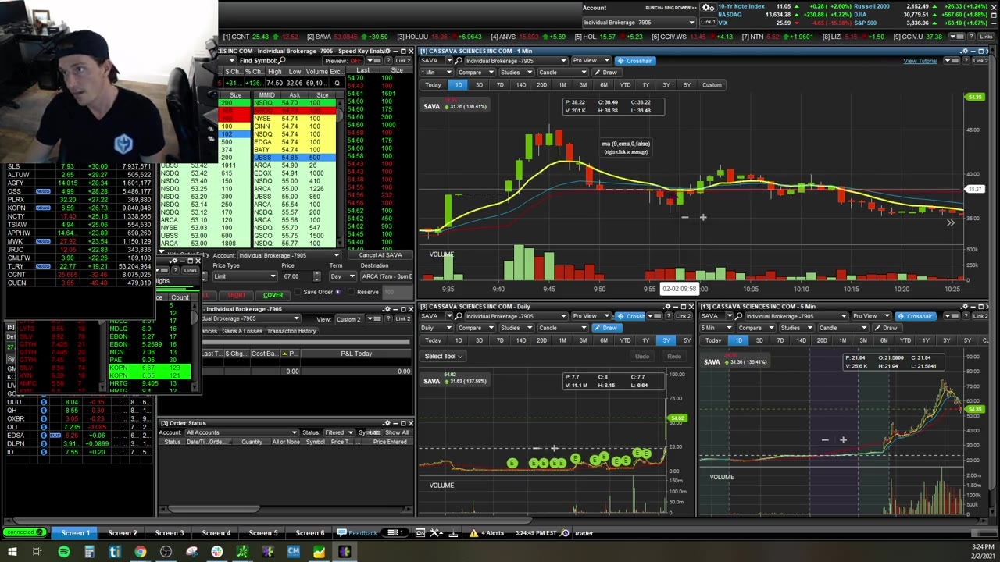

**图怎么看：**

- 在E-Trade Pro平台上，用户可以轻松地浏览和分析市场数据。
- 该平台提供了实时的市场报价和交易活动。
- 用户可以通过点击不同的股票代码来查看其详细信息。
- E-Trade Pro的操作界面简洁明了，适合初学者使用。

### 关键内容

- TOS平台界面复杂，新手需要时间适应。
- E-Trade Pro平台操作简便，适合新手，但速度较慢。
- DAS平台界面简洁，操作快速，适合活跃交易者。
- TOS平台提供实时数据，但有延迟。
- E-Trade Pro平台提供实时数据，但速度较慢。
- DAS平台提供即时数据，操作简单。
- TOS平台支持直接市场订单，但速度较慢。
- E-Trade Pro平台支持直接市场订单，但速度较慢。
- DAS平台支持直接市场订单，操作快速
- TOS平台虽然提供实时数据，但新手可能会因界面复杂而感到困惑，需要时间适应。
- E-Trade Pro平台界面直观，适合新手快速上手，但其速度较慢可能会影响交易决策的及时性。
- DAS平台操作简单且快速，适合活跃交易者，但每月需支付175美元的软件费，对于预算有限的用户来说可能不太划算。
- TOS平台的Level 2数据不明显，新手可能需要时间来熟悉和解读这些信息，这可能影响交易效率。
- E-Trade Pro平台的Level 2数据清晰，但新手可能需要时间来适应其布局和功能，这可能影响交易体验

### 分析与执行顺序

1. 讲师首先介绍了TOS平台的特点。
2. 然后介绍了E-Trade Pro平台的特点。
3. 最后介绍了DAS平台的特点。
4. 讲师通过实际操作展示了各平台的功能。
5. 讲师强调了各平台的优势和劣势。
6. 讲师提供了使用各平台的具体示例。
7. 讲师总结了各平台的选择建议

### 案例与细节

- TOS平台界面复杂，新手需要时间适应。
- E-Trade Pro平台操作简便，适合新手，但速度较慢。
- DAS平台界面简洁，操作快速，适合活跃交易者。
- 讲师展示了如何在TOS平台上设置订单，默认为限价单。
- 讲师展示了如何在E-Trade Pro平台上设置订单，默认为市价单。
- 讲师展示了如何在DAS平台上设置订单，默认为限价单
- 在TOS平台上，新手用户可能会发现界面过于复杂，难以找到所需功能，如设置限价单等，这可能导致交易失误。
- 使用E-Trade Pro平台的新手用户可以快速上手，但当遇到高频率交易时，其速度较慢的问题会逐渐显现，影响交易策略的实施。
- DAS平台的操作界面简洁明了，适合活跃交易者快速下单，但在进行复杂分析时，其功能可能不如其他平台丰富，影响深度研究
- 在TOS平台上，用户可以设置限价单，但需要手动调整参数，这可能增加操作难度，新手用户可能因此感到困扰。
- 使用E-Trade Pro平台时，用户可以设置市价单，但其速度较慢，可能导致交易时机错失，新手用户可能因此感到沮丧

### 风险与边界

- TOS平台操作复杂，可能不适合新手。
- E-Trade Pro平台速度较慢，可能影响交易速度。
- DAS平台费用较高，每月需支付175美元。
- 录制于2021年，部分信息可能已发生变化。
- 部分平台可能面临服务器问题，影响交易体验
- TOS平台的复杂界面可能导致新手用户在交易过程中出现操作错误，影响交易成功率。
- E-Trade Pro平台的速度限制可能影响交易决策的及时性，尤其是在高频率交易时，新手用户可能因此错过最佳交易时机。
- DAS平台的高月费可能对预算有限的用户构成经济压力，影响其长期使用意愿。
- 录制于2021年的信息可能已发生变化，部分平台的功能和费用可能有所调整，用户在选择时需谨慎

### 复盘问题

- TOS平台有哪些优点和缺点？
- E-Trade Pro平台有哪些优点和缺点？
- DAS平台有哪些优点和缺点？
- 讲师推荐哪种平台？为什么？
- 学员在选择交易平台时应该考虑哪些因素？

---

## v0494：小账户交易入门

> 日期：2021　·　时长：00:50:08

**本场重点：** 小账户交易的风险与策略，以及如何安全地进行交易。

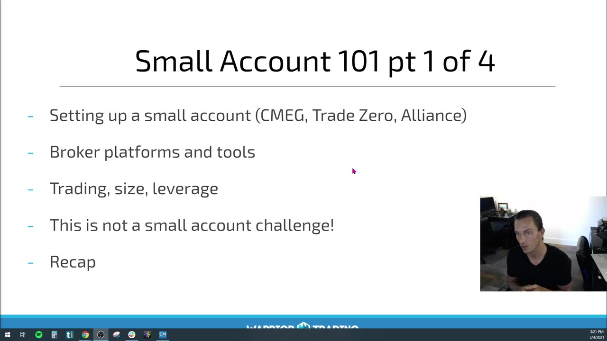

**图怎么看：**

- 标题“Small Account 101 pt 1 of 4”表明这是四部分中的第一部分，内容从小账户设置开始，并列出 CMEG、Trade Zero、Alliance 等课程当时讨论的选择。
- 后续项目包括券商平台与工具，以及 trading、size、leverage，说明小账户问题不只是选券商，还涉及仓位和杠杆如何共同约束风险。
- 幻灯片明确写着“This is not a small account challenge”，应把它当作账户机制与风险课程，而不是鼓励用短期收益竞赛验证能力。
- 画面只反映录课时的课程范围，不代表这些券商今天仍适用或适合本人；开户资格、费用、监管和杠杆规则必须另行核实。

### 关键内容

- 讲师介绍了几种支持小账户交易的平台，如CMEG、Alliance Trader和Trade Zero。
- 使用这些平台需要支付月费，并且存在一定的风险，如账户被关闭等。
- 讲师强调了在小账户交易中应遵循的策略，包括合理止损和避免追涨。
- 使用较小的杠杆比例，以减少风险。
- 讲师提到在小账户交易中应避免追涨，而应等待合适的入场时机。
- 讲师建议在小账户中交易时保持谨慎，避免使用最后的资金。
- 讲师指出，即使在小账户中交易，也需要遵守一定的风险管理原则。
- 讲师强调了在小账户交易中应避免频繁加仓，以降低风险。
- 讲师提到在小账户交易中应关注市场动态，及时调整策略。
- 讲师提醒学员，即使在小账户中交易，也需要保持警惕，避免过度自信。

### 分析与执行顺序

1. 讲师首先介绍了支持小账户交易的平台，如CMEG、Alliance Trader和Trade Zero。
2. 然后，讲师详细讲解了如何设置交易账户，包括选择合适的交易平台和工具。
3. 接着，讲师强调了在小账户交易中应遵循的策略，包括合理止损和避免追涨。
4. 讲师还提到了使用较小的杠杆比例，以减少风险。
5. 最后，讲师总结了在小账户交易中应避免频繁加仓，以降低风险。
6. 在整个过程中，讲师反复强调了在小账户交易中应保持谨慎，避免使用最后的资金。

### 案例与细节

- 讲师提到CMEG提供了6到1的杠杆，可以在3000美元的账户上获得六倍杠杆。
- 讲师展示了如何设置交易账户，包括选择合适的交易平台和工具。
- 讲师强调了在小账户交易中应遵循的策略，包括合理止损和避免追涨。
- 讲师提到了使用较小的杠杆比例，以减少风险。
- 讲师举例说明了在小账户交易中应避免频繁加仓，以降低风险。

### 风险与边界

- 由于录制于2021年，部分信息可能已发生变化，如交易平台的具体规则。
- 小账户交易存在一定的风险，如账户被关闭等。
- 在小账户交易中使用最后的资金会增加风险。
- 讲师提到的某些策略可能需要根据当前市场情况进行调整。

### 复盘问题

- 在小账户交易中，您是如何选择交易平台的？
- 在小账户交易中，您是如何设置止损的？
- 在小账户交易中，您是如何避免追涨的？
- 在小账户交易中，您是如何管理资金使用的？

---

## v0495：新手常见问题解答

> 日期：2021　·　时长：00:52:40

**本场重点：** 1. 新手常问的问题及答案；2. 保持简单交易策略的重要性；3. 长期模拟交易的重要性。

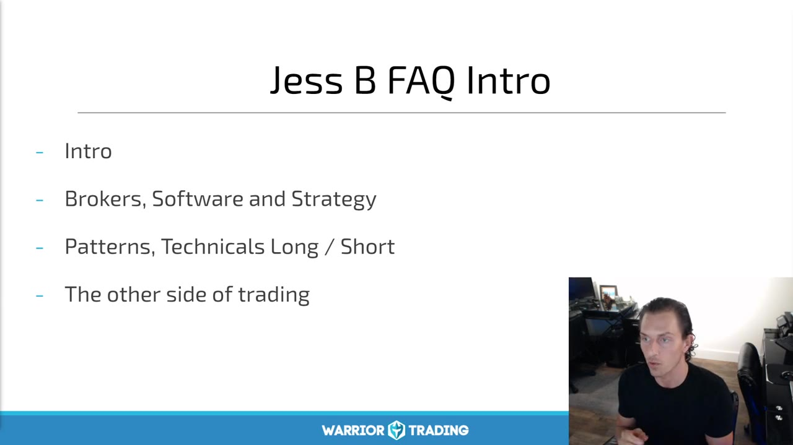

**图怎么看：**

- 图中显示了多个股票的实时交易数据，包括价格、成交量和交易时间。
- 可以看到不同股票的K线图，以及它们在不同周期（如1分钟、5分钟）下的表现。
- 成交量柱的高度反映对应周期内的总成交量；红绿着色通常跟随价格柱的涨跌规则，不能直接拆成两种方向的主动成交。
- 图表下方的表格列出了股票代码、名称、最新价格等信息，便于投资者参考。

### 关键内容

- 讲师提到自己从零开始交易的经历，强调了耐心和努力的重要性。
- 讲师指出，新手常问的问题集中在市场理解、交易策略和心理稳定性等方面。
- 讲师强调了使用简单交易工具和策略的重要性，避免复杂技术指标的干扰。
- 讲师分享了自己如何通过模拟交易来逐步建立信心和经验的过程。
- 讲师提到使用免费交易平台的优势，如TD Ameritrade和eTrade。
- 讲师解释了如何通过简单的图表设置来识别交易机会，如五分钟图表。
- 讲师强调了保持小账户规模和合理风险管理的重要性。
- 讲师指出，交易心态和情绪管理是成功的关键因素之一。
- 讲师提醒新手不要用最后一笔资金进行交易，以免造成心理压力。
- 讲师建议新手通过多次模拟交易来积累经验，确保在真实交易中做好准备。

### 分析与执行顺序

1. 讲师首先介绍了自己从零开始交易的经历，强调了耐心和努力的重要性。
2. 然后，讲师列举了新手常问的问题，包括市场理解、交易策略和心理稳定性等方面。
3. 接着，讲师分享了自己如何通过使用简单交易工具和策略来识别交易机会的方法。
4. 讲师进一步解释了如何通过模拟交易来逐步建立信心和经验的过程。
5. 最后，讲师提醒新手不要用最后一笔资金进行交易，以免造成心理压力，并建议通过多次模拟交易来积累经验。

### 案例与细节

- 讲师提到自己曾经通过收到泵邮件购买股票，但最终没有卖出，这激发了他对市场的兴趣。
- 讲师分享了自己如何通过TD Ameritrade和eTrade等免费交易平台进行交易，以减少成本。
- 讲师解释了如何通过简单的五分钟图表来识别交易机会，如NVCR的快速回调。
- 讲师提到自己如何通过模拟交易来逐步建立信心和经验，最终成为导师。
- 讲师分享了一个案例，说明如何通过简单的图表设置来识别交易机会，如TIRX的突破。

### 风险与边界

- 录制年代限制，交易环境和规则可能已发生变化。
- 免费交易平台的优势可能不再适用，需关注当前市场情况。
- 交易心态和情绪管理的重要性可能因人而异，需结合个人情况调整。
- 模拟交易虽然有助于积累经验，但真实交易中仍需谨慎对待风险。
- 交易策略的有效性可能随市场变化而变化，需持续学习和适应。

### 复盘问题

- 讲师提到的交易心态和情绪管理方法是否适用于所有交易者？
- 模拟交易对于新手来说有多大的实际帮助？
- 使用免费交易平台有哪些潜在的风险？

---

## v0496：反转指标详解

> 日期：2021　·　时长：00:36:10

**本场重点：** 头肩顶/底模式是常见的反转指标，适用于多种时间框架，但需注意实际价格行动更为重要。

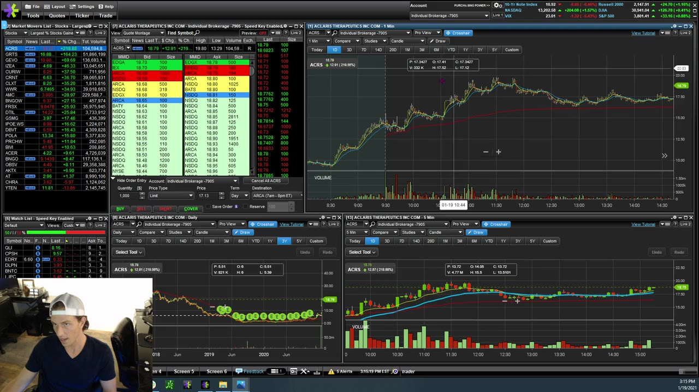

**图怎么看：**

- 在Gritstone Oncology Inc.的1分钟图中，可以看到一个明显的头部形态。
- 价格突破了颈线，表明市场可能正在反转。
- 成交量柱的高度反映对应周期内的总成交量；红绿着色通常跟随价格柱的涨跌规则，不能直接拆成两种方向的主动成交。
- 图表下方的时间与成交量显示了市场的即时流动性和趋势。

### 关键内容

- 头肩顶模式是一种常见的顶部反转指标，通常在股价上升后出现。
- 模式包括左肩、头部和右肩，通常右肩会低于头部，形成一个下降趋势。
- 突破颈线后，股价通常会回测颈线，确认反转信号。
- 头肩顶模式在不同时间框架下表现相似，但一分钟图表能提供更详细的细节。
- 模式形成后，股价可能会出现大幅回调，这是反转信号的有效验证。
- 头肩顶模式可以应用于多种股票，但需要足够的成交量支持。
- 模式形成后，可以设置止损，以保护资金安全。
- 头肩顶模式的反转信号需要结合其他技术指标进行验证。
- 模式形成后，股价可能会继续下跌，因此需要谨慎操作。
- 头肩顶模式在不同时间框架下的应用效果可能有所不同，需灵活调整策略

### 分析与执行顺序

1. 首先识别股价走势，寻找上升趋势的迹象。
2. 然后观察股价是否出现明显的顶部形态，如头肩顶。
3. 接着确认模式的形成，包括左肩、头部和右肩。
4. 最后观察股价是否突破颈线，并回测颈线确认反转。
5. 在确认反转信号后，可以设置止损，以保护资金安全。
6. 同时结合其他技术指标进行综合判断，提高准确性。
7. 在模式形成后，密切关注股价动向，及时调整策略

### 案例与细节

- ACRS股票在一天内经历了头肩顶模式，左肩在100美元附近，头部在110美元附近，右肩在105美元附近。
- 头肩顶模式形成后，股价突破了颈线，随后回测颈线，确认了反转信号。
- 模式形成后，股价出现了大幅回调，从110美元跌至100美元附近。
- 头肩顶模式在不同时间框架下的表现相似，但在一分钟图表上能观察到更多细节。
- 模式形成后，股价继续下跌，因此需要谨慎操作，避免被套。
- 头肩顶模式在不同时间框架下的应用效果可能有所不同，需灵活调整策略

### 风险与边界

- 头肩顶模式的反转信号需要结合其他技术指标进行验证，否则容易产生误判。
- 模式形成后，股价可能会继续下跌，因此需要谨慎操作，避免被套。
- 头肩顶模式在不同时间框架下的应用效果可能有所不同，需灵活调整策略。
- 模式形成后，股价可能会出现大幅回调，因此需要设置止损，以保护资金安全。
- 头肩顶模式在不同时间框架下的应用效果可能有所不同，需灵活调整策略，避免过度依赖单一指标

### 复盘问题

- 头肩顶模式的形成需要哪些关键要素？
- 如何确认头肩顶模式的反转信号？
- 在不同时间框架下，头肩顶模式的表现有何差异？
- 如何结合其他技术指标来验证头肩顶模式的反转信号？
- 在头肩顶模式形成后，如何设置止损以保护资金安全？

---

## v0497：小账户交易策略与实践

> 日期：2021　·　时长：00:50:33

**本场重点：** 小账户交易需要明确策略，利用技术分析找到最佳交易机会，避免频繁交易带来的成本。

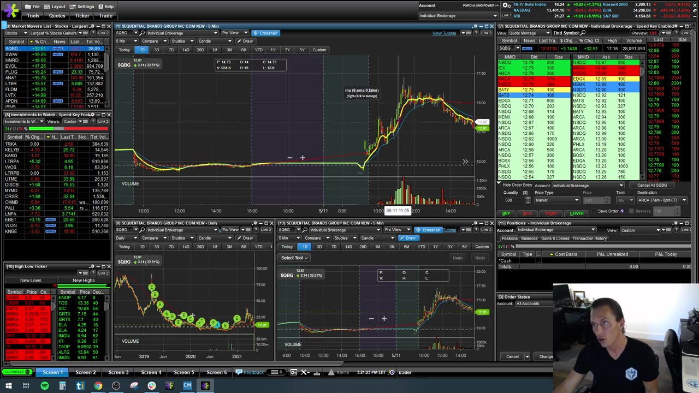

**图怎么看：**

- 在SGBG的5分钟K线图中，可以看到价格在不同时间段内的波动情况。
- Level 2显示了股票的买卖盘信息，包括买盘（Bid）和卖盘（Ask）的价格和数量。
- 通过观察K线图和Level 2，可以分析出当前市场的供需关系和潜在的交易机会。
- 这些图表和数据对于制定交易策略和做出决策至关重要。

### 关键内容

- 讲师强调了使用技术分析的重要性，通过识别支撑位和阻力位来制定交易策略。
- 小账户交易需要关注市场深度和交易量，以避免被大资金操纵。
- 使用E-Trade和TD Ameritrade等平台进行交易，可以享受零佣金和高杠杆。
- 交易策略应基于技术分析，而不是盲目跟随市场波动。
- 利用水平二（Level 2）市场深度信息，识别潜在的卖压和买压。
- 设置止损和止盈，以控制风险并保护资金。
- 避免过度交易，保持交易纪律，专注于高胜率的交易机会。
- 利用楔形和趋势线等技术形态，识别潜在的突破点和反转点。
- 交易策略应根据个人情况定制，不断优化和调整。
- 使用图表和指标进行技术分析，识别买卖信号和趋势变化

### 分析与执行顺序

1. 讲师首先介绍了小账户交易的基础知识，包括选择合适的交易平台。
2. 然后讲解了如何利用技术分析找到最佳交易机会，特别是识别支撑位和阻力位。
3. 接着介绍了如何阅读水平二（Level 2）市场深度信息，识别潜在的卖压和买压。
4. 讲师还强调了设置止损和止盈的重要性，以控制风险。
5. 最后，讲师推荐了一些具体的交易策略和技术形态，如楔形和趋势线等。
6. 整个过程中，讲师反复强调了交易纪律和风险管理的重要性。
7. 讲师还提醒学员要根据自己的实际情况定制交易策略，不断优化和调整

### 案例与细节

- 讲师提到，某股票在开盘后出现大量卖单，但价格并未大幅下跌，这可能是机构投资者在制造恐慌。
- 讲师指出，某股票在突破关键阻力位后，成交量显著增加，表明有大量资金介入。
- 讲师举例说明，某股票在突破支撑位后，价格迅速回升，这可能是机构投资者在做多。
- 讲师提到，某股票在突破关键阻力位后，价格继续上涨，但随后出现大量卖单，这可能是机构投资者在撤出。
- 讲师举例说明，某股票在突破支撑位后，价格迅速回升，但随后出现大量卖单，这可能是机构投资者在撤出

### 风险与边界

- 小账户交易面临的主要风险是频繁交易带来的成本，包括手续费和滑点。
- 过度依赖技术分析可能导致忽视基本面因素，从而做出错误的交易决策。
- 市场深度信息可能受到网络延迟的影响，导致分析结果不准确。
- 交易策略的有效性会随市场环境的变化而变化，需要不断调整和优化。
- 交易策略的成功依赖于个人的判断力和经验，新手可能难以把握时机

### 复盘问题

- 如何识别支撑位和阻力位，并将其应用于实际交易？
- 如何利用水平二（Level 2）市场深度信息来识别潜在的卖压和买压？
- 如何设置止损和止盈以控制风险？
- 如何根据个人情况定制交易策略？
- 如何利用楔形和趋势线等技术形态来识别潜在的突破点和反转点？

---

## v0498：中期回顾：情绪管理与市场适应

> 日期：2021　·　时长：00:47:02

**本场重点：** 情绪波动导致的交易失误与如何调整心态

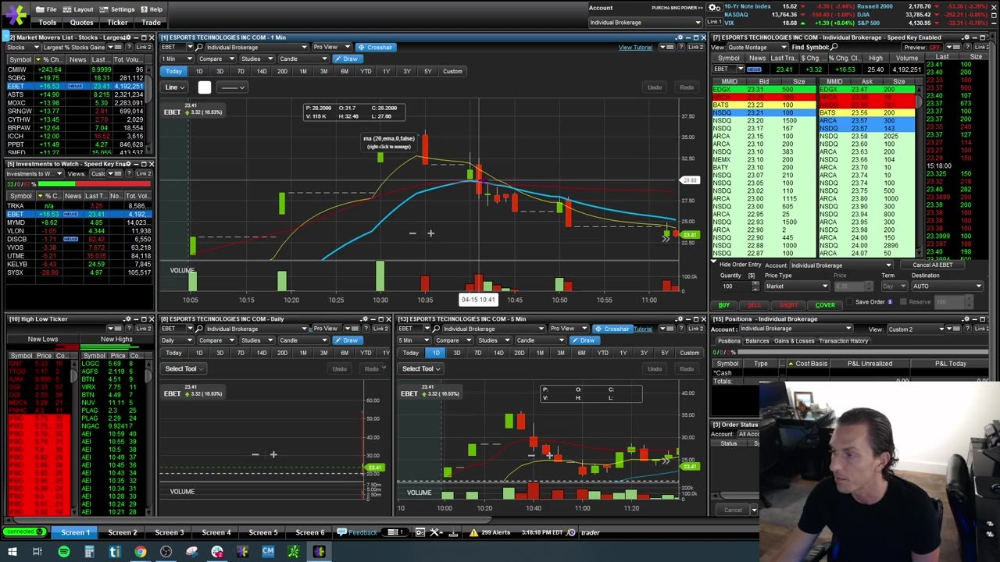

**图怎么看：**

- 在1分钟图表上，MYMD Pharmaceuticals Inc (MYMD) 的价格在上升趋势中，显示出强劲的上涨势头。
- 成交量柱的高度反映对应周期内的总成交量；红绿着色通常跟随价格柱的涨跌规则，不能直接拆成两种方向的主动成交。
- 均线（MA）显示了价格的趋势方向，当前均线向上倾斜，表明价格可能继续上涨。
- 图表中的水平线标记了重要的支撑和阻力位，帮助投资者判断价格的潜在反转点。

### 关键内容

- 情绪波动导致交易失误，如过度追涨
- 市场条件不佳时应减少交易量
- 保持冷静，避免贪婪和恐惧
- 及时止损，避免情绪失控
- 情绪管理是交易成功的关键
- 市场条件变化时应灵活调整策略
- 使用模拟账户进行自我调整
- 保持交易纪律，避免过度交易
- 情绪波动可能导致交易失败
- 市场条件不佳时应减少交易
- 情绪波动会导致过度追涨，如EBET股票在市场条件不佳时出现大幅亏损，说明情绪失控会放大损失。
- 保持冷静可以避免贪婪和恐惧，例如在MIMD股票交易中，冷静分析市场情况并抓住最佳入场点，避免了不必要的风险。
- 及时止损是控制情绪的关键，如在EBET股票交易中，及时止损避免了更大的损失，体现了止损的重要性。
- 市场条件变化时应灵活调整策略，如从EBET股票的激进交易转向保守交易，体现了市场条件变化时的适应性。
- 情绪管理需要自我反思，如回顾过去几个月的交易记录，发现情绪波动导致的失误，强调了自我反省的重要性

### 分析与执行顺序

1. 讲师回顾了近期交易情况，指出情绪波动导致的失误
2. 分析了市场条件不佳时的交易策略
3. 强调了情绪管理的重要性
4. 分享了如何在模拟账户中进行自我调整的经验
5. 提醒学员要保持冷静，避免贪婪和恐惧
6. 强调了及时止损的重要性
7. 总结了市场条件变化时应如何灵活调整策略

### 案例与细节

- EBET 股票因市场条件不佳而出现大幅亏损
- MIMD 股票的交易展示了如何抓住最佳入场点
- 通过模拟账户调整交易策略，避免情绪失控
- 市场条件不佳时，交易量减少至 2,000 股
- 使用模拟账户进行自我调整，避免过度交易
- 市场条件变化时，交易策略从激进转向保守
- 在EBET股票交易中，由于市场条件不佳，交易者情绪波动导致了8,800美元的巨大亏损，说明市场条件不佳时情绪失控会放大损失。
- MIMD股票的交易展示了如何在市场条件变化时抓住最佳入场点，交易者冷静分析市场情况，最终获利，体现了情绪管理的重要性。
- 通过模拟账户进行自我调整，如在市场条件不佳时将交易量减少至2,000股，避免了过度交易的风险，体现了模拟账户在情绪管理中的作用。
- 在市场条件变化时，交易策略从激进转向保守，如从EBET股票的激进交易转向保守交易，体现了市场条件变化时的适应性。
- 使用模拟账户进行自我调整，避免过度交易，如在市场条件不佳时减少交易量，体现了模拟账户在情绪管理中的应用

### 风险与边界

- 情绪波动可能导致交易失误
- 过度交易可能增加风险
- 市场条件不佳时，交易策略不当可能导致亏损
- 模拟账户经验不足可能影响实际交易
- 录制年代限制，市场环境可能发生变化
- 情绪波动可能导致交易失误，如EBET股票的大幅亏损，说明情绪失控会放大损失，需警惕。
- 过度交易可能增加风险，如在市场条件不佳时仍进行大量交易，可能导致更大损失，需注意。
- 市场条件不佳时，交易策略不当可能导致亏损，如EBET股票的激进交易，需谨慎对待。
- 模拟账户经验不足可能影响实际交易，如在模拟账户中表现良好但在实际交易中情绪失控，需提高实际操作能力

### 复盘问题

- 在市场条件不佳时，如何调整交易策略？
- 如何在模拟账户中进行自我调整以避免情绪失控？
- 情绪波动对交易有何具体影响？

---

## v0499：E-Trade Pro 交易平台介绍

> 日期：2021　·　时长：00:40:28

**本场重点：** 介绍 E-Trade Pro 的基本功能和使用方法，强调其作为免费交易平台的优势。

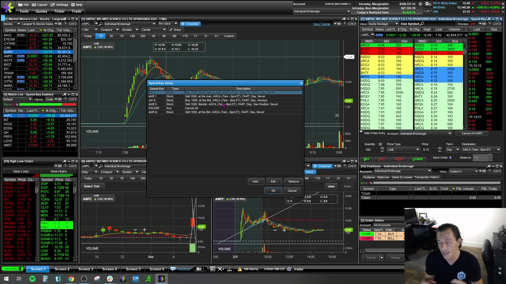

**图怎么看：**

- 画面中，可以看到E-Trade Pro交易平台的多个窗口，包括市场动向列表、实时报价、订单窗口等。
- 用户可以查看不同股票的最新价格、涨跌幅度以及成交量。
- 此外，还显示了订单窗口，用户可以输入买卖指令并监控订单状态。
- 这些功能有助于投资者进行实时交易决策和管理资金流动。

### 关键内容

- E-Trade Pro 是一个独立软件，需要下载安装。
- 账户余额需达到一定门槛才能获得访问权限。
- 每月需支付 80 美元的软件费用，但活跃交易者可以免除。
- 提供实时数据服务，每月 10 美元。
- 支持多种图表和分析工具，包括移动平均线和成交量加权平均价格。
- 提供即时交易功能，支持预市场和盘后交易。
- 支持多种订单类型，包括市价单、限价单等。
- 提供市场动向和新闻更新功能，帮助用户跟踪市场动态。
- 支持多窗口布局，方便用户在不同设备上操作。
- E-Trade Pro 的水平二报价蒙太奇功能强大，可自定义显示深度、图表和指标，有助于实时监控市场动态。
- 平台支持多种图表模式，如线图和柱状图，但线图过于简单，不推荐使用。
- 热键设置需谨慎，错误的热键可能导致订单未执行或执行错误，需反复测试确保无误。
- 虽然 E-Trade Pro 支持多种订单类型，但限价单和止损单的设置需根据市场情况灵活调整。
- 平台的即时交易功能在预市场和盘后时段尤为有用，但需注意市场流动性可能较低

### 分析与执行顺序

1. 登录 E-Trade Pro 软件，查看基本布局。
2. 设置账户余额，确保符合要求。
3. 下载并安装 E-Trade Pro 软件。
4. 配置热键和图表设置，以提高交易效率。
5. 使用交易平台进行模拟交易，熟悉各项功能。

### 案例与细节

- INVO 股票的五分钟图表显示了明显的趋势反转。
- NPC 股票在预市场交易中表现良好，证明了平台的即时交易功能。
- 使用热键进行快速下单，验证了热键设置的有效性。
- 通过设置移动平均线和成交量加权平均价格，分析股票走势。
- 使用市场深度功能，观察买卖盘口的变化。
- 使用 INVO 股票的水平二报价蒙太奇，观察到大量买单和卖单，显示市场活跃度高，有助于及时下单。
- 通过 NPC 股票的五分钟图表，发现价格突破关键支撑位，使用热键迅速下单，验证了平台的即时交易功能。
- 设置移动平均线和成交量加权平均价格后，发现 INVO 股票在五分钟内出现明显趋势反转，验证了分析工具的有效性。
- 使用水平二报价蒙太奇，观察到某股票的买卖盘口变化，发现大量买单聚集在特定价位，表明市场对该价位有强烈需求。
- 通过 E-Trade Pro 的新闻窗口，获取 INVO 公司即将发布财报的消息，提前做好交易准备

### 风险与边界

- 账户余额不足可能导致无法获得访问权限。
- 每月费用可能对某些用户来说较高。
- 平台功能可能因时间变化而有所不同。
- 交易时需注意市场波动带来的风险。
- 热键设置不当可能导致下单失败。
- 如果账户余额不足，可能会导致无法获得 E-Trade Pro 的访问权限，需确保账户有足够的资金。
- 热键设置不当可能导致订单未执行或执行错误，需反复测试确保无误，否则可能错失交易机会。
- 虽然 E-Trade Pro 支持多种订单类型，但限价单和止损单的设置需根据市场情况灵活调整，否则可能面临亏损风险。
- 预市场和盘后时段的流动性较低，可能导致交易价格偏离预期，需谨慎操作，避免因流动性不足导致的损失

### 复盘问题

- 如何设置账户以满足 E-Trade Pro 的访问要求？
- 如何利用交易平台的图表和分析工具进行交易决策？
- 在使用 E-Trade Pro 进行交易时，需要注意哪些风险？

---

## v0500：反转指标的应用

> 日期：2021　·　时长：00:30:17

**本场重点：** 通过反转指标识别市场转折点，提高交易决策的准确性。

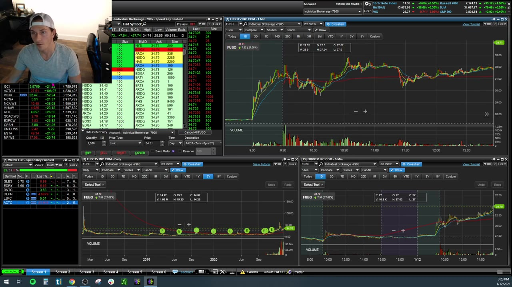

**图怎么看：**

- 在FUBOTV INC COM的1分钟图中，可以看到价格在红色和绿色柱状图之间波动。
- 成交量柱的高度反映对应周期内的总成交量；红绿着色通常跟随价格柱的涨跌规则，不能直接拆成两种方向的主动成交。
- 成交量适合与前序时段或历史基准比较参与程度，但仅凭柱体颜色无法判断哪一方主动，也不能由此推断下一步方向。
- 若要研究主动成交方向，需要结合逐笔成交发生在买价还是卖价、价格响应以及挂单变化；单张静态成交量图不包含完整时序证据。

### 关键内容

- 市场存在反转信号，如顶部尾巴和拒绝蜡烛。
- 这些信号表明市场可能即将反转方向。
- 反转不是永久性的，需要谨慎对待。
- 使用水平支撑和阻力位进行交易管理。
- 成交量加权平均价格拒绝是常见的反转信号。
- 熊旗形态通常被误认为是反弹。
- 牛陷阱表现为股票看似要继续上涨，但实际上会下跌。
- 移动平均线拒绝是另一种常见的反转信号。
- 交易者应关注成交量和价格走势的变化。
- 反转指标有助于识别潜在的短期交易机会

### 分析与执行顺序

1. 首先，识别市场中的反转信号，如顶部尾巴和拒绝蜡烛。
2. 然后，确认这些信号是否出现在关键支撑和阻力位附近。
3. 接着，观察成交量的变化，确认是否出现明显的卖压。
4. 最后，结合移动平均线和其他技术指标，判断市场趋势。
5. 在确认反转信号后，制定相应的交易策略，如设置止损和止盈点。
6. 持续监控市场动态，及时调整交易策略以应对市场变化。
7. 利用反转指标进行交易时，需注意市场波动性增加的风险

### 案例与细节

- BMRA股票在预市前上涨，但随后出现顶部尾巴和拒绝蜡烛，表明市场可能反转。
- DLP股票在关键水平上形成顶部尾巴，随后出现拒绝蜡烛，表明市场可能反转。
- LJPC股票尝试突破关键水平，但成交量加权平均价格拒绝，表明市场可能反转。
- BMRA股票形成熊旗形态，但随后出现拒绝蜡烛，表明市场可能反转。
- DLPN股票尝试突破关键水平，但牛陷阱形态出现，表明市场可能反转

### 风险与边界

- 反转信号并非总是准确的，有时市场可能继续当前趋势。
- 过度依赖反转指标可能导致频繁交易，增加成本。
- 市场环境发生变化时，反转指标的效果可能会减弱。
- 交易者应结合其他技术指标和基本面分析，避免单一依赖。
- 录制年代限制为2021年，市场环境和规则可能已发生变化

### 复盘问题

- 如何识别市场中的反转信号？
- 在哪些情况下，反转信号可能是无效的？
- 如何结合其他技术指标和基本面分析来提高交易决策的准确性？

---

## v0501：止损与止盈策略

> 日期：2021　·　时长：00:45:25

**本场重点：** 止损与止盈是交易中不可或缺的部分，避免大额亏损，保持利润。

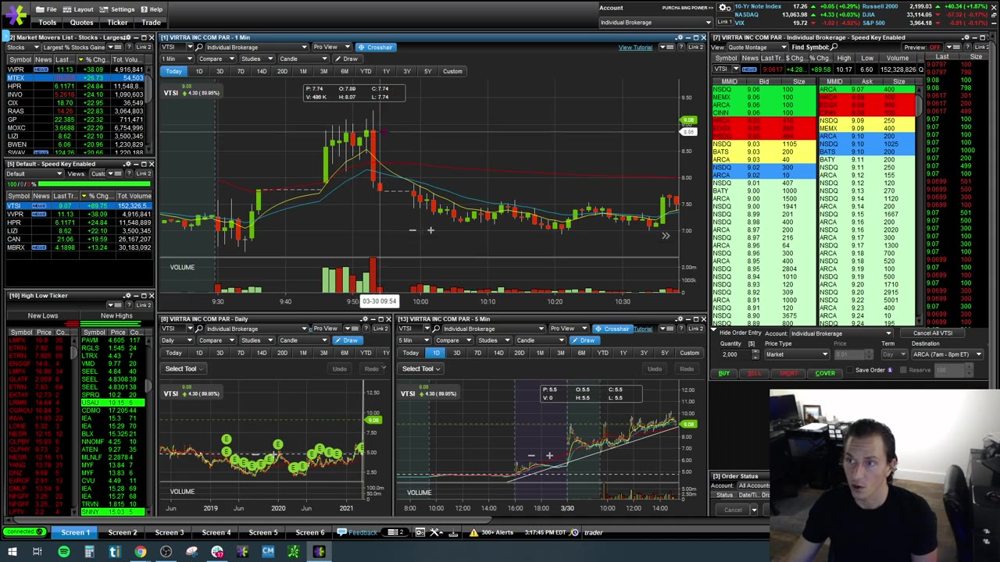

**图怎么看：**

- 在图表中可以看到VIRTA INC COM PAR的1分钟K线图，显示了价格波动情况。
- 水平轴表示时间，垂直轴表示价格，红色和绿色柱状图代表成交量。
- 图表下方的成交量柱显示了不同时间段的买卖活动。
- 右侧的表格显示了当前市场的实时报价和交易数据。

### 关键内容

- 识别图表中的拒绝信号，如大红烛和拒绝形态。
- 制定交易计划，包括风险评估和收益目标。
- 在图表上识别止损点，如突破支撑位或阻力位。
- 及时止损，避免大额亏损。
- 使用技术指标辅助决策，如移动平均线。
- 避免过度依赖单一股票，保持多样化的交易组合。
- 识别并利用市场情绪变化，如恐慌抛售。
- 保持冷静，避免情绪化决策。
- 持续监控市场动态，及时调整交易策略

### 分析与执行顺序

1. 讲师首先介绍了止损的重要性，避免大额亏损。
2. 通过案例展示了如何识别图表中的拒绝信号，如大红烛。
3. 讲解了如何制定交易计划，包括风险评估和收益目标。
4. 演示了如何在图表上识别止损点，如突破支撑位或阻力位。
5. 强调了及时止损的重要性，避免大额亏损。
6. 使用技术指标辅助决策，如移动平均线。
7. 提醒学员避免过度依赖单一股票，保持多样化的交易组合

### 案例与细节

- ticker：VTSI；price_action：从950元开始，突破后拒绝，形成新的高点。；volume：高卖量伴随价格下跌，显示市场情绪变化。；chart_pattern：形成明显的拒绝形态，如大红烛和顶背离。；behavior：学员们被引导识别图表中的关键点，如止损点
- ticker：VVPR；price_action：从1305元开始，突破后拒绝，形成新的高点。；volume：高卖量伴随价格下跌，显示市场情绪变化。；chart_pattern：形成明显的拒绝形态，如大红烛和顶背离。；behavior：学员们被引导识别图表中的关键点，如止损点
- ticker：ORPH；price_action：从低点开始，突破后拒绝，形成新的高点。；volume：高卖量伴随价格下跌，显示市场情绪变化。；chart_pattern：形成明显的拒绝形态，如大红烛和顶背离。；behavior：学员们被引导识别图表中的关键点，如止损点

### 风险与边界

- 止损策略需要根据市场情况进行调整，不能一成不变。
- 过度依赖单一股票可能导致风险集中。
- 市场情绪变化可能导致预测失误。
- 交易策略的有效性可能随市场环境变化而改变

### 复盘问题

- 如何识别图表中的拒绝信号？
- 制定交易计划时，如何平衡风险和收益？
- 在实际交易中，如何应用止损策略？
- 如何利用技术指标辅助决策？
- 如何保持交易组合的多样性？

---

## v0502：同情动量交易策略

> 日期：2021　·　时长：00:44:55

**本场重点：** 同情动量交易策略是基于市场情绪和投机行为，但需要谨慎管理风险。

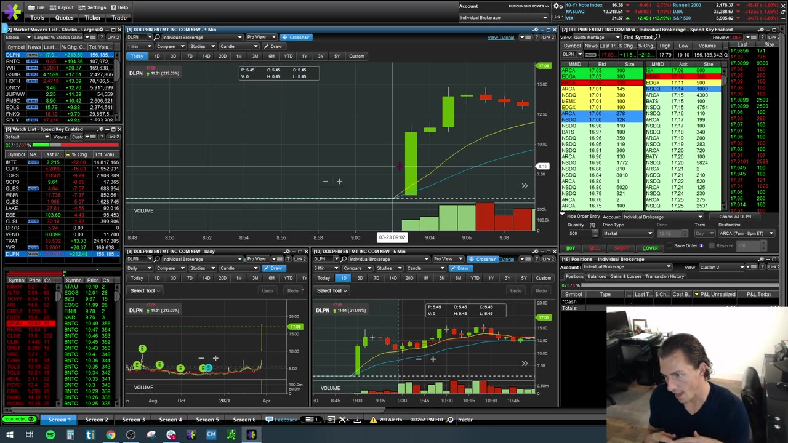

**图怎么看：**

- 在图C中，可以看到一个股票交易软件界面，显示了多个股票的实时数据和图表。
- 界面左侧是一个市场动量列表，右侧是股票的详细信息，包括价格、成交量等。
- 中间部分展示了股票的日线图和成交量柱状图，帮助分析股票的趋势和波动性。
- 底部有一个时间轴，显示了不同时间段的价格变化，有助于识别趋势和支撑阻力位。

### 关键内容

- 同情动量基于市场情绪和投机行为，如NFT艺术品的炒作。
- 关键在于识别高成交量和快速价格变动，但需谨慎管理风险。
- 同情动量通常伴随着大量零售交易者的参与。
- 需要关注新闻或催化剂，以提高交易成功的可能性。
- 快速价格变动后应设置紧停，避免被反向烛线止损。
- 零售交易者在市场情绪驱动下频繁买卖，导致价格波动。
- 需要区分真正的支撑位和假支撑位，避免被假支撑位误导。
- 同情动量交易策略适用于短期交易，不适合长期持有。
- 市场情绪变化可能导致价格大幅波动，需谨慎操作。
- 同情动量交易策略依赖于市场情绪，而非基本面分析

### 分析与执行顺序

1. 讲师首先解释了同情动量的概念及其背后的市场情绪。
2. 然后通过具体的股票例子来演示如何识别高成交量和快速价格变动。
3. 接着强调了设置紧停的重要性，以避免被反向烛线止损。
4. 最后提醒学员注意区分真正的支撑位和假支撑位，避免被假支撑位误导。
5. 讲师还强调了同情动量交易策略的短期性质，不适合长期持有。
6. 在整个过程中，讲师反复强调了风险管理和谨慎操作的重要性。
7. 最后，讲师提醒学员注意市场情绪的变化可能导致价格大幅波动，需谨慎操作

### 案例与细节

- TKAT从$6涨到$73.89，显示了高成交量和快速价格变动。
- DLPN宣布新NFT业务，股价双倍上涨，显示了新闻对股价的影响。
- CLBS从5元涨到10元，然后迅速回落，显示了快速价格变动后的风险。
- TCAT从低点迅速上涨，显示了零售交易者的积极参与。
- L-A-K-E从13元涨到20元，显示了疫情恐慌下的市场情绪驱动

### 风险与边界

- 同情动量交易策略依赖于市场情绪，市场情绪变化可能导致价格大幅波动。
- 零售交易者的频繁买卖可能导致价格波动，增加了交易风险。
- 缺乏新闻或催化剂的情况下，投机行为可能导致价格大幅波动。
- 市场情绪变化可能导致价格反转，增加了交易风险。
- 同情动量交易策略适用于短期交易，不适合长期持有，长期持有风险较大

### 复盘问题

- 如何识别真正的支撑位和假支撑位？
- 在设置紧停时，如何判断是否已经到达真正的支撑位？
- 同情动量交易策略适用于哪些类型的股票？

---

## v0503：构建交易站

> 日期：2021　·　时长：00:48:51

**本场重点：** 明确需求与预算，选择合适的硬件配置，确保交易流畅。

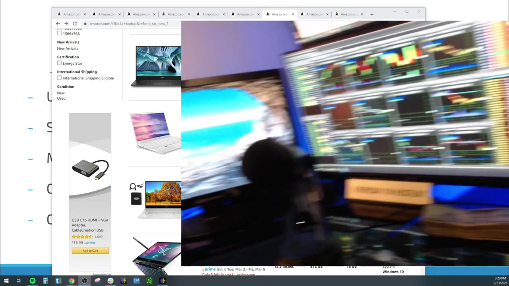

**图怎么看：**

- 该截图展示了在Amazon网站上搜索并查看了两款产品：HP VH240a显示器和USB C到HDMI + VGA适配器。
- HP VH240a显示器的价格为$124.99，带有内置扬声器和VESA支架，支持旋转、倾斜、HDMI和VGA端口。
- USB C到HDMI + VGA适配器的价格为$15.99，适用于各种设备如笔记本电脑、台式机、XBOX、PS4等，具有5Gbps的数据传输率。
- 这些产品提供了详细的规格和用户评价，帮助用户做出购买决策。

### 关键内容

- 讲师建议使用现有设备，逐步升级以实现盈利。
- 笔记本电脑和台式机的选择应考虑性能和便携性。
- 显示器推荐使用IPS屏幕，支持4K分辨率以提高工作效率。
- 键盘和鼠标应选择机械键盘和有线连接以保证操作顺畅。
- 交易站的连接方式需考虑USB 3.0扩展器和显示器端口。
- 备份方案建议使用手机进行紧急操作，避免依赖昂贵的UPS电源。
- 交易站的基本配置包括简单的办公桌和椅子，以及必要的软件。
- 交易站的舒适环境有助于提高交易效率。
- 交易站的升级应根据实际盈利情况逐步进行，而非盲目追求高端配置。
- 交易站的配置需考虑未来可能的技术进步和市场变化

### 分析与执行顺序

1. 讲师首先介绍了构建交易站的基本原则，强调使用现有设备。
2. 接着讲解了选择笔记本电脑和台式机的标准，包括处理器、内存和显卡。
3. 然后讨论了显示器的选择，推荐使用IPS屏幕和4K分辨率。
4. 进一步介绍了键盘和鼠标的推荐配置，强调机械键盘和有线连接。
5. 详细说明了如何通过USB 3.0扩展器连接多个显示器，确保交易流畅。
6. 最后，讲师提出了备份方案，建议使用手机进行紧急操作，避免依赖UPS电源。
7. 整个过程涵盖了从基础配置到高级连接方式的全面指导

### 案例与细节

- 一台ASIS品牌的笔记本电脑，配备16GB内存和NVIDIA显卡。
- 六台24英寸HP IPS显示器，支持4K分辨率。
- 一个USB 3.0扩展器，用于连接多个显示器。
- 一个机械键盘和有线鼠标，确保操作顺畅。
- 通过手机连接交易软件，关闭交易位置，避免依赖UPS电源

### 风险与边界

- 交易站的配置需考虑未来可能的技术进步和市场变化，避免过早淘汰。
- 使用手机进行紧急操作存在网络不稳定的风险。
- 交易站的配置需根据个人盈利情况进行逐步升级，避免盲目追求高端配置。
- 交易站的备份方案依赖手机，存在手机故障的风险。

### 复盘问题

- 在选择交易站硬件时，哪些因素是最重要的？
- 如何确保交易站的连接方式能够满足多屏操作的需求？
- 在构建交易站时，有哪些关键步骤需要特别注意？
- 交易站的备份方案有哪些替代方案？
- 如何根据个人盈利情况逐步升级交易站的配置？

---

## v0504：五分钟图表交易策略

> 日期：2021　·　时长：00:45:19

**本场重点：** 本课程讲解了如何通过五分钟图表识别和利用股票趋势，减少快速交易带来的风险。

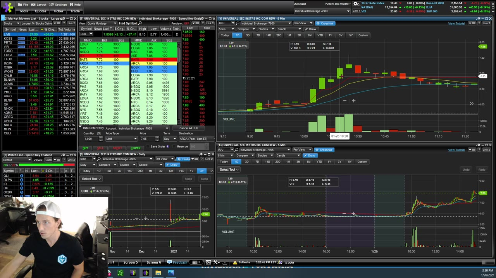

**图怎么看：**

- 界面左上是自选股与报价列表，中上是 Level 2／订单簿，右上和下方三个区域分别显示较长周期与日内图表，适合同时核对背景、形态和即时价位。
- 右上长周期图可见一段快速拉升后进入高位整理；下方日内图把同一标的拆到更细粒度，用来观察五分钟结构是否仍保持趋势或已经转为震荡。
- 阅读顺序可以先用长周期确定价格所处位置，再用五分钟图找高低点、回撤和成交量变化，最后用报价与 Level 2 辅助确认当前流动性，而不是只盯单根蜡烛。
- 静态截图看不到挂单撤销、成交先后和数据延迟，也不能仅凭红绿颜色判断主动订单方向；真实执行仍需结合实时成交与预设止损。

### 关键内容

- 五分钟图表提供了清晰的入场和出场点，减少了快速交易的不确定性。
- 识别关键支撑和阻力水平是成功交易的关键。
- 五分钟图表适用于多种股票趋势，但需要等待确认信号。
- 交易者应关注五分钟图表的突破，而不是一分钟图表的波动。
- 五分钟图表的突破通常伴随着强劲的成交量，增加了交易成功的概率。
- 交易者应避免在五分钟图表突破后立即入场，等待确认信号。
- 五分钟图表的突破需要恢复到关键支撑水平，才能确认有效。
- 交易者应根据五分钟图表的走势调整止损点，以适应市场变化。
- 五分钟图表交易策略适用于多种股票，但需注意市场波动性。
- 交易者应耐心等待确认信号，避免过早入场导致亏损

### 分析与执行顺序

1. 讲师首先介绍了五分钟图表的优势，指出它提供了清晰的入场和出场点。
2. 然后，讲师通过实例展示了如何识别关键支撑和阻力水平，以及如何利用这些水平进行交易。
3. 接着，讲师强调了五分钟图表的突破需要确认信号的重要性，避免过早入场。
4. 讲师还解释了如何根据五分钟图表的走势调整止损点，以适应市场变化。
5. 最后，讲师提醒交易者要耐心等待确认信号，避免过早入场导致亏损。

### 案例与细节

- GME股票在一天内出现了一次明显的五分钟图表突破，突破后股价继续上升，验证了五分钟图表的有效性。
- OXBR股票在开盘后出现了一个五分钟图表的突破，随后股价稳定在一个支撑水平上，显示了五分钟图表的稳定性。
- KOS股票在一天内出现了一个五分钟图表的突破，突破后股价迅速上升，验证了五分钟图表的突破有效性。
- EBSA股票在一天内出现了一个五分钟图表的突破，突破后股价继续上升，显示了五分钟图表的持续性。
- GameStop股票在一天内出现了一个五分钟图表的突破，突破后股价继续上升，验证了五分钟图表的突破有效性

### 风险与边界

- 五分钟图表交易策略依赖于市场的稳定性，如果市场波动性过大，可能会导致交易失败。
- 交易者需要根据自己的风险承受能力来设定止损点，否则可能会遭受重大损失。
- 五分钟图表交易策略适用于多种股票，但需要交易者具备一定的市场分析能力。
- 交易者需要密切关注市场动态，及时调整交易策略，否则可能会错失最佳交易机会。
- 五分钟图表交易策略的成功依赖于交易者的耐心和纪律，否则可能会导致频繁的交易失误

### 复盘问题

- 五分钟图表突破的具体确认信号是什么？
- 如何根据五分钟图表的走势调整止损点？
- 在实际交易中，如何判断市场是否适合使用五分钟图表交易策略？

---

## v0505：成为交易者的生活方式

> 日期：2021　·　时长：00:43:31

**本场重点：** 本课程讨论了如何通过改善生活方式来提高交易表现，强调了习惯、饮食和锻炼的重要性。

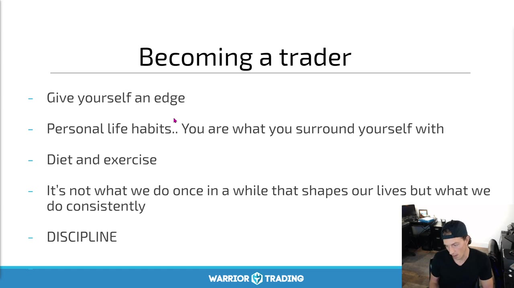

**图怎么看：**

- 幻灯片标题为“Becoming a trader”，列出Give yourself an edge、个人生活习惯、饮食与锻炼、持续行动以及DISCIPLINE等要点。
- 页中强调决定结果的不是偶尔做一次什么，而是持续做什么；这里把交易表现放进日常作息和行为一致性的背景中理解。
- 它与本场“交易者的生活方式”直接对应：改善睡眠、饮食、锻炼和纪律，是为了让每天的注意力与决策流程更稳定。
- 良好生活习惯不能保证单笔盈利，也不能代替策略优势；应把它视为减少可控执行波动的基础，而非交易信号。

### 关键内容

- 讲师指出，成为交易者需要改变生活方式，包括饮食和锻炼。
- 健康的生活习惯可以提高交易表现，但不应过度苛求。
- 保持平衡的生活，不应让交易占据生活的全部。
- 建立良好的生活习惯，如早起锻炼，有助于提高交易效率。
- 避免不良习惯，如过度依赖咖啡因和垃圾食品。
- 通过锻炼和健康饮食，可以释放积极的激素，提高交易情绪。
- 保持积极的心态，避免消极影响。
- 建立日常锻炼和饮食习惯，可以提高自律性。
- 通过改变生活方式，可以提高交易表现，但每个人的情况不同。
- 保持良好的工作生活平衡，避免过度劳累

### 分析与执行顺序

1. 讲师首先介绍了成为交易者的挑战和重要性。
2. 然后讨论了如何通过改善生活方式来提高交易表现。
3. 接着分享了个人习惯和饮食对交易的影响。
4. 最后强调了保持平衡和避免过度劳累的重要性。
5. 通过具体的例子，说明了如何调整生活习惯以提高交易表现。
6. 总结了改善生活方式对交易者的重要意义。
7. 鼓励听众尝试改变生活习惯，并记录效果

### 案例与细节

- 讲师提到自己每天早上5:30起床锻炼，包括做体能训练和喝高热量的蛋白质奶昔。
- 讲师分享了自己每天的饮食习惯，包括吃大量的蛋白质和低糖的食物。
- 讲师提到自己每周进行五次拳击训练，一次跑步，以及早晨喝茶和吃水果。
- 讲师分享了自己在家中设立健身房的经历，减少了通勤时间，提高了效率。
- 讲师提到自己在交易日开始前会做一些冥想练习，以保持清晰的头脑

### 风险与边界

- 录制年代较久远，可能不适用于当前市场环境。
- 过度苛求生活习惯可能会给交易者带来额外压力。
- 改变生活习惯需要时间和持续的努力，短期内可能看不到明显效果。
- 过度依赖单一策略或方法可能会影响交易表现。
- 个人情况不同，需要根据自身情况进行调整

### 复盘问题

- 你计划如何调整自己的生活习惯以提高交易表现？
- 你认为哪些生活习惯对你的交易表现最重要？
- 你如何确保自己的生活习惯不会影响到其他方面的生活？

---

## v0506：情绪化交易的风险与管理

> 日期：2021　·　时长：00:45:23

**本场重点：** 1. 不要根据P&L调整交易策略；2. 控制情绪化交易带来的波动；3. 避免过度追求利润。

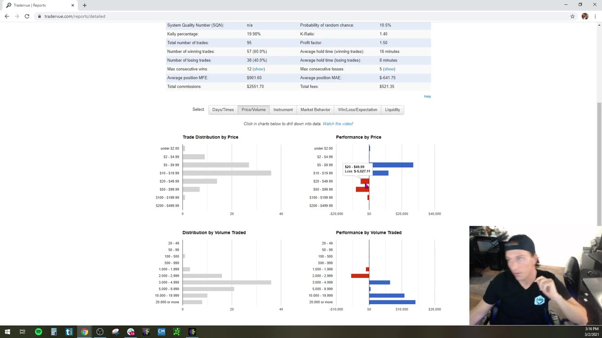

**图怎么看：**

- 该截图展示了TraderVue平台上的交易报告页面，包括交易的详细信息如时间、股票代码、成交量、盈亏情况等。
- 页面上还提供了交易的统计分析，例如总交易次数、盈利次数、亏损次数等。
- 通过这些数据，可以分析交易策略的有效性和盈利能力。
- 此外，页面还提供了图表和图形，帮助用户更直观地理解交易的表现和趋势。

### 关键内容

- 交易者在2月经历了情绪化交易，导致了大幅波动。
- 平均盈利和亏损交易次数相近，表明交易者情绪波动较大。
- 交易者在检查P&L后，情绪波动加剧，导致了更大的损失。
- 交易者在高价位股票上频繁亏损，显示了情绪化交易的风险。
- 交易者在非交易日和低成交量股票上频繁亏损，表明情绪化交易影响广泛。
- 交易者在开盘前交易获利较多，但情绪化交易导致了更大波动。

### 分析与执行顺序

1. 记录交易者在2月的交易情况，包括盈利和亏损。
2. 分析交易者在检查P&L后的交易行为，发现情绪波动加剧。
3. 识别交易者在高价位股票上的频繁亏损，确认情绪化交易的风险。
4. 观察交易者在非交易日和低成交量股票上的亏损，确认情绪化交易的影响。
5. 总结交易者的情绪化交易导致了更大的波动和损失，强调控制情绪的重要性。

### 案例与细节

- JUPW在一次热交易日中获利80美分/股，显示了情绪化交易带来的波动。
- CLPS在42,000股的交易量中获利，但JUPW仅6,500股就获利，显示了情绪化交易的风险。
- 交易者在开盘前交易获利较多，但情绪化交易导致了更大的波动。
- 交易者在检查P&L后，情绪波动加剧，导致了更大的损失。
- 交易者在高价位股票上频繁亏损，显示了情绪化交易的风险。
- 交易者在非交易日和低成交量股票上频繁亏损，表明情绪化交易影响广泛。

### 风险与边界

- 情绪化交易可能导致更大的波动和损失，影响交易者的决策。
- 过度追求利润可能导致情绪化交易，增加交易风险。
- 交易者在检查P&L后，情绪波动加剧，可能导致更大的损失。
- 录制年代限制为2021年，可能不适用于当前市场环境。

### 复盘问题

- 交易者在哪些情况下更容易出现情绪化交易？
- 如何通过调整交易策略来减少情绪化交易的影响？
- 交易者在检查P&L后，如何避免情绪波动加剧？

---

## v0507：预盘与盘后交易

> 日期：2021　·　时长：00:35:30

**本场重点：** 预盘和盘后交易风险高，需谨慎操作，避免大幅亏损。

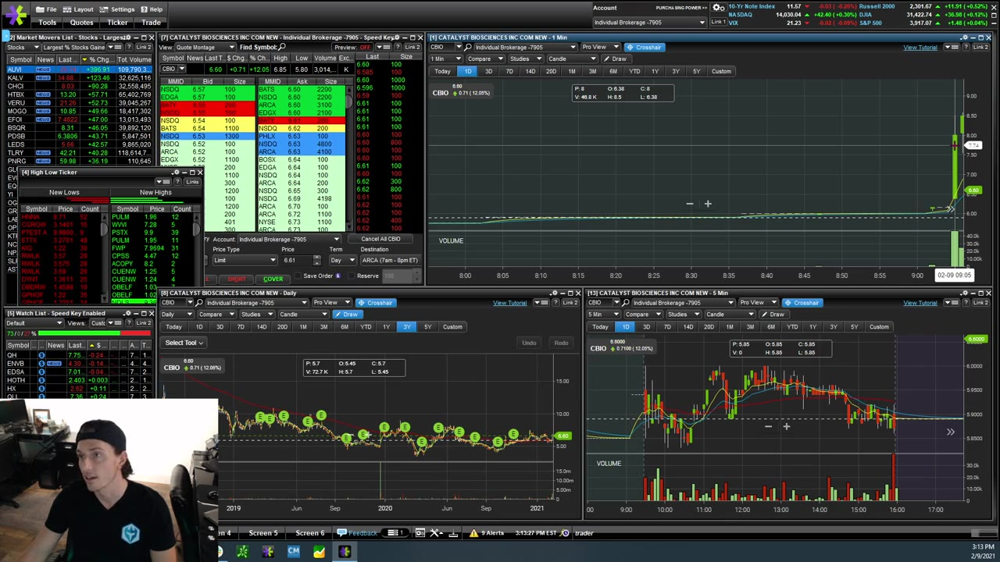

**图怎么看：**

- 在CATALYST BIOSCIENCES INC COM NEW的1分钟图表中，可以看到价格在不断波动，成交量也有所变化。
- 图表上显示了多个价格点，包括开盘价、收盘价和最高价、最低价。
- 成交量柱的高度反映对应周期内的总成交量；红绿着色通常跟随价格柱的涨跌规则，不能直接拆成两种方向的主动成交。
- 均线（MA）显示了价格的趋势方向，当前均线呈上升趋势，表明价格可能继续上涨。

### 关键内容

- 预盘和盘后交易风险大，需谨慎操作。
- 市场情绪和条件是决定是否参与的关键。
- 新闻驱动的股票波动需要特别注意。
- 低成交量可能导致虚假突破。
- 交易者需保持小仓位以降低风险。
- 盘后交易通常在盘前交易后进行。
- 盘后交易流动性较低，需谨慎。
- 使用技术指标如移动平均线和成交量加权平均价来判断。
- 新投资者应避免参与预盘和盘后交易。
- 交易者需关注市场开放前后的价格走势

### 分析与执行顺序

1. 讲师首先介绍了预盘和盘后交易的基本概念。
2. 然后讲解了如何识别潜在的交易机会。
3. 接着通过具体案例展示了如何应用技术指标。
4. 最后强调了交易者需保持谨慎和小仓位。
5. 讲师还提醒了新投资者应避免参与此类交易。
6. 整个过程包括了理论讲解和实际案例分析

### 案例与细节

- AUVI在预盘中出现大幅上涨，但随后回落，显示了低成交量下的虚假突破。
- CBIO在盘后出现大幅上涨，但在盘中未能维持，显示出流动性不足的问题。
- 讲师通过图表展示了如何识别有效的交易机会，如新闻驱动的股票和适当的成交量。
- 讲师强调了使用技术指标的重要性，如移动平均线和成交量加权平均价。
- 通过具体案例，讲师展示了如何在预盘和盘后交易中应用这些技术指标

### 风险与边界

- 预盘和盘后交易风险较高，可能导致大幅亏损。
- 新投资者缺乏经验，容易陷入错误的交易决策。
- 流动性不足可能导致交易困难和价格波动。
- 录制于2021年，部分规则和条件可能已发生变化。
- 交易者需密切关注市场动态，避免盲目跟风
- 交易者需了解市场规则，避免违规操作

### 复盘问题

- 如何识别预盘和盘后交易中的有效交易机会？
- 在预盘和盘后交易中，哪些技术指标最为重要？
- 新投资者应如何避免参与此类高风险交易？

---

## v0508：围绕支撑位交易

> 日期：2021　·　时长：00:40:18

**本场重点：** 围绕支撑位交易是一种慢速定义明确的交易方式，适用于无法参与开盘或不喜欢开盘波动的投资者。

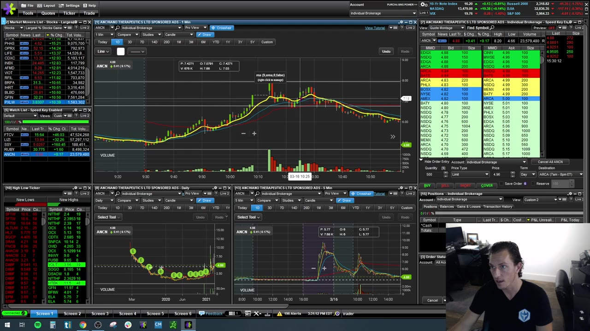

**图怎么看：**

- 在1分钟图表上，可以看到ANCN的价格走势，显示了支撑位和阻力位。
- 图表中的水平线表示支撑位和阻力位，帮助识别潜在的买卖机会。
- 成交量柱的高度反映对应周期内的总成交量；红绿着色通常跟随价格柱的涨跌规则，不能直接拆成两种方向的主动成交。
- 通过分析这些图表元素，投资者可以更好地理解股票价格的行为并做出决策。

### 关键内容

- 围绕支撑位交易主要基于一分钟、五分钟和日线图的技术分析。
- 支撑位和阻力位的确认需要成交量和新闻催化剂的支持。
- 支撑位和阻力位的突破需要确认，通常伴随着蜡烛图的形态。
- 交易者需要识别关键的支撑位和阻力位，以便进行买卖。
- 交易者需要根据支撑位和阻力位来制定交易计划。
- 支撑位和阻力位的突破需要成交量的确认，因为大量的成交量表明有实际买家介入。

### 分析与执行顺序

1. 首先，选择具有新闻催化剂和高成交量的股票。
2. 然后，在日线图和更短的时间框架上识别支撑位和阻力位。
3. 接着，确认支撑位和阻力位的突破需要蜡烛图的形态。
4. 最后，根据支撑位和阻力位制定交易计划。
5. 交易者需要在突破支撑位和阻力位后确认突破，通常伴随着蜡烛图的形态。

### 案例与细节

- FTCV：该股票在开盘后出现大幅上涨，随后回落到预市场水平，显示出支撑位的重要性。
- SSY：该股票在开盘后出现大幅上涨，随后回落到预市场水平，显示出支撑位的重要性。
- ANCN：该股票在开盘后出现大幅上涨，随后回落到预市场水平，显示出支撑位的重要性。
- RUBY：该股票在开盘后出现大幅上涨，随后回落到预市场水平，显示出支撑位的重要性。

### 风险与边界

- 支撑位和阻力位的突破需要确认，否则可能会导致交易失败。
- 交易者需要根据支撑位和阻力位制定交易计划，否则可能会导致交易失败。
- 录制年代限制，此方法可能不适用于当前市场环境。

### 复盘问题

- 如何识别支撑位和阻力位？
- 如何确认支撑位和阻力位的突破？
- 如何根据支撑位和阻力位制定交易计划？

---

## v0509：五分钟图表交易策略

> 日期：2021　·　时长：00:41:37

**本场重点：** 通过五分钟图表识别趋势，结合一分钟图表确认突破，适用于高波动股票。

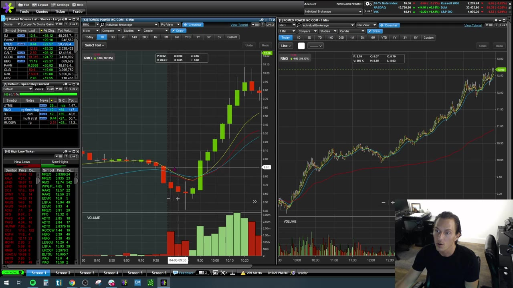

**图怎么看：**

- 在一分钟图表上，RMO股票的价格走势呈现出明显的上升趋势。
- 红色线条代表了移动平均线，表明当前价格高于移动平均线，可能预示着继续上涨。
- 成交量柱的高度反映对应周期内的总成交量；红绿着色通常跟随价格柱的涨跌规则，不能直接拆成两种方向的主动成交。
- 成交量柱状图显示了不同时间段内的买卖活动，有助于判断市场的活跃程度。

### 关键内容

- 五分钟图表有助于识别趋势，尤其是高波动股票。
- 结合一分钟图表确认突破，提高交易准确性。
- 识别五分图和一分钟图的多重策略组合，增强交易信号。
- 关注支撑和阻力水平，形成楔形形态。
- 利用成交量确认突破，增加交易信心。
- 设置合理的止损点，控制风险。
- 在突破后进行小幅度卖出，以锁定利润。
- 识别并等待最佳交易时机，避免盲目入市。
- 保持冷静，即使错过某些交易机会也继续寻找新的机会

### 分析与执行顺序

1. 打开五分钟和一分钟图表，对比两者走势。
2. 识别五分钟图表中的趋势，特别是高波动股票。
3. 结合一分钟图表确认突破，确保信号的有效性。
4. 关注支撑和阻力水平，形成楔形形态。
5. 利用成交量确认突破，增加交易信心。
6. 设置合理的止损点，控制风险。
7. 在突破后进行小幅度卖出，以锁定利润

### 案例与细节

- EYES股票，五分钟图表显示旗形形态，一分钟图表确认突破。
- RMO股票，五分钟图表显示红绿反转，一分钟图表确认突破。
- WIC股票，五分钟图表显示楔形形态，一分钟图表确认突破。
- SJK股票，五分钟图表显示绿色到红色再到绿色的反转形态，一分钟图表确认突破。
- GIGI股票，五分钟图表显示底部形态，一分钟图表确认突破

### 风险与边界

- 策略依赖于市场情绪和流动性，可能在低波动时期失效。
- 过度依赖图表形态可能导致误判，需结合其他技术指标。
- 策略仅适用于高波动股票，不适合稳定波动的股票。
- 录制于2021年，市场环境和监管规则可能已发生变化。
- 策略依赖于正确的图表解读，错误解读可能导致亏损

### 复盘问题

- 如何识别五分钟图表中的趋势？
- 一分钟图表如何确认突破？
- 如何设置合理的止损点？
- 如何在突破后进行小幅度卖出？

---

## v0510：最惨的一天：65k亏损

> 日期：2021　·　时长：00:59:08

**本场重点：** 问题在于情绪化决策导致大额亏损，结论是需要控制情绪进行理性交易，边界是当前市场状况不佳。

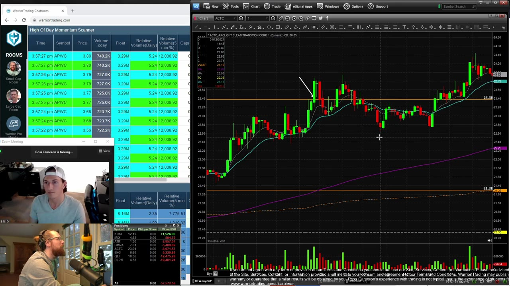

**图怎么看：**

- 在B选项中，可以看到一个实时的股票交易图表，显示了多个股票的价格、成交量和其他相关指标。
- 成交量柱的高度反映对应周期内的总成交量；红绿着色通常跟随价格柱的涨跌规则，不能直接拆成两种方向的主动成交。
- 此外，图表还显示了均线（MA）和移动平均线（MMA），帮助投资者识别趋势。
- 这些图表对于理解市场动态和做出投资决策至关重要。

### 关键内容

- 讲师当天亏损65k，主要原因是情绪化决策。
- 当天交易中多次追涨杀跌，导致亏损加剧。
- 市场表现冷淡，交易机会较少。
- 交易策略本身没有问题，但执行过程中情绪影响较大。
- 需要通过限制交易规模来控制情绪，避免连续亏损。
- 市场冷淡期，交易规模越大，损失越严重。
- 交易心态不稳定，容易受到市场波动影响。
- 需要通过冷静分析来制定交易计划，避免情绪化决策。
- 市场冷淡期，交易机会较少，需要耐心等待更好的时机
- 观察到当天交易中多次追涨杀跌，导致亏损加剧，说明情绪化决策直接影响交易结果。
- 在ACTC交易中，初始盈利后继续追涨，最终导致大幅亏损，表明情绪驱动下的决策失误。
- 浮躁心态下频繁交易，导致资金分散，无法集中力量抓住关键机会，影响整体收益。
- 情绪波动导致交易决策反复无常，难以形成稳定的交易体系，影响长期盈利能力。
- 市场冷淡期，情绪化交易更容易放大亏损，而理性交易则能有效控制风险，保持稳定收益

### 分析与执行顺序

1. 讲师回顾当天交易，发现多次追涨杀跌，导致亏损加剧。
2. 分析当天交易，发现市场表现冷淡，交易机会较少。
3. 总结当天交易经验，发现情绪化决策是主要原因。
4. 决定采取措施控制情绪，减少交易规模，避免连续亏损。
5. 制定明天的交易计划，设定较小的止损额度和交易规模

### 案例与细节

- ACTC：买入后价格下跌，损失10k。
- CAPR：买入后价格下跌，损失3200k。
- DLPN：买入后价格下跌，损失5k。
- QLI：买入后价格下跌，损失17k。
- ACTC：再次买入后价格下跌，损失5k。
- 在ACTC交易中，初始盈利后继续追涨，最终导致10k的亏损，说明情绪化决策导致更大损失。
- 在DLPN交易中，买入后价格下跌，损失5k，显示市场冷淡期情绪化交易容易放大亏损。
- 在QLI交易中，买入后价格下跌，损失17k，进一步证明情绪化决策在冷淡市场中的负面影响。
- 在CAPR交易中，买入后价格下跌，损失3200k，说明情绪化决策导致重大损失。
- 在ACTC交易中，再次买入后价格下跌，损失5k，显示情绪化决策反复无常，难以形成稳定交易体系

### 风险与边界

- 当前市场冷淡，交易机会较少，可能导致连续亏损。
- 情绪化决策可能导致更大损失，需要控制情绪。
- 交易规模过大，在冷淡市场中可能导致更大损失。
- 录制于2018-2021年，市场环境可能已发生变化。
- 交易策略本身没有问题，但执行过程中情绪影响较大，需注意
- 当前市场冷淡，交易机会较少，可能导致连续亏损，需警惕市场回暖前的情绪化决策。
- 情绪化决策可能导致更大损失，需控制情绪，避免盲目追涨杀跌，影响长期盈利能力。
- 市场冷淡期，情绪化交易容易放大亏损，需谨慎对待情绪波动，保持理性交易。
- 录制于2018-2021年，市场环境可能已发生变化，需结合当前市场特征调整交易策略

### 复盘问题

- 当天交易中哪些决策导致了最大的亏损？
- 如何通过限制交易规模来控制情绪？
- 明天的交易计划中，如何确保交易心态稳定？

---
