# Intermediate Mentor Sessions：2018

> 38 场，合计 34.7 小时。返回 [Intermediate Mentor Sessions 目录](../README.md)。

## v0511：IBM 和 ACIA 的交易策略

> 日期：2018-04-18　·　时长：00:31:14

**本场重点：** 通过分析图表和价格动作，制定有效的交易策略；注意支撑线和阻力线的变化。

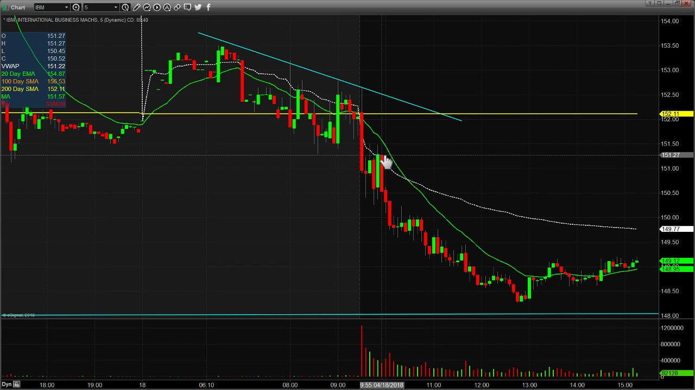

**图怎么看：**

- 这张图表显示了IBM股票的价格走势，包括短期和长期移动平均线。
- 在图表中可以看到支撑线和阻力线的变化，帮助判断市场趋势。
- 成交量柱的高度反映对应周期内的总成交量；红绿着色通常跟随价格柱的涨跌规则，不能直接拆成两种方向的主动成交。
- 通过观察价格和成交量的变化，可以制定有效的交易策略。

### 关键内容

- IBM 在开盘价附近测试了支撑线，显示了支撑线的重要性。
- ACIA 在低点附近形成了有效的交易机会，利用了所有时间低点。
- 使用更快的时间框架（如 15 秒）来捕捉价格动作的细节。
- IBM 的 200 日移动平均线在开盘价附近，显示了关键支撑线的作用。
- ACIA 的价格动作显示了突破支撑线后的反弹。
- 使用 VWAP（成交量加权平均价格）进行交易，确保交易时机准确。
- 注意支撑线和阻力线的多重交汇点，以确定交易机会。
- 利用图表上的关键水平来预测价格走势。
- 在市场波动时保持冷静，避免被市场情绪影响。
- 结合技术分析和市场情绪进行交易决策

### 分析与执行顺序

1. 首先，分析 IBM 的开盘价和支撑线测试情况。
2. 然后，利用更快的时间框架（如 15 秒）来捕捉价格动作的细节。
3. 接着，识别 ACIA 的低点和支撑线测试情况。
4. 再者，使用 VWAP 进行交易，确保交易时机准确。
5. 最后，结合技术分析和市场情绪进行交易决策，保持冷静。
6. 在交易过程中，密切关注支撑线和阻力线的变化。
7. 利用图表上的关键水平来预测价格走势，制定交易计划

### 案例与细节

- IBM 在开盘价附近测试了 152 美元的支撑线，显示了支撑线的重要性。
- ACIA 在 27 美元的低点附近形成了有效的交易机会，利用了所有时间低点。
- 使用 15 秒的时间框架，可以看到价格动作的细节，如 IBM 的价格测试和 VWAP 的拒绝。
- IBM 的 200 日移动平均线在开盘价附近，显示了关键支撑线的作用。
- ACIA 的价格动作显示了突破支撑线后的反弹，利用了所有时间低点。
- 使用 VWAP 进行交易，确保交易时机准确，如 IBM 的价格测试和 VWAP 的拒绝

### 风险与边界

- 市场波动时，可能会出现意外的价格动作，需要及时调整交易策略。
- 使用更快的时间框架可能会增加交易成本，需要谨慎操作。
- 市场情绪可能会影响交易决策，需要保持冷静。
- 技术分析方法的有效性取决于市场环境的变化，需要持续学习和适应。
- 录制年代限制为 2018 年，当前市场环境可能已发生变化

### 复盘问题

- 在交易过程中，如何识别支撑线和阻力线的变化？
- 使用更快的时间框架（如 15 秒）有哪些优势和风险？
- 如何结合技术分析和市场情绪进行交易决策？

---

## v0512：如何确定退出交易时机

> 日期：2018-05-02　·　时长：00:30:28

**本场重点：** 确定退出时机是交易的关键，不同策略和心理特质要求不同的退出标准。

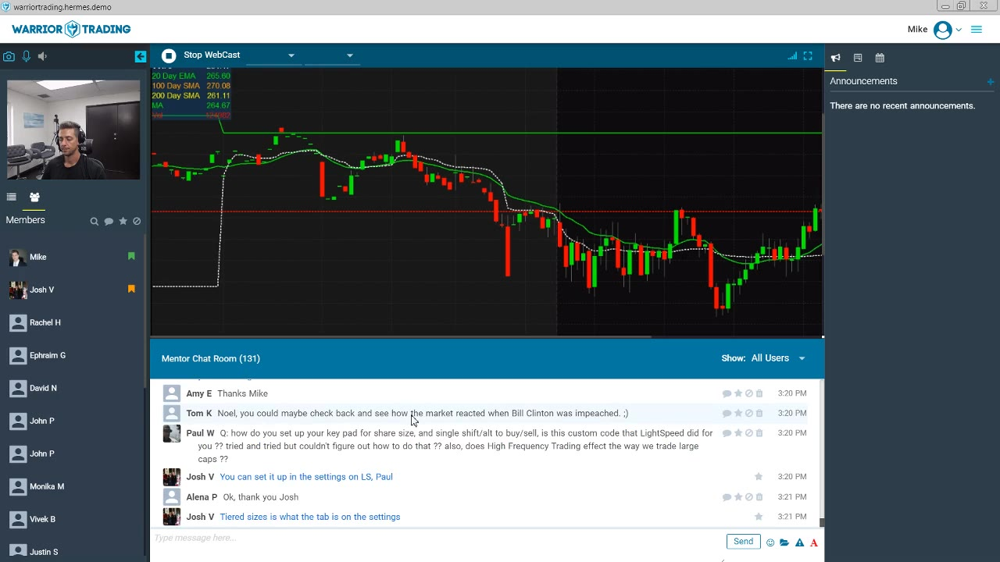

**图怎么看：**

- 在图中，我们可以看到一个股票价格走势图，包括短期、中期和长期移动平均线（MA），以及成交量柱状图。
- 图中的绿色和红色柱状图代表了股票的价格变动情况，其中绿色表示价格上涨，红色表示价格下跌。
- 图中的黄色和蓝色线条分别代表了短期和长期移动平均线，它们可以帮助投资者判断当前市场的趋势。
- 成交量柱状图显示了市场上的买卖活动，成交量越大，表明市场越活跃。

### 关键内容

- 交易策略的不同决定了退出时机的差异，如小盘股和大盘股策略。
- 心理因素影响交易决策，多次失败会影响后续表现。
- 设定每日亏损上限或交易次数阈值有助于控制风险。
- 市场趋势和技术指标是判断是否继续持有仓位的重要依据。
- 不同交易者需要根据自身情况制定退出计划。
- 保持耐心，等待合适时机再退出是关键。
- 了解自己的交易风格和心理承受能力有助于制定退出策略。
- 及时止损可以避免更大的损失，但需谨慎设置止损点。
- 市场波动和情绪管理对交易决策至关重要。

### 分析与执行顺序

1. 讲师首先介绍了不同交易策略的特点，如小盘股和大盘股。
2. 然后讲解了心理因素如何影响交易决策，多次失败会带来心理压力。
3. 接着讨论了如何设定每日亏损上限或交易次数阈值来控制风险。
4. 最后强调了市场趋势和技术指标的重要性，以及如何利用它们来判断是否继续持有仓位。
5. 通过实例展示了如何根据市场情况调整交易策略和退出计划。

### 案例与细节

- 在苹果股票上，讲师表示即使亏损较大，仍坚持持有仓位，因为有迹象表明市场可能进一步下跌。
- 使用LightSpeed交易平台，讲师演示了如何快速输入买卖数量。
- 讲师提到如果市场信号显示反弹，应立即退出当前仓位。
- 在E-mini期货市场上，讲师指出市场正在形成下降趋势，因此建议减少仓位。
- 讲师分享了如何根据市场情绪和技术指标调整交易策略的例子。

### 风险与边界

- 市场环境变化可能导致设定的止损点失效，需灵活调整。
- 过度依赖心理因素可能导致决策失误，需结合技术分析。
- 录制年代限制，某些市场和技术指标可能不再适用当前市场环境。
- 交易策略的有效性取决于市场条件，需持续监控市场变化。

### 复盘问题

- 如何根据自己的交易风格和心理承受能力制定退出计划？
- 在哪些情况下应该考虑立即退出仓位？
- 如何结合市场趋势和技术指标来判断是否继续持有仓位？

---

## v0513：假突破设置

> 日期：2018-05-09　·　时长：00:42:22

**本场重点：** 假突破设置是交易中常见的现象，识别它可以帮助避免错误交易。

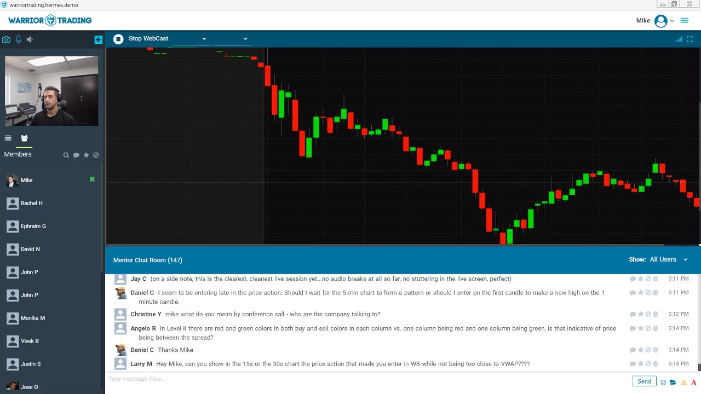

**图怎么看：**

- 在889秒时，可以看到一个明显的假突破设置，这是交易中常见的现象。
- 通过观察蜡烛图和成交量柱，可以识别出价格在假突破后出现的反转信号。
- 在Level 2中，红色和绿色的颜色变化可能指示了买卖力量的变化。
- 时间与销售窗口显示了市场的即时流动性和价格行为。

### 关键内容

- 假突破发生在突破关键支撑或阻力水平后，随后又回到原水平。
- 假突破通常出现在重要的支撑或阻力水平附近。
- 假突破后，股票往往会反转并大幅上涨。
- 假突破发生时，应立即退出当前交易。
- 假突破常见于预市行情中，尤其是突破缺口后的回调。
- 假突破后，股票通常会重新测试缺口，确认突破方向。
- 假突破后，股票可能会出现快速反弹，但随后回落。
- 假突破后，股票可能会继续下跌，直到重新测试支撑位。
- 假突破后，股票可能会出现短暂的反弹，但随后再次下跌。
- 假突破后，股票可能会出现长期的下跌趋势。

### 分析与执行顺序

1. 首先，讲解假突破设置的概念。
2. 然后，展示具体的图表例子，包括假突破后的反弹和回落。
3. 接着，解释假突破后的常见走势，包括重新测试缺口和支撑位。
4. 最后，强调假突破后应立即退出当前交易的重要性。
5. 通过具体的案例，进一步解释假突破设置的识别方法。
6. 总结假突破设置的关键点，帮助交易者更好地理解这一现象。

### 案例与细节

- 在TSEM上，假突破发生在突破缺口后，随后又回到原水平，最终股票大幅上涨。
- 在Facebook上，假突破发生在突破缺口后，随后又回到原水平，最终股票大幅上涨。
- 在Walmart上，假突破发生在突破缺口后，随后又回到原水平，最终股票大幅上涨。
- 在VRX上，假突破发生在突破缺口后，随后又回到原水平，最终股票重新测试支撑位。
- 在JD上，假突破发生在突破缺口后，随后又回到原水平，最终股票重新测试支撑位。

### 风险与边界

- 假突破设置可能在交易中带来风险，尤其是在突破缺口后立即进行反向操作。
- 假突破设置可能在市场波动较大时失效，尤其是在高波动性股票上。
- 假突破设置可能在市场情绪不稳定时失效，尤其是在重大新闻事件后。
- 假突破设置的识别需要依赖图表和技术分析，这可能受到市场环境的影响。

### 复盘问题

- 假突破设置是如何发生的？
- 如何识别假突破设置？
- 假突破设置后，股票通常会如何表现？
- 假突破设置后，交易者应该采取什么行动？

---

## v0514：罗伯托的交易策略介绍

> 日期：2018-05-09　·　时长：00:51:30

**本场重点：** 罗伯托分享了他的交易策略，强调了趋势交易的重要性，并展示了如何利用技术指标进行交易。

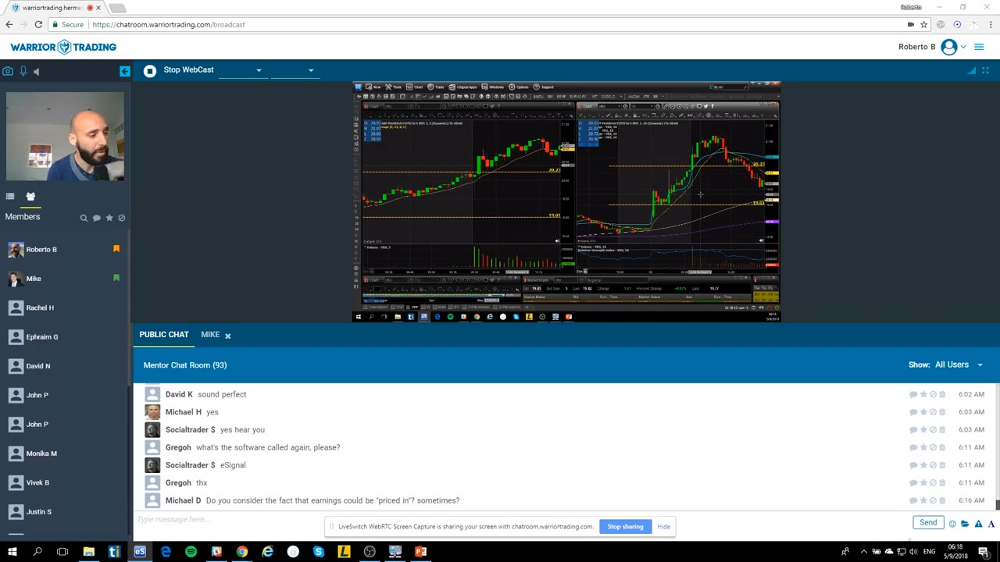

**图怎么看：**

- 整体界面显示直播窗口和聊天室。
- 实际可见的ticker为eSignal，显示价格走势和交易数据。
- 画面信息对应本场主题，罗伯托分享了他的交易策略，强调趋势交易的重要性。
- 这张截图不能单独证明罗伯托的具体交易策略，需要结合其他信息理解。

### 关键内容

- 罗伯托曾是一名汽车工程师，后来转向交易。
- 他从2015年开始学习交易，经历了多个阶段的发展。
- 目前，他专注于趋势交易，寻找趋势的启动和延续。
- 他使用e-signal软件进行图表分析，主要关注每日和10分钟图表。
- 他通过预市场分析来确定股票的潜在空间，寻找支撑和阻力位。
- 他使用13EMA作为支撑和阻力的指示器，帮助判断交易机会。
- 他强调耐心等待，避免在开盘后的前三到五分钟进行交易。
- 他通过调整止损和止盈来管理风险，通常在1.5%的利润目标时开始止盈。
- 他使用LightSpeed交易平台进行交易，包括设置紧急热键。
- 他使用VWAP作为主要指标，因为它被广泛使用且有效。
- 他建议新手尝试所有策略，以找到最适合自己的方法。

### 分析与执行顺序

1. 罗伯托首先介绍了他的背景，从工程师转行到交易员。
2. 他分享了自己从2015年开始学习交易的经历，以及如何逐步发展自己的交易策略。
3. 他详细解释了自己目前的交易策略，主要是趋势交易。
4. 他展示了如何使用e-signal软件进行图表分析，包括每日和10分钟图表。
5. 他强调了预市场的分析，寻找支撑和阻力位，以确定交易机会。
6. 他使用13EMA作为支撑和阻力的指示器，帮助判断交易机会。
7. 他分享了如何通过调整止损和止盈来管理风险，通常在1.5%的利润目标时开始止盈。

### 案例与细节

- 罗伯托在VRX和HDZ上进行了交易，展示了如何利用13EMA作为支撑和阻力的指示器。
- 他在VRX上进行了长仓交易，展示了如何在10分钟图表上寻找支撑和阻力位。
- 他在HDZ上进行了短仓交易，展示了如何在10分钟图表上寻找支撑和阻力位。
- 罗伯托分享了如何通过预市场分析来确定交易机会，例如在VRX和HDZ上的交易。

### 风险与边界

- 罗伯托的交易策略依赖于特定的技术指标和市场环境，这些可能在未来发生变化。
- 他的交易策略需要耐心等待，避免在开盘后的前三到五分钟进行交易，这可能会错过一些快速波动的机会。
- 他的交易策略依赖于特定的市场条件，如股票的流动性和价格范围，这些条件可能会改变。

### 复盘问题

- 罗伯托的交易策略是如何发展的？
- 他使用哪些技术指标来辅助交易决策？
- 他在交易过程中如何管理风险？

---

## v0515：趋势线的应用

> 日期：2018-05-16　·　时长：01:02:19

**本场重点：** 通过趋势线预测股票突破，识别短期交易机会，但需注意市场波动性。

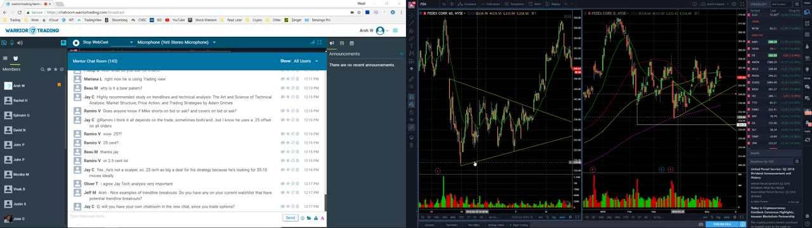

**图怎么看：**

- 画面中，可以看到一个实时的股票交易界面，左侧是聊天室对话框，右侧是多个图表窗口。
- 右侧的图表显示了不同股票的价格走势，包括SPY、FEDEX和SQUARE等，这些图表上标有趋势线。
- 趋势线用于分析股票价格的长期趋势，帮助投资者识别潜在的突破点。
- 通过观察这些图表和趋势线，可以识别出可能的短期交易机会，从而做出决策。

### 关键内容

- 趋势线是技术分析的重要工具，帮助识别突破和回调。
- 通过连接最高点和最低点形成趋势线，预测股票走势。
- MU股票在2月份突破趋势线，从$44涨至$62，显示趋势线的有效性。
- Nike股票在60分钟图表上突破趋势线，从$70上涨，验证趋势线的准确性。
- X股票的熊市旗形突破趋势线，从$36跌至$32，展示趋势线的预测能力。
- HD股票的旗形突破趋势线，从$25涨至$50，说明趋势线的使用价值。
- SQ股票的旗形突破趋势线，从$14涨至$50，体现趋势线的交易机会。
- 使用趋势线进行短期交易，需关注市场波动性和技术分析的局限性。
- 趋势线突破后，股价可能继续上涨或下跌，需谨慎操作。
- 长期来看，趋势线的有效性取决于市场环境和股票特性。

### 分析与执行顺序

1. 首先，识别股票的横向整理区间，寻找趋势线的起点。
2. 然后，连接最高点和最低点形成趋势线，预测股票的未来走势。
3. 接着，当股票突破趋势线时，确认突破的有效性。
4. 最后，根据突破方向制定交易策略，设置止损和止盈点。
5. 在整个过程中，持续监控市场动态，调整交易策略。
6. 利用不同时间框架（如日线、60分钟）进行综合分析。
7. 结合其他技术指标（如移动平均线）辅助判断趋势线的有效性。

### 案例与细节

- MU股票在2月份突破趋势线，从$44涨至$62，显示趋势线的有效性。
- Nike股票在60分钟图表上突破趋势线，从$70上涨，验证趋势线的准确性。
- X股票的熊市旗形突破趋势线，从$36跌至$32，展示趋势线的预测能力。
- HD股票的旗形突破趋势线，从$25涨至$50，说明趋势线的使用价值。
- SQ股票的旗形突破趋势线，从$14涨至$50，体现趋势线的交易机会。

### 风险与边界

- 趋势线突破后，股价可能继续上涨或下跌，需谨慎操作。
- 长期来看，趋势线的有效性取决于市场环境和股票特性。
- 短期市场波动可能导致趋势线失效，需密切关注市场变化。
- 录制年代限制为2018年至2021年，期间市场环境和交易规则可能发生变化。

### 复盘问题

- 如何识别股票的横向整理区间，寻找趋势线的起点？
- 当股票突破趋势线时，如何确认突破的有效性？
- 在使用趋势线进行交易时，如何设置止损和止盈点？
- 结合哪些技术指标可以辅助判断趋势线的有效性？

---

## v0516：交易中的常见错误与调整

> 日期：2018-05-16　·　时长：00:46:00

**本场重点：** 交易者需要找到自己的交易风格，避免盲目跟风和过度自信。

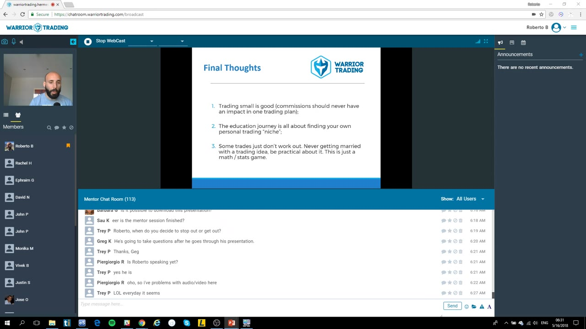

**图怎么看：**

- 交易者需要找到自己的交易风格，避免盲目跟风和过度自信。
- 交易小规模操作是好的（佣金不应该影响一个交易计划）。
- 教育旅程就是找到自己的个人交易‘领域’。
- 有些交易并不成功。永远不要将交易想法与市场挂钩。这只是一个数学/统计游戏。

### 关键内容

- 讲师分享了自己在交易生涯初期的三个主要错误：尝试掌握所有策略、强行交易以及追求完美入场和出场点。
- 讲师指出，每个成功的交易者都有自己的交易系统或专长领域，不应轻易改变。
- 讲师强调，交易者应专注于执行计划，而不是让情绪影响决策。
- 讲师提到，交易者应避免使用过于复杂的交易计划，以免增加错误的可能性。
- 讲师建议，交易者应从小规模开始，逐步提高交易规模，以减少心理压力。
- 讲师指出，交易者应接受亏损是交易的一部分，并从中吸取教训。
- 讲师强调，交易者应专注于交易管理的质量，而非单次交易的盈亏。
- 讲师提醒，交易者不应让佣金影响交易决策，这会影响长期交易结果。

### 分析与执行顺序

1. 讲师首先回顾了自己的交易经历，识别出三个主要错误。
2. 然后，讲师提出了一个四步计划来帮助新手交易者找到适合自己的交易策略。
3. 接着，讲师详细解释了如何构建和执行交易计划，包括设置止损和目标点。
4. 讲师还强调了交易者应保持冷静，避免因情绪波动而做出错误的交易决策。
5. 最后，讲师建议交易者应从小规模交易开始，逐步提高交易规模，以适应市场变化。

### 案例与细节

- 讲师提到了自己曾经试图同时掌握多种交易策略，但最终发现这并不适合自己。
- 讲师描述了一次强行交易的经历，当时他进入了一个他认为有潜力的交易，但最终结果并不理想。
- 讲师分享了自己曾经试图找到完美的入场和出场点，但最终发现这并不现实。
- 讲师提到了自己曾经因为心理压力而频繁交易，但最终发现这反而增加了亏损的风险。
- 讲师举例说明，自己曾经因为佣金问题而犹豫是否进行交易，但最终发现这会影响长期交易结果。

### 风险与边界

- 讲师指出，交易者应避免过度自信，这可能导致忽视潜在风险。
- 讲师提醒，交易者应避免频繁交易，这可能会导致资金流失。
- 讲师强调，交易者应避免使用过于复杂的交易计划，这可能会增加错误的可能性。
- 讲师提醒，交易者应关注交易管理的质量，而不是单次交易的盈亏。
- 讲师指出，交易者应从小规模交易开始，逐步提高交易规模，这可能需要较长时间才能实现。
- 讲师提醒，交易者应避免让佣金影响交易决策，这可能会导致长期亏损。

### 复盘问题

- 你认为自己在交易过程中有哪些常见的错误？
- 你如何确保自己的交易计划能够适应市场变化？
- 你如何处理交易中的情绪波动？
- 你如何评估自己的交易表现，而不只是关注单次交易的盈亏？
- 你如何平衡交易规模和心理压力之间的关系？

---

## v0517：趋势交易策略详解

> 日期：2018-05-23　·　时长：00:54:28

**本场重点：** 趋势交易的核心在于跟随趋势，制定合理的计划和风险管理策略。虽然策略有效，但需要耐心等待合适的入场时机。

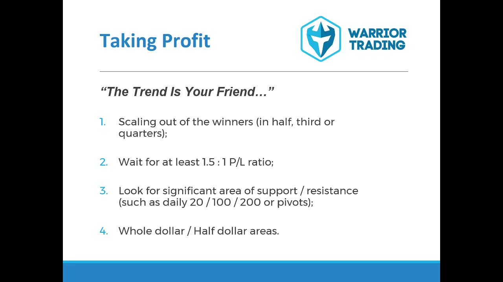

**图怎么看：**

- 趋势交易的核心在于跟随趋势，制定合理的计划和风险管理策略。
- 虽然策略有效，但需要耐心等待合适的入场时机。
- 在图表中，我们可以看到价格在特定区域形成支撑和阻力，这有助于识别潜在的趋势变化点。
- 通过观察价格在这些关键区域的波动，可以更好地把握进场和出场的时机。

### 关键内容

- 趋势交易的核心是跟随趋势，而不是逆势而行。
- 制定合理的计划包括明确的入场点、风险管理以及退出策略。
- 使用技术指标如 13 EMA 和 VU 上来辅助决策。
- 在开盘后的前三分钟内避免入场，以避免市场波动带来的风险。
- 设置止损点通常基于技术原因，而非盈利或亏损。
- 在趋势确认反转前，不要过早平仓。
- 使用 13 EMA 和 VU 上来判断趋势延续和反转。
- 在趋势确认反转后，可以考虑平仓。
- 使用技术指标进行风险管理和利润锁定。
- 策略的有效性依赖于市场环境和特定股票的表现

### 分析与执行顺序

1. 首先，选择合适的股票，通常在开盘前进行。
2. 制定基于每日枢轴点和盘后水平的入场计划。
3. 在开盘后的前三分钟内观察价格走势，避免过早入场。
4. 根据技术指标（如 13 EMA）确定入场点和止损点。
5. 在趋势确认反转后，考虑平仓。
6. 使用技术工具（如 VU 上）监控价格走势。
7. 保持耐心，等待合适的入场时机

### 案例与细节

- ticker：DY；price_action：开盘后出现大缺口，价格在 9680 到 101.91 之间波动。；entry_point：在 99 点位附近观察到支撑，考虑在此处入场。；stop_loss：止损设在 100 点位上方。；target_profit：目标利润设在 97.5 点位，以实现 1.5 的收益比。；risk_reward_ratio：风险回报比为 1:6.5
- ticker：KSS；price_action：开盘后出现大缺口，随后股价下跌。；entry_point：利用 13 EMA 和 VU 上的信号，在 63.5 点位附近观察到突破。；stop_loss：止损设在 61.15 点位。；target_profit：目标利润设在 60.33 点位，实现超过 3 美元的收益。；risk_reward_ratio：风险回报比为 1:6.5
- ticker：LOW；price_action：开盘后股价下跌，形成支撑。；entry_point：在 88.73 点位附近观察到支撑，考虑在此处入场。；stop_loss：止损设在 89.57 点位。；target_profit：目标利润设在 80T 点位附近。；risk_reward_ratio：风险回报比为 1:6.5

### 风险与边界

- 策略的有效性依赖于市场环境和特定股票的表现。
- 在开盘后的前三分钟内避免入场，以避免市场波动带来的风险。
- 止损点通常基于技术原因，而非盈利或亏损。
- 策略的成功依赖于耐心等待合适的入场时机。
- 策略的有效性可能因市场变化而降低

### 复盘问题

- 在开盘后的前三分钟内，如何判断是否应该入场？
- 如何利用 13 EMA 和 VU 上来判断趋势延续和反转？
- 在趋势确认反转后，如何设置止损和目标利润？
- 如何在实际操作中应用这些技术指标进行风险管理和利润锁定？
- 在哪些情况下，这个策略可能会失效？

---

## v0518：大型股和技术股的期权交易策略

> 日期：2018-06-06　·　时长：01:00:27

**本场重点：** 分析大型股和科技股的市场趋势，利用期权进行短期交易，识别技术突破和趋势线。

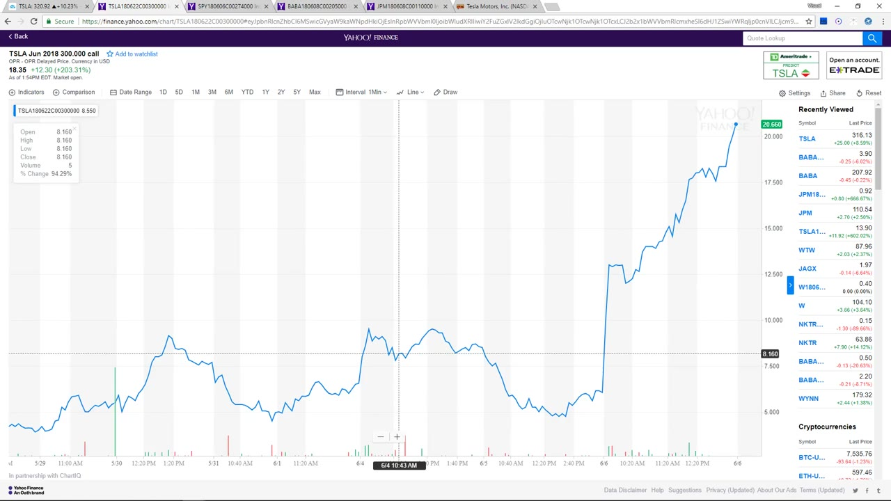

**图怎么看：**

- 特斯拉(TSLA)的期权交易图表显示了其股价在不同时间段内的波动情况。
- 图表上可以看到特斯拉股票的价格走势，包括开盘价、最高价、最低价和收盘价。
- 成交量柱的高度反映对应周期内的总成交量；红绿着色通常跟随价格柱的涨跌规则，不能直接拆成两种方向的主动成交。
- 通过观察图表，可以分析特斯拉股票的技术指标，如支撑位和阻力位，以制定期权交易策略。

### 关键内容

- SPY指数从2月份的大幅修正后，开始回升至接近历史高点，显示市场趋势向好。
- 通过技术分析识别了SPY的牛旗突破模式，预示着可能达到新的历史高点。
- 使用最高点绘制趋势线，帮助识别价格突破的方向和潜在阻力位。
- 特斯拉（Tesla）的熊市情绪和实际价格走势之间的反差，表明市场心理对价格的影响。
- Facebook的V型底部形态，显示了市场信心的恢复和未来上涨的可能性。
- 阿里巴巴（BABA）的牛旗突破，确认了市场的积极趋势。
- 使用期权进行短期交易的优势在于可以以较小的资金获得较大的回报，并且可以控制风险。
- 通过技术分析识别股票的支撑和阻力位，有助于制定交易策略。
- 使用期权进行交易的风险在于市场波动可能导致期权价值大幅下跌，尤其是在不利新闻影响下。
- 通过观察成交量和价格走势，可以更好地理解市场情绪和技术趋势。

### 分析与执行顺序

1. 首先，分析大型股和科技股的整体市场趋势，识别关键指数如SPY和QQQ的走势。
2. 使用技术分析工具，如趋势线和支撑阻力位，来识别市场趋势和潜在交易机会。
3. 通过观察特定股票的技术图表，识别突破模式和趋势线，预测价格走势。
4. 利用期权进行短期交易，选择合适的到期日和行权价，以最小的资金获得最大的回报。
5. 监控市场动态，包括新闻事件和成交量变化，以调整交易策略。

### 案例与细节

- SPY从2月份的大幅修正后，开始回升至接近历史高点，显示市场趋势向好。
- 特斯拉（Tesla）的熊市情绪和实际价格走势之间的反差，表明市场心理对价格的影响。
- Facebook的V型底部形态，显示了市场信心的恢复和未来上涨的可能性。
- 阿里巴巴（BABA）的牛旗突破，确认了市场的积极趋势。
- 通过观察成交量和价格走势，可以更好地理解市场情绪和技术趋势。

### 风险与边界

- 市场波动可能导致期权价值大幅下跌，尤其是在不利新闻影响下。
- 技术分析依赖于历史数据，无法完全预测未来的市场走势。
- 使用期权进行交易的风险在于市场波动可能导致期权价值大幅下跌。
- 录制年代限制为2018年，部分信息可能不再适用当前市场环境。

### 复盘问题

- 如何通过技术分析识别市场趋势和潜在交易机会？
- 在使用期权进行交易时，如何确定合适的到期日和行权价？
- 如何利用市场心理和技术分析相结合来制定交易策略？

---

## v0519：股票选择策略详解

> 日期：2018-06-06　·　时长：01:03:07

**本场重点：** 股票选择是交易成功的关键，但并非所有A+质量的股票都能保证盈利，需要严格筛选标准。

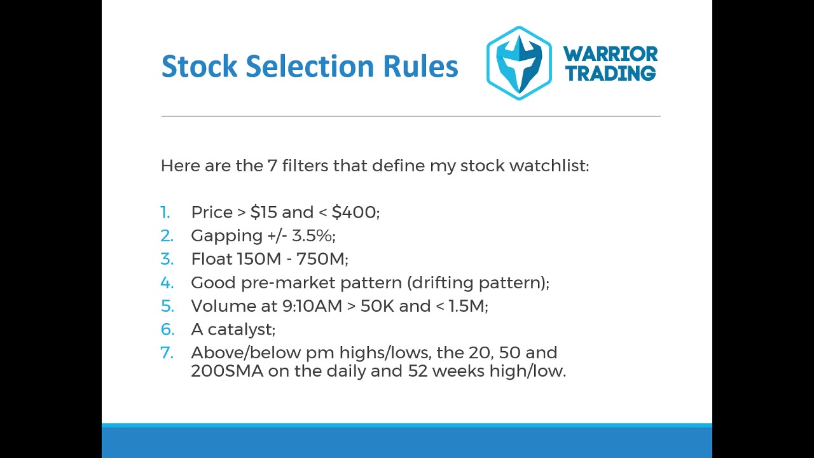

**图怎么看：**

- 股票选择是交易成功的关键，但并非所有A+质量的股票都能保证盈利，需要严格筛选标准。
- 图中展示了7个筛选标准，包括价格范围、缺口、流通股、预市表现等。
- 这些规则帮助投资者识别潜在的投资机会，但市场变化多端，需灵活应对。
- 图中的文字信息无法单独证明任何具体投资决策，需结合其他分析工具综合判断。

### 关键内容

- 讲师强调股票选择的重要性，需结合多种指标进行筛选。
- A+质量的股票不一定每次都能盈利，需谨慎对待。
- 选择标准包括价格、浮动、成交量、催化剂、技术形态等。
- A+质量的股票需满足所有七个标准，而A质量的股票只需满足六个标准。
- 低于四个标准的股票将被排除在观察列表之外。
- 讲师举例说明如何根据这些标准选择股票，如NKTR、FSLR等。
- 讲师强调技术形态的重要性，如漂移模式等。
- 讲师指出，即使A+质量的股票也不一定能保证盈利，需谨慎操作。
- 讲师建议使用简单的过滤器，如Gappers，进行初步筛选。
- 讲师强调不要过度依赖新闻，应关注技术形态和市场表现

### 分析与执行顺序

1. 讲师首先介绍股票选择的重要性，强调准备和机会的结合。
2. 然后列出选择股票的标准，包括价格、浮动、成交量、催化剂、技术形态等。
3. 接着举例说明如何应用这些标准选择股票，如NKTR、FSLR等。
4. 讲师强调技术形态的重要性，如漂移模式等。
5. 最后总结股票选择的原则，强调技术形态和市场表现的重要性。
6. 讲师提醒学员，即使A+质量的股票也不一定能保证盈利，需谨慎操作。

### 案例与细节

- ticker：NKTR；price：15-400；float：300 million；volume：50k；gap：3.5%；catalyst：news；technical：drifting pattern；entry：5930；target：60；stop：5880
- ticker：FSLR；float：104 million；volume：50k；gap：3.5%；catalyst：none；technical：drifting pattern；entry：5930；target：60；stop：5880
- ticker：CCL；float：104 million；volume：50k；gap：3.5%；catalyst：none；technical：no drift pattern；entry：N/A；target：N/A；stop：N/A

### 风险与边界

- 录制于2018年，部分市场规则和条件可能已发生变化。
- A+质量的股票不一定每次都能盈利，需谨慎操作。
- 过度依赖新闻可能导致错误判断，需关注技术形态。
- 市场波动可能导致股票选择标准失效，需灵活调整。
- 交易环境变化可能影响股票选择效果，需持续监控

### 复盘问题

- 请总结选择股票的标准有哪些？
- 如何根据这些标准筛选出合适的股票？
- 举例说明如何应用这些标准选择股票？
- 为什么即使A+质量的股票也不一定能保证盈利？
- 如何避免过度依赖新闻，更关注技术形态？

---

## v0520：大型股技术分析与期权交易

> 日期：2018-06-13　·　时长：01:00:57

**本场重点：** 通过技术分析识别大型股的突破机会，并利用期权进行交易以减少资本需求。

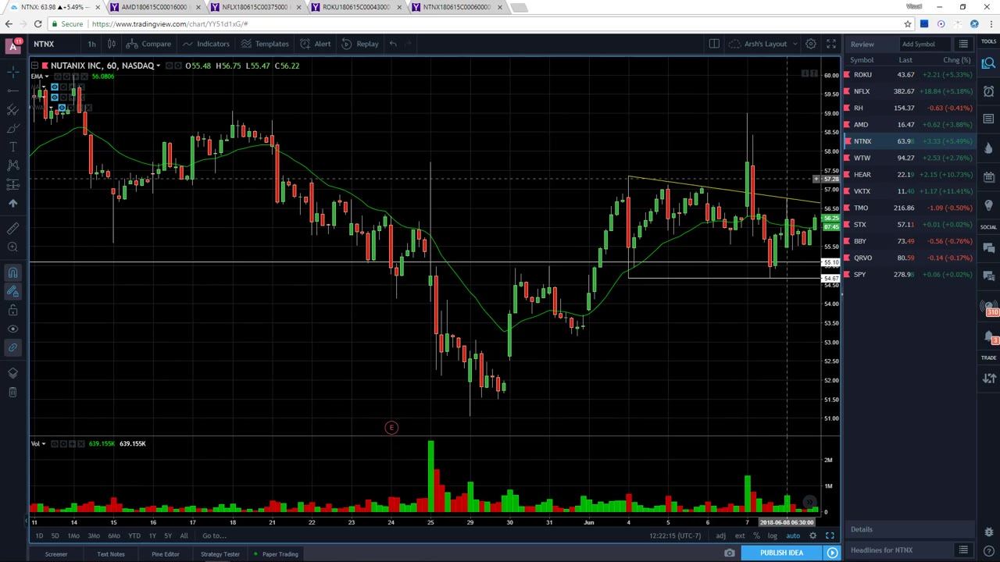

**图怎么看：**

- Nutanix Inc. (NTNX) 在日线图上显示了明显的上升趋势。
- 成交量柱的高度反映对应周期内的总成交量；红绿着色通常跟随价格柱的涨跌规则，不能直接拆成两种方向的主动成交。
- 均线（MA）显示出股票的价格在一段时间内的平均移动趋势。
- 当前股价在均线之上，表明股票可能处于上涨趋势中。

### 关键内容

- 使用技术分析识别大型股的突破机会，如Roku的突破。
- 在突破点附近使用期权进行交易，如Roku的$43看涨期权。
- 利用技术图表（如1小时、5分钟）来确认突破的有效性。
- 在突破后，成交量增加表明市场兴趣增强。
- 使用止损来控制风险，但保持耐心等待突破确认。
- 选择合适的期权行权价格和到期日是关键，但需课程详细讲解。
- 大型股的突破可能需要较长时间才能确认，需耐心等待。

### 分析与执行顺序

1. 首先，识别大型股的突破机会，如Roku的突破。
2. 使用技术图表（如1小时、5分钟）来确认突破的有效性。
3. 在突破点附近使用期权进行交易，如Roku的$43看涨期权。
4. 在突破后，监控成交量以确认市场兴趣。
5. 设置止损来控制风险，但保持耐心等待突破确认。
6. 利用技术图表（如1小时、5分钟）来确认突破的有效性。

### 案例与细节

- Roku的突破发生在1小时图表上的趋势线附近，随后成交量显著增加。
- Netflix的突破伴随着大幅上涨，显示出强劲的市场兴趣。
- RH的突破发生在1分钟图表上的趋势线附近，随后成交量显著增加。
- AMD的突破发生在1小时图表上的趋势线附近，随后成交量显著增加。
- NTNX的突破发生在60分钟图表上的趋势线附近，随后成交量显著增加。

### 风险与边界

- 突破可能需要较长时间才能确认，需耐心等待。
- 市场兴趣可能突然减弱，导致突破失败。
- 选择行权价格和到期日需要谨慎，以最大化收益。
- 市场波动可能导致期权价格大幅波动，需谨慎管理风险。
- 录制于2018年，部分规则和市场环境可能已发生变化。

### 复盘问题

- 如何识别大型股的突破机会？
- 在突破点附近使用期权进行交易有哪些优势？
- 如何利用技术图表确认突破的有效性？

---

## v0521：趋势交易策略详解

> 日期：2018-06-13　·　时长：00:56:06

**本场重点：** 1. 识别过度扩展的股票；2. 使用技术指标进行交易决策；3. 趋势交易策略的应用场景。

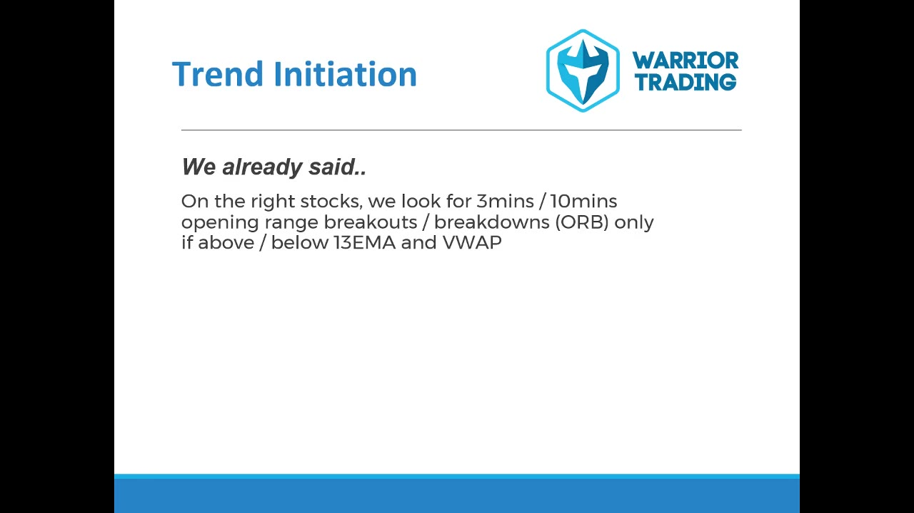

**图怎么看：**

- 在图中，我们可以看到TWTR的10分钟K线图，显示了价格波动和成交量。
- 水平线标记了13EMA和VWAP的位置，帮助识别趋势。
- 成交量柱的高度反映对应周期内的总成交量；红绿着色通常跟随价格柱的涨跌规则，不能直接拆成两种方向的主动成交。
- 相对强弱指数（RSI）用于衡量市场情绪和趋势强度。

### 关键内容

- 讲师使用FIMBiz账户筛选股票，设定特定的过滤条件。
- 过度扩展的定义是股价在短时间内大幅波动，超过技术指标的正常范围。
- 使用13EMA和VWAP作为主要的技术指标来判断股票是否过度扩展。
- 过度扩展的股票通常需要等待回调再进行交易。
- 讲师通过多个股票实例展示了如何应用这一规则。
- 过度扩展的股票风险较高，可能导致亏损。
- 讲师强调了这一规则的重要性，但并非绝对适用。
- 过度扩展的股票通常需要更高的风险回报比才能进行交易。
- 讲师使用Lulu和Twitter的股票实例进一步说明了这一规则的应用

### 分析与执行顺序

1. 登录FIMBiz账户，进入筛选器界面。
2. 设置筛选条件，包括行业、价格区间、成交量等。
3. 使用13EMA和VWAP作为主要的技术指标进行筛选。
4. 识别过度扩展的股票，通常股价在短时间内大幅波动。
5. 等待回调后再进行交易，以降低风险。
6. 通过实际交易案例验证这一规则的有效性

### 案例与细节

- ticker：SRE；description：SRE股票在开盘后迅速上涨，超过13EMA和VWAP，被判定为过度扩展，未进行交易。；price_range：11320+3=11630；technical_indicators：13EMA和VWAP；action：未进行交易
- ticker：Lulu；description：Lulu股票在开盘后形成绿色蜡烛，突破13EMA，但在10分钟后回调，符合交易条件。；price_range：115.55；technical_indicators：13EMA；action：进行交易
- ticker：Twitter；description：Twitter股票在开盘后形成绿色蜡烛，突破13EMA，符合交易条件。；price_range：4304；technical_indicators：13EMA；action：进行交易

### 风险与边界

- 过度扩展的股票风险较高，可能导致亏损。
- 过度扩展的股票需要更高的风险回报比才能进行交易。
- 录制年代限制，此策略可能不适用于当前市场环境。
- 过度扩展的股票可能无法持续上涨，导致交易失败。
- 过度扩展的股票可能受到市场情绪的影响，导致波动加剧

### 复盘问题

- 如何识别过度扩展的股票？
- 过度扩展的股票有哪些常见的特征？
- 如何在实际交易中应用这一规则？

---

## v0522：如何最大化交易利润

> 日期：2018-06-20　·　时长：00:46:07

**本场重点：** 1. 现金是仓位；2. 不要因修正而恐慌；3. 要有侵略性。

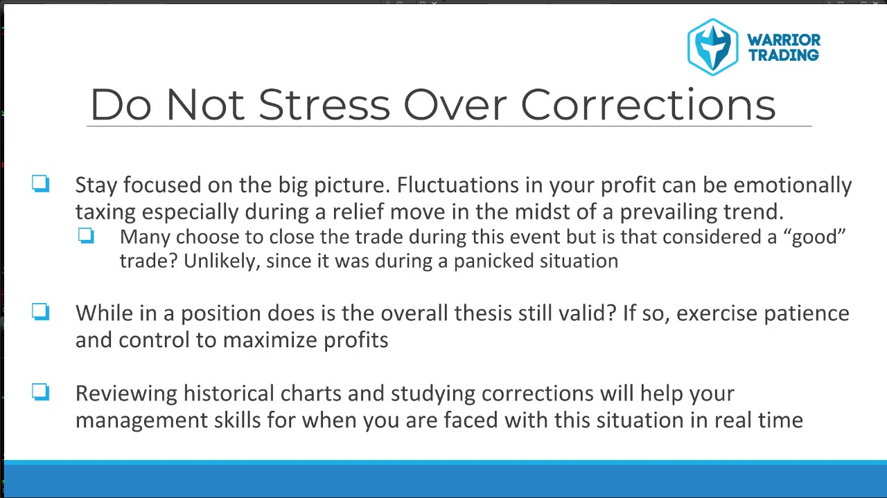

**图怎么看：**

- 幻灯片标题是“Do Not Stress Over Corrections”，提醒在既有趋势中的正常修正阶段仍要关注大局，不要只因浮盈波动就情绪化退出。
- 页面要求重新检查原始交易论点是否仍有效；若结构没有失效，应依计划保持耐心，而不是在恐慌状态下临时决定平仓。
- 课程还建议复看历史图表中的修正形态，让实时遇到类似波动时有可比较的样本，而不是第一次看到回撤才制定管理方式。
- 耐心不等于忽略止损：若预先定义的失效点已经触发，必须执行风险规则；这页不能被用来替亏损仓位无限延长持有时间。

### 关键内容

- 讲师指出现金就是仓位，强调心理上不应感到没有仓位。
- 长时间交易经验表明，耐心等待有利时机比频繁交易更有效。
- 成功交易的关键在于保持计划的一致性和侵略性。
- 通过技术分析识别高价值区域，有助于锁定利润。
- 风险控制是交易成功的重要因素，需严格遵守止损规则。
- 交易策略应根据个人情况定制，不可盲目跟随他人。
- 保持简单明确的交易计划，避免过于复杂的规则。
- 使用简单的评分系统来评估交易机会，提高决策效率。
- 交易过程中保持冷静，避免因恐惧而做出错误决定。
- 交易时应关注高风险高回报的机会，而非频繁交易小收益

### 分析与执行顺序

1. 讲师首先解释现金即是仓位的概念，强调心理上的适应。
2. 接着讲解如何通过耐心等待来捕捉有利的交易机会。
3. 然后介绍如何在交易中保持侵略性，以实现最大化利润。
4. 通过实例说明如何识别高价值的技术区域，并锁定利润。
5. 强调风险控制的重要性，包括严格遵守止损规则。
6. 最后，讲师建议制定简单明确的交易计划，以提高交易效率。
7. 使用评分系统来评估交易机会，确保决策的准确性

### 案例与细节

- 讲师提到苹果股票的例子，说明如何在市场疲软时抓住有利时机。
- 通过技术分析识别关键支撑位，锁定利润。
- 讲师举例说明如何在市场修正时保持冷静，不轻易平仓。
- 使用评分系统评估交易机会，如将交易分为1到5级，根据评分决定是否介入。
- 讲师提到如何在交易中保持侵略性，如在有利时机加仓，而不是频繁交易小收益。
- 通过实例说明如何在市场波动中保持冷静，不因恐惧而做出错误决定

### 风险与边界

- 交易策略的有效性依赖于市场环境的变化，需定期调整。
- 过度依赖技术分析可能导致忽视基本面变化，需综合考虑。
- 交易过程中可能遇到市场流动性不足的问题，需谨慎操作。
- 交易计划的成功依赖于个人的心理素质和纪律性，需持续培养。
- 交易策略的成功需要较长时间的实践和积累，短期内难以见效

### 复盘问题

- 如何在交易中保持冷静，避免因恐惧而做出错误决定？
- 如何通过技术分析识别高价值区域，并锁定利润？
- 如何制定简单明确的交易计划，以提高交易效率？

---

## v0523：过程导向交易策略

> 日期：2018-06-20　·　时长：00:53:08

**本场重点：** 过程导向交易策略是成功的关键，需要明确交易流程，持续改进，避免结果导向思维。

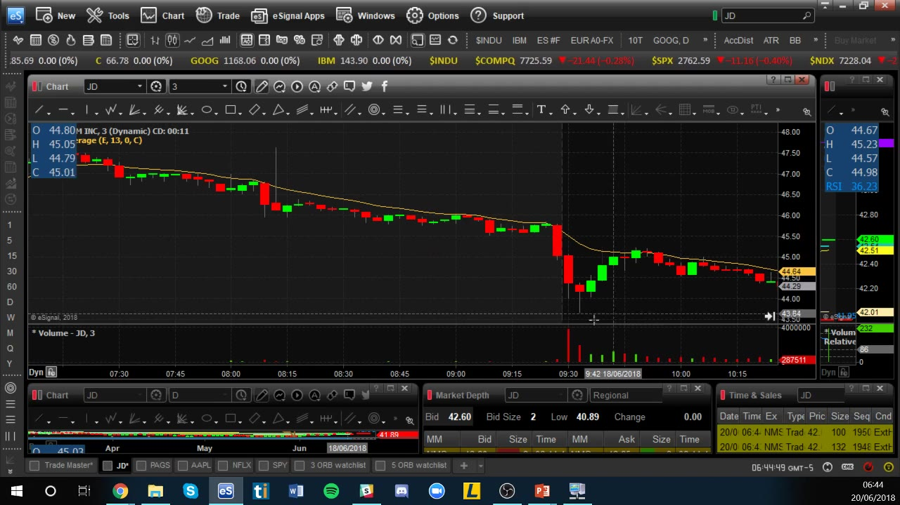

**图怎么看：**

- 这张幻灯片详细比较了过程导向交易策略与结果导向交易策略的区别。
- 过程导向交易策略强调明确交易流程并持续改进。
- 结果导向交易策略则追求快速和容易获得的利润。
- 教育过的交易者更倾向于寻找低风险高回报的交易机会，并注重风险管理。

### 关键内容

- 过程导向交易策略是成功的关键，需要明确交易流程。
- 过程导向交易策略强调持续改进，而不是追求短期利润。
- 新手交易者通常关注快速盈利，而忽视了风险管理。
- 交易计划应包含明确的入场和出场策略。
- 交易过程中最重要的是风险管理，包括止损和止盈。
- 交易者应根据市场情况调整交易计划，避免过度交易。
- 交易者应保持耐心，逐步实现长期目标。
- 新手交易者容易受到其他交易者的意见影响，导致决策失误。
- 交易者应建立自己的交易计划，而不是盲目跟随他人。
- 交易者应根据市场情况灵活调整交易策略，避免固定模式

### 分析与执行顺序

1. 首先，明确交易流程，包括选择股票、设置止损和止盈。
2. 其次，制定详细的交易计划，包括入场和出场策略。
3. 再次，严格执行交易计划，包括在合适时机下单和撤单。
4. 然后，根据市场情况调整交易计划，避免过度交易。
5. 最后，总结交易经验，不断优化交易策略。

### 案例与细节

- 举例说明JD股票的交易过程，包括入场和出场策略。
- 举例说明GOOSE股票的交易过程，包括入场和出场策略。
- 举例说明PUGS股票的交易过程，包括入场和出场策略。
- 举例说明APPLE股票的交易过程，包括入场和出场策略。
- 举例说明GIVOE股票的交易过程，包括入场和出场策略。

### 风险与边界

- 交易者应意识到过程导向交易策略需要时间和经验积累。
- 交易者应避免过度依赖其他交易者的意见，导致决策失误。
- 交易者应认识到市场情况变化可能导致交易计划失效。
- 交易者应了解过程导向交易策略适用于当前市场环境。

### 复盘问题

- 你如何定义自己的交易流程？
- 你在交易过程中是如何管理风险的？
- 你如何根据市场情况调整交易计划？
- 你如何确保自己的交易计划不会导致过度交易？
- 你如何评估自己的交易表现，并进行相应的调整？

---

## v0524：多重时间框架分析

> 日期：2018-07-11　·　时长：01:02:11

**本场重点：** 多重时间框架分析是提高交易成功率的关键，尤其在大型股票市场。通过分析多个时间框架，可以更好地识别趋势和关键支撑阻力位。

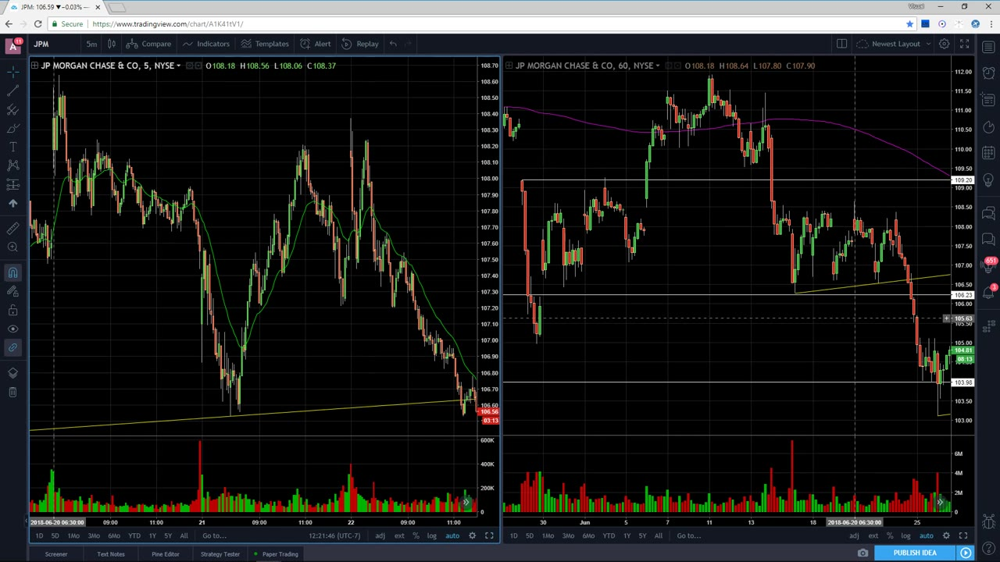

**图怎么看：**

- 这张图表显示了JP Morgan Chase & Co.在纽约证券交易所的股价走势。
- 图表上可以看到价格的波动情况，包括开盘价、最高价、最低价和收盘价。
- 成交量柱状图显示了不同时间段内的买卖活动。
- 图表右侧显示了其他股票的实时数据，如ESI、JPM、ROKU等。

### 关键内容

- 多重时间框架分析有助于识别长期和短期趋势，以及关键支撑和阻力位。
- 每日图表是最重要的时间框架，因为它提供了市场的整体视图。
- 五分钟和一小时图表提供了更多的数据，但可能过于复杂。
- 四小时图表是一个平衡的选择，提供了足够的数据同时不过多负担。
- 在期货市场，四小时图表是最佳选择，因为它提供了完美的数据量。
- 在股票市场，六十分图表和每日图表是最常用的时间框架。
- 使用多个时间框架可以帮助识别更准确的入场点。
- 在进行技术分析时，应避免使用一分钟图表，因为它包含过多噪音。
- 使用Trading View作为主要图表工具，因为它提供了手机应用功能。
- 在大型股票市场进行趋势交易时，应避免使用较低的时间框架

### 分析与执行顺序

1. 首先，打开每日图表和六十分图表，以获取整体市场视图。
2. 然后，根据需要切换到五分钟或一小时图表，以找到精确的入场点。
3. 在分析过程中，注意市场是否出现突然的价格变动。
4. 最后，结合所有时间框架的数据，做出最终的交易决策。
5. 在进行技术分析时，确保使用正确的工具和指标，如EMA和RSI。

### 案例与细节

- JPM在60分钟图表上形成了一个熊市整合模式，但在五分钟图表上没有明显迹象。
- Roku在60分钟图表上形成了一个突破点，但在五分钟图表上显示了过度扩展。
- KSS在周线图上显示出关键的支撑和阻力位，这些位点在过去12年中多次被触及。
- DWT的5分钟和1分钟图表显示了支持，而日线图则显示了阻力。
- 在JPM的例子中，五分钟后价格立即反弹，表明技术模式正在发挥作用。

### 风险与边界

- 使用较低的时间框架可能会导致过度交易和情绪化决策。
- 依赖单一的技术指标可能会忽略市场的重要信号。
- 在大型股票市场进行趋势交易时，较低的时间框架可能导致错误的入场和出场时机。
- 使用一分钟图表可能会导致过度反应和频繁交易，从而增加成本。
- 录制于2018年至2021年，当前市场环境可能已发生变化。

### 复盘问题

- 如何确定使用哪种时间框架来分析特定股票？
- 在哪些情况下，使用较低的时间框架可能是合适的？
- 如何在交易中平衡使用多个时间框架和保持决策的一致性？

---

## v0525：趋势延续策略

> 日期：2018-07-11　·　时长：00:51:38

**本场重点：** 识别趋势并利用其延续性进行交易，适用于特定时间段和股票选择。

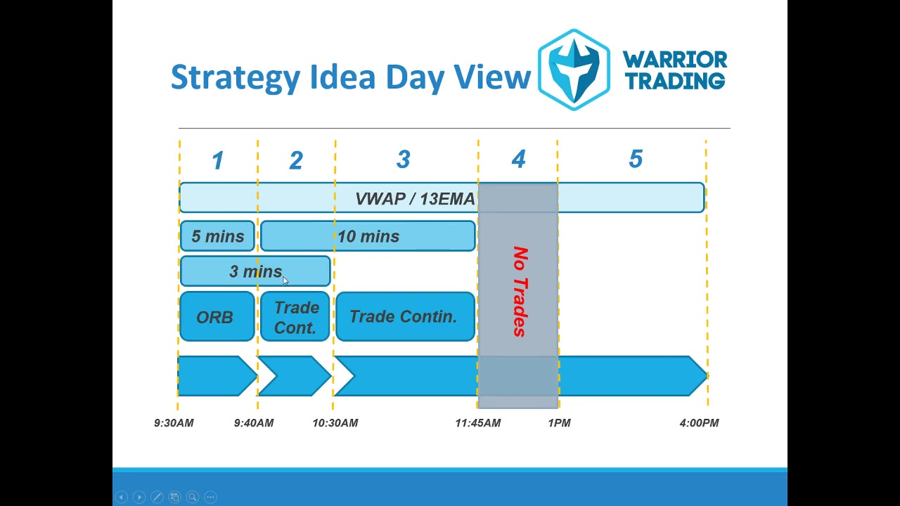

**图怎么看：**

- 图中显示了交易策略的时间段安排，包括开盘后的5分钟、10分钟以及随后的3分钟。
- 在第3分钟，策略要求等待13EMA和VWAP的重新测试。
- 如果价格行动确认突破阻力或支撑，则可以入场。
- 图中还展示了不同时间段内的交易状态，如开盘后没有交易（No Trades）等。

### 关键内容

- 趋势延续策略旨在识别并利用强劲趋势的延续性。
- 交易时段分为五个阶段，每个阶段的重点不同。
- 使用VUAP和13EMA作为主要技术指标，特别是在开盘后的前10分钟。
- 趋势延续策略最适合在财报季期间使用。
- 交易时段分为开盘前、午餐时间、上午交易时段、下午交易时段。
- 使用三分钟和十分钟图表来识别入场点和确认趋势。
- 设置止损和目标利润，以管理风险。
- 在特定股票出现强劲波动时，可以考虑介入。
- 趋势延续策略需要耐心和明确的计划。
- 使用技术指标如VUAP和13EMA来确认趋势的延续性

### 分析与执行顺序

1. 首先，确定交易时段分为五个阶段，每个阶段的重点不同。
2. 使用VUAP和13EMA作为主要技术指标，特别是在开盘后的前10分钟。
3. 在开盘后的前10分钟内，寻找突破或跌破开盘范围的机会。
4. 使用三分钟和十分钟图表来确认趋势的延续性。
5. 设置止损和目标利润，以管理风险。
6. 在特定股票出现强劲波动时，可以考虑介入。
7. 使用技术指标如VUAP和13EMA来确认趋势的延续性

### 案例与细节

- ticker：TWTR；price_action：开盘后出现巨大波动，但未在三分钟内突破或跌破开盘范围。；entry_point：在10:27左右出现回调，确认突破失败，使用前一根三分钟蜡烛的低点作为入场点。；risk_reward：风险为20美分，目标利润为1.5倍，最终达到6倍利润回报。；outcome：成功捕捉到趋势延续，实现盈利
- ticker：TSLA；price_action：开盘后突破三分钟开盘范围，但在10:30前未能确认突破失败。；entry_point：在10:30左右确认突破失败，使用前一根三分钟蜡烛的低点作为入场点。；risk_reward：风险为20美分，目标利润为1.5倍，最终达到6倍利润回报。；outcome：成功捕捉到趋势延续，实现盈利
- ticker：H.TZ；price_action：在10:30后确认突破失败，使用十分钟蜡烛确认入场。；entry_point：在10:50左右确认突破失败，使用前一根十分钟蜡烛的低点作为入场点。；risk_reward：风险为20美分，目标利润为1.5倍，最终达到6倍利润回报。；outcome：成功捕捉到趋势延续，实现盈利

### 风险与边界

- 趋势延续策略在非财报季期间可能效果不佳。
- 在特定股票未出现强劲波动时，可能无法找到合适的入场点。
- 使用技术指标如VUAP和13EMA可能在某些情况下失效。
- 策略依赖于特定的时间框架，可能在不同市场条件下表现不同。
- 策略需要耐心和明确的计划，否则可能导致亏损

### 复盘问题

- 在哪些时间段内使用三分钟和十分钟图表最为有效？
- 如何根据技术指标确认趋势的延续性？
- 在哪些情况下，趋势延续策略可能效果不佳？
- 如何调整风险管理和目标利润设置以适应不同的市场条件？
- 如何在实际交易中应用趋势延续策略？

---

## v0526：小型股交易分析

> 日期：2018-07-18　·　时长：01:03:06

**本场重点：** 通过分析小型股的交易模式，识别关键技术形态，制定合理的止损和目标价。

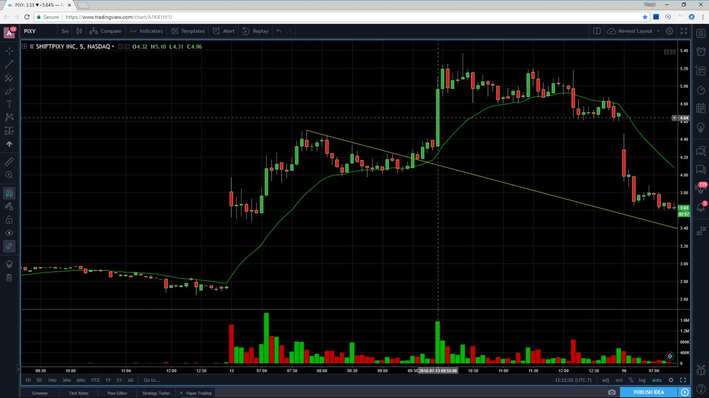

**图怎么看：**

- ShiftPixy Inc. 在2018年的股价呈现出明显的上升趋势。
- 该公司的股价在2018年初开始上涨，并在中期达到一个高点。
- 随后，股价出现了一次回调，但最终仍保持在高位。
- 从图表中可以看出，ShiftPixy Inc. 的股价在2018年期间表现出较强的稳定性。

### 关键内容

- Cali股票在五分钟图表上出现牛旗突破，显示了显著的技术形态。
- MDGS股票出现跳空缺口，表明市场情绪强烈。
- P-IXY股票在五分钟图表上出现牛旗突破，显示了明确的技术形态。
- MTSL股票在一天内涨幅超过100%，显示出强烈的趋势。
- Cali股票的突破伴随着成交量的显著增加，表明市场情绪高涨。
- MTSL股票的突破形态清晰，但并非完美，显示了交易机会。
- 止损和目标价的选择基于技术分析和市场表现。
- 交易策略的成功依赖于耐心和正确的技术分析。
- 小型股市场的波动性较大，需要谨慎操作。
- 交易者应关注市场动态，及时调整交易策略

### 分析与执行顺序

1. 首先，分析Cali股票的五分钟图表，识别牛旗突破形态。
2. 确定Cali股票的突破点和支撑位，设置止损和目标价。
3. 分析MDGS股票的跳空缺口，识别潜在的交易机会。
4. 使用P-IXY股票的五分钟图表，识别牛旗突破形态，设置止损和目标价。
5. 分析MTSL股票的五分钟图表，识别牛旗突破形态，设置止损和目标价。
6. 总结交易策略，强调耐心和正确技术分析的重要性。
7. 提醒交易者注意市场动态，及时调整交易策略

### 案例与细节

- Cali股票在五分钟图表上出现牛旗突破，从2.37美元上涨到3.20美元，随后在高点附近横向整理。
- MDGS股票在开盘后跳空上涨，形成跳空缺口，随后价格在7.57美元附近波动。
- P-IXY股票在五分钟图表上出现牛旗突破，从4美元上涨到4.60美元以上，显示出明显的技术形态。
- MTSL股票在一天内涨幅超过100%，显示出强烈的趋势，五分钟图表上出现牛旗突破。
- Cali股票的突破伴随着成交量的显著增加，从400,000股增加到超过500,000股，显示市场情绪高涨。

### 风险与边界

- 小型股市场的波动性较大，交易者需要谨慎操作。
- 交易策略的成功依赖于正确的技术分析和市场表现。
- 交易者需要关注市场动态，及时调整交易策略。
- 交易者应避免过度依赖单一技术指标，结合多种因素进行分析。

### 复盘问题

- Cali股票的牛旗突破形态是如何形成的？
- 如何根据技术分析确定止损和目标价？
- MDGS股票的跳空缺口是否意味着交易机会？
- P-IXY股票的牛旗突破形态是否清晰？
- MTSL股票的牛旗突破形态是否成功？

---

## v0527：大型股交易分析

> 日期：2018-08-01　·　时长：01:01:32

**本场重点：** 通过分析大型股交易，了解如何识别技术图表中的交易机会，并掌握止损和目标设置的方法。

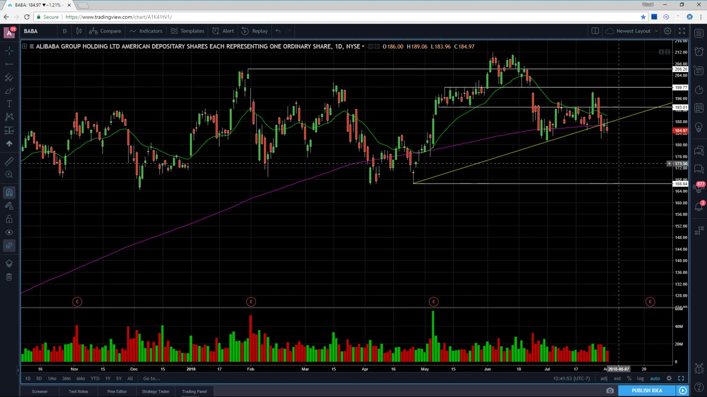

**图怎么看：**

- 图中显示了阿里巴巴集团控股有限公司的股价走势，从2016年7月到2018年7月。
- 可以看到股价在2016年7月至2017年初经历了显著的上涨。
- 随后在2017年中期出现了一次回调，但整体趋势仍然向上。
- 2018年7月，股价再次上涨，显示出强劲的增长势头。

### 关键内容

- SPY股票在五分钟后形成了一个缺口填充的三重底部突破，表明卖家可能在缺口处卖出。
- 使用趋势线来识别突破点，当价格突破趋势线时，可以预期价格会继续上涨。
- Facebook股票的看涨旗形突破模式提供了买入机会，但需要关注市场整体趋势。
- IBB指数的交易失败是因为未能继续预期的价格走势，导致了较大的亏损。
- 使用期权进行日内交易，通常选择到期日较近的期权，以获得更直接的价格变动。
- 在大型股交易中，使用技术分析来识别交易机会，而不是依赖直觉。
- 止损和目标设置基于技术分析，确保风险控制在合理范围内。
- 市场整体趋势会影响单个股票的表现，因此需要考虑市场整体情况。
- 使用期权进行交易可以减少资本需求，同时限制潜在的最大损失。
- 在大型股交易中，保持耐心和纪律，避免过度交易或情绪化决策

### 分析与执行顺序

1. 首先，识别大型股的长期趋势和短期技术形态，如缺口、三重底部突破等。
2. 使用五分钟、六十分钟和日线图来监控价格动向，识别潜在的交易机会。
3. 根据技术形态设定止损和目标价格，确保风险控制在合理范围内。
4. 实时监控市场动态，及时调整交易策略，以适应市场的变化。
5. 在交易过程中，保持冷静和纪律，避免因情绪波动而做出错误的交易决策。

### 案例与细节

- SPY股票在五分钟后形成了一个缺口填充的三重底部突破，表明卖家可能在缺口处卖出。
- Facebook股票的看涨旗形突破模式提供了买入机会，但需要关注市场整体趋势。
- IBB指数的交易失败是因为未能继续预期的价格走势，导致了较大的亏损。
- 使用期权进行日内交易，通常选择到期日较近的期权，以获得更直接的价格变动。
- 在大型股交易中，使用技术分析来识别交易机会，而不是依赖直觉。

### 风险与边界

- 市场整体趋势可能会对单个股票的表现产生重大影响，因此需要考虑市场整体情况。
- 技术分析方法的有效性取决于市场环境和特定股票的特性。
- 使用期权进行交易可以减少资本需求，但需要关注市场波动性和流动性。
- 在大型股交易中，保持耐心和纪律，避免过度交易或情绪化决策。

### 复盘问题

- 在识别交易机会时，哪些技术形态是最有效的？
- 如何根据市场整体趋势调整交易策略？
- 在大型股交易中，如何平衡风险控制和收益最大化？

---

## v0528：如何把握市场时机

> 日期：2018-08-08　·　时长：00:55:48

**本场重点：** 1. 市场时机的重要性在于耐心、勇气和纪律。2. 教育和自我意识是成功的基础。3. 持续性是实现一致性的关键。

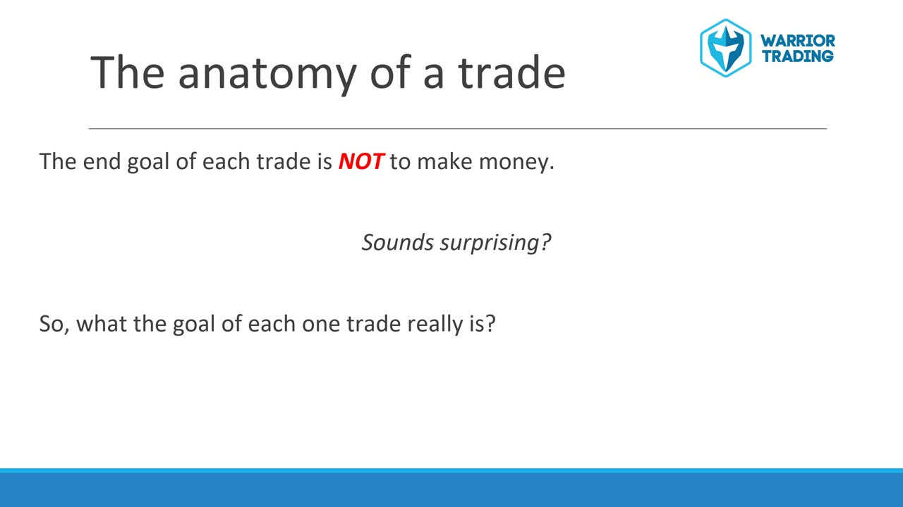

**图怎么看：**

- 幻灯片标题为“The anatomy of a trade”，中央突出一句：每笔交易的最终目标并不是赚钱，并用“Sounds surprising?”引导重新思考。
- 这页刻意留白，把注意力从即时盈亏移到交易结构本身：是否等待了时机、是否按计划执行，以及是否能接受结果的不确定性。
- 它对应本场关于市场时机的结论：教育、自我意识、耐心和纪律先于某一笔结果，持续一致的过程才可能产生可复盘样本。
- “目标不是赚钱”不表示可以忽略盈亏或风险；其边界是单笔结果不可控制，但入场条件、仓位、止损和复盘过程必须可控制。

### 关键内容

- 讲师首先引用了棒球击球手的例子，说明击中本垒打并不总是必要的，关键是时机。
- 平均投资者的回报率低于市场指数，主要原因是市场时机不佳。
- 市场在不同时间段表现不同，如夏季交易通常是最慢的。
- 成功的交易策略需要耐心等待正确的设置，然后果断行动。
- 交易者需要自律，避免追逐市场，确保遵守计划。
- 持续性是实现一致性的关键，不应期望每天都有大盈利。
- 教育和自我意识是成功的基础，特别是处理情绪。
- 交易者应关注趋势延续，而不是立即跟随市场信号。
- 成功的关键在于耐心、勇气和纪律，而不是急于求成。
- 交易者应避免模仿他人，尤其是最成功的交易者

### 分析与执行顺序

1. 讲师首先介绍了市场时机的重要性，强调耐心、勇气和纪律。
2. 接着，讲师通过引用棒球击球手的例子来说明时机的重要性。
3. 然后，讲师解释了市场在不同时间段的表现差异，如夏季交易通常是最慢的。
4. 讲师进一步阐述了成功的交易策略需要耐心等待正确的设置，然后果断行动。
5. 最后，讲师强调了持续性是实现一致性的关键，不应期望每天都有大盈利。
6. 在整个过程中，讲师反复强调了教育和自我意识的重要性，特别是处理情绪。
7. 讲师还提醒交易者避免模仿他人，尤其是最成功的交易者，以保持独立思考

### 案例与细节

- 讲师提到比特币价格在去年12月达到顶峰，许多投资者在泡沫达到顶点时入场。
- 讲师分享了一个交易案例，CS股票在两天前出现趋势延续，但交易者耐心等待正确的设置，最终成功进入并获利。
- 讲师指出，当市场信号到来时，交易者不应立即行动，而应等待正确的时机。
- 讲师提到，如果交易者在市场信号后立即行动，可能会错过最佳时机，导致亏损。
- 讲师分享了一个失败的交易案例，WTV股票，说明了缺乏纪律可能导致快速止损

### 风险与边界

- 录制年代限制，交易环境和市场规则可能已发生变化。
- 情绪管理是交易中的重要风险，需要持续练习。
- 市场时机的选择依赖于特定的市场条件，可能难以复制。
- 交易者需要不断学习和适应新的市场动态，以保持竞争力。
- 交易策略的成功依赖于交易者的自律和耐心，这可能因人而异

### 复盘问题

- 交易者如何在实际操作中应用耐心、勇气和纪律？
- 如何在交易中平衡情绪管理与理性决策？
- 交易者应如何根据市场变化调整自己的交易策略？

---

## v0529：夏季交易挑战

> 日期：2018-08-08　·　时长：00:53:19

**本场重点：** 夏季交易因市场参与者休假导致成交量低，影响交易策略的有效性。

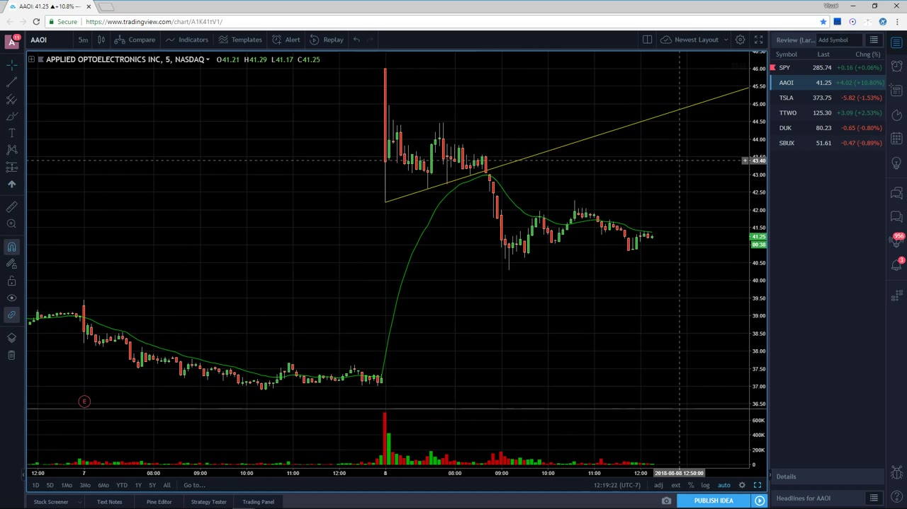

**图怎么看：**

- 这张图片显示了 Applied Optoelectronics Inc. (AAOI) 在 NASDAQ 上的日线图。
- 图中可以看到股票的价格波动情况，包括开盘价、最高价、最低价和收盘价。
- 成交量柱状图显示了不同时间段内的交易活动。
- 成交量柱的高度反映对应周期内的总成交量；红绿着色通常跟随价格柱的涨跌规则，不能直接拆成两种方向的主动成交。

### 关键内容

- 夏季交易期间，市场参与者休假，导致成交量显著下降。
- 成交量低使得技术形态难以有效运作，出现假突破和假反转。
- SPY在2018年7月和8月没有出现单日成交量超过1亿股的情况。
- 夏季交易期，市场更容易上涨，因为没有足够的成交量来推动价格下跌。
- 假突破和假反转主要发生在成交量低的时期，需要特别注意。
- 夏季交易期结束后，市场通常会在9月至10月恢复正常。
- 夏季交易期成交量低，导致价格波动收缩，影响交易策略。
- 夏季交易期，技术形态容易失效，需要谨慎对待。
- 夏季交易期，成交量低导致假突破和假反转频繁发生，需要警惕。
- 夏季交易期，成交量低使得价格波动收缩，影响交易策略的有效性。

### 分析与执行顺序

1. 讲师首先介绍夏季交易的特点，包括市场参与者休假。
2. 然后展示SPY的成交量数据，说明夏季成交量低的现象。
3. 接着解释成交量低如何影响技术形态的有效性。
4. 最后举例说明夏季交易期成交量低对交易策略的影响。
5. 通过案例分析，强调夏季交易期成交量低对交易策略的影响。

### 案例与细节

- SPY在2018年7月和8月没有出现单日成交量超过1亿股的情况。
- 夏季交易期，SPY的价格波动收缩，导致假突破和假反转频繁发生。
- 夏季交易期，成交量低使得价格波动收缩，影响交易策略的有效性。
- 夏季交易期，成交量低导致假突破和假反转频繁发生，需要警惕。

### 风险与边界

- 夏季交易期成交量低可能导致假突破和假反转频繁发生，影响交易决策。
- 夏季交易期结束后，市场通常会在9月至10月恢复正常，但具体时间可能有所不同。
- 夏季交易期成交量低导致价格波动收缩，影响交易策略的有效性，需谨慎对待。

### 复盘问题

- 夏季交易期成交量低，如何识别假突破和假反转？
- 夏季交易期结束后，市场恢复正常的时间是什么时候？
- 夏季交易期成交量低，如何调整交易策略以应对价格波动收缩？

---

## v0530：精准入场策略

> 日期：2018-08-15　·　时长：00:42:33

**本场重点：** 精准入场是交易成功的关键，入场点需在支撑或阻力位附近，使用快速时间框架进行精细分析。

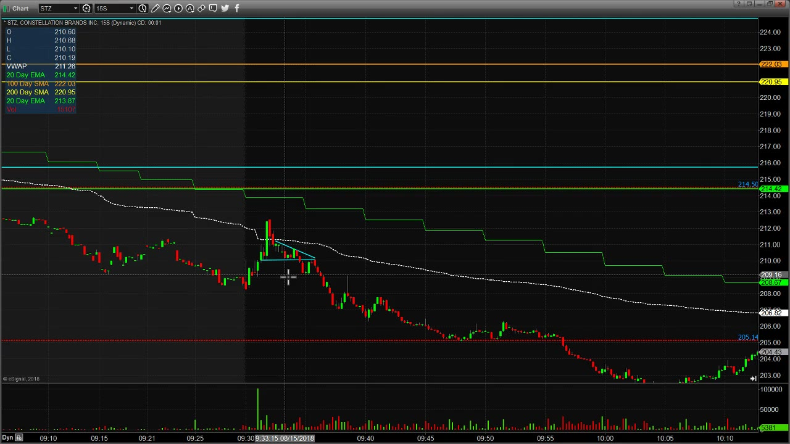

**图怎么看：**

- STZ股票在100日SMA和200日SMA之间波动，显示出潜在的支撑和阻力。
- 成交量显示在股价下跌时增加，可能表明市场对股票的兴趣减弱。
- 20日EMA和100日SMA之间的交叉点可能是一个重要的技术信号。
- 图表显示了股票价格在不同时间框架下的波动情况，有助于理解市场的动态。

### 关键内容

- 交易者应确保在支撑或阻力位附近入场，这是入场的基本原则。
- 使用快速时间框架（如15秒）可以提高交易精度，但需要耐心等待合适的入场时机。
- 支撑或阻力位附近的三角形或楔形形态是有效的入场信号。
- 快速时间框架下的价格动作提供了更精细的交易视角，有助于降低风险。
- 入场时机的选择直接影响交易结果，需要仔细分析。
- 使用VWAP作为支撑或阻力位时，需注意成交量是否合理。
- 快速时间框架下的交易需要耐心等待，避免过早行动。
- 支撑或阻力位附近的三角形突破是有效的入场信号，但需确认突破有效性。
- 快速时间框架下的交易需要关注支撑和阻力位的变化，以确定最佳入场点。
- 快速时间框架下的交易需要结合其他技术指标进行综合判断

### 分析与执行顺序

1. 首先，确认入场点是否接近支撑或阻力位，这是入场的基本前提。
2. 使用快速时间框架（如15秒）观察价格动作，寻找支撑或阻力位附近的三角形或楔形形态。
3. 耐心等待价格动作确认支撑或阻力位突破，避免过早行动。
4. 结合其他技术指标（如VWAP）进一步确认入场点的有效性。
5. 一旦确认支撑或阻力位突破，迅速下单入场，确保及时抓住机会。
6. 入场后，密切关注价格变化，确保止损设置合理，控制风险。
7. 总结每次交易的经验，不断优化入场策略，提高交易成功率

### 案例与细节

- Macy's在开盘时尝试做空，但因市场异常导致未成交。支撑位为20日移动平均线，当股价跌破支撑位后反弹失败，表明做空时机已到。
- CGC在开盘时出现快速反弹，但随后再次测试低点，最终形成三角形突破，确认做空时机。
- STZ在开盘时未能突破支撑位，且VWAP作为支撑位时成交量不足，表明做空时机尚未成熟。
- Y-Y-Y在开盘时出现快速上升，随后回落，形成三角形突破，确认做空时机。
- AAP在开盘时未能突破预市高点，形成三角形突破，确认做多时机。

### 风险与边界

- 快速时间框架下的交易需要耐心等待，过早行动可能导致亏损。
- 支撑或阻力位附近的三角形突破并非总是有效，需谨慎确认。
- 快速时间框架下的交易依赖大量数据，软件故障可能影响交易决策。
- 交易者需熟悉快速时间框架的使用方法，否则容易产生误判。
- 快速时间框架下的交易需要结合其他技术指标，单一指标可能误导决策

### 复盘问题

- 如何确认支撑或阻力位附近的三角形突破是有效的入场信号？
- 在快速时间框架下，如何避免过早行动导致的亏损？
- 如何结合其他技术指标（如VWAP）进一步确认入场点的有效性？

---

## v0531：解读价格行为

> 日期：2018-08-15　·　时长：01:25:31

**本场重点：** 价格行为是交易的关键工具，但需要经验积累，且并非所有情况都适用。

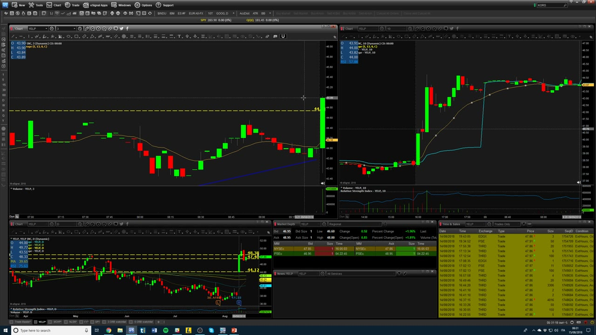

**图怎么看：**

- 在YELP的10分钟周期图表上，可以看到价格在上升趋势中波动，红色和绿色蜡烛表示价格的上涨和下跌。
- 水平支撑和阻力线显示了价格可能的支撑和阻力位，帮助投资者判断买卖机会。
- 成交量柱显示了市场活动的强度，高成交量通常表明市场情绪积极。
- 图表下方的时间与销售窗口提供了实时的市场数据，帮助投资者做出即时决策。

### 关键内容

- 价格行为是交易决策的重要依据，但需要通过经验积累来提高准确性。
- 价格行为不是完美的科学，需要结合技术指标和其他因素进行综合判断。
- 价格行为可以帮助识别关键支撑和阻力水平，但不能替代既定规则。
- 价格行为可以用于预测入场和出场点，但需要谨慎操作。
- 价格行为在选择股票时可以提供早期确认，但需要结合其他因素。
- 价格行为需要结合技术指标和市场情绪进行综合分析。
- 价格行为在交易决策中起重要作用，但需要耐心等待合适的时机。
- 价格行为需要结合市场数据进行验证，尤其是开盘前的数据

### 分析与执行顺序

1. 首先回顾价格行为的重要性，强调经验积累的作用。
2. 然后通过具体的交易案例展示如何应用价格行为进行决策。
3. 接着分析每个案例中的价格行为表现，包括支撑和阻力水平。
4. 最后总结价格行为的应用方法，并指出需要注意的风险。
5. 在整个过程中，强调耐心等待合适时机的重要性，以及结合其他技术指标进行综合判断的方法

### 案例与细节

- ticker：YELP；price_action：开盘前价格行为显示强劲反弹，突破多个重要支撑位。；entry：在三分钟图表上，价格突破并保持在13EMA之上。；exit：价格回调至13EMA下方，确认卖出信号。；profit：最终利润率为1.5至2.5倍
- ticker：MCHP；price_action：开盘前价格行为显示大幅下跌，突破多个重要支撑位。；entry：在三分钟图表上，价格突破并保持在13EMA之下。；exit：价格回调至13EMA上方，确认买入信号。；profit：最终利润率为2至3倍
- ticker：NLSN；price_action：开盘前价格行为显示小幅波动，突破多个重要支撑位。；entry：在三分钟图表上，价格突破并保持在13EMA之上。；exit：价格回调至13EMA下方，确认卖出信号。；profit：最终利润率为1.5至2倍

### 风险与边界

- 价格行为并非万能，需要结合其他技术指标和市场情绪进行综合判断。
- 价格行为可能因市场情绪变化而失效，需要实时监控。
- 价格行为需要结合开盘前数据进行验证，模拟器中缺乏这些数据。
- 价格行为策略可能在不同市场环境下表现不同，需要持续测试和调整

### 复盘问题

- 在哪些情况下，价格行为最有效？
- 如何结合其他技术指标和市场情绪进行综合判断？
- 如何在模拟器中测试价格行为策略？
- 价格行为策略在不同市场环境下表现如何？

---

## v0532：大型股交易策略分享

> 日期：2018-08-22　·　时长：01:02:36

**本场重点：** 分享了大型股交易策略，通过技术图表识别趋势线突破点进行交易，强调耐心等待高概率机会。

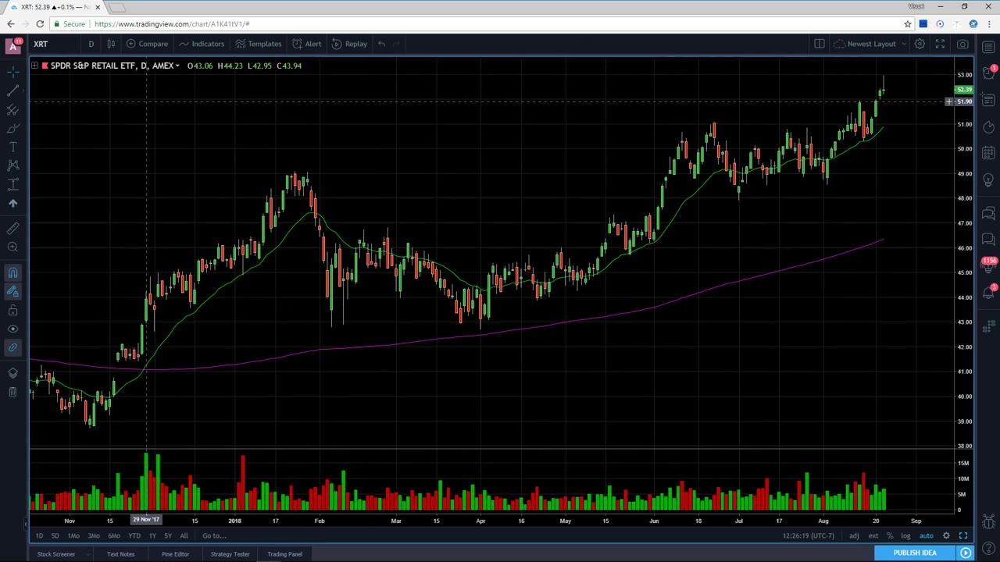

**图怎么看：**

- 这张图表显示了SPDR S&P Retail ETF的价格走势，从2016年到2021年，价格在不断上升。
- 图表上可以看到水平线和趋势线，帮助识别价格的趋势和潜在的突破点。
- 通过观察价格的波动和趋势线的突破，投资者可以判断市场的情绪和可能的交易机会。
- 耐心等待价格突破关键支撑和阻力位，是该策略的核心原则。

### 关键内容

- 通过技术图表识别趋势线突破点进行交易，强调耐心等待高概率机会。
- 使用大型股市场进行交易，因为这些股票活跃度高，期权也活跃。
- 通过缺口下跌识别高概率交易机会，例如SPY的五分钟趋势线突破。
- 使用短期期权进行交易，以捕捉即时突破。
- 在KSS交易中，由于市场环境不佳，未能实现预期突破，导致亏损。
- 在IWM交易中，成功识别趋势线突破并获利。
- 使用短期期权进行交易，以捕捉即时突破，强调风险控制。
- 在XRT交易中，识别趋势线突破并获利，强调技术图表的重要性。

### 分析与执行顺序

1. 识别大型股市场的趋势线突破点作为交易机会。
2. 使用短期期权进行交易，以捕捉即时突破。
3. 在缺口下跌后识别高概率交易机会，例如SPY的五分钟趋势线突破。
4. 通过技术图表识别趋势线突破点进行交易，强调耐心等待高概率机会。
5. 在KSS交易中，由于市场环境不佳，未能实现预期突破，导致亏损。

### 案例与细节

- SPY五分钟趋势线突破，缺口下跌后形成趋势线突破。
- IWM形成趋势线突破，成功识别并获利。
- KSS交易中，由于市场环境不佳，未能实现预期突破，导致亏损。
- XRT形成趋势线突破，成功识别并获利。
- 使用短期期权进行交易，例如AMD的1980买入$20看涨期权，预期突破到$20。

### 风险与边界

- 市场环境不佳可能导致预期突破失败，如KSS交易中。
- 缺口下跌可能带来更大的风险，如KSS交易中。
- 市场环境变化可能导致交易策略失效，如夏季低成交量环境。
- 交易策略依赖于技术图表识别，可能因市场变化而失效。

### 复盘问题

- 在SPY交易中，如何识别趋势线突破点？
- 在KSS交易中，为什么未能实现预期突破？
- 在IWM交易中，如何识别趋势线突破点？
- 在XRT交易中，如何识别趋势线突破点？
- 在交易过程中，如何控制风险？

---

## v0533：技术分析与交易机会

> 日期：2018-08-29　·　时长：00:54:11

**本场重点：** 通过技术分析识别交易机会，强调耐心等待突破的重要性。

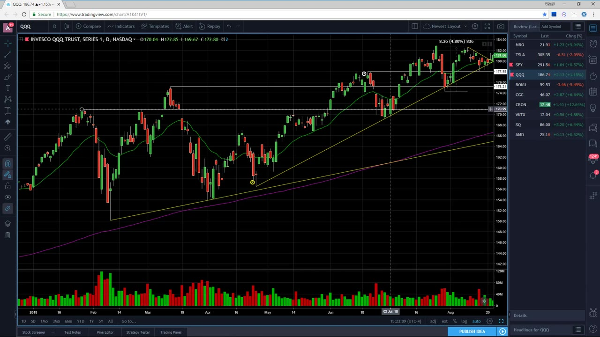

**图怎么看：**

- 这张图表显示了QQQ的每日蜡烛图，可以看到股票价格在上升趋势中波动。
- 紫色的水平线表示支撑位，红色的水平线表示阻力位。
- 成交量柱的高度反映对应周期内的总成交量；红绿着色通常跟随价格柱的涨跌规则，不能直接拆成两种方向的主动成交。
- 图表顶部显示了当前的价格、最高价、最低价和收盘价。

### 关键内容

- 识别了MRO和特斯拉的技术交易机会，利用技术分析进行入场。
- 强调了耐心等待突破的重要性，尤其是在日交易中。
- 使用技术图表识别趋势线突破，预测价格走势。
- 通过技术分析确定止损点，控制风险。
- 利用期权交易实现高风险高回报。
- 关注市场趋势，如SPY和QQQ的突破。
- 使用技术图表进行范围扩展，预测未来价格走势。
- 识别了活跃股票和技术收敛模式，如CGC和TLRY。
- 通过技术分析识别熊市收敛模式，预测价格下跌。
- 利用技术图表识别趋势线突破，预测价格上涨
- 观察到MRO的每日图表形成牛市旗形，突破后确认买点，基于技术分析判断价格将上涨至2150以上。
- 特斯拉的五分钟图表形成熊市收敛，突破后确认卖点，基于技术分析判断价格将下跌至305以下。
- 使用技术图表识别趋势线突破，例如MRO的21美元突破点，预测价格将上涨至27美元，需结合市场环境和资金管理。
- 通过技术图表识别趋势线突破，例如CGC的突破点，预测价格将上涨至12美元，需注意市场波动和资金管理。
- 利用技术图表进行范围扩展，例如MRO的7.85美元范围扩展，预测价格将上涨至27美元，需结合市场环境和资金管理

### 分析与执行顺序

1. 扫描大量股票图表，寻找技术模式，如MRO的牛市旗形。
2. 在关键点设置止损，控制风险。
3. 利用技术图表识别趋势线突破，预测价格走势。
4. 根据技术分析确定入场点，如MRO的21美元。
5. 利用期权交易实现高风险高回报。
6. 关注市场趋势，如SPY和QQQ的突破。
7. 使用技术图表进行范围扩展，预测未来价格走势

### 案例与细节

- MRO形成了一个牛市旗形，突破后实现了500%的收益。
- 特斯拉形成了一个五分钟的熊市收敛，突破后实现了超过300%的收益。
- 通过技术图表识别趋势线突破，预测MRO的价格将上涨至27美元。
- CGC形成了一个巨大的突破，价格从6美元涨至12美元，涨幅100%。
- TLRY在新高突破后，价格从32美元涨至36美元，涨幅15%。
- MRO的牛市旗形在突破后，价格从21美元涨至22美元，涨幅超过5%，利用期权交易实现500%的收益。
- 特斯拉的五分钟图表熊市收敛突破后，价格从30830美元跌至30630美元，跌幅超过2%，利用期权交易实现超过300%的收益。
- CGC的突破点从6美元涨至12美元，涨幅100%，利用期权交易实现巨大收益，需注意市场波动和资金管理。
- TLRY的新高突破后，价格从32美元涨至36美元，涨幅15%，利用期权交易实现稳定收益，需注意市场波动和资金管理。
- SPY和QQQ的突破点，价格从低点上涨至新高，涨幅超过5%，利用期权交易实现稳定收益，需注意市场波动和资金管理

### 风险与边界

- 技术分析并非总是准确，需要结合其他因素进行判断。
- 市场环境变化可能导致交易机会减少。
- 技术图表可能无法准确预测极端市场波动。
- 录制年代限制，某些市场规则和条件已发生变化。
- 市场环境变化可能导致技术图表失效，例如市场突然出现极端波动，无法准确预测价格走势。
- 技术分析并非总是准确，例如MRO的牛市旗形突破后，价格并未持续上涨，需结合其他因素进行判断。
- 录制年代限制，某些市场规则和条件已发生变化，例如交易费用、保证金要求等，需注意适应当前市场环境。
- 心理误区可能导致过度自信，例如认为技术图表总是准确，忽视市场波动和资金管理的重要性

### 复盘问题

- 如何识别技术图表中的趋势线突破？
- 在日交易中，如何确定最佳入场点？
- 如何利用技术图表进行范围扩展以预测未来价格走势？

---

## v0534：如何有效止损

> 日期：2018-08-29　·　时长：01:00:47

**本场重点：** 止损是交易中最重要技能之一，新手应学会在亏损时及时退出，以最小化损失。

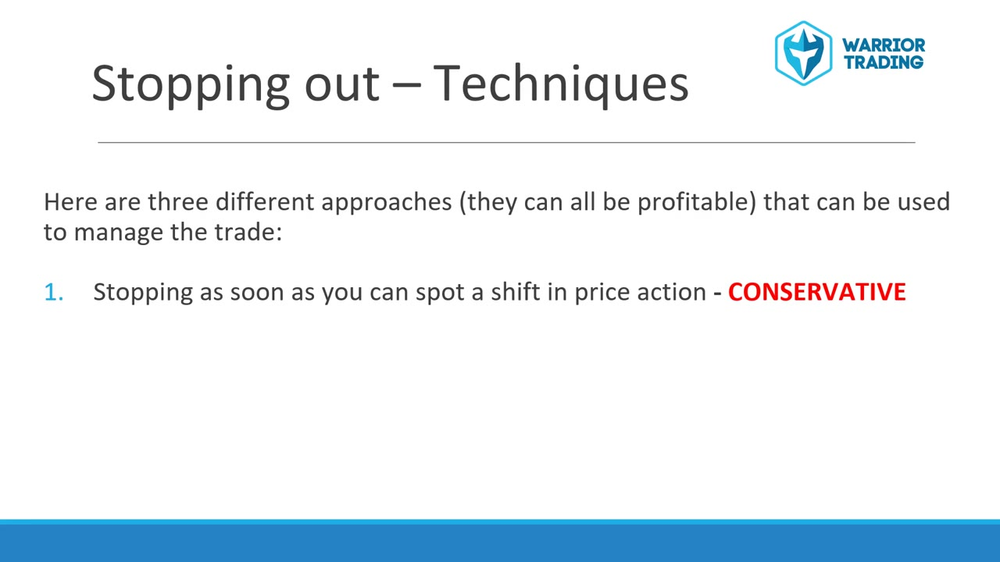

**图怎么看：**

- 图中显示了BBY 10分钟图，价格在75.45附近波动。
- 图中标记了支撑位和阻力位，分别为75.45和76.60。
- 成交量柱的高度反映对应周期内的总成交量；红绿着色通常跟随价格柱的涨跌规则，不能直接拆成两种方向的主动成交。
- 图中的水平线和斜线可能代表技术分析中的趋势线或支撑阻力位

### 关键内容

- 止损是交易中最关键的技能，新手应学会在亏损时及时退出。
- 止损技巧包括保守、平衡和激进三种，分别对应不同的交易策略。
- 新手应设定实际可行的目标，而不是期望立即盈利。
- 止损应基于交易计划，当计划失效时应及时退出。
- 平衡止损技巧适用于大多数交易者，既不过于保守也不过于激进。
- 激进止损技巧适用于对市场有深入理解的交易者。
- 新手应根据自己的交易风格选择合适的止损方法。
- 止损应结合技术指标，如移动平均线，来判断是否退出。
- 新手应学会在交易过程中调整止损点，以保护利润。
- 止损技巧的选择应基于对市场的理解程度和交易经验

### 分析与执行顺序

1. Roberto 首先介绍了止损的重要性，指出新手应设定实际可行的目标。
2. 他解释了三种止损技巧：保守、平衡和激进，并举例说明了它们的应用。
3. 接着，他强调了在交易过程中调整止损点的重要性，以保护利润。
4. Roberto 提醒新手应根据自己的交易风格选择合适的止损方法。
5. 最后，他强调了在交易过程中不断学习和适应市场的重要性。

### 案例与细节

- ticker：BBY；price_action：价格从7545下跌到7515，随后反弹至7595；stop_loss：在7595止损，损失约50美分；strategy：保守止损，价格行动变化时及时退出
- ticker：TIF；price_action：价格从116上涨到126，支撑位在134；stop_loss：在134附近止损，损失约30美分；strategy：平衡止损，等待价格重新测试支撑位
- ticker：BBY；price_action：价格从7545下跌到7515，随后反弹；stop_loss：在7595止损，损失约50美分；strategy：激进止损，价格行动变化时立即退出

### 风险与边界

- 止损技巧的选择应基于对市场的理解程度和交易经验，否则可能导致过度或不足的止损。
- 新手可能难以准确判断何时应该止损，这可能导致资金损失。
- 录制年代限制，止损技巧可能需要根据当前市场情况进行调整。
- 止损技巧的有效性取决于交易者的判断力和市场环境的变化。

### 复盘问题

- 你如何根据自己的交易风格选择合适的止损方法？
- 在交易过程中，你是如何调整止损点以保护利润的？
- 你如何在交易中应用保守、平衡和激进三种止损技巧？

---

## v0535：如何管理交易日

> 日期：2018-09-05　·　时长：01:03:03

**本场重点：** 1. 管理交易日需要准备、执行和回顾三个阶段，每个阶段都至关重要。2. 要保持耐心，接受市场给的机会，不带偏见地执行交易。3. 每天都要进行反思，总结经验教训。

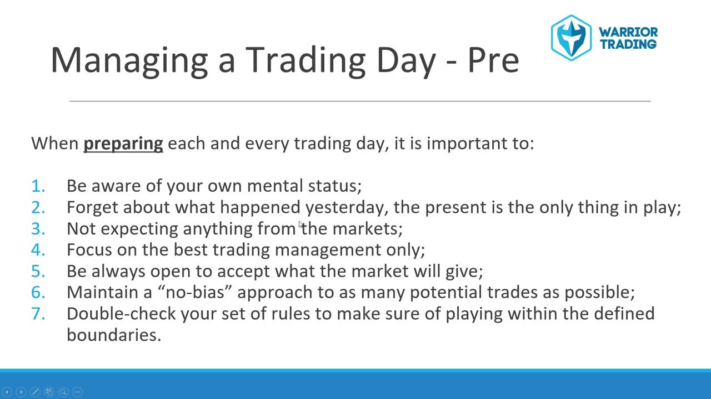

**图怎么看：**

- 在准备每个交易日时，重要的是：1. 注意自己的心理状态；2. 忘记昨天发生的事情，当前才是唯一重要的事情；3. 不期望从市场上得到任何东西；4. 只专注于最佳的交易管理；5. 总是准备好接受市场的给予；6. 保持“无偏见”的态度，尽可能多地考虑潜在的交易机会；7. 仔细检查你的规则集，确保在定义的边界内操作。
- 在回顾每个交易日时，重要的是：1. 根据规则遵守情况衡量自己的结果，而不是盈利和亏损（P&L）。
- 通过这些步骤，可以更好地管理交易日，提高交易效率和成功率。

### 关键内容

- 交易日管理包括准备、执行和回顾三个阶段，每个阶段都至关重要。
- 准备阶段需要早起，保持健康，制定自己的股票清单。
- 执行阶段需要专注，耐心等待机会，及时调整策略。
- 回顾阶段需要测量结果，记录经验，保持心态平衡。
- 交易日管理需要耐心，接受市场给的机会，不带偏见地执行交易。
- 每天都要进行反思，总结经验教训，保持心态平衡。
- 交易日管理需要制定自己的股票清单，执行自己的交易计划，而不是模仿别人。
- 交易日管理需要在每次交易后休息5到10分钟，避免冲动下单。
- 交易日管理需要在同一天内避免超过两次亏损交易。
- 交易日管理需要在每次交易后进行反思，总结经验教训，保持心态平衡。

### 分析与执行顺序

1. 首先，准备阶段需要早起，保持健康，制定自己的股票清单。
2. 其次，执行阶段需要专注，耐心等待机会，及时调整策略。
3. 再次，回顾阶段需要测量结果，记录经验，保持心态平衡。
4. 最后，每天都要进行反思，总结经验教训，保持心态平衡。
5. 在每次交易后，需要休息5到10分钟，避免冲动下单。
6. 在同一天内，避免超过两次亏损交易。
7. 在每次交易后，需要进行反思，总结经验教训，保持心态平衡。

### 案例与细节

- 在交易日开始前，准备自己的股票清单，确保当天的交易计划。
- 在交易过程中，遇到不利情况时，及时调整策略，避免继续亏损。
- 在交易结束后，记录当天的交易结果，总结经验教训，保持心态平衡。
- 在交易日开始前，保持健康的生活习惯，如定期锻炼和健康饮食。

### 风险与边界

- 交易日管理需要在每次交易后休息5到10分钟，避免冲动下单，否则可能导致决策失误。
- 交易日管理需要在同一天内避免超过两次亏损交易，否则可能导致资金链断裂。
- 交易日管理需要在每次交易后进行反思，总结经验教训，保持心态平衡，否则可能导致情绪波动影响决策。
- 交易日管理需要在每次交易后进行反思，总结经验教训，保持心态平衡，否则可能导致决策失误。

### 复盘问题

- 在交易日开始前，你是否制定了自己的股票清单？
- 在交易过程中，你是否能够保持耐心，不带偏见地执行交易？
- 在交易结束后，你是否进行了反思，总结了经验教训？

---

## v0536：TLRY 股票的极端波动及其应对策略

> 日期：2018-09-19　·　时长：00:32:52

**本场重点：** TLRY 股票的极端波动需要谨慎对待，新手交易者应避免参与此类高风险交易。

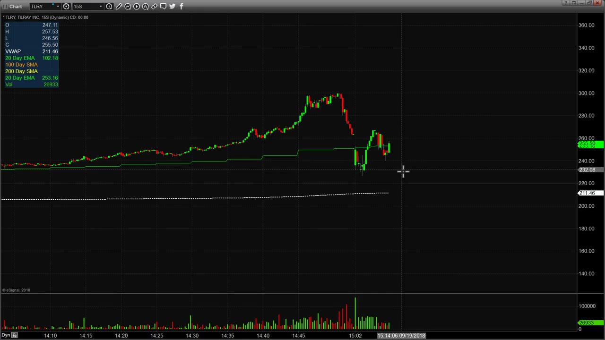

**图怎么看：**

- 这张图显示了 TLRY 股票在特定时间段内的价格波动情况。
- 图中可以看到股票价格在短时间内经历了显著的上涨和下跌。
- 成交量柱的高度反映对应周期内的总成交量；红绿着色通常跟随价格柱的涨跌规则，不能直接拆成两种方向的主动成交。
- 均线（EMA 和 SMA）显示出股票价格的趋势方向，帮助判断市场趋势。

### 关键内容

- TLRY 股票出现极端波动，新手交易者应避免参与。
- 此类股票的波动可能导致账户损失，甚至爆仓。
- 新手交易者应保持谨慎，避免参与高风险交易。
- 交易此类股票需要极高的风险管理能力。
- 新手交易者应等待确认信号再进行交易。
- 交易此类股票需要关注价格行动和成交量变化。
- 新手交易者应避免跟随他人进行高风险交易。
- 交易此类股票需要耐心和纪律。
- 交易此类股票的成功率较低，新手交易者应避免盲目跟风。
- 交易此类股票需要关注市场整体趋势和确认信号

### 分析与执行顺序

1. 观察 TLRY 股票的价格走势，发现其出现极端波动。
2. 记录 TLRY 股票的价格走势，包括价格突破和回调。
3. 分析价格行动和成交量变化，寻找交易信号。
4. 等待市场确认信号，避免盲目跟风。
5. 设置止损和止盈点，控制风险。
6. 总结 TLRY 股票的交易策略，强调耐心和纪律的重要性

### 案例与细节

- TLRY 股票在开盘后大幅下跌，随后被买入，显示出极端波动。
- 交易者注意到价格突破 21650 点位，并迅速回撤，形成关键信号。
- 交易者观察到价格再次测试 21650 点位，但未能突破，形成关键阻力位。
- 交易者注意到成交量在突破关键点位时显著增加，形成重要信号。
- 交易者在价格测试关键支撑位时入场，随后价格反弹，形成盈利机会

### 风险与边界

- 此类股票的波动可能导致账户损失，甚至爆仓。
- 新手交易者应避免参与此类高风险交易。
- 交易此类股票需要极高的风险管理能力。
- 录制年代限制为 2018-2021 年，当前市场情况可能有所不同。
- 交易此类股票的成功率较低，新手交易者应避免盲目跟风。
- 交易此类股票需要关注市场整体趋势和确认信号

### 复盘问题

- TLRY 股票的极端波动是如何形成的？
- 交易此类股票需要哪些关键信号？
- 交易此类股票的风险管理策略是什么？
- 交易此类股票需要关注哪些市场因素？
- 交易此类股票的成功率如何？

---

## v0537：如何交易突发新闻

> 日期：2018-09-19　·　时长：01:07:45

**本场重点：** 突发新闻带来高波动机会，需耐心等待技术形态确认，避免冲动交易。

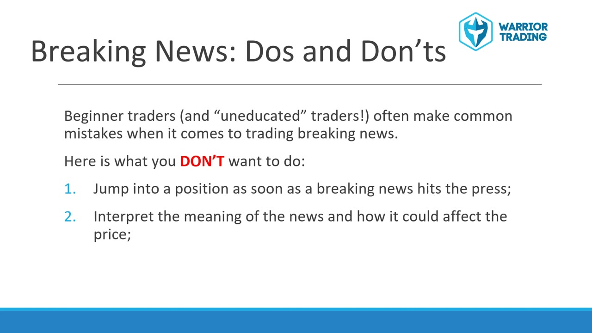

**图怎么看：**

- 幻灯片“Breaking News: Dos and Don’ts”指出，新手在突发新闻交易中容易在报道刚出现时立刻跳进仓位。
- 第二个错误是自行解释新闻含义并预判它一定怎样影响价格；事实、市场预期和价格反应可能并不一致。
- 更稳妥的流程是先确认消息来源和时间，再观察流动性、价差与技术形态是否形成可定义的触发和失效位置，最后按风险预算决定是否参与。
- 这页只有禁止事项，没有提供具体入场条件；“等待”也不能保证交易成功，新闻跳空、停牌和滑点仍可能让止损无法按计划成交。

### 关键内容

- 突发新闻可能导致股价大幅波动，提供交易机会。
- 交易突发新闻需要更多经验，应先观察技术形态而非立即行动。
- 使用3分钟图表分析突发新闻影响，适用于高波动时期。
- 观察相对成交量和价格走势，确认是否值得交易。
- 耐心等待技术形态确认，避免冲动交易。
- 设置止损，控制风险，确保交易计划合理。
- 突发新闻可能迅速反转，需保持警惕。
- 特斯拉案例显示，3分钟图表分析有效，适用于高波动期。
- 突发新闻交易需持续练习，提高纪律性。
- 突发新闻交易需考虑市场流动性，避免过度风险

### 分析与执行顺序

1. 记录突发新闻事件，如特斯拉被SEC调查。
2. 观察股价反应，确认高波动期。
3. 使用3分钟图表分析，寻找突破形态。
4. 确认相对成交量和价格走势，判断是否交易。
5. 设置止损，控制风险，避免过度亏损。
6. 耐心等待技术形态确认，避免冲动交易。
7. 总结经验教训，提高交易纪律

### 案例与细节

- 特斯拉股价在新闻发布后出现剧烈波动，从282美元跌至280-31美元。
- 使用3分钟图表分析，发现股价突破关键支撑位。
- 设置止损在285美元附近，避免过度亏损。
- 耐心等待价格回调，确认突破有效性。
- 最终在280-31美元附近平仓，获利4点。
- VKTX股票在新闻发布后上涨140%，但作者未等待突破上方阻力位，直接入场

### 风险与边界

- 突发新闻可能迅速反转，需保持警惕。
- 过度依赖3分钟图表可能错过其他交易机会。
- 突发新闻交易需考虑市场流动性，避免过度风险。
- 突发新闻交易需持续练习，提高纪律性。
- 突发新闻交易需考虑市场情绪变化，避免盲目跟风
- 录制于2018年，部分规则和市场环境已发生变化

### 复盘问题

- 在突发新闻发布后，如何确定是否值得交易？
- 如何设置止损以控制风险？
- 在突发新闻交易中，如何保持冷静和纪律？
- 突发新闻交易有哪些常见的错误？
- 如何根据市场情况调整交易策略？

---

## v0538：大型股技术分析

> 日期：2018-09-26　·　时长：00:55:24

**本场重点：** 识别大型股的技术模式，制定合理的止损和目标价，以提高交易成功率。

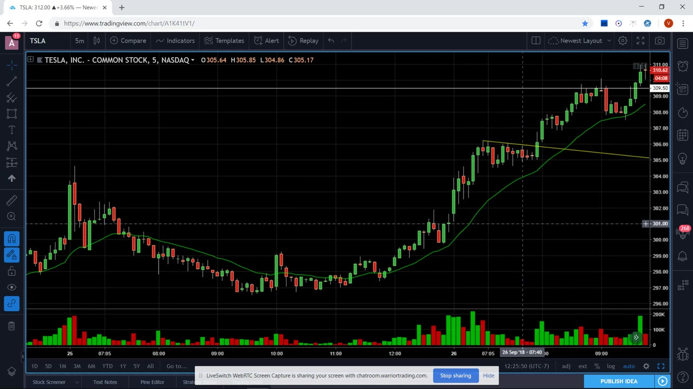

**图怎么看：**

- 特斯拉（TSLA）的5分钟K线图显示了股票价格的上升趋势。
- 成交量柱的高度反映对应周期内的总成交量；红绿着色通常跟随价格柱的涨跌规则，不能直接拆成两种方向的主动成交。
- 价格在图表中呈现出明显的上升趋势，表明市场对该公司的兴趣增加。
- 投资者可以关注这些趋势来制定合理的止损和目标价策略。

### 关键内容

- 识别了SQ股票的牛旗突破模式，确认突破点。
- ATVI股票的五分钟图表显示了清晰的牛旗模式，确认突破点。
- 特斯拉股票的五分钟图表展示了牛旗模式，确认突破点。
- AMD股票的五分钟图表显示了趋势线突破，确认突破点。
- 使用技术模式进行交易，如牛旗突破，可以提高交易成功率。
- 设置合理的止损和目标价，以控制风险和最大化利润。
- 分析股票的市场表现，如成交量和分析师评论，以确认突破的有效性。
- 使用技术图表工具，如趋势线和支撑位，来确认突破点。
- 在大型股交易中，识别技术模式是关键，但需要耐心等待合适的时机。

### 分析与执行顺序

1. 查看大型股的五分钟和日线图，寻找技术模式，如牛旗突破。
2. 确认突破点，设置合理的止损和目标价，以控制风险和最大化利润。
3. 分析突破前后的成交量和分析师评论，以确认突破的有效性。
4. 使用技术图表工具，如趋势线和支撑位，来确认突破点。
5. 在突破后，监控股票的表现，确保突破有效并继续上涨。

### 案例与细节

- SQ股票在五分钟后突破了牛旗模式，从90美元附近上涨到93美元以上。
- ATVI股票在五分钟后突破了牛旗模式，从8115美元附近上涨到82美元以上。
- 特斯拉股票在五分钟后突破了牛旗模式，从305美元附近上涨到314美元。
- AMD股票在五分钟后突破了趋势线，从32美元附近上涨到3280美元。
- SQ股票在突破后，成交量显著增加，表明市场情绪积极。

### 风险与边界

- 牛旗突破模式可能在短期内失效，特别是在市场波动较大时。
- 设置的止损和目标价可能无法完全实现，需要灵活调整。
- 录制年代限制，交易策略可能需要根据当前市场情况进行调整。
- 依赖技术图表工具进行交易，可能会忽略基本面因素的影响。

### 复盘问题

- SQ股票的牛旗突破模式是如何确认的？
- 如何设置合理的止损和目标价以控制风险和最大化利润？
- 在突破后，如何监控股票的表现以确保突破有效？

---

## v0539：eSignal图表软件教程

> 日期：2018-09-26　·　时长：01:14:51

**本场重点：** 了解如何使用eSignal图表软件进行技术分析，掌握关键设置和功能，提高交易效率。

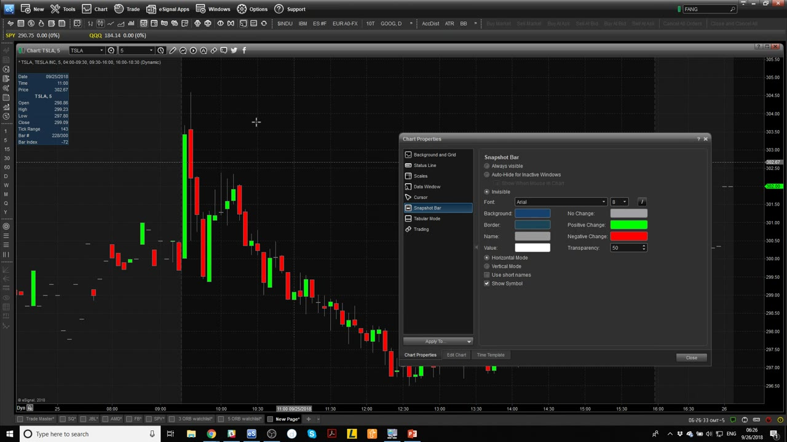

**图怎么看：**

- 在图中可以看到TSLA股票的日线图，显示了价格波动情况。
- 右侧弹出窗口展示了图表属性设置，包括背景和网格、缩放、数据窗口等。
- 用户可以调整图表的外观和行为，例如是否显示水平或垂直模式的快照栏。
- 通过这些设置，用户可以优化图表以更好地进行技术分析和交易决策。

### 关键内容

- eSignal是交易者常用的高级图表软件，提供多种技术指标和自定义选项。
- 通过自定义图表布局，可以更好地跟踪关键市场数据，如开盘价、最高价、最低价和收盘价。
- 使用热键和自定义键盘快捷方式可以快速执行交易操作，提高交易速度。
- 利用时间模板和图表属性可以定制交易策略，如设置不同时间段的图表显示。
- 使用纸交易功能可以在模拟环境中测试交易策略，降低实际交易风险。
- 通过复制和粘贴趋势线，可以在多个图表上保持一致性，便于比较和分析。
- 利用回放功能可以回顾自己的交易记录，避免事后诸葛亮的错误。
- eSignal支持多种时间框架，包括15秒、1分钟、5分钟和日线图，满足不同交易需求。
- 使用热键进行风险回报分析，可以快速计算止损和目标价格，提高交易决策效率。
- eSignal的纸交易功能允许用户在模拟环境中进行交易，无需承担实际资金风险。

### 分析与执行顺序

1. 打开eSignal软件，创建一个新的图表页面。
2. 通过右键点击选择属性，调整时间模板和图表属性，以适应不同的交易策略。
3. 添加常用的技术指标，如移动平均线，并调整颜色和宽度以突出显示。
4. 使用热键和自定义键盘快捷方式，快速执行交易操作，如设置风险回报分析。
5. 利用回放功能，回顾自己的交易记录，分析成功和失败的原因。
6. 利用纸交易功能，在模拟环境中测试交易策略，降低实际交易风险。

### 案例与细节

- 使用15秒图表进行快速交易，捕捉市场波动。
- 设置移动平均线，如20天和200天，用于识别趋势。
- 使用热键L和S快速进行风险回报分析，确定止损和目标价格。
- 利用回放功能，查看前一天的交易记录，分析成功和失败的原因。
- 使用纸交易功能，在模拟环境中测试交易策略，如SQ和JBL的交易。

### 风险与边界

- eSignal的纸交易功能仅适用于模拟环境，实际交易需谨慎。
- 热键和自定义键盘快捷方式需要熟悉，否则可能影响交易速度。
- 时间模板和图表属性的设置需要根据个人交易策略进行调整，否则可能无法有效跟踪市场。
- 录制于2018年，部分功能和界面可能已更新，需参考最新版本。

### 复盘问题

- 如何利用eSignal的热键功能提高交易速度？
- 如何利用回放功能分析自己的交易记录？
- 如何利用纸交易功能测试交易策略？

---

## v0540：保持交易日志的重要性

> 日期：2018-10-10　·　时长：00:56:38

**本场重点：** 保持交易日志有助于提高交易技能，克服心理障碍，缩短学习曲线。

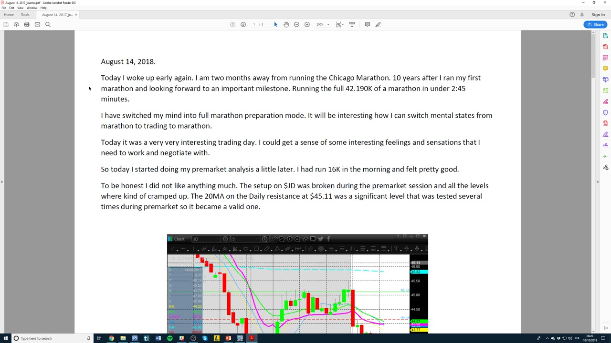

**图怎么看：**

- 这张截图显示了2018年8月14日的交易日志，其中包含了股票市场的实时数据。
- 可以看到多个股票的交易情况，包括价格、成交量和时间序列。
- 截图中还包含了一些技术指标，如移动平均线（MA）和支撑阻力水平。
- 这些数据对于分析市场趋势和制定交易策略非常重要。

### 关键内容

- 交易新手通常会经历一个艰难的学习曲线，从初期的快速进步到长时间的停滞。
- 保持交易日志可以记录交易过程中的心理和情感变化，帮助理解自己的行为模式。
- 技术理解和情绪管理是成功交易的关键，两者缺一不可。
- 通过回顾交易日志，可以识别并改进交易策略，提高交易效率。
- 交易日志应包含个人状态、市场分析和技术操作等信息。
- 交易日志有助于识别和处理情绪波动，提高决策质量。
- 交易日志可以作为自我反思的工具，促进个人成长和发展。
- 保持交易日志需要投入时间和精力，但能显著提高交易技能。
- 交易日志不应拘泥于固定格式，可以根据个人需求进行调整。
- 交易日志可以帮助新手快速度过学习曲线，提高交易成功率

### 分析与执行顺序

1. 讲师首先引用了三个关于坚持的名言，强调了持续努力的重要性。
2. 接着介绍了交易新手通常会经历的学习曲线，从初期的快速进步到长时间的停滞。
3. 然后展示了如何创建一个有效的交易日志模板，包括个人状态、市场分析和技术操作等信息。
4. 讲师强调了技术理解和情绪管理在交易中的重要性，指出两者缺一不可。
5. 最后，讲师分享了一个具体的交易日志示例，展示了如何记录和分析交易过程中的心理和情感变化。
6. 讲师还提到了如何利用交易日志进行自我反思，以改进交易策略和提高交易效率。
7. 讲师强调了保持交易日志的重要性，指出它可以帮助新手快速度过学习曲线，提高交易成功率

### 案例与细节

- 特斯拉（Tesla）在五天内从317美元跌至249美元，这是一个重要的交易机会，但讲师没有参与。
- 百度（Baba）在14750美元水平附近表现出强劲的支撑，但讲师没有参与。
- 普格奥（Piero Geo）在开盘时表现出强劲的卖压，但成交量不足，因此讲师没有参与。
- PPG在开盘时表现出强劲的买压，但缺乏持续的支撑，因此讲师没有参与。

### 风险与边界

- 交易日志的有效性取决于个人的投入时间和精力。
- 交易日志可能无法完全反映市场的真实情况，需要结合其他信息进行分析。
- 交易日志的格式和内容可以根据个人需求进行调整，但需要保持一致性。
- 交易日志可能无法立即提高交易技能，需要长期坚持。
- 交易日志的格式和内容可能因个人习惯而有所不同，需要适应个人风格

### 复盘问题

- 你如何记录和分析交易过程中的心理和情感变化？
- 你如何利用交易日志来改进你的交易策略？
- 你认为技术理解和情绪管理哪个更重要？为什么？
- 你如何确保交易日志的格式和内容的一致性？
- 你如何平衡投入时间和交易日志的记录？

---

## v0541：IBM 股票的交易策略与心理控制

> 日期：2018-10-17　·　时长：00:46:10

**本场重点：** IBM 股票的支撑位突破与心理控制策略。虽然尝试突破支撑位失败，但通过心理控制避免了恐慌性卖出。

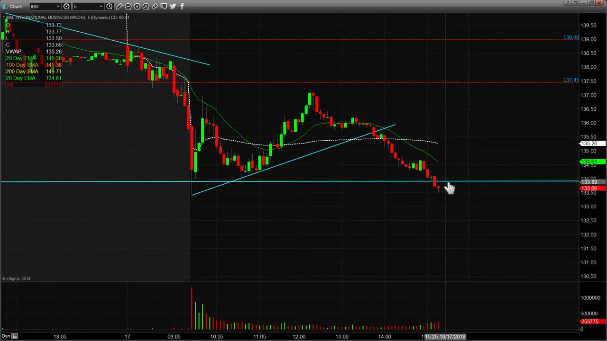

**图怎么看：**

- 画面中，IBM 股票的价格在支撑位附近徘徊，显示出市场对股票的信心不足。
- 尽管价格接近支撑位，但未能有效突破，表明投资者可能对当前趋势持谨慎态度。
- 通过心理控制策略，投资者可以避免在价格接近支撑位时恐慌性卖出。
- 这种策略有助于维持股票价格在关键水平附近的稳定性，减少不必要的波动。

### 关键内容

- IBM 股票在支撑位附近波动，尝试突破支撑位但未成功。
- 支撑位测试表明市场情绪和买卖力量的变化。
- 使用技术指标（如 ATR）来确定支撑位的有效性。
- 心理控制策略帮助避免恐慌性卖出。
- 观察蜡烛形态以判断市场情绪。
- 使用支撑位和阻力位进行交易决策。
- 了解市场情绪和买卖力量的变化对交易至关重要。
- 心理控制有助于在交易中保持冷静。
- 使用技术指标辅助决策可以提高交易成功率。
- 了解市场动态和支撑位的重要性

### 分析与执行顺序

1. 观察 IBM 股票的价格走势，发现支撑位附近波动。
2. 使用 ATR 指标确认支撑位的有效性。
3. 测试支撑位，观察市场反应。
4. 使用心理控制策略避免恐慌性卖出。
5. 结合蜡烛形态和其他技术指标进行交易决策

### 案例与细节

- IBM 股票在 134 美元附近波动，尝试突破支撑位但未成功。
- 使用 ATR 指标确认支撑位的有效性，ATR 值为 3.2 美元。
- 蜡烛形态显示市场情绪变化，如上升趋势线和下降趋势线。
- 使用支撑位和阻力位进行交易决策，如在 134 美元附近加仓。
- 观察市场动态，如成交量和价格波动，以做出交易决策

### 风险与边界

- 支撑位测试可能失败，导致交易损失。
- 心理控制策略可能失效，导致恐慌性卖出。
- 市场情绪和买卖力量的变化可能导致交易失误。
- 使用技术指标可能无法准确预测市场走势。
- 录制年代限制，交易环境和规则可能已发生变化

### 复盘问题

- 支撑位测试的结果如何？
- 心理控制策略是如何帮助避免恐慌性卖出的？
- 使用 ATR 指标确认支撑位的有效性，具体步骤是什么？
- 结合哪些技术指标进行交易决策？
- 如何观察市场情绪和买卖力量的变化？

---

## v0542：新手交易者的时间线

> 日期：2018-10-17　·　时长：01:03:37

**本场重点：** 新手交易者需要经历五个阶段才能达到稳定盈利，每个阶段都有明确的目标和挑战。

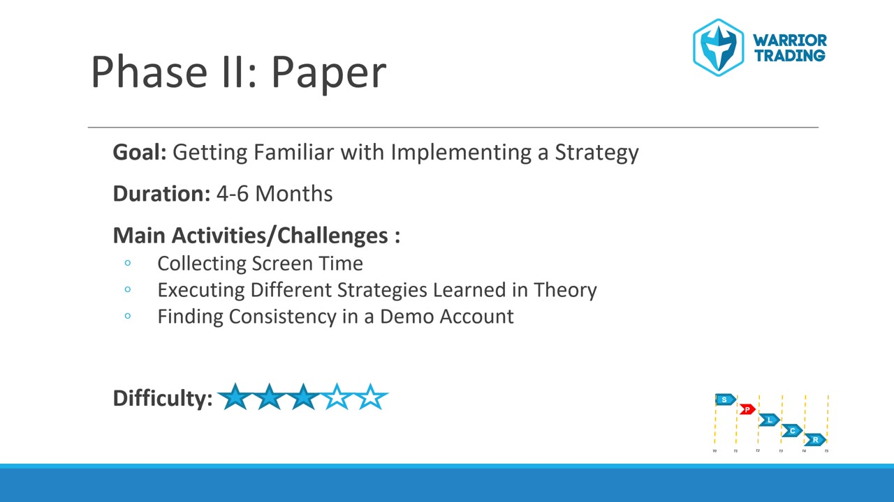

**图怎么看：**

- 这张幻灯片详细描述了新手交易者在不同阶段的学习目标和挑战。
- 它分为三个主要阶段：研究、纸上交易和实盘交易。
- 每个阶段都有明确的目标和挑战，帮助新交易者逐步提升技能。
- 通过这些步骤，新手交易者可以从理论学习过渡到实际操作，最终实现稳定的盈利。

### 关键内容

- 新手交易者从零开始，需要花费两到三个月的时间来建立知识基础。
- 第二阶段是测试策略，需要四到六个月的时间来熟悉和测试不同的策略。
- 第三阶段是实盘交易，需要一到三个月的时间来适应真实市场环境。
- 第四阶段是定制策略，需要四到六个月的时间来完善自己的交易策略。
- 第五阶段是持续优化，没有明确结束时间，交易者需要不断调整策略以适应市场变化。
- 交易者需要不断学习和实践，而不是停滞不前。
- 交易者需要关注情绪管理，这是长期交易的关键。
- 交易者需要关注风险管理和资金管理，这是成功的关键。
- 交易者需要关注市场波动和成交量，这是判断市场趋势的重要依据。
- 交易者需要关注技术指标，如移动平均线和MACD，这些是制定交易策略的基础。

### 分析与执行顺序

1. 交易者首先需要建立知识基础，包括理论学习和模拟交易。
2. 然后进入实盘交易阶段，测试自己的策略并找到适合自己的交易方式。
3. 接着是定制策略阶段，根据自己的经验和市场情况调整和完善策略。
4. 最后是持续优化阶段，不断调整策略以适应市场变化。
5. 交易者需要不断学习和实践，而不是停滞不前。

### 案例与细节

- 交易者在学习阶段花费了三个月的时间来研究各种课程和资料。
- 在实盘交易阶段，交易者每天都在观察市场动态，进行交易。
- 在定制策略阶段，交易者使用了五角星指标来识别市场趋势。
- 在持续优化阶段，交易者发现市场引入了新的规则，需要调整自己的交易策略。
- 交易者在实盘交易中使用了移动平均线来判断市场趋势。

### 风险与边界

- 交易者需要意识到市场环境的变化可能导致策略失效。
- 交易者需要谨慎对待情绪波动，避免因情绪影响决策。
- 交易者需要关注市场规则的变化，及时调整策略。
- 交易者需要认识到市场波动的风险，合理控制仓位。
- 交易者需要了解市场数据的有效期，确保信息的准确性。

### 复盘问题

- 交易者在学习阶段遇到了哪些困难？如何克服这些困难？
- 交易者在实盘交易阶段是如何管理风险的？有哪些具体的措施？
- 交易者在定制策略阶段是如何找到适合自己的交易方式的？
- 交易者在持续优化阶段是如何应对市场变化的？
- 交易者在整个过程中遇到了哪些挑战？如何应对这些挑战？

---

## v0543：AMD 和其他股票的技术分析

> 日期：2018-11-28　·　时长：01:04:22

**本场重点：** 通过技术分析识别潜在的交易机会，强调趋势线的重要性及市场情绪的影响。

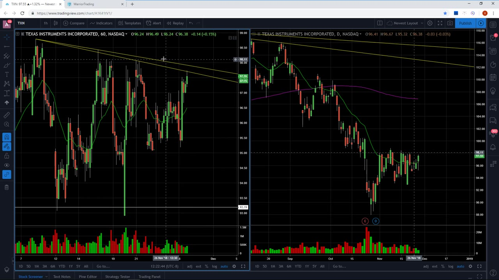

**图怎么看：**

- 在图表中可以看到AMD的股价走势，显示了上升趋势。
- 水平线和斜线表示支撑和阻力位，帮助识别潜在的交易机会。
- 成交量柱显示了市场的买卖活动，有助于理解市场情绪。
- 图表提供了详细的市场数据，便于进行技术分析和决策制定。

### 关键内容

- AMD正在形成一个类似旗形的模式，显示可能的突破。
- SPY和QQQ指数的上涨为市场提供了积极的动力。
- 使用趋势线来预测股票的未来走势，但需要结合市场整体情绪。
- 在技术分析中，成交量是一个重要的参考指标。
- 使用止损来控制风险，通常设置为25%-30%。
- 短期交易策略依赖于快速反应市场变化。
- 使用移动平均线来确认趋势方向，但不作为主要交易依据。
- 在交易中考虑缺口风险，即使概率较低也需防范。
- 选择合适的期权到期日以优化风险回报比

### 分析与执行顺序

1. 分析AMD的每日和60分钟图表，识别可能的突破点。
2. 使用趋势线来预测AMD的未来走势，但注意市场整体情绪的影响。
3. 观察其他股票如FDX和JPM的突破情况，确认技术分析的有效性。
4. 使用止损来控制风险，确保风险回报比合理。
5. 根据市场整体情绪调整交易策略，如SPY和QQQ指数的上涨。
6. 选择合适的期权到期日，以优化风险回报比，例如周五到期的期权。
7. 考虑缺口风险，即使概率较低也需防范

### 案例与细节

- AMD在60分钟图表上形成了一个旗形模式，显示出可能的突破。
- SPY和QQQ指数的上涨为市场提供了积极的动力，推动了股票的突破。
- 使用Zenger体积比率来识别交易想法，因为它能帮助确定当前的体积比率。
- 选择22美元的期权到期日，以优化风险回报比，考虑到市场整体情绪。
- 使用止损来控制风险，通常设置为25%-30%，以确保风险回报比合理。
- 在交易中考虑缺口风险，即使概率较低也需防范，如AMD的突破情况

### 风险与边界

- 市场整体情绪的变化可能会影响技术分析的有效性。
- 选择期权到期日时需考虑市场波动性，避免极端波动带来的风险。
- 缺口风险虽然概率较低，但在交易中仍需考虑。
- 技术分析依赖于历史数据，但市场环境不断变化，需持续关注市场动态

### 复盘问题

- 如何识别股票的突破点？
- 在技术分析中，成交量是如何影响判断的？
- 如何设置止损以控制风险？
- 市场整体情绪如何影响交易决策？
- 选择合适的期权到期日对交易有何重要性？

---

## v0544：构建基于动量的股票扫描器

> 日期：2018-12-04　·　时长：00:57:57

**本场重点：** 构建基于动量的扫描器以捕捉快速上涨但尚未创出新高的股票，适用于特定交易策略。

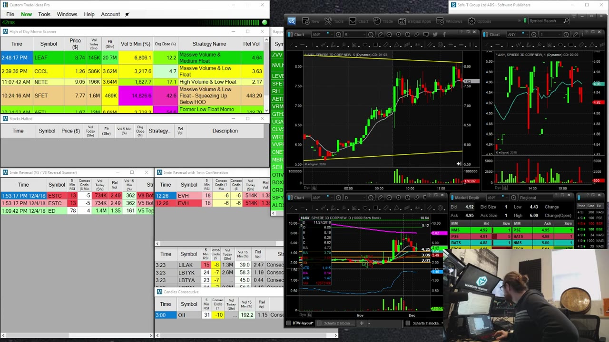

**图怎么看：**

- 在1216秒时，显示了多个股票的实时交易数据，包括价格、成交量和买卖价差。
- 可以看到多个股票的Level 2信息，包括买盘和卖盘的价格和数量。
- 时间与销售窗口显示了实时的市场流动性和交易活动。
- 表格部分显示了不同股票的详细信息，如价格、成交量和交易状态。

### 关键内容

- 讲师分享了如何构建一个新的扫描器来帮助找到像SFT这样的股票，这些股票在上涨过程中尚未创出新高。
- 扫描器设置包括浮动、价格范围、相对成交量等参数。
- 通过调整颜色和字体，使扫描器界面更加个性化。
- 使用Trade Ideas平台进行扫描，但需要考虑每15分钟的蜡烛图而非每15分钟的数据。
- 通过特定的警报设置，过滤掉那些可能只是短暂突破后回落的股票。
- 使用历史数据测试扫描器的效果，确保它能够准确识别潜在的交易机会。
- 分享了如何保存和备份扫描器设置，以便日后使用。
- 强调了使用Trade Ideas平台进行交易的优势，包括低佣金和灵活的交易策略。
- 讨论了如何利用Level 2窗口来监控市场深度和价格变动，特别是关注限价单（L-U-L-D）的触发点。
- 介绍了如何设置和管理交易监控窗口，确保不会遗漏任何未完成的订单

### 分析与执行顺序

1. 讲师首先介绍了今天的任务，即构建一个新的扫描器来捕捉快速上涨但尚未创出新高的股票。
2. 然后，讲师展示了如何使用现有的扫描器作为基础，并对其进行修改以满足新的需求。
3. 接着，讲师详细讲解了如何配置扫描器的各项参数，包括浮动、价格范围、相对成交量等。
4. 通过调整颜色和字体，使扫描器界面更加个性化，以适应个人偏好。
5. 使用Trade Ideas平台进行扫描，并测试其效果，确保能够准确识别潜在的交易机会。
6. 最后，讲师分享了如何保存和备份扫描器设置，以便日后使用，并强调了使用Trade Ideas平台进行交易的优势。
7. 通过设置和管理交易监控窗口，确保不会遗漏任何未完成的订单，从而降低交易风险

### 案例与细节

- SFT股票在一天中上涨了约50美分，触发了新的警报。
- 讲师使用Trade Ideas平台进行扫描，发现了一些快速上涨但尚未创出新高的股票。
- 通过设置特定的警报，如“运行上涨现在”、“25美分以下”等，来捕捉这些股票。
- 使用Level 2窗口监控市场深度，特别关注限价单（L-U-L-D）的触发点。
- 通过历史数据测试扫描器的效果，确保它能够准确识别潜在的交易机会。

### 风险与边界

- 由于录制于2018年，某些平台和功能可能已发生变化，因此需要验证当前的有效性。
- 使用Trade Ideas平台进行交易时，需要注意佣金和其他费用的变化。
- 特定的警报设置可能需要根据当前市场情况进行调整，以确保最佳效果。
- Level 2窗口的设置可能需要根据不同的股票和市场情况进行调整，以适应不同的交易策略。

### 复盘问题

- 如何确保新的扫描器能够准确识别快速上涨但尚未创出新高的股票？
- 在使用Trade Ideas平台进行交易时，需要注意哪些关键因素？
- 如何通过历史数据测试扫描器的效果，以确保其准确性？
- 在设置Level 2窗口时，有哪些关键因素需要考虑？

---

## v0545：大型股市场分析与交易策略

> 日期：2018-12-12　·　时长：00:54:58

**本场重点：** 分析SPY和QQQ的市场趋势，识别关键支撑和阻力位，制定交易策略。

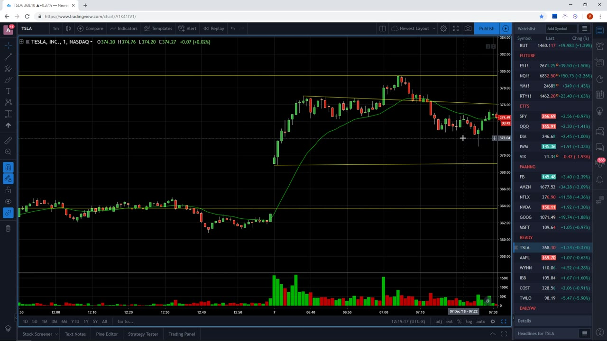

**图怎么看：**

- 特斯拉（TSLA）的价格在近期有所上涨，显示出强劲的需求。
- 成交量柱的高度反映对应周期内的总成交量；红绿着色通常跟随价格柱的涨跌规则，不能直接拆成两种方向的主动成交。
- 图表中的黄色水平线可能表示重要的支撑和阻力位。
- 特斯拉（TSLA）的股价在最近几周内保持在该水平线上方，表明市场对其前景持乐观态度。

### 关键内容

- SPY和QQQ在10月经历了显著修正，市场波动性增加。
- 趋势线连接了2月和4月的两个点，显示市场在此区域有支撑。
- 市场在280水平遇到阻力，表明这是一个重要的阻力位。
- 264-63水平是2月修正的中点，有助于划分图表。
- 市场在252水平可能找到支撑，这是2月低点附近的关键支撑位。
- SPY期货也显示出趋势线的重要性，表明市场对这一水平敏感。
- 特斯拉（Tesla）的短期反弹和反转展示了市场情绪的变化。
- J.P. 摩根（JPM）的突破和随后的回调展示了技术分析的重要性。
- AMD的反转和趋势线突破展示了市场情绪的快速变化。
- FedEx的短期反弹和反转展示了市场情绪的快速变化

### 分析与执行顺序

1. 每天分析SPY和QQQ的走势，关注趋势线和关键支撑位。
2. 识别市场在280和264-63水平的关键支撑和阻力位。
3. 利用趋势线和关键支撑位制定短期交易策略。
4. 特斯拉的短期反弹和反转展示了市场情绪的变化，需要灵活调整策略。
5. J.P. 摩根的突破和随后的回调展示了技术分析的重要性，需要密切关注市场动态。
6. AMD的反转和趋势线突破展示了市场情绪的快速变化，需要及时调整策略。
7. FedEx的短期反弹和反转展示了市场情绪的快速变化，需要灵活应对市场波动

### 案例与细节

- 特斯拉（Tesla）在5月和7月经历了显著波动，随后出现短期反弹，但最终反转。
- J.P. 摩根（JPM）在突破后迅速回调，显示了市场情绪的变化。
- AMD在形成一个良好的牛市旗形后，决定性地反转，显示了市场情绪的快速变化。
- FedEx在突破后迅速回调，显示了市场情绪的快速变化
- 特斯拉（Tesla）的短期反弹和反转展示了市场情绪的变化，需要灵活调整策略。
- J.P. 摩根（JPM）的突破和随后的回调展示了技术分析的重要性，需要密切关注市场动态

### 风险与边界

- 市场情绪的变化可能导致交易策略失效，需要灵活调整。
- 技术分析依赖于历史数据，未来市场可能有所不同。
- 特斯拉（Tesla）的短期反弹和反转展示了市场情绪的变化，需要谨慎操作。
- J.P. 摩根（JPM）的突破和随后的回调展示了技术分析的重要性，但未来可能不同。
- 市场在2018年12月的波动性较大，未来可能有所不同

### 复盘问题

- 如何根据市场趋势和关键支撑位制定交易策略？
- 特斯拉（Tesla）的短期反弹和反转展示了市场情绪的变化，如何应对这种变化？
- J.P. 摩根（JPM）的突破和随后的回调展示了技术分析的重要性，如何结合技术分析制定策略？
- 如何利用趋势线和关键支撑位进行短期交易？
- 市场在2018年12月的波动性较大，未来可能有所不同，如何调整策略以适应变化？

---

## v0546：SPY与大型股市场分析

> 日期：2018-12-26　·　时长：00:49:39

**本场重点：** 分析SPY的走势以预测大型股市场的未来表现，强调当前市场环境的高波动性。

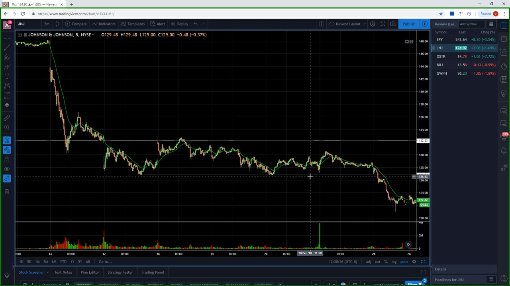

**图怎么看：**

- 画面是TradingView式深色K线图，价格先快速下挫，随后长时间横向整理，右侧再次跌破并形成更低位置；下方保留成交量柱。
- 绿色均线整体向下并在多数时间压在价格上方，若干水平线标记整理区和低位参考；这比只看最后一根K线更能表达趋势背景。
- 它适合用于SPY与大型股市场分析：先判断大盘和大型股是在修复、盘整还是继续走弱，再决定个股交易是否顺应环境。
- 截图是历史区间，无法据此预测下一步；均线和水平位也只有在时间周期、成交量与当时新闻环境一致时才有参考意义。

### 关键内容

- SPY是追踪500家跨国公司表现的指数ETF，对大型股市场有重要影响。
- 近期市场波动显著，预计2019年将保持高波动性。
- SPY目前处于超卖状态，可能反弹，但短期做空难度大。
- 200日移动均线是关键技术支撑位，市场已七年来首次测试此水平。
- 市场刚完成一轮范围扩展，预示可能进一步反弹。
- JNJ等股票出现熊市陷阱，表明市场情绪仍偏负面。
- OSTK在关键水平1659附近形成明显的熊市陷阱，预示可能大幅下跌。
- Billy股票趋势线突破，预示可能继续下跌。
- GWPH每日图表显示明显熊市模式，预示可能大幅下跌。

### 分析与执行顺序

1. 分析SPY的走势，识别关键技术支撑位和阻力位。
2. 回顾近期市场波动情况，确认高波动性环境。
3. 评估SPY的当前状态，确定是否处于超卖状态。
4. 识别JNJ等股票的关键技术形态，如熊市陷阱。
5. 分析OSTK等股票的关键水平，确认熊市陷阱的存在。
6. 评估Billy股票的趋势线突破，预测可能的下跌趋势。
7. 总结GWPH股票的每日图表，确认熊市模式。

### 案例与细节

- SPY在2018年经历了显著的波动，特别是从10月开始，市场持续下跌，直到最近才出现反弹。
- JNJ在新闻影响下大幅下跌，形成了一个平底形态，随后再次下跌，表明市场情绪依然负面。
- OSTK在关键水平1659附近形成了明显的熊市陷阱，次日股价大幅下跌，证实了这一预测。
- Billy股票的趋势线突破，表明市场可能继续下跌，实际走势也验证了这一点。
- GWPH的每日图表显示了明显的熊市模式，包括多次尝试反弹但失败的情况，最终确认了下跌趋势。

### 风险与边界

- 市场环境变化可能导致预测失效，需实时监控市场动态。
- 使用熊市陷阱作为交易信号存在风险，需谨慎执行。
- 录制年代限制，当前市场环境与2018-2021年有所不同。
- 依赖技术指标进行交易存在风险，需结合其他因素综合判断。

### 复盘问题

- SPY当前的超卖状态是否意味着即将反弹？
- 如何利用熊市陷阱进行有效的交易？
- 如何结合多种技术指标来提高交易决策的准确性？

---

## v0547：战术止损的应用

> 日期：2018　·　时长：00:35:13

**本场重点：** 理解如何利用快速时间框架进行精准止损，以减少风险。

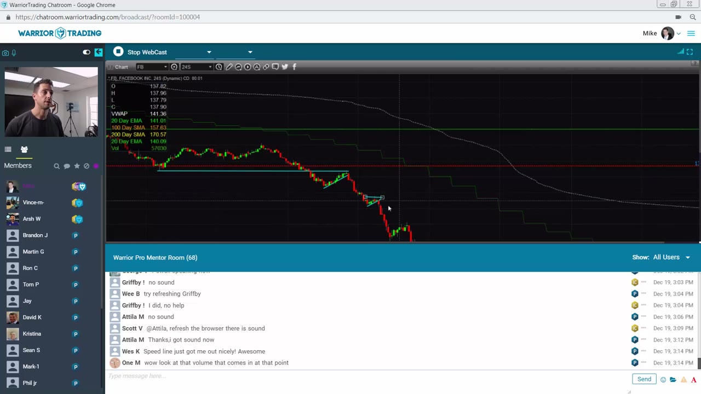

**图怎么看：**

- 在图中可以看到Facebook Inc. (FB) 的日线图。
- 图中显示了股票的价格走势，包括开盘价（O）、最高价（H）、最低价（L）和收盘价（C）。
- 图中还显示了移动平均线（EMA），包括20天、100天和200天的简单移动平均线。
- 成交量柱的高度反映对应周期内的总成交量；红绿着色通常跟随价格柱的涨跌规则，不能直接拆成两种方向的主动成交。

### 关键内容

- 使用快速时间框架来识别价格行动和三角形模式，以确定止损点。
- 三角形模式中的底部是止损点，顶部是目标价，形成高风险低回报的交易。
- 保持止损点非常紧，以减少风险。
- 在快速时间框架中识别关键水平，如支撑位和阻力位，以制定交易策略。
- 利用三角形模式进行精准止损，减少风险。
- 快速时间框架有助于识别关键价格水平，从而提高交易精度。
- 三角形模式通常出现在大波动之后，有助于捕捉市场趋势。
- 快速时间框架可以减少交易频率，但能更准确地识别交易机会。
- 使用三角形模式进行交易时，需要关注支撑位和阻力位的变化。
- 快速时间框架有助于识别价格行动的细微变化，从而做出更精确的交易决策

### 分析与执行顺序

1. 首先，使用快速时间框架来识别价格行动和三角形模式。
2. 然后，确定三角形模式中的支撑位和阻力位，作为止损点和目标价。
3. 接着，根据快速时间框架中的价格行动调整止损点。
4. 最后，利用三角形模式进行精准止损，减少风险。
5. 在交易过程中，持续监控价格行动，确保止损点的有效性。
6. 在快速时间框架中，识别关键水平，如支撑位和阻力位，以制定交易策略。
7. 利用三角形模式进行交易时，需要关注支撑位和阻力位的变化，以调整止损点

### 案例与细节

- ticker：MU；description：MU股票在开盘后出现快速下跌，形成三角形模式，止损点设在3150附近。；price_action：三角形模式中的底部是止损点，顶部是目标价。；stop_loss：止损点设在3150附近，实际止损在3160，损失8美分。；risk_reward：止损点非常紧，风险低，收益高
- ticker：JNJ；description：JNJ股票在开盘后尝试突破下降阻力线，形成三角形模式。；price_action：三角形模式中的底部是止损点，顶部是目标价。；stop_loss：止损点设在13215附近，实际止损在13250，损失40美分。；risk_reward：止损点非常紧，风险低，收益高
- ticker：FB；description：FB股票在快速时间框架中形成三角形模式，止损点设在14450附近。；price_action：三角形模式中的底部是止损点，顶部是目标价。；stop_loss：止损点设在14450附近，实际止损在14480，损失30美分。；risk_reward：止损点非常紧，风险低，收益高

### 风险与边界

- 快速时间框架可能会产生更多的假信号，需要谨慎处理。
- 三角形模式的有效性依赖于市场波动，录制年代限制为2018-2021年。
- 快速时间框架有助于减少风险，但需要熟练掌握才能有效应用。
- 三角形模式可能在某些情况下失效，需要结合其他技术指标进行判断

### 复盘问题

- 如何在快速时间框架中识别三角形模式的关键水平？
- 在快速时间框架中设置止损点时，需要注意哪些因素？
- 三角形模式在哪些市场条件下最有效？
- 快速时间框架如何帮助减少交易风险？
- 如何在实际交易中应用三角形模式进行精准止损？

---

## v0548：小盘股交易初学者指南

> 日期：2018　·　时长：00:45:13

**本场重点：** 初学者在小盘股交易中应关注资金管理、情绪控制和逐步增加仓位。

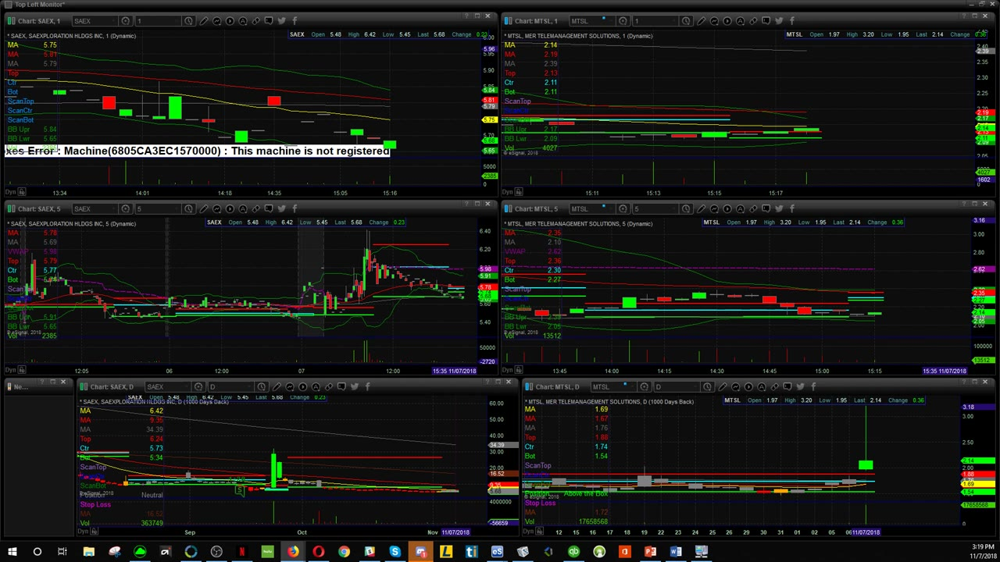

**图怎么看：**

- 图中显示了DAXR股票的日线图，可以看到股价在不同周期内的波动情况。
- 图中标注了多个技术指标，如MA（移动平均线）、Top、Bot等，帮助投资者分析股票的趋势。
- 成交量柱的高度反映对应周期内的总成交量；红绿着色通常跟随价格柱的涨跌规则，不能直接拆成两种方向的主动成交。
- 图中还标注了止损点和止盈点，帮助投资者设定风险控制策略。

### 关键内容

- 初学者应先完成基础课程，并制定交易计划。
- 第一周交易时，应使用小额资金以避免过度冒险。
- 记录交易数据有助于发现交易模式和改进策略。
- 根据交易表现逐步增加仓位，但需保持谨慎。
- 使用热键进行快速交易，但需注意避免滑点。
- 保持交易计划的一致性，避免过度交易。
- 定期调整交易策略以适应市场变化。
- 使用模拟平台熟悉交易平台，确保操作顺畅

### 分析与执行顺序

1. 讲师首先介绍了初学者应完成的基础课程和制定的交易计划。
2. 然后讲解了第一周交易时的资金管理策略，建议使用小额资金。
3. 接着强调了记录交易数据的重要性，以便后续分析。
4. 进一步说明了根据交易表现逐步增加仓位的方法，但需谨慎。
5. 最后提到了使用热键进行快速交易，但需注意避免滑点。
6. 建议初学者保持交易计划的一致性，避免过度交易。
7. 提醒初学者定期调整交易策略以适应市场变化

### 案例与细节

- 讲师提到，第一周交易时，情绪和恐惧会对真实资金产生影响，因此建议使用小额资金。
- 讲师举例说明，如果交易表现不佳，可以降低仓位，保护利润。
- 讲师提到，使用模拟平台进行交易练习，可以更好地熟悉交易平台的操作。
- 讲师建议，记录每次交易的数据，包括盈利和亏损情况，以便后续分析。
- 讲师举例说明，如果市场出现异常波动，可以调整交易策略，如降低买入价格或减少仓位

### 风险与边界

- 录制年代限制，交易环境和规则可能已发生变化。
- 资金管理策略可能需要根据当前市场情况进行调整。
- 交易计划应根据市场变化和个人经验进行更新。
- 模拟平台的使用仅作为熟悉交易平台的手段，实际交易时需谨慎

### 复盘问题

- 初学者在交易前应完成哪些基础课程？
- 如何在第一周交易时有效管理资金？
- 记录交易数据的具体方法是什么？
- 在交易过程中遇到市场异常波动时，应该如何调整交易策略？

---
