# Intermediate Mentor Sessions：2019

> 64 场，合计 65.0 小时。返回 [Intermediate Mentor Sessions 目录](../README.md)。

## v0549：SPY 和其他股票的技术分析

> 日期：2019-01-02　·　时长：00:58:39

**本场重点：** 分析 SPY 和其他股票的技术走势，识别关键支撑和阻力位，制定交易策略。

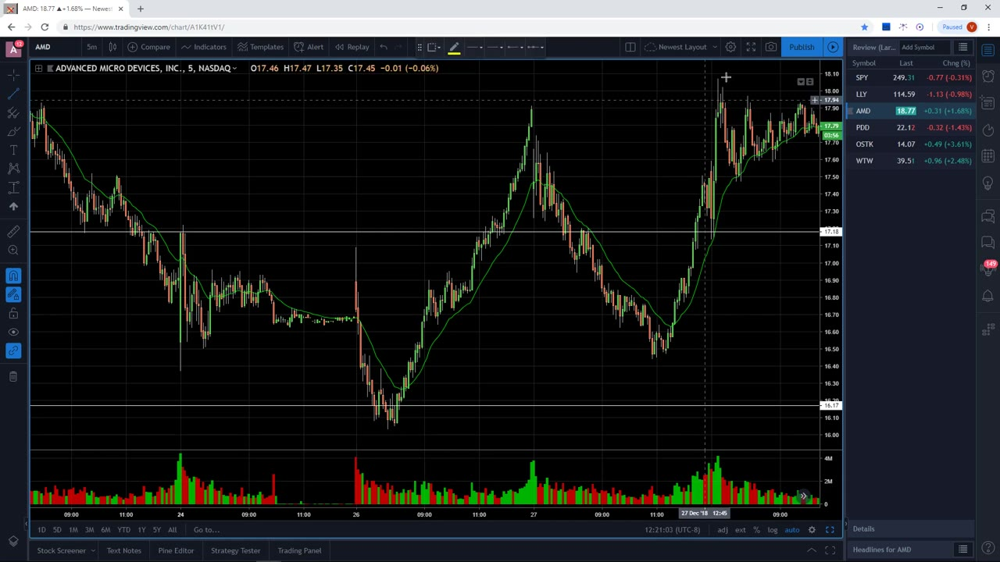

**图怎么看：**

- 在 B 截图中，可以看到 SPY 的日线图，显示了其价格走势和成交量。
- 图中显示了 SPY 在不同时间段的价格波动情况。
- 成交量柱状图显示了市场参与者在不同时间段内的买卖活动。
- 通过观察价格走势和成交量，可以识别出支撑和阻力位，从而制定交易策略。

### 关键内容

- SPY 在过去几个月经历了重大修正，从 10 月开始，市场持续下跌，直到 12 月才出现反弹。
- SPY 的 200 周均线在 234.50 附近提供了重要的支撑，市场在此区域反弹。
- LLY 股票在 mentor session 中表现出强劲的突破，突破了 111 美元的关键水平。
- AMD 形成了一个牛旗形态，但随后出现了假突破，最终未能继续上涨。
- PDD 形成了一个牛旗形态，但突破趋势线的时机不对，导致假突破。
- OSTK 形成了一个熊旗形态，但市场并未突破趋势线，导致假突破。
- WTW 形成了一个五分钟的假突破，最终未能继续上涨，显示了假突破的风险。
- 市场环境的变化使得假突破减少，但仍然存在，需要谨慎对待。
- 使用技术分析来识别关键支撑和阻力位，制定交易策略，但需注意假突破的存在。
- 使用 Trading View Pro Plus 可以获得实时市场数据，但需要额外支付费用

### 分析与执行顺序

1. 分析 SPY 的周线图，识别 200 周均线作为关键支撑位。
2. 观察 SPY 的日线图，确认 234.50 支撑位的重要性。
3. 分析 LLY 的日线图和 60 分钟图，识别突破关键水平 111 美元的信号。
4. 观察 AMD 的日线图和 60 分钟图，识别牛旗形态和假突破。
5. 分析 PDD 的日线图，识别牛旗形态和假突破的时机。
6. 观察 OSTK 的日线图和 60 分钟图，识别熊旗形态和假突破的时机。
7. 分析 WTW 的五分钟图，识别假突破的信号，最终未能继续上涨。

### 案例与细节

- SPY 的 200 周均线在 234.50 附近提供了重要的支撑，市场在此区域反弹。
- LLY 股票在 mentor session 中表现出强劲的突破，突破了 111 美元的关键水平。
- AMD 形成了一个牛旗形态，但随后出现了假突破，最终未能继续上涨。
- PDD 形成了一个牛旗形态，但突破趋势线的时机不对，导致假突破。
- OSTK 形成了一个熊旗形态，但市场并未突破趋势线，导致假突破。
- WTW 形成了一个五分钟的假突破，最终未能继续上涨，显示了假突破的风险。

### 风险与边界

- 假突破可能导致交易者错误地进入市场，最终导致亏损。
- 市场环境的变化使得假突破减少，但仍然存在，需要谨慎对待。
- 使用 Trading View Pro Plus 可以获得实时市场数据，但需要额外支付费用，增加了成本。
- 假突破的风险在不同股票和不同时间框架下有所不同，需要根据具体情况判断。

### 复盘问题

- 如何识别假突破，并避免基于假突破进行交易？
- 在哪些情况下，假突破的风险会更高？
- 如何利用 Trading View Pro Plus 获取实时市场数据？

---

## v0550：每日图表阅读技巧

> 日期：2019-01-02　·　时长：00:51:41

**本场重点：** 每日图表阅读对于日内交易者至关重要，通过分析每日图表可以更好地选择交易机会。重点在于识别潜在的交易机会，而不是盲目跟随市场趋势。

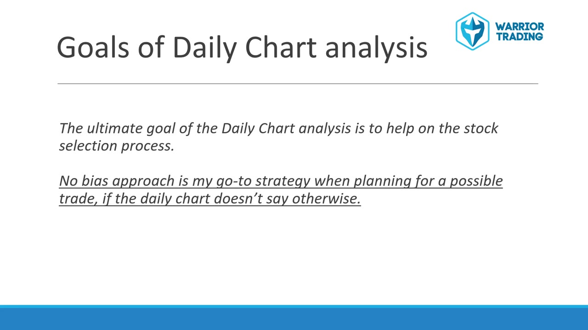

**图怎么看：**

- 幻灯片标题为“Goals of Daily Chart analysis”，说明每日图表分析的最终目标是服务选股流程，而不是为了给所有股票强行贴上看多或看空标签。
- 正文强调“No bias approach”：除非日线图给出足够理由，否则制定潜在交易计划时先保持无偏，等价格行为确认方向。
- 实际使用时先用日线图筛掉位置不佳、空间不足或风险不清楚的标的，再为可能的多空情景分别写触发条件、失效点和风险上限。
- 这页展示的是决策流程原则，并没有给出某只股票的即时入场信号；保持无偏也不等于没有计划，而是避免先有结论再选择性解释图表。

### 关键内容

- 讲师引用了三位名人的观点，强调了整体视角的重要性。
- 每日图表阅读是选择日内交易机会的关键工具。
- 通过分析每日图表，可以更好地理解市场环境和潜在的交易机会。
- 每日图表可以帮助筛选出有潜力的股票，提高交易成功率。
- 使用ATR（平均真实波动幅度）来评估股票的波动性。
- 关注股票的趋势方向，以及缺口与趋势的一致性。
- 比较开盘价与移动平均线的位置，以判断潜在的交易机会。
- 测量重要支撑和阻力位的距离，以评估交易机会的可行性。
- 在大额交易日，特别关注股票的波动性和市场反应。
- 保持无偏见的态度，避免因图表误导而做出错误的交易决策

### 分析与执行顺序

1. 讲师首先引用了三位名人的观点，强调了整体视角的重要性。
2. 然后介绍了每日图表阅读的基本步骤，包括分析ATR、趋势方向、开盘价与移动平均线的关系等。
3. 接着，讲师通过具体的股票案例来说明如何应用这些分析方法。
4. 最后，讲师强调了保持无偏见态度的重要性，以避免因图表误导而做出错误的交易决策。
5. 在整个过程中，讲师还提到了识别过度扩展情景的风险，以及如何利用这些信息来优化交易策略

### 案例与细节

- 德意志银行（DB）：由于国际股票通常会有较大的缺口，因此在分析时需要特别注意。
- 特斯拉（Tesla）：在分析良好的每日图表时，可以关注股票的支撑和阻力位，以及移动平均线。
- 耐克（Nike）：耐克在大额交易日的表现通常不佳，因此在分析时需要特别注意。
- 甲骨文（Oracle）：甲骨文在大额交易日的表现可能较好，但也可能较差，需要仔细分析。
- 思科系统（Cisco Systems）：在分析思科系统的每日图表时，可以关注其支撑和阻力位的变化，以及移动平均线的走势

### 风险与边界

- 讲师指出，过度扩展情景可能会导致交易失败，因此需要特别注意。
- 讲师提到，保持无偏见的态度非常重要，否则可能会因为图表误导而做出错误的交易决策。
- 录制年代限制：本课程录制于2019年，部分市场规则和操作方式可能已发生变化。
- 风险提示：过度依赖图表分析可能会忽略其他重要的市场因素，如宏观经济环境和突发事件。

### 复盘问题

- 在分析每日图表时，哪些因素是你最关注的？
- 如何确保在交易决策中保持无偏见的态度？
- 在识别过度扩展情景时，有哪些具体的指标可以参考？

---

## v0551：2019年1月9日 SPY、AMD、CLF等股票分析

> 日期：2019-01-09　·　时长：01:12:43

**本场重点：** 识别和利用股票突破后的技术形态进行交易，特别是牛旗形态。

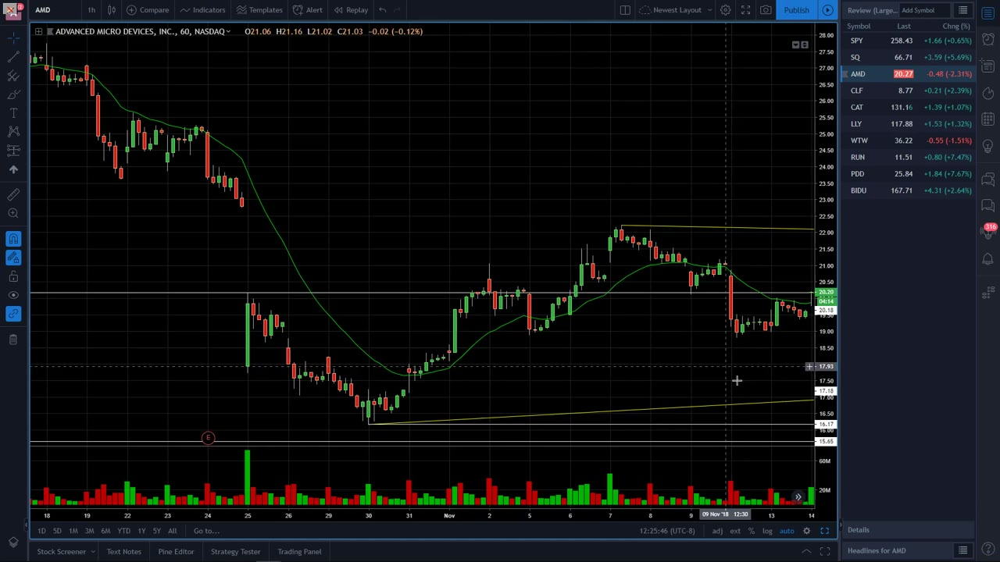

**图怎么看：**

- 画面为一张日内K线图，黄色斜线勾勒下降通道：左侧快速下跌，中段形成低点并反弹，右侧在通道上沿附近再次整理。
- 下方成交量在急跌和反弹阶段更突出，绿色均线随价格拐弯；水平线与通道线共同提供突破、回踩和失效位置的参照。
- 这类结构可用于理解本场对SPY、AMD、CLF等案例的讲解：突破不能只看穿线瞬间，还要观察能否守住通道或关键价位。
- 图上形成牛旗或通道并不自动等于入场；若成交量、市场方向或止损空间不匹配，同样的外形可能演变成假突破。

### 关键内容

- SPY在12月出现重大抛售，但圣诞反弹使其恢复至200日均线支撑（235）。
- AMD从$17涨至$21，形成重要趋势线，短期目标是突破$20趋势线，长期目标是$21。
- CLF从$792突破，形成重要趋势线，止损设在$780，目标是$800。
- CAT形成重要趋势线，止损设在$11450，目标是$124。
- LLY在11.30附近形成趋势线，止损设在$11450，目标是$124。
- WTW形成旗形模式，止损设在$40，目标是$37。
- Run和PDD形成趋势线，测试后反弹，止损设在关键价位，目标是突破趋势线。
- PDD在突破后大幅上涨，符合预期的牛旗形态。
- 市场整体看涨时，个股可能跟随上涨，但需注意市场波动风险。
- 突破关键点位后，市场可能回测验证趋势线的有效性。
- WTW形成旗形模式，开盘大幅下跌但未突破趋势线，表明市场情绪仍积极，需等待进一步确认。
- CAT突破重要趋势线，表明市场信心增强，但需警惕后续回调风险，特别是在关键支撑位附近。
- LLY在11.30附近形成趋势线，表明市场对LLY持乐观态度，但需关注市场整体波动对个股的影响。
- PDD形成趋势线后大幅上涨，符合预期的牛旗形态，说明市场情绪高涨，但需注意后续可能的回调。
- Run和PDD形成趋势线后反弹，表明市场情绪积极，但需警惕市场波动带来的不确定性

### 分析与执行顺序

1. 讲师讨论如何识别和利用股票突破后的技术形态进行交易，特别是牛旗形态。
2. RJ询问CLF是否形成牛旗形态，讲师表示需要更多横向波动来确认趋势线的有效性。
3. RG询问是否同时交易股票和期权，讲师回答目前仅使用期权，但会转向股票交易。
4. Kurt询问Baidu的2月1日到期177认购期权是否合适，讲师认为合理，但更倾向于较近的到期日。
5. Stefan询问如何有效监控多只股票，讲师建议评估情绪状态，避免挫败感影响交易。

### 案例与细节

- SPY在12月出现重大抛售，但圣诞反弹使其恢复至200日均线支撑（235）。
- AMD从$17涨至$21，形成重要趋势线，短期目标是突破$20趋势线，长期目标是$21。
- CLF从$792突破，形成重要趋势线，止损设在$780，目标是$800。
- WTW形成旗形模式，止损设在$40，目标是$37。
- CLF从$792突破，形成重要趋势线，止损设在$780，目标是$800，表明市场整体看涨，但需注意止损设置的重要性。
- AMD从$17涨至$21，形成重要趋势线，短期目标是突破$20趋势线，长期目标是$21，说明市场情绪积极，但需关注短期波动风险。
- WTW形成旗形模式，止损设在$40，目标是$37，表明市场情绪积极，但需警惕旗形模式可能带来的回调风险

### 风险与边界

- 趋势线突破后，市场可能回测验证趋势线的有效性。
- 市场整体看涨时，个股可能跟随上涨，但需注意市场波动风险。
- 讲师讨论的内容基于2018-2021年的市场情况，当前市场条件可能有所不同。
- 使用期权的仓位大小需根据个人每笔交易的风险控制和止损设置来确定。
- 市场整体看涨时，个股可能跟随上涨，但需注意市场波动风险，特别是当市场出现回调时，个股可能迅速下跌。
- 趋势线突破后，市场可能回测验证趋势线的有效性，特别是在关键支撑位和阻力位附近，需警惕回调风险。
- 使用期权的仓位大小需根据个人每笔交易的风险控制和止损设置来确定，但需注意市场波动可能导致仓位损失放大

### 复盘问题

- 如何识别和利用股票突破后的技术形态进行交易？
- 如何确认牛旗形态的有效性？
- 如何评估情绪状态以避免挫败感影响交易？
- 如何确定股票突破后的范围？

---

## v0552：选择适合的交易工具

> 日期：2019-01-09　·　时长：00:58:01

**本场重点：** 选择合适的交易工具对于新手非常重要，但并非所有工具都适合每个人。关键在于了解自己的交易风格。

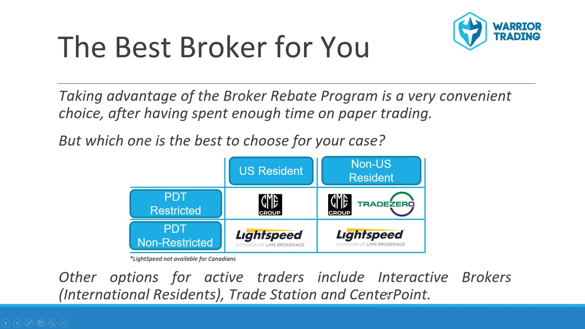

**图怎么看：**

- 画面来自课程中的实际演示，用于对应本场讨论的工具与判断流程。
- 本场标题：选择适合的交易工具。
- 本场重点：选择合适的交易工具对于新手非常重要，但并非所有工具都适合每个人。关键在于了解自己的交易风格。
- 候选时间：A=1462秒，B=1218秒，C=2367秒

### 关键内容

- 交易工具的选择应基于个人交易风格，没有适用于所有人的工具。
- 基本要求包括一台Windows笔记本电脑，两个外部显示器，以及强大的互联网连接。
- 最佳交易经纪人是World Trade，因为它提供回扣计划，但具体选择还需考虑地区限制。
- 图表软件方面，E-Signo和Trading View是两个主要选项，各有优缺点。
- 扫描器方面，Live Scanners对于活跃交易者至关重要，而Primus Scan是另一个好选择。
- 交易成本包括图表软件、扫描器、佣金等，需要长期规划。
- 新手可以先保持较低的成本，但最终需要全面的交易工具。
- 交易策略和心理准备同样重要，但这是更复杂的部分。
- Roku股票交易案例展示了如何根据技术指标进行交易决策。

### 分析与执行顺序

1. 讲师首先介绍了选择交易工具的基本要求。
2. 然后详细讲解了不同类型的交易工具，如笔记本电脑、显示器、互联网连接等。
3. 接着讨论了交易经纪人的选择，特别提到了World Trade的回扣计划。
4. 进一步解释了图表软件和扫描器的选择，提供了具体推荐。
5. 最后通过Roku股票交易案例，展示了如何应用所学知识进行交易决策。
6. 在整个过程中，讲师强调了长期规划的重要性，以及交易策略和心理准备的必要性。

### 案例与细节

- 使用Windows笔记本电脑，安装E-Signo图表软件，进行实时交易监控。
- 通过Trading View的Pro Plus订阅，获取专业级别的图表环境。
- 使用Live Scanners在市场开盘时获取即时交易想法。
- 通过Primus Scan获取高级扫描功能，提高交易效率。
- Roku股票交易案例中，使用13 EMA指标进行技术分析，决定是否进行交易。

### 风险与边界

- 交易成本会随着市场变化而波动，需要灵活调整。
- 交易工具的选择需考虑个人交易风格，不适合所有人的工具。
- 交易策略和心理准备是长期过程，需要持续学习和实践。
- 录制于2019年，部分信息可能已发生变化，需结合当前市场情况做出决策。
- 交易成本包括图表软件、扫描器、佣金等，需要长期规划。

### 复盘问题

- 根据自己的交易风格，哪些交易工具最适合你？
- 如何平衡交易成本和长期规划？
- 在选择交易工具时，哪些因素是你最看重的？

---

## v0553：交易回顾与分析

> 日期：2019-01-16　·　时长：01:07:04

**本场重点：** 交易回顾是提升交易技能的关键，需严格遵循策略，避免过度交易。

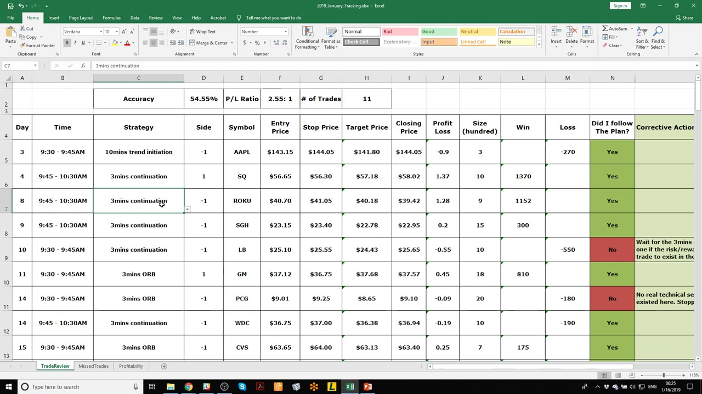

**图怎么看：**

- 这张Excel表格详细记录了交易策略的执行情况，包括入场价格、止损价、目标价等关键数据。
- 表格中的数据表明在特定时间段内使用了不同的交易策略，如10分钟趋势启动、3分钟继续等。
- 通过查看表格，可以了解每次交易的具体操作细节，从而评估策略的有效性和成功率。
- 表格还提供了是否遵循计划和纠正行动的记录，有助于总结交易过程中的经验教训。

### 关键内容

- 交易回顾是提升交易技能的关键，需严格遵循策略。
- 交易者应定期进行交易回顾，以持续改进。
- 交易回顾应包括交易过程、结果及反思。
- 交易者应根据市场情况调整交易策略。
- 交易者需严格遵守止损规则，避免过度交易。
- 交易回顾应涵盖成功与失败的交易，以全面改进。
- 交易者应关注市场趋势，避免强行交易。
- 交易回顾应包括交易记录、图表分析及反思。
- 交易者应根据市场情况调整交易规模和策略。

### 分析与执行顺序

1. 罗伯托首先介绍了交易回顾的重要性，强调这是提升交易技能的关键。
2. 他展示了自己的交易记录表，包括日期、股票代码、交易方向、价格、入场和出场时间等。
3. 罗伯托分析了交易结果，包括盈利和亏损情况，以及交易次数。
4. 他详细解释了每个交易的具体情况，包括入场时机、止损点设置和目标价。
5. 罗伯托分享了交易过程中遇到的问题，并提出了改进建议。
6. 他总结了交易回顾的主要内容，包括交易记录、图表分析和反思。

### 案例与细节

- 1月8日，罗库（ROKU）的短空交易，初始价格为40.70美元，止损价格为38.75美元，最终损失90美分/股。
- 1月10日，LB公司的三分钟延续交易，初始价格为25.35美元，止损价格为25.65美元，最终损失55美分/股。
- 1月14日，PCG公司的交易，初始价格为90.10美元，止损价格为88.00美元，最终损失9美分/股。
- 1月9日，STZ公司的交易，初始价格为15.55美元，止损价格为15.10美元，最终损失1.00美元/股。
- 1月10日，SDZ公司的交易，初始价格为X，止损价格为X，最终损失X美元/股。

### 风险与边界

- 交易者需注意市场变化，避免因市场波动导致的交易失败。
- 交易者应严格遵守止损规则，避免因过度交易导致的资金损失。
- 交易者应根据市场情况调整交易策略，避免强行交易。
- 交易回顾应在交易后立即进行，以确保及时发现并改正错误。
- 交易者应关注交易记录中的细节，避免因疏忽导致的交易失误。

### 复盘问题

- 你在交易过程中是否严格遵守了止损规则？
- 你如何根据市场情况调整交易策略？
- 你在交易回顾中发现了哪些可以改进的地方？

---

## v0554：SPY 指数对股票交易的影响

> 日期：2019-01-23　·　时长：00:51:06

**本场重点：** 讨论 SPY 指数对交易决策的影响，强调市场波动性和相对成交量的重要性。

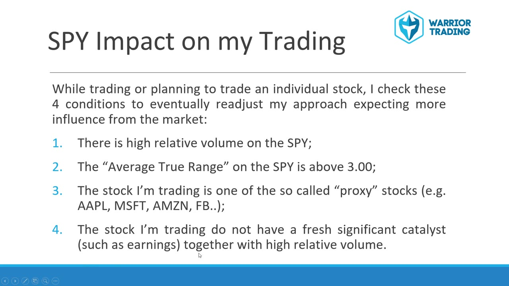

**图怎么看：**

- 在进行股票交易时，我检查以下四个条件以最终调整我的方法，期望更多地受到市场影响。
- 1. SPY指数具有较高的相对成交量。
- 2. SPY指数的‘平均真实范围’高于3.00。
- 3. 我正在交易的股票是所谓的‘代理股’（例如AAPL, MSFT, AMZN, FB等）。

### 关键内容

- SPY 是跟踪 S&P 500 指数的 ETF，影响市场波动。
- 市场波动性可以通过 SPY 的相对成交量和平均真实范围来衡量。
- SPY 的高影响通常出现在市场波动较大时。
- 交易者需要根据市场条件调整策略。
- SPY 的低影响通常出现在市场相对平静时。
- 交易者应关注 SPY 的相对成交量和平均真实范围。
- SPY 的高影响可能持续较长时间，而低影响则较短。
- 交易者需根据市场情况灵活调整交易计划
- 观察到 SPY 的高相对成交量通常伴随着市场波动性的增加，这表明市场情绪较为不稳定。
- 当 SPY 的平均真实范围超过 3 点时，表明市场波动性显著增强，此时交易者应更加谨慎地制定交易计划。
- SPY 的低相对成交量和低平均真实范围通常出现在市场相对平静时期，此时交易者可以更自由地选择交易标的。
- 市场条件的变化会影响 SPY 的影响程度，交易者需要定期更新自己的分析工具以适应新的市场环境。
- SPY 的高影响和低影响之间存在周期性变化，交易者应关注这些周期性变化以优化自己的交易策略。

### 分析与执行顺序

1. 定义 SPY 和 S&P 500 指数的关系。
2. 解释市场波动性如何通过 SPY 的相对成交量和平均真实范围来衡量。
3. 举例说明 SPY 高影响和低影响的不同市场条件。
4. 强调交易者需要根据市场情况调整策略。
5. 展示 SPY 的相对成交量和平均真实范围如何影响交易决策

### 案例与细节

- SPY 在 2019 年 1 月 23 日的相对成交量较高，显示市场波动性。
- SPY 的平均真实范围在 2019 年 1 月 23 日达到 4.75 点，表明市场波动性较大。
- SPY 在 2019 年 1 月 23 日的高相对成交量和高平均真实范围表明市场波动性较大。
- SPY 在 2019 年 1 月 23 日的低相对成交量和低平均真实范围表明市场相对平静。
- SPY 在 2019 年 1 月 23 日的高相对成交量和高平均真实范围表明市场波动性较大，影响交易决策
- 在 2019 年 1 月 23 日，SPY 的相对成交量达到了 4.75 点，同时平均真实范围也超过了 3 点，这表明市场波动性显著增加，交易者需要更加谨慎地选择交易标的。
- 当 SPY 的相对成交量下降到较低水平时，如 2019 年 1 月 23 日的低相对成交量，市场相对平静，此时交易者可以选择那些具有独立技术面支撑的股票进行交易。
- 在 2019 年 1 月 23 日，SPY 的高相对成交量和高平均真实范围表明市场波动性较大，此时交易者应密切关注市场动态，避免盲目跟风。
- 当 SPY 的相对成交量和平均真实范围都处于较低水平时，如 2019 年 1 月 23 日的情况，市场相对平静，此时交易者可以更加自由地选择那些具有独立技术面支撑的股票进行交易。

### 风险与边界

- 录制于 2018-2021 年，市场条件可能已发生变化。
- SPY 的高影响可能持续较长时间，而低影响则较短，需注意市场变化。
- 交易者需根据当前市场情况灵活调整策略，避免依赖固定模式
- 如果 SPY 的高影响持续时间过长，可能会导致市场过度波动，从而增加交易风险。
- 当 SPY 的低影响出现时，市场相对平静，此时交易者可能会忽视潜在的技术面信号，导致错过交易机会。
- 录制于 2018-2021 年期间，市场条件可能已经发生变化，交易者需要警惕这种变化带来的风险。
- 依赖固定的 SPY 分析模式可能导致交易者忽视市场变化，从而错失最佳交易时机。

### 复盘问题

- SPY 的高影响和低影响分别在什么市场条件下出现？
- 如何通过 SPY 的相对成交量和平均真实范围来衡量市场波动性？
- 交易者在哪些情况下需要特别关注 SPY 的表现？

---

## v0555：利用日线移动平均值进行日内交易

> 日期：2019-01-30　·　时长：00:39:16

**本场重点：** 利用日线移动平均值可以提高市场意识，捕捉重大反转机会，但需要额外编程支持。

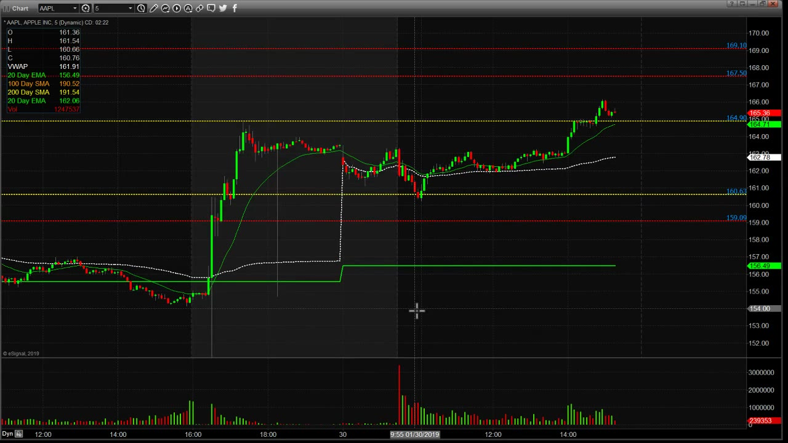

**图怎么看：**

- 图中显示了AAPL股票的日线图，包括5分钟周期的K线、移动平均线（MA）、成交量柱状图。
- 红色虚线表示短期移动平均线，绿色虚线表示长期移动平均线。
- 成交量柱的高度反映对应周期内的总成交量；红绿着色通常跟随价格柱的涨跌规则，不能直接拆成两种方向的主动成交。
- 股价在移动平均线上下波动，显示出市场趋势的变化。

### 关键内容

- 使用200日、100日和20日简单移动平均值（SMA），以及20日指数移动平均值（EMA）。
- 在5分钟图表上叠加日线移动平均值，可以更好地捕捉重大反转机会。
- 通过市场意识和重大水平的识别，可以提高交易决策的准确性。
- 使用日线移动平均值可以捕捉重大反转，如Facebook和WDC的例子所示。
- 需要额外编程来确保不同时间框架之间的移动平均值一致性。
- 利用日线移动平均值可以提高交易效率，减少切换时间框架的需要。
- 在快速时间框架下，可以更早地识别重大反转机会，如T的例子所示。
- 需要考虑交易股票的流动性，如INTC的例子所示。

### 分析与执行顺序

1. 讲师首先介绍了常用的移动平均值类型，包括200日、100日和20日SMA，以及20日EMA。
2. 然后展示了如何将这些移动平均值从日线图转移到5分钟图表上，以保持一致性。
3. 接着通过实际例子，如Facebook和WDC，展示了如何利用这些移动平均值捕捉重大反转机会。
4. 最后，讲师强调了需要额外编程来确保不同时间框架之间的移动平均值一致性。
5. 讲师还提到了需要考虑交易股票的流动性，以避免过度交易。

### 案例与细节

- 使用Apple股票，展示200日、100日和20日SMA，以及20日EMA的应用。
- 在Facebook股票上，展示如何利用100日SMA捕捉重大反转机会。
- 在WDC股票上，展示如何利用20日EMA捕捉重大反转机会。
- 在INTC股票上，展示如何利用100日SMA捕捉重大反转机会，并成功执行快速反向交易。

### 风险与边界

- 需要额外编程来确保不同时间框架之间的移动平均值一致性，这可能需要额外的时间和技术支持。
- 依赖特定交易平台（如E-Signal），其他平台可能无法实现相同功能。
- 需要考虑交易股票的流动性，过度交易可能导致资金损失。
- 录制于2019年，部分信息可能不再适用，需结合当前市场情况进行调整。

### 复盘问题

- 如何将日线移动平均值转移到5分钟图表上？
- 使用日线移动平均值捕捉重大反转机会的具体步骤是什么？
- 在实际交易中，如何平衡市场意识和重大水平的识别？

---

## v0556：大型股市场分析与交易策略

> 日期：2019-02-06　·　时长：00:47:17

**本场重点：** 分析当前市场环境，强调短期交易机会与长期趋势之间的平衡。

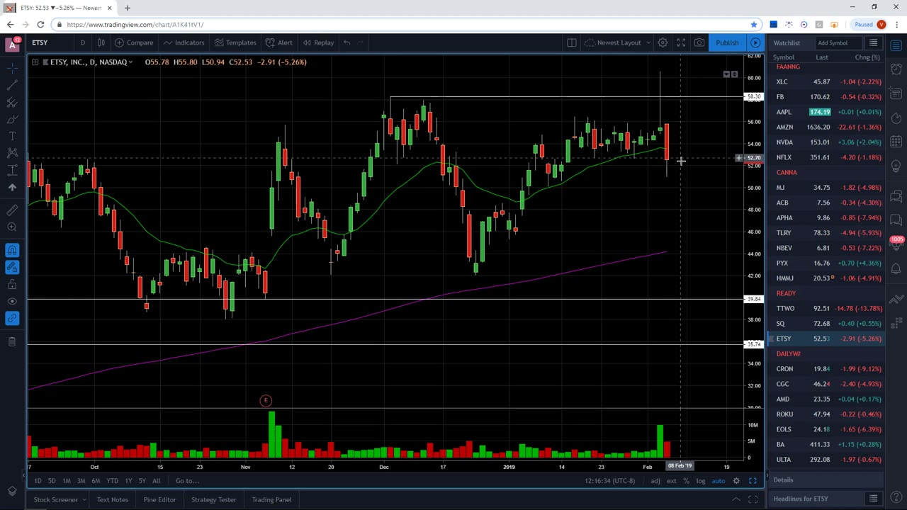

**图怎么看：**

- 在ETSY的图表中，可以看到一个明显的上升趋势，表明该股票在过去几个月内表现良好。
- 紫色的线代表了移动平均线，显示了股票价格的趋势，有助于识别潜在的买入或卖出信号。
- 成交量柱的高度反映对应周期内的总成交量；红绿着色通常跟随价格柱的涨跌规则，不能直接拆成两种方向的主动成交。
- 图表右侧的表格提供了其他股票的表现数据，帮助投资者进行多股票对比分析。

### 关键内容

- SPY自12月低点反弹17%，表明市场极度超买。
- SPY接近200移动平均线，形成重要阻力位。
- 近期市场波动加剧，预示未来可能的大幅波动。
- SPY和QQQ等指数面临重大阻力水平，偏向做空。
- 市场长期趋势不明朗，但短期内存在反转可能性。
- SQ和Etsy股票出现技术性回调，提供做空机会。
- TTWO股票出现三重底破局，形成日内交易机会。
- 市场环境要求更多耐心，倾向于短期交易。
- EOLS股票可能成为市场上涨的潜在对冲工具。
- 交易者需关注市场数据变化，以调整交易策略

### 分析与执行顺序

1. 回顾主要指数（如SPY）的表现，识别关键阻力位。
2. 分析SQ和Etsy股票的技术图表，寻找做空机会。
3. 评估TTWO股票的三重底形态，制定日内交易计划。
4. 监控市场数据变化，调整交易策略。
5. 根据市场情绪和数据，决定是否继续持有现有头寸。
6. 利用Trading View进行实时图表分析，监控关键支撑和阻力位。
7. 结合技术分析和市场情绪，制定短期交易策略

### 案例与细节

- SQ从12月低点回升后出现回调，表明市场超买。
- Etsy形成强劲的牛市旗形，随后出现反向突破，显示市场反转。
- TTWO在9281支撑位形成三重底，随后价格下跌，形成日内交易机会。
- EOLS股票因FDA批准而上涨，但需要市场支持才能进一步上涨。
- SQ股票价格跌破日高，表明市场超卖。
- TTWO股票价格在9150附近反弹，但最终未能突破，形成日内交易机会

### 风险与边界

- 市场长期趋势不确定，可能导致交易策略失效。
- 短期市场波动可能超出预期，增加交易风险。
- 市场数据变化可能影响交易决策，需持续关注。
- 交易策略基于历史数据，可能不适用于当前市场环境。
- 市场环境变化可能导致交易策略需要调整

### 复盘问题

- 当前市场的主要阻力位在哪里？
- SQ和Etsy股票的技术图表显示了哪些关键信号？
- TTWO股票的三重底形态如何影响日内交易策略？
- 市场数据变化如何影响交易决策？
- 如何根据市场情绪调整交易策略？

---

## v0557：期货交易策略与市场轮廓分析

> 日期：2019-02-20　·　时长：01:06:53

**本场重点：** 芝加哥交易员的生活方式，以及如何利用市场轮廓进行期货交易

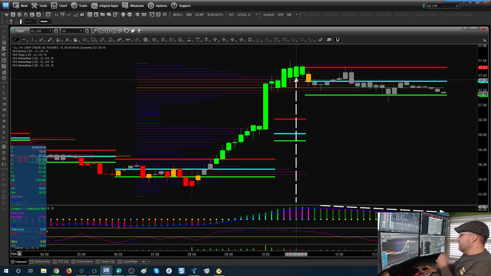

**图怎么看：**

- 图中显示了芝加哥商品交易所（CME）的期货合约，包括轻质原油期货（CL J19）。
- 图表上标有多个技术指标，如支撑位、阻力位、移动平均线等。
- 成交量柱的高度反映对应周期内的总成交量；红绿着色通常跟随价格柱的涨跌规则，不能直接拆成两种方向的主动成交。
- 水平线表示价格目标和止损点，帮助投资者制定交易策略。

### 关键内容

- 芝加哥交易员倾向于享受晚餐而不被打扰，反映了他们对工作的专注。
- 2019年1月加入Warrior Trading，同年2月上线新的期货交易聊天室，主要使用市场轮廓技术。
- 市场轮廓工具如TAS Navigator显示市场疲劳，不再可能维持快速上涨，提示交易者等待市场自行调整。
- 期货交易的优势包括简单会计、60-40税收优惠、日间交易规则鼓励日内交易，降低隔夜持仓成本。
- 市场轮廓软件TAS Market Profile适用于股票和期货交易，提供七种指标帮助分析市场趋势。
- 使用Trading View等平台进行统计分析，或手工记录市场进入、止损、笔记等。
- 最佳交易平台包括TradeStation、Daniel Trading、Thinkorswim等，适合不同需求。
- 早晨7-11点是活跃时段，但许多市场全天候交易，适合夜班工作者。
- 市场轮廓示例包括KNDI、ATVI、CBS等股票，识别支撑和阻力水平，制定交易策略。
- 关键指标包括动态轮廓（TAS Boxes）、价值区域（Value Area）、平衡区（Balance Zone）等。
- 芝加哥交易员的生活方式反映了他们对工作的高度专注，这种专注有助于他们在市场中取得成功。
- 市场轮廓工具如TAS Navigator能够帮助交易者识别市场的疲劳状态，从而避免过度交易，节省成本。
- 期货交易的优势在于其简单会计和税收优惠，这使得交易者能够更好地管理资金，提高盈利能力。
- 使用Trading View等平台进行统计分析，可以有效记录市场进入、止损和笔记，提高交易决策的准确性。
- 最佳交易平台的选择应根据个人需求，TradeStation、Daniel Trading和Thinkorswim等平台各有特色，适合不同投资者。

### 分析与执行顺序

1. 使用市场轮廓分析市场趋势，识别支撑和阻力水平。
2. 设置止损，保护交易，避免过早退出。
3. 观察市场突破关键水平，制定交易计划。
4. 使用TAS Market Profile Scanner快速筛选机会。
5. 使用Edge工具跟踪市场内部情况，显示S&P 500中股票的多空平衡状态。

### 案例与细节

- 玉米期货突破红色供应线，形成看涨交易，最终在380.5附近平仓，历时约一小时。
- KNDI、ATVI、CBS等股票使用市场轮廓分析，识别支撑和阻力水平，制定交易策略。
- TAS Market Profile Scanner是一种基于市场分析的快速筛选工具，帮助快速找到最看好的机会。
- Edge工具显示S&P 500中股票的多空平衡状态，帮助制定交易策略。
- 玉米期货突破红色供应线，形成看涨交易，最终在380.5附近平仓，历时约一小时，这表明市场轮廓分析能够准确预测市场走势。
- KNDI、ATVI、CBS等股票使用市场轮廓分析，识别支撑和阻力水平，制定交易策略，例如在支撑位买入，在阻力位卖出，以实现盈利。
- TAS Market Profile Scanner是一种基于市场分析的快速筛选工具，帮助快速找到最看好的机会，例如在特定价位买入或卖出，提高交易效率。
- Edge工具显示S&P 500中股票的多空平衡状态，帮助制定交易策略，例如在多头市场中增加仓位，在空头市场中减少仓位，以适应市场变化。

### 风险与边界

- 过早退出交易可能导致损失，未能充分利用市场波动，忽视技术信号。
- 市场轮廓分析依赖于正确识别支撑和阻力水平，错误判断可能导致亏损。
- 期货交易涉及实物商品，需注意市场流动性，避免流动性不足导致的交易困难。
- 录制于2018-2021年，平台、监管、税务和经纪商条件只能表述为历史录制内容。
- 过早退出交易可能导致损失，特别是在市场出现短暂波动时，交易者可能会错过潜在的盈利机会。
- 未能充分利用市场波动可能导致交易者错失盈利机会，特别是在市场出现大幅波动时，未能及时调整策略可能导致亏损。
- 市场轮廓分析依赖于正确识别支撑和阻力水平，错误判断可能导致亏损，特别是在市场出现意外波动时，交易者可能会做出错误的决策。
- 录制于2018-2021年，平台、监管、税务和经纪商条件只能表述为历史录制内容，因此在实际应用中可能需要考虑这些因素的变化。

### 复盘问题

- 如何使用市场轮廓工具识别市场疲劳并制定相应的交易策略？
- 哪些关键指标对于市场轮廓分析至关重要？
- 如何通过设置止损来保护交易并避免过早退出？
- 使用TAS Market Profile Scanner和Edge工具时需要注意哪些事项？

---

## v0558：使用斐波那契扩展工具识别长期交易

> 日期：2019-02-27　·　时长：00:52:46

**本场重点：** 讲解如何使用斐波那契扩展工具识别长期交易机会，强调基于成交量的策略。

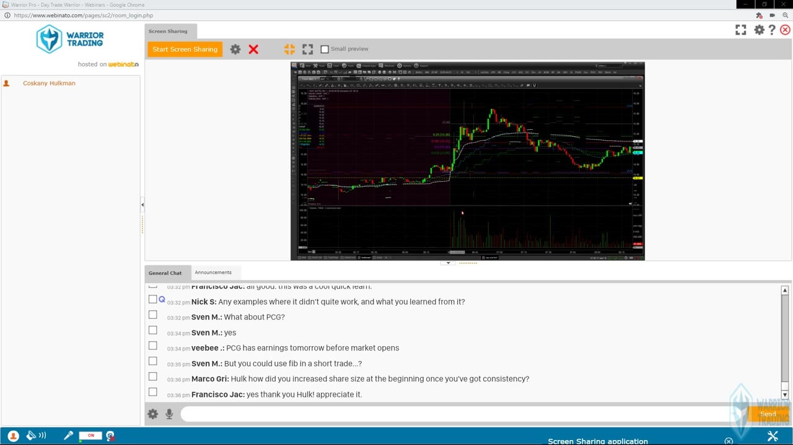

**图怎么看：**

- 在图表中可以看到多个斐波那契扩展水平线，这些水平线用于识别潜在的支撑和阻力位。
- 成交量柱的高度反映对应周期内的总成交量；红绿着色通常跟随价格柱的涨跌规则，不能直接拆成两种方向的主动成交。
- 图表中的趋势线和支撑阻力位有助于分析市场的长期趋势。
- 通过结合图表上的技术指标和成交量数据，可以更准确地识别长期交易机会。

### 关键内容

- 讲师使用斐波那契工具来识别长期交易机会，主要关注成交量。
- 在早晨高点后，等待成交量回调，而不是立即进入。
- 使用斐波那契工具来区分回调和真正的卖压。
- 在早晨高点附近设置止损，以确认长期趋势。
- 通过观察成交量的变化来识别潜在的交易机会。
- 使用斐波那契工具来确认长期交易的入场点。
- 在成交量增加时，确认长期交易的退出点。
- 使用斐波那契工具来识别长期交易的支撑位和阻力位。
- 在早晨高点附近设置斐波那契水平，以确认长期趋势。
- 使用斐波那契工具来识别长期交易的回调和反弹

### 分析与执行顺序

1. 讲师首先展示今天的交易策略，使用TNDM作为例子。
2. 使用斐波那契工具来识别早晨高点后的回调，而不是立即进入。
3. 等待成交量回调，确认长期趋势的方向。
4. 在早晨高点附近设置斐波那契水平，以确认长期趋势。
5. 使用斐波那契工具来区分回调和真正的卖压，确认长期交易的支撑位和阻力位。
6. 在成交量增加时，确认长期交易的退出点。
7. 通过观察成交量的变化来识别潜在的交易机会，确认长期交易的入场点

### 案例与细节

- ticker：TNDM；description：使用斐波那契工具识别早晨高点后的回调，等待成交量回调，确认长期趋势的方向。；price_changes：早晨高点后，成交量回调，确认长期趋势。；volume_changes：早晨高点后，成交量回调，确认长期趋势的方向。；fibonacci_levels：使用斐波那契工具识别早晨高点后的回调，确认长期趋势的方向。
- ticker：YELP；description：使用斐波那契工具识别早晨高点后的回调，等待成交量回调，确认长期趋势的方向。；price_changes：早晨高点后，成交量回调，确认长期趋势。；volume_changes：早晨高点后，成交量回调，确认长期趋势的方向。；fibonacci_levels：使用斐波那契工具识别早晨高点后的回调，确认长期趋势的方向。
- ticker：MNK；description：使用斐波那契工具识别早晨高点后的回调，等待成交量回调，确认长期趋势的方向。；price_changes：早晨高点后，成交量回调，确认长期趋势。；volume_changes：早晨高点后，成交量回调，确认长期趋势的方向。；fibonacci_levels：使用斐波那契工具识别早晨高点后的回调，确认长期趋势的方向。

### 风险与边界

- 使用斐波那契工具识别长期交易时，需要关注成交量的变化。
- 在早晨高点附近设置斐波那契水平时，需要确认长期趋势的方向。
- 录制年代限制，此策略适用于2018-2021年期间的市场环境。

### 复盘问题

- 如何使用斐波那契工具识别长期交易机会？
- 在早晨高点附近设置斐波那契水平时，如何确认长期趋势的方向？
- 如何通过观察成交量的变化来识别潜在的交易机会？

---

## v0559：战术止损的应用

> 日期：2019-03-06　·　时长：00:37:37

**本场重点：** 理解战术止损的重要性，掌握精准入场点和止损点，适用于快速变动的市场。

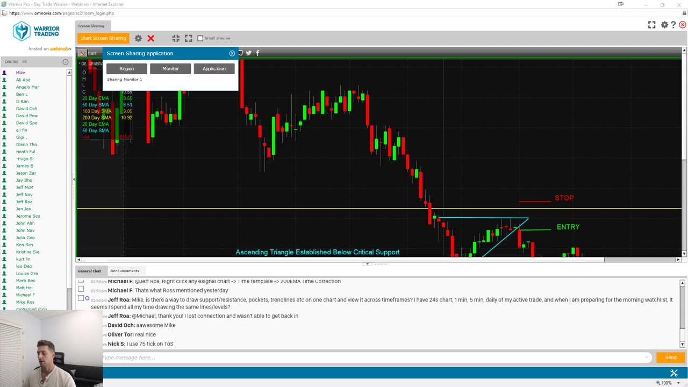

**图怎么看：**

- 共享屏幕中的主图显示一段下跌后的小型收敛结构，图上用青色线画出上沿和抬高的下沿，并直接标注ENTRY与STOP。
- ENTRY位于结构上沿突破附近，STOP放在整理下方的失效区域；黄色水平线提供更高一级的参考价位，体现入场和止损必须成对设计。
- 它直接对应“战术止损”：先用精确结构定义交易想法，再把止损放在想法被证伪的位置，而不是任意使用固定金额或情绪化退出。
- 示意线只表达课程当时的计划，不能保证突破后会延续；滑点、价差和快速波动仍可能让实际亏损大于图上的理论距离。

### 关键内容

- 使用快速时间框架（如24秒）来识别精准入场点和止损点。
- 在特斯拉股票的例子中，当股价突破关键支撑位后，等待三角形形成确认入场。
- 止损点通常位于关键支撑位之上，确保快速退出不利交易。
- 精准入场点和止损点的应用可以显著减少风险，提高交易效率。
- 在快速变动的市场中，使用快速时间框架可以更准确地识别入场和止损点。
- 止损点通常设置在关键支撑位之上，以避免被系统性止损机制影响。
- 通过识别三角形模式，可以更好地把握市场趋势，减少误判的风险。
- 在小盘股市场中，止损策略同样有效，但需要更加谨慎地监控市场变化。
- 利用快速时间框架进行交易，可以更快地识别入场和止损点，提高交易成功率。
- 在交易过程中，保持止损点的灵活性，根据市场变化及时调整止损位置

### 分析与执行顺序

1. 首先，使用快速时间框架（如24秒）来识别精准入场点和止损点。
2. 当股价突破关键支撑位后，等待三角形形成确认入场。
3. 一旦确认入场，设定止损点在关键支撑位之上，确保快速退出不利交易。
4. 在交易过程中，持续监控市场变化，及时调整止损位置。
5. 利用快速时间框架进行交易，可以更快地识别入场和止损点，提高交易成功率。
6. 在交易过程中，保持止损点的灵活性，根据市场变化及时调整止损位置

### 案例与细节

- 特斯拉股票在突破关键支撑位后，等待三角形形成确认入场，止损点设在关键支撑位之上。
- GE股票在突破200日移动平均线后，等待三角形形成确认入场，止损点设在关键支撑位之上。
- Garmin股票在突破三角形后，等待三角形形成确认入场，止损点设在关键支撑位之上。
- AMD股票在突破关键支撑位后，等待三角形形成确认入场，止损点设在关键支撑位之上。
- DLTR股票在突破三角形后，等待三角形形成确认入场，止损点设在关键支撑位之上

### 风险与边界

- 在快速变动的市场中，使用快速时间框架可能会增加误判的风险。
- 止损点设置在关键支撑位之上，可能会导致在市场波动较大时频繁触发止损。
- 在小盘股市场中，止损策略同样有效，但需要更加谨慎地监控市场变化。
- 录制年代限制为2019年，部分市场规则和操作环境可能已发生变化。
- 在交易过程中，保持止损点的灵活性，根据市场变化及时调整止损位置，以避免过度止损

### 复盘问题

- 在快速变动的市场中，如何确保精准入场点和止损点的有效性？
- 在使用快速时间框架进行交易时，如何避免误判的风险？
- 在小盘股市场中，如何应用止损策略以减少风险？
- 在交易过程中，如何根据市场变化及时调整止损位置？
- 在使用快速时间框架进行交易时，如何保持止损点的灵活性？

---

## v0560：夏季交易策略调整

> 日期：2019-03-07　·　时长：01:05:40

**本场重点：** 在夏季市场机会减少时，应调整交易策略以提高盈利比，降低止损频率。

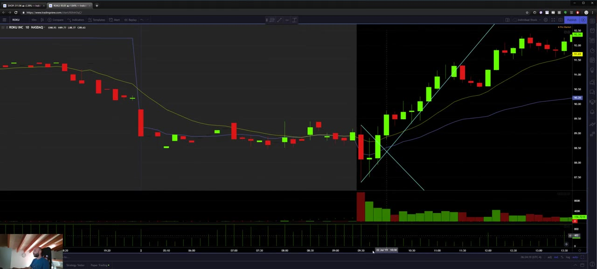

**图怎么看：**

- 价格动作在开盘前横向波动，开盘后价格动作变得不规则，继续观察确定方向。
- 在10:12时，当价格低于前一天的蜡烛线（黄色线）时，进行100美元的入场交易。
- 风险为1:1，目标利润为100美元，最大损失为100美元。
- 在盘中，所有利润目标都达到了1:1，最终在收盘时通过各种水平进行退出。

### 关键内容

- 6月份交易量和准确率有所下降，但盈利比有所提高。
- 夏季市场机会减少，需要更加谨慎地选择交易。
- 在低成交量时期，应更多关注长期趋势而非短期波动。
- 使用较大的时间框架（如10分钟）进行交易，可以更好地把握趋势。
- 在低成交量时期，应减少交易次数，避免频繁止损。
- 通过观察市场开盘后的走势，可以更好地判断趋势方向。
- 在低成交量时期，应更注重趋势延续而非立即获利。
- 夏季市场机会减少，需要调整交易心态，接受更高的失败率。
- 使用较小的风险水平（如50美分）进行交易，可以更好地控制风险。
- 在低成交量时期，应更注重长期趋势而非短期波动

### 分析与执行顺序

1. 回顾6月份的交易表现，包括交易量、准确率和盈利比。
2. 分析夏季市场机会减少的原因，以及如何调整交易策略。
3. 分享具体的交易案例，展示如何在低成交量时期进行交易。
4. 强调在低成交量时期，应更多关注长期趋势而非短期波动。
5. 提出使用较大的时间框架（如10分钟）进行交易的方法。
6. 总结夏季市场机会减少时的交易策略，包括减少交易次数和降低风险水平。
7. 鼓励学员根据自己的交易风格调整策略，接受更高的失败率

### 案例与细节

- 在AMD交易案例中，交易者等待市场开盘后15分钟再进行交易，最终未能继续上涨。
- 在Shop交易案例中，交易者在开盘价低于前一蜡烛的情况下进行短卖，最终成功获利。
- 在低成交量时期，使用较小的风险水平（如50美分）进行交易，可以更好地控制风险。
- 在低成交量时期，使用较大的时间框架（如10分钟）进行交易，可以更好地把握趋势。
- 在低成交量时期，交易者应更多关注长期趋势而非短期波动，以提高成功率

### 风险与边界

- 夏季市场机会减少，可能导致交易者频繁止损，影响整体收益。
- 使用较小的风险水平（如50美分）进行交易，可能无法适应市场波动。
- 在低成交量时期，过度依赖长期趋势可能导致错过短期获利机会。
- 交易策略调整需要时间适应，短期内可能无法立即见效。
- 录制年代限制，策略可能需要根据当前市场情况进行适当调整

### 复盘问题

- 在夏季市场机会减少时，您是如何调整交易策略的？
- 您在低成交量时期是如何选择交易标的的？
- 您是如何判断市场趋势方向的？

---

## v0561：突破交易与市场轮廓

> 日期：2019-03-20　·　时长：01:07:05

**本场重点：** 识别突破交易的关键步骤，包括资产选择、突破点和收盘价，以及如何利用市场轮廓进行交易。

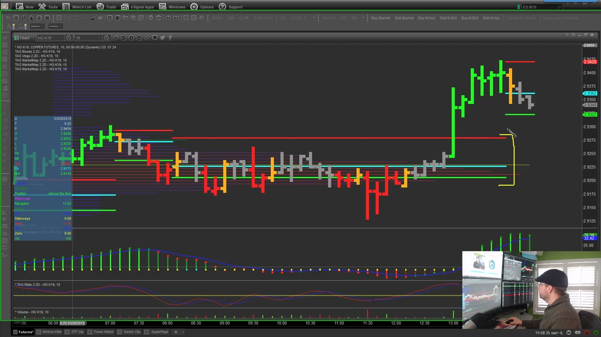

**图怎么看：**

- 在HG K19的图表中，可以看到一个明显的上升趋势。
- 红色箭头指示了突破点，表明价格可能正在突破阻力位。
- 绿色柱状图显示了成交量的变化，有助于理解市场的活跃程度。
- 水平线标记了支撑和阻力位，帮助投资者判断价格的潜在方向。

### 关键内容

- 市场轮廓通过聚集成交量来显示价格区域，帮助识别突破交易的机会。
- 突破交易通常发生在成交量出现陡峭下降的地方，表明市场情绪的变化。
- 资产选择、突破点和收盘价是确定突破交易的关键因素。
- 突破交易需要耐心等待，市场可能不会立即上涨，但最终会形成突破。
- 使用市场轮廓可以识别价值区域，这是交易者关注的重要区域。
- 突破交易策略需要结合市场轮廓和其他技术指标来提高准确性。
- 突破交易可能在不同资产类别中重复出现，如股票、期货和外汇。
- 突破交易策略需要考虑风险控制，确保止损位于合理位置。

### 分析与执行顺序

1. 首先，选择要交易的资产，如加拿大元。
2. 然后，识别突破点，即成交量出现陡峭下降的地方。
3. 接着，关注收盘价，确保它接近突破点。
4. 最后，设置止损，确保它位于合理位置，避免过度风险。
5. 使用市场轮廓工具可以帮助识别突破交易的机会。
6. 结合其他技术指标，如TAS导航器，可以进一步确认突破交易。
7. 在交易过程中，保持耐心，等待市场形成突破。

### 案例与细节

- 加拿大元期货市场，10分钟图表，显示突破交易策略的应用。
- E迷你S&P期货，10分钟图表，显示突破交易策略的应用。
- 黄金期货，显示突破交易策略的应用，但收盘价过高，不适合交易。
- 欧元期货，显示突破交易策略的应用，包括识别突破点和收盘价。
- 特斯拉股票，展示基于市场轮廓的突破交易策略，包括识别突破点和收盘价。

### 风险与边界

- 突破交易策略需要耐心等待，市场可能不会立即上涨，但最终会形成突破。
- 突破交易策略需要结合市场轮廓和其他技术指标来提高准确性。
- 突破交易策略需要考虑风险控制，确保止损位于合理位置。
- 突破交易策略的有效性取决于市场环境和交易者的判断力。

### 复盘问题

- 如何识别突破交易的关键步骤？
- 突破交易策略需要哪些技术指标？
- 如何结合市场轮廓和其他技术指标来提高突破交易的准确性？
- 突破交易策略的风险控制措施是什么？

---

## v0562：2019年3月交易回顾

> 日期：2019-03-27　·　时长：01:05:40

**本场重点：** 通过分析最佳和最差交易，强调持续性、风险控制和市场机会的重要性。

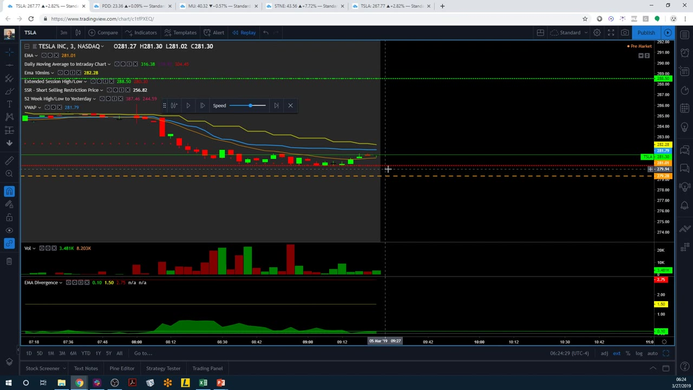

**图怎么看：**

- 特斯拉（TSLA）的价格在1分钟内经历了多次波动，显示出市场的活跃度。
- 成交量柱的高度反映对应周期内的总成交量；红绿着色通常跟随价格柱的涨跌规则，不能直接拆成两种方向的主动成交。
- 水平线标记了关键支撑位和阻力位，帮助投资者判断买卖时机。
- 图表右侧的时间轴显示了当前时间和历史时间点，便于观察价格趋势变化。

### 关键内容

- 最佳交易发生在特斯拉，利用三分钟开盘范围突破策略。
- 最佳交易显示出良好的预市低点和支撑位，以及后续的强劲下跌。
- 最佳交易的风险控制和目标设定非常明确，确保盈利。
- 最佳交易的盈利比例达到3.70:1，远高于预期。
- 最佳交易展示了如何利用市场波动进行短卖。
- 最佳交易的入场点和止损点设置合理，确保了高回报。
- 最佳交易的盈利来自于市场快速下跌后的回调。
- 最佳交易显示了如何利用市场波动进行短卖，特别是在特斯拉的三分钟开盘范围突破策略中，成功捕捉到了市场下跌。
- 最佳交易的风险控制和目标设定非常明确，确保了盈利，例如在特斯拉交易中，止损点设在280.5，目标点设在275.0，确保了高回报。
- 最佳交易的盈利比例达到了3.70:1，远高于预期，这表明了市场波动性带来的巨大收益潜力。
- 最佳交易展示了如何利用市场趋势和价格走势，例如在拼多多交易中，利用三分钟延续策略，成功捕捉到了市场下跌。
- 最佳交易的入场点和止损点设置合理，确保了高回报，例如在特斯拉交易中，入场点在279.1，止损点在280.5，目标点在275.0。

### 分析与执行顺序

1. 首先，回顾3月的整体交易表现，包括交易次数、准确率和利润损失比。
2. 然后，分析最佳交易的具体情况，包括入场点、止损点和目标点。
3. 接着，解释最佳交易背后的逻辑，包括市场趋势和价格走势。
4. 最后，总结最佳交易的关键要素，包括风险控制和目标设定。
5. 通过实际交易案例，展示如何利用市场波动进行交易。

### 案例与细节

- 在3月5日的特斯拉交易中，利用三分钟开盘范围突破策略，成功捕捉到市场下跌。
- 在3月13日的拼多多交易中，利用三分钟延续策略，成功捕捉到市场下跌。
- 在3月27日的MU科技交易中，利用三分钟旗形突破策略，成功捕捉到市场上涨。
- 最佳交易的盈利比例达到3.70:1，远高于预期。
- 最佳交易的入场点在279.1，止损点在280.5，目标点在275.0。
- 在特斯拉交易中，利用三分钟开盘范围突破策略，成功捕捉到市场下跌，显示了如何利用市场波动进行短卖。
- 在拼多多交易中，利用三分钟延续策略，成功捕捉到市场下跌，显示了如何利用市场趋势和价格走势进行交易。
- 在MU科技交易中，利用三分钟旗形突破策略，成功捕捉到市场上涨，显示了如何利用市场波动进行交易。
- 在特斯拉交易中，止损点设在280.5，目标点设在275.0，确保了高回报，显示了如何在交易中实现风险控制和目标设定。

### 风险与边界

- 市场波动性可能影响交易结果。
- 交易策略的有效性依赖于市场环境的变化。
- 交易策略的成功需要持续的市场机会。
- 市场波动性可能影响交易结果，例如在特斯拉交易中，如果市场没有按照预期下跌，可能会导致亏损。
- 交易策略的有效性依赖于市场环境的变化，例如在拼多多交易中，如果市场没有出现预期的下跌，可能会导致亏损。

### 复盘问题

- 最佳交易的入场点和止损点是如何确定的？
- 在交易过程中，如何判断市场趋势和价格走势？
- 如何在交易中实现风险控制和目标设定？

---

## v0563：大型股市场分析

> 日期：2019-04-03　·　时长：01:04:09

**本场重点：** 分析大型股市场趋势，识别短期交易机会，强调技术分析的重要性。

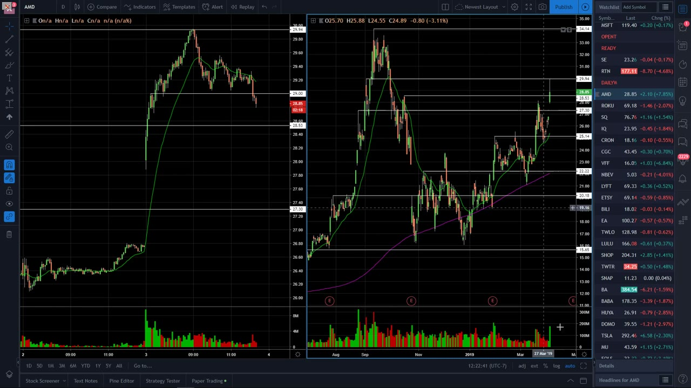

**图怎么看：**

- 在AMD的5分钟K线图中，可以看到价格从低点逐渐上升，形成一个上升趋势。
- 成交量柱的高度反映对应周期内的总成交量；红绿着色通常跟随价格柱的涨跌规则，不能直接拆成两种方向的主动成交。
- 图中的水平线可能表示支撑位或阻力位，帮助投资者判断价格是否突破这些关键水平。
- 通过观察K线形态和成交量变化，可以识别出潜在的短期交易机会。

### 关键内容

- SPY和QQQ均接近历史高点，表明市场可能面临回调压力。
- 市场接近超买状态，需警惕回调风险。
- Roku和CRON等股票表现出强劲的上涨趋势，但短期内缺乏明确的技术突破点。
- 使用趋势线分析来识别潜在的交易机会，如突破支撑位或阻力位。
- AMD和IQ等股票提供了短期交易机会，但需要等待确认信号。
- 使用三角形模式来识别潜在的反转趋势，如CRON的熊市三角形。
- 技术分析是识别交易机会的关键工具，但需谨慎管理风险。
- 市场接近历史高点，需关注宏观经济因素的影响。
- 使用技术指标（如趋势线）来识别潜在的交易机会，但需验证有效性。
- 短期交易机会通常依赖于即时市场反应，而非长期趋势

### 分析与执行顺序

1. 首先分析大型股市场的整体指数和市场情绪。
2. 识别关键支撑和阻力位，如SPY和QQQ的历史高点。
3. 使用趋势线分析来识别潜在的交易机会，如突破支撑位或阻力位。
4. 监控特定股票（如Roku、CRON、AMD、IQ）的表现，寻找短期交易机会。
5. 使用技术指标（如三角形模式）来识别潜在的反转趋势，如CRON的熊市三角形。
6. 结合技术分析和市场情绪，制定交易策略。
7. 持续监控市场动态，调整交易策略以应对变化

### 案例与细节

- SPY和QQQ分别距离历史高点约3%和2%，表明市场可能面临回调压力。
- Roku和CRON在短期内表现出强劲的上涨趋势，但缺乏明确的技术突破点，需等待确认信号。
- CRON在突破趋势线后迅速回调，显示技术分析的有效性。
- IQ在突破趋势线后形成有效的短交易机会，但需注意市场反应的不确定性。
- AMD在开盘时出现大幅上涨，但缺乏明确的技术突破点，需等待确认信号

### 风险与边界

- 市场接近历史高点，需警惕回调风险。
- 短期交易机会依赖于即时市场反应，存在不确定性。
- 技术分析的有效性依赖于市场数据的更新。
- 录制于2019年，部分市场条件和监管环境已发生变化。
- 技术指标的有效性依赖于市场数据的更新和确认

### 复盘问题

- 如何识别市场超买状态，并采取相应措施？
- 如何利用趋势线分析来识别潜在的交易机会？
- 如何评估特定股票（如Roku、CRON、AMD、IQ）的短期交易机会？
- 如何结合技术分析和市场情绪来制定交易策略？
- 如何管理短期交易中的风险？

---

## v0564：保守型交易者与激进型交易者的区别

> 日期：2019-05-08　·　时长：00:44:08

**本场重点：** 讨论了交易者在面对市场波动时的不同策略选择，以及如何根据自己的风险偏好调整交易方式。

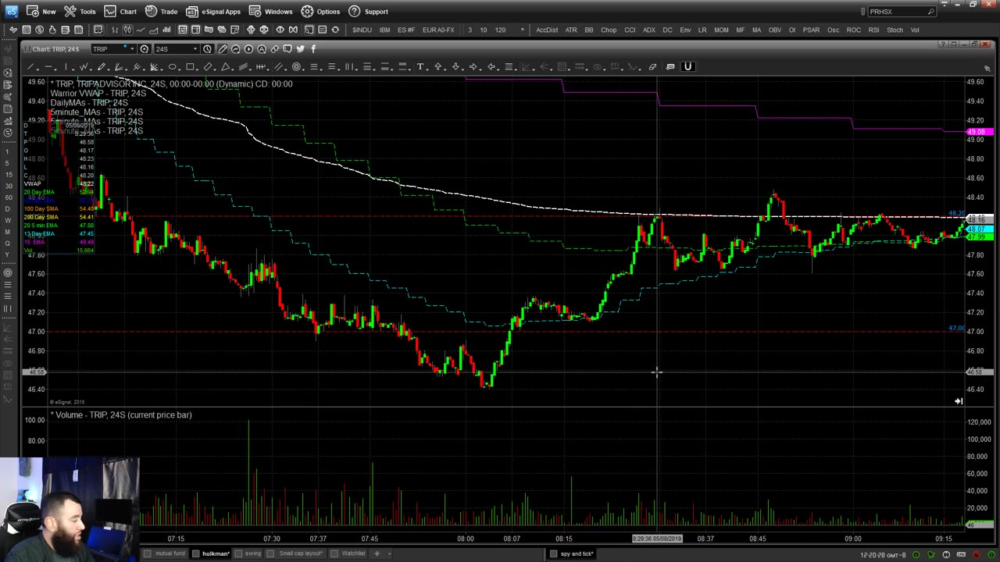

**图怎么看：**

- 这张图表显示了TRIP股票的价格走势，包括短期和长期均线。
- 红色柱状图表示当前价格的成交量，绿色柱状图表示未成交的订单。
- 图表上标有多个技术指标，如20日均线、100日均线等。
- 通过观察价格走势和均线，可以判断市场的趋势和支撑阻力位。

### 关键内容

- 讲师强调了保守型交易者和激进型交易者的不同策略，保守型交易者更注重安全进入点。
- 激进型交易者倾向于在突破点进行交易，但风险更高。
- 讲师提到自己从早期的激进型交易者转变为现在的保守型交易者。
- 保守型交易者通过降低风险来控制情绪，而激进型交易者则可能因快速决策而陷入困境。
- 讲师分享了如何通过改变P&L显示颜色来减少情绪波动的方法。
- 使用EMA指标来确定交易时机，特别是13EMA和20EMA的应用。
- 讲师提到自己在交易过程中的一些具体例子，包括如何利用三角形形态进行交易。
- 讲师强调了在不同市场环境下选择合适交易策略的重要性，特别是在财报季期间。
- 讲师分享了如何通过观察市场动向来决定是否继续持有某个交易头寸的方法。
- 讲师提到了如何通过调整交易策略来适应市场变化，特别是如何在不同市场条件下做出决策

### 分析与执行顺序

1. 讲师首先介绍了保守型交易者和激进型交易者的区别，强调了保守型交易者更注重安全进入点。
2. 然后，讲师通过具体的交易实例展示了如何应用保守型交易策略，包括如何利用价格支撑和阻力。
3. 接着，讲师分享了自己从激进型交易者转变为保守型交易者的经历，强调了控制情绪的重要性。
4. 讲师进一步解释了如何通过改变P&L显示颜色来减少情绪波动，从而更好地控制交易过程。
5. 最后，讲师总结了如何根据市场环境和自身风险偏好来选择合适的交易策略，并分享了一些具体的交易经验。
6. 在整个过程中，讲师多次强调了交易者需要根据自己的风险偏好来调整交易策略，以适应不同的市场环境。

### 案例与细节

- 在一次交易中，讲师使用了Trip图表，通过三角形形态进行交易，最终成功地实现了目标利润。
- 讲师提到自己曾经在一次交易中，因为急于追涨而损失了大量资金，这让他意识到控制情绪的重要性。
- 在另一个交易中，讲师通过观察市场动向，决定在某个价位卖出，从而避免了更大的损失。
- 讲师分享了一个具体的交易案例，他在一次交易中使用了13EMA和20EMA指标，成功地抓住了市场趋势。
- 在一次交易中，讲师通过观察市场动向，决定在某个价位卖出，从而避免了更大的损失。

### 风险与边界

- 讲师提到自己在交易过程中可能会因为情绪波动而做出错误的决策，这需要通过不断练习来克服。
- 由于讲师的经验主要基于过去几年的市场环境，因此在当前市场环境下可能需要进行适当调整。
- 讲师提到的交易策略可能在不同市场环境下效果不同，需要根据实际情况灵活调整。
- 讲师提到的交易策略主要基于个人经验，可能不适用于所有交易者，需要根据个人情况进行调整。

### 复盘问题

- 讲师提到的保守型交易策略有哪些具体的应用场景？
- 如何通过改变P&L显示颜色来减少情绪波动？
- 在实际交易中，如何根据市场环境选择合适的交易策略？
- 讲师提到的交易策略在当前市场环境下是否仍然适用？
- 如何通过观察市场动向来决定是否继续持有某个交易头寸？

---

## v0565：中级交易课程：2019年5月15日

> 日期：2019-05-15　·　时长：01:09:50

**本场重点：** 讲师分析了波音（BA）的三重底部破位形态和BYND的最佳表现IPO之一

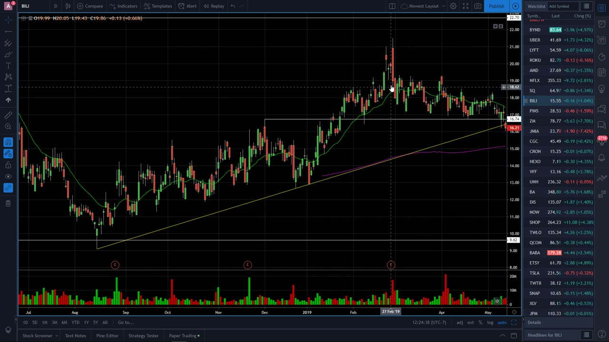

**图怎么看：**

- 波音（BA）的三重底部破位形态显示市场对该公司的信心正在恢复。
- BYND（波音旗下的子公司）在最佳表现IPO之一，显示出其潜在价值。
- 通过观察这些图表，可以更好地理解市场对波音和BYND的信心变化。
- 这些图表提供了重要的技术分析线索，帮助投资者做出明智的投资决策。

### 关键内容

- 讲师认为市场整体呈牛市趋势，从12月低点以来未出现超过2-3%的回调，表明市场强劲。
- 波音（BA）的三重底部破位形态显示出市场尝试保持在该水平，最终随整体市场下跌，导致BA下跌至336。
- LYFT的牛旗形态表明该股票自IPO后大幅下跌，但开始反弹并形成横向整理，市场开盘时股票下跌，错过交易机会。
- BYND的盘整突破强调正确时机的重要性，以管理风险并获得有利交易。
- 特斯拉（Tesla）虽然形成牛旗形态，但不是短期高波动股票，更像是一种长期趋势。
- Zoom股票已经从IPO价格上涨100%，目前在形成一个看涨的整理形态，但股价日内曾低至$72，当前价格$79并不吸引人。
- 熊旗形态与牛旗相似，只是方向相反，例如Netflix股票中的熊旗形态。
- 342.47支撑水平多次测试显示是一个强支撑位，未来可能成为做空的机会。
- 讲师强调了技术分析的重要性，尽管偶尔会进行一些基本面研究，但技术分析提供了更好的交易优势。
- 讲师分享了自己交易经历，从$500账户到$32,000的转变，强调了小额账户交易的挑战和进展

### 分析与执行顺序

1. 讲师首先分析了市场整体趋势，指出市场呈牛市趋势，未出现大幅回调。
2. 接着分析了波音（BA）的三重底部破位形态，指出市场尝试保持在该水平，最终随整体市场下跌。
3. 然后关注LYFT的牛旗形态，指出该股票自IPO后大幅下跌，但开始反弹并形成横向整理。
4. 讲师进一步分析了BYND的盘整突破，强调正确时机的重要性，以管理风险并获得有利交易。
5. 最后，讲师总结了大型股市场的分析，并准备进行学生交易审查，分享了Zoom股票的技术分析和342.47支撑水平的重要性。
6. 讲师还讨论了熊旗形态的特点，指出它与牛旗相似，只是方向相反。

### 案例与细节

- 波音（BA）的三重底部破位形态，最终随整体市场下跌，导致BA下跌至336。
- LYFT的牛旗形态，自IPO后大幅下跌，但开始反弹并形成横向整理。
- BYND的盘整突破，强调正确时机的重要性，以管理风险并获得有利交易。
- 特斯拉（Tesla）虽然形成牛旗形态，但不是短期高波动股票，更像是一种长期趋势。
- Zoom股票已经从IPO价格上涨100%，目前在形成一个看涨的整理形态，但股价日内曾低至$72，当前价格$79并不吸引人。
- 342.47支撑水平多次测试显示是一个强支撑位，未来可能成为做空的机会。

### 风险与边界

- 讲师提到的市场条件和股票表现基于2019年的市场情况，可能不再适用当前市场。
- 市场条件和股票表现受到多种因素影响，包括经济环境、政策变化和技术进步等。
- 技术分析的有效性取决于市场条件和投资者情绪的变化。
- 交易策略的成功依赖于市场条件和投资者情绪的变化，这些因素难以预测。

### 复盘问题

- 如何识别市场整体趋势，并据此制定交易策略？
- 如何利用技术分析工具识别股票的关键支撑和阻力水平？
- 如何在市场波动中找到正确的交易时机？
- 如何结合技术分析和基本面分析制定交易策略？
- 如何应对市场条件和股票表现变化带来的不确定性？

---

## v0566：大型股票市场分析与交易策略

> 日期：2019-06-05　·　时长：01:12:38

**本场重点：** 讲师强调了技术分析和正确入场的重要性，指出时间框架的选择对成功至关重要。

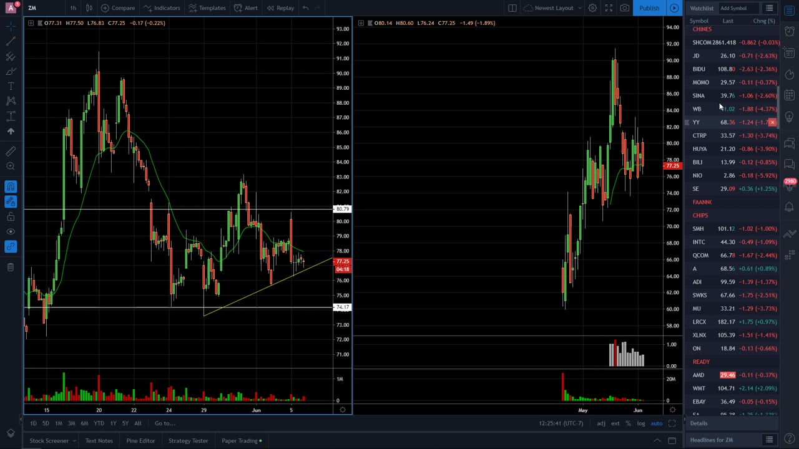

**图怎么看：**

- 整体界面显示了多个股票的图表和数据，包括时间框架选择。
- 实际可见的ticker包括ZM、TMO等，展示了不同股票的价格走势。
- 画面信息对应本场主题，强调了技术分析和正确入场的重要性。
- 这张截图不能单独证明什么，需要结合其他信息进行综合判断。

### 关键内容

- 讲师分析了大型股票市场的多个资产，包括黄金、比特币、原油、债券和利率等。
- 他特别关注了天然气价格的技术性波动和零售业ETF（XRT）的短期交易机会。
- 讲师指出，虽然他不经常交易指数，但对XRT感兴趣，因为它近期形成了熊市整理形态。
- 对于中国股票，讲师提到SH Comp已经触底反弹，但预计未来可能继续下跌。
- 讲师特别关注了科技股AMD和WMT，认为AMD表现相对强劲，正在形成突破。
- 讲师强调了技术分析和正确入场的重要性，指出时间框架的选择对成功至关重要。
- 讲师提到了期权交易中的时间衰减问题，并建议通过精确的入场来规避这一风险。
- 讲师建议学生成为趋势交易者而非反转交易者，因为趋势交易更简单且更容易实现长期稳定盈利。
- 讲师分析了CY和INTC的走势，认为CY接近历史高位，而INTC短期内不会考虑。
- 讲师举例说明大笔交易可能影响股价，但最终股价仍可能下跌，表明大笔交易不一定能推动股价上涨。
- 讲师指出，天然气价格的技术性波动反映了供需变化，投资者需密切关注这些波动以捕捉交易机会。
- 讲师强调，零售业ETF（XRT）的短期交易机会基于熊市整理形态，这表明市场可能处于调整阶段，适合短线交易。
- 讲师提到，使用ETF（如yin或yang）来追踪中国市场的方法，可以有效分散风险并简化交易流程。
- 讲师分析了科技股AMD和WMT的技术走势，认为技术分析是制定交易策略的重要工具，需结合图表和指标进行判断。
- 讲师指出，时间框架的选择对成功至关重要，不同时间框架下的技术指标和信号可能有所不同，需灵活运用。

### 分析与执行顺序

1. 讲师首先介绍了大型股票市场的多个资产，特别关注了黄金、比特币、原油、债券和利率等。
2. 他进一步分析了天然气价格和技术性波动，以及零售业ETF（XRT）的短期交易机会。
3. 讲师指出，虽然他不经常交易指数，但对XRT感兴趣，因为它近期形成了熊市整理形态。
4. 对于中国股票，讲师提到SH Comp已经触底反弹，但预计未来可能继续下跌。
5. 讲师特别关注了科技股AMD和WMT，认为AMD表现相对强劲，正在形成突破。
6. 讲师强调了技术分析和正确入场的重要性，指出时间框架的选择对成功至关重要。
7. 讲师提到了期权交易中的时间衰减问题，并建议通过精确的入场来规避这一风险。

### 案例与细节

- 讲师提到SH Comp已经触底反弹，但预计未来可能继续下跌。
- 对于科技股AMD，讲师认为它在其他芯片股票普遍下跌的情况下表现相对强劲，且正在形成突破。
- 讲师分析了CY在重大亏损后的走势，预计股价将继续下跌，缺乏明确的支撑点。
- 讲师举例说明大笔交易可能影响股价，但最终股价仍可能下跌，表明大笔交易不一定能推动股价上涨。
- 讲师提到，SH Comp已经触底反弹，但预计未来可能继续下跌，这表明市场情绪和基本面的变化会影响股价走势。
- 对于科技股AMD，讲师认为它在其他芯片股票普遍下跌的情况下表现相对强劲，且正在形成突破，这显示了技术分析的重要性。
- 讲师分析了CY在重大亏损后的走势，预计股价将继续下跌，缺乏明确的支撑点，这说明技术分析需要结合具体情况进行判断。

### 风险与边界

- 讲师提到的市场条件和策略基于2019年的市场情况，可能不适用于当前市场。
- 讲师建议的趋势交易策略需要结合当前市场情况进行调整。
- 讲师提到的某些资产和技术指标可能已经发生变化，需要实时监控。
- 讲师提到的某些交易机会可能已经错过，需要灵活调整交易计划。
- 讲师提到的市场条件和策略基于2019年的市场情况，可能不适用于当前市场，投资者需注意市场变化。
- 讲师建议的趋势交易策略需要结合当前市场情况进行调整，否则可能会面临较大的风险。
- 讲师提到的某些资产和技术指标可能已经发生变化，需要实时监控，否则可能导致交易失误。

### 复盘问题

- 讲师分析了哪些资产和技术指标？
- 讲师为什么建议成为趋势交易者而非反转交易者？
- 讲师提到了哪些具体的交易机会和风险？
- 讲师是如何利用技术分析来制定交易策略的？

---

## v0567：大型股市场分析与学生交易审查

> 日期：2019-06-19　·　时长：01:01:10

**本场重点：** 分析GE和EA股票，强调技术分析的重要性；提供黄金ETF（GLD）的长期交易机会。

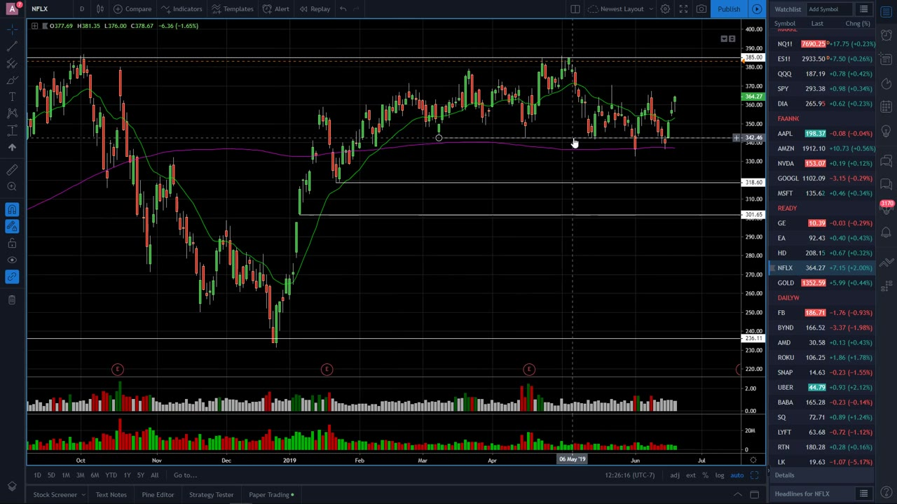

**图怎么看：**

- 这张图表显示了GE和EA股票的技术分析，展示了它们的价格走势和成交量。
- GE股票在图表中显示出一个上升趋势，而EA股票则显示出一个下降趋势。
- 成交量柱的高度反映对应周期内的总成交量；红绿着色通常跟随价格柱的涨跌规则，不能直接拆成两种方向的主动成交。
- 通过观察这些图表，可以分析出股票的趋势和潜在的投资机会。

### 关键内容

- GE股票近期表现强劲，但突破1049水平后出现反转，显示了技术分析的重要性。
- EA股票在91水平附近显示出支撑，但突破此水平将引发进一步下跌，需谨慎对待。
- 黄金ETF（GLD）形成看涨形态，预示未来可能有强劲上涨趋势。
- SRPT股票成功突破，展示了技术分析的有效性。
- GE股票的交易策略包括使用止损和观察价格行动，以决定是否继续持有。
- EA股票的交易策略依赖于支撑和阻力水平，以及趋势线的突破。
- GLD作为黄金的替代品，提供了长期交易的机会，适合进行技术分析。
- GE股票的交易策略需要谨慎管理，避免在突破失败时继续持有。
- EA股票的交易策略需要密切关注支撑和阻力水平，以确定最佳入场时机。

### 分析与执行顺序

1. 分析GE股票的近期表现，强调技术分析的重要性。
2. 回顾EA股票的支撑和阻力水平，以及趋势线的突破情况。
3. 分享SRPT股票的成功突破，展示技术分析的有效性。
4. 讨论GE股票的交易策略，包括使用止损和观察价格行动。
5. 解释EA股票的交易策略，依赖于支撑和阻力水平，以及趋势线的突破。
6. 介绍GLD作为黄金的替代品，提供长期交易的机会，适合进行技术分析。
7. 总结GE和EA股票的交易策略，强调技术分析的重要性。

### 案例与细节

- GE股票近期表现强劲，但突破1049水平后出现反转，显示了技术分析的重要性。
- EA股票在91水平附近显示出支撑，但突破此水平将引发进一步下跌，需谨慎对待。
- 黄金ETF（GLD）形成看涨形态，预示未来可能有强劲上涨趋势。
- SRPT股票成功突破，展示了技术分析的有效性。
- GE股票的交易策略包括使用止损和观察价格行动，以决定是否继续持有。
- EA股票的交易策略依赖于支撑和阻力水平，以及趋势线的突破。

### 风险与边界

- GE股票的交易策略需要谨慎管理，避免在突破失败时继续持有。
- EA股票的交易策略需要密切关注支撑和阻力水平，以确定最佳入场时机。
- GLD作为黄金的替代品，提供了长期交易的机会，适合进行技术分析。

### 复盘问题

- GE股票的交易策略是什么？如何管理风险？
- EA股票的交易策略是什么？如何确定最佳入场时机？
- GLD作为黄金的替代品，提供了哪些长期交易机会？

---

## v0568：交易社区的重要性

> 日期：2019-06-26　·　时长：00:38:20

**本场重点：** 强调建立交易社区对个人成长的帮助，指出需要找到可以信赖的第二双眼睛。

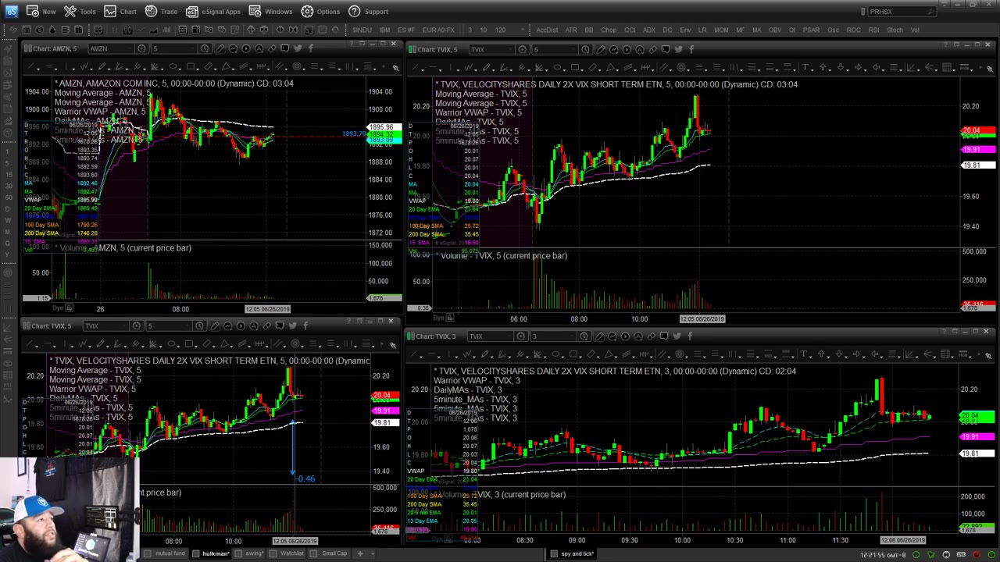

**图怎么看：**

- 画面中，可以看到TVIX的每日波动情况，显示了其价格在不同时间段内的变化。
- 成交量柱的高度反映对应周期内的总成交量；红绿着色通常跟随价格柱的涨跌规则，不能直接拆成两种方向的主动成交。
- 图中还显示了多个均线（MA），帮助分析价格趋势。
- 通过观察这些图表，投资者可以更好地理解市场动态并做出决策。

### 关键内容

- 交易者容易忽视自己的错误，需要外部视角来纠正。
- 建立交易社区可以提供第二双眼睛，帮助发现自己的不足。
- 交易者可以通过社区获得不同视角，避免确认偏差。
- 交易圈内的导师和同伴提供了宝贵的经验分享。
- 交易者可以通过社区获得情感支持，重建信心。
- 交易者需要找到一个可以信赖的人，无论是配偶还是同行。
- 交易者可以通过社区了解自己的交易风格，找到最适合自己的策略。
- 交易者需要意识到自己的情绪波动会影响决策。
- 交易者可以通过社区学习如何降低风险，保持交易策略。
- 交易者需要认识到每个人的学习曲线不同，需要耐心适应新策略

### 分析与执行顺序

1. 讲师首先介绍了交易社区的重要性，强调了建立关系的意义。
2. 然后分享了自己在交易圈的经历，如何通过社区获得帮助。
3. 接着讲述了如何通过社区发现自己的错误，并获得不同视角。
4. 进一步解释了如何通过社区获得情感支持，重建信心。
5. 最后总结了交易者需要寻找可以信赖的人，无论是配偶还是同行。
6. 通过社区，交易者可以更好地了解自己的交易风格，找到最适合自己的策略。
7. 交易者需要认识到每个人的学习曲线不同，需要耐心适应新策略。
8. 交易者需要学会如何降低风险，保持交易策略，避免过度交易。
9. 交易者需要意识到自己的情绪波动会影响决策，需要保持冷静。
10. 交易者可以通过社区获得不同视角，避免确认偏差，提高决策质量

### 案例与细节

- 讲师提到自己曾有过过度交易的问题，但通过社区的帮助，能够及时发现并改正。
- 讲师分享了自己在交易圈中遇到的一位朋友，通过交流发现自己的低点突破策略存在问题。
- 讲师提到自己曾在一个月内连续亏损，但在寻求社区帮助后，成功重建了信心。
- 讲师提到自己在交易圈中遇到了一位朋友，通过交流发现自己的交易策略存在缺陷。

### 风险与边界

- 录制年代限制，信息可能不再适用于当前市场环境。
- 交易者需要意识到市场环境的变化，及时调整策略。
- 交易者需要认识到社区成员的水平参差不齐，需要独立判断。
- 交易者需要意识到社区提供的信息仅供参考，不能完全依赖。
- 交易者需要认识到社区提供的信息可能受到网络环境的影响

### 复盘问题

- 交易者如何通过社区获得不同视角，避免确认偏差？
- 交易者如何通过社区获得情感支持，重建信心？
- 交易者如何通过社区了解自己的交易风格，找到最适合自己的策略？
- 交易者如何通过社区学习如何降低风险，保持交易策略？
- 交易者如何通过社区发现自己的错误，并及时改正？

---

## v0569：Uber股价突破与风险管理

> 日期：2019-07-10　·　时长：01:10:17

**本场重点：** 作者通过分析Uber股价突破与风险管理策略，提出在大型风险回报交易中锁定部分利润的重要性。

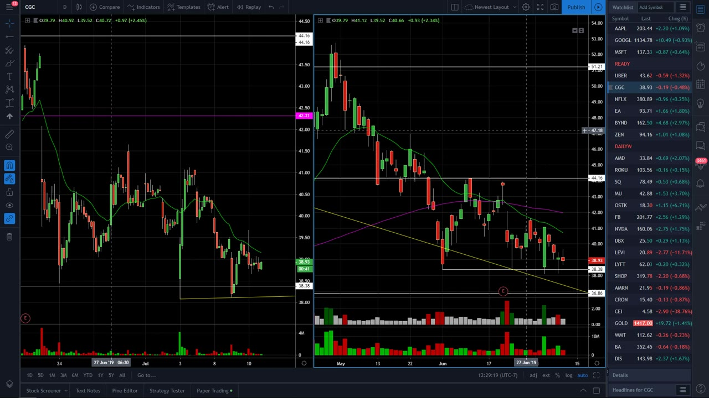

**图怎么看：**

- 图 B 显示了 CGC 股价在 2019 年 6 月 27 日突破关键水平，表明股价可能进入上升趋势。
- 投资者可以考虑在股价突破时进行买入操作，并在达到目标价位时锁定部分利润。
- 此图有助于理解如何通过技术分析来识别潜在的买入机会和风险管理策略。
- 在大型风险回报交易中，锁定部分利润是非常重要的，以减少潜在的损失。

### 关键内容

- 作者注意到Uber在$45水平形成了一个三重顶突破，预期股价会突破历史高点。
- 作者认为Uber在IPO后大部分时间处于上升趋势，因此预期在第三次测试$45水平时可能会突破。
- 作者在6月27日买入了7月5日到期的$47看涨期权，目标是$50价格水平。
- 选择$47看涨期权是因为它仍然$2虚值，如果股价达到$50，这些期权将变得有利可图。
- 作者的风险回报比是50%的风险换取300%的最大收益。
- 作者在聊天室中分享了Uber在47以上看涨，在46以下看跌的观点。
- 作者建议在大型风险回报交易中，至少锁定一半的100%利润目标。
- 作者认为发生了牛市陷阱，股价迅速反转，表明卖压大于买压。
- 作者建议在突破失败时，应考虑卖出，而不是尝试反转交易。
- 作者认为Netflix在385水平附近突破的可能性不大，因为接近财报日期。
- 作者观察到Uber在$45水平形成了一个三重顶突破，预期股价会突破历史高点，这表明市场情绪高涨，但需要谨慎确认突破的有效性。
- 作者认为Uber在IPO后大部分时间处于上升趋势，因此预期在第三次测试$45水平时可能会突破，这反映了市场对公司的长期看好，但也存在回调风险。
- 作者在6月27日买入了7月5日到期的$47看涨期权，目标是$50价格水平，这显示了作者利用期权进行投机的策略，但需注意期权的时效性和市场波动性。
- 选择$47看涨期权是因为它仍然$2虚值，如果股价达到$50，这些期权将变得有利可图，这说明作者利用期权的杠杆效应放大收益，但也增加了风险。
- 作者的风险回报比是50%的风险换取300%的最大收益，这表明作者追求高风险高回报的投资风格，但需警惕市场波动带来的不确定性

### 分析与执行顺序

1. 作者首先观察到Uber在$45水平形成了一个三重顶突破。
2. 基于Uber在IPO后的上升趋势，作者预期股价会在第三次测试$45水平时突破。
3. 作者在6月27日买入了7月5日到期的$47看涨期权，目标是$50价格水平。
4. 作者分享了Uber在47以上看涨，在46以下看跌的观点，以指导其他交易者。
5. 作者建议在大型风险回报交易中，至少锁定一半的100%利润目标，以降低风险。
6. 当股价迅速反转时，作者认为发生了牛市陷阱，表明卖压大于买压。
7. 作者建议在突破失败时，应考虑卖出，而不是尝试反转交易，以避免进一步损失。

### 案例与细节

- Uber在$45水平形成了一个三重顶突破。
- 作者在6月27日买入了7月5日到期的$47看涨期权。
- 选择$47看涨期权是因为它仍然$2虚值，如果股价达到$50，这些期权将变得有利可图。
- 作者在聊天室中分享了Uber在47以上看涨，在46以下看跌的观点。
- 作者认为Netflix在385水平附近突破的可能性不大，因为接近财报日期。
- 当Facebook股价从开盘价大幅上涨并在一天内持续上涨时，应密切关注，因为它可能形成可交易的技术模式，这里形成了一个牛市旗形整理，第四次测试后突破了趋势线，此时应考虑买入，止损设在前一个枢轴低点197.50，这展示了如何利用技术形态进行交易。
- 作者在6月27日买入了7月5日到期的$47看涨期权，目标是$50价格水平，如果股价达到$50，这些期权将变得有利可图，这说明了如何利用期权进行投机，但需注意期权的时效性和市场波动性。
- 作者认为Netflix在385水平附近突破的可能性不大，因为接近财报日期，这反映了财报日期对股价的影响，但需注意财报结果的不确定性

### 风险与边界

- 作者提到的牛市陷阱可能在实际操作中无法准确识别，导致错误的交易决策。
- 作者建议的锁定部分利润策略可能在市场波动较大时效果不佳。
- 作者的分析基于历史数据，当前市场条件可能与过去有所不同。
- 作者提到的Trade Station和LightSpeed的佣金优惠仅适用于特定时间段。
- 作者提到的牛市陷阱可能在实际操作中无法准确识别，导致错误的交易决策，特别是在市场情绪高涨时，投资者容易忽视潜在的回调风险。
- 作者建议的锁定部分利润策略可能在市场波动较大时效果不佳，特别是在市场出现大幅波动时，锁定利润可能导致错过进一步的盈利机会。
- 作者的分析基于历史数据，当前市场条件可能与过去有所不同，特别是在经济环境发生变化时，过去的分析可能不再适用。
- 作者提到的Trade Station和LightSpeed的佣金优惠仅适用于特定时间段，投资者需注意这些优惠可能在年底结束，影响交易成本

### 复盘问题

- 作者是如何根据Uber的历史走势预测其股价突破的？
- 作者提出的锁定部分利润策略的具体操作步骤是什么？
- 作者是如何判断发生牛市陷阱的？
- 作者建议的卖出策略在实际操作中可能面临哪些风险？

---

## v0570：建立交易计划的重要性

> 日期：2019-07-17　·　时长：00:51:18

**本场重点：** 交易计划能减少情绪影响，提高交易成功率；但计划本身并非保证盈利。

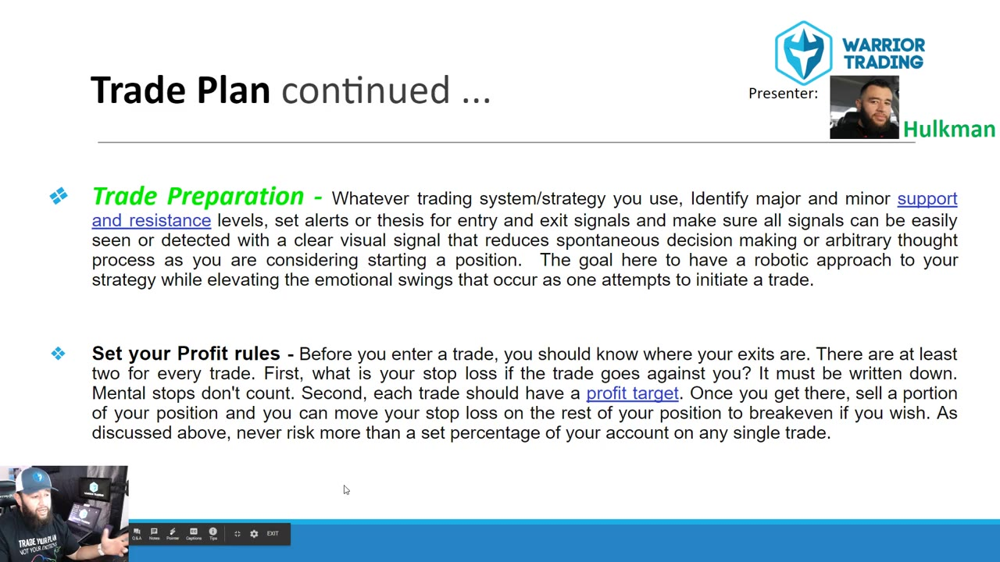

**图怎么看：**

- 幻灯片标题为“Trade Plan continued...”，第一段Trade Preparation要求识别支撑阻力、催化剂、交易信号和市场质量，再决定是否启动交易。
- 第二段Set your Profit rules要求在入场前知道退出位置，并让利润目标明显大于计划风险，同时把单笔风险限制在账户可承受范围。
- 这张图把交易计划从口号变成前置清单：分析环境、定义触发、设定仓位与止损、写下盈利规则，然后才执行订单。
- 风险收益比是计划工具而不是盈利承诺；若流动性、滑点或市场环境改变，原目标可能不可达，计划必须允许按失效条件退出。

### 关键内容

- 交易计划是制定交易策略前的重要步骤，有助于减少情绪波动。
- 交易计划应包括个人评估、风险分析和目标设定等要素。
- 交易计划有助于保持交易者在长期目标上的专注。
- 交易计划可以减少因情绪驱动而做出的错误决策。
- 交易计划需要提前制定，而非在交易时临时决定。
- 交易计划应包含技术支撑和阻力水平，以及止损点。
- 交易计划应考虑市场波动性变化，调整交易策略。
- 交易计划有助于避免因情绪驱动而过早退出。
- 交易计划应结合个人心理状态进行评估。
- 交易计划需要持续更新和改进，以适应市场变化。

### 分析与执行顺序

1. 讲师首先定义了交易计划的概念及其重要性。
2. 然后，讲师详细介绍了交易计划应包含的内容，如个人评估、风险分析和目标设定。
3. 接着，讲师通过实际案例展示了如何应用交易计划。
4. 最后，讲师强调了交易计划的持续性和灵活性，以适应市场变化。

### 案例与细节

- 在一次交易中，讲师注意到自己没有充分休息，因此调整了交易规模。
- 在一次交易中，讲师使用了技术图表来确定止损点和目标价格。
- 在一次交易中，讲师根据市场波动性调整了交易策略，以避免情绪驱动的决策。
- 在一次交易中，讲师通过自我评估发现了自己的情绪波动，并相应地调整了交易计划。
- 在一次交易中，讲师使用了百分比止损和目标价格来管理风险和收益。

### 风险与边界

- 交易计划的有效性取决于交易者的执行力和市场环境的变化。
- 交易计划可能无法完全避免情绪驱动的决策，特别是在市场波动较大时。
- 交易计划需要定期更新，以适应市场变化和交易者的心理状态。
- 交易计划的制定和执行是在2019年的背景下进行的，可能不适用于当前的市场环境。

### 复盘问题

- 交易计划中应包含哪些关键要素？
- 如何确保交易计划能够有效减少情绪波动？
- 在制定交易计划时，如何考虑市场波动性变化？

---

## v0571：大型股市场分析与交易策略

> 日期：2019-08-07　·　时长：01:01:31

**本场重点：** 分析了市场修正后的交易机会，强调了宏观事件对市场的影响。

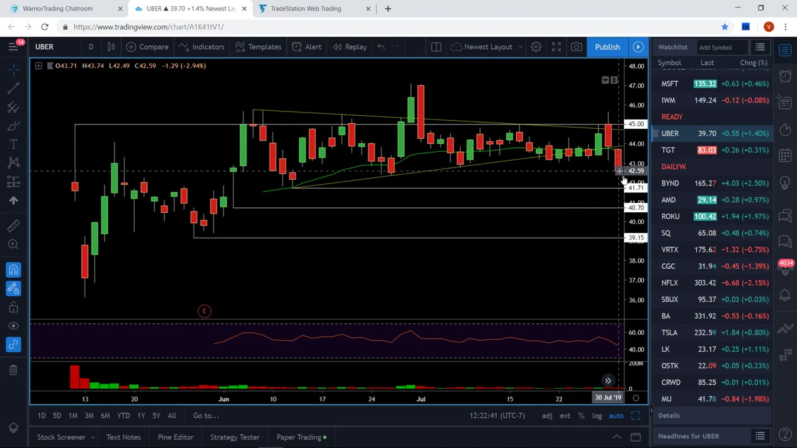

**图怎么看：**

- 在 AMZN 的日线图中，可以看到价格在不同时间段内的波动情况。
- 图中显示了多个水平线，可能代表支撑位和阻力位。
- 成交量柱状图显示了不同时间段的买卖活动。
- 整体来看，这张图提供了关于市场趋势和潜在交易机会的信息。

### 关键内容

- 市场修正后，利率下调成为卖新闻事件，表明市场预期已被消化。
- 通过分析市场趋势线和支撑位，可以识别潜在的交易机会。
- 使用技术分析工具（如Trading View）来监控市场动态。
- 在市场修正期间，抓住短期交易机会需要耐心和正确的入场时机。
- 特朗普提高关税加剧了市场波动，影响了市场情绪。
- 通过分析每日和小时图表，可以更好地理解市场的支撑和阻力。
- 使用止损和止盈策略来管理风险，确保在正确的时间退出交易。
- 长期交易策略需要耐心和对市场趋势的深入理解。
- 通过模拟交易和纸币练习，逐步建立实际交易的信心。
- 市场修正后，利用技术分析工具识别潜在的交易机会，如Uber股票的反弹

### 分析与执行顺序

1. 回顾了过去几周的市场情况，特别是利率下调的预期和实际结果。
2. 分析了市场修正期间的图表，识别了关键支撑位和阻力位。
3. 讨论了如何利用技术分析工具（如Trading View）来监控市场动态。
4. 分享了如何在市场修正期间抓住短期交易机会，包括使用止损和止盈策略。
5. 强调了耐心和正确入场时机的重要性，以避免被市场波动影响。
6. 通过具体的例子，展示了如何识别和利用市场修正期间的交易机会。
7. 讨论了如何通过模拟交易和纸币练习来逐步建立实际交易的信心

### 案例与细节

- 在利率下调后，市场出现了修正，导致股票价格下跌，交易者通过购买看跌期权获利。
- Uber股票在修正期间表现出强劲的反弹，交易者通过分析图表识别了支撑位和阻力位。
- 通过Trading View应用，跟踪了市场动态，识别了关键支撑位和阻力位，从而制定交易策略。
- 在市场修正期间，交易者通过分析每日和小时图表，识别了潜在的交易机会，如Uber股票的反弹。
- 通过模拟交易和纸币练习，逐步建立实际交易的信心，确保在正确的时间退出交易

### 风险与边界

- 录制于2019年，市场环境和交易规则可能已发生变化。
- 交易策略的有效性取决于市场环境的变化，需要持续监控。
- 使用止损和止盈策略可以有效管理风险，但市场波动可能导致亏损。
- 模拟交易和纸币练习有助于建立信心，但在实际交易中仍需谨慎

### 复盘问题

- 在市场修正期间，如何识别潜在的交易机会？
- 如何使用止损和止盈策略来管理风险？
- 模拟交易和纸币练习对实际交易有何帮助？

---

## v0572：七月交易回顾

> 日期：2019-08-07　·　时长：01:00:10

**本场重点：** 交易量减少，但准确率和收益比显著提高；需谨慎设置止损，避免频繁触发。

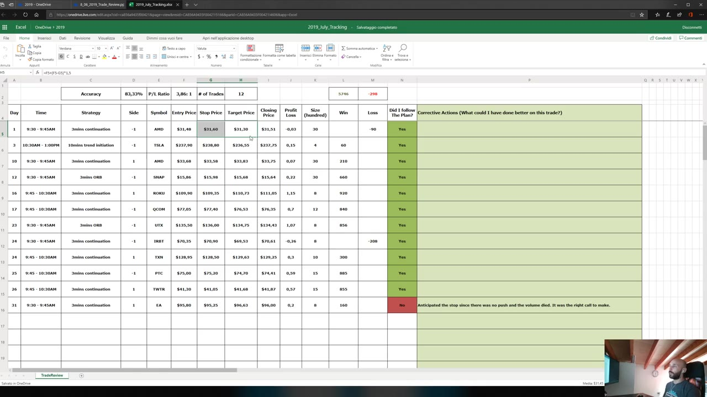

**图怎么看：**

- 这张截图显示了交易记录和策略分析，包括交易日期、策略名称、入场价格、止损价格、目标价格等详细信息。
- 通过这些数据，可以评估交易的成功率和收益情况，以及在不同时间段内的表现。
- 截图还提供了关于如何改进交易策略的建议，例如调整止损点以减少损失。
- 整体来看，这张截图提供了一个全面的交易回顾，有助于学习和改进交易技巧。

### 关键内容

- 七月交易量仅为0.6次/天，低于以往月份，符合夏季市场特点。
- 尽管交易量减少，但准确率高达83%，远超以往月份。
- 收益比显著提高，达到24:1，远高于基准的2.1:1。
- 交易量减少的原因是市场机会较少，尤其是非财报季。
- 设置止损时应谨慎，避免过紧的止损导致频繁触发。
- 交易策略应注重趋势确认，避免过早入场。
- 市场情绪波动对交易决策影响较大，需谨慎对待。
- 交易量减少并不意味着交易质量下降，反而可能更稳健。
- 交易策略应灵活调整，适应市场变化。
- 交易量减少可能是市场机会较少所致，而非交易策略失败

### 分析与执行顺序

1. 分析七月交易数据，包括交易次数、准确率和收益比。
2. 回顾交易策略，强调趋势确认的重要性。
3. 讨论交易量减少的原因，主要是市场机会较少。
4. 强调设置止损时应谨慎，避免频繁触发。
5. 分享交易策略，包括如何选择合适的时间段进行交易。
6. 讨论市场情绪对交易决策的影响。
7. 总结交易经验，强调交易策略的灵活性

### 案例与细节

- ticker：Roku；date：2019年1月8日；action：做空；entry_time：9:00 AM；entry_price：125.66；exit_time：9:47 AM；exit_price：125.70
- ticker：TTWO；date：2019年8月6日；action：做空；entry_time：9:37 AM；entry_price：125.66；exit_time：9:47 AM；exit_price：125.70
- ticker：AMD；date：2019年7月；action：做空；entry_time：9:45 AM；entry_price：30.16；target_price：31.00

### 风险与边界

- 交易量减少可能是因为市场机会较少，而非交易策略失败。
- 设置过紧的止损可能导致频繁触发，影响交易体验。
- 市场情绪波动对交易决策影响较大，需谨慎对待。
- 交易策略应灵活调整，适应市场变化。
- 交易量减少并不意味着交易质量下降，反而可能更稳健。
- 交易策略应注重趋势确认，避免过早入场。

### 复盘问题

- 你在交易过程中是如何设置止损的？
- 你如何判断市场是否进入趋势阶段？
- 你在交易过程中遇到哪些挑战？
- 你如何调整交易策略以适应市场变化？
- 你在交易过程中有哪些成功的经验和教训？

---

## v0573：交易规模管理

> 日期：2019-08-14　·　时长：01:06:59

**本场重点：** 思考大目标但不等于大交易规模；逐步增加交易规模以适应经验增长；保持灵活性避免过度自信。

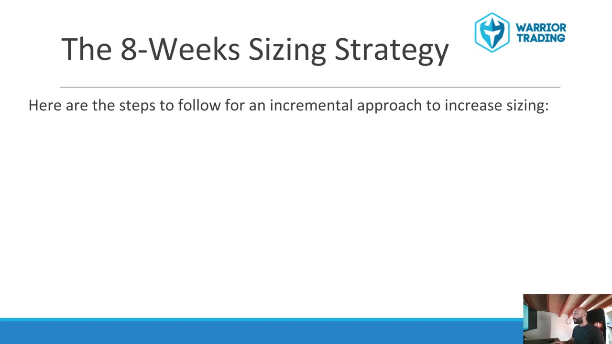

**图怎么看：**

- The image shows a trader using TradingView to analyze stock charts, which is relevant to the topic of trading strategy and risk management.
- The trader is likely following the 8-Weeks Sizing Strategy mentioned in the previous slide, focusing on setting appropriate risk amounts for trades.
- The platform provides tools like EMA periods and max risk amount settings, which are crucial for managing trading risks effectively.
- By analyzing the chart and adjusting parameters, the trader can better understand market trends and make informed decisions.

### 关键内容

- 思考大目标是激励和动力来源，但并不意味着要进行大规模交易。
- 设定明确的止损和止盈目标，有助于控制情绪影响。
- 逐步增加交易规模，基于经验增长和结果改善。
- 保持灵活性，避免过度自信导致的风险。
- 使用技术指标和价格范围来衡量潜在风险。
- 在早期阶段专注于延续性交易，以简化风险计算。
- 对于大型股票，使用突破或撤出策略应在开盘后前几分钟内。
- 根据资本和最大风险设定交易规模，但不应依赖单一股票价格。
- 避免使用跟踪止损，因为它可能限制盈利机会。
- 逐步增加交易规模的方法可以提高长期盈利能力

### 分析与执行顺序

1. 首先，确定初始交易规模，确保心理上能够承受。
2. 设定最终目标交易规模，基于个人风险偏好。
3. 每周评估交易表现，根据规则遵守情况调整交易规模。
4. 使用技术指标和价格范围来衡量潜在风险，确保决策一致性。
5. 在早期阶段专注于延续性交易，以简化风险计算和管理。
6. 对于大型股票，使用突破或撤出策略应在开盘后前几分钟内。
7. 根据资本和最大风险设定交易规模，但不应依赖单一股票价格

### 案例与细节

- 例如，假设初始交易规模为$50，每周增加8%，在第八周结束时，交易规模将增加到约$100。
- 使用13 EMA和蜡烛体长度来衡量潜在风险，以及支持或阻力水平之间的距离。
- 在JD股票上进行模拟，当突破10分钟蜡烛时，使用突破或撤出策略，但发现这可能导致过早退出。
- 使用Trading View上的自定义指标来衡量实际交易规模，基于13 EMA和蜡烛体长度。
- 在大型股票上使用突破或撤出策略，但在开盘后20-25分钟内，这可能变得不那么有效

### 风险与边界

- 过度自信可能导致快速增加交易规模，从而带来情绪波动。
- 依赖单一股票价格可能忽略其他影响因素，如相对成交量。
- 使用跟踪止损可能限制盈利机会，尤其是在趋势交易中。
- 录制于2019年，部分指标和方法可能需要更新以适应当前市场环境

### 复盘问题

- 如何确定初始交易规模？
- 在哪些情况下使用突破或撤出策略更为有效？
- 如何根据资本和最大风险设定交易规模？

---

## v0574：LED股票交易策略

> 日期：2019-08-21　·　时长：00:58:07

**本场重点：** 使用RSI指标识别LED股票的买卖时机，强调在60和70水平的重要性。

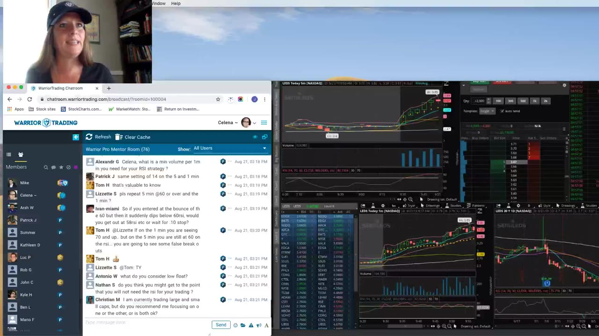

**图怎么看：**

- 界面把 LED 的价格图与 RSI 放在同一观察区，并在下方保留 Level 2 和 Time & Sales，形成从技术背景到即时成交的多层信息。
- 课程特别观察 RSI 的 60 与 70 区域，但这些水平只能描述当时的相对动量，不能脱离趋势与价格结构直接定义买卖信号。
- Level 2 用于查看各价位挂单与价差；挂单可以撤销，因此需要对照 Time & Sales 中实际成交的位置和速度。
- 这张静态截图无法还原指标变化、撤单和成交的先后关系；执行时还应明确触发条件、失效点、仓位和最大可承受滑点。

### 关键内容

- LED股票具有低浮动和低市值的特点，适合短期交易。
- RSI指标被用来识别股票的相对强度和趋势。
- 60和70水平是判断股票是否具有持续上升潜力的关键。
- RSI指标显示股票在60以上时具有较强的上升动力。
- 当RSI指标从60水平回落时，表明股票可能进入调整期。
- 在60水平附近进行交易时需要谨慎，避免过度追涨。
- RSI指标在一天中的不同时间点表现不同，需要灵活应用。
- 使用RSI指标结合其他技术指标可以提高交易决策的准确性。
- 在60水平附近进行交易时，需要关注成交量的变化。
- RSI指标在不同时间框架下的表现可能有所不同，需要综合考虑

### 分析与执行顺序

1. 首先，观察LED股票的价格走势，确认其在60水平附近波动。
2. 使用RSI指标来评估股票的相对强度，确认其是否具有上升趋势。
3. 当RSI指标突破60水平时，确认股票具有较强的上升动力。
4. 在60水平附近进行交易时，需要关注成交量的变化，确认是否有足够的买盘支持。
5. 当RSI指标从60水平回落时，确认股票可能进入调整期，需要及时退出。
6. 结合其他技术指标，如Bollinger带，进一步确认交易信号的可靠性。
7. 在交易过程中，密切关注市场动态，及时调整交易策略

### 案例与细节

- LED股票在一天中的价格波动较大，最高达到73，最低跌至77。
- 当RSI指标突破60水平时，确认股票具有较强的上升动力，随后价格继续上涨。
- 当RSI指标从60水平回落时，确认股票可能进入调整期，随后价格开始下跌。
- 在60水平附近进行交易时，需要关注成交量的变化，确认是否有足够的买盘支持。
- 结合Bollinger带指标，确认股票价格在60水平附近波动时的稳定性。
- 当RSI指标突破70水平时，确认股票具有极强的上升动力，随后价格继续上涨

### 风险与边界

- RSI指标在不同时间框架下的表现可能有所不同，需要综合考虑。
- 在60水平附近进行交易时，需要关注成交量的变化，避免过度追涨。
- 当RSI指标从60水平回落时，确认股票可能进入调整期，需要及时退出。
- RSI指标在一天中的不同时间点表现不同，需要灵活应用。
- 在使用RSI指标时，需要结合其他技术指标，以提高交易决策的准确性。
- 录制年代限制，此策略适用于2019年的市场环境，可能需要根据当前市场情况进行调整

### 复盘问题

- 在60水平附近进行交易时，如何确认是否有足够的买盘支持？
- 当RSI指标从60水平回落时，如何确认股票可能进入调整期？
- 结合哪些其他技术指标可以提高交易决策的准确性？

---

## v0575：TradingView 编码进阶

> 日期：2019-08-28　·　时长：01:14:16

**本场重点：** 讲解如何在TradingView中绘制50日EMA，并讨论了如何使用大小指导器来控制风险。

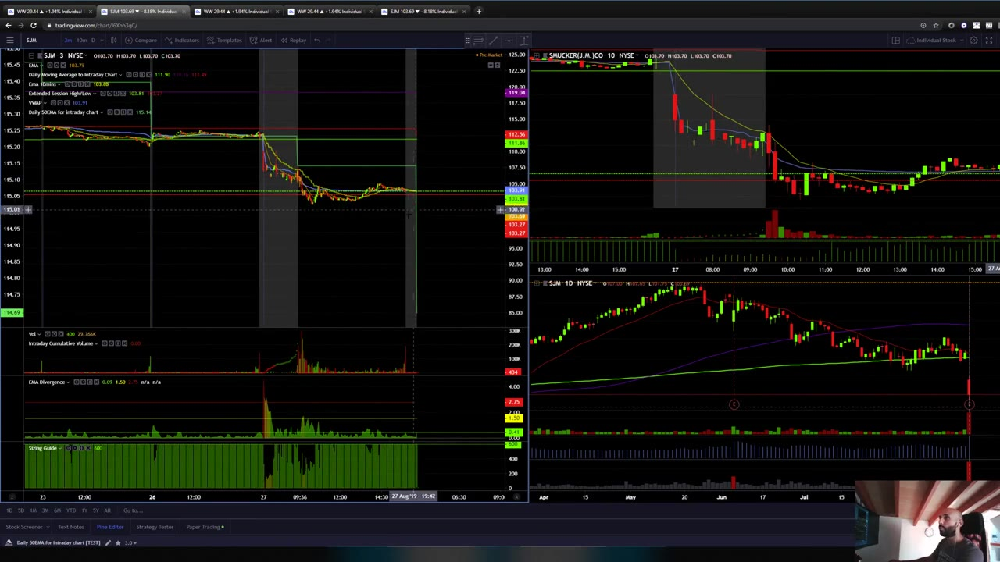

**图怎么看：**

- 图表显示了WeightWatchers International Inc.（股票代码：WW）在2019年5月14日至2019年6月18日期间的交易情况。
- 可以看到股价在图表中的波动，包括上升趋势和下降趋势。
- 成交量柱显示了不同时间段内的买卖活动。
- 图表上还显示了50日EMA（指数移动平均线），用于分析价格趋势和确认潜在的买入或卖出信号。

### 关键内容

- 讲师首先介绍了如何将50日EMA从日线图绘制到5分钟图。
- 使用了PineScript语言进行编程，强调了如何定义变量和函数。
- 通过设置指标的样式和输入参数，可以自定义指标的功能。
- 讲解了如何使用大小指导器来确定交易的大小。
- 强调了使用绝对值显示指标的重要性，以节省空间。
- 讨论了如何根据股票价格范围调整最大交易量。
- 展示了如何使用低高值来帮助理解交易前后的大小变化。
- 强调了使用最新版本的脚本的重要性，以获得更好的功能。
- 指出了一些平台限制，如无法直接从外部脚本获取值。
- 分享了如何通过复制粘贴代码来实现多个指标的功能

### 分析与执行顺序

1. 讲师首先打开TradingView界面，展示如何创建一个新的指标。
2. 定义了所需的变量，包括EMA周期和引用的证券ID。
3. 编写了绘制50日EMA的代码，并设置了线条宽度和颜色。
4. 保存并测试代码，确保没有错误。
5. 将绘制好的指标添加到图表中，并调整其位置。
6. 讲解了如何使用大小指导器来确定交易的大小，包括设置最大风险金额。
7. 展示了如何通过调整输入参数来改变指标的显示方式，如绝对值和百分比显示。
8. 演示了如何使用低高值来帮助理解交易前后的大小变化，以做出更明智的决策

### 案例与细节

- 使用了Apple股票的日线图，绘制了50日EMA。
- 通过设置不同的输入参数，展示了如何改变指标的显示方式。
- 使用了低高值来帮助理解交易前后的大小变化，例如在突破前一个蜡烛的高点时。
- 通过设置最大风险金额，展示了如何使用大小指导器来确定交易的大小。
- 使用了不同股票的价格范围来调整最大交易量，如超过100美元的股票。
- 通过复制粘贴代码，展示了如何实现多个指标的功能，如EMA收敛和大小指导器

### 风险与边界

- 由于录制于2019年，部分功能可能已更新或改变。
- 使用低高值时，需要确保当前蜡烛的低点与之前的蜡烛高点相匹配。
- 使用绝对值显示指标时，需要确保不会占用过多的空间。
- 使用大小指导器时，需要确保最大风险金额设置正确，否则可能导致过度交易

### 复盘问题

- 如何通过代码实现50日EMA的绘制？
- 如何使用大小指导器来确定交易的大小？
- 如何通过设置输入参数来自定义指标的功能？
- 使用低高值时需要注意什么？
- 如何确保使用最新版本的脚本以获得更好的功能？

---

## v0576：W-Day和TNDM的期权交易策略

> 日期：2019-09-04　·　时长：01:08:41

**本场重点：** 在预期突破时选择合适的期权类型，以避免时间衰减的风险。

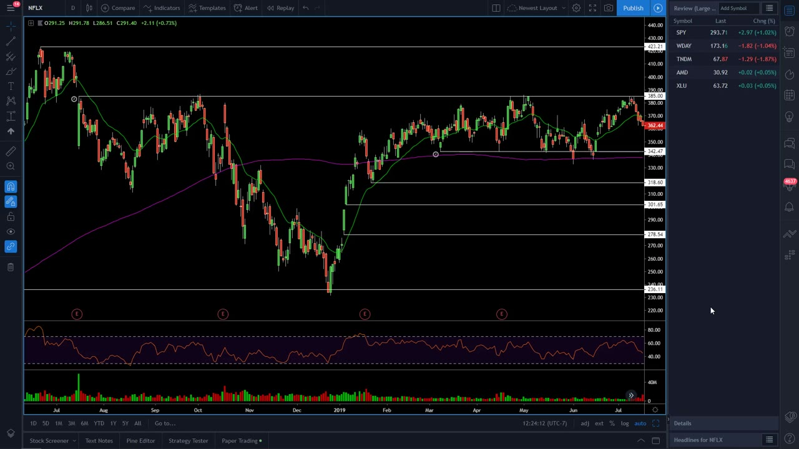

**图怎么看：**

- 在预期突破时选择合适的期权类型，以避免时间衰减的风险。
- 通过观察NFLX的期权价格，可以判断当前市场情绪和潜在的交易机会。
- 使用Level 2和Time & Sales数据可以帮助识别市场的买卖压力。
- 结合图表中的均线和K线形态，可以更准确地预测期权的价格走势。

### 关键内容

- W-Day形成重要整合区间（19460-18311），在财报发布后测试了这些水平。
- 分析师认为突破可能性大，但开盘价波动大，可能需要等待一分钟确认价格走势。
- TNDM即将突破三条趋势线之一，分析师预计突破方向为上行。
- 整合区间为（X-3点趋势线），若突破成功，目标价为75-80。
- 讲师建议在预期没有强劲突破时，应购买实值期权以避免时间衰减的风险。
- SPY的285呼叫期权当前价格约为9美元，远低于294美元的股价，这表明期权交易具有成本优势。
- 如果预期有强劲突破，可以考虑购买实值或虚值期权；如果没有预期突破，则应购买实值期权。
- 确认交易时，不需要等待蜡烛收盘，而是根据价格行为来判断。
- 使用技术分析工具，如趋势线和双底模式来确认交易机会。
- W-Day似乎正在突破一个小型整理区间，显示了强烈的下降趋势。
- 分析师认为W-Day突破可能性大，但需关注开盘价波动，这表明市场情绪不稳定。
- TNDM即将突破三条趋势线之一，分析师预计突破方向为上行，这表明市场存在积极动能。
- 使用技术分析工具，如趋势线和双底模式，可以更准确地确认交易机会，提高交易成功率。
- 实值期权交易可以替代股票交易，因为它们主要基于内在价值，减少了交易成本，适合长期持有。
- 在确认交易时，根据价格行为而非等待蜡烛收盘，可以更快地执行交易，减少市场波动带来的影响。

### 分析与执行顺序

1. 等待开盘后确认突破方向，采用破位或止损心态。
2. 若开盘价在整合区间内，可尝试突破上方或下方。
3. 标记上行趋势线，等待第四次突破。
4. 若突破成功，目标价为75-80。
5. 若突破失败，需及时止损。

### 案例与细节

- W-Day形成重要整合区间（19460-18311），在财报发布后测试了这些水平。
- TNDM即将突破三条趋势线之一，分析师预计突破方向为上行。
- SPY的285呼叫期权当前价格约为9美元，远低于294美元的股价。
- 使用技术分析工具，如趋势线和双底模式来确认交易机会。
- W-Day的股价在财报发布后形成了重要整合区间（19460-18311），分析师认为突破可能性大，这表明市场情绪和基本面因素共同作用。
- TNDM即将突破三条趋势线之一，分析师预计突破方向为上行，这表明市场存在积极动能，投资者可以考虑买入实值或虚值期权。
- SPY的285呼叫期权当前价格约为9美元，远低于294美元的股价，这表明期权交易具有成本优势，适合长期持有。

### 风险与边界

- 开盘价波动大，可能需要等待一分钟确认价格走势。
- 若突破失败，需及时止损。
- 若W-Day突破失败，需及时止损，这可能导致资金损失，提醒投资者注意风险管理。
- 开盘价波动大，可能需要等待一分钟确认价格走势，这可能导致错过最佳交易时机，提醒投资者耐心等待。
- 若突破失败，需及时止损，这可能导致资金损失，提醒投资者注意市场波动带来的风险。
- 使用技术分析工具时，需注意市场环境变化，否则可能导致分析失效，提醒投资者持续关注市场动态。

### 复盘问题

- 在W-Day的整合区间内，如何判断突破方向？
- 如果预期没有强劲突破，应该选择哪种类型的期权？
- 如何利用技术分析工具来确认交易机会？
- 在确认交易时，为什么不需要等待蜡烛收盘？

---

## v0577：大型股指数分析与交易策略

> 日期：2019-09-11　·　时长：00:58:55

**本场重点：** 分析大型股指数以确定市场趋势，利用关键支撑和阻力位进行交易，但需注意市场不一定总是跟随这些指标。

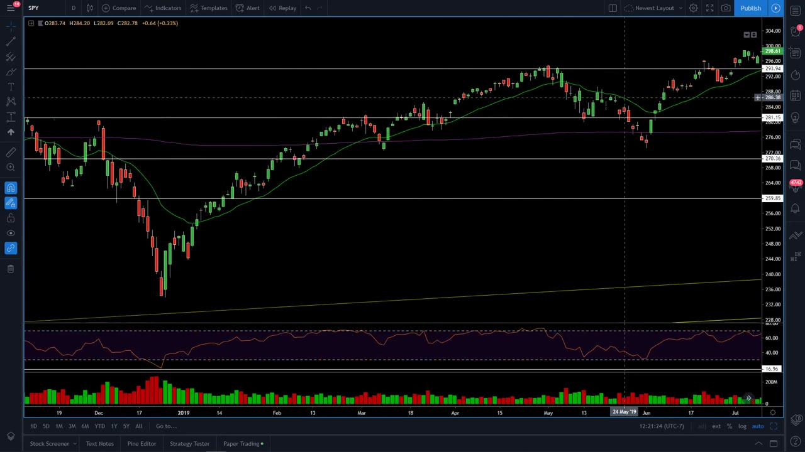

**图怎么看：**

- 整体界面显示了多个股票的每日交易图表，包括K线图、均线和成交量柱。
- 实际可见的ticker包括SPY、AMD、BBY等，周期为日线。
- 图表展示了市场趋势，关键支撑和阻力位明显，适合分析交易策略。
- 这张截图不能单独证明某一支股票的趋势，需要结合其他信息综合判断。

### 关键内容

- 识别大型股指数的关键支撑和阻力位是重要的，因为它们可以预测市场的未来反应。
- 在分析过程中，多次测试同一水平提供了更多的确认机会。
- 使用趋势线分析来确定市场趋势，但需注意有时市场会偏离预期趋势。
- SPY和三倍看涨期权（Triple Qs）是分析市场趋势的重要工具。
- 在突破关键水平时，需要精确测试，否则可能无法确认有效突破。
- 市场趋势不一定总是跟随大型股指数，有时股票会独立行动。
- 使用技术分析工具可以帮助确定市场趋势，但需结合实际情况灵活调整。
- 在交易大型股时，关注关键支撑和阻力位，如SPY的294和281水平。
- 使用止损策略时，考虑Delta值以确定合理的止损点。
- 使用Trade Station和Lightspeed等交易平台进行交易

### 分析与执行顺序

1. 识别大型股指数的关键支撑和阻力位，如SPY的294和281水平。
2. 绘制趋势线以帮助识别支撑和阻力位，并观察价格行为。
3. 多次测试同一水平以确认有效突破，如SPY的294水平。
4. 使用技术分析工具，如Trading View，进行股票分析。
5. 结合实际情况灵活调整交易策略，有时市场会偏离预期趋势。

### 案例与细节

- SPY在形成突破后，测试了294水平三次，最终突破了该水平。
- Roku在接近支持线时，形成了一个通道，随后突破了该支持线。
- AMD在形成突破或突破的机会时，测试了两个关键水平。
- PM在测试关键水平7539时，形成了潜在的突破机会。
- JPM接近117水平时，两次测试该水平，但第三次测试表明突破可能性不大。

### 风险与边界

- 市场趋势不一定总是跟随大型股指数，有时股票会独立行动。
- 使用技术分析工具时，需结合实际情况灵活调整策略。
- 在突破关键水平时，需要精确测试，否则可能无法确认有效突破。
- 录制年代限制，某些平台和工具可能已不再适用。

### 复盘问题

- 在分析大型股指数时，哪些关键支撑和阻力位是最值得关注的？
- 如何使用趋势线分析来确定市场趋势？
- 在交易过程中，如何结合实际情况灵活调整策略？

---

## v0578：8月交易回顾

> 日期：2019-09-11　·　时长：01:08:04

**本场重点：** 8月交易回顾展示了如何利用预市数据和图表分析进行交易决策，强调了风险管理的重要性。

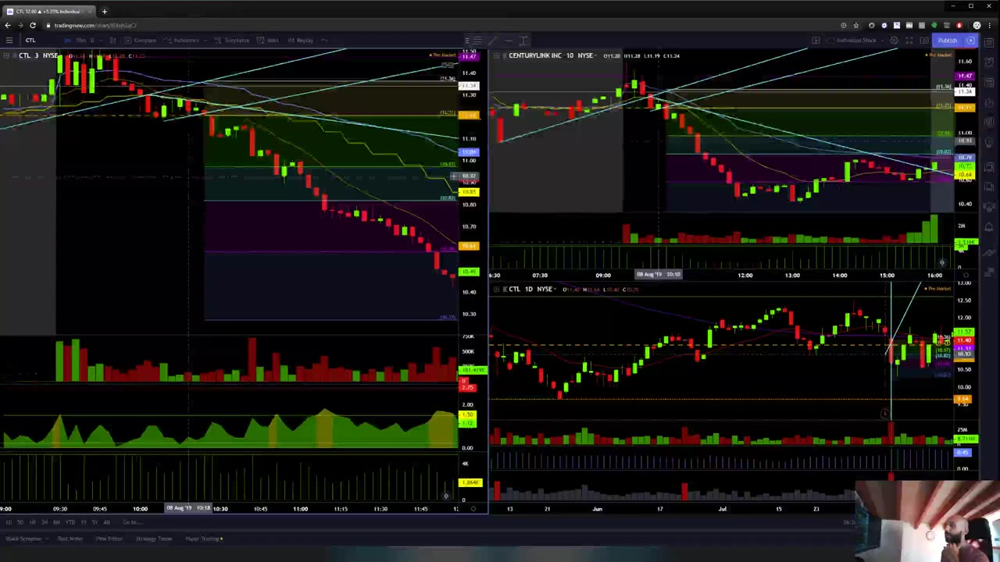

**图怎么看：**

- 画面中，我们可以看到多个股票的K线图，包括BBY、CTL和CENTURYLINK INC。这些图表显示了不同时间段的价格波动和成交量。
- 成交量柱的高度反映对应周期内的总成交量；红绿着色通常跟随价格柱的涨跌规则，不能直接拆成两种方向的主动成交。
- 水平线和斜线可能代表支撑位和阻力位，帮助投资者识别潜在的交易机会和风险。
- 图B还显示了时间轴，帮助我们理解市场活动的时间分布，这对于制定交易策略非常重要。

### 关键内容

- 8月份交易量增加，罗伯托挑选了一些交易进行详细分析。
- 交易者需要提供格式化的信息，包括日期、符号、入场时间、价格、退出时间和平均退出价格。
- 8月份的交易机会减少，趋势变弱，通常在下午开始。
- 交易者应关注预市数据和图表模式，以做出更明智的交易决策。
- 交易者应根据风险回报比来设置止损和目标价。
- 交易者应避免在开盘后立即进行交易，尤其是在高成交量的情况下。
- 交易者应考虑在趋势确认后再进入交易，以提高成功率。
- 交易者应记录自己的交易过程，以便后续分析和改进。
- 交易者应定期调整交易策略，以适应市场变化。

### 分析与执行顺序

1. 罗伯托首先介绍了8月份的交易特点，包括交易机会减少和趋势变弱。
2. 他要求交易者提供格式化的交易信息，包括日期、符号、入场时间、价格、退出时间和平均退出价格。
3. 罗伯托分析了交易者提交的具体交易案例，包括CTL和BBY。
4. 他强调了预市数据和图表模式的重要性，以及如何利用这些信息做出更好的交易决策。
5. 罗伯托还讨论了交易者的交易策略，包括如何设置止损和目标价，以及如何管理交易风险。
6. 最后，罗伯托鼓励交易者记录自己的交易过程，并定期调整交易策略。

### 案例与细节

- CTL交易：8月8日，CDL，短仓入场时间为10:26，价格为1121，退出时间为11:45，价格为1067。
- BBY交易：8月29日，BBY，熊线出现时间9:48，交易者入场但被止损，止损点位于13 EMA附近。
- CTL交易：交易者注意到熊线，但在9:48被止损，止损点位于13 EMA附近。
- BBY交易：交易者在9:48看到熊线，但被止损，止损点位于13 EMA附近。
- CTL交易：交易者在9:48看到熊线，但在9:48被止损，止损点位于13 EMA附近。

### 风险与边界

- 交易者应避免在开盘后立即进行交易，尤其是在高成交量的情况下，因为这可能导致过度波动。
- 交易者应确保有足够的空间从入场到第一目标，且第一目标应在下一个支撑位之上。
- 交易者应定期调整交易策略，以适应市场变化，否则可能会错失最佳交易机会。
- 交易者应记录自己的交易过程，以便后续分析和改进，否则可能无法从中学习。
- 交易者应考虑在趋势确认后再进入交易，以提高成功率，否则可能会面临更高的风险。

### 复盘问题

- 交易者在交易前是否充分分析了预市数据和图表模式？
- 交易者在设置止损和目标价时是否考虑了风险回报比？
- 交易者在交易过程中是否保持了冷静，避免因情绪影响决策？
- 交易者是否定期调整了自己的交易策略，以适应市场变化？
- 交易者在交易后是否进行了反思，总结经验教训？

---

## v0579：大型股市场技术分析

> 日期：2019-10-02　·　时长：01:01:14

**本场重点：** 分析大型股市场技术走势，识别关键支撑和阻力位，预测市场趋势。

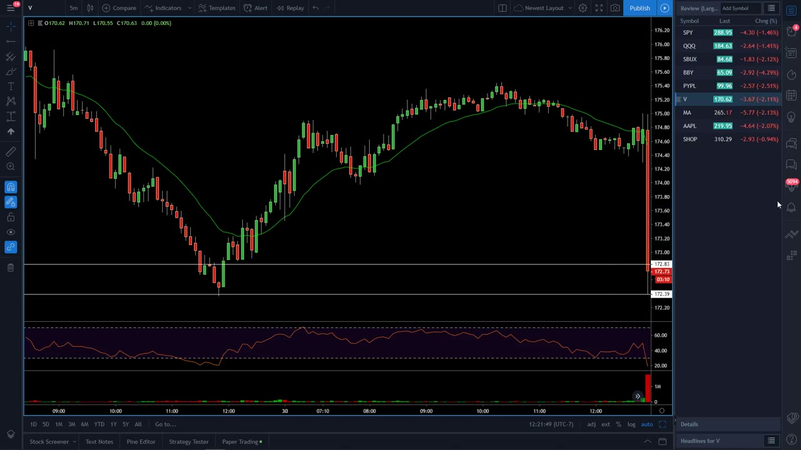

**图怎么看：**

- 在1285秒时，图表显示了AAPL股票的价格走势，可以看到股价在高位震荡。
- 水平均线显示出一个上升的趋势，表明市场可能处于上升阶段。
- 成交量柱的高度反映对应周期内的总成交量；红绿着色通常跟随价格柱的涨跌规则，不能直接拆成两种方向的主动成交。
- 图表下方的时间和成交量显示了实时的市场动态，帮助投资者了解当前的交易情况。

### 关键内容

- SPY和Triple Q近期下跌约3%，显示市场波动增加。
- 十月通常是市场波动最大的月份，历史数据显示市场在此期间常有大幅下跌。
- 星巴克和PayPal等股票形成熊市旗形，预示可能突破。
- 使用三线支撑和阻力来识别潜在交易机会，但需注意这些水平的可靠性。
- 市场整体趋势从强劲上涨转向疲软，表明市场动能减弱。
- 星巴克的熊市旗形突破后继续下跌，验证了技术分析的有效性。
- PayPal的突破未能持续，显示市场可能在短期内反弹。
- 大型股市场的技术分析有助于识别潜在的交易机会，但需谨慎管理风险。
- 市场整体趋势和个别股票的表现相互关联，共同影响市场走向。
- 技术分析适用于大多数市场类型，但在债券和某些期货市场效果有限。

### 分析与执行顺序

1. 分析SPY和Triple Q的近期走势，识别下跌趋势。
2. 回顾2019年初的市场趋势，确认从强劲上涨转向疲软。
3. 识别星巴克和PayPal等股票的熊市旗形形态，预测可能的突破。
4. 使用三线支撑和阻力来识别潜在的交易机会，但需注意这些水平的可靠性。
5. 结合市场整体趋势和个别股票的表现，制定交易策略。
6. 监控关键支撑和阻力位的变化，及时调整交易计划。
7. 使用技术分析工具，如趋势线和支撑阻力位，进行实时交易决策。

### 案例与细节

- 星巴克的熊市旗形突破后继续下跌，显示技术分析的有效性。
- PayPal的熊市旗形突破后未能持续，显示市场可能在短期内反弹。
- 使用三线支撑和阻力来识别潜在的交易机会，例如星巴克的172.83和172.39水平。
- 市场整体趋势从强劲上涨转向疲软，表明市场动能减弱。

### 风险与边界

- 市场波动性增加可能导致交易失误，需谨慎管理风险。
- 技术分析的有效性依赖于市场环境，不同市场表现可能不同。
- 录制年代限制，当前市场环境与2018-2021年有所不同。
- 市场趋势可能突然变化，需密切关注市场动态。

### 复盘问题

- 如何识别关键支撑和阻力位？
- 在哪些情况下，技术分析可能失效？
- 如何结合市场整体趋势和个别股票的表现制定交易策略？

---

## v0580：股票趋势交易中的行业影响

> 日期：2019-10-23　·　时长：01:00:39

**本场重点：** 讨论如何评估单个股票的趋势交易，考虑行业影响的重要性

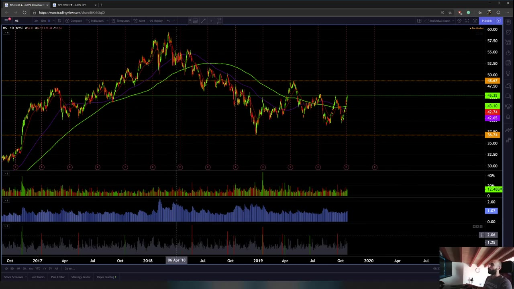

**图怎么看：**

- 画面中，可以看到多个股票的K线图，显示了不同时间段的价格波动。
- 图B还展示了成交量柱状图，帮助分析市场活跃度。
- 通过对比不同股票的K线图和成交量柱状图，可以评估行业对股票趋势的影响。
- 画面中的实时聊天室对话框提供了关于行业动态和策略讨论的信息。

### 关键内容

- 行业方向对单个股票的影响不是绝对的，需要具体分析
- 摩根大通股票在市场波动中表现不佳，未突破关键阻力位
- 技术分析是决定是否进行交易的关键
- 市场整体环境对单个股票的影响较大
- 分析师评级对交易决策的影响有限
- 使用相对成交量指标来判断市场情绪
- 摩根大通股票在预市表现强劲，但未能持续上涨
- 市场真实反应比分析师评级更重要
- 摩根大通股票在10月17日的高点为4484，但未能突破关键阻力位，表明市场对该股持谨慎态度
- 摩根大通股票的相对成交量在低水平，表明市场情绪较为谨慎，这影响了交易决策
- 摩根大通股票的平均真实范围（ATR）低于450，表明市场波动较小，降低了交易机会
- 摩根大通股票在10月17日的高点为4484，但未能突破关键阻力位，说明市场对该股缺乏信心
- 摩根大通股票的相对成交量在低水平，表明市场情绪谨慎，这使得交易者犹豫是否入场

### 分析与执行顺序

1. 首先，回顾摩根大通股票在10月17日的表现
2. 分析摩根大通股票的每日图表，确定趋势线和关键阻力位
3. 观察摩根大通股票在预市的表现，确认市场情绪
4. 结合相对成交量指标，判断市场是否有利
5. 最终决定是否进行交易，基于技术分析和市场环境

### 案例与细节

- 摩根大通股票在10月17日开盘时出现大幅上涨，但随后回落
- 摩根大通股票的相对成交量在1.08左右，属于正常水平
- 摩根大通股票在10月17日的高点为4484，但未能突破关键阻力位
- 摩根大通股票的平均真实范围（ATR）低于450，表明市场波动较小
- 摩根大通股票的相对成交量在低水平，表明市场情绪较为谨慎
- 摩根大通股票在10月17日开盘时出现大幅上涨，但随后回落，显示市场情绪不稳定
- 摩根大通股票的相对成交量在1.08左右，属于正常水平，但未能突破关键阻力位，表明市场对该股缺乏信心
- 摩根大通股票的平均真实范围（ATR）低于450，表明市场波动较小，降低了交易机会，这使得交易者犹豫是否入场

### 风险与边界

- 市场环境变化可能导致交易策略失效
- 相对成交量指标可能因市场情绪波动而失真
- 录制年代限制，交易环境可能与当前有所不同
- 市场真实反应可能与分析师评级不符
- 市场环境变化可能导致交易策略失效，如摩根大通股票在10月17日的表现不佳，表明市场环境对单个股票的影响较大
- 相对成交量指标可能因市场情绪波动而失真，如摩根大通股票的相对成交量在低水平，但实际市场情绪并不悲观
- 录制年代限制，交易环境可能与当前有所不同，如摩根大通股票在10月17日的表现可能与当前市场环境不同
- 市场真实反应可能与分析师评级不符，如摩根大通股票的相对成交量在低水平，但实际市场情绪并不悲观

### 复盘问题

- 摩根大通股票在10月17日的表现如何？
- 如何使用相对成交量指标来判断市场情绪？
- 分析师评级对交易决策有多大的影响？

---

## v0581：平底崩盘和平顶突破策略

> 日期：2019-10-23　·　时长：01:28:02

**本场重点：** 识别关键支撑和阻力水平，耐心等待实际触发点，理解价格行为和风险管理。

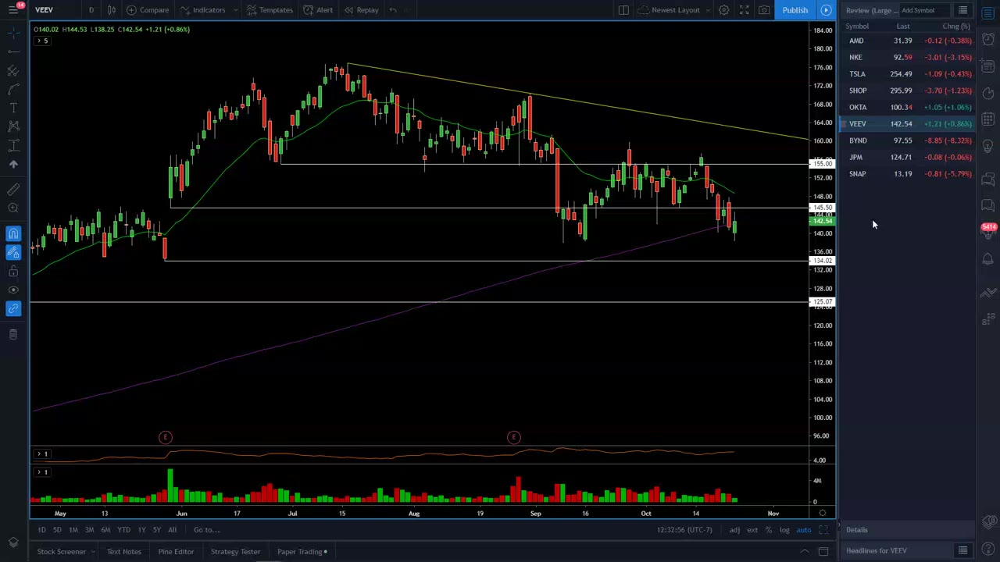

**图怎么看：**

- 在Veev的交易课程中，显示了多个股票的K线图，包括AMD、NKE、TSLA等。
- 图表上标示了关键的支撑和阻力水平，帮助投资者识别市场趋势。
- 通过观察价格行为和成交量，可以更好地理解和管理风险。
- 课程强调耐心等待实际触发点，以做出明智的投资决策。

### 关键内容

- 讲师强调了识别关键支撑和阻力水平的重要性，特别是在执行交易策略时。
- 平底崩盘策略在Snap中未能成功，因为股价在1368水平测试后反弹。
- 平顶突破策略在JPM中成功，股价突破11933水平后继续上涨。
- 讲师建议，当股价突破关键水平时，应等待实际触发点，而不是提前入场。
- 理解价格行为和风险管理的重要性，特别是在识别和执行交易策略时。
- 平底崩盘策略的关键在于识别支撑和阻力水平，并在第四次突破时确认价格变动。
- 平顶突破策略的成功依赖于耐心等待实际触发点。
- 增加的成交量是关键突破或突破的积极信号。
- 至少实现1:3的风险回报比，一旦达到这个比例，考虑退出。
- 未能突破关键支撑位，导致难以退出交易。
- 平底崩盘策略的成功依赖于第四次突破，这通常会引发显著的价格变动，但需谨慎识别支撑和阻力水平。
- 平顶突破策略的成功在于耐心等待实际触发点，而非提前入场，这要求交易者具备良好的耐心和纪律。
- 理解价格行为和风险管理的重要性不仅在于识别支撑和阻力水平，还在于控制风险，避免过度交易。
- 识别关键支撑和阻力水平是基础，但交易者还需结合日线图和60分钟图来确定重大窗口，确保决策的准确性。
- 增加的成交量是关键突破或突破的积极信号，但交易者还需注意成交量的突然变化可能带来的不确定性

### 分析与执行顺序

1. 讲师首先介绍了两种交易策略：平底崩盘和平顶突破。
2. 然后详细分析了平底崩盘策略在Snap中的失败案例，股价在1368水平测试后反弹。
3. 接着讲解了平顶突破策略在JPM中的成功案例，股价突破11933水平后继续上涨。
4. 讲师强调了识别关键支撑和阻力水平的重要性，特别是在执行交易策略时。
5. 建议交易者在突破关键水平时，等待实际触发点，而不是提前入场。
6. 最后，讲师提醒交易者理解价格行为和风险管理的重要性，特别是在识别和执行交易策略时。

### 案例与细节

- 平底崩盘策略在Snap中表现不佳，股价在1368水平测试后反弹。
- 平顶突破策略在JPM中表现良好，股价突破11933水平后继续上涨。
- 在突破点上方，股票距离转为红色还有很小的空间。如果股票收盘接近触发点，第二天可能会因为缺口而突破你的入场点。
- 使用心理止损而不是硬止损，因为价格动作通常较慢，可以手动执行止损，不需要硬止损的紧迫感。
- 在Snap的平底崩盘策略中，股价三次测试1368水平后反弹，说明即使识别了支撑和阻力水平，市场波动也可能导致失败。
- JPM的平顶突破策略中，股价突破11933水平后继续上涨，显示耐心等待实际触发点的重要性，以及正确识别支撑和阻力水平的价值。
- 在突破点上方，股票距离转为红色还有很小的空间，如果股票收盘接近触发点，第二天可能会因为缺口而突破你的入场点，这强调了实际触发点的重要性。
- 使用心理止损而不是硬止损，因为价格动作通常较慢，可以手动执行止损，不需要硬止损的紧迫感，这有助于减少情绪化交易的影响。
- 在ZM的案例中，股价低于IPO低点，预计会反弹，这说明理解价格行为和风险管理的重要性，特别是在识别和执行交易策略时

### 风险与边界

- 平底崩盘策略在Snap中的失败案例表明，即使识别了支撑和阻力水平，也可能因市场波动而失败。
- 平顶突破策略的成功依赖于耐心等待实际触发点，否则可能导致错误的入场时机。
- 理解价格行为和风险管理的重要性，特别是在识别和执行交易策略时，否则可能导致亏损。
- 录制年代限制，平台、监管、税务和经纪商条件只能表述为历史录制内容。
- 未能突破关键支撑位可能导致难以退出交易，特别是在市场波动较大时，交易者需谨慎管理风险。
- 价格反转导致损失，强调不能固守最终目标，特别是在市场趋势发生变化时，交易者需灵活调整策略。
- 平底崩盘策略在Snap中的失败案例表明，即使识别了支撑和阻力水平，也可能因市场波动而失败，这要求交易者具备更强的风险意识。
- 平顶突破策略的成功依赖于耐心等待实际触发点，否则可能导致错误的入场时机，这要求交易者具备良好的耐心和纪律

### 复盘问题

- 平底崩盘策略的关键是什么？
- 平顶突破策略的关键是什么？
- 为什么在突破关键水平时需要等待实际触发点？
- 如何理解价格行为和风险管理的重要性？

---

## v0582：大型股市场分析

> 日期：2019-11-13　·　时长：00:57:24

**本场重点：** 分析大型股市场趋势，识别技术图表中的交易机会，强调跟随市场趋势的重要性。

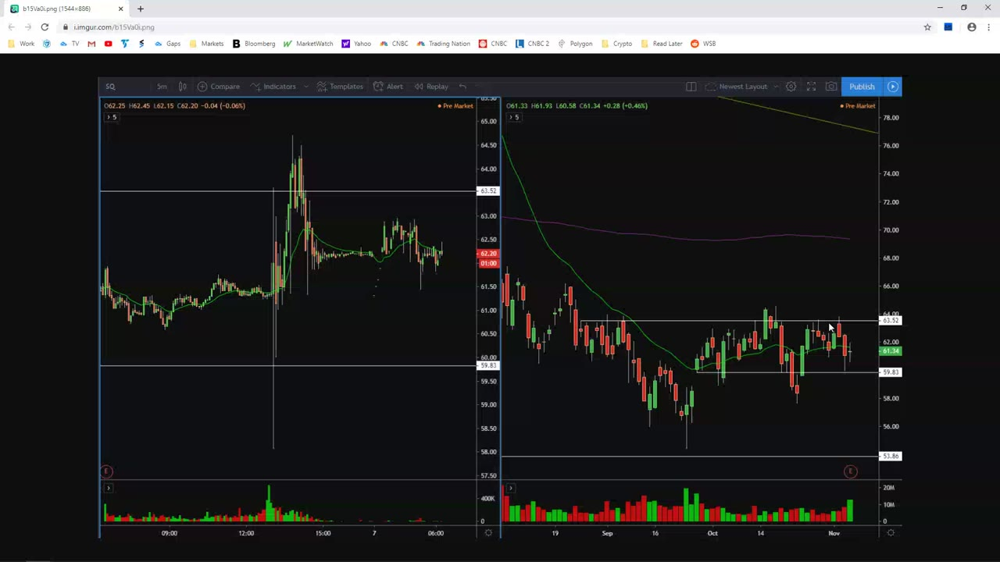

**图怎么看：**

- 画面左右放置两张深色图表：左图突出一次急涨及其后的高位整理，右图展示价格回落到均线下方后进入横向盘整，便于比较不同阶段的结构。
- 左图的关键不是记住某个精确价位，而是区分爆发段与随后波动收窄的区域；追高风险通常集中在急涨末端，整理区则需要等待方向确认。
- 右图中的绿色、紫色均线提供趋势背景：价格持续位于均线下方时不宜仅凭一次反弹就假设反转，横盘也可能只是下跌趋势中的暂停。
- 截图无法显示完整日期范围、实时成交顺序或后续突破结果；成交量柱颜色也不是主动订单流的直接证据，判断仍要结合市场环境和风险计划。

### 关键内容

- Triple Q的突破表明市场整体趋势向上，AMD作为大型股的代表也受益于这一趋势。
- Goose的图表显示了突破趋势线后的快速下跌，验证了技术分析的有效性。
- SQ的图表展示了突破平顶形态后的强劲上涨，强调了技术突破的重要性。
- BA的图表展示了三重底部突破后的下跌，说明了选择适当止损的重要性。
- Disney的图表展示了突破三重顶后的强劲上涨，说明了催化剂和技术突破的结合。
- Nvidia的图表展示了即将发布的财报可能带来的重大突破，强调了等待关键事件的重要性。
- 支持和阻力位的有效性不受时间限制，即使多年未被触及，依然有效。
- 短期交易策略如小盘股的止损和目标价设定，与长期交易策略不同，需根据具体情况调整。
- 交易者应选择一种主要交易策略（趋势交易或反转交易），以提高交易成功率。
- 交易者应关注市场趋势，而不是逆势操作，以提高交易胜率。

### 分析与执行顺序

1. 分析Triple Q的图表，确认突破后的强劲上涨趋势。
2. 分享AMD的图表，指出突破后的上涨趋势，强调跟随市场趋势的重要性。
3. 展示Goose的图表，说明突破趋势线后的快速下跌，验证技术分析的有效性。
4. 分析SQ的图表，指出突破平顶形态后的强劲上涨，强调技术突破的重要性。
5. 讨论BA的图表，说明三重底部突破后的下跌，强调选择适当止损的重要性。
6. 分享Disney的图表，指出突破三重顶后的强劲上涨，说明催化剂和技术突破的结合。
7. 分析Nvidia的图表，指出即将发布的财报可能带来的重大突破，强调等待关键事件的重要性。

### 案例与细节

- Triple Q的图表显示了突破后的强劲上涨趋势，突破后价格持续上升。
- Goose的图表显示了突破趋势线后的快速下跌，验证了技术分析的有效性。
- SQ的图表展示了突破平顶形态后的强劲上涨，说明了技术突破的重要性。
- BA的图表展示了三重底部突破后的下跌，说明了选择适当止损的重要性。
- Disney的图表展示了突破三重顶后的强劲上涨，说明了催化剂和技术突破的结合。
- Nvidia的图表展示了即将发布的财报可能带来的重大突破，强调了等待关键事件的重要性。

### 风险与边界

- 交易者应意识到市场趋势可能会发生变化，需要灵活调整策略。
- 交易者应避免过度依赖单一技术指标，需综合考虑多种因素。
- 交易者应认识到市场情绪波动可能导致短期内的价格异常波动。
- 交易者应了解市场环境的变化可能影响交易策略的有效性。

### 复盘问题

- Triple Q的突破是否意味着市场整体趋势将一直向上？
- 如何在图表中识别技术突破的关键点？
- 如何根据市场趋势选择适当的止损和目标价？
- 如何在交易中平衡技术分析和市场情绪的影响？
- 如何应对市场趋势变化带来的不确定性？

---

## v0583：大型股市场分析

> 日期：2019-11-20　·　时长：01:03:55

**本场重点：** 分析大型股市场，识别技术形态并制定交易策略；使用止损点和Delta值进行风险管理。

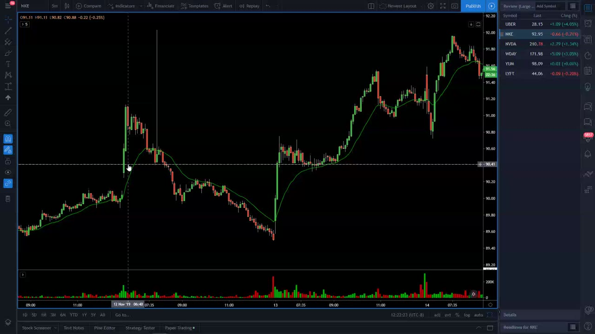

**图怎么看：**

- NKE股票在5分钟K线图上显示了明显的上升趋势。
- 成交量柱的高度反映对应周期内的总成交量；红绿着色通常跟随价格柱的涨跌规则，不能直接拆成两种方向的主动成交。
- 股价在高位附近出现了一次回调，但随后继续上涨。
- 成交量适合与前序时段或历史基准比较参与程度，但仅凭柱体颜色无法判断哪一方主动，也不能由此推断下一步方向。

### 关键内容

- 讲师分析了Uber股票的三重顶形态，并在突破关键水平后进行了期权交易。
- 使用技术分析识别股票的关键支撑和阻力水平，如Uber的2755水平。
- 设置止损点时，考虑之前的支撑水平，如Uber的2695水平。
- 使用Delta值来确定期权的止损点，确保止损点合理且有效。
- 在市场分析中，识别股票的关键支撑和阻力水平是制定交易策略的基础。
- 通过技术分析识别股票的突破点，制定相应的交易计划。
- 使用止损点和Delta值来管理风险，确保交易策略的有效性。
- 在交易过程中，保持对市场动态的敏感，及时调整交易策略。
- 使用技术分析工具，如Trading View，监控股票的关键水平。
- 在交易过程中，保持纪律，严格遵守设定的止损点，避免被市场波动影响。

### 分析与执行顺序

1. 讲师首先分析了Uber股票的三重顶形态，识别出关键支撑水平。
2. 在突破关键水平后，使用期权进行交易，设置止损点以控制风险。
3. 使用Trading View监控股票的关键水平，确保交易策略的有效性。
4. 根据技术分析结果，制定交易计划，包括买入和卖出时机。
5. 在交易过程中，密切关注市场动态，及时调整交易策略。
6. 使用Delta值来确定期权的止损点，确保止损点合理且有效。
7. 严格遵守设定的止损点，避免被市场波动影响。

### 案例与细节

- Uber股票在60分钟图表上形成了三重顶形态，突破关键水平后，讲师购买了$25的看涨期权。
- 讲师设置了止损点，基于之前的支撑水平2695，确保止损点合理。
- 使用Trading View监控股票的关键水平，确保交易策略的有效性。
- 在交易过程中，密切关注市场动态，及时调整交易策略，如在Uber股票突破关键水平后进行交易。
- 使用Delta值来确定期权的止损点，确保止损点合理且有效，如Uber股票的$26看涨期权。
- 严格遵守设定的止损点，避免被市场波动影响，如在Uber股票突破关键水平后进行交易。

### 风险与边界

- 在交易过程中，如果市场走势与预期相反，可能会导致止损点被触发，从而损失资金。
- 使用Delta值来确定止损点时，需要确保Delta值准确，否则可能导致止损点设置不当。
- 在交易过程中，如果市场出现突发事件，可能会导致交易策略失效，从而影响交易结果。
- 录制年代限制为2019年，因此在交易过程中需要注意市场环境的变化。

### 复盘问题

- 在识别技术形态时，如何确保选择正确的支撑和阻力水平？
- 在设置止损点时，如何确保止损点既合理又有效？
- 在交易过程中，如何保持对市场动态的敏感，及时调整交易策略？
- 使用Trading View监控股票的关键水平时，有哪些注意事项？
- 在交易过程中，如何避免被市场波动影响，严格遵守止损点？

---

## v0584：大型股市场分析与技术交易策略

> 日期：2019-12-04　·　时长：00:57:35

**本场重点：** 分析大型股市场趋势，识别技术交易机会，并强调耐心等待突破的重要性。

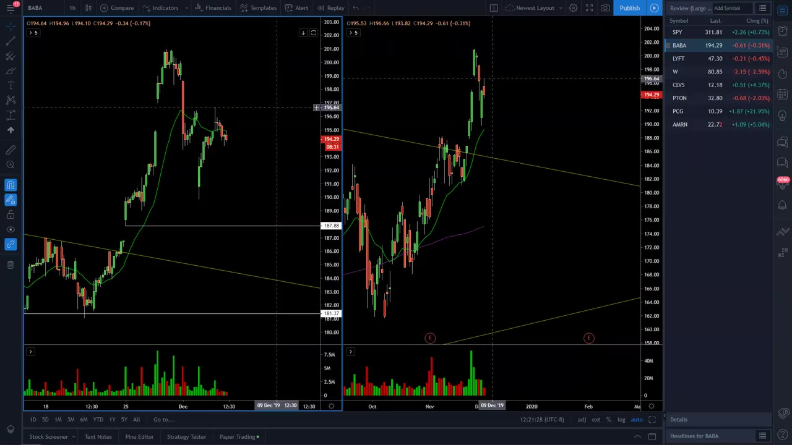

**图怎么看：**

- BABA 在日线图上显示出明显的下跌趋势。
- 成交量柱的高度反映对应周期内的总成交量；红绿着色通常跟随价格柱的涨跌规则，不能直接拆成两种方向的主动成交。
- 价格在194.64到194.10之间波动，显示出市场的不稳定。
- BABA 的价格在194.64到194.10之间的下跌可能预示着进一步的下跌风险。

### 关键内容

- SPY代表整体市场，近期下跌后出现反弹，但整体趋势仍向上。
- 12月15日关税截止日期是市场的重要催化剂，可能影响市场走势。
- 阿里巴巴（BABA）在小时图上形成了一个有效的突破，提供了高风险回报比。
- CLVS股票近期波动大，形成了一个平底突破，导致大幅下跌。
- PTON股票在五分钟图上形成了一个旗形突破，提供了短期交易机会。
- PCG股票近期突破了关键支撑位，显示出强劲的上涨动力。
- AMRN股票在2334水平附近形成了一个四重顶，预示着潜在的突破。
- 技术分析是识别交易机会的关键工具，需要耐心等待突破确认。
- 使用止损订单的风险在于可能过早退出，错过后续的上涨机会。
- 在大型股市场中，技术突破是判断市场趋势的重要依据。
- 市场波动性增加时，使用期权进行交易可以更好地管理风险。

### 分析与执行顺序

1. 首先分析SPY，确定整体市场趋势。
2. 识别阿里巴巴的小时图突破，制定交易计划。
3. 观察CLVS的平底突破，确认市场反转。
4. 分析PTON的旗形突破，寻找短期交易机会。
5. 跟踪PCG的关键支撑位突破，评估市场情绪。
6. 研究AMRN的四重顶突破，预测未来走势。
7. 总结大型股市场的技术分析方法，强调耐心等待突破的重要性。

### 案例与细节

- SPY在12月15日关税截止日期前形成了一个重要的突破，从30830点上升到30855点。
- 阿里巴巴在186.80点以上突破了趋势线，提供了超过1:30的风险回报比。
- CLVS股票在1452点形成了一个平底突破，随后从1145点开始大幅下跌。
- PTON股票在五分钟图上形成了一个旗形突破，从4536点上升到4900点。
- PCG股票突破了关键支撑位883点，显示了强劲的上涨动力。

### 风险与边界

- 市场波动性增加时，技术分析的有效性可能会降低。
- 使用止损订单可能导致过早退出，错过后续的上涨机会。
- 录制于2019年，当前市场环境可能已发生变化。
- 某些股票如CLVS和PCG的波动性较大，需要谨慎操作。

### 复盘问题

- 如何识别大型股市场的技术突破？
- 在制定交易计划时，如何平衡耐心等待突破与及时退出？
- 哪些因素会影响技术分析的有效性？

---

## v0585：提高交易技能的777金规则

> 日期：2019-12-18　·　时长：01:03:23

**本场重点：** 1. 交易需要耐心，等待最佳时机。2. 成功交易的关键在于日常习惯。3. 审视交易后需总结经验教训。

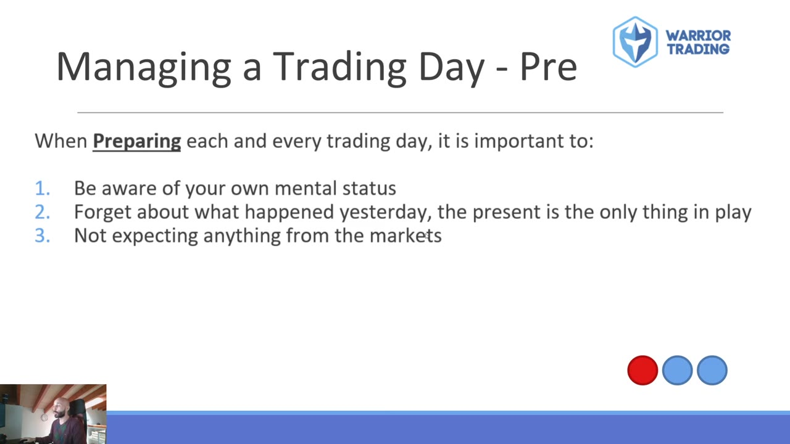

**图怎么看：**

- 画面整体：聊天室界面，显示交易者之间的交流。
- 可见信息：聊天室中的对话内容。
- 与本场关系：展示交易者在前期准备阶段的重要注意事项，如保持冷静、忘记过去、不期望市场等。
- 阅读边界：强调交易者在交易前的心理准备和策略的重要性。

### 关键内容

- 耐心是成功交易的关键，它强调了等待最佳时机的重要性。
- 建立并遵守日常交易习惯对于持续盈利至关重要。
- 交易后应进行审视，总结经验教训，以改进策略。
- 交易者应避免过度依赖市场预期，接受市场的实际情况。
- 保持无偏见的态度，专注于高概率和积极的风险回报比。
- 制定并遵守交易规则，确保在定义的范围内操作。
- 在交易日开始时，要准备好抓住机会，而不是急于行动。
- 在交易过程中，保持耐心，等待触发点的到来。
- 当市场不配合时，减少头寸或停止交易，而不是增加头寸。
- 在交易结束时，总结经验教训，调整策略，而不是频繁改变

### 分析与执行顺序

1. 1. 开场介绍交易中的重要性，包括耐心和日常习惯。
2. 2. 强调建立和遵守日常交易习惯的重要性，包括早起和保持健康。
3. 3. 讲解如何准备交易日，包括分析市场和建立自己的股票名单。
4. 4. 在交易过程中，保持耐心，等待触发点的到来，并观察价格走势。
5. 5. 当市场不配合时，减少头寸或停止交易，而不是增加头寸。
6. 6. 在交易结束后，总结经验教训，调整策略，而不是频繁改变

### 案例与细节

- 1. Ralph Waldo Emerson 的名言：‘耐心是自然的秘密’，强调了耐心的重要性。
- 2. Joyce Mayer 的名言：‘耐心不仅仅是等待的能力，而是在等待期间的行为’，强调了耐心的主动性。
- 3. Tolstoy 的名言：‘耐心和时间是两个最强大的战士’，强调了耐心和时间的重要性。
- 4. 在交易日开始时，Roberto 提到自己即使晚起也坚持早起的习惯，以保持良好的状态。
- 5. 在交易过程中，Roberto 强调了耐心的重要性，例如等待触发点的到来。
- 6. 在交易结束后，Roberto 提到总结经验教训，例如记录情绪状态和交易结果

### 风险与边界

- 1. 市场环境的变化可能导致某些规则不再适用。
- 2. 交易者可能因为过度依赖市场预期而忽视实际情况。
- 3. 如果交易者频繁改变策略，可能会导致不稳定的表现。
- 4. 交易者需要根据当前市场情况灵活调整策略，而不是固守旧规则

### 复盘问题

- 1. 你如何在交易日开始时保持耐心和准备？
- 2. 在交易过程中，你是如何观察价格走势并等待触发点的？
- 3. 当市场不配合时，你是如何减少头寸或停止交易的？
- 4. 你在交易结束后是如何总结经验教训并调整策略的？
- 5. 你是否有一个固定的日常交易习惯，包括早起和保持健康？

---

## v0586：AMD 和其他股票的平顶突破策略

> 日期：2019-12-18　·　时长：01:02:40

**本场重点：** 介绍平顶突破策略，通过具体案例展示如何识别和利用这些机会；强调耐心和风险控制的重要性。

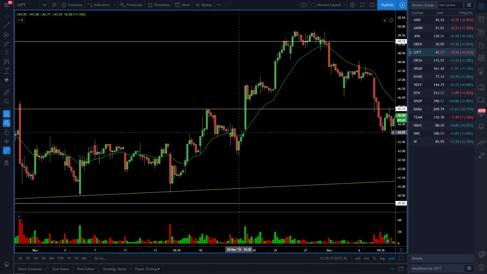

**图怎么看：**

- 画面中，LYFT 股票的 K 线图显示了其价格波动情况。
- 成交量柱状图显示了不同时间段内的成交量变化。
- 图中的水平线可能表示支撑位或阻力位。
- 成交量柱状图的颜色（红色和绿色）可能代表不同的市场情绪或趋势方向。

### 关键内容

- Arsh 分享了 AMD 的平顶突破策略，指出平顶突破通常需要三次测试。
- 他强调了耐心的重要性，尤其是在等待突破发生时。
- 平顶突破策略的目标是在突破后立即看到强劲的价格突破。
- Arsh 提到平顶突破策略的成功案例，如 JPM 和 Uber。
- 他解释了如何在 60 分钟图表上识别平底突破策略，指出短期图表上的突破通常持续时间较短。
- Arsh 强调了风险控制的重要性，使用紧止损来保护交易。
- 他提到平顶突破策略的成功率较高，但需要耐心等待突破发生。
- Arsh 提到平顶突破策略适用于多种股票，包括大型科技股。
- Arsh 强调了耐心的重要性，尤其是在等待突破发生时。

### 分析与执行顺序

1. Arsh 首先介绍了平顶突破策略的基本概念，指出平顶突破通常需要三次测试。
2. 然后，他展示了如何在 AMD 股票上应用这一策略，指出平顶突破通常会在第四次测试时发生。
3. 接着，他解释了如何在 60 分钟图表上识别平底突破策略，指出短期图表上的突破通常持续时间较短。
4. 他强调了耐心的重要性，尤其是在等待突破发生时。
5. 最后，他分享了如何在 JPM 和 Uber 等股票上应用这一策略的具体案例。

### 案例与细节

- AMD 在 3414 水平进行了平顶突破，突破后价格迅速上涨至 4270。
- AMRN 在 2334 水平进行了平顶突破，突破后价格迅速上涨至 2750。
- JPM 在 1133 水平进行了平顶突破，突破后价格继续上涨。
- Uber 在 2755 水平进行了平底突破，突破后价格短暂上涨至 30 美元。
- 阿里巴巴在 60 分钟图表上进行了平顶突破，突破后价格继续上涨至 209 美元。

### 风险与边界

- 平顶突破策略的成功依赖于耐心等待突破发生，如果突破未能发生，可能会导致亏损。
- 短期图表上的突破通常持续时间较短，投资者需要做好准备。
- 平顶突破策略的成功率较高，但需要耐心等待突破发生。

### 复盘问题

- 如何识别平顶突破策略中的关键突破水平？
- 在等待突破发生时，如何管理风险？
- 平顶突破策略的成功案例有哪些？

---

## v0587：自定义技术指标

> 日期：2019　·　时长：00:56:43

**本场重点：** 简化技术指标以提高交易效率，选择最适合自己的指标，避免过度复杂化。

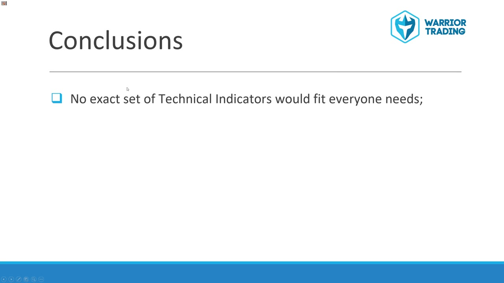

**图怎么看：**

- 在 AAPL 的日线图上，可以看到 EMA（指数移动平均线）和 MACD（相对强弱指数）等技术指标。
- MACD 指标显示了价格趋势的变化，帮助投资者判断市场方向。
- EMA 值为 13 天，用于平滑价格数据，减少短期波动的影响。
- 成交量柱的高度反映对应周期内的总成交量；红绿着色通常跟随价格柱的涨跌规则，不能直接拆成两种方向的主动成交。

### 关键内容

- Roberto 认为技术指标越简单越好，减少噪音有助于实时决策。
- 他使用 13 指数移动平均线（EMA）和 VU 应用程序来支持快速有效的决策。
- 通过简化技术指标，可以减少交易中的犹豫和过度交易。
- 他使用 Pine 编辑器创建了三个自定义技术指标：日均线、扩展会话高点和低点、EMA 背离。
- 这些指标帮助他更好地可视化关键水平，提高交易判断力。
- 他强调了执行的重要性，而不是仅仅关注策略是否有效。
- 他使用 Pine 编辑器创建了一个显示背离的指标，帮助识别过度扩展的交易机会。
- 他使用 Pine 编辑器创建的指标可以帮助识别过度扩展的交易机会，避免冒险交易。
- 他使用 Pine 编辑器创建的指标可以显示背离值，帮助判断交易机会是否安全

### 分析与执行顺序

1. Roberto 首先介绍了简化技术指标的重要性，强调减少噪音和提高决策速度。
2. 他展示了如何使用 Pine 编辑器创建自定义技术指标，包括日均线、扩展会话高点和低点、EMA 背离。
3. 他解释了如何将这些指标添加到图表中，并调整颜色和宽度以匹配自己的需求。
4. 他演示了如何使用 Pine 编辑器创建显示背离值的指标，帮助识别过度扩展的交易机会。
5. 他分享了如何使用 Pine 编辑器创建的指标来提高交易判断力，避免冒险交易。
6. 他强调了执行的重要性，鼓励观众根据自己的需求定制技术指标。
7. 他展示了如何使用 Pine 编辑器创建的指标来识别过度扩展的交易机会，避免冒险交易

### 案例与细节

- ICPT 是一个大动量股票，Roberto 使用自定义技术指标来识别交易机会。
- Roberto 使用日均线指标将 20 日、100 日和 200 日移动平均线从日图绘制到 3 分钟和 10 分钟图。
- Roberto 使用扩展会话高点和低点指标来识别前市的最高和最低价格水平。
- Roberto 使用 EMA 背离指标来识别价格相对于 13 EMA 的背离情况，帮助判断交易机会是否安全。
- Roberto 使用 Pine 编辑器创建的指标来识别过度扩展的交易机会，避免冒险交易

### 风险与边界

- 录制于 2019 年，部分指标可能不再适用于当前市场环境。
- 自定义技术指标的有效性依赖于个人经验，可能不适合所有人。
- 过度依赖技术指标可能导致忽视基本面和技术面的综合分析。
- 技术指标的准确性有限，不能保证完全准确的交易决策。
- 自定义技术指标需要持续测试和调整，以适应市场变化

### 复盘问题

- 你如何确定哪些技术指标最适合你的交易风格？
- 你如何使用自定义技术指标来提高交易判断力？
- 你如何确保自定义技术指标不会导致过度交易或犹豫不决？

---

## v0588：多重时间框架分析

> 日期：2019　·　时长：00:48:23

**本场重点：** 多重时间框架分析对于交易的重要性，以及如何利用不同时间框架进行交易决策。

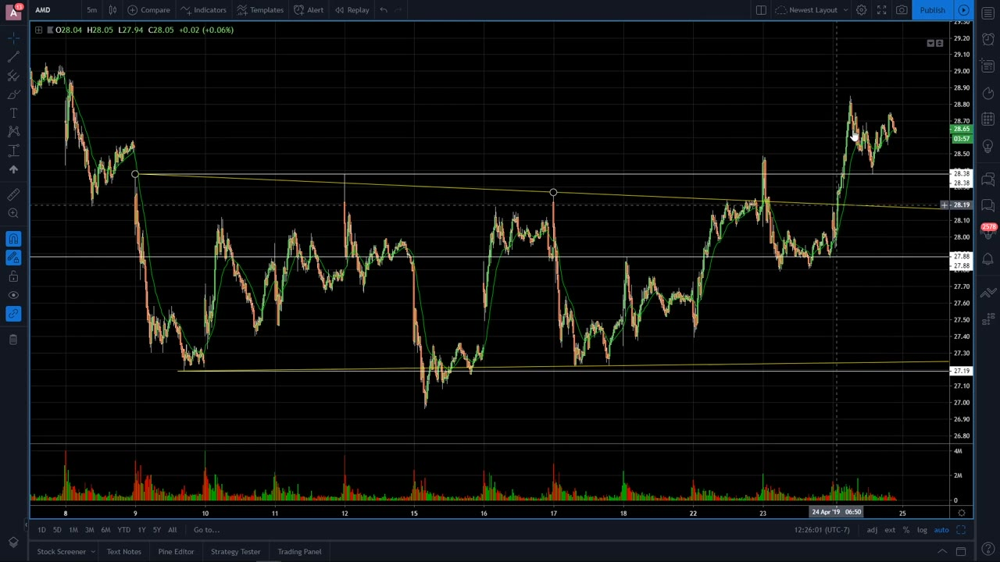

**图怎么看：**

- AMD 在日线图上显示出一个上升趋势，表明股价可能继续上涨。
- 成交量柱的高度反映对应周期内的总成交量；红绿着色通常跟随价格柱的涨跌规则，不能直接拆成两种方向的主动成交。
- 均线（黄色线条）显示了价格的趋势方向，当前价格在均线之上，表明市场处于上升趋势。
- 价格在均线附近波动，显示出市场的稳定性，投资者可以考虑在此区域进行交易

### 关键内容

- 多重时间框架分析有助于更好地理解股票市场，提高交易成功率。
- 五分钟、六十分钟和日线图是最重要的时间框架，帮助识别关键模式。
- 通过分析不同时间框架，可以更准确地预测股票走势。
- 多重时间框架分析在非日内交易中尤为重要。
- 使用多重时间框架分析可以减少交易失误，提高交易效率。
- 通过分析不同时间框架，可以更好地管理风险。
- 多重时间框架分析需要长期实践才能掌握。
- 多重时间框架分析适用于多种交易策略，包括短期交易和长期交易。
- 多重时间框架分析可以帮助识别潜在的交易机会。
- 多重时间框架分析需要结合价格行动和其他技术指标进行综合判断。

### 分析与执行顺序

1. 首先，识别股票的关键支撑和阻力水平。
2. 然后，使用不同的时间框架进行分析，以确认这些水平的有效性。
3. 接着，绘制趋势线和其他关键点，以更好地理解价格走势。
4. 最后，根据分析结果制定交易计划，并监控市场变化。
5. 在整个过程中，不断调整和优化交易策略。
6. 通过长期实践，逐步提高多重时间框架分析的能力。
7. 在交易过程中，始终关注市场变化和价格行动。

### 案例与细节

- AMD股票在日线图上显示出一个下降趋势，但在六十分钟图上形成了一个旗形形态。
- 在五分钟图上，价格测试了关键阻力水平，并最终突破了该水平。
- 通过分析不同时间框架，识别出AMD股票可能突破当前的横向整理区域。
- 在交易过程中，利用多重时间框架分析来确定止损点和目标利润。
- 通过分析不同时间框架，发现AMD股票可能在短期内出现大幅上涨。

### 风险与边界

- 多重时间框架分析需要长期实践才能熟练掌握。
- 在交易过程中，可能会遇到市场突然变化的情况，导致分析失效。
- 多重时间框架分析适用于多种交易策略，但并非适用于所有情况。
- 多重时间框架分析需要结合其他技术指标进行综合判断，否则可能导致错误的交易决策。
- 多重时间框架分析的结论可能会受到市场情绪和新闻事件的影响。

### 复盘问题

- 在多重时间框架分析中，哪些时间框架最为重要？
- 如何利用多重时间框架分析来识别潜在的交易机会？
- 在交易过程中，如何结合价格行动和其他技术指标进行综合判断？

---

## v0589：2019年4月交易回顾

> 日期：2019　·　时长：00:56:12

**本场重点：** 4月交易开始不利，但通过风险管理最终实现盈利。

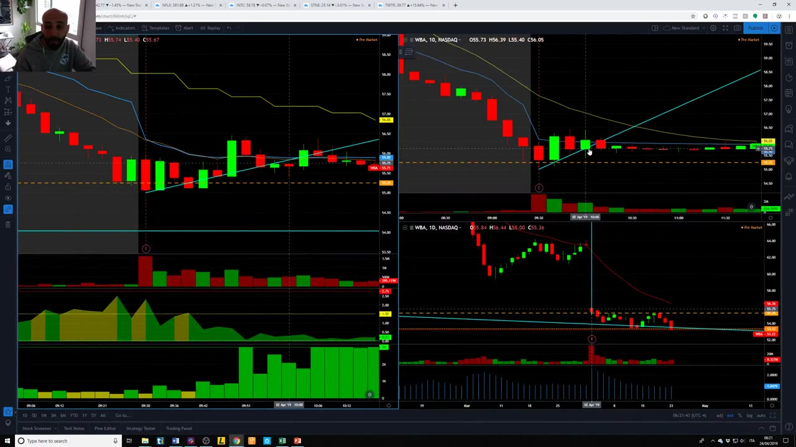

**图怎么看：**

- 在B图中，可以看到股票价格在下跌后出现反弹，显示出市场情绪的变化。
- 成交量柱的高度反映对应周期内的总成交量；红绿着色通常跟随价格柱的涨跌规则，不能直接拆成两种方向的主动成交。
- 均线图显示了价格的趋势，黄色和蓝色的均线分别表示短期和长期趋势。
- 通过观察这些图表，可以分析出市场的情绪变化和潜在的投资机会。

### 关键内容

- 4月开始交易表现不佳，前三天连续亏损。
- 通过风险管理，最终实现盈利。
- 4月17日抓住了两次交易机会，分别是在英特尔和奈飞。
- 止损设置合理，目标价格在前一日的交易范围内。
- 4月2日的交易中，止损设置在13EMA附近，避免了更大的损失。
- 4月17日的奈飞交易中，止损设置在前一日的高点附近，确保了盈利。
- 4月17日的英特尔交易中，止损设置在13EMA附近，避免了更大的损失。
- 4月17日的奈飞交易中，止损设置合理，目标价格在前一日的交易范围内。
- 4月17日的英特尔交易中，止损设置合理，目标价格在前一日的交易范围内。

### 分析与执行顺序

1. 记录4月17日的交易，包括英特尔和奈飞。
2. 分析英特尔的交易，确认止损设置在13EMA附近。
3. 分析奈飞的交易，确认止损设置在前一日的高点附近。
4. 总结4月17日的交易策略，强调风险管理的重要性。
5. 回顾4月2日的交易，确认止损设置在13EMA附近。
6. 总结4月17日的交易，确认止损设置合理，目标价格在前一日的交易范围内。

### 案例与细节

- 4月2日，WBA（Walgreens）出现大幅下跌，止损设置在13EMA附近，避免了更大的损失。
- 4月17日，奈飞（Netflix）出现大幅下跌，止损设置在前一日的高点附近，确保了盈利。
- 4月17日，英特尔（Intel）出现大幅下跌，止损设置在13EMA附近，避免了更大的损失。
- 4月17日，奈飞（Netflix）出现大幅下跌，止损设置合理，目标价格在前一日的交易范围内。
- 4月17日，英特尔（Intel）出现大幅下跌，止损设置合理，目标价格在前一日的交易范围内。

### 风险与边界

- 止损设置在13EMA附近，可能在极端情况下导致较大损失。
- 目标价格在前一日的交易范围内，可能无法实现最大利润。
- 交易策略依赖于特定股票的表现，可能在其他股票上不适用。
- 交易策略基于历史数据，可能在未来市场环境中失效。

### 复盘问题

- 4月17日的交易中，止损设置是否合理？
- 4月17日的交易中，目标价格是否在前一日的交易范围内？
- 4月17日的交易中，是否遵循了止损和目标价格的设定？

---

## v0590：使用斐波那契回撤线进行交易

> 日期：2019　·　时长：00:36:22

**本场重点：** 了解斐波那契回撤线的应用，掌握入场时机和风险管理，注意市场变化和风险。

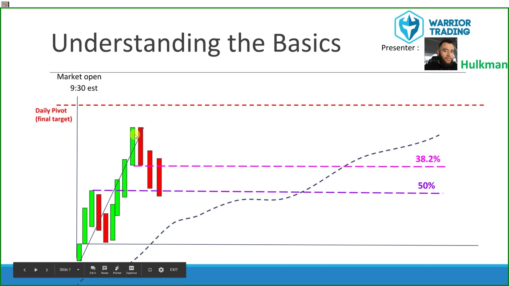

**图怎么看：**

- 在图表中，$CERN 的价格在开盘后迅速上涨，并在接近最高点时出现回调。
- 随后，价格再次上升并突破了前期高点，但未能达到预期目标。
- 这表明在尝试突破重要水平时，市场可能面临阻力。
- 投资者应谨慎操作，考虑风险管理策略。

### 关键内容

- 斐波那契回撤线用于识别价格回调的可能水平，帮助确定入场点。
- 长期趋势和短期回调需要结合使用，以提高交易准确性。
- 成交量是确认趋势反转的关键因素，特别是在突破重要水平时。
- 斐波那契水平通常用于支撑和阻力位，但不应单独作为交易依据。
- 市场波动性会影响交易策略的有效性，需灵活调整。
- 结合其他技术指标（如VWAP）可以提高交易决策的可靠性。
- 入场时机应基于价格走势和成交量的变化，而非单一指标。
- 风险控制是交易成功的关键，设置止损点至关重要。
- 市场环境变化会影响交易策略的效果，需持续监控。
- 交易者应根据自己的交易风格选择合适的斐波那契水平

### 分析与执行顺序

1. 首先，识别市场趋势和价格回调的可能水平。
2. 使用斐波那契回撤线标记关键支撑和阻力位。
3. 观察成交量的变化，确认趋势反转的可能性。
4. 结合其他技术指标（如VWAP），进一步确认入场时机。
5. 设置止损点，控制风险。
6. 根据市场变化调整交易策略，保持灵活性。
7. 记录每次交易的结果，总结经验教训，不断优化策略

### 案例与细节

- ticker：MU；price_level：38.2%；volume_change：显著增加；entry_point：在38.2%水平附近；stop_loss：低于VWAP；profit_target：200日均线
- ticker：FB；price_level：38.2%；volume_change：保持稳定；entry_point：在38.2%水平附近；stop_loss：低于VWAP；profit_target：200日均线
- ticker：LYFT；price_level：38.2%；volume_change：显著增加；entry_point：在38.2%水平附近；stop_loss：低于VWAP；profit_target：200日均线

### 风险与边界

- 市场波动性增加时，斐波那契水平的可靠性会降低。
- 单独依赖斐波那契水平进行交易可能导致亏损。
- 市场环境变化会影响交易策略的效果，需持续监控。
- 交易者应根据自己的交易风格选择合适的斐波那契水平，避免盲目跟风。
- 交易者应定期回顾交易记录，总结经验教训，不断优化策略

### 复盘问题

- 如何识别市场趋势和价格回调的可能水平？
- 如何结合其他技术指标（如VWAP）来确认入场时机？
- 如何设置止损点以控制风险？
- 如何根据市场变化调整交易策略？
- 如何总结交易经验，优化交易策略？

---

## v0591：使用TradingView自定义指标优化个人交易

> 日期：2019　·　时长：00:55:03

**本场重点：** 本视频讲解如何使用TradingView的PineScript编写自定义指标，以优化个人交易策略。

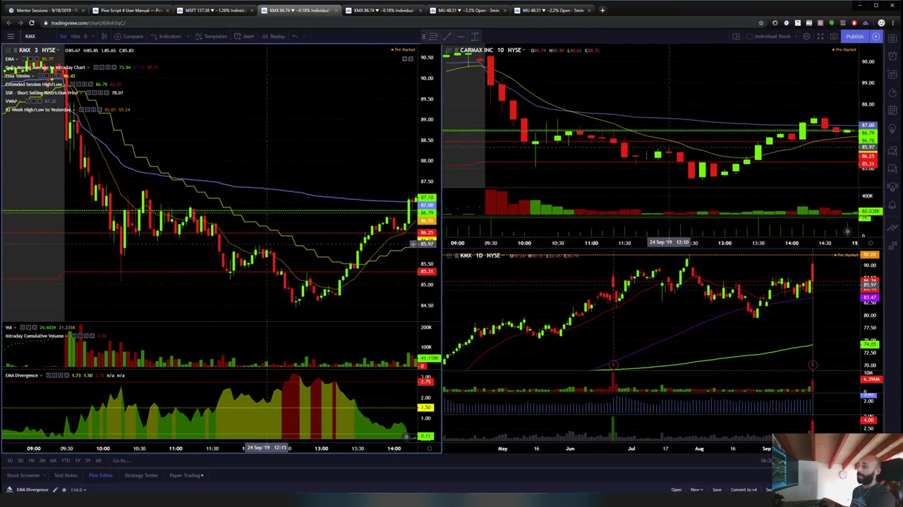

**图怎么看：**

- 画面中，显示了TradingView平台上的一个自定义指标的设置界面。
- 用户正在调整EMA Divergence指标的参数，包括EMA周期、最小基底百分比和最大偏差。
- 通过这些参数的调整，用户可以优化其交易策略。
- 画面中的代码展示了如何使用PineScript编写自定义指标，这有助于提高交易决策的准确性。

### 关键内容

- TradingView提供了PineScript编程语言，允许用户创建自定义指标和交易策略。
- Roberto建议用户在创建指标时考虑其他潜在使用者的需求，以增加指标的适用范围。
- EMA（指数移动平均）指标被用于检测价格与特定EMA之间的背离情况。
- 用户可以通过调整输入参数来自定义指标，如选择不同的EMA周期或设置背离阈值。
- 指标的颜色可以根据背离程度的不同而变化，以帮助识别交易信号。
- 用户可以在设置中自定义指标的外观，包括颜色和透明度等。
- 指标可以显示当前价格与选定EMA之间的背离，帮助识别交易机会。
- 指标的绘制方式可以根据用户需求进行调整，包括显示历史数据或仅显示当前值。
- 通过使用自定义指标，用户可以更好地根据自己的交易风格优化交易策略。
- 指标的绘制方式可以灵活调整，以适应不同用户的偏好

### 分析与执行顺序

1. Roberto首先介绍了TradingView提供的PineScript编程语言及其用途。
2. 他解释了如何使用PineScript编写自定义指标，包括设置输入参数和绘制指标的方法。
3. Roberto强调了在创建指标时考虑其他潜在使用者的重要性，以增加指标的适用范围。
4. 他展示了如何使用PineScript编写一个检测价格与选定EMA之间背离的指标。
5. Roberto演示了如何通过调整输入参数来自定义指标，如选择不同的EMA周期或设置背离阈值。
6. 他解释了如何在设置中自定义指标的外观，包括颜色和透明度等。
7. 最后，他展示了如何根据用户需求调整指标的绘制方式，包括显示历史数据或仅显示当前值

### 案例与细节

- Roberto使用了13作为默认的EMA周期，并允许用户通过输入参数自定义。
- 他设置了两个背离阈值，分别为1.5%和2.75%，并在达到这些阈值时改变颜色。
- 用户可以选择显示绝对值或百分比值，以及是否显示历史数据或仅显示当前值。
- Roberto展示了如何通过调整输入参数来优化指标，以更好地适应不同的交易风格。
- 他使用了TradingView的PynScript编辑器来编写和测试自定义指标的代码。
- Roberto还强调了在设置中自定义指标外观的重要性，包括颜色和透明度等

### 风险与边界

- 录制于2019年，部分信息可能已发生变化，需确认最新规则。
- 用户需要具备一定的编程基础才能理解并使用PineScript。
- 指标的有效性取决于市场条件和用户的选择，可能无法适用于所有情况。
- 用户需要定期更新指标以适应市场的变化，否则可能失去有效性

### 复盘问题

- 你如何使用PineScript编写自定义指标？
- 你如何确保你的指标适用于不同的交易风格？
- 你如何调整指标的绘制方式以适应你的需求？

---

## v0592：交易心理与自我破坏

> 日期：2019　·　时长：01:07:59

**本场重点：** 交易心理的重要性在于克服自我破坏，实现持续盈利。

**图怎么看：**

- 这张幻灯片列出了影响交易的五个方面。
- 这些方面包括兴奋导致的过度自信、贪婪干扰交易思维、不相信自己值得成功、稀缺思维以及不愿意承担损失。
- 这些因素对交易者的表现有着显著的影响。
- 通过理解并应对这些因素，交易者可以提高自己的交易水平。

### 关键内容

- 交易成功不仅仅是技术理解，还需要情感理解。
- 自我破坏是导致交易者无法达到持续盈利的主要原因。
- 过度自信和贪婪是常见的自我破坏表现。
- 缺乏自信和稀缺思维也是自我破坏的表现。
- 交易者需要学会接受损失，这是成功的关键。
- 通过自我反思和调整，可以减少自我破坏。
- 交易计划的严格执行是避免自我破坏的关键。
- 交易者需要逐步增加交易规模，而不是突然大幅增加。
- 通过冥想提高专注力和纪律性是有效的方法。
- 记录自己的交易过程有助于自我反省

### 分析与执行顺序

1. 讲师首先定义了交易心理的重要性。
2. 然后介绍了自我破坏的概念及其常见表现。
3. 接着提出了克服自我破坏的方法。
4. 最后分享了一个真实案例，展示了自我破坏的影响。
5. 讲师还提供了具体的建议，如逐步增加交易规模。
6. 通过冥想提高专注力和纪律性。
7. 记录自己的交易过程以进行自我反省

### 案例与细节

- 一位交易者在连续几次盈利后变得过于自信，最终导致亏损。
- 另一位交易者因为担心失败而不敢采取行动，错失了多次机会。
- 一位交易者在连续几次盈利后开始频繁追涨杀跌，最终导致亏损。
- 一位交易者在连续几次亏损后变得极度悲观，放弃了交易。
- 一位交易者在连续几次盈利后开始频繁追加仓位，最终导致爆仓

### 风险与边界

- 自我破坏可能在任何阶段发生，即使是有经验的交易者也可能遇到。
- 过度自信和贪婪可能导致重大亏损，尤其是在市场波动较大时。
- 缺乏自信可能导致错过机会，尤其是在市场趋势明显时。
- 稀缺思维可能导致过度谨慎，影响交易决策。
- 录制年代限制为2019年，因此某些市场条件和规则可能已发生变化。
- 自我反省和调整需要时间和实践，短期内可能看不到明显效果

### 复盘问题

- 你能描述一次自我破坏的经历吗？
- 你如何在交易中保持冷静和专注？
- 你如何确保严格执行交易计划？
- 你如何逐步增加交易规模而不造成重大风险？
- 你如何通过冥想提高自己的专注力和纪律性？

---

## v0593：如何应用样本集

> 日期：2019　·　时长：01:01:24

**本场重点：** 样本集是克服心理障碍的有效工具，但需要长时间坚持才能见效。

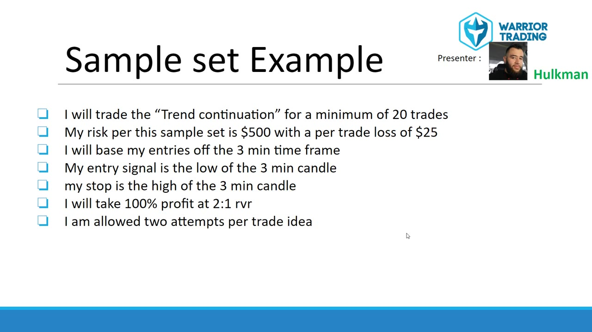

**图怎么看：**

- “Sample set Example”把策略测试写成可重复规则：至少做 20 笔趋势延续交易，总风险预算 500 美元，每笔计划亏损 25 美元。
- 信号统一来自三分钟周期：入场设在三分钟蜡烛低点，止损设在该蜡烛高点，避免每笔交易临时改变判断标准。
- 盈利规则是达到 2:1 风险回报时全部退出，每个交易想法最多允许两次尝试；这些约束让结果能够在相同条件下比较。
- 20 笔只是示范起点，无法保证统计稳定；执行时还要记录滑点、手续费、漏单和是否严格遵守规则，不能只挑盈利样本。

### 关键内容

- 样本集是一种严格的方法论，旨在帮助交易者克服心理障碍。
- 样本集通常包括20到25次交易，每次交易的风险和收益需明确。
- 交易者需要在心理上准备好面对连续失败的可能性。
- 样本集的应用需要长期坚持，短期内难以见效。
- 样本集的目标是克服心理障碍，而不是追求盈利。
- 交易者需要制定严格的规则集，并在样本集中严格执行。
- 样本集可以应用于任何心理障碍，如犹豫、贪婪等。
- 交易者需要在策略开发完成后才开始应用样本集。
- 样本集可以帮助交易者提高执行力，减少情绪波动。

### 分析与执行顺序

1. 首先，确定要克服的心理障碍，如犹豫、贪婪等。
2. 制定严格的样本集规则集，包括交易次数、风险金额等。
3. 在样本集中严格执行规则，不偏离目标。
4. 记录每次交易的结果，分析成功与失败的原因。
5. 根据样本集的结果调整策略，逐步克服心理障碍。
6. 长期坚持样本集，直到心理障碍完全克服。

### 案例与细节

- 讲师提到自己曾通过样本集克服了犹豫的心理障碍，从一开始犹豫不决到后来能够果断执行。
- 样本集要求交易者在模拟环境中进行20次交易，每次交易的风险为$500。
- 讲师分享了一个具体的样本集例子，其中包含详细的交易规则和心理障碍克服过程。
- 交易者在样本集中严格执行规则，即使遇到连续失败也不轻易放弃。
- 通过样本集，交易者逐渐学会了如何在市场中保持冷静，克服情绪波动。

### 风险与边界

- 样本集需要长期坚持，短期内难以见效，可能会让交易者感到沮丧。
- 样本集的应用需要交易者具备较高的自律性，否则难以坚持下去。
- 样本集的成功依赖于交易者的心理素质和市场经验，不同人可能效果不同。
- 样本集的录制年代为2018-2021年，当前市场环境可能有所不同。

### 复盘问题

- 你希望通过样本集克服哪种心理障碍？
- 在样本集中，你遇到了哪些挑战？
- 你如何评估样本集的效果？

---

## v0594：如何阅读盘面和水平二

> 日期：2019　·　时长：01:54:59

**本场重点：** 交易者应完全致力于成为最佳，并准备好从错误中学习。制定业务计划是关键。

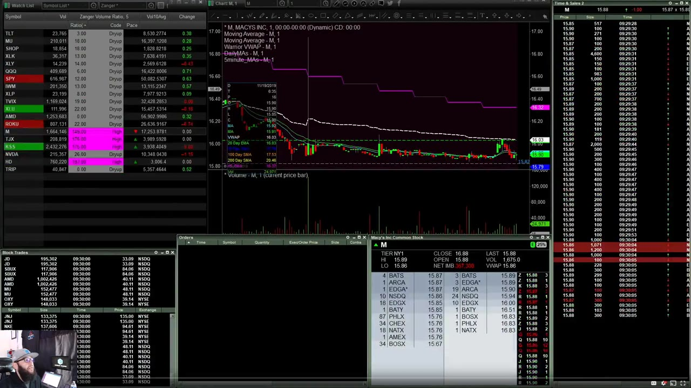

**图怎么看：**

- Level 2 图表提供了即时的市场流动性和买卖价差信息。
- 通过观察 Level 2 图表，交易者可以快速识别市场的买卖力量。
- 在本图中，可以看到多个股票的买卖价差和成交量。
- 这些数据对于做出即时交易决策至关重要。

### 关键内容

- 交易是一种业务，需要制定计划。没有分析，交易就像赌博。
- 盘面阅读提供即时市场心理信息，是领先指标。时间与销售数据是实时信息，而图表是滞后信息。
- 通过观察买卖订单的分布，可以识别市场中的空洞或口袋。例如，大量买家聚集在低价位，表明市场可能正在低球定价。
- 当价格在低点附近时，会看到买单堆积，随后出现大量卖单。这是市场情绪变化的信号。
- 交易者需要意识到市场行为是由人类心理驱动的，因此需要不断学习和适应市场变化。
- 反复练习和自我分析是培养直觉的关键。直觉可以帮助你在市场中做出决策。
- 交易者应完全致力于成为最佳，并准备好从错误中学习。制定业务计划是关键。
- 没有分析，交易就像赌博。交易者需要不断学习和适应市场变化。
- 通过反复练习来培养直觉，特别是在交易记录中寻找市场信号。
- 通过观察买卖订单的分布，可以识别市场中的空洞或口袋。例如，大量买家聚集在低价位，表明市场可能正在低球定价，这是市场情绪变化的信号。
- 当价格在低点附近时，会看到买单堆积，随后出现大量卖单。这是市场情绪变化的信号，表明市场可能正在测试支撑位，如果卖单持续增加，可能预示着进一步下跌。
- 反复练习和自我分析是培养直觉的关键。直觉可以帮助你在市场中做出决策，尤其是在交易记录中寻找市场信号，通过反复观看交易记录，可以更好地理解市场行为模式。
- 交易者需要意识到市场行为是由人类心理驱动的，因此需要不断学习和适应市场变化。例如，当市场情绪高涨时，可能会出现大量买单，但随后出现大量卖单，这可能是情绪反转的信号。
- 制定业务计划是关键。没有分析，交易就像赌博。交易者需要建立详细的交易计划，包括风险管理策略、止损点和盈利目标，以确保交易行为是有组织和有计划的。

### 分析与执行顺序

1. 通过观察买卖订单的分布，识别市场中的空洞或口袋。
2. 当价格在低点附近时，会看到买单堆积，随后出现大量卖单。这是市场情绪变化的信号。
3. 通过反复练习来培养直觉，特别是在交易记录中寻找市场信号。
4. 交易者需要意识到市场行为是由人类心理驱动的，因此需要不断学习和适应市场变化。
5. 制定业务计划是关键。没有分析，交易就像赌博。

### 案例与细节

- 当价格在低点附近时，会看到买单堆积，随后出现大量卖单。这是市场情绪变化的信号。
- 通过反复练习来培养直觉，特别是在交易记录中寻找市场信号。
- 交易者应完全致力于成为最佳，并准备好从错误中学习。制定业务计划是关键。
- 当价格测试低点时，会看到买单堆积，随后出现大量卖单。当价格未能突破低点时，会出现短暂停滞，然后大量买家再次进入市场。
- 当价格测试低点时，会看到买单堆积，随后出现大量卖单。例如，在某大型股票市场中，当价格接近100美元时，突然出现大量买单，但随后几分钟内，大量卖单涌出，表明市场情绪可能正在发生变化。
- 通过反复练习来培养直觉，特别是在交易记录中寻找市场信号。例如，通过观察某股票在不同时间段的买卖订单分布，可以发现特定模式，如在开盘半小时内，大量买单聚集在105美元附近，随后出现大量卖单，这可能是市场情绪变化的信号。
- 交易者应完全致力于成为最佳，并准备好从错误中学习。例如，某交易者在某股票上连续几次失误，每次都看到支持信号后立即入场，但随后被卖出，最终通过反思和调整策略，提高了交易成功率。

### 风险与边界

- 交易者仅依赖图表模式而不理解市场底层机制时，容易失败。例如，看到支持信号后立即入场，但随后被卖出。
- 市场行为是由人类心理驱动的，因此需要不断学习和适应市场变化。
- 交易者需要意识到市场行为是由人类心理驱动的，因此需要不断学习和适应市场变化。
- 当交易者仅依赖图表模式而不理解市场底层机制时，容易失败。例如，看到支持信号后立即入场，但随后被卖出，这可能是由于市场情绪突然反转，导致卖单大量涌入。
- 市场行为是由人类心理驱动的，因此需要不断学习和适应市场变化。例如，当市场情绪高涨时，可能会出现大量买单，但随后出现大量卖单，这可能是情绪反转的信号，如果交易者没有及时调整策略，可能会遭受损失。
- 交易者需要意识到市场行为是由人类心理驱动的，因此需要不断学习和适应市场变化。例如，当市场情绪低迷时，可能会出现大量卖单，但如果交易者没有及时调整策略，可能会错过反弹机会。

### 复盘问题

- 如何通过观察买卖订单的分布来识别市场中的空洞或口袋？
- 当价格在低点附近时，会看到什么现象？这代表什么市场信号？
- 如何通过反复练习来培养直觉？
- 交易者应如何从错误中学习？

---

## v0595：股票选择过程

> 日期：2019　·　时长：00:58:43

**本场重点：** 股票选择过程对于成功交易至关重要，需要准备充分，建立自己的筛选标准，并严格执行。

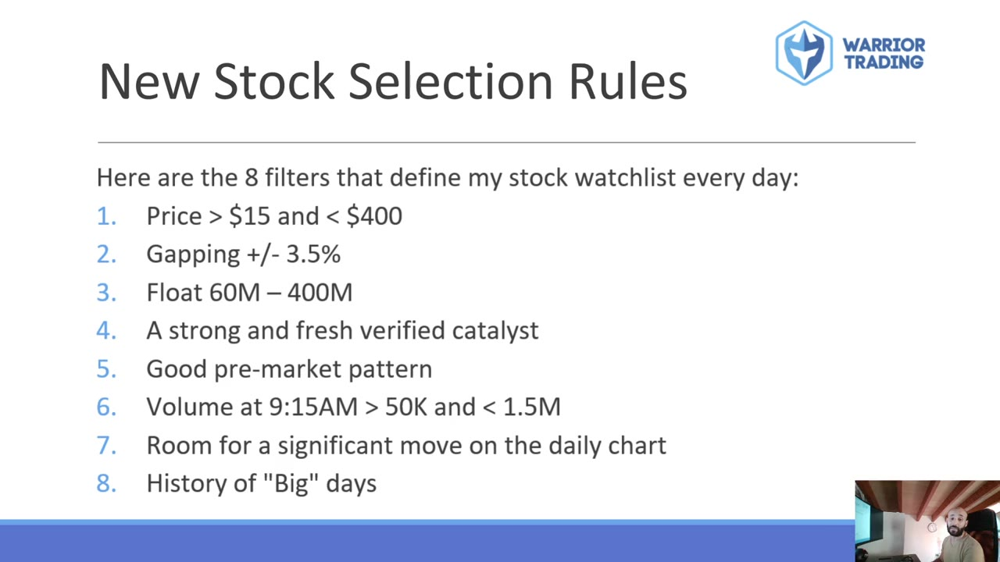

**图怎么看：**

- 这张图片展示了一个股票选择过程中的详细规则，包括价格范围、缺口、流通股、催化剂、市场前一日表现等8个筛选条件。
- 通过这些规则，投资者可以筛选出符合特定条件的股票，从而提高投资的成功率。
- 图片中还显示了具体的股票名称及其在不同条件下的评分，帮助投资者做出更明智的投资决策。
- 这些规则和评分系统为投资者提供了一个标准化的方法来评估和选择潜在的投资标的。

### 关键内容

- Roberto Barbaro 提出了自己的股票选择标准，包括价格范围、缺口、浮动量等。
- 他强调了每天进行股票选择的重要性，建议至少花费一小时。
- 选择的股票需要符合特定的标准，如价格在 15 到 400 美元之间，有明显的缺口，浮动量适中等。
- 他使用了一个 Excel 表格来实施这个过程，帮助自己更好地进行交易。
- 选择的股票需要有良好的日线图和技术指标支持。
- 他特别强调了历史大日的筛选标准，这有助于判断股票是否具有潜力。
- 他建议每天进行股票选择，以确保交易计划的顺利实施。
- 他提到，即使 A+ 质量的股票也不一定能成功，因此需要灵活调整策略。
- 他使用了一个具体的例子，展示了如何根据历史大日来判断股票的选择标准。
- 他强调了制定自己的股票选择标准的重要性，而不是依赖他人或扫描器。

### 分析与执行顺序

1. Roberto Barbaro 首先介绍了自己建立的股票选择标准，包括价格范围、缺口、浮动量等。
2. 然后，他使用了一个 Excel 表格来实施这个过程，帮助自己更好地进行交易。
3. 每天进行股票选择，确保交易计划的顺利实施。
4. 选择的股票需要符合特定的标准，如价格在 15 到 400 美元之间，有明显的缺口，浮动量适中等。
5. 选择的股票需要有良好的日线图和技术指标支持。
6. 他特别强调了历史大日的筛选标准，这有助于判断股票是否具有潜力。

### 案例与细节

- NXPI 和 GRUB 是两个具体的股票例子，NXPI 因为设置了理想的交易模式而被选中。
- Roku 是一个很好的例子，因为它在过去的大日中表现良好，具有重复的模式。
- Boeing Airlines 和 Y&DX 也符合他的筛选标准，但最终没有被选中。
- S-Gen 在 21 日的表现很好，符合他的筛选标准，最终被选中。
- RH 在预市场模式中表现不佳，但历史上有大日表现，因此被选中。

### 风险与边界

- 录制年代限制，这些规则适用于 2019 年左右的情况，可能需要更新。
- 股票选择标准可能会随着市场变化而改变，需要定期调整。
- 即使 A+ 质量的股票也不一定能成功，因此需要灵活调整策略。
- 历史大日的筛选标准可能需要根据具体情况进行调整。

### 复盘问题

- 你如何确定哪些股票符合你的筛选标准？
- 你如何根据历史大日来判断股票的选择标准？
- 你如何确保每天进行股票选择的过程？
- 你如何处理不符合筛选标准的股票？

---

## v0596：如何管理大股票名单

> 日期：2019　·　时长：00:57:53

**本场重点：** 在高机会期如何保持冷静，选择正确的股票进行交易。

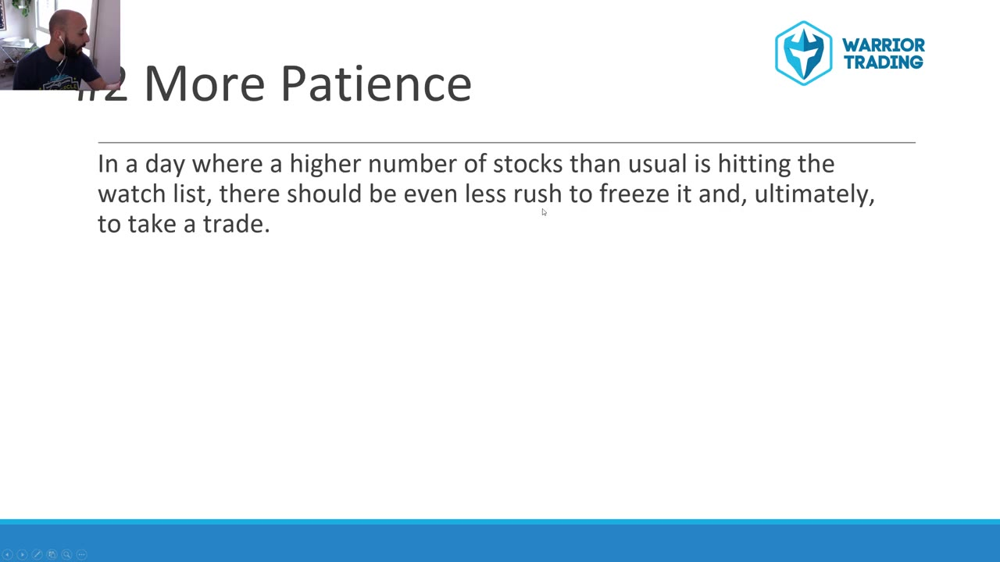

**图怎么看：**

- 在高机会期如何保持冷静，选择正确的股票进行交易。
- 建议投资者在市场波动较大时，保持耐心，不急于做出决策。
- 通过建立一个适合同时监控的股票数量，提高选择正确股票的能力。
- 制定明确的交易规则，确保在繁忙的日子里也能遵守这些规则。

### 关键内容

- 在高机会期，选择性更强，耐心等待最佳时机。
- 建立自己的股票名单，选择性地关注潜在的股票。
- 在开盘前，根据技术图表不断调整股票名单的优先级。
- 避免因市场波动而做出冲动的交易决策。
- 使用计时器避免在同一股票上连续交易。
- 制定明确的交易规则，并严格遵守。
- 在高机会期，保持耐心，避免过度交易。
- 在开盘后，专注于个别股票的交易，而不是整个名单。
- 在交易过程中，保持纪律，避免报复性交易。
- 在高机会期，保持冷静，避免盲目跟随市场情绪

### 分析与执行顺序

1. 每天早上打开几个股票，根据技术图表重新排列优先级。
2. 在开盘前，根据技术图表调整股票名单的优先级。
3. 在开盘后，专注于个别股票的交易，而不是整个名单。
4. 使用计时器避免在同一股票上连续交易。
5. 制定明确的交易规则，并严格遵守。
6. 在高机会期，保持冷静，避免盲目跟随市场情绪

### 案例与细节

- 在开盘前，根据技术图表调整股票名单的优先级，例如将微软从首选名单中移除。
- 在开盘后，专注于个别股票的交易，例如特斯拉和苹果。
- 使用计时器避免在同一股票上连续交易，例如在开盘后的10分钟内。
- 制定明确的交易规则，例如只在技术图表显示正确信号时才进行交易。
- 在开盘后，专注于个别股票的交易，例如特斯拉和苹果，而不是整个名单

### 风险与边界

- 在高机会期，可能会遇到更多的市场波动，需要保持冷静。
- 在开盘后，可能会遇到更多的市场噪音，需要专注于个别股票。
- 在高机会期，可能会遇到更多的冲动交易，需要使用计时器避免。
- 在高机会期，可能会遇到更多的市场情绪波动，需要保持纪律。
- 在高机会期，可能会遇到更多的市场不确定性，需要制定明确的交易规则

### 复盘问题

- 在高机会期，如何保持冷静并选择正确的股票进行交易？
- 在开盘前，如何根据技术图表调整股票名单的优先级？
- 在开盘后，如何专注于个别股票的交易，而不是整个名单？
- 如何使用计时器避免在同一股票上连续交易？
- 如何制定明确的交易规则，并严格遵守？

---

## v0597：如何使用股票扫描器（TradingView）

> 日期：2019　·　时长：00:59:36

**本场重点：** 了解如何使用TradingView的股票扫描器进行预市盘筛选，掌握关键设置和过滤条件。

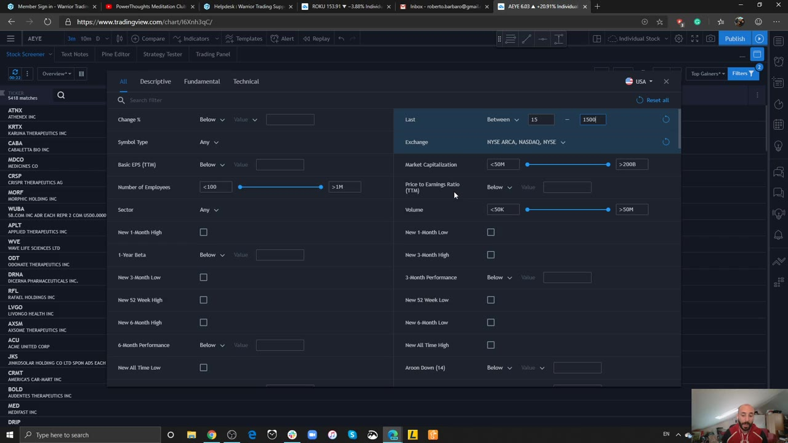

**图怎么看：**

- 画面中，用户正在使用TradingView的股票扫描器进行预市盘筛选。
- 用户可以调整多个筛选条件，如价格范围、市场资本化、市盈率等。
- 此外，用户还可以选择特定的交易所、行业和日期来进一步细化筛选。
- 这些高级设置帮助用户快速找到符合特定条件的股票，以便进行更深入的研究和分析。

### 关键内容

- TradingView提供了强大的股票扫描功能，适用于预市盘筛选。
- 可以自定义筛选条件，如交易所、最后价格、浮动股份等。
- 设置过滤条件时要灵活，避免过于严格的要求。
- 使用平均真实波动范围来避免国际市场的大幅跳空。
- 保存筛选器设置，方便日后重复使用。
- 结合其他工具（如Trade Ideas）进行更全面的市场分析。
- 注意TradingView的数据可能有轻微延迟，但不影响主要分析。
- 使用TradingView进行远程交易时，确保网络连接稳定。
- 设置合理的浮动股份范围，以适应不同类型的股票。
- 利用TradingView的图表功能，进行技术分析

### 分析与执行顺序

1. 打开TradingView页面，找到股票筛选器。
2. 设置刷新频率，选择每分钟自动刷新。
3. 添加筛选条件，如交易所、最后价格等。
4. 保存筛选器设置，以便日后使用。
5. 根据需要调整筛选条件，如增加或删除过滤项。
6. 保存调整后的筛选器设置，覆盖原有设置。
7. 点击筛选器名称，查看筛选结果并进行进一步分析

### 案例与细节

- 使用TradingView筛选器，设置交易所为ARCA、NASDAQ和纽约证券交易所。
- 设置最后价格范围为15到1500美元，以适应不同质量的股票。
- 添加平均真实波动范围，设置为48美分以上，避免国际市场的大幅跳空。
- 保存筛选器设置，命名为'预市盘移动者'。
- 调整筛选条件，如增加即将到来的财报日期，设置为今天。
- 保存调整后的筛选器设置，命名为'今日财报'，用于筛选即将发布财报的股票

### 风险与边界

- TradingView的数据可能存在轻微延迟，但不会影响主要分析。
- 设置过于严格的筛选条件可能导致错过潜在的好股票。
- 使用TradingView进行远程交易时，网络连接不稳定会影响操作。
- 浮动股份范围设置过低，可能导致错过流动性较好的股票。
- 忽略其他市场数据来源，可能导致信息不全

### 复盘问题

- 如何设置和保存股票筛选器？
- 在设置筛选条件时，需要注意哪些关键点？
- 使用TradingView进行远程交易时，有哪些注意事项？

---

## v0598：高概率趋势线绘制方法

> 日期：2019　·　时长：00:29:59

**本场重点：** 通过市场重大波动点绘制趋势线，提高技术分析准确性；使用最重大波动点绘制趋势线，确保反应准确。

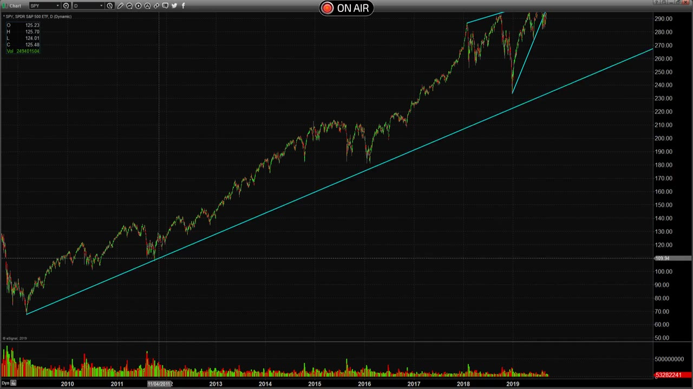

**图怎么看：**

- 这张图表显示了标普500指数（SPY）的价格走势。
- 图表上可以看到价格在2018年到2019年间持续上升。
- 红色水平线标记了重要的价格水平，可能用于绘制趋势线。
- 绿色柱状图表示成交量，可以观察到价格变动时的成交量变化。

### 关键内容

- 讲师指出，趋势线具有高度主观性，需要去除主观性以提高技术分析的准确性。
- 通过市场重大波动点绘制趋势线，可以提高趋势线的准确性。
- 使用市场重大波动点作为锚点，可以绘制出高概率趋势线。
- 使用E-Signal工具可以精确锚定趋势线到低点。
- 在不同时间框架下绘制趋势线，需要调整锚定点。
- 结合使用趋势线和支撑阻力点，可以提高决策准确性。
- 使用市场重大波动点绘制的趋势线，可以更准确地预测市场反应。
- 使用多个趋势线和支撑阻力点，可以提高交易决策的可靠性。
- 使用市场重大波动点绘制的趋势线，可以更好地捕捉市场趋势。
- 使用市场重大波动点绘制的趋势线，可以提高交易决策的准确性

### 分析与执行顺序

1. 讲师首先介绍了趋势线的概念及其主观性。
2. 然后通过SPY图表演示了如何通过市场重大波动点绘制趋势线。
3. 接着讲解了如何使用E-Signal工具精确锚定趋势线。
4. 进一步解释了如何在不同时间框架下绘制趋势线。
5. 最后强调了结合使用趋势线和支撑阻力点的重要性。
6. 通过实际案例演示了如何使用市场重大波动点绘制趋势线。
7. 总结了使用市场重大波动点绘制的趋势线的优势

### 案例与细节

- 使用SPY图表，通过市场重大波动点绘制了两条趋势线。
- 使用Roku图表，通过市场重大波动点绘制了支持和阻力趋势线。
- 使用FedEx图表，通过市场重大波动点绘制了趋势线，但发现趋势线较少。
- 使用Amazon图表，通过市场重大波动点绘制了趋势线。
- 使用Roku图表，通过市场重大波动点绘制了趋势线，并测试了其有效性

### 风险与边界

- 录制年代限制，此方法适用于当前市场环境。
- 使用市场重大波动点绘制的趋势线可能失效，需结合其他分析工具。
- 不同时间框架下的趋势线需要调整锚定点，否则可能不准确。
- 市场环境变化可能导致趋势线失效，需持续监控市场动态。
- 依赖单一趋势线进行交易可能风险较大，需结合其他分析工具

### 复盘问题

- 如何通过市场重大波动点绘制趋势线？
- 使用E-Signal工具可以精确锚定趋势线到低点，具体步骤是什么？
- 在不同时间框架下绘制趋势线时，需要注意哪些事项？
- 结合使用趋势线和支撑阻力点，可以提高决策准确性，具体如何操作？

---

## v0599：交易回顾与策略分析

> 日期：2019　·　时长：01:04:08

**本场重点：** 通过案例分析，了解如何处理交易中的红盘，并制定合理的交易计划。

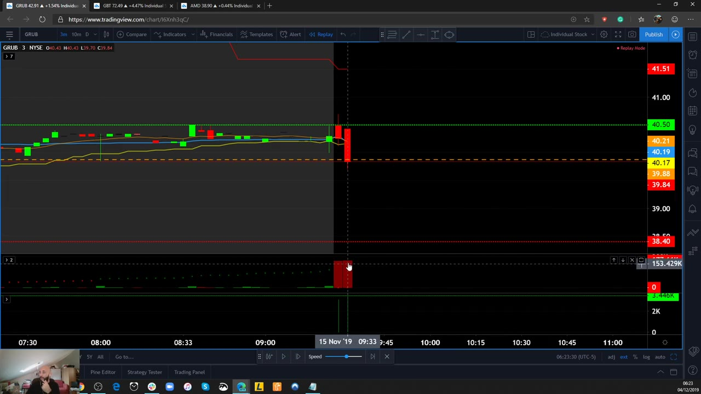

**图怎么看：**

- 在1346秒时，可以看到NASDAQ指数的K线图，显示出红色和绿色的蜡烛形状，代表开盘价、最高价、最低价和收盘价。
- 成交量柱的高度反映对应周期内的总成交量；红绿着色通常跟随价格柱的涨跌规则，不能直接拆成两种方向的主动成交。
- 此截图有助于理解市场波动性和交易者行为，对于分析交易策略至关重要。
- 通过观察这些数据，可以识别出市场的趋势和潜在的交易机会。

### 关键内容

- 交易者在开盘前未听到过该股票名称，但决定将其加入自己的关注列表。
- 开盘时出现技术缺口，但成交量并未达到预期，表明市场情绪较为谨慎。
- 交易者使用3分钟和10分钟图表进行交易管理，但有时会在1分钟图表寻找入场点。
- 交易者在开盘后迅速卖出，显示出对市场波动的敏感度。
- 交易者在多次交易中未能遵循既定计划，导致连续亏损。
- 交易者在特斯拉等股票上尝试高时间框架交易策略，但效果不佳。
- 交易者在某些情况下未能及时止损，导致不必要的亏损。
- 交易者在某些股票上尝试追涨杀跌，但效果不佳，导致亏损。
- 交易者在多次交易中未能有效利用止损单，导致亏损加剧。

### 分析与执行顺序

1. 分析交易者的交易记录，识别其交易习惯和策略。
2. 讨论交易者在不同股票上的表现，分析其成功和失败的原因。
3. 探讨交易者在交易过程中遇到的问题，如市场波动和情绪影响。
4. 总结交易者在交易中的失误，如未能遵循既定计划和追涨杀跌。
5. 提出改进交易策略的建议，包括设置止损单和合理规划交易计划。
6. 分享交易者在不同股票上的交易经历，以供其他交易者参考。
7. 讨论交易者在交易中的心理因素，如恐惧和贪婪的影响。

### 案例与细节

- GrabGRUB：开盘价为3983，交易者在3983附近设置了止损单，但市场迅速下跌，导致交易者亏损。
- Tesla：交易者在特斯拉上尝试高时间框架交易策略，但市场波动较大，导致交易者未能盈利。
- Cisco：交易者在Cisco上尝试追涨杀跌，但市场并未按照预期走势发展，导致交易者亏损。
- WB：交易者在WB上尝试追涨杀跌，但市场并未按照预期走势发展，导致交易者亏损。
- Disney：交易者在Disney上尝试追涨杀跌，但市场并未按照预期走势发展，导致交易者亏损。

### 风险与边界

- 交易者在多次交易中未能有效止损，导致不必要的亏损。
- 交易者在某些股票上尝试追涨杀跌，但效果不佳，导致亏损。
- 交易者在多次交易中未能遵循既定计划，导致连续亏损。
- 交易者在某些股票上尝试高时间框架交易策略，但效果不佳，导致亏损。
- 交易者在多次交易中未能有效利用止损单，导致亏损加剧。

### 复盘问题

- 交易者在哪些情况下未能遵循既定计划？
- 交易者在哪些股票上尝试追涨杀跌，但效果不佳？
- 交易者在哪些情况下未能及时止损？
- 交易者在哪些股票上尝试高时间框架交易策略，但效果不佳？
- 交易者在哪些情况下未能有效利用止损单？

---

## v0600：股票交易回顾与分析

> 日期：2019　·　时长：01:06:00

**本场重点：** 通过具体案例分析交易策略，强调风险管理和计划的重要性。

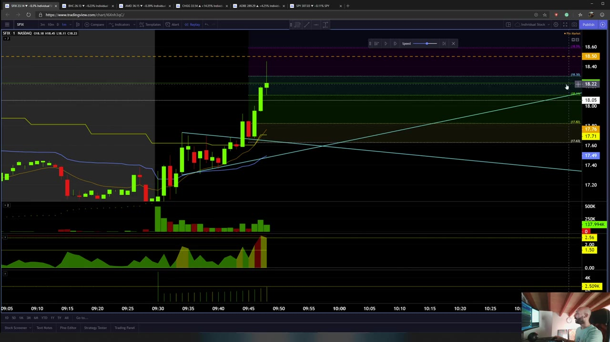

**图怎么看：**

- 在1分钟时间框架上观察到一个回调，然后切换回3分钟。
- 虽然执行效果不佳，但考虑到股票正在快速下跌，我可能能够找到一个小回调来入场。
- 我在1分钟时间框架上观察到我认为会下跌的小回调，但实际上它似乎是在重新测试。
- 没有选择平仓并重新开始，而是等待会发生什么，因为它仍然低于13ema。

### 关键内容

- 交易者使用一分钟图表寻找回调机会，但实际操作中可能未出现回调。
- 止损设置在关键支撑位下方，可能导致较大亏损。
- 交易者在关键支撑位附近等待确认，但实际操作中未能确认。
- 交易者使用斐波那契回撤工具进行风险回报分析。
- 交易者在关键阻力位附近进行交易，但实际操作中未能突破。
- 交易者在关键支撑位附近进行交易，但实际操作中未能确认。
- 交易者使用三分钟图表进行交易，但实际操作中未能达到预期效果。
- 交易者使用斐波那契回撤工具进行风险回报分析，但实际操作中未能达到预期效果。

### 分析与执行顺序

1. 查看股票的开盘价和关键支撑阻力位。
2. 分析交易者如何使用斐波那契回撤工具进行风险回报分析。
3. 识别交易者在关键支撑位附近进行交易的具体时间点。
4. 评估交易者在关键阻力位附近进行交易的实际效果。
5. 总结交易者在关键支撑位附近进行交易的具体步骤。

### 案例与细节

- SFIX股票在开盘时测试了1850区域的关键支撑位，但未能突破。
- GRUB股票在开盘时测试了2050区域的关键支撑位，但未能突破。
- ENPH股票在开盘时测试了2026区域的关键支撑位，但未能突破。
- 交易者在关键支撑位1850附近设置了止损，但在实际操作中未能突破。
- 交易者在关键支撑位2050附近设置了止损，但在实际操作中未能突破。
- 交易者在关键支撑位2026附近设置了止损，但在实际操作中未能突破。

### 风险与边界

- 交易者在关键支撑位附近进行交易，但实际操作中未能确认，可能导致较大亏损。
- 交易者使用斐波那契回撤工具进行风险回报分析，但实际操作中未能达到预期效果，可能导致较大亏损。
- 交易者在关键阻力位附近进行交易，但实际操作中未能突破，可能导致较大亏损。
- 交易者使用三分钟图表进行交易，但实际操作中未能达到预期效果，可能导致较大亏损。

### 复盘问题

- 交易者在关键支撑位附近进行交易时，实际操作中是否达到了预期效果？
- 交易者使用斐波那契回撤工具进行风险回报分析时，实际操作中是否达到了预期效果？
- 交易者在关键阻力位附近进行交易时，实际操作中是否达到了预期效果？

---

## v0601：预市开盘模式

> 日期：2019　·　时长：01:02:14

**本场重点：** 预市模式是股票选择的重要环节，需关注价差、成交量和催化剂等因素。

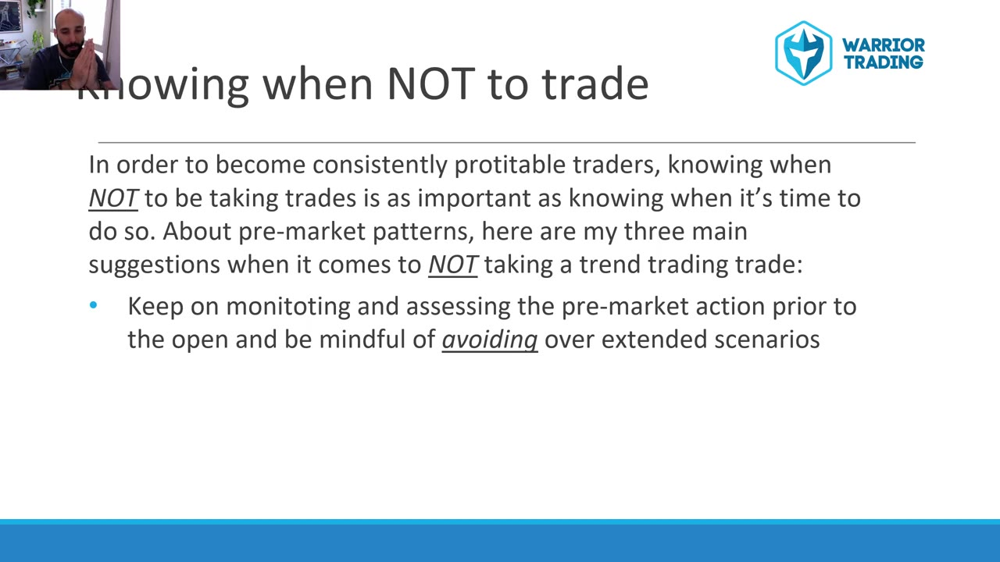

**图怎么看：**

- 画面中，可以看到多个股票的K线图，显示了不同时间段的价格波动情况。
- 成交量柱状图显示了每个时间段的成交量变化，有助于判断市场情绪。
- 催化剂因素可能包括新闻事件、公司业绩报告等，这些因素会影响市场的短期波动。
- 通过分析这些图表，投资者可以更好地理解市场动态并做出决策。

### 关键内容

- 讲师强调在预市阶段寻找价差、成交量和催化剂等关键因素。
- 讲师指出，理想的预市模式包括价差、成交量和催化剂等因素。
- 讲师提到，对于缺口下的股票，应关注支撑位和阻力位。
- 讲师强调，对于缺口上的股票，应关注支撑位和阻力位。
- 讲师指出，对于价差模式，应关注价差方向和成交量。
- 讲师提醒，避免过度扩展的预市模式，因为这些模式的成功概率较低。
- 讲师建议使用技术指标来辅助识别预市模式，如VWAP和价格范围。
- 讲师强调，对于不符合标准的预市模式，应避免进行交易。
- 讲师指出，对于缺口下的股票，应关注支撑位和阻力位。
- 讲师提醒，对于缺口上的股票，应关注支撑位和阻力位

### 分析与执行顺序

1. 讲师首先介绍了预市模式的重要性，强调了在预市阶段进行股票选择的重要性。
2. 然后，讲师详细讲解了三种主要的预市模式：价差模式、基线整理模式和反向价差模式。
3. 接着，讲师展示了如何识别这些模式，并提供了具体的交易策略。
4. 最后，讲师强调了在交易前需要进行充分的监控和评估，以避免过度扩展的预市模式。
5. 讲师还建议使用技术指标来辅助识别预市模式，如VWAP和价格范围。

### 案例与细节

- ticker：CTSH；description：CTSH股票在2019年5月3日出现明显的下跌趋势，形成了一个价差模式。价格在预市阶段形成了更低的高点和更低的低点，随后在开盘时继续下跌。
- ticker：Z；description：Z股票在预市阶段形成了一个明显的支撑位，价格在支撑位附近波动。如果价格突破支撑位并保持在支撑位之上，这将是一个潜在的买入机会。
- ticker：Roku；description：Roku股票在预市阶段形成了一个基线整理模式。价格在预市阶段形成了一个较高的高点和较低的低点，随后在开盘时继续整理。
- ticker：WBA；description：WBA股票在预市阶段形成了一个价差模式，但价格过度扩展，导致交易失败。
- ticker：ZG和X；description：ZG和X股票在预市阶段形成了一个明显的下跌趋势，但没有形成价差模式或基线整理模式。

### 风险与边界

- 讲师指出，过度扩展的预市模式的成功概率较低，因此应避免进行此类交易。
- 讲师强调，对于不符合标准的预市模式，应避免进行交易。
- 录制年代限制：此内容基于2019年的市场情况，可能不适用于当前市场环境。

### 复盘问题

- 如何识别预市阶段的价差模式？
- 在交易前需要进行哪些监控和评估？
- 如何利用技术指标辅助识别预市模式？

---

## v0602：每日图表分析

> 日期：2019　·　时长：01:08:42

**本场重点：** 每日图表分析是选择股票的重要工具，通过分析可以判断股票是否有潜力进行日内交易。

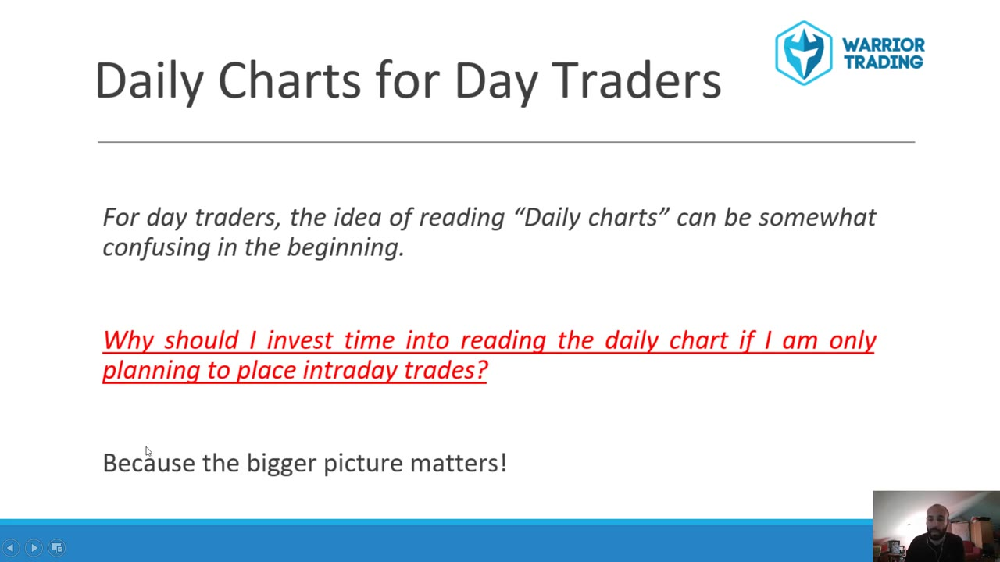

**图怎么看：**

- 每日图表显示了股票的价格走势和成交量情况，帮助投资者了解市场趋势。
- 通过分析日线图，可以识别出股票的长期趋势和短期波动，为日内交易提供依据。
- 日线图上的均线、成交量柱等指标可以帮助投资者判断买卖时机。
- 在选择股票时，应综合考虑日线图和其他技术指标，以做出更明智的投资决策。

### 关键内容

- 通过分析每日图表，可以识别出具有高波动性的股票，如STM，以及具有高潜在波动性的股票，如Roku。
- STM的平均真实波动范围较低，表明其日内波动性较小，而Roku则显示出较高的波动性。
- 查看每日图表的趋势线和支撑阻力位，可以帮助判断股票的潜在走势。
- 使用相对成交量指标可以更好地理解股票在特定时间段内的实际成交量。
- 分析过去的大波动日可以帮助预测股票未来的走势。
- 经验丰富的交易者可以通过每日图表分析快速识别出有潜力的股票。
- 过度分析可能导致错失交易机会，因此应保持客观和简洁。
- 每日图表分析应结合个人交易策略，避免过度依赖单一指标。
- 通过回顾错过的机会，可以不断改进自己的交易策略。
- 每日图表分析应关注趋势线和支撑阻力位，而非过于复杂的图形

### 分析与执行顺序

1. 打开OneDrive中的跟踪表格，输入日期、时间、策略等信息。
2. 使用Excel Online进行数据录入和计算，确保统计准确。
3. 分析每日图表，识别股票的平均真实波动范围。
4. 比较不同股票的图表，判断其潜在波动性和交易机会。
5. 使用相对成交量指标来评估股票的实际成交量。
6. 回顾过去的大波动日，预测未来可能的走势。
7. 结合个人交易策略，制定筛选股票的标准

### 案例与细节

- STM的平均真实波动范围仅为0.5美元左右，表明其日内波动性较小，不太适合进行日内交易。
- Roku的平均真实波动范围超过2美元，显示出较高的波动性，适合进行日内交易。
- 使用相对成交量指标，可以发现Roku在开盘后的前五分钟内成交量显著增加，表明市场兴趣较高。
- 通过分析过去的大波动日，可以发现Roku在最近一次财报发布后出现了大幅上涨，这有助于预测未来走势。
- 结合个人交易策略，如果某股票在过去一年内多次突破52周高点，可以将其视为潜在的交易目标

### 风险与边界

- 录制于2019年，部分指标和操作方式可能已发生变化。
- 相对成交量指标仅适用于美国东部时间，需注意时间调整。
- 过度依赖单一指标可能导致错失交易机会。
- 每日图表分析需要结合个人交易策略，避免盲目跟风

### 复盘问题

- 如何通过每日图表分析快速识别出有潜力的股票？
- 在分析每日图表时，哪些指标最为重要？
- 如何结合个人交易策略制定筛选股票的标准？

---

## v0603：日内交易策略比较

> 日期：2019　·　时长：00:58:57

**本场重点：** 识别三种主要交易策略（动量扫单、趋势跟随、反转），理解成功的关键在于情绪自信。

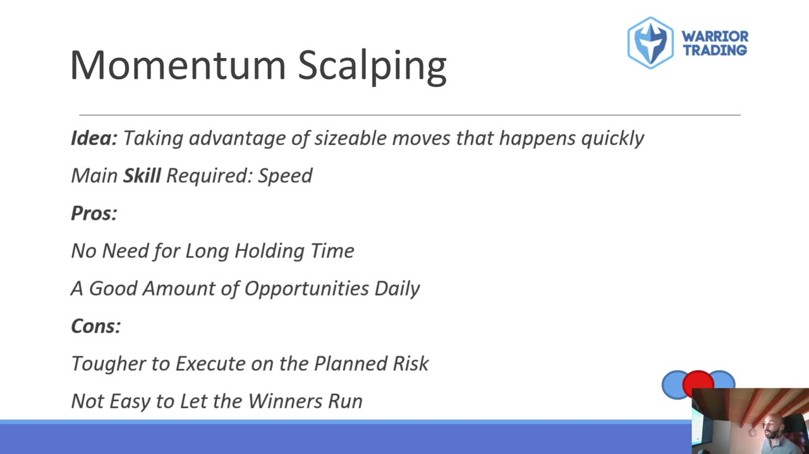

**图怎么看：**

- 幻灯片标题为“Momentum Scalping”，将其定义为利用迅速发生、可捕捉的价格移动，主要技能要求被概括为Speed。
- 优点列出持仓时间短、每天机会较多；缺点则包括难以按计划风险执行，以及不容易让盈利仓位继续运行。
- 它补充了三种典型策略的比较：动量扫单强调速度，趋势跟随和反转则有不同的持有逻辑，选择应匹配个人能力与纪律。
- 机会多不代表质量高，速度也会放大滑点和误操作；读图时不能把“Scalping”理解成忽略止损或频繁下单必然有效。

### 关键内容

- 交易成功的关键在于情绪自信，而不仅仅是技术理解。
- 三种主要交易策略包括动量扫单、趋势跟随和反转。
- 动量扫单侧重于快速捕捉大波动，需要速度和执行力。
- 趋势跟随侧重于长期持有，需要耐心和纪律。
- 反转交易侧重于反向操作，需要逆向思维。
- 成功的关键在于找到最适合自己的交易策略。
- 情绪自信是交易成功的重要组成部分。
- 动量扫单和趋势跟随之间存在共同点，但各自独立。
- 成功策略需要纪律和耐心。
- 交易者需要根据自己的性格选择合适的交易策略

### 分析与执行顺序

1. 讲师首先介绍了交易成功的定义。
2. 然后讲解了三种主要交易策略的特点。
3. 接着分析了每种策略的优势和劣势。
4. 最后强调了情绪自信在交易中的重要性。
5. 通过实例说明每种策略的应用场景。
6. 总结了交易者应如何选择适合自己的交易策略。
7. 提醒交易者要持续探索可能的边界

### 案例与细节

- 动量扫单策略的一个例子是利用高相对成交量的股票进行快速交易。
- 趋势跟随策略的一个例子是在确认趋势后，保持持仓直到目标价格。
- 反转交易策略的一个例子是在价格反弹或拒绝后进行反向操作。
- 讲师提到自己早期尝试多种策略，最终选择了趋势跟随。
- 一位成功的交易者使用动量扫单策略在短时间内获得收益。
- 另一位交易者通过趋势跟随策略在一天内保持持仓并获利

### 风险与边界

- 交易策略的选择需要根据个人性格和市场环境灵活调整。
- 情绪自信的培养需要时间和实践。
- 交易者需要意识到不同策略之间的差异，避免盲目跟风。
- 交易策略的有效性会受到市场变化的影响。
- 讲师提供的信息基于2018-2021年的市场环境，当前市场可能有所不同

### 复盘问题

- 动量扫单策略的核心优势是什么？
- 趋势跟随策略需要哪些关键技能？
- 反转交易策略有哪些潜在风险？
- 如何根据个人性格选择合适的交易策略？
- 情绪自信在交易中扮演什么角色？

---

## v0604：股票交易审查

> 日期：2019　·　时长：01:08:08

**本场重点：** 通过案例分析，理解如何进行有效的交易审查，识别关键信号和风险。

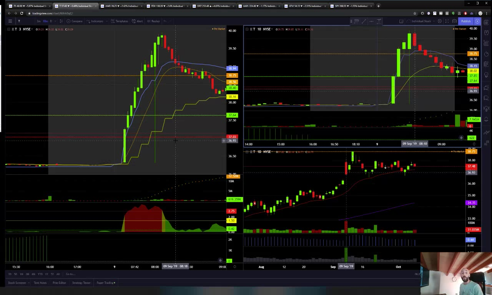

**图怎么看：**

- 在1430秒的截图中，可以看到多个图表和指标，包括K线图、均线、成交量柱等。
- 该截图展示了股票交易中的关键信号和风险点，帮助投资者理解如何进行有效的交易审查。
- 通过分析这些图表和指标，投资者可以识别出市场趋势和潜在的风险。
- 成交量柱的高度反映对应周期内的总成交量；红绿着色通常跟随价格柱的涨跌规则，不能直接拆成两种方向的主动成交。

### 关键内容

- 案例涉及AT&T（T）和AMD等股票，展示了不同交易策略的效果。
- 交易者在开盘后不久入场，但未能持续跟进。
- 交易者依赖技术指标如EMA，但未能准确判断趋势反转。
- 交易者在高成交量和大波动后入场，但市场反应不如预期。
- 交易者未能识别关键支撑位和阻力位，导致止损过早。
- 交易者依赖短期趋势，忽视长期趋势的重要性。
- 交易者未能充分考虑市场情绪和技术指标的综合影响。
- 交易者在缺乏明确催化剂的情况下入场，增加了不确定性。
- 交易者未能有效利用止损和止盈策略，导致亏损。
- 交易者在高波动市场中过度依赖技术指标，忽略了基本面因素。

### 分析与执行顺序

1. 首先，讲师回顾了交易案例，包括AT&T和AMD的交易记录。
2. 然后，讲师详细分析了每个交易的入场点和市场反应。
3. 接着，讲师讨论了交易者使用的技术指标及其局限性。
4. 最后，讲师总结了交易者的错误，并提供了改进建议。

### 案例与细节

- 案例一：AT&T（T），交易者在开盘后不久入场，但未能持续跟进。
- 案例二：AMD，交易者在高成交量和大波动后入场，但市场反应不如预期。
- 案例三：交易者依赖技术指标如EMA，但未能准确判断趋势反转。
- 案例四：交易者未能识别关键支撑位和阻力位，导致止损过早。
- 案例五：交易者在高波动市场中过度依赖技术指标，忽略了基本面因素。

### 风险与边界

- 交易者未能充分考虑市场情绪和技术指标的综合影响，可能导致决策失误。
- 交易者在缺乏明确催化剂的情况下入场，增加了不确定性，可能导致亏损。
- 交易者过度依赖技术指标，忽视了基本面因素，可能在高波动市场中遭受损失。
- 交易者未能有效利用止损和止盈策略，可能导致亏损。
- 录制年代限制为2019年，交易环境和市场规则可能已发生变化。

### 复盘问题

- 交易者在开盘后不久入场，是否考虑了市场情绪和技术指标的综合影响？
- 交易者未能识别关键支撑位和阻力位，导致止损过早，如何改进这一策略？
- 交易者在高波动市场中过度依赖技术指标，忽略了基本面因素，如何调整策略？

---

## v0605：设置交易布局

> 日期：2019　·　时长：00:50:58

**本场重点：** 本节讲解如何设置交易图表和交易平台布局，以提高交易效率。

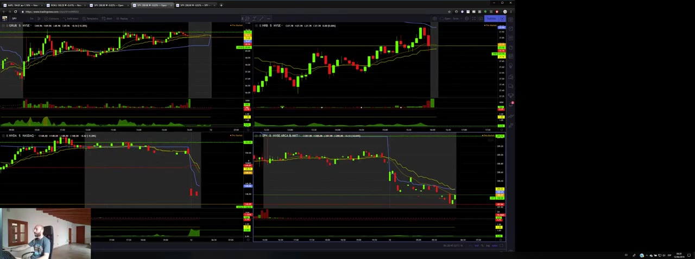

**图怎么看：**

- The chart shows the performance of AAPL, NASDAQ, and SPY stocks over time.
- The green and red bars represent the price movements of these stocks.
- The lines above the bars indicate moving averages, which help identify trends.
- The volume bars below the chart show the trading activity for each stock.

### 关键内容

- 使用Trading View作为图表平台，支持自定义图表布局。
- 设置单个股票视图，包含三个不同时间框架的图表。
- 使用热键进行快速下单，提高交易速度。
- 在多显示器设置中，将图表显示在中央屏幕，订单窗口在侧边。
- 使用SPY（标普500）监控市场整体趋势。
- 在开盘前使用特定布局监控多个股票。
- 使用热键进行快速下单，包括买入和卖出。
- 设置热键以快速关闭或打开交易位置。
- 使用LightSpeed交易平台进行交易，设置自定义订单。
- 在交易过程中保持专注，避免分散注意力

### 分析与执行顺序

1. 首先介绍Trading View平台，用于图表绘制。
2. 设置单个股票视图，包括三个不同时间框架的图表。
3. 展示如何使用热键进行快速下单。
4. 介绍多显示器设置，将图表显示在中央屏幕，订单窗口在侧边。
5. 演示如何使用SPY监控市场整体趋势。
6. 展示如何在开盘前使用特定布局监控多个股票。
7. 解释如何设置热键进行快速下单，包括买入和卖出。
8. 展示如何设置热键以快速关闭或打开交易位置

### 案例与细节

- 使用Trading View的单个股票视图，包含3分钟、10分钟和日线图。
- 在开盘前使用四个股票的三分钟时间框架视图进行快速决策。
- 使用热键Control+1进行快速下单，买入100股苹果股票。
- 使用热键Shift+1进行快速下单，买入200股苹果股票。
- 使用LightSpeed交易平台，设置自定义订单进行快速下单

### 风险与边界

- 使用单一交易平台可能面临技术故障风险。
- 依赖热键操作可能导致错误下单。
- 多显示器设置需要额外硬件支持。
- 交易策略的有效性取决于市场变化。
- 录制年代限制，部分信息可能不再适用

### 复盘问题

- 如何设置单个股票视图以提高交易效率？
- 使用热键进行快速下单的具体步骤是什么？
- 多显示器设置对交易布局有何影响？

---

## v0606：股票筛选过程

> 日期：2019　·　时长：01:04:21

**本场重点：** 股票筛选是成功交易的关键，需要建立自己的筛选标准，确保每天筛选出1-2个潜在股票。

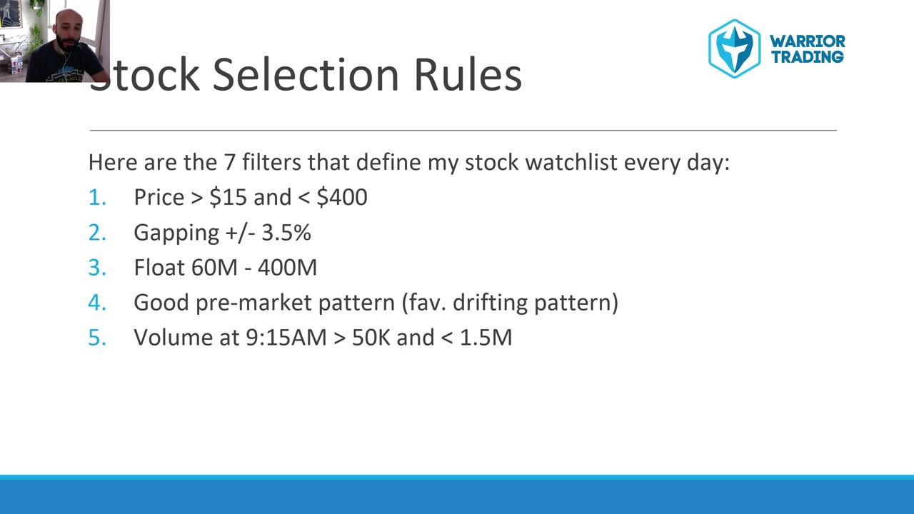

**图怎么看：**

- 幻灯片标题为“Stock Selection Rules”，列出日常watchlist的七项过滤条件，包括价格区间、跳空幅度、float、盘前形态和盘前成交量。
- 后续条件还包括可验证催化剂，以及价格相对20EMA、100SMA、200SMA和日线关键枢轴的位置，用来把新闻、流动性和图表背景放在一起。
- 这张图对应本场筛选流程：先用客观阈值缩小候选，再检查盘前结构与催化剂，目标是每天只留下少量值得继续研究的股票。
- 具体价格、float和成交量阈值属于讲师当时的方法，不是永恒规则；市场制度和个人策略不同，应重新验证而不能机械照搬。

### 关键内容

- 成功的交易者会提前一天准备股票筛选过程，以确保在市场开放前有明确的股票列表。
- 筛选标准包括价格范围、成交量、浮动大小、预市形态等，确保筛选出的股票具有潜力。
- 使用FimBits和Trade Ideas工具进行股票筛选，但需注意这些工具的局限性。
- 筛选过程中，A+质量的股票组合并不总是有效，需要结合风险管理。
- 建立自己的股票筛选流程，避免盲目跟随他人的建议。
- 筛选出的股票需要满足一定的条件，如价格、成交量、浮动大小等，确保筛选出的股票具有潜力。
- 使用FimBits工具时，需要注意其数据更新频率和功能局限性。
- 筛选过程中，需要关注股票的预市表现，以确定是否将其加入筛选列表。
- 建立自己的股票筛选流程，避免依赖单一工具或方法。

### 分析与执行顺序

1. 每天花一小时进行股票筛选，以确保在市场开放前有明确的股票列表。
2. 使用FimBits和Trade Ideas工具进行股票筛选，但需注意这些工具的局限性。
3. 根据筛选标准，如价格范围、成交量、浮动大小、预市形态等，筛选出符合条件的股票。
4. 在9:15之前完成大部分股票筛选工作，确保筛选出的股票符合所有条件。
5. 使用Trade Ideas工具查看股票的预市表现，以确定是否将其加入筛选列表。
6. 根据筛选标准，将符合条件的股票加入筛选列表，确保每天筛选出1-2个潜在股票。

### 案例与细节

- 使用FimBits工具筛选股票，设置价格范围为$15到$400，浮动大小为16M到400M，成交量为50K到1.5M。
- 使用Trade Ideas工具查看股票的预市表现，发现某股票在9:15之前表现出强劲的上升趋势，决定将其加入筛选列表。
- 通过FimBits工具筛选出某股票，发现其价格在$15到$400之间，浮动大小为16M，成交量为50K，预市形态为上升趋势。
- 使用FimBits工具筛选股票时，发现某股票在9:15之前表现出强劲的上升趋势，但FimBits未显示该股票，决定将其加入筛选列表。
- 通过FimBits工具筛选股票，发现某股票在9:15之前表现出强劲的上升趋势，但FimBits未显示该股票，决定将其加入筛选列表。

### 风险与边界

- 筛选出的股票可能并不总是有效，需要结合风险管理。
- 使用单一工具进行股票筛选存在局限性，需要综合多种信息。
- 筛选过程中，需要关注股票的预市表现，以确定是否将其加入筛选列表。
- 录制年代限制，部分工具和方法可能已发生变化。

### 复盘问题

- 你如何确保自己的股票筛选流程是可持续的？
- 在筛选过程中，你如何处理那些不符合所有条件的股票？
- 你如何确保自己的股票筛选流程能够适应市场的变化？

---

## v0607：交易管理与心理

> 日期：2019　·　时长：01:04:02

**本场重点：** 交易管理不当导致亏损，强调心理因素的重要性；避免过度交易。

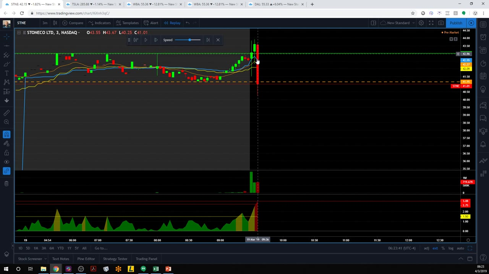

**图怎么看：**

- 整体界面显示了股票交易图表和Excel表格，左侧是股票交易图表，右侧是Excel表格。
- 实际可见的ticker为STNE，周期为3分钟。
- 图表中显示了价格走势和成交量柱，Excel表格中记录了交易策略和结果。
- 这张截图展示了交易过程中的具体操作和分析，但不能单独证明交易管理不当导致亏损的问题。

### 关键内容

- 在3月19日，STNE出现两次交易，均以亏损结束。
- 交易策略包括等待开盘价突破，但有时会因过度扩展而放弃。
- 心理状态影响交易决策，情绪波动可能导致过度交易。
- 使用EMA指标识别过度扩展，避免在过度扩展情况下交易。
- 交易管理不当导致连续亏损，需提高警惕。
- 避免在开盘前交易，因为流动性较低且波动较大。
- 交易者应保持冷静，避免因情绪影响决策。
- 通过分析过去交易，可以发现心理因素对交易结果的影响。
- 交易者应关注长期趋势，而非短期波动。
- 避免在开盘前交易，因为市场流动性不足且波动大

### 分析与执行顺序

1. 回顾3月19日的交易情况，特别是STNE的两次交易。
2. 分析交易策略，包括等待开盘价突破，但有时会因过度扩展而放弃。
3. 使用EMA指标识别过度扩展，避免在过度扩展情况下交易。
4. 回顾交易过程，发现心理状态影响交易决策，情绪波动可能导致过度交易。
5. 总结交易经验，强调心理因素的重要性，避免过度交易。
6. 分享交易管理技巧，如避免在开盘前交易，因为市场流动性不足且波动大

### 案例与细节

- STNE在3月19日出现两次交易，一次是长仓，一次是短仓，均被止损。
- 在特斯拉交易中，开盘后价格迅速反弹，导致亏损。
- 使用EMA指标识别过度扩展，发现价格在开盘前出现大幅波动。
- 在WBA交易中，开盘前出现大量成交量，但价格走势异常，导致亏损

### 风险与边界

- 交易者可能因情绪波动而过度交易，导致亏损。
- 开盘前交易流动性较低，可能导致交易失败。
- 交易者可能因缺乏耐心而过早放弃交易机会。
- 交易者可能因过度依赖技术指标而忽视心理因素。
- 录制年代限制，交易环境和市场规则可能已发生变化

### 复盘问题

- 在哪些情况下，交易者的心理状态会影响交易决策？
- 如何通过交易管理来避免过度交易？
- 在哪些情况下，应该避免在开盘前进行交易？
- 如何利用技术指标来识别过度扩展？
- 在交易过程中，如何保持冷静并避免情绪波动的影响？

---

## v0608：五月交易回顾

> 日期：2019　·　时长：01:00:24

**本场重点：** 总结了五月交易表现，强调了耐心和纪律的重要性，并分享了具体交易策略。

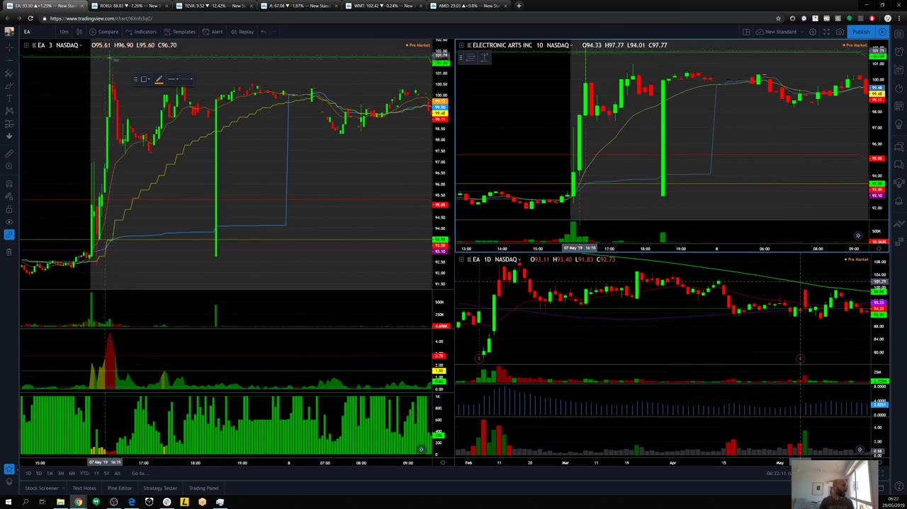

**图怎么看：**

- 这张图显示了电子艺界（EA）在纳斯达克市场的日线图，可以看到股价在不同时间段内的波动情况。
- 图中可以看到多个支撑和阻力位，这些位置对股票的价格行为有重要影响。
- 成交量柱显示了市场参与者在不同时间点上的买卖活动。
- 通过分析这些图表，投资者可以更好地理解股票的价格趋势和潜在的交易机会。

### 关键内容

- 五月交易量增加了约20%，主要由于季度初的财报发布。
- 交易准确率略有下降，但仍符合预期。
- 盈利比率为3.33:1，略高于上月。
- 交易者应关注支撑位和阻力位，以制定交易计划。
- 在开盘前选择股票，避免过度交易。
- 利用三分钟图表进行交易决策，避免过多噪音。
- 在开盘价附近进行交易时需谨慎，尤其是低于开盘价。
- 交易策略包括观察支撑位和阻力位，以及使用技术指标进行分析。
- 交易者应记录并分析错误，以改进策略。
- 交易者应保持耐心，避免因短期波动而恐慌

### 分析与执行顺序

1. 首先回顾了五月的整体交易表现。
2. 然后分析了交易量和准确率的变化。
3. 接着展示了具体的交易策略，如三分钟图表分析。
4. 最后分享了交易者的心理准备和情绪管理。
5. 通过具体的交易案例，解释了如何应用策略。
6. 强调了记录和分析错误的重要性。
7. 提醒交易者保持耐心，避免因短期波动而做出冲动决策

### 案例与细节

- 五月8日，电子艺界（EA）在财报发布后出现了两个连续的赢家。
- 在开盘前，EA的股价在9740美元附近形成了支撑位。
- 交易者在开盘后三分钟内进行了短卖，目标是突破13EMA。
- 在开盘后的三分钟内，EA的股价成功突破了支撑位，达到了下一个目标。
- 交易者在开盘后的四十五分钟内实现了全部盈利目标

### 风险与边界

- 市场有时不会按照预期的方式发展，交易者需要保持耐心。
- 交易策略的有效性依赖于市场环境的变化。
- 交易者需要定期更新和调整策略以适应市场变化。
- 交易者需要遵守交易规则，如PDT规则，以避免账户被冻结
- 交易者需要关注市场情绪和新闻事件对股价的影响
- 交易者需要考虑市场流动性，避免在低成交量时进行大额交易

### 复盘问题

- 五月的交易表现如何？有哪些值得总结的经验教训？
- 交易者是如何利用技术指标来识别支撑位和阻力位的？
- 在开盘前选择股票时，交易者需要注意哪些关键因素？
- 交易者在面对不利交易结果时，是如何调整心态的？
- 交易者是如何记录和分析错误，以改进交易策略的？

---

## v0609：五月交易回顾

> 日期：2019　·　时长：01:02:32

**本场重点：** 通过具体案例分析交易策略，强调耐心等待最佳入场时机的重要性。

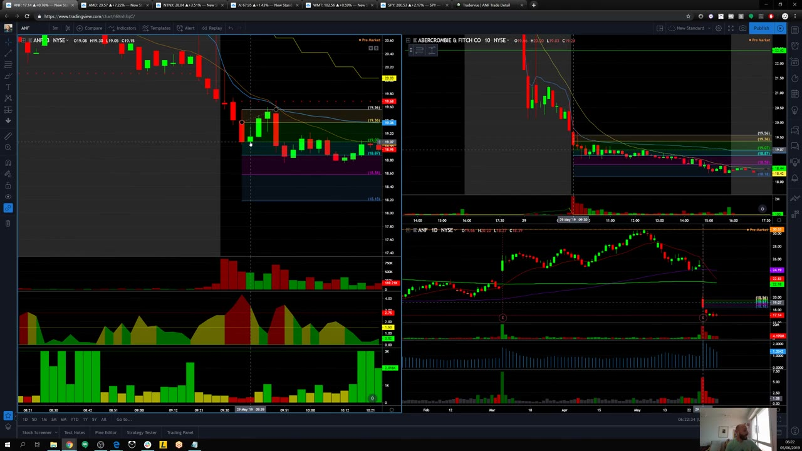

**图怎么看：**

- 在图中可以看到AMD的股价在上涨趋势中，成交量柱显示了市场的活跃度。
- 水平线和斜线表示支撑和阻力位，帮助识别潜在的买卖点。
- 图表下方的时间与成交量柱对应，提供了即时市场活动的信息。
- 整体来看，这张图展示了AMD股票的近期表现和市场情绪。

### 关键内容

- 交易者在开盘后六分钟入场，但技术分析显示此时价格已经过度延伸。
- 交易者在1936价位入场，但最佳入场时机应在1936之前，因为此时价格未过度延伸。
- 交易者在1956价位加仓，但最佳时机应等待更多确认，以避免过早获利了结。
- 交易者在10:31卖出，但最佳策略是让利润继续增长，以实现更高的收益比。
- 交易者在下午2:16入场，但最佳时机应在开盘后的10分钟确认突破支撑位。
- 交易者在2686价位入场，但最佳时机应在2707价位，以实现更大的收益潜力。
- 交易者在2665价位获利了结，但最佳策略是等待更多确认，以避免过早获利了结。
- 交易者在NTNX股票上进行短卖，但最佳时机应在开盘后的10分钟确认突破支撑位。
- 交易者在AMD股票上进行长买，但最佳时机应在开盘后的10分钟确认突破支撑位。

### 分析与执行顺序

1. 分析交易者在A&F股票上的入场时机，发现入场时机不佳。
2. 分析交易者在AMD股票上的入场时机，发现入场时机较好。
3. 分析交易者在NTNX股票上的入场时机，发现入场时机不佳。
4. 总结交易者在不同股票上的入场时机，强调耐心等待最佳入场时机的重要性。
5. 讨论交易者的加仓时机，强调耐心等待更多确认的重要性。
6. 讨论交易者的卖出时机，强调让利润继续增长的重要性。

### 案例与细节

- A&F股票在9:36以1936价位入场，但最佳时机应在9:35之前，因为此时价格未过度延伸。
- AMD股票在10:20以2809价位入场，但最佳时机应在10:21之后，因为此时价格未过度延伸。
- NTNX股票在14:16以2686价位入场，但最佳时机应在14:20之后，因为此时价格未过度延伸。
- 交易者在NTNX股票上进行短卖，但最佳时机应在开盘后的10分钟确认突破支撑位。
- 交易者在AMD股票上进行长买，但最佳时机应在开盘后的10分钟确认突破支撑位。

### 风险与边界

- 交易者可能因过早获利了结而错过更大的收益机会。
- 交易者可能因过早入场而面临更高的风险。
- 交易者可能因缺乏耐心而错过最佳入场时机。
- 交易者可能因缺乏对市场趋势的深入理解而做出错误决策。
- 交易者可能因缺乏对技术指标的正确解读而做出错误决策。

### 复盘问题

- 你认为交易者在哪些情况下应该耐心等待最佳入场时机？
- 你认为交易者在哪些情况下应该让利润继续增长？
- 你认为交易者在哪些情况下应该及时获利了结？

---

## v0610：趋势交易中的回撤策略

> 日期：2019　·　时长：01:14:54

**本场重点：** 趋势交易是更适合个人性格的交易方式；回撤策略需要更多时间规划交易；适合在市场波动较大时使用。

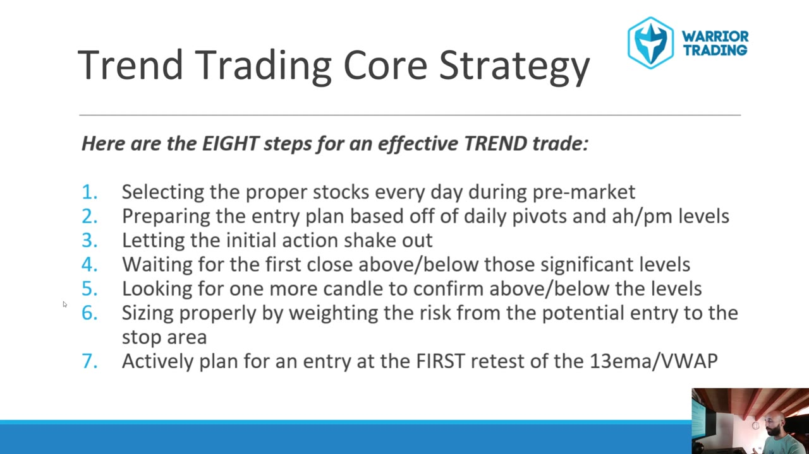

**图怎么看：**

- 展示了一种趋势交易的核心策略，包括选择合适的股票、准备入场计划、等待第一个触及关键水平的蜡烛、寻找第二个确认蜡烛。
- 详细列出了八步有效趋势交易的方法，包括选择合适股票、准备入场计划、让初始动作自然发展、等待触及关键水平、寻找第二个确认蜡烛、合理风险控制、计划首次重新测试。
- 通过图表和文字描述了趋势交易的核心步骤，强调了在市场波动较大的情况下使用回撤策略的重要性。
- 提供了详细的步骤和策略，帮助投资者理解如何在趋势交易中有效地管理风险和确定入场点。

### 关键内容

- 讲师提到回撤策略是趋势交易的一种进阶形式。
- 趋势交易的核心原则是跟随趋势，这能带来更好的机会。
- 突破交易和趋势交易各有优势，取决于个人性格和市场情况。
- 回撤策略允许更多时间进行交易前的规划。
- 突破交易更适合性格急躁的人，而趋势交易更适合性格冷静的人。
- 突破交易通常需要快速决策，而趋势交易则需要更长时间的观察。
- 突破交易和趋势交易各有优缺点，选择适合自己的交易风格很重要。
- 突破交易可能在市场波动较大时更容易被填单，而趋势交易则需要更多耐心。
- 讲师通过Roku的例子展示了如何应用回撤策略进行交易

### 分析与执行顺序

1. 讲师首先介绍了回撤策略的基本步骤，包括股票选择、准备入场计划等。
2. 然后讲解了如何等待初始动作展开，寻找确认信号。
3. 接着详细说明了如何在第一根蜡烛后寻找突破或回撤。
4. 最后，讲师展示了如何根据市场情况调整止损和目标价格。
5. 整个过程强调了交易前的充分准备和对市场的深入理解

### 案例与细节

- Roku在前一天没有新鲜催化剂，也没有预市场缺口，但仍然可以应用回撤策略。
- 在9月13日的AVGO交易中，股票开盘后出现大幅下跌，但随后确认突破。
- RH在有强劲支撑的情况下，开盘后确认突破，但最终未能达到预期目标。
- 在Roku的例子中，虽然没有新鲜催化剂，但仍然可以应用回撤策略。
- 在AVGO的交易中，股票开盘后确认突破，但最终未能达到预期目标

### 风险与边界

- 突破交易在市场波动较大时更容易被填单，而趋势交易则需要更多耐心。
- 突破交易适合性格急躁的人，而趋势交易适合性格冷静的人。
- 突破交易通常需要快速决策，而趋势交易则需要更长时间的观察。
- 突破交易和趋势交易各有优缺点，选择适合自己的交易风格很重要。
- 讲师提到回撤策略需要更多时间进行交易前的规划，不适合急于求成的人

### 复盘问题

- 回撤策略如何帮助你在市场波动较大时更好地管理交易？
- 突破交易和趋势交易各有优势，你认为哪种更适合你的交易风格？
- 在应用回撤策略时，如何确保你的止损和目标价格合理？

---

## v0611：趋势交易回撤策略详解

> 日期：2019　·　时长：01:07:15

**本场重点：** 1. 识别趋势回撤的关键规则；2. 使用风险回报工具制定交易计划；3. 趋势回撤策略的成功率。

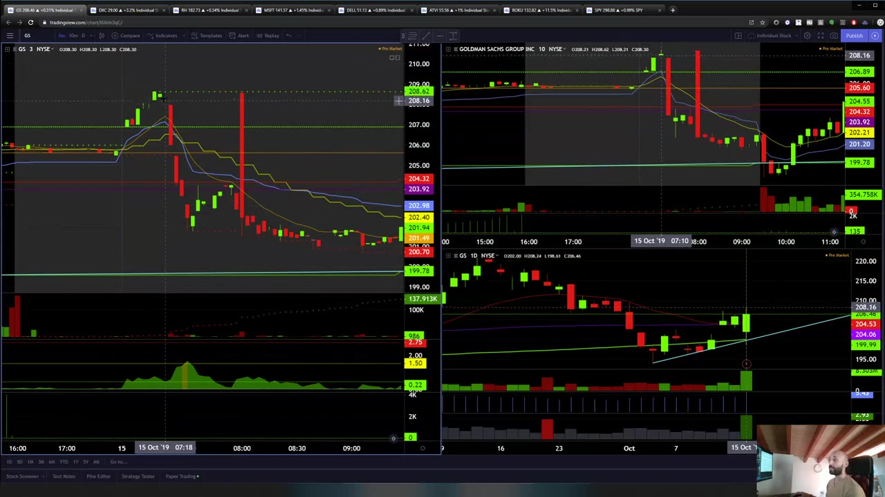

**图怎么看：**

- 画面中，可以看到多个趋势线和支撑位，这些是识别趋势回撤的关键规则。
- 画面中的水平线显示了不同的支撑位，帮助投资者判断价格是否接近底部。
- 通过观察价格在这些支撑位附近的波动情况，可以制定出相应的交易计划。
- 图B还展示了成交量的变化，有助于理解市场情绪和潜在的趋势反转点。

### 关键内容

- 罗伯托强调了交易策略需要简洁明了，最好能在一页纸上列出所有规则。
- 对于缺口上涨或下跌，他更倾向于关注缺口后的趋势变化。
- 在开盘后的前三分钟内不进行交易，而是用于股票筛选。
- 第一根蜡烛必须突破支撑或阻力水平，通常是在前市扩展交易时段的水平。
- 第二根蜡烛需要形成新的高点或低点，以确认趋势。
- 使用斐波那契工具来确定止损和目标价格。
- 最多可以有两个进入点来建立仓位。
- 在开盘后的30分钟内寻找进入机会。
- 对于大型股票，有时需要考虑10分钟的时间框架。
- 止损设置在关键水平下方，以保护已有的盈利

### 分析与执行顺序

1. 罗伯托首先介绍了交易策略的基本规则。
2. 然后他通过具体的例子来解释这些规则的应用。
3. 接着他展示了如何使用斐波那契工具来制定交易计划。
4. 最后，他解释了如何根据不同的股票选择进入时机。
5. 在整个过程中，罗伯托强调了交易计划的重要性以及如何严格执行它。
6. 他还提到了如何调整止损水平以保护已有的盈利。
7. 最后，他总结了交易策略的关键要素，并鼓励观众自己尝试应用这些规则。

### 案例与细节

- ticker：GS；price：245；level：200 SMA；entry：238；target：240；stop：235；date：2019年9月12日
- ticker：DXC；price：240；level：200 SMA；entry：238；target：240；stop：235；date：2019年9月12日
- ticker：MSFT；price：190；level：13 EMA；entry：188；target：192；stop：186；date：2019年9月19日

### 风险与边界

- 策略的成功率约为60%-65%，但并非每次都能成功。
- 止损设置在关键水平下方，如果突破这些水平，可能会导致亏损。
- 策略依赖于特定的时间框架，如3分钟和10分钟，这可能会影响交易效果。
- 策略的有效性可能受到市场环境的影响，尤其是在SP500波动较大的情况下。

### 复盘问题

- 在开盘后的前三分钟内，如何筛选出值得交易的股票？
- 如何确定第一根蜡烛突破支撑或阻力水平的具体条件？
- 在制定交易计划时，如何使用斐波那契工具来确定止损和目标价格？
- 在实际交易中，如何根据不同的股票选择进入时机？
- 如果止损被触发，应该如何调整交易策略以保护已有的盈利？

---

## v0612：SQ 和 VFF 的短交易策略

> 日期：2096-08-25　·　时长：00:55:47

**本场重点：** 通过分析 SQ 和 VFF 的技术图表，识别短期交易机会，并详细记录交易过程和风险控制。

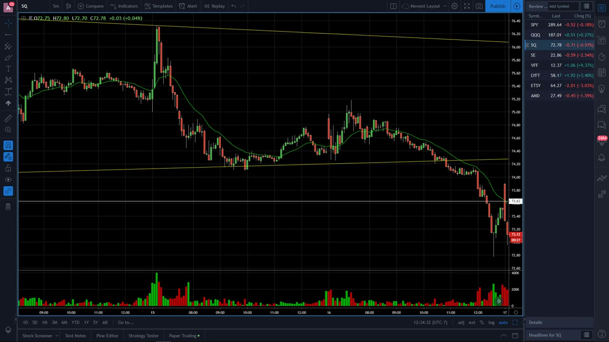

**图怎么看：**

- 整体界面显示了多个股票的技术图表，包括K线图、均线和成交量柱。
- 实际可见的ticker包括SQ、VFF、SPY、QQQ、LYFT、ETSY和AMD。
- 画面信息对应本场主题，展示了SQ和VFF的短期交易策略，通过分析技术图表识别交易机会。
- 这张截图不能单独证明什么，需要结合其他信息进行综合分析。

### 关键内容

- SQ 在突破趋势线后出现强劲卖压，表明市场情绪转向看空。
- VFF 形成三重底形态，显示潜在的回调机会。
- 使用双点趋势线来识别支撑和阻力水平。
- SQ 和 VFF 的交易均基于技术分析，而非基本面。
- SQ 的交易目标是 73 美元，实际达到 72.50 美元附近。
- VFF 的交易目标是 1250 美元以下，实际达到 10 美元附近。
- 交易过程中需注意市场波动和催化剂的影响。
- 交易策略包括设置止损和目标价，以控制风险。
- 交易成功的关键在于准确识别市场趋势和支撑位。
- 交易失败的风险在于市场突然反转或未预期的事件

### 分析与执行顺序

1. 分析 SQ 的 60 分钟图表，识别出突破趋势线后的弱反弹。
2. 利用双点趋势线确认 VFF 的支撑位，形成三重底形态。
3. 设定 SQ 的止损在 74.40 美元，目标价在 73 美元。
4. 在 VFF 的 1250 美元水平测试后，确认支撑有效，开始建仓。
5. 监控 SQ 和 VFF 的价格走势，及时调整交易计划。
6. 在交易过程中，注意市场波动和催化剂的影响，如 Citron 的推文。
7. 交易结束后，评估交易结果，总结经验教训

### 案例与细节

- SQ 在 74.25 美元突破趋势线后，出现 73 美元的看跌期权买入。
- VFF 在 1250 美元水平测试后，出现 1250 美元的看跌期权买入。
- SQ 的交易最终获利 210%，风险回报比为 7:1。
- VFF 的交易最终获利 150%，风险回报比为 5:1。
- SQ 和 VFF 的交易均基于技术分析，而非基本面分析

### 风险与边界

- 交易策略依赖于市场趋势和技术分析，市场可能突然反转。
- 交易过程中可能出现执行错误，导致交易失败。
- 交易失败的风险在于市场突然反转或未预期的事件，如 Citron 的推文。
- 交易策略的有效性受录制年代限制，市场环境可能发生变化

### 复盘问题

- SQ 和 VFF 的交易过程中，哪些因素影响了交易结果？
- 如何在交易过程中更好地管理风险？
- SQ 和 VFF 的交易策略是否适用于其他股票？

---
