# Intermediate Mentor Sessions：2020

> 63 场，合计 73.9 小时。返回 [Intermediate Mentor Sessions 目录](../README.md)。

## v0613：中级交易策略与风险管理

> 日期：2020-01-08　·　时长：01:13:59

**本场重点：** 本节讨论了如何识别和利用技术图表中的关键信号进行交易，并强调了严格的风险管理的重要性。

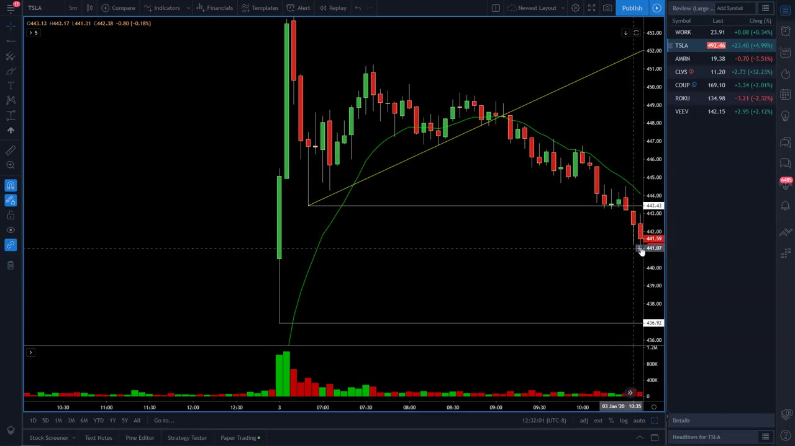

**图怎么看：**

- 画面中，可以看到一个股票的K线图，显示了价格趋势和成交量的变化。
- 画面中的K线图显示了价格在一段时间内的波动情况，红色和绿色柱状图代表了成交量。
- 通过观察K线图，可以分析出市场的买卖力量和趋势方向。
- 成交量柱的高度反映对应周期内的总成交量；红绿着色通常跟随价格柱的涨跌规则，不能直接拆成两种方向的主动成交。

### 关键内容

- 交易策略需结合技术分析和市场情绪，如三重顶突破和裸旗破位。
- 严格的风险管理至关重要，包括设置合理的止损和耐心等待突破或回调。
- 市场波动可能导致止损执行，因此需要谨慎管理资金。
- 选择合适的入场时机，等待突破或回调确认，避免追涨杀跌。
- 技术分析是主要依据，价格走势决定了交易决策，即使股票次日跳水，也有足够的缓冲空间避免亏损。
- 优先考虑技术分析而非新闻，因为新闻很少影响交易决策。
- 设置报警以确保不错过交易机会，特别是突破点。
- 使用成交量、20EMA和200SMA作为目标参考，但不用于入场。
- 不考虑分析师的目标价格，因为缺乏足够的回测支持。
- 提供详细的日内技术交易策略，帮助读者更好地理解和应用这些策略。
- 在识别技术图表中的关键信号时，需结合市场情绪变化，例如在熊市转牛市时，应调整交易策略以适应市场变化。
- 严格的风险管理要求在交易前设定合理的止损，这有助于控制风险，避免因市场波动导致的亏损。
- 耐心等待突破或回调确认，避免追涨杀跌，这需要投资者具备良好的心理素质和耐心。
- 利用图表分析趋势，识别关键支撑和阻力位，可以帮助投资者制定更准确的交易计划，提高交易成功率。
- 市场波动可能导致止损执行，因此需要谨慎管理资金，避免单笔交易过大风险，确保资金安全。

### 分析与执行顺序

1. 识别技术图表中的关键信号，如三重顶突破和裸旗破位。
2. 设置合理的止损，确保风险可控，避免过度追涨导致亏损。
3. 耐心等待突破或回调确认，避免追涨杀跌。
4. 利用图表分析趋势，识别关键支撑和阻力位，制定交易计划。
5. 根据市场情绪调整交易策略，如在熊市转牛市时采取相应措施。
6. 设置报警以确保不错过交易机会，特别是突破点。
7. 使用成交量、20EMA和200SMA作为目标参考，但不用于入场。

### 案例与细节

- 特斯拉（TSLA）的三重顶突破，触发点为387，目标为500，风险为30美分。
- AMRN的裸旗破位，触发点为2076，目标为1892，风险为33美分。
- CLVS的三重底破位，触发点为1080，目标为872，风险为24美分。
- Roku的做空机会，预计不会阻止价格继续下跌，设定116作为利润目标。
- 特斯拉（TSLA）的三重顶突破，触发点为387，目标为500，风险为30美分，这说明在识别关键信号时，需结合市场情绪变化，如在熊市转牛市时，应调整交易策略以适应市场变化。
- AMRN的裸旗破位，触发点为2076，目标为1892，风险为33美分，这展示了如何利用图表分析趋势，识别关键支撑和阻力位，制定交易计划。
- CLVS的三重底破位，触发点为1080，目标为872，风险为24美分，这说明在识别关键信号时，需结合市场情绪变化，如在熊市转牛市时，应调整交易策略以适应市场变化。

### 风险与边界

- 市场波动可能导致止损执行，因此需要谨慎管理资金。
- 市场情绪变化可能影响交易策略的有效性。
- 技术分析依赖于图表数据，可能存在误判。
- 录制年代限制，平台、监管、税务和经纪商条件只能表述为历史录制内容。
- 市场波动可能导致止损执行，特别是在市场情绪剧烈波动时，这需要投资者谨慎管理资金，避免单笔交易过大风险。
- 市场情绪变化可能影响交易策略的有效性，特别是在市场情绪突然转变时，投资者需要及时调整策略以适应新的市场环境。
- 技术分析依赖于图表数据，可能存在误判，特别是在市场出现异常波动时，投资者需要谨慎对待技术分析结果。

### 复盘问题

- 如何识别和利用技术图表中的关键信号进行交易？
- 在哪些情况下需要设置止损？
- 如何利用市场情绪调整交易策略？
- 为什么优先考虑技术分析而非新闻？
- 如何设置报警以确保不错过交易机会？

---

## v0614：个人交易记录分析

> 日期：2020-01-08　·　时长：01:00:04

**本场重点：** 通过个人交易记录展示交易策略和心理过程，强调耐心和计划的重要性。

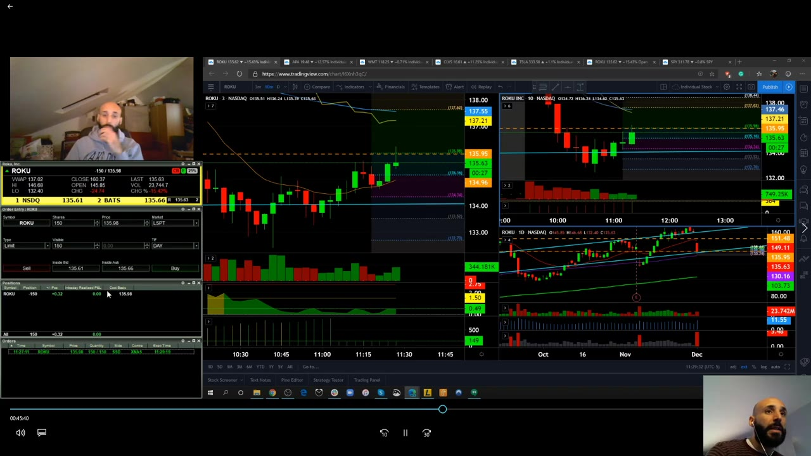

**图怎么看：**

- 画面中，可以看到多个股票的实时交易数据，包括价格、成交量和时间序列。
- 图表显示了不同股票的价格走势和市场动态，有助于分析交易策略。
- 实时交易数据和图表分析对于理解市场趋势和制定交易决策至关重要。
- 通过这些数据，可以观察到市场的波动性和投资者行为，从而做出更明智的交易决定。

### 关键内容

- 使用OBS Studio录制个人交易，包括图表和交易界面。
- 交易布局简化，仅显示关键信息，减少干扰。
- 使用Fibonacci扩展进行风险管理和目标设定。
- 交易过程中保持耐心，等待确认信号。
- 交易策略基于趋势延续，寻找有利的风险回报比。
- 使用止损和止盈来控制风险和收益。
- 交易记录展示了从初始布局到最终执行的完整过程。
- 交易过程中不断调整止损和止盈价格，以适应市场变化。
- 交易记录反映了真实交易环境，而非模拟环境

### 分析与执行顺序

1. 打开交易软件，设置交易界面布局。
2. 使用Fibonacci工具标记关键价格水平。
3. 观察市场动态，等待确认信号。
4. 在市场波动中调整止损和止盈价格。
5. 执行交易指令，监控市场反应。
6. 根据市场反馈调整交易策略，继续执行。
7. 记录交易过程，包括成功和失败的交易

### 案例与细节

- Roku股票，使用13EMA和VWAP指标进行分析。
- 使用Fibonacci扩展确定潜在的止损和止盈点。
- 在市场波动中调整止损价格，从6540到6531。
- 交易过程中不断调整止盈价格，从6487到6509。
- 记录交易过程，包括初始布局和最终执行结果。
- 使用OBS Studio录制个人交易，展示交易决策过程

### 风险与边界

- 交易过程中可能会遇到市场波动，导致交易计划失效。
- 交易记录可能无法完全反映实时市场情况。
- 交易策略依赖于市场趋势延续，可能在市场反转时失效。
- 交易记录仅适用于个人交易，不适用于模拟环境。
- 交易记录反映了2020年的市场情况，不适用于当前市场环境

### 复盘问题

- 交易过程中是如何使用Fibonacci工具的？
- 如何根据市场动态调整止损和止盈价格？
- 交易记录中有哪些成功的交易策略？
- 交易过程中遇到哪些挑战？
- 如何确保交易记录的真实性和完整性？

---

## v0615：大型股摆动交易分析

> 日期：2020-01-15　·　时长：01:03:13

**本场重点：** 通过分析Roku和CGC等股票，识别摆动交易机会，并设定合理的止损和目标。

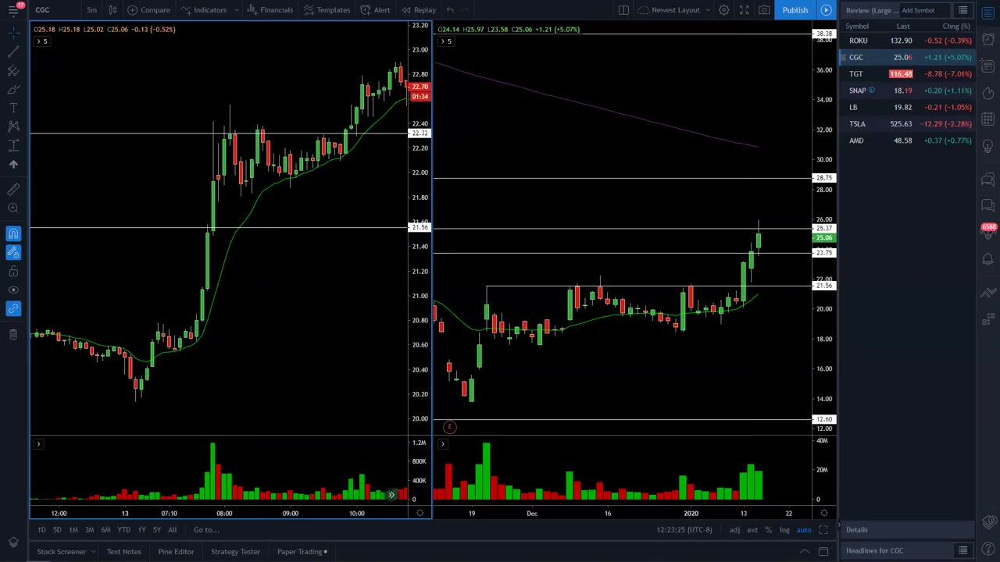

**图怎么看：**

- 画面中，CGC 股票的价格从低点逐渐上升，显示出潜在的上涨趋势。
- 成交量柱显示了交易活动的变化，表明市场对 CGC 的兴趣正在增加。
- 图中的水平线可能表示支撑位或阻力位，帮助投资者判断价格是否突破这些关键水平。
- 通过观察价格和成交量的组合，投资者可以更好地理解市场的动态并制定交易策略。

### 关键内容

- 分析了Roku的摆动交易策略，包括支撑位和阻力位的识别。
- CGC的突破点设置为2156，提供了明确的风险回报比。
- 强调了止损设置的重要性，以及如何根据市场情况调整。
- 使用期权进行摆动交易，确保有足够的缓冲。
- CGC的突破成功验证了长期趋势线的合理性。
- 特斯拉的突破展示了长期趋势线的有效性。
- 强调了耐心等待突破的重要性，避免过早入场。
- Roku的摆动交易展示了如何利用支撑位进行短卖。
- CGC的摆动交易展示了如何利用突破点进行长买。
- 强调了市场情绪和技术分析相结合的重要性

### 分析与执行顺序

1. 分析Roku的摆动交易策略，识别支撑位和阻力位。
2. CGC的突破点设置为2156，验证了长期趋势线的有效性。
3. 设定止损和目标价格，确保风险控制。
4. 使用期权进行摆动交易，确保有足够的缓冲。
5. 监控市场动态，调整止损和目标价格。
6. 总结摆动交易的关键要素，包括支撑位、阻力位和市场情绪分析

### 案例与细节

- Roku在13240附近形成了一个支撑位，测试了三次后，第四次突破被考虑为短卖机会。
- CGC在2156形成了一个突破点，测试了四次后，第五次突破被考虑为长买机会。
- 特斯拉的突破展示了长期趋势线的有效性，目标价定为600美元。
- Roku的摆动交易展示了如何利用支撑位进行短卖，最终成功突破了127.53的支撑位。
- CGC的摆动交易展示了如何利用突破点进行长买，最终成功突破了2156的突破点

### 风险与边界

- 市场情绪的变化可能会影响摆动交易的成功率。
- 长期趋势线的有效性依赖于市场的持续性。
- 止损设置不当可能导致资金损失。
- 市场波动可能导致交易计划的失败。
- 录制年代限制为2020年1月15日

### 复盘问题

- 如何识别摆动交易中的关键支撑位和阻力位？
- 如何设定合理的止损和目标价格以控制风险？
- 如何利用市场情绪和技术分析相结合进行摆动交易？

---

## v0616：新年交易策略与目标设定

> 日期：2020-01-15　·　时长：00:57:07

**本场重点：** 1. 新年交易策略需要自我反思和明确规则；2. 成功的关键在于持续改进和适应市场变化；3. 目标设定应包括技术规则和个人习惯。

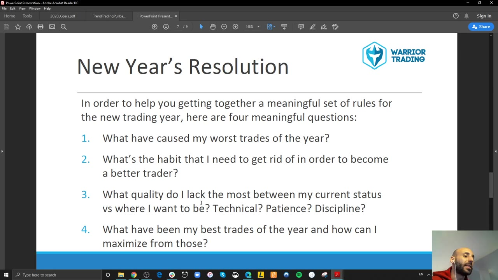

**图怎么看：**

- 新年交易策略需要自我反思和明确规则。
- 成功的关键在于持续改进和适应市场变化。
- 目标设定应包括技术规则和个人习惯。
- 使用风险/回报工具（在tradingView上修订后的Fibonacci工具）来确定交易计划。

### 关键内容

- 新年交易策略需要自我反思和明确规则。
- 成功的关键在于持续改进和适应市场变化。
- 制定交易规则时，应考虑个人交易风格和习惯。
- 通过自我反思，可以识别过去一年中的最佳和最差表现。
- 交易规则应简单且易于遵循，以提高执行力。
- 制定新年目标时，应注重个人习惯和生活方式的改善。
- 交易策略的成功在于不断调整和完善。
- 制定交易规则时，应考虑市场趋势和技术指标。
- 制定交易目标时，应设定具体可衡量的目标

### 分析与执行顺序

1. 1. 讨论新年交易策略的重要性，强调自我反思。
2. 2. 引导学员思考过去一年中的最佳和最差表现。
3. 3. 提出制定简单交易规则的建议，以提高执行力。
4. 4. 讨论如何通过自我反思来识别个人优势和劣势。
5. 5. 强调持续改进和适应市场变化的重要性。
6. 6. 分享个人交易规则和目标设定的经验。
7. 7. 鼓励学员制定具体可衡量的新年目标

### 案例与细节

- 1. 讲师提到，他使用了13 EMA和VWAP指标来确认交易机会。
- 2. 讲师分享了他在小盘股动量策略中的交易规则，包括在开盘后的前三分钟内进行股票筛选。
- 3. 讲师提到，他计划在2020年继续探索小盘股的趋势交易策略。
- 4. 讲师表示，他希望在2020年继续提高交易结果，至少提高30%。
- 5. 讲师分享了他在过去几个月中改善生活习惯的经验，如每天跑步

### 风险与边界

- 1. 制定交易规则时，如果过于复杂可能会降低执行力。
- 2. 新年目标设定如果过于理想化，可能导致失望。
- 3. 市场环境的变化可能会影响交易策略的有效性。
- 4. 讲师的交易经验基于过去的市场环境，当前市场可能有所不同。
- 5. 交易规则和目标设定需要根据个人情况进行调整

### 复盘问题

- 1. 你过去一年中的最佳和最差表现分别是什么？
- 2. 你的交易规则有哪些关键点？
- 3. 你计划在新的一年中实现哪些具体目标？

---

## v0617：2020年1月22日中级交易课程

> 日期：2020-01-22　·　时长：01:14:40

**本场重点：** 快速价格分析和交易决策，使用在钱期权，分析期权链选择合适的期权。

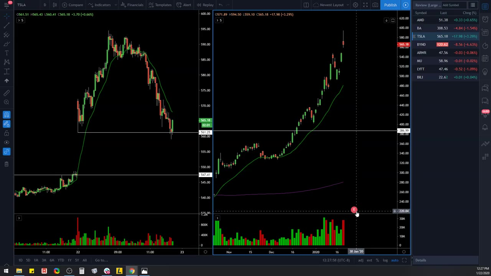

**图怎么看：**

- 这张截图显示了股票TSLA的每日K线图，展示了其价格波动情况。
- 图中可以看到TSLA的价格从512.90美元上升到568.39美元，显示出明显的上涨趋势。
- 成交量柱的高度反映对应周期内的总成交量；红绿着色通常跟随价格柱的涨跌规则，不能直接拆成两种方向的主动成交。
- 均线图显示了价格的趋势线，帮助识别长期趋势和支撑阻力位。

### 关键内容

- 讲师讨论了如何在市场开盘前确定交易设置，包括止损点和入场点。
- 使用在钱期权可以减少时间价值，保持盈利。
- 通过分析期权链来选择合适的期权类型，以适应市场波动。
- 根据新的价格行动调整趋势线，重新评估趋势。
- 在突破趋势线时优先考虑趋势线而非阻力位。
- 讲师强调了快速计算和决策的重要性，以适应市场波动。
- 分析期权链可以帮助投资者选择合适的期权类型，以适应市场波动。
- 讲师指出，使用在钱期权可以减少时间价值，保持盈利。
- 根据新的价格行动调整趋势线，重新评估趋势，确保交易策略的有效性。
- 在突破趋势线时优先考虑趋势线而非阻力位，以提高交易成功率
- 讲师强调，使用在钱期权可以减少时间价值，保持盈利，尤其是在市场波动较大时更为有效。
- 通过分析期权链来选择合适的期权类型，可以更好地适应市场波动，但需要投资者具备一定的专业知识和经验。
- 根据新的价格行动调整趋势线时，需要密切关注市场变化，及时调整止损点和目标价，以确保交易策略的有效性。
- 在突破趋势线时优先考虑趋势线而非阻力位，可以提高交易成功率，但需注意市场可能存在的反转风险，特别是在高波动时期。
- 讲师指出，快速计算和决策是适应市场波动的关键，尤其是在市场开盘前已经确定了交易设置，可以提高交易效率。

### 分析与执行顺序

1. 讲师首先介绍了如何在市场开盘前确定交易设置，包括止损点和入场点。
2. 然后，他讨论了使用在钱期权的重要性，以减少时间价值，保持盈利。
3. 接着，讲师讲解了如何通过分析期权链来选择合适的期权类型，以适应市场波动。
4. 随后，他强调了根据新的价格行动调整趋势线，重新评估趋势的重要性。
5. 最后，讲师提醒，在突破趋势线时优先考虑趋势线而非阻力位，以提高交易成功率。

### 案例与细节

- AMD 股票分析：在 4939 和 4754 之间形成了一个区间整理模式，突破有效。
- Boeing 股票分析：形成了一个平底突破模式，测试了 32960 点位四次，突破后股价大幅下跌。
- Tesla 股票分析：形成了一个强劲的上升趋势，突破 387 点位后继续上涨，但需注意财报发布的影响。
- BY&D 股票分析：形成了一个快速上升的趋势，突破 112.70 点位后继续上涨，但需注意趋势反转的风险。
- ARWR 股票分析：形成了一个长期的区间整理，突破 62220 点位后继续下跌，但需注意趋势反转的风险。
- Lyft 股票分析：形成了一个区间整理，测试了上轨三次，突破 4840 点位后继续上涨，但需注意趋势反转的风险
- 特斯拉（Tesla）股票分析显示，当股价突破387点位后，继续上涨，但需注意财报发布的影响，这说明市场情绪和公司业绩对股价有重要影响。
- 波音（Boeing）股票分析中，股价突破32960点位后，因新闻影响，实际回报更高，这表明新闻事件可以显著影响股价走势。
- Lyft股票分析中，股价在突破4840点位后继续上涨，但需注意趋势反转的风险，这说明技术突破并不总是可靠的信号。

### 风险与边界

- 讲师指出，使用在钱期权可以减少时间价值，但并非适用于所有情况。
- 分析期权链选择合适的期权类型需要一定的专业知识和经验。
- 根据新的价格行动调整趋势线存在失效风险，需要持续监控市场变化。
- 在突破趋势线时优先考虑趋势线而非阻力位，但需注意市场可能存在的反转风险。
- 讲师的分析基于2018-2021年的市场条件，当前的市场环境可能有所不同。
- 使用在钱期权虽然可以减少时间价值，但如果市场波动加剧，期权价格可能会大幅波动，导致投资者面临更大的风险。
- 分析期权链选择合适的期权类型需要投资者具备专业知识，否则可能会选择错误的期权类型，导致交易失败。
- 根据新的价格行动调整趋势线时，如果市场突然出现重大变化，之前的趋势线可能不再适用，导致交易策略失效。
- 在突破趋势线时优先考虑趋势线而非阻力位，但如果市场出现反转，这种策略可能会导致投资者错过最佳交易机会。

### 复盘问题

- 在市场开盘前确定交易设置时，如何确定止损点和入场点？
- 使用在钱期权可以减少时间价值，但在什么情况下可能不适用？
- 如何通过分析期权链来选择合适的期权类型？
- 根据新的价格行动调整趋势线时，有哪些关键因素需要考虑？
- 在突破趋势线时优先考虑趋势线而非阻力位，这在哪些情况下可能失效？

---

## v0618：TWMC 股票交易案例

> 日期：2020-01-23　·　时长：00:07:21

**本场重点：** 今天交易 TWMC 的过程展示了如何在市场波动中保持冷静并管理情绪。

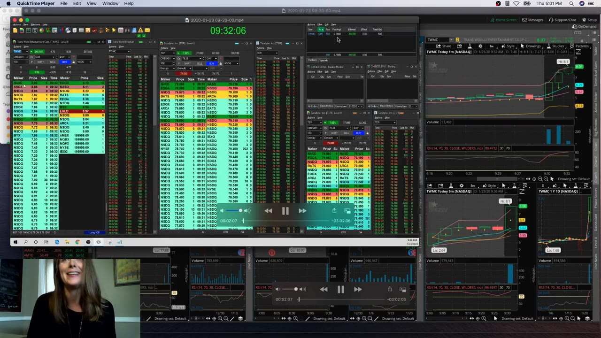

**图怎么看：**

- 在154秒时，显示了TWMC股票的实时交易情况，包括成交量、价格变动和订单状态。
- 可以看到多个交易窗口，其中包含Level 2、Time & Sales等图表。
- 屏幕右侧的TWMC 1Y D (NASDAQ)图表显示了过去一年的股价趋势。
- 左侧的表格显示了不同股票的最新价格和成交量数据。

### 关键内容

- TWMC 在开盘后迅速上涨，Selena 观察到价格突破 60 点位，决定入场。
- 相对强度指标 (RSI) 显示价格在 70 点位附近波动，表明市场处于强势状态。
- Selena 使用 Level 2 和时间销售窗口监控买卖订单，确保没有大额卖单出现。
- 市场在 70 点位附近波动，Selena 决定在此价位设置盈利目标。
- 市场出现暂停（halt）水平，Selena 尝试通过卖出订单退出市场。
- Selena 在交易过程中遇到平台问题，导致无法完全实现预期收益。
- Selena 在交易后感到失望，但意识到需要控制情绪，避免再次犯错。
- Selena 认为这次交易虽然没有完美执行，但展示了如何在市场波动中保持冷静。
- Selena 强调了情绪管理的重要性，并提醒交易者在面对市场波动时要保持冷静。
- Selena 提醒交易者注意平台问题可能带来的风险，以及如何应对这些风险

### 分析与执行顺序

1. Selena 在开盘后立即关注 TWMC 的价格走势。
2. 她使用 Level 2 和时间销售窗口监控市场动态，确保没有大额卖单出现。
3. 当价格突破 60 点位时，Selena 决定入场。
4. Selena 监控 RSI 指标，确保价格没有大幅下跌。
5. 市场出现暂停水平，Selena 尝试通过卖出订单退出市场。
6. Selena 遇到平台问题，导致无法完全实现预期收益。
7. 交易结束后，Selena 感到失望，但意识到需要控制情绪，避免再次犯错

### 案例与细节

- TWMC 开盘价为 9.30，迅速上涨至 70 点位。
- Selena 使用 RSI 指标监控价格波动，确保价格没有大幅下跌。
- Level 2 和时间销售窗口显示大量买单，Selena 确认没有大额卖单出现。
- Selena 在 70 点位设置盈利目标，但市场出现暂停水平，导致她无法完全退出市场。
- Selena 在交易过程中遇到平台问题，导致无法完全实现预期收益

### 风险与边界

- 录制年代限制：此交易案例发生在 2020 年初，当时的市场环境和平台功能可能与现在有所不同。
- 平台问题可能导致交易失败，交易者需要关注平台稳定性。
- 情绪管理是关键，交易者需要学会在市场波动中保持冷静。
- 交易者需要了解市场暂停（halt）机制及其对交易的影响

### 复盘问题

- 在开盘后，Selena 如何判断入场时机？
- Selena 使用哪些工具来监控市场动态？
- 当市场出现暂停水平时，Selena 采取了什么措施？
- Selena 在交易过程中遇到了哪些平台问题？
- Selena 如何处理交易后的失望情绪？

---

## v0619：大型股市场分析与交易策略

> 日期：2020-02-05　·　时长：00:59:30

**本场重点：** AMRN的三重底部突破分析，识别关键支撑和阻力位，以及短期交易机会。

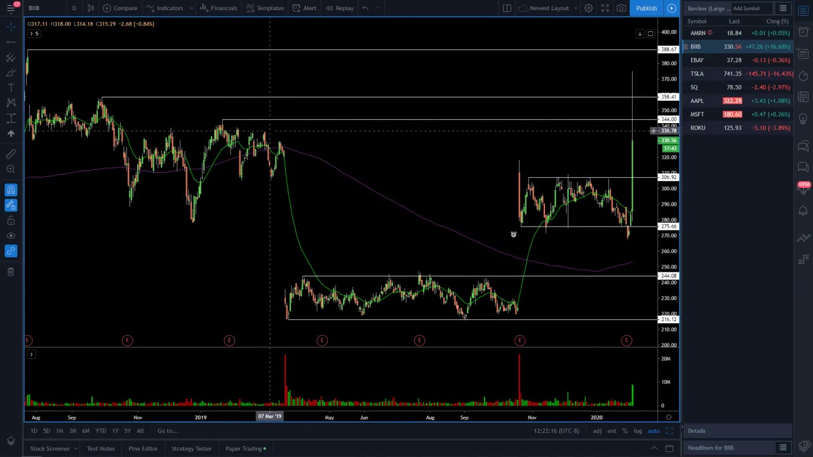

**图怎么看：**

- 在BIBB的图表中，可以看到一个明显的三重底部形态，这表明股价可能正在形成新的底部。
- 关键支撑位位于紫色水平线附近，如果股价能够在此处反弹并突破，可能会进一步上涨。
- 阻力位位于绿色水平线附近，如果股价无法突破此位置，可能会面临回调风险。
- 短期交易机会可以考虑在股价接近关键支撑位时进行买入操作，以捕捉潜在的上涨趋势。

### 关键内容

- AMRN股票在1892水平形成了三重底部，表明可能突破该水平。
- 使用看跌期权进行交易，止损设在1910水平，目标价为1670。
- 市场高度波动，许多交易机会为日内交易。
- AMRN股票在突破后反弹至200移动平均线，显示支撑力量。
- 三重底部突破后，股票未能继续下跌，表明市场情绪变化。
- 特斯拉（Tesla）的强劲突破和随后的快速回调展示了技术分析的重要性。
- 使用技术分析识别交易机会，如三重底部突破和趋势线突破。
- 市场波动性增加，提供了更多日内交易机会。
- 使用看涨期权进行交易时，最大损失仅限于投入的资金。
- AMRN股票在突破后反弹，显示了短期交易机会的存在

### 分析与执行顺序

1. 分析AMRN股票的三重底部突破，确认突破的有效性。
2. 设置止损和目标价，以控制风险和收益。
3. 监控股票价格变动，识别支撑和阻力位。
4. 利用技术分析工具识别交易机会，如三重底部突破和趋势线突破。
5. 根据市场波动性调整交易策略，抓住日内交易机会。
6. 使用看涨期权进行交易，确保最大损失不超过投入的资金。
7. 监控股票价格，及时调整交易策略以应对市场变化

### 案例与细节

- AMRN股票在1892水平形成了三重底部，表明可能突破该水平。
- 使用看跌期权进行交易，止损设在1910水平，目标价为1670。
- 特斯拉（Tesla）的强劲突破和随后的快速回调展示了技术分析的重要性。
- AMRN股票在突破后反弹至200移动平均线，显示支撑力量。
- 市场高度波动，许多交易机会为日内交易。
- 使用看涨期权进行交易时，最大损失仅限于投入的资金

### 风险与边界

- 市场高度波动可能导致交易机会失效，需谨慎选择入场时机。
- 技术分析方法依赖于历史数据，未来市场可能有所不同。
- 使用期权进行交易时，最大损失仅限于投入的资金，但需注意市场波动性。
- 特斯拉（Tesla）的强劲突破和随后的快速回调展示了技术分析的重要性，但不代表所有股票都会出现类似走势。
- 市场波动性增加，提供了更多日内交易机会，但也增加了风险。
- 使用看涨期权进行交易时，最大损失仅限于投入的资金，但需注意市场波动性

### 复盘问题

- AMRN股票在1892水平形成的三重底部突破是否有效？
- 如何设置止损和目标价以控制风险和收益？
- 特斯拉（Tesla）的强劲突破和随后的快速回调展示了技术分析的重要性，这是否适用于其他股票？
- 如何利用技术分析工具识别交易机会？
- 市场高度波动时，如何调整交易策略以抓住日内交易机会？

---

## v0620：高级交易策略：10分钟 vs 3分钟时间框架

> 日期：2020-02-12　·　时长：01:00:12

**本场重点：** 明确何时使用10分钟时间框架而非3分钟，以提高交易成功的概率。

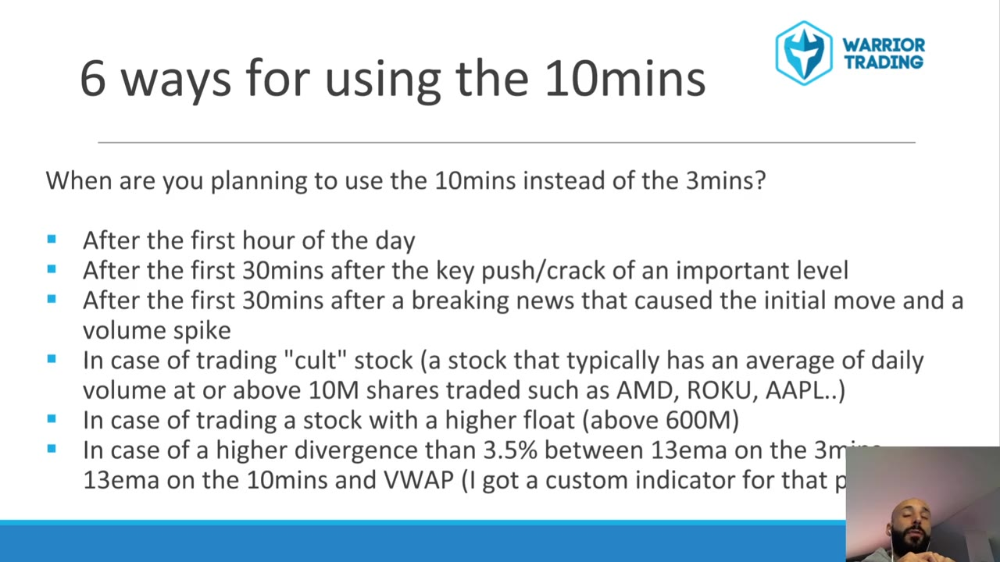

**图怎么看：**

- 在关键水平突破后，特别是在重要水平的关键推/破之后，使用10分钟时间框架。
- 在重大新闻事件导致初始移动和成交量激增后的前30分钟内使用10分钟时间框架。
- 在交易‘ cult’股票（通常每天平均交易量在10M股以上，如AMD、ROKU、AAPL等）时使用10分钟时间框架。
- 在交易具有较高流通量的股票（超过600M）时使用10分钟时间框架。

### 关键内容

- 在关键突破后的前30分钟内，使用13EMA回撤策略。
- 当市场出现重大新闻事件时，使用10分钟时间框架。
- 对于高浮筹股票，倾向于使用10分钟时间框架。
- 对于高波动性股票（如cult股票），使用10分钟时间框架可以减少止损。
- 在3分钟时间框架内识别反转信号可能更危险。
- 使用EMA分歧指标可以帮助识别高概率交易机会。
- 在关键突破后，切换到10分钟时间框架可以提高交易成功率。
- 对于高浮筹股票，使用10分钟时间框架可以减少过度交易的风险
- 在高波动性股票（如cult股票）上使用10分钟时间框架，可以更好地识别高概率交易机会，避免在3分钟时间框架内止损。
- 当市场出现重大新闻事件时，使用10分钟时间框架可以更好地应对市场波动，减少因快速反应而产生的错误。
- 对于高浮筹股票，使用10分钟时间框架可以减少过度交易的风险，因为这类股票通常需要更多时间来确认趋势。
- 在关键突破后的前30分钟内，使用10分钟时间框架可以提高交易成功率，因为此时市场情绪较为稳定，更容易形成有效的交易信号。
- 使用EMA分歧指标可以帮助识别高概率交易机会，特别是在3分钟时间框架内识别反转信号时，可以减少因误判而产生的损失

### 分析与执行顺序

1. 首先介绍13EMA回撤策略的基本原理。
2. 然后解释如何在关键突破后的前30分钟内使用13EMA回撤策略。
3. 接着讨论重大新闻事件发生时，如何切换到10分钟时间框架。
4. 进一步说明高浮筹股票更适合使用10分钟时间框架。
5. 最后，通过案例展示如何使用EMA分歧指标识别高概率交易机会

### 案例与细节

- ticker：PLT；price_level：17.26；time_frame：10分钟；description：使用10分钟时间框架进行交易，避免在3分钟时间框架内止损。
- ticker：PFE；price_level：100亿股；time_frame：10分钟；description：对于高浮筹股票，使用10分钟时间框架可以减少过度交易的风险。
- ticker：AMD；price_level：3.5%；time_frame：10分钟；description：使用EMA分歧指标识别高概率交易机会，避免在3分钟时间框架内止损。
- ticker：PLT；price_level：17.26；time_frame：10分钟；description：使用10分钟时间框架进行交易，避免在3分钟时间框架内止损。在关键突破后的前30分钟内，PLT的13EMA回撤策略显示出更高的成功概率。
- ticker：PFE；price_level：100亿股；time_frame：10分钟；description：对于高浮筹股票PFE，使用10分钟时间框架可以减少过度交易的风险。在重大新闻事件发生后，PFE的10分钟时间框架显示出更好的稳定性。
- ticker：AMD；price_level：3.5%；time_frame：10分钟；description：使用EMA分歧指标识别高概率交易机会，避免在3分钟时间框架内止损。在AMD的高波动性情况下，10分钟时间框架内的EMA分歧指标显示出更高的准确性

### 风险与边界

- 在3分钟时间框架内识别反转信号可能更危险，可能导致过度交易。
- 使用10分钟时间框架可能错过短期交易机会，但可以减少止损。
- 录制于2020年，部分规则可能已发生变化。
- 在3分钟时间框架内识别反转信号可能更危险，可能导致过度交易。特别是在高波动性股票上，快速反应可能会导致错误的交易决策。
- 使用10分钟时间框架可能错过短期交易机会，但可以减少止损。这要求交易者在长期趋势和短期波动之间找到平衡，否则可能会错失一些潜在的高回报交易。
- 录制于2020年，部分规则可能已发生变化。随着市场环境的变化，交易策略也需要相应调整，否则可能会面临新的风险。
- 对于高浮筹股票，使用10分钟时间框架可以减少过度交易的风险，但也可能错过一些短期交易机会。这要求交易者在长期趋势和短期波动之间找到平衡

### 复盘问题

- 在关键突破后的前30分钟内，如何确定使用13EMA回撤策略？
- 重大新闻事件发生时，如何切换到10分钟时间框架？
- 对于高浮筹股票，如何使用10分钟时间框架来减少过度交易的风险？

---

## v0621：技术分析与趋势跟随

> 日期：2020-02-19　·　时长：00:58:30

**本场重点：** 在当前市场趋势下，选择合适的股票进行长期持有，并设置合理的止损点。

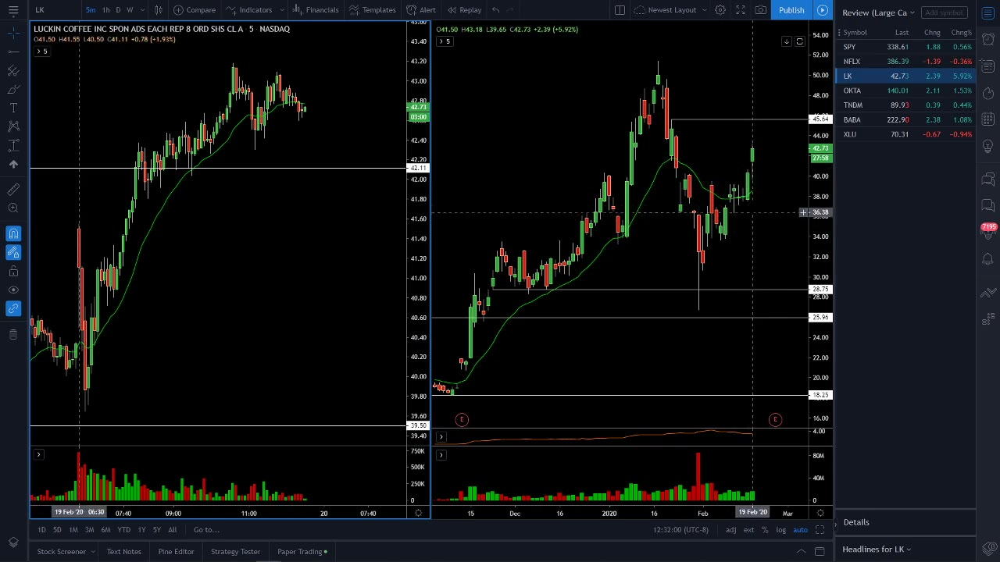

**图怎么看：**

- Luckin Coffee Inc. (LK) 的股价在过去几个月内呈现上升趋势。
- 该公司的股价在2020年1月达到一个高点后开始下跌。
- 投资者可以考虑在股价反弹时进行买入操作。
- 止损点应设定在最近的低点附近以保护投资

### 关键内容

- 讲师认为当前市场趋势有利于长期持有。
- 他强调了在突破关键阻力位后，需要设置合理的止损点。
- 他提到Netflix的突破情况，以及可能的后续走势。
- 讲师指出，技术分析中的支撑和阻力位是判断市场走势的重要依据。
- 他强调了在市场趋势强劲时，应等待突破确认后再行动。
- 讲师分享了如何识别和利用技术图表中的趋势线。
- 他提到了使用止损点来控制风险的重要性。
- 他强调了在市场趋势变化时及时调整策略的必要性。
- 讲师指出，技术分析中的趋势线测试次数越多，越有可能形成有效的突破。

### 分析与执行顺序

1. 讲师首先回顾了当前市场的趋势。
2. 然后他分享了如何识别关键阻力位，并指出突破后的可能走势。
3. 接着他强调了设置合理止损点的重要性。
4. 他进一步解释了如何利用技术图表中的趋势线进行分析。
5. 最后，他提醒学员要根据市场变化及时调整策略。

### 案例与细节

- Netflix在突破385阻力位后，形成了一个看涨的形态。
- LK在形成牛旗形态后，成功突破了趋势线。
- ACTA在突破关键水平后，继续上涨至目标价位。
- Roku在尝试突破关键水平时失败，但随后出现反弹。
- SQ在突破趋势线后，继续上涨至目标价位。

### 风险与边界

- 讲师指出，如果市场趋势发生变化，可能会导致预期的突破失败。
- 在市场波动较大时，可能会出现意外的市场缺口，影响交易策略。
- 讲师强调，技术分析的有效性依赖于市场环境的变化。
- 录制于2020年，当时的市场环境和规则可能已发生变化。

### 复盘问题

- 在当前市场趋势下，哪些股票表现最好？
- 如何确定合理的止损点？
- 在市场趋势变化时，应该如何调整交易策略？

---

## v0622：2020年3月4日市场波动与交易策略

> 日期：2020-03-04　·　时长：01:11:28

**本场重点：** 市场在200移动平均线下破后的反弹显示可能反转，但需谨慎操作。

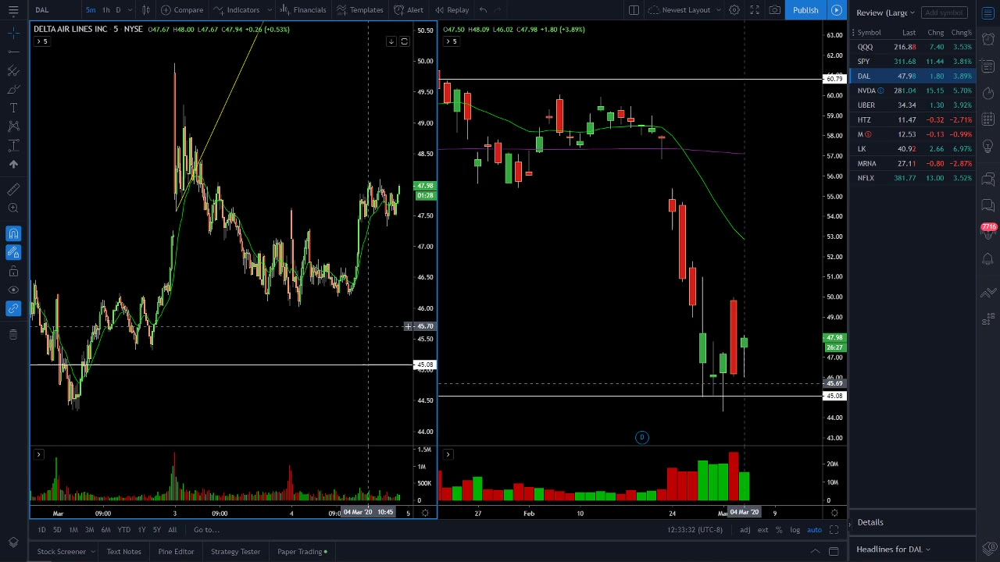

**图怎么看：**

- MACYS INC 的价格在200移动平均线下方出现反弹，显示出可能的反转信号。
- 尽管MACYS INC 在200移动平均线下方反弹，但需要警惕进一步下跌的风险。
- MACYS INC 的价格在200移动平均线下方反弹后，成交量显著增加，表明市场情绪较为紧张。
- MACYS INC 的价格在200移动平均线下方反弹后，短期内可能会面临较大的波动风险。

### 关键内容

- 市场在2020年3月4日经历了剧烈波动，SPY和三倍Q成为关键指标。
- NVIDIA的五分钟图表显示了清晰的突破模式，提供了良好的日内交易机会。
- 乌伯的突破尝试失败，显示出市场可能对关键突破持怀疑态度。
- 赫兹的股票经历了一个平底整理突破，提供了短期交易机会。
- 交易策略包括使用正确的止损，以适应市场的波动性。
- 在赫兹和乌伯的例子中，止损设置不合理，导致交易失败。
- 市场整体呈上升趋势，突破200移动平均线表明多头控制。
- 市场波动性增加，建议谨慎操作，减少风险。
- 特斯拉的交易机会提供了1-200的风险回报比，展示了成功的交易案例。
- 2018年JPM的三重顶突破交易持续数月，展示了长期交易策略的价值。
- NVIDIA的五分钟图表显示了清晰的突破模式，表明市场情绪强烈，适合日内交易者利用快速波动获利。
- 赫兹的股票经历了一个平底整理突破，这通常意味着市场信心增强，但实际交易中需谨慎，因为这种突破有时会迅速回落。
- 市场在突破200移动平均线后出现大幅回弹，这可能是多头力量增强的信号，但也需警惕市场可能随时逆转的趋势。
- 交易策略中正确设置止损至关重要，尤其是在市场高度波动时，合理的止损可以有效防止资金损失并保护交易计划。
- 使用正确的止损不仅能够保护资金，还能帮助交易者更好地理解市场动态，从而做出更明智的决策

### 分析与执行顺序

1. 讲师分享了关于NVIDIA的五分钟图表分析，展示了突破模式。
2. 讲师讨论了乌伯的突破尝试，指出市场可能对关键突破持怀疑态度。
3. 讲师分享了Hertz股票的短空交易示例，强调了使用支撑水平的重要性。
4. 讲师提供了Excel看涨列表下载链接，包括三个按钮分别用于导出股票列表、技术分析和交易想法。
5. 讲师每隔几天更新一次看涨列表，提供潜在的交易机会。

### 案例与细节

- NVIDIA的五分钟图表显示了清晰的突破模式。
- 乌伯的突破尝试失败，显示出市场可能对关键突破持怀疑态度。
- 赫兹的股票经历了一个平底整理突破，提供了短期交易机会。
- 特斯拉的交易机会提供了1-200的风险回报比。
- 特斯拉（Tesla）的交易机会提供了1-200的风险回报比，这意味着每投入1美元，潜在收益可达200美元，这展示了成功的交易案例中的高回报潜力。
- 乌伯（Uber）的突破尝试失败，显示出市场可能对关键突破持怀疑态度，这说明即使技术面上看似有利，实际市场反应也可能不同。
- 赫兹（Hertz）的股票经历了一个平底整理突破，提供了短期交易机会，但实际交易中需注意，这种突破并不总是可靠的入场信号，需结合其他技术指标进行验证

### 风险与边界

- 市场环境不稳定时，容易陷入陷阱，建议减小风险，调整策略。
- 在盘前或盘后交易中，需要有缓冲以应对潜在的缺口风险。
- 如果股票收盘价接近止损点，则应考虑退出交易。
- 录制于2018-2021年，平台、监管、税务和经纪商条件只能表述为历史录制内容。
- 市场环境不稳定时，容易陷入陷阱，特别是在重大新闻事件发生前后，投资者应减少风险暴露，避免盲目跟风。
- 在盘前或盘后交易中，需要有缓冲以应对潜在的缺口风险，这要求投资者提前设定好止损和止盈点，以应对突发市场变化。
- 如果股票收盘价接近止损点，则应考虑退出交易，避免因市场波动导致的资金损失，这要求投资者具备良好的风险意识。
- 录制于2018-2021年，平台、监管、税务和经纪商条件只能表述为历史录制内容，因此投资者在当前环境下需自行评估相关风险

### 复盘问题

- 在NVIDIA的突破模式中，哪些因素是关键的？
- 乌伯的突破尝试失败的原因是什么？
- 赫兹的股票突破是如何进行的？
- 特斯拉的交易机会提供了怎样的风险回报比？

---

## v0623：S&P 500 对个人交易的影响

> 日期：2020-03-11　·　时长：00:55:14

**本场重点：** S&P 500 的市场周期对个人交易的影响，以及如何根据市场状况调整策略。

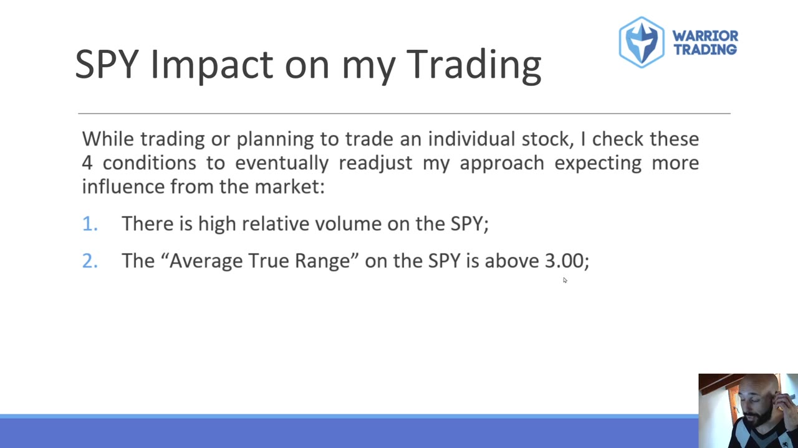

**图怎么看：**

- 在进行股票交易时，我检查以下四个条件以最终调整我的方法，期望从市场获得更多的影响。
- 1. SPY的相对成交量较高。
- 2. SPY的‘平均真实范围’高于3.00。
- 3. 我正在交易的股票是所谓的‘代理股’（例如AAPL, MSFT, AMZN, FB等）。

### 关键内容

- S&P 500 是一个追踪标普500指数的ETF，影响个人交易决策。
- 市场周期定义为标普500指数从最高点下降15%或上升15%的时间段。
- 市场条件变化会影响S&P 500对个人交易的影响程度。
- 通过ATR指标可以判断市场波动性，从而调整交易策略。
- 在市场波动较大时，需要更加耐心和谨慎地选择交易机会。
- 使用ATR指标可以帮助识别市场趋势和潜在交易机会。
- 市场周期的变化会影响交易策略的选择，需灵活应对。
- 在市场平静期，可以忽略S&P 500的影响，而在市场波动期则需关注。
- 通过观察市场条件和ATR指标，可以更好地预测市场走势。
- 在市场波动较大时，需要更长时间等待合适的交易机会

### 分析与执行顺序

1. 讲师首先介绍了S&P 500的基本概念及其对个人交易的影响。
2. 然后定义了市场周期的概念，并解释了如何计算。
3. 接着讨论了不同市场条件下S&P 500对个人交易的不同影响。
4. 通过ATR指标来衡量市场波动性，并解释了如何应用。
5. 最后举例说明了如何根据市场条件调整交易策略，以适应市场变化。

### 案例与细节

- 讲师提到，当S&P 500的ATR值超过4.5时，通常会伴随更高的成交量。
- 2018年10月到2019年初，S&P 500的ATR值基本保持在4.5以下，表明市场相对平静。
- 2020年2月到2020年3月，S&P 500的ATR值大幅上升，达到15点以上，表明市场波动加剧。
- 在市场波动较大时，如2020年3月，S&P 500的下跌幅度达到了20%，这需要投资者更加谨慎。
- 讲师通过BA（波音）股票的例子，展示了如何在市场波动时选择合适的交易机会。

### 风险与边界

- 讲师指出，市场条件变化可能导致S&P 500对个人交易的影响程度发生变化。
- 在市场平静期，忽略S&P 500的影响可能会错过一些交易机会。
- 在市场波动期，过度依赖S&P 500可能会导致错误的交易决策。
- 讲师的分析基于2018年至2021年的市场数据，当前市场情况可能有所不同。

### 复盘问题

- 在市场波动较大时，如何确定最佳的交易时机？
- 如何利用ATR指标来判断市场的波动性？
- 在市场平静期，是否可以完全忽略S&P 500的影响？
- 如何根据市场条件调整交易策略？
- 在市场波动较大时，有哪些具体的交易策略可以采用？

---

## v0624：市场波动与技术分析

> 日期：2020-03-11　·　时长：01:10:38

**本场重点：** 当前市场高度波动，技术分析尤为重要。识别支撑和阻力水平，设置合理的止损，保持冷静的心态。

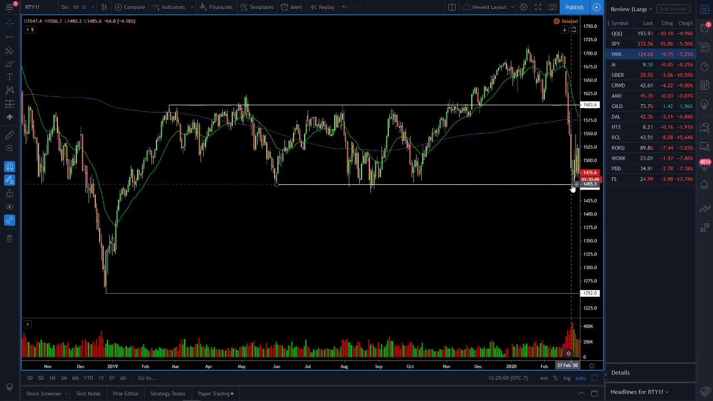

**图怎么看：**

- 在AMD的每日蜡烛图中，可以看到股价在绿色和红色蜡烛之间波动，表明市场情绪不稳定。
- 成交量柱状图显示了不同时间段的成交量变化，有助于理解市场的活跃程度。
- 图表下方的时间和销售窗口提供了实时交易数据，帮助投资者了解市场动态。
- 整体来看，这张图表展示了AMD股票的技术面情况，对于判断其未来走势具有重要参考价值。

### 关键内容

- 当前市场高度波动，技术分析尤为重要。识别支撑和阻力水平，设置合理的止损，保持冷静的心态。
- 市场趋势强烈向下，导致许多股票跟随市场下跌，但AMD的表现与众不同。
- 识别关键支撑和阻力水平对于制定交易策略至关重要，例如IWM的关键水平为19115和1801.82。
- 保持冷静和理性，避免过度交易。例如，在市场突然下跌时，保持冷静，等待明确的技术信号再进行交易。
- 市场突然反弹或突破关键水平时，交易者可能会面临失败。例如，AMC在突破关键水平后迅速回撤，导致交易失败。
- 成功案例包括M和CRWD的卖空机会，基于明确的技术信号，如突破支撑和阻力水平。
- 当前市场环境高度波动，提供了许多技术分析的机会。然而，这也增加了交易的不确定性。
- 识别关键支撑和阻力水平对于判断市场走势非常重要。例如，IWM的关键水平为19115和1801.82。

### 分析与执行顺序

1. 识别支撑和阻力水平，等待突破后再进行交易。例如，在AMD的交易中，突破关键水平后，交易者应立即采取行动。
2. 在市场突然下跌时，保持冷静，等待明确的技术信号再进行交易。例如，市场预期下跌时，交易者应保持熊市心态。
3. 在市场突然反弹或突破关键水平时，及时调整策略。例如，AMC在突破关键水平后迅速回撤，导致交易失败。
4. 识别关键支撑和阻力水平，设置合理的止损。例如，在M的交易中，止损设在前一天的高点，如果突破该水平，则需要立即退出。
5. 持续跟踪股票列表，尤其是在市场波动加剧时，有助于观察整体市场的动态。

### 案例与细节

- M在1244水平附近形成了一个平底，随后突破该水平，形成了一个明确的卖空机会。
- Uber在尝试突破3416水平时失败，形成了一个明显的熊市陷阱。
- SQ在突破关键水平后迅速回撤，导致交易失败。
- DAL的裸旗形态，由于之前的下跌趋势和形成的三点趋势线，提供了准确的突破点。

### 风险与边界

- 市场突然反弹或突破关键水平时，交易者可能会面临失败。例如，AMC在突破关键水平后迅速回撤，导致交易失败。
- 市场突然下跌时，保持冷静，等待明确的技术信号再进行交易。例如，市场预期下跌时，交易者应保持熊市心态。
- 当前市场环境高度波动，增加了交易的不确定性。因此，需要谨慎操作。
- 识别关键支撑和阻力水平对于判断市场走势非常重要。然而，这些水平也可能被突破，导致交易失败。

### 复盘问题

- 当前市场环境如何影响技术分析的应用？
- 如何识别和利用支撑和阻力水平进行交易？
- 在市场突然反弹或突破关键水平时，应采取什么措施？
- 如何保持冷静和理性，避免过度交易？
- 如何根据市场波动调整交易策略？

---

## v0625：市场波动与技术交易策略

> 日期：2020-03-18　·　时长：01:16:21

**本场重点：** 讲师分析了市场波动性和技术交易策略，强调了短期交易机会和风险管理。

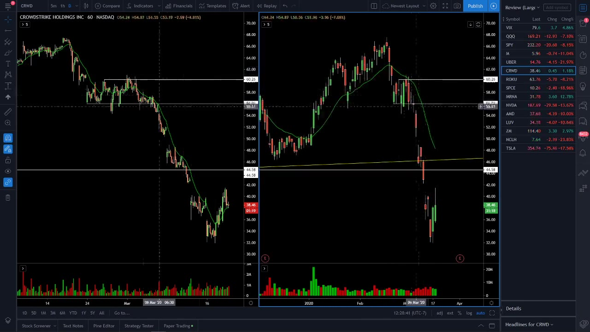

**图怎么看：**

- 图中显示了Crowdstrike Holdings Inc. (CRWD) 在2020年3月期间的日线图，可以看到股价在不同时间段内的波动情况。
- 从图中可以看出，CRWD 的股价在2020年3月期间经历了多次上升和下降，显示出市场的波动性。
- 成交量柱的高度反映对应周期内的总成交量；红绿着色通常跟随价格柱的涨跌规则，不能直接拆成两种方向的主动成交。
- 通过观察这些图表，可以分析出市场的情绪和投资者的行为，从而制定相应的交易策略。

### 关键内容

- VIX达到9640的历史高位，显示市场极度恐慌。
- SPY在23376附近有重要支撑，但208是下一个关键支撑位。
- Macy’s、Uber、CRWD等股票出现平底破败和三重底破败等技术形态，提供短期交易机会。
- NCLH是一个摆动交易设置，突破1019水平，股票在该水平多次找到支撑。
- AMD在16日有一个强劲的旗形突破，技术上突破点落在4015。
- SPI在特朗普会议后出现抛售，拒绝了259-12水平，被视为突破点。
- SPY在下一个早晨出现急剧下跌，市场似乎在收盘时触底。
- 体积是交易的关键部分，特别是在市场波动时。
- Roku的成交量在突破时增加，增加了成功的概率。
- SPY第四次测试突破点后，第五次测试才成功，需要个人判断。
- VIX突破4820水平，显示市场流动性危机，需谨慎操作。
- 短期交易机会主要集中在平底破败和三重底破败技术形态，需结合市场情绪分析。
- 保持宽止损策略，避免市场大幅波动导致的亏损，尤其在市场极度恐慌时。
- 识别关键支撑和阻力位，制定交易计划，执行并耐心等待，提高交易成功率。
- 短期技术交易在市场极度波动时尤为重要，需灵活调整交易策略

### 分析与执行顺序

1. 讲师分析了市场波动性和技术交易策略，强调了短期交易机会和风险管理。
2. 识别关键支撑和阻力位，制定交易计划，执行并耐心等待。
3. 在市场波动时，保持宽止损，避免市场大幅波动导致的亏损。
4. 在摆动交易中，关注突破后的支撑和阻力位。
5. 在期权交易中，考虑杠杆ETF的风险，选择合适的交易方式。

### 案例与细节

- Macy’s的平底破败技术形态，提供短期交易机会。
- NCLH突破1019水平，股票在该水平多次找到支撑。
- AMD在16日的旗形突破，技术上突破点落在4015。
- SPI在特朗普会议后的抛售，拒绝了259-12水平，被视为突破点。
- Macy’s的平底破败技术形态，提供短期交易机会，需关注市场情绪变化。
- NCLH突破1019水平，股票在该水平多次找到支撑，需结合市场流动性分析。
- AMD在16日的旗形突破，技术上突破点落在4015，需关注价格趋势和市场情绪。
- SPI在特朗普会议后的抛售，拒绝了259-12水平，被视为突破点，需结合政策影响分析

### 风险与边界

- 市场环境非常动荡，建议继续在模拟器上练习，避免在真实账户上亏损。
- 当前市场环境下，IV非常高，使得期权交易更具挑战性。
- 交易SPY期权时，高IV对于做多期权来说是好事，但做空期权风险极大。
- 讲师的课程和大型股房间可以提供更多的摆动交易知识。
- 市场环境非常动荡，建议继续在模拟器上练习，避免在真实账户上亏损，尤其在市场极度恐慌时。
- 当前市场环境下，IV非常高，使得期权交易更具挑战性，需谨慎选择交易方式。
- 交易SPY期权时，高IV对于做多期权来说是好事，但做空期权风险极大，需谨慎操作
- 讲师的课程和大型股房间可以提供更多的摆动交易知识，但实际操作中需结合市场变化灵活调整

### 复盘问题

- 讲师如何解释VIX的历史高位和当前突破？
- NCLH的突破分析提供了哪些技术交易策略？
- AMD的旗形突破是如何进行的？
- SPI在特朗普会议后的抛售如何影响交易决策？

---

## v0626：2020年中级交易策略分析

> 日期：2020-04-01　·　时长：01:15:33

**本场重点：** 讲师通过具体股票案例分析了市场技术分析的重要性，并强调了当前市场主要依赖技术分析。

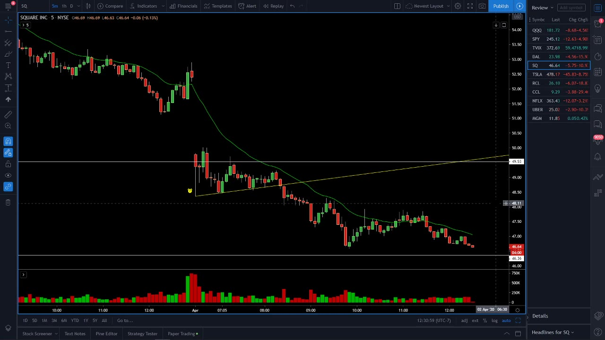

**图怎么看：**

- Square Inc. (NYSE:SQ) 的日线图显示了其股价在近期的波动情况。
- 图中可以看到股价在不同时间段内的波动，包括上升趋势和下降趋势。
- 成交量柱的高度反映对应周期内的总成交量；红绿着色通常跟随价格柱的涨跌规则，不能直接拆成两种方向的主动成交。
- 图中的均线（黄色线条）提供了长期趋势的参考，帮助投资者判断市场方向。

### 关键内容

- 讲师分析了近期市场波动，强调了技术分析的重要性。
- 市场环境动荡，特别是航空股受到重创。
- 讲师分享了多个交易策略，包括DAL、SQ、TSLA、CCL、MGM和UBER等股票的具体操作步骤。
- 讲师讨论了市场技术分析与基本面之间的平衡，指出当前市场主要依赖技术分析。
- SPY和三倍ETF的走势提供了重要的供需线索。
- 讲师解释了如何识别牛市陷阱，包括在关键水平附近进行短空操作。
- 讲师强调了如何确定支撑和阻力水平，并根据这些水平设置止损。
- 讲师在不同时间框架（5分钟、60分钟和日线）上的交易策略有所不同。
- 讲师提到了市场暂停的风险，包括在市场暂停期间持有的股票将无法交易，直到市场恢复。
- 讲师指出，SPY和三倍ETF的走势反映了市场的供需状况，这是技术分析的重要依据。
- 讲师强调，市场试图在未来六到十二个月内定价基本面，但目前仍处于猜测阶段，因此技术分析短期内占主导地位。
- 讲师提到，市场暂停期间无法交易，这可能导致资金流动性问题，特别是在需要快速反应的情况下。
- 讲师分析了CCL的旗形突破，说明了如何识别关键支撑和阻力水平，并根据这些水平设置止损，以控制风险。
- 讲师讨论了如何在不同时间框架（5分钟、60分钟和日线）上识别市场趋势和交易机会，强调了时间框架对交易策略的影响。

### 分析与执行顺序

1. 讲师首先分析了近期市场波动，强调了技术分析的重要性。
2. 然后，讲师分享了多个股票的具体交易策略，包括DAL、SQ、TSLA、CCL、MGM和UBER等。
3. 接着，讲师讨论了市场技术分析与基本面之间的平衡，指出当前市场主要依赖技术分析。
4. 讲师解释了如何识别牛市陷阱，包括在关键水平附近进行短空操作。
5. 最后，讲师提到了市场暂停的风险，包括在市场暂停期间持有的股票将无法交易，直到市场恢复。

### 案例与细节

- DAL股票：分析了DAL形成旗形突破后的短期交易机会，初始风险为20美分，后调整至10美分，目标是保持在2452以下，最终获利70美分。
- SQ股票：分析了SQ的旗形突破，初始风险为47美分，目标是保持在46以下，最终获利216美分。
- TSLA股票：分析了TSLA的双底形态，目标是跌破494，初始风险为3美分，目标是保持在474以下。
- CCL股票：分析了CCL的旗形突破，初始风险为20到30美分，目标是保持在1409以下，最终获利137美分。
- DAL股票：分析了DAL形成旗形突破后的短期交易机会，初始风险为20美分，后调整至10美分，目标是保持在2452以下，最终获利70美分。这表明了如何根据市场走势调整交易策略以最大化收益。
- SQ股票：分析了SQ的旗形突破，初始风险为47美分，目标是保持在46以下，最终获利216美分。这展示了如何利用技术分析识别关键支撑位并制定相应的交易计划。
- TSLA股票：分析了TSLA的双底形态，目标是跌破494，初始风险为3美分，目标是保持在474以下。这说明了如何识别特定形态并据此制定交易策略。

### 风险与边界

- 市场环境变化可能导致交易策略失效。
- 市场暂停期间无法交易，可能影响资金流动性。
- 讲师的操作基于历史数据，当前市场情况可能有所不同。
- 技术分析依赖于图表和指标，可能因市场变化而失效。
- 市场环境变化可能导致交易策略失效，特别是在市场趋势发生突然改变时。
- 市场暂停期间无法交易，这可能影响资金流动性，特别是在需要快速反应的情况下。
- 技术分析依赖于图表和指标，可能因市场变化而失效，特别是在市场出现异常波动时。
- 讲师的操作基于历史数据，当前市场情况可能有所不同，这可能导致实际操作效果与预期不符。

### 复盘问题

- 讲师是如何分析市场波动并强调技术分析的重要性？
- 具体股票案例中，哪些交易策略是最成功的？
- 市场技术分析与基本面之间存在什么关系？
- 如何识别牛市陷阱并制定相应的交易策略？
- 在不同时间框架上，交易策略有何差异？

---

## v0627：自定义技术指标在交易中的应用

> 日期：2020-04-04　·　时长：00:55:46

**本场重点：** 技术指标简化交易过程，而非增加复杂性；找到适合自己的指标组合；保持简单。

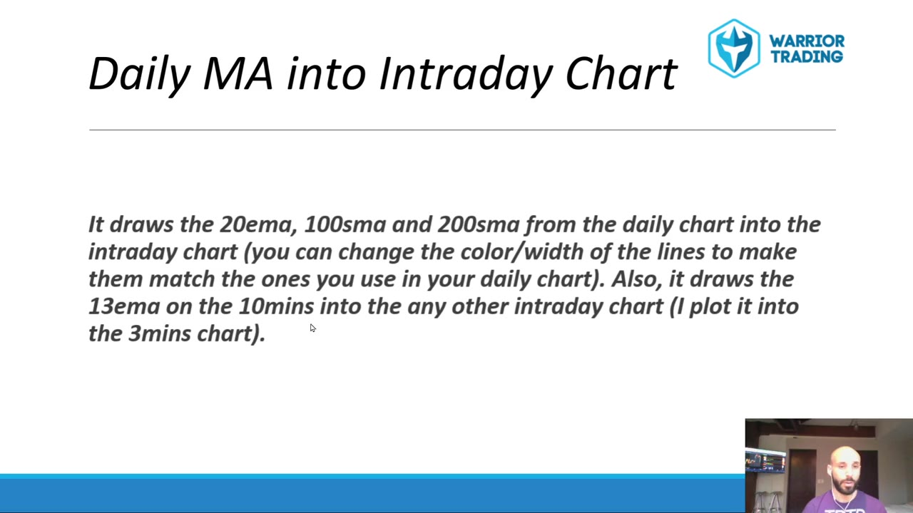

**图怎么看：**

- 该图表显示了从每日图表中提取的20天EMA、100天SMA和200天SMA，并将其绘制到日内图表上。
- 用户可以更改线条的颜色和宽度，以匹配他们在日常图表中使用的线条。
- 此外，它将13天EMA绘制到任何其他日内图表上（我将其绘制到3分钟图表上）。
- 这些指标有助于分析市场趋势和确认买卖信号。

### 关键内容

- 技术指标的目的是简化交易，而非增加复杂性。
- 测试技术指标是为了找到最适合自己的指标组合。
- 使用最少的技术指标来支持快速有效的决策。
- 选择适合自己的时间框架，如3分钟和10分钟图表。
- 使用简单的技术指标，如13EMA，以提高决策速度。
- 通过回测和实盘测试来验证技术指标的有效性。
- 避免过度依赖单一技术指标，寻找适合自己的方法。
- 保持简单，避免过度复杂化交易过程。

### 分析与执行顺序

1. 讲师首先介绍技术指标的目的，即简化交易过程。
2. 然后讲解如何选择适合自己的时间框架，如3分钟和10分钟图表。
3. 接着介绍如何测试技术指标，包括回测和实盘测试。
4. 最后强调使用最少的技术指标来支持快速有效的决策。
5. 讲师展示如何将不同时间框架的技术指标绘制在同一图表上，以帮助理解。

### 案例与细节

- 使用3分钟和10分钟图表，而不是24秒或30秒图表，因为它们对于讲师来说太快，无法清晰看到市场走势。
- 使用13EMA（指数移动平均线）作为简单且有效的技术指标，因为它能够帮助快速识别市场趋势。
- 通过回测发现某些技术指标可能不适合实盘交易，因此需要不断调整和测试。
- 使用相对强度指数（RSI）来监控股票的强弱程度，但讲师自己并不使用它，因为测试后发现它不适合自己的交易策略。
- 使用短卖限制价格指标来确定股票进入短卖限制状态的价格，这有助于制定交易策略。

### 风险与边界

- 过度依赖单一技术指标可能导致决策失误，因此需要不断测试和调整。
- 使用过多的技术指标会增加决策难度，降低交易效率。
- 技术指标的有效性可能会随市场变化而变化，因此需要定期更新和测试。
- 录制年代限制为2020年，当前市场环境可能已发生变化。

### 复盘问题

- 如何选择适合自己的时间框架？
- 如何通过回测和实盘测试来验证技术指标的有效性？
- 如何确保使用最少的技术指标来支持快速有效的决策？

---

## v0628：添加到现有头寸的方法

> 日期：2020-04-08　·　时长：00:57:57

**本场重点：** 添加到现有头寸可以提高潜在利润，但需要谨慎管理风险。

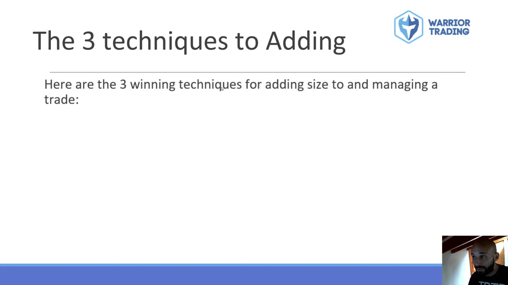

**图怎么看：**

- 幻灯片标题“The 3 techniques to Adding”，说明本段接下来会讨论三种增加仓位并管理交易的方法；当前画面是章节导入，没有列出具体三项内容。
- “adding size”和“managing a trade”被放在同一句中，提醒加仓不是单纯扩大盈利目标，而是会同步改变平均成本、总风险和退出计划。
- 实际使用任何加仓法前，都应先算新增数量后止损触发时的总亏损，并明确是盈利加仓、突破确认加仓还是重新入场，避免把亏损摊平包装成策略。
- 仅凭这一页不能判断哪种方法适合某笔交易，也不能证明加仓会提高收益；要结合课程后续规则和个人样本验证。

### 关键内容

- 添加到现有头寸可以提高潜在利润，但也增加了潜在损失的风险。
- 新手在管理大头寸时容易陷入心理陷阱，导致错误决策。
- 成功的交易策略需要明确的计划和耐心的选择时机。
- 保守方法是在首次目标后减半头寸，平衡方法是直接在首次目标后加仓，激进方法是多次加仓。
- 激进方法虽然可能带来更高的利润，但也降低了准确性。
- 新手应从保守方法开始，逐步适应更激进的策略。
- 市场波动和互联网中断是交易中常见的风险。
- 使用止损单需要谨慎，因为它们可能导致情绪波动。
- 交易过程中需要不断调整计划以应对市场变化。
- 通过实例展示如何利用关键水平进行头寸管理

### 分析与执行顺序

1. 首先，制定明确的交易计划，包括目标和止损点。
2. 其次，在首次目标确认后，根据计划选择是否加仓。
3. 然后，根据市场情况调整止损点，确保风险控制。
4. 最后，根据计划在目标达成后平仓或继续持有。
5. 在整个过程中，保持耐心和纪律，避免冲动操作。
6. 记录每次交易的细节，以便后续分析和改进。
7. 定期回顾交易记录，评估策略的有效性

### 案例与细节

- 在波音股票的交易中，当价格突破156关键水平时，可以考虑建立小头寸，然后根据市场反应决定是否加仓。
- 使用斐波那契回撤水平来确定潜在的盈利目标和止损点，有助于制定更精确的交易计划。
- 在市场波动较大时，激进加仓可能会导致更大的亏损，因此需要谨慎操作。
- 在互联网中断的情况下，使用手机上的交易平台作为备份，确保能够及时退出不利头寸。
- 通过反复练习和模拟交易，逐步提高对市场波动的适应能力，从而更好地管理头寸大小

### 风险与边界

- 新手在管理大头寸时容易出现情绪波动，导致错误决策。
- 激进加仓策略虽然可能带来高收益，但也降低了交易的准确性。
- 市场波动和互联网中断是交易中常见的风险，需要做好应对措施。
- 使用止损单可能导致情绪波动，影响交易决策。
- 交易策略的有效性会随市场环境的变化而变化，需要持续调整和优化。
- 录制年代限制为2020年，当前市场环境可能有所不同

### 复盘问题

- 在交易过程中，如何确保计划的执行？
- 如何在激进加仓和保持准确性之间找到平衡？
- 在市场波动较大时，如何调整交易策略以减少风险？

---

## v0629：MRNA 股票的技术分析与风险管理

> 日期：2020-04-08　·　时长：01:33:16

**本场重点：** 讲师强调了技术分析中的趋势线测试、止损设置及风险管理的重要性。

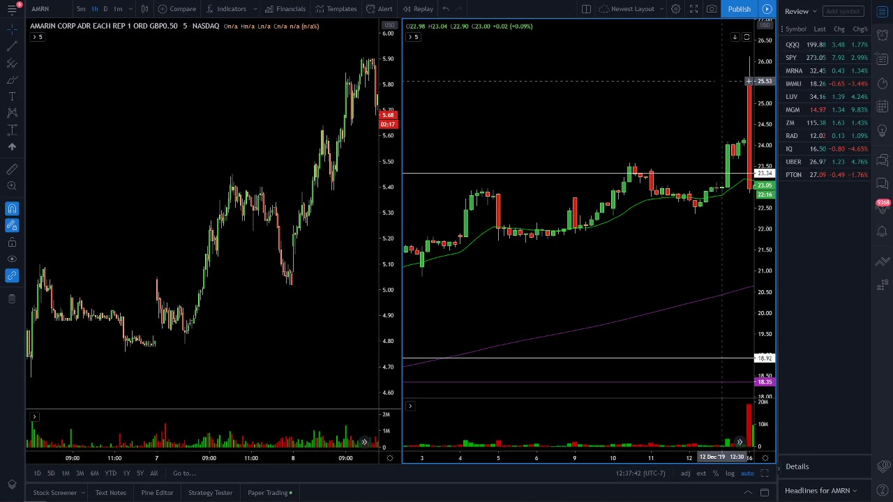

**图怎么看：**

- 图 B 显示了 AMRNA 股票的技术分析，包括趋势线测试、止损设置及风险管理。
- 画面中的水平线表示止损点，帮助投资者在市场波动时保护资金。
- 画面中的趋势线显示了股票的价格走势，有助于识别潜在的买入或卖出机会。
- 成交量柱的高度反映对应周期内的总成交量；红绿着色通常跟随价格柱的涨跌规则，不能直接拆成两种方向的主动成交。

### 关键内容

- 讲师分析了 MRNA 股票的牛旗形态，强调需要第三次拒绝趋势线才能考虑做多。
- 讲师指出，如果股票在突破点上方跳空上涨，他不会立即介入，而是等待第三次测试趋势线后再考虑做多。
- 讲师强调，止损应基于前一个枢轴低点，以确保风险可控。
- 讲师在突破后以 3055 入场，止损设在前一个枢轴低点 3025，风险为 30 分钟。
- 讲师计划持有至 3169，作为首次平仓点，以实现长期成功。
- 讲师总结了 MRNA 的技术分析，强调了耐心和风险管理的重要性。
- 讲师提到 MRNA 因新闻被暂停交易，导致损失，提醒投资者注意催化剂带来的风险。
- 讲师分享了 AMRN 的教训，强调了新闻驱动股票的风险。
- 讲师分析了 IMMU 的支撑位，强调了第三测试的重要性。
- 讲师总结了近期的教训，强调了等待触发水平的重要性。
- 讲师强调，使用 Trading View 平台时，需注意图表显示的不同情况，特别是市场快速变动可能导致策略失效。
- 讲师指出，使用 VWOP（成交量加权平均价格）时，需将其添加到 Trading View 中，以辅助技术分析，但需注意其反映市场情绪的局限性。
- 讲师提到，对于 IMMU 的图表分析，需观察是否突破关键支撑位，若连续几根蜡烛线均低于该水平，则重新评估，这体现了技术分析中的重要性。
- 讲师总结了近期的教训，强调了等待触发水平的重要性，特别是在市场快速变动时，需保持耐心和谨慎。
- 讲师分析了 MRNA 的技术形态，强调了新闻事件带来的风险，提醒投资者注意催化剂带来的不确定性

### 分析与执行顺序

1. 讲师分析了 MRNA 股票的牛旗形态，强调需要第三次拒绝趋势线才能考虑做多。
2. 讲师指出，如果股票在突破点上方跳空上涨，他不会立即介入，而是等待第三次测试趋势线后再考虑做多。
3. 讲师强调，止损应基于前一个枢轴低点，以确保风险可控。
4. 讲师在突破后以 3055 入场，止损设在前一个枢轴低点 3025，风险为 30 分钟。
5. 讲师计划持有至 3169，作为首次平仓点，以实现长期成功。
6. 讲师总结了 MRNA 的技术分析，强调了耐心和风险管理的重要性。
7. 讲师提到 MRNA 因新闻被暂停交易，导致损失，提醒投资者注意催化剂带来的风险。
8. 讲师分享了 AMRN 的教训，强调了新闻驱动股票的风险。
9. 讲师分析了 IMMU 的支撑位，强调了第三测试的重要性。
10. 讲师总结了近期的教训，强调了等待触发水平的重要性。

### 案例与细节

- MRNA 股票的牛旗形态
- 3055 入场，止损设在 3025
- 3169 作为首次平仓点
- IMMU 在 1771 支撑位的表现
- VWOP（成交量加权平均价格）的使用
- 使用 Trading View 平台进行技术分析
- 讲师在突破后以 3055 入场，止损设在前一个枢轴低点 3025，风险为 30 分钟，这体现了基于历史数据制定交易策略的重要性。
- 讲师提到，使用 Trading View 平台时，需注意图表显示的不同情况，特别是市场快速变动可能导致策略失效，如 ZM 的技术形态分析所示。
- 讲师分享了 AMRN 的教训，强调了新闻驱动股票的风险，如 MRNA 因新闻被暂停交易导致损失，提醒投资者注意催化剂带来的风险。
- 讲师分析了 IMMU 的支撑位，强调了第三测试的重要性，如 IMMU 在 1771 支撑位的表现，这体现了技术分析中的关键点。
- 讲师总结了近期的教训，强调了等待触发水平的重要性，如 MRNA 的技术分析，这体现了耐心和风险管理的重要性

### 风险与边界

- 讲师的操作基于历史数据，当前市场条件可能有所不同。
- 使用 Trading View 平台时，需注意图表显示的不同情况。
- 市场快速变动可能导致策略失效。
- 讲师的操作基于 2020 年的数据，当前市场环境可能有所变化。
- 讲师的操作基于 2020 年的数据，当前市场环境可能有所变化，这可能导致策略失效，提醒投资者注意市场条件的变化。
- 使用 Trading View 平台时，需注意图表显示的不同情况，特别是市场快速变动可能导致策略失效，提醒投资者注意市场波动的风险。
- 市场快速变动可能导致策略失效，特别是在使用 VWOP（成交量加权平均价格）时，需注意其反映市场情绪的局限性。
- 讲师的操作基于历史数据，当前市场条件可能有所不同，这可能导致策略失效，提醒投资者注意市场条件的变化

### 复盘问题

- 讲师是如何确定 MRNA 股票的入场点和止损点的？
- 在突破趋势线后，讲师为何选择等待第三次测试趋势线后再考虑做多？
- 讲师是如何利用 VWOP 来辅助技术分析的？
- 在使用 Trading View 平台时，如何避免图表显示的不同情况？

---

## v0630：市场趋势与技术分析

> 日期：2020-04-29　·　时长：01:29:59

**本场重点：** 当前市场环境下，短期技术分析更为重要，而长期宏观预测难以准确。市场出现V形复苏，但可能只是暂时的。

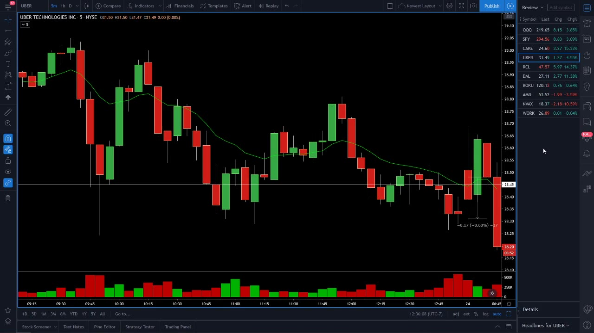

**图怎么看：**

- UBER Technologies Inc. (UBER) 的日线图显示了近期的价格波动，其中包含了多个红色和绿色的蜡烛线，表示股价的上升和下降。
- 在UBER的技术分析中，可以看到股价在一段时间内经历了明显的下跌后，随后出现了反弹，显示出市场的短期波动性。
- 此外，UBER的日线图还显示了支撑和阻力位，这些位置对于投资者来说是非常重要的参考点。
- 通过观察UBER的技术指标，可以更好地理解其价格行为，并为未来的交易决策提供依据。

### 关键内容

- 讲师分析了市场趋势，特别关注SPY和Triple Q等ETF的表现。
- 当前市场环境使得短期技术分析更为重要，而长期宏观预测难以准确。
- 近期市场出现V形复苏，但讲师认为这种复苏可能只是暂时的，市场可能很快会转向下跌趋势。
- 讲师分享了几个成功的交易案例，包括Cake、Uber和RCL，强调了技术突破的重要性以及止损设置的必要性。
- RCL的交易机会被详细分析，指出这是一个重要的趋势线突破点。
- 如果突破失败，这可能是熊市陷阱。实际交易中，RCL在突破后迅速回升，导致一些投资者未能及时退出。
- 市场整体下跌，而DAL股票却保持上涨，显示相对强势，支持突破。
- 使用Trading View软件进行图表分析，选择深实值期权，期权的delta值为0.8及以上。
- 选择股票的标准包括三线趋势线、三线平顶和平底等。
- 设置止损单，价格触及止损水平时立即退出。
- 讲师指出，RCL的突破失败可能是熊市陷阱，实际交易中，RCL在突破后迅速回升，导致一些投资者未能及时退出，这说明技术突破需要结合市场情绪和实际走势来判断。
- 市场整体下跌，而DAL股票保持上涨，显示相对强势，支持突破，这表明相对强弱指标在技术分析中的重要性。
- 使用Trading View软件进行图表分析时，成交量激增表明其他交易者同意这一分析，预示着真正的突破，这说明成交量是判断突破有效性的重要指标。
- 选择股票的标准包括三线趋势线、三线平顶和平底等，这表明技术分析中的形态识别是选择股票的重要依据。
- 设置止损单，价格触及止损水平时立即退出，这强调了风险管理的重要性，尤其是在市场不确定性增加的情况下。

### 分析与执行顺序

1. 讲师分析市场趋势，特别关注SPY和Triple Q等ETF的表现。
2. 讲师详细分析了RCL的交易机会，指出这是一个重要的趋势线突破点。
3. 讲师强调了在开盘时进行交易的风险，以及保持纪律的重要性。
4. 使用Trading View软件进行图表分析，识别关键支撑位和阻力位。
5. 设置止损单，价格触及止损水平时立即退出。

### 案例与细节

- RCL在突破后迅速回升，导致一些投资者未能及时退出。
- Roku股票通过趋势线，显示趋势线突破有效，但风险回报比不高。
- AMD股票形成裸旗形态，突破趋势线，显示突破有效。
- NVAX股票形成双底形态，突破趋势线，显示突破有效，但追入点会降低风险回报比。
- Roku股票通过趋势线，显示趋势线突破有效，但风险回报比不高，这说明即使技术突破有效，也需要考虑风险回报比。
- AMD股票形成裸旗形态，突破趋势线，显示突破有效，这表明裸旗形态是判断突破有效性的可靠指标。
- NVAX股票形成双底形态，突破趋势线，显示突破有效，但追入点会降低风险回报比，这说明形态识别需要结合风险评估。

### 风险与边界

- 讲师指出，当前市场环境使得短期技术分析更为重要，而长期宏观预测难以准确。
- 市场出现V形复苏，但讲师认为这种复苏可能只是暂时的，市场可能很快会转向下跌趋势。
- 讲师提醒投资者需注意未来几日的财报影响。
- 录制于2018-2021年，平台、监管、税务和经纪商条件只能表述为历史录制内容。
- 当前市场环境使得短期技术分析更为重要，而长期宏观预测难以准确，这表明投资者需要适应市场的快速变化。
- 市场出现V形复苏，但讲师认为这种复苏可能只是暂时的，市场可能很快会转向下跌趋势，这提醒投资者要警惕市场反转的风险。
- 讲师提醒投资者需注意未来几日的财报影响，这表明财报发布是影响市场走势的重要因素，投资者需要密切关注。
- 录制于2018-2021年，平台、监管、税务和经纪商条件只能表述为历史录制内容，这说明当前的市场环境和条件可能已发生变化。

### 复盘问题

- 当前市场环境下，哪些因素使得短期技术分析更为重要？
- 讲师分享了哪些成功的交易案例，这些案例如何体现技术突破的重要性？
- RCL的交易机会是如何被分析的？
- 使用Trading View软件进行图表分析时，如何识别关键支撑位和阻力位？

---

## v0631：预市场模式识别与交易策略

> 日期：2020-04-29　·　时长：00:54:37

**本场重点：** 识别预市场模式，制定交易计划，避免过度交易。

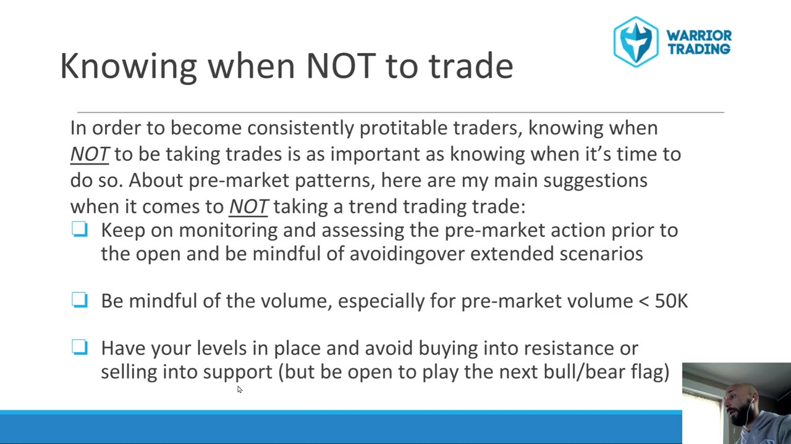

**图怎么看：**

- 在成为持续盈利的交易者时，知道何时不进行交易同样重要。
- 对于预市模式，这里是我关于何时不进行趋势交易的主要建议。
- 保持对开盘前的预市动作的监测和评估，并注意避免过度场景。
- 特别关注成交量，尤其是低于50K的预市成交量。

### 关键内容

- 预市场模式识别是关键，包括缺口、通道、楔形等。
- 选择股票时需考虑价格范围、成交量、催化剂等因素。
- 制定交易策略时需关注支撑阻力位和风险控制。
- 避免过度交易，确保有足够的价格波动空间。
- 使用技术指标如移动平均线辅助判断。
- 保持耐心，等待确认突破后再行动。
- 注意市场情绪和催化剂对股票的影响。
- 结合历史数据和个人经验进行决策。
- 识别并排除不符合标准的股票。
- 保持警惕，避免过度依赖单一指标

### 分析与执行顺序

1. 观看Facebook的图表，识别其预市场模式。
2. 分析Facebook的价格走势，确定支撑和阻力位。
3. 设定止损和目标价，确保风险控制。
4. 查看其他股票如AMD、BA等的图表，识别其模式。
5. 根据个人经验和历史数据筛选出潜在交易股票。
6. 制定详细的交易计划，包括入场点和出场点。
7. 保持耐心，等待确认突破后再行动。
8. 记录每次交易的细节，以便后续分析和改进

### 案例与细节

- Facebook在预市场阶段出现大幅上涨，形成基线收敛模式。
- AMD出现下跌后反弹，形成上升通道。
- BA在预市场阶段出现上涨，但面临较强的阻力。
- RCL在预市场阶段出现上涨，突破了之前的楔形形态。
- WW在预市场阶段出现上涨，形成上升通道

### 风险与边界

- 预市场阶段流动性较低，可能导致价格波动较大。
- 过度依赖单一指标可能导致误判。
- 市场情绪变化可能影响股票表现。
- 缺乏足够的价格波动空间可能导致交易失败。
- 录制年代限制，当前市场环境可能与过去有所不同

### 复盘问题

- 如何识别并排除不符合标准的股票？
- 在制定交易计划时，如何确保风险控制？
- 如何结合历史数据和个人经验进行决策？
- 在哪些情况下需要保持警惕，避免过度依赖单一指标？
- 如何通过记录每次交易的细节来改进交易策略？

---

## v0632：高频交易策略详解

> 日期：2020-04-29　·　时长：00:45:08

**本场重点：** 高频交易策略中如何使用热键进行快速买卖操作，以及如何根据市场情况调整止损和止盈。

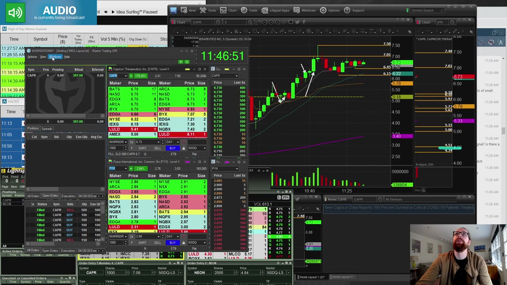

**图怎么看：**

- 画面中，可以看到多个股票的实时交易数据，包括价格、成交量和订单状态。
- 用户可以使用热键进行快速买卖操作，例如通过键盘快捷键执行下单指令。
- 图B还显示了不同股票的Level 2信息，帮助用户了解市场的即时流动性。
- 此外，画面中的时间线和成交量柱显示了市场的动态变化，有助于分析市场趋势和风险控制。

### 关键内容

- 交易员使用热键进行快速买卖操作，如ASC+5，Shift+1等。
- 交易员在市场波动较大时使用止损和止盈策略，以控制风险。
- 交易员通过Level 2监控市场价格，及时调整买卖策略。
- 交易员使用模拟账户进行高频交易，以测试策略的有效性。
- 交易员在市场出现异常波动时，迅速调整交易策略，以避免损失。
- 交易员使用热键进行快速下单，提高交易效率。
- 交易员在市场达到预期目标后，及时卖出，锁定利润。
- 交易员在市场出现大幅波动时，使用止损单保护资金。
- 交易员通过Level 2监控市场价格，判断是否继续持有头寸。
- 交易员在市场出现假突破时，及时撤单，避免不必要的损失。
- 交易员在市场出现真实突破时，迅速下单，抓住机会。
- 交易员在市场出现回调时，考虑卖出部分头寸，以锁定利润。
- 交易员在市场出现大幅上涨时，考虑加仓，扩大盈利空间

### 分析与执行顺序

1. 交易员打开交易界面，查看当前市场价格。
2. 交易员使用热键ASC+5进行快速买入操作。
3. 交易员使用热键Shift+1进行快速卖出操作。
4. 交易员通过Level 2监控市场价格，判断是否继续持有头寸。
5. 交易员在市场出现假突破时，迅速撤单，避免不必要的损失。
6. 交易员在市场出现真实突破时，迅速下单，抓住机会。
7. 交易员在市场出现回调时，考虑卖出部分头寸，以锁定利润。
8. 交易员在市场出现大幅上涨时，考虑加仓，扩大盈利空间。
9. 交易员在市场出现大幅下跌时，使用止损单保护资金。
10. 交易员在市场出现回调时，使用止盈单锁定利润。

### 案例与细节

- 交易员在市场突破7时，使用热键ASC+5进行快速买入操作，然后使用Shift+1进行快速卖出操作，以捕捉短暂的价格波动。
- 交易员在市场出现假突破时，迅速撤单，避免不必要的损失，例如在市场突破7后，价格立即回落，交易员迅速撤单。
- 交易员在市场出现真实突破时，迅速下单，抓住机会，例如在市场突破7后，价格继续上涨，交易员迅速下单跟进。
- 交易员在市场出现回调时，考虑卖出部分头寸，以锁定利润，例如在市场突破7后，价格开始回调，交易员迅速卖出部分头寸。
- 交易员在市场出现大幅上涨时，考虑加仓，扩大盈利空间，例如在市场突破7后，价格继续上涨，交易员迅速加仓跟进

### 风险与边界

- 交易员需要密切关注市场动态，避免因市场突然变化而造成损失。
- 交易员需要谨慎使用止损和止盈策略，避免因市场波动过大而频繁触发止损单。
- 交易员需要定期更新交易策略，以适应市场的变化。
- 交易员需要确保交易软件的稳定性，避免因软件故障导致交易中断。
- 交易员需要遵守相关交易所的规定，避免因违规操作而受到处罚

### 复盘问题

- 交易员在市场出现假突破时，是如何判断并迅速撤单的？
- 交易员在市场出现真实突破时，是如何迅速下单的？
- 交易员在市场出现回调时，是如何考虑卖出部分头寸的？
- 交易员在市场出现大幅上涨时，是如何考虑加仓的？
- 交易员在市场出现大幅下跌时，是如何使用止损单保护资金的？

---

## v0633：大型股票市场分析及交易策略

> 日期：2020-05-06　·　时长：01:37:57

**本场重点：** 本节重点在于如何在大型股票市场中进行有效的交易分析与风险管理。

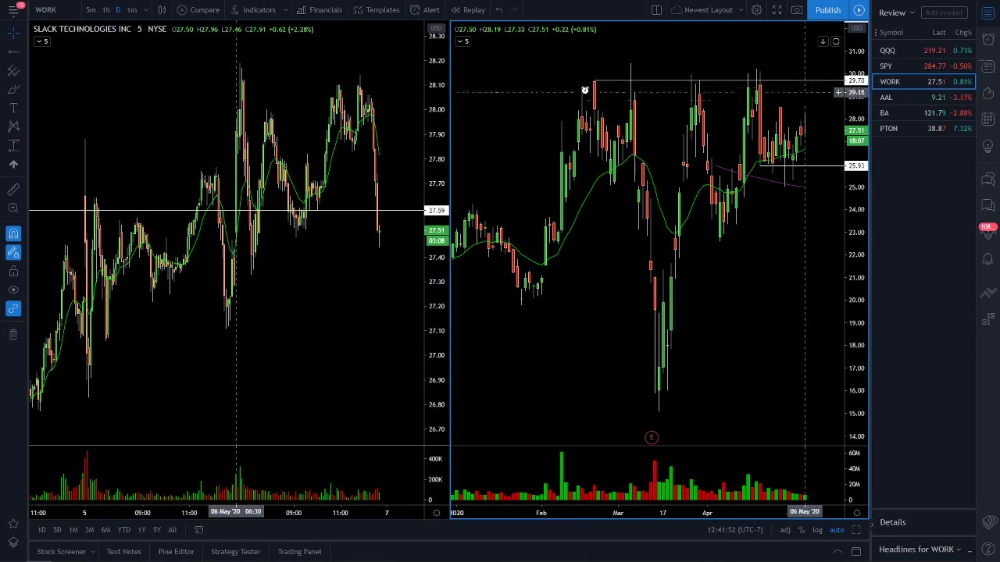

**图怎么看：**

- 图表显示了Slack Technologies Inc.的交易情况，包括价格走势、成交量和时间序列数据。
- 成交量柱的高度反映对应周期内的总成交量；红绿着色通常跟随价格柱的涨跌规则，不能直接拆成两种方向的主动成交。
- 水平轴显示了时间序列，垂直轴显示了价格，可以观察到价格的波动和成交量的变化。
- 通过分析这些图表，投资者可以了解股票的价格趋势和成交量变化，从而做出更明智的投资决策。

### 关键内容

- 讲师分析了MGMX股票的交易机会，指出在突破平底后应立即退出。
- 市场环境因疫情而大幅修正，讲师建议保持熊市心态，等待趋势线突破。
- 讲师强调了使用技术指标确认突破点的重要性，并设置了合理的止损点。
- 讲师讨论了交易心理与风险管理，指出硬性坚持最终目标可能导致亏损。
- 具体交易案例中，AAL股票的交易机会是在突破10水平后等待反弹再做空。
- 讲师解释了风险收益比在不同交易策略中的应用，强调了摆动交易中的更大目标。
- 讲师推荐了获取实时新闻的方法，包括使用Benzinga Pro和Warrior Trading的新闻服务。
- 讲师分析了UCO和USO的交易机会，指出它们缺乏理想的模式。
- 讲师讨论了摆动交易策略，包括如何调整头寸大小以适应不同的股票和市场情况。
- 讲师解释了如何根据止损来确定头寸大小，以保持一致的风险水平。
- 讲师通过分析MGMX股票的突破平底，强调了技术指标确认突破点的重要性，这有助于提高交易决策的准确性。
- 在大型股票市场中，保持熊市心态并等待趋势线突破是关键策略，这有助于减少情绪驱动的错误决策。
- 讲师指出，使用合理的止损点可以有效控制风险，而硬性坚持最终目标可能导致不必要的亏损。
- 在摆动交易中，使用更紧的止损点可以提高交易成功率，这需要根据市场波动性进行灵活调整。
- 讲师建议在交易前使用模拟器进行测试，以熟悉不同交易平台的订单执行差异，这有助于提高实际交易的成功率

### 分析与执行顺序

1. 讲师首先分析了MGMX股票的交易机会，指出在突破平底后应立即退出。
2. 接着，讲师讨论了市场环境因疫情而大幅修正，建议保持熊市心态，等待趋势线突破。
3. 然后，讲师强调了使用技术指标确认突破点的重要性，并设置了合理的止损点。
4. 讲师进一步讨论了交易心理与风险管理，指出硬性坚持最终目标可能导致亏损。
5. 最后，讲师分析了UCO和USO的交易机会，指出它们缺乏理想的模式，并讨论了摆动交易策略。

### 案例与细节

- MGMX股票的交易机会是在突破平底后立即退出。
- AAL股票的交易机会是在突破10水平后等待反弹再做空。
- 讲师建议使用Light Speed和E-Trade Pro的模拟器来比较订单执行的差异。
- 讲师讨论了如何根据止损来确定头寸大小，以保持一致的风险水平。
- 在AAL股票突破10水平后，讲师建议等待反弹再做空，这体现了技术分析在实际交易中的应用。
- 讲师通过比较Light Speed和E-Trade Pro的模拟器，展示了不同交易平台订单执行的差异，这对实际交易策略制定至关重要。
- 在UCO和USO股票缺乏理想模式的情况下，讲师强调了选择具有明确趋势的股票的重要性，这有助于提高交易成功率。
- 讲师通过分析UCO和USO的交易机会，指出它们缺乏理想的模式，这说明了选择有明确趋势的股票的重要性。
- 讲师推荐使用Benzinga Pro和Warrior Trading的新闻服务获取实时新闻，这有助于及时把握市场动态

### 风险与边界

- 讲师提到的操作策略基于历史录制内容，当前市场环境可能有所不同。
- 交易心理和风险管理的具体应用可能因个人差异而有所不同。
- 风险收益比在不同交易策略中的应用需要根据当前市场情况进行调整。
- 模拟器与真实市场环境存在差异，实际交易中需谨慎。
- 在突破平底后立即退出的策略可能因市场快速变化而失效，这需要投资者具备快速反应的能力。
- 使用更紧的止损点虽然可以提高交易成功率，但也可能增加频繁交易带来的成本。
- 硬性坚持最终目标可能导致不必要的亏损，这需要投资者具备良好的心理素质。
- 模拟器与真实市场环境存在差异，实际交易中需谨慎，这可能导致策略在实际应用中失效

### 复盘问题

- 在突破平底后，如何确定是否立即退出？
- 如何根据止损来确定头寸大小，以保持一致的风险水平？
- 在摆动交易中，如何调整头寸大小以适应不同的股票和市场情况？
- 如何根据市场环境和技术指标来制定交易策略？

---

## v0634：识别趋势延续与反转

> 日期：2020-05-06　·　时长：01:00:01

**本场重点：** 识别趋势延续与反转的关键在于成交量的变化，以及价格走势的和谐度。

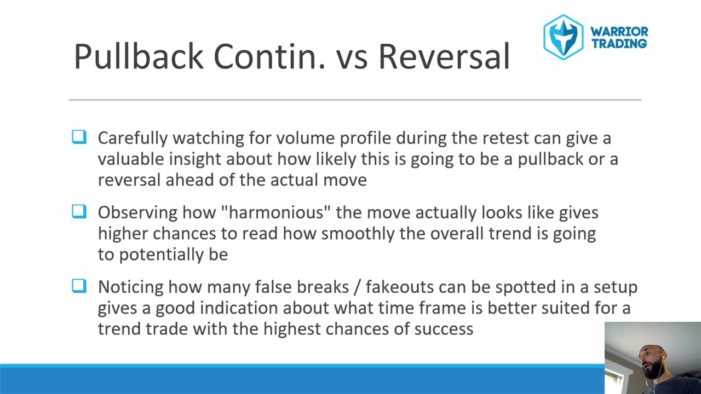

**图怎么看：**

- 这张图表展示了理想的成交量分布，用于区分趋势延续（Contin.）和反转（Reversal）。成交量在价格上升时增加，在价格下降时减少。
- 通过观察成交量的变化，可以判断当前的价格走势是否为趋势延续还是反转。
- 成交量的增加通常表明市场参与者对价格上涨持乐观态度，而成交量的减少则可能预示着价格将下跌。
- 成交量的分布模式可以帮助交易者确定最佳入场点和出场点，从而提高交易的成功率。

### 关键内容

- 成交量是判断趋势延续与反转的重要指标，高开低走的成交量表明趋势可能延续。
- 趋势延续与反转的判断需要结合成交量和价格走势，高开高走的成交量表明趋势可能反转。
- 在三分钟图表上，成交量和价格走势的配合可以更准确地预测趋势。
- 趋势延续的关键是成交量下降，而趋势反转则表现为成交量上升。
- 观察价格走势的和谐度，可以判断趋势延续的可能性。
- 三分钟图表是识别趋势延续与反转的最佳时间框架。
- 使用技术指标如移动平均线和成交量来辅助判断。
- 趋势延续与反转的判断需要结合多种因素，包括成交量、价格走势和市场情绪。
- 识别趋势延续与反转的关键是保持冷静，制定计划并严格执行。
- 趋势延续与反转的判断需要结合历史数据和当前市场情况

### 分析与执行顺序

1. 首先，观察开盘价和第一根蜡烛的成交量。
2. 然后，关注后续蜡烛的成交量变化，判断趋势延续或反转。
3. 使用移动平均线和成交量指标来辅助判断。
4. 结合市场情绪和历史数据，制定交易计划。
5. 在三分钟图表上进行观察，以提高判断准确性。
6. 保持冷静，避免冲动交易，严格执行计划。
7. 定期回顾交易记录，总结经验教训

### 案例与细节

- BYND（Beyond Meat）在开盘后出现大幅上涨，但成交量并未显著增加，表明可能只是反弹而非趋势延续。
- PINC（PINC）在开盘后出现大幅下跌，成交量也显著增加，表明可能趋势反转。
- Disney（迪士尼）在开盘前出现卖压，但成交量并未显著增加，表明可能只是短期波动而非趋势反转。
- EA（Electronic Arts）在开盘前出现小幅上涨，但成交量较小，表明可能只是短期波动而非趋势延续。
- Shop（Shopify）在开盘后出现大幅下跌，但成交量并未显著增加，表明可能只是短期波动而非趋势反转

### 风险与边界

- 识别趋势延续与反转的方法依赖于历史数据，因此在不同市场环境下可能不完全适用。
- 成交量和价格走势的判断需要结合市场情绪和其他因素，单一指标可能不够准确。
- 在三分钟图表上进行观察，可能错过快速变动的趋势。
- 识别趋势延续与反转的方法需要结合多种技术指标，单一指标可能不够全面。
- 识别趋势延续与反转的方法依赖于市场情绪和历史数据，因此在不同市场环境下可能不完全适用

### 复盘问题

- 在开盘后的三分钟图表上，如何判断趋势延续与反转？
- 识别趋势延续与反转的关键是什么？
- 在实际交易中，如何结合多种技术指标进行判断？

---

## v0635：高级交易技巧与策略

> 日期：2020-05-06　·　时长：00:56:16

**本场重点：** 1. 如何设置止损以避免在突破VWAP下方进行交易；2. 交易策略需谨慎，尤其是使用大仓位时；3. 使用模拟账户进行交易时，注意风险管理和资金管理。

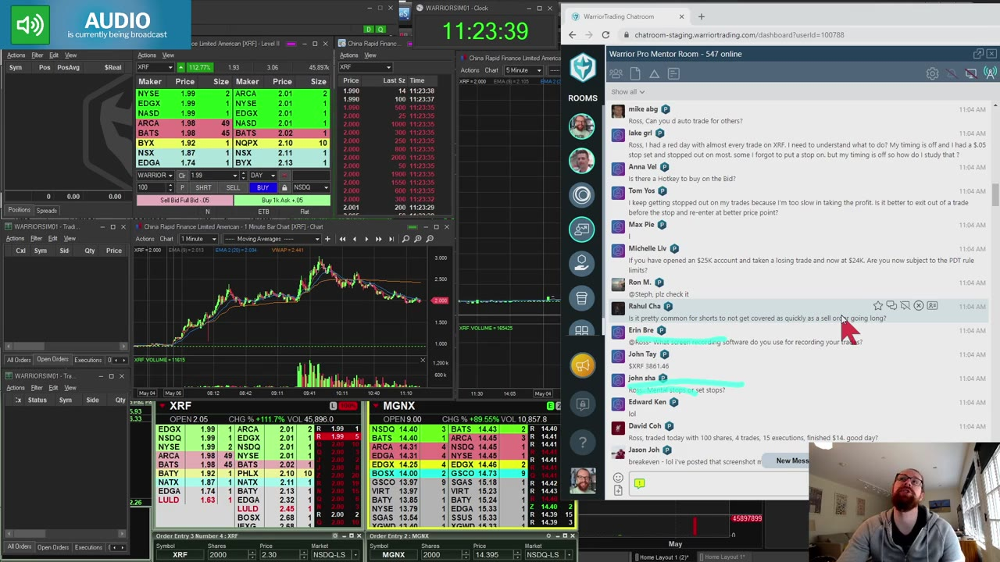

**图怎么看：**

- 整体界面显示了多个交易软件窗口，包括图表、Level 2、Time & Sales等。
- 实际可见的ticker如ADVM、MGNX、XRF等，以及它们的价格、成交量等数据。
- 画面信息对应本场主题，强调如何设置止损以避免在突破VWAP下方进行交易。
- 这张截图不能单独证明如何设置止损，需要结合其他截图和讲解内容理解完整概念。

### 关键内容

- 讲师提到，突破VWAP下方的交易不易成功，应谨慎操作。
- VWAP（成交量加权平均价格）是衡量市场流动性的关键指标，突破它需要谨慎。
- 交易者应关注市场动态，避免在市场波动较大时进行突破交易。
- 使用模拟账户进行交易时，应设定合理的止损点，避免过度交易。
- 交易者应根据自己的交易风格和市场情况调整仓位大小。
- 使用模拟账户进行交易时，应记录每次交易的详细信息，以便分析。
- 交易者应关注市场趋势，避免在市场明显弱势时进行交易。
- 交易者应利用技术指标辅助决策，但不应完全依赖单一指标。
- 交易者应保持冷静，避免因情绪波动而做出错误的交易决策。
- 交易者应定期回顾交易记录，总结经验教训，改进交易策略。

### 分析与执行顺序

1. 讲师首先展示了模拟账户的交易界面。
2. 然后，讲师解释了如何在突破VWAP下方进行交易的风险。
3. 接着，讲师演示了如何在突破VWAP上方进行交易，并强调了这种交易方式的优势。
4. 讲师还展示了如何使用技术指标来辅助决策。
5. 最后，讲师提醒交易者要保持冷静，避免情绪影响决策。

### 案例与细节

- XRF股票在突破VWAP后迅速反弹，显示了突破交易的成功可能性。
- MGNX股票在突破VWAP后出现假突破，表明突破交易的风险。
- 交易者在XRF股票上设置了止损点，以避免在突破VWAP下方进行交易。
- 交易者在MGNX股票上设置了止损点，以避免在突破VWAP下方进行交易。
- 交易者在XRF股票上进行了多次小规模交易，以积累利润。

### 风险与边界

- 突破VWAP下方的交易风险较高，尤其是在市场波动较大时。
- 交易者应谨慎使用大仓位，避免因市场波动导致亏损。
- 模拟账户交易记录仅供参考，实际交易中可能面临更多风险。
- 交易者应定期回顾交易记录，总结经验教训，避免重复错误。
- 交易者应关注市场动态，避免在市场明显弱势时进行交易。

### 复盘问题

- 交易者在突破VWAP下方进行交易时，应采取哪些措施来降低风险？
- 交易者如何在模拟账户中有效管理资金，以避免过度交易？
- 交易者在交易过程中应如何保持冷静，避免情绪波动影响决策？

---

## v0636：2020年5月13日市场ETF分析与交易策略

> 日期：2020-05-13　·　时长：01:10:59

**本场重点：** SPY和Triple Q的市场指标分析，以及交易策略中的止损调整和风险控制。

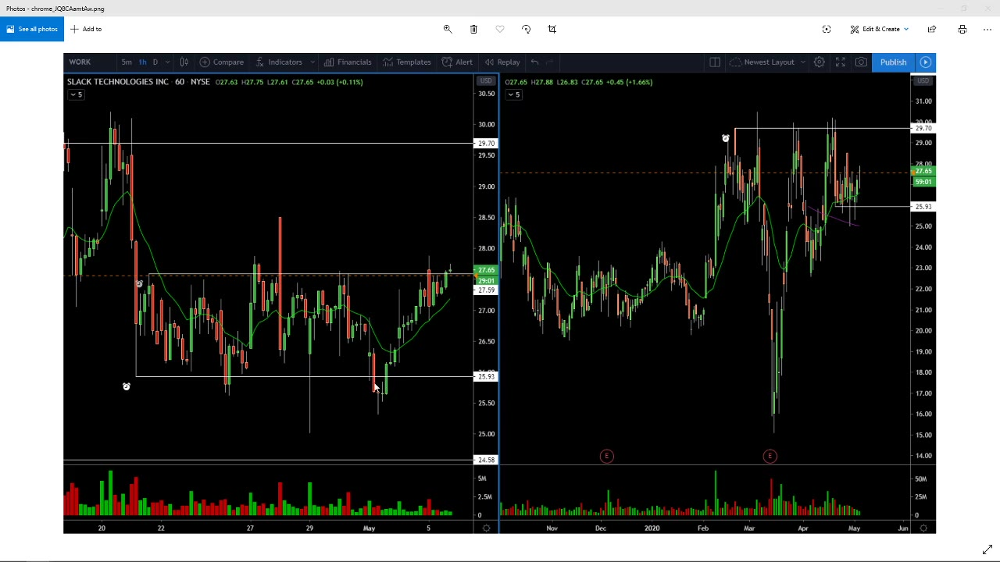

**图怎么看：**

- 这张截图显示了SLACK TECHNOLOGIES INC的股票价格走势图，包括开盘价、收盘价、最高价和最低价。
- 图中可以看到股价在不同时间段内的波动情况，红色柱状图表示下跌，绿色柱状图表示上涨。
- 水平轴显示了日期，垂直轴显示了价格，通过观察这些数据可以分析市场的趋势和波动。
- 右侧的表格列出了多个股票的最新价格和涨跌幅度，帮助投资者了解整体市场表现。

### 关键内容

- SPY和Triple Q是重要的市场指标，SPY显示5月市场可能继续下跌，目标价260。
- SPY形成熊市旗形，突破后出现快速反弹，但随后再次下跌，目标价260，短期目标价280。
- Triple Q形成三重底形态，突破后出现快速反弹，但随后再次下跌，目标价260，短期目标价280。
- Work股票形成三重顶形态，目标价32，突破后继续上涨，但随后回落，目标价32，短期目标价30。
- PTON股票形成三重底形态，目标价38，突破后继续上涨，但随后回落，目标价38，短期目标价35。
- RNG股票形成三重底形态，目标价251，突破后继续上涨，目标价251，短期目标价250。
- 原油在突破2608的关键水平时出现大幅上涨，但随后出现反向回调，这使得在这一水平做多变得不合适。
- 市场突然上涨超出预期，表明市场可能会继续上涨，但也增加了交易设置所需的时间。
- Twitter股票的突破趋势线提供了继续卖压的机会，但由于算法控制股价，交易难度较大。
- SPY形成了双底形态，表明可能进一步下跌，预市数据通常不提供有用信息，除非有重大缺口。
- SPY和Triple Q的市场指标显示，5月市场可能继续下跌，目标价分别为260和260，表明市场存在明显的下行压力。
- Work股票的三重顶形态表明，一旦突破目标价32，股票将继续上涨，但随后回落，说明市场情绪不稳定。
- PTON股票的三重底形态突破后继续上涨，但随后回落，目标价38，短期目标价35，显示市场存在反复波动。
- RNG股票的三重底形态突破后继续上涨，目标价251，短期目标价250，表明市场信心逐渐增强。
- 原油在突破2608的关键水平后出现大幅上涨，但随后出现反向回调，这使得在这一水平做多变得不合适，说明市场存在不确定性

### 分析与执行顺序

1. 分析SPY和Triple Q的市场指标，确定市场趋势。
2. 识别Work、PTON和RNG股票的形态，设定目标价和短期目标价。
3. 根据原油突破关键水平后的反向回调，调整交易策略。
4. 监控市场突然上涨的情况，调整交易计划。
5. 利用Twitter股票的突破趋势线进行卖压操作，注意算法控制的影响。
6. 分析SPY的双底形态，制定相应的交易策略。
7. 根据预市数据和成交量变化，调整交易决策。

### 案例与细节

- SPY形成熊市旗形，突破后出现快速反弹，但随后再次下跌。
- Work股票形成三重顶形态，目标价32，突破后继续上涨，但随后回落。
- PTON股票形成三重底形态，目标价38，突破后继续上涨，但随后回落。
- RNG股票形成三重底形态，目标价251，突破后继续上涨。
- 原油在突破2608的关键水平时出现大幅上涨，随后出现反向回调。
- SPY形成了双底形态，表明可能进一步下跌。
- SPY形成熊市旗形，突破后出现快速反弹，但随后再次下跌，目标价260，短期目标价280，表明市场存在短期反弹但长期趋势仍向下。
- Work股票形成三重顶形态，目标价32，突破后继续上涨，但随后回落，目标价32，短期目标价30，显示市场情绪波动大。
- PTON股票形成三重底形态，目标价38，突破后继续上涨，但随后回落，目标价38，短期目标价35，说明市场存在反复波动。
- RNG股票形成三重底形态，目标价251，突破后继续上涨，目标价251，短期目标价250，表明市场信心逐渐增强。
- 原油在突破2608的关键水平时出现大幅上涨，随后出现反向回调，这使得在这一水平做多变得不合适，说明市场存在不确定性

### 风险与边界

- 市场波动可能导致止损被触发，需谨慎操作。
- 熊市旗形和三重底形态需要谨慎操作，避免过度追涨杀跌。
- 市场整体趋势对交易策略至关重要，需密切关注市场动态。
- 原油突破关键水平后的反向回调可能影响交易决策。
- Twitter股票的算法控制增加了交易难度。
- 市场波动可能导致止损被触发，特别是在熊市旗形和三重底形态中，需要谨慎操作，避免过度追涨杀跌。
- 原油突破关键水平后的反向回调可能影响交易决策，特别是在短期内，市场情绪容易受到技术指标的影响。
- Twitter股票的算法控制增加了交易难度，可能导致交易策略失效，特别是在市场情绪波动较大的情况下。
- 市场整体趋势对交易策略至关重要，需密切关注市场动态，特别是在市场出现大幅波动时，需要及时调整策略

### 复盘问题

- 如何根据SPY和Triple Q的市场指标分析市场趋势？
- 在原油突破关键水平后，如何调整交易策略以应对反向回调？
- 如何利用Twitter股票的突破趋势线进行卖压操作？
- SPY形成的双底形态对交易策略有何影响？
- 如何根据预市数据和成交量变化调整交易决策？

---

## v0637：自动斐波那契工具在趋势交易中的应用

> 日期：2020-05-13　·　时长：01:00:10

**本场重点：** 介绍自动斐波那契工具如何简化趋势交易策略的执行过程，以及如何利用它进行交易。

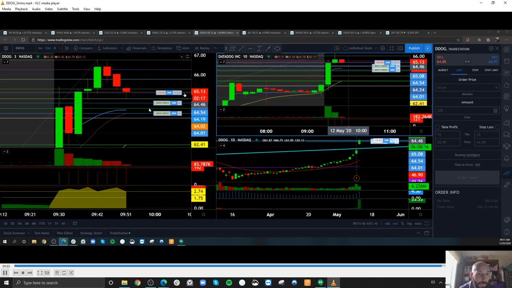

**图怎么看：**

- 这张截图显示了DDOG股票在纳斯达克市场的交易情况，包括K线图、成交量柱、均线等技术指标。
- 可以看到DDOG股票的价格在近期有所上涨，成交量也相应增加。
- 图表上还显示了多个水平和斜线的支撑和阻力位，帮助投资者判断买卖点。
- 右侧的订单窗口显示了当前的买卖指令，包括限价单和止损单，方便投资者实时监控市场动态。

### 关键内容

- 自动斐波那契工具能够自动绘制斐波那契回撤水平，简化交易过程。
- 通过观察触发蜡烛和斐波那契水平，确定潜在的买入或卖出点。
- 使用Trade Station作为交易平台，零佣金，支持直接从图表下单。
- 结合预设的止损和目标价格，构建交易计划。
- 自动斐波那契工具在市场开盘前帮助准备交易列表。
- 通过观察市场反应，调整交易策略，确保有效执行。
- 使用Trade Station进行交易，相比Light Speed具有更高的保证金限制。
- 自动斐波那契工具适用于多种股票，包括大型股和小型股。
- 结合世界市场趋势，选择具有潜力的股票进行交易。
- 自动斐波那契工具简化了趋势交易策略的执行，提高交易效率

### 分析与执行顺序

1. 登录Trading View平台，查看预设的股票筛选器。
2. 使用自动斐波那契工具，自动绘制斐波那契回撤水平。
3. 观察触发蜡烛和斐波那契水平，确定潜在的买入或卖出点。
4. 设置止损和目标价格，构建交易计划。
5. 结合预设的股票筛选器，选择具有潜力的股票进行交易。
6. 使用Trade Station进行交易，零佣金，支持直接从图表下单。
7. 结合世界市场趋势，调整交易策略，确保有效执行

### 案例与细节

- D-Dog股票在开盘前表现出强劲的上升趋势，触发蜡烛突破关键支撑位。
- 自动斐波那契工具在开盘后自动绘制斐波那契水平，帮助确定潜在的买入点。
- Trade Station平台允许用户直接从图表下单，无需额外费用。
- D-Dog股票在开盘后继续上涨，达到目标价格，触发买入订单。
- 自动斐波那契工具在开盘前帮助识别潜在的交易机会，如D-Dog股票的强劲上升趋势。
- 结合世界市场趋势，选择具有潜力的股票进行交易，如CYBR股票的强劲下跌趋势

### 风险与边界

- 自动斐波那契工具可能在市场波动较大时失效，需要手动调整。
- Trade Station平台的保证金限制可能影响交易策略的有效性。
- 市场趋势可能发生变化，需要实时监控和调整交易策略。
- 自动斐波那契工具仅适用于趋势交易策略，不适合其他交易类型。
- 录制于2020年，部分市场条件和规则可能已发生变化

### 复盘问题

- 自动斐波那契工具如何帮助识别潜在的交易机会？
- Trade Station平台的优势是什么？
- 如何结合世界市场趋势选择具有潜力的股票进行交易？

---

## v0638：股票交易实战问答

> 日期：2020-05-13　·　时长：00:32:33

**本场重点：** 1. 讲师强调了使用水平二和时间销售窗口的重要性；2. 讲师指出VWAP在不同平台上的差异；3. 讲师提醒学员要谨慎对待追涨。

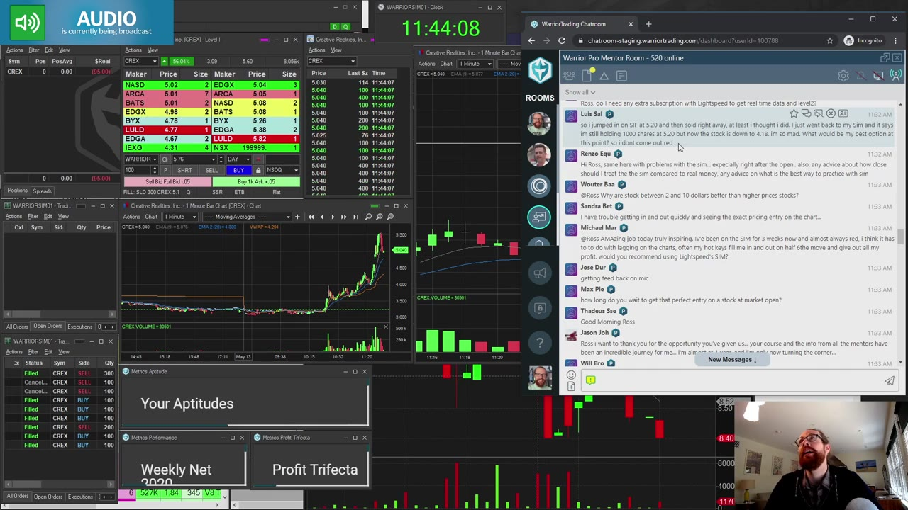

**图怎么看：**

- 实时交易数据包括Level 2、时间销售窗口、成交量等。
- 聊天室中有学员提问和回答，讨论VWAP在不同平台上的差异。
- 讲师强调了使用水平二和时间销售窗口的重要性。
- 学员们分享了他们在模拟市场中的经验和技术问题。

### 关键内容

- 讲师提到SIM平台近期会进行硬件升级，以解决服务器问题。
- VWAP在不同平台之间存在差异，但通常相差不超过五分钱。
- 使用Trade Station和LightSpeed可以进行日内交易，但需要25,000美元的资金。
- 在股票暂停后重新开盘时，应关注成交量和价格走势。
- 使用热键设置止损时，应根据股票的波动性调整止损金额。
- 在追涨时需谨慎，尤其是在股票快速上涨后出现回调时。
- 使用Thinkers Swim的新闻推送是可行的选择。
- 在交易过程中，应定期检查订单状态，避免误操作。
- 使用Ninja Trader可能不如Trade Station和LightSpeed直观。
- 在交易过程中，应保持专注，避免被市场情绪影响

### 分析与执行顺序

1. 讲师登录SIM平台，展示如何查看最后打印的价格。
2. 讲师解释如何通过时间销售窗口来预测股票恢复交易的时间。
3. 讲师演示如何设置热键以快速执行买卖操作。
4. 讲师分享了使用Trade Station和LightSpeed的经验。
5. 讲师强调了在股票暂停后重新开盘时的交易策略。
6. 讲师提醒学员注意VWAP在不同平台之间的差异。
7. 讲师建议学员在交易过程中保持专注，避免被市场情绪影响

### 案例与细节

- 当股票暂停后，讲师通过查看时间销售窗口发现最后打印的价格为55、56、57等，然后加上五分钟来预测股票恢复交易的时间。
- 讲师使用Trade Station和LightSpeed进行日内交易，并分享了如何设置热键以快速执行买卖操作。
- 在交易过程中，讲师建议学员密切关注成交量和价格走势，特别是在股票暂停后重新开盘时。
- 讲师提到使用Thinkers Swim的新闻推送是可行的选择，因为John使用它并且喜欢它。
- 讲师分享了一个具体的交易案例，其中股票从90下跌到85，止损设置在85，表明交易策略的有效性。
- 讲师建议学员在交易过程中保持专注，避免被市场情绪影响，例如在股票快速上涨后出现回调时应谨慎操作

### 风险与边界

- 由于录制于2020年，部分信息可能已发生变化，如交易平台的更新。
- VWAP在不同平台之间的差异可能会导致交易决策的不同，需谨慎处理。
- 使用热键设置止损时，应根据股票的波动性调整止损金额，否则可能导致资金损失。
- 在股票暂停后重新开盘时，应密切关注成交量和价格走势，否则可能错过最佳交易机会

### 复盘问题

- 讲师提到的SIM平台升级计划是什么时候？
- VWAP在不同平台之间的差异如何影响交易决策？
- 如何设置热键以提高交易效率？
- 在股票暂停后重新开盘时，有哪些关键因素需要关注？
- 讲师建议学员在交易过程中保持专注，具体有哪些方法可以做到这一点？

---

## v0639：原油与技术交易策略

> 日期：2020-05-20　·　时长：01:39:58

**本场重点：** 原油技术分析的重要性，以及如何利用突破点进行交易，注意风险控制。

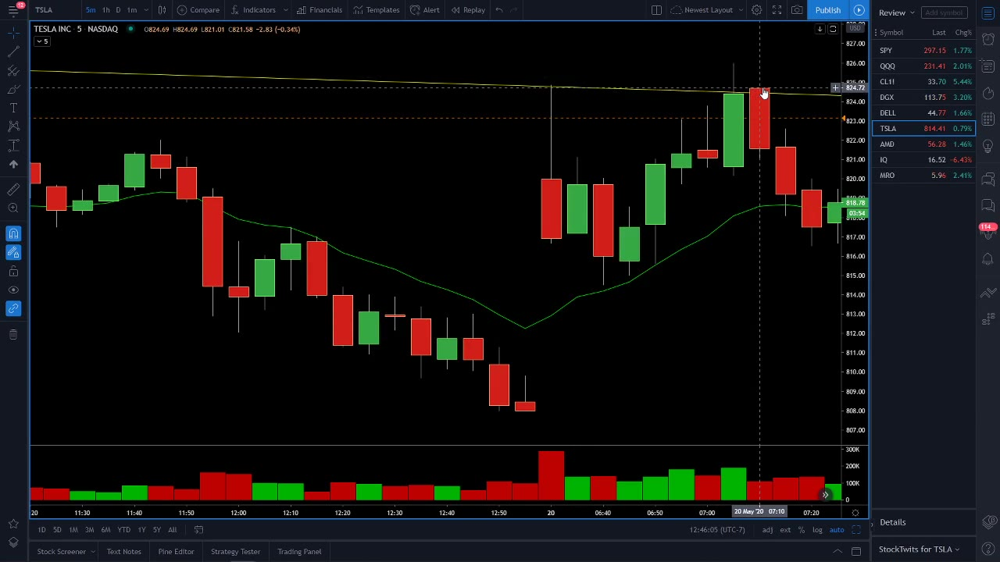

**图怎么看：**

- 特斯拉（TSLA）的股价在2020年5月期间经历了多次波动，其中包含了一些重要的突破点。
- 在2020年5月19日，特斯拉的股价突破了前期高点，这可能是一个重要的买点。
- 投资者可以关注特斯拉的股价在突破点后的走势，以判断是否继续上涨。
- 同时，投资者需要注意风险控制，避免在市场情绪不稳定时盲目追涨杀跌。

### 关键内容

- 原油是更好的技术交易资产，因其趋势性强，主要基于技术分析。
- 建议不要追涨原油，已突破关键水平2608，当前更适合卖出。
- DGX的双底和三顶形态确认突破112.74水平，作为长线交易信号。
- 特斯拉的突破后市场回调，最终未能实现盈利，强调市场波动的重要性。
- 由于平台问题，未能以预期价格执行止损，但认为损失有限，不影响整体策略。
- 分析AMD的突破情况，目标为56美元，但市场回调，最终未能实现盈利。
- 建议耐心等待突破，避免过早行动，以提高风险回报比。
- 市场卖单导致交易被终止，因为持有股票至红色收盘不符合预期。
- 市场继续下跌，低于突破点，这些情况不利于交易。
- 讲师关注IQ的平底突破，认为这可能形成一个很好的短空机会。
- 讲师强调正确入场点的重要性，避免追涨，以保持最佳的风险回报比。例如，Dell的止损设在112.74，只要保持在该水平之上，继续持有仓位。
- 市场卖单导致交易被终止，因为持有股票至红色收盘不符合预期。这表明交易者需要密切关注市场动态，避免因情绪波动而做出错误决策。
- 分析师关注IQ的平底突破，认为这可能形成一个很好的短空机会。这说明识别潜在的反转点对于制定交易策略至关重要。
- 特斯拉受SPY支持，但其表现独立于市场，即使市场下跌，特斯拉仍能恢复大部分损失。这表明某些股票具有独立的市场特性，值得深入研究。
- 讲师每周更新一次交易观察列表，每次分享2-4个设置，通常使用大部分资本进行交易。这说明定期更新和调整交易策略是成功的关键之一。

### 分析与执行顺序

1. 分析原油的牛旗突破模式，指出USO的$21水平对应$26触发点。
2. 建议不要追涨原油，已突破关键水平2608，当前更适合卖出。
3. 分析DGX的双底和三顶形态，确认突破112.74水平，分享作为长线交易信号。
4. 预期DGX突破将推动月度图表突破113，目标价为120至125。
5. 在DGX突破113后，卖出一半仓位，认为突破有效，但仍需关注后续走势。
6. 分析特斯拉的突破情况，目标为869，但突破后市场回调，最终未能实现盈利。

### 案例与细节

- 原油突破2608后，建议卖出而非买入。
- DGX突破112.74水平，作为长线交易信号。
- 特斯拉突破869后，市场回调，最终未能实现盈利。
- AMD突破56美元，但市场回调，最终未能实现盈利。
- 特斯拉突破869后，市场回调，最终未能实现盈利。这说明即使突破了目标价位，也需要考虑市场的整体走势。
- AMD突破56美元，但市场回调，最终未能实现盈利。这表明市场回调可能会影响交易结果，需要谨慎对待。
- DGX突破113后，卖出一半仓位，认为突破有效，但仍需关注后续走势。这说明即使突破了关键水平，也需要持续监控市场动态。

### 风险与边界

- 由于平台问题，未能以预期价格执行止损，但认为损失有限，不影响整体策略。
- 市场卖单导致交易被终止，因为持有股票至红色收盘不符合预期。
- 市场继续下跌，低于突破点，这些情况不利于交易。
- 讲师每周更新一次交易观察列表，每次分享2-4个设置，通常使用大部分资本进行交易。
- 由于平台问题，未能以预期价格执行止损，但认为损失有限，不影响整体策略。这表明技术问题可能导致交易失败，需要确保交易平台的稳定性。
- 市场继续下跌，低于突破点，这些情况不利于交易。这说明市场走势对交易结果有重大影响，需要密切关注市场动态。
- 讲师每周更新一次交易观察列表，每次分享2-4个设置，通常使用大部分资本进行交易。这表明频繁更新交易策略可能会分散注意力，需要合理分配时间和资源。

### 复盘问题

- 原油突破2608后，为何建议卖出而非买入？
- DGX突破112.74水平后，为何认为这是一个长线交易信号？
- 特斯拉突破869后，为何最终未能实现盈利？
- AMD突破56美元后，为何最终未能实现盈利？

---

## v0640：趋势交易策略详解

> 日期：2020-05-20　·　时长：00:58:29

**本场重点：** 识别无支撑阻力区，等待突破后进行趋势交易，耐心等待最佳入场时机。

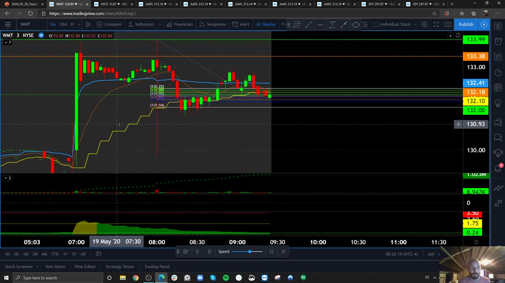

**图怎么看：**

- 在1228秒时，图表显示了WMT股票的价格走势，价格在绿色和红色蜡烛之间波动。
- 可以看到水平的支撑和阻力线，以及价格在这些线之间的运行情况。
- 成交量柱的高度反映对应周期内的总成交量；红绿着色通常跟随价格柱的涨跌规则，不能直接拆成两种方向的主动成交。
- 图表上还显示了时间与销售数据，帮助分析市场动态。

### 关键内容

- 识别无支撑阻力区是关键，有助于非偏见交易。
- 等待突破后的第一根蜡烛，确认突破有效。
- 使用斐波那契工具进行风险回报比计算。
- 在关键突破发生后的30分钟内寻找首次回测。
- 监控盘前模式，避免在重要公告期间交易。
- 使用技术指标如13EMA进行回测确认。
- 保持耐心，等待最佳入场时机。
- 使用自由斐波那契工具进行自动回测。
- 识别缺口上方的高点作为潜在买入点。
- 关注成交量，确保交易量足够大

### 分析与执行顺序

1. 首先，选择合适的股票，关注盘前模式。
2. 确定支撑和阻力水平，识别无支撑阻力区。
3. 等待开盘后的第一根蜡烛，确认突破有效。
4. 寻找第二根蜡烛的新高或新低，确认突破方向。
5. 在13EMA处进行首次回测，确认趋势延续。
6. 使用斐波那契工具进行风险回报比计算，确定止损和目标位。
7. 保持耐心，等待最佳入场时机，避免过早行动。
8. 监控盘前模式，避免在重要公告期间交易。
9. 使用技术指标如13EMA进行回测确认，确保趋势延续

### 案例与细节

- 沃尔玛（WMT）：开盘前识别无支撑阻力区，开盘后确认突破，进行短卖。
- FSC：识别弱势股票，关注成交量，确认趋势延续。
- LUV：识别盘前低点，确认突破后进行长买。
- ERI：识别盘前高点，确认突破后进行长买。
- RCL：识别盘前高点，确认突破后进行长买

### 风险与边界

- 录制于2020年，市场环境可能已发生变化。
- 关键突破发生在开盘后的30分钟内，需注意市场变化。
- 使用自由斐波那契工具需要订阅TradingView Pro Plus。
- 识别无支撑阻力区需要经验，新手可能难以准确判断。
- 市场波动可能导致交易计划失效

### 复盘问题

- 如何识别无支撑阻力区？
- 如何使用斐波那契工具进行风险回报比计算？
- 如何监控盘前模式，避免在重要公告期间交易？
- 如何使用技术指标如13EMA进行回测确认？
- 如何保持耐心，等待最佳入场时机？

---

## v0641：摆动交易策略与市场趋势分析

> 日期：2020-05-27　·　时长：01:15:37

**本场重点：** 讲师分享了摆动交易策略，并强调了顺应长期趋势的重要性。

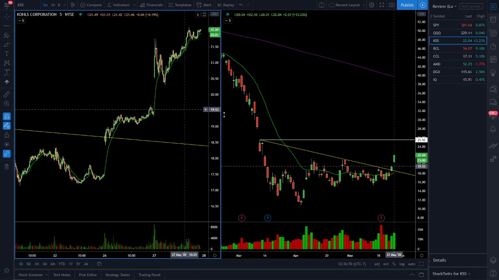

**图怎么看：**

- Kohl's Corporation (NYSE: KSS) 在2020年3月至4月期间经历了显著的价格波动。
- 股价从低点逐步上升，然后在高点附近出现回调。
- 成交量柱显示了不同时间段内的买卖活动。
- Kohl's Corporation 的股价在这段时间内显示出明显的上升趋势。

### 关键内容

- 讲师分享了其在大型股和期权上的摆动交易策略，特别关注SPY和Triple Q ETFs。
- SPY在3月低点后持续上涨，突破200移动平均线，表明市场趋势转为积极。
- KSS（柯斯廷）出现双旗形态，突破1868后迅速上涨至$22，提供了一个理想的摆动交易机会。
- RCL和CCL因缺口上行而错过交易机会，但CCL最终达到1914阻力位，展示了突破后的短期阻力。
- AMD出现成交量底部，表明可能反转。DGX在突破后未能保持涨幅，最终被止损。
- IQ则处于平底破位形态，预计会继续下跌至$10。讲师强调了摆动交易的重要性，特别是长期趋势和关键阻力位。
- 讲师在2020年5月27日的课程中讨论了如何根据市场趋势进行交易，强调了顺应趋势的重要性。
- 即使经济数据不佳，长期趋势仍是他交易的主要依据。例如，他分析了AMD股票的交易情况。
- 讲师还强调了风险管理的重要性，特别是当市场出现大幅波动时。
- 讲师指出，SPY在3月低点后的持续上涨突破了200移动平均线，这表明市场趋势转为积极，适合进行波段交易。
- KSS（柯斯廷）的双旗形态突破后迅速上涨至$22，显示了摆动交易中的理想入场点，但需注意后续可能的回调。
- RCL和CCL因缺口上行而错过交易机会，但CCL最终达到1914阻力位，说明突破后的短期阻力需要谨慎处理。
- AMD的成交量底部表明可能反转，但实际操作中需结合其他技术指标确认反转信号的有效性。
- DGX在突破后未能保持涨幅，最终被止损，这提醒交易者在突破后需密切关注价格走势，避免过早行动。

### 分析与执行顺序

1. 讲师首先分享了其在大型股和期权上的摆动交易策略，特别关注SPY和Triple Q ETFs。
2. 然后，讲师分析了KSS的摆动交易机会，指出其双旗形态和突破后的快速上涨。
3. 接着，讲师讨论了RCL和CCL的交易机会，指出它们因缺口上行而错过交易机会。
4. 讲师还分析了AMD的成交量变化，指出可能的反转。
5. 最后，讲师讨论了SPY、Triple Q、DGX和IQ的交易机会，强调了摆动交易的重要性。

### 案例与细节

- KSS（柯斯廷）出现双旗形态，突破1868后迅速上涨至$22。
- RCL和CCL因缺口上行而错过交易机会，但CCL最终达到1914阻力位。
- AMD出现成交量底部，表明可能反转。
- DGX在突破后未能保持涨幅，最终被止损。
- KSS（柯斯廷）出现双旗形态，突破1868后迅速上涨至$22，提供了一个理想的摆动交易机会，但需注意后续可能的回调。
- RCL和CCL因缺口上行而错过交易机会，但CCL最终达到1914阻力位，展示了突破后的短期阻力，需谨慎处理。
- AMD出现成交量底部，表明可能反转，但实际操作中需结合其他技术指标确认反转信号的有效性，如MACD或RSI。
- DGX在突破后未能保持涨幅，最终被止损，这提醒交易者在突破后需密切关注价格走势，避免过早行动，确保止损设置合理。
- 讲师分析了Oxy和MRO的交易机会，指出Oxy可能从深度超卖中恢复，但MRO尚未准备好进行交易，需要更多确认。

### 风险与边界

- 讲师提到的市场条件和策略基于2020年的市场环境，当前市场条件可能已发生变化。
- 讲师强调了摆动交易的重要性，但实际操作中需考虑市场波动性和风险。
- 讲师提到的风险管理策略基于历史数据，当前市场条件可能有所不同。
- 讲师提到的止损策略基于历史数据，当前市场条件可能有所不同。
- 市场大幅波动时，摆动交易策略可能会失效，特别是在经济数据不佳的情况下，长期趋势可能不再适用。
- 即使经济数据不佳，长期趋势仍是他交易的主要依据，但这可能导致交易者忽视短期波动带来的风险。
- 讲师提到的风险管理策略基于历史数据，当前市场条件可能有所不同，因此需谨慎应用。
- 止损策略基于历史数据，当前市场条件可能有所不同，交易者需根据当前市场情况进行调整。

### 复盘问题

- 讲师是如何分析KSS的摆动交易机会的？
- 讲师提到的摆动交易策略适用于哪些类型的股票？
- 讲师是如何确定止损点的？
- 讲师提到的风险管理策略有哪些具体措施？

---

## v0642：关于低价格股票的交易策略

> 日期：2020-05-27　·　时长：00:51:42

**本场重点：** 提问者关于低价格股票的风险管理及交易策略，讲师的回答总结了关键点。

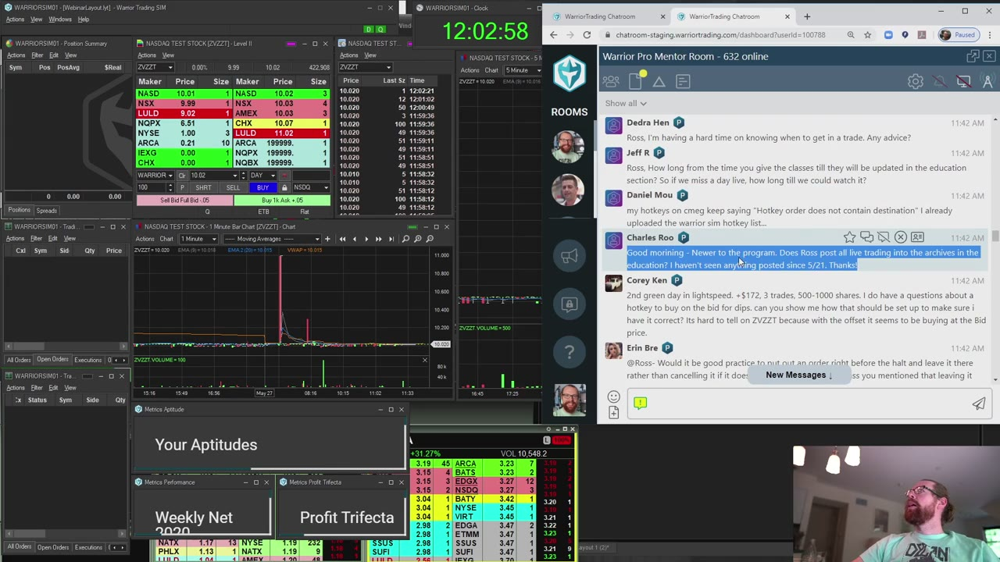

**图怎么看：**

- 特斯拉(TSLA)的5分钟K线图显示股价在上涨。
- Level 2显示特斯拉(TSLA)的买卖盘情况，包括买盘和卖盘的价格和数量。
- 成交量柱显示特斯拉(TSLA)的交易活动。
- 图表上可以看到特斯拉(TSLA)的均线，帮助分析趋势。

### 关键内容

- 低价格股票通常具有较大的价差，交易时需注意。
- 交易低价格股票时，应关注心理支撑和阻力位。
- 交易低价格股票时，需考虑市场深度和流动性。
- 交易低价格股票时，应设置止损以控制风险。
- 交易低价格股票时，需关注市场新闻和事件。
- 交易低价格股票时，应使用技术指标进行辅助分析。
- 交易低价格股票时，需注意市场波动和交易量的变化。
- 交易低价格股票时，应合理设置订单以提高成交率。
- 交易低价格股票时，需考虑市场平台的稳定性。

### 分析与执行顺序

1. 讲师首先介绍了低价格股票的特点，包括较大的价差。
2. 然后讲解了如何利用心理支撑和阻力位进行交易。
3. 接着讨论了交易低价格股票时需要注意的市场深度和流动性。
4. 进一步强调了设置止损的重要性，以控制交易风险。
5. 最后提醒交易者要关注市场新闻和事件，以及市场波动和交易量的变化。

### 案例与细节

- GRNQ 股票在一天内经历了多次拉回，最终突破了关键水平。
- 低价格股票如 MRSN 在一天内经历了大幅波动，最终收盘低于开盘价。
- 讲师通过实际交易案例展示了如何利用低价格股票的交易机会。
- 讲师提到使用 ECN 抛单来获取 ECN 退款。
- 讲师通过实际交易案例展示了如何利用心理支撑和阻力位进行交易。

### 风险与边界

- 交易低价格股票时，需注意市场深度和流动性不足带来的风险。
- 交易低价格股票时，需关注市场新闻和事件可能带来的不确定性。
- 交易低价格股票时，需考虑市场波动和交易量变化带来的风险。
- 交易低价格股票时，需注意市场平台的稳定性，确保交易顺利进行。

### 复盘问题

- 在交易低价格股票时，如何设置止损以控制风险？
- 在交易低价格股票时，如何利用心理支撑和阻力位进行交易？
- 在交易低价格股票时，如何关注市场新闻和事件的影响？

---

## v0643：交易拉回策略详解

> 日期：2020-06-03　·　时长：01:04:50

**本场重点：** 讲解交易拉回策略，强调趋势识别与风险控制的重要性

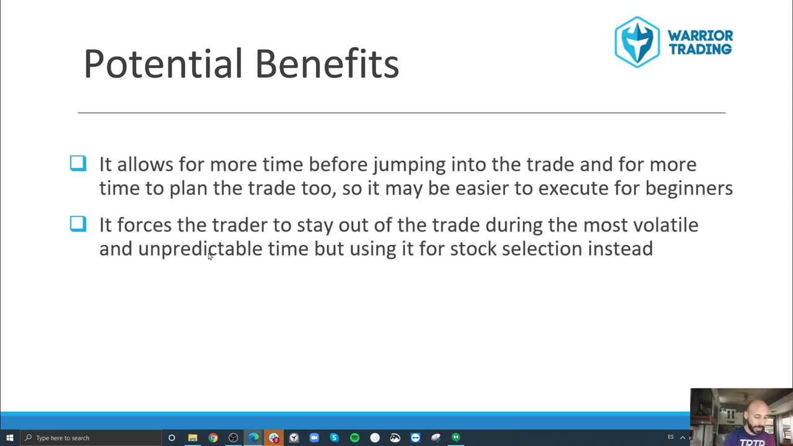

**图怎么看：**

- 这张截图显示了交易课程中的一个关键点，即在交易前进行更多的规划和准备，这有助于初学者更容易地执行交易。
- 截图中还提到，这种策略迫使交易者在市场最动荡和不可预测的时间段内保持离场，转而用于股票选择。
- 此外，该策略使交易者能够更好地管理和调整仓位大小，因为他们可以计划好如何承担风险。
- 最后，截图中指出，在典型的如短期卖空限制等场景下，这种策略比突破交易更容易实现成交。

### 关键内容

- 使用三分钟和十分钟图表过滤噪音，识别趋势
- 通过观察支撑阻力位，确认趋势方向
- 设置止损在13EMA下方，确保风险可控
- 利用斐波那契工具进行风险收益比分析
- 在市场波动时保持冷静，避免过度交易
- 使用TradingView平台进行实时监控和交易
- 根据市场情况调整交易策略，灵活应对
- 记录每次交易，总结经验教训
- 在三分钟和十分钟图表中，观察价格走势，确认支撑和阻力位，有助于识别趋势方向。
- 使用TradingView平台的内置指标，如13EMA和VWAP，可以更准确地识别支撑和阻力位，提高交易决策的可靠性。
- 设置止损在13EMA下方，确保风险可控，避免因市场波动导致的无谓亏损。
- 利用斐波那契工具进行风险收益比分析，可以更好地规划交易目标和风险控制，提高交易成功率。
- 在市场波动时，保持冷静，避免过度交易，是成功交易的关键之一，有助于减少情绪化决策带来的负面影响

### 分析与执行顺序

1. 登录TradingView平台，查看实时图表
2. 识别三分钟和十分钟图表中的趋势
3. 标记支撑和阻力位，确认趋势方向
4. 设置止损在13EMA下方，确保风险可控
5. 使用斐波那契工具进行风险收益比分析
6. 在市场波动时保持冷静，避免过度交易

### 案例与细节

- ticker：SQ；price_action：SQ在9:39开始突破前一天的高点，接近89水平；strategy：使用斐波那契工具确认支撑位，设置止损在13EMA下方；outcome：SQ继续上涨，达到目标水平，实现盈利
- ticker：BA；price_action：BA在9:39突破前一天的高点，接近89水平；strategy：使用斐波那契工具确认支撑位，设置止损在13EMA下方；outcome：BA继续上涨，达到目标水平，实现盈利
- ticker：CRWD；price_action：CRWD在9:39尝试突破前一天的高点，但未成功；strategy：未采取行动，等待确认信号；outcome：CRWD未突破，未进行交易
- ticker：SQ；price_action：SQ在9:39开始突破前一天的高点，接近89水平；strategy：使用斐波那契工具确认支撑位，设置止损在13EMA下方；outcome：SQ继续上涨，达到目标水平，实现盈利；在此例中，SQ的突破和后续上涨证实了使用斐波那契工具的正确性。
- ticker：BA；price_action：BA在9:39突破前一天的高点，接近89水平；strategy：使用斐波那契工具确认支撑位，设置止损在13EMA下方；outcome：BA继续上涨，达到目标水平，实现盈利；此例展示了如何利用斐波那契工具进行风险收益比分析，确保交易成功。
- ticker：CRWD；price_action：CRWD在9:39尝试突破前一天的高点，但未成功；strategy：未采取行动，等待确认信号；outcome：CRWD未突破，未进行交易；此例说明了在缺乏确认信号时，不采取行动的重要性，避免了不必要的交易风险

### 风险与边界

- 市场波动时，可能错过最佳交易机会
- 过度交易可能导致资金损失
- 依赖单一策略可能增加风险
- 录制于2020年，部分规则和平台状态可能已改变
- 市场波动时，可能错过最佳交易机会，尤其是在快速变动的市场环境中，无法及时识别和抓住趋势。
- 过度交易可能导致资金损失，频繁交易会增加错误决策的概率，从而导致不必要的资金流失。
- 依赖单一策略可能增加风险，如果市场环境发生变化，单一策略可能不再适用，需要灵活调整策略以适应新的市场条件。
- 录制于2020年，部分规则和平台状态可能已改变，投资者需关注最新的市场动态和平台更新，以确保交易策略的有效性

### 复盘问题

- 如何识别支撑和阻力位，确认趋势方向？
- 如何设置止损，确保风险可控？
- 如何利用斐波那契工具进行风险收益比分析？
- 如何在市场波动时保持冷静，避免过度交易？

---

## v0644：选择最佳交易平台的经验分享

> 日期：2020-06-17　·　时长：01:00:47

**本场重点：** 选择Trade Station作为交易平台，结合Trading View使用，适合技术分析交易者。

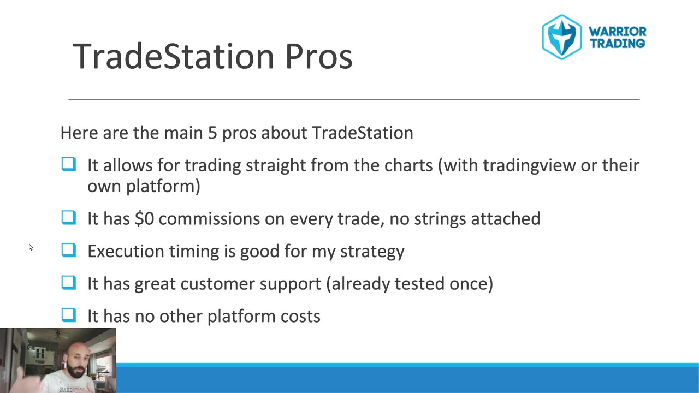

**图怎么看：**

- TradeStation Pro 界面展示了多个股票的实时交易数据。
- 用户可以查看不同股票的价格、成交量和时间序列数据。
- 界面上方显示了股票代码、名称、当前价格等基本信息。
- 右侧列出了股票的详细信息，包括每股收益、市盈率等财务指标。

### 关键内容

- Trade Station提供零佣金交易，支持多种技术分析工具。
- Trade Station仅在部分国家和地区可用，且需满足最低保证金要求。
- Trade Station的客户支持和服务质量较高。
- Trade Station的平台费用较低，但部分高级功能需要额外付费。
- Trade Station的交易速度和执行质量符合作者的需求。
- Trade Station的图表功能强大，支持自动绘制斐波那契水平线。
- Trade Station的热键功能缺失，但可以通过其他方式实现类似功能。
- Trade Station的保证金要求较高，限制了部分股票的交易。
- Trade Station的交易界面简洁，适合快速交易。
- Trade Station的交易记录显示了如何利用斐波那契水平线进行交易

### 分析与执行顺序

1. 介绍Trade Station的基本情况，包括其优势和局限性。
2. 展示如何通过Trading View直接下单，以及Trade Station的零佣金特点。
3. 解释Trade Station的客户支持和服务质量。
4. 展示Trade Station的图表功能，包括自动绘制的斐波那契水平线。
5. 演示如何通过Trade Station进行交易，包括设置止损和限价单。
6. 总结Trade Station的优势和局限性，强调其适合特定类型的交易者。

### 案例与细节

- Trade Station允许直接从图表下单，无需切换到其他平台。
- Trade Station提供零佣金交易，对于频繁交易者非常有利。
- Trade Station的客户支持迅速响应问题，解决了交易中的技术难题。
- Trade Station的图表功能强大，能够自动绘制斐波那契水平线，帮助交易者制定策略。
- Trade Station的交易界面简洁，适合快速交易，但部分高级功能需要额外付费。

### 风险与边界

- Trade Station仅在部分国家和地区可用，对于全球交易者来说可能受限。
- Trade Station的保证金要求较高，限制了部分股票的交易，不适合低保证金交易者。
- Trade Station的部分高级功能需要额外付费，增加了交易成本。
- Trade Station的热键功能缺失，可能导致交易效率降低。
- Trade Station的交易记录显示了如何利用斐波那契水平线进行交易，但实际效果可能因市场变化而不同。

### 复盘问题

- Trade Station的零佣金交易是如何实现的？
- Trade Station的客户支持服务如何？能否提供具体的例子？
- Trade Station的图表功能有哪些特别之处？
- Trade Station的交易界面是否影响交易速度？
- Trade Station的交易记录展示了哪些交易策略？

---

## v0645：技术分析与交易策略

> 日期：2020-06-24　·　时长：01:57:52

**本场重点：** 讲师通过具体案例讲解了如何识别突破点、设置止损和风险管理，强调了及时退出的重要性。

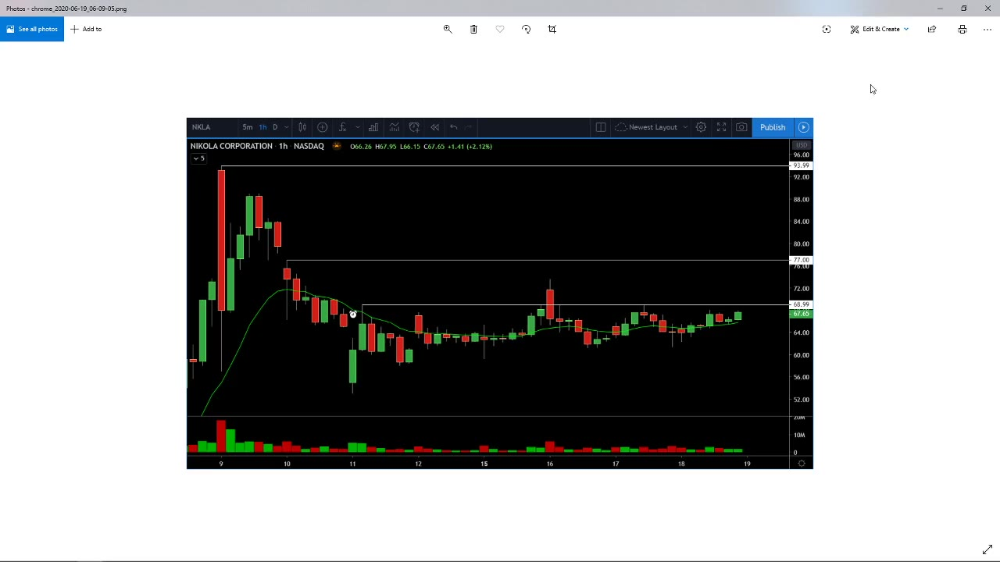

**图怎么看：**

- 整体界面显示了一个Excel工作表，包含多个股票的图表。
- 实际可见的ticker包括AMD和NKL，周期为1小时。
- K线图展示了股价的波动情况，均线作为支撑和阻力位。
- 这张截图展示了如何通过技术分析识别趋势和潜在的买卖点。

### 关键内容

- 市场在3月份触底后突破200移动平均线，形成支撑，表明市场可能继续上涨。
- Square（SQ）在2018年底开始形成长期技术模式，近期突破83美元阻力位，目标是101美元。
- 使用趋势线确认突破点，82美元作为入场点，风险为1美元，潜在收益为20美元，风险回报比为1:30。
- W股票从20美元反弹至200美元，随后形成横向区间，突破趋势线目标是220美元，实际达到80美元。
- NVACs股票形成牛旗形态，突破趋势线，目标是61美元，实际达到80美元。
- PTOA股票突破趋势线，次日跳空低开，但很快回升，突破趋势线，使用前一个支撑点作为止损。
- NKLA股票尝试突破69美元，但失败，止损设在68美元，次日突破69美元，但未考虑即时入场。
- Tava测试1310点位多次，现在再次测试该水平，考虑进行长期交易。
- 使用Trading View设置警报，确保不错过关键价格水平。
- 每次交易风险250美元，期望回报10到20倍，使用市场中间价下单，避免在窄价差时无法成交。
- 讲师通过具体案例展示了如何识别突破点，如Square（SQ）突破83美元阻力位，表明市场可能继续上涨，这需要结合技术指标和市场情绪。
- 使用趋势线确认突破点时，82美元作为入场点，风险为1美元，潜在收益为20美元，风险回报比为1:30，这要求投资者具备良好的风险管理意识。
- 在识别失败突破时，如果突破后出现回调且未能保持在先前的支撑位之上，则应考虑退出，这需要投资者具备敏锐的市场洞察力。
- 使用Trading View设置警报，确保不错过关键价格水平，这要求投资者熟悉交易平台的功能和设置方法。
- 每次交易风险250美元，期望回报10到20倍，使用市场中间价下单，避免在窄价差时无法成交，这需要投资者具备良好的资金管理和下单技巧。

### 分析与执行顺序

1. 讲师分享了在NKLA上的交易策略，成功突破后保持在突破点上方，但最终未能继续上涨。
2. 讲师强调了在类似失败突破时及时退出的重要性，以避免不必要的亏损。
3. 讲师解释了如何识别失败的突破，如果突破后出现回调且未能保持在先前的支撑位之上，则应考虑退出。
4. 讲师分享了一个新的交易机会，Tava测试1310点位多次，现在再次测试该水平，考虑进行长期交易。
5. 讲师解释了如何使用Trading View设置警报，确保不错过关键价格水平。
6. 讲师建议使用市场中间价下单，避免在窄价差时无法成交。

### 案例与细节

- Square（SQ）在2018年底开始形成长期技术模式，近期突破83美元阻力位，目标是101美元。
- W股票从20美元反弹至200美元，随后形成横向区间，突破趋势线目标是220美元，实际达到80美元。
- NVACs股票形成牛旗形态，突破趋势线，目标是61美元，实际达到80美元。
- PTOA股票突破趋势线，次日跳空低开，但很快回升，突破趋势线，使用前一个支撑点作为止损。
- Square（SQ）在2018年底开始形成长期技术模式，近期突破83美元阻力位，目标是101美元，这需要投资者密切关注技术形态的变化。
- W股票从20美元反弹至200美元，随后形成横向区间，突破趋势线目标是220美元，实际达到80美元，这展示了市场波动中的技术分析应用。
- NVACs股票形成牛旗形态，突破趋势线，目标是61美元，实际达到80美元，这说明了技术形态在实际交易中的重要性。
- PTOA股票突破趋势线，次日跳空低开，但很快回升，突破趋势线，使用前一个支撑点作为止损，这展示了止损设置的实际操作。
- Tava测试1310点位多次，现在再次测试该水平，考虑进行长期交易，这需要投资者具备耐心和长期视角。

### 风险与边界

- 讲师强调了及时退出的重要性，但没有具体说明所有可能的退出条件。
- 讲师提到使用Trading View设置警报，但没有详细说明如何设置具体的警报参数。
- 讲师建议使用市场中间价下单，但没有解释为何选择市场中间价。
- 讲师提到每周分享一到两个交易想法，但没有具体说明这些想法的来源和筛选标准。
- 如果突破后回落至支撑位以下，则表明交易可能失败，此时应遵守风险管理规则，避免继续持有亏损的头寸，这要求投资者具备严格的纪律。
- 使用Trading View设置警报时，如果没有正确设置参数，可能会错过关键价格水平，导致不必要的亏损，这需要投资者熟悉平台功能。
- 每次交易风险250美元，期望回报10到20倍，如果市场波动较大，可能会导致实际回报低于预期，这需要投资者具备良好的心理素质。
- 在窄价差时使用市场中间价下单，可能会因为流动性问题导致订单无法成交，这需要投资者了解市场状况和流动性特点。

### 复盘问题

- 讲师是如何确定突破点的？
- 在识别失败突破时，有哪些具体的信号可以参考？
- 如何设置止损点以避免不必要的亏损？
- 讲师是如何选择使用市场中间价下单的？
- 每周分享的交易想法是如何筛选出来的？

---

## v0646：日内交易策略与风险管理

> 日期：2020-07-01　·　时长：01:50:15

**本场重点：** 讲师强调使用技术分析策略进行日内交易的风险，如假突破和假突破后的快速反转。同时，讲师推荐使用趋势跟随策略，并分享了具体的交易案例。

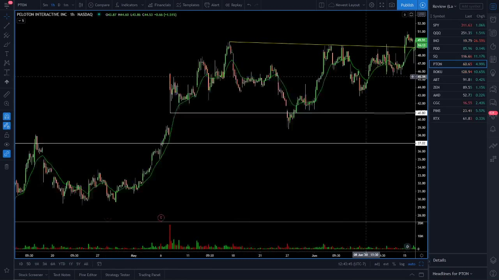

**图怎么看：**

- 图中显示了Peloton Interactive Inc.（PTON）的每日K线图，价格在2016年至2020年间波动。
- 图表上可以看到多个水平线，可能表示支撑位和阻力位。
- 成交量柱的高度反映对应周期内的总成交量；红绿着色通常跟随价格柱的涨跌规则，不能直接拆成两种方向的主动成交。
- 图表下方的时间和成交量信息提供了市场活动的详细数据。

### 关键内容

- 讲师认为市场整体趋势向上，SPY和Triple Q均在200日移动平均线上方。
- 讲师分享了多个短期交易设置，包括INO和PTON，但指出INO出现假突破，随后迅速反转。
- 讲师推荐使用趋势跟随策略，认为趋势将继续向上，但强调使用技术分析策略的风险。
- 讲师关注Roku（ROKU），认为其可能突破当前区间，目标价为151-170。
- 讲师观察到ABT形成强牛旗形态，目标价为100，但ZEN接近突破趋势线，目标价为95。
- 讲师表示正在从Trade Station迁移到Light Speed，限制了当前交易机会。
- 讲师建议AMD和CGC作为潜在的短期交易目标，但需市场支持。
- 讲师指出，如果RTX跌破趋势线，可能会继续下跌，但他不会期望它跌至10美元。
- 讲师认为，即使在92、93附近突破，也不愿意追涨，这是一次重要的学习经验。
- 讲师强调，只有在看到明确的价格模式后，才会考虑任何交易。
- 讲师观察到ABT形成强牛旗形态，目标价为100，表明该股可能突破现有区间，但需更多确认。
- 讲师提到ZEN接近突破趋势线，目标价为95，显示该股可能进入上升趋势，但需进一步验证。
- 讲师表示正在从Trade Station迁移到Light Speed，限制了当前交易机会，意味着短期内无法利用新平台的优势。
- 讲师建议AMD和CGC作为潜在的短期交易目标，但需市场支持，说明这些股票的交易机会依赖于市场环境。
- 讲师认为微软有强劲的长期上涨趋势，但目前没有考虑做空，表明他对微软持乐观态度，但不急于做空

### 分析与执行顺序

1. 讲师首先分析了市场整体趋势，认为SPY和Triple Q均在200日移动平均线上方。
2. 然后分享了多个短期交易设置，包括INO和PTON，但指出INO出现假突破，随后迅速反转。
3. 接着，讲师关注Roku（ROKU）和其他股票，如ABT和ZEN，分析它们的走势和目标价。
4. 讲师还提到了从Trade Station迁移到Light Speed的过程，限制了当前交易机会。
5. 最后，讲师建议使用趋势跟随策略，并分享了具体的交易案例，如AMD和CGC。

### 案例与细节

- INO出现假突破，随后迅速反转，表明算法对日内交易有重大影响。
- ROKU需要第三次拒绝测试以考虑长期交易机会。
- 如果RTX跌破趋势线，可能会继续下跌，但他不会期望它跌至10美元。
- 如果SQ突破101目标，他会在两个或三个订单中逐步退出，以获得最佳退出机会。
- 如果未在9150附近退出，可能会在稍后某个时间点获利，但最终股价回落。
- INO出现假突破，随后迅速反转，表明算法对日内交易有重大影响，这提醒交易者注意技术分析中的假信号。
- 如果RTX跌破趋势线，可能会继续下跌，但他不会期望它跌至10美元，这说明交易者需要设定合理的止损点。
- 如果SQ突破101目标，他会在两个或三个订单中逐步退出，以获得最佳退出机会，这展示了如何利用分批退出策略管理风险

### 风险与边界

- 讲师指出，使用技术分析策略存在假突破和假突破后的快速反转的风险。
- 讲师强调，只有在看到明确的价格模式后，才会考虑任何交易。
- 讲师提到，从Trade Station迁移到Light Speed限制了当前交易机会。
- 录制于2020年，平台、监管、税务和经纪商条件只能表述为历史录制内容。
- 讲师指出，使用技术分析策略存在假突破和假突破后的快速反转的风险，这可能导致交易者频繁进出市场，增加成本。
- 讲师提到，从Trade Station迁移到Light Speed限制了当前交易机会，这可能影响交易者的即时反应能力，尤其是在市场波动时。
- 如果未在9150附近退出，可能会在稍后某个时间点获利，但最终股价回落，这说明交易者需要准确把握退出时机，否则可能错失最佳收益。
- 讲师认为即使在92、93附近突破，也不愿意追涨，这是一次重要的学习经验，表明交易者需要避免盲目追涨，以免陷入高位套牢的风险

### 复盘问题

- 讲师认为哪些股票具有潜在的交易机会？
- 讲师是如何分析INO和PTON的假突破的？
- 讲师推荐的趋势跟随策略的具体应用是什么？
- 讲师提到的从Trade Station迁移到Light Speed的原因是什么？
- 讲师是如何评估风险回报比的？

---

## v0647：Roku和MRNA的技术分析与交易策略

> 日期：2020-07-15　·　时长：01:28:06

**本场重点：** Roku和MRNA的突破分析，以及交易策略的制定

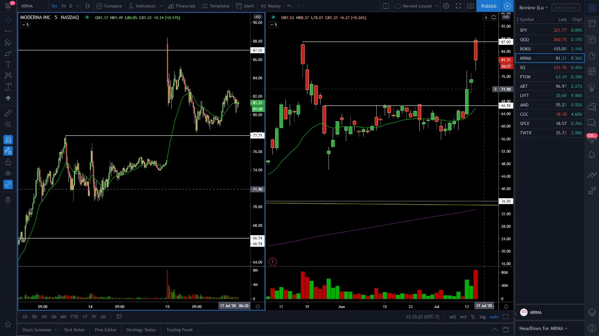

**图怎么看：**

- 现代医药（MODERNA INC）的5分钟K线图显示了股价在近期的波动情况。
- 成交量柱状图显示了不同时间段内的成交量变化。
- 股价在近期经历了多次上升和下降，显示出市场的波动性。
- 成交量柱的高度反映对应周期内的总成交量；红绿着色通常跟随价格柱的涨跌规则，不能直接拆成两种方向的主动成交。

### 关键内容

- 讲师指出Roku在7月1日的分析中，希望看到更多拒绝135-47水平后才考虑进行长期交易。
- 讲师强调需要三次测试支撑位才能确认突破，Roku在此日完成第三次测试。
- 讲师指出Roku的突破已完成，分享了这一突破作为长期交易的建议。
- 预期Roku将突破至168，实际达到169附近，超出预期。
- 讲师强调使用最佳判断和价格行动来确定目标价格，避免过早获利。
- 讲师提到SQ的分析，表明在突破后卖出以等待回调再买入是合理的。
- 讲师讨论MRNA，指出其突破66-59水平，预估未来几天或几周会继续上涨。
- 讲师认为MRNA可能继续上涨至87，即使新闻影响了价格，继续持有是合理的。
- 讲师总结CGC的分析，强调需要更多反弹才能确认突破。
- 讲师推荐Space作为长期交易机会，关注突破2107水平。
- 讲师指出，Twitter出现了一次强劲的突破前的第三测试，表明该水平可能成为阻力位，因此在突破后应谨慎操作。
- 讲师强调，除非看到明显的卖压和缺口下破加速，否则市场仍有可能继续上升，这表明市场趋势的稳定性。
- 讲师推荐AMD作为长期交易机会，因其U形复苏和趋势线突破潜力，这表明技术分析的重要性。
- 讲师讨论CGC，关注突破1839水平的可能性，指出需要更多反弹才能确认突破，这说明技术指标的可靠性。
- 讲师总结特斯拉作为长期交易机会，但未详细展开，这表明特斯拉的市场地位和潜在价值

### 分析与执行顺序

1. 讲师回顾Roku和MRNA的交易，指出它们分别突破82和49，目前分别在130和70附近。
2. 讲师解释MVax的分析，从46美元开始，预期突破61美元，实际达到11美元。
3. 讲师讨论CGC，关注突破1839水平的可能性。
4. 讲师指出CGC已从1550美元反弹，关注突破1839水平。
5. 讲师总结CGC的分析，强调需要更多反弹才能确认突破。

### 案例与细节

- Roku在7月1日的分析中，希望看到更多拒绝135-47水平后才考虑进行长期交易。
- MRNA突破66-59水平，预估未来几天或几周会继续上涨。
- MVax从46美元开始，预期突破61美元，实际达到11美元。
- CGC已从1550美元反弹，关注突破1839水平。
- Roku在7月1日的分析中，希望看到更多拒绝135-47水平后才考虑进行长期交易，这表明技术分析的严谨性。
- MRNA突破66-59水平，预估未来几天或几周会继续上涨，这显示了技术突破后的持续性。
- MVax从46美元开始，预期突破61美元，实际达到11美元，这说明技术分析有时会遇到意外情况，需灵活应对

### 风险与边界

- 讲师指出，除非看到明显的卖压和缺口下破加速，否则市场仍有可能继续上升。
- 讲师建议，在突破后的回撤期间不要使用跟踪止损，但在回撤后可以考虑锁定部分利润。
- 讲师提到，摆动突破后的回撤不应立即止损，而应保持在盈亏平衡点。
- 讲师表示，尚未使用Interactive Brokers，但可以提供相关文章链接。
- 讲师指出，除非看到明显的卖压和缺口下破加速，否则市场仍有可能继续上升，这提醒投资者注意市场趋势的变化。
- 讲师建议，在突破后的回撤期间不要使用跟踪止损，但在回撤后可以考虑锁定部分利润，这提醒投资者避免过度操作。
- 讲师提到，摆动突破后的回撤不应立即止损，而应保持在盈亏平衡点，这提醒投资者避免情绪化决策。
- 讲师表示，尚未使用Interactive Brokers，但可以提供相关文章链接，这提醒投资者注意经纪商的选择和风险

### 复盘问题

- Roku和MRNA的突破分析是如何进行的？
- 讲师为何强调使用最佳判断和价格行动来确定目标价格？
- CGC的分析中，为何需要更多反弹才能确认突破？
- 讲师推荐Space作为长期交易机会，关注突破2107水平，基于什么理由？

---

## v0648：黄金与AMD的摆动交易分析

> 日期：2020-07-29　·　时长：01:20:58

**本场重点：** 讲师通过技术分析选择股票进行摆动交易，强调风险管理和耐心等待突破的重要性。

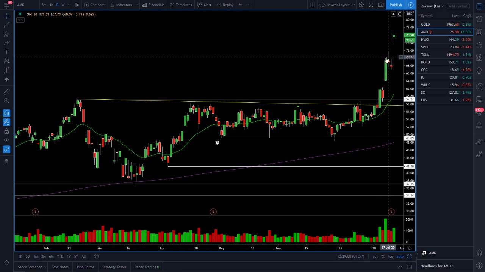

**图怎么看：**

- 整体界面显示了多个股票的图表和数据
- 实际可见的ticker包括AMD、SPCE、ROKU等
- 画面信息对应本场主题，展示了AMD股票的技术分析，强调风险管理和耐心等待突破的重要性
- 这张截图不能单独证明什么，阅读时应避免对成交量柱的误解

### 关键内容

- 讲师使用技术策略识别摆动交易机会，包括识别范围、突破和回撤点。
- 等待第三次测试以确认突破的有效性，避免过早退出交易。
- 使用GLD作为跟踪黄金走势的工具，强调风险回报比的重要性。
- 分析AMD的图表，指出其历史趋势和当前技术形态，识别突破点。
- 设定65美元作为初始目标价格，考虑到即将到来的财报。
- 强调风险管理和耐心等待突破的重要性，避免无效信号。
- 使用Trading View进行技术分析，但不使用Fibonacci策略。
- 通过标记关键价格水平，如支撑和阻力水平，来选择高成交量股票进行交易。
- 在财报发布后选择股票进行交易，因为此时成交量最高，适合交易。
- 如果股票未能保持在关键支撑水平之上，则视为失败交易。
- 讲师强调使用心理止损而非设置具体的止损订单，以适应市场变化。
- 通过标记关键价格水平，如支撑和阻力水平，可以更好地识别交易机会，提高成功率。
- 在选择股票时，考虑其历史趋势和当前技术形态，有助于识别潜在的突破点。
- 使用Trading View进行技术分析，可以帮助识别股票的支撑和阻力水平，从而制定更有效的交易策略。
- 在财报发布前后选择股票进行交易，可以利用高成交量带来的交易机会，但也可能面临市场波动的风险

### 分析与执行顺序

1. 讲师通过一个全面的股票观察列表来选择股票，每天检查这些列表以寻找感兴趣的交易模式。
2. 使用Trading View进行技术分析，标记关键价格水平，如支撑和阻力水平。
3. 在财报发布后选择股票进行交易，因为此时成交量最高，适合交易。
4. 分析股票的历史趋势和当前技术形态，识别突破点。
5. 设定初始目标价格，考虑即将到来的财报。
6. 通过标记关键价格水平，如支撑和阻力水平，来选择高成交量股票进行交易。
7. 在突破点附近等待第三次测试，以确认突破的有效性。

### 案例与细节

- 使用GLD作为跟踪黄金走势的工具，黄金价格已达到2000美元。
- 分析AMD的图表，指出其历史趋势和当前技术形态，识别突破点。
- 设定65美元作为初始目标价格，考虑到即将到来的财报。
- WM股票出现一小时牛旗形态，可能突破至114。
- SLV（白银ETF）正在突破历史高点，但具体上涨幅度难以预测。
- WM股票出现一小时牛旗形态，可能突破至114，这表明短期内存在强烈的买盘动力。
- SLV（白银ETF）正在突破历史高点，但具体上涨幅度难以预测，这反映了市场对白银的需求增加。
- 使用GLD作为跟踪黄金走势的工具，黄金价格已达到2000美元，这表明黄金市场具有较高的稳定性

### 风险与边界

- 在支撑水平以下的第二次测试进入交易被视为无效信号。
- 依赖单一技术指标（如Fibonacci）可能导致错误判断。
- 在接近突破点时，股票表现不佳可能导致交易失败。
- 录制年代限制，平台、监管、税务和经纪商条件只能表述为历史录制内容。
- 依赖单一技术指标（如Fibonacci）可能导致错误判断，特别是在市场趋势不明朗时。
- 在接近突破点时，股票表现不佳可能导致交易失败，这需要交易者具备较强的市场洞察力。
- 在支撑水平以下的第二次测试进入交易被视为无效信号，这要求交易者严格遵守技术分析原则

### 复盘问题

- 如何通过技术分析选择合适的股票进行摆动交易？
- 为什么等待第三次测试以确认突破的有效性很重要？
- 在财报发布前后选择股票进行交易有哪些优势和风险？
- 如何在交易过程中管理风险，避免无效信号？

---

## v0649：高级交易策略分析

> 日期：2020-08-05　·　时长：01:44:50

**本场重点：** 讲师通过技术图表识别突破点，并构建自己的股票观察列表，以顺应趋势进行交易。

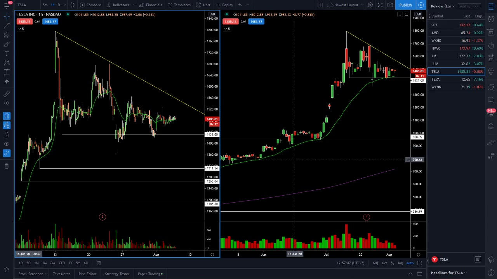

**图怎么看：**

- 特斯拉（TSLA）的每日K线图显示了价格在上升趋势中的波动情况。
- 成交量柱状图显示了不同时间段内的交易活动。
- 图表上标注了支撑位和阻力位，帮助投资者判断买卖时机。
- 成交量柱的高度反映对应周期内的总成交量；红绿着色通常跟随价格柱的涨跌规则，不能直接拆成两种方向的主动成交。

### 关键内容

- 讲师分析了SPY、AMD、Zoom、WKHS、NVAX、特斯拉、TAVA、TAV等股票的突破形态，指出突破趋势线后的目标价。
- 讲师强调使用技术图表识别突破点的重要性，如AMD突破发生在7月21日的五分钟图表上。
- 讲师表示不会在整理区间内交易，而是等待突破或打破整理区间时进行交易，以顺应趋势。
- 讲师建议选择深实值期权以避免时间衰减，减少时间溢价，选择较近到期的期权。
- 讲师指出建立观察名单时应包括指数ETF、期货、热门股票等，以寻找符合策略的模式。
- 讲师提到使用Think或Swim平台时会有持有费用，但允许做空。
- 讲师强调交易规模应根据止损和最大风险确定，使用支撑和阻力水平作为目标。
- 讲师指出使用5分钟、60分钟和日线图进行分析，MA（MasterCard）近期形成双顶突破。
- 讲师建议不使用锤子烛线作为买入信号，而是看突破后的跟进。
- 讲师提到使用Zenger体积比率来判断交易量，使用相同的观察名单进行日间交易和摆动交易。

### 分析与执行顺序

1. 讲师首先分析了SPY、AMD、Zoom、WKHS、NVAX、特斯拉、TAVA、TAV等股票的突破形态。
2. 讲师通过技术图表识别突破点，如AMD突破发生在7月21日的五分钟图表上。
3. 讲师强调不会在整理区间内交易，而是等待突破或打破整理区间时进行交易，以顺应趋势。
4. 讲师建议选择深实值期权以避免时间衰减，减少时间溢价，选择较近到期的期权。
5. 讲师指出建立观察名单时应包括指数ETF、期货、热门股票等，以寻找符合策略的模式。
6. 讲师提醒使用Think或Swim平台时会有持有费用，但允许做空。
7. 讲师强调交易规模应根据止损和最大风险确定，使用支撑和阻力水平作为目标。

### 案例与细节

- SPY在2018年末至2019年初曾出现20%的修正，随后市场迅速回升，突破200移动平均线，形成V型复苏。
- AMD股票经历了U形恢复和横向整理后，形成了四点趋势线，最终突破趋势线，达到$75目标价。
- 特斯拉股票的三重底旗形形态，可能正在耗尽动能，预计会测试支撑位$1311、$1266和$1185。
- TAVA股票的三重顶突破形态，预计突破$1310后，目标价为$1572、$1713和$20。

### 风险与边界

- 讲师指出，突破形态的成功依赖于市场走势，历史模式不一定在未来重复。
- 使用技术图表识别突破点需要一定的经验和技巧，新手可能难以准确判断。
- 选择深实值期权和较近到期的期权可能会增加交易成本，需要权衡。
- 讲师的交易策略基于历史数据，当前市场条件可能有所不同，需谨慎执行。
- 使用Think或Swim平台时会有持有费用，需考虑成本效益。

### 复盘问题

- 讲师是如何通过技术图表识别突破点的？
- 讲师建议的交易策略有哪些具体步骤？
- 哪些股票被讲师认为具有突破潜力？
- 讲师为何不直接交易SPI？
- 讲师是如何构建自己的股票观察列表的？

---

## v0650：如何在40天内增长账户40%

> 日期：2020-08-12　·　时长：00:53:55

**本场重点：** 通过分析交易记录，了解账户增长策略和风险控制方法。

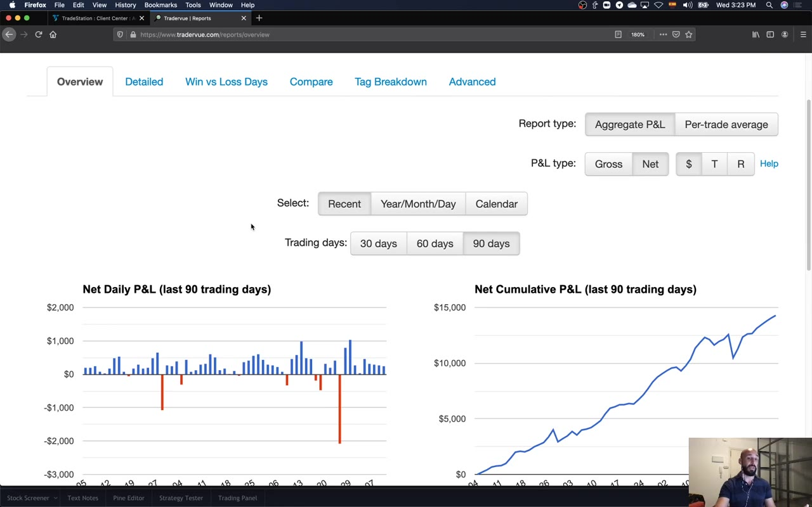

**图怎么看：**

- 这张截图显示了TradingView平台上的股票图表，包括K线图、成交量柱状图和水平线。
- 图表上可以看到不同时间段的价格波动和成交量变化。
- 水平线可能表示支撑位和阻力位，帮助投资者识别趋势。
- 成交量柱状图显示了不同时间段内的买卖活动强度。

### 关键内容

- 罗伯托在2020年5月开设了新的交易平台账户。
- 在接下来的64个交易日中，账户增长了40%，从37,600美元增加到51,700美元。
- 罗伯托的交易策略主要集中在趋势交易上，每天平均进行2次交易。
- 账户在7月23日出现最大单日亏损2,000美元，但很快恢复。
- 罗伯托的胜率高达77%，平均盈利300美元，平均亏损500美元。
- 罗伯托坚持日交易，不持有头寸过夜。
- 罗伯托的交易系统包括使用斐波那契回撤水平和移动平均线进行交易。
- 罗伯托在特斯拉和mRNA等股票上取得了成功，但没有详细说明具体操作细节。
- 罗伯托的交易策略注重风险管理，确保每次交易的风险可控。
- 罗伯托的交易记录显示了他在不同股票上的盈利和亏损情况。

### 分析与执行顺序

1. 罗伯托分享了他过去三个月的交易记录，展示了账户的增长。
2. 罗伯托解释了他使用的交易平台和交易策略，包括Trade Station和Trading View。
3. 罗伯托详细描述了他在mRNA和特斯拉上的交易策略和操作过程。
4. 罗伯托分享了他在交易中遇到的问题和解决方案，包括止损和风险管理。
5. 罗伯托展示了他在交易中使用的图表和指标，包括斐波那契回撤水平和移动平均线。
6. 罗伯托解释了他在交易中遇到的技术问题，并表示会改进以避免类似问题。
7. 罗伯托回答了观众提出的问题，包括关于交易策略和风险管理的具体问题。

### 案例与细节

- 罗伯托在mRNA的交易中，利用了预市前的缺口和斐波那契回撤水平进行交易。
- 罗伯托在特斯拉的交易中，利用了股票分割后的反弹进行交易。
- 罗伯托在交易中使用了13日移动平均线作为参考点，进行买入和卖出。
- 罗伯托在交易中使用了止损订单，确保在市场不利时能够及时退出。
- 罗伯托在交易中使用了多种图表工具，包括Trading View和Trade Station。

### 风险与边界

- 罗伯托的交易策略依赖于市场趋势，如果市场发生重大变化，可能会导致亏损。
- 罗伯托的交易记录显示了他在某些股票上的亏损，这可能会影响投资者的信心。
- 罗伯托的交易策略主要集中在日交易上，如果市场波动较大，可能会面临更大的风险。
- 罗伯托的交易记录是基于过去的市场情况，当前市场的变化可能导致策略失效。

### 复盘问题

- 罗伯托的交易策略是如何制定的？
- 罗伯托在交易中遇到的最大挑战是什么？
- 罗伯托是如何管理交易风险的？
- 罗伯托的交易记录显示了哪些成功的交易案例？
- 罗伯托的交易策略是否适用于所有类型的股票？

---

## v0651：SPY技术分析与交易策略

> 日期：2020-08-19　·　时长：01:30:54

**本场重点：** SPY突破200移动平均线后的技术分析与交易策略，强调识别时机的重要性。

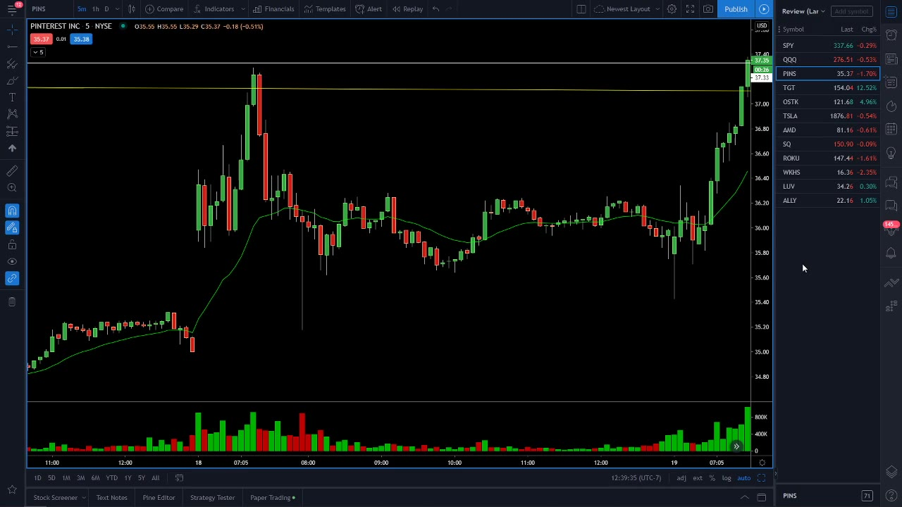

**图怎么看：**

- 在TGT的5分钟图上，可以看到股价在200日均线附近波动。
- 股价在200日均线附近形成了一个支撑位。
- 投资者可以关注这个支撑位，以判断市场是否可能反转。
- 如果股价跌破200日均线，可能会引发进一步下跌的风险。

### 关键内容

- SPY在COVID后突破新高，反映了市场乐观情绪。
- 市场从熊市迅速恢复，显示了市场的韧性。
- 作者通过识别正确的突破模式，成功预测了市场底部。
- 作者强调对大型指数进行持续分析的重要性。
- 市场突破339是一个重要阻力水平，但不确定是否意味着趋势结束。
- 作者认为SPY可能继续上涨至370，但突破339是一个重大阻力水平。
- 作者指出，反转交易风险较高，更倾向于跟随市场趋势。
- 作者分享了Target的整合突破模式，展示了理想的突破策略。
- 作者强调，关键在于识别时机，而不是单日表现。
- 特斯拉目标价为2000美元，当前价格为1750美元，预计继续上涨。
- 市场从熊市迅速恢复，显示了市场的韧性，表明市场存在大量看涨情绪，这促使投资者积极入场。
- 作者通过识别正确的突破模式，成功预测了市场底部，这表明技术分析在特定情况下可以提供准确的信号。
- 市场突破339是一个重要阻力水平，但不确定是否意味着趋势结束，这提醒投资者注意市场不确定性。
- 作者认为SPY可能继续上涨至370，但突破339是一个重大阻力水平，这说明投资者需要谨慎评估市场阻力。
- 作者指出，反转交易风险较高，更倾向于跟随市场趋势，这强调了风险管理的重要性，尤其是在市场波动较大时

### 分析与执行顺序

1. 观察SPY在COVID后的表现，识别市场乐观情绪。
2. 分析市场从熊市迅速恢复的情况，确认市场韧性。
3. 识别正确的突破模式，预测市场底部，成功买入SPY。
4. 设定止损点，使用前一个低点作为止损点，止损设在122美元。
5. 关注市场突破339后的反应，确认是否突破重要阻力水平。
6. 分析不同股票的行为差异，考虑市场波动性。
7. 总结识别时机的重要性，强调单日表现的不可靠性。

### 案例与细节

- SPY在接近301时有支撑，预计会稳定并继续上涨。
- 作者的目标是339，这是他在SPY突破200移动平均线后设定的。
- 如果交易Target模式，会在突破点3710附近进入，目标是38，止损设在37。
- LUV出现熊陷阱，突破后反弹，表明买家恢复，建议长期持有。
- Target在突破后稳定并继续上涨，符合预期，这展示了理想的技术分析突破策略的实际效果。
- LUV出现熊陷阱，突破后反弹，表明买家恢复，建议长期持有，这说明技术分析需要结合市场行为来验证。
- 特斯拉目标价为2000美元，当前价格为1750美元，预计继续上涨，这表明长期投资策略的有效性

### 风险与边界

- 市场突破339后，不确定是否意味着趋势结束，存在不确定性。
- 反转交易风险较高，需要谨慎操作。
- 市场波动性可能导致突破后回测触发点，需密切关注。
- 录制年代限制，平台、监管、税务和经纪商条件只能表述为历史录制内容。
- 市场突破339后，不确定是否意味着趋势结束，存在不确定性，这要求投资者保持警惕，避免盲目跟风。
- 反转交易风险较高，需要谨慎操作，这提醒投资者在市场波动较大时要更加小心，避免过度冒险。
- 市场波动性可能导致突破后回测触发点，需密切关注，这说明投资者需要实时监控市场动态，及时调整策略

### 复盘问题

- SPY突破200移动平均线后，市场情绪如何变化？
- 作者是如何通过技术分析预测市场底部的？
- 突破339后，市场是否出现了预期的回调？
- 如何根据市场波动性调整交易策略？

---

## v0652：股票交易策略与风险控制

> 日期：2020-09-02　·　时长：01:41:54

**本场重点：** 本视频重点讲解了如何利用市场趋势和股票形态进行交易，并强调了风险控制的重要性。

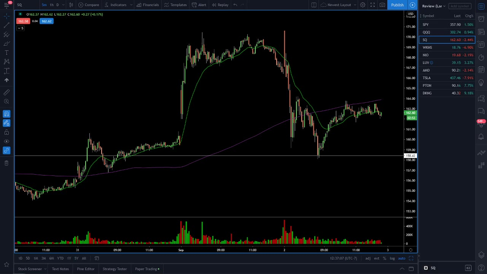

**图怎么看：**

- 画面中，可以看到一个股票的K线图，显示了价格走势和成交量的变化。
- 图中的绿色和红色柱状图代表了成交量，颜色较深表示成交量较大。
- 水平线和斜线可能代表了支撑位和阻力位，帮助投资者判断买卖点。
- 图表下方的时间轴显示了不同时间段的价格变化，有助于分析长期趋势。

### 关键内容

- 市场正处于强劲上升趋势，特别是Triple Q和SPY，显示了加速上涨的趋势。
- SQ股票在15850附近形成了杯状形态，突破后表现良好，初始止损设在158.43，风险为70美分，最终收益约为750美元。
- WKHS试图突破1810点位，目标价为21至23美元，实际风险为15美分，收益约为2.90美元，风险回报比约为1:20。
- 操作建议是在突破点附近进入，使用更紧的止损以提高风险回报比，例如在158.43买入，止损设在158.43，风险为50美分；在159买入，风险为1.12美元，风险回报比降低。
- 如果追高买入，风险会显著增加，例如SQ在159买入的风险回报比仅为1:11，而在158.43买入则为1:17。
- AMD在5770点位突破后继续上涨，目标价上调至100美元，显示强劲的买盘压力。
- PTON突破6973后大幅上涨，目标价设为100美元，显示强劲的买盘压力。
- DKNG在趋势线上方形成横向整理后，预计会突破新高，目标价为50美元。
- 使用之前的波动范围来预测未来波动范围，如果从低点34美元开始，可能会上涨到62美元。
- 观察到SQ在15850附近形成了杯状形态，突破后表现良好，说明形态理论在实际交易中的有效性。
- WKHS试图突破1810点位，目标价为21至23美元，实际风险为15美分，收益约为2.90美元，风险回报比约为1:20，表明小风险高收益的交易策略可行。
- AMD在5770点位突破后继续上涨，目标价上调至100美元，显示强劲的买盘压力，说明技术分析在判断市场趋势中的重要性。
- PTON突破6973后大幅上涨，目标价设为100美元，显示强劲的买盘压力，说明高波动股票的潜在收益和风险。
- DKNG在趋势线上方形成横向整理后，预计会突破新高，目标价为50美元，说明趋势线突破后的延续性分析有助于制定交易计划

### 分析与执行顺序

1. 首先分析市场趋势，确认当前市场处于上升趋势。
2. 识别股票形态，如SQ的杯状形态，确定突破点和止损位置。
3. 根据风险回报比选择合适的买入点，确保风险可控。
4. 监控股票价格变动，及时调整止损点以适应市场变化。
5. 在突破点附近进入，使用更紧的止损以提高风险回报比。

### 案例与细节

- SQ在15850附近形成了杯状形态，突破后表现良好。
- WKHS试图突破1810点位，目标价为21至23美元。
- AMD在5770点位突破后继续上涨，目标价上调至100美元。
- PTON突破6973后大幅上涨，目标价设为100美元。
- SQ在15850附近形成了杯状形态，突破后表现良好，初始止损设在158.43，实际风险为70美分，最终收益约为750美元，风险回报比约为1:10，说明利用形态理论进行交易可以有效控制风险。
- WKHS试图突破1810点位，目标价为21至23美元，实际风险为15美分，收益约为2.90美元，风险回报比约为1:20，说明小风险高收益的交易策略在实际操作中可行。
- AMD在5770点位突破后继续上涨，目标价上调至100美元，显示强劲的买盘压力，说明技术分析在判断市场趋势中的重要性，如使用一小时图分析较短时间框架的设置。
- PTON突破6973后大幅上涨，目标价设为100美元，显示强劲的买盘压力，说明高波动股票的潜在收益和风险，如使用Trading View平台可以下载和导入股票列表。
- DKNG在趋势线上方形成横向整理后，预计会突破新高，目标价为50美元，说明趋势线突破后的延续性分析有助于制定交易计划，如使用之前的波动范围来预测未来波动范围

### 风险与边界

- 如果追高买入，风险会显著增加，例如SQ在159买入的风险回报比仅为1:11，而在158.43买入则为1:17。
- 注意突破可能失败，需要警惕。
- 避免隔夜大缺口导致被赋予新股票的方法。
- 特斯拉股价已达到设定的目标，但近期出现较大回调，需谨慎。
- 如果追高买入，风险会显著增加，例如SQ在159买入的风险回报比仅为1:11，而在158.43买入则为1:17，说明盲目追高可能导致亏损。
- 注意突破可能失败，需要警惕，如SHL的突破是技术性突破，说明市场突破并非总是有效，需要谨慎操作。
- 避免隔夜大缺口导致被赋予新股票的方法，如GM的突破是短期时间框架，建议在60分钟图上分析，说明隔夜交易的风险需要特别注意。
- 特斯拉股价已达到设定的目标，但近期出现较大回调，需谨慎，说明即使达到目标价，也需要关注后续市场动态，避免盲目乐观

### 复盘问题

- 如何识别市场趋势并据此制定交易策略？
- 在突破点附近进入交易时，如何确定合适的止损点？
- 如果追高买入，可能会面临哪些风险？
- 如何利用之前的波动范围来预测未来波动范围？

---

## v0653：日内交易策略详解

> 日期：2020-09-09　·　时长：01:02:26

**本场重点：** 讨论日内交易策略，特别是如何利用斐波那契回撤和趋势线进行交易。

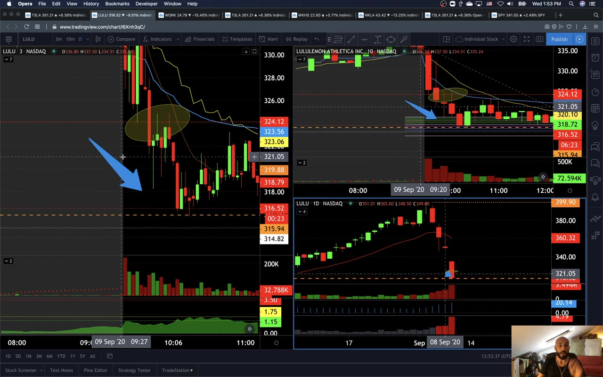

**图怎么看：**

- 在TradeStation Client Center页面上，用户可以查看特定证券是否在特殊保证金要求列表中。
- 用户可以通过输入证券代码（如TSLA）来搜索特定证券是否在列表中。
- 页面提供了下载文件的功能，以便用户下载完整的特殊保证金要求列表。
- 用户还可以通过点击“SEARCH”按钮来查看所有开始于特定字母的证券代码。

### 关键内容

- 讲师强调交易计划的重要性，不应随意追单。
- 使用斐波那契回撤和趋势线来确定入场点。
- 交易过程中保持耐心，等待最佳入场时机。
- 使用相对成交量来判断趋势强度。
- 交易策略需根据市场情况进行调整。
- 使用TradingView作为主要交易平台。
- 交易过程中严格遵守止损原则。
- 交易策略适用于多种股票，但需灵活调整。
- 交易过程中需关注市场动态，及时调整策略

### 分析与执行顺序

1. 讲师回顾了Lulu股票的交易过程，从开盘到测试关键支撑位的过程。
2. 讲师展示了如何使用斐波那契回撤和趋势线来确定潜在的交易机会。
3. 讲师强调了交易过程中保持耐心的重要性，等待最佳入场时机。
4. 讲师解释了如何使用相对成交量来判断趋势强度。
5. 讲师分享了如何在交易过程中严格遵守止损原则，以控制风险。
6. 讲师强调了交易策略需要根据市场情况进行调整，以适应不同的市场环境。
7. 讲师展示了如何在交易过程中灵活调整策略，以应对市场的变化

### 案例与细节

- Lulu股票在开盘后测试了32412的关键支撑位，但未能突破，随后继续下跌，最终确认跌破该支撑位。
- 讲师使用斐波那契回撤工具，发现价格在32412附近形成了重要的支撑位，随后测试该水平。
- 讲师使用TradingView平台，通过设置止损订单来控制风险，确保交易安全。
- 在交易过程中，讲师注意到相对成交量增加，表明市场情绪积极，因此加大了对Lulu股票的持仓。
- 当Lulu股票测试关键支撑位失败后，讲师立即设置了止损订单，以防止进一步的损失

### 风险与边界

- 交易过程中可能会遇到市场波动，导致交易计划失效。
- 使用斐波那契回撤和趋势线进行交易时，可能会出现假突破，导致错误的交易决策。
- 交易策略需要根据市场情况进行调整，否则可能无法适应市场的变化。
- 交易过程中可能会遇到技术问题，如图表加载延迟，影响交易决策。
- 交易策略的有效性受到市场环境的影响，不同市场环境下可能需要调整策略

### 复盘问题

- 在交易过程中，如何确保交易计划的严格执行？
- 如何利用相对成交量来判断市场情绪？
- 在交易过程中遇到假突破时，应该如何处理？
- 如何根据市场情况灵活调整交易策略？
- 在交易过程中，如何控制风险并确保交易安全？

---

## v0654：2020年中期交易分析

> 日期：2020-09-16　·　时长：01:29:25

**本场重点：** 市场波动较大，需谨慎分析关键指数和股票，确保风险可控。

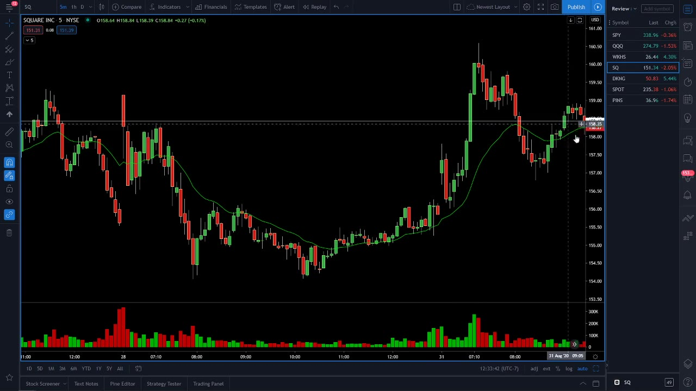

**图怎么看：**

- Square Inc. (SQ) 在纽约证券交易所上市，当前股价为 $151.34，上涨了 2.05%。
- 日线图显示了 SQ 的价格走势，包括开盘价、最高价、最低价和收盘价。
- 成交量柱的高度反映对应周期内的总成交量；红绿着色通常跟随价格柱的涨跌规则，不能直接拆成两种方向的主动成交。
- 在日线图上，可以看到 SQ 的价格在近期经历了上升趋势，成交量柱状图也显示出相应的买卖活动变化。

### 关键内容

- 市场近期波动较大，分析关键指数以确定方向。
- SPY和Triple Q是高成交量资产，受算法控制，较难交易。
- WKHS在8月31日突破关键支撑位1810，形成突破。
- SQ形成杯柄形态，突破关键阻力位15860，通过多次测试确认突破。
- DKNG形成重大突破，目标价50美元，但因情绪波动未能坚持。
- Pins形成突破，目标价3742美元，交易过程中出现熊陷阱，最终亏损552美元。
- UAL上进行一分钟成交量交易，成功避免损失并获利，目标价为$42-$44，风险回报比为1:20。
- 使用一分钟成交量中的大成交量点作为止损，成功通过回调并获利。
- 及时止损避免更大损失，最终获利$350。
- 通常不买回拉，除非错过突破点，否则更倾向于买突破。
- 通过分析旗形形态，预测未来几周SPY和Triple Q将突破横向整理区间，需关注成交量变化。
- WKHS在8月31日突破1810支撑位后，多次回调测试，表明市场信心增强，突破有效。
- SQ形成杯柄形态，突破15860阻力位，需关注后续成交量放大，确认突破有效性。
- DKNG形成重大突破，目标价50美元，但因情绪波动未能坚持，说明情绪管理对交易至关重要。
- Pins形成突破，目标价3742美元，交易过程中出现熊陷阱，需警惕市场反转风险，及时止损

### 分析与执行顺序

1. 分析市场波动较大的关键指数，如SPY和Triple Q。
2. 关注WKHS和SQ的关键支撑位和阻力位突破情况。
3. 使用技术分析确认突破，设置止损确保风险可控。
4. 在UAL上进行一分钟成交量交易，设定目标价和风险回报比。
5. 利用大成交量点作为止损，通过回调获利。
6. 及时止损避免更大损失，确保交易安全。
7. 总结经验教训，避免情绪波动影响决策。

### 案例与细节

- WKHS在8月31日突破关键支撑位1810，形成突破。
- SQ形成杯柄形态，突破关键阻力位15860，通过多次测试确认突破。
- DKNG形成重大突破，目标价50美元，但因情绪波动未能坚持。
- Pins形成突破，目标价3742美元，交易过程中出现熊陷阱，最终亏损552美元。
- UAL一分钟成交量交易中，目标价设为$42-$44，风险回报比为1:20，通过大成交量点设置止损，成功避免损失并获利。
- DKNG交易中，因过早退出，错过目标价50美元的收益，说明耐心等待突破信号的重要性。
- Pins交易中，出现熊陷阱导致亏损552美元，需注意市场回调风险，及时调整止损策略

### 风险与边界

- 低成交量股票容易被市场波动影响。
- 技术分析需结合市场情绪和实际交易情况。
- 过早退出可能导致错过更大收益机会。
- 录制于2020年，平台、监管、税务和经纪商条件只能表述为历史录制内容。
- 低成交量股票容易受到市场情绪影响，波动较大，需谨慎操作。
- 技术分析需结合市场情绪，避免仅依赖图表做出决策，以免误判市场趋势。
- 过早退出交易可能导致错过更大收益机会，需平衡风险与收益。
- 录制于2020年，当时市场环境和交易规则与现在不同，需谨慎参考历史数据

### 复盘问题

- 分析市场波动较大的关键指数时，需要注意哪些因素？
- 如何通过技术分析确认突破并设置止损？
- 在UAL上进行一分钟成交量交易时，是如何设定目标价和风险回报比的？
- 交易过程中遇到熊陷阱时，应该如何调整策略以避免进一步损失？

---

## v0655：大型股 swing 交易策略

> 日期：2020-09-30　·　时长：01:04:17

**本场重点：** Arsh 分析了近期大型股 swing 交易策略，强调了风险管理的重要性。

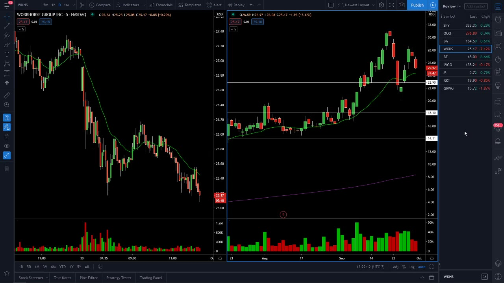

**图怎么看：**

- 在 Workhorse Group Inc. 的交易图表中，可以看到价格在不同时间段内的波动情况。
- 图表显示了该股票的价格走势，包括开盘价、最高价、最低价和收盘价。
- 成交量柱的高度反映对应周期内的总成交量；红绿着色通常跟随价格柱的涨跌规则，不能直接拆成两种方向的主动成交。
- 水平线和趋势线用于分析价格的趋势和支撑阻力位。

### 关键内容

- SPY 短期回调，市场整体回撤，但 swing 交易仍有机会。
- BA 股票的短空尝试失败，反映了情绪管理的重要性。
- 调整风险水平以减少亏损，从 300 下降到 200。
- LVGO 的突破尝试失败，可能因市场缺乏支持。
- GRWG 的潜在突破机会，目标价为 20。
- 调整心态，继续寻找盈利机会。
- 避免在亏损后强行交易，保持策略一致性。
- 使用五分钟图表来确定止损点。
- 保持积极心态，即使遇到挫折也要继续前进。
- 避免在盘后交易，除非有重要新闻。
- BA 股票的短空尝试失败，表明情绪管理对交易成功至关重要。当市场反弹时，应立即平仓止损。
- LVGO 的突破尝试失败，说明在低成交量股票上进行突破交易时需谨慎，因为缺乏市场支持可能导致失败。
- GRWG 形成横向整理区间，表明在突破前需仔细分析支撑位和阻力位，以提高交易成功的概率。
- 调整风险水平，从 300 下降到 200，可以减少单次交易的亏损，但需要确保有足够的资金支持。
- 保持积极心态，即使遇到挫折也要继续前进，这有助于长期维持交易纪律和信心

### 分析与执行顺序

1. 分析 SPY 的短期回调，指出市场整体回撤。
2. 分享 BA 股票的短空尝试，强调情绪管理。
3. 讨论 LVGO 的突破尝试失败，分析市场支持不足。
4. 介绍 GRWG 的潜在突破机会，设定目标价。
5. 分享调整风险水平的经验，从 300 下降到 200。
6. 强调保持积极心态的重要性，继续寻找盈利机会。
7. 提醒避免在亏损后强行交易，保持策略一致性。

### 案例与细节

- BA 股票的短空尝试，初始风险为 300，最终亏损 1000。
- LVGO 的突破尝试失败，市场缺乏支持。
- GRWG 形成了横向整理区间，目标价为 20。
- 调整风险水平，从 300 下降到 200，减少亏损。
- 使用五分钟图表来确定止损点，确保交易安全。
- BA 股票的短空尝试，初始风险为 300，最终亏损 1000，表明情绪管理不当会导致重大损失。
- LVGO 的突破尝试失败，市场缺乏支持，说明在低成交量股票上进行突破交易时需谨慎，否则容易失败。
- GRWG 形成了横向整理区间，目标价为 20，表明在突破前需仔细分析支撑位和阻力位，以提高交易成功的概率。
- 调整风险水平，从 300 下降到 200，减少亏损，但需要确保有足够的资金支持，否则可能面临流动性风险。
- 使用五分钟图表来确定止损点，确保交易安全，例如 BA 股票的短空尝试，初始风险为 300，最终亏损 1000，表明情绪管理不当会导致重大损失。

### 风险与边界

- 市场情绪波动可能导致交易决策失误。
- 过度依赖情绪可能导致交易策略失效。
- 市场环境变化可能影响交易结果。
- 录制于 2020 年，当前市场环境可能有所不同。
- 市场情绪波动可能导致交易决策失误，特别是在情绪高涨时进行交易，容易导致冲动决策。
- 过度依赖情绪可能导致交易策略失效，特别是在市场出现大幅波动时，情绪波动可能会影响判断力。
- 市场环境变化可能影响交易结果，特别是在市场趋势发生变化时，原有的交易策略可能不再适用。
- 录制于 2020 年，当前市场环境可能有所不同，特别是在经济政策、技术进步等因素发生变化时，原有策略可能不再有效。

### 复盘问题

- 如何在市场回撤时保持积极心态？
- 在亏损后如何避免强行交易？
- 如何使用五分钟图表来确定止损点？

---

## v0656：大型股市场中的摆动交易策略

> 日期：2020-10-28　·　时长：01:09:13

**本场重点：** Arsh 分享了近期的摆动交易机会，强调了当前市场的不确定性以及选举对市场的影响。

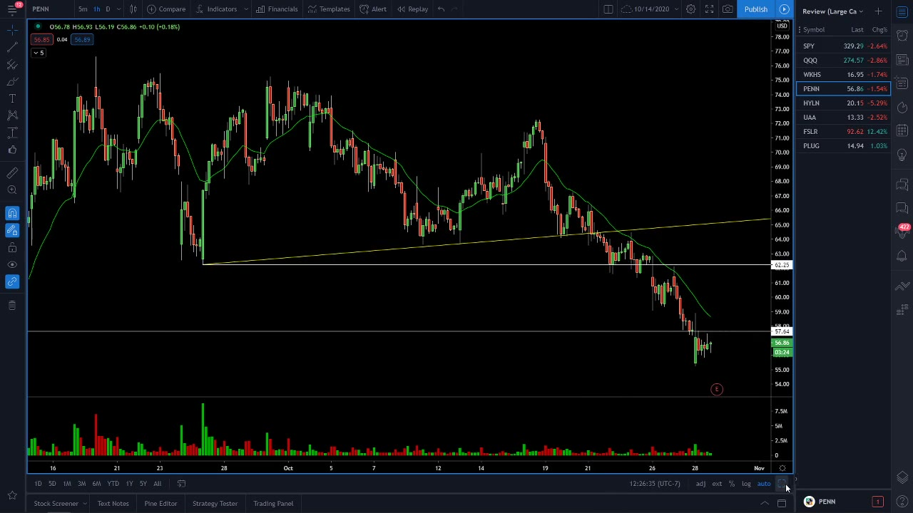

**图怎么看：**

- Penn (PENN) 的股价在过去几周内经历了明显的波动，显示出市场的不确定性。
- 当前的股价水平表明投资者可能需要谨慎对待该股票的投资。
- Penn (PENN) 的日线图显示了其股价在最近几周内的波动情况。
- 投资者可以关注Penn (PENN) 的日线图来评估其投资价值。

### 关键内容

- Arsh 主要讨论了近期的摆动交易机会，特别是 WKHS 和 PENN 的股票。
- 他指出市场目前处于停滞状态，主要原因是选举临近。
- Arsh 认为近期的摆动交易机会较少，主要是因为市场不确定性和选举影响。
- 他分享了 WKHS 的技术走势，包括突破后的下跌趋势。
- PENN 的走势显示了潜在的回调机会，但需要进一步确认。
- Arsh 强调了使用技术分析来确定摆动交易目标的重要性。
- 他提到了使用范围扩展来预测未来价格的可能性。
- Arsh 讨论了使用保证金进行摆动交易的风险和好处。
- 他分享了如何识别摆动交易的关键突破点和回调点的方法。
- Arsh 提醒学员们注意市场波动性增加的风险，特别是在选举期间

### 分析与执行顺序

1. Arsh 首先介绍了近期的摆动交易机会，特别是 WKHS 和 PENN 的股票。
2. 他解释了市场目前处于停滞状态的原因，主要是选举临近。
3. Arsh 分析了 WKHS 的技术走势，包括突破后的下跌趋势。
4. 他讨论了 PENN 的走势，包括潜在的回调机会，但需要进一步确认。
5. Arsh 强调了使用技术分析来确定摆动交易目标的重要性。
6. 他分享了如何识别摆动交易的关键突破点和回调点的方法。
7. 最后，Arsh 提醒学员们注意市场波动性增加的风险，特别是在选举期间

### 案例与细节

- WKHS 在突破 2290 后进入显著的下跌趋势。
- PENN 在 65 美元附近显示出潜在的回调机会。
- Arsh 使用技术分析来确定摆动交易的目标，例如使用范围扩展来预测未来价格。
- Arsh 分享了如何识别摆动交易的关键突破点和回调点的方法，例如三次测试关键水平。
- Arsh 提到使用保证金进行摆动交易的风险和好处，例如在达到止损时退出交易。

### 风险与边界

- 市场波动性增加的风险，特别是在选举期间。
- 使用保证金进行摆动交易可能会导致更大的风险，特别是在市场下跌时。
- 市场可能在选举后出现更大的反转，这可能会影响摆动交易的机会。
- 录制于 2020 年，当时的市场状况和监管规则可能已发生变化。

### 复盘问题

- Arsh 分享了哪些具体的摆动交易机会？
- 他如何使用技术分析来确定摆动交易的目标？
- 他提到了哪些关键突破点和回调点？
- 他如何处理市场波动性增加的风险？
- 他分享了哪些关于使用保证金进行摆动交易的风险和好处？

---

## v0657：成功交易者的自我要求

> 日期：2020-12-23　·　时长：01:00:07

**本场重点：** 成功交易需要承诺、纪律和自我反省。2020年12月23日15点02分03秒。

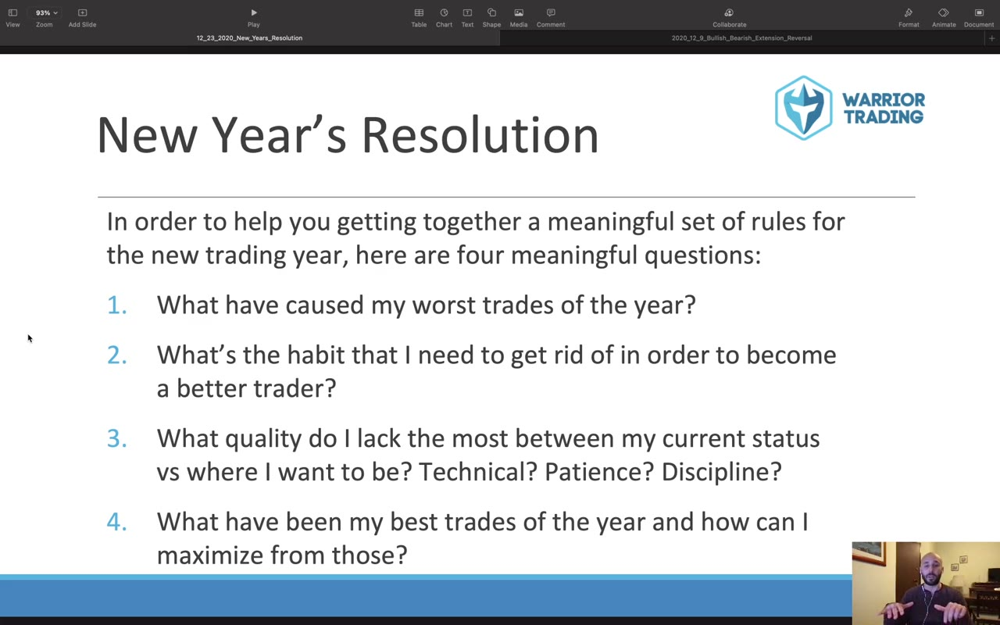

**图怎么看：**

- 这张幻灯片提供了关于成功交易者自我要求的信息。
- 幻灯片上列出了四个问题，帮助交易者反思自己的交易行为。
- 这些问题包括：最差交易的原因、需要改变的习惯、缺乏的品质以及最好的交易。
- 通过回答这些问题，交易者可以制定出适合自己的新年计划，提升交易水平。

### 关键内容

- 承诺和纪律是成功交易的基础。
- 自我反省是不断进步的关键。
- 成功不是一夜之间实现的，而是长期努力的结果。
- 交易者应根据自己的优势和劣势制定策略。
- 新年的开始是一个重新规划的机会。
- 成功交易者应不断学习和改进。
- 交易者不应盲目跟随他人，而应坚持自己的风格。
- 成功交易需要面对失败并从中学习。
- 交易者应设定明确的目标并为之努力

### 分析与执行顺序

1. 讲师首先介绍了承诺和纪律的重要性。
2. 然后引用了多个成功交易者的名言来强调这些观点。
3. 接着讨论了如何通过自我反省来不断进步。
4. 最后提出了新年的交易目标设定。
5. 讲师还分享了如何通过自我反省来发现自己的优势和劣势。
6. 讲师强调了成功交易者应不断学习和改进的重要性。
7. 讲师鼓励交易者设定明确的目标并为之努力

### 案例与细节

- 讲师提到自己在交易中从快速决策转向更慢的决策过程，认识到这不是他的强项。
- 讲师分享了如何通过自我反省来发现自己的弱点，并调整交易策略。
- 讲师提到自己在交易中遇到的问题是如何处理亏损，并分享了如何通过自我反省来克服这个问题。
- 讲师分享了如何通过自我反省来发现自己的优势，并利用这些优势来制定交易策略。

### 风险与边界

- 录制于2020年，市场环境和交易规则可能已发生变化。
- 讲师提到的某些工具和技术可能不再适用或已更新。
- 交易者应根据当前市场情况和自身情况进行调整。
- 成功交易需要长期的努力和持续的学习，这可能不适合短期投资者

### 复盘问题

- 交易者如何根据自己的优势和劣势制定交易策略？
- 如何通过自我反省来发现自己的弱点并改进交易方法？
- 成功交易者应如何设定明确的目标并为之努力？

---

## v0658：从最长绿色波段学到的四件事

> 日期：2020　·　时长：01:08:04

**本场重点：** 1. 长期绿色波段有助于提升自信，但也会增加过度自信的风险；2. 最好的结果不一定在长期；3. 不要将利润追求作为交易市场的唯一目标。

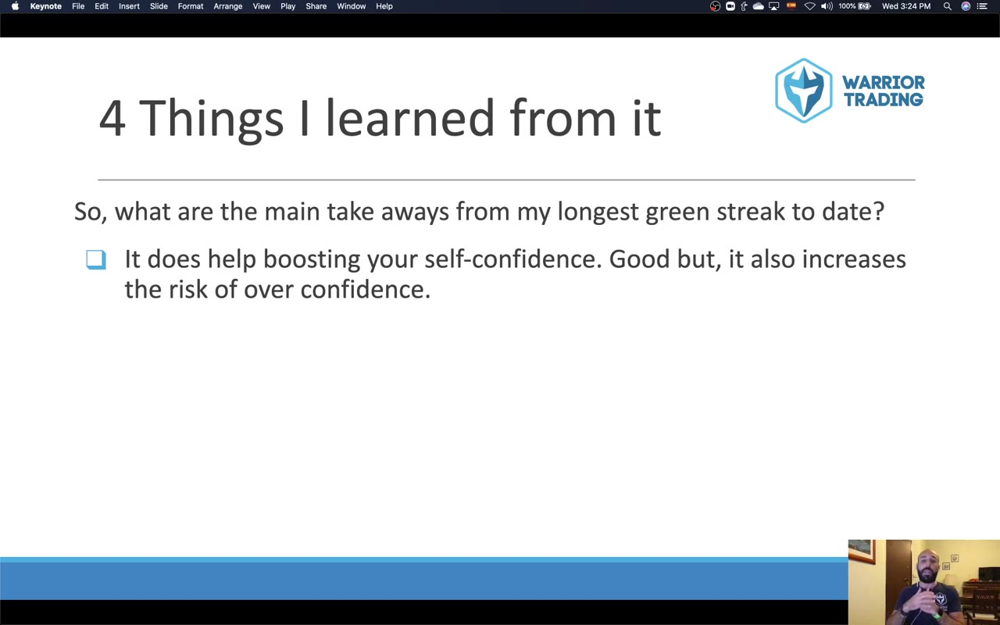

**图怎么看：**

- 图中显示了Twitter Inc (TWTR) 在2020年9月23日至2020年9月24日期间的日线图。
- 股价在2020年9月23日开盘价为44.80美元，最高点达到45.00美元。
- 在2020年9月24日，股价开盘价为44.10美元，最低点为43.83美元。
- 成交量方面，2020年9月23日的成交量为1,834万份，2020年9月24日的成交量为0份。

### 关键内容

- 讲师分享了自己最长绿色波段的具体天数和收益情况。
- 绿色波段有助于提升交易者的自信心，但也可能带来过度自信的风险。
- 虽然绿色波段表明策略有效，但并不意味着最佳结果一定在长期。
- 在绿色波段期间，交易者可能会因为想要保持绿色而做出不理智的决策。
- 绿色波段不应成为停止进化或停止改进策略的理由。
- 追求利润不是交易市场的唯一目标，应该关注交易过程。
- 交易者应调整自己的交易策略，以提高盈利比。
- 使用Fibonacci工具进行交易可以提高风险回报比。
- 交易者应关注自己的交易过程，而不是仅仅关注利润。
- 交易者应保持对市场变化的敏感度，不断调整自己的交易策略

### 分析与执行顺序

1. 讲师回顾了自己的最长绿色波段，从7月23日到9月9日。
2. 讲师分析了绿色波段期间的交易数据，包括胜率和亏损情况。
3. 讲师讨论了如何通过调整交易策略来提高盈利比。
4. 讲师展示了如何使用Fibonacci工具进行交易，以提高风险回报比。
5. 讲师强调了交易过程中保持冷静的重要性，避免因过度自信而做出错误决策

### 案例与细节

- 在最长绿色波段期间，交易者每天平均盈利378美元，但平均亏损达到576美元。
- 交易者在绿色波段期间，为了保持绿色而过早地关闭了盈利交易。
- 交易者意识到需要调整自己的交易策略，以提高盈利比。
- 交易者使用Fibonacci工具进行交易，以确定止损和目标价格。
- 交易者分享了自己在Twitter上的交易记录，展示如何使用Fibonacci工具进行交易

### 风险与边界

- 录制于2020年，当时的市场环境和交易规则可能已发生变化。
- 交易者在绿色波段期间可能会因为过度自信而做出错误决策。
- 交易者应谨慎调整自己的交易策略，避免过度依赖单一指标。
- 交易者应持续关注市场变化，避免因市场波动而做出错误决策

### 复盘问题

- 交易者在绿色波段期间采取了哪些措施来提高盈利比？
- 交易者如何平衡自信心和过度自信之间的关系？
- 交易者在调整交易策略时遇到了哪些挑战？

---

## v0659：Trading View 使用技巧

> 日期：2020　·　时长：00:53:30

**本场重点：** 重点讲解如何自定义 Trading View 界面以适应个人交易策略，强调布局和工具使用的重要性。

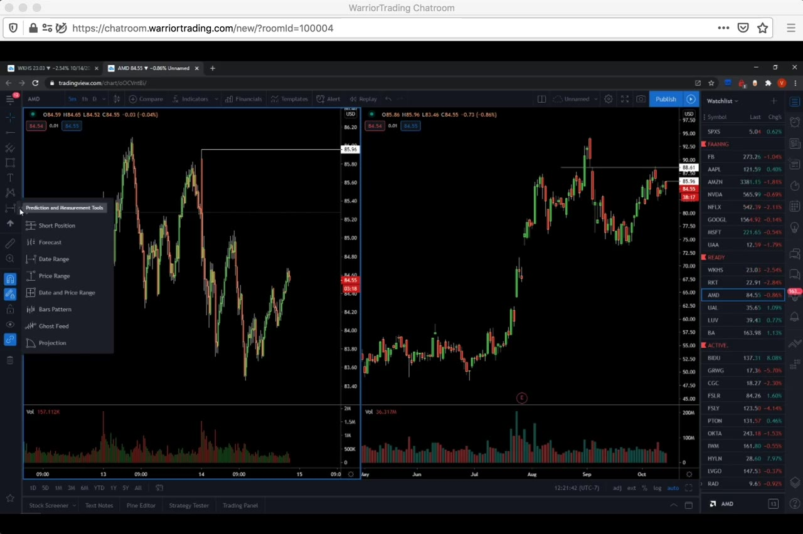

**图怎么看：**

- 这张图片显示了AMD股票的价格走势图，包括开盘价、收盘价、最高价和最低价。
- 可以看到股价在不同时间段内的波动情况，以及成交量的变化。
- 通过观察这些数据，投资者可以分析市场趋势并做出相应的交易决策。
- 此外，右侧的表格列出了其他股票的最新价格和涨跌幅度，供参考。

### 关键内容

- 讲师展示了如何从默认布局开始，逐步调整图表布局，包括移动体积图、更改背景颜色等。
- 介绍了如何使用 Trading View 的各种工具，如绘制趋势线、使用价格范围工具等。
- 强调了自定义 Trading View 界面的重要性，以更好地进行技术分析。
- 讲解了如何使用 Trading View 的警报功能来监控股票价格变动。
- 介绍了如何使用 Trading View 的新闻和数据窗口来获取实时市场信息。
- 强调了使用 Trading View 进行技术分析时需要考虑的多种因素，如时间框架、图表类型等。
- 讲解了如何使用 Trading View 的订单面板进行直接交易，但指出并非所有用户都适用。
- 强调了自定义 Trading View 界面时需要注意的细节，如避免过度拥挤和保持清晰。
- 介绍了如何使用 Trading View 的扩展小时功能查看非常规交易时段的数据。
- 强调了 Trading View 的直观性和易用性，以及支持团队的帮助功能。

### 分析与执行顺序

1. 讲师首先介绍了如何从默认布局开始，逐步调整图表布局。
2. 然后展示了如何使用 Trading View 的各种工具，如绘制趋势线、使用价格范围工具等。
3. 接着讲解了如何使用 Trading View 的警报功能来监控股票价格变动。
4. 最后介绍了如何使用 Trading View 的订单面板进行直接交易，但指出并非所有用户都适用。
5. 在整个过程中，讲师强调了自定义 Trading View 界面的重要性，以更好地进行技术分析。

### 案例与细节

- 讲师展示了如何将体积图从主图表移出，以便更清晰地查看价格走势。
- 使用 Trading View 的价格范围工具来测量价格波动，帮助确定买卖点。
- 设置警报功能，当股票价格达到特定水平时，自动发送通知。
- 使用 Trading View 的新闻和数据窗口来获取实时市场信息，如新闻头条和经济日历。
- 通过 Trading View 的订单面板直接下单，但指出 Lightspeed 无法连接。

### 风险与边界

- 由于录制于 2020 年，部分功能和界面可能已发生变化。
- 使用 Trading View 的警报功能时，需要确保不会错过重要交易机会。
- 使用 Trading View 的订单面板进行直接交易时，需要确保了解所有相关费用和限制。

### 复盘问题

- 如何根据个人交易策略自定义 Trading View 界面？
- 在使用 Trading View 的警报功能时，有哪些注意事项？
- 如何利用 Trading View 的扩展小时功能来查看非常规交易时段的数据？

---

## v0660：反转策略：熊市延伸反转

> 日期：2020　·　时长：01:05:26

**本场重点：** 介绍一种新的反转策略，通过识别支撑水平和极端价格波动来捕捉市场反转机会。

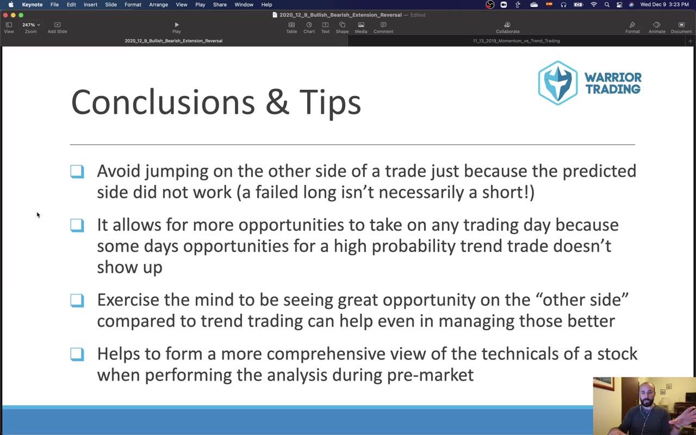

**图怎么看：**

- 特斯拉（TSLA）的每日蜡烛图显示了价格在支撑水平附近的反弹。
- 支撑水平附近的价格反弹表明市场可能正在尝试恢复。
- 这种反弹可能是趋势反转的信号，投资者可以考虑进一步分析。
- 请注意，这只是一个图表上的观察，实际市场行为需要更深入的技术分析。

### 关键内容

- 识别支撑水平，通常在过去的10到15个会话中，使用10分钟或更高时间框架。
- 寻找支撑水平的方式，如支撑点和趋势线。
- 研究日线图和周线图，确认股票处于上升趋势。
- 至少需要两个连续的红色蜡烛，显示价格大幅下跌。
- 在确认支撑水平后，设置限价买入订单。
- 止损设在支撑水平下方，目标是至少2:1的回报率。
- 此策略适用于熊市延伸反转，即价格大幅下跌后反弹。
- 此策略适用于快速决策，有时需要迅速行动以抓住机会

### 分析与执行顺序

1. 识别支撑水平，通常在过去的10到15个会话中。
2. 研究日线图和周线图，确认股票处于上升趋势。
3. 寻找至少两个连续的红色蜡烛，显示价格大幅下跌。
4. 在确认支撑水平后，设置限价买入订单。
5. 止损设在支撑水平下方，目标是至少2:1的回报率。
6. 监控市场，等待价格突破支撑水平并反弹

### 案例与细节

- GME：在GME上，当价格从支撑水平大幅下跌后，出现两个连续的红色蜡烛，随后反弹。
- AMD：在AMD上，当价格从阻力水平大幅下跌后，出现两个连续的红色蜡烛，随后反弹。
- NIO：在NIO上，当价格从支撑水平大幅下跌后，出现两个连续的红色蜡烛，随后反弹。
- 特斯拉：在特斯拉上，当价格从支撑水平大幅下跌后，出现两个连续的红色蜡烛，随后反弹。
- JKS：在JKS上，当价格从支撑水平大幅下跌后，出现两个连续的红色蜡烛，随后反弹

### 风险与边界

- 此策略依赖于快速决策，有时可能错过最佳时机。
- 止损设在支撑水平下方，如果支撑水平未能保持，可能会导致亏损。
- 此策略适用于熊市延伸反转，不适用于持续上升趋势。
- 此策略基于过去的数据，未来市场情况可能有所不同

### 复盘问题

- 如何识别支撑水平？
- 如何判断价格是否已经形成反转？
- 如何设置止损和目标价格？
- 此策略适用于哪些类型的股票？
- 如何根据市场情况调整策略？

---

## v0661：小盘股策略与平台切换

> 日期：2020　·　时长：01:09:55

**本场重点：** 1. 小盘股策略测试与平台切换带来的挑战；2. 自我挑战与失败后的反思；3. 平台选择与费用问题。

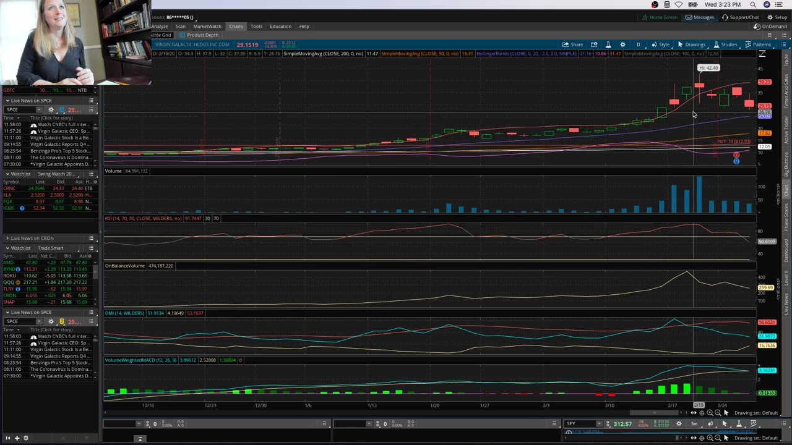

**图怎么看：**

- 图表显示了Virgin Galactic Holdings Inc.的股票价格走势，包括红色和绿色的K线图。
- 图表上还显示了简单的移动平均线（SimpleMovingAvg）和布林带（Bollinger Bands），用于分析股票的价格波动。
- 成交量柱状图显示了不同时间段的交易活动。
- 实时新闻和市场数据在图表下方提供，帮助投资者了解市场动态。

### 关键内容

- Celena在TD Ameritrade进行了小账户挑战，但遇到了平台切换和技术问题。
- 她使用了CMAG平台进行交易，但发现费用较高，影响了交易策略的选择。
- 她经历了自我的挑战，包括失败后的反思和调整策略。
- 她分享了如何应对市场波动和选择合适的股票进行交易。
- 她强调了自我信任的重要性，并表示会继续改进自己的交易策略。
- 她提到使用RSI和MACD等技术指标来辅助决策。
- 她分享了如何处理自动清算账户的问题。
- 她讨论了选择TD Ameritrade作为主要交易平台的原因。
- 她提到了如何根据市场情况选择合适的股票进行交易。

### 分析与执行顺序

1. Celena回顾了她在TD Ameritrade进行的小账户挑战，但遇到了平台切换和技术问题。
2. 她分享了如何应对市场波动和选择合适的股票进行交易，包括使用RSI和MACD等技术指标。
3. 她提到了如何处理自动清算账户的问题，以及如何选择合适的交易平台。
4. 她分享了如何根据市场情况选择合适的股票进行交易，包括SpaceX等热门股票。
5. 她强调了自我信任的重要性，并表示会继续改进自己的交易策略。

### 案例与细节

- 她提到使用RSI和MACD等技术指标来辅助决策，例如在SpaceX股票上进行交易。
- 她分享了如何处理自动清算账户的问题，例如在CMAG平台上遇到的自动清算。
- 她提到了如何根据市场情况选择合适的股票进行交易，例如SpaceX和Tesla等热门股票。
- 她分享了如何应对市场波动和选择合适的股票进行交易，例如在SpaceX股票上的表现。
- 她提到了如何使用RSI和MACD等技术指标来辅助决策，例如在SpaceX股票上的表现。

### 风险与边界

- 平台切换可能会导致交易延迟和费用增加，影响交易策略的选择。
- 市场波动可能导致自动清算账户，影响资金管理。
- 使用RSI和MACD等技术指标需要持续学习和实践，否则可能无法准确判断市场走势。
- 录制年代限制为2020年，当时的市场环境和平台规则可能已发生变化。

### 复盘问题

- Celena在TD Ameritrade进行的小账户挑战中遇到了哪些具体问题？
- 她是如何处理自动清算账户的问题的？
- 她提到了哪些技术指标来辅助决策？
- 她是如何根据市场情况选择合适的股票进行交易的？

---

## v0662：交易计划的重要性

> 日期：2020　·　时长：01:09:58

**本场重点：** 交易计划是成功的必要条件，不仅在交易中，在生活中也是如此。交易计划需要详细规划并严格执行。

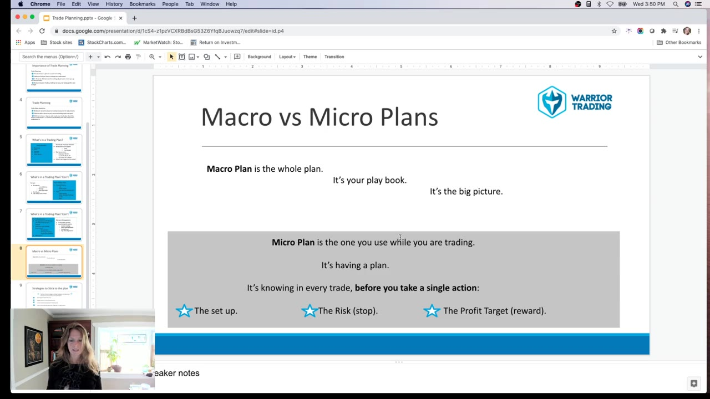

**图怎么看：**

- 这张幻灯片详细介绍了交易计划中的关键组成部分，包括设置、风险管理、规模等。
- 通过明确列出这些要素，可以确保交易者在执行交易时有明确的目标和策略。
- 这有助于提高交易的成功率，并且在生活中的决策制定中也有重要应用。
- 交易计划不仅是交易过程中的指导方针，也是个人财务管理的重要工具。

### 关键内容

- 交易计划是成功的必要条件，不仅在交易中，在生活中也是如此。缺乏交易计划会导致冲动交易、无法管理风险、无法识别盈利机会等问题。
- 交易计划的内容包括股票选择标准、技术分析、设置触发点、规定交易参数、交易设置、风险管理和利润目标、交易规模、行为管理。
- 交易计划的操作步骤包括列出股票选择标准、确认技术分析结果、列出交易设置、规定风险和利润目标、规定交易规模、制定行为管理策略。
- 交易计划的执行包括每天进行预交易检查、定期检查情绪状态、设定交易限制、设定行为管理措施。
- 交易计划的调整包括每周评估交易计划、根据结果调整交易计划。
- 交易计划的实例包括使用Eric作为例子，选择低ATR和高浮筹的股票，规定触发点、风险和利润目标、交易规模。
- 记录交易计划有助于避免业务漏洞，保持良好的商业记录。
- 调整交易计划应该是单次的，而不是全面的。
- 分享交易计划有助于提高透明度和理解。
- 使用模板有助于制定交易计划，包括技术分析、风险管理等。
- 交易计划需要详细规划并严格执行，因为它能够帮助交易者管理风险、识别盈利机会并保持冷静。
- 制定交易计划时，必须考虑行为管理，因为情绪波动会严重影响交易决策，而合理的情绪管理策略可以帮助交易者保持冷静。
- 交易计划中的风险管理和利润目标设定至关重要，因为它们确保了交易的可持续性和盈利能力。
- 交易计划的执行需要定期检查和调整，以适应市场的变化，这有助于提高交易效率和长期盈利。
- 交易计划的制定需要基于充分的数据和分析，这有助于提高预测市场的准确性，从而减少盲目交易的风险

### 分析与执行顺序

1. 列出股票选择标准，包括浮动规模、价格、催化剂、成交量等。
2. 确认技术分析结果，包括支撑位、阻力位、趋势线等。
3. 列出交易设置，如突破、回调等。
4. 规定风险和利润目标，确保交易具有明确的目标。
5. 规定交易规模，基于质量进行决策。
6. 制定行为管理策略，包括情绪管理、大盈亏应对策略等。
7. 在每天开始前进行预交易检查，包括睡眠质量、饮食情况等。
8. 在交易过程中定期检查情绪状态，确保情绪稳定。
9. 设定交易限制，如每日交易次数。
10. 设定行为管理措施，如恐惧管理、疲劳管理等。

### 案例与细节

- 使用Eric作为例子，选择低ATR和高浮筹的股票。
- 规定触发点，如预市场高点。
- 规定风险和利润目标，如相对强弱指数55以上。
- 规定交易规模，如全尺寸或分批进入。
- 使用Warrior提供的多种模板来制定交易计划，包括技术分析、风险管理等。
- 使用Eric作为例子，选择低ATR和高浮筹的股票，规定触发点（例如，预市场高点），并在相对强弱指数达到55以上时设定风险和利润目标。
- 在交易过程中，定期检查情绪状态，例如，当市场波动加剧时，保持冷静并继续执行交易计划中的行为管理策略，如恐惧管理、疲劳管理等。
- 设定交易限制，如每日交易次数，以防止过度交易，同时确保交易计划的执行不会受到情绪波动的影响。
- 使用Warrior提供的多种模板来制定交易计划，包括技术分析（例如，支撑位、阻力位、趋势线等）和风险管理（例如，止损和止盈点）。
- 在交易前，使用多个时间框架来确认支持和阻力水平，例如，日线图和小时图，以提高决策的准确性，从而更好地执行交易计划

### 风险与边界

- 交易计划的调整需要根据实际情况进行，过度频繁的调整可能会影响交易策略的稳定性。
- 交易计划的执行需要严格遵守，否则可能导致冲动交易。
- 交易计划的制定需要基于充分的数据和分析，否则可能无法准确预测市场走势。
- 录制年代限制为2020年，平台、监管、税务和经纪商条件只能表述为历史录制内容。
- 过度频繁地调整交易计划可能导致交易策略的不稳定，从而影响交易效果。
- 执行交易计划时未能严格遵守可能导致冲动交易，进而增加亏损的风险。
- 交易计划的制定基于的历史数据可能不适用于当前市场环境，因此需要谨慎分析。
- 录制年代限制为2020年，平台、监管、税务和经纪商条件只能表述为历史录制内容，这可能会影响当前交易者的适用性

### 复盘问题

- 交易计划的具体内容有哪些？
- 如何确保交易计划的有效执行？
- 交易计划的调整应该遵循哪些原则？
- 如何利用交易计划进行风险管理？
- 交易计划的实例中有哪些关键要素？

---

## v0663：识别并退出假突破

> 日期：2020　·　时长：00:51:29

**本场重点：** 识别假突破需要警惕的信号，及时退出以避免损失。

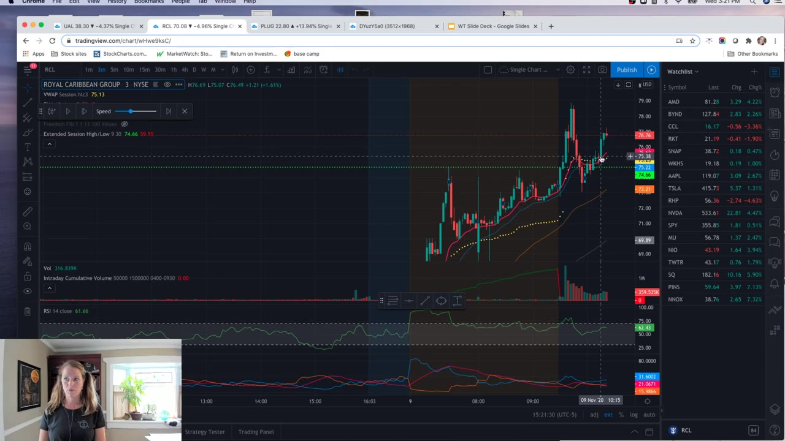

**图怎么看：**

- 画面中，可以看到一个股票价格图表，显示了多个周期（如1分钟、5分钟等）的价格走势。
- 图表上标有RSI指标，用于判断市场是否处于超买或超卖状态。
- 通过观察RSI值的变化，可以识别出市场的潜在趋势变化。
- 当RSI值接近顶部或底部时，可能表明市场即将反转，此时应考虑退出交易以避免损失。

### 关键内容

- 识别双顶形态是关键信号，表明股票可能不会突破。
- 注意成交量和RSI指标的变化，这些是判断突破真假的重要依据。
- 在市场快速变化中，及时调整策略至关重要。
- 结合多种技术指标，如自由线和趋势线，可以更准确地判断突破。
- 保持冷静，避免因市场波动而做出冲动决策。
- 了解市场新闻和特定事件对股票的影响，及时调整策略。
- 使用多个时间框架进行分析，确保决策的全面性。
- 识别假突破后，及时退出以避免不必要的损失。
- 结合讲师经验，识别假突破需要综合判断
- 观察RCL股票的RSI指标，发现双顶形态，表明股票可能不会突破，需谨慎识别。
- 结合自由线和趋势线，确认双顶形态的存在，有助于判断突破真假，避免被假突破误导。
- 注意成交量和RSI指标的变化，这些是判断突破真假的重要依据，尤其是早市成交量异常高时。
- 保持冷静，避免因市场波动而做出冲动决策，尤其是在识别假突破后，及时退出以避免不必要的损失。
- 结合多个时间框架进行分析，确保决策的全面性，如一小时、四小时等，提高判断的准确性

### 分析与执行顺序

1. 观察RCL股票的RSI指标，发现双顶形态。
2. 检查成交量，发现早市成交量异常高，提示可能假突破。
3. 查看自由线和趋势线，确认双顶形态的存在。
4. 结合其他技术指标，如VWAP，进一步确认假突破。
5. 在市场快速变化中，及时调整策略，避免被假突破误导。
6. 保持冷静，避免因市场波动而做出冲动决策。
7. 利用多个时间框架进行分析，确保决策的全面性。
8. 识别假突破后，及时退出以避免不必要的损失

### 案例与细节

- ticker：RCL；price：78；volume：异常高；RSI：双顶；behavior：早市高开，随后回落；indicator：自由线和趋势线
- ticker：UAL；price：940；volume：正常；RSI：双顶；behavior：早市高开，随后回落；indicator：自由线和趋势线
- ticker：Revlon；price：62；volume：正常；RSI：上升；behavior：早市高开，随后回落；indicator：自由线和趋势线
- ticker：RCL；price：78；volume：异常高；RSI：双顶；行为：早市高开，随后回落；指标：自由线和趋势线，显示双顶形态，确认假突破。
- ticker：UAL；price：940；volume：正常；RSI：双顶；行为：早市高开，随后回落；指标：自由线和趋势线，显示双顶形态，确认假突破。
- ticker：Revlon；price：62；volume：正常；RSI：上升；行为：早市高开，随后回落；指标：自由线和趋势线，显示上升趋势，但结合RSI双顶形态，确认假突破

### 风险与边界

- 假突破可能导致资金损失，需谨慎识别。
- 市场快速变化时，及时调整策略至关重要。
- 依赖单一指标识别假突破存在风险。
- 录制年代限制，部分指标和方法可能不再适用
- 依赖单一指标识别假突破存在风险，如仅依赖RSI指标，可能会忽略其他重要信号。
- 市场快速变化时，及时调整策略至关重要，否则可能会被假突破误导，导致资金损失。
- 录制年代限制，部分指标和方法可能不再适用，如某些自由线和趋势线的具体应用方式可能已改变。
- 心理误区在于过度依赖市场情绪和短期波动，忽视长期趋势和技术指标，容易误判突破真假

### 复盘问题

- 如何识别并区分真正的突破和假突破？
- 在识别假突破后，应采取哪些措施来保护资金？
- 如何结合多种技术指标来提高判断的准确性？

---

## v0664：交易策略与心理建设

> 日期：2020　·　时长：00:43:07

**本场重点：** 交易需要纪律和计划，避免盲目跟风，保持自我分析能力。

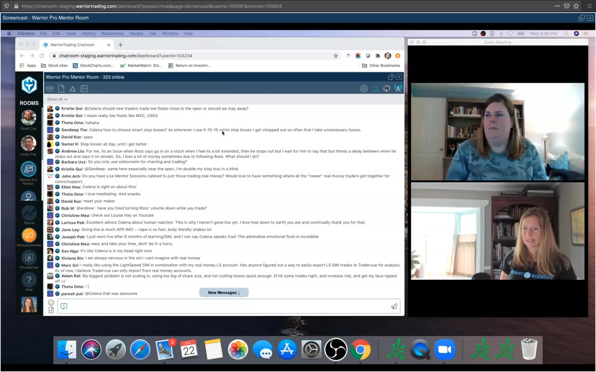

**图怎么看：**

- 在B选项中，可以看到一个聊天室界面，显示了多个用户之间的交流。用户们讨论了关于交易策略、心理建设以及如何应对市场波动等问题。
- 聊天室中的对话内容涉及到了交易者如何制定交易计划、如何管理情绪、以及如何在市场波动中保持冷静。
- 这些讨论对于理解交易策略与心理建设的重要性非常有帮助，因为它们强调了交易者需要具备的心理素质和决策过程。
- 通过观察聊天室中的互动，可以了解到交易者在实际操作中可能会遇到的问题和挑战，从而更好地准备自己面对市场的不确定性。

### 关键内容

- 交易成功的关键在于纪律和计划，而非单纯依赖技术分析。
- 交易者需要制定明确的交易计划，并在实践中不断调整。
- 避免盲目跟随他人操作，培养独立思考的能力。
- 交易者应关注市场动态，如成交量和价格变化，以做出更准确的判断。
- 交易过程中需要控制情绪，避免因情绪波动而做出错误决策。
- 交易者应设定每日目标，严格遵守，以保持交易纪律。
- 交易者应根据自己的交易风格选择合适的交易平台和工具。
- 交易者需要了解市场规则，如保证金和交易费用等。
- 交易者应关注市场波动，避免盲目追涨杀跌。
- 交易者应定期回顾自己的交易记录，总结经验教训。

### 分析与执行顺序

1. 讲师首先强调了交易纪律的重要性，指出成功的关键在于纪律和计划。
2. 接着，讲师分享了自己在交易过程中的经验，强调了制定明确交易计划的重要性。
3. 讲师还提到了交易过程中需要控制情绪，避免因情绪波动而做出错误决策。
4. 讲师建议交易者设定每日目标，并严格遵守，以保持交易纪律。
5. 最后，讲师提醒交易者要关注市场动态，如成交量和价格变化，以做出更准确的判断。

### 案例与细节

- 讲师提到，如果交易者在Think or Swim平台上进行交易，需要注意平台的热键设置。
- 讲师建议交易者在交易前先进行模拟交易，以熟悉市场环境和操作流程。
- 讲师分享了一个交易者的经历，他因为情绪波动而做出了错误的交易决策。
- 讲师提到，如果交易者发现某个股票被大量做空，可以通过查看短仓浮动来确认。
- 讲师建议交易者在交易过程中保持冷静，避免因市场波动而做出冲动的交易决策。

### 风险与边界

- 交易者需要意识到，交易市场存在波动性，因此需要做好风险管理。
- 交易者需要了解不同交易平台的特点，选择最适合自己的平台。
- 交易者需要关注市场规则的变化，及时调整自己的交易策略。
- 交易者需要认识到，交易成功并非一蹴而就，需要长期积累经验。
- 交易者需要意识到，交易过程中可能会遇到各种技术问题，需要及时寻求帮助。

### 复盘问题

- 交易者在制定交易计划时，应该考虑哪些因素？
- 交易者在交易过程中如何控制情绪，避免因情绪波动而做出错误决策？
- 交易者在选择交易平台时，应该考虑哪些因素？
- 交易者在交易过程中遇到技术问题时，应该如何解决？
- 交易者在交易过程中如何评估自己的交易表现？

---

## v0665：如何管理大股票名单

> 日期：2020　·　时长：01:03:21

**本场重点：** 如何在市场波动时选择和管理股票名单，以提高交易成功率。

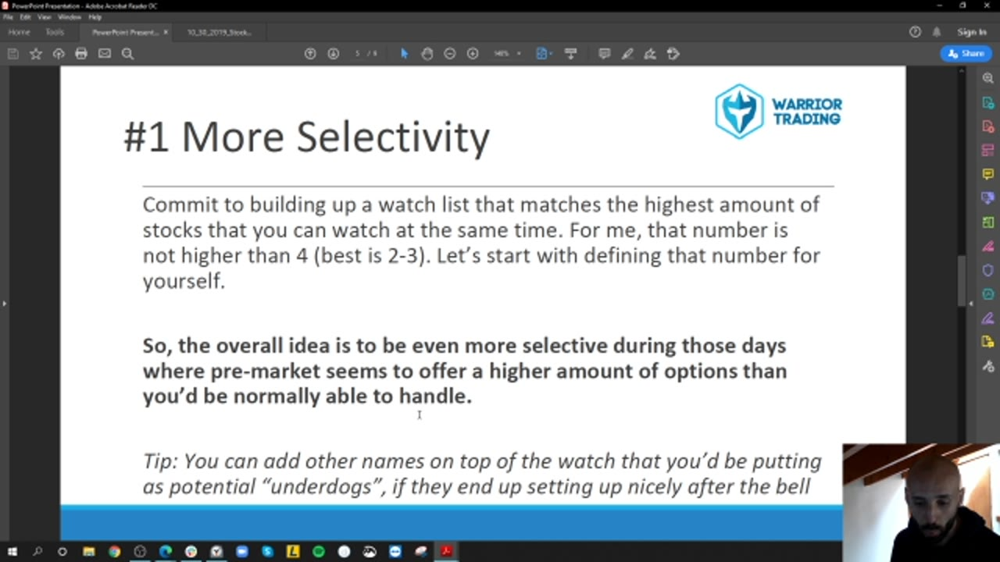

**图怎么看：**

- 在那些预市似乎提供更多选项的日子里，更严格地筛选股票。
- 建议将目标数量限制在4个以内（最好不超过3个）。
- 增加其他名字作为潜在“ underdogs” ，如果它们在收盘后表现良好。
- 使用时间来决定是否继续持有股票，而不是立即行动。

### 关键内容

- 讲师介绍了选择股票的八个标准，包括价格范围、成交量等。
- 在市场波动时，选择性更强，需要更多耐心和纪律。
- 使用计时器避免在同一股票上连续交易。
- 制定明确的交易规则，以指导交易决策。
- 保持对市场动态的关注，避免被单一股票的走势所束缚。
- 根据技术图表和数学概率分析进行交易决策。
- 使用Trading View布局来优化交易前的准备工作。
- 在市场波动时，保持积极的心态，专注于寻找高概率交易机会。
- 避免过度依赖单一股票的走势，保持开放心态。

### 分析与执行顺序

1. 讲师首先介绍了选择股票的八个标准，包括价格范围、成交量等。
2. 然后讲解了在市场波动时如何选择和管理股票名单的方法。
3. 接着介绍了使用计时器避免在同一股票上连续交易的方法。
4. 最后，讲师强调了制定明确的交易规则的重要性。
5. 讲师还分享了如何使用Trading View布局来优化交易前的准备工作。
6. 在整个过程中，讲师强调了保持积极心态和关注市场动态的重要性。
7. 讲师还提醒了在市场波动时选择性更强，需要更多耐心和纪律。

### 案例与细节

- 价格范围：股票价格应在15到400美元之间。
- 成交量：开盘前成交量应在50,000到1.5百万之间。
- 催化剂：有强劲且新鲜的验证催化剂。
- 预市模式：有良好的预市模式。
- 浮动：股票浮动应在60到400百万之间。
- 历史表现：回顾过去的大日子，分析股票的表现。

### 风险与边界

- 市场环境变化可能导致某些标准不再适用。
- 过度依赖单一股票可能导致错过其他高概率交易机会。
- 市场波动可能影响交易决策的准确性。
- 录制年代限制，某些市场规则和操作方式可能已发生变化。

### 复盘问题

- 如何在市场波动时选择和管理股票名单？
- 使用计时器避免在同一股票上连续交易的具体方法是什么？
- 制定明确的交易规则对交易决策有何帮助？
- 如何保持积极心态并专注于寻找高概率交易机会？

---

## v0666：如何把握交易时机

> 日期：2020　·　时长：01:00:58

**本场重点：** 把握交易时机的关键在于耐心、勇气和纪律。交易者需要在正确时机入场和出场。

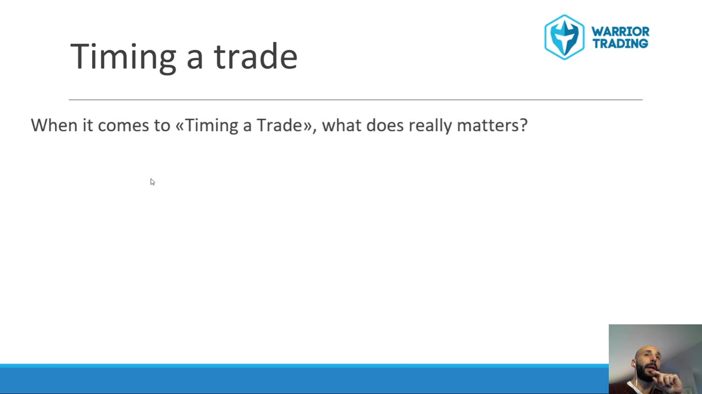

**图怎么看：**

- 整体界面简洁明了，适合教学。
- 可见信息：Timing a trade: What really matters?
- 画面信息对应本场主题与判断条件：讨论交易时机的重要性。
- 阅读边界：仅提供问题而非答案，需结合上下文理解。

### 关键内容

- Roberto 提到交易策略的第一阶段是等待正确的交易设置形成。
- 交易者需要耐心等待最佳交易机会。
- 一旦交易设置形成，交易者需要有勇气立即行动。
- 交易者还需要纪律，确保在错过最佳时机后不强行入场。
- 交易者需要尊重自己的交易计划，即使在盈利时也要遵守。
- 交易者需要理解完美交易点并不存在，重要的是把握最佳时机。
- 交易者需要通过不断学习和实践来提高自己的交易技能。
- 交易者需要保持自我意识，找到进入“流动状态”的方法。
- 交易者需要通过多种方式培养自我意识，如冥想、健康饮食等。
- 交易者需要理解交易是一个长期过程，需要持续努力和坚持

### 分析与执行顺序

1. 首先，交易者需要耐心等待正确的交易设置形成。
2. 当交易设置形成时，交易者需要有勇气立即行动。
3. 交易者需要纪律，确保在错过最佳时机后不强行入场。
4. 交易者需要尊重自己的交易计划，即使在盈利时也要遵守。
5. 交易者需要通过不断学习和实践来提高自己的交易技能。
6. 交易者需要保持自我意识，找到进入“流动状态”的方法。
7. 交易者需要通过多种方式培养自我意识，如冥想、健康饮食等。

### 案例与细节

- Roberto 提到他使用 13 EMA 拉回策略，在开盘后的 30 分钟内寻找最佳交易机会。
- 当关键突破发生在 9:42，而不是开盘时，Roberto 开始计算从这个实际点开始的 30 分钟。
- Roberto 使用趋势延续的 10 分钟和 13 EMA 拉回策略，寻找最佳交易机会。
- Roberto 强调完美交易点并不存在，重要的是把握最佳时机。
- Roberto 提到交易者需要通过不断学习和实践来提高自己的交易技能。

### 风险与边界

- 录制年代限制为 2020 年，交易环境和规则可能已发生变化。
- 交易者需要根据当前市场情况调整策略，避免盲目跟随。
- 交易者需要关注市场变化，及时调整交易计划。
- 交易者需要了解不同市场的特点，选择合适的交易策略。

### 复盘问题

- 你如何理解完美交易点并不存在？
- 你在交易过程中如何保持自我意识？
- 你如何确保在错过最佳时机后不强行入场？

---

## v0667：市场时间策略与信号解读

> 日期：2020　·　时长：02:14:12

**本场重点：** 本课程详细讲解了市场时间策略的应用，包括识别锁烛、市场信号和交易策略。重点在于如何利用时间周期和市场信号进行交易。

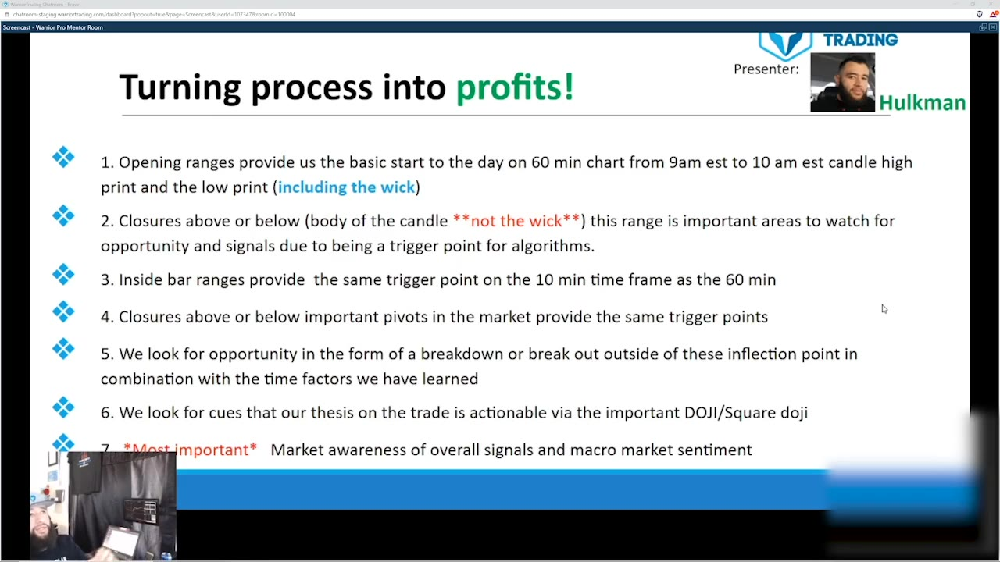

**图怎么看：**

- 1. Opening ranges provide us the basic start to the day on 60 min chart from 9am est to 10 am est candle high print and the low print (including the wick)
- 2. Closures above or below (body of the candle **not the wick**) this range is important areas to watch for opportunity and signals due to being a trigger point for algorithms.
- 3. Inside bar ranges provide the same trigger point on the 10 min time frame as the 60 min
- 4. Closures above or below important pivots in the market provide the same trigger points

### 关键内容

- 时间理论基于人类历史上的重要数字，如3和7，这些数字在不同文化和宗教中普遍存在，影响市场走势。
- 市场中的时间周期（如每日、每周）对价格走势有显著影响，特别是在关键时间点，如开盘时。
- 锁烛是指价格在一定范围内波动，不突破关键水平，了解锁烛和流动性可以帮助识别潜在的交易机会。
- 市场信号包括蜡烛形态（如十字星、矩形蜡烛）、价格范围和时间点，这些信号可以预测市场的下一步行动。
- 交易策略结合了蜡烛形态、市场流动性、时间因素等，例如在开盘价附近观察价格行为，可以预测市场走势。
- HULK策略中的三长策略和三短策略，通过内部烛线突破和第四根烛线的突破来确定交易时机。
- 市场对齐是确保交易符合市场趋势的关键，使用不同时间框架（如10分钟、60分钟）来分析市场趋势。
- 风险提示虽然这些策略可以提高交易成功率，但仍然存在风险，例如市场可能在预期之外的方向移动，导致交易失败。
- 锁烛现象通常出现在市场流动性较低的时段，如盘中交易量减少时，此时价格容易被锁定在狭窄区间内，不易突破，这为交易者提供了观察和决策的机会。
- 市场信号的有效性取决于市场当前的流动性状态，流动性越高，信号的可靠性越强；反之，流动性低时，信号可能失真，需谨慎解读。
- 使用不同时间框架进行交易时，需注意市场在特定时间点（如7, 10, 14, 21, 24分钟）的反应，这些时间点往往成为市场转折的关键节点，有助于识别趋势变化。
- 市场对齐是指交易策略需与市场整体趋势相匹配，例如在XLF、IWM、SPY等指数表现良好的情况下进行交易，可以提高成功率；反之则需谨慎。
- 时间理论中的重要数字（如3和7）不仅存在于历史数据中，也体现在现代市场中，这些数字的出现往往预示着市场的重要转折点，需密切关注。

### 分析与执行顺序

1. 首先，了解市场时间周期和重要数字的影响，如3和7。
2. 其次，识别锁烛和流动性，了解价格在一定范围内的波动情况。
3. 然后，分析蜡烛形态和价格范围，识别市场信号。
4. 接着，结合市场流动性、时间因素制定交易策略，例如在开盘价附近观察价格行为。
5. 最后，使用不同时间框架（如10分钟、60分钟）来分析市场趋势，确保交易符合市场趋势。

### 案例与细节

- IWM在某日表现出明显的锁烛行为，价格在一定范围内波动，不突破关键水平。
- 当市场在281附近波动时，可以识别出重要的市场信号，例如蜡烛形态和价格范围。
- HULK 3 Long策略包括内部烛线突破、突破上方重要区域、第四根烛线必须突破。
- HULK 3 Short策略包括内部烛线跌破重要区域、第四根烛线必须跌破。
- 例如，当市场在281附近波动时，可以识别出重要的市场信号，如蜡烛形态和价格范围，特别是当价格在开盘价附近形成十字星时，表明市场可能处于观望状态，后续走势难以预测。
- IWM在某日表现出明显的锁烛行为，价格在10分钟和60分钟图表上被锁定在一个狭窄区间内，直到突破关键水平，这为交易者提供了明确的入场信号。
- HULK 3 Long策略在IWM指数上得到了验证，当价格在开盘价附近形成矩形蜡烛形态，随后突破上方重要区域，第四根烛线成功突破，表明这是一个有效的交易机会。
- HULK 3 Short策略在XLF指数上同样有效，当价格在开盘价附近形成矩形蜡烛形态，随后跌破下方重要区域，第四根烛线成功跌破，表明这是一个有效的交易机会。
- 当市场在特定时间点（如7, 10, 14, 21, 24分钟）出现反转时，可以进行预测性交易，例如在开盘价附近观察价格行为，可以预测市场走势，但需注意市场可能在预期之外的方向移动，导致交易失败。

### 风险与边界

- 虽然这些策略可以提高交易成功率，但仍然存在风险，例如市场可能在预期之外的方向移动，导致交易失败。
- 市场可能在特定时间点出现反转，但需要谨慎，因为这可能导致交易失败。
- 市场在特定时间范围内波动，策略仍然有效，但在其他时间可能失效。
- 录制年代限制为2020年，平台、监管、税务和经纪商条件只能表述为历史录制内容。
- 市场在特定时间点出现反转时，如果交易者未能及时调整策略，可能会导致交易失败，特别是在流动性较低的时段，信号的可靠性降低。
- 使用不同时间框架进行交易时，如果市场在特定时间范围内波动，策略可能失效，特别是在夏季市场较慢时，交易者需谨慎判断市场趋势。
- 市场对齐策略依赖于市场整体趋势，如果市场趋势发生突然变化，即使使用正确的策略也可能导致交易失败，因此需持续监控市场动态。
- 锁烛现象在市场流动性较低时尤为明显，但如果交易者过度依赖这一现象，忽视其他市场信号，可能会错过更好的交易机会。

### 复盘问题

- 如何识别锁烛和流动性，以及它们对交易机会的影响？
- 蜡烛形态和价格范围如何帮助预测市场的下一步行动？
- HULK策略中的三长策略和三短策略是如何制定的？
- 如何结合市场流动性、时间因素制定交易策略？
- 在特定时间点进行预测性交易时需要注意哪些风险？

---

## v0668：初学者系统化交易策略

> 日期：2020　·　时长：01:02:15

**本场重点：** 初学者应注重系统化交易而非追求盈利，通过制定计划和规则来提高长期成功概率。

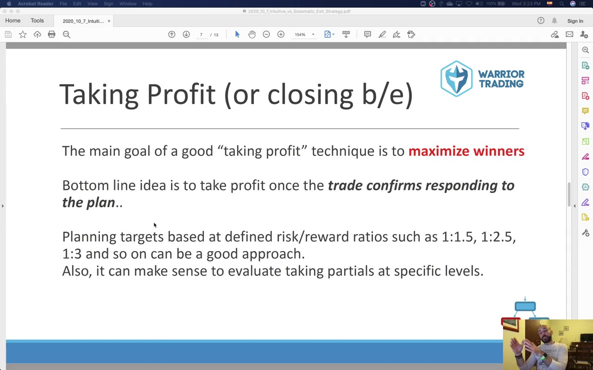

**图怎么看：**

- 幻灯片“Taking Profit (or closing b/e)”把良好止盈技术的主要目标写成“maximize winners”，重点是管理已经按计划发展的交易。
- 底层原则是等交易确认正在响应原计划后再止盈；这与因短期波动害怕而随意平仓不同，需要事先定义何为“确认”。
- 页面给出 1:1.5、1:2.5、1:3 等风险回报目标，也允许在特定价位分批止盈，说明退出可以是固定目标与部分减仓的组合。
- 风险回报倍数只是规划工具，不保证价格一定到达；若形态失效、流动性恶化或原始止损触发，不能为了等待目标而取消风险控制。

### 关键内容

- 初学者的目标不应是盈利，而是生存，这有助于长期成功。
- 系统化交易比直观交易更可靠，因为它基于规则而非感觉。
- 初学者应专注于自己的过程和基础设施建设，而非立即交易。
- 系统化交易可以提高交易的稳定性，但初期可能会显得无聊。
- 制定交易计划和规则可以帮助新手避免情绪化的交易行为。
- 交易计划应包括止损价格区域，以确保交易的合理性。
- 在交易过程中，应根据市场情况调整止损和止盈策略。
- 初学者应专注于一种技术，直到找到自己的优势。
- 使用Trade Station和Trading View可以提高交易体验和效率。
- 初学者应测试多种交易策略，直到找到最适合自己的方法

### 分析与执行顺序

1. 讲师首先介绍了初学者的主要目标是生存，而不是盈利。
2. 接着讨论了系统化交易的重要性，强调规则而非感觉。
3. 进一步解释了如何制定交易计划和规则，以避免情绪化的交易。
4. 举例说明了如何在交易中应用止损和止盈策略。
5. 最后建议初学者专注于一种技术，直到找到自己的优势。
6. 强调了使用Trade Station和Trading View的好处，以提高交易体验和效率。
7. 提醒初学者要持续测试多种交易策略，直到找到最适合自己的方法

### 案例与细节

- 讲师提到，如果采用直观交易，初学者很可能会亏钱，因为缺乏市场知识。
- 举例说明了如何在交易中使用止损和止盈策略，如在突破后卖出。
- 讲师分享了一个具体的交易案例，展示了如何在市场中应用止损和止盈策略。
- 讲师提到，如果市场走势与预期相反，应立即停止交易以避免更大损失。
- 讲师展示了如何使用Trade Station和Trading View进行交易，提高了交易体验和效率。
- 讲师分享了一个初学者如何通过专注于一种技术来提高交易稳定性的案例

### 风险与边界

- 录制于2020年，部分交易规则和市场环境可能已发生变化。
- 使用Trade Station和Trading View的具体操作可能需要适应当前版本的变化。
- 初学者应谨慎选择交易策略，避免盲目跟风。
- 交易市场波动较大，初学者应保持冷静，避免情绪化交易。
- 交易策略的有效性会随市场变化而变化，初学者应持续测试和调整策略

### 复盘问题

- 初学者应该如何制定交易计划和规则？
- 如何在交易过程中避免情绪化的交易行为？
- 初学者应该专注于哪种交易技术？
- 使用Trade Station和Trading View有哪些好处？
- 初学者应该如何测试和选择交易策略？

---

## v0669：技术指标的简化应用

> 日期：2020　·　时长：01:03:44

**本场重点：** 1. 简化技术指标的应用可以提高交易效率。2. 每个交易者需要根据自己的交易风格选择合适的指标。3. 不要盲目复制他人的交易布局。

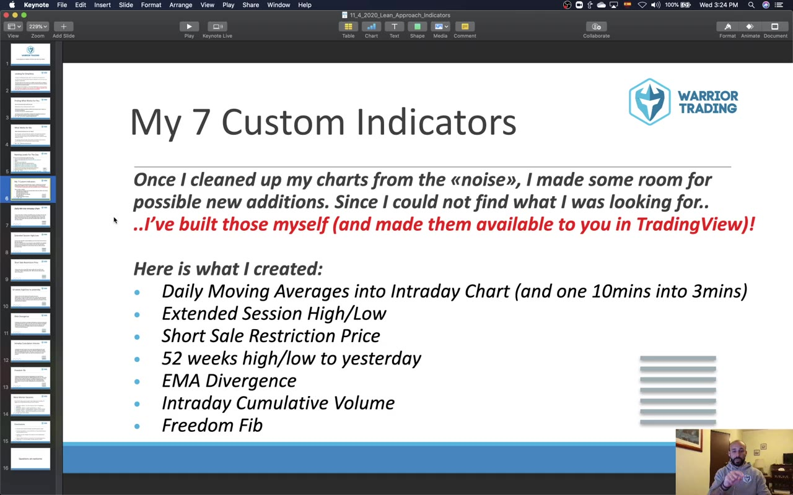

**图怎么看：**

- 这张幻灯片详细介绍了作者创建的七个自定义指标，包括每日移动平均值、延长交易时段高/低点、短期卖空限制价格、52周高/低点到昨天、EMA分歧、日内累计成交量和自由斐波那契。
- 这些指标被整合进交易软件中，帮助交易者更好地分析市场趋势。
- 通过这些自定义指标，交易者可以更精确地识别市场信号，从而提高交易效率。
- 每个交易者应根据自己的交易风格选择合适的指标，而不是盲目复制他人的布局。

### 关键内容

- 讲师通过测试发现RSI等指标并不适用于自己的交易策略。
- 简化技术指标的应用可以减少决策过程中的复杂性。
- 每个交易者需要根据自己的交易风格选择合适的指标。
- 使用13 EMA指标可以帮助识别价格趋势。
- 使用扩展会话高低价指标可以帮助识别市场情绪。
- 使用52周高低价指标可以帮助识别长期趋势。
- 使用EMA分歧指标可以帮助识别价格反转。
- 使用自由斐波那契指标可以帮助识别价格回撤区域。
- 使用日内累积成交量指标可以帮助识别市场活跃度。

### 分析与执行顺序

1. 讲师首先介绍了自己在交易中的技术指标使用情况。
2. 然后详细解释了每个指标的作用及其在交易中的应用。
3. 接着展示了如何使用这些指标来识别价格趋势和回撤区域。
4. 最后，讲师强调了每个交易者需要根据自己的交易风格选择合适的指标。
5. 讲师还分享了如何使用这些指标来简化交易决策过程。

### 案例与细节

- 讲师使用13 EMA指标来识别价格趋势。
- 使用扩展会话高低价指标来识别市场情绪。
- 使用52周高低价指标来识别长期趋势。
- 使用EMA分歧指标来识别价格反转。
- 使用自由斐波那契指标来识别价格回撤区域。
- 使用日内累积成交量指标来识别市场活跃度。

### 风险与边界

- 录制于2020年，部分指标可能已更新或不再适用。
- 使用的技术指标可能因市场变化而失效。
- 交易者需要根据当前市场情况进行调整。

### 复盘问题

- 如何使用13 EMA指标来识别价格趋势？
- 使用扩展会话高低价指标时需要注意哪些事项？
- 如何使用52周高低价指标来识别长期趋势？

---

## v0670：市场对齐和时间理论

> 日期：2020　·　时长：01:40:41

**本场重点：** 市场条件让每个人挣扎，但也是魔法发生的时刻；时间是决定交易成败的关键。

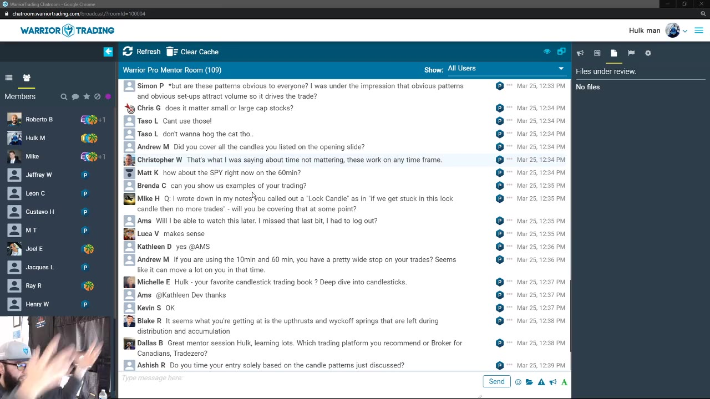

**图怎么看：**

- 市场条件让每个人挣扎，但也是魔法发生的时刻；时间是决定交易成败的关键。
- 通过分析蜡烛图和时间框架，可以更好地理解市场的动态。
- 在本图中，可以看到不同时间段内的价格波动和成交量变化。
- 这些图表有助于识别市场中的趋势和模式，从而做出更明智的交易决策。

### 关键内容

- 讲师引用布伦·布朗的话，强调交易中的挣扎和成功之间的关系。
- 市场条件让每个人挣扎，但这也是魔法发生的时刻，强调市场对齐的重要性。
- 市场流动性不是固定的，而是动态变化的，取决于交易量、交易时间和市场事件。
- 时间比价格更重要，尤其是在当前市场条件下，时间是决定交易成败的关键。
- 市场制作人和算法的主要目的是处理和填充订单，而不是针对交易者。
- 技术水平是市场的重要参考点，如整数价格（如50、100）附近容易出现大量订单。
- 通过蜡烛图可以预测订单的流动方向，例如，在特定时间点出现的蜡烛形态可能预示着后续的市场动作。
- 市场运作是一个封闭循环，有限的流动性决定了市场的波动性，市场参与者容易被操纵，特别是情绪化交易。
- 市场信号包括蜡烛形态、成交量等，这些信号可以帮助识别市场趋势和潜在的买卖机会。
- 通过时间管理，可以预测市场动作，例如，市场在特定时间点的反应和流动性变化。
- 市场流动性动态变化，取决于交易量、交易时间和市场事件，这直接影响订单的处理和填充。
- 时间是决定交易成败的关键，特别是在当前市场条件下，交易者需要学会利用时间周期来预测市场动作。
- 技术水平是市场的重要参考点，如整数价格（如50、100）附近容易出现大量订单，这有助于识别市场趋势和潜在的买卖机会。
- 蜡烛图的使用方法多样，通过特定时间点出现的蜡烛形态可以预测订单的流动方向和市场动作，例如，出现长阳线可能预示着上涨趋势。
- 市场运作是一个封闭循环，有限的流动性决定了市场的波动性，这可能导致市场操纵，尤其是情绪化交易容易被操纵。

### 分析与执行顺序

1. 讲师首先引用布伦·布朗的话，强调交易中的挣扎和成功之间的关系。
2. 接着，讲师解释了市场流动性的重要性，包括高流动性和低流动性市场的区别。
3. 然后，讲师强调了时间在交易中的重要性，指出时间是决定交易成败的关键。
4. 讲师进一步解释了市场制作人和算法的作用，以及它们如何影响订单的处理和填充。
5. 最后，讲师讨论了蜡烛图的使用方法，以及如何通过蜡烛图预测订单的流动方向和市场动作。

### 案例与细节

- 强阳线和强阴线没有影线，十字星和方十字星在特定情况下出现。
- 市场在开盘和收盘时的流动性较高，这影响了订单的处理和填充。
- 整数价格（如50、100）附近容易出现大量订单，这是技术水平的一个重要参考点。
- 在特定时间点出现的蜡烛形态可能预示着后续的市场动作，例如，出现长阳线可能预示着上涨趋势。
- 在开盘和收盘时，市场流动性较高，这使得订单更容易被处理和填充，因此交易者应关注这些时间段进行操作。
- 整数价格（如50、100）附近容易出现大量订单，这表明市场参与者倾向于在这些价位进行买卖，因此这些价位可以作为重要的技术参考点。
- 在特定时间点出现的蜡烛形态，如长阳线和长阴线，可能预示着后续的市场动作，例如，长阳线可能预示着上涨趋势，而长阴线可能预示着下跌趋势。

### 风险与边界

- 市场条件不断变化，讲师的观点可能不再适用于当前市场环境。
- 市场信号的有效性依赖于市场条件的变化，需要持续关注。
- 市场运作是一个封闭循环，有限的流动性决定了市场的波动性，这可能导致市场操纵。
- 讲师的观点基于历史录制内容，当前的监管、税务和经纪商条件可能有所不同。
- 市场条件不断变化，讲师的观点可能不再适用于当前市场环境，交易者需要持续关注市场变化。
- 市场信号的有效性依赖于市场条件的变化，交易者需要根据当前市场情况进行调整，不能盲目依赖历史数据。
- 市场运作是一个封闭循环，有限的流动性决定了市场的波动性，这可能导致市场操纵，尤其是情绪化交易容易被操纵。

### 复盘问题

- 讲师引用布伦·布朗的话，强调了交易中的挣扎和成功之间的关系，这对交易者有何启示？
- 市场流动性如何影响交易的进入和退出？
- 时间在交易中的重要性体现在哪些方面？
- 蜡烛图的使用方法有哪些？如何通过蜡烛图预测订单的流动方向和市场动作？

---

## v0671：市场意识和时间理论

> 日期：2020　·　时长：02:18:27

**本场重点：** 讲师强调了市场对齐的重要性，以及如何利用闭合蜡烛和时间窗口来识别市场信号。

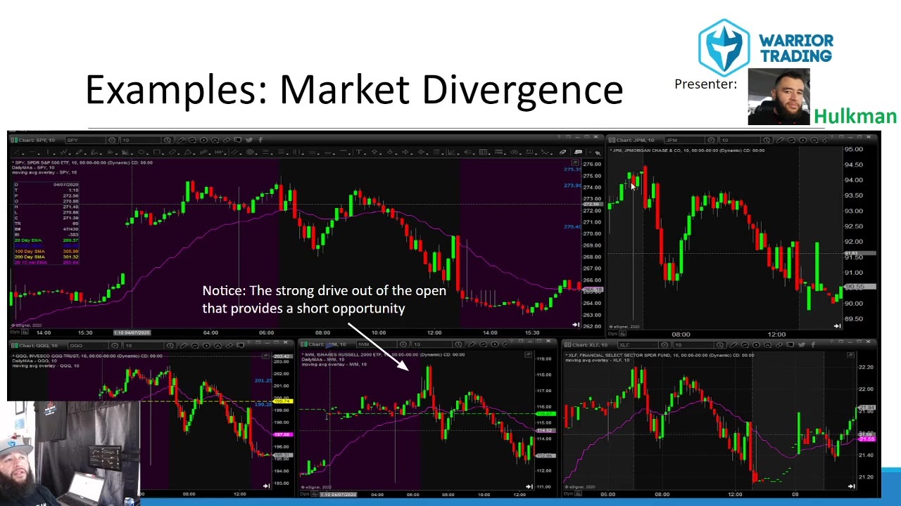

**图怎么看：**

- 画面中，讲师强调了市场对齐的重要性，并通过蜡烛图展示了一个典型的市场对齐情况。
- 画面中的蜡烛图显示了多个时间段内的价格波动，其中一些蜡烛形成了一个明显的对齐模式。
- 讲师指出，这种对齐模式可以作为市场趋势变化的信号，帮助投资者做出决策。
- 此外，讲师还提到了时间窗口的概念，即在特定的时间范围内观察市场的行为，以识别潜在的买卖机会。

### 关键内容

- 讲师使用E-Mini (ES)、Russell 2000 (IWM)和NASDAQ 100 (QQQ)作为市场领先指标，强调市场对齐的重要性。
- 闭合蜡烛被视为主要信号，讲师通过实际交易展示了如何识别闭合蜡烛和市场反应。
- 时间是策略的关键组成部分，讲师强调了时间窗口的重要性，如10分钟、20分钟等。
- 确认信号需要时间上的确认，如在下一个小时内确认突破，以确保信号的有效性。
- 市场结构分析，如内部蜡烛形态，可以提供进入交易的机会，例如星巴克的内部蜡烛形态。
- 风险控制通过使用时间来设定止损点，确保在错误发生时能够快速退出。
- 市场意识是指对市场动态的敏感度，包括识别市场趋势和信号，如市场缺口和市场预兆。
- 隐藏打印是算法预设的目标区域，通常出现在锤子形态中，如275.51是一个隐藏打印。
- 市场分歧可以通过图表中的蜡烛形态来识别，如SPY的9点蜡烛和10点蜡烛之间的范围。

### 分析与执行顺序

1. 讲师首先介绍了市场对齐的重要性，包括E-Mini、SPY、IWM等的协同运动。
2. 通过实际交易展示如何识别闭合蜡烛和市场反应，确定最佳入场点。
3. 强调确认信号需要时间上的确认，如在下一个小时内确认突破，以确保信号的有效性。
4. 分析市场结构，如内部蜡烛形态，提供进入交易的机会，例如星巴克的内部蜡烛形态。
5. 使用时间窗口来设定止损点，确保在错误发生时能够快速退出，例如在星巴克的例子中，信号显示在25分钟后进入交易。

### 案例与细节

- 使用E-Mini (ES)作为市场领导者，跟踪S&P 500指数。
- 通过实际交易展示了如何识别闭合蜡烛和市场反应，例如在ES蜡烛闭合后，观察市场反应，确定最佳入场点。
- 确认信号需要时间上的确认，如在下一个小时内确认突破，以确保信号的有效性，例如IWM的信号在115.51附近形成支撑，随后确认闭合在11537。
- 分析市场结构，如内部蜡烛形态，提供进入交易的机会，例如星巴克的内部蜡烛形态显示价格在6996附近闭合，这是一个进入信号。
- 使用时间窗口来设定止损点，确保在错误发生时能够快速退出，例如在星巴克的例子中，信号显示在25分钟后进入交易，随后确认价格突破。

### 风险与边界

- 如果市场信号与预期不符，可能会导致交易失败，使用时间作为风险控制工具非常重要。
- 市场对齐的重要性在于提供宏观市场情绪和趋势变化的线索，但需要谨慎分析。
- 确认信号需要时间上的确认，如果确认时间过长，可能会错过最佳交易机会。
- 市场意识和时间理论的结合需要不断实践和经验积累，以提高交易成功率。

### 复盘问题

- 如何识别市场对齐并利用这一信息进行交易？
- 闭合蜡烛作为主要信号的重要性是什么？
- 如何使用时间窗口来设定止损点？
- 市场结构分析中的内部蜡烛形态如何帮助识别进入交易的机会？
- 如何通过市场信号和时间理论来提高交易成功率？

---

## v0672：近期IPO股票交易策略

> 日期：2020　·　时长：01:02:37

**本场重点：** 通过分析近期IPO股票的交易策略，了解如何利用日线、周线和月线图表进行交易，以及如何设置止损和止盈。

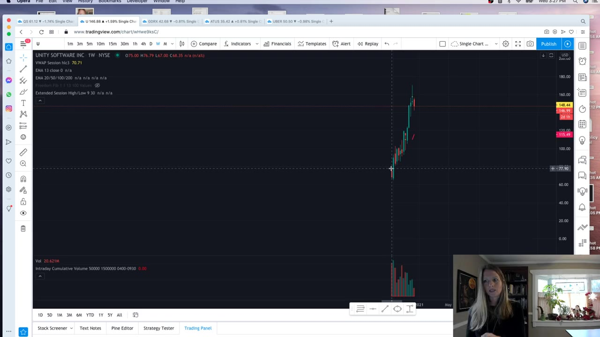

**图怎么看：**

- 在图中可以看到UNITY SOFTWARE INC的1周走势图，显示了价格波动情况。
- 图中还显示了EMA（简单移动平均线）和其他技术指标，帮助分析股票的趋势。
- 成交量柱状图显示了不同时间段的交易活动，有助于理解市场情绪。
- 整体来看，这张图提供了关于UNITY SOFTWARE INC近期交易策略的重要信息。

### 关键内容

- 讲师通过分析近期IPO股票，介绍了简单的交易策略，包括利用日线、周线和月线图表。
- 使用日线图时，关注蜡烛体和上影线，寻找突破点和回调机会。
- 通过分析多个IPO股票，发现一些股票表现良好，而另一些则表现不佳。
- 设置止损和止盈时，考虑风险回报比和股票的波动性。
- 讲师强调了风险管理和确认突破的重要性，避免过早入场。
- 通过分析不同IPO股票的图表，可以发现一些股票具有较大的波动性和潜力。
- 讲师指出，一些IPO股票需要更多时间来形成突破，因此需要耐心等待。
- 讲师分享了如何利用Think或Swim等交易平台设置警报，以便及时跟进交易机会。
- 讲师强调了保持交易策略简单的重要性，避免过于复杂的操作。
- 讲师提醒学员，IPO股票交易存在风险，需要谨慎对待

### 分析与执行顺序

1. 讲师首先介绍了近期IPO股票的基本概念和交易策略。
2. 然后，讲师通过分析多个IPO股票的图表，展示了如何识别突破点和回调机会。
3. 接着，讲师讲解了如何设置止损和止盈，以控制风险。
4. 最后，讲师分享了如何利用Think或Swim等交易平台设置警报，以便及时跟进交易机会。
5. 在整个过程中，讲师强调了保持交易策略简单的重要性，避免过于复杂的操作。
6. 讲师还提醒学员，IPO股票交易存在风险，需要谨慎对待

### 案例与细节

- GDRX在开盘后的蜡烛体和上影线形成了一个良好的突破点，适合进行日内交易。
- AI在开盘后的蜡烛体和上影线形成了一个良好的突破点，适合进行日内交易。
- BY&D在开盘后的蜡烛体和上影线形成了一个良好的突破点，但随后出现了回调。
- Tilray在开盘后的蜡烛体和上影线形成了一个良好的突破点，但随后出现了回调。
- Roku在开盘后的蜡烛体和上影线形成了一个良好的突破点，但随后出现了回调

### 风险与边界

- IPO股票交易存在较高的风险，需要谨慎对待。
- 一些IPO股票可能需要更多时间来形成突破，因此需要耐心等待。
- 交易IPO股票时，需要密切关注市场动态和公司新闻。
- 交易IPO股票时，需要设置合理的止损和止盈，以控制风险。
- 录制于2020年，部分信息可能已发生变化

### 复盘问题

- 如何通过分析蜡烛体和上影线来识别IPO股票的突破点？
- 如何设置止损和止盈以控制风险？
- 哪些IPO股票表现较好，哪些表现较差？
- 如何利用Think或Swim等交易平台设置警报？
- 如何保持交易策略简单，避免过于复杂的操作？

---

## v0673：预测股票波动性

> 日期：2020　·　时长：00:59:46

**本场重点：** 通过分析历史大波动日和实时图表来预测股票波动性，以提高交易成功率。

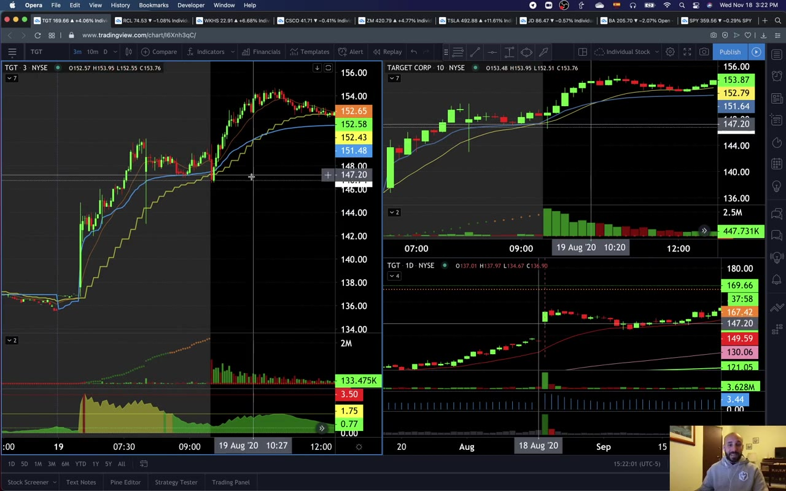

**图怎么看：**

- 在实时交易图表中，可以看到股价在不同时间段内的波动情况。
- 图表上显示了多个时间点的价格数据，帮助投资者了解市场的即时动态。
- 通过观察这些图表，可以预测股票的未来走势并做出相应的交易决策。
- 实时交易图表提供了直观的市场表现，有助于提高交易的成功率。

### 关键内容

- 使用ATR（平均真实范围）和过去的大波动日来预测股票波动性。
- 关注过去大波动日的日内图表表现，判断股票可能的走势。
- 寻找高相对成交量，确保后续行动有足够动力。
- 在预市期间进行股票筛选，确定潜在的高波动性股票。
- 利用技术指标如斐波那契回撤线和EMA背离来预测过度扩展的波动性。
- 通过分析历史数据和实时图表，提高对股票波动性的预测准确性。
- 保持合理的交易目标，避免过度依赖短期目标。
- 使用专业的图表软件进行交易分析，提高交易效率。
- 在重大新闻事件后，观察股票的即时反应，预测后续波动性。
- 结合历史表现和当前市场情绪，综合判断股票的波动性

### 分析与执行顺序

1. 回顾过去的大波动日，分析股票的表现。
2. 查看日内图表，判断股票的走势趋势。
3. 计算过去大波动日的范围，决定是否值得交易。
4. 寻找高相对成交量，确保后续行动有足够的动力。
5. 使用技术指标如斐波那契回撤线和EMA背离来预测过度扩展的波动性。
6. 在预市期间进行股票筛选，确定潜在的高波动性股票。
7. 结合历史表现和当前市场情绪，综合判断股票的波动性

### 案例与细节

- 在特斯拉（TSLA）和Zoom（ZM）的例子中，观察到大波动日后的日内图表表现。
- 分析目标（TGT）的过去大波动日，发现高相对成交量和趋势。
- 在皇家加勒比集团（RCL）的例子中，观察到新闻事件后的高波动性和持续成交量。
- 在Cisco系统（CSCO）的例子中，发现日内图表的快速波动和低成交量。
- 在BA（波音）的例子中，观察到大波动日后的快速上涨和随后的回调

### 风险与边界

- 依赖单一技术指标可能导致误判，需结合多种方法。
- 市场情绪变化可能导致预测偏差，需灵活调整策略。
- 录制年代限制，部分信息可能不再适用当前市场环境。
- 过度依赖短期目标可能导致频繁交易，增加风险。
- 技术指标失效时，需及时调整策略，避免盲目跟随

### 复盘问题

- 如何通过分析历史大波动日来预测股票的未来波动性？
- 在预市期间筛选股票时，应重点关注哪些指标？
- 如何利用技术指标如斐波那契回撤线和EMA背离来预测过度扩展的波动性？
- 在重大新闻事件后，如何观察股票的即时反应来预测后续波动性？
- 结合历史表现和当前市场情绪，如何综合判断股票的波动性？

---

## v0674：感恩交易社区

> 日期：2020　·　时长：00:56:05

**本场重点：** 分享个人经历，表达对交易社区的感激之情；强调社区支持的重要性；指出感恩的心态对个人成长的意义。

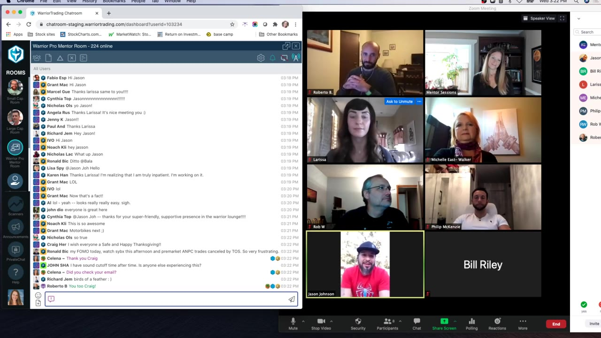

**图怎么看：**

- 画面是Zoom式多人会议：右侧排列多位参与者视频，左侧保留交易社区聊天窗口，可见成员持续发送问题和回应。
- 它没有突出单一图表，而是把讲师、成员和聊天交流放在同一屏幕，信息重点是参与、反馈和共同讨论的过程。
- 这与“感恩交易社区”的主题一致：社区价值来自经验分享、互相支持和对困难的公开讨论，而不是某个孤立的交易信号。
- 社区意见不能替代个人验证和风险责任；聊天中的共识也可能受情绪影响，任何策略仍需回到自己的计划和数据。

### 关键内容

- Larissa加入交易社区后，生活发生了巨大变化，感谢哥哥Joseph的引荐。
- 通过交易，Larissa学会了耐心，认识到生活中许多看似负面的经历其实都是成长的机会。
- 交易社区帮助Larissa更好地理解自己，成为更好的人。
- Jason分享了自己在交易社区的成长经历，感谢妻子的支持。
- Michelle感谢社区的帮助，分享了自己从金融顾问转型为交易者的经历。
- Phil感谢社区提供的各种资源和支持，强调找到自己的交易风格的重要性。
- Rob分享了自己在交易社区的成长经历，感谢Selena的邀请。
- Roberto分享了自己在交易社区的成长经历，强调感恩的心态对个人成长的重要性。
- Larissa感谢自己在交易社区的表现，强调了交易社区对个人成长的影响。
- Jason感谢社区提供的支持，分享了自己在交易社区的成长经历。
- Rob分享了自己在交易社区的成长经历，强调了感恩的心态对个人成长的重要性。

### 分析与执行顺序

1. Larissa分享个人经历，表达对交易社区的感激之情。
2. Jason分享了自己在交易社区的成长经历，感谢妻子的支持。
3. Michelle分享了自己从金融顾问转型为交易者的经历，感谢社区的帮助。
4. Phil分享了自己在交易社区的成长经历，强调找到自己的交易风格的重要性。
5. Rob分享了自己在交易社区的成长经历，感谢Selena的邀请。
6. Roberto分享了自己在交易社区的成长经历，强调感恩的心态对个人成长的重要性。
7. Larissa感谢自己在交易社区的表现，强调了交易社区对个人成长的影响。
8. Jason感谢社区提供的支持，分享了自己在交易社区的成长经历。
9. Rob分享了自己在交易社区的成长经历，强调了感恩的心态对个人成长的重要性

### 案例与细节

- Larissa提到她加入了交易社区后，生活发生了巨大变化，感谢哥哥Joseph的引荐。
- Jason提到他加入了交易社区后，生活发生了巨大变化，感谢妻子的支持。
- Michelle提到她从金融顾问转型为交易者，感谢社区的帮助。
- Phil提到他加入了交易社区后，生活发生了巨大变化，感谢妻子的支持。
- Rob提到他加入了交易社区后，生活发生了巨大变化，感谢妻子的支持。
- Roberto提到他加入了交易社区后，生活发生了巨大变化，感谢妻子的支持

### 风险与边界

- 录制于2020年，部分信息可能已发生变化。
- 交易市场环境不断变化，需关注市场动态。
- 交易策略和个人经验会随时间变化，需持续学习。
- 交易社区的具体规则和要求可能会有所调整

### 复盘问题

- Larissa分享了哪些个人经历？
- Jason分享了哪些个人经历？
- Michelle分享了哪些个人经历？
- Phil分享了哪些个人经历？
- Rob分享了哪些个人经历？

---

## v0675：高级交易问答

> 日期：2020　·　时长：01:04:51

**本场重点：** 讲师回答了关于交易策略、风险管理及平台使用的问题，强调了快速交易的风险和谨慎操作的重要性。

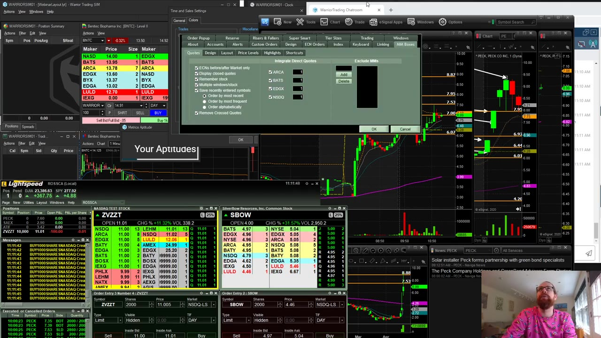

**图怎么看：**

- 画面中，可以看到一个复杂的交易界面，包括多个窗口展示不同的股票信息和图表。这些窗口显示了实时的市场数据、订单流、图表分析等。
- 画面中的Level 2窗口展示了股票的买卖盘信息，帮助交易者了解当前市场的供需情况。
- Time & Sales窗口提供了详细的成交记录，帮助交易者分析市场动态和交易行为。
- 图表窗口显示了不同周期的K线图，帮助交易者识别趋势和模式。

### 关键内容

- 讲师提到使用Thinker Swim Speed平台时需要谨慎，因为无法像其他平台那样快速交易。
- 交易过程中，讲师会根据市场情况调整仓位大小，以控制风险。
- 使用Level Two图表来确定最佳入场点，但有时会出现微小的价格波动。
- 交易时，讲师会设置止损，以防止亏损过大。
- 使用TC-2000平台进行交易，通过两次输入确保数据准确。
- 交易时，讲师会关注市场动态，如股票价格的波动和市场情绪。
- 交易过程中，讲师会利用技术指标，如VWAP和RSI来辅助决策。
- 交易时，讲师会根据市场情况灵活调整交易策略，以适应不同的市场环境。
- 交易过程中，讲师会记录每次交易的数据，以便后续分析和改进。
- 交易时，讲师会关注市场流动性，避免在低成交量时进行大额交易

### 分析与执行顺序

1. 讲师首先介绍了交易策略，包括如何选择股票和入场时机。
2. 然后，讲师详细解释了如何使用Level Two图表来确定最佳入场点。
3. 接着，讲师讨论了如何设置止损，以控制潜在的损失。
4. 随后，讲师展示了如何使用TC-2000平台进行交易，确保数据输入准确。
5. 最后，讲师分享了如何根据市场情况灵活调整交易策略，以适应不同的市场环境。

### 案例与细节

- 讲师提到，当股票价格突破预设高点时，他会迅速下单，但有时会遇到微小的价格波动。
- 在一次交易中，股票价格从240美元下跌，讲师及时止损，避免了更大的损失。
- 讲师使用TC-2000平台进行交易，通过两次输入确保数据准确，避免因一次输入错误导致的损失。
- 在一次交易中，股票价格在预设的VWAP水平附近波动，讲师据此调整了交易策略。
- 讲师分享了一次交易经历，当时股票价格在预设的RSI指标显示超买时，他及时退出，避免了更大的损失

### 风险与边界

- 使用Thinker Swim Speed平台时，由于其速度限制，可能导致错过最佳交易机会。
- 快速交易时，可能会遇到滑点，导致实际成交价格与预期不符。
- 交易过程中，如果市场突然出现大幅波动，可能会导致亏损增加。
- 使用Level Two图表时，有时会出现微小的价格波动，这可能会影响交易决策。
- 交易时，如果市场流动性不足，可能会导致交易困难，影响交易效率

### 复盘问题

- 讲师提到的交易策略是如何制定的？
- 在交易过程中，如何确保数据输入的准确性？
- 如何根据市场情况灵活调整交易策略？
- 在交易过程中，如何有效管理风险？
- 使用Level Two图表时，如何识别最佳入场点？

---
