# Intermediate Mentor Sessions：2021

> 14 场，合计 13.5 小时。返回 [Intermediate Mentor Sessions 目录](../README.md)。

## v0676：股票筛选与交易计划

> 日期：2021-01-06　·　时长：01:06:35

**本场重点：** 股票筛选过程需要严格遵守三个原则：可管理性、可靠性和重复性。这些原则适用于任何交易策略。

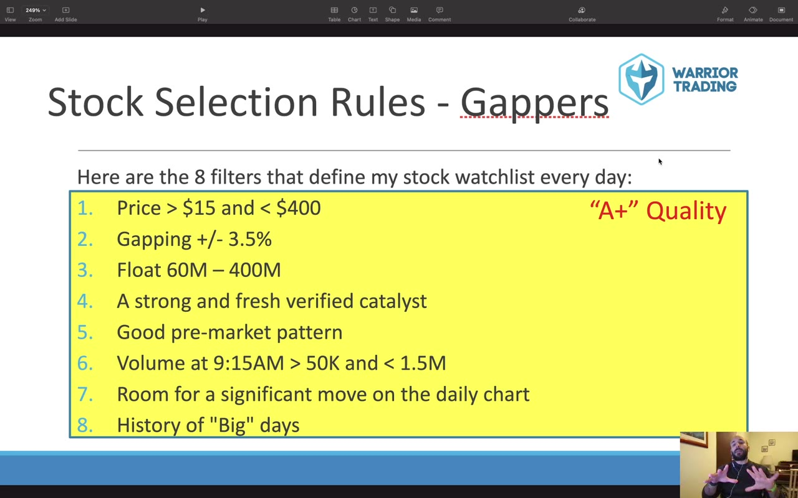

**图怎么看：**

- 1. Price > $15 and < $400
- 2. Gapping +/- 3.5%
- 3. Float 60M – 400M
- 4. A strong and fresh verified catalyst

### 关键内容

- 讲师强调了股票筛选的重要性，指出它可以帮助识别潜在的交易机会。
- 筛选过程需要满足三个主要原则：可管理性、可靠性和重复性。
- 可管理性要求每天筛选出的股票数量不超过5只，以确保能够有效监控。
- 可靠性要求每天选择的股票具有高概率的移动潜力，而不是随机选择。
- 重复性要求筛选过程可以每天重复进行，而不仅仅是每周或每月一次。
- 讲师分享了四种筛选方法：开盘跳空、beta股票、延续日和热门行业股票。
- 使用Excel表格来实施筛选过程，包括八个问题来评估股票质量。
- 筛选过程中，如果股票未能通过所有标准，则不会被列入观察名单。
- 讲师强调了使用TradingView的重要性，因为它提供了强大的技术分析工具。
- 使用TradingView可以避免不必要的噪音，提高交易效率。

### 分析与执行顺序

1. 首先，确定每天筛选出的股票数量不超过5只，以确保可管理性。
2. 其次，确保每天选择的股票具有高概率的移动潜力，以保证可靠性。
3. 第三，建立一个每天都可以重复使用的筛选过程，以确保重复性。
4. 第四，使用Excel表格来记录筛选过程，包括八个问题来评估股票质量。
5. 第五，根据每个股票的表现，决定是否将其列入观察名单。
6. 第六，使用TradingView进行技术分析，以减少噪音并提高交易效率。
7. 第七，定期更新筛选过程，以适应市场变化。

### 案例与细节

- 特斯拉（Tesla）作为beta股票，不需要关注价格范围、跳空幅度等细节，只需关注技术图表和历史大波动。
- JKS股票在早上开盘时表现出强劲的跳空，符合筛选标准，被加入观察名单。
- PDD股票在前一天表现出强劲的延续日特征，第二天开盘时继续保持强劲表现，符合筛选标准。
- RCL股票近期成交量大，即使没有跳空也能满足筛选标准，被加入观察名单。
- 苹果（Apple）股票虽然符合部分标准，但未能在关键水平下方确认，因此未被列入观察名单。

### 风险与边界

- 如果市场环境发生变化，现有的筛选标准可能不再适用，需要及时调整。
- 过度依赖单一技术指标可能导致错过其他潜在的交易机会。
- 使用TradingView可能会遇到网络问题，影响实时数据获取。
- 录制于2021年，部分信息可能已发生变化，需谨慎应用。

### 复盘问题

- 如何确保每天筛选出的股票数量不超过5只？
- 如何判断股票是否具有高概率的移动潜力？
- 如何确保筛选过程可以每天重复使用？
- 如何使用Excel表格来记录筛选过程？
- 如何利用TradingView进行技术分析？

---

## v0677：Baidu 和 Netflix 的交易案例分析

> 日期：2021-01-20　·　时长：01:00:14

**本场重点：** 通过 Baidu 和 Netflix 的交易案例，学习如何制定和执行交易策略。

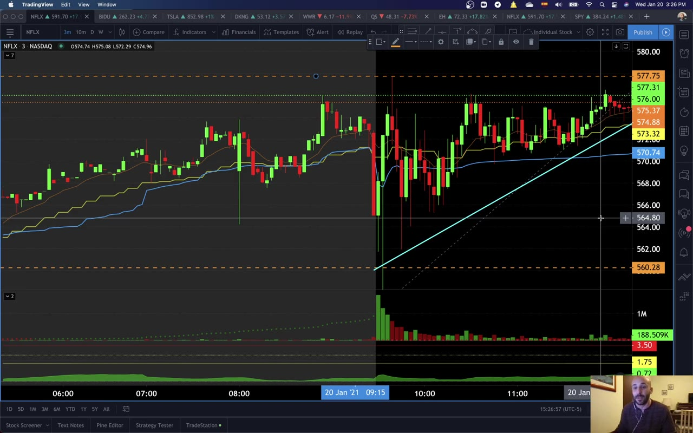

**图怎么看：**

- 画面中，可以看到Baidu（BIDU）和Netflix（NFLX）的股价走势图。Baidu的股价从591.70美元上涨到591.91美元，而Netflix的股价从591.71美元上涨到591.91美元。
- 图A显示了两个股票的价格趋势，Baidu和Netflix都呈现出上升的趋势。
- 画面中的水平线表示支撑位和阻力位，帮助投资者判断买卖点。
- 画面中的垂直线表示特定的时间段，如3分钟、10分钟等，有助于观察短期波动情况。

### 关键内容

- Baidu 的交易策略包括等待三分钟蜡烛突破阻力位，然后确认新高。
- Netflix 的交易机会因财报后突破关键支撑位而出现。
- 交易者应保持耐心，等待最佳入场时机。
- Baidu 的交易最终亏损，因为没有确认突破。
- Netflix 的交易成功，因为突破了关键支撑位。
- 交易者应根据自己的策略进行交易，而不是盲目跟随市场。
- 交易者需要不断回顾和学习自己的交易记录，以改进策略。
- 交易者不应期望立即获得成功，而应逐步建立自己的交易体系

### 分析与执行顺序

1. Roberto 解释了 Baidu 的交易策略，包括等待三分钟蜡烛突破阻力位。
2. 他强调了等待确认新高的重要性，以避免错误的交易。
3. Roberto 分析了 Netflix 的交易机会，包括财报后的突破。
4. 他展示了如何利用三分钟蜡烛图来确认突破的有效性。
5. Roberto 强调了交易者应根据自己的策略进行交易的重要性。
6. 他提醒交易者要不断回顾和学习自己的交易记录，以改进策略

### 案例与细节

- Baidu 的交易策略包括等待三分钟蜡烛突破阻力位，然后确认新高。
- Netflix 在财报后突破关键支撑位，提供了良好的交易机会。
- Roberto 使用三分钟蜡烛图来确认突破的有效性。
- Baidu 的交易最终亏损，因为没有确认突破。
- Netflix 的交易成功，因为突破了关键支撑位

### 风险与边界

- 交易者可能因为缺乏耐心而错过最佳入场时机。
- 交易者可能因为过度自信而忽视策略中的关键细节。
- 交易者可能因为市场变化而无法持续应用相同的策略。
- 录制年代限制为 2021 年，因此策略可能需要调整以适应当前市场环境

### 复盘问题

- Baidu 的交易策略为何没有成功？
- Netflix 的交易机会是如何识别出来的？
- 交易者如何根据自己的策略进行交易？
- 交易者应如何回顾和改进自己的交易记录？

---

## v0678：技术指标的选择与应用

> 日期：2021-01-27　·　时长：01:01:01

**本场重点：** 选择简单有效的技术指标，避免过度复杂化，适用于日间交易。

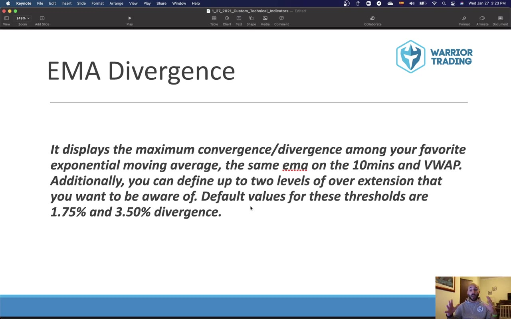

**图怎么看：**

- 该图表显示了最大收敛/分歧情况，使用了您最喜欢的指数移动平均线（EMA）在10分钟和VWAP上。
- 您可以定义两个水平的过度延伸阈值，默认值为1.75%和3.50%。
- 通过观察这些图表，可以识别出市场趋势的变化和潜在的买卖机会。
- 学习如何利用EMA Divergence来优化交易策略，提高交易成功率。

### 关键内容

- 技术指标的选择应基于个人需求，而非一刀切的标准。
- 简化技术指标是为了快速决策，而不是追求完美。
- 测试多种技术指标，找到最适合自己的组合。
- 使用简单的技术指标，如EMA和VWAP，以支持快速决策。
- 避免过度依赖技术指标，因为它们无法保证100%准确。
- 理解自己的优势，并据此构建交易策略。
- 使用Trading View的布局来简化交易流程。
- 使用简单的技术指标组合，如EMA和VWAP，以支持快速决策。
- 选择技术指标时，应根据个人交易风格和市场环境进行调整，而非盲目跟随他人。
- 测试多种技术指标组合，可以发现哪些指标最符合个人交易习惯，从而提高决策效率。
- 简化技术指标是为了快速决策，而不是追求完美，因此应优先考虑那些能够迅速提供有用信息的指标。
- 理解自己的优势，比如擅长趋势交易或反转交易，然后围绕这些优势构建交易策略。
- 使用Trading View的布局来简化交易流程，减少干扰因素，专注于关键指标和信号。

### 分析与执行顺序

1. 讲师首先介绍了技术指标选择的重要性，强调简化。
2. 然后讨论了如何通过回测和实盘测试来选择合适的指标。
3. 接着介绍了使用Trading View布局的方法，以简化交易流程。
4. 最后，讲师分享了自己使用的指标组合，如EMA和VWAP。
5. 讲师还强调了测试多种指标的重要性，以找到最适合自己的组合。

### 案例与细节

- 讲师使用了13 EMA和VWAP指标，在3分钟和10分钟的时间框架内。
- 使用了52周高点和低点指标，用于确认趋势。
- 使用了扩展交易时段的高点和低点指标，以识别潜在的支持和阻力水平。
- 使用了短卖限制价格指标，以识别可能的交易限制。
- 使用了自动自由斐波那契指标，以确定潜在的入场、止损和目标价格。
- 讲师使用了13 EMA和VWAP指标，在3分钟和10分钟的时间框架内，帮助识别趋势方向。
- 使用了52周高点和低点指标，用于确认趋势，当股价突破52周高点时，表明可能有进一步上涨的动力。

### 风险与边界

- 技术指标无法保证100%准确，因此需要谨慎使用。
- 过度依赖技术指标可能导致决策失误。
- 市场条件变化可能导致某些指标不再适用。
- 录制年代限制为2021年，部分信息可能已发生变化。
- 市场条件变化可能导致某些指标不再适用，例如，如果市场突然出现异常波动，之前的指标可能不再有效。
- 过度依赖技术指标可能导致决策失误，特别是在市场出现突发事件时，技术指标可能无法提供准确的信息。

### 复盘问题

- 你选择了哪些技术指标？为什么选择这些指标？
- 如何确保技术指标的准确性？
- 在实际交易中，如何应对技术指标失效的情况？

---

## v0679：股票性格与交易策略

> 日期：2021-02-10　·　时长：00:59:34

**本场重点：** 设定合理的交易期望，了解股票性格，提高交易成功率。

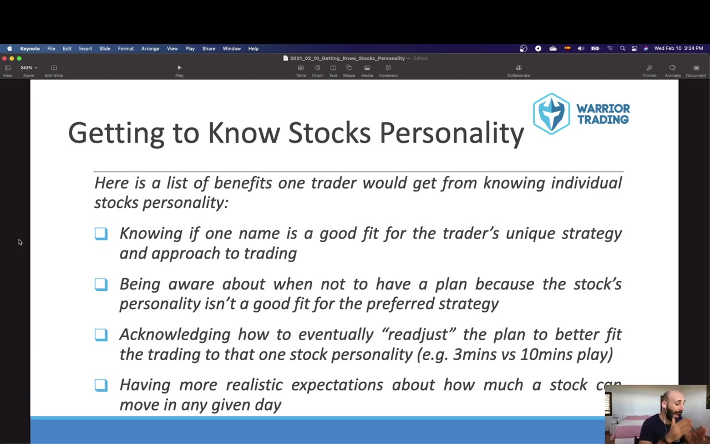

**图怎么看：**

- 通过了解股票的性格，可以更好地判断何时适合进行交易。
- 了解股票的性格有助于识别哪些股票不适合自己的交易策略。
- 在交易过程中，需要学会调整计划以适应股票的性格变化。
- 对股票的预期要有现实性，避免过高估计其波动幅度。

### 关键内容

- 短期目标可能增加交易者心理负担，影响表现。
- 了解股票性格有助于预测市场走势，提高交易效率。
- 风险管理是长期成功的关键，准确预测波动性至关重要。
- 设置合理的交易计划，避免过度限制自己。
- 通过分析过去的大波动日，可以预测未来的市场走势。
- 不同股票的性格不同，需要针对性地制定交易策略。
- 使用技术指标和图表分析来识别股票的潜在趋势。
- 保持弹性，根据市场情况调整交易计划。
- 经验是提高交易技能的重要因素，不断积累经验可以提高成功率

### 分析与执行顺序

1. 设定交易目标时，避免过于短视，以免产生不必要的心理压力。
2. 通过分析过去的大波动日，识别股票的性格特征。
3. 利用技术指标和图表分析，预测股票的未来走势。
4. 根据股票的性格制定交易计划，保持一定的灵活性。
5. 在交易过程中，根据市场情况及时调整交易策略。
6. 通过不断实践和总结，逐步提高交易技能和成功率。
7. 保持良好的风险管理，确保交易的可持续性

### 案例与细节

- ticker：TWTR；price_action：在一次回调中买入Twitter，价格在3755附近。；strategy：利用支撑位进行交易，确认回调后买入。；outcome：成功卖出部分仓位，获利。；timeframe：2021年2月
- ticker：TSLA；price_action：特斯拉在三分钟图表上表现良好，跟随13EMA和3EMA测试低点。；strategy：利用特斯拉的三分钟图表进行交易，特别是在高波动日。；outcome：成功交易特斯拉，实现盈利。；timeframe：2021年2月
- ticker：PLTR；price_action：Palantir在开盘后表现强劲，但三分钟图表上的13EMA测试失败。；strategy：根据Palantir的历史表现，选择合适的入场点。；outcome：成功交易Palantir，实现盈利。；timeframe：2021年2月

### 风险与边界

- 短期目标可能导致过度自信或焦虑，影响交易决策。
- 过度依赖技术指标可能导致忽视市场变化，增加风险。
- 缺乏经验可能导致无法准确判断市场走势，影响交易效果。
- 录制年代限制，某些交易策略可能不再适用当前市场环境。
- 依赖单一指标可能导致忽视其他重要市场信号，增加风险

### 复盘问题

- 如何设定合理的交易目标，避免短期目标带来的负面影响？
- 如何通过分析过去的大波动日来预测未来的市场走势？
- 如何在交易过程中保持灵活性，根据市场情况调整交易策略？
- 如何通过不断实践和总结，提高自己的交易技能和成功率？

---

## v0680：SQ股票的交易策略

> 日期：2021-02-24　·　时长：01:03:11

**本场重点：** SQ股票的交易策略，通过技术分析和市场反应进行短期交易，强调独立思考和风险管理。

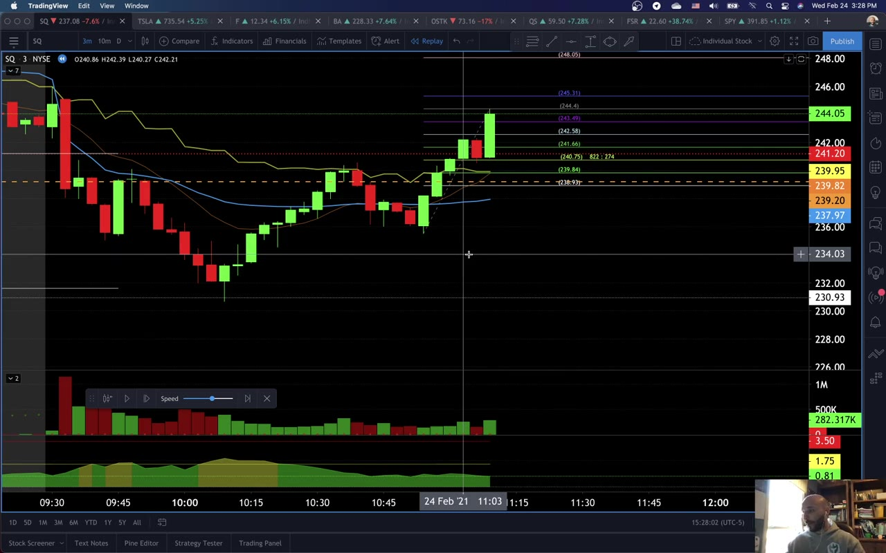

**图怎么看：**

- 图A显示了SQ股票的技术分析图表，包括蜡烛图、均线和其他指标，帮助投资者理解价格趋势和潜在的买卖点。
- 画面中的水平线和垂直线可能表示支撑位和阻力位，这些位置可以作为交易决策的参考。
- 成交量柱的高度反映对应周期内的总成交量；红绿着色通常跟随价格柱的涨跌规则，不能直接拆成两种方向的主动成交。
- 画面中的时间轴和价格波动提供了实时的市场动态，帮助投资者做出即时的交易决策。

### 关键内容

- SQ股票因公司公布财报而成为潜在交易标的，显示了市场反应。
- 三分钟图表显示价格在低点附近波动，提供了交易机会。
- 使用斐波那契回撤水平来确定潜在的支撑区域。
- 交易者需要等待价格突破关键支撑位，然后进行短空操作。
- 交易者需关注成交量，确保有足够的流动性。
- 交易者需设定止损，以控制风险。
- 交易者需耐心等待最佳入场时机，避免过早行动。
- 交易者需记录每次交易，以进行事后分析和改进。
- 交易者需根据市场情况调整交易策略，保持灵活性。
- 交易者需了解技术工具的局限性，如Trading View的功能限制

### 分析与执行顺序

1. 首先识别SQ股票的低点，确认市场反应。
2. 查看三分钟图表，寻找价格突破关键支撑位的机会。
3. 使用斐波那契回撤水平来确定潜在的支撑区域。
4. 等待价格突破关键支撑位，然后进行短空操作。
5. 确保有足够的成交量，以保证交易的流动性。
6. 设定止损，以控制潜在的风险。
7. 记录每次交易，以便进行事后分析和改进

### 案例与细节

- SQ股票在开盘前的低点为241.20，随后价格下跌并测试了这一支撑位。
- 交易者观察到价格在三分钟图表上形成了更低的低点，确认了趋势。
- 交易者使用斐波那契回撤水平来确定潜在的支撑区域，准备进行短空操作。
- 交易者在价格突破关键支撑位后，进行了短空操作，获利400美元。
- 交易者在交易后回顾自己的交易，分析原因和结果，以改进未来策略

### 风险与边界

- 交易者需注意市场波动，避免过度依赖单一指标。
- 交易者需关注市场情绪变化，避免盲目跟风。
- 交易者需了解技术工具的局限性，如Trading View的功能限制。
- 交易者需定期更新交易策略，以适应市场变化。
- 交易者需注意交易成本，包括滑点和手续费

### 复盘问题

- SQ股票的交易策略是如何制定的？
- 交易者如何确定交易的最佳时机？
- 交易者如何管理交易风险？

---

## v0681：交易策略与风险管理

> 日期：2021-03-10　·　时长：01:14:44

**本场重点：** 本节讨论了交易策略的重要性、风险管理以及如何利用技术指标进行交易。

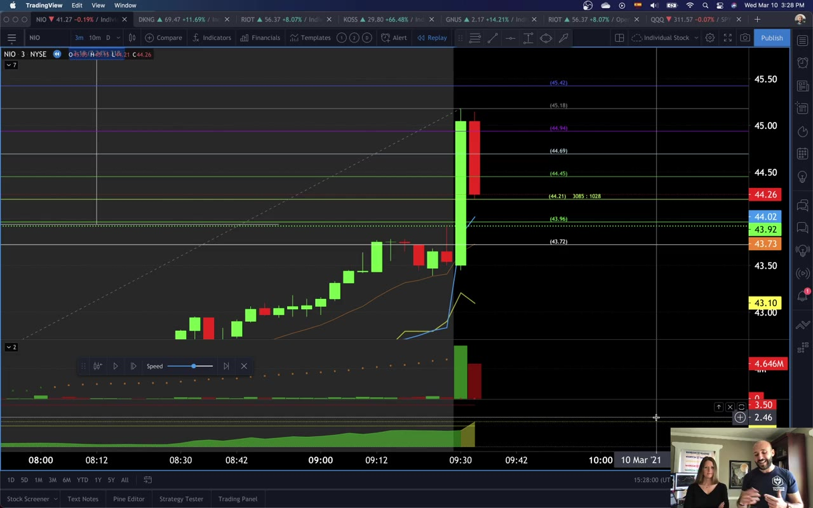

**图怎么看：**

- 在图中可以看到DKNG股票的每日蜡烛图，显示了价格波动情况。
- 水平线表示支撑和阻力位，其中紫色线可能代表重要的支撑位。
- 成交量柱的高度反映对应周期内的总成交量；红绿着色通常跟随价格柱的涨跌规则，不能直接拆成两种方向的主动成交。
- 图中的趋势线和支撑阻力位有助于分析当前市场的趋势和潜在的交易机会。

### 关键内容

- 等待自己的交易信号出现，而不是凭直觉下单。
- 使用技术指标如分时图和斐波那契回撤来确认交易机会。
- 在交易前确保有止损计划。
- 在交易过程中保持冷静，避免过早止损。
- 记录交易过程以进行事后分析。
- 使用分时图进行交易决策，尤其是开盘后的3分钟。
- 对于大市值股票，需要更多的成交量才能推动价格上行。
- 利用分时图和斐波那契回撤来识别交易机会。
- 在交易过程中保持灵活性，根据市场情况调整策略。
- 记录交易过程，包括设置和执行细节

### 分析与执行顺序

1. 首先，回顾交易策略的重要性，强调等待自己的交易信号出现。
2. 然后，分析NIO的图表，展示如何识别交易机会。
3. 接着，讨论如何使用技术指标如分时图和斐波那契回撤来确认交易机会。
4. 进一步解释如何在交易过程中保持冷静，避免过早止损。
5. 最后，强调记录交易过程的重要性，包括设置和执行细节。

### 案例与细节

- NIO在开盘后形成了一个强劲的上升趋势，但作者并未立即下单，而是等待了更多确认信号。
- 作者使用了分时图和斐波那契回撤来确认交易机会，最终在NIO突破关键阻力位后下单。
- 当NIO的价格开始下跌时，作者及时调整了止损计划，避免了更大的损失。
- 作者记录了交易过程，包括设置和执行细节，以便进行事后分析。
- 在交易过程中，作者发现NIO的成交量不足，因此决定暂时观望，等待更好的入场时机。

### 风险与边界

- 交易策略的有效性依赖于市场环境的变化，因此需要不断调整。
- 使用技术指标可能会产生误判，尤其是在市场波动较大时。
- 记录交易过程虽然有助于事后分析，但也可能占用额外的时间。
- 交易策略是在2021年录制的，因此在当前市场环境下可能需要进行适当调整。

### 复盘问题

- 在交易过程中，如何确保自己的情绪不会影响决策？
- 如何在交易过程中灵活调整策略，以适应市场的变化？
- 记录交易过程的具体方法是什么？

---

## v0682：RSI 长短、风险回报比与仓位大小

> 日期：2021　·　时长：01:01:54

**本场重点：** 本节讲解如何使用 RSI 进行交易决策，包括风险回报比和仓位大小策略。

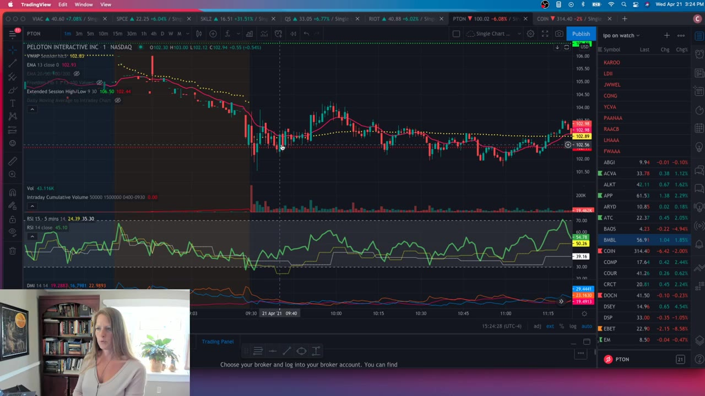

**图怎么看：**

- 在 Peloton Interactive Inc. 的日线图上，可以看到价格在不同周期内的波动情况。
- RSI 图表显示了价格在不同周期内的相对强弱指数，帮助判断市场趋势。
- 通过分析这些图表，可以评估股票的风险回报比和仓位大小。
- 讲师可能正在讨论如何结合这些技术指标来做出交易决策。

### 关键内容

- Celena 使用 RSI 进行交易决策，重点关注 60 点以上的位置。
- RSI 长期设置为 14 天，短期设置为 30 和 70 点。
- 在多个时间框架下使用 RSI，寻找突破和回调机会。
- 使用 RSI 帮助避免进入不良交易并保持在良好交易中。
- 仓位大小策略包括逐步建仓和逐步平仓。
- 风险回报比需要考虑止损点和盈利目标。
- 仓位大小策略有助于改善资金管理。
- 使用 RSI 短期交易时，注意支撑和阻力位。
- 仓位大小策略适用于不同类型的交易者，包括激进型和保守型。
- 仓位大小策略需要根据个人交易风格制定

### 分析与执行顺序

1. Celena 分析了 MRNA 的 RSI 指标，确认其在 60 点以上。
2. 她指出 RSI 在 60 点以上表示强劲趋势，适合进行交易。
3. Celena 提出使用 RSI 确认长期趋势，并结合其他技术指标进行交易。
4. 她强调使用 RSI 确定进入和退出时机的重要性。
5. Celena 讨论了仓位大小策略，包括逐步建仓和平仓的方法。
6. 她还提到了风险回报比的概念，强调合理设置止损和盈利目标的重要性。
7. Celena 强调了仓位大小策略对不同交易者的重要性，包括激进型和保守型。
8. 她建议交易者根据自己的交易风格制定仓位大小策略。
9. Celena 提醒交易者注意仓位大小策略的适用性和局限性

### 案例与细节

- MRNA 在 60 点以上表现出强劲趋势，适合进行交易。
- Celena 使用 RSI 确认长期趋势，并结合其他技术指标进行交易。
- 当 RSI 短期突破 60 点时，适合进行交易。
- Celena 建议使用 RSI 确定进入和退出时机，例如在 60 点附近进行交易。
- 她提到使用 RSI 确定止损点和盈利目标的重要性。
- Celena 讨论了仓位大小策略，包括逐步建仓和平仓的方法。例如，在 RSI 短期突破 60 点时，可以逐步建仓。

### 风险与边界

- RSI 指标可能失效，特别是在市场波动较大时。
- 仓位大小策略需要根据个人交易风格制定，不适合所有交易者。
- 风险回报比需要根据市场情况灵活调整。
- 录制于 2021 年，部分信息可能已发生变化。
- 仓位大小策略需要谨慎执行，避免过度交易

### 复盘问题

- 如何使用 RSI 进行交易决策？
- 风险回报比如何帮助交易者制定交易计划？
- 仓位大小策略适用于哪些类型的交易者？
- 如何根据市场情况调整风险回报比？
- 如何确保仓位大小策略的有效执行？

---

## v0683：交易策略与风险管理

> 日期：2021　·　时长：00:34:01

**本场重点：** 交易计划的重要性在于预防情绪化交易，而不是在市场不利时调整策略。

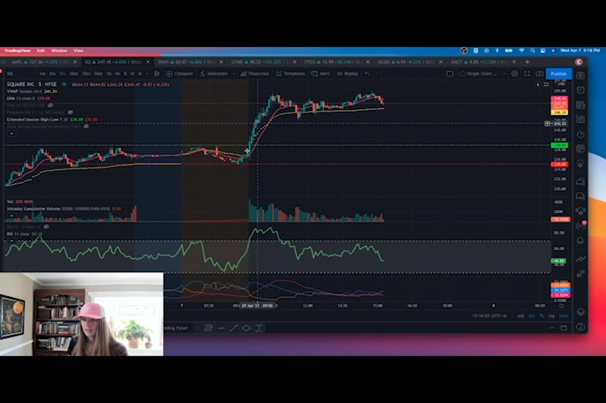

**图怎么看：**

- 交易者正在使用TradingView平台查看多个股票的图表。
- 图表显示了Snap Inc.、Square Inc.和UTME等公司的股价波动情况。
- 交易者可能正在讨论如何根据这些图表来制定交易策略。
- 成交量柱的高度反映对应周期内的总成交量；红绿着色通常跟随价格柱的涨跌规则，不能直接拆成两种方向的主动成交。

### 关键内容

- 交易计划是长期成功的关键，包括设置和止损点。
- 使用RSI策略时，需要考虑不同时间框架的支持情况。
- 下午交易的关键在于寻找成交量，而不是依赖动量。
- 识别成交量的关键在于观察价格行动和成交量的变化。
- 使用Trading View进行交易时，需要关注成交量的变化。
- 交易计划应包含明确的风险管理措施，以避免情绪化交易。
- 使用RSI指标时，需要考虑多个时间框架的支持情况。
- 成交量是判断市场冷热的重要指标，冷市场表现为成交量下降。
- 使用Trading View进行交易时，需要关注不同时间框架的成交量变化。
- 交易计划应包括明确的盈利目标和风险控制措施

### 分析与执行顺序

1. 首先，Selena介绍了交易计划的重要性，强调了设置和止损点。
2. 接着，她解释了如何结合RSI策略进行交易，特别是不同时间框架的支持情况。
3. 然后，她讨论了下午交易的关键在于寻找成交量，而不是依赖动量。
4. 接着，她展示了如何使用Trading View进行交易，并强调了成交量的重要性。
5. 最后，她总结了交易计划应包括的风险管理措施，以避免情绪化交易。
6. 在整个过程中，Selena多次强调了交易计划的重要性，以及如何利用不同的工具和技术来制定有效的交易策略。
7. 她还强调了使用Trading View进行交易时，需要关注不同时间框架的成交量变化，以做出更明智的决策

### 案例与细节

- Selena提到，当使用Trading View进行交易时，可以观察到Snap的15分钟RSI线保持在60以上，这表明市场支持。
- 她举例说，在Snap的15分钟图表上，可以看到成交量在上涨时增加，而在下跌时减少，这有助于识别潜在的交易机会。
- Selena提到，当市场冷的时候，成交量会下降，而当市场热的时候，成交量会上升，这可以通过观察成交量的变化来判断。
- 她还提到，当市场出现大的红柱时，这可能是成交量顶，需要谨慎对待。
- Selena举例说，在Snap的1508时间框架上，出现了大红柱，这表明市场可能在测试某个水平，需要等待进一步确认

### 风险与边界

- 交易计划的有效性取决于市场环境的变化，因此需要定期更新。
- 使用RSI指标时，需要考虑不同时间框架的支持情况，否则可能会错过重要的交易机会。
- 下午交易的关键在于寻找成交量，而不是依赖动量，因此需要密切关注成交量的变化。
- 使用Trading View进行交易时，需要关注不同时间框架的成交量变化，否则可能会忽略重要的市场信号。
- 交易计划应包括明确的盈利目标和风险控制措施，否则可能会导致情绪化交易，从而增加风险

### 复盘问题

- 交易计划应该包含哪些关键要素？
- 如何结合RSI策略进行交易？
- 下午交易的关键是什么？
- 如何使用Trading View进行交易？
- 交易计划应包括哪些风险管理措施？

---

## v0684：相对强度与成交量在交易中的应用

> 日期：2021　·　时长：00:54:50

**本场重点：** 今天讨论了如何使用相对强度和成交量来判断交易机会，以及如何设置合理的风险回报。

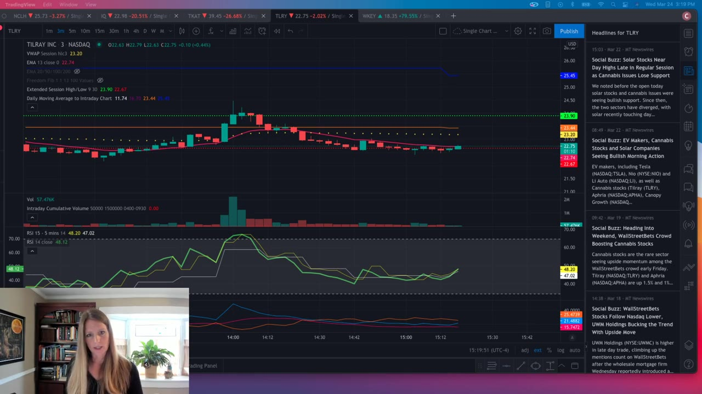

**图怎么看：**

- 图中显示了TILRAY INC的每日K线图，可以看到股价在不同时间段内的波动情况。
- 成交量柱的高度反映对应周期内的总成交量；红绿着色通常跟随价格柱的涨跌规则，不能直接拆成两种方向的主动成交。
- RSI指标显示了相对强弱指数，用于判断市场情绪和买卖力量。
- 均线（如EMA）提供了趋势分析，帮助识别支撑和阻力位。

### 关键内容

- 使用相对强度（RSI）来判断股票是否超买或超卖，从而决定是否进行交易。
- 通过成交量分析来识别支撑和阻力位，以及潜在的交易机会。
- 利用相对强度和成交量来设定合理的止损和止盈点。
- 在交易决策中，需要考虑市场新闻和股票的基本面。
- 使用Think或Swim平台进行交易时，需要关注成交量的变化。
- 在交易中，需要根据市场情况进行灵活调整，而不是机械地跟随信号。
- 使用Trading View作为备份图表，以应对Think或Swim平台的延迟问题。
- 在交易中，需要信任自己的经验和直觉，而不是完全依赖技术指标。
- 在交易决策中，需要考虑市场情绪和心理因素，而不仅仅是技术分析。
- 在交易中，需要保持耐心，而不是追求快速盈利

### 分析与执行顺序

1. 首先，讲师介绍了如何使用相对强度（RSI）来判断股票是否超买或超卖。
2. 然后，讲师讲解了如何通过成交量分析来识别支撑和阻力位，以及潜在的交易机会。
3. 接着，讲师展示了如何在Think或Swim平台上进行交易，并强调了关注成交量的重要性。
4. 随后，讲师讨论了如何在交易决策中结合市场新闻和股票的基本面。
5. 最后，讲师强调了在交易中需要信任自己的经验和直觉，而不是完全依赖技术指标。

### 案例与细节

- 讲师提到，如果股票的RSI值超过60，则表明股票可能处于超买状态，可以考虑卖出。
- 讲师指出，如果股票的RSI值低于60，则表明股票可能处于超卖状态，可以考虑买入。
- 讲师举例说明，如果股票的成交量在突破后迅速下降，则可能表明股票即将回调。
- 讲师提到，如果股票的RSI值在短时间内大幅上升，则可能表明股票即将出现大幅下跌。
- 讲师举例说明，如果股票的成交量在突破后持续增加，则可能表明股票将继续上涨。

### 风险与边界

- 录制于2021年，当前市场情况可能已发生变化，需谨慎参考。
- 讲师提到的某些平台功能可能已更新或改变，需确认最新版本的功能。
- 讲师提到的某些交易策略可能需要根据当前市场情况进行调整。

### 复盘问题

- 如何使用相对强度（RSI）来判断股票是否超买或超卖？
- 如何通过成交量分析来识别支撑和阻力位，以及潜在的交易机会？
- 在交易决策中，如何结合市场新闻和股票的基本面？
- 在交易中，如何根据市场情况进行灵活调整，而不是机械地跟随信号？
- 如何在交易中保持耐心，而不是追求快速盈利？

---

## v0685：如何管理聊天室参与以提高交易表现

> 日期：2021　·　时长：00:58:39

**本场重点：** 本课程强调了过度参与聊天室会分散注意力，影响交易表现；建议专注于自己的交易计划。

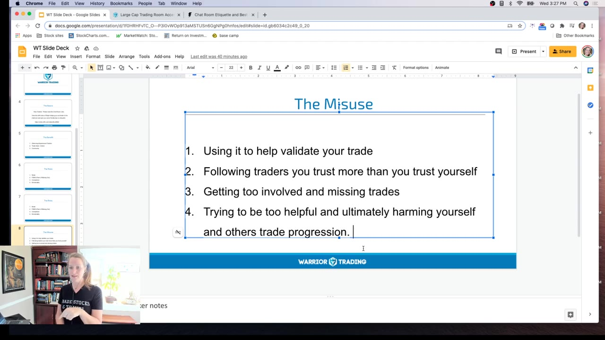

**图怎么看：**

- 这张幻灯片详细列出了在聊天室中可能发生的四种滥用行为，这些行为可能会分散注意力并影响交易表现。
- 幻灯片上的内容强调了过度参与聊天室的重要性，因为它可能导致错过重要的交易机会。
- 幻灯片还提到了信任问题，指出跟随自己不信任的交易者可能会导致错误的决策。
- 此外，幻灯片还讨论了过度帮助他人可能会损害自己的交易进展的问题。

### 关键内容

- 讲师指出，过度参与聊天室会导致错过交易机会，分散注意力，甚至影响交易决策。
- 建议新手交易者先阅读聊天室规则，了解基本规则和注意事项。
- 讲师分享了自己在交易过程中因过度参与聊天室而影响交易表现的经历。
- 强调了社区精神的重要性，但核心是专注于自己的交易。
- 讨论了过度参与聊天室可能导致的多种负面影响，如情绪波动、预测错误等。
- 建议避免过度依赖他人意见，学会自我验证和独立思考。
- 讲师提到，理想情况下，交易者应在交易前和交易后参与聊天室，而非交易期间。
- 强调了自我保护的重要性，避免过度社交影响交易专注度。
- 讲师分享了自己如何通过自我反思来克服恐惧和焦虑，提高交易表现。

### 分析与执行顺序

1. 讲师首先介绍了课程的目的，即帮助交易者更好地管理聊天室参与。
2. 讲师提醒新手交易者先阅读聊天室规则，了解基本规则和注意事项。
3. 讲师分享了自己在交易过程中因过度参与聊天室而影响交易表现的经历。
4. 讲师详细列举了过度参与聊天室可能导致的各种负面影响，如情绪波动、预测错误等。
5. 讲师建议交易者在交易前和交易后参与聊天室，而非交易期间。
6. 最后，讲师分享了自己如何通过自我反思来克服恐惧和焦虑，提高交易表现。

### 案例与细节

- ACTC 股票：讲师提到自己曾因未检查浮筹就跳入交易，导致亏损。
- 小盘股：讲师提到自己曾因小盘股的闪跌而感到恐惧，难以及时退出。
- RSI 指标：讲师提到使用 RSI 指标帮助自己做出成功的交易决策。
- 浮筹：讲师提到浮筹对交易决策的影响，强调了在交易前进行充分研究的重要性。

### 风险与边界

- 录制年代限制：此课程录制于 2021 年，部分信息可能不再适用。
- 市场变化：市场环境和交易规则可能会发生变化，需关注最新动态。
- 个人情况：不同交易者的情况各异，需根据自身情况进行调整。

### 复盘问题

- 你认为过度参与聊天室的主要原因是什么？
- 如何在交易前和交易后有效利用聊天室资源而不影响交易表现？
- 你如何处理交易过程中的情绪波动？

---

## v0686：RSI在交易中的应用

> 日期：2021　·　时长：00:56:26

**本场重点：** 利用RSI进行利润锁定和止损管理，识别高风险回报交易，适应慢市环境。

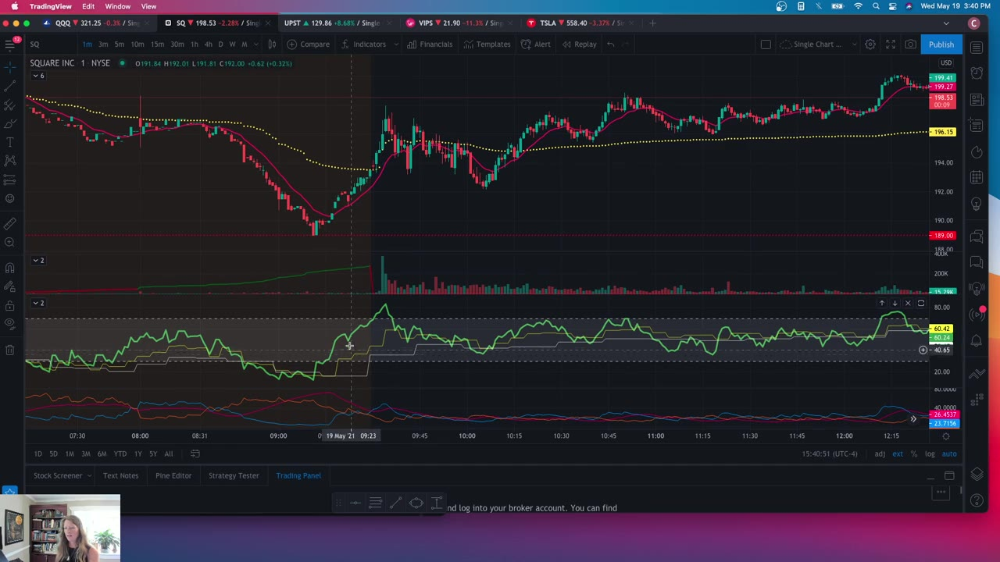

**图怎么看：**

- 深色图表上方是价格K线，左侧先持续下跌，随后出现快速V形修复并进入右侧横向抬升；图中叠加多条均线和水平价位。
- 主图下方有多个震荡指标面板，绿色曲线在不同区间来回摆动，可用于比较价格反转时RSI类指标是否同步离开极端区域。
- 这张图适合本场RSI讲解：指标用于辅助锁定利润、判断动能减弱和管理止损，但必须与价格结构和风险收益一起阅读。
- RSI进入高低区不等于价格立即反转，截图也不能证明背离会成功；强趋势中指标可长时间维持极端读数。

### 关键内容

- 使用RSI进行利润锁定时，关注较小时间框架RSI线与较长时间框架RSI线的行为。
- 当较小时间框架RSI线形成较低高点和低低点时，考虑锁定利润。
- 在慢市环境中，利用RSI帮助做出更明智的选择。
- 通过呼吸练习提高自我信任感，减少交易决策中的犹豫。
- 使用Trading View进行实时交易记录，便于查看。
- 识别高风险回报交易需要关注RSI的相对强度线。
- 在慢市中，选择高质量的交易设置以减少风险。
- 利用RSI进行止损管理，避免过度恐慌导致错误决策。
- 在慢市中，保持耐心，避免频繁交易。
- 使用RSI进行交易时，结合其他技术指标以提高准确性

### 分析与执行顺序

1. 首先，观察较小时间框架RSI线与较长时间框架RSI线的行为。
2. 当较小时间框架RSI线形成较低高点和低低点时，考虑锁定利润。
3. 在慢市中，利用RSI帮助识别高质量的交易设置。
4. 通过呼吸练习提高自我信任感，减少交易决策中的犹豫。
5. 使用Trading View进行实时交易记录，便于查看。
6. 识别高风险回报交易需要关注RSI的相对强度线。
7. 在慢市中，选择高质量的交易设置以减少风险

### 案例与细节

- 在Square的交易中，当RSI线形成较低高点和低低点时，考虑锁定利润。
- 在Upstart的交易中，RSI线形成较低高点和低低点时，考虑锁定利润。
- 在慢市中，使用RSI识别高质量的交易设置，如Square的预市场交易。
- 在Square的交易中，利用RSI线的测试和补充来管理止损。
- 在慢市中，保持耐心，避免频繁交易，如Square的交易策略。
- 在Square的交易中，利用RSI线的测试和补充来管理止损，确保不因过度恐慌而错误决策

### 风险与边界

- 在快速变动的市场中，RSI可能无法准确反映市场趋势。
- 在慢市中，RSI可能无法提供足够的信号来做出交易决策。
- 录制年代限制，此内容适用于2018-2021年的市场环境。
- 在使用RSI进行交易时，需要结合其他技术指标以提高准确性

### 复盘问题

- 在使用RSI进行利润锁定时，如何确定最佳的锁定时机？
- 在慢市中，如何利用RSI识别高质量的交易设置？
- 如何通过呼吸练习提高自我信任感，减少交易决策中的犹豫？

---

## v0687：小账户交易策略

> 日期：2021　·　时长：00:53:06

**本场重点：** 分享了如何在受限条件下进行交易，以实现账户增长。

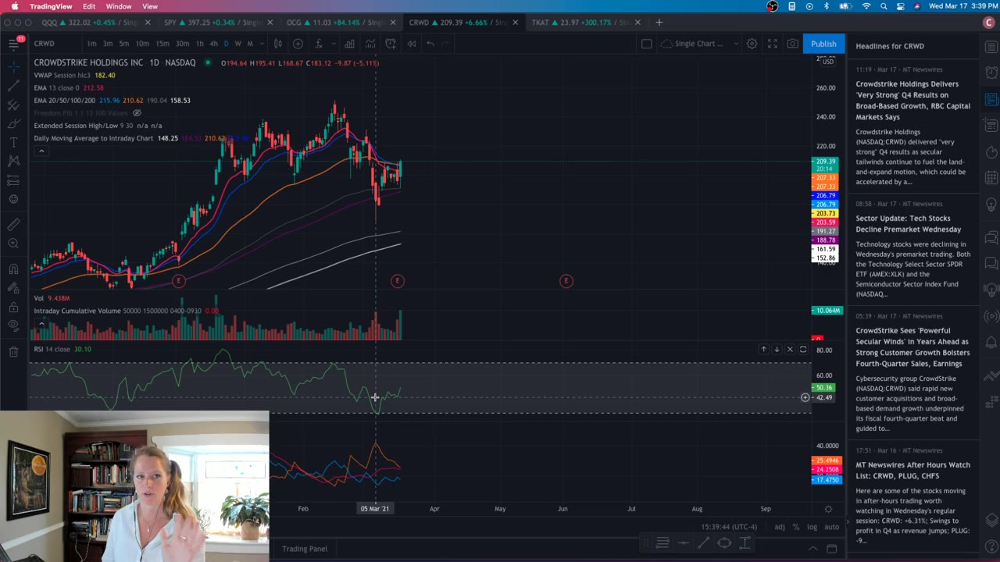

**图怎么看：**

- 显示了 CrowdStrike Holdings Inc. (CRWD) 的股票价格图表，包括日线图、移动平均线（EMA）、成交量柱状图等。
- 图表上可以看到 CRWD 的股价在不同时间段内的波动情况，以及成交量的变化。
- 通过分析这些图表，可以了解股票的价格趋势和市场活动。
- 这些数据对于投资者来说非常有用，可以帮助他们做出更明智的投资决策。

### 关键内容

- TCAT股票在测试关键阻力位60，显示了图表分析的重要性。
- 使用止损和利润目标来确定风险回报比，确保交易计划合理。
- 利用现金账户进行日内交易，最大化交易次数。
- 识别低风险高收益股票，利用支撑和阻力位进行交易。
- 在市场波动时调整交易策略，避免过度交易。
- 使用蜡烛图关闭来决定是否进入交易，减少冲动决策。
- 在模拟环境中进行交易，以培养实际交易习惯。
- 根据市场情况调整交易规模，确保资金安全。
- 记录交易过程，以便后续分析和改进。
- 在面对生活压力时，适当降低交易频率，保持冷静

### 分析与执行顺序

1. 分析TCAT股票的图表，识别关键支撑和阻力位。
2. 设定止损和利润目标，确保风险回报比合理。
3. 使用蜡烛图关闭来决定是否进入交易，避免冲动。
4. 利用现金账户进行日内交易，最大化交易次数。
5. 根据市场情况调整交易规模，确保资金安全。
6. 记录交易过程，以便后续分析和改进。
7. 在面对生活压力时，适当降低交易频率，保持冷静

### 案例与细节

- TCAT股票在测试关键阻力位60，显示了图表分析的重要性。
- 使用蜡烛图关闭来决定是否进入交易，避免冲动。
- 在模拟环境中进行交易，以培养实际交易习惯。
- 识别低风险高收益股票，如AI IPO，利用支撑和阻力位进行交易。
- 在市场波动时调整交易策略，如在TCAT股票测试支撑位时，等待确认后再行动。
- 使用止损和利润目标来确定风险回报比，例如在TCAT股票测试支撑位时，设定止损在14.50，利润目标在18

### 风险与边界

- 在市场波动较大时，过度交易可能导致资金损失。
- 在生活压力大时，过度交易可能影响决策质量。
- 在模拟环境中过度交易，可能无法准确反映真实市场情况。
- 录制年代限制为2021年，部分信息可能不再适用

### 复盘问题

- TCAT股票在测试关键阻力位60时，如何确定交易信号？
- 如何在模拟环境中培养实际交易习惯？
- 在面对生活压力时，如何调整交易策略？
- 如何利用蜡烛图关闭来减少冲动决策？
- 如何在市场波动时调整交易规模？

---

## v0688：Celena与Roberto交易策略合作

> 日期：2021　·　时长：01:20:03

**本场重点：** 通过结合各自策略，利用RSI和EMA捕捉市场趋势，识别交易机会。

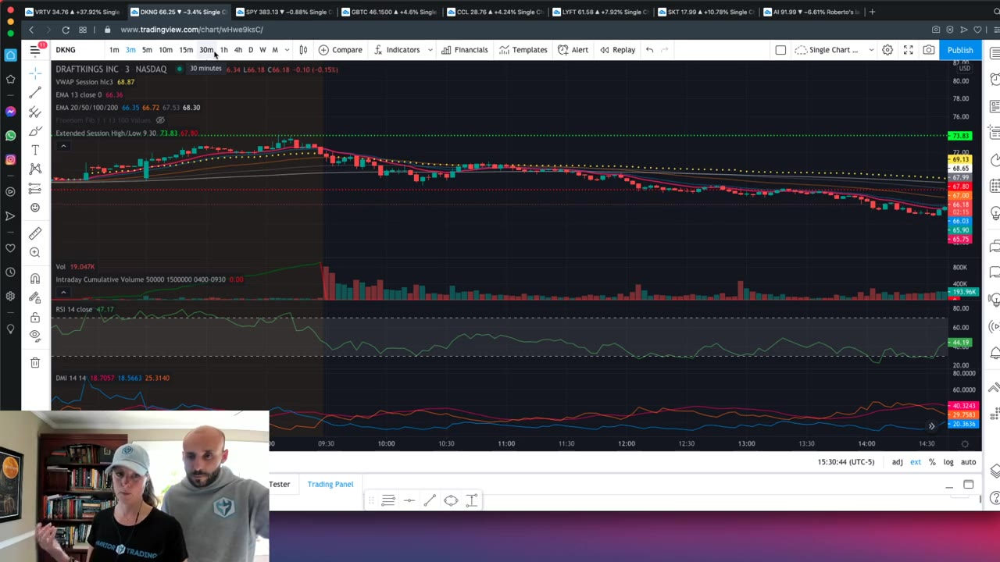

**图怎么看：**

- 在图表中，可以看到AI股票在纽约证券交易所的交易情况。
- 图表显示了AI股票的价格走势，包括开盘价、收盘价、最高价和最低价。
- 成交量柱的高度反映对应周期内的总成交量；红绿着色通常跟随价格柱的涨跌规则，不能直接拆成两种方向的主动成交。
- RSI指标显示了相对强弱指数，用于衡量市场超买或超卖的程度。

### 关键内容

- Celena使用RSI边缘，Roberto使用13 EMA三分钟回撤策略。
- 关注相对强度和交易量，识别市场趋势和潜在交易机会。
- DKNG开盘前表现强劲，但市场整体疲软，导致Celena不感兴趣。
- DKNG开盘后未能突破预市高点，表明市场仍处于弱势。
- AI开盘时表现弱势，支持短卖策略。
- DKNG开盘价为10950，短卖后立即盈利3美元/股。
- 当前支撑位（10570）现在变成阻力位，提供潜在低风险入场点。
- 三分钟图显示，尽管有大波动，但没有足够的力量突破关键水平，是一个重新审视的机会。
- 使用RSI和多个时间框架的RSI增加信心，识别潜在交易机会。
- GME导致Thinkorswim图表上的股票被移除，强调市场波动性
- DKNG开盘前的强劲表现与市场整体疲软形成对比，表明市场情绪分化，需谨慎判断市场趋势。
- AI的弱势表现与市场整体趋势相符，支持短卖策略，但需注意市场波动可能带来的不确定性。
- 使用RSI和交易量信息可以识别市场趋势，但需结合其他指标，以避免单一指标失效带来的风险。
- 当前支撑位转变为阻力位，说明市场力量变化，需及时调整交易策略，否则可能错失最佳入场时机。
- 三分钟图显示大波动但未突破关键水平，表明市场缺乏持续性，需谨慎对待短期波动带来的机会

### 分析与执行顺序

1. 分析市场开盘前的DKNG表现，识别潜在交易机会。
2. 使用RSI和交易量信息，确定市场趋势和潜在交易方向。
3. 结合Roberto的13 EMA三分钟回撤策略，寻找入场点。
4. 关注支撑位和阻力位的变化，调整交易策略。
5. 使用多种指标（如RSI、成交量）综合评估市场情况，制定交易计划。
6. 根据市场波动和关键水平，重新审视交易策略的有效性。
7. 利用交易伙伴帮助自己保持责任感，确保遵守交易规则

### 案例与细节

- DKNG在开盘前表现强劲，但市场整体疲软，导致Celena不感兴趣。
- DKNG开盘后未能突破预市高点，表明市场仍处于弱势。
- AI在开盘时表现弱势，支持短卖策略。
- DKNG开盘价为10950，短卖后立即盈利3美元/股。
- 当前支撑位（10570）现在变成阻力位，提供潜在低风险入场点。
- 三分钟图显示，尽管有大波动，但没有足够的力量突破关键水平，是一个重新审视的机会。
- DKNG在开盘价为10950时表现出强势，但未能突破预市高点，说明市场存在较强的阻力，需等待突破确认后再行动。
- AI在开盘时表现弱势，支持短卖策略，但若市场突然反转，可能会导致亏损，需谨慎操作。
- 当前支撑位（10570）转变为阻力位，提供潜在低风险入场点，但需注意市场波动可能导致策略失效

### 风险与边界

- 过早进入支撑位可能导致亏损。
- 忽视市场整体趋势可能导致错误的交易决策。
- 市场波动性可能导致策略失效。
- 使用单一指标可能无法全面反映市场情况。
- 过早进入支撑位可能导致亏损，特别是在市场突然反转的情况下，需谨慎判断市场趋势。
- 忽视市场整体趋势可能导致错误的交易决策，特别是在市场波动较大时，需综合考虑多种因素。
- 市场波动性可能导致策略失效，特别是在快速变动的市场环境中，需灵活调整策略

### 复盘问题

- 如何结合Celena和Roberto的策略来识别市场趋势？
- 在开盘前分析DKNG的表现时，哪些因素是关键？
- 如何利用RSI和交易量信息来制定交易计划？
- 在三分钟图上，如何识别潜在的交易机会？
- 如何利用交易伙伴帮助自己保持责任感？

---

## v0689：小账户挑战的经验与教训

> 日期：2021　·　时长：00:24:57

**本场重点：** 通过小账户挑战，Selena 认识到保持一致性、制定清晰计划和保持耐心的重要性。

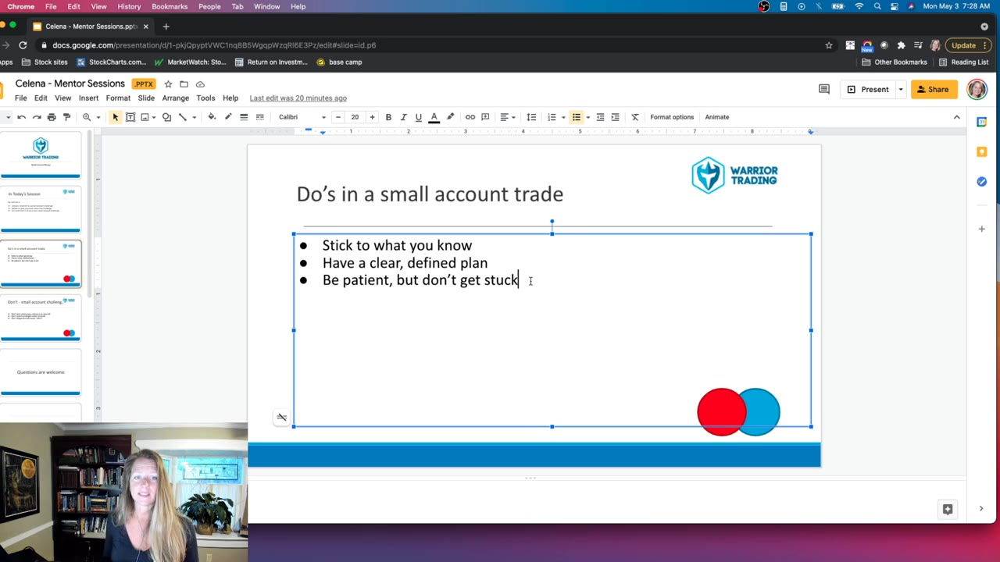

**图怎么看：**

- 在小账户挑战中，Selena认识到保持一致性、制定清晰计划和保持耐心的重要性。
- 通过图表和幻灯片展示，Selena分享了如何在小账户中成功交易。
- 幻灯片上显示了“Do's in a small account trade”，强调了坚持已知策略、制定明确计划和保持耐心的重要性。
- 图表展示了股票市场的波动情况，帮助理解小账户交易的风险和机会。

### 关键内容

- Selena 在小账户挑战中经历了多次失败，最终认识到需要回归基本策略。
- 她强调了保持一致性的重要性，即使用熟悉的交易工具和策略。
- Selena 提醒交易者要保持耐心，不要因为压力而频繁切换策略。
- 她指出，交易者需要明确自己的初衷，避免过度关注结果。
- Selena 强调了自我反思的重要性，包括识别自己的行为模式和情绪反应。
- 她分享了如何通过冥想来提高专注力，减少交易中的自我对话。
- Selena 提醒交易者要关注自己的交易习惯，特别是当遇到挫折时。
- 她提到在交易过程中保持清晰的交易计划和策略的重要性。
- Selena 分享了如何通过小账户挑战来改进自己的交易表现。
- 她强调了在交易过程中享受过程的重要性，而不是仅仅关注结果。

### 分析与执行顺序

1. Selena 回顾了她在小账户挑战中的经历，从成功到失败。
2. 她描述了自己如何在压力下频繁切换策略，导致交易失误。
3. Selena 分享了如何通过冥想来减少交易中的自我对话，提高专注力。
4. 她强调了保持一致性的重要性，即使用熟悉的交易工具和策略。
5. Selena 提醒交易者要保持耐心，不要因为压力而频繁切换策略。
6. 她分享了如何通过小账户挑战来改进自己的交易表现，包括识别和纠正不良习惯。
7. Selena 强调了在交易过程中保持清晰的交易计划和策略的重要性。

### 案例与细节

- Selena 在交易过程中出现了未来和过去的对话，这影响了她的决策。
- 她使用了 Think or Swim 和 Trading View 的图表进行分析。
- Selena 提到了如何通过调整交易策略来应对市场变化。
- 她分享了如何通过小账户挑战来改进自己的交易表现，包括识别和纠正不良习惯。
- Selena 强调了在交易过程中保持清晰的交易计划和策略的重要性。

### 风险与边界

- Selena 的经验是在较早的年代录制的，因此可能不完全适用于当前的市场环境。
- 交易者的市场环境和心理状态可能会随着时间发生变化，因此需要灵活调整策略。
- Selena 的经验主要集中在小账户交易，对于大账户交易者可能不完全适用。
- 交易者需要根据当前的市场情况和自身情况进行调整，而不仅仅是依赖过去的策略。

### 复盘问题

- 你在交易过程中是否经历过类似的未来和过去对话？如何处理这种情况？
- 你是否有明确的交易计划和策略？如果有，它们是如何帮助你改进交易表现的？
- 你在交易过程中是否遇到过类似的压力导致频繁切换策略的情况？如何克服这种压力？
- 你是否有明确的初衷，即为什么参与小账户挑战？这如何影响你的交易决策？
- 你在交易过程中是否使用过类似的工具和策略？它们是如何帮助你提高交易表现的？

---
