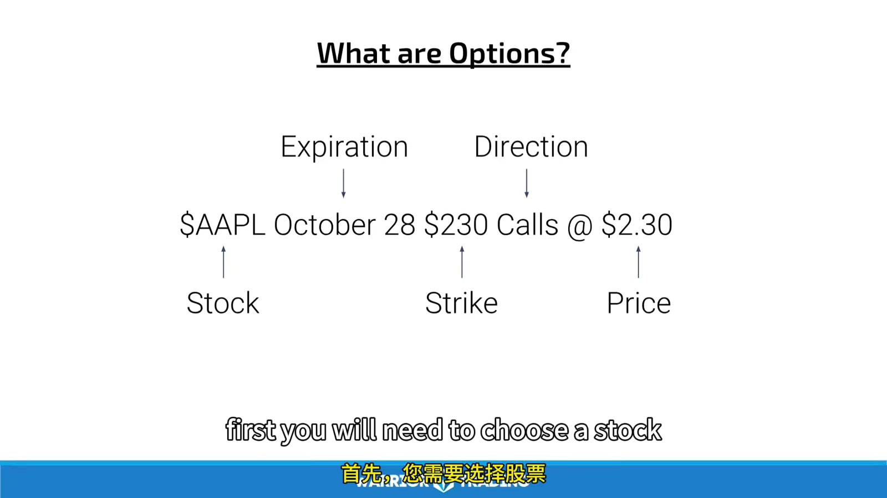
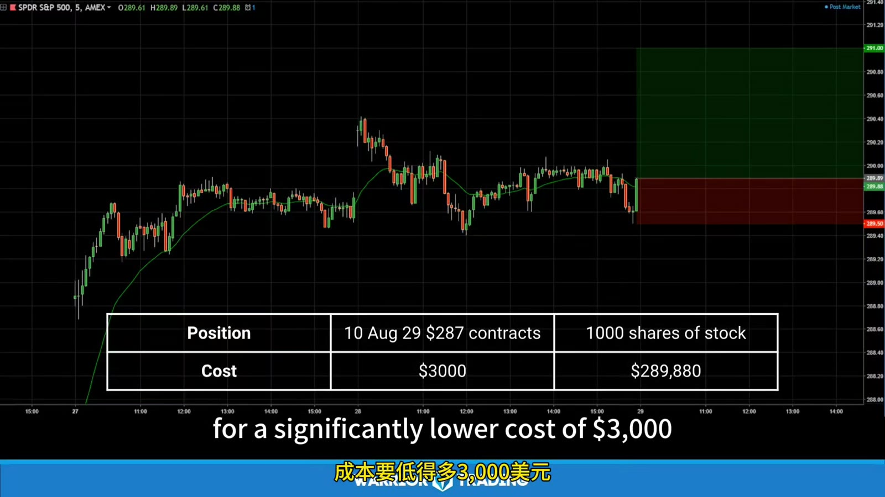

# Options Foundations and Leverage

> 对应视频：v0358

## v0358：Lesson 1

### Call、Put、Strike、Expiration

Option buyer 支付 premium 获得权利：

- Call：在规则允许的期限内按 strike 买入 underlying；
- Put：按 strike 卖出 underlying。

Option writer 收取 premium 并承担被 assignment 后履约的义务。美国标准 equity option 通常代表 100 shares，但 corporate actions 会产生 adjusted contracts，不能永远假定 deliverable 正好 100。



**图怎么看：**

- 一份具体合约必须同时读 underlying、call/put、strike、expiration。
- 画面中的 option price 是每股 premium；通常乘 multiplier 才是整张合约现金金额。
- Direction 对了仍可能亏：标的必须在足够时间内移动足够幅度，覆盖 premium、spread 和 fees。

### Expiration breakeven

课程用 AAPL 230 call、premium 约 2.25 举例。忽略费用，在 expiration：

```text
call breakeven = strike + premium paid
put breakeven  = strike - premium paid
```

若 underlying 到 240：

```text
intrinsic value = 240 - 230 = 10
net per share = 10 - 2.25 = 7.75
```

这是到期 payoff，不是持仓期间的实时盈亏公式。Expiration 前还有 extrinsic value、implied volatility 和 time。



**图怎么看：**

- 较少 premium 可获得较大 notional exposure，所以百分比收益会被放大。
- 同样的 leverage 也放大百分比损失；long option 可以在到期前变得接近 0。
- 画面挑选的是成功区间/最大涨幅，不能把 peak-to-peak return 当可重复成交结果。

### “Low risk, high reward”的边界

课程用 MRO、TLRY 等交易展示 long option 的最大损失通常限于已付 premium，以及在难借股票上用 put 表达看跌方向。需要补充：

- Long option 的**每张最大损失有限**，但若把账户大比例投入 premium，账户损失仍可很大；
- OTM option 完全归零的概率更高；
- Put 不需要 locate，但需要足够 options liquidity；
- Wide spread 可能让 chart 上的收益无法成交；
- Trading halt 会同时影响 underlying/options；
- Expiration 前可能被 broker 风控处理；
- Short option 的风险结构完全不同，可能超过所收 premium。

### 课程中的起步资金

视频建议 simulator 后以 $1,000–$3,000 开户，这是录制期个人意见，不是合适性标准。账户是否足够取决于：

- 每笔 max loss；
- 合约 premium × multiplier；
- spread 和 commission；
- 连续损失；
- 是否需要 exercise funds；
- broker options approval；
- 生活资金隔离。

若只能靠单笔投入账户 20%–50% 才让利润“有意义”，说明产品/规模与账户不匹配。

### 课程路线

后续四节依次讲：

1. 股票 chart 的技术分析；
2. 建 watchlist；
3. premium、volatility 与 Greeks；
4. strike、expiration、stop/target 和 size。

顺序合理：先定义 underlying thesis，再选择 derivative。不能先在 option chain 找最便宜合约，再为它编股票方向。
