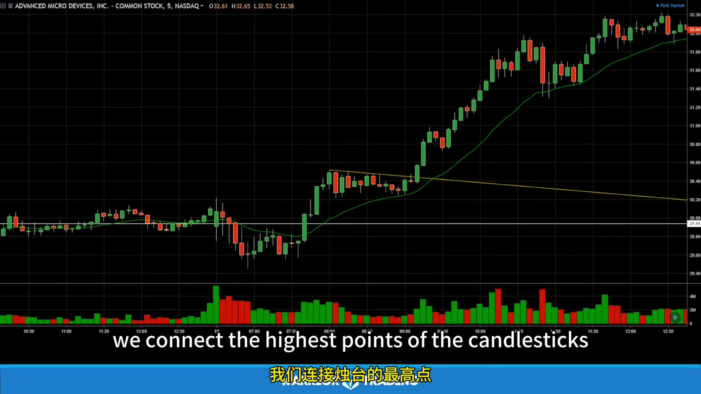
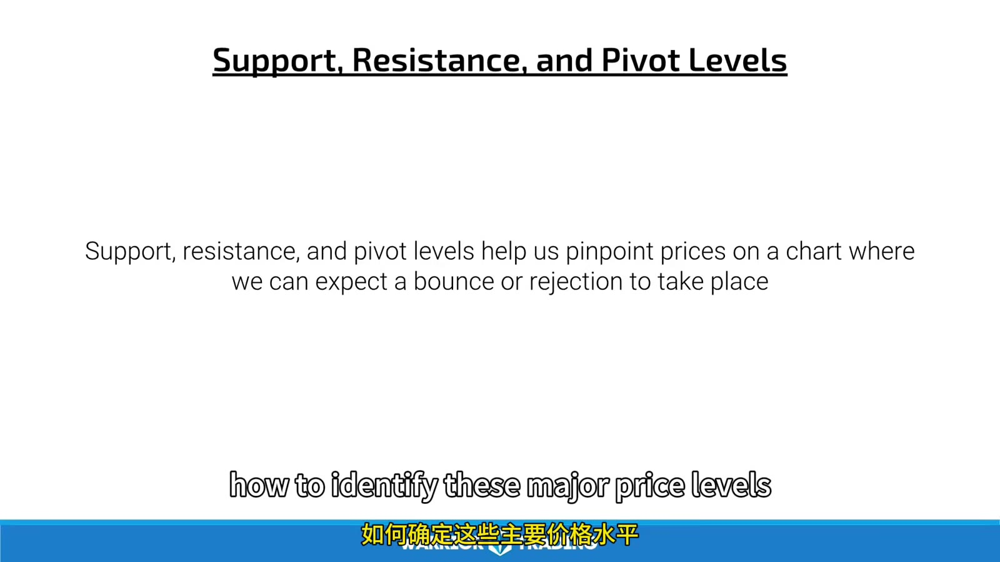
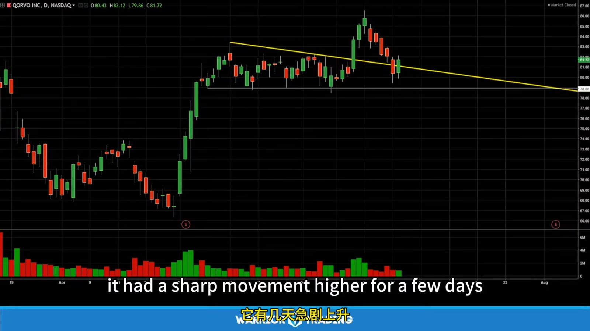
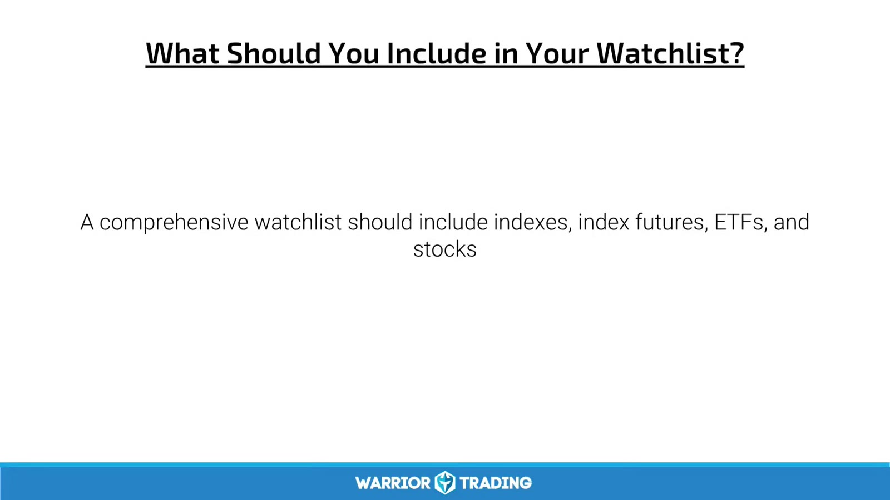

# Technical Analysis and Watchlist

> 对应视频：v0359–v0360

## v0359：Lesson 2 — Technical Analysis

课程的 options trade 全部从 underlying chart 出发。它使用：

- 多 timeframe；
- trend lines；
- 9 EMA、20 EMA、50/100/200 SMA；
- volume；
- support/resistance/pivot；
- consolidation；
- bull flag/bear flag；
- trend continuation。



**图怎么看：**

- Trend line 连接两个以上明确 swing points，第三次测试/突破更有验证意义。
- Break 后 retest 旧 support 为 resistance，才提供更清楚的 downside thesis。
- SQ breakout 配合异常 volume，用来提高 continuation 的可信度。

### Timeframe 对应持有期

- 1m/5m：very short-term day trade；
- 60m：数小时至数日的结构；
- daily：swing；
- 4h：24h futures/crypto 的中间视角。

Option expiration 应比 thesis 实现所需时间留余量。用 weekly option 交易尚未成熟的 daily pattern，会让 theta 在 thesis 验证前耗尽 premium。

### Moving averages

课程偏好 9/20 EMA 追踪短期 price，200 SMA 看 long-term trend。使用原则：

- Moving average 是 context，不是触碰即买；
- Period 必须和 timeframe 一起写；
- 价格、volume 和结构先于均线；
- 趋势强时可以长时间远离 average；
- 不要因 option 亏损而不断换更慢 average 当新 stop。



**图怎么看：**

- Pivot low/high 是明确转折区；之后重测时可能成为 support/resistance。
- 旧 resistance 突破并守住后可转 support，反之亦然。
- 水平 level 会被突破；课程用 BA/DBX/ROKU 等说明 volume 和 consolidation 影响突破质量。

### Consolidation patterns



**图怎么看：**

- Bull flag 必须有前置 impulse up，随后 sideways/downward consolidation；
- Bear flag 必须有 impulse down，随后 weak bounce/consolidation；
- 边界 break 才是 trigger，内部噪声不是；
- Option entry 还要确认 spread、IV 和 expiration，股票 pattern 正确不保证合约选择正确。

## v0360：Lesson 3 — Watchlist

课程从“每天追 scanner/chat 热股”转向维护 core watchlist。长期跟踪能看到 chart 的“故事”，降低开盘时临时分析压力。



**图怎么看：**

- Broad indexes 提供市场方向，sector ETF 提供行业相对强弱，individual names 提供交易 setup。
- 一只 tech stock 的 bearish pattern 若 Nasdaq/sector 正强，short thesis 需要更高门槛。
- Futures 近 24h 价格可补充 overnight context，但连续符号 `ES1` 等依 chart vendor 定义，不是下单代码。

### Watchlist 层级

1. Broad market：S&P 500、Nasdaq、Dow、Russell 等；
2. Index futures：观察 overnight risk-on/off；
3. Sector ETFs：如 financial/technology/energy；
4. Global/emerging market context；
5. Actively traded stocks：实际寻找 95% 左右的交易机会；
6. Event list：earnings、macro、company news。

### 收盘后的准备

```text
scan core list
mark daily/60m levels
identify forming patterns
note earnings and events
define bullish/bearish scenarios
estimate time needed
choose candidate expiration range
only at market hours inspect live chain/liquidity
```

课程强调几天没有机会是正常的。稳定 watchlist 的价值是培养 patience，而不是保证每天从列表里选一笔。

### 避免 watchlist 膨胀

每个名字必须回答：

- 它为何与我的 strategy 相符；
- 日均 option volume/open interest 是否够；
- bid/ask spread；
- 是否有 upcoming earnings/dividend；
- 我知道哪个 timeframe 和 level；
- 多久未提供机会后删除。

列表太大时，收盘分析流于表面，反而回到临时追逐。
