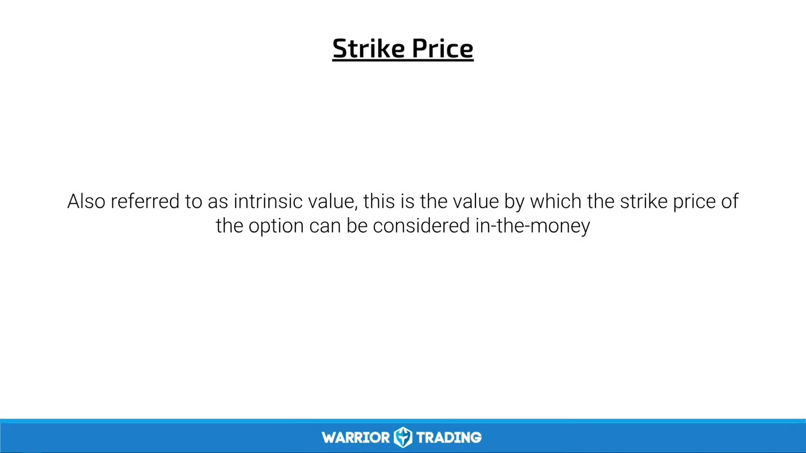
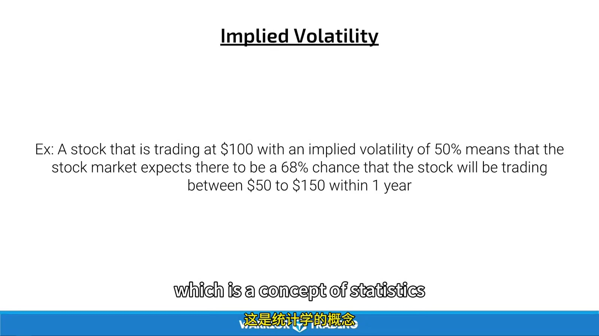
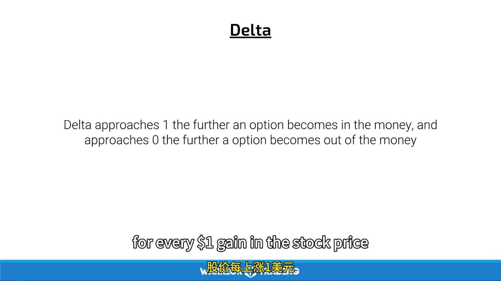

# Premium, Greeks, and Option Chain

> 对应视频：v0361

## v0361：Lesson 4

### Intrinsic 与 Extrinsic



**图怎么看：**

- Call：underlying 高于 strike 的部分是 intrinsic；Put 相反。
- OTM option intrinsic 为 0，premium 全部是 extrinsic。
- ATM 附近通常对 underlying 和 IV 变化最敏感；远 OTM 虽便宜，归零概率也高。

公式：

```text
call intrinsic = max(stock - strike, 0)
put intrinsic  = max(strike - stock, 0)
extrinsic      = option premium - intrinsic
```

较长期限通常有更多 time value，但 premium 并非只由时间决定，还包含 IV、rates、dividends 等。

### Volatility

- Historical volatility：过去 realized movement；
- Implied volatility：从 option prices 反推的未来波动定价；
- IV 高通常 premium 高；
- Event 后即使 underlying 朝预期方向动，IV crush 也可能抵消 delta gain；
- “低 IV 最适合买”过于绝对：低 IV 可能因为市场正确预期未来波动低。



**图怎么看：**

- 同 expiry 下 strike 越 OTM，premium 通常更低且 delta 更小。
- 比较时同时看 bid/ask、last、volume、open interest；last 可能是很久前的成交。
- Earnings 前后不能只看 chart，IV term structure 是合约选择的一部分。

### Greeks

| Greek | 课程含义 | 注意 |
|---|---|---|
| Delta | underlying 变动 1 单位时 option 的一阶近似变化 | 会随价格、时间、IV 改变 |
| Gamma | delta 对 underlying 的变化率 | 临近到期 ATM 常更敏感 |
| Vega | IV 变 1 percentage point 时 premium 的近似变化 | 不同期限差异大 |
| Theta | 其他条件不变时随时间流逝的近似损耗 | 非线性，接近到期加速 |

Greeks 是模型局部敏感度，不是保证。大幅跳空、IV 同时变化和 wide spread 时，简单 `delta × stock move` 会偏离。



**图怎么看：**

- Call delta 为正、put delta 通常为负；
- Gamma 解释为什么 delta 不固定；
- Vega/Theta 与 option price 的单位要从平台确认；
- 视频口头把某 theta 数字映射为 5 cents 时，要按画面小数位和 multiplier 重算，不能机械抄。

### Option chain 下单流程

1. 确认 underlying；
2. 确认 exact expiration；
3. 选择 call/put；
4. 读取 strike 与 ITM/ATM/OTM；
5. 读取 bid × size、ask × size、spread；
6. 检查 volume/open interest；
7. 检查 IV 与 Greeks；
8. 选 `Buy to Open` / `Sell to Close` 等正确 action；
9. 输入 contracts 和 limit price；
10. 在 confirmation 核对 multiplier、debit、max loss 和 exercise/assignment。

课程提到可以关闭 confirmation。学习阶段不建议为了速度取消；一旦错 expiration 或 contracts，option leverage 会迅速放大错误。

### Expiration/assignment 风险

课程主要交易 long premium 并在到期前卖出，但仍必须知道：

- ITM standardized equity options 在 expiration 通常会自动 exercise；
- Long call exercise 可能需要支付 `strike × deliverable`；
- Broker 可因资金不足在到期前平仓；
- American-style option holder 可在到期前 exercise；
- Short writer 可能提前 assignment；
- Multi-leg 到期后可能只一条腿被 assignment，形成意外股票仓位。

OCC 明确要求交易前阅读当前 Options Disclosure Document；旧课程不能替代该文件。
