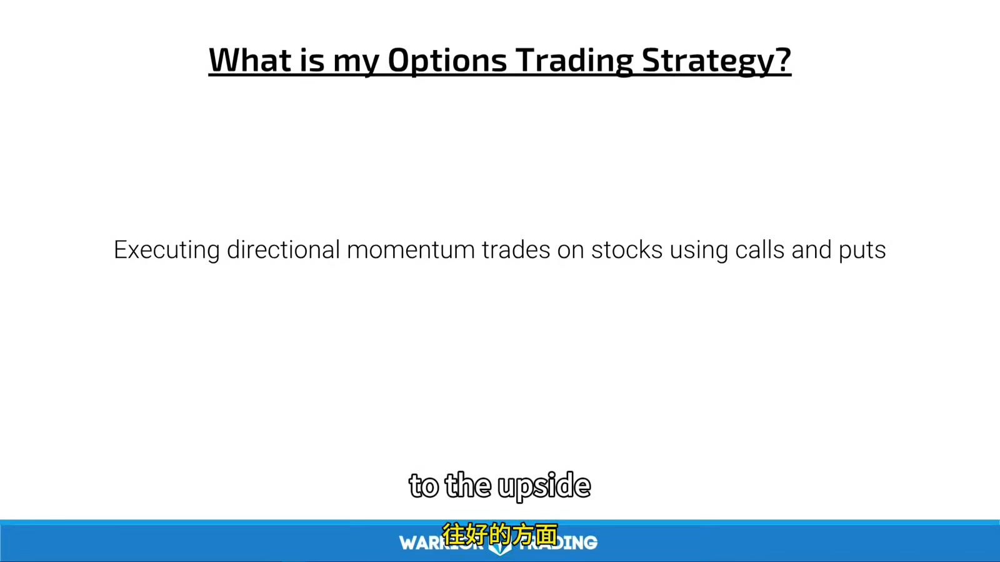
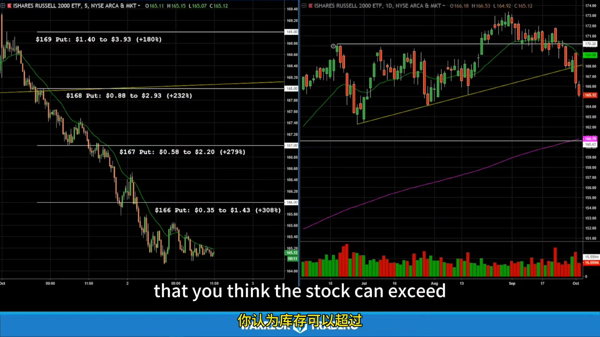
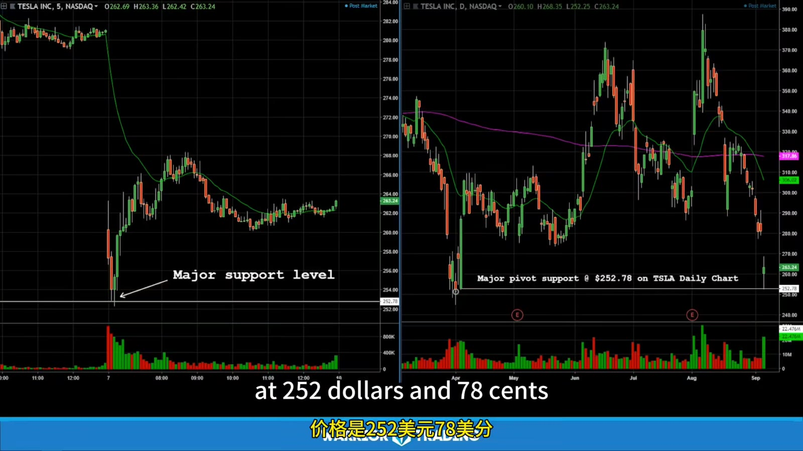

# Trade Planning and Risk

> 对应视频：v0362

## v0362：Lesson 5

这节把 underlying setup、strike、expiration、risk/reward 和 position size 组合成一笔 option trade。



**图怎么看：**

- 股票 chart 先给 trigger、stop、target 和预期所需时间；
- Option chain 再决定哪张合约最能表达 thesis；
- 若 underlying setup 尚未 trigger，premium 再便宜也不应先买。

### Timing

课程追求 entry 后尽快盈利，避免持仓等待时 theta 消耗。可执行定义：

- Pattern 已成熟；
- 价格接近 trigger；
- spread 可接受；
- IV/event risk 已知；
- underlying 与 option quotes 同步；
- 若若干 candles 内无 follow-through，执行 time stop。

“立即盈利”是理想，不是判断 trade 正确的唯一标准；不要为了追求它用 market order 穿过 wide spread。

### Strike selection

课程偏好可合理跨越的 slightly OTM strike，理由是 capital 小、percentage return 高。



**图怎么看：**

- OTM 合约 peak return 更高，部分来自初始 premium 很小；
- 同一 stock move 下 ITM 合约 delta 更高、价值保留通常更好；
- 图展示“最大可能回报”，未包含 entry/exit spread、成交量和未卖在 peak 的现实。

选择时同时比较：

```text
probability stock reaches strike
delta
extrinsic value
bid/ask percentage
volume/open interest
IV
max premium at risk
break-even at expiration
```

远 OTM lottery-like contract 不应因单价低就买更多。

### Expiration selection

课程规则大意：

- 5m/60m short-term setup：near-dated；
- Daily/swing pattern：further-dated；
- Same-week option 更便宜、百分比更敏感；
- Longer-dated 给 thesis 更多时间，但 premium 更高。



**图怎么看：**

- 近到期 260 call 百分比变化巨大，是低 premium、high gamma/theta 的共同结果；
- 远到期合约不会因 stock 同样上涨就有同样百分比；
- “多买时间”也会多付 extrinsic；选择要和预计实现窗口匹配。

### Stop 与 target

视频建议 option premium stop 10%–50%、target 30%–150%，追求 3:1。不能固定套用，原因：

- Underlying 结构不同；
- Near-expiry premium 自然波动可能超过 10%；
- Wide spread 本身可能占 10%；
- IV 变化会让 premium stop 在 underlying 未失效时触发；
- Gap 可能造成 100% premium loss。

更稳妥：

```text
underlying invalidation
→ estimate option value under that scenario
→ add spread/slippage
→ derive contracts from max dollar risk
```

Option stop 和 underlying alert 可同时用。不要只看 option chart，因为它可能缺成交。

### Position size

课程提出初学者每笔风险约账户 1%–3%，经验者可更高，并用个人 $500 max loss 示例。百分比不是授权：

```text
contracts
= floor(max_dollar_risk /
        estimated_loss_per_contract_at_stop)
```

若最坏情况是 premium 全损，应再检查：

```text
premium_paid × multiplier × contracts
```

是否在账户允许范围。课程提到单笔 10% 风险属于非常高风险，即便技术熟练也可能连续几笔摧毁账户。

### Breakeven stop

Option 盈利后把 stop 调到 purchase price，未必真的无损：

- bid 可能低于 stop；
- stop 触发滑点；
- commissions/fees；
- option quote 可能间歇；
- underlying halt；
- partial fill。

所以应称“尝试保护成本”，不能说 worst case 必然为 0。

### Exit before expiration

课程目标是交易 premium，而不是 exercise 接股票，因此通常到期前 `Sell to Close`。到期前检查：

- contracts 全部为 0；
- 没有 pending orders；
- 没有 accidental short option；
- 没有被 exercise/assignment；
- broker statement 和 buying power 正常。

FINRA 提醒，ITM equity options 通常会自动 exercise，且 long call 可能需要足够资金购买 100 shares/contract；不能只因为“原计划会提前卖”就忽略 expiration procedure。

## 一页计划

```text
Underlying:
Setup/timeframe:
Trigger:
Invalidation:
Target:
Expected time:

Expiration:
Call/Put:
Strike:
ITM/ATM/OTM:
Bid/Ask:
Delta/Theta/Vega:
Event/IV risk:

Limit entry:
Contracts:
Max premium:
Estimated loss at underlying stop:
Partial/target:
Time stop:
Exit-before-expiration deadline:
```
