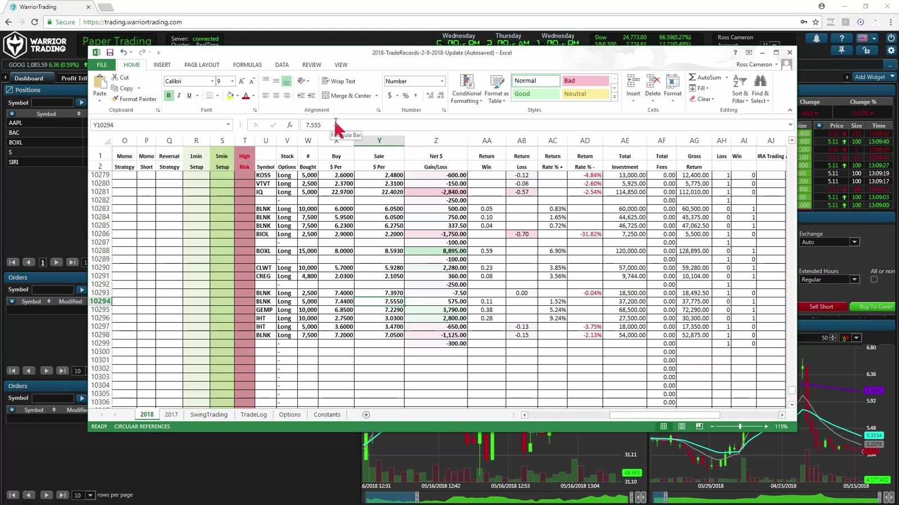
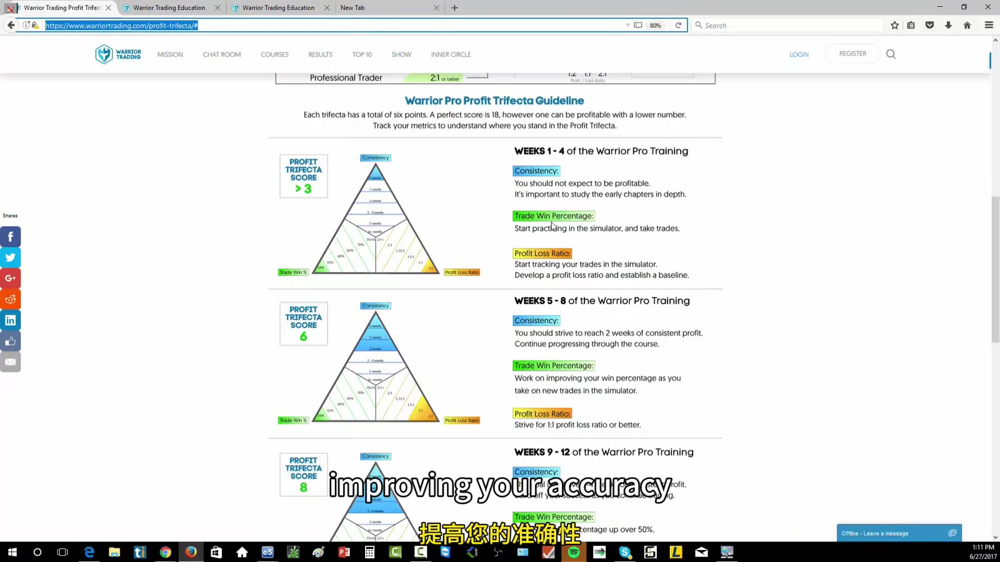

# Trade Journal and Profit Trifecta

> 对应视频：v0338–v0339
> 核心问题：把每笔交易变成可统计样本，并用 consistency、accuracy、profit/loss ratio 找出最先要修的弱点。

## v0338：Trade-reporting Spreadsheet



**图怎么看：**

- 一行是一笔 round trip，至少录入 ticker、direction、shares、average entry、average exit。
- P&L 自动计算后要和 broker statement 对账；视频为方便会把约 $7 记成 $10，这适合粗略回顾，不适合税务或精确绩效。
- Commissions 单独在底部扣除；若公式把 commission 行误算成 losing trade，accuracy 会被污染。

### 视频实例

课程用 BLNK、BOXL 等当日交易演示：

1. 录入 long/short；
2. 输入 shares；
3. 输入平均买价和卖价；
4. 检查表格算出的 gross P&L；
5. 与平台 P&L 比较；
6. 扣 commissions；
7. 查看 average winner/loser 的 cents per share、accuracy 和月度累计。

视频允许新增 IRA、1-minute/5-minute、high/low risk、momentum strategy 等列。新增字段的原则是之后会用它回答问题；否则只增加填写成本。

### 推荐字段

```text
trade_id
date/time/timezone
symbol and side
setup and catalyst
entry reason
shares and average entry
initial stop and planned risk
target
partial fills
average exit
gross P&L
commissions, regulatory fees, borrow fees
net P&L
MFE and MAE
slippage
followed_plan
rule_break
screenshot_before / after
lesson and corrective action
```

如果多次 add/partial，不要把肉眼平均数写进表里；从 execution export 按 fill 加权：

```text
weighted average = sum(price × shares) / sum(shares)
net P&L = gross P&L - all trading costs
```

## v0339：Profit Trifecta

Profit Trifecta 的三个维度：

1. **Consistency**：连续盈利的周数；
2. **Trade win percentage**：盈利交易数 / 总交易数；
3. **Profit/loss ratio**：average winner / absolute average loser。



**图怎么看：**

- 三条边不是三个互相独立的奖章；accuracy 高但 average loser 过大，仍可能亏损。
- 视频按每个维度分层给分，再相加观察训练阶段；分数是诊断工具，不是资金放大的自动许可。
- 录制材料把 7 分以上称为“很可能盈利”等，只是课程经验阈值，不能当统计保证。

### Expectancy 才是底层关系

```text
expectancy
= win_rate × average_win
  - loss_rate × average_loss
  - average_cost_per_trade
```

例如 55% accuracy 与 1:1 gross ratio 在忽略成本时有轻微正期望；若交易频率高、费用和 slippage 大，net expectancy 仍可为负。

### 如何定位弱项

- Accuracy 低、ratio 好：检查 entry selection、confirmation 和 market regime；
- Accuracy 高、ratio 差：检查 average down、late stop、过早获利；
- 两者尚可但不 consistency：检查 size 变化、overtrading、某些星期的 rule breaks；
- Gross 正而 net 负：检查 commissions、borrow、data/platform cost 与 slippage；
- 分数提高但 drawdown 也扩大：可能只是 share size 增大，不是 edge 改善。

### Scale-up gate

视频展示 equity curve 随 confidence 和 shares 增长。更稳妥的 gate 是同时满足：

- 至少一组足够大的样本；
- net expectancy 为正；
- 各 setup 分开后仍有 edge；
- 最大回撤在预设范围；
- 没有 average-down/stop violation；
- 增仓后仍能按同样速度退出；
- 只把 size 增加一个小台阶；
- 若表现跌破阈值，自动退回上一档。

## 静态 spreadsheet 的审阅结论

资源包里的模板包括 2019 trade records、Roberto monthly tracker、WarriorLog、position-size calculator 等。可取之处：

- `TradeReview` 同时记录 strategy、side、entry、stop、target、closing、plan adherence 和 corrective action；
- `MissedTrades` 单独记录“为什么错过”，避免把未成交机会混入真实 P&L；
- `Trading Plan` 把目标 accuracy、P/L ratio、average win/loss 和 daily expectation 关联；
- Position-size calculator 使用：

```text
risk_per_share = abs(entry - stop)
shares = floor(max_dollar_risk / risk_per_share)
```

需要修正的地方：

- 某些表含旧 broker ECN/commission 常数；
- 有的 sheet 范围扩到整列，文件很大且慢；
- 公式可能把空白、commission 行或未完成 trade 算进 accuracy；
- 2018/2019 示例数据、旧 IRA/settlement 假设不能直接用于今天；
- Position size 公式没有自动限制 liquidity、buying power、gap/slippage 和最大持仓占比。

因此最实用的做法不是继续叠加模板，而是从最小字段开始，用 broker fills 对账，再只添加能形成决策的列。
