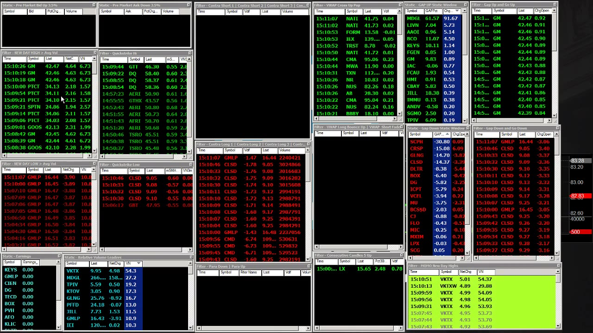
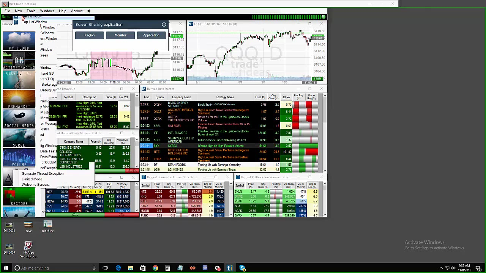

# Scanner Research and Submitted Tools

> 对应视频：v0340–v0341
> 核心问题：怎样把 scanner 从“会响的窗口”变成有定义、有统计、有拒绝标准的研究工具。

## v0340：Primus Scanner（资源版）

这段和模块 05 的 Primus demo 内容接近，但更完整地讨论自定义代码、cross-reference、idea generation 与 automation 的边界。



**图怎么看：**

- 同屏有 new high/low、relative volume、earnings、contra、parabolic、VWAP 等不同逻辑。
- 一个 ticker 同时命中多个独立条件，可提高“值得打开图表”的优先级；不是自动提高胜率。
- 任何 scanner 都要知道字段定义和更新时间，否则 cross-reference 可能只是重复计算同一件事。

### 本场新增细节

- **VWAP scans：**既找 pullback to VWAP and hold，也找从下方测试 VWAP 后 failure；同一个 level 的方向由 price action 决定。
- **Idea support：**scanner 提示候选后，打开 chart 定义 entry/stop；视频多次强调 alert 不等于 trade。
- **Linked chart：**某 scan 命中后自动在旁边显示 daily/intraday，加快人工检查。
- **Formula builder：**字段插入和 validation 降低语法错误，但仍需 out-of-sample 统计。
- **Multiple hits：**短时间同时出现在 contra、new low、relative volume 等窗口，是多条件汇合。
- **Automation：**若用于自动交易，过滤标准必须比人工 idea generation 严格得多，还需订单、仓位和 kill switch 层。

## v0341：Trade Ideas Webinar

Webinar 展示 Alpha Predator、pattern recognition、AI/Holly-style strategies、backtest/optimization 和 strategy metrics。



**图怎么看：**

- 机器把 price/volume events 组合成统计候选，目标是减少人工持续扫图。
- 策略窗口给出 entry/stop/target 或历史 metrics，不代表未来环境和训练期相同。
- 大量参数和历史组合很容易产生过拟合，最好把最终若干月完全留作验证。

### 从零构建条件

视频用 60-day high、$1–$50 price range 等事件演示。研究记录至少写：

```text
idea: why this event may have edge
universe
session
event definition
filters
entry delay and order type
stop/target/time exit
fees and slippage
in-sample dates
out-of-sample dates
trades and unique days
win rate
average winner/loser
expectancy
max drawdown
regime breakdown
rejection threshold
```

### AI 的正确理解

课程里的 “AI” 更接近对预定义事件/过滤器的搜索、优化和统计选择，不是知道公司未来价值。即使平台展示高历史胜率，仍要问：

- 搜索了多少组合；
- 是否包含 delisted symbols；
- 是否用当时可获得的数据；
- fill 用 bid/ask 还是理想价格；
- 是否计入 halt、spread、部分成交；
- 是否在完全未见时期验证；
- 同日多个 signal 是否高度相关。

视频末尾用“拿到 Tiger Woods 的球杆也不会自动打好”总结工具边界：软件提高发现和研究效率，不能替代策略训练与风险纪律。

## 静态资源的处理

资源包另含旧 layout 下载链接、Primus/Trade Ideas setting link、premarket scanner 截图、cheat sheet、monitor rules、terminology 文档和多份学生 spreadsheet。没有直接保留它们，原因分别是：

- 下载链接和浏览器要求可能失效；
- 热键/layout 可能包含旧账户、旧 route 和危险 size；
- Cheat sheet 把形态压缩成固定 entry/stop，缺少 market context；
- Halt code、PDT、fees 和平台规则可能过时；
- 多份 spreadsheet 功能重复，公式未经逐项验证。

对应的可复用信息已经写入本目录和 Trading Tools。需要重建 scanner/layout 时，应从当前平台空白配置开始，并逐项验证。
