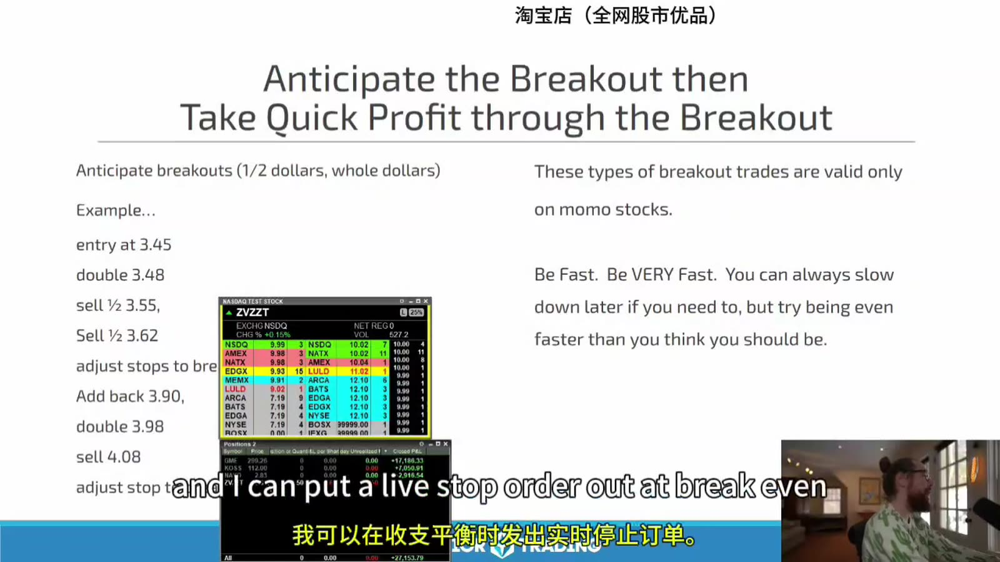
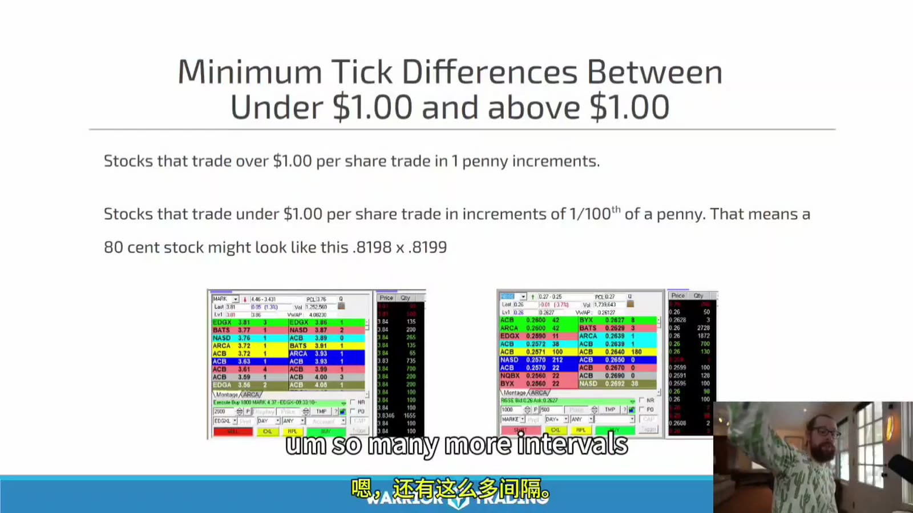
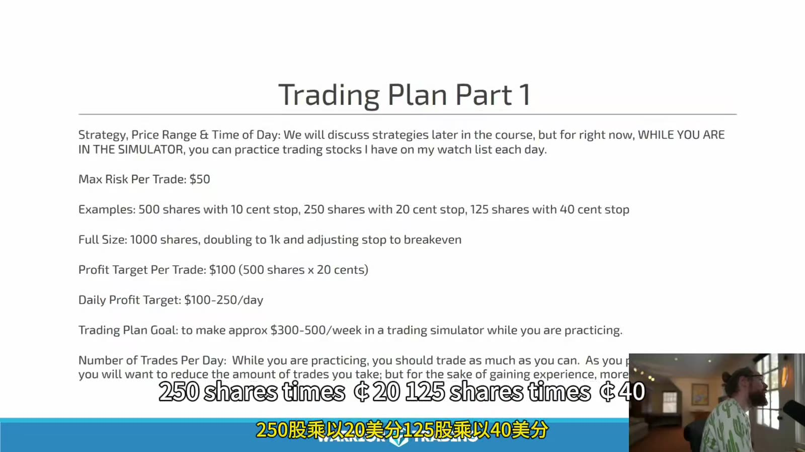
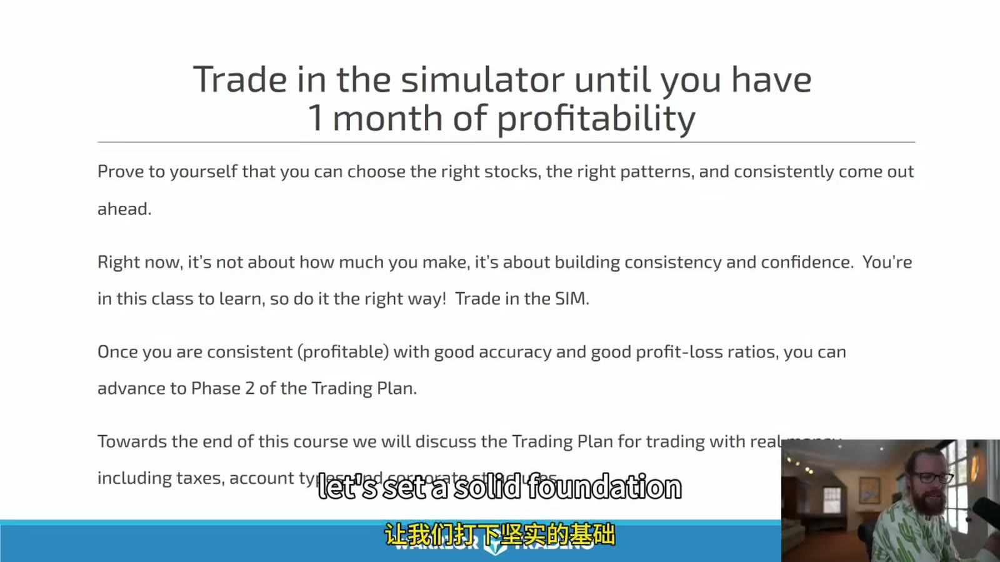

# Small Cap 01：策略框架与模拟计划

> 对应视频：Chapter 1 Part 1–2
> 本节重点：这套方法交易的是注意力和短期动量，不是“低价股必涨”；先把股票池、触发、退出和样本验证拆开。

## 1. 策略的基本链条

课程的 long momentum 框架：

`催化或异动 → 成交量集中 → 价格突破 → 回撤整理 → 再次扩张`

交易者试图在突破前后参与，并快速减仓。它同时依赖：

- 当日确实有集中注意力；
- 股票能承受计划仓位；
- 入场到失效点的距离可控；
- 突破后有足够 follow-through；
- 假突破时能真实退出。

“Buy high, sell higher”只是趋势交易的口号。没有明确 invalidation 时，它会退化成追高。

## 2. Price / Float 只是初筛

课程通常偏好较低价格、较低 float，并允许在极端热门行情中例外交易更高价、更大 float 的股票。为避免所有失败都被规则排除、所有成功都被称为“例外”，应事先定义：

- 核心 price / float 范围；
- 允许例外的 RVOL、dollar volume 和 catalyst；
- 例外仓位是否降低；
- 哪些统计与核心股票池分开。

低 float 会放大涨幅，也会放大 spread、halt、offering 和无法退出的风险。

## 3. Breakout Anticipation



**图怎么看：**

- 示例在 3.45 附近进入，3.50 附近加仓，突破后分批卖出，再按新的结构重新加仓。
- 提前进入可以改善均价，也承担“突破从未发生”的风险。
- 卖出后把 mental stop 调到 average cost，只是价格上的 break-even；费用与滑点仍可能使净结果为负。
- 多次 add-back 会产生一串不同 setup，日志必须分别记录，而不能合并成一笔漂亮的大赢家。

把 anticipation 和 confirmation 分开统计：

| 类型 | Entry | 优点 | 主要风险 |
|---|---|---|---|
| Anticipation | 阻力下方 | 均价较低 | 未确认、假突破 |
| Trade-through | 突破成交 | 条件已触发 | 滑点、追高 |
| Retest | 突破后回踩 | invalidation 清晰 | 可能不给回踩 |

## 4. Fixed Profit 不能脱离波动

课程常用“每股先赚 10 cents”的训练目标。对于 3 美元和 100 美元股票，10 cents 的意义完全不同；对 spread 已 0.10 的股票更没有意义。

目标可以根据：

- 第一技术阻力；
- 结构风险的 R multiple；
- ATR / intraday range；
- Level 2 深度；
- halt band；

设定，而不是固定 cents。

## 5. Penny Tick 与 Sub-penny



**图怎么看：**

- 画面指出低于 1 美元的证券可能显示更细报价，而 1 美元以上通常以一美分报价。
- 报价增量、可显示价格和实际执行价格受适用规则、场所和订单类型影响，不能只靠画面记边界。
- 更细 tick 不会自动增加可交易性；极低价股通常 dollar spread 小，但百分比 spread 和市场冲击可能很大。
- 课程据此排斥 penny stocks 的真正理由应写成流动性、合规、报价和操纵风险，而不只是一条价格线。

比较成本时使用：

`Spread % = (ask - bid) ÷ midpoint`

0.01 spread 对 0.20 美元股票约为 5%，对 20 美元股票约为 0.05%。

## 6. 课程的“利润垫”需要降级

课程讲者会在先盈利后扩大 size，理由是已有 cushion。账户 P&L 不会改变下一笔交易的概率；它只改变人的心理和当日剩余风险预算。

安全写法：

- 单笔风险不因已盈利无限上升；
- 当日累计风险有固定上限；
- scaling 只能来自经过验证的 setup 和流动性；
- 盈利回吐达到阈值时停止；
- 不用“house money”描述已赚到的钱。

## 7. 模拟 Trading Plan



**图怎么看：**

- 课件用每笔最大 $50 风险，按 0.10/0.20/0.40 stop 分别换算 500/250/125 shares。
- `shares = max risk ÷ per-share risk` 的计算框架正确。
- `full size = 1,000 shares` 与前面的风险公式冲突；full size 仍应由当笔 stop 决定。
- 每日 $100–$250 profit target 和每周目标只是训练示例，不应制造必须交易的压力。

模拟计划建议固定：

```text
股票池:
可交易时段:
唯一 setup:
max risk per trade:
max risk per day:
最大交易次数:
订单类型:
保守 slippage:
日志字段:
review date:
```

## 8. 一个月盈利不等于准备 Live



**图怎么看：**

- 画面强调先证明能选对股票、形态并保持盈利，这个方向正确。
- “1 month”只是短期门槛，可能只有少量样本或单一市场环境。
- 还需检验 sim fill 偏差、最大回撤、规则遵守和 live 最小规模。
- 不能因为课程下一阶段到了就自动切换真钱。

更完整门槛：

- 所有交易计入实际成本和保守滑点；
- 至少覆盖多个 volatility regimes；
- 没有严重平台错误；
- drawdown 在计划范围；
- 违规交易不贡献主要利润；
- 最小 live size 可承受最坏 fill；
- 有停止和退回 sim 的条件。

## 9. 适配度

课程将快速反应、计算机能力和风险容忍度与 1 分钟交易联系起来。这不表示反应慢就只能失败；可以选择：

- 5 分钟确认；
- 更少标的；
- 更少交易；
- 预设 stop/target；
- 更高流动性的股票；
- 完全不同的持有周期。

策略应适配交易者，而不是为了模仿讲者强迫自己进入最快节奏。

## 10. 本章输出

完成本章后只做两件事：

1. 写出单一 setup 的完整规则；
2. 在模拟环境收集未经筛选的连续样本。

不要因为理解了“anticipate breakout”就开始真钱交易。**框架的价值在它能被拒绝、被统计，而不是听起来合理。**
