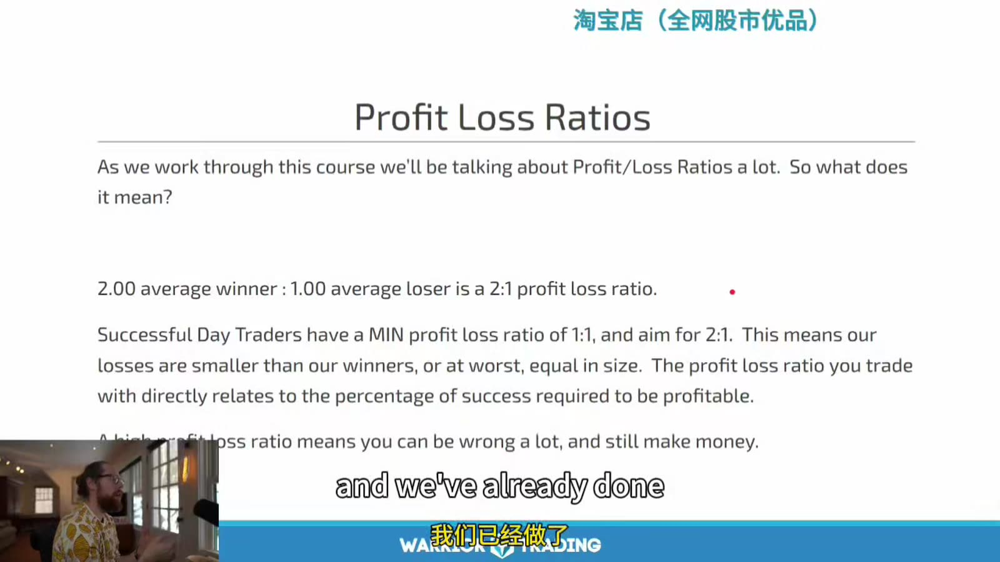
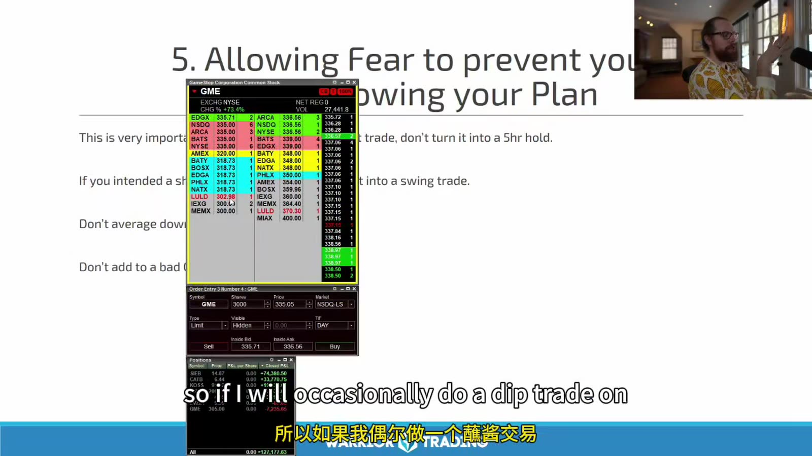

# Small Cap 02：风险管理

> 对应视频：Chapter 2
> 本节重点：从 expectancy、risk of ruin 和真实成交定义风险；“止损价”只是计划输入，不是最大损失保证。

## 1. 三个层级

### Trade risk

- entry 到 invalidation；
- spread / slippage；
- partial fill；
- halt / gap；
- borrow / fees。

### Session risk

- daily max loss；
- correlated positions；
- pending orders；
- emotional escalation；
- platform failure。

### Account risk

- leverage；
- concentration；
- drawdown；
- capital withdrawals；
- tax / settlement obligations。

只控制每笔 stop，仍可能因交易次数和相关性形成不可承受的当日风险。

## 2. Profit/Loss Ratio



**图怎么看：**

- 课件用平均 winner 2、平均 loser 1 表示 2:1。
- 单独的 2:1 不保证盈利；还需要胜率、费用和样本量。
- “成功交易者最低 1:1”不是普遍门槛，高胜率策略可以低于 1:1，低胜率策略需要更高 payoff。
- 平均值可能被极少数大单扭曲，应同时看 median 和尾部分位数。

成本后 expectancy：

`EV = p × avg_win - (1-p) × avg_loss - avg_cost`

Profit factor：

`PF = gross profits ÷ gross losses`

还要看 max drawdown、loss streak 和 left-tail，不把 EV 当完整风险报告。

## 3. 胜率不是 50/50 猜硬币

一笔交易不是因为结果只有赢/亏就各 50%。胜率来自：

- setup 条件；
- exit rule；
- data / fill；
- market regime；
- 执行行为。

同一 setup 如果过早止盈，胜率可能升高但 payoff 降低；扩大 stop 也可能制造“高胜率”并积累罕见巨亏。

## 4. Risk per Trade

流程：

1. 定义结构失效点；
2. 估算实际 entry；
3. 加入 slippage reserve；
4. 计算每股风险；
5. 用美元风险反推股数；
6. 再按流动性、notional 和 halt risk 降低。

```text
expected entry = 4.08
structure stop = 3.92
slippage reserve = 0.04
per-share risk = 0.20
max risk = $40
shares = 200
```

若一只低 float 股票可能在 halt 后直接到 3.20，`$40` 并不是保证最大损失；对 halt-exposed trade 必须进一步减仓或放弃。

## 5. Average Down 改变的是风险，不是胜率

下跌后加仓会：

- 改善 average cost；
- 增加 shares；
- 把总 dollar risk 放大；
- 让退出更难。

只有策略事前定义分批 entry、统一 invalidation 和最大总风险时，才是计划内 scale-in。因为亏损而临时加仓是规则改变。

## 6. Fear 与冻结



**图怎么看：**

- 右侧交易窗口覆盖在课件上，说明心理失控最终会表现为具体订单。
- 常见形式包括：不按 stop、过早止盈、把 day trade 变 swing、亏损后不敢做下一笔合规信号。
- Fear 不是理由标签；复盘要记录它改变了 side、size、price 还是 timing。
- 解决方案是自动限制、减小规模和预演，不是要求自己“更勇敢”。

## 7. 把 Day Trade 变 Swing 的风险

因亏损不愿平仓而隔夜，会突然新增：

- overnight gap；
- after-hours liquidity；
- financing / news；
- borrow；
- margin changes；
- 无法按日内 stop 退出。

如果 swing strategy 不是事前计划，收盘前必须按 day-trade invalidation 处理；不能用长期故事覆盖短期错误。

## 8. Daily Max Loss

设置时考虑：

- 正常单笔 R；
- 正常 losing streak；
- 当日可接受 account %；
- 平台是否支持 hard lock；
- open risk 是否纳入。

示例：

```text
R = $25
soft pause = -2R
hard stop = -3R
profit giveback stop = max(固定金额, 当日高点回吐比例)
```

Soft pause 用来审查市场与行为，hard stop 不允许主观例外。

## 9. Risk of Ruin

高波动结果下，即使正期望，过大风险比例也可能在优势兑现前破产。危险因素：

- 每笔冒账户 10%；
- setup 高度相关；
- 多笔同一 symbol；
- leverage；
- tail loss 远大于 stop；
- 策略参数来自小样本。

所以“小账户要更激进才能长大”是错误方向。账户小到无法以安全 size 交易时，继续模拟或换更适合的产品。

## 10. 亏损后的规则

不要问“下一笔能否赚回来”，改问：

- 前一笔是否合规？
- 当前 setup 是否独立满足条件？
- 当日剩余 risk budget？
- 情绪 red flag？
- market 是否改变？

达到 daily stop 后，下一笔无论看起来多好都不再属于当天计划。

## 11. 风险日志

每笔记录：

```text
planned R
actual R
planned stop
actual exit
slippage
MAE / MFE
halt exposure
size rule
rule violations
```

每周找：

- actual loss 超过 1R 的原因；
- stop-limit 未成交；
- 高频 add-back 导致总风险被低估；
- 某 price / float 区间的 tail loss；
- 盈利后是否无纪律扩大 size。

风险管理不是让每笔只亏很少，而是确保**任何合理的失败序列都不会夺走继续验证策略的能力**。
