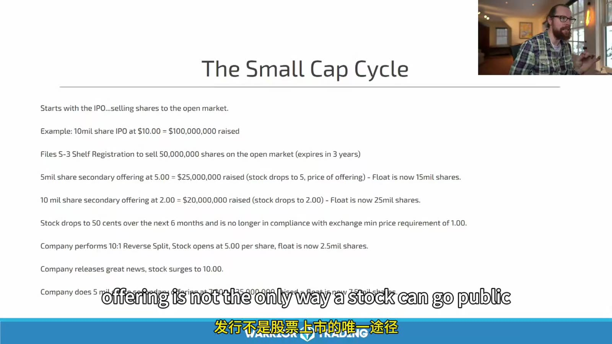
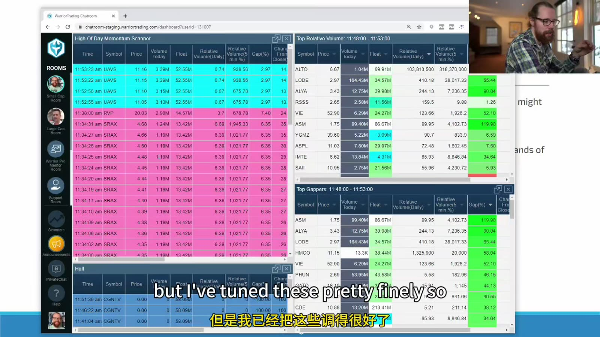
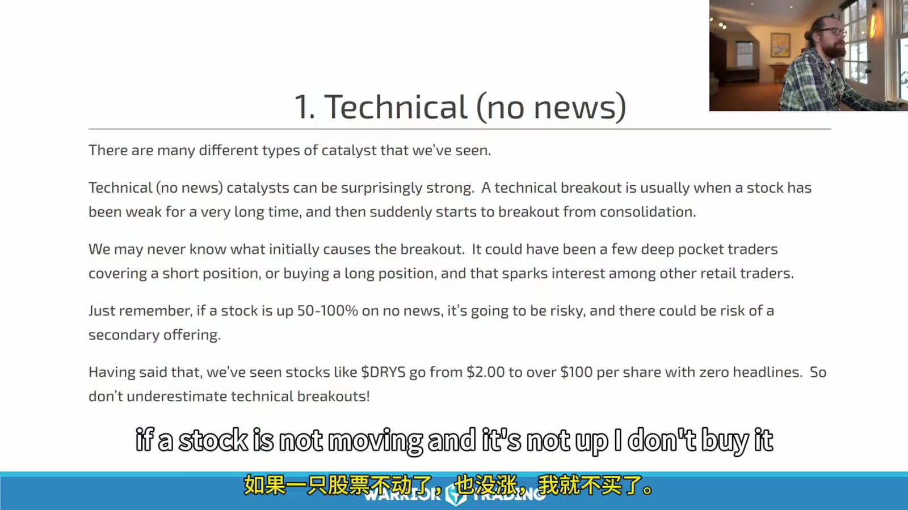
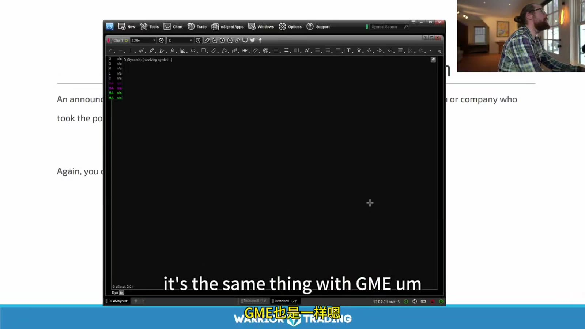

# Small Cap 03：选股、催化与 Watchlist

> 对应视频：Chapter 3 Part 1–2
> 本节重点：选股本身就是第一层风险管理；把 low float、催化、日线和流动性放在一起，而不是只追涨幅榜。

## 1. Small-cap Cycle



**图怎么看：**

- 课件展示一种历史路径：IPO → shelf/offerings 增加股数 → 价格下跌 → reverse split → 再融资。
- 这不是每家 small cap 的必然生命周期，但对长期亏损、持续融资公司是重要风险模型。
- Reverse split 机械降低 shares outstanding 后，扫描器可能显示“极低 float”，但潜在 warrants、convertibles 和新发行仍会增加供给。
- 需要沿最新文件重建 fully diluted share count，不能只看一个第三方 float 数字。

检查链：

1. 最新 10-Q shares outstanding；
2. 最近 8-K / prospectus supplements；
3. active shelf / ATM；
4. warrants 和 convertible terms；
5. reverse split effective date；
6. subsequent events；
7. cash burn 与 going concern。

## 2. Stock Selection 的六层过滤

### 价格与证券类型

排除不适用的 OTC、warrant、rights 或特殊单位，确认普通股/ADS。

### Float 与实际供给

低 float 只是名义供给；还看持有人、unlock、registration for resale。

### Volume / RVOL

成交量必须足以支撑目标 shares，且异常量发生在当前时段。

### Catalyst

原始、当日、明确、与公司规模相关。

### Daily chart

上方空间、200 MA、former-runner history、reverse-split adjustment。

### Execution

spread、depth、halt band、route、borrow。

任一层不合格都可删除候选。

## 3. Scanner 是起点



**图怎么看：**

- 多个 scanner 面板把 gap、momentum、volume 等条件分开，降低全市场搜索成本。
- 同一股票同时命中多个条件并不等于多份独立证据；字段可能高度相关。
- 扫描器的 float 和新闻必须回到原始来源核验。
- Alert 后才打开图和 Level 2，不能在看到颜色高亮后直接下单。

## 4. Catalyst 分类

### Earnings

不预测报告，而是等公布后比较：

- actual vs consensus；
- revenue / EPS quality；
- guidance；
- one-time items；
- 当日成交量和 price acceptance。

### FDA / Clinical

区分 trial phase、endpoint、sample size、approval stage。公司新闻稿的 “positive” 不能代替完整结果。

### Contract

比较合同金额与年收入、是否 binding、执行周期、利润率和是否只是 framework。

### Merger / Buyout

明确现金、换股、条件和交易价。价格快速靠近确定 offer 时，剩余 upside 可能很小。

### Offering

对 long 通常是供给风险，但要看价格、规模、warrants 和市场预期。不能只靠“offering = bearish”机械做空。

### Split / Reverse split

本身不创造价值，可能改变报价、float 展示和合规状态。

### Analyst target

来源质量和当时关注度决定影响；孤立 target 通常弱于原始公司事件。

### Hot sector / Sympathy

需要本身成交量和结构确认，不因同标签就共享走势。

## 5. Purely Technical Move



**图怎么看：**

- 课件承认无新闻异动也可能很强，并举出极端历史案例。
- “没有找到新闻”不等于确实没有信息；可能是数据延迟、社交信息、行业联动或未知原因。
- 无法解释的上涨会吸引 short，也会增加 exchange inquiry、offering 和 rug-pull 风险。
- 可以观察 technical setup，但应降低 conviction、size 和持有时间。

不要把“纯技术”写成催化。它只表示当前没有可核验 fundamental catalyst。

## 6. Daily Chart 是否值得进一步查



**图怎么看：**

- 图表窗口用于从当前价格向左查看历史阻力和大 K 线。
- 黑屏或尚未加载时不能凭 scanner 数字下单；先确认 data feed 和复权。
- GME 等课程热点只是历史例子，不能成为“热门就可忽略 price/float”的永久例外。
- 日线通过后才值得继续研究 catalyst 和 entry，减少浪费时间。

## 7. Watchlist 顺序

课程建议从 gap scanner 开始。改写成可复现流程：

1. 按 gap / liquidity 选前 5–10；
2. 验证 symbol 与 corporate action；
3. 记录 float source/date；
4. 读原始 catalyst；
5. 查 recent financing；
6. 画 premarket high/low、前收、日线阻力；
7. 计算第一目标之前的 R；
8. 检查 Level 2、spread、LULD；
9. 排序成 A/B/Observe；
10. 写明确 no-trade。

## 8. Watchlist 不写方向故事

合格写法：

```text
Above 4.80 with volume → test premarket high 5.05
Below 4.55 → setup invalid
No trade if spread > 0.08 or upper LULD < 1R away
```

不合格写法：

```text
Great company, should go to $10
Shorts will be trapped
Everyone is watching
```

条件式计划允许市场否定；故事会诱导持仓者忽略否定。

## 9. Offering Risk 的快速检查

- active S-3 / F-3；
- ATM sales agreement；
- latest 424B prospectus；
- registered direct；
- resale registration；
- warrant exercise price；
- cash runway；
- history of financing after spikes。

课程把 shelf 比作已经拔销的手榴弹太绝对。Shelf 是能力，不是时间承诺；但对隔夜或长时间持有确实需要折价评估。

## 10. IPO / Recent IPO

初次上市交易风险：

- price discovery；
- 极宽 spread；
- 无长历史图；
- float / lockup 口径；
- opening auction；
- halt；
- borrow 缺失。

Recent IPO breakout 还要看 lockup、secondary sale 和此前高点。课程列出的历史暴涨 IPO 是选择性案例，必须把失败 IPO 纳入样本。

## 11. Short Interest 的使用

High short interest 可能放大 squeeze，但数据滞后。需要：

- settlement date；
- float denominator；
- days-to-cover；
- borrow fee / availability；
- corporate actions after date。

不能把 daily short volume 当 short interest，也不能用超过 100% 就断言违法。

## 12. 最终候选卡

```text
Symbol / security type:
Price / spread:
Float source/date:
Premarket volume / RVOL definition:
Catalyst source/time:
Financing risk:
Daily room:
Premarket levels:
LULD:
Borrow:
Primary setup:
Trigger / invalidation / target:
Max shares:
No-trade:
```

选股的目标不是找到“最会涨”的股票，而是找到**即使判断错误，也能以计划风险完成退出的异动股票**。
