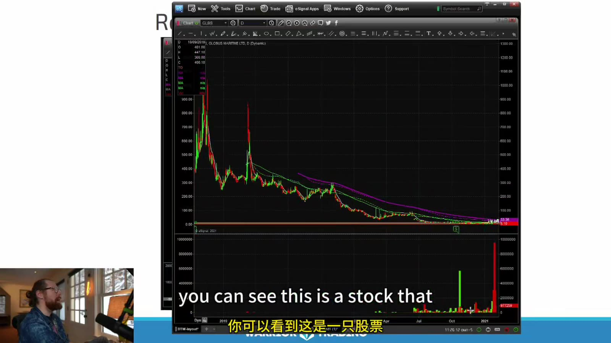
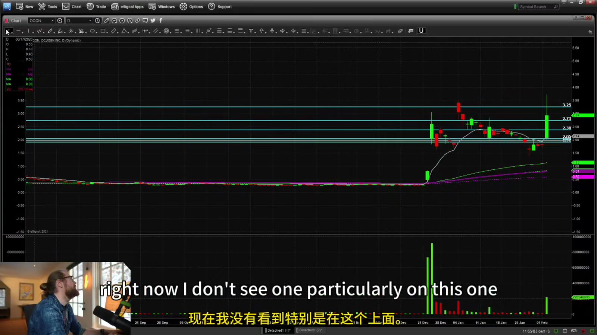
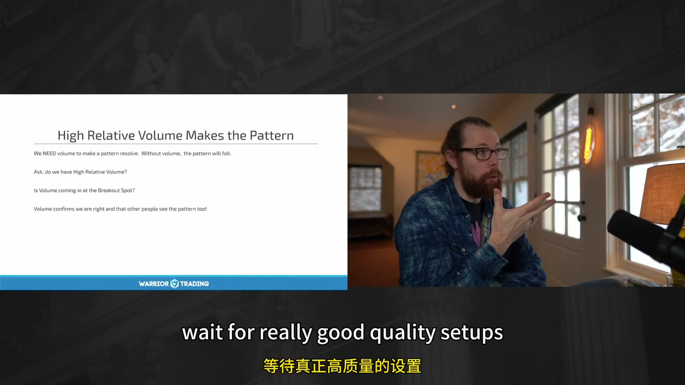
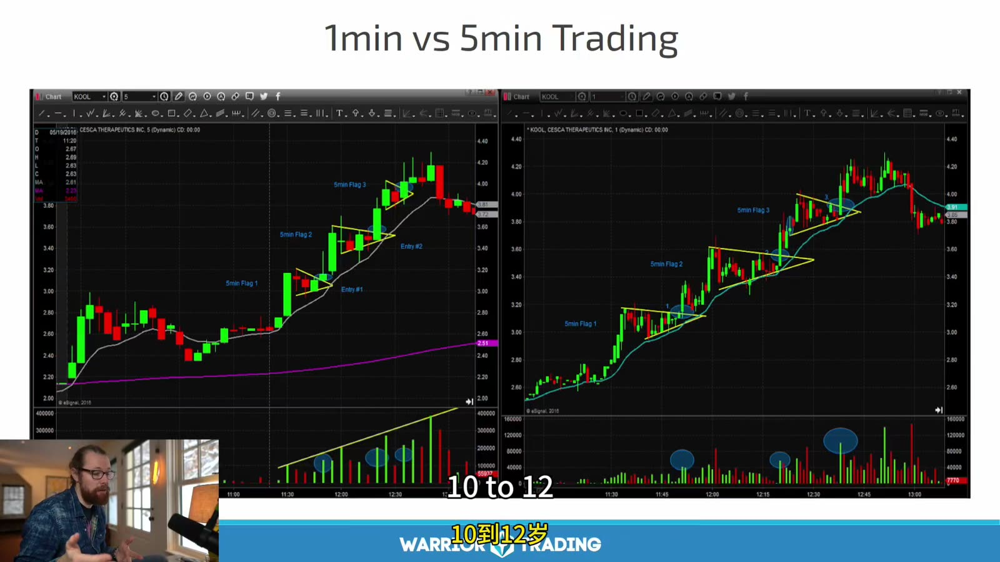

# Small Cap 04：日线与盘中 Context

> 对应视频：Chapter 4、Chapter 5 Introduction
> 本节重点：日线决定潜在空间和历史供给，盘中图决定当日触发；同一个形态脱离 context 没有统一胜率。

## 1. 日线的任务

日线不负责给秒级 entry，而是回答：

- 当前是历史低位、区间还是 blue sky？
- 最近 200 MA 在哪里？
- 上方哪一段有大量被套成交？
- 是否有 gap/window？
- 是否 recently ran and faded？
- 图表是否受 reverse splits 影响？



**图怎么看：**

- 图中长期趋势向下，数次突然大涨又回落，是典型融资/反向拆股背景下可能出现的历史形状。
- 左侧高价经过复权后可能并非当时真实交易价，不能直接当精确 resistance。
- 最右侧新 spike 可以有日内动量，但上方历史供应和“pop then drop”记录降低持有信心。
- 需要结合最新公司行动重画水平，而不是在压缩图上画几十条线。

## 2. Reverse-split Adjusted Chart

连续 reverse splits 会把旧价格按比例抬高。使用历史价位前：

1. 查看 corporate action history；
2. 确认平台 fully adjusted / unadjusted；
3. 将水平换算到当前股本口径；
4. 检查旧成交量是否同样调整；
5. 更重视近期 post-split 结构。

“历史曾到数千美元”往往是复权数学，不是自然回归目标。

## 3. Levels 只保留会影响计划的



**图怎么看：**

- 多条水平线表示历史 candles 的高低，最接近当前价的几条最重要。
- 水平密集说明上方并非 clean air；每条都可能缩短到第一目标的 reward。
- 价位已经被当前大 K 线穿越后，可降级为 potential support/retest，而不是简单删除。
- 线要画成 zone，宽度至少考虑 spread 和典型波动。

计划只需：

- nearest support；
- trigger；
- first resistance；
- next major resistance。

其余远端线放在参考层。

## 4. High RVOL 让形态更可执行，但不保证成功



**图怎么看：**

- 课件要求 volume 和 RVOL，理由是需要真实关注、流动性和突破参与。
- 形态在低量时也可能看起来完美，但一笔订单就能改变价格，退出困难。
- 高量也可能来自 distribution；必须看 volume 带来的 price progress。
- “只等高质量 setup”意味着允许整天无交易。

有效性拆开：

- **Pattern quality**：结构干净；
- **Liquidity quality**：能进出；
- **Catalyst quality**：关注可持续；
- **Reward quality**：上方有空间；
- **Risk quality**：失效点可承担。

## 5. Daily Volume 与 Intraday Volume

日线总量可能很高，但当前五分钟已经枯竭。反之，刚发布新闻时五分钟量可能异常高，而日累计尚未显著。

同时记录：

- cumulative volume；
- time-of-day RVOL；
- last 5m RVOL；
- dollar volume；
- volume at trigger；
- volume after breakout。

## 6. 1 分钟与 5 分钟



**图怎么看：**

- 左侧 1 分钟显示更细的 pullbacks，右侧 5 分钟把它们聚合成较平滑趋势。
- 蓝色圈出的量柱在 1 分钟上是多个局部事件，5 分钟上会合并。
- 1 分钟适合精细 entry，但更易被噪声触发；5 分钟 stop 更宽、仓位应更小。
- 不能用 1 分钟 entry、5 分钟 stop，却仍按 1 分钟风险配置 shares。

## 7. Primary Timeframe

交易前指定：

```text
context timeframe = daily
setup timeframe = 5m
execution timeframe = 1m
invalidation timeframe = 5m
```

若 execution 图与 setup 图冲突，按预设优先级，不事后切换。

## 8. Intraday Pattern 的 Context

相同 bull flag：

- 第一次盘前回撤；
- 开盘第一次回撤；
- 第三次 halt 后回撤；
- 午后低量回撤；

不是同一 setup。标签至少包含：

```text
session + sequence number + catalyst + daily position + volume state
```

## 9. Entry Space

设：

- entry 5.20；
- invalidation 5.05，风险 0.15；
- 第一日线阻力 5.28，reward 0.08。

即使形态完美，first target 小于 1R，仍不合格。不要假设“一定冲过阻力”来制造 2R。

## 10. Context Checklist

- 图是否复权；
- 近期 reverse split / offering；
- nearest support/resistance；
- 200 MA；
- former runner vs repeated failure；
- current session；
- RVOL 口径；
- pattern sequence；
- LULD distance；
- entry 到第一目标的 R。

真正的 context 不是“这图看起来强”，而是把影响胜率、payoff 和成交的条件全部写成可分组字段。
