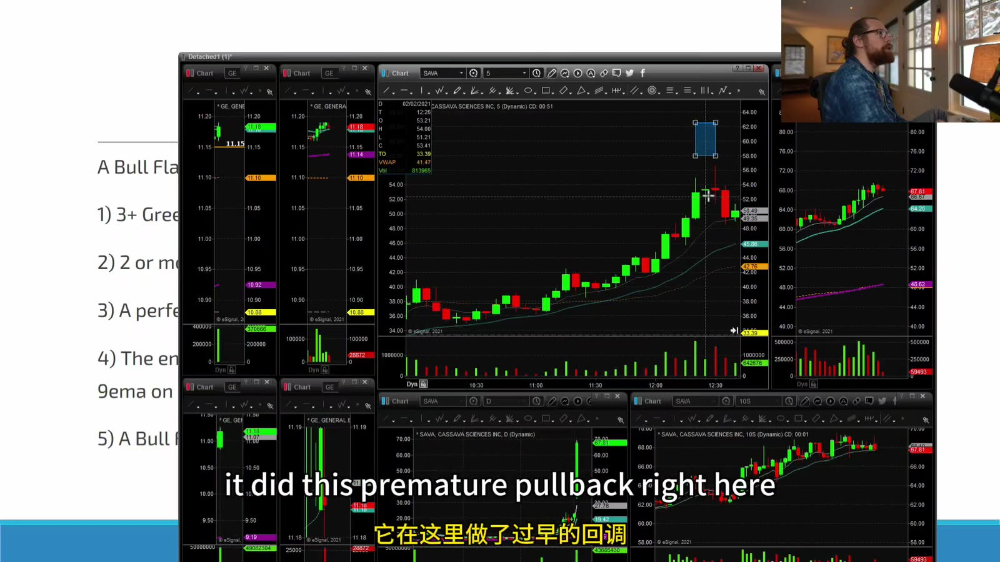
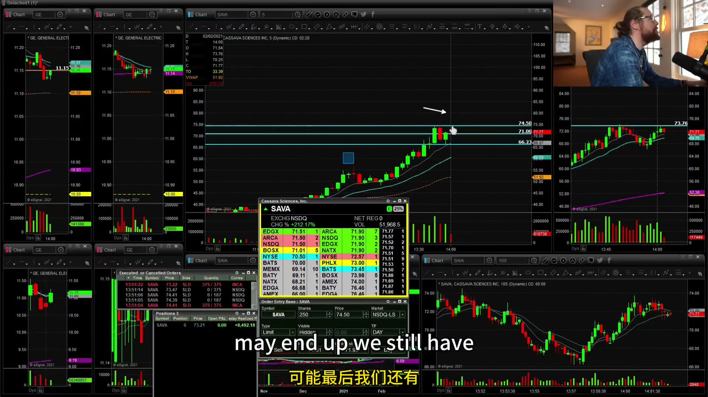
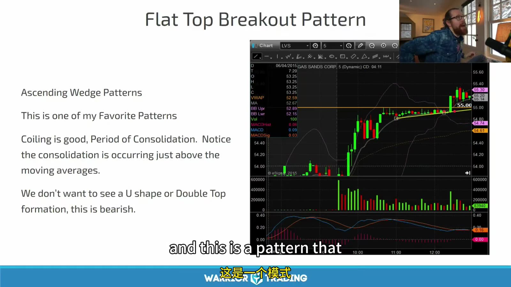
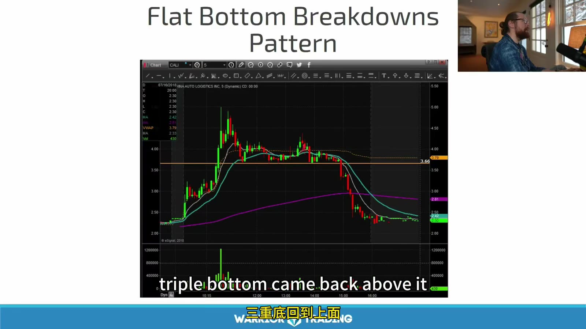
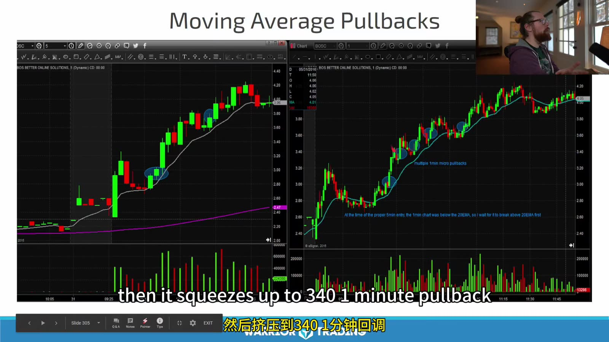
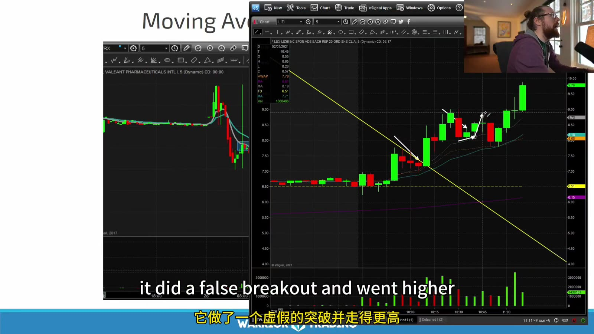
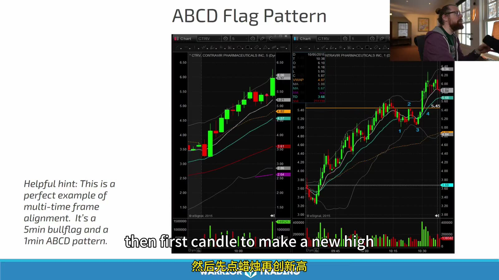
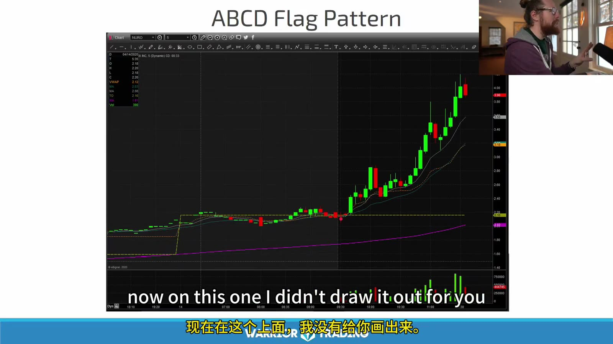

# Small Cap 05：Long Continuation Patterns

> 对应视频：Chapter 5 Pattern 1–4
> 本节重点：bull flag、flat top、moving-average pullback 和 ABCD 都在交易上涨后的整理；差异在触发和失效，而不是名字。

## 1. Bull Flag



**图怎么看：**

- 主图先快速上行，再高位回撤，形成旗杆与旗面。
- 课程指出一次 premature pullback；趋势尚未建立足够空间时，整理更容易失败。
- 左侧多窗口提醒需要同时看 Level 2、1m/5m 和 daily。
- 旗面若跌回旗杆大部分区间，continuation 假设变弱。

定义一份可测试版本：

```text
impulse >= X relative range
pullback candles = 2..5
retracement <= 50%
pullback volume < impulse volume
trigger = prior closed candle high
invalidation = pullback low
```

每个 X 和边界都需用自己的样本校准。



**图怎么看：**

- 右上长趋势中出现多个小回撤；并非每一个都值得交易。
- 箭头附近要确认是第几次 pullback、离 VWAP 多远、日线空间多大。
- 连续成功的前几次 setup 会诱使后续追高；sequence number 必须入日志。
- 最后的结果不能反过来证明中间每个 entry 都正确。

## 2. Flat-top Breakout



**图怎么看：**

- 多次 high 接近同一水平，low 抬高，形成 ascending pressure。
- Volume 在整理期收缩、突破期扩张通常更理想。
- 若结构形成 U shape 或大幅跌回，已经不是课程所定义的 tight flat top。
- Entry 可以是 trade-through 或 retest，两者分开统计。

风险点：

- 每次测试消耗的是 bid 而不是 ask；
- 可见卖单突然撤走形成假突破；
- 突破到下一日线阻力距离太小；
- 整理过长后市场注意力消散。

## 3. Flat-bottom Breakdown 是镜像，不是完全对称



**图怎么看：**

- 多次 low 接近同一水平，反弹 high 下降，跌破后加速。
- 做空还要额外处理 locate、borrow fee、SSR 和无限上行风险，不能简单把 long 图上下翻转。
- 跌破前已处于 SSR 时，订单执行规则会改变。
- Breakdown 进入前低或 LULD lower band 时，reward 也可能快速消失。

## 4. Moving-average Pullback



**图怎么看：**

- 左右图价格都在抬高的短均线附近回撤后继续。
- 均线斜率与 higher highs / higher lows 同向，才构成趋势 context。
- 价格只是“碰线”不是 trigger；需要重新收回或突破 micro structure。
- 两张成功图存在选择偏差，需加入跌穿均线的失败样本。

## 5. Trendline 与 MA Confluence



**图怎么看：**

- 黄色下降线被突破后，价格形成更高低点并重新上行。
- Trendline 和 moving average 同时出现不等于两个独立概率信号，它们都来自价格路径。
- 假突破后能否守住前低，比线条交叉本身更重要。
- 事后画线很容易贴合；练习时保存当时锚点。

## 6. ABCD



**图怎么看：**

- A→B 是 impulse，B→C 是 pullback，C→D 是恢复趋势。
- 图中 5m bull flag 与更细周期 ABCD 叠加，是 multi-timeframe alignment。
- C 的位置决定 invalidation；D 只是潜在测量目标。
- 不应因为预期 D 就在 C 下破后继续持有。



**图怎么看：**

- 右侧持续上涨使 ABCD 很容易在事后被看见。
- 不画线时，应先独立标 A/B/C，再揭示后续，防止重构。
- 单边趋势可包含许多重叠 ABCD；必须固定 minimum swing 和时间尺度。
- 若任何三段都能命名为 ABCD，标签就失去统计意义。

## 7. Entry 比 Pattern Name 更重要

对每种形态写：

| Pattern | Trigger | Invalidation |
|---|---|---|
| Bull flag | first candle new high | flag low |
| Flat top | horizontal high trade-through | consolidation low |
| MA pullback | reclaim/micro breakout | swing low |
| ABCD | C 后恢复、break B | C low |

实际 stop 可能很宽；仓位必须相应改变。

## 8. Volume Profile

Continuation 偏好的顺序：

`impulse expansion → pullback contraction → breakout re-expansion`

失败警告：

- pullback red volume 大于 impulse；
- breakout volume 大但价格不前进；
- ask 不断补单；
- breakout 后马上跌回 range；
- spread 扩大。

## 9. False Breakout Plan

突破失败时：

1. 不等待“再给一次机会”；
2. 按 invalidation 减仓/平仓；
3. 检查是否成为 bull trap；
4. 不自动 reverse 做空；
5. 记录 slippage 和 acceptance time。

## 10. Pattern Scorecard

- fresh catalyst；
- top RVOL；
- daily room ≥ 2R；
- first/second pullback；
- contraction；
- clear low；
- acceptable spread；
- enough depth；
- not near LULD；
- trigger not extended。

形态最漂亮的一笔不一定最好；真正可交易的是**风险点明确、第一目标有空间、现实订单能完成**的那一笔。
