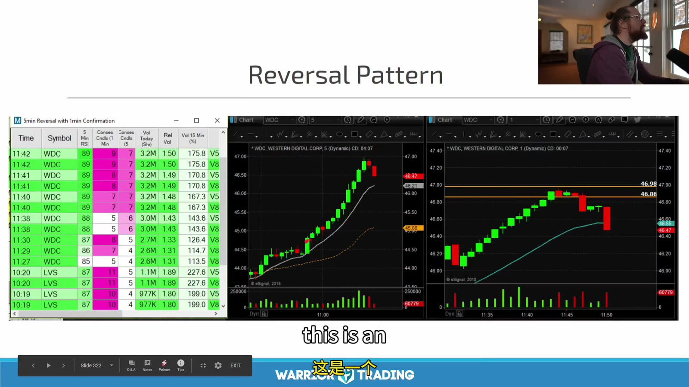
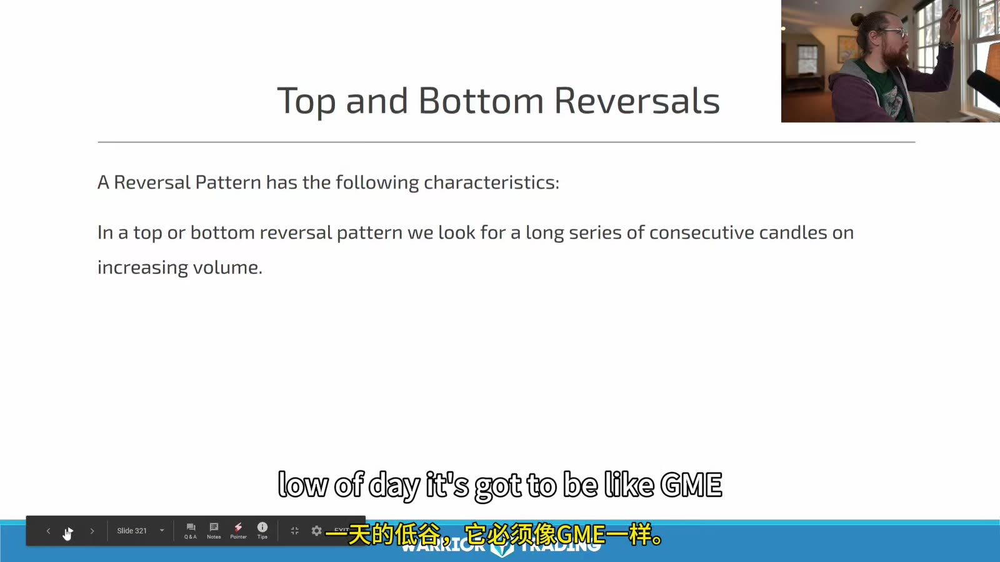
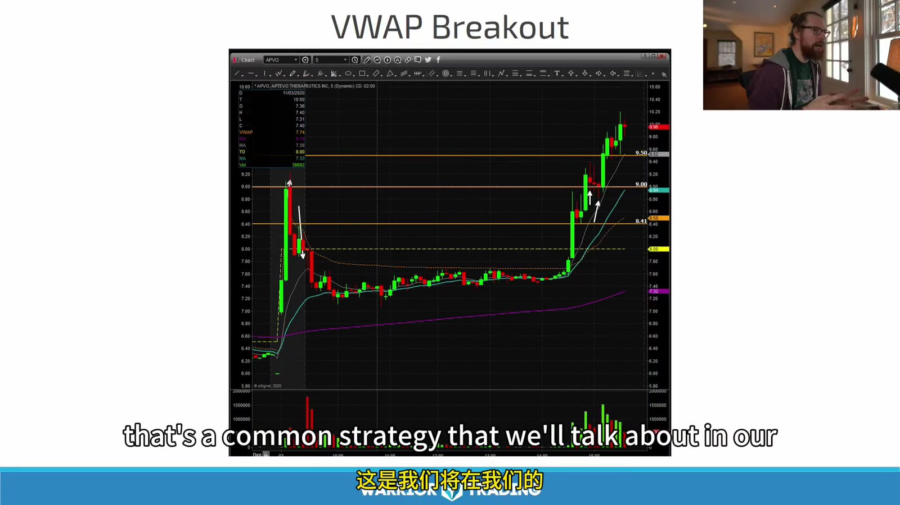
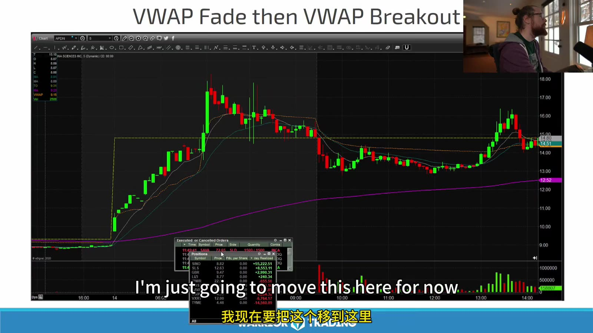
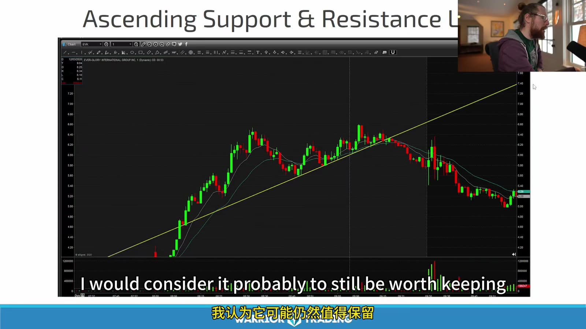
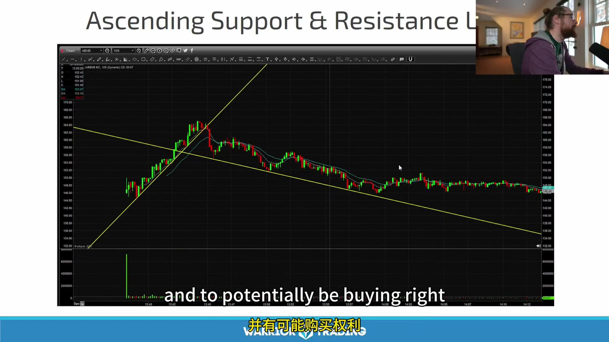
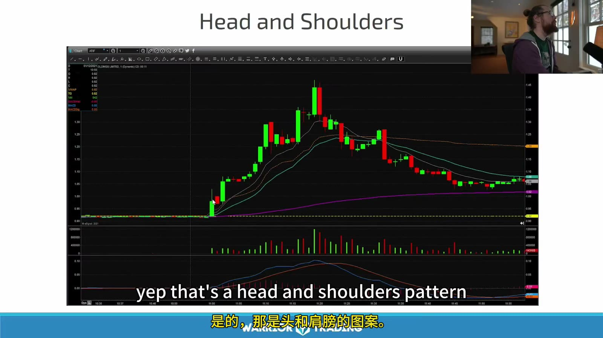
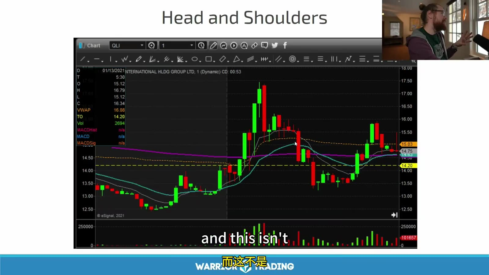
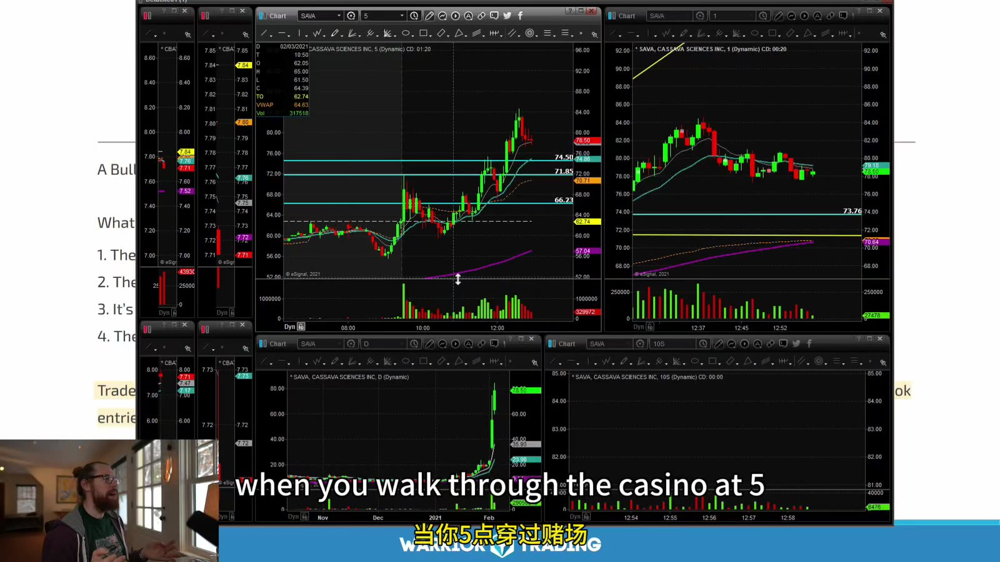
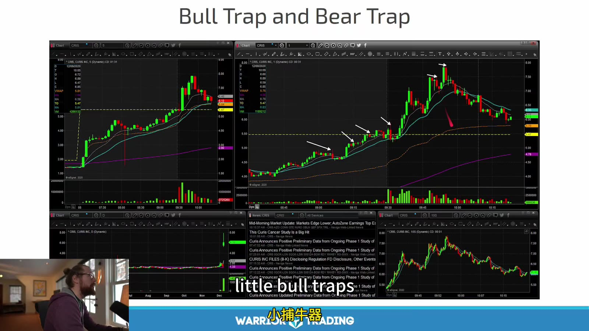

# Small Cap 06：Reversal、VWAP 与 Traps

> 对应视频：Chapter 5 Pattern 5–9
> 本节重点：反转和 trap 都在交易“原方向失败”；比猜顶底更重要的是等待结构真的变化。

## 1. Top / Bottom Reversal



**图怎么看：**

- 图中出现多根连续绿色 K 线，右侧开始 lower high / red candle。
- 连涨只说明 extended，不说明下一根必跌。
- Scanner 触发可用于发现极端，不应直接成为 short entry。
- 反转风险按 high invalidation 计算；若 high 离 entry 太远，就不做。



**图怎么看：**

- 课件强调 long series of consecutive candles 与 increasing volume。
- 固定“五根/十根”是后续章节的策略分类，不是市场定律。
- Increasing volume 同时可能说明原趋势更强，因此仍需 failure signal。
- Bottom reversal 是反向结构，但 halt down 和 forced selling 会产生不对称尾部风险。

一个 top reversal 确认序列：

1. 抛物线延伸；
2. 新高缺少 price progress；
3. 第一次 sharp rejection；
4. lower high；
5. 跌破 higher-low sequence；
6. 回抽失败。

越早入场，赔率可能高但命中率低；按 entry type 分开统计。

## 2. VWAP Breakout



**图怎么看：**

- 早盘冲高回落、长时间在 VWAP 附近整理，右侧重新上行。
- 真正 breakout 不只是触线，而是上破后在其上成交和形成 higher low。
- 上方多条历史水平会限制目标，不能只因 reclaim VWAP 就预期回到 high。
- 长时间 base 可能提供风险点，也可能表示注意力已下降。

## 3. VWAP Fade → Breakout



**图怎么看：**

- 中间价格反弹到 VWAP 附近失败，是 fade context；右侧再次突破。
- 同一日 VWAP 可先做 resistance、后做 support，说明 indicator 角色随 price acceptance 变化。
- 第一次失败不能永久定义“弱”；第二次突破也不能抹去上方 supply。
- 日志应记录 attempt number。

## 4. Ascending Support Break



**图怎么看：**

- 黄色线连接 rising lows，跌破后价格失去原上升斜率。
- 一次穿线可能是噪声；结合 candle close、volume 和 lower high。
- 趋势线越陡，越容易因时间推移自然被跌破。
- 线由主观锚点决定，不能作为唯一 stop。



**图怎么看：**

- 走势先加速、后转为下降通道，斜率变化比一条线更有信息。
- Parabolic trend 不可能永久维持；加速本身同时提高 reversal risk。
- 右侧横盘表明跌破后不一定直线下跌。
- 若 short 入场太晚，reward 可能已被第一段 selloff 消耗。

## 5. Head and Shoulders



**图怎么看：**

- 中间 high 高于两侧，右侧跌破 neckline 后向 VWAP/均线回落。
- 左肩、头、右肩只有形成后才可完整命名。
- Entry 可在 neckline break 或 retest failure；两者风险不同。
- 目标投射不是保证，要先看下方支撑。



**图怎么看：**

- 图中 highs 和 lows 混杂，难以客观确定 shoulders 与 neckline。
- 课程明确指出这不是合格案例，说明“不勉强命名”本身是技能。
- 若两个交易者画出的结构完全不同，就不适合用作机械 trigger。
- 只交易 obvious pattern 可以减少自由度，但仍需定义 obvious。

## 6. Bull Trap / Bear Trap



**图怎么看：**

- 图表和 Level 2 同时显示，trap 发生在真实突破尝试后，而不是任意 red candle。
- 先看突破是否吸引 volume，再看为何没有 price progress。
- Long 失败后应先执行自己的 stop；不要因想“赚回来”立即反手。
- Short trap trade 需要新的 entry、borrow 和 risk plan。



**图怎么看：**

- 图中箭头指出不同尺度的失败突破，形态共有特征是重新回到原 range。
- Trap 是结果描述；在突破发生前无法确定它一定失败。
- 成功突破和 trap 的共同前半段相同，因此必须以 acceptance 作为分界。
- 只收集 trap 图会高估反向交易的可预测性。

## 7. Acceptance 与 Rejection

突破后观察：

- 多久维持在水平上方；
- bid 是否抬到旧阻力；
- 回踩是否量缩；
- 是否形成新 higher low；
- 大成交是否带来进展。

失败特征：

- 立即跌回；
- ask-side volume 很大却不涨；
- 旧阻力没有转 support；
- spread 扩大；
- lower high 后跌破 range。

## 8. Reversal Size

反转是 countertrend。默认可：

- 使用 continuation 风险的一半；
- 等 confirmation；
- 不在 halt band 附近猜；
- 不平均加仓；
- 第一目标保守到 VWAP/最近 support；
- 新高立即失效。

具体比例必须靠统计，而非照抄。

## 9. 不用 Indicator 猜顶

RSI overbought、price outside Bollinger、连续 K 线都只能表示 extended。市场可以在 extended 状态继续更久。

反转 entry 应来自 price structure；indicator 用于发现候选和衡量极端。

## 10. 复盘标签

```text
reversal_candidate_reason:
extension_measure:
first rejection:
lower_high:
structure_break:
VWAP relation:
entry type:
borrow:
MAE/MFE:
failed because:
```

本章所有 setup 的共同核心：**先有原趋势，再有失败证据；没有失败证据的“反转”只是猜。**
