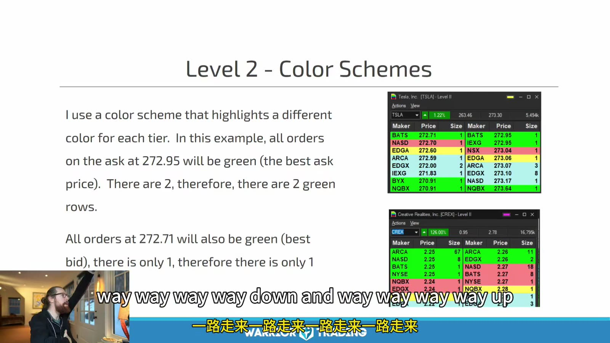
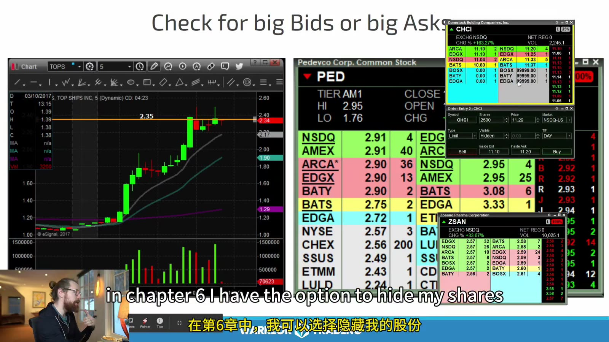
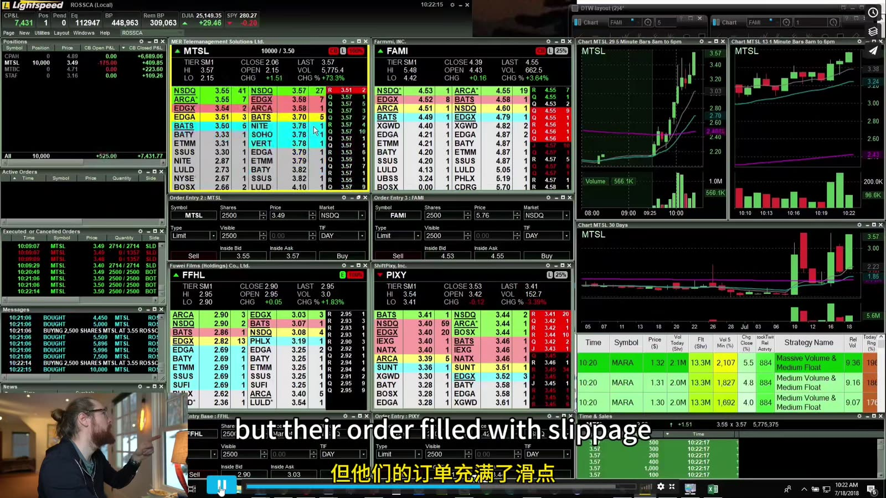
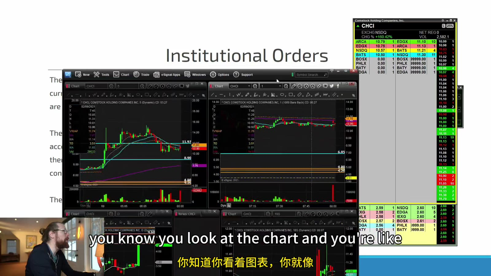
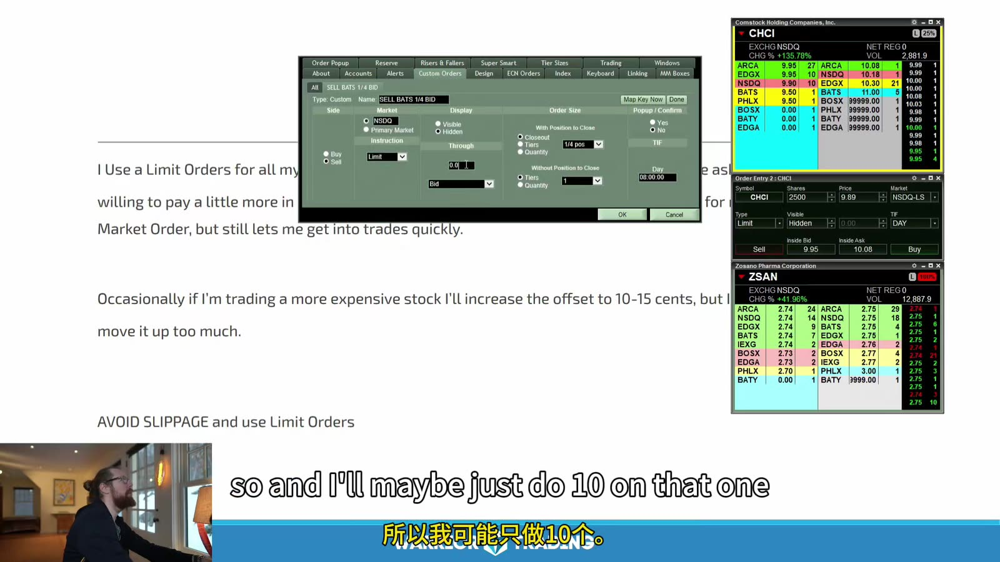
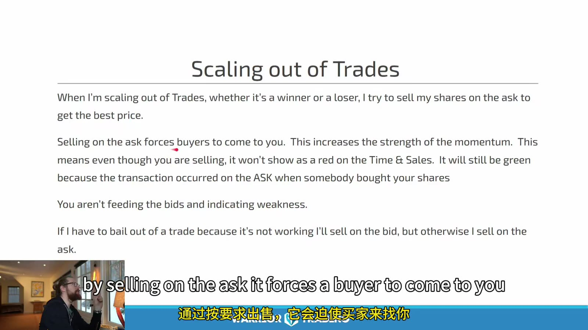
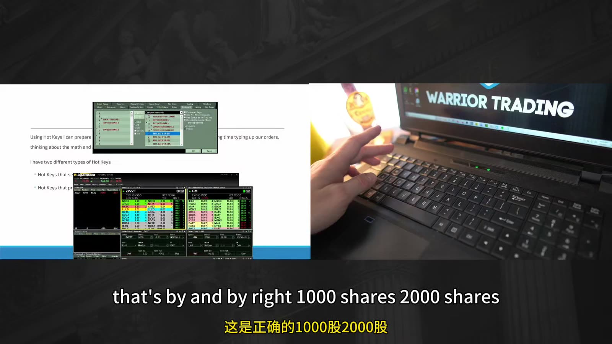
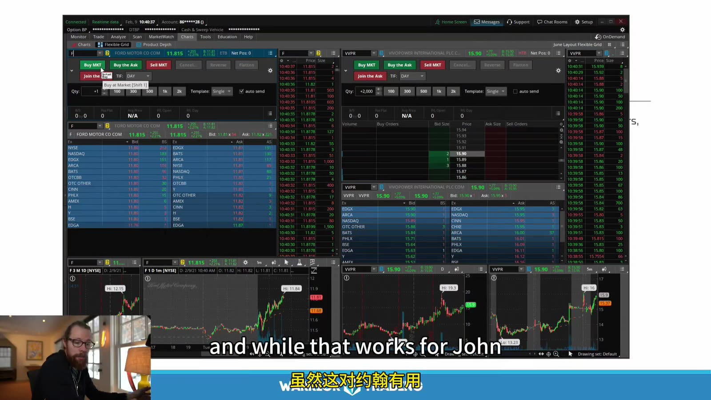
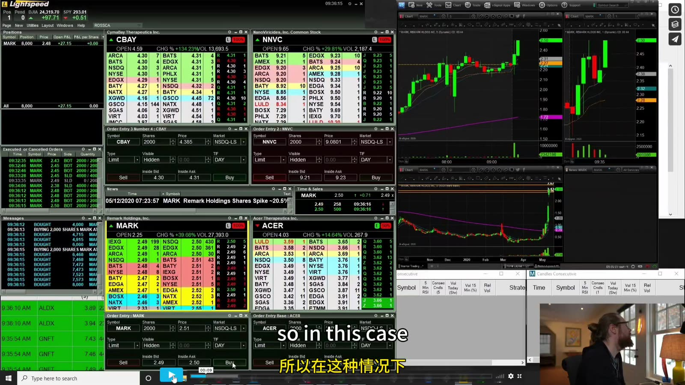
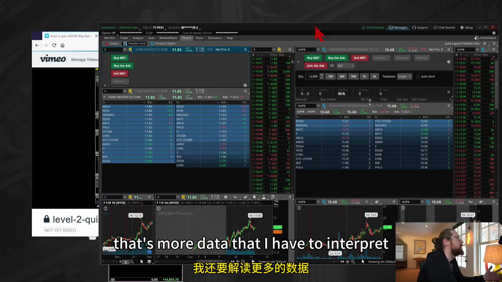

# Small Cap 07：Level 2、Tape 与执行细节

> 对应视频：Chapter 6 Part 1–5
> 本节重点：从盘口读可见流动性、成交和价格进展；不把颜色、大单或“机构”故事当作事实。

## 1. Color Scheme 只是界面编码



**图怎么看：**

- 相同价格使用相同颜色，让交易者快速识别 price level，而不是每个 market maker。
- Best bid/ask 的颜色由平台设置，绿色不天然代表 bullish。
- 颜色分组应让 inside market 最醒目，同时避免红绿造成情绪化判断。
- 课程画面中的 size 单位需按历史平台文档解释。

设置时确认：

- price grouping；
- bid/ask side；
- exchange/ECN；
- size unit；
- LULD/status；
- hidden order 是否有标识。

## 2. Big Bid / Big Ask



**图怎么看：**

- Ask 侧某价位集中 size 可形成可见 resistance，bid 集中则可能形成 support。
- 大单可以取消、移动、只显示一部分，不能当作墙。
- 真正要看的是成交打到该价后，size 是减少、补回还是撤走。
- 多个窗口同时看不同股票会降低对单一订单变化的判断质量。

## 3. Stacking 与 Price Progress

所谓 bid stacking：

- 多档 bid 上移；
- inside bid size 增加；
- ask 被成交；
- last trade 抬高。

只有 size 增加、price 不前进，可能是吸收或噪声。必须把 order book 和 trades 连起来。

## 4. Spread / Depth / Expected Fill

买入 5,000 shares 前估算：

```text
ask 5.00: 800
ask 5.01: 1,200
ask 5.03: 2,000
ask 5.06: 1,000
```

若全部可见且不撤单，理论 VWAP：

`(800×5.00 + 1200×5.01 + 2000×5.03 + 1000×5.06) / 5000`

但真实结果还受其他买单、hidden liquidity 和更新延迟影响。计划 entry 应是 expected average fill，不是 top-of-book ask。



**图怎么看：**

- 同屏展示 Level 2、Time & Sales、图表和 orders，实际 fill 需要从成交明细读取。
- 讲者提到订单产生 slippage；这说明图上的 trigger price 不是绩效 entry。
- 多窗口快速切换增加错 symbol 与 pending order 风险。
- 每笔应记录 planned price、average fill 和 worst fill。

## 5. “Institutional Order” 不能从一张图确认



**图怎么看：**

- 图上看到大 size 或异常成交，不足以识别最终受益所有人。
- 机构可拆单、使用算法、隐藏数量或跨场所；零售也可能聚合成大成交。
- Chart/tape 能证明成交行为，不能证明身份和目的。
- 资料把“institutional”改写成“large/consistent flow”，避免不可验证归因。

## 6. Marketable Limit 与 Offset



**图怎么看：**

- 买单设在 ask 上方可扫取可用卖单，但不会高于 limit。
- 课程的 5–10 cents offset 只是当时标的经验；应按 spread、price、volatility 和 depth 调整。
- Offset 太小会 miss/partial fill，太大则接近 market-order 风险。
- `Avoid slippage` 不准确；limit 只能给最差价格边界，仍可能相对预期发生 slippage。

## 7. Scaling Out



**图怎么看：**

- 在 ask 放 sell limit 可能让买方主动成交，价格较好但不保证 fill。
- 在 bid 使用 marketable limit 更可能立即退出，但承担 spread。
- 课程说“在 ask 卖会增强 momentum”过度归因；个人订单影响取决于 size 和市场。
- Winner 与 loser 不应使用同一耐心：风险失效时优先退出，不为更好价格继续暴露。

分批规则示例：

```text
1/3 at first target
1/3 at second resistance
1/3 trail by structure
```

必须测试 partial fills 和剩余仓位的 stop。

## 8. Hotkeys 的 Size 风险



**图怎么看：**

- 键盘速度适合快速 breakout，也让固定股数在错误 symbol 上瞬间成交。
- 固定 1,000/2,000 shares 会使 dollar risk 随 stop 宽度变化。
- 热键标签帮助记忆，不防焦点和账户错误。
- Buy/add/sell/cancel 必须在模拟环境逐一验证。

## 9. Platform 差异



**图怎么看：**

- 不同软件对 size、颜色、route、short availability 和 hotkey 有不同字段。
- 软件界面相似不表示订单语义相同。
- Broker、front end、market data vendor 可能是不同实体，故障点也不同。
- 选平台依据当前文档和测试，不照搬课程旧品牌组合。

## 10. 实盘 Case：为什么单帧不够



**图怎么看：**

- 图中可见多个股票的盘口和成交，讲解依赖时间序列而非静态截图。
- 复盘时至少保存触发前 10 秒到退出后的 Level 2 / tape，单张图无法显示 speed。
- 画面下方订单状态也必须纳入，避免只研究价格、不研究未成交。
- 成功案例需要对应失败案例才能评价。

## 11. “更多数据”不一定更有优势



**图怎么看：**

- 深度更完整能看到更多场所，但也增加噪声和认知负担。
- 如果策略不使用某些字段，隐藏它们可能提高执行准确。
- 直接从 total depth 推断方向容易过拟合；先固定三到五个观察变量。
- 更快的数据需要更稳定硬件和低延迟链路，否则显示优势会被处理延迟抵消。

## 12. Tape Checklist

突破水平前后记录：

```text
spread:
visible ask at trigger:
prints at ask:
ask reduced/reloaded/cancelled:
bid stepped up:
seconds held above:
actual fill:
failed back below:
```

## 13. 常见执行错误

- limit 已挂出却重复按 buy；
- partial fill 后仍按原股数卖；
- cancel 未确认就发新单；
- symbol linkage 错；
- route 不支持 extended hours；
- stop 与 profit order 同时造成反向仓位；
- halt 前 marketable order 残留；
- 把 simulator fill 当真实深度。

## 14. 核心原则

Level 2 和 tape 最可靠的信息是：

- 当前显示什么；
- 实际成交了什么；
- 成交以后价格做了什么。

“谁在背后、为什么这样做”通常是推测。**执行优势来自更少的假设和更准确的订单状态，而不是更精彩的盘口故事。**
