# Small Cap 08：Gap & Go

> 对应视频：Chapter 7 全部 9 段
> 本节重点：Gap & Go 不是“看到高开就追”，而是先筛选有催化剂、成交活跃且结构清楚的标的，再从开盘前后形成的关键价位中选择低风险触发点。

## 1. 先定义可交易的 gap

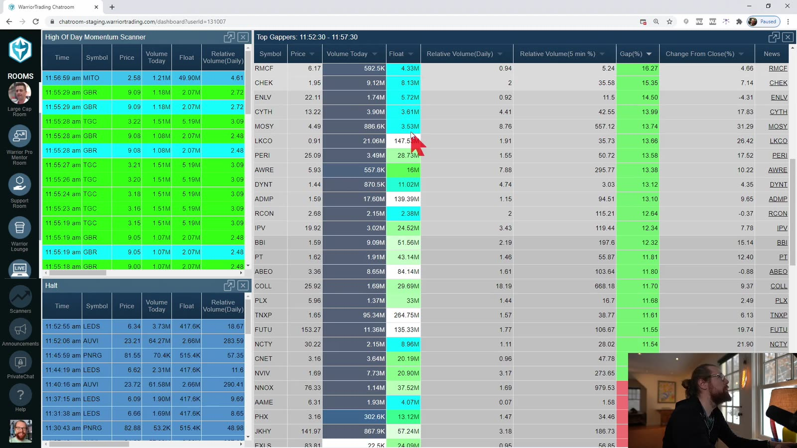

**图怎么看：**

- 左侧是盘前 scanner，表格同时给出价格、gap、成交量和相对成交量等信息。
- 绿色涨幅只能说明“今天与昨日收盘不同”，不能单独说明上方还有空间。
- 先核对新闻催化剂、流通股本、盘前成交量、spread、日线阻力，再打开 chart 和 Level 2。
- Scanner 是候选生成器，不是进场信号；同一时刻排名靠前的股票仍可能流动性很差。

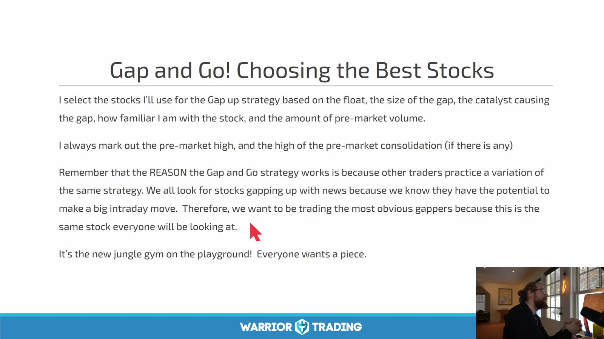

**图怎么看：**

- 课程强调 float、gap 大小、催化剂、熟悉度和盘前成交量。
- “最明显的 gapper”容易聚集注意力，但拥挤也会增加假突破、滑点和停牌风险。
- 盘前 consolidation 的高低点比单纯涨幅更有用：它们给出 trigger、stop 和 reward space。
- 课程中的经验阈值应作为待验证假设，不应直接当作普遍有效的硬规则。

一份可执行的盘前清单：

```text
fresh catalyst?
float and market cap verified?
pre-market volume and RVOL sufficient?
spread / depth acceptable for planned size?
daily resistance and recent dilution risk checked?
pre-market high, pivot, low and VWAP marked?
distance to first target >= planned risk?
LULD band / halt risk understood?
```

## 2. Setup 1：第一次与第二次回撤

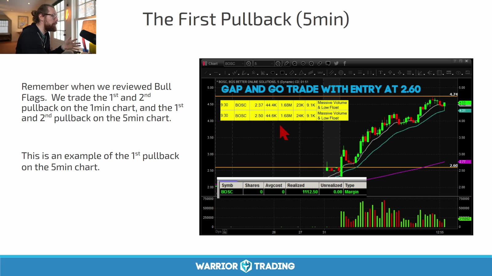

**图怎么看：**

- 价格先形成明显 impulse，再出现数根小实体回撤；这才有“旗杆后整理”的语境。
- 第一次回撤通常最接近原始动量，后续每次回撤都要重新判断趋势是否已经衰减。
- 触发可定义为突破前一根已收盘 K 线高点，失效点放在 pullback low，而不是任意固定美分数。
- 图中成功上行是事后结果；练习时还要收集突破后立即跌回的失败例。

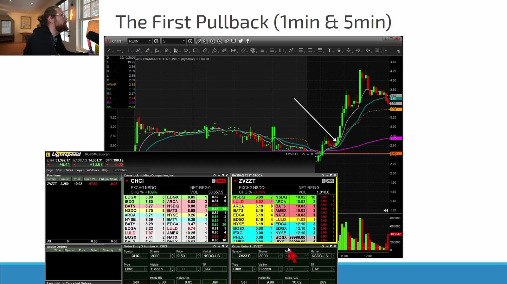

**图怎么看：**

- 大图展示更细的 1m 回撤，右下角 5m 图提供趋势背景。
- 1m 可能已经出现多个小 pullback，而 5m 仍只是一根扩张 K；“第几次”必须明确时间周期。
- 若 1m 触发距离 5m 支撑太远，按 1m stop 可能易被噪声扫出，按 5m stop 又可能使仓位过大。
- 选择周期后，用同一周期定义 entry、invalidation 和统计样本。

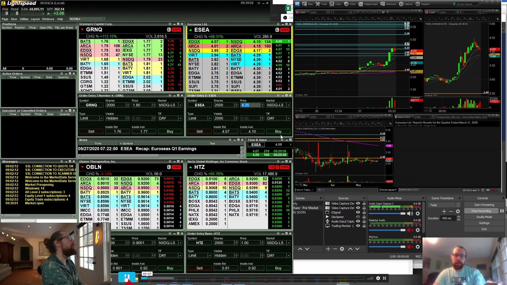

**图怎么看：**

- 中央主图是价格结构，左右窗口显示 Level 2、订单和其他周期。
- 不要被窗口数量分散注意力；决策顺序应是结构、风险、流动性，最后才是具体下单方式。
- Pullback 期间理想状态是成交量收缩、bid 未连续坍塌、spread 不突然扩大。
- 若突破时 ask 不断补单而价格不前进，应把它视为吸收或动能不足的警告。

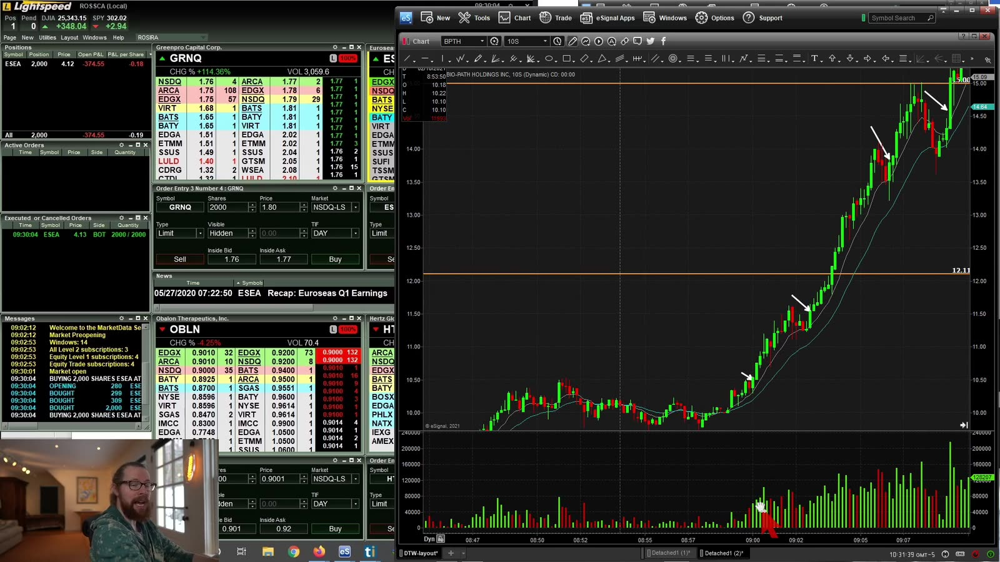

**图怎么看：**

- 右侧已经经历较长的加速上涨，后续同名 pullback 的位置明显更延伸。
- 均线追上价格不等于风险变小；需要看 pullback low 到潜在目标的真实 R 倍数。
- 同一只股票的第二、第三次形态不应与第一笔混在一个统计桶。
- “之前成功过”不能成为加仓理由；每个新 entry 都要重新计算最大损失。

## 3. Setup 2：突破盘前高点

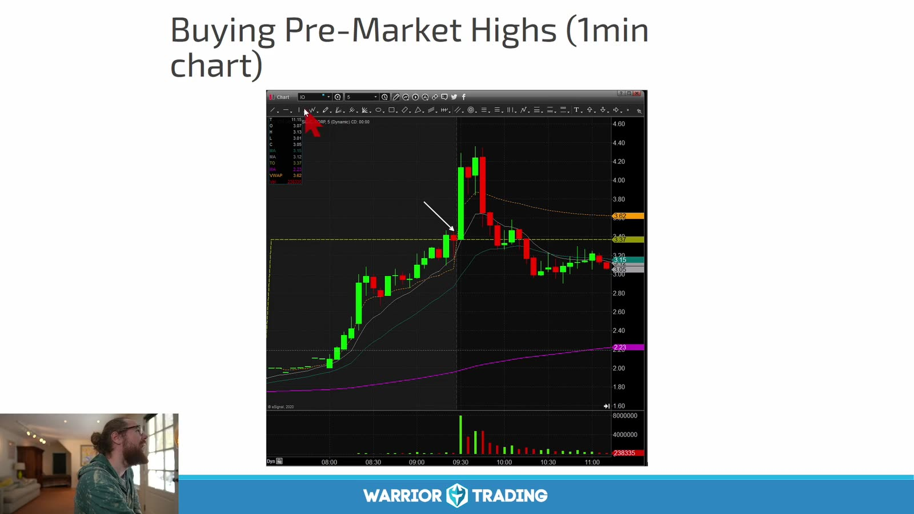

**图怎么看：**

- 盘前高点是市场已经实际成交形成的参考位，不是保证突破的天花板。
- 左侧 watchlist 与多个 Level 2 窗口说明开盘时同时有许多候选；应提前排序，避免临场追逐。
- 突破前若成交量枯竭、spread 扩大或价格离 VWAP 过远，名义上的 breakout 可能不可执行。
- 记录下单价与实际成交均价；高波动时 slippage 会让图上的漂亮 R 倍数失真。

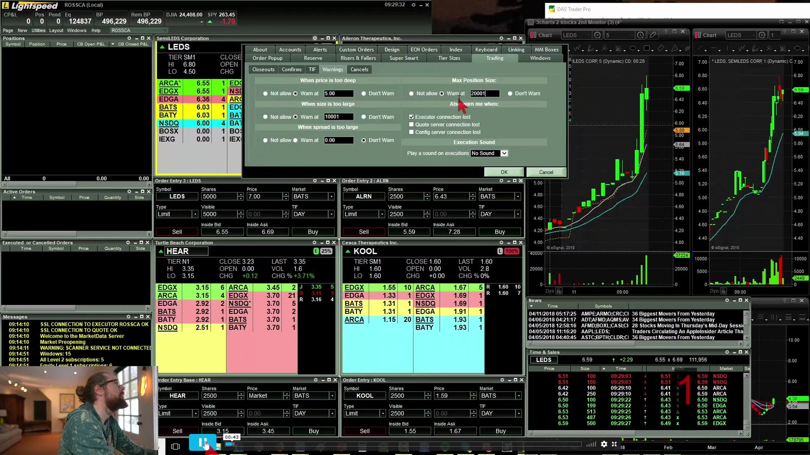

**图怎么看：**

- 主图中价格沿短期均线上行，黄色水平线可作为盘前关键位。
- 第一次 trade-through、突破后的 retest、以及再次突破是三种不同 entry，不能混称一个 setup。
- 价格突破后若能在关键位上方成交并形成 higher low，属于 acceptance；一瞬间刺穿不算。
- 若下方失效点太远，应缩小仓位或放弃，而不是把 stop 随意抬到噪声区域。

## 4. Setup 3：盘前 pivot 突破

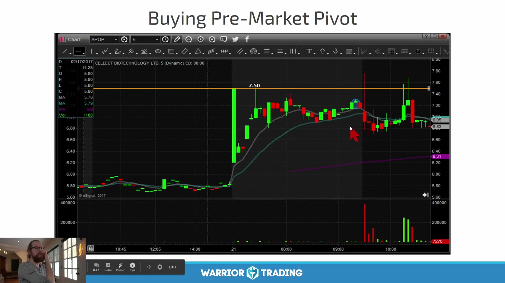

**图怎么看：**

- 黄色线附近不是当天绝对高点，而是盘前冲高、回撤后反复测试的局部阻力。
- Pivot 有效性的关键是市场多次在附近作出反应，并形成可识别的 consolidation。
- 触发前先看 pivot 上方最近的前高；如果空间不足 1R，突破正确也未必值得交易。
- Pivot 越容易被不同画法移动，越需要预先保存标线截图，避免事后挑线。

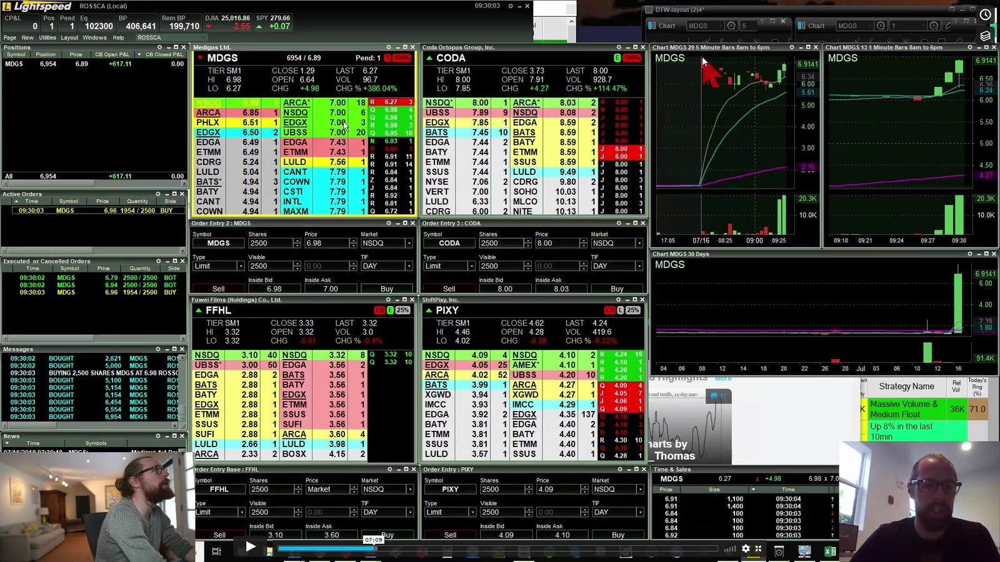

**图怎么看：**

- 右侧分钟图、左侧 Level 2 和 Time & Sales 应分工阅读：图看结构，盘口看当下流动性，成交带看已经发生的交易。
- Time & Sales 不是未成交订单列表；不能从打印颜色直接推断某个交易者的意图。
- 大卖单撤掉可能促成突破，也可能只是流动性短暂消失；不能把一次撤单自动解释为“确认”。
- 计划仓位应能在当前 depth 中合理退出，不能只看进入时是否成交。

## 5. Setup 4：整数与半整数关口

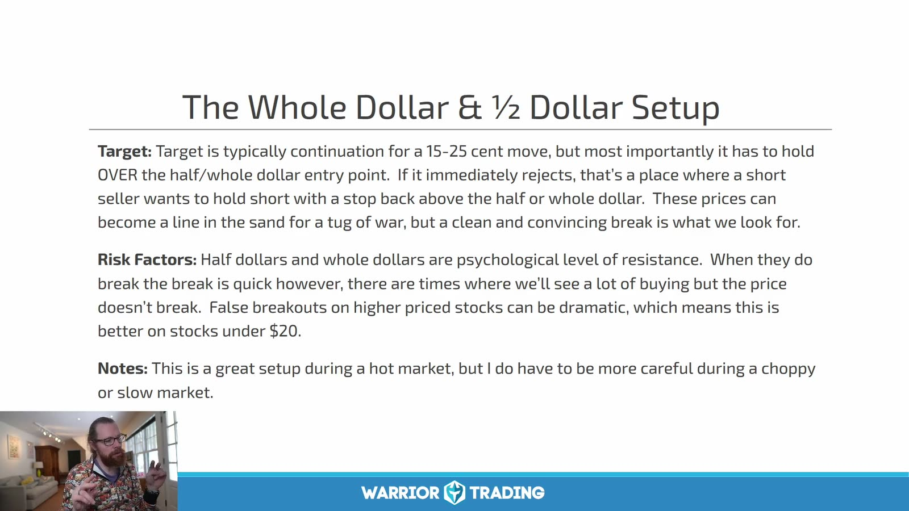

**图怎么看：**

- 课程把 `$x.00` 与 `$x.50` 当作常见心理价位，并强调价格在其下方横住再突破的形态。
- 价位本身不是优势；需要与趋势、成交量、盘前结构和上方空间同时出现。
- 高价股在关口附近一次假突破的绝对金额更大，固定股数会放大损失。
- Stop 应来自 consolidation low 或清楚的 micro structure，而不是统一设为 10 或 20 美分。

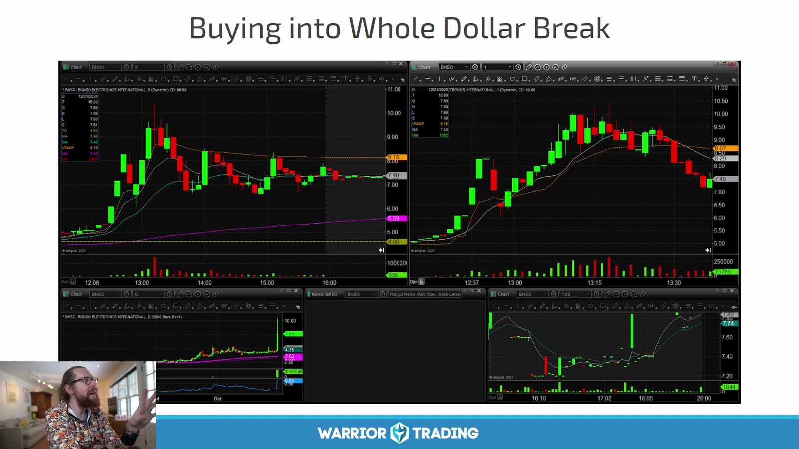

**图怎么看：**

- 多周期图中价格先在整数位下方整理，突破后快速扩张。
- 这种成功图容易造成“整美元必涨”的错觉；应对照统计 trade-through 后回落到关口下方的样本。
- 若 entry 已经在 breakout candle 顶部，虽然方向判断正确，盈亏比仍可能很差。
- 最好区分 anticipation、trade-through 和 retest 三种执行方式。

## 6. Setup 5：Opening Range Breakout

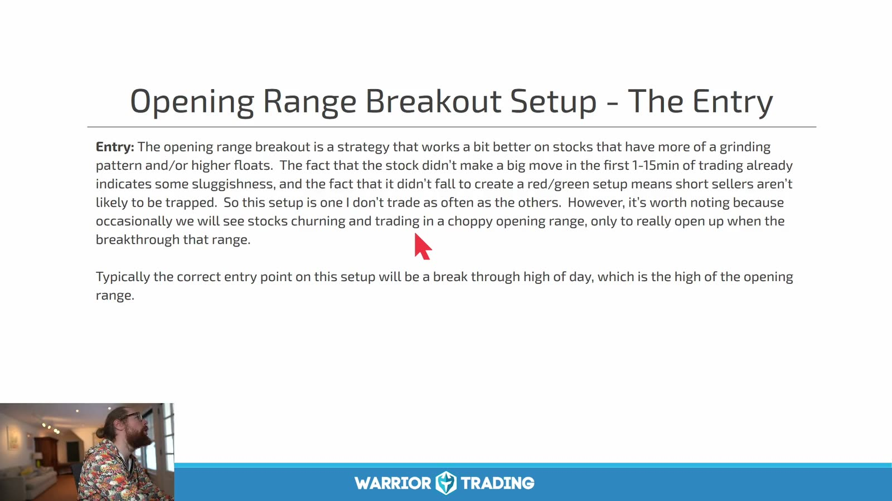

**图怎么看：**

- Opening range 必须先规定长度，例如 1m、5m 或 15m；否则可以事后任意选择。
- Trigger 是突破已形成区间的高点，失效通常参考区间低点或更紧的结构 low。
- 图中文字也提示该形态在 grinding、高位盘整的股票上可能更合适。
- 区间过宽会使 stop 太远；区间过窄则容易被开盘噪声反复触发。

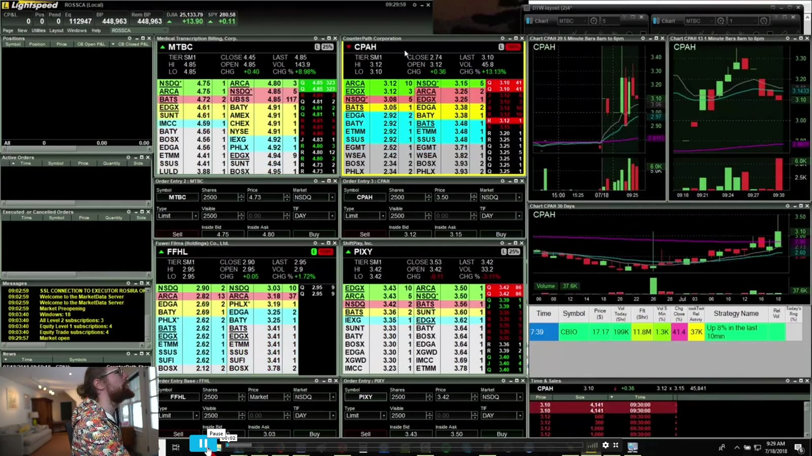

**图怎么看：**

- 右上图能看到开盘冲高后的整理；黄色线是需要提前固定的区间边界。
- 开盘首分钟 spread、成交速度和 halt 风险都更高，回测使用 K 线价格会低估真实执行成本。
- 突破同时撞上盘前高点时可能形成 confluence，但这些信号都源自同一价格路径，不是独立概率相乘。
- 若首个目标离 entry 太近，宁可等待 retest，也不要为了“开盘必须交易”而追价。

## 7. Setup 6：Red-to-Green

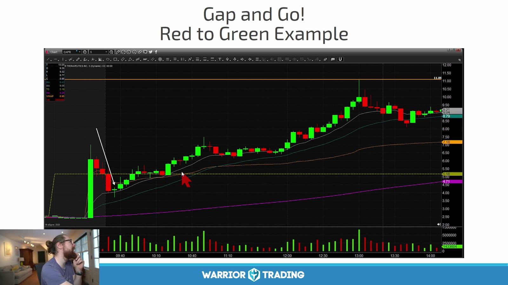

**图怎么看：**

- 水平基准是昨日收盘价；股票先低于昨收，随后穿越到正涨幅，因而称 red-to-green。
- 这只是相对昨收的状态变化，不代表公司基本面或当日趋势自动转强。
- 更重要的是恢复过程中是否形成 higher low、成交量是否配合、昨收上方是否有日线阻力。
- Gap down 后才有严格意义上的 red-to-green；不要把任意绿 K 都这样命名。

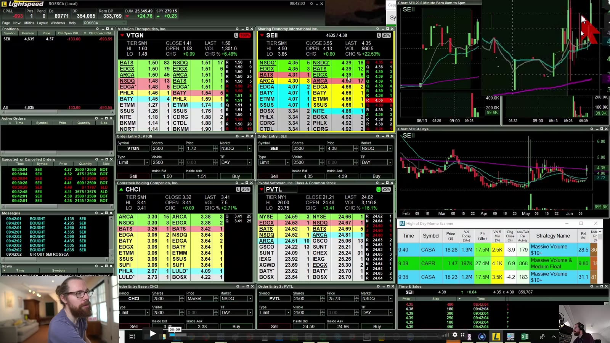

**图怎么看：**

- 右侧图先弱后强，突破基准后继续上行；左侧盘口用于判断当时能否现实成交。
- 基准附近往往有双向交易，单次穿越可能反复来回；可要求收盘确认或 retest 守住。
- 如果 stop 放在当天 low 而距离过远，必须按每股风险缩小仓位。
- 不应用后续大涨倒推第一次穿越就一定是高质量 entry。

## 8. Setup 7：盘前交易

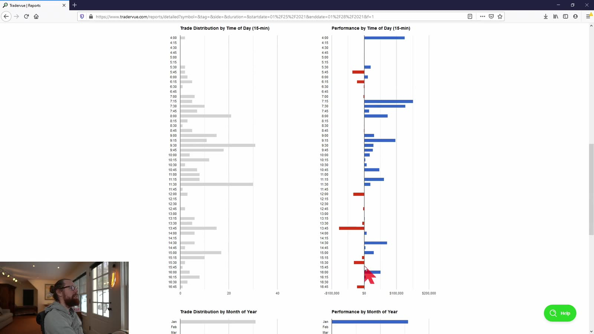

**图怎么看：**

- 左图是交易发生时段，右图是按小时汇总的表现；它提醒策略效果可能依赖时段。
- 个体历史统计比“盘前一定更好/更差”的口号更有价值，但要保证样本数和市场阶段足够。
- 盈利柱不能说明风险相同；还需比较每笔平均风险、最大亏损、滑点和停牌暴露。
- 课程作者的时段优势不能直接迁移到另一套 broker、数据源和执行速度。

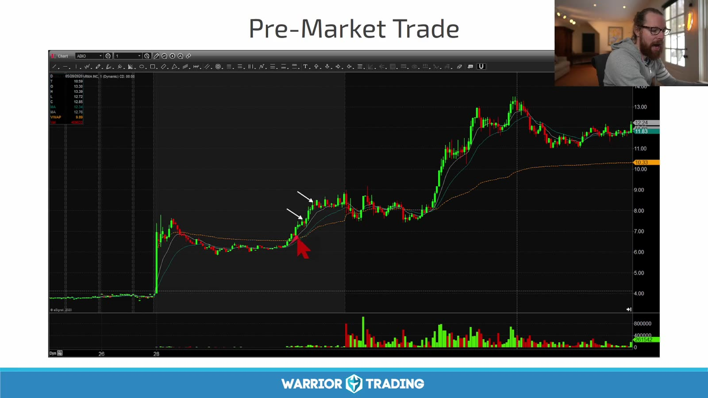

**图怎么看：**

- 图中正式开盘前已经发生主要上涨，随后在高位整理。
- 盘前 depth 通常更薄、spread 更宽，很多订单类型或 routing 行为与常规时段不同。
- 低流动性下少量成交就能画出漂亮 K 线；应先检查真实可成交规模。
- 若无法用限价单控制最坏成交价，就不应以常规时段的仓位照搬。

## 9. 把七种 entry 归到同一决策框架

| Setup | 参考位 | 典型触发 | 典型失效 | 主要陷阱 |
|---|---|---|---|---|
| First pullback | impulse 后局部 high | 前一根 K 高点 | pullback low | 后段追高 |
| Pre-market high | 盘前绝对高点 | trade-through / retest | 突破后结构 low | 假突破、滑点 |
| Pre-market pivot | 盘前局部阻力 | pivot 上方接受 | consolidation low | 事后移动标线 |
| Whole/half dollar | 整数或半整数 | 关口下蓄势后突破 | range low | 把心理价位当优势 |
| Opening range | 固定时长区间 | 区间高点突破 | 区间 low | 任意改变区间 |
| Red-to-green | 昨日收盘 | 从下向上穿越并守住 | 基准下方结构 low | 反复穿越 |
| Pre-market trade | 任一盘前结构 | 结构触发 | 结构失效 | 流动性与订单限制 |

它们共享同一条链：

```text
catalyst → liquidity → daily room → intraday structure
→ exact trigger → exact invalidation → position size → execution
```

如果无法在下单前填完这条链，setup 名字再熟也不等于已经有交易计划。

## 10. 练习与复盘

每种 setup 至少收集成功和失败各 20 个样本，并记录：

- 当日 gap、盘前成交量、float、催化剂；
- entry 属于 anticipation、breakout 还是 retest；
- 距离 VWAP、盘前高点、日线阻力和 LULD band 的距离；
- planned risk、实际滑点、最大有利/不利波动；
- 是当日第几次 pullback 或第几次测试；
- 是否停牌、是否出现 spread 扩张或深度消失；
- 严格按规则退出时的结果，而不是事后最佳退出点。

最终目标不是背七个名字，而是识别：**哪里证明想法成立、哪里证明想法失效、按真实流动性可以下多大。**
