# Small Cap 09：Momentum Long Setups

> 对应视频：Chapter 8 Intro 与 Setup 1–8
> 本节重点：这些 setup 都依赖“已经存在的强势”。区别在于等待多深的回撤、用哪个参考位触发，以及愿意承担多少流动性和停牌风险。

## 1. Momentum 的核心不是追任何上涨


**图怎么看：**

- 课程用鱼群比喻交易者同时聚集到少数活跃标的，说明 momentum 与注意力集中有关。
- 群体方向可以突然改变；比喻不能替代 catalyst、float、volume 和 price structure。
- “别人都在买”是观察到的结果，不是独立的风险控制。
- 真正可执行的定义需要明确时间窗口、涨幅、相对成交量、spread 和失效条件。

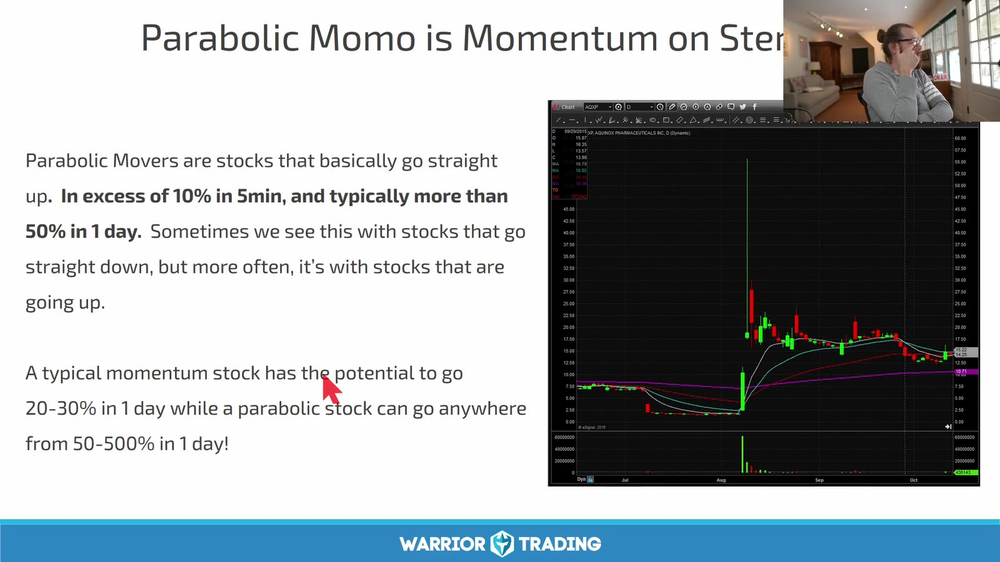

**图怎么看：**

- 课程把 5 分钟内超过 10%、单日可能超过 50% 的极端走势称为 parabolic；这是描述性经验，不是固定法规或自然边界。
- 图中拉升后迅速大幅回落，说明上涨速度越快，回撤和停牌风险也越大。
- 历史最大涨幅不能当作当前仓位的目标；先按最近结构定义 1R。
- 极端走势的 K 线可见，但当时的 spread、depth 和 slippage 常被静态图隐藏。

课程录制于异常活跃的 2020–2021 市场背景。练习时应按市场 regime 分组，避免把热市样本直接外推到冷市。

## 2. Setup 1：First / Second Pullback

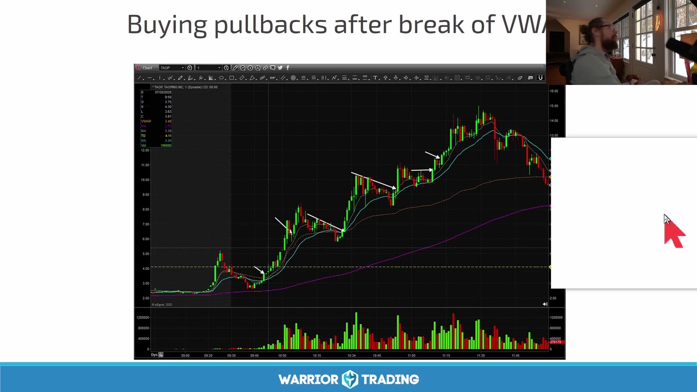

**图怎么看：**

- 价格收回 VWAP 后沿短期均线上行，白色箭头标出一系列较浅回撤。
- 第一次、第二次 pullback 通常比后续追高更接近趋势起点，但仍需清楚的 closed-candle trigger。
- Pullback 越浅，stop 越容易被噪声触发；越深则趋势可能已损坏。
- 每笔都记录“这是该周期第几次”，不能把全天所有回撤当作同类样本。

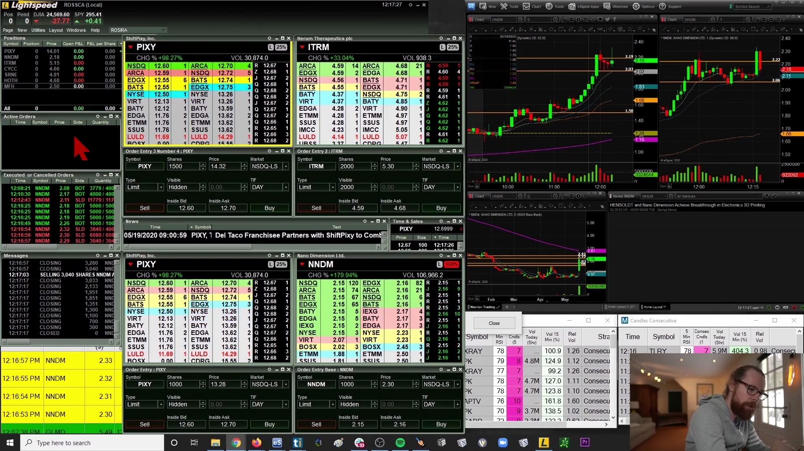

**图怎么看：**

- 右侧分别提供短周期和更大周期，左侧盘口提供当下可成交性。
- 先根据 chart 确认 higher low，再用盘口决定限价和仓位，而不是让闪动的 Level 2 代替结构判断。
- 若 ask 被打穿但价格不前进，可能是 hidden liquidity 或吸收；不要机械追单。
- Simulator 练习也要模拟延迟、partial fill 和 slippage，否则结果过度乐观。

## 3. Setup 2：ABCD

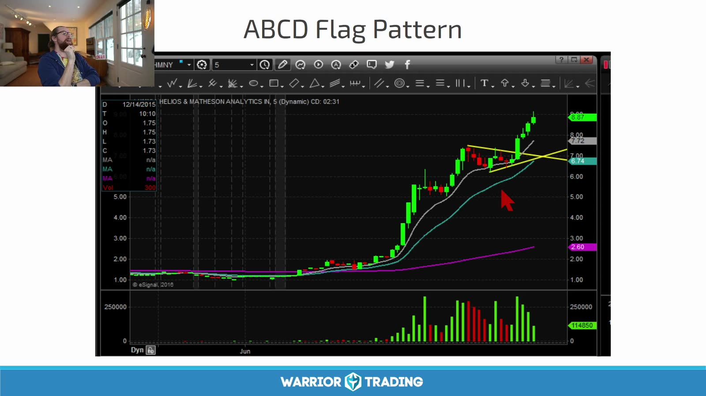

**图怎么看：**

- A→B 是第一段冲高，B→C 回撤，C 后再次上行并尝试突破 B。
- 最初可能被当作 bull flag，但未立即创新高；经过更深整理后才形成 ABCD。
- C 是逻辑失效参考，D 是可能的延伸区，而不是承诺到达的目标。
- 只有在 B/C 尚未被后续价格改写前先标点，样本才不受事后偏差污染。

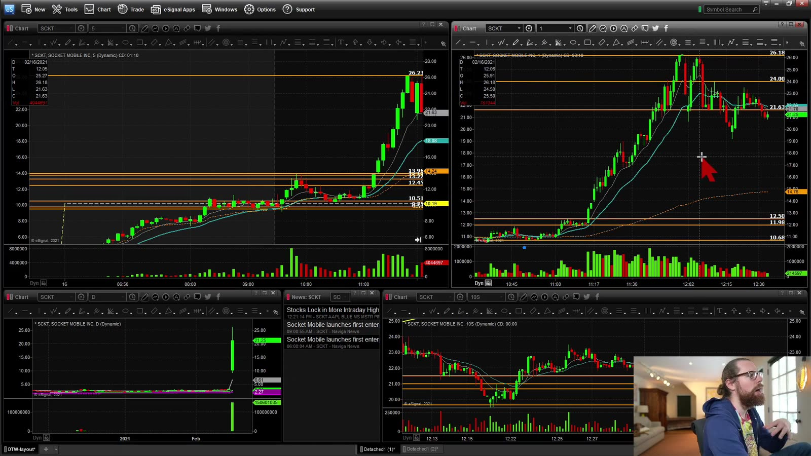

**图怎么看：**

- 左上图显示大幅拉升后的结构，右上图放大了高位整理。
- 1m 看起来杂乱时，5m 可能更清楚；但选择了 5m stop 就必须相应缩小股数。
- 第二次上攻若量能不足或在 B 附近连续受阻，应降低 breakout 预期。
- ABCD 与日线阻力重叠时，先计算突破后的真实空间，而不是只看形态名称。

## 4. Setup 3：Half / Whole Dollar

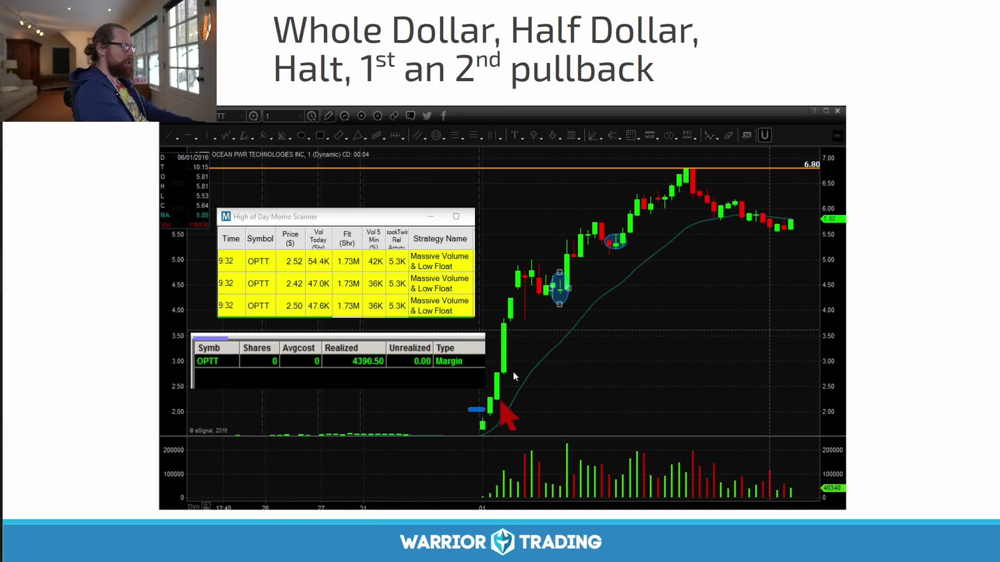

**图怎么看：**

- 课程把整数、半整数、停牌线以及第一次/第二次回撤叠加在同一走势中。
- 这些条件彼此相关，不能把五个价位标签当作五个独立确认信号。
- 关口附近是否真的反复成交、是否有 consolidation，比数字是否整齐更重要。
- 突破前的结构 low 决定风险；不能用固定 10 美分 stop 处理不同价格和波动的股票。

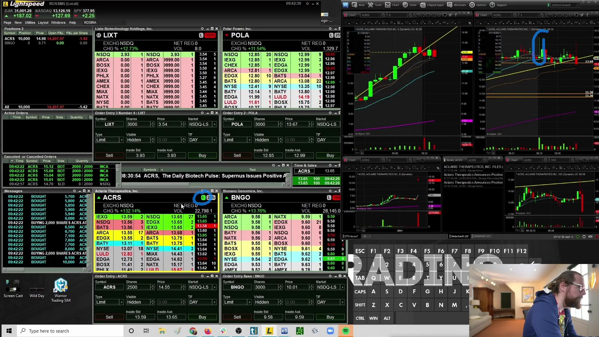

**图怎么看：**

- 右上标线展示关口，Level 2 则显示多个 market participant 的报价。
- 大额可见 ask 可能成交、撤单或被 iceberg 补充；截图不能说明它下一秒会怎样。
- Entry 应明确属于提前埋伏、trade-through 或突破后 retest。
- 高速行情中 marketable limit 可以控制最坏价格；纯 market order 可能产生不可接受的滑点。

## 5. Setup 4：Micro Pullback


**图怎么看：**

- Micro pullback 是强趋势中的极短暂停顿，通常没有形成传统 3–5 根 K 的完整 bull flag。
- 课程也把它列为更进阶、在热市更有效的 setup。
- 回撤过小意味着失效点近、噪声多；追得过高又会放大回撤损失。
- 需要额外过滤：强 catalyst、持续 volume、tight spread、至少有可识别的一根 closed candle。

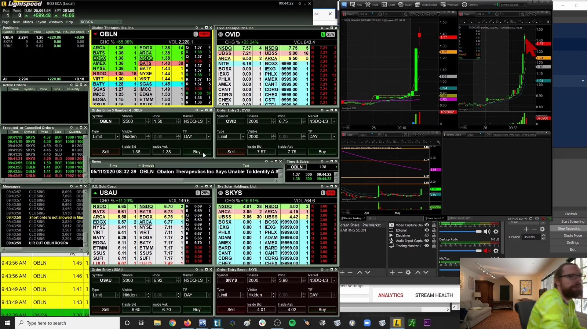

**图怎么看：**

- 右侧走势几乎垂直，短暂停顿后继续；这类图最容易诱发 FOMO。
- 图中最后成功不代表每次停顿都是 entry；要加入一根停顿后直接 flush 的反例。
- 在 LULD 上限附近，几美分风险的假设可能被停牌后的跳空完全打破。
- 若无法接受 halt resume 后的离散损失，正确仓位可能是零。

## 6. Setup 5：High-of-Day Break

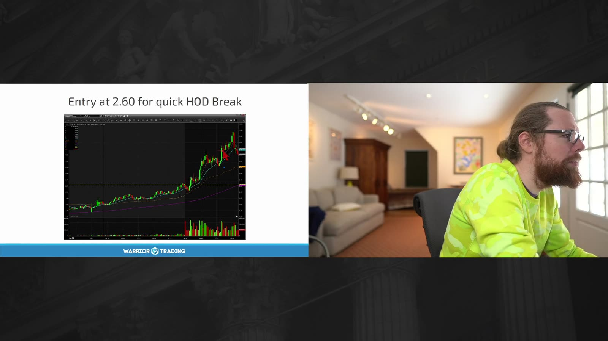

**图怎么看：**

- 课程示例在约 2.60 附近等待 HOD break，属于“buy high, sell higher”。
- 高点应由已完成的成交形成；盘中不断更新 HOD 时，参考位也会改变。
- Breakout scanner 可能吸引更多关注，但它不保证新增买单足以吸收卖压。
- Entry 离最近 higher low 越远，越应减小仓位或等待 retest。

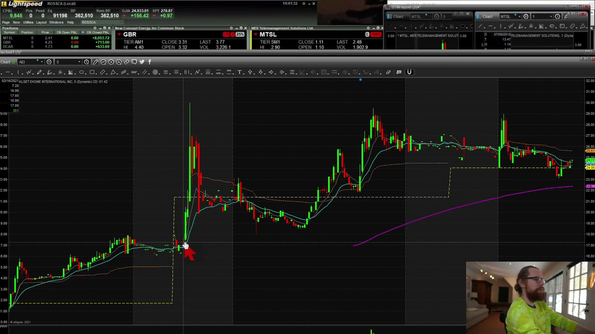

**图怎么看：**

- 箭头附近向上突破后并未保持单边趋势，随后出现大幅波动。
- 这正是不能只保存“突破那一帧”的原因；至少回看后续 1、5、15 分钟。
- 对 HOD break 记录 maximum favorable excursion 与 maximum adverse excursion，判断理论 edge 是否被滑点吃掉。
- 若 breakout 后重新接受在前高下方，setup 已失效，不应改名为长线持仓。

## 7. Setup 6：VWAP Breakout

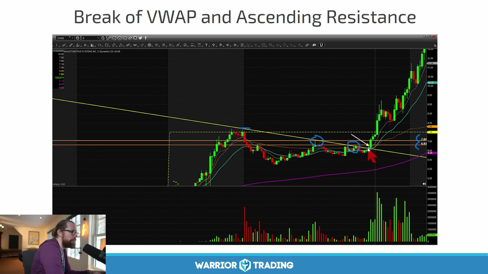

**图怎么看：**

- 价格先跌到 VWAP 下方，随后在 VWAP 和下降趋势线附近反复压缩，最后向上离开。
- VWAP 是成交量加权的当日均价，不是天然支撑；它的意义来自交易者反应和当前结构。
- 同时穿越 VWAP 与趋势线是一个价格事件的两种描述，不宜把概率简单相乘。
- 更稳健的触发是突破后在 VWAP 上方形成 acceptance 或 retest 守住。

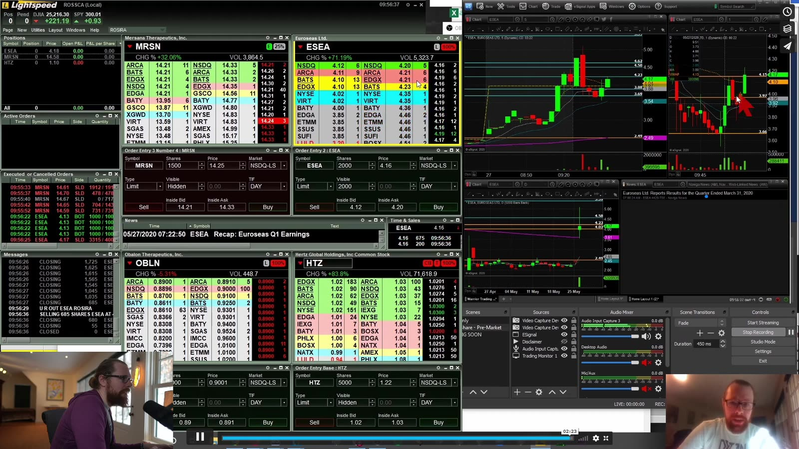

**图怎么看：**

- 右侧短周期图展示 VWAP 附近的横盘，左侧盘口用于核对成交质量。
- 若价格来回穿越 VWAP，说明缺少方向性；第一次穿越不一定值得交易。
- 先标上方盘前 pivot、HOD 和日线阻力，避免突破 VWAP 后马上撞墙。
- 失效可定义为重新跌回 VWAP 并破最近 higher low，而不是无限等待再次收回。

## 8. Setup 7：Into / Out of LULD Halts

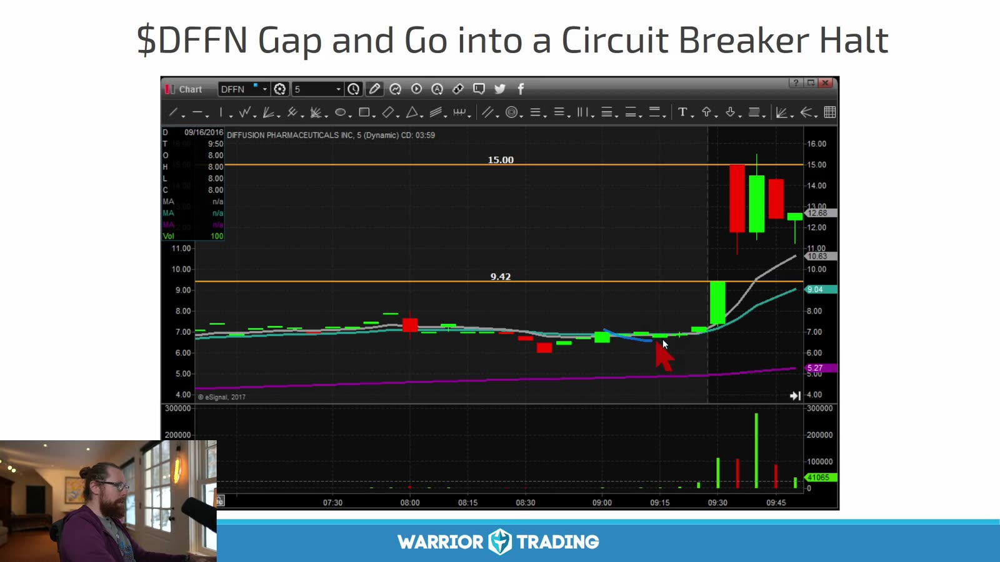

**图怎么看：**

- 图中价格快速上行并触及波动带，随后出现 circuit-breaker halt。
- LULD 是市场结构保护机制，不是“上涨确认”；恢复交易价格可能向上也可能向下跳空。
- 课程录制期的阈值、停牌频率和经验描述可能过时，实际交易前应查当前交易所规则和 halt 状态。
- 进入停牌后无法用普通 stop 连续退出，因此最大损失不再等于图上的 stop distance。

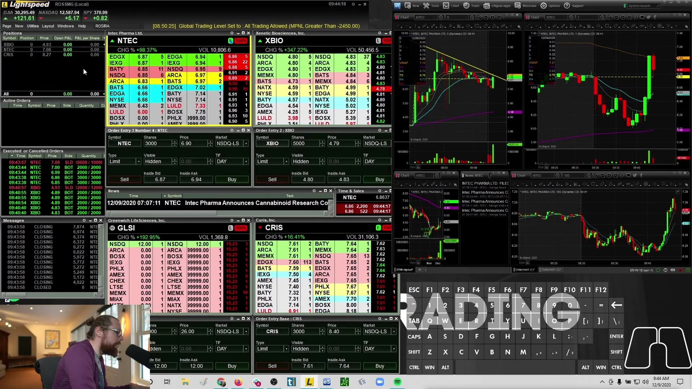

**图怎么看：**

- 盘中软件会显示接近 halt band 的价格，但截图不能保证 feed 与交易所状态完全同步。
- 盘口在恢复时可能重建，旧 depth 不能视为仍可成交。
- “买入停牌”实际承担 jump risk、reopen auction 和可能连续停牌的风险。
- 初学阶段应把它单独统计，且可以直接列为禁做，而不是当作普通 breakout。

当前停牌代码与交易状态以 [Nasdaq Trade Halt Codes](https://www.nasdaqtrader.com/Trader.aspx?id=TradeHaltCodes) 和交易所实时信息为准。

## 9. Setup 8：Dip Buy

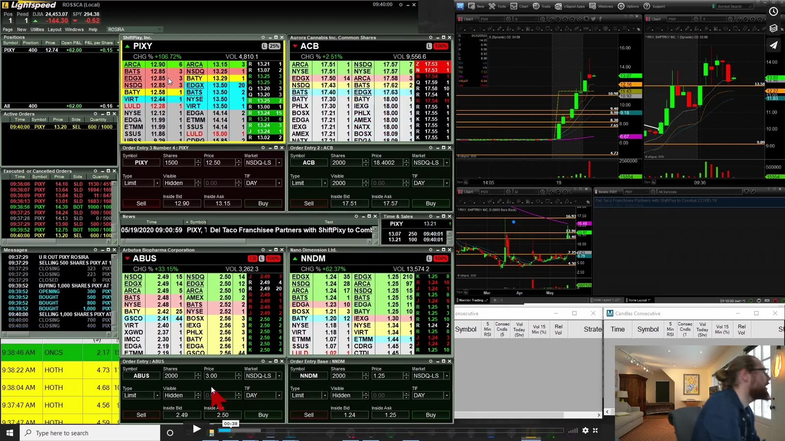

**图怎么看：**

- Dip buy 试图在快速下跌时判断“暂时回撤”而非趋势反转，难点正是二者在当下外观相似。
- 左上价格从高位回撤；必须先找前一次突破位、VWAP、均线、整数位或 LULD lower band 等可验证参考。
- 不应仅凭红 K 已经很长就买入；下跌幅度大不等于即将反弹。
- 在流动性消失时，limit order 也可能完全不成交；成交与不成交都需纳入统计。

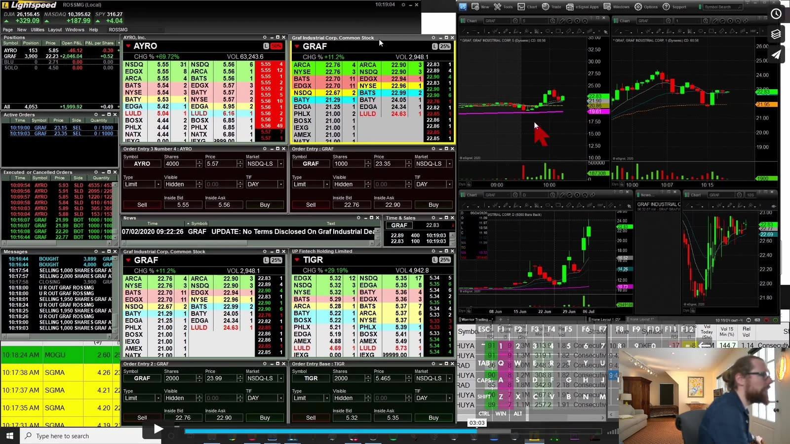

**图怎么看：**

- 四个图同时变化会造成模式错觉；一次只对计划中的标的和参考位作判断。
- 有效 dip 常需要下跌速度减慢、关键位有实际买盘反应并重新突破 micro high。
- 如果 price acceptance 发生在关键位下方，原支撑假设已经失效。
- 课程作者在交易近十年后才加入该方法，本身说明它不适合作为入门第一策略。

## 10. 难度和风险排序

按对速度、流动性判断和离散风险的要求，大致可排为：

```text
first/second pullback
  → ABCD / VWAP breakout
  → half-whole dollar / HOD
  → micro pullback
  → dip buy
  → trading into or out of halts
```

这个排序不是收益承诺，而是学习顺序。前一层只有在模拟盘有足够样本、扣除滑点后仍能稳定执行，才考虑下一层。

## 11. 统一日志字段

每笔记录：

- setup 名称与时间周期；
- 当日第几次触发；
- catalyst、float、RVOL、market regime；
- entry、invalidation、第一目标和 planned R；
- 是否接近 VWAP、HOD、整数位或 LULD band；
- 下单类型、期望价格、实际均价、partial fill；
- 是否发生 halt、最大不利跳空；
- 退出是否符合原计划；
- 1/5/15 分钟后的结果。

这样才能回答“哪个 setup 真正适合自己”，而不是被最刺激的成功案例带着走。
