# Small Cap 10：Short Selling Momentum Stocks

> 对应视频：Chapter 10 Intro 与 Setup 1–6
> 本节重点：做空不是把 long setup 上下翻转。除了方向判断，还要处理借股、费用、召回、SSR、buy-in、停牌跳空和理论上无上限的亏损。

## 1. 为什么课程作者很少做空

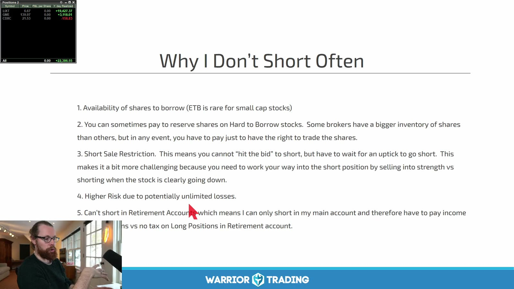

**图怎么看：**

- 课程列出 borrow availability、borrow fee、Short Sale Restriction、高风险和退休账户限制。
- “软件里有 Short 按钮”不等于已经借到股票；locate、实际 borrow 和 broker 规则要逐笔确认。
- Hard-to-borrow 费用可能把方向正确的交易变成净亏损，且费率和可借数量会变化。
- 账户类型、税务和退休账户规定因 broker 与个人情况而异，应向券商和专业顾问确认。

做空订单发生的是：

```text
borrow/locate shares
→ sell borrowed shares
→ later buy shares back
→ return shares
```

盈利上限接近卖出价，理论亏损无上限。股票从 `$5` 涨到 `$20`，每股亏损 `$15`，不是原始价格的 100% 封顶。

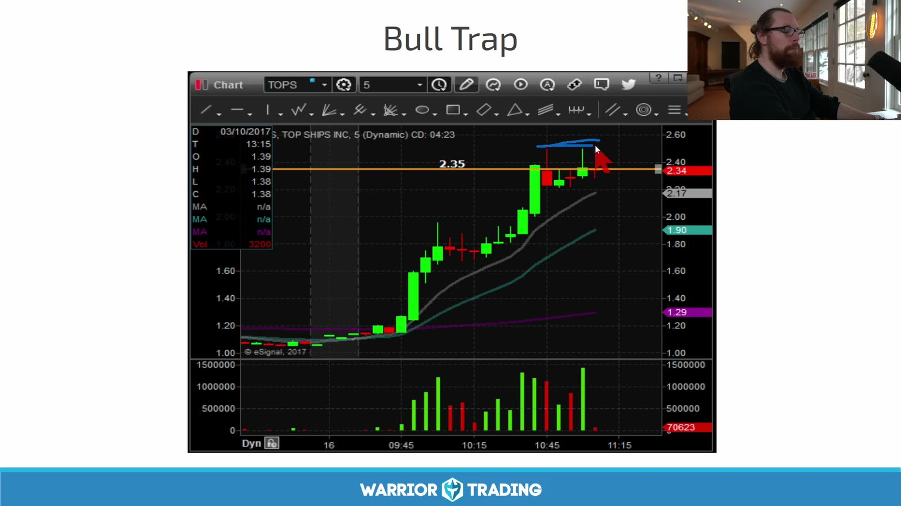

**图怎么看：**

- 股价强势上涨后在前高附近突破失败，红 K 跌回 breakout level。
- Long trader 的止损与主动退出可能加速下跌，但图无法证明每一笔卖单的身份。
- Bull trap 是事后结构标签；做空触发仍应是跌回关键位、破 micro low 或 retest 失败。
- 直接在第一根红 K 追空，可能在下方支撑前得到很差的盈亏比。

## 2. Setup 1：False Breakout Short

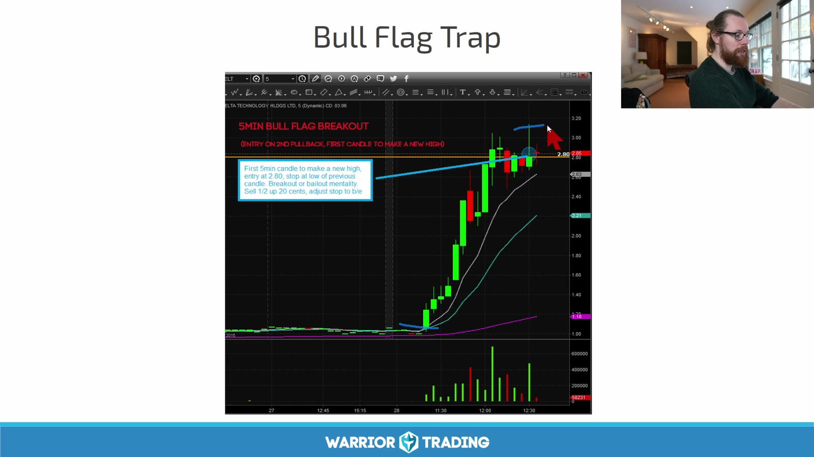

**图怎么看：**

- 价格先形成看似健康的 bull flag，突破前高后马上被压回。
- Short trigger 可以定义为重新跌破 breakout level 或突破 K 的 low，而不是仅凭上影线。
- Stop 可参考 rejection high；由于每股风险可能很大，股数必须相应缩小。
- 下方第一目标通常是 flag low、VWAP 或前一突破位，需要在下单前标清。

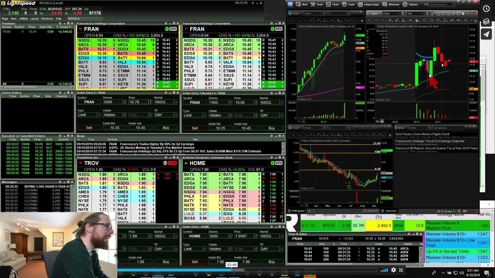

**图怎么看：**

- 右上图的冲高回落与左侧 Level 2 同时出现，但 chart 负责定义结构，盘口只辅助执行。
- 若股票处于 SSR，普通卖空订单不能在当前 best bid 或更低主动击穿；具体执行由券商实现。
- Long stop 被触发是可能机制，不是可从截图直接验证的事实。
- False breakout 之后也可能快速 reclaim；跌破后不能延迟执行 short stop。

美国 Regulation SHO Rule 201 的当前解释以 [SEC FAQ](https://www.sec.gov/rules-regulations/staff-guidance/trading-markets-frequently-asked-questions-7) 为准。

## 3. Setup 2：Trend Shift Short

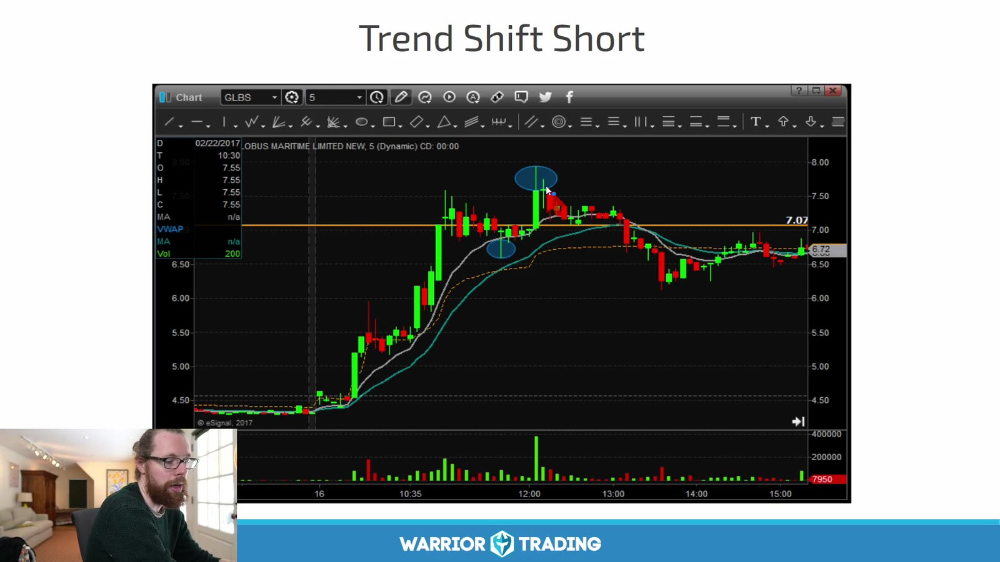

**图怎么看：**

- 蓝圈附近冲高失败，随后破坏 higher-low sequence，短均线转平并向下。
- 一个 lower high 不够；更清楚的确认是跌破关键 swing low 后反弹无法收回。
- 确认越多，entry 越低；风险变清楚的同时 reward 也可能已经被消耗。
- 大级别仍强时，1m trend shift 可能只是 5m pullback，必须固定交易周期。

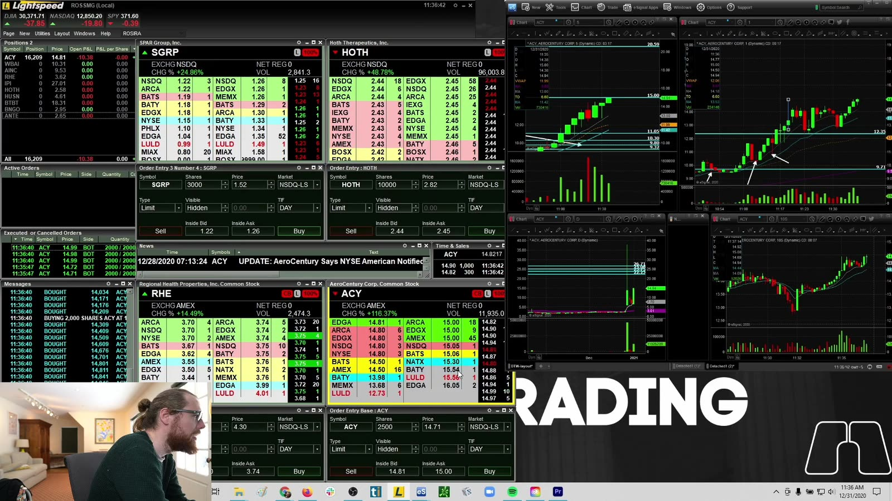

**图怎么看：**

- 右上、右下展示不同周期；短周期转弱前先检查大周期支撑和 VWAP。
- 若 locate 很贵，等待确认的时间也可能导致借股消失；这属于策略可执行性，而非图形问题。
- Short entry 与 cover 需要两次成交，薄 depth 会在两边都造成滑点。
- 下跌到支撑或 LULD lower band 前应提前计划 cover，而不是期望整天单边下跌。

## 4. Setup 3：Halt Resumption Short

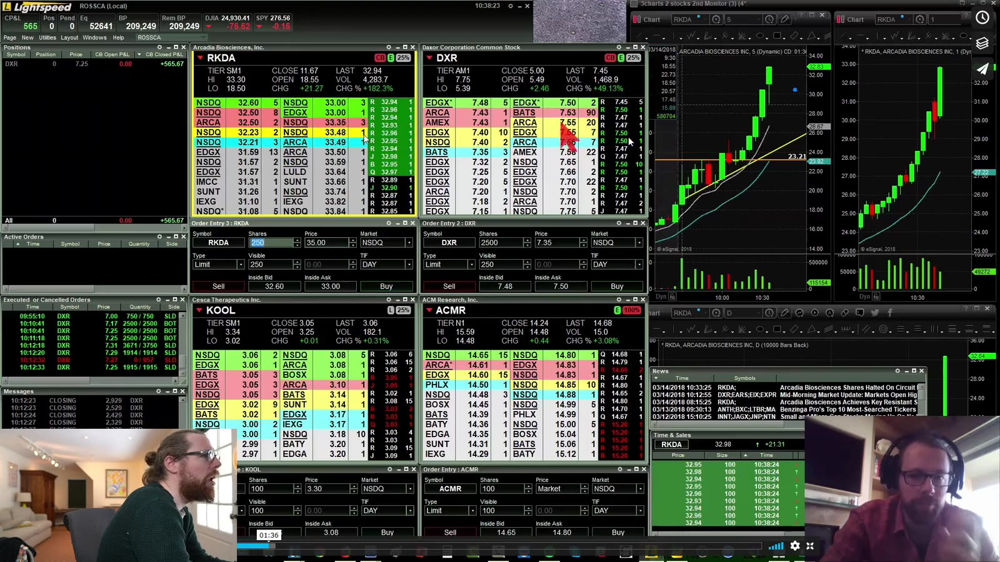

**图怎么看：**

- 图中标的连续上行，价格扩张、depth 变薄，任何停牌后的恢复都可能发生巨大跳空。
- 进入停牌后不能连续调 stop，恢复价可以直接越过风险线。
- 做空还可能遇到无可借股、locate 失效、强制 buy-in 或连续向上停牌。
- 这不是普通的“高胜率 setup”，而是具有离散尾部风险的独立策略。

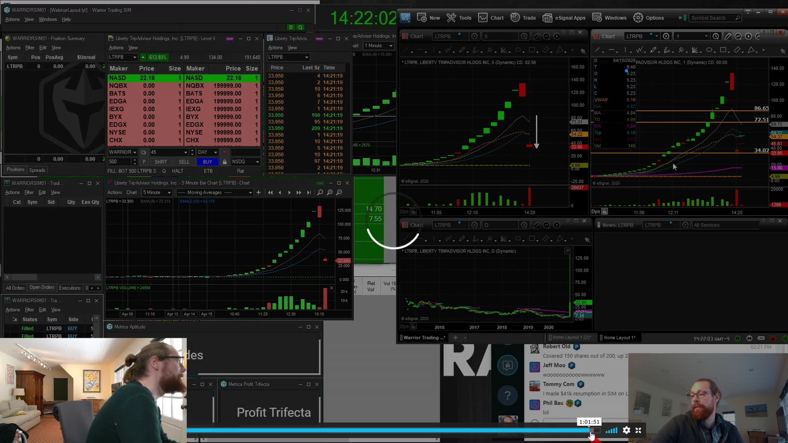

**图怎么看：**

- 截图叠加多个 chart 和订单窗口，显示实际执行比事后 K 线复杂得多。
- 课程把特定情形形容为接近 “guaranteed home run”；这个说法必须明确拒绝：市场交易没有保证。
- 即使历史样本多数下跌，一次向上 gap 就可能超过许多小盈利。
- 没有明确 broker 规则、最大离散损失和极小仓位时，最合理的规则是禁做。

## 5. Setup 4：Bear Flag Breakdown

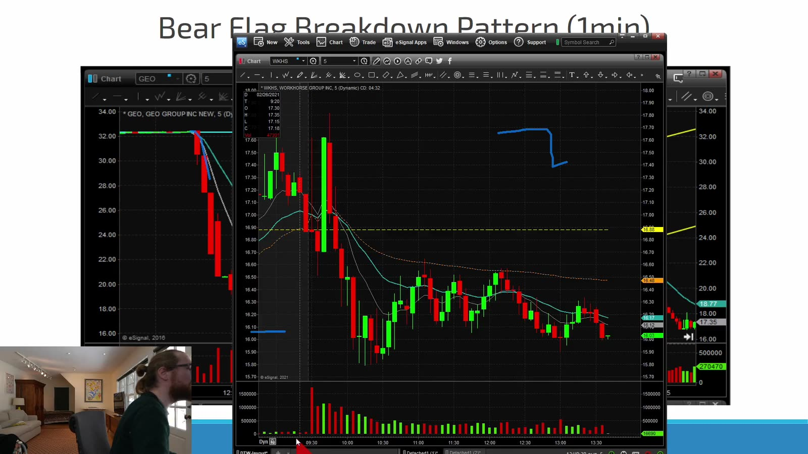

**图怎么看：**

- 左侧先发生 impulse down，随后价格弱反弹或横盘，构成 flag，再尝试跌破。
- 反弹量缩、high 下降、处于 VWAP 下方时，continuation context 更清楚。
- Trigger 可定义为 consolidation low breakdown，stop 参考 flag high。
- 已连续大跌后才追空，下面空间可能不足；先标日线支撑和 LULD lower band。

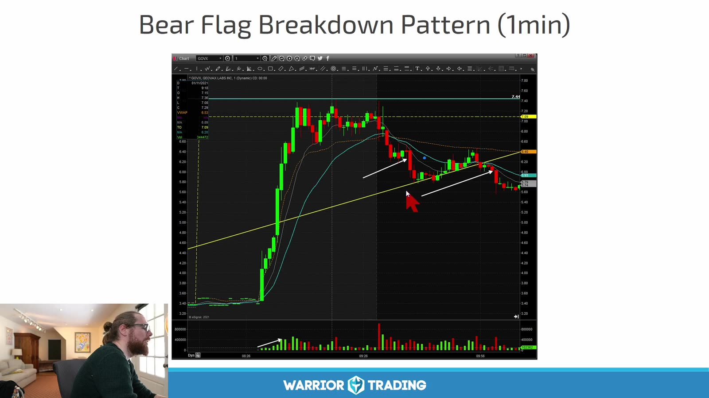

**图怎么看：**

- 白线勾出下压趋势，红箭头位于跌破区间的位置。
- 1m bear flag 容易受一次 spread 扩大或短线 squeeze 破坏，stop 不能依赖“应该会跌回来”。
- SSR 下可否成交与如何挂单必须在 simulator 中按真实券商机制练习。
- 如果反弹收回 VWAP 并形成 higher low，continuation 假设显著变弱。

## 6. Setup 5：VWAP Fade

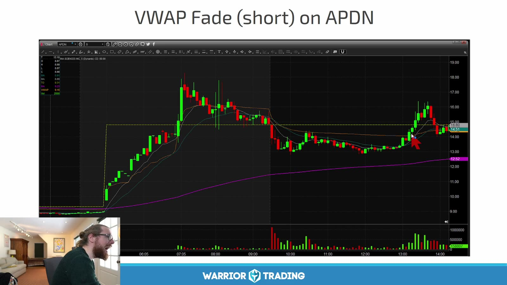

**图怎么看：**

- 股价早盘冲高后逐渐走弱，反弹到 VWAP 附近受阻，再次下行。
- “碰 VWAP”不是 entry；需要 rejection、lower high 或重新跌破 micro low。
- Stop 放在 VWAP 上方时要留出正常波动，否则价格来回穿越会频繁止损。
- 如果 VWAP 本身趋平且价格反复跨越，说明方向 edge 很弱。

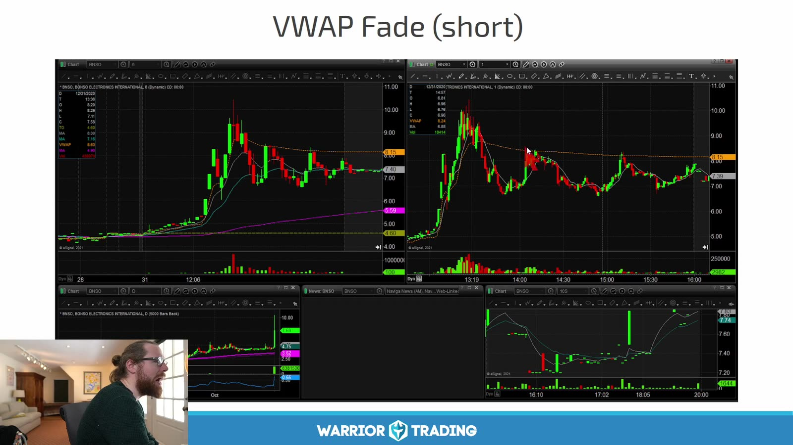

**图怎么看：**

- 左右两个案例都从冲高转为横盘回落，但结构速度和支撑位置不同。
- 成功例说明 setup 长什么样，不说明基础胜率；必须保留 reclaim VWAP 后 squeeze 的失败例。
- VWAP、下降均线和 lower high 都源自同一价格路径，不能当作三个独立信号。
- 第一目标可设前低，若前低太近则即使 entry 正确也不值得承担 short squeeze 风险。

## 7. Setup 6：Gap Fade

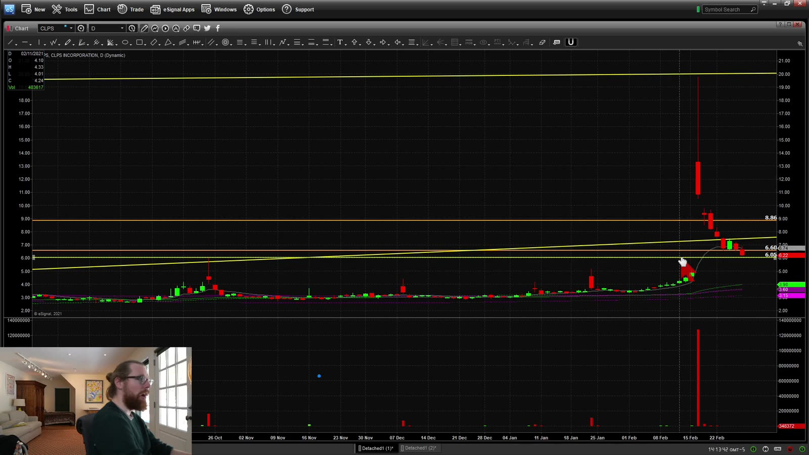

**图怎么看：**

- 图中历史上出现高开或急涨后大幅回落，课程据此寻找“有 gap-and-fade 历史”的股票。
- 历史行为可以作为分类特征，但公司事件、float、融资和市场 regime 都会改变。
- 大红 K 是日后看见的完整结果；开盘时不能知道它最终会收在哪里。
- 直接在开盘盲空最容易遭遇 red-to-green squeeze，等待 VWAP 失守更可验证。

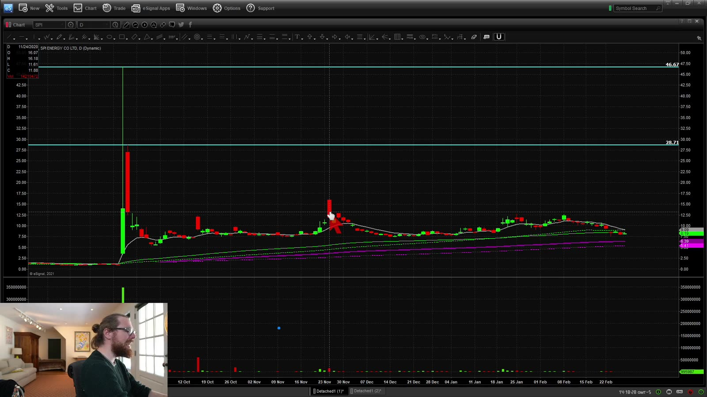

**图怎么看：**

- 高位开盘后迅速回落，随后长时间低位横盘，属于理想化的 fade 结果。
- 真实执行需考虑能否在高位借到、cover 时有没有流动性，以及 borrow fee 是否按日收取。
- 若催化剂强于历史、盘前量显著异常或价格守住 VWAP，不能只因旧图相似而强行做空。
- 把 gap size、opening range、VWAP retest、borrow cost 和 market regime 分开记入日志。

## 8. Short Trade 的完整风险表

下单前逐项回答：

| 问题 | 必须明确的内容 |
|---|---|
| Borrow | Easy-to-borrow 还是 hard-to-borrow；数量是否真的可用 |
| Cost | Locate、borrow、佣金和可能的持仓费 |
| Rule | 是否触发 SSR；券商怎样路由合规订单 |
| Corporate | 新闻、增发、拆股、并购或其他事件 |
| Entry | 具体 breakdown / rejection 触发 |
| Stop | 结构失效价；停牌跳空时 stop 不保证成交 |
| Size | 按每股风险及尾部风险取更小值 |
| Cover | 第一目标、部分 cover、最终失效 |
| Operational | Recall、forced buy-in、盘后流动性和平台限制 |

## 9. 不应接受的三个推理

1. **“涨很多所以一定会跌。”** 价格可以在看似不合理后继续上涨数倍。
2. **“胜率高所以风险小。”** 小赢多次加一次巨大 squeeze，期望值仍可为负。
3. **“stop 限制最大损失。”** 停牌、gap、流动性消失时，成交价可能远离 stop。

入门阶段更适合先在 simulator 练 bear flag 与确认后的 VWAP fade；halt resumption、第一次顶部猜测和极端 parabolic short 应单独隔离，不纳入普通 setup。
