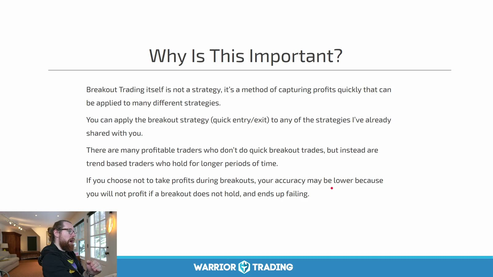
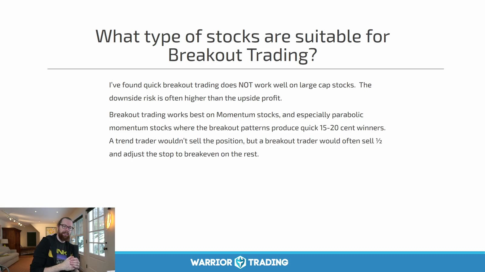
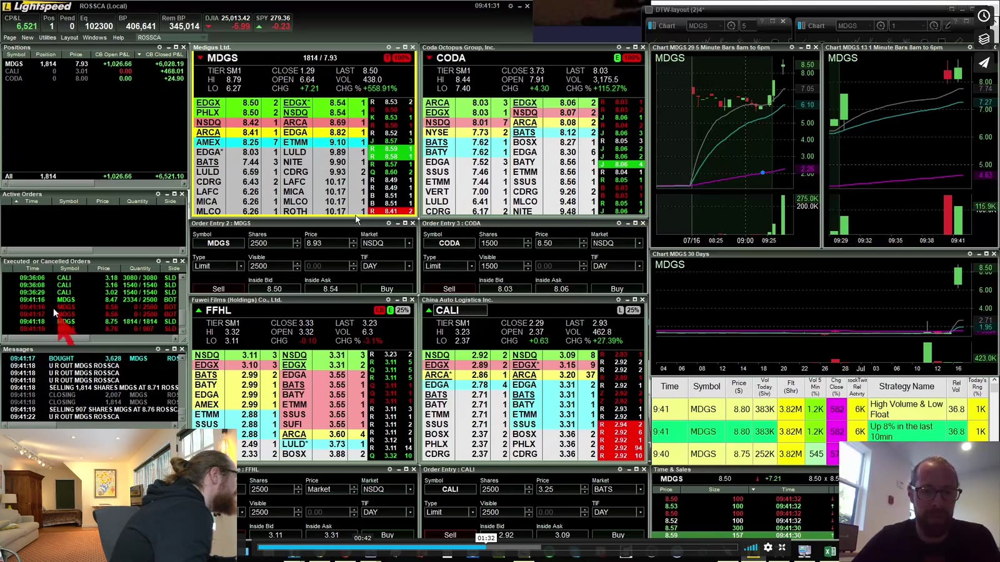
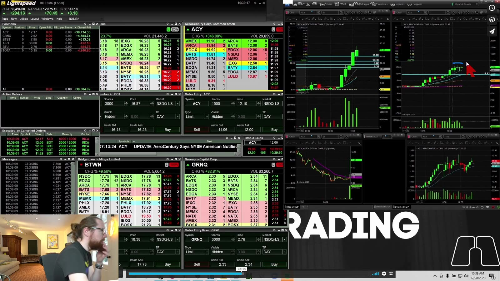
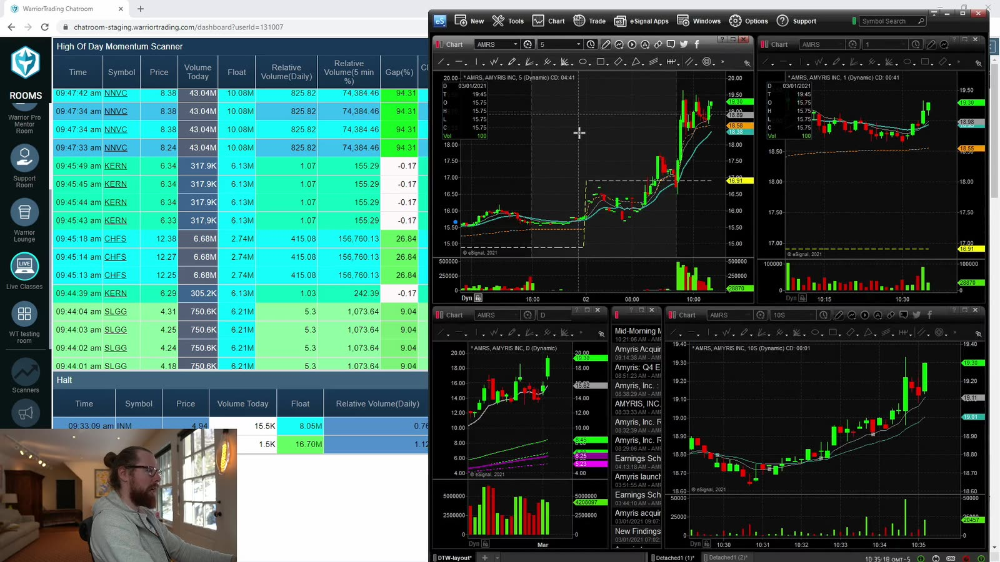
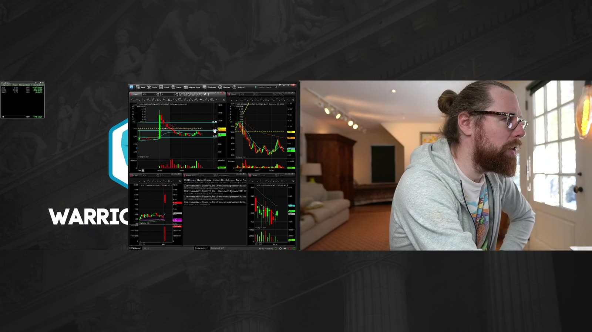

# Small Cap 11：High-Speed Execution and Scanning

> 对应视频：Chapter 11–12
> 本节重点：scanner 负责发现候选，chart 负责定义 setup，订单工具负责执行。三者不能互相替代；速度只在规则已经清楚时有价值。

## 1. Breakout trading 是执行方式，不是独立 edge



**图怎么看：**

- 课程明确说 breakout trading 本身不是策略，而是快速捕捉已有 setup 的利润。
- 如果 setup 没有统计优势，更快进出只会更快积累佣金、滑点和错误。
- 持仓少于一分钟时，K 线回测常忽略 bid/ask、排队顺序与 partial fill。
- 低胜率可以配合较高 payoff，但必须用实际净收益验证，不能只靠口号。

一笔 high-speed trade 仍需完整字段：

```text
context → trigger → limit price → stop/invalidation
→ first target → partial exit → max hold time
```

## 2. 标的必须适合快速突破



**图怎么看：**

- 课程认为大盘股通常不适合这种几秒钟的 breakout，而强 momentum、尤其 parabolic 小盘股更常产生快速波动。
- “会动得快”同时意味着假突破、LULD halt 和滑点也更严重。
- 每个标的都要比较预期 breakout 幅度与 spread；若目标只有 10 美分而 spread 已占 5 美分，理论利润不现实。
- 不能为了快速交易而固定全仓；仓位仍由失效点距离决定。

## 3. 实盘速度来自预设，不是临场反应



**图怎么看：**

- 右侧图在短时间内扩张，左侧多个 Level 2 用于在不同标的间执行。
- 窗口越多越容易错 symbol；hotkey 必须绑定当前激活窗口并有明显确认。
- 开盘前应预先标 trigger、最大限价、stop 和第一目标，突破时只执行已写计划。
- 成交后立刻核对 position、average price 与 open orders，避免重复下单。



**图怎么看：**

- 红箭头附近出现快速价格变化；事后 chart 看似平滑，实际可能几秒内跨越多个价位。
- Time & Sales 只显示已发生的成交，不显示所有待成交意图。
- Level 2 可见 depth 可能撤单或隐藏，不能把它当作保证退出的流动性。
- 最坏成交价要由 marketable limit 控制；纯 market order 在薄盘中风险很大。

## 4. Hotkey 风险控制

课程提到反复练习键位。正确练习不是只追求肌肉记忆，还要建立防错机制：

- simulator 与 live 使用明显不同的颜色或账户标签；
- 每个 buy/sell hotkey 明确 share size、order type、offset 和 route；
- 设置 cancel-all、flatten 和 disable-hotkeys 的独立键位；
- 不用可能与操作系统快捷键冲突的组合；
- 小额 live 验证前逐一检查 broker 文档；
- 每次软件升级、workspace 导入或键盘更换后重新测试；
- 不使用无法确认 symbol、side 与 size 的“一键全自动”设置。

训练日志要记录按键错误和 near miss，即使没有产生亏损。

## 5. Scanner 是候选列表



**图怎么看：**

- 左侧 scanner 按触发时间列出创新高或快速上涨的股票，右侧 chart 用于二次筛选。
- Scanner 报警通常发生在价格已经移动之后；直接点第一名容易成为最后追高者。
- 依次检查 catalyst、float、daily room、RVOL、spread、halt proximity 和结构。
- 同一股票反复报警不等于多个独立机会；可能只是一个趋势的连续更新。



**图怎么看：**

- 多张小图便于快速排除无结构标的，但最终 entry 应在主图上确认。
- 不同 scanner 可能同时报告同一事件；注意力重复不应被误当作 confluence。
- 预先保存 scanner 原始时间戳，复盘时才能判断报警是否早于可执行 entry。
- 只保存最后大涨图会造成幸存者偏差；所有触发，包括快速失败者，都要进入样本。

## 6. Scanner 结果的处理流程

```text
alert
  ↓
symbol / price / volume sanity check
  ↓
catalyst and filings
  ↓
daily levels and room
  ↓
1m / 5m setup
  ↓
spread, depth and LULD
  ↓
planned trigger and risk
  ↓
order
```

任何一层无法回答就跳过。Scanner 的价值是缩小搜索范围，不是制造“必须交易”的紧迫感。

## 7. Scanner 规则应可复现

每个 scanner 保存：

- price range；
- gap 或 change 阈值；
- relative volume 和 minimum volume；
- float / market cap 范围；
- 触发事件，如 HOD、volume spike、top gainer；
- 盘前、常规时段还是盘后；
- 是否过滤 ETF、ADR、warrant 等；
- 软件版本和修改日期。

否则“这个 scanner 最近不好用”无法区分市场变化、参数变化与执行变化。

## 8. 衡量速度策略的真实表现

除了 win rate 和 gross P&L，还要统计：

| 指标 | 为什么需要 |
|---|---|
| Alert-to-order latency | 判断 entry 是否依赖人工速度 |
| Expected vs actual fill | 衡量滑点 |
| Fill ratio | 识别只在有利行情未成交的问题 |
| Commission/fees | 高频小目标对费用敏感 |
| Hold time | 验证策略是否真是 breakout execution |
| MFE / MAE | 判断 exit 与 stop 设计 |
| Hotkey errors | 将操作风险量化 |
| Halt exposure | 识别止损无法执行的尾部风险 |

真正需要优化的是**从可验证 setup 到可控成交**的路径，而不是屏幕数量或按键速度本身。
