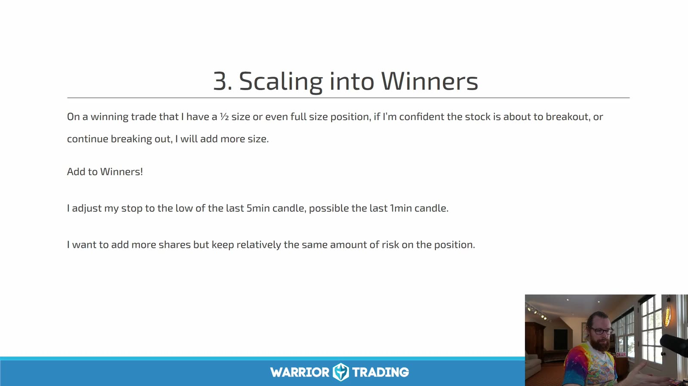
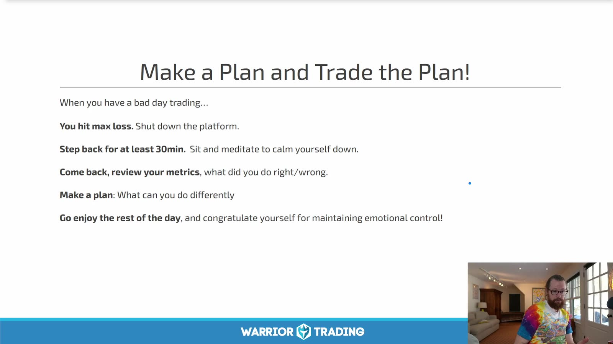
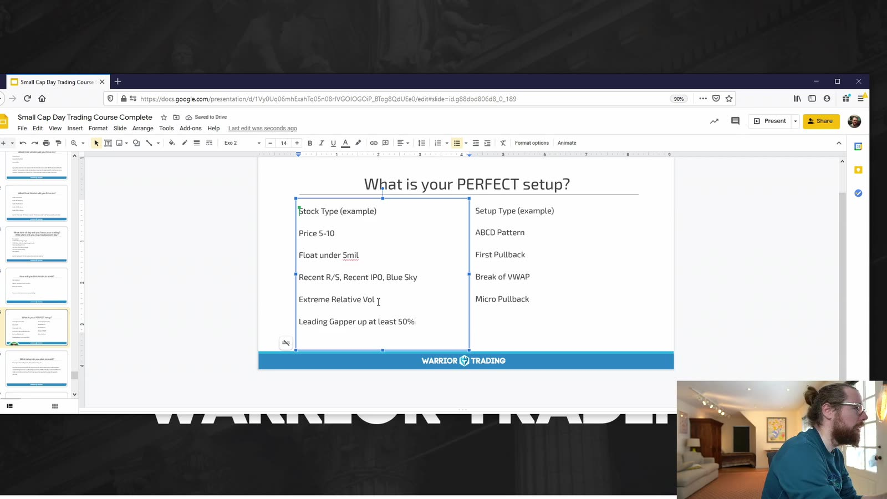
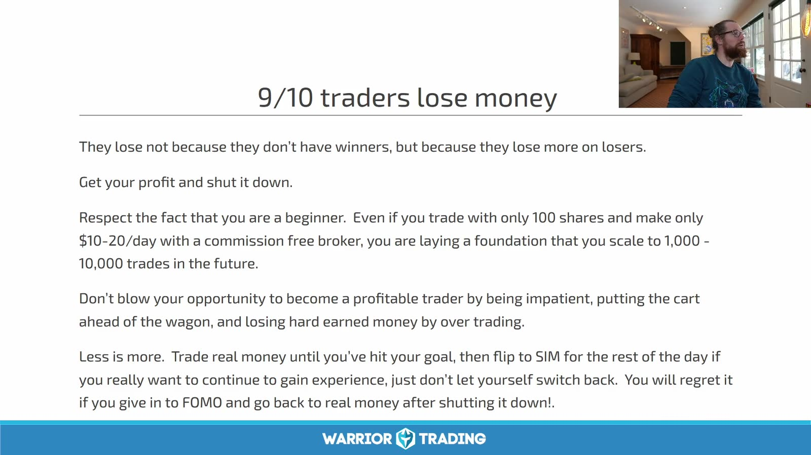
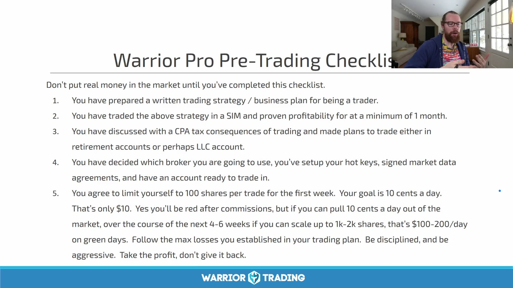
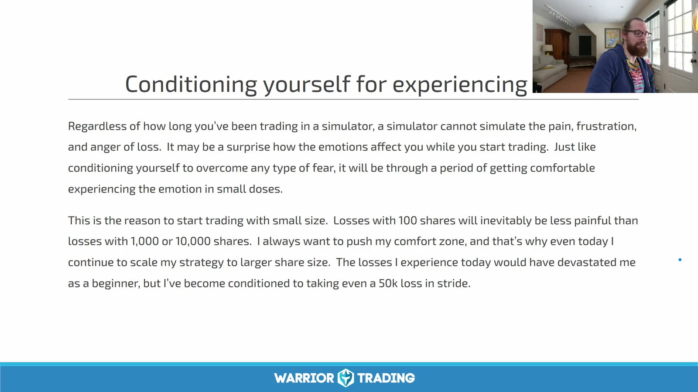
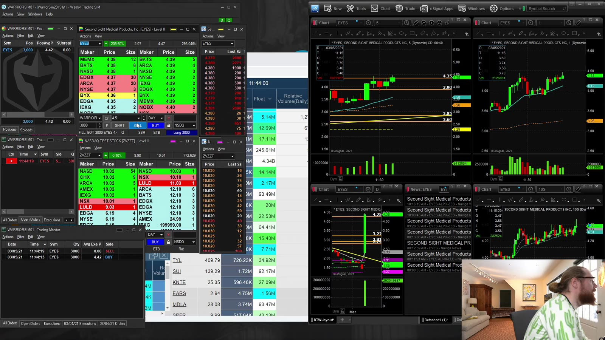
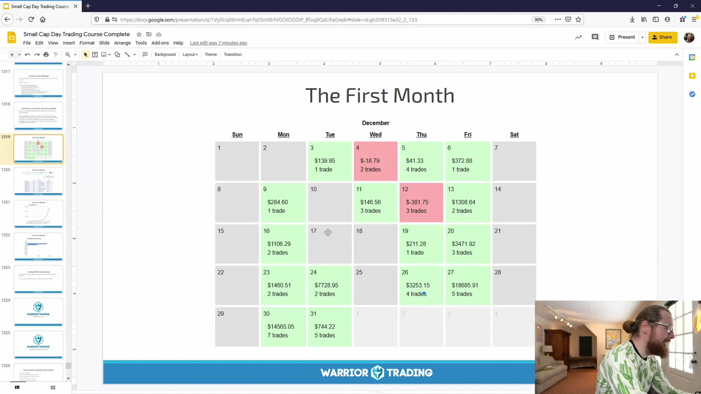

# Small Cap 12：Discipline, Trading Plan and Going Live

> 对应视频：Chapter 13–16
> 本节重点：仓位管理、心理纪律、交易计划和从模拟盘转入实盘必须连成一个控制系统；任何收益目标都不能覆盖最大损失规则。

## 1. Position management：只在风险不增加时加仓



**图怎么看：**

- 课程建议在已有盈利、突破概率较高时加仓，并把 stop 调到最近 1m/5m low。
- “加到 winner”不代表总风险自动不变；加仓价更高、股数更多，flush 时可能穿过新 stop。
- 每次加仓前重新计算从当前总仓位到新失效点的美元风险。
- 若需要把 stop 抬到正常噪声区才能让数字好看，说明加仓规模过大。

一个更严格的计算：

```text
open risk = Σ shares_lot × (avg_price_lot - stop)
new total risk <= per-trade risk cap
```

还要给 slippage 和 halt gap 留余量。

## 2. 坏交易后的停手机制



**图怎么看：**

- 课程建议达到 max loss 后关平台、离开至少 30 分钟、冷静后复盘。
- 最关键的是第一步必须自动化或预先承诺；亏损当下再决定是否停止通常太晚。
- “赚回来”不是有效 setup，会把一次计划内亏损变成 revenge trading。
- 当日停止不应被视为失败，而是风险系统按设计工作。

可设置三级阈值：

- `warning`：连续 2 笔规则内亏损，仓位减半；
- `stop`：达到 daily max loss，取消订单并停止新仓；
- `lockout`：出现规则外加仓、账户/方向错误或情绪失控，至少停止到下一交易日。

## 3. 心理问题先翻译成可观察行为

不要只写“今天没纪律”，要写：

- 是否在 trigger 前入场；
- 是否扩大 stop；
- 是否给 loser 加仓；
- 是否超过 daily loss；
- 是否因错过交易而追价；
- 是否在没有 locate/plan 时下 short；
- 是否改用更大股数“回本”；
- 是否隐藏或删除亏损交易。

行为可以统计和修正，抽象自责不能。

## 4. 交易计划从“完美 setup”开始



**图怎么看：**

- Slide 把不同 long/short setup 和技术位列在一起，目的是让交易者选择自己的优势场景。
- “Perfect” 不代表必赢，而是所有预定义条件同时满足。
- 初期只保留 1–2 个 setup，避免每种价格变化都能被某个名字合理化。
- 对每个 setup 同时写明确的 no-trade 条件。

交易计划至少包括：

| 类别 | 内容 |
|---|---|
| Market | 交易时段、允许的市场环境 |
| Instrument | 价格、float、volume、spread 范围 |
| Setup | 触发、失效、第一目标 |
| Risk | 单笔、单日、单周上限 |
| Size | 按 stop distance 计算，不固定股数 |
| Execution | 订单类型、hotkey、是否允许盘前/盘后 |
| Stop rules | 连亏、操作错误、情绪异常 |
| Review | 每日截图、每周统计、规则版本 |

## 5. “多数交易者亏钱”不是精确统计结论



**图怎么看：**

- Slide 的有用部分是：小赢大亏、过度交易和不停止会破坏期望值。
- “9/10 traders lose money” 在这里是教学口号，视频没有给出可核查样本定义与数据源。
- 佣金规模、账户类型、产品和观察期限不同，会得到完全不同的比例。
- 应关注自己扣除费用后的 expectancy，而不是用未经证实的总体比例制造恐惧或信心。

```text
expectancy
= win_rate × avg_win
- loss_rate × avg_loss
- average_costs
```

## 6. 从 simulator 到 live 的最低门槛



**图怎么看：**

- Slide 要求完成课程、有书面计划、模拟盘表现、了解税务、选择 broker 并从小股数开始。
- “模拟盘盈利一个月”只是课程建议，不能自动证明样本足够或策略稳健。
- 转 live 前还需验证 simulator 是否真实模拟 spread、slippage、partial fill 和 market data 延迟。
- 课程中的每日金额目标不应复制；初期目标应是按规则执行和限制损失。

建议最低证据：

- 同一规则版本至少 40–60 个交易日；
- 每个主 setup 至少 100 笔可审计样本；
- 扣除估计费用和滑点后 expectancy 为正；
- 最大回撤在预定上限内；
- 最近 20 个交易日无重大规则外交易；
- 能完整解释最差 10 笔和所有 hotkey 错误；
- live size 从能承受全部损失的最小单位开始。

## 7. 小仓位的目的：适应情绪，不是快速赚钱



**图怎么看：**

- 课程建议先用很小股数，让真实亏损的情绪成本可承受。
- 从 100 股亏 10 美元推到 1000 股亏 100 美元是线性算术，但市场冲击、滑点和心理反应不一定线性。
- “对 50 美元亏损无感”不是增仓充分条件；仍需满足样本、回撤和执行门槛。
- 每次只改变一个变量，例如 size，从而判断表现变化来自哪里。

推荐放大规则：

```text
same rules + sufficient sample + no new max drawdown
→ increase size by 10–25%
→ freeze for another review window
```

一旦规则执行率下降或回撤创新高，退回前一级。

## 8. Small-account challenge 不能作为收益基准



**图怎么看：**

- 界面展示 active trading 环境，但账户小不等于风险小；集中仓位和高换手反而可能更脆弱。
- 课程作者明确说挑战结果不典型，且是在已有多年经验后完成。
- 小账户还更容易受佣金、数据费、borrow fee、settlement 和 margin 规则影响。
- 选择 broker 时比较监管、资金安全、费用和执行，不以绕过某个限制为唯一目标。



**图怎么看：**

- 日历中多数绿色天会强化“每天都应盈利”的错觉；真实分布可能包含少量巨大亏损日。
- 每日 P&L 不能告诉我们用了多大风险、是否违反规则或结果是否可复现。
- 课程作者的账户曲线不能转化成自己的日收益目标。
- 更有用的日历应同时标记 risk、setup count、rule violations 和 market regime。

## 9. 关于账户规则的时效修正

课程中的美国 PDT、结算周期和券商限制属于录制期信息，不能当作当前固定规则：

- 美国证券标准结算已由 T+2 改为 T+1，可参考 [SEC T+1 说明](https://www.sec.gov/newsroom/press-releases/2024-62)。
- FINRA 已批准新的日内保证金框架，生效和券商迁移存在过渡期；以 [FINRA 当前说明](https://syndication.finra.org/content/understanding-new-intraday-margin-requirements) 及自己的 broker 通知为准。
- 现金账户、保证金账户、期权和不同司法辖区规则不同，不能用视频中的单一数字替代确认。

## 10. 一份可以直接填写的 go-live gate

```text
Strategy version:
Sample dates:
Trades / trading days:
Net expectancy after costs:
Max drawdown:
Rule adherence:
Simulator realism checked:
Starting live size:
Per-trade max loss:
Daily stop:
Automatic lockout:
Conditions to scale:
Conditions to return to sim:
```

只有这些答案都有证据时才进入 live。进入 live 后，首要验收项是“执行是否与模拟盘一致”，不是第一个月赚多少钱。
