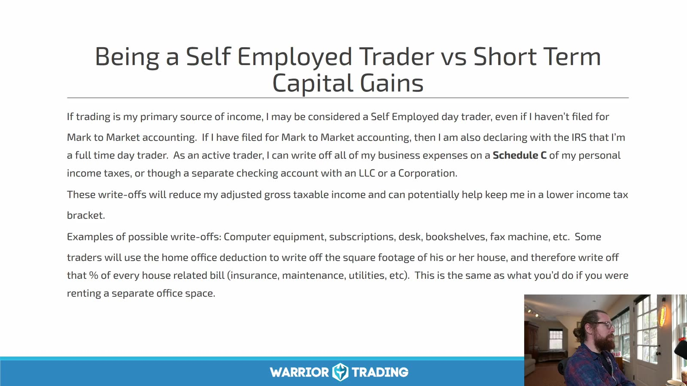
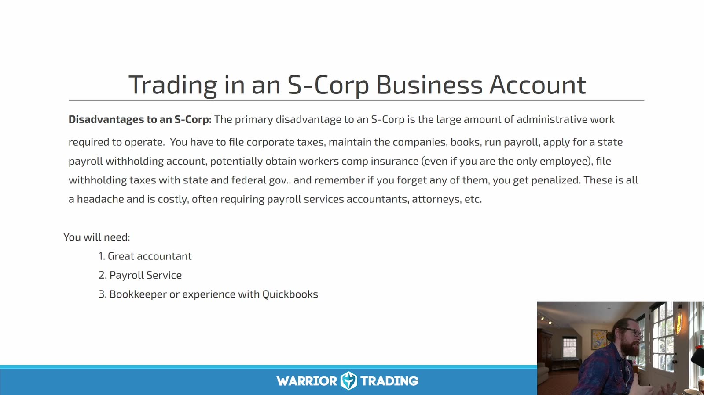
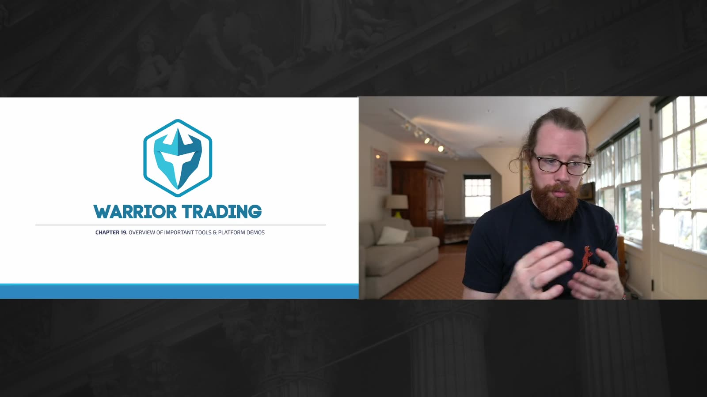
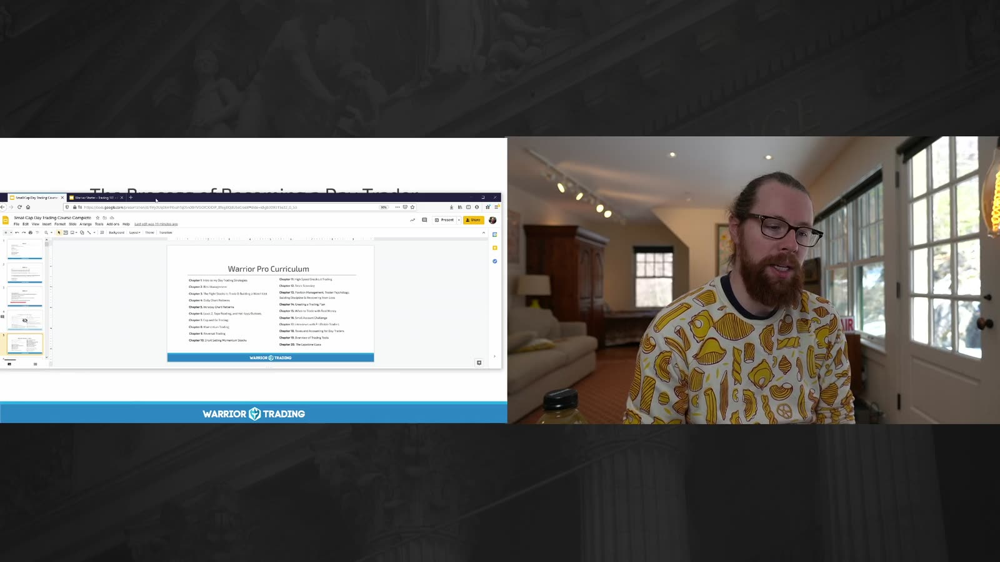
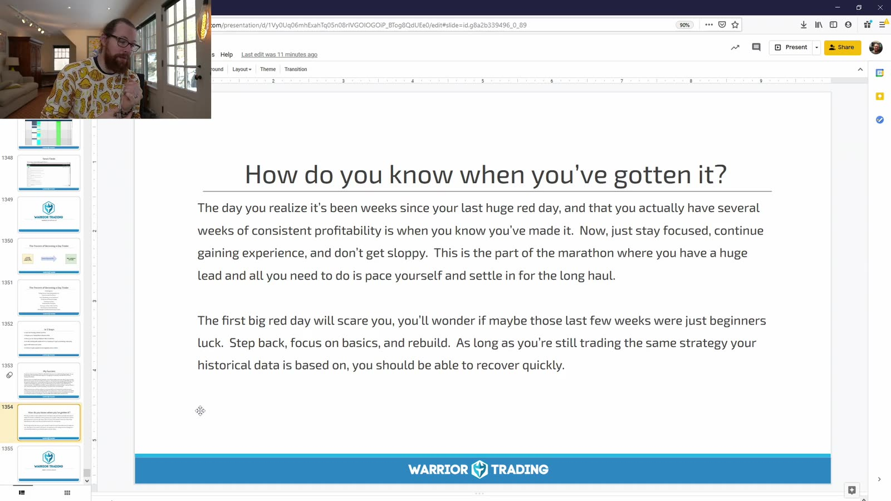

# Small Cap 13：Tax, Tools and Capstone

> 对应视频：Chapter 18–20
> 本节重点：税务与账户结构需要专业确认；平台只是实现规则的工具；课程结束的标准不是“看完”，而是能用自己的数据证明、执行和修订一套有限策略。

## 1. Trader tax status、capital gain 与普通收入不是一回事



**图怎么看：**

- Slide 讨论美国 trader tax status、Mark-to-Market、Schedule C 和可能的业务费用。
- 这些术语对应不同的资格、选择时点和申报处理，不能因为全职交易就自动获得。
- 家庭办公室、设备、订阅等是否可扣除取决于实际事实与税法，课程举例不是个税意见。
- LLC、S-Corp、trader tax status 与 Section 475(f) election 是不同概念，不要混为一种“省税账户”。

美国 IRS 对 trader 与 investor 的基础区分可先读 [IRS Topic No. 429](https://www.irs.gov/taxtopics/tc429)。实际选择应由了解证券交易税务的 CPA/EA/律师根据个人情况确认。

## 2. S-Corp 不是收入一高就自动更优



**图怎么看：**

- Slide 同时列出工资、payroll、保险、税表、州费用和专业服务等行政成本。
- 比较结构时要把维护成本、合规风险、州税和可用收益类别一起计算。
- 交易利润的性质不会仅因把 broker account 放入公司就自动改变。
- 录制期数字和规则会过时；不能依赖旧视频确定当前申报。

税务资料应保存：

- broker 1099 与月结单；
- 逐笔成交、wash sale 调整和 corporate actions；
- 软件、数据、设备和教育费用凭证；
- entity/payroll 文件；
- election 提交与回执；
- 与专业顾问的书面结论。

## 3. 平台演示应转换成自己的配置规范


**图怎么看：**

- 课程在这里转向平台演示；按钮位置和软件外观是录制期快照。
- 可迁移的是窗口职责：scanner、chart、Level 2、Time & Sales、order entry、positions 与 risk。
- 不应照抄作者 workspace 后直接实盘；先验证数据源、时区、盘前盘后和路由。
- 软件升级或 broker 不同都可能改变 order semantics。



**图怎么看：**

- 讲者画面没有提供可复用的具体交易信号，重点是后续配置流程。
- 平台熟练不等于策略熟练；能快速下单也可能只是快速执行错误。
- 每个窗口必须回答一个明确问题，不能为了“像专业交易台”无限增加屏幕。
- 最先配置的应是 max-share、max-loss、cancel-all 和账户识别，而不是更激进的 hotkey。

## 4. 平台验收清单

上线前逐项截图并测试：

```text
correct live/sim account
correct market-data entitlement and timestamps
pre/post-market enabled as intended
default order type and TIF
share-size calculation
marketable-limit offsets
stop behavior and trigger source
SSR behavior
cancel-all / flatten
duplicate-order prevention
disconnect and reconnect behavior
broker emergency phone/process
```

所有测试先在 simulator，随后只用最小 live size 验证成交语义。

## 5. Capstone 的目标是证明可独立决策



**图怎么看：**

- 课程用 capstone 汇总此前的选股、setup、执行、风险和心理内容。
- 总结页本身不产生能力；需要把每个概念变成自己的规则和样本。
- 若仍需依赖讲者告诉你下一笔买什么，说明尚未完成独立决策闭环。
- 最终产物应短到开盘前能读完，详细证据留在 playbook 与日志。



**图怎么看：**

- Slide 把数周稳定表现描述为掌握迹象，同时提醒失去专注后红日仍会出现。
- 数周可能不足以覆盖不同市场 regime；必须同时看交易数量与样本多样性。
- “感觉掌握”不能替代扣除费用后的统计、最大回撤和规则遵守率。
- 出现大亏时先判断规则失效还是执行违纪，再决定改策略或改行为。

## 6. 一份合格的 capstone 输出

只保留这些核心文件即可：

1. **One-page trading plan**：允许交易的市场、时段、setup、单笔/单日风险。
2. **Setup playbook**：每个 setup 的成功和失败图、trigger、stop、目标。
3. **Execution spec**：平台、hotkey、订单类型、异常处理。
4. **Trade log**：完整成交、截图、MFE/MAE、费用、是否守规。
5. **Weekly review**：按规则版本和 market regime 汇总。
6. **Change log**：每次只改一个规则，并写生效日期。

## 7. 结课后的 30 天验证

- 前 5 天：只重放历史或 simulator，修正平台错误；
- 第 6–15 天：只交易一个 setup，收集连续样本；
- 第 16–20 天：审计所有跳过和违规，不加新 setup；
- 第 21–25 天：在相同规则下验证另一个市场阶段；
- 第 26–30 天：决定继续模拟、最小 live，或退回修改。

“完成课程”只表示输入结束；“能交易”要由未来、未见数据上的一致执行证明。
