# Small Cap 14：Momentum Stock Archetypes

> 对应视频：Chapter 8 Stock Type 1–8
> 本节重点：同一个 bull flag 出现在 news stock、reverse split、recent IPO 或 SPAC 上，背后的供给、信息与风险不同。先识别股票类型，再选择 setup。

## 1. News 与 IPO stocks

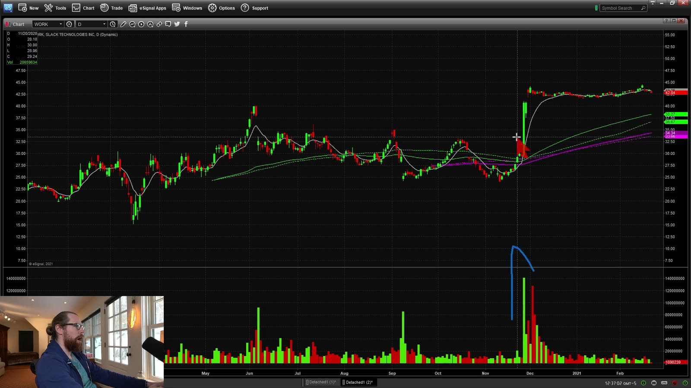

**图怎么看：**

- 主图在新闻/事件后出现突然放量和价格重估，之前的低波动区不再代表当前状态。
- 先确认新闻来源、发布时间和是否真正涉及该公司，避免交易旧闻或同名误读。
- 新闻带来的第一跳可能已经消耗大部分空间；等待结构不等于错过。
- 同时检查最近 8-K、发行文件、warrant、ATM 或其他潜在稀释。

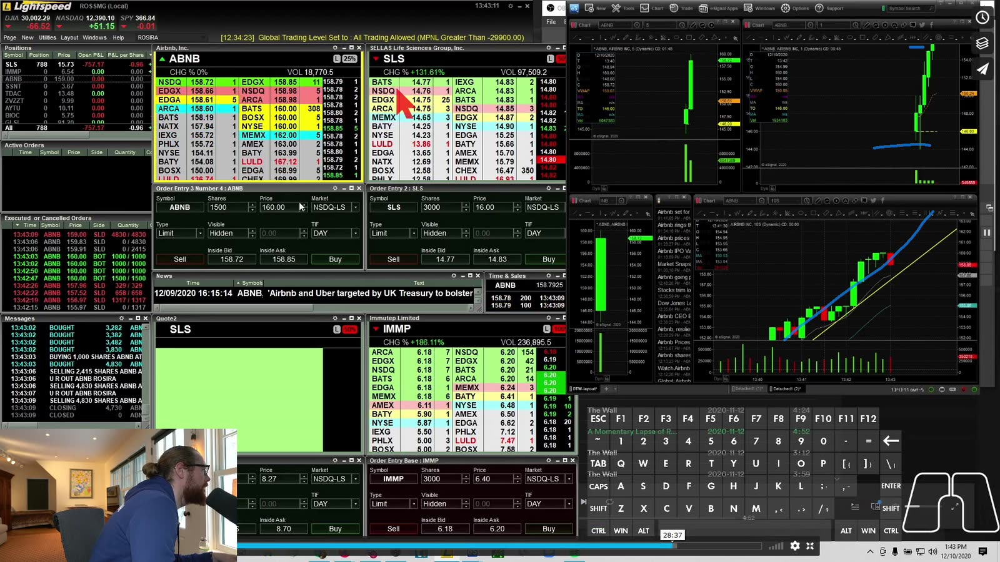

**图怎么看：**

- 右侧走势几乎垂直，Level 2 depth 相比波动很薄，说明 nominal position 可能难以退出。
- 新闻标的容易进入 LULD halt；stop order 不能覆盖停牌跳空。
- 不把 headline 情绪当作估值分析；短线计划只回答 trigger、risk 与流动性。
- 公司文件可从 [SEC EDGAR](https://www.sec.gov/search-filings) 核验。

## 2. Reverse Split stocks

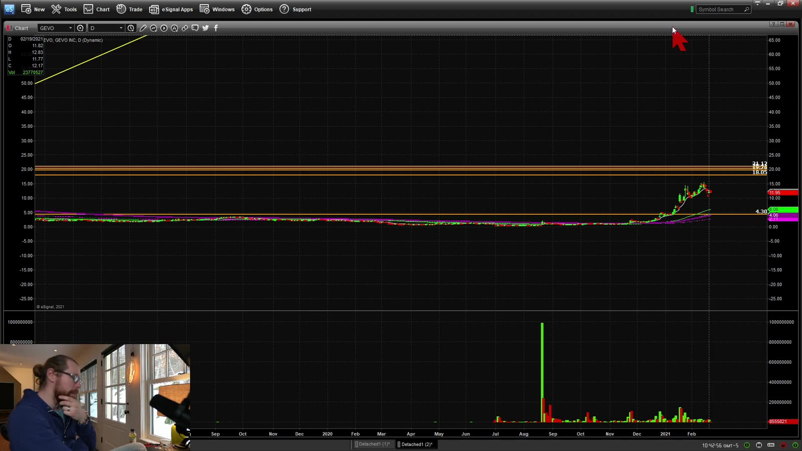

**图怎么看：**

- Reverse split 会按比例减少股数并提高每股名义价格，图表历史价格通常被平台回溯调整。
- 调整后的过去高点不等于当时真实成交的相同名义价格。
- Reverse split 本身不创造企业价值，常与维持上市要求或资本结构问题相关。
- Float 变小可能放大波动，但也放大 spread、halt 和操纵风险。

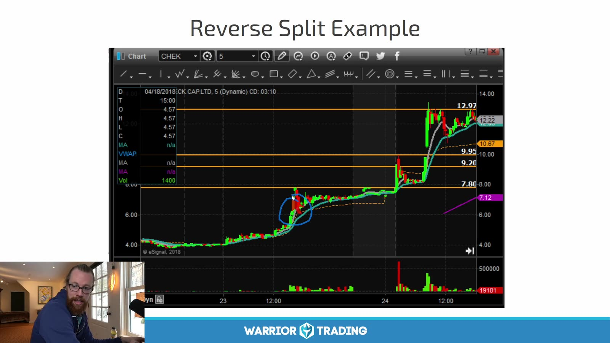

**图怎么看：**

- 蓝圈附近出现 breakout，随后多次上行；成功案例不能代表 reverse split 有正面 edge。
- 核对 effective date、split ratio、CUSIP/symbol 变化以及 broker 是否正确更新仓位。
- Screener 的 float 和历史 volume 可能暂时未调整，需交叉检查 filings 与交易所信息。
- 近期 reverse split 与融资计划同时存在时，把稀释风险单独列为 no-trade 条件。

## 3. Recent IPO breakout

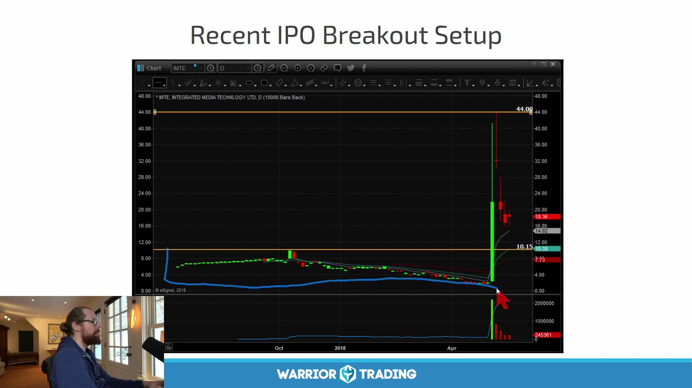

**图怎么看：**

- IPO 后历史短、上方已成交套牢盘少，突破发行后高点可能进入 price discovery。
- “没有历史阻力”不等于没有卖方；早期投资者、承销稳定机制和 lock-up 都会影响供给。
- 日线样本不足时，不要强行套用长期均线。
- 突破前先查看发行价、首日高低、lock-up、float 与后续 filing。

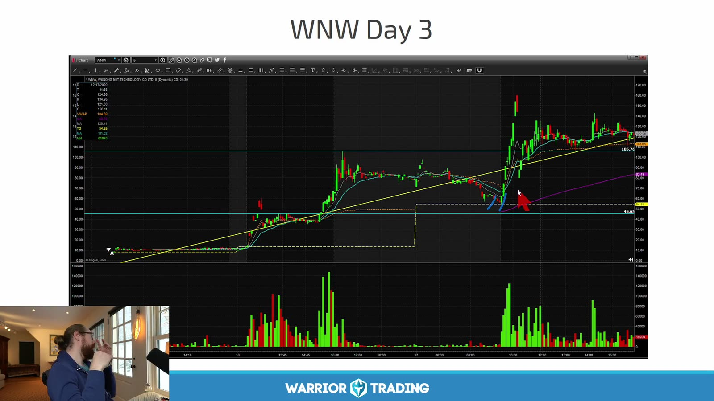

**图怎么看：**

- 上市初期价格沿短均线上行，并出现多次放量扩张与回撤。
- 第三天走势极端不代表“IPO 第三天”是可复制信号；需要完整 IPO 样本。
- 数据历史短、halt 频繁且估值不确定时，仓位应小于普通 momentum setup。
- 把 IPO age 作为分类字段，例如 1–5、6–20、21–60 个交易日。

## 4. Blue-sky breakout

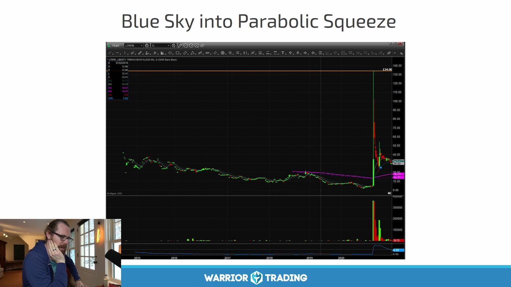

**图怎么看：**

- 价格突破图中所有可见高点，进入无历史 overhead resistance 的区域。
- Blue sky 描述 chart 状态，不保证持续上涨；整数位、发行计划和新卖方仍会出现。
- Breakout candle 很大时，最近结构 low 可能太远，应等待新 base 而非直接追。
- 将 all-time high 与 platform 数据范围内的 high 区分，避免历史不完整。

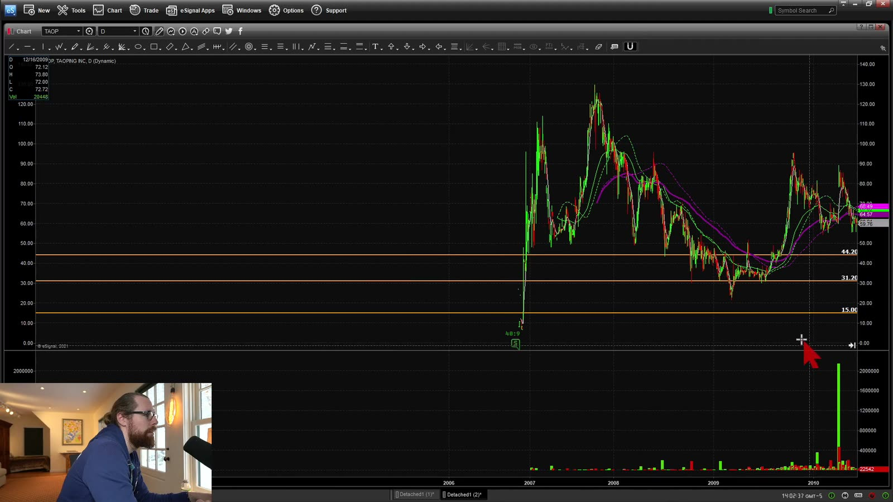

**图怎么看：**

- 图中突破后快速冲高，随后深度回落并长时间震荡。
- 这说明上方无旧阻力不等于没有 price rejection。
- 若 entry 接近峰值，stop 可能跨越多个 halt band；预设百分比止损也未必成交。
- 复盘同时记录 breakout 后 1m、5m、30m 的回报分布。

## 5. SPAC

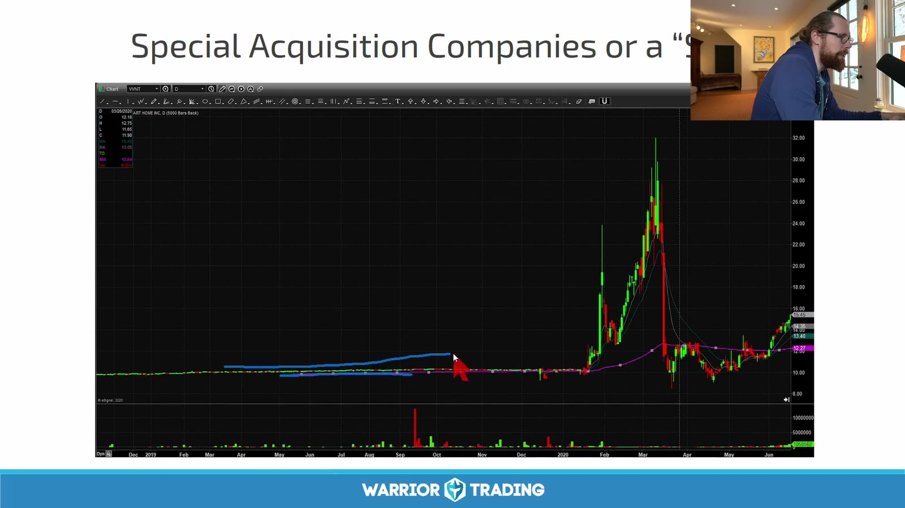

**图怎么看：**

- 图中价格在事件期急涨后迅速回吐，典型地反映结构和消息驱动波动。
- SPAC 阶段包括空白支票公司、寻找目标、宣布交易、股东投票、赎回和 de-SPAC，风险并不相同。
- 流通量会因赎回、warrant 与 PIPE 等变化，旧的 float 数字可能失真。
- 先确认当前法律实体、symbol、交易阶段和文件，而不是只看 “SPAC” 标签。

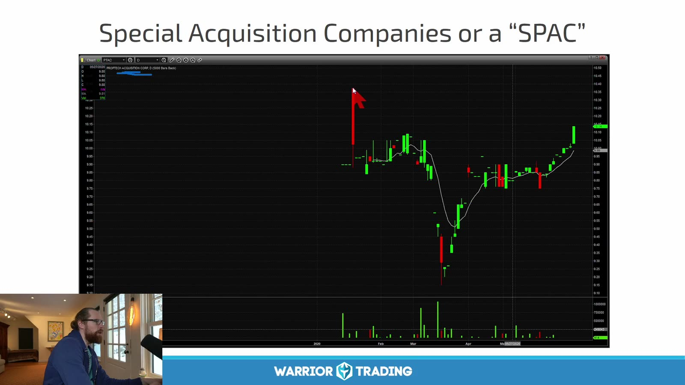

**图怎么看：**

- 价格出现巨大 gap，随后在新区域震荡，历史 chart 的连续性已被事件打断。
- 新闻 headline、SEC filing 与交易状态需要交叉确认。
- Warrant 与 common share 是不同证券，symbol 相近但价格和赎回条款不同。
- 极端赎回后低 float 可造成 squeeze，也会让退出流动性突然消失。

## 6. Gap-down momentum

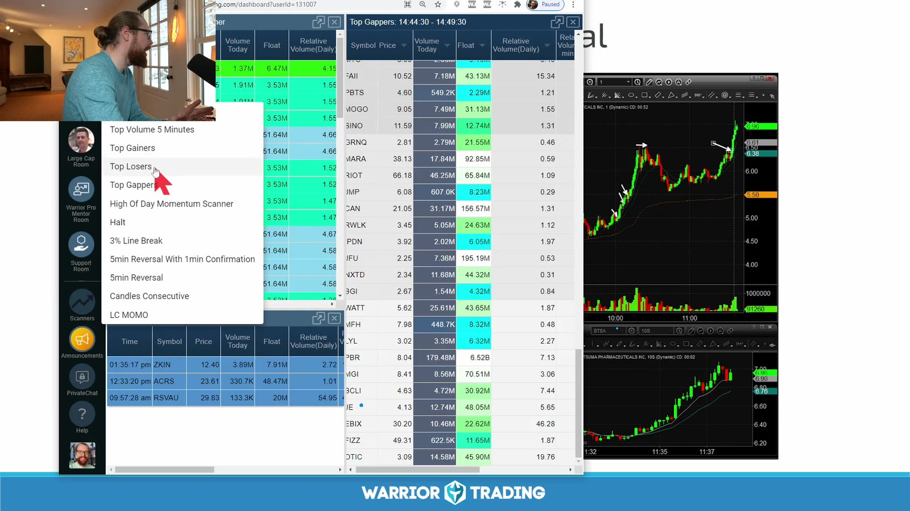

**图怎么看：**

- 左侧既有 top gainer 也有 gap/volume scanner，右图展示低开后的反弹。
- Gap down 可能来自坏消息、发行、财报或无明显事件；原因会影响反弹质量。
- 下跌很多不等于“便宜”；long setup 需要 reclaim、higher low 或 red-to-green 等确认。
- 先标昨收、盘前 low/high、VWAP 和日线支撑。

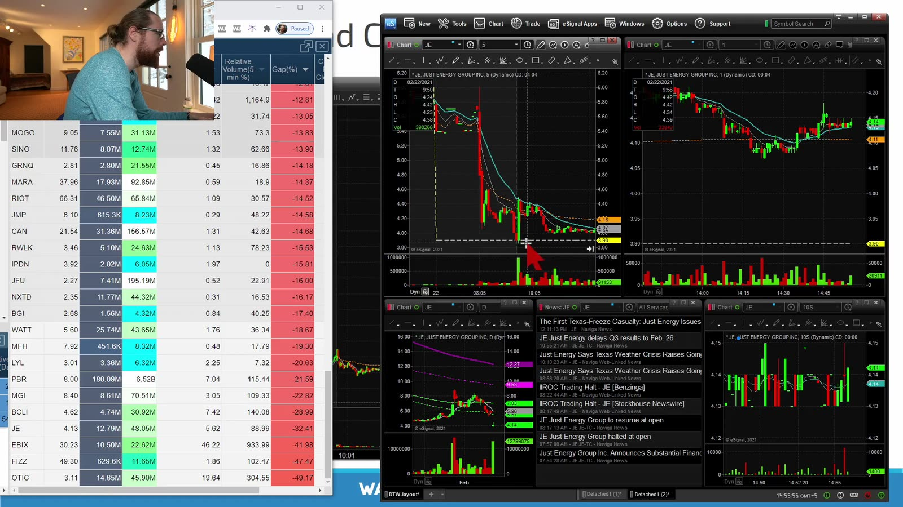

**图怎么看：**

- 箭头附近反弹失败，右侧小图继续走弱，说明 blind dip buy 的风险。
- 同一 scanner 会同时找到反弹和 continuation，方向必须由结构决定。
- 坏消息下的 halt 可能不是普通 LULD，恢复时间和信息风险不同。
- 不因价格低就增加股数；按 stop distance 和实际 depth 定 size。

## 7. Multi-day continuation

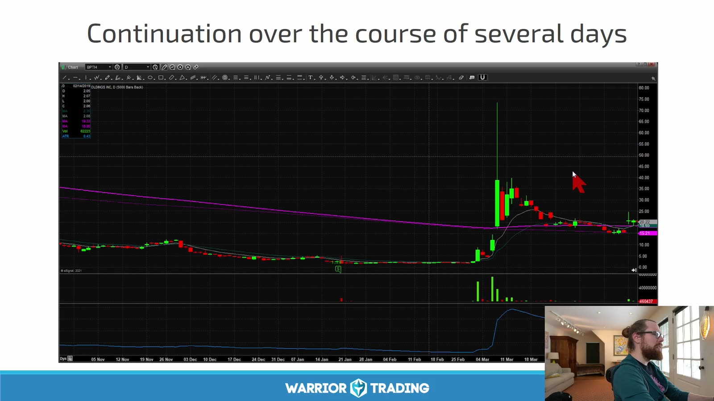

**图怎么看：**

- 首日急涨后，后续交易日仍保留成交量和注意力，形成 secondary move。
- 每个交易日都要重新标 pre-market 和 daily levels，不能沿用首日 entry 逻辑。
- 隔夜持仓增加 gap、发行和新闻风险；day trade 计划不能偷偷变成 swing。
- 把 day 1、day 2、day 3+ 分开统计。

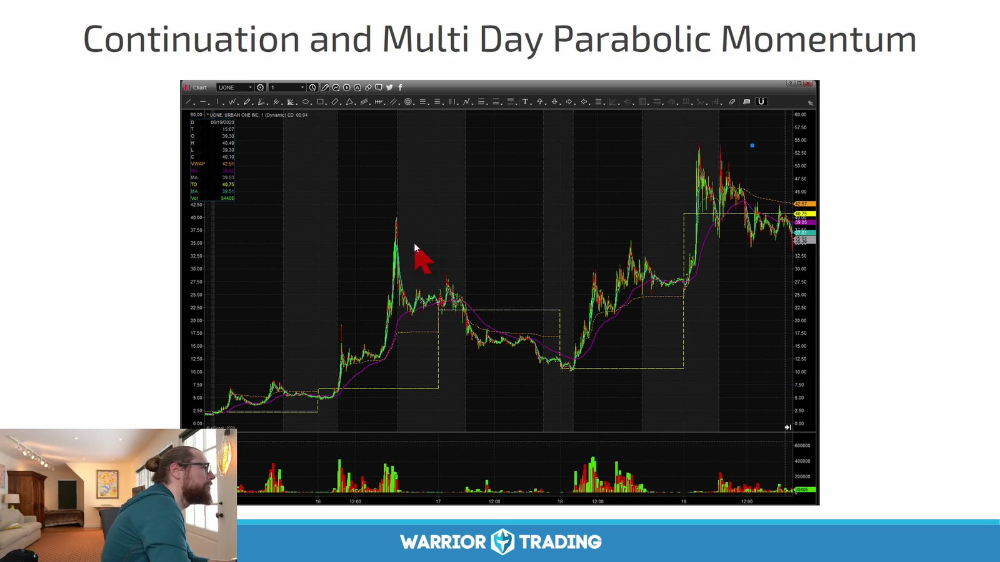

**图怎么看：**

- 图中多次 impulse、回撤和再次加速构成 multi-day sequence。
- 后一天价格更高不说明风险更小；离原始 base 越远，失败时回撤可能越深。
- 短均线在极端趋势中滞后，不能单凭仍在均线上方继续持有。
- 记录 overnight gap 对总收益的贡献，区分日内 edge 与隔夜暴露。

## 8. Parabolic momentum

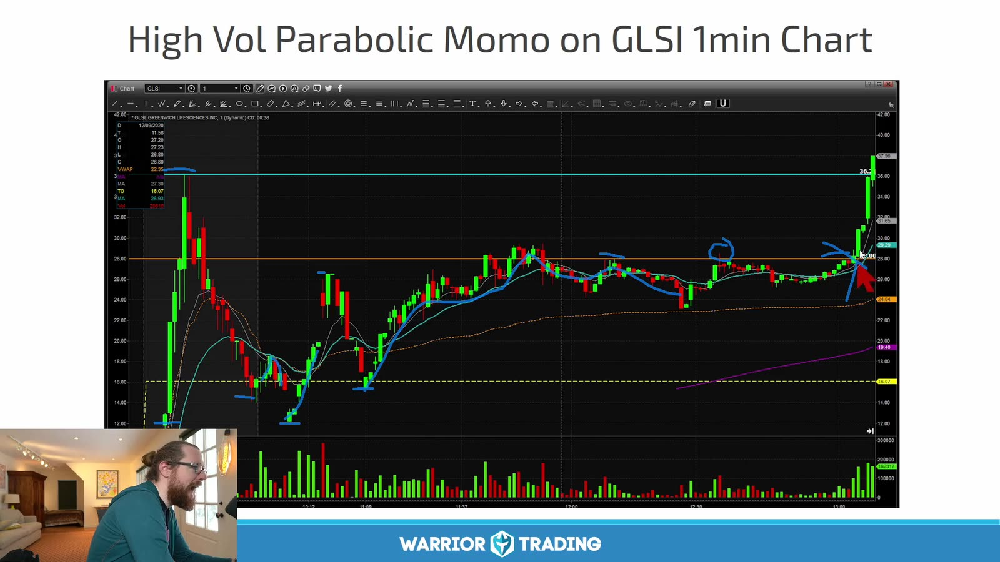

**图怎么看：**

- 左侧已经出现一次大涨大跌，右侧又重新扩张；波动呈簇集而非稳定状态。
- 蓝圈附近的小整理在普通行情可交易，在这里可能一根 K 就跨过 stop。
- 仓位应以波动调整，不能沿用低波动标的的固定股数。
- Parabolic move 的最终 reversal 通常猛烈，但提前猜顶仍可能遭遇多次 squeeze。

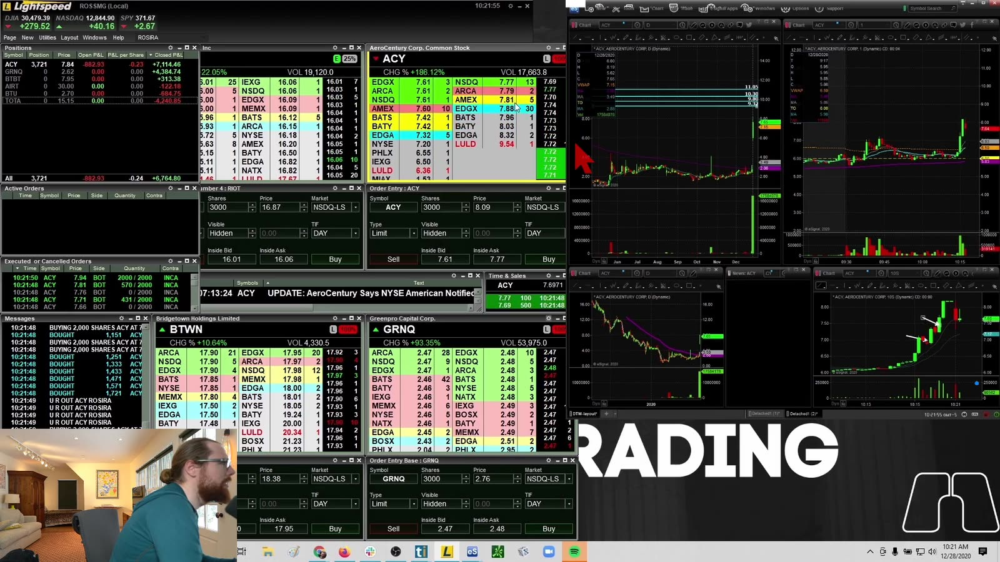

**图怎么看：**

- 多窗口显示价格、Level 2、Time & Sales 和不同周期；任何单一窗口都不能给出完整风险。
- 接近 LULD 时，可见盘口可能在停牌后完全重建。
- 盈利截图常隐藏未成交订单与 slippage，必须用 broker execution report 复盘。
- 如果 planned loss 无法覆盖一次 resume gap，这个仓位就过大。

## 9. Archetype 不是 setup

正确组合是：

```text
stock archetype
+ catalyst / filings
+ market regime
+ technical setup
+ execution quality
= one trade hypothesis
```

例如 “recent IPO + first five-minute pullback” 是可定义的样本；“IPO 会涨”不是。

## 10. 每类股票的附加字段

| 类型 | 额外核验 |
|---|---|
| News | 原始来源、发布时间、是否旧闻 |
| Reverse split | 比例、生效日、调整后的 float、融资 |
| Recent IPO | IPO age、发行价、lock-up、首日 high |
| Blue sky | 真正 all-time high、上次融资文件 |
| SPAC | 当前阶段、赎回、warrant、PIPE |
| Gap down | 下跌原因、news halt、reclaim level |
| Multi-day | day number、隔夜 gap、持续 RVOL |
| Parabolic | halt count、band proximity、volatility-adjusted size |

只有把这些额外风险纳入日志，形态统计才不会把本质不同的交易混在一起。
