# Small Cap 15：Reversal Setups

> 对应视频：Chapter 9 Intro 与 Setup 1–5
> 本节重点：Reversal trade 不是“已经涨/跌很多所以该反转”。极端是筛选条件，真正触发必须来自动能衰减、结构改变和可定义的失效点。

## 1. Continuation 与 reversal 必须分开统计

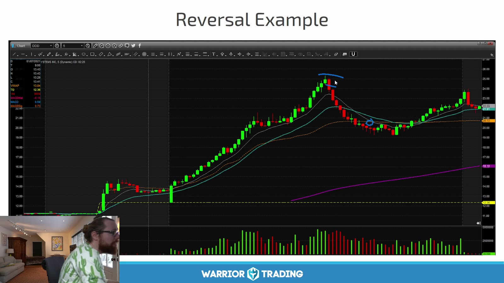

**图怎么看：**

- 图中第一段抛物线上涨后大幅回撤，随后又逐渐恢复；不同位置可被 long、short 或 reversal trader 以不同方式解读。
- 顶部 reversal、下跌 continuation 和底部 reversal 是三个不同 hypothesis。
- 一次回撤不能证明长期趋势结束；右侧重新上涨正说明“反转”也有时间尺度。
- 先写交易周期、方向和失效点，避免同一仓位不断改故事。

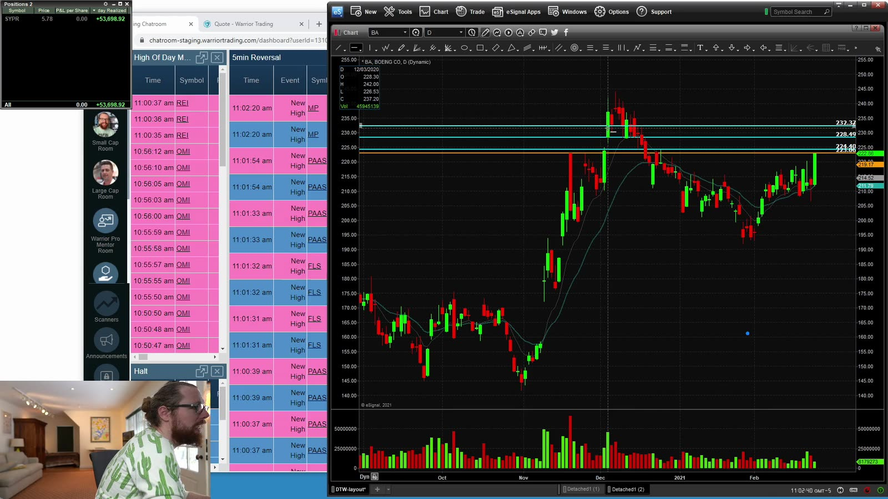

**图怎么看：**

- 左侧 scanner 通过 extreme move 寻找候选，右侧 chart 才用于确认。
- Scanner 触发说明价格已进入预设极端区，不代表此刻必须逆势进场。
- 极端走势可持续得比账户承受时间更久，anticipation 的仓位必须非常小或直接禁做。
- 扫描结果要保存全部样本，包括继续加速、没有反转的股票。

## 2. Setup 1：5+ consecutive 5-minute candles

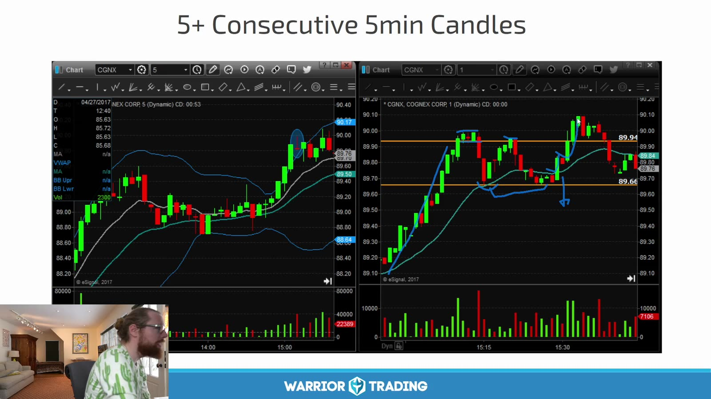

**图怎么看：**

- 两个图都先有多根同方向 5m K，之后出现反向 K；这是 exhaustion 候选。
- 连续 K 的数量是筛选规则，不是 trigger；第五根仍可能只是趋势中段。
- 更严格的 entry 是出现 reversal candle 后破其 low/high，或形成 lower high / higher low。
- Stop 参考极端点，距离大时必须减小 size。

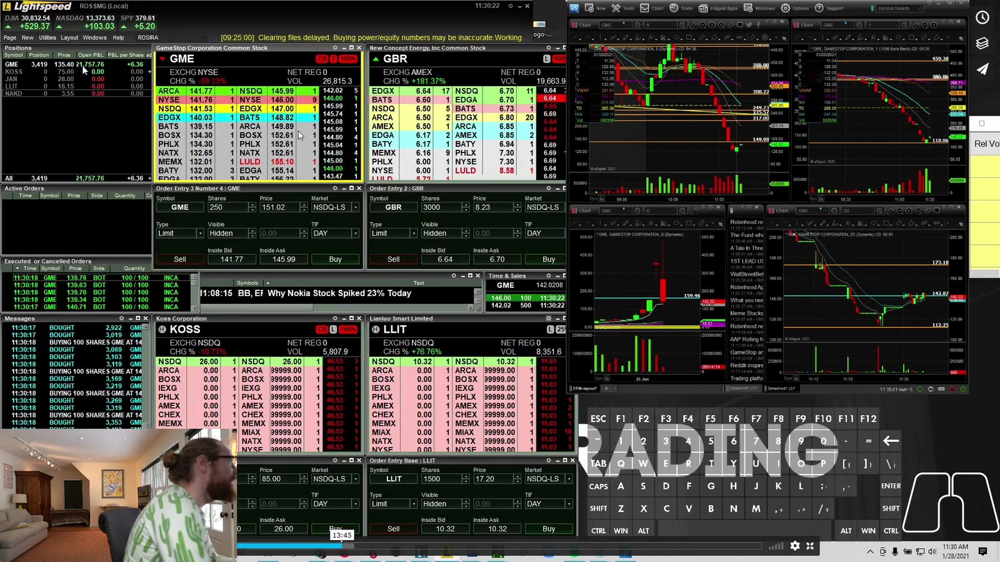

**图怎么看：**

- 右侧可看到不同标的的快速下跌与反弹，左侧盘口变化很快。
- Reversal entry 经常逆着仍在加速的 tape，limit fill 与止损滑点都不可忽略。
- 一根反向 K 可能只是 pause；后续能否破坏趋势结构才更重要。
- 不把“买到底/空到顶”的事后精确性当作可重复目标。

## 3. Setup 2：10+ consecutive 1-minute candles

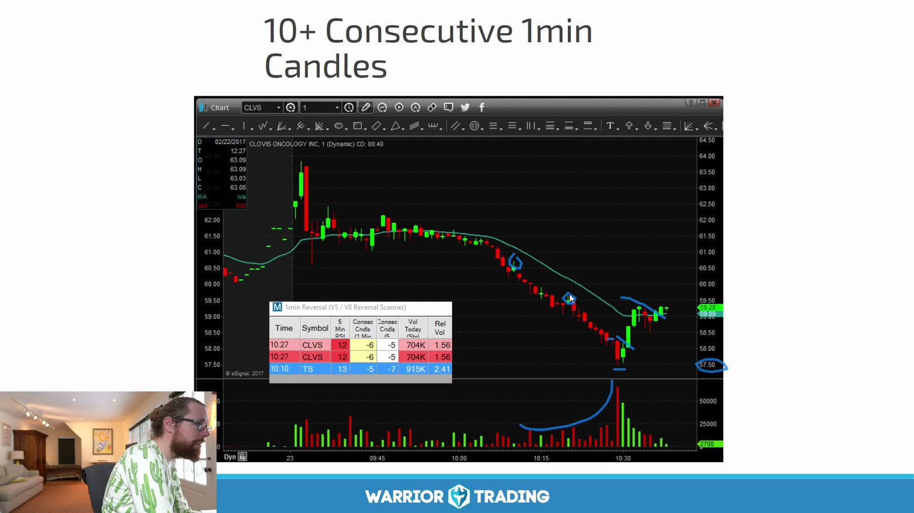

**图怎么看：**

- 蓝点标出长串同方向 1m candles，走势已显著偏离短期均衡。
- 一分钟 K 对偶然的小反向 tick 很敏感；“连续”需要固定是否允许 doji、equal close。
- 下跌过程中 spread 常扩大，图上的 candle low 不一定是现实可买到的价格。
- 若在 LULD lower band 附近，可能先停牌而非平滑反弹。

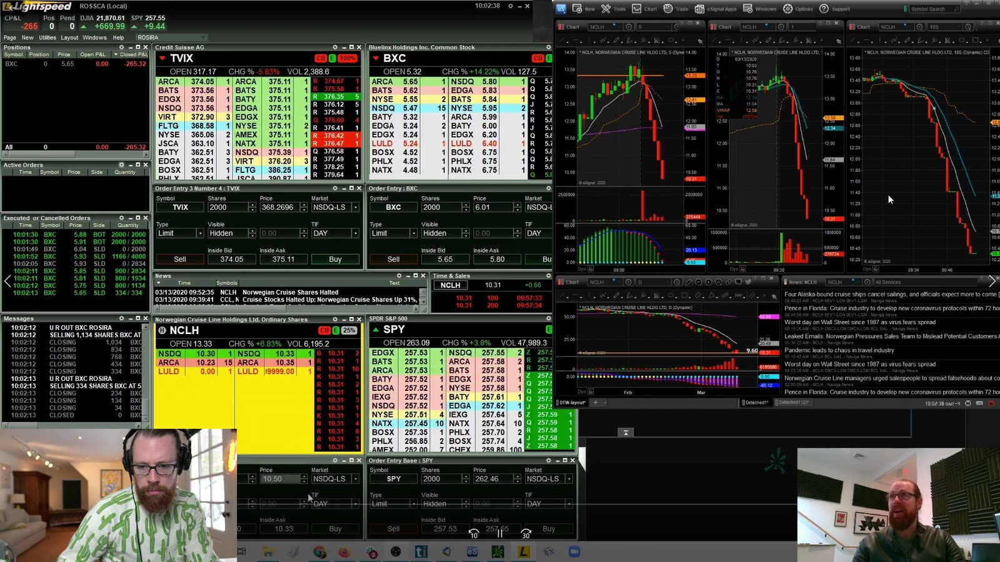

**图怎么看：**

- 多个图都出现近乎垂直下跌，说明当时可能是共同的高波动 regime。
- 一个 regime 内的多个样本并非完全独立，不能高估统计显著性。
- Long reversal 前先看是否有 news halt、offering 或基本面事件；坏消息下“超跌”可继续超跌。
- 测试时将连续 K 数量、总幅度、volume climax 和距离 VWAP 分开记录。

## 4. Setup 3：Outside Bollinger Band

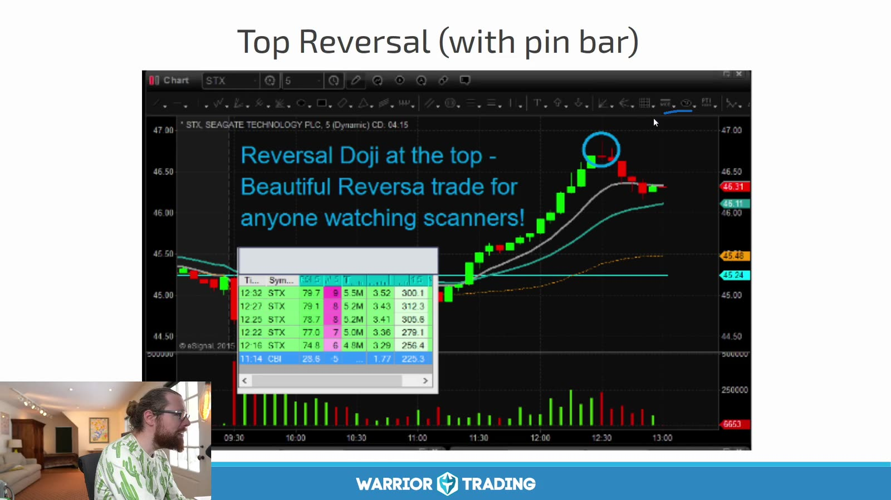

**图怎么看：**

- 价格连续上涨到 Bollinger upper band 外，顶部出现带长影线的小实体 K。
- Bollinger Band 来自移动均值和历史波动；价格到 band 外不是概率保证。
- Pin bar 表明该时间窗内高位被拒绝，但还需跌破 candle low 或形成 lower high。
- 强趋势中价格可以长时间 “walk the band”，提前做空会连续止损。

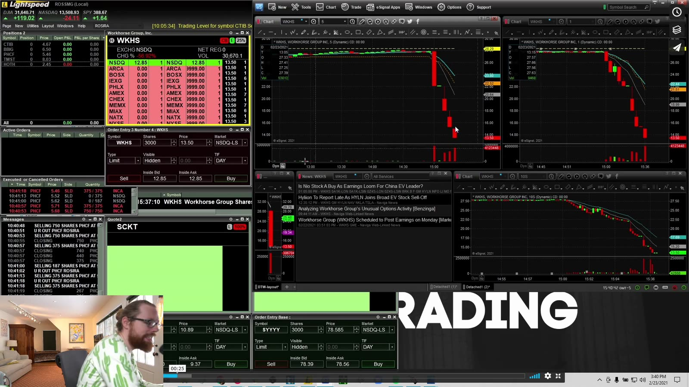

**图怎么看：**

- 右侧大红 K 是反转已经发生后的画面；可执行 entry 通常早于截图但风险更不确定。
- 测试时不能用最终大红 K 的 close 假装自己在顶部成交。
- 指标参数如 20-period、2 standard deviations 必须固定，并注明时间周期。
- Short 还要加入 borrow、SSR、halt 与 squeeze 约束。

## 5. Setup 4：Whole / Half-dollar reversal

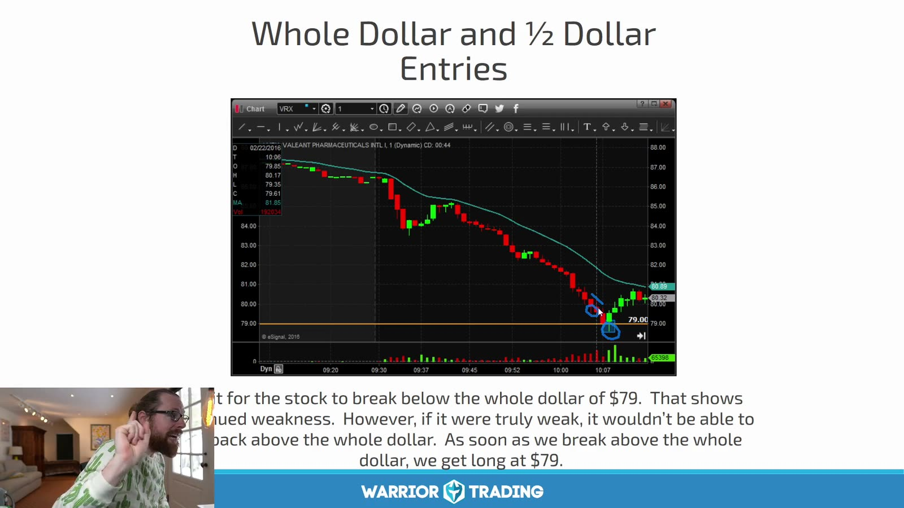

**图怎么看：**

- 股价持续下跌，在整数/半整数附近出现减速和反弹。
- 整数位是可能吸引订单的心理参考，不是硬地板。
- Long trigger 应来自 micro higher low、reclaim 或突破 reversal candle high。
- 若价格直接跌破关口并在下方成交，原 hypothesis 已失效。

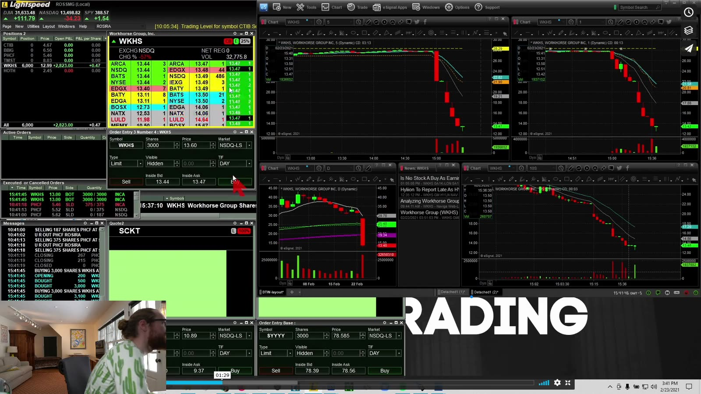

**图怎么看：**

- 右侧几个图仍在急跌，说明“接近整数位”时下行动能可能尚未结束。
- Bid 上的大单可能撤单，不能把可见 depth 当作支撑保证。
- Marketable limit 要限制最坏买价，同时预设若未成交就放弃，不能向下无限改价追单。
- 成功反弹后的第一目标可能只是前一个 micro low，而不是回到全天高点。

## 6. Setup 5：Daily 200 EMA

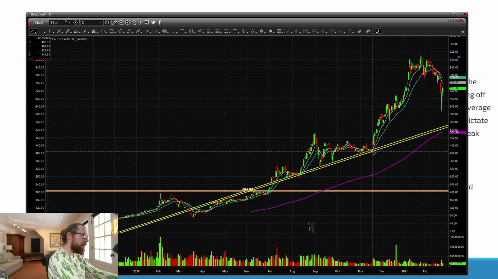

**图怎么看：**

- 图中长期趋势上涨并远离均线，随后快速下跌到均线群附近。
- Daily 200 EMA 是广泛观察的长期参考，但不同平台的盘前数据、复权和起始样本会使数值略有差异。
- 到达均线只提供 context；需要 intraday structure 才能决定 entry。
- 大幅跌到均线可能是正常回撤，也可能是趋势真正破坏。

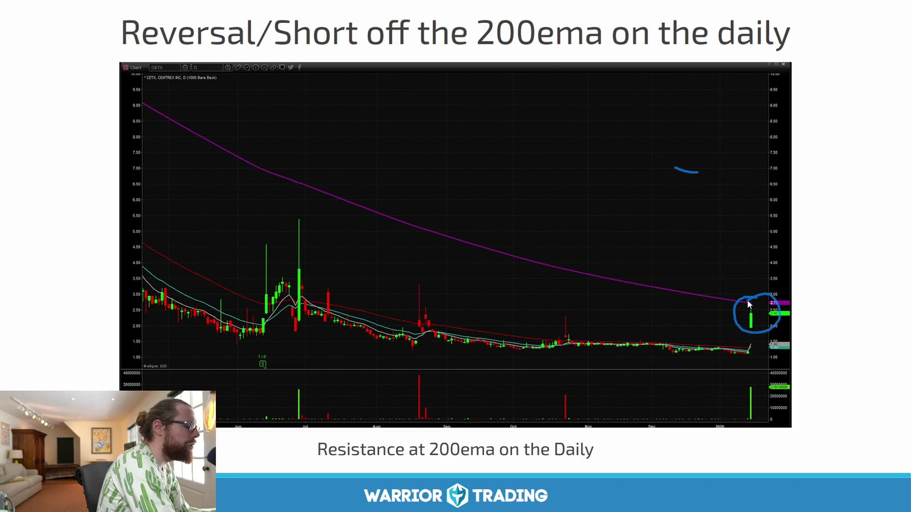

**图怎么看：**

- 长期图中价格从下方接近紫色 200 EMA，蓝圈处可能作为阻力。
- 这是“反弹到阻力再向下”的 short hypothesis，与“跌到 200 EMA 做多”方向相反。
- 均线的作用取决于价格从哪一侧接近以及当时趋势，不能机械规定碰线就买。
- Entry 应等待 rejection；stop 放在确认失效的均线上方结构高点。

## 7. Confirmation 与 entry 的三种层级

| 层级 | 例子 | 优缺点 |
|---|---|---|
| Anticipation | 第 5/10 根同方向 K 内逆势 | 价格最好，失败最多 |
| Candle confirmation | reversal candle 后破 high/low | 较明确，仍可能只是 pause |
| Structure confirmation | lower high / higher low 后再突破 | 风险更清楚，entry 更晚 |

每种方式独立统计。不能把 anticipation 的最好成交价与 structure confirmation 的胜率拼在一起。

## 8. Reversal 的 no-trade 条件

- 未核实的重大新闻或 news halt；
- 连续 LULD halt；
- spread 大于计划目标的显著比例；
- 无法借到股票却计划做空；
- 离可定义失效点太远；
- 只因为浮亏而把 continuation trade 改称 reversal；
- 已达到 daily loss；
- 同一趋势已连续逆势止损。

## 9. 反转样本的正确标签

每个 scanner alert 记录：

```text
extreme condition
entry tier
distance from VWAP / EMA / Bollinger band
consecutive candles and total move
volume climax?
halt state
trigger / stop / target
maximum continuation before reversal
time to reversal
no reversal within observation window?
```

最后一项尤其重要。只有把“根本没反转”的案例留下，才能判断这种 extreme filter 是否真的有 edge。
