# Small Cap 16：Trader Interviews

> 对应视频：Chapter 17 Intro 与 14 位交易者访谈
> 阅读方式：这些访谈提供的是策略适配、失败处理和执行限制的案例，不是代表性样本。被邀请的盈利交易者天然存在 selection/survivorship bias，任何金额、仓位和成长速度都不能作为预期结果。

## 1. Intro：从个例提取可验证方法

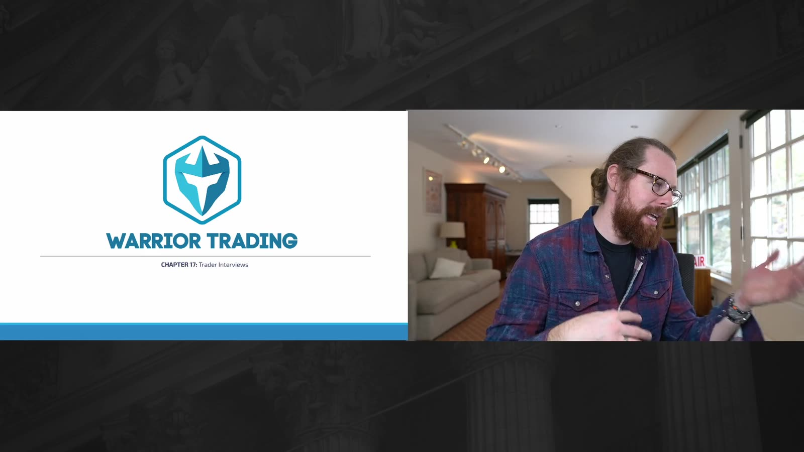

**图怎么看：**

- 画面只说明章节进入访谈，没有 chart、成交或统计证据。
- 访谈中的 P&L 是自述背景，真正可迁移的是规则、复盘方法和失败机制。
- 同一建议若无法转化成自己的日志字段，就只保留为观点。


**图怎么看：**

- 讲者选择“profitable traders”作为访谈对象，本身排除了大量未成功或退出者。
- 不能由 14 个成功案例推导总体成功率。
- 读每节时同时问：起始资本、市场时期、broker、仓位、未展示亏损和机会成本是什么。

## 2. Net：找到适合自己的交易身份

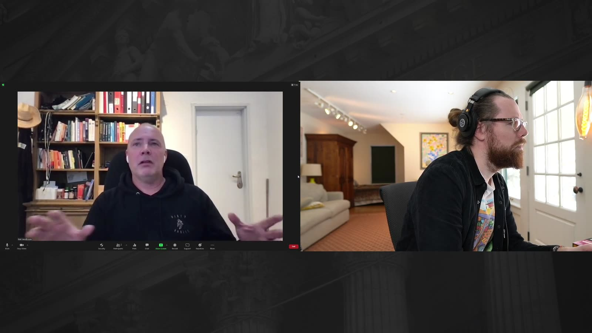

**图怎么看：**

- 画面是远程访谈，不提供可审计交易画面；内容需视为个人经验。
- Net 谈到从 small cap 学习后更偏自己理解的较大股票/不同持有节奏。
- 核心不是复制其持仓，而是承认策略必须与风险承受力、思考速度和账户相符。

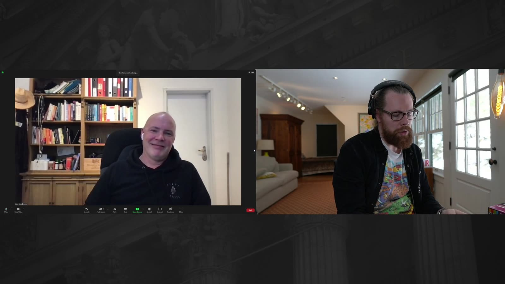

**图怎么看：**

- 访谈提到 bad mood 时不交易、软件误操作和盘前流动性问题。
- “感觉舒服”只能作为结果，仍要用 stop、max loss 和样本证明。
- 其大仓位与账户背景不适用于普通账户。

可迁移：

- 设 pre-trade mental check；
- 软件错误单独记 operational loss；
- 不盲目跟随他人 live trade；
- 用至少一年不同市场样本寻找风格；
- 预先区分 day 与 longer-hold account。

## 3. Jess：accountability 与快速止损

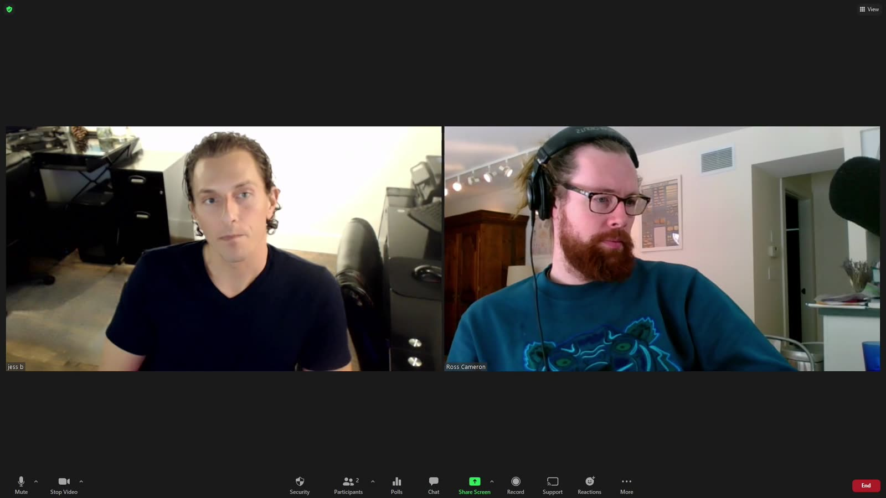

**图怎么看：**

- Jess 自述偏 small-cap momentum，与课程作者观察相近标的。
- 相同 watchlist 不等于相同 fill、risk 或结果。
- 访谈强调长期 sideways 后，通过收紧亏损改善，而非一次技巧顿悟。

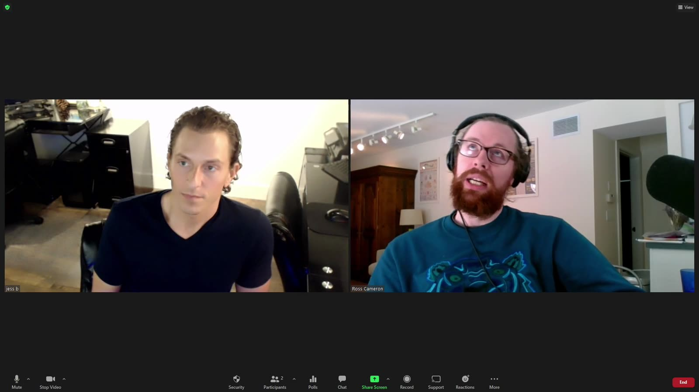

**图怎么看：**

- 讨论 big loss 后的恐惧、revenge trading 和公开复盘带来的 accountability。
- 大赢也会导致 overconfidence，不能只在亏损后启动风控。
- 无法读懂 Level 2/price action 的极端股票应直接跳过。

可迁移：

- 公开/向同伴提交每日 rule-adherence；
- double top 不直接追，等待 pullback/confirmation；
- loser 比 winner 更快处理；
- 大亏后先降低 size，不用新交易证明自己；
- 把 “read 不出来” 写成合法 no-trade reason。

## 4. Roberto：等待突破成立后的 pullback

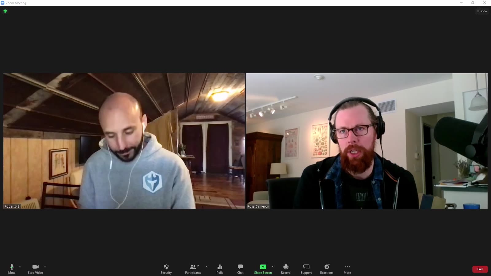

**图怎么看：**

- Roberto 更适合 mid/large-cap trend，而不是强迫自己做 small-cap first breakout。
- 访谈说明换策略不是失败，而是发现原方法与自己不匹配。
- 先在 premarket 标关键位，等待 breakout hold，再买 first pullback。

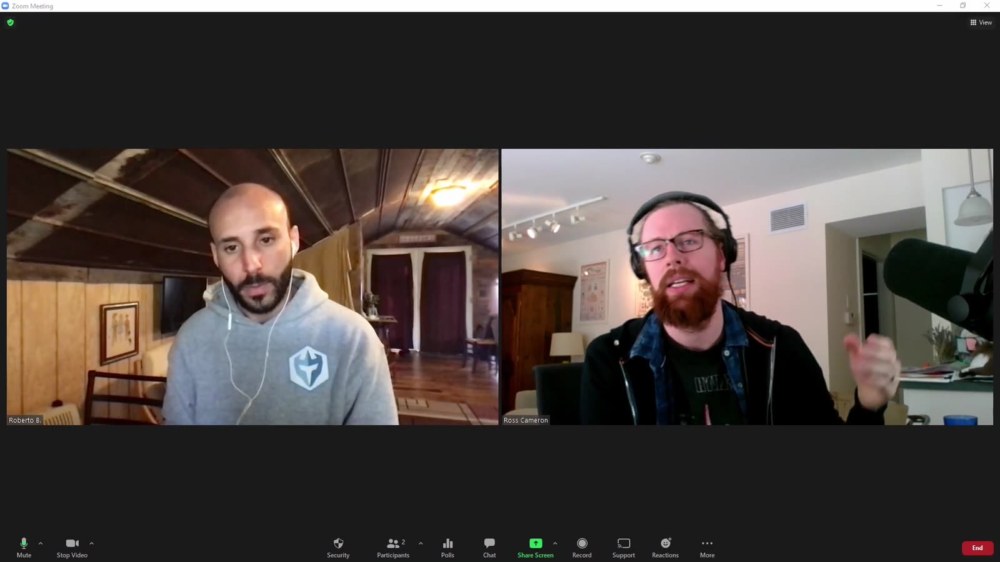

**图怎么看：**

- Process-over-result、warm-up/active/cool-down 和亏损后减仓是主要主题。
- “今天已经盈利”不说明下一笔概率更高；cool-down size 可防止回吐。
- Accountability 与 journal 用于避免自我解释。

可迁移：

```text
premarket level
→ breakout
→ acceptance
→ first pullback
→ structure stop
```

并记录为何 anticipation breakout 不适合自己。

## 5. Celena：同一逻辑在不同市值上要改变退出

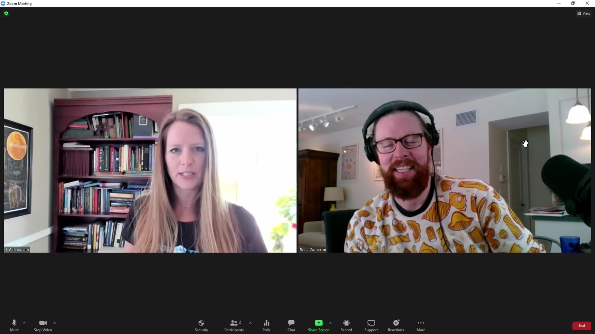

**图怎么看：**

- 访谈对象同时接触 large/mid/small caps，策略核心相近但管理不同。
- Small cap 倾向更快兑现，large cap 趋势可给更多时间；这是经验假设，需个人验证。
- 账户限制曾影响持仓方式，但不能为了节省 day trade 而承担不愿意的 overnight risk。

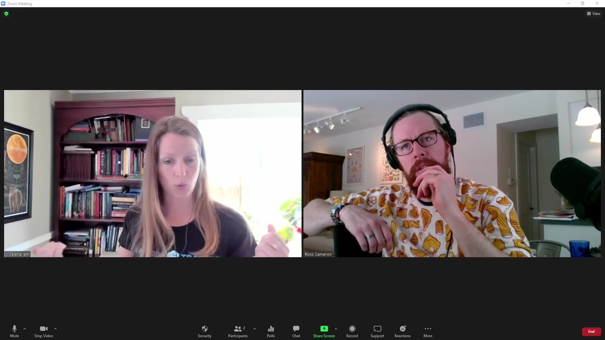

**图怎么看：**

- 重点是反复复习 playbook、按 regime 做微调，而不是频繁换整套策略。
- 旧 market 中有效的 setup 可能在当前 market 失效。
- 多策略能力也有维护成本；不用的技能会退化。

可迁移：

- 按 market-cap bucket 分开 hold time、size 和 target；
- 每周验证 playbook metrics；
- 策略调整一次只改一个变量；
- 账户规则不应反向决定一个不合理的市场 thesis。

## 6. Ted：把“接受亏损”变成行为


**图怎么看：**

- 访谈集中讨论 mindset、正念、经济压力与不愿认错。
- 有其他收入可降低压力，但不会自动带来交易能力。
- “每笔都可以是正确过程中的 losing outcome”有助于把结果与决策分开。

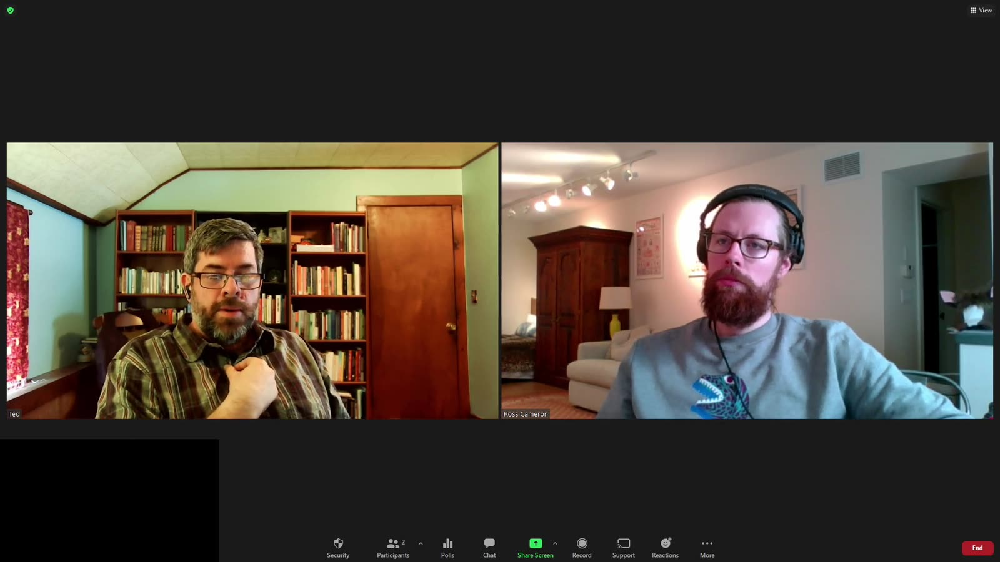

**图怎么看：**

- Simulator 被定义为练纪律，不只是学按钮。
- 在 sim 中乱下单会训练坏习惯；转 live 后仍会重复。
- 只躲在 sim 也可能延迟真实情绪适应，应在证据充分后用最小 live size。

可迁移：

- 每次 stop 后写 “规则内亏损/规则外亏损”；
- 不 average down 来证明自己正确；
- sim 使用与 live 相同 size model/max loss；
- 若 live 重复违规，退回 sim 专练该行为；
- 用极小真钱验证情绪，不用大仓“逼自己认真”。

## 7. Gary：日志、执行容量与成本


**图怎么看：**

- Gary 强调把 wins/losses 与当时心理一起写入 journal。
- 把错误归因于股票会妨碍学习；应定位 entry、size、stop 或 execution。
- 重新交易同一 symbol 只能在 setup 独立成立时进行，不能为了消除恐惧。

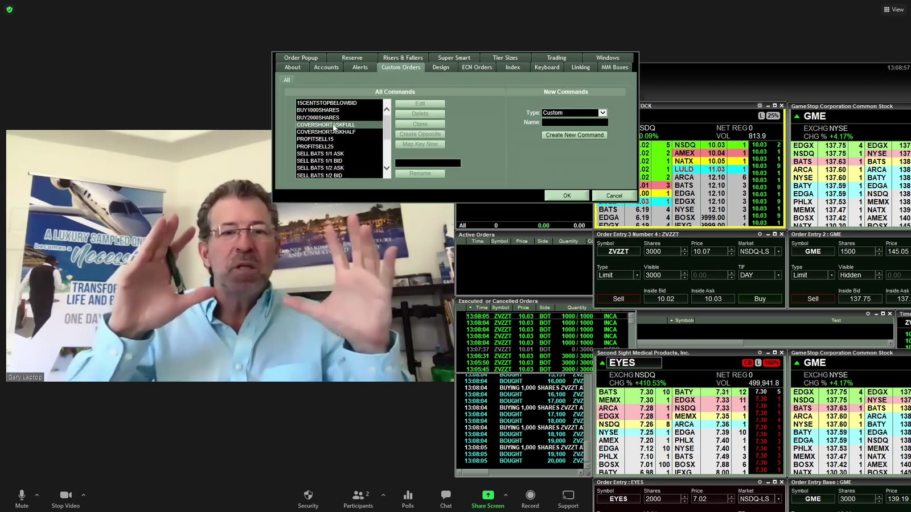

**图怎么看：**

- 后半段展示 order offsets、卖在 ask/bid、大仓 slippage 与 commission。
- 仓位越大越不灵活；small-size fill 不能外推到 10,000+ shares。
- 卖在 ask 可能提高价格但不保证成交；必须有紧急退出路径。

可迁移：

- 记录 gross 与 net P&L；
- 按 size tier 统计 slippage；
- 把未成交 sell order 视为风险；
- 每周审计佣金占 gross profit；
- 扩仓前做 capacity test，而非只乘股数。

## 8. Jeremy Cooper：执行工具决定可交易的 setup

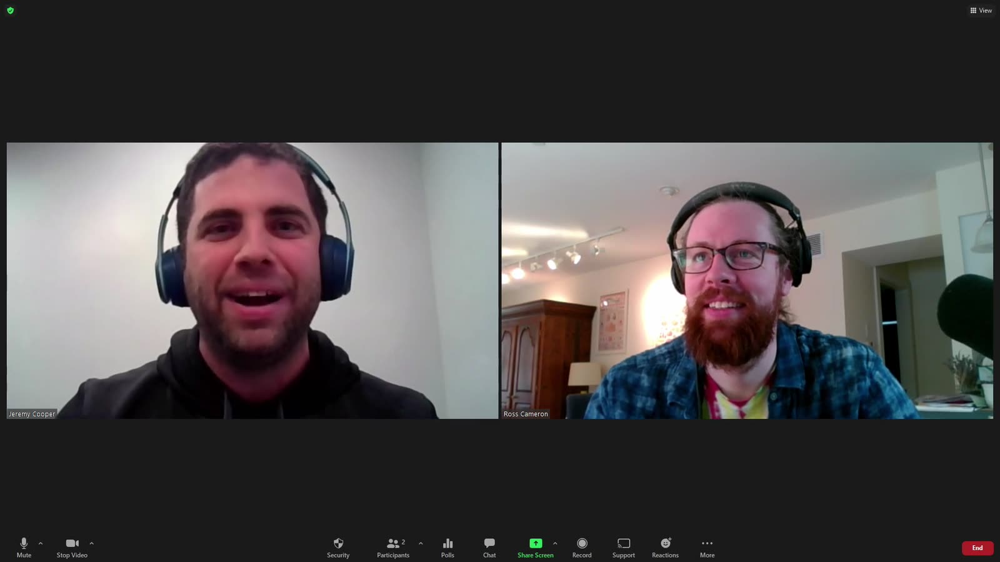

**图怎么看：**

- 访谈对象偏 aggressive small-cap momentum，并经历远大于此前记录的单日亏损。
- 随后快速赚回不能证明那次亏损合理；应单独评估当日规则。
- 结果序列容易诱发 “我能恢复所以可承受” 的错误推理。

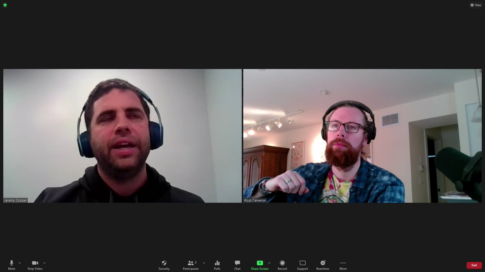

**图怎么看：**

- 使用的平台在 10-second micro pullback、halt 和 IPO 上有执行限制。
- 工具不适合时，正确选择是跳过 setup，而不是强行追价。
- 大仓难退出，free commission 也不等于无 spread/slippage 成本。

可迁移：

- 建 platform/setup compatibility table；
- 不交易无法按计划退出的 setup；
- 最大亏损按当时规则评估，不被随后 P&L 洗白；
- 教育和 sim 是低成本发现工具边界的方法。

## 9. Danny：从小额进步和持续 journal 建立证据

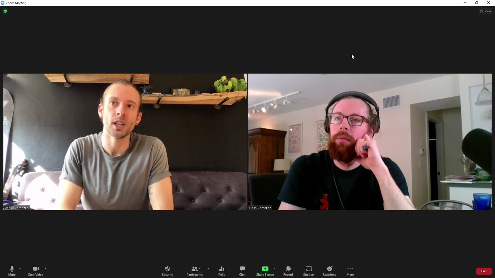

**图怎么看：**

- Danny 偏 breakouts、quick dip buys 和 micro pullbacks。
- 访谈用 float、volume 和共同注意力描述理想标的；这些阈值来自个人时期。
- Dip buy 先用小 size 等反应，比直接满仓接 falling knife 风险低，但仍需失效点。

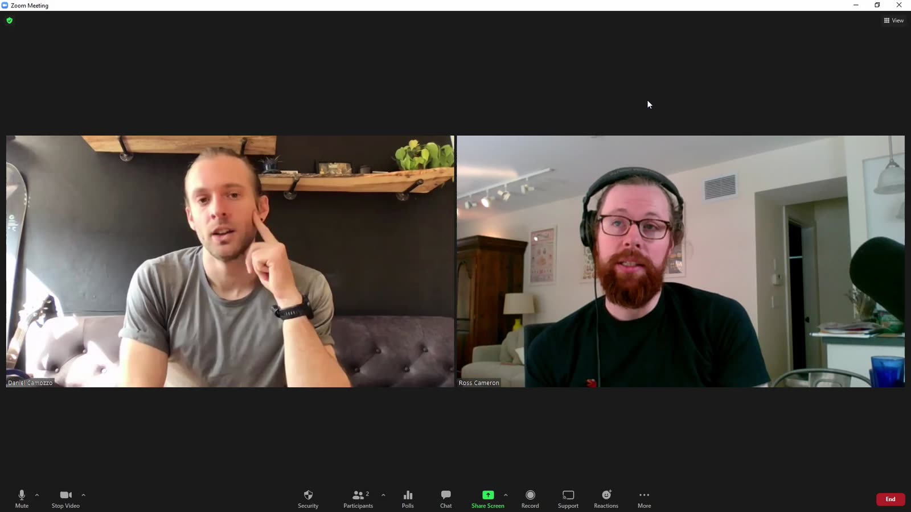

**图怎么看：**

- 经历亏损后从很小绿日重新建立，持续使用 spreadsheet/journal。
- 没有从 sim 开始是个人路径，不应被解释为 sim 无用。
- 大幅月度收益发生在特定市场与 TSLA 时期，不可当基准。

可迁移：

- 先恢复 rule adherence，再恢复 size；
- 每日 journal 不因结果好坏中断；
- 区分主要 edge 与偶尔 profitable setup；
- 市场异常活跃期的结果单独分 regime。

## 10. Henry Chen：用统计砍掉不适合的方向

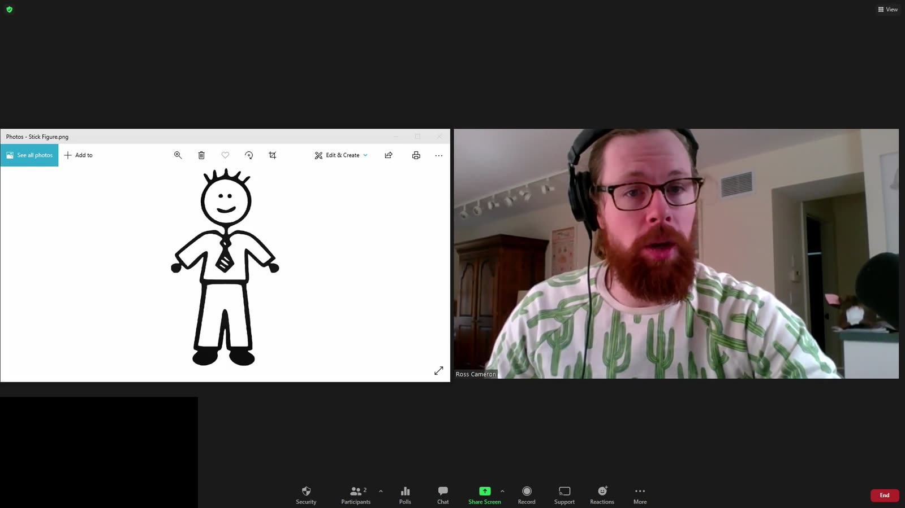

**图怎么看：**

- Henry 描述几秒到 30 秒的 momentum scalp，在突破前逐步建立仓位。
- 这种 anticipation 高度依赖 Level 2、速度与执行，不适合直接模仿。
- 其统计显示 short 亏钱，因此只保留 long；这是用个人数据缩小策略范围。

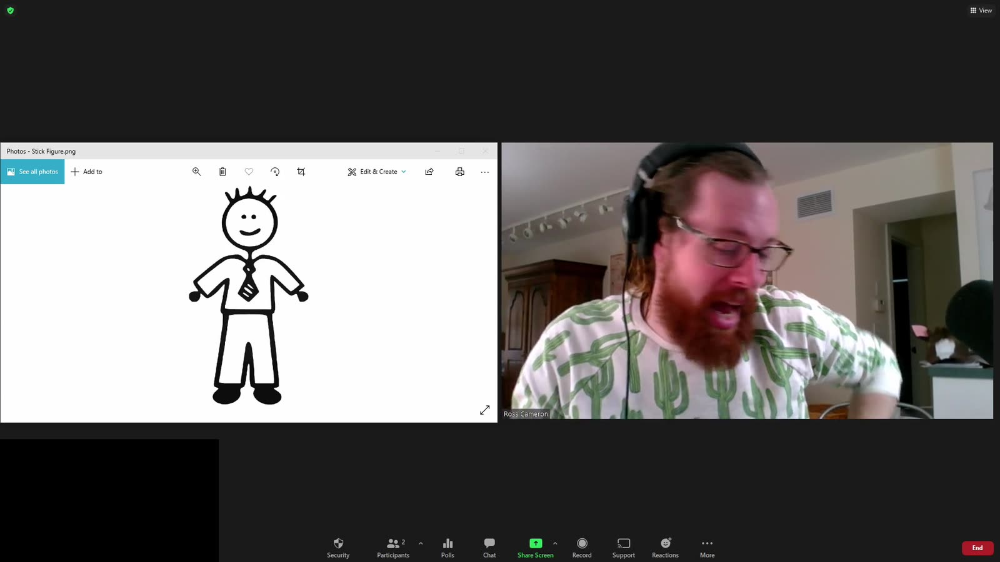

**图怎么看：**

- 首次 live 因 holding-and-hoping 大亏后退回 simulator 三个月。
- 对 halt resume，个人规则是等待第一根 1m candle，而非第一秒交易。
- 回到 sim 是纠错，不是职业失败。

可迁移：

- 按 long/short 分开 expectancy；
- anticipation position 设更小 starter size；
- 趋势反转与 consolidation 必须有清楚区分；
- halt 恢复后等待可定义结构；
- 大亏后暂停 live 直到同类错误在 sim 被修复。

## 11. Dillon：market regime 会让 bread-and-butter 失效

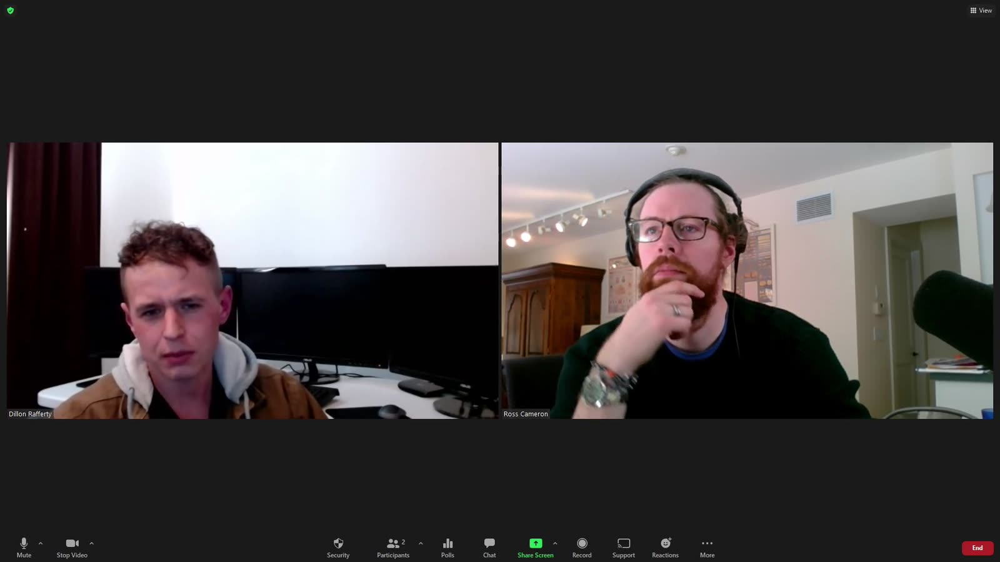

**图怎么看：**

- Dillon 多次重看课程，在 sim 中逐笔截图并写 thinking process。
- 早期 go-to 是盘前 coiling 的低 float Gap & Go。
- 课程重复次数不重要，能否从截图解释 entry/stop 才重要。

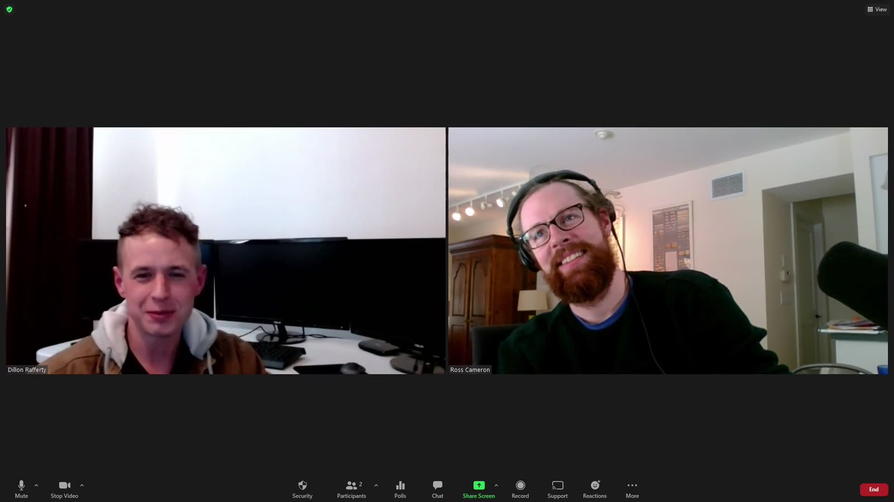

**图怎么看：**

- 当 halt behavior/market regime 改变后，旧 setup 失效并引发数月 revenge cycle。
- 每个小 winner 都被 “还差多少回到高点” 污染，导致交易 B/C setup。
- 最终需要完全停止，等 P&L anchor 消退后只做 A setup。

可迁移：

- “boring is good”；
- 设固定交易时段，时段外不追；
- 绝不 average down；
- 账户 high-water mark 不参与单笔决策；
- setup performance 发生 structural break 时停做并重建样本。

## 12. Hermang：先修 position size，再谈信心

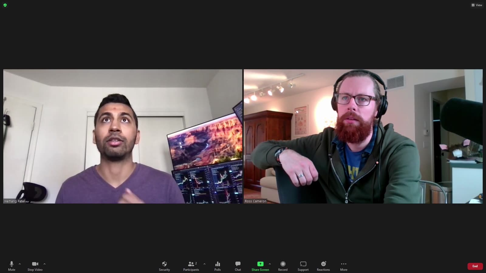

**图怎么看：**

- 从零开始在 simulator 学 PDT、Level 2 和形态，多次经历小赢被一次 flush 抹去。
- 模拟结果很差时继续用真实资金不会自动改善。
- 早期焦虑会导致过快卖 winner、holding loser 和失败后反手。

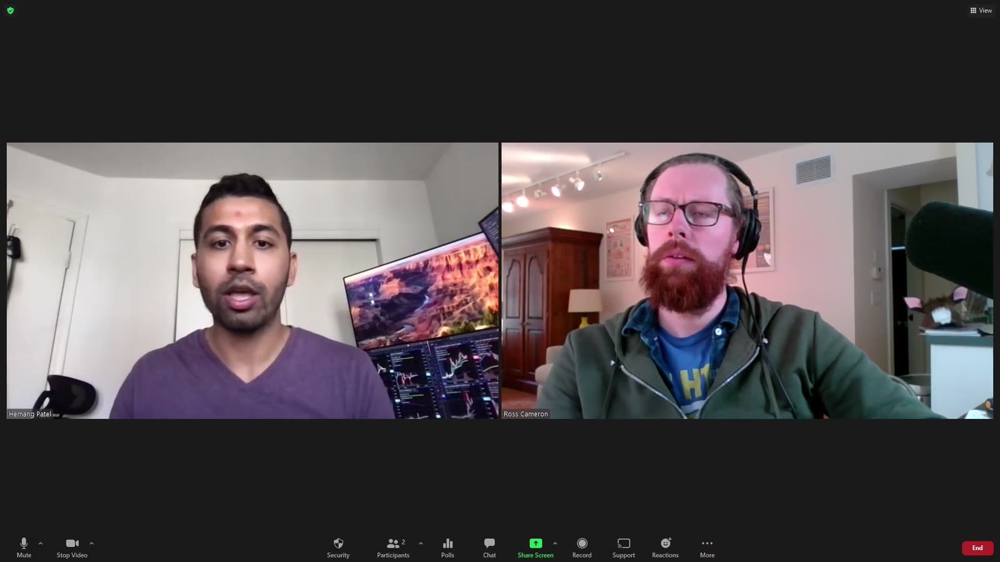

**图怎么看：**

- 访谈强调缩小 size、重新看课程、每次大亏做 reset。
- 第一次 live 赢钱可能只是短期结果，不能覆盖 sim 尚未稳定的证据。
- Choppy market 可作为延后 live 的合理条件。

可迁移：

- 第一笔也只用 base risk，不用大 size “建立 cushion”；
- 大亏后分辨 strategy flaw 与 execution flaw；
- simulator fill 要按现实条件调整；
- 好/坏情绪偏离中心时都不扩仓；
- 任何单周不能威胁整个账户生存。

## 13. Guy MacDonald：把长期仓、期权和日内练习分开

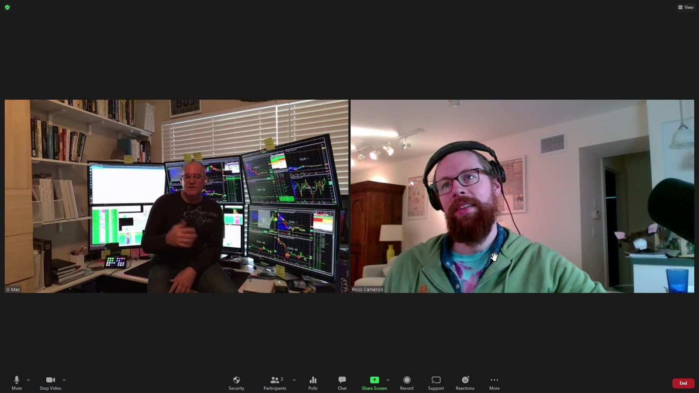

**图怎么看：**

- Guy 用 apprentice/journeyman 类比长期练习，并将长期 Apple、covered call 与 day-trading sim 分开。
- GME/AMC 盈利来自极端时期且风险很高，不能作为常规策略验证。
- 有大 portfolio 也不表示日内技能已经建立。

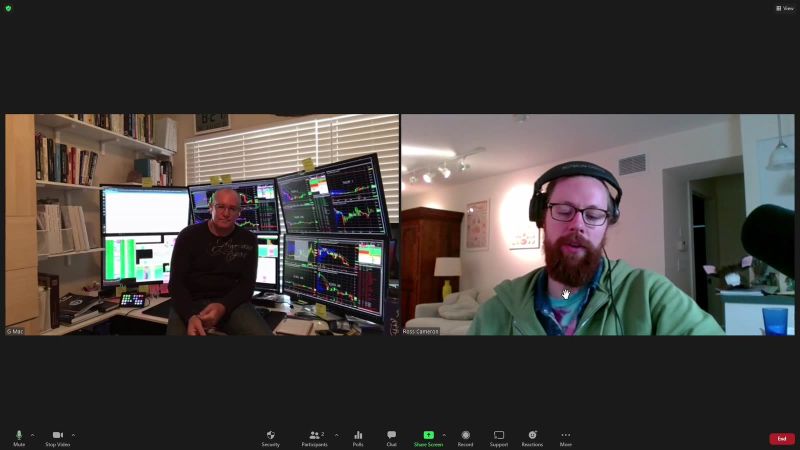

**图怎么看：**

- 多屏工作区不是 edge；其重要行为是尚未舒服时留在 simulator。
- 10-cent 自动退出是个人执行习惯，不应替代结构 stop。
- “Put time and effort in” 需要落实为样本和日志。

可迁移：

- 分账户/分日志保存 investment、swing、day trade；
- covered call 仍承担股票下跌与 assignment 风险；
- 极端赢家不计入普通 expectancy；
- 对损失的透明记录与盈利同等重要。

## 14. Tomas Loon：让 strategy 适应 broker 和个人速度

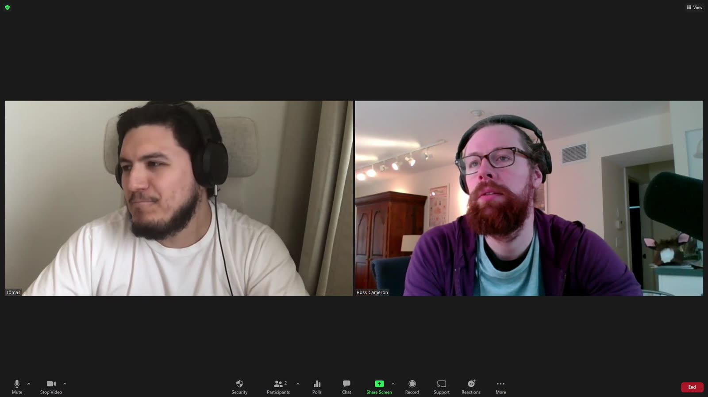

**图怎么看：**

- Tomas 接受自己的收益金额远小于讲者，不用比较诱发放大仓位。
- Broker execution 稍慢时避开 10-second micro pullback，转向更慢、更清楚的 setup。
- 这说明 strategy 必须包含平台能力。

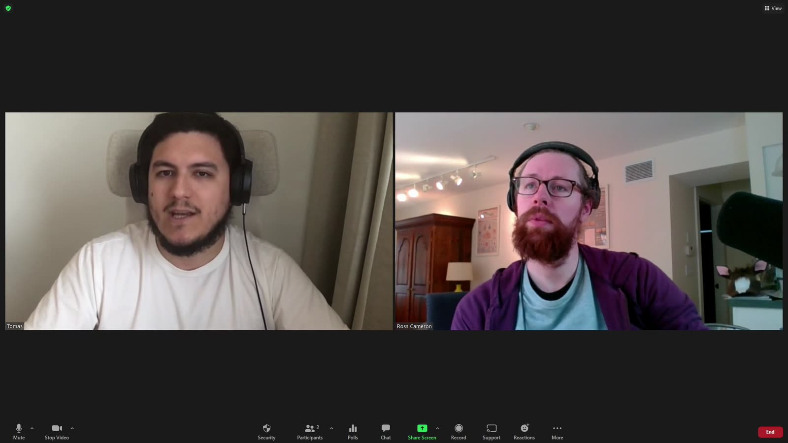

**图怎么看：**

- 主要困难仍是及时 cut loss 和停止后真正离开 chart。
- 继续盯盘会重新触发 FOMO；环境隔离是有效行为设计。
- “Market tomorrow still exists” 的实用含义是今日不需要强制找到交易。

可迁移：

- 选择与 execution latency 匹配的 hold time；
- 不用他人 P&L 定 size；
- 达 stop 后关闭 chart，而不只是口头说结束；
- 即使使用 live，也保留 sim 做新 setup 测试。

## 15. Manoli：规模会改变策略本身

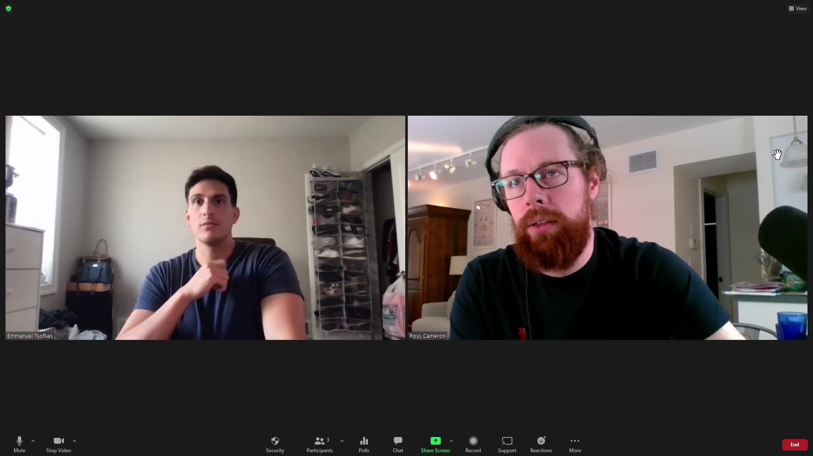

**图怎么看：**

- 访谈涉及为跨过旧 PDT 门槛借入资金；这是高风险行为，不能推荐。
- 账户 buying power 变大后，误按数量也会形成巨大仓位。
- 市场从 hot 转 slow 时，过去 size 与收益不可维持。

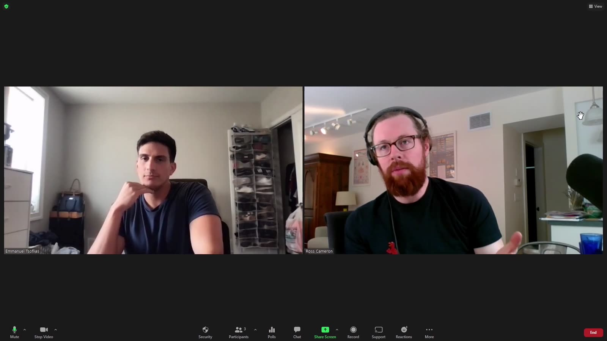

**图怎么看：**

- 大仓位在快速下跌中会跳过限价、反复 cancel/replace，无法像小仓位灵活退出。
- 新平台应以 100 shares 等极小规模熟悉，而不是一开始迁移全部 size。
- 50k–60k shares 的个例不适用于普通学习者，也可能显著影响自身 fill。

可迁移：

- 不借亲友资金满足账户门槛；
- 设置 broker-level max shares/notional；
- 扩仓时测 market capacity；
- 大 loss 触发强制 size reset；
- market regime 转冷时先保护资本。

## 16. 十四段访谈的共同结论

反复出现的有效主题：

1. 找到与个人、broker 和市场匹配的窄策略；
2. 快速止损、不 average down；
3. Simulator 用于练规则，新 setup 回 sim；
4. Journal 同时保存 chart、想法、fills 和情绪；
5. 大亏后的首要动作是减仓/停止；
6. Market regime 变化时旧 edge 会消失；
7. Size 增加会恶化 fill 和心理；
8. Accountability 能减少规则外交易；
9. 不与他人的 P&L 比较；
10. 保护继续学习的资本和时间。

## 17. 访谈不支持的结论

- 不能估计成功率；
- 不能证明某课程、broker 或 setup 必然盈利；
- 不能把受访者 share size 当建议；
- 不能把 2020–2021 热市收益外推；
- 不能因最终盈利就认定所有中间大亏合理；
- 不能用 “results not typical” 一句话替代风险分析。

最好的用法是从每位受访者只选一条能写进自己规则并可统计的改进，然后用未来样本验证。
