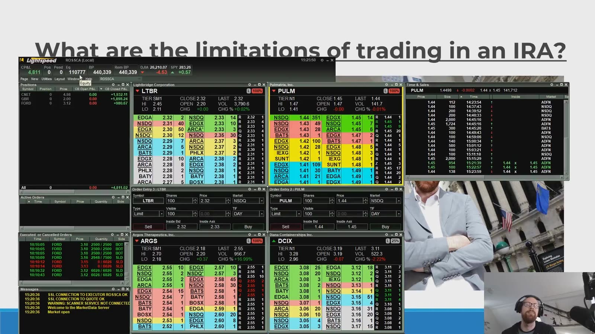
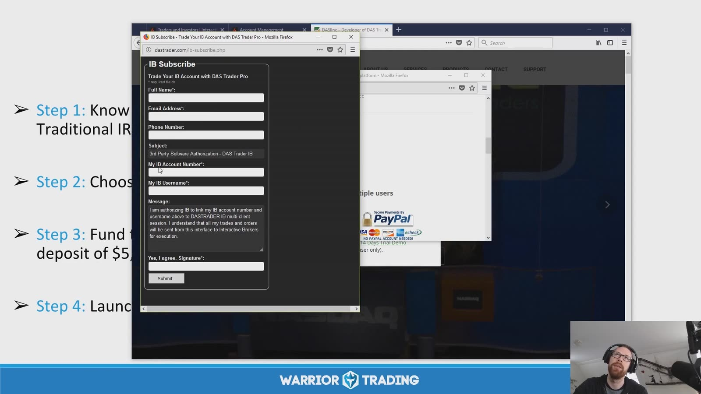

# Small Cap：Trading in an IRA

> 对应视频：Day Trading in an IRA
> 本节重点：IRA 是税务和退休账户结构，不是风险豁免。允许的订单、limited margin、options 与结算处理取决于 custodian/broker，录制期开户步骤不能直接照搬。

## 1. IRA 交易限制



**图怎么看：**

- 画面叠加录制期 Lightspeed/Level 2，用来说明 IRA 也可能接入 active-trading platform。
- “平台能下单”不等于税法、账户协议和风险都允许。
- IRA 通常不能像普通 margin account 一样借款建立杠杆；limited margin 的功能和定义由 broker 规定。
- Short selling、裸期权、借股和某些 spread 可能被限制，必须逐项确认。

## 2. 录制期开通步骤已经过时



**图怎么看：**

- 截图展示旧浏览器、第三方 DAS 接入 IB account 的表单与课程的开户步骤。
- 域名、费用、最低存款、授权流程和支持关系都可能变化，不能照图提交个人信息。
- 当前开户只从 broker/custodian 官方入口开始，并核实第三方数据权限。
- 不在未知旧表单输入 IRA account number、用户名、电话或签名。

## 3. 先区分账户与策略

账户层回答：

- Traditional、Roth、SEP、SIMPLE 还是其他 IRA；
- custodian 允许哪些证券和 order type；
- 是否有 limited margin；
- settlement/freeriding 如何处理；
- options approval level；
- annual fee、data 与平台费；
- distribution、rollover 和 beneficiary。

策略层回答：

- 交易什么标的；
- 是否 day trade；
- stop、size 与 daily loss；
- 是否跨 earnings/overnight；
- 需要 short、borrow 或 complex options 吗；
- 最大回撤对退休目标的影响。

两层都满足才下单。

## 4. 不把 IRA 当作普通现金账户照搬

常见操作风险：

- 使用尚未结算资金；
- 订单被 broker 拒绝后临场改策略；
- options assignment 形成账户无法持有的股票仓；
- spread 一腿被 assignment；
- 无法 short 却用更高风险替代品追求相同方向；
- 高频费用侵蚀退休资产；
- 因税递延误以为亏损“没有成本”。

IRA 内亏损仍是真实资本损失，且可能减少未来复利基础。

## 5. 借款与 prohibited transactions

美国 IRS 说明 IRA 和 IRA-based plans 不允许 participant loan；从 IRA 借款可能导致严重税务后果。可参考 [IRS retirement-plan loan FAQ](https://www.irs.gov/retirement-plans/retirement-plans-faqs-regarding-loans)。

IRS 也列出 IRA 与 owner/disqualified person 间的 prohibited transactions，例如某些借贷、资产转移和自利交易；可参考 [IRS retirement plan investments FAQ](https://www.irs.gov/retirement-plans/retirement-plan-investments-faqs)。

这与 broker 所称 “limited margin” 不应混淆：后者通常是为结算/交易便利提供的账户功能，具体条款需向 broker 与税务专业人士确认。

## 6. 当前开户核对表

只使用当前官方文件核对：

```text
broker/custodian legal entity
IRA account agreement
limited-margin agreement
options agreement
eligible securities
settlement and good-faith rules
fees and market data
third-party platform authorization
account protection
trade desk / emergency procedure
```

课程中的 broker、最低资金和旧 PDT 相关数字都不作为当前事实。

## 7. Risk budget 应更保守

退休账户补充资金受年度贡献和资格规则约束，亏损后不一定能随意重新注资。建议把风险拆成：

```text
per-trade risk
daily loss
weekly drawdown
retirement-account max drawdown
```

触及最后一层时停止 active trading 并重新评估资产配置，而不是用更大仓位恢复。

## 8. 税务与专业确认

- IRA 类型、贡献、distribution 和 rollover 规则会变化；
- Active trading 的税务处理与普通 taxable brokerage 不同；
- 某些资产/交易可能触发 prohibited transaction 或其他税务问题；
- Options assignment、UBTI 等特殊情形需专业判断。

本节只整理课程概念，不构成税务或法律建议。执行前以 IRS、custodian/broker 当前文件和合格专业人士的意见为准。
