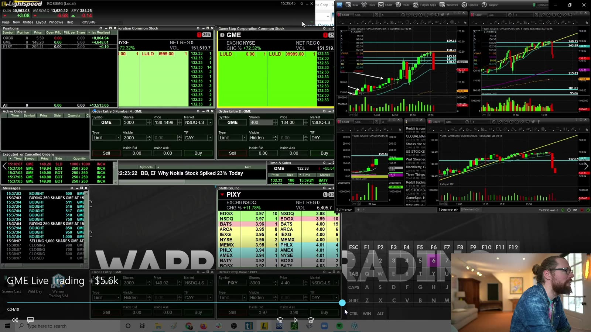
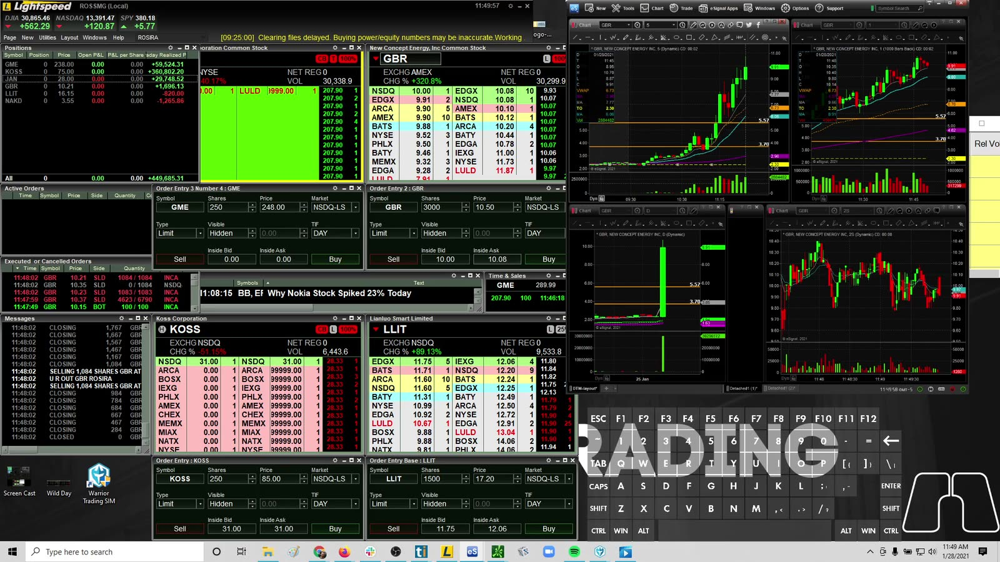
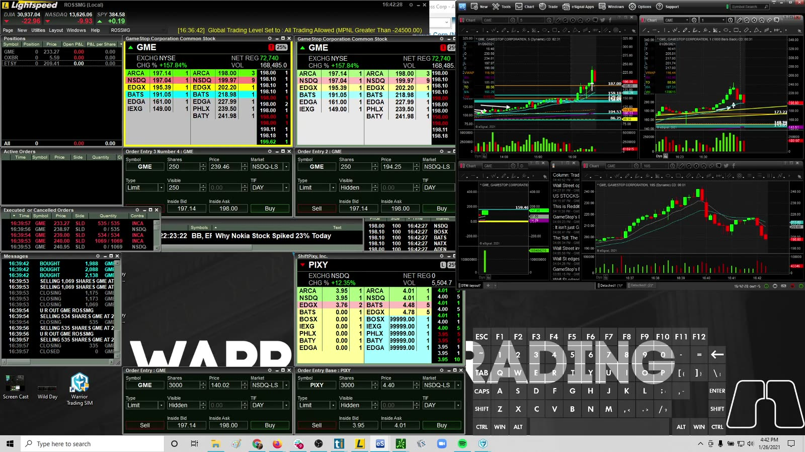
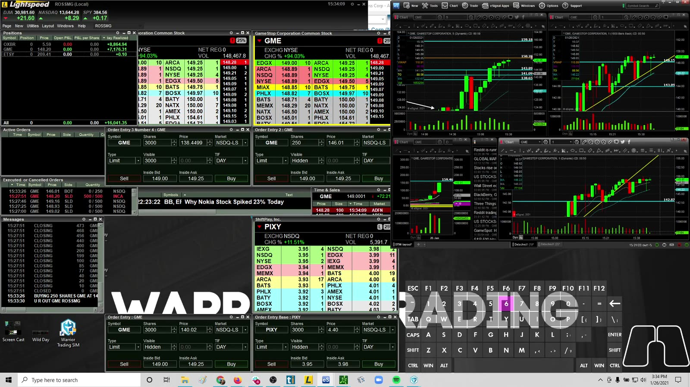

# Live Review 01：GME Case Studies

> 对应视频：v0119–v0122，共 4 段
> 这些是 2021 GME 极端行情的历史案例。价格、short interest、券商限制和市场结构都具有特殊性，不能作为普通 small-cap 策略基准。

## v0119：GME parabolic move 全周期复盘



**图怎么看：**

- 画面同时展示 GME 的短周期强趋势、Level 2、Time & Sales 与其他标的。
- 价格从低位到数百美元的结果会让任何中间 entry 事后显得容易；实际多次 50%+ 回撤和 halt 隐藏在路径中。
- 课程作者前两天亏损、后来盈利、又出现职业生涯最大亏损，说明最终月度盈利不能证明单笔风险合理。
- Short squeeze、options positioning、社交注意力和低 float 共同作用，但截图无法量化每个因素。

**视频内容：** 本段不是只截 GME 最陡的一段，而是回看从早期约 36.75 追入、dip add 后连续止损，到价格最终从个位数扩张至数百美元期间的多次交易。讲者前两天先亏损，后来取得大额盈利，又经历职业生涯级别的单日损失；这条完整路径说明“长期看对 squeeze”与“每次 timing、size 合理”是两回事。画面中的 Level 2、Time & Sales 和多周期图应用来核对每次当下可见的信息，而不能被最终 500 美元附近的结果倒写。

**复盘：**

- 早期在约 `$36.75` 追入、dip add 后连续 stop，说明方向对也可能 timing 错；
- “从 `$5` 到 `$500`”是结果，不是可重复目标；
- 任何关于历史 short interest、持股和公司事件的数字都应由当时 filing/数据重新核验；
- 把 GME 与普通 Gap & Go 放在同一统计桶会严重扭曲均值。

## v0120：从约 126/153 一带 panic 到 300 的 reversal



**图怎么看：**

- 主图显示急跌、停牌和恢复后的巨大价格跳跃；这不是连续可止损的普通 candle。
- 讲者等待 selling 后开始 recover，再做 long，而非第一秒盲接；但仍承担 resume gap。
- 部分订单被跳过，实际只有计划仓位的一部分成交，说明理论 position 与真实 fill 不同。
- 进入上行 halt 后仍无法退出，获利仓也可能在下一次恢复时变成亏损。

课程中出现 “这是 GME 的终点”“一定会有 epic bounce/guarantee” 等强断言。这些只能视为当时情绪化判断：市场没有保证，且同一段后续走势本身就反驳了“终点”式预测。

**视频内容：** 案例从约 153/126 一带的 panic 与 halt-down 展开：交易者没有在第一秒直接接刀，而是等待卖压开始恢复后尝试 long；部分订单因价格跳动而未成交，随后价格又进入向上停牌。因而实际仓位小于计划仓位，且即使账面盈利也无法在停牌中退出。视频最重要的转折是“看到恢复”不等于消除 resume gap；每一次停牌都重新打开了价格跳过止损的可能。

**复盘：**

```text
halt-resume gap
partial / skipped fills
wide and moving spread
no continuous stop
short-covering uncertainty
position size based on unusually large daily cushion
```

用当日已有大额利润来合理化 `$12,000` stop，不适合普通账户，也会使 risk 随当日 P&L 失控。

## v0121：After-hours squeeze



**图怎么看：**

- 右侧图在 regular close 后继续快速上行，左侧 Level 2/prints 的深度与常规时段不同。
- 盘后没有常规 LULD 保护的行为与正常时段不同，liquidity 更薄、spread 更宽。
- 画面中的 `$150→$190+` 路径不能说明中间每次 pullback 都能退出。
- 期权市场通常不按股票盘后相同时间连续交易；不能用盘后 option quote 假设随时可对冲。

**复盘：**

- 仅使用 broker 明确允许的 extended-hours 限价订单；
- 仓位小于常规时段；
- 预设不持有到次日；
- 不因看到 options call 大涨而追逐 stale/wide quote；
- 把 after-hours 作为独立 session 统计。

**视频内容：** Regular close 后，GME 仍从约 150 一带快速 squeeze 到 190 以上；画面把盘后图、Level 2 和 prints 并排保留。交易过程应按收盘前持仓、盘后新入场、每次 pullback 与最终退出拆开，因为盘后订单类型、深度和可成交数量都已改变。视频也涉及 options 价格，但股票盘后仍交易并不代表期权有同样连续的对冲渠道，不能把屏幕上的 option quote 当成随时可实现的价值。

## v0122：高波动中的亏损日



**图怎么看：**

- 图中 GME 多周期仍在大幅波动，账户窗口和 Level 2 同时快速变化。
- 标题金额只是当次结果，不说明计划风险、最大不利波动或是否守规。
- 同一标的既有巨大 winner 又有 loser，最能说明 symbol 不是 edge。
- 当价格每股移动数美元时，沿用普通 10–20 美分 stop/size 完全不合适。

**复盘：**

- Entry 是 breakout、dip 还是 reversal；
- 当时是否接近 halt；
- 股数是否按美元风险缩小；
- 为何在第一次 loss 后继续；
- actual slippage；
- 是否因之前 GME 盈利而提高 risk tolerance。

**视频内容：** 这段把注意力从 GME 的巨大赢家转回亏损日：同样的 ticker、相似的高关注度和宽幅蜡烛，并未自动产生正 edge。画面中账户、Level 2 与多周期价格同时快速变化，说明每股数美元的正常摆动已经足以击穿普通 small-cap 的固定止损。学习时要先给每笔 entry 分类，再找第一次亏损后的 size/频率变化；若因过去在 GME 赚过钱而继续提高容忍度，真正失效的是风险流程而非股票名称。

## 四段案例的共同结论

1. Extreme short squeeze 是独立 market regime；
2. Halt 让 stop-loss 失去连续执行条件；
3. After-hours 与 regular session 分开；
4. 大额日内 cushion 不应提高下一笔固定风险；
5. Partial fill 会改变 exit plan；
6. 成功 reversal 不证明 blind dip buying；
7. “一定反弹/到此结束”都不是可接受交易前提；
8. GME 的收益和亏损从普通 setup 样本中剔除。

建议把这四段只用于训练尾部风险识别，不用于计算常规胜率。
