# Live Review 02：Celena Examples

> 对应视频：v0123–v0133，共 11 段
> 主要线索：多周期 RSI、Thinkorswim 执行、日内与 swing 的差异。RSI 是价格变换后的指标，不是独立买盘，也不能保证 “至少小赢”。

## v0123：TWMC 开盘 momentum

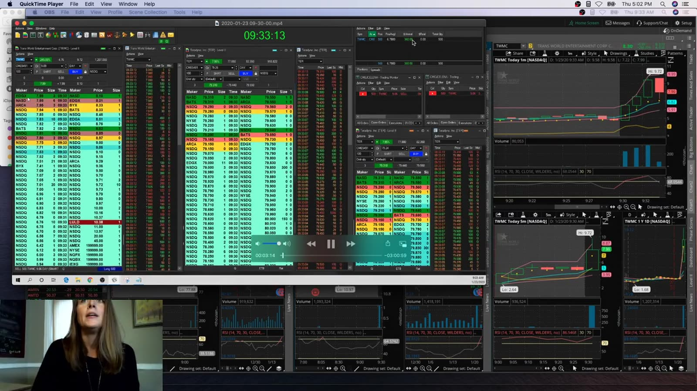

**图怎么看：**

- 1m、5m 和 daily 同时显示，旁边是 Level 2/Time & Sales。
- 讲者用自定义 RSI 的 60/70 区域等待回撤，再结合 tape 入场。
- 开盘不到一分钟且接近 halt band，普通 RSI stop 不能覆盖停牌跳空。
- 多位 room trader 同时关注只说明拥挤度，不是独立确认。

**视频内容：** TWMC 在开盘不到一分钟进入快速 momentum，画面同时保留 1m、5m、daily、Level 2 与成交记录。讲者先用 5m 强势背景筛选，再等 1m 回撤和 micro high，RSI 60/70 只是辅助观察；价格接近 halt band 时，交易已从普通回撤变成带复牌跳空风险的事件。复盘应把结构 trigger 与指标读数分开，确认入场到底依赖哪个条件。

**复盘：** 把 entry 写成 `5m 强势 + 1m pullback + micro high trigger`，再单独记录 RSI；否则无法判断 edge 来自结构还是指标。

## v0124：MDGS 为 retest 持有

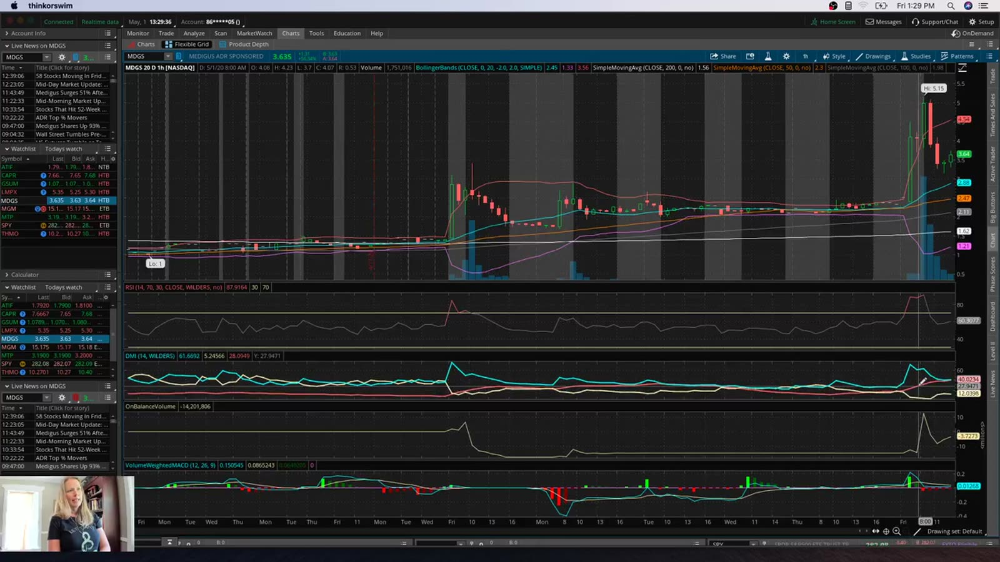

**图怎么看：**

- 画面展示延伸后的回撤，讲者因 5m context 选择不立即退出。
- “每天只能一笔”是账户约束，不应成为持有 loser 的理由。
- 若 entry 本身是因为 “今天需要一笔”，质量已经下降。
- Hold 必须基于未破坏的结构 low，不是 RSI 尚未跌破某数值。

**视频内容：** MDGS 在延伸后回撤，讲者因 5m context 和预期 retest 没有立刻退出；同时账户“一天只能一笔”的约束增加了继续持有的心理压力。视频的关键不是后来是否反弹，而是回撤过程中哪一个结构 low 被视为 invalidation、5m thesis 是否仍成立。若没有事前价位，所谓“给 retest 时间”就可能只是用账户限制合理化 loser。

**复盘：** 对比两种规则：严格 structure stop 与给 retest 更多时间；统计后者增加的平均 winner 是否补偿更大 MAE。

## v0125：CCCL 多周期 RSI alignment

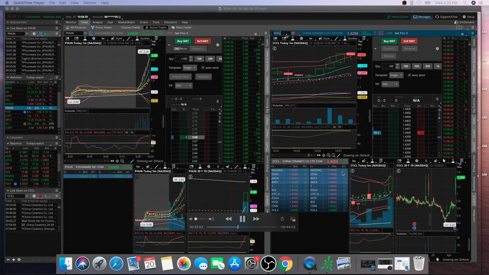

**图怎么看：**

- 讲者检查 1m、5m、15m、30m、1h 的 RSI 都同向。
- 这些 RSI 都来自同一价格序列，不能当作五个独立信号。
- 大 seller 被成交、价格仍前进可描述为当时的 absorption，但 screenshot 不能预测下一秒。
- 相关股票停牌可能吸引注意力，也可能把风险传导到整个 theme。

**视频内容：** CCCL 案例依次检查 1m、5m、15m、30m、1h 的 RSI，并结合 Level 2 中大卖单被逐步成交、价格仍能向前的现象。画面让人容易把多个周期理解成多重确认，但它们都由同一价格路径计算。学习时应先写原始结构——higher lows、突破位、成交量和卖单吸收——再测试 RSI alignment 是否真正增加信息，而非事后让同一走势被重复计票。

**复盘：** 用 raw price 的 higher lows、volume 与突破价重写规则，并测试加入 RSI 是否真改善结果。

## v0126：PIXY halt 与 Active Ladder

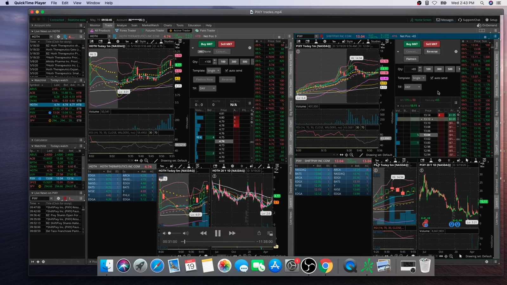

**图怎么看：**

- 小仓位进入后股票停牌，恢复时用 ladder 管理。
- Ladder 价格快速移动，点错一行会改变 entry；订单确认必须核对。
- “只用 50 shares”降低美元风险，但不消除 halt gap。
- 交易中调试平台会增加 operational risk。

**视频内容：** PIXY 以小仓位入场后进入停牌，恢复时讲者用 Thinkorswim Active Ladder 管理订单。视频同时展示价格行快速移动、选择价位、核对数量和恢复后的实际执行；它既是 halt 风险案例，也是平台操作案例。50 shares 让单次美元损失较小，但复牌仍可能直接越过点击价位；在真钱交易中边学 ladder 边处理停牌，会把市场风险与操作错误叠加。

**复盘：** 新平台先在 sim 验证；halt trade 单独设 max size，且不把百分比账户增长当每日目标。

## v0127：SURF 午后 higher lows

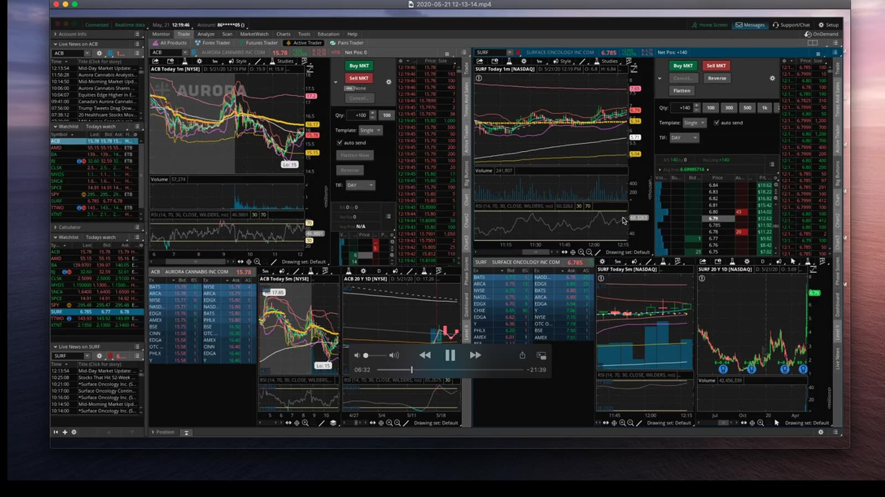

**图怎么看：**

- 多个 higher low 形成可画出的上升支撑，比单一 RSI 数值更直接。
- 午后 liquidity 与上午不同，spread/volume 需要重新核对。
- 讲者提到约 9 美分 stop；这个距离只对当时结构和股价有意义。
- 7%+ 单日账户收益不是合理普遍基准，尤其小账户百分比会被集中仓位放大。

**视频内容：** SURF 在午后形成连续 higher lows，画面可直接画出上升支撑；讲者据此设置约 9 美分的结构止损并观察向上触发。与开盘 momentum 不同，这里成交量和 spread 已进入午后状态。视频应按每个 higher low、突破 trigger、实际 fill 和支撑失效点复原，不能把 9 美分或 7% 收益抽离当时股价、仓位和流动性后复制。

**复盘：** 记录 entry 到 ascending support 的距离、午后 RVOL、planned R 和实际 slippage。

## v0128：UMRX、CRVS、UAL、HEPA、BLU 多笔复盘

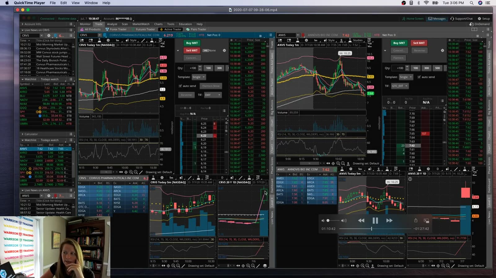

**图怎么看：**

- 多个 chart/position 同时展示，交易实际在另一 broker 执行，画面与 fills 需对账。
- 其中 UAL short 被描述为 accidental，属于 operational error，不应计入策略 expectancy。
- 一天多个方向和市值的标的会增加 context switching。
- Recap 必须把每笔 entry/exit 从 broker statement 对齐到 chart。

**视频内容：** 本段依次复盘 UMRX、CRVS、UAL、HEPA、BLU，画面中的图表平台与实际成交 broker 并非完全同一来源。UAL short 被明确归为 accidental order，其他 planned long/short 则有各自 setup。学习顺序应先把 broker statement 的时间、方向、数量与图表对齐，再分类为计划交易或操作错误；若误单恰好赚钱，也不能计入策略胜率。

**复盘：** 将 accidental、planned long、planned short 分桶；误单先修平台/流程，不用盈亏结果评价。

## v0129：CAPR 从新闻 momentum 转成 trend trade

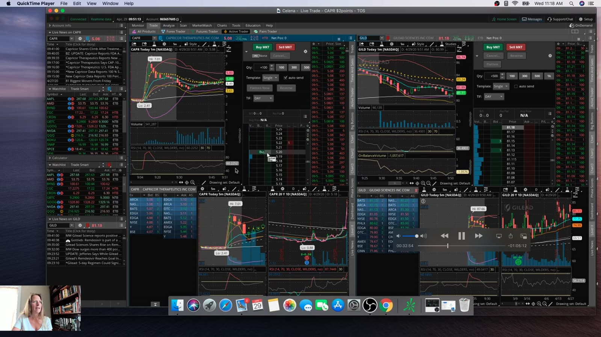

**图怎么看：**

- COVID-19 相关 headline 触发高预期，图上出现长时段趋势。
- 新闻中的 “100% success” 必须回到原始试验规模与公告语境，不能由 headline 直接推断价值。
- 讲者从短线 entry 转为约 100 分钟 trend hold，需要新的 stop/target 计划。
- 群体认为 “可 parabolic” 容易造成 anchoring。

**视频内容：** CAPR 因 COVID-19 相关新闻获得 momentum，最初按短线机会入场，随后持有约 100 分钟并把交易解释为 trend trade。画面显示行情从新闻脉冲转为较长时间的上升结构；真正的决策转折是从 scalp 改为持有。此时必须重新写 stop、target、持有期限和 headline risk，否则只是因为价格暂时有利而在事后改名。

**复盘：** 保存原始新闻、入场时已知信息、策略变更时刻；没有新计划就不能从 scalp 自动变 trend。

## v0130：ROKU swing 提前到目标

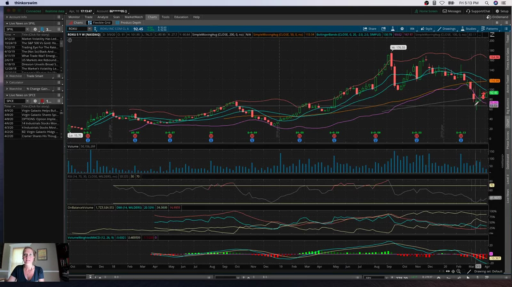

**图怎么看：**

- 交易从约 84 到 91，因接近目标且出现 weakness 提前退出。
- 计划持有到周四并不要求时间到才退出；price target/thesis change 优先。
- 旧 PDT 限制影响了 day-trade 资源分配，但当前规则需重新核实。
- 结果 7 points 不能忽略期间 gap risk 与仓位大小。

**视频内容：** ROKU swing 原计划持有到周四、目标在更高价位；价格从约 84 推进到约 91，接近目标并出现 weakness 后提前退出。视频保留了建仓后的多日路径、隔夜 gap 风险和退出判断。它说明时间计划不是必须坐满的期限：当价格先到目标区或 thesis 改变，应优先处理；复盘则同时记录提前退出避免的风险与之后可能错过的空间。

**复盘：** Swing 日志同时记录 overnight return、planned target、提前 exit 信号和未持有到原期限的机会成本。

## v0131：ROKU swing starter

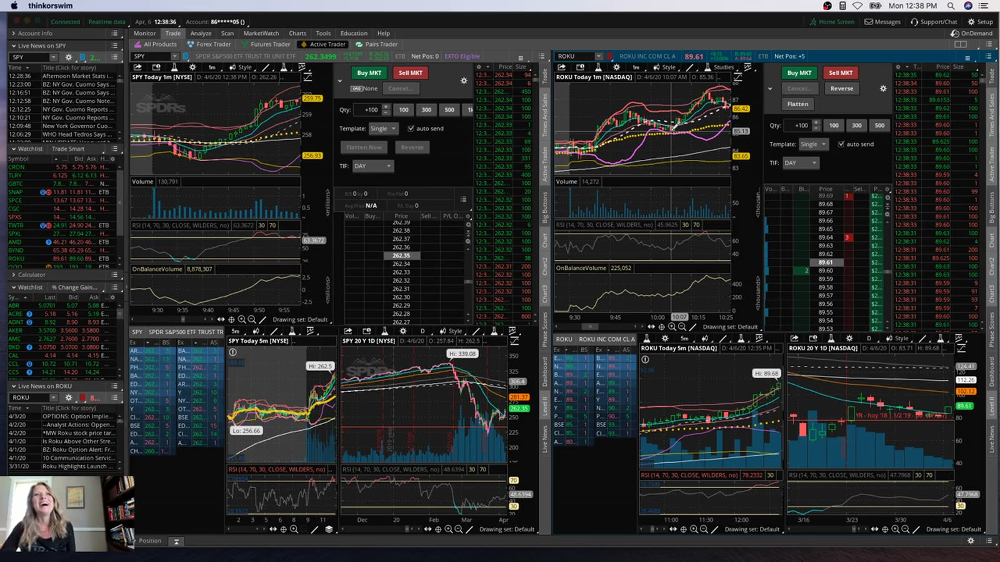

**图怎么看：**

- 入场发生在高波动大盘反弹期，讲者明确说不是 textbook setup。
- 尝试捕捉 market bottom 会引入整体市场 beta，不能只分析 ROKU。
- MACD 当时仍在测试，不应同时作为规则和事后解释。
- Tight stop 与 volatile regime 可能不匹配，需按 ATR/structure 校准。

**视频内容：** 这是上一段 ROKU swing 的 starter：大盘处在高波动反弹期，讲者明确承认它不是 textbook setup，并尝试捕捉市场底部。画面同时需要结合 ROKU 与整体市场，而不能只看个股线形。入场时 MACD 仍在测试，证据主要来自 market bounce 与价格结构；因此这笔应单独归为 beta/reversal 尝试，并用 ATR 或结构低点决定 stop。

**复盘：** 先把 `market-bounce trade` 与常规 stock-specific swing 分开；测试中的指标不进入 live decision。

## v0132：CBLI 与 YTEN

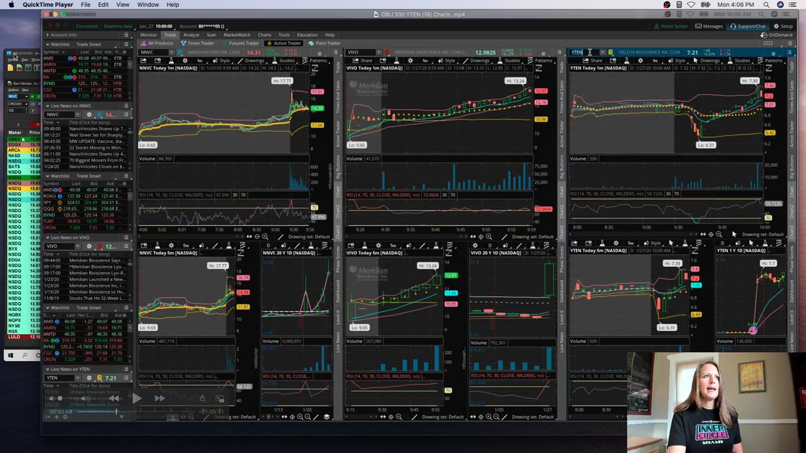

**图怎么看：**

- 市场因疫情新闻 gap down，biotech 与大盘股同时活跃。
- CBLI 在 5m volume ramp、gap 和 1m setup 下被观察。
- RSI 70 既被描述成 resistance 又可能是 strength，规则若不明确会双向解释。
- 两只标的一天内先后交易，应核对是否同一 theme 暴露。

**视频内容：** 疫情新闻导致大盘 gap down 时，CBLI、YTEN 等 biotech 同时活跃。视频先用 CBLI 的 5m volume ramp、gap 与 1m setup 筛选，再切换/比较 YTEN；两只股票可能共享同一新闻主题。讲解中 RSI 70 有时被当成阻力、有时又代表强势，因此复盘必须在 entry 前固定它的角色，否则同一读数可以为买入和回避同时背书。

**复盘：** 写清 RSI 70 究竟是 entry filter、avoid zone 还是 exit；同一天不能随结果改变定义。

## v0133：不用 Active Ladder 的 ToS 下单

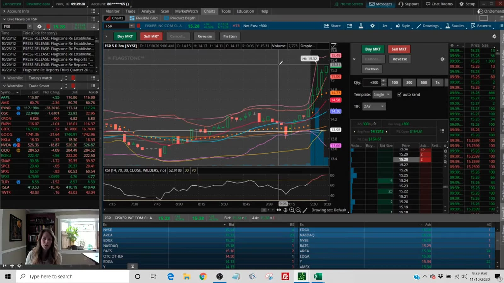

**图怎么看：**

- 画面专门演示在 FSR 快速变化时右键 `Buy`，而非用 ladder。
- 这是录制期 UI，当前菜单与默认订单可能不同。
- 右键更简单不等于更安全；仍要核对 order type、quantity、limit、TIF 与 account。
- 为演示平台而接受不满意的 entry 不应发生在真钱交易。

**视频内容：** FSR 快速变化时，讲者专门演示不使用 Active Ladder，而在 Thinkorswim 图表/报价上右键选择 `Buy`。画面步骤是打开订单入口、检查数量与价格、发送，再观察回报；它属于平台操作演示，不是 FSR setup 教学。录制期 UI 可能已变化，而且为了展示按钮而勉强接受 entry 会污染真钱决策，因此同样流程应先在模拟盘验证。

**复盘：** 操作教学全部在 sim 录制；live 日不为展示功能改变 entry。

## 共同结论

- 多周期指标高度相关；
- Price structure 应先于 RSI；
- 账户限制不能成为持有 loser 的理由；
- 日内转 swing/trend 必须建立新计划；
- 新平台和新订单方式先在 sim；
- 百分比日收益和课程人物金额不作为目标；
- Broker statement 是最终成交证据。
