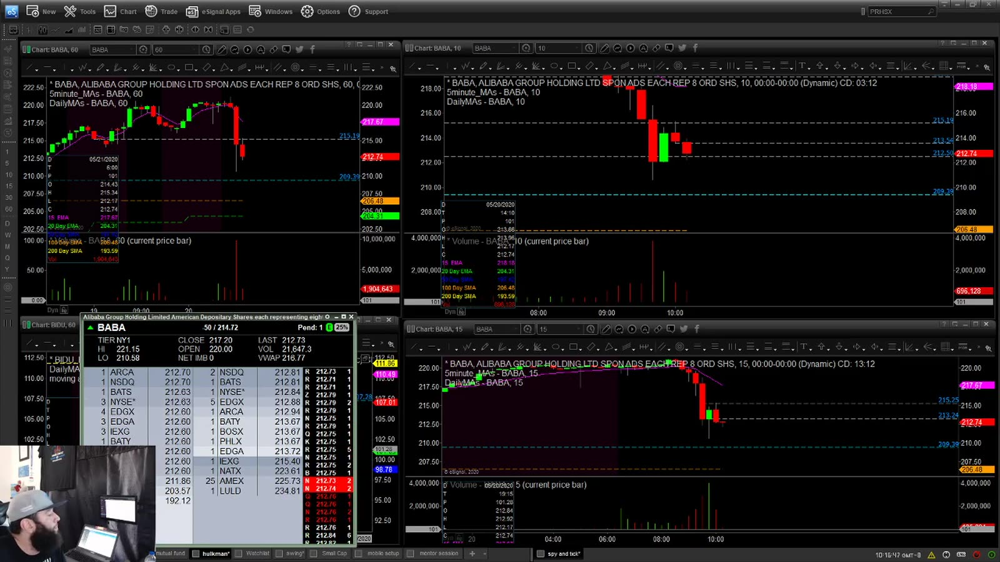
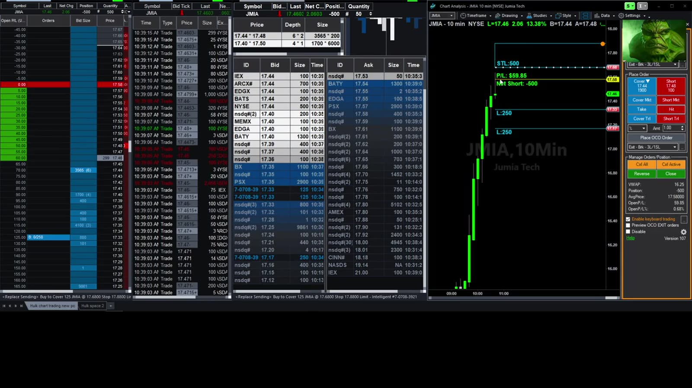
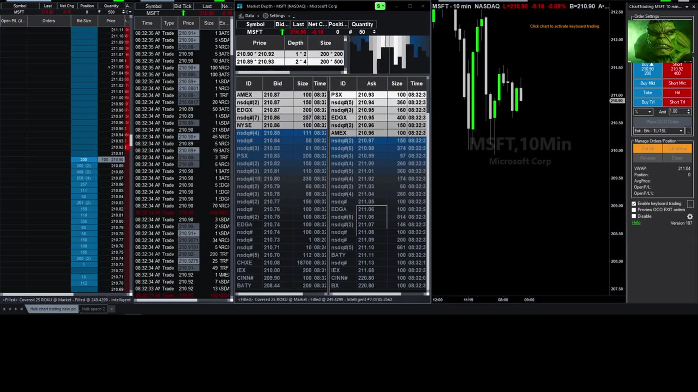
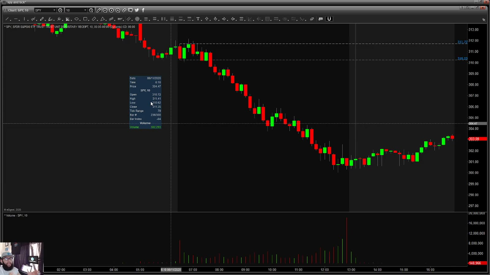
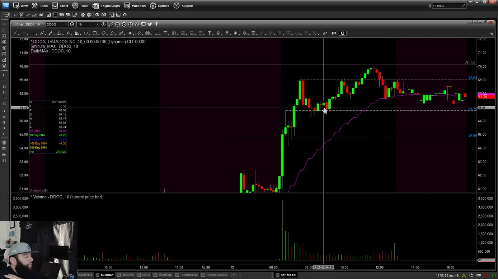

# Live Review 03：Hulk Large-Cap Examples

> 对应视频：v0134–v0138，共 5 段
> 这些案例更接近 large-cap/ETF 的 level-based trend trading。它们保留在 Small Cap Live Archives 的原始系列位置，但阅读时应与 small-cap momentum 分开统计。

## v0134：BABA important numbers



**图怎么看：**

- 左侧 depth/prints 与右侧 BABA chart 共同用于观察重要水平。
- 整数、前高、日线 pivot 可能重叠，但都是同一 price structure 的表现。
- Large-cap depth 较厚时，目标通常不是 small cap 式瞬间多美元 squeeze。
- Entry 前需标 market/China-tech sector context。

**复盘：** 区分 anticipation、trade-through 和 retest；统计每种在 important number 附近的实际 slippage。

## v0135：JMIA setup walkthrough



**图怎么看：**

- 画面展示快速冲高后的 chart 与 Level 2，属于 momentum/level 结合。
- JMIA 的波动可能介于典型 large 与 small cap 之间，不能仅按 ticker 固定分类。
- 大 candle 后 entry 到最近结构 low 的风险可能很宽。
- 静态截图需配合当时 catalyst 与 float/liquidity。

**复盘：** 用 ATR、spread 和 stop distance 决定 size；不要用 “large-cap trader” 标签假设低风险。

## v0136：MSFT trade analysis



**图怎么看：**

- MSFT depth 通常更厚，右侧 chart 的小幅 move 也可用较大股数表达。
- 更大股数带来 notional、sector beta 与 execution exposure。
- Level 2 中大量报价不会自动给方向；重点仍是 market/sector 与 key level。
- 每股 stop 较小不代表总风险小。

**复盘：** 同时记录 shares、notional 和 beta-adjusted exposure，避免只看每股风险。

## v0137：SPY ETF 在市场关闭消息中的交易



**图怎么看：**

- 图中出现快速下跌后恢复，属于宏观消息驱动而非公司特定 setup。
- ETF 同时反映大量成分股和衍生品流，普通 stock catalyst 模型不适用。
- Closure/政策消息期间 headline 更新快，stop 可能遭遇 slippage。
- SPY 的高流动性降低部分执行风险，但方向仍可瞬间反转。

**复盘：** 将 macro-news ETF trades 单独分桶，并保存原始新闻发布时间与 entry latency。

## v0138：DDOG trade review



**图怎么看：**

- 图中急涨后在高位保持，短均线追上，展示 trend continuation context。
- Gap origin、premarket high 和 VWAP 是主要参考，不只是 candle 颜色。
- 趋势股可能给更长 hold，但 earnings/news 造成的 IV 与 gap 也更大。
- 复盘日期固定在 2020 市场，不能直接外推当前流动性。

**复盘：** 对比 breakout scalp 与 trend hold 的 exit，判断提前止盈是否削弱 average winner。

## 五段案例的统一框架

```text
macro/sector
→ catalyst
→ daily level
→ intraday structure
→ exact trigger
→ notional-aware size
```

这五段最有用的地方，是展示不同 instrument 需要不同速度、目标和 exposure 管理；它们不应与低 float halt strategy 混成一个胜率。
