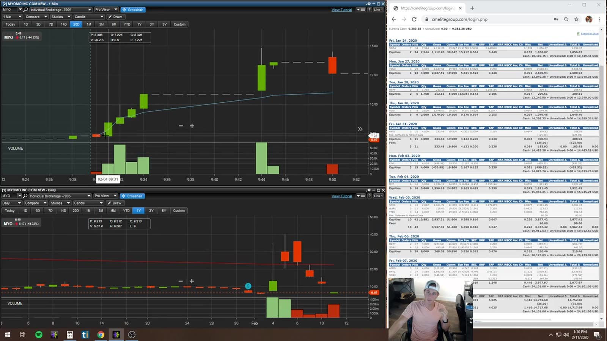
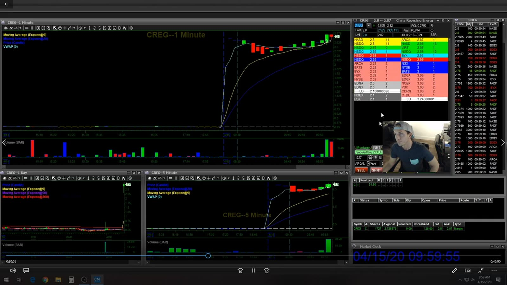
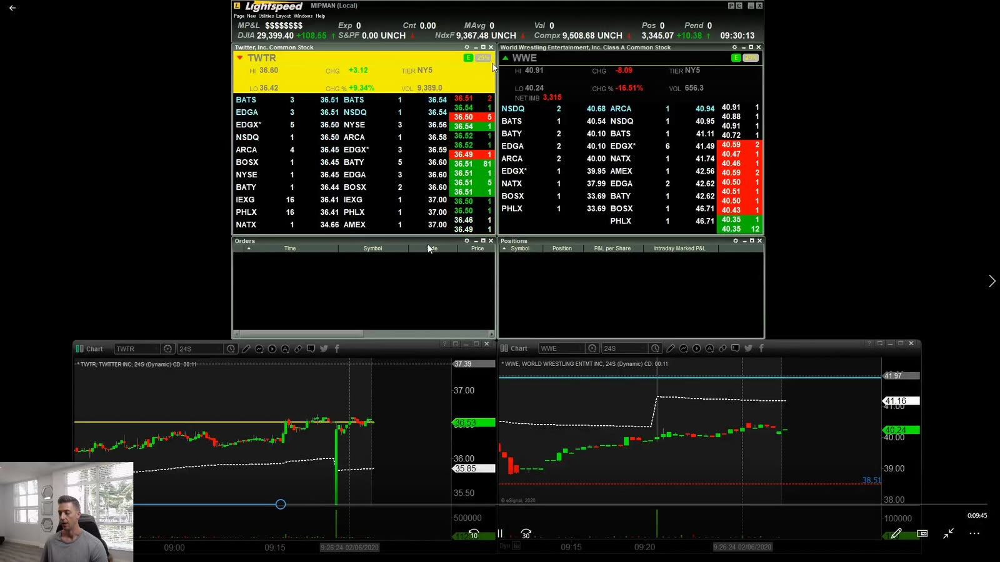
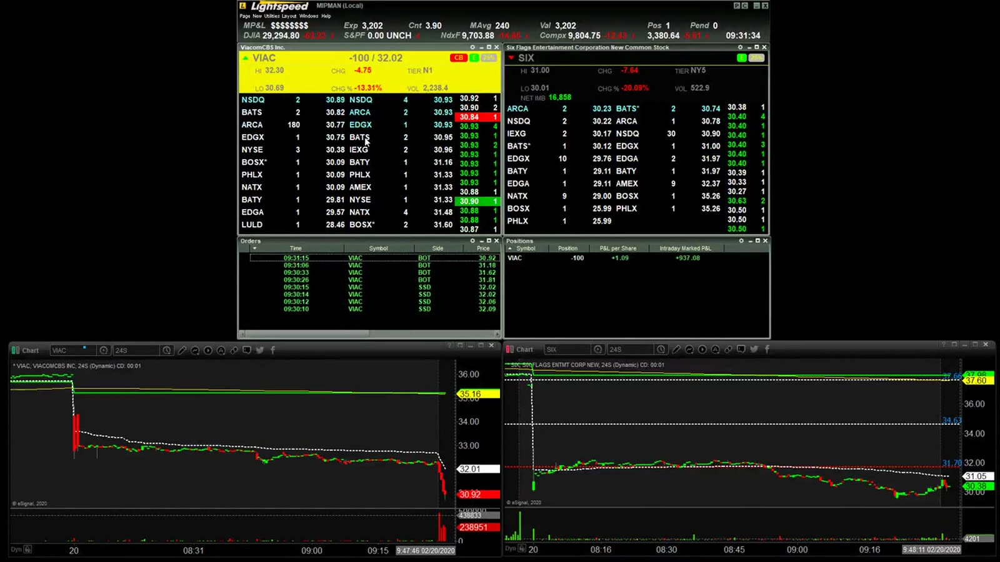

# Live Review 04：Jess and Mike Examples

> 对应视频：v0139–v0142，共 4 段
> 重点：使用 broker statement 对账、把高速 momentum 与 large-cap/VIAC 这类较慢走势分开。

## v0139：Jess live trading 与成交对账

**图怎么看：**

- 左侧 chart 标出 entry/exit，右侧是详细成交/账户记录。
- Chart 标记必须由真实 fills 生成，不能用理想 candle price 代替。
- 多次 partial fill 应计算加权平均，而不是挑最好的一笔。
- Statement 可能包含 account identifiers；公开资料需脱敏，但本图未保留可登录凭据。

**复盘：** 以 statement 为 source of truth，重算 gross、fees、net、shares、hold time 和 slippage。

## v0140：Jess intermediate / CREG

**图怎么看：**

- CREG 短周期上行并在高位整理，旁边是 depth 和 prints。
- Momentum 已经扩张后，entry 需要 pullback/flat-top 结构，不能只因涨幅榜排名。
- 图中多周期来自同一价格，不能算多个独立确认。
- Intermediate 的真正门槛是能处理 partial fill、false break 与 changing spread。

**复盘：** 标出第几次 pullback、到 VWAP/日线阻力的距离，以及 breakout 后接受时间。

## v0141：Mike 多标的 large-cap 观察

**图怎么看：**

- 多个 large-cap chart 同时显示，走势幅度比低 float momentum 更慢。
- 多标的同时打开会产生 market/sector correlation；并非四个独立机会。
- 先选 primary candidate，再把其他图作为 relative-strength 参照。
- 高频切换 symbol 增加错单风险。

**复盘：** 对每笔记录 market、sector、relative strength 与当前激活窗口；设 symbol confirmation。

## v0142：VIAC 约 1k 案例

**图怎么看：**

- 源视频音轨是数字静音，因此本段只按可见图表、文件标题和可验证市场结构整理，不补写讲者意图。
- 图中价格沿均线/水平位移动，属于相对更慢的 trend/level trade。
- 标题金额不说明风险；`$1k` 对不同 account/size 含义完全不同。
- VIAC/公司事件与 sector context 应在入场前核验。
- Large-cap 也会因 headline 发生 gap，不能只依赖技术线。

**复盘：** 用 R multiple、notional、MAE/MFE 代替金额比较，避免被受访者 P&L 误导。

## 共同结论

- Statement 优先于手画标记；
- Jess 的 small-cap speed 与 Mike 的 large-cap节奏分开；
- 多屏不等于多 edge；
- 金额标题全部换算成 planned/realized R；
- 每个 workspace 都要防 symbol/account 错误。
