# Live Review 05：Other Examples A

> 对应视频：v0143–v0164，共 22 段
> 阅读重点：这些 archive 跨不同年份、平台与 market regime。标题金额只作定位；评价统一换成 entry、risk、fill、R multiple 与 rule adherence。

## v0143：DRYS

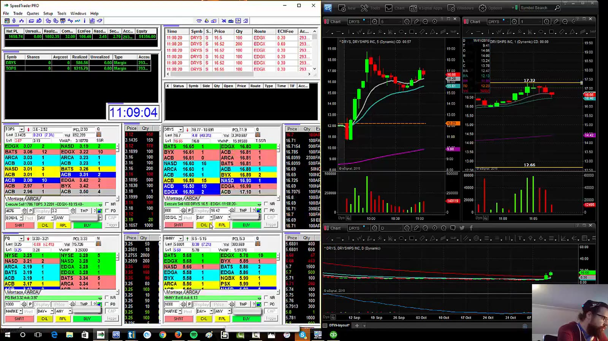

**图怎么看：**

- 旧版 Level 2、Time & Sales 与多周期 chart 说明这是历史执行环境。
- DRYS 等历史高波动标的经历 corporate actions，旧 chart 不能与当前名义价格直接比较。
- 突破后回撤幅度大，固定股数/固定美分 stop 不适用。

**视频内容：** 画面不是单张收盘图，而是旧 SpeedTrader Pro 中的完整执行工作区：左侧持仓/订单、下方多组 Level 2，右侧同时保留短周期与较长周期走势。DRYS 已先完成一段陡峭拉升，随后在高位出现实体回撤并再次尝试抬高；因此可学习的不是“看到涨就买”，而是如何在已经延伸的股票上区分首次整理、二次突破和趋势已经衰竭。

**复盘：** 核验 split-adjusted data、当时 catalyst 与真实 fills；不从存活到今天的 ticker 状态推断旧行情。

## v0144：2019-05-10 多标的早盘

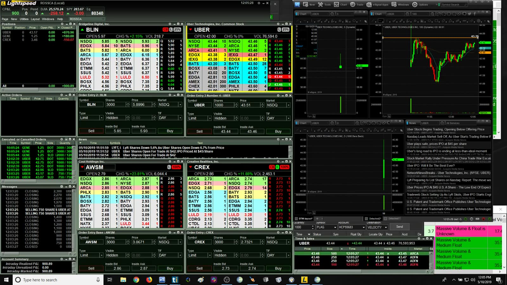

**图怎么看：**

- 同时监控 IPO/小盘候选，右侧图显示急跌后恢复和高位整理。
- 时间戳标题没有策略说明，不能凭结果给它补一个 setup。
- 多窗口切换增加错 symbol 与过度交易风险。

**视频内容：** 保留画面可确认 watchlist 同时包含 BLIN、UBER、AWSM、CREX 等标的：有的刚从低位直线拉升，有的已出现冲高回落，有的仍在低位横盘。这个 session 的学习点正是开盘时如何在不同阶段的候选中做优先级，而不是把 scanner 上所有绿色股票都当作同一类机会。复盘时应把“只是观察”“挂过订单”“实际成交”三种状态拆开。

**复盘：** 从成交记录逐笔重新贴 setup；无法贴到预定义规则的交易归为 discretionary/other。

## v0145：ATAI ABCD scalp

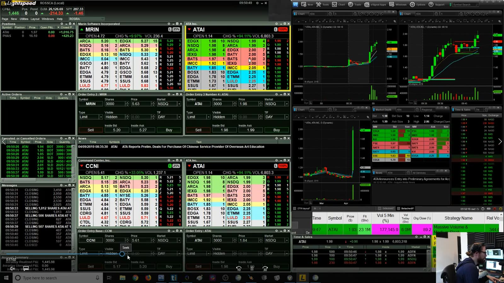

**图怎么看：**

- ATAI 图出现 impulse、pullback 与再上攻，符合 ABCD/continuation context。
- 标题的 scalp 金额不表示标准仓位。
- 同时观察 MRIN 可能分散对 primary trade 的执行注意。

**视频内容：** 画面中 ATAI 已有一段 impulse，随后横向/回撤整理并再次接近前高；MRIN 则处于不同的上升阶段。ABCD 不能只在事后把四个点连起来：A 是起涨基点、B 是第一次高点、C 必须在 A 上方形成可防守低点，只有重新突破 B 才进入 D 段。Scalp 的核心是 C 点失效时立即退出，而不是等待全天趋势证明自己。

**复盘：** 标 A/B/C、entry、C-low invalidation，并计算 scalp exit 与持有到 D 的差异。

## v0146：AKTX 开盘半整数位 scalp

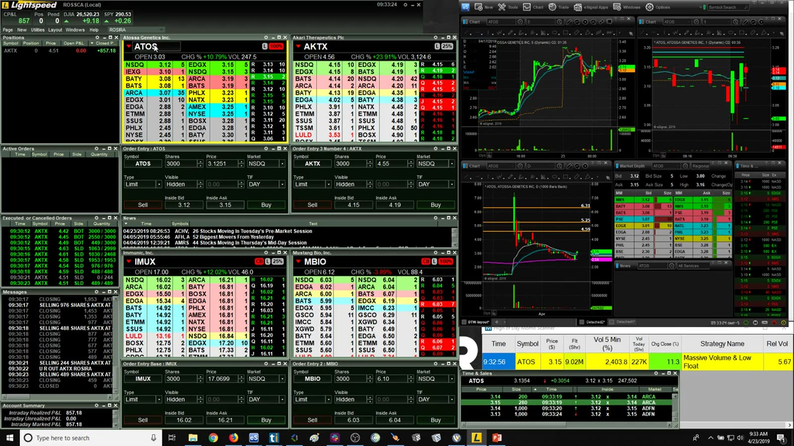

**图怎么看：**

- AKTX 早盘快速上行并在关口附近波动。
- “Half-dollar out of the gates” 同时暴露于开盘 spread 和心理价位假突破。
- 右侧多个大 candle 表明 entry 到结构 stop 可能远于名义半美元位。

**视频内容：** 同屏的 ATOS、AKTX、IMUX、MBIO 处在不同走势阶段，AKTX 是围绕开盘后半整数位的快速触发。这里的 half-dollar 只是订单触发参考，不是支撑保证：若从 `$x.50` 上方买入，真正的 invalidation 仍应来自最近 micro low；若 micro low 太远，就要缩股数或跳过，而不是硬套几美分止损。

**复盘：** 单独统计开盘前 5 分钟，加入 spread、slippage 与 first-halt exposure。

## v0147：CNR squeeze halt（副本 1）

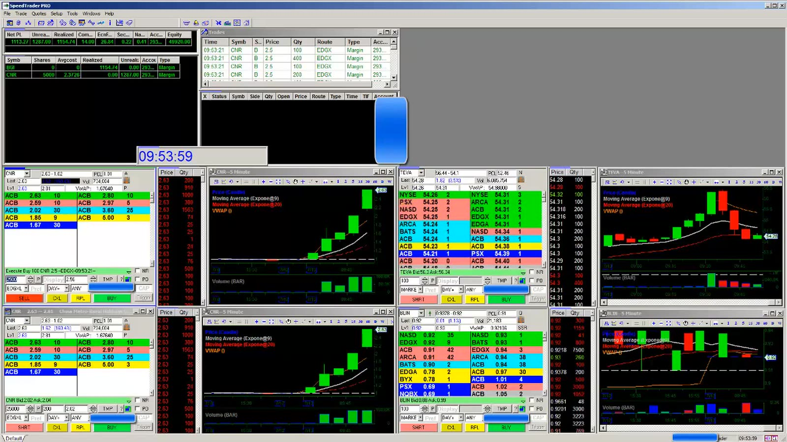

**图怎么看：**

- 源文件没有音轨，本段只能按屏幕和标题复盘。
- 价格垂直扩张并进入 halt，Level 2 不能代表恢复后的 depth。
- 买入 halt 前无法用普通 stop 管理下一跳。
- 标题重复提示这可能与下一段为同一源。

**视频内容：** 旧平台画面显示 CNR 的 Level 2、Time & Sales 与多周期图同步冻结在 squeeze/暂停附近；订单窗口仍可看到此前成交，但没有连续报价可用于退出。由于没有音轨，不能还原讲者的口头 entry 理由；能确定的学习内容只有停牌前的垂直扩张、暂停期间订单不可控，以及恢复后盘口会重新建立。

**复盘：** 与 v0148 做 hash/内容去重；即使重复，最终资料只把它当同一案例的两个来源记录。

## v0148：CNR squeeze halt（副本 2）

**图怎么看：**

- 这个副本同样没有音轨，不能从口述确认任何 entry/exit 理由。
- 界面、时间与价格结构与 v0147 高度相似。
- 重复视频不能在样本统计中计两次，否则夸大该 setup 权重。
- 恢复价、partial fill 和 halt duration 才是关键。

**视频内容：** 第二份画面与 v0147 的时间、CNR 价格、订单列表和 K 线形状一致，说明它更像同一事件的重复剪辑，而非第二个独立交易。学习时只需用它交叉确认 UI/订单状态，不应因为有两个文件就把“停牌 squeeze 成功率”增加一个样本。

**复盘：** 样本表设置 `duplicate_group=CNR-halt`，只保留一条 expectancy 记录。

## v0149：DXR class example

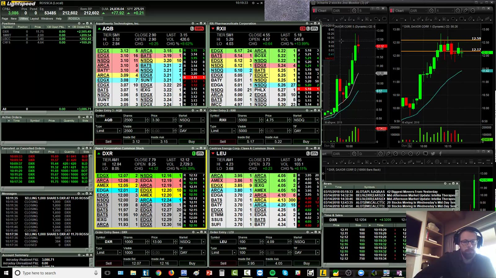

**图怎么看：**

- DXR 图显示大幅扩张后的整理，旁边仍有其他候选。
- Class example 可能选择了教学上清楚的片段，存在 selection bias。
- 高位 continuation 必须标第几次 pullback。

**视频内容：** 画面同时显示 ACR、RXI、DXR、LEU；DXR 主图已从低位拉出大阳段，随后高位收窄，右侧/下方较长周期用于判断上方历史空间。课程片段应按“扩张—第一次整理—再测试”读，而不是看到高位横盘就自动判定 bull flag。若整理低点不断下移或回到起涨区，continuation thesis 已经改变。

**复盘：** 补入同日未成功 breakout；只用精选 winner 无法估计胜率。

## v0150：Day 134

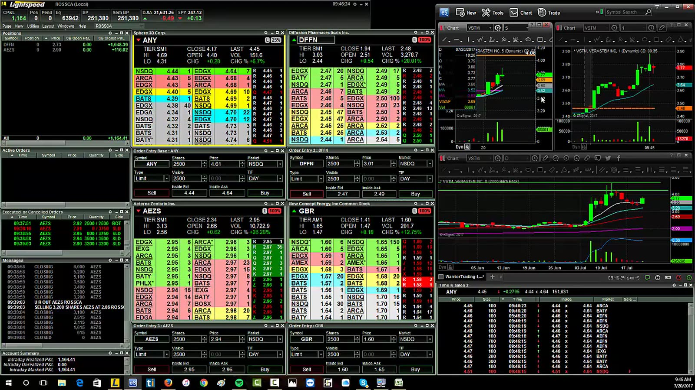

**图怎么看：**

- ANY 出现快速拉升并在高位整理，其他图走势不同。
- 文件名只有 day number，没有清楚策略；应从成交重建，而不猜测。
- Session-level recap 要区分各 ticker 的独立 risk。

**视频内容：** 关键帧可确认 ANY、DFFN、AEZS、GBR 同时在工作区中：ANY 有冲高后的高位平台，DFFN 与 AEZS 的短周期斜率/位置不同，GBR 则接近另一种突破结构。Day 134 因而是多标的选择与切换案例，不能写成 ANY 单票教程。逐笔复盘要说明为何从一只切到另一只，以及切换时前一笔风险是否已经关闭。

**复盘：** 按时间排序所有 trades，标出第一笔后 size/P&L 是否影响后续决策。

## v0151：历史多标的 momentum

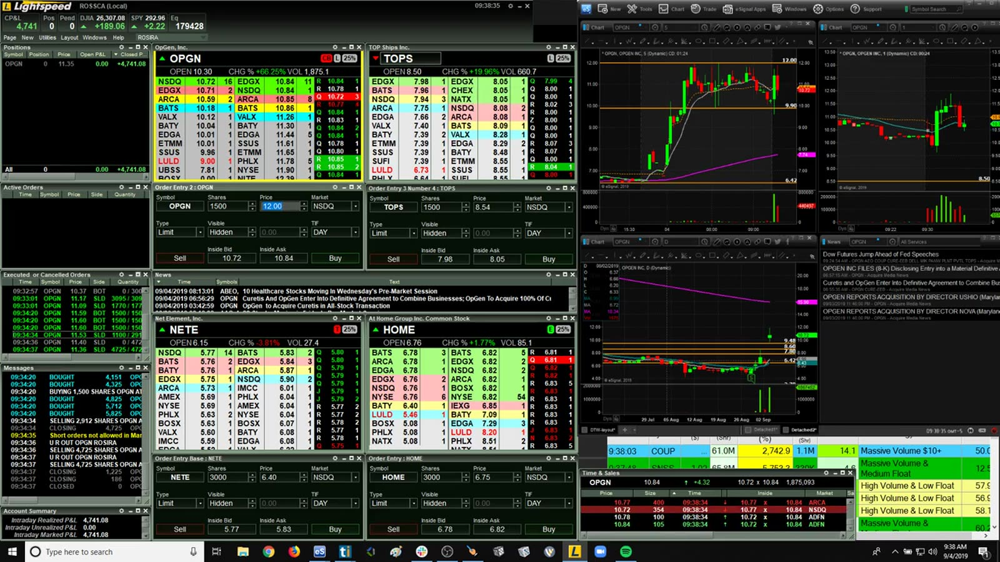

**图怎么看：**

- 源文件名不具描述性，画面显示多个旧 small-cap momentum ticker。
- OPGN 已经扩张后横盘，追价需要上方空间和明确 low。
- 旧平台与旧佣金环境会改变 scalp 的净收益。

**视频内容：** 画面明确列出 OPGN、TOPS、NETE、HOME，并保留订单/成交列表。OPGN 已经过第一段扩张，TOPS 的图形处于另一阶段，NETE/HOME 更多像同时监控的候选；因此本段能训练“同一屏不等于同一 setup”。只有 broker fills 能证明实际交易了哪一只，不能把所有可见 ticker 都算进策略结果。

**复盘：** 不根据文件名生成故事；用实际 symbol、fills 和 fees 建档。

## v0152：LYFT IPO

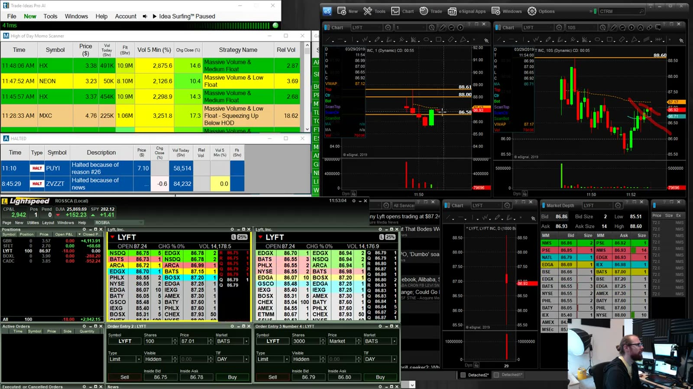

**图怎么看：**

- IPO 初期历史图短、price discovery 强，传统日线水平有限。
- 图中急跌与反弹表明首日/早期波动两向都大。
- IPO order behavior、halt 与可借股状态可能特殊。

**视频内容：** 画面中 LYFT 的多周期图缺少成熟的日线历史，短周期先快速下探、随后出现反抽；上方还有停牌/状态列表与其他候选。这里展示的是 price discovery，而不是常规“历史阻力突破”：开盘价、发行价、首个 range、VWAP 和当日新形成的 high/low 比多年图形更重要。

**复盘：** 记录 IPO age、首日 high/low、发行价、float、spread；不与成熟 large cap 混合。

## v0153：两只股票合计亏损案例

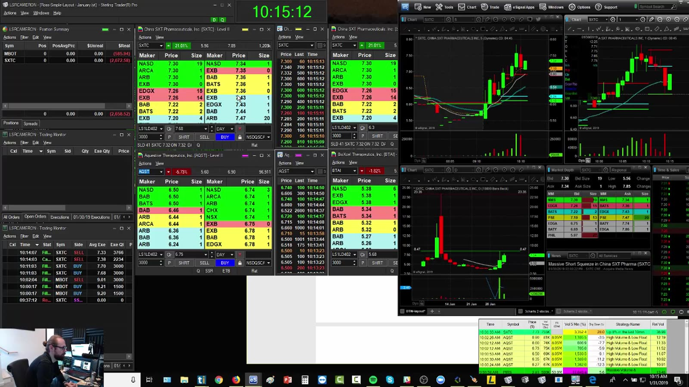

**图怎么看：**

- 多个图同时出现快速扩张与回落，标题明确是亏损案例。
- 亏损样本比 winner 更适合检查追价、重复尝试和 market regime。
- 单看结束截图无法区分正常 stop 与违规扩大 stop。

**视频内容：** 关键帧显示 NBY 等候选在直线拉升后快速回落，另外几张图也存在长上影、失败突破或回到均线下方的结构；成交/订单面板说明这是多笔而非一根 K 线的结果。学习时要逐笔还原“第一次突破失败后是否重进、第二次 entry 是否仍有新结构、两只股票是否共享同一弱 momentum 环境”。

**复盘：** 分解每笔 planned loss、actual loss、slippage、re-entry 次数；不要只写总额。

## v0154：大额亏损日

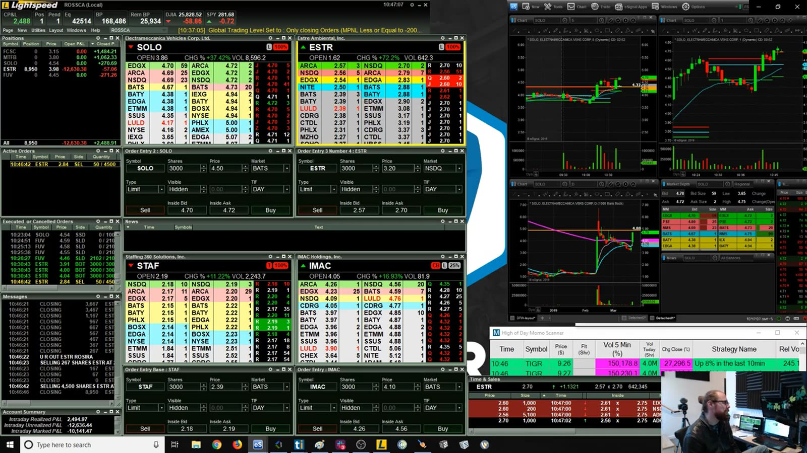

**图怎么看：**

- 同时交易多只 high-volatility 股票可能形成相关 momentum exposure。
- 账户 P&L 大并不说明 market “欠反弹”。
- 如果总损失超过预设 daily stop，后续每笔都应标 rule violation。

**视频内容：** 同屏可确认 SOLO、ESTR、STAF、IMAC 等多只高波动股票；有的已走出陡峭上升后回落，有的在低位突然放量。大额亏损日需要沿时间线看：最初是正常 breakout loss，还是在多个 mover 间连续切换后逐步放大；是否在某一只上反复尝试；daily stop 触发后还有多少订单。只比较开盘和收盘 P&L 会丢掉真正的失控点。

**复盘：** 建时间线：何时触及 warning、daily stop、继续交易原因以及若当时停止的差异。

## v0155：带讲解的 winner

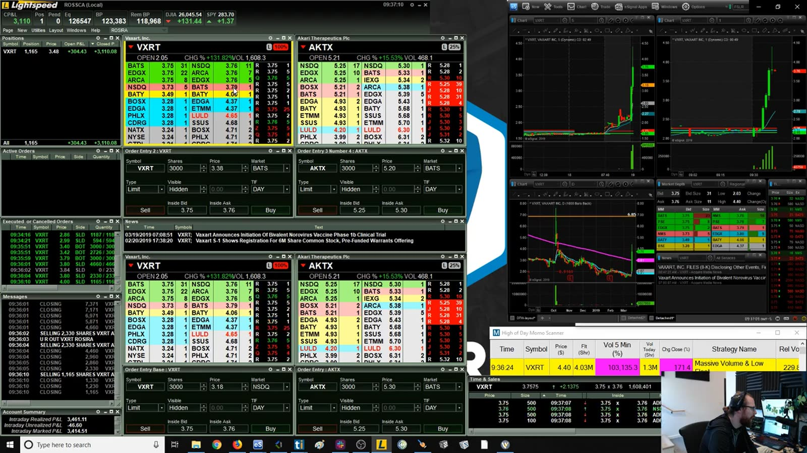

**图怎么看：**

- 画面展示强势 pullback/continuation，与同步讲解结合。
- Narration 可能改变执行注意和交易行为。
- Winner 金额不展示未成交/滑点和同日其他风险。

**视频内容：** 画面主要是 VXRT 与 AKTX：两者都出现快速扩张，但所在阶段不同，一只在高位横向消化，另一只仍在推进/回撤。同步 commentary 的价值是能把 entry 前观察、成交时反应和事后解释分开；复盘应把讲者在突破前说出的价位与后面真正成交的价位对齐，而不是只摘取最后成为赢家的那段。

**复盘：** 对照讲解前写的计划，区分实时 prediction 与事后 explanation。

## v0156：三只股票组合结果

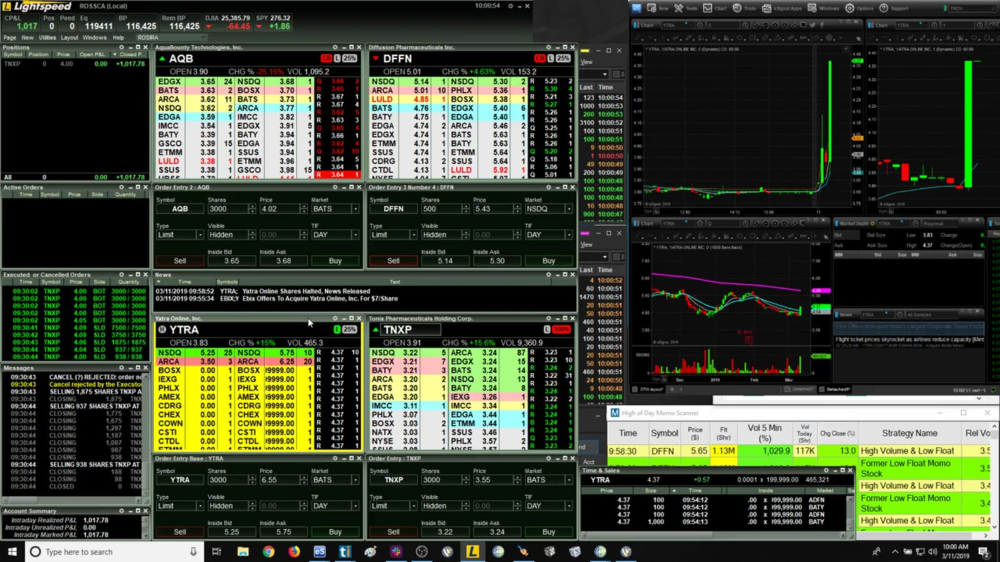

**图怎么看：**

- 多笔结果汇总可能掩盖某一笔大 winner 覆盖其他 loser。
- DFFN 出现垂直 move，单次异常可支配日收益。
- 不同 setup 不应因同一天交易而合并。

**视频内容：** 关键帧中的 ticker 是 AQB、DFFN、TYRA、TNXP，而不是泛称“三只相同股票”。DFFN 有最明显的垂直段，AQB/TYRA/TNXP 的图形和成交深度不同；因此日结果很可能由个别 outlier 主导。要分别重建哪只是 breakout、哪只是 dip/continuation、哪只只是 watchlist，才能判断收益来自规则还是单一异常行情。

**复盘：** 每票计算 R 与 expectancy，再汇总；报告 profit concentration。

## v0157：15 秒 scalp

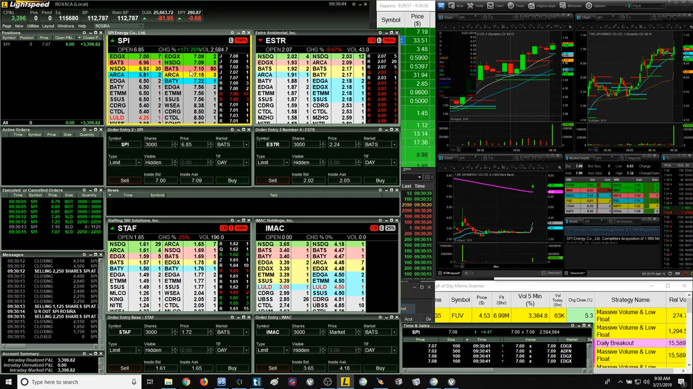

**图怎么看：**

- 15 秒持仓高度依赖 alert-to-order latency、hotkey 和实际 depth。
- Chart candle 无法展示秒内成交顺序。
- 极快 winner 对 simulator fill assumptions 很敏感。

**视频内容：** 画面显示 SPI、ESTR、STAF、IMAC，SPI/相关主图在极短时间内穿越多档报价；所谓 “15 秒” 包含发现信号、发单、可能的 partial fills、卖出和确认仓位归零。分钟 K 线只把这些压成一根柱，无法证明在柱底买、柱顶卖。学习时应把它视为执行能力案例，而非可仅凭形态复刻的 setup。

**复盘：** 保存逐笔 timestamps、expected/actual fill、fees；无法复现这些数据就不作为普通学习者 setup。

## v0158：从潜在亏损到小赢

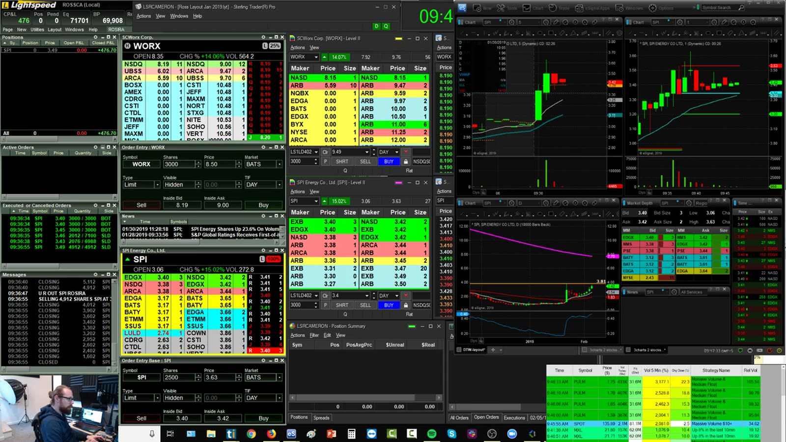

**图怎么看：**

- 价格先不利后恢复，最终小赢不能证明 holding loser 正确。
- 应比较当时是否仍守住原 invalidation。
- “转赢”结果最容易强化扩大 stop 的坏习惯。

**视频内容：** WORK 与 SPIN 同屏，主交易先出现不利回撤，之后才重新走强并形成较高价格。决定质量的分界点是回撤时有没有穿过入场前写下的结构 low：若没有，持有属于执行计划；若已经穿过而未退出，后来的恢复只是幸运。把这两个路径区分开，才能避免把 “hold and hope” 学成策略。

**复盘：** 若 price 曾破 stop，这笔按规则应记 loss；后续恢复只作 counterfactual，不改 decision grade。

## v0159：连续 circuit-breaker halts

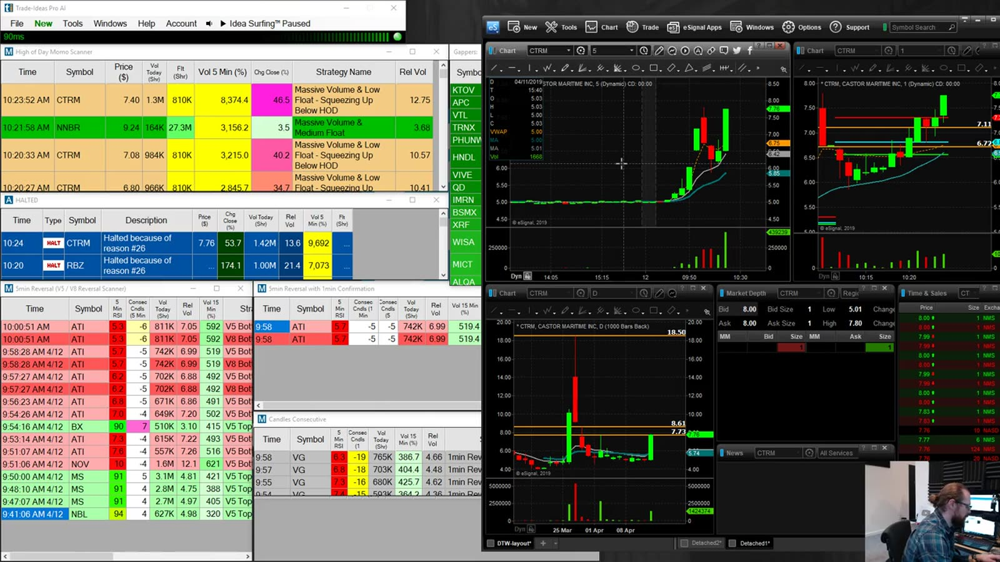

**图怎么看：**

- 多次 halt 造成离散价格路径，订单状态和 chart 都可能滞后。
- 连续向上 halt 也可能突然向下恢复。
- 标题结果说明大额盈利不消除 tail risk。

**视频内容：** 画面中的主 ticker 是 CTMR，左侧状态/扫描窗口连续记录 `Halted because of ...` 与恢复事件，右侧 K 线由多次离散跳跃组成。它不是平滑突破：每一次 resume 都会重新形成 bid/ask，上一段可见的盈利和止损位不能保证下一段仍可成交。学习重点是按 halt 编号记录仓位，而不是把整条阶梯式上涨当成一笔连续 trend。

**复盘：** 单列 halt count、每次 resume gap、可退出时间与最大理论亏损。

## v0160：ZKIN Gap & Go

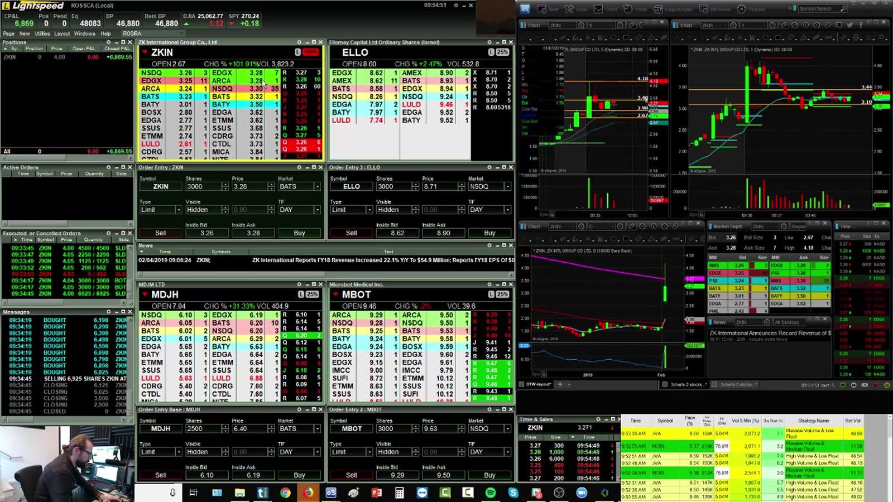

**图怎么看：**

- ZKIN 在开盘后沿短均线上行，出现多个 pullback。
- 最早 entry 与后段追高风险完全不同。
- Gap & Go 需补 catalyst、premarket volume 和 daily room。

**视频内容：** ZKIN 是主图，ELLO、MDJH、MBOT 等同时出现在候选窗口。ZKIN 先完成开盘推进，随后沿短均线形成数次回撤与再测试；first pullback 的 C 点清楚，后面的 pullback 已接近 late-stage。视频应按每一次触发分别学习：开盘第一段、第一次有序回撤、再次突破，以及动能减弱后的追高，不应只写“全天上涨”。

**复盘：** 标第一/第二/后续 pullback 的独立结果，避免用全天趋势证明任一 entry。

## v0161：Day 133 亏损

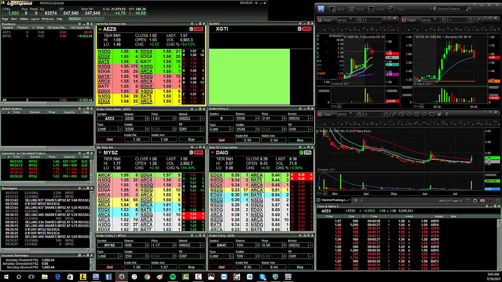

**图怎么看：**

- 一只股票急涨，另一只可能下跌，说明 market 不统一。
- 总亏损应拆成 setup loss 与 context-switching cost。
- 日编号本身不提供交易逻辑。

**视频内容：** 画面可见 AEZS、XGTI、MYSZ、DAIO：部分标的在前高附近失败，部分从低位突然拉升，走势并不同步。Day 133 的学习重点是一个亏损 session 中如何处理 scanner 不断给出新 mover：每一次切换都必须重新检查 catalyst、range、stop 和剩余 daily risk；否则“新 ticker”只是继续交易的借口。

**复盘：** 统计每笔前是否已有计划、是否在前一笔情绪未恢复时进入。

## v0162：ITCI

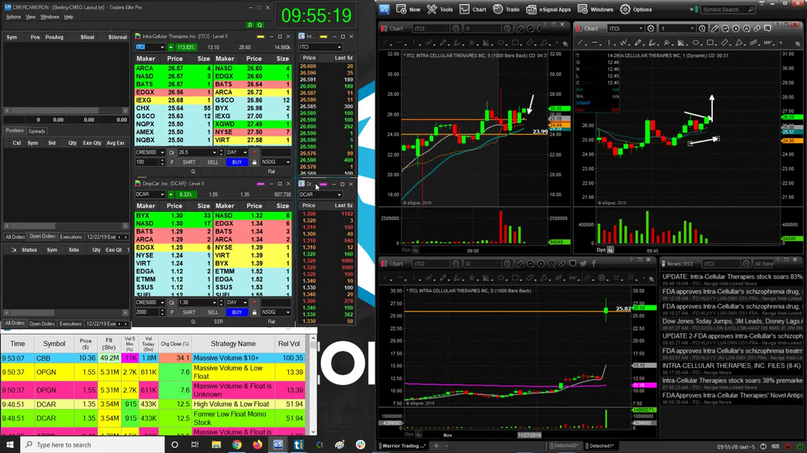

**图怎么看：**

- 主窗口同时出现异动股与多周期图，ITCI 结果金额较小。
- 小额 loss 仍可揭示 entry timing 或 spread 问题。
- 不因为金额小就跳过复盘。

**视频内容：** 文件以 ITCI 为定位，关键帧还保留 OPGN 等相关窗口和多周期图。金额很小并不意味着内容可以省略：要确认 entry 是在突破前预埋、突破时追单，还是回撤中试单；随后是形态失效、没有 follow-through，还是成交质量造成损失。只有把这条路径写清，小亏才是可学习的正常样本。

**复盘：** 将亏损换算 R；判断是正常统计 loss 还是 setup 不成立。

## v0163：OPTT 大额 loss

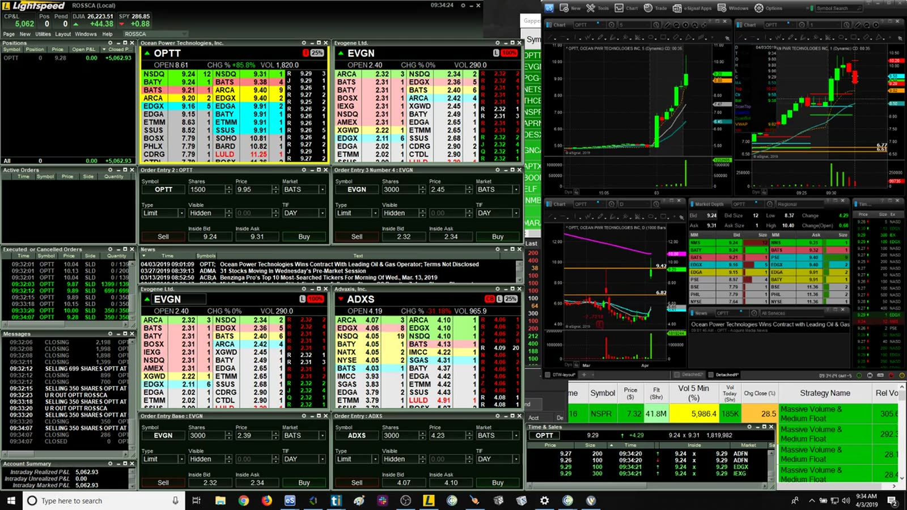

**图怎么看：**

- OPTT 先急涨后明显回落，属于容易追高和重复 dip 的路径。
- 多票同屏可能诱使从一个 loser 跳到另一个 mover。
- 大额 loss 需要检查 size 是否按 stop distance 缩减。

**视频内容：** OPTT、EVGN、ADXS 同时出现在画面，OPTT 主图先出现快速 impulse，再从高位明显回落；这类路径最容易产生首次追高、回撤加仓、反弹再加一次的风险叠加。复盘不能只标一个平均 entry，而要把每次 add 后的总股数、加权成本和到原 invalidation 的美元风险重新计算。

**复盘：** 重建所有 add，计算每次 add 后总 open risk；检查是否 average down。

## v0164：SES 与 BIMI 极端 squeeze

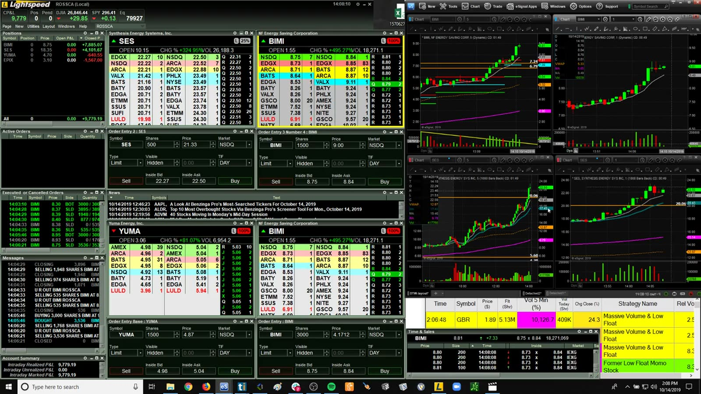

**图怎么看：**

- 两只股票都呈 parabolic move，普通 ATR/stop 参数失效。
- 百分比涨幅很大不等于可实现相同比例收益。
- Halt、wide spread 和 liquidity disappearance 是主要风险。

**视频内容：** 画面中 SES、BIMI、YUMA 等都出现大幅推进，SES/BIMI 的短周期图带有近乎垂直的段落和高位收窄。多只 parabolic mover 同时出现，会让交易者误以为任何回撤都会继续；实际上每一只的 halt 状态、spread 和可退出深度不同。应把当日看作一个拥挤的异常 regime，而非多个独立 A+ 样本。

**复盘：** 归入 `parabolic-regime`，从普通 Gap & Go 样本中剔除，并以最坏 resume gap 做 stress test。

## 本组结论

- 重复源只计一个统计样本；
- 无描述性文件名就从 fills 重建，不猜；
- 结果金额全部换算 R；
- Winner 也检查是否破过 stop；
- Halt、IPO、parabolic 与普通 momentum 分桶；
- Session 总额不能替代逐笔复盘。
