# Live Review 06：Other Examples B

> 对应视频：v0165–v0186，共 22 段
> 本组集中在 scalp、long/short 切换、bear flag、news 与 squeeze halt。核心问题不是最终金额，而是每次方向变化是否有独立触发。

## v0165：Win、loss、再到 larger winner

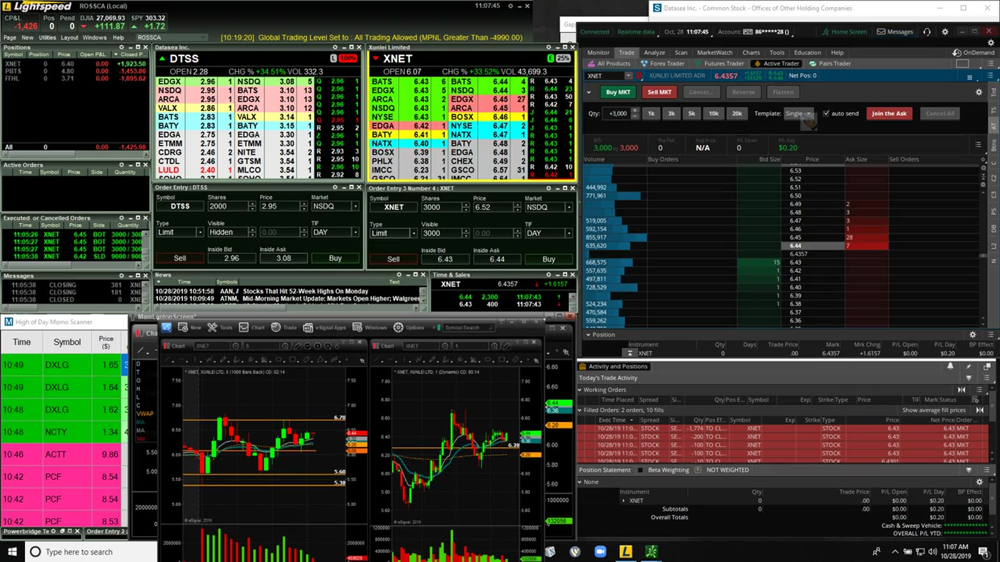

**图怎么看：**

- 一天内小赢、小亏、再出现较大 winner，展示 P&L 路径而非单笔。
- 第三笔不能因前两笔结果而改变 size，除非预先有 tier rule。
- 最终盈利会掩盖中间是否 revenge trade。

**复盘：** 对每笔单独打 decision grade；移除最终结果后再评价第三笔是否仍应做。

## v0166：2018-11-14 session

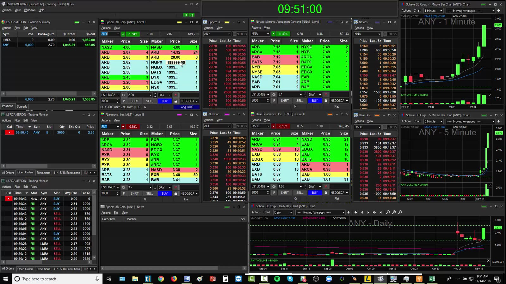

**图怎么看：**

- ANY chart 呈现急涨和高位整理，文件名只有日期。
- 旧市场、旧佣金和旧平台影响短线净收益。
- 高位横盘可同时演变为 continuation 或 failed breakout。

**复盘：** 只用当时可见 high/low 定两套 scenario；不因后续方向重写。

## v0167：2019-02-05 session

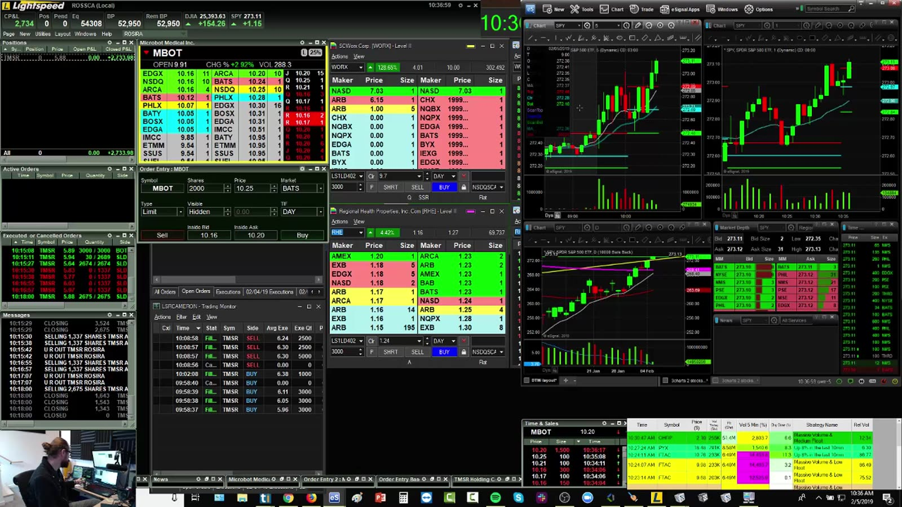

**图怎么看：**

- MBOT 多周期显示强势 move 与回撤，其他候选也活跃。
- 日级 archive 应识别 profit 是否集中在一个 symbol。
- 同时多次报警不等于多个 independent setup。

**复盘：** 报告 top ticker contribution、trade count 与重复 entry 次数。

## v0168：2017-02-07 session

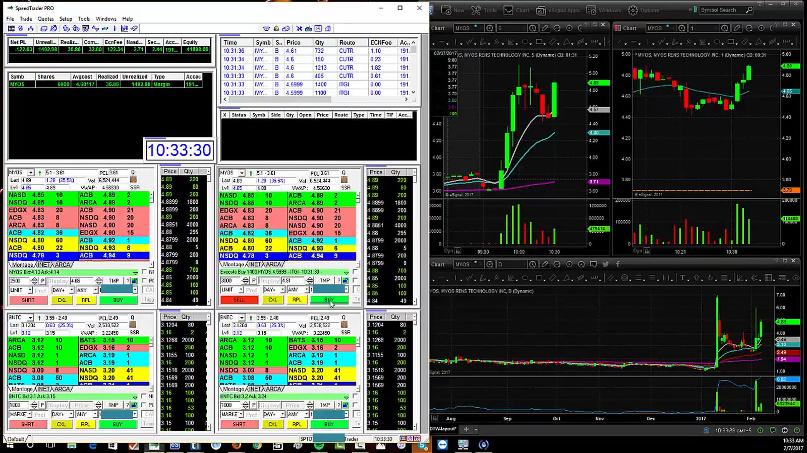

**图怎么看：**

- 旧界面与成交环境说明样本距今较久。
- 右图 breakout 后立即大幅波动，K 线回测会低估执行难度。
- 缺少描述性标题时不能推断 catalyst。

**复盘：** 标记 `historical-platform`；仅保留结构学习，不用其 fees/fill 估计当前表现。

## v0169：2017-02-08 session

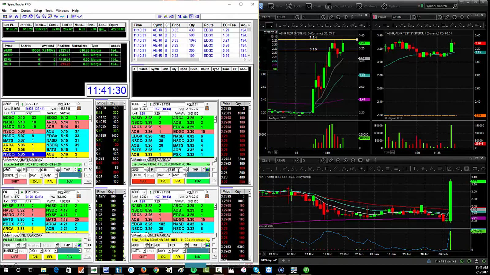

**图怎么看：**

- 价格先大幅上行再横盘，典型 late-stage continuation 候选。
- Late-stage entry 与 first pullback 分开。
- 旧数据可能经过 split adjustment。

**复盘：** 记录 sequence number 和 adjusted/unadjusted price，避免历史名义价误导。

## v0170：MTSL only

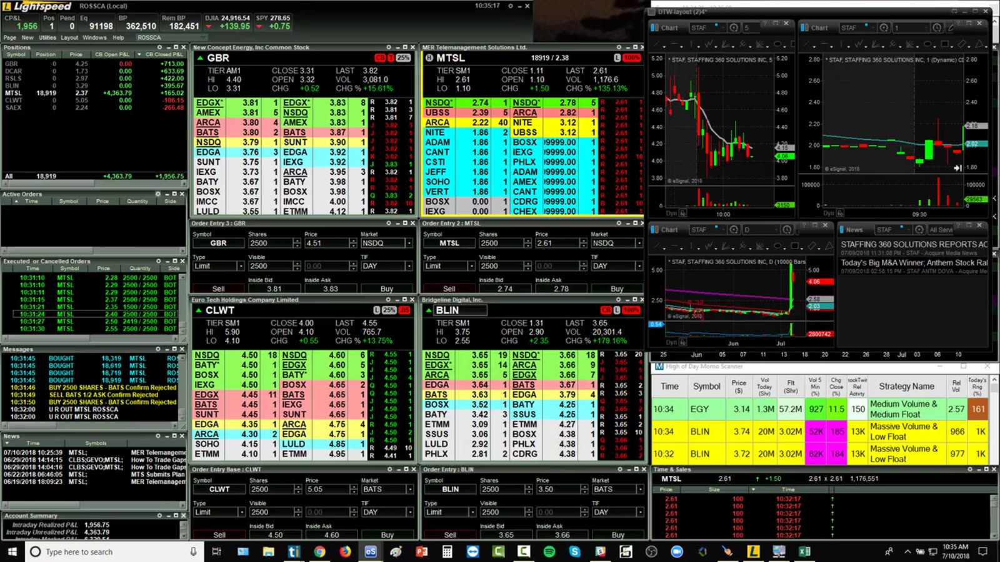

**图怎么看：**

- 单票 focus 减少 symbol-switching，但容易过度交易同一股票。
- 右侧图显示冲高、回撤、再测试，不同 entry 不能用全天趋势统一解释。
- 一只股票反复 alert 会强化 familiarity bias。

**复盘：** 设同票最大尝试次数与累计 loss；第三次 entry 仍需独立 A setup。

## v0171：CALI

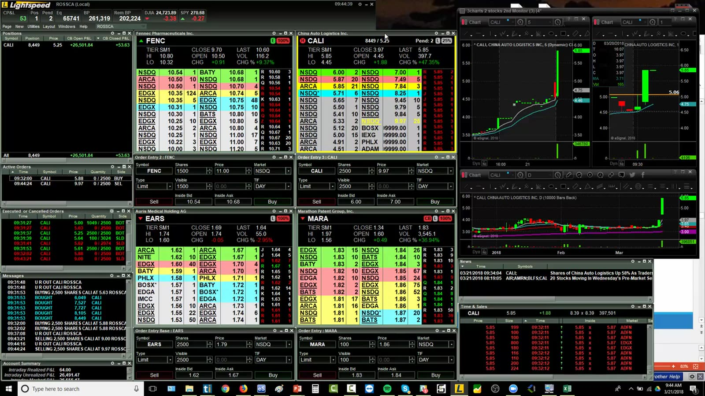

**图怎么看：**

- 价格快速抬升，Level 2 depth 相对有限。
- 旧版 route/order defaults 不能照抄。
- 高速 squeeze 中 market order 的最坏价格不可控。

**复盘：** 从 prints 重建实际 slippage；若深度不足计划 size，capacity-adjusted size 应更小。

## v0172：Day 132

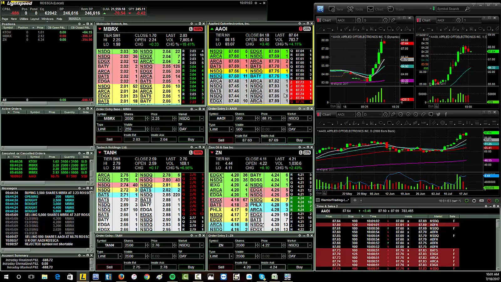

**图怎么看：**

- 多只股票出现异动，主图有冲高后长时间整理。
- Day number 不说明 setup，需要逐笔贴标签。
- 午后/后段整理与开盘 momentum 不能混合。

**复盘：** 按 time bucket 统计，找出交易是否在 edge 时段外增加。

## v0173：NFEC

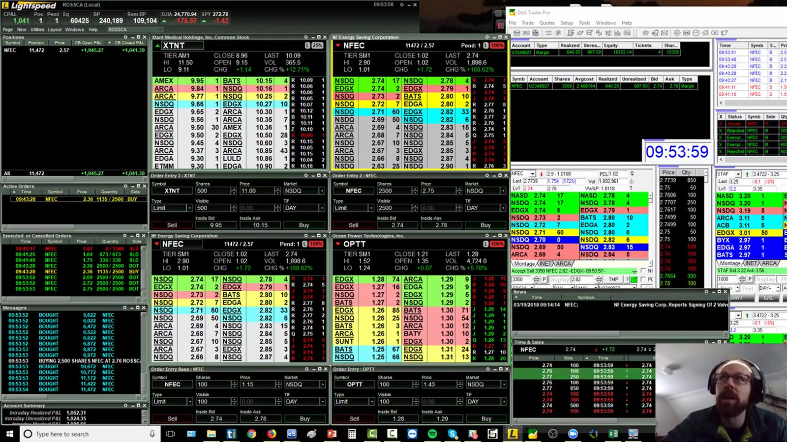

**图怎么看：**

- 画面结合旧平台与急涨图，属于 high-halt-risk 标的。
- Visible seller/bid 可能在 resume 时消失。
- 同一 NFEC 还出现在 v0185，需检查是否重复。

**复盘：** 建 `duplicate_group=NFEC-halt`，比较时间戳/成交后只计独立事件。

## v0174：RKDA short

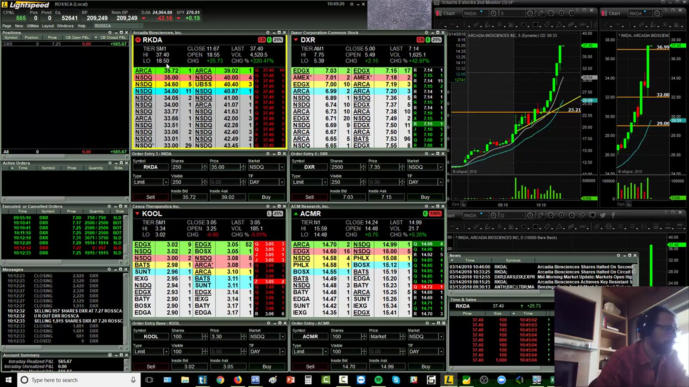

**图怎么看：**

- RKDA 从低位垂直扩张，short 方向面临继续 squeeze。
- Top guess、false breakout short 与 trend-shift short 必须区分。
- Borrow、SSR、locate fee 未显示在 chart。

**复盘：** 加入 borrow cost、halt gap、short entry tier 和 cover liquidity。

## v0175：SLS

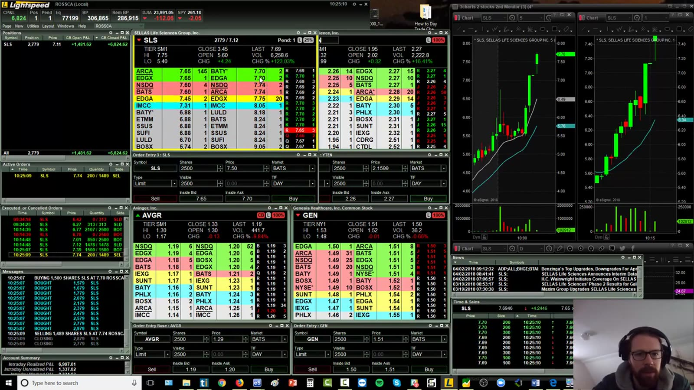

**图怎么看：**

- SLS 主图近乎垂直，普通 pullback 很浅。
- Micro pullback 对 hotkey/latency 敏感。
- 右上其他股票的走势不应干扰 primary risk。

**复盘：** 保存秒级 fills；无法获得则只作极端行情示例，不计可复现 setup。

## v0176：FIT news long

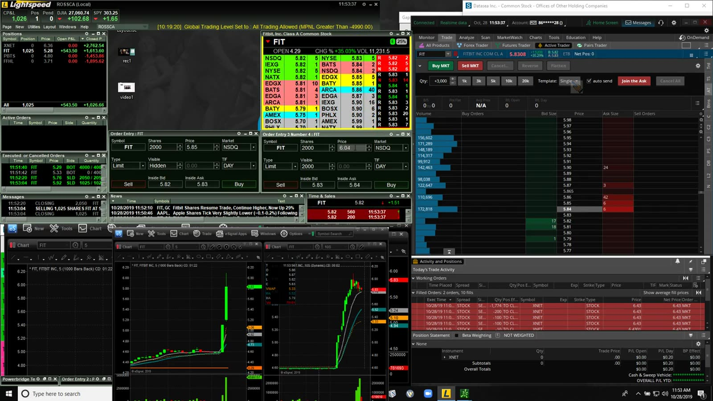

**图怎么看：**

- 新闻触发的 gap/快速 candle 与普通 technical breakout 不同。
- 图中平台显示快速价格重估，晚到 entry 可能已消耗 edge。
- 方向正确仍可能因 headline reversal 亏损。

**复盘：** 保存原始新闻、发布时间、entry latency、source quality 和后续更正。

## v0177：FRAN long 后转 short

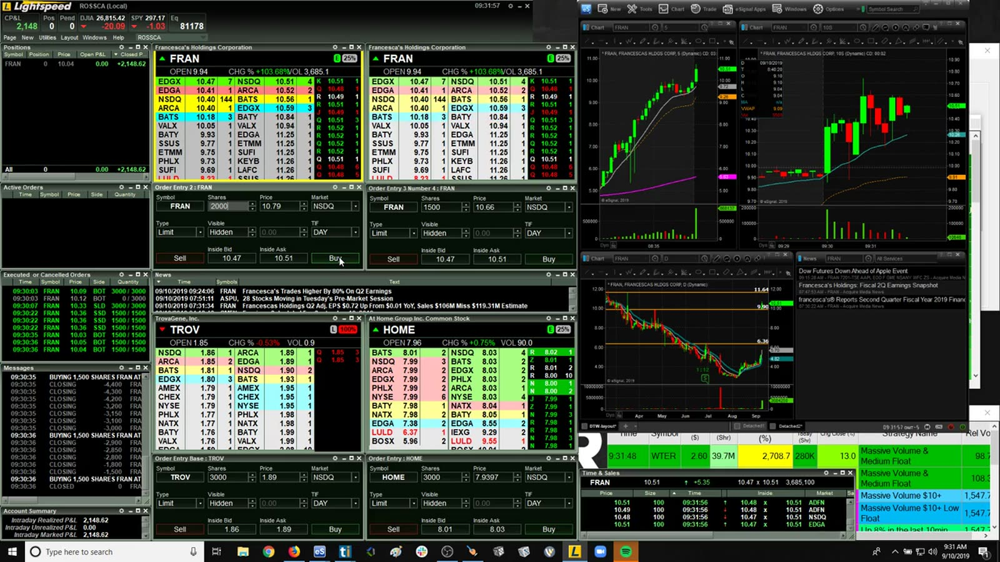

**图怎么看：**

- Long thesis 失败后转 short，若没有新 trigger 容易成为 revenge reversal。
- Rejection、trend shift 与 borrow availability 都需重新确认。
- 第一个亏损不能提高第二笔 size。

**复盘：** 两笔之间强制写新计划；若只因 P&L/愤怒反向，第二笔标违规。

## v0178：MDGS Gap & Go scalp

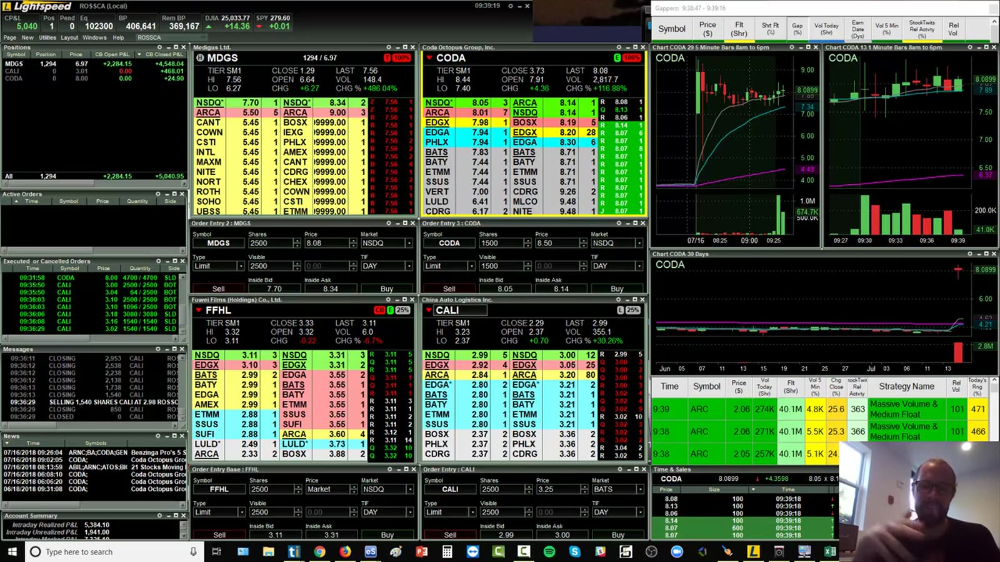

**图怎么看：**

- MDGS 出现放量冲高和高位结构，属于经典 Gap & Go context。
- 标题 winner 金额可能由大 share size 驱动。
- Scanner、chart 与 Level 2 分工清楚，但上方日线空间仍需核验。

**复盘：** 以每股 risk/R 重算；比较 first pullback 与追 HOD 的结果。

## v0179：RKDA live trading

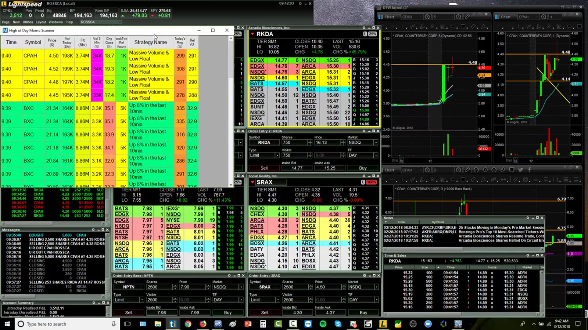

**图怎么看：**

- 左侧成交列表与右侧 RKDA/KOSS 图可用于对齐 entry。
- 同 ticker 出现多段 archive，不一定是同一天。
- Parabolic RKDA 样本相关性高，不能视为完全独立。

**复盘：** 加 date/event ID；同一 squeeze 的多个剪辑只计一个 market event。

## v0180：SES 22.50→26 squeeze

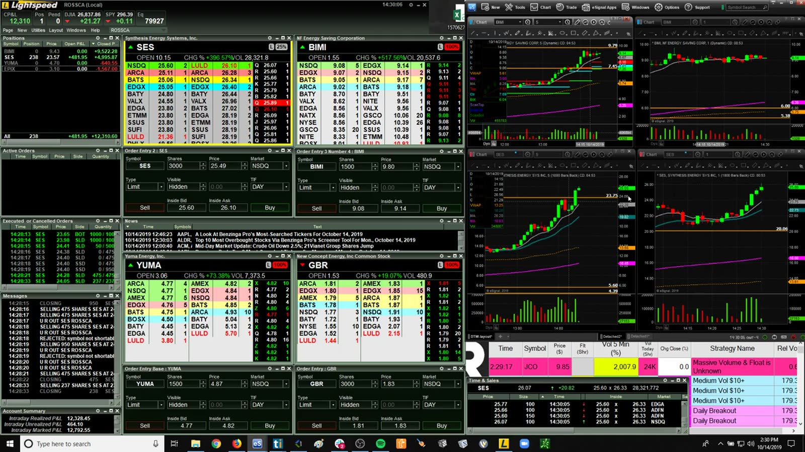

**图怎么看：**

- 价格跨越多个整数/半整数位，目标不能因下一个整数存在就自动延伸。
- 高价 small cap 的每股风险与滑点绝对值更大。
- 高位整理可能继续，也可能快速 flush。

**复盘：** Size 按 dollar stop；测试在 22.5、23、24 等关口追入的风险收益。

## v0181：ARCI 先亏后赚回

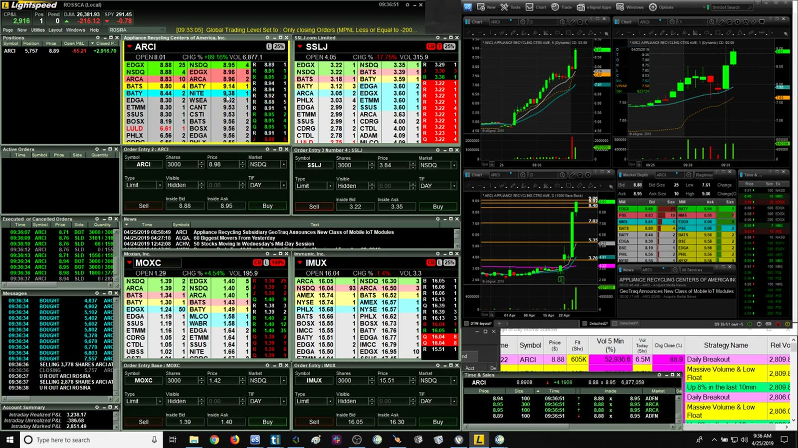

**图怎么看：**

- 标题以 “losing then making back” 叙事，容易强化 recovery goal。
- 后续 winner 是否 A setup 与此前 loss 无关。
- 赚回更多不能证明继续交易的决定普遍正确。

**复盘：** 使用 counterfactual：若按 daily stop 停止，长期期望和回撤会怎样；不以单日恢复定规则。

## v0182：FCSC scalp loss

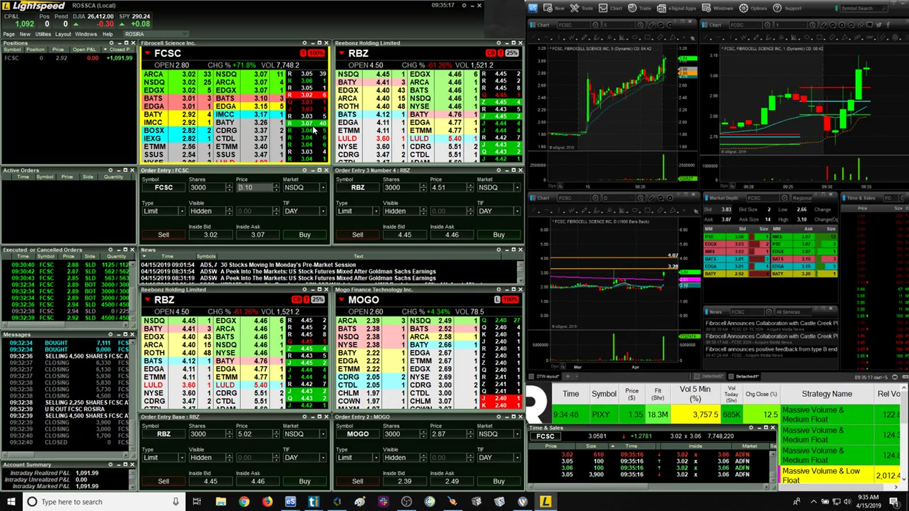

**图怎么看：**

- FCSC 图上有快速扩张和长 wick，容易产生 breakout slippage。
- 正常小亏是策略成本，前提是止损符合计划。
- 右侧另一个标的上涨不能成为换票追单理由。

**复盘：** 将 loss 拆成 planned risk 与 execution slippage；若在预算内，decision grade 仍可为 A。

## v0183：RHE scalp winner

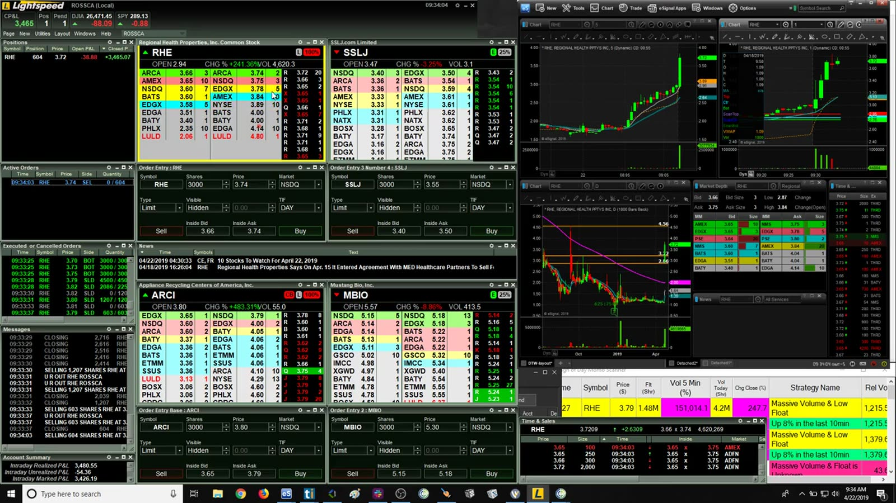

**图怎么看：**

- RHE 图显示上行趋势和多次 pullback。
- Winner 金额必须结合 shares 和 stop 才有意义。
- 最漂亮的趋势也包含 late entry 风险。

**复盘：** 标 sequence number；比较只做 first/second pullback 与全天所有 entry。

## v0184：Bear flag short

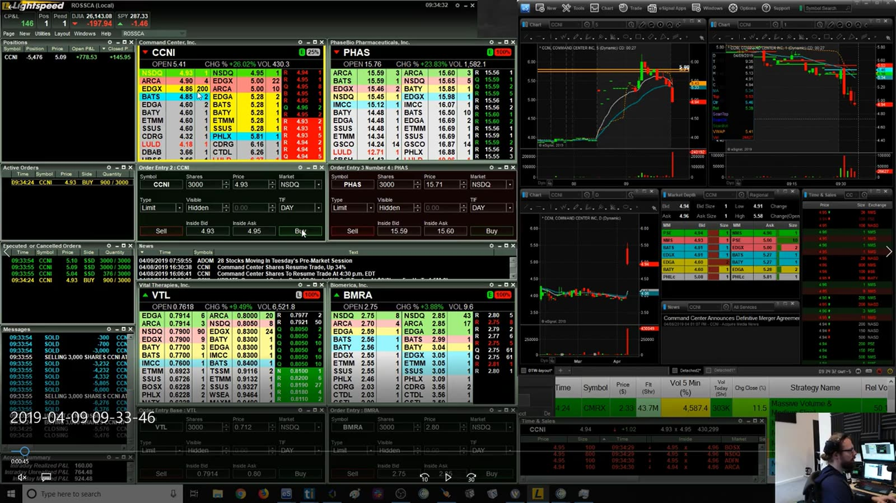

**图怎么看：**

- 主图先下跌、弱反弹整理，再尝试 continuation，结构比 top-guess short 清楚。
- Stop 参考 flag high，目标参考前 low/日线支撑。
- 做空仍要加 borrow/SSR，而不是只看形态。

**复盘：** 记录 locate cost 和 fill；对比 bear flag 与 false-breakout short 的 MAE。

## v0185：NFEC squeeze halt

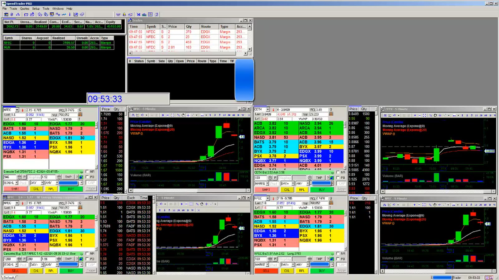

**图怎么看：**

- 源文件没有音轨，因此只保留屏幕可验证的 halt 结构。
- 价格进入近垂直走势，订单可能在 halt 时冻结。
- 与 v0173 可能是同一事件的不同剪辑。
- Halt 前盈利无法保证恢复后仍盈利。

**复盘：** 去重后只保留一条 event；记录每次 halt/resume，而不是把整段当连续 K。

## v0186：BPTH 47→72 squeeze

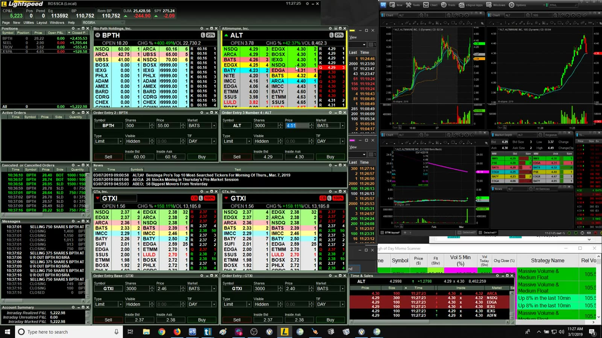

**图怎么看：**

- 每股移动约 25 美元，使用普通 small-cap share size 会造成灾难性风险。
- 图中高点与低点之间的 spread/halts 未被静态图表达。
- “Watch” 案例不代表一定实际成交到完整 move。

**复盘：** 用最小单位和 max gap stress 评估；无法承受一次 5–10 美元 resume gap 就不交易。

## 本组结论

- Long→short 需要全新 thesis；
- “赚回来”不是 setup；
- 同一事件多剪辑必须去重；
- News 保存原始来源和 latency；
- 高价/parabolic 按 dollar risk，不按惯用 shares；
- Rule-following loss 可以是好决策，winner 也可能是坏决策。
