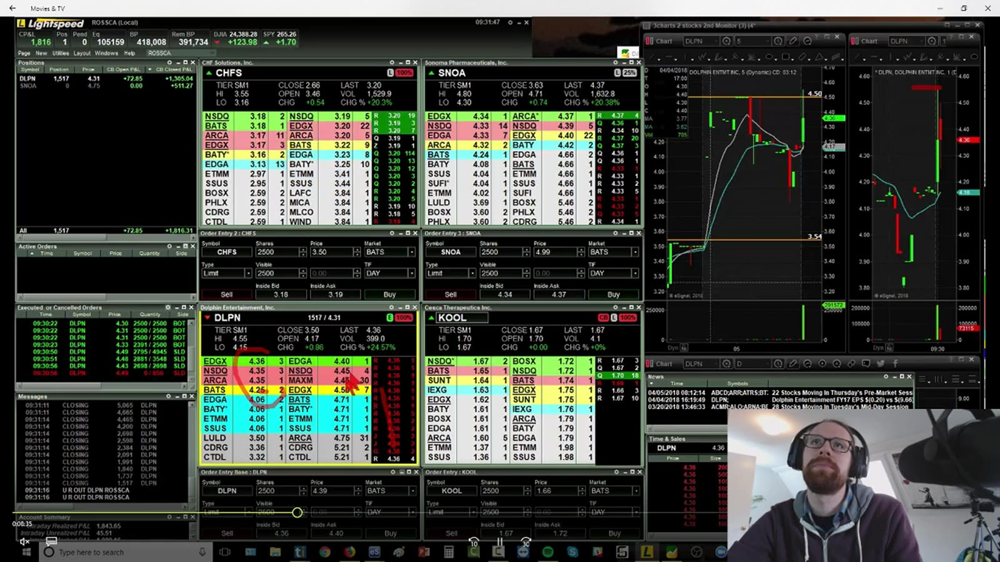
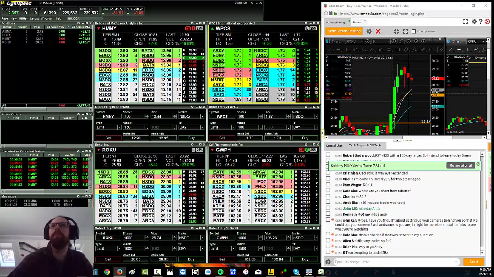
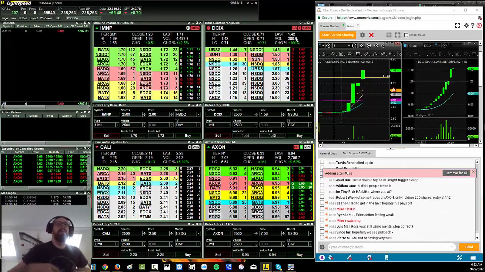
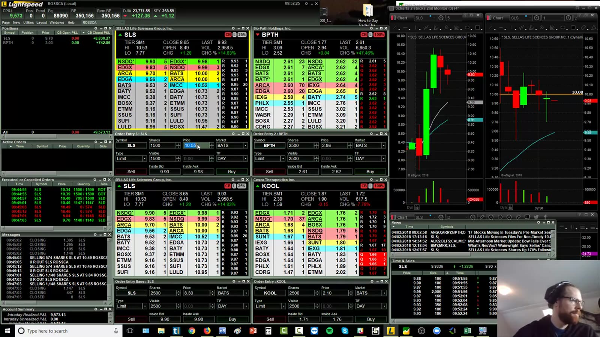
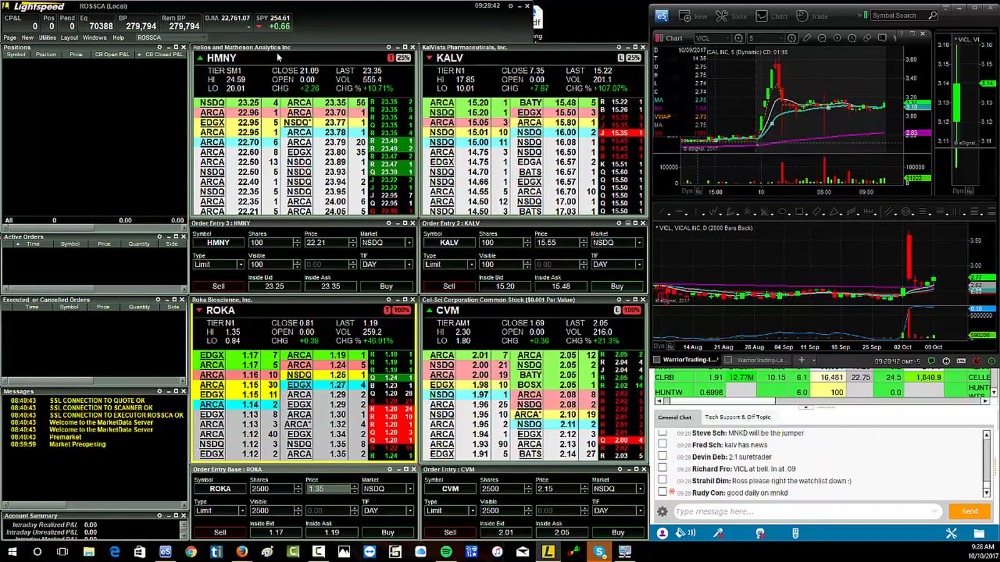

# Live Review 07：Chat Room Recordings

> 对应视频：v0187–v0191，共 5 段
> 重点：聊天室可以提供候选和实时思路，但不是交易信号。延迟、不同 broker、不同账户和选择性发言使跟单结果不可复制。

## v0187：2018-04-05 room session



**图怎么看：**

- Chart、Level 2 与 room messages 同屏，注意力被多个来源分割。
- 消息发布时价格可能已经变化；看到 callout 后追入承担 latency。
- 发言者的 entry、stop、size 未必完整。

**视频内容：** 画面同时显示 CHFS、SNOA、DLPN、KOOL 与聊天室，几只股票处在不同阶段：有的刚冲高，有的已经回落，有的仍在等待。聊天室发言只是把注意力移到某个 ticker；从消息出现到成员看到、切图、核对、下单之间，价格可能已经跨过原计划位。学习时应把 callout 时间与自己的可成交价并排记录。

**复盘：** 对每个 callout 记录消息时间、自己看到的时间、可成交价和是否已有独立 setup。

## v0188：Day 179 room recording



**图怎么看：**

- 多标的同时讨论会造成 urgency 与 FOMO。
- 聊天室只展示主动发言者，沉默的亏损/跳过不可见。
- 讲者能回答问题不等于下单时能兼顾所有成员。

**视频内容：** Day 179 中 HMNY、WPCS、ROKU、GWPH 等候选与实时 chat 并排，右侧还出现具体问题列表。视频同时承担扫描、讲解和交易，信息负荷很高；成员不能把讲师回答某个问题当作自己 ticker 的实时风险管理。最安全的用途是从 chat 获得候选，再回到自己的 chart/level/checklist。

**复盘：** 先完成自己的 checklist，room 只允许增加 watchlist，不能跳过风险步骤。

## v0189：2017-09-27 room session



**图怎么看：**

- 旧平台与旧市场数据说明 latency/fees 无法外推。
- 画面保留完整 room context，适合研究群体注意力如何转移。
- 同一 ticker 被多次提到不是多个独立 confirmation。

**视频内容：** 旧 room 画面显示 MYO/相关小盘候选、订单簿、图表和连续聊天消息；一只股票被重复讨论时，消息数量会快速增加，但它们往往来自同一个最初异动。学习时应把同一 catalyst 的所有消息合并成一个 event，并比较第一条消息时价格与后续追单价，观察注意力传播如何恶化盈亏比。

**复盘：** 把 unique event 与 message count 分开；避免用“很多人都说”提高 size。

## v0190：SLS room trade



**图怎么看：**

- SLS 在 room 注意下快速上行，晚收到信息者可能处于 move 末端。
- 盘口的可见 size 不能保证所有成员都按相同价格成交。
- 群体同时退出会放大下跌和 slippage。

**视频内容：** SLS 与 BPTH、KOOL 同屏，SLS 已出现快速上冲和高位大幅波动；当 room 同时聚焦 SLS 时，后看到的人面对的是更延伸的价格和更少的结构空间。视频应按“callout 前已有计划”和“callout 后才第一次注意”分两组：后一组若超出 max entry，只能记为 skip，不能复制早到者的 P&L。

**复盘：** 只做预先标好的 entry；若 callout 发生后已超过 max limit，记录 skipped 而不追。

## v0191：Day 185 多标的



**图怎么看：**

- 多张图与多个 Level 2 同时活跃，最容易发生 symbol/account 错误。
- Session 总 P&L 可能由一只异常股决定。
- 回看录像时知道最终 mover，会产生 hindsight focus。

**视频内容：** Day 185 中 HMNY、KALV、ROKA、CVM 等多只股票与 chat 同时活跃；不同图表的 breakout/回撤并不同步。重放时不能直接跳到最后涨得最好的一只，而要保留当时所有 watchlist 排名、每次消息到达顺序和被忽略的候选，才能检验选择过程而非事后挑 winner。

**复盘：** 按当时 watchlist 排名重放，不允许直接跳到最后 winner。

## Chat room 使用规则

```text
callout → add to watchlist only
→ independent catalyst check
→ own trigger/stop/size
→ max-limit check
→ trade or skip
```

- 不 mirror trades；
- 不复制 share size；
- 不因 badge/身份降低核验；
- 不在 move 已延伸后追；
- 不把聊天室 P&L 当审计证据；
- 关闭 chat 如果它降低执行质量。
