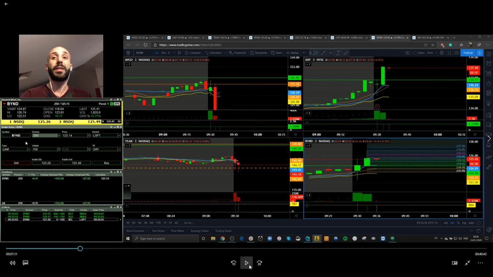
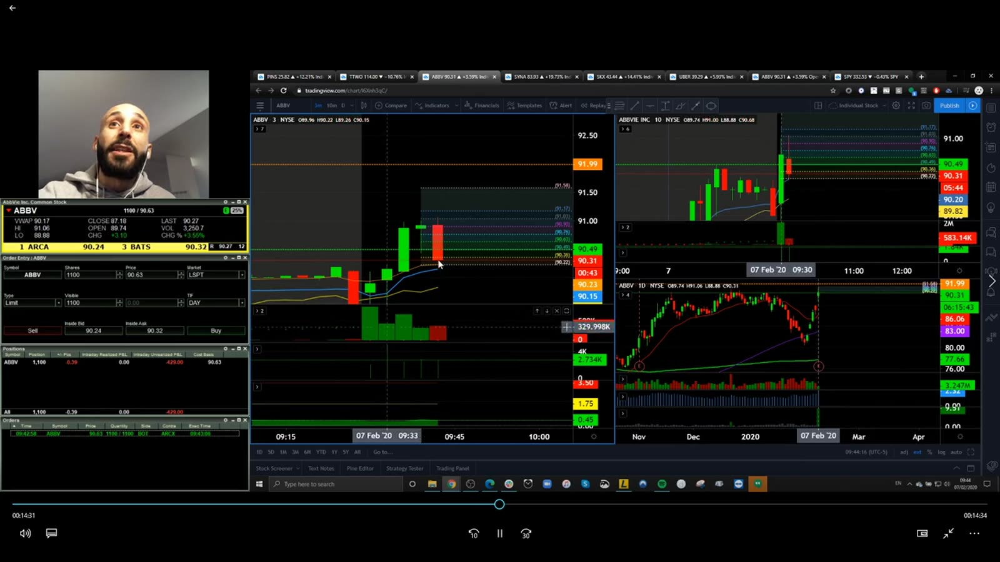
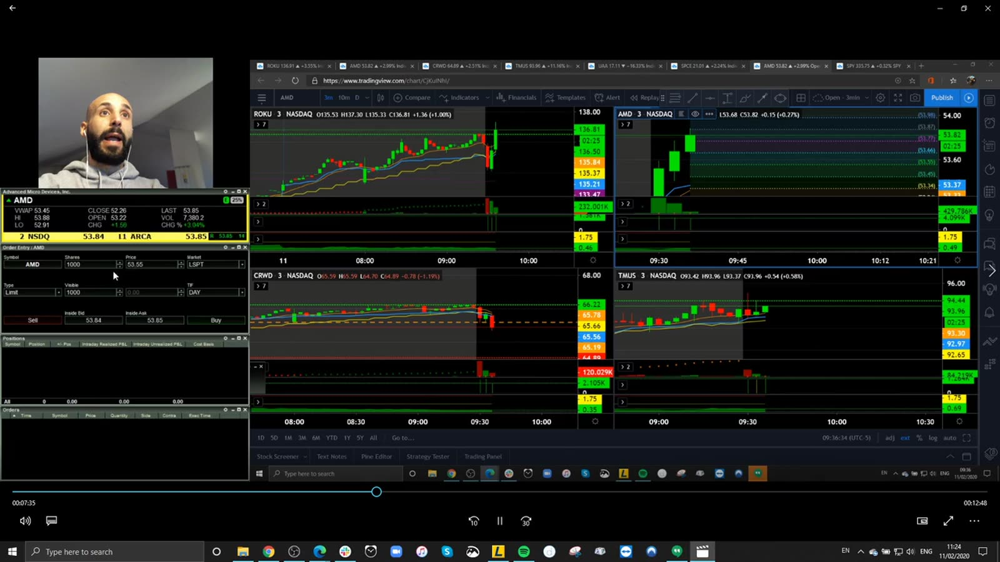
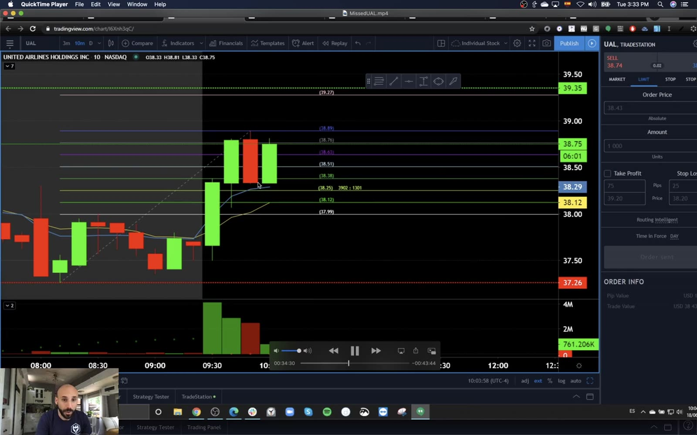
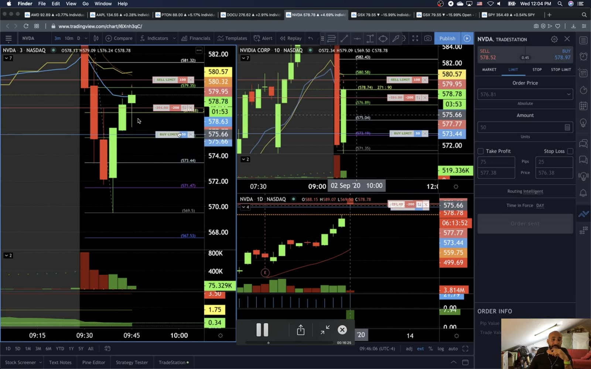
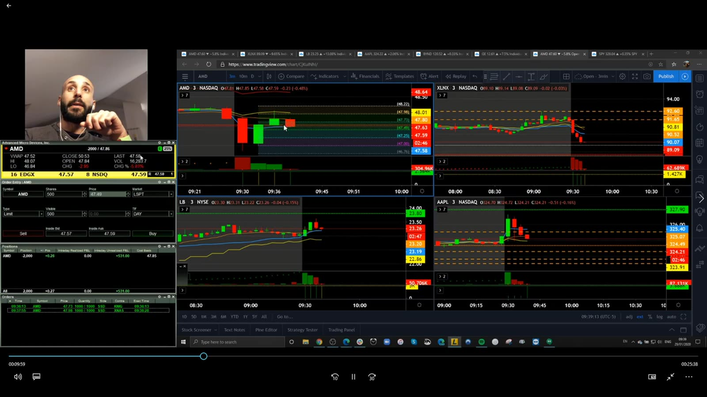
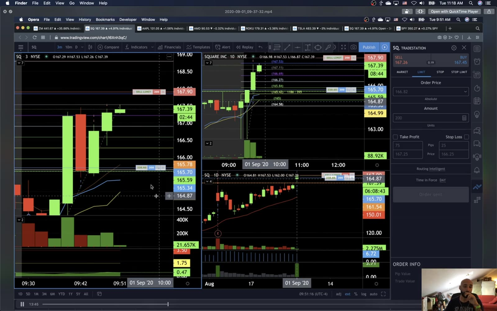
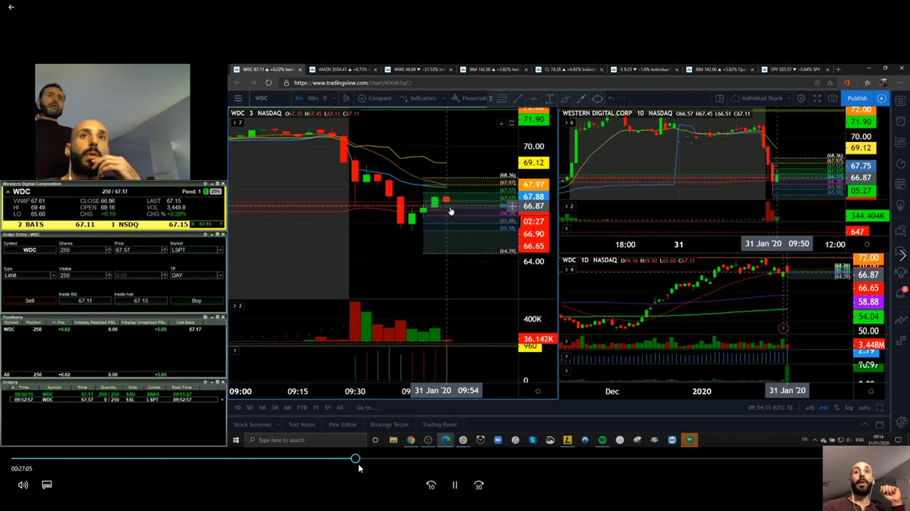

# Live Review 08：Roberto Trend Examples

> 对应视频：v0192–v0199，共 8 段
> 重点：Roberto 的案例更偏 mid/large-cap trend、突破确认后的 pullback，以及较慢周期。与 low-float halt scalp 分开。

## v0192：2020-01-24 recap



**图怎么看：**

- 画面使用较慢周期和清楚水平位，不依赖秒级 hotkey。
- 先让 breakout 发生，再观察是否 hold/retest。
- Recap 结果需与当时 premarket plan 对照。

**复盘：** 保存盘前水平截图，验证 entry 不是事后选择。

## v0193：2020-02-07 live example



**图怎么看：**

- 左侧 chart 展示突破后的回撤，右侧更大周期提供 trend context。
- Pullback entry 牺牲部分初始 move，换取确认和更清楚 stop。
- 若突破未 hold，则根本不进入。

**复盘：** 对比 first-breakout 与 first-pullback 的 false-start、MAE 和 expectancy。

## v0194：2020-02-11 live example



**图怎么看：**

- 大周期方向与短周期 pullback 同时可见。
- 指标线只辅助，真正 invalidation 是 higher-low sequence 被破坏。
- 走势较慢也可能受 macro headline 瞬间改变。

**复盘：** 记录 market/sector beta；不要把指数推动误认为 stock-specific edge。

## v0195：2020-06-30 live example



**图怎么看：**

- 价格突破后在新区域保持，提供 acceptance 证据。
- Entry 越靠近整理末端，上方空间越需重新计算。
- 不用 low-float 的 1m stop 处理 10m/15m trend。

**复盘：** 时间周期决定 stop 与 size，不能跨周期挑最小风险线。

## v0196：2020-09-02 live example



**图怎么看：**

- Large-cap move 相对连续，depth 更厚，但 notional 可能更大。
- 盘中结构仍会受 index/sector 同步影响。
- Broker/platform latency 对较慢 setup 影响较小，但不是零。

**复盘：** 用 beta/sector-relative return 区分 stock alpha 与 market move。

## v0197：AMD 13 EMA / 10-minute trend



**图怎么看：**

- 使用 10m 13 EMA 定趋势，避免 1m 噪声。
- EMA 是滞后价格平均，不是自动支撑。
- Entry 仍需 pullback、higher low 或 breakout trigger。

**复盘：** 固定 EMA/timeframe，比较 raw structure 规则；不因某次盈利反复调 period。

## v0198：SQ commented trade



**图怎么看：**

- Commented recording 可区分实时观察与事后结论。
- SQ 的 range、spread 和 catalyst 与 small-cap 不同。
- 讲解中提到的每个 level 应在 entry 前已存在。

**复盘：** 将 prediction 与 explanation 分栏，统计实时预测命中而非只听合理故事。

## v0199：WDC stress-less win



**图怎么看：**

- 画面强调 slower trend、明确 level 与较低操作频率。
- “Stress less” 不是没有风险，而是 strategy/tempo 更匹配个人。
- 较慢持有仍有 headline、sector 和 stop slippage。

**复盘：** 把主观压力 1–5 分与 rule adherence、hold time、P&L 对照，寻找适合节奏。

## 统一框架

```text
premarket level
→ initial break
→ acceptance
→ first pullback
→ higher-low stop
→ trend target / time stop
```

这是另一套策略族，不能把它与 Ross 的 halt/micro-pullback 结果合并。
