# Live Review 09：Ross Risk and Losses

> 对应视频：v0200–v0210，共 11 段
> 这一组最有价值的不是盈亏数字，而是亏损如何从一次正常止损扩大成追单、加仓、停牌暴露和流动性损失。视频里的美元金额属于讲师当时的账户和仓位，不能当成目标。

## v0200：UPC 开盘 Gap and Go / Dip and Rip

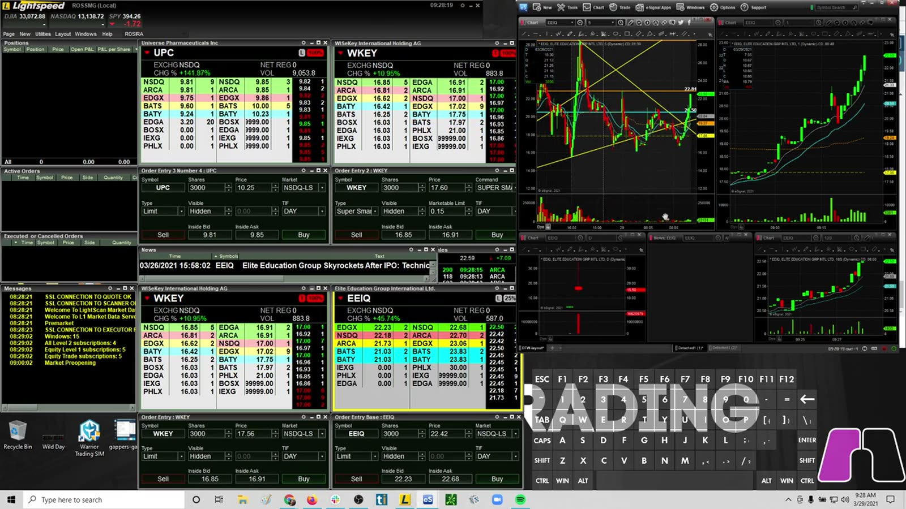

**图怎么看：**

- UPC 从盘前平台快速拉升，开盘附近的蜡烛明显放大，说明价格发现仍很剧烈。
- Level 2 与多张短周期图同时打开；此时看到的流动性可能在下单前后迅速消失。
- “Dip and Rip” 必须先定义回撤低点，不能把任意下跌都解释成买点。

**复盘：** 先记录计划 entry、结构止损和按止损距离计算的 size，再判断滑点后真实风险是否仍可接受。

## v0201：从 -5k 到 -26k 的亏损扩张

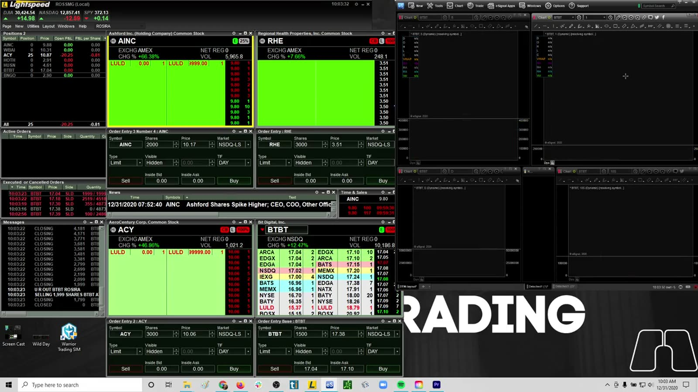

**图怎么看：**

- 画面中的多只强势股和停牌标记说明注意力被多个事件同时分散。
- 亏损扩大通常不是单一 entry 的问题，而是止损后继续交易、增加频率或提高 size 的组合。
- 已实现亏损会改变当天剩余的风险预算，不应靠“下一笔赚回来”决定仓位。

**复盘：** 将当日拆成每笔交易，标记第一次违反规则的位置；若达到 daily max loss，规则应直接结束交易。

## v0202：追 breakout 遭遇快速 rejection

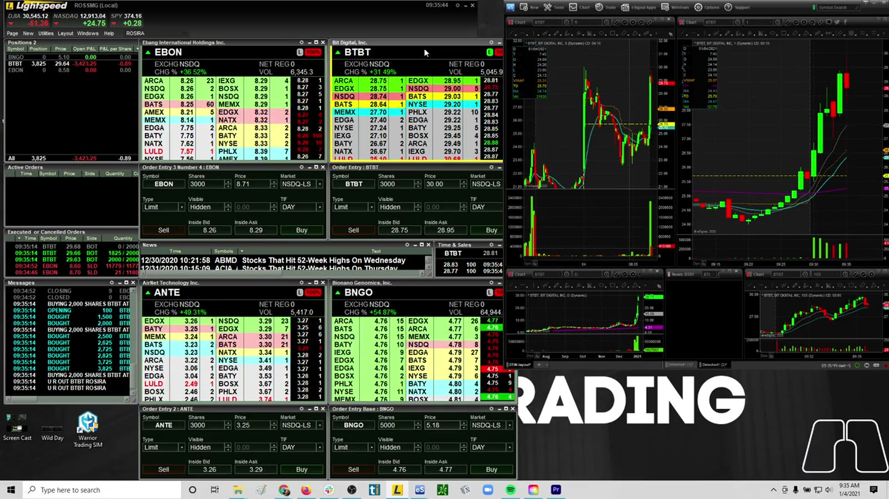

**图怎么看：**

- BNGO 的大阳线后紧接明显上影和回落，属于 breakout failure 的典型视觉信号。
- 在延伸蜡烛顶部入场，止损若放到结构低点会很远；止损放太近又容易被正常波动扫出。
- Level 2 的瞬时大买单不能替代价格在突破位上方的 acceptance。

**复盘：** 统计突破后 10–30 秒是否能 hold、首次回测是否守住，以及追高 entry 的 MAE；不要只统计最终是否创新高。

## v0203：GTEC 盈利后回吐

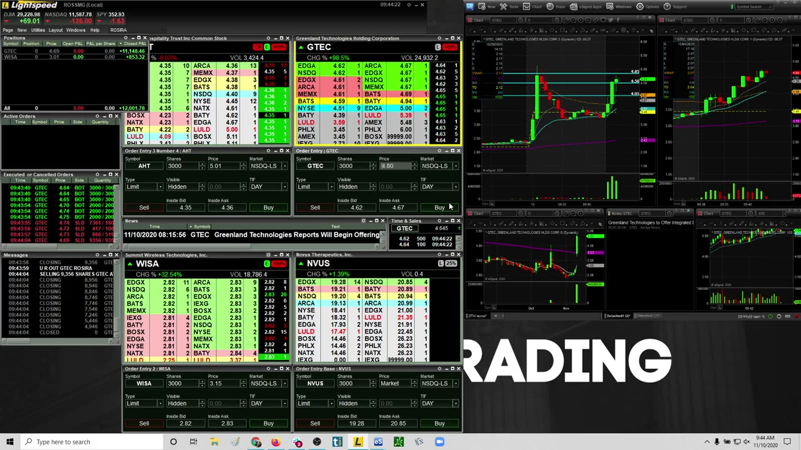

**图怎么看：**

- GTEC 多次冲高后出现陡峭红色 flush，短时间内跨越多个报价档位。
- 账面盈利不是已锁定利润；仓位较大时，一根快速红柱可把正 P&L 变成负值。
- 高位再次加仓会同时抬高成本和扩大回撤金额。

**复盘：** 给 add-back 单独设风险上限，并记录 peak P&L、realized P&L 与 giveback；“曾经盈利”不能证明退出合理。

## v0204：极度震荡与反复停牌

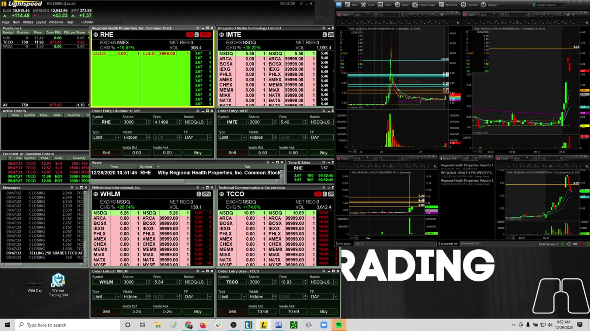

**图怎么看：**

- 多图出现垂直拉升、快速回落和停牌，表示市场状态不是普通连续交易。
- 停牌期间无法按常规止损退出，复牌价可能跳过计划价位。
- 同时追踪多只同类 momentum 股，会积累高度相关的风险。

**复盘：** 将 halt exposure 当成离散跳空风险，仓位应比连续市场更小；若连续两次出现非计划停牌暴露，停止该策略。

## v0205：从盈利/小亏到收盘 -20k

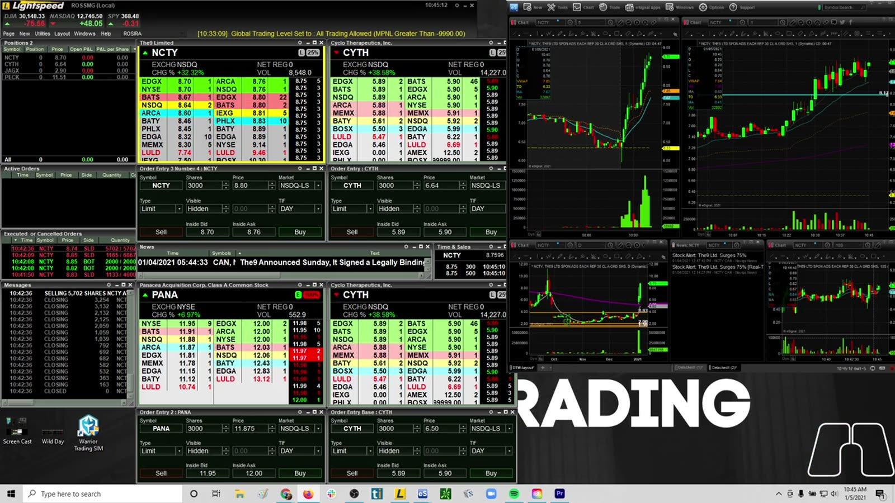

**图怎么看：**

- 画面同时展示多个候选股，容易产生“换一只就能找回机会”的错觉。
- 交易次数增加并不会自动提高胜率，反而叠加手续费、滑点和认知负荷。
- 当市场反馈与策略预期持续不一致时，降低 size 比寻找更多 setup 更重要。

**复盘：** 画出 cumulative P&L 曲线，并在每笔标注 A/B/C setup；检查亏损是否集中在质量下降后的交易。

## v0206：IPDN squeeze 中亏损扩大

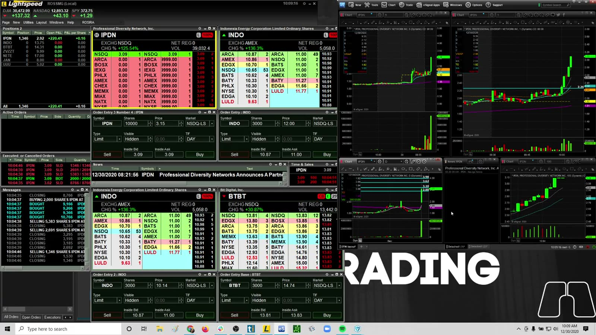

**图怎么看：**

- IPDN 从约 2 美元区域急速扩张到更高区间，波动率和每股风险同步上升。
- 低价不等于低风险；同样股数在波幅翻倍后，美元风险也会翻倍。
- Squeeze 过程中买卖价差与实际成交可能显著偏离屏幕触发价。

**复盘：** 每次重新入场都用当前波幅重算 size，不沿用开盘前的股数；将 slippage 纳入单笔最大损失。

## v0207：从 -4k 到巨额回撤

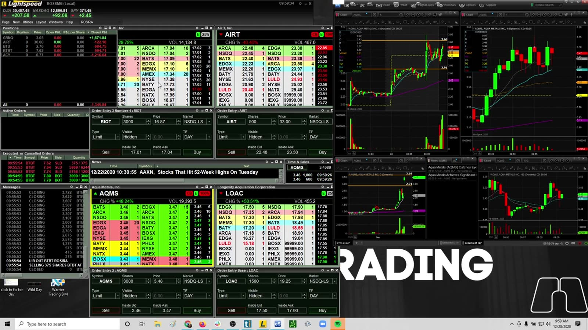

**图怎么看：**

- 图表呈现急升急跌，Level 2 深度相对仓位可能很薄。
- 亏损后提高 size 会让下一次正常波动变成账户级事件。
- 屏幕上的极端金额是风险失控的警示，不是可复制的收益尺度。

**复盘：** 建立不可覆盖的硬限制：per-trade max loss、daily max loss、最大股数和连续亏损次数；限制应在交易前由平台或流程执行。

## v0208：OCGN 盘前持仓穿越 pullback

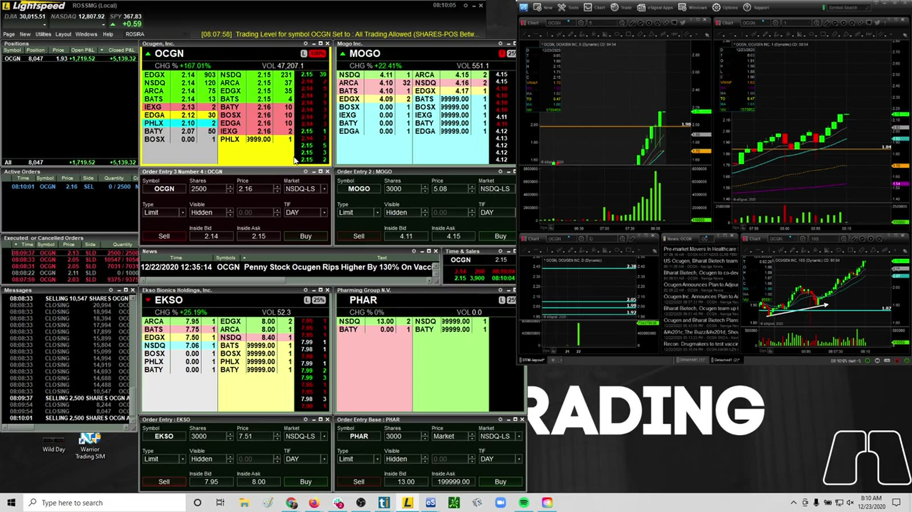

**图怎么看：**

- 盘前深度较薄，价格沿上升结构推进后出现明显 pullback。
- “持有回撤”只有在 entry 前定义的 invalidation 尚未触发时才成立。
- 事后价格反弹不代表忽略止损是正确行为。

**复盘：** 写清可接受的 normal pullback 与 thesis failure；比较计划止损、实际最低价和最终退出，避免 outcome bias。

## v0209：峰值盈利后回吐 31k

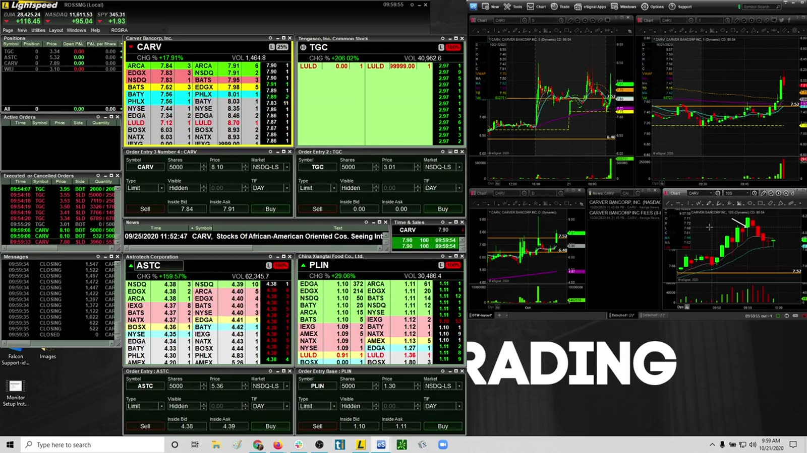

**图怎么看：**

- 多只股票在短周期内大幅扩张，账面 P&L 对一根蜡烛极其敏感。
- 峰值盈利会形成心理锚点，但后续每次持有都应按当前结构重新判断。
- 大仓位在顶部区域可能无法一次按期望价格退出。

**复盘：** 预先定义分批退出、trailing structure 和最大 giveback，而不是看到 P&L 回落后临时决定。

## v0210：SNOA 为主的完整实盘

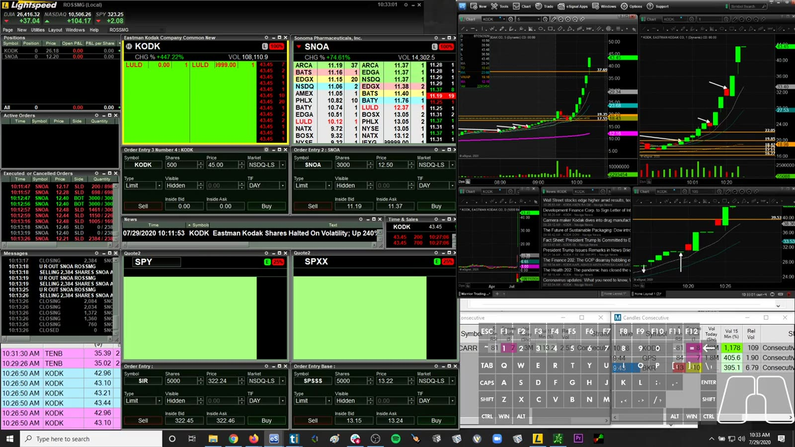

**图怎么看：**

- 原文件没有描述性标题；语音与画面可确认主要交易围绕 SNOA，同时检查 LTRPB、CLRO、MDIA 等候选。
- SNOA 的高成交量、反复停牌和快速 squeeze 让 Level 2 很难读；讲解中也明确出现 FOMO 与等待 pullback 的冲突。
- 后段在 breakout/add 失败后选择停止，说明 session 应按开盘计划、每次重新入场和最终停止时点分段。

**复盘：** 对无标题档案仍只保留可验证信息。用逐笔成交核对 SNOA 的 adds、partial fills、stop-outs 与 peak giveback，不凭最终日盈亏替中间过程背书。

## 共同结论

```text
planned risk
→ first loss
→ emotional response
→ size / frequency change
→ liquidity or halt exposure
→ realized tail loss
```

真正要控制的是这条链。正常止损不可避免，但止损后的行为、重复暴露和仓位升级可以通过硬规则限制。
