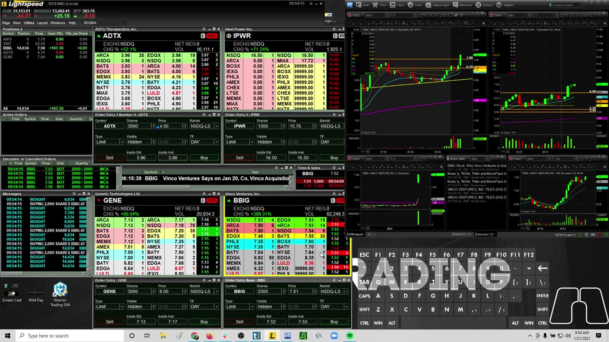
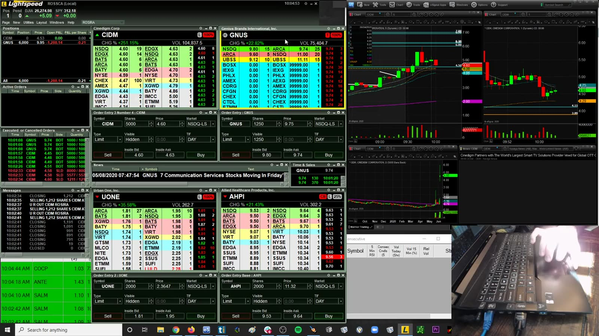
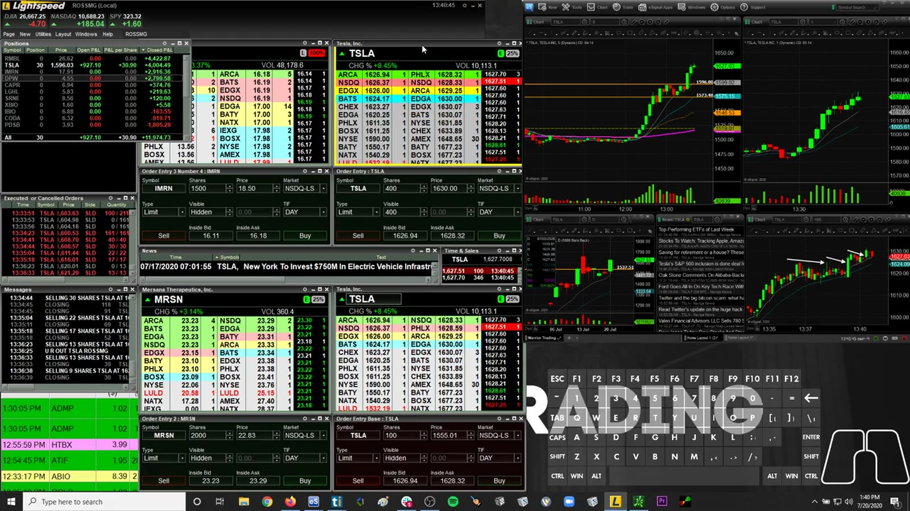
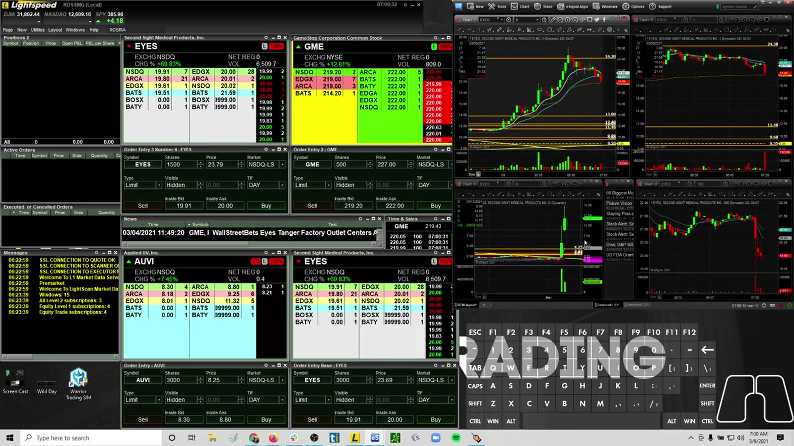
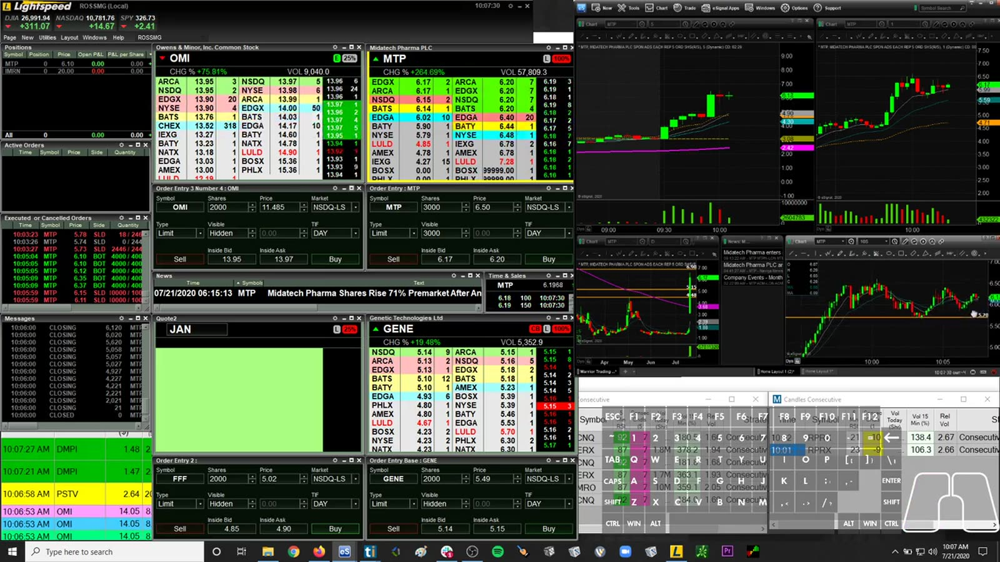
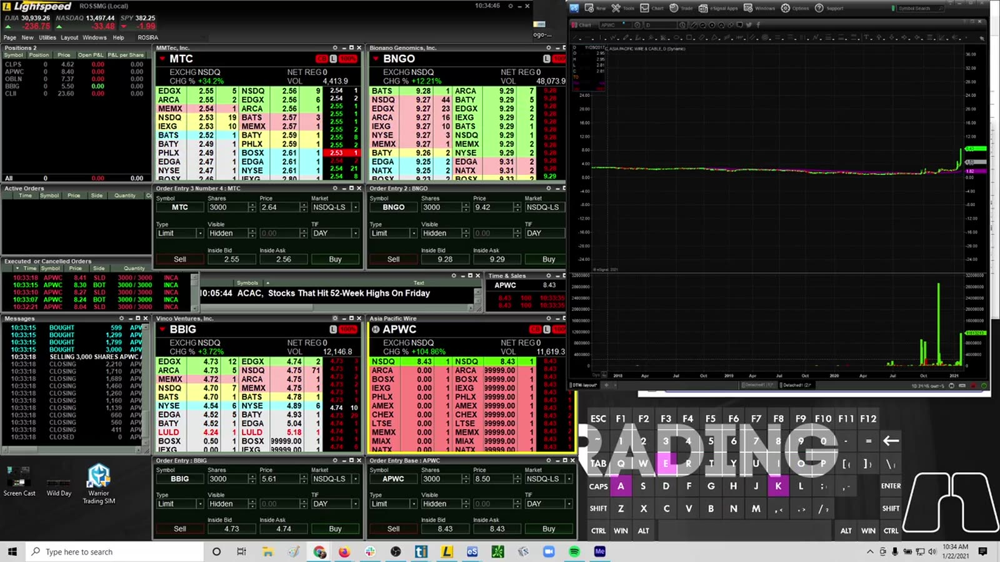
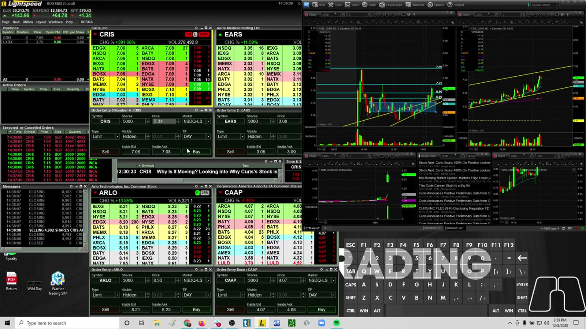
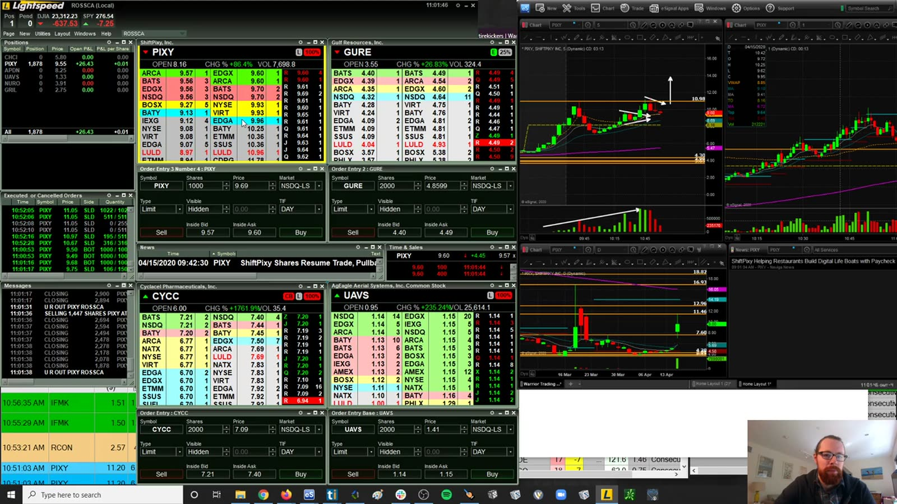
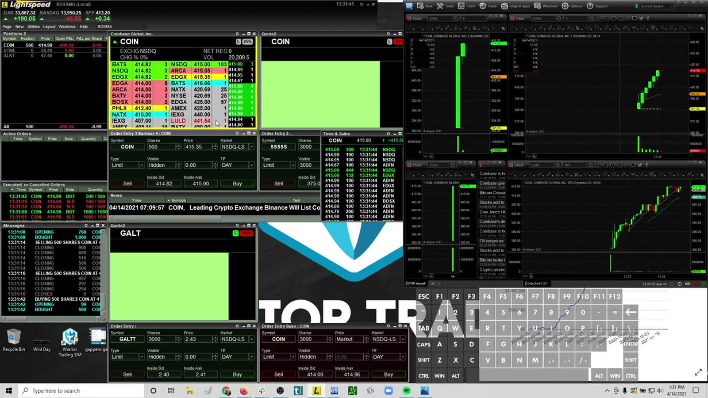
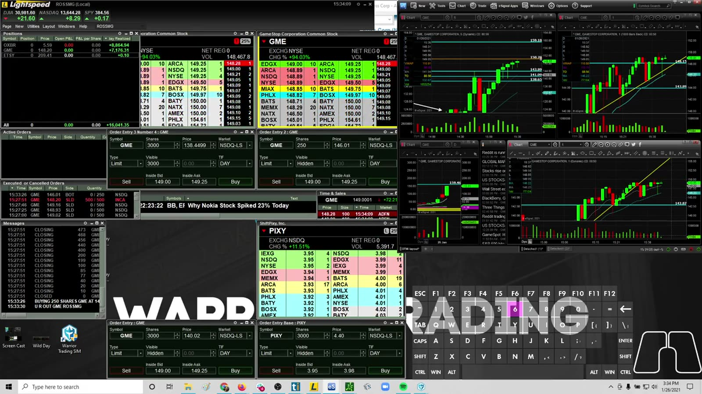

# Live Review 10：Ross Breakouts and Special Situations

> 对应视频：v0211–v0220，共 10 段
> 本组包括 breakout、7 a.m. volume spike、停牌下跌、VWAP bounce、IPO 和 GME。不同事件的撮合、流动性与波动结构不同，不能放进同一个统计桶。

## v0211：47k day，第二部分

**图怎么看：**

- 语音可确认前段围绕 BBIG 在整数位附近多次 add，后段继续查看 ADTX、IPWR、BVXV；不能把整段当作单次赢家。
- 当日已盈利容易放松风险限制；后续交易仍应独立计算 expectancy。
- 价格越高、波幅越大，相同股数对应的美元风险越高。

**复盘：** 将“保住已有盈利”和“下一笔 setup 是否有效”分开，设置从 peak P&L 起算的最大回吐。

## v0212：CIDM / GNUS 完整 session

**图怎么看：**

- 原文件名是哈希值，但语音可确认开盘先关注 leading gapper CIDM，同时等待 GNUS 的 dip。
- CIDM 在 4.50 附近遇到卖压后出现止损、dip add 和多次重新入场，属于可以检查 overtrading 的完整序列。
- 多标的并行时，应记录每只的 catalyst、float、volume 和计划价位；窗口多不等于信息更多。

**复盘：** 用成交记录重建 CIDM 每次 stop/re-entry 和 GNUS 切换时点，判断是在执行不同信号，还是围绕同一阻力反复消耗风险。

## v0213：TSLA ABCD breakout

**图怎么看：**

- TSLA 在高价格区形成推进、回撤和再次突破，ABCD 只是对结构的命名。
- 每股价格高使 notional 和 stop distance 与低价 small-cap 完全不同。
- 大盘和板块方向可能解释部分走势，不能全归因于形态。

**复盘：** entry 前固定 A/B/C/D 定义，用结构止损换算股数，并与 SPY/QQQ 同期表现对照。

## v0214：7 a.m. volume spike

**图怎么看：**

- 7 点附近成交量突然增加，常与更多交易参与者进入盘前时段有关。
- Volume spike 是事件提示，不是自动买入信号；还需 catalyst、价位和 spread。
- 盘前报价深度通常低于常规时段，止损成交质量更差。

**复盘：** 统计 spike 后 1/5/15 分钟的延续率、最大逆行和 spread，单独建立盘前样本。

## v0215：MTP / OMI momentum session

**图怎么看：**

- 原文件无描述性标题；语音可确认先围绕 MTP 的 first one-minute candle / micro pullback 多次 add，后续再观察 OMI。
- MTP 在同一突破位附近反复加减仓，正适合核对“新信号”与“未兑现旧预期”的边界。
- Level 2 只能描述当时可见报价，不能保证队列中订单持续存在。

**复盘：** 把 MTP 每次 4.68–4.75 附近的 entry/partial exit 排成时间线，计算合并后真实风险；再把切换 OMI 视为新的 ticker 样本。

## v0216：AWPC halt down

**图怎么看：**

- 停牌会中断连续价格发现，复牌可能直接越过图上支撑。
- 常规 stop 在停牌期间不能按触发价保证成交。
- 下跌停牌中的 long exposure 是 gap risk，而非普通蜡烛风险。

**复盘：** entry 前按最坏可承受复牌跳空反推仓位；若这个仓位太小才安全，就跳过交易。

## v0217：CRIS 午后交易

**图怎么看：**

- 午后成交节奏和开盘不同，盘中已有多轮支撑/阻力与 trapped traders。
- 同一 setup 在较低 volume 下可能有更宽 spread 和更差 follow-through。
- “今天还没赚够”不是午后入场依据。

**复盘：** 按时段拆分数据，比较 afternoon setup 的胜率、滑点与平均持有时间。

## v0218：VWAP bounce long

**图怎么看：**

- VWAP 附近出现回踩与反弹，但 VWAP 只是成交量加权平均，不是天然支撑。
- 有效 trigger 应包括拒绝下破、成交量变化或重新站回，而非只因“碰到线”。
- Stop 应放在结构失效处，不能为了固定股数随意缩小。

**复盘：** 对比首次、第二次和第三次 VWAP touch；触碰次数增加后，支撑可靠性未必相同。

## v0219：COIN IPO

**图怎么看：**

- IPO 首日缺少稳定历史图表，开盘和盘中都处于快速价格发现。
- Range、spread 和成交速度会快速变化，历史支撑阻力较少。
- 从 -20k 到 -6k 只描述 P&L 路径，不能证明风险过程合理。

**复盘：** IPO 单独分类，降低 size，并记录首笔成交、开盘 range、halt/volatility 与实际滑点。

## v0220：GME 实盘

**图怎么看：**

- GME 的流动性、新闻关注和波动机制与普通 low-float gapper 不同。
- 大幅拉升中的短周期 pullback 可能远超普通止损宽度。
- 群体关注会产生相关波动，但不能用“大家都在看”替代 entry 规则。

**复盘：** 将 meme/event-driven ticker 独立统计；报告 dollar risk、notional、slippage 和 halt exposure，而非只报净 P&L。

## 分类原则

| 类型 | 主要风险 | 最少需要记录 |
|---|---|---|
| 普通 breakout | false breakout、追高 | 突破位、hold 时间、MAE |
| 盘前 volume spike | 薄深度、宽 spread | 时段、spread、后续延续 |
| 停牌 | 复牌跳空、无法止损 | 停牌前 size、复牌成交 |
| IPO | 无历史结构、快速价格发现 | 开盘 range、实际滑点 |
| event/meme | 新闻和拥挤波动 | catalyst、halt、相关标的 |
