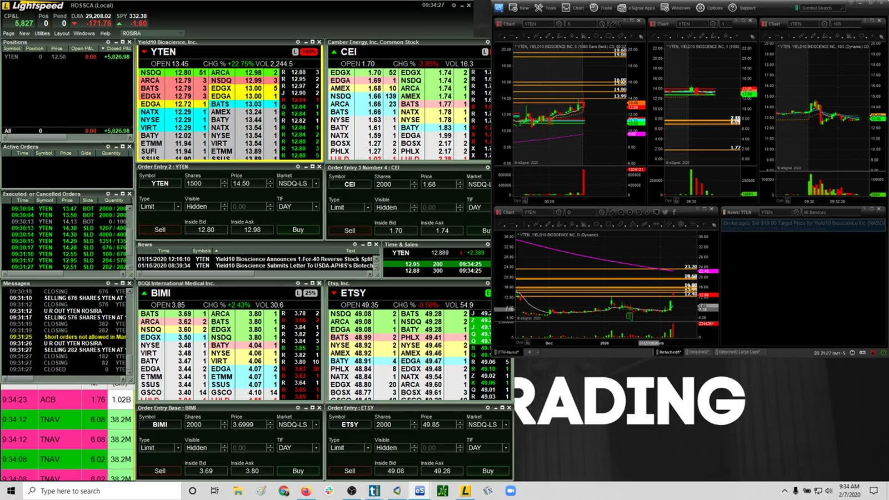
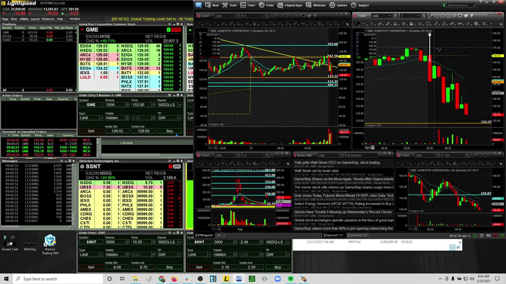
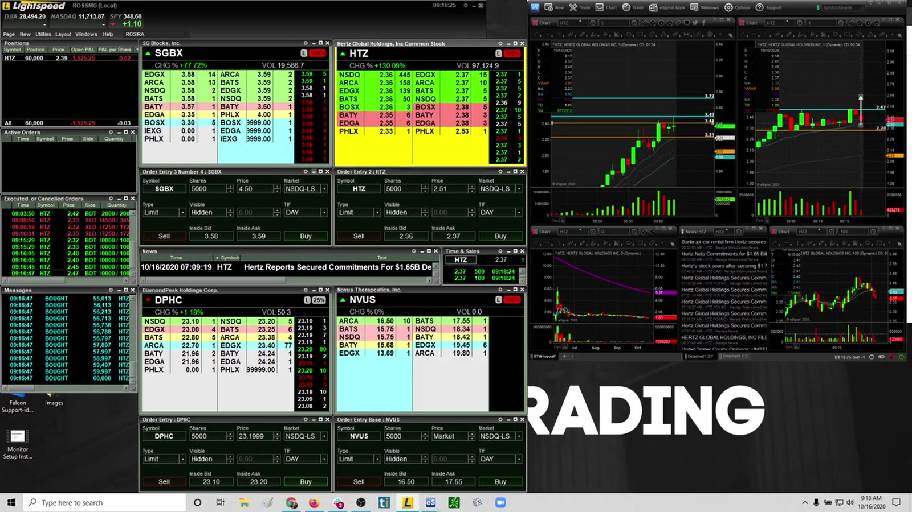
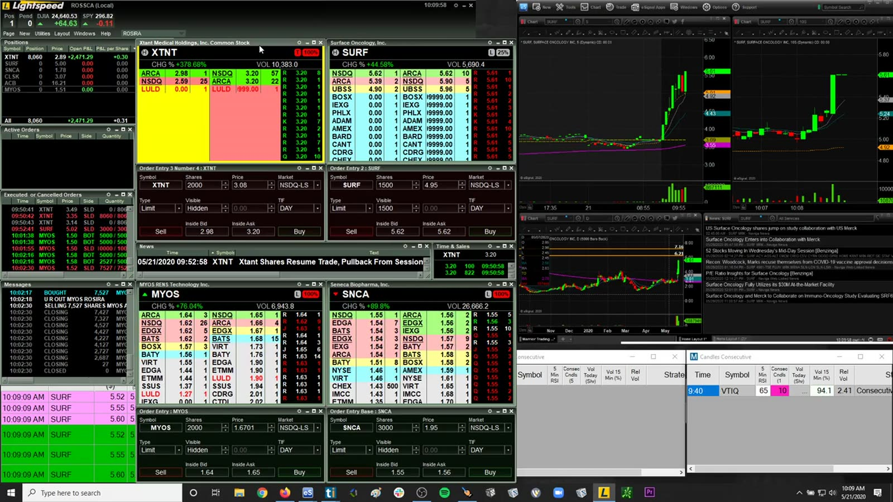
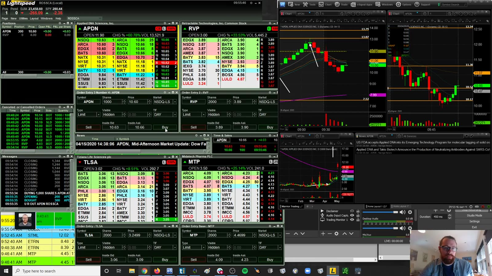
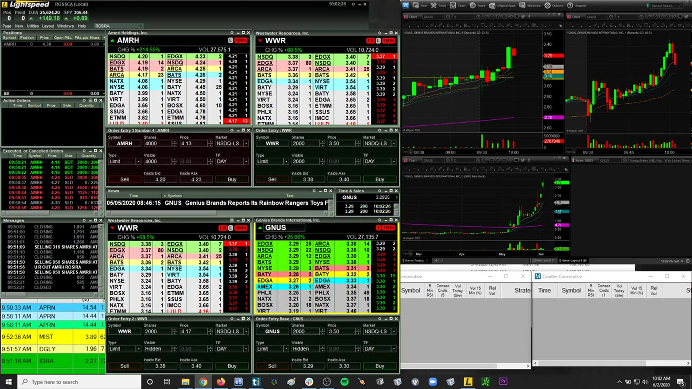
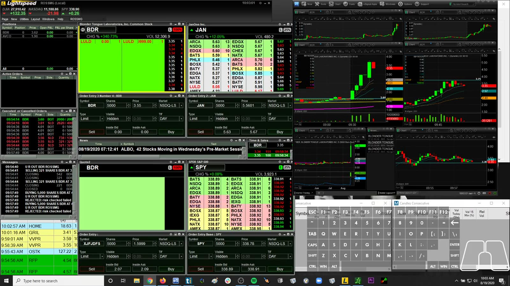
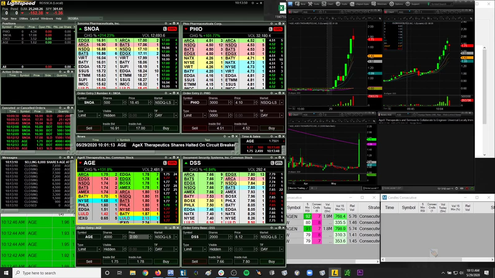
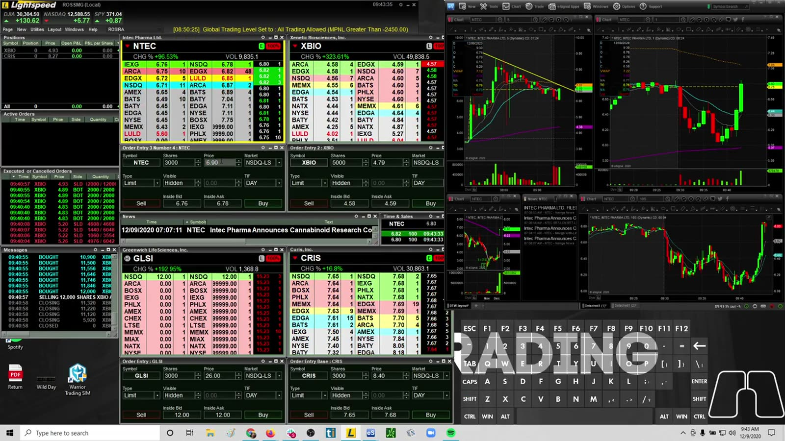
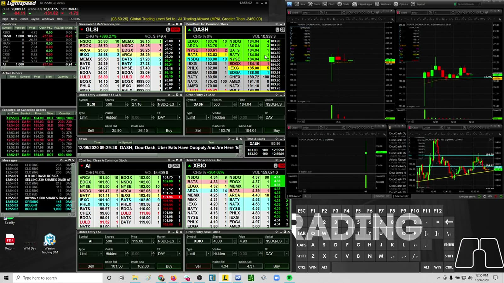

# Live Review 11：Ross Gap, Dip, and IPO Cases

> 对应视频：v0221–v0230，共 10 段
> 这一组集中看开盘 gap、dip entry、停牌、bull trap 与 IPO。每个案例都要先找 invalidation，再讨论上涨空间。

## v0221：YTEN Gap and Go dip buy

**图怎么看：**

- YTEN 高开后形成首次明确回撤，dip buy 依赖前高突破后的结构仍成立。
- Entry 越接近回撤支撑，止损距离越清楚；直接追反弹会恶化盈亏比。
- 首次回撤与多次测试后的回撤不能混为一谈。

**复盘：** 标注开盘 range、高点、first pullback low 和重新加速点，比较 limit entry 与追价成交。

## v0222：GME 开盘止损与震荡

**图怎么看：**

- 开盘蜡烛上下幅度都很大，方向信号弱而每股风险高。
- Stop-out 在这种环境可能是正常保护，不应立刻用更大 size 重进。
- Choppiness 的定义应量化为假突破次数、range overlap 或 VWAP 穿越次数。

**复盘：** 设 opening no-trade 条件；若前几根蜡烛重叠且无 acceptance，等待结构收窄。

## v0223：HTZ 亏损案例

**图怎么看：**

- HTZ 属事件驱动标的，价格跳动不一定服从常规技术结构。
- 图上的快速反弹可吸引追价，但 failure 后退出深度可能突然变薄。
- 单个知名案例不应改变预设风险。

**复盘：** 记录 catalyst 时间线和 headline exposure；事件不清楚时缩小仓位或不做。

## v0224：持仓遇到 halt down

**图怎么看：**

- Long 仓位在 halt down 时无法连续退出，复牌可能出现大幅 price gap。
- 最终收绿不能抵消中途风险超过预算的事实。
- “后来回来”是结果，不是仓位决策的依据。

**复盘：** 用复牌最差成交计算 risk-of-ruin；把 process P&L 与 outcome P&L 分开评分。

## v0225：APDN dip entries

**图怎么看：**

- APDN 冲高后回撤，回撤速度、volume contraction 和守住的价位决定质量。
- 多次 dip entry 会累积总暴露，不能把每次 add 当独立小仓。
- 反弹若无法重新站上前一个 lower high，可能只是弱反抽。

**复盘：** 画出所有 adds 的加权成本与总止损金额，禁止用平均价掩盖扩大风险。

## v0226：AMRH 大幅上涨中的执行

**图怎么看：**

- 百分比涨幅很大意味着价格已经延伸，不能只因“强”继续追。
- 每次 consolidation 后的 breakout 都是新决策，需要新的 stop/target。
- 历史涨幅不等于剩余上涨空间。

**复盘：** 记录 entry 时距 VWAP/均线和盘中低点的 extension，比较早期与晚期 breakout expectancy。

## v0227：BDR 大幅上涨中的 position risk

**图怎么看：**

- BDR 多段推进并伴随深回撤，说明波动扩张而非平滑趋势。
- 涨幅 300% 一类标签容易制造 FOMO，但 size 必须随每股风险下降。
- 高位 Level 2 深度可能无法承接大仓一次退出。

**复盘：** 按 volatility-adjusted size，而非固定 shares；计算平均成交价而不是只看按钮触发价。

## v0228：SNOA / PHIO，前半段无音频

**图怎么看：**

- 源文件注明前半段无音频，因此只从可见订单、图表和成交重建行为。
- 没有讲解时更容易看清“实际做了什么”和“后来如何解释”的差别。
- 多标的切换需按时间线记录，否则会遗漏总风险。

**复盘：** 不补写听不到的意图；仅记录可见 entry/exit、图表结构和待确认项。

## v0229：XBIO ascending support 与 bull traps

**图怎么看：**

- Higher lows 构成 ascending support，但上方多次无法延续形成 bull-trap 风险。
- 趋势线只是连接已发生低点；真正失效是价格跌破后无法迅速收回。
- 在同一阻力下反复买入会降低剩余盈亏比。

**复盘：** 记录每次阻力测试后的 follow-through；区分 breakout entry 与 support entry 的规则和样本。

## v0230：DASH IPO

**图怎么看：**

- DASH 首日交易缺少成熟 daily chart，盘中形成的价位样本很少。
- 首日高波动和高 notional 会放大每股止损与实际滑点。
- IPO 品牌知名度不提供短线方向优势。

**复盘：** 预先限制 IPO size；至少记录 opening print、opening range、VWAP、spread 和 entry 时的 liquidity。

## Dip entry 检查表

1. 上涨 thesis 是否仍有效，还是已经出现 lower high / failed reclaim？
2. 回撤时成交量是否收缩，支撑是否来自 entry 前定义的价位？
3. Stop 到 entry 的距离是多少，按此计算后 size 是否可接受？
4. 若停牌或滑点越过 stop，账户仍能承受吗？
5. 这是首次回撤，还是已经被多次消耗的支撑？
