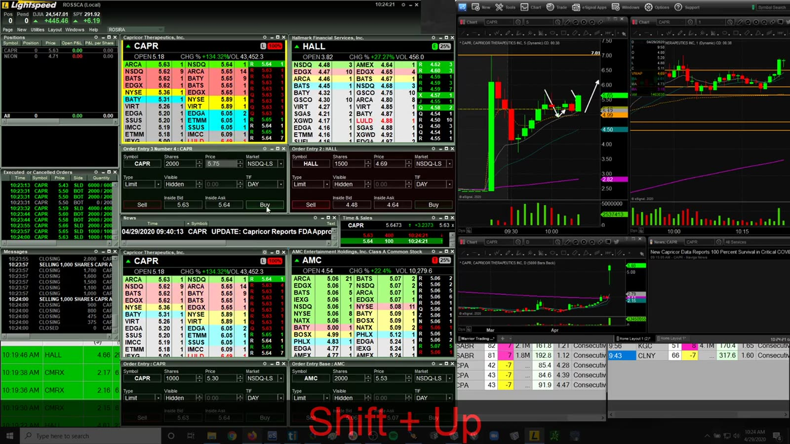
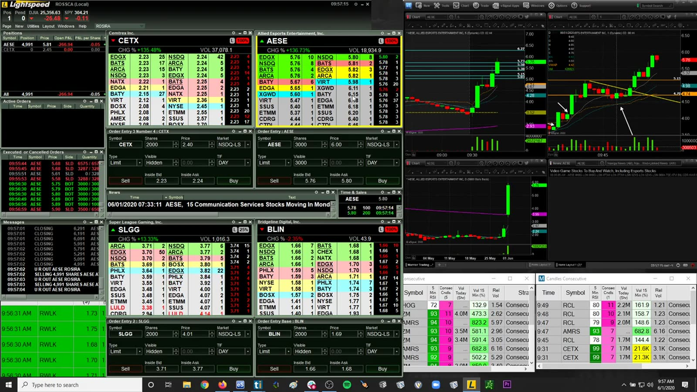
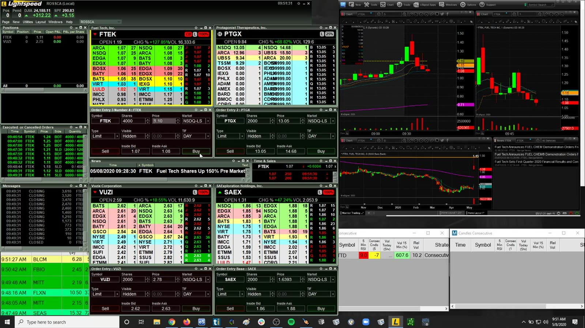
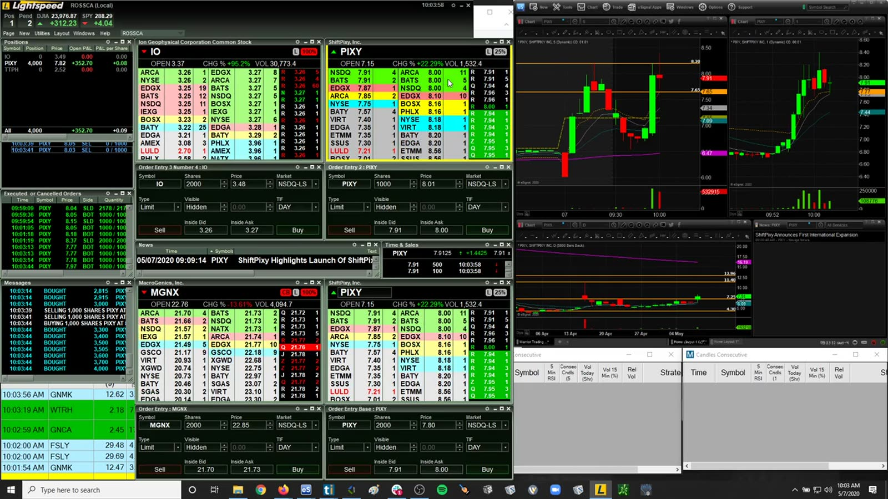
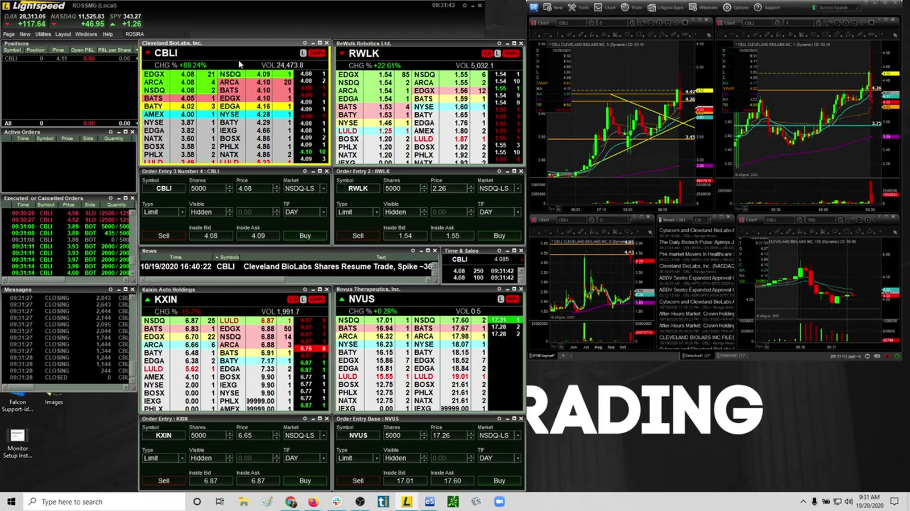
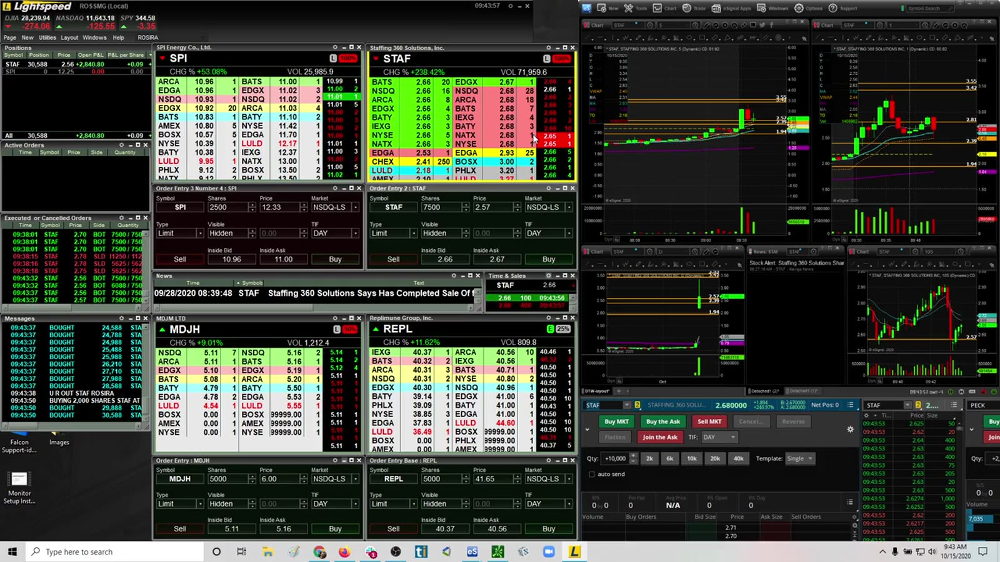
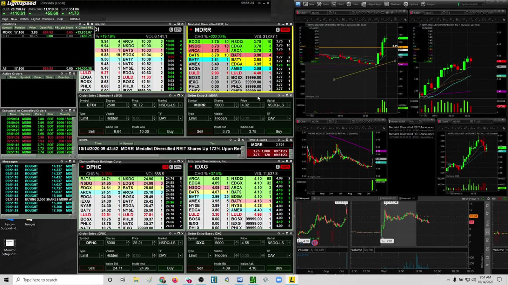
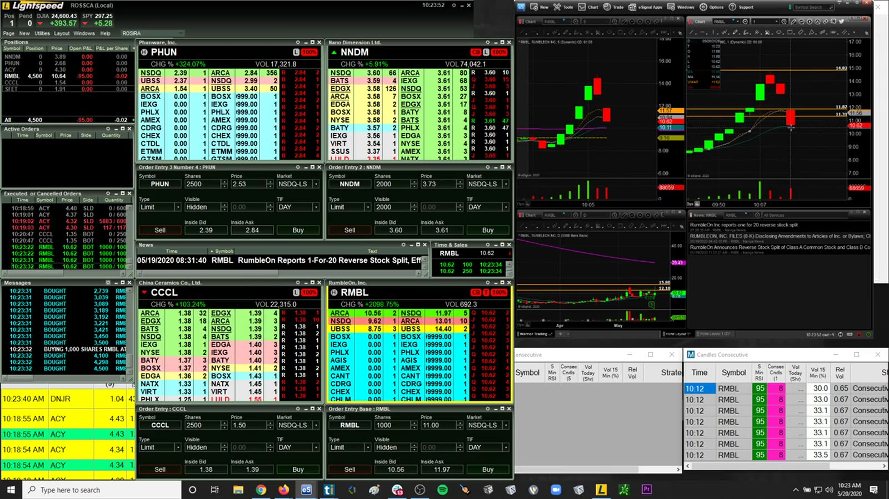
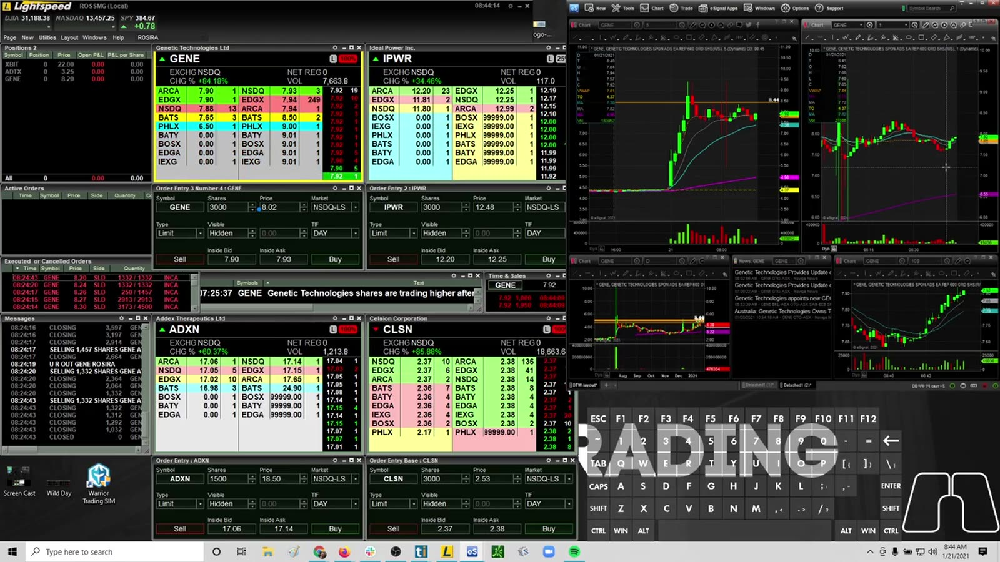
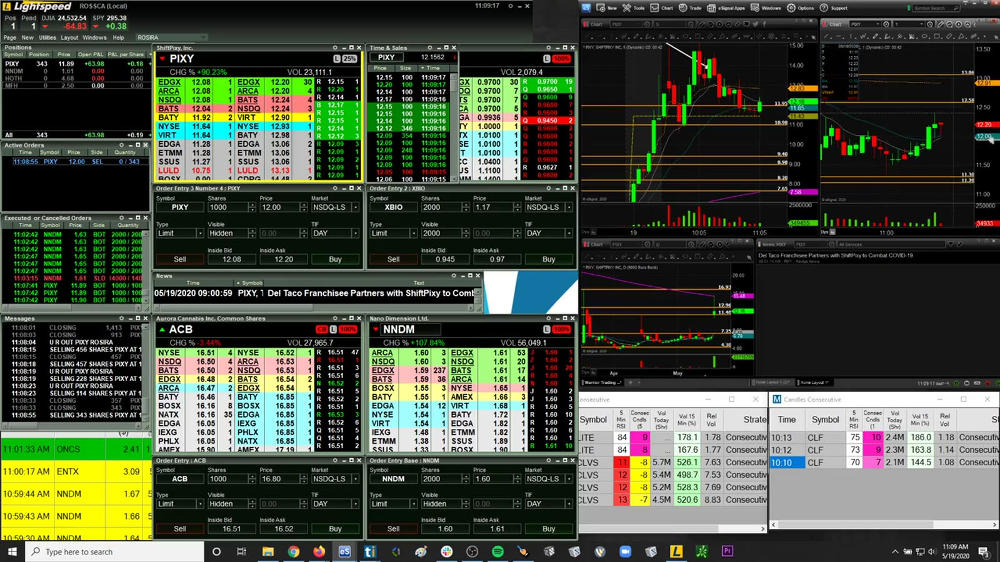

# Live Review 12：Ross Dip Trades and Large P&L Days

> 对应视频：v0231–v0240，共 10 段
> 大数字很醒目，但学习时要把美元 P&L 隐去，重新检查 entry、risk、liquidity 和退出。否则很容易把高杠杆结果误当成稳定 edge。

## v0231：CAPR dips 与 breakouts

**图怎么看：**

- CAPR 的趋势包含推进、整理、回撤和再次突破，不是单一 entry。
- Dip 与 breakout 的 stop 位置不同，应分别记录，不能合并成一次“大胜”。
- 回撤若守不住上一个 higher low，dip thesis 已失效。

**复盘：** 将每次 entry 独立编号，记录 setup、size、stop、MAE/MFE；总体盈利不能替代逐笔质量。

## v0232：CETX 与 AESE

**图怎么看：**

- 同时切换两只强势股会产生相关风险和注意力成本。
- 一只失败后立即换另一只，可能只是延续同一市场条件下的低质量交易。
- 两只股票的 float、spread 和 catalyst 需要分别记录。

**复盘：** 计算组合层面的最大同时风险；按 ticker 与 setup 双重归类，不把整日 P&L 当成一个样本。

## v0233：FTEK / PTIX dip 进入停牌失败

**图怎么看：**

- Dip entry 后价格没有顺利恢复，而是进入停牌/震荡状态。
- 计划 stop 在停牌时可能无法执行，实际风险大于图上的止损距离。
- 小额最终损失也可能来自高风险过程，不能只看结果。

**复盘：** 记录 entry 到停牌的时间、停牌前可退出深度和复牌成交；用过程风险给交易评分。

## v0234：breakout、dip 与两次大亏

**图怎么看：**

- 多种 setup 混在同一 session，容易在亏损后改变 entry 类型。
- 两次 dip 大亏说明“低买”不自动等于低风险；关键是 invalidation 和 liquidity。
- 频繁切换图表会隐藏重复犯错。

**复盘：** 对两次最大亏损做前后 60 秒事件表：看到了什么、计划是什么、为何未按计划退出。

## v0235：VWAP break

**图怎么看：**

- 约 10 点的 VWAP break 表示价格落到当日成交量加权均价下方，但不是单独的做空/退出信号。
- 需要观察跌破后的 acceptance、reclaim failure 和成交量。
- 若 long thesis 依赖守住 VWAP，跌破前就应写明退出动作。

**复盘：** 比较第一次触碰、实体收在 VWAP 下方、retest 失败三种确认强度及其滑点。

## v0236：STAF 上涨约 40%

**图怎么看：**

- 百分比涨幅描述过去，不描述 entry 后剩余空间。
- 多段上涨后 ATR/短周期 range 扩张，固定股数会让美元风险增加。
- 高位 candle overlap 可能预示动能下降。

**复盘：** 用 entry 时的 range/ATR 调整仓位，并记录距关键支撑的真实止损距离。

## v0237：MDRR squeeze 约 400%

**图怎么看：**

- 极端 squeeze 伴随垂直走势、宽波幅和可能的停牌，尾部风险很高。
- 空头被挤压可推动上涨，但无法告诉你何时结束。
- 高位大仓的 exit liquidity 可能远低于 entry 时看到的深度。

**复盘：** 这类极端行情单独建样本；记录 halt、spread、最大单笔 size 和实际平均退出价。

## v0238：盈利后最后两笔回吐

**图怎么看：**

- 截图中的多标的和长 session 提醒：后段决策质量可能因疲劳下降。
- “最后两笔”是复盘边界，可比较此前与此后的 setup 质量和 size。
- 已实现盈利不应变成扩大风险的许可证。

**复盘：** 增加 time-of-day 与 trade-number 字段，检查第 N 笔后 expectancy 是否明显下降。

## v0239：47k session，Part 1

**图怎么看：**

- 强势股多次拉升产生大量看似可交易形态，但实际 fill 和滑点决定结果。
- Part 1 不能脱离后半段单独评价整日风险。
- P&L 数字可能主要来自 size，不等于每股 edge 更强。

**复盘：** 统一换算成 R-multiple 与每股收益，再与最大风险和回吐比较。

## v0240：47k 完整 session

**图怎么看：**

- 接近 199 分钟的长视频覆盖多个市场阶段，策略环境并不一致。
- 只截中段赢家会产生选择偏差；应保留整日全部交易。
- 长时间盯盘还会增加疲劳、冲动和操作错误。

**复盘：** 按 premarket/open/midday/afternoon 分段，分别统计交易数、P&L、规则偏差与 peak-to-close giveback。

## 统一复盘模板

| 字段 | 目的 |
|---|---|
| Setup 与 trigger | 防止事后改名 |
| Entry / structural stop | 得到真实每股风险 |
| Shares / notional | 区分 edge 与杠杆 |
| MAE / MFE / slippage | 衡量路径和执行 |
| Halt exposure | 记录止损不可达风险 |
| Result in R | 跨账户、跨股价比较 |
| Rule adherence | 不让盈利掩盖坏过程 |
