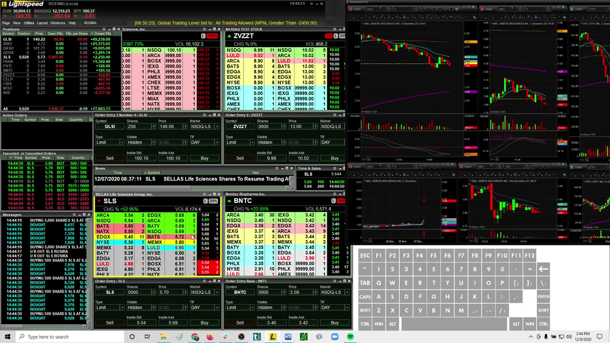
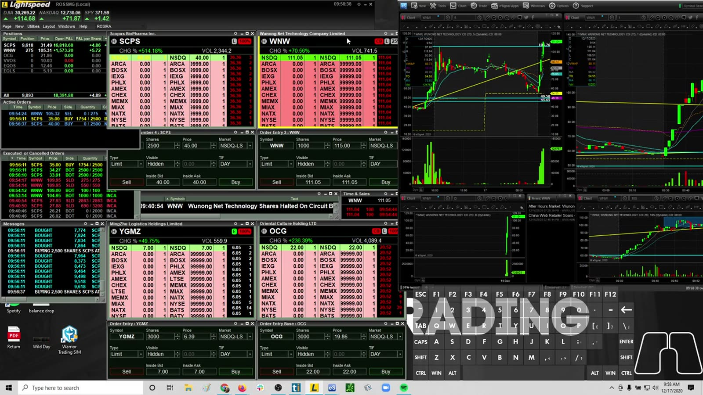
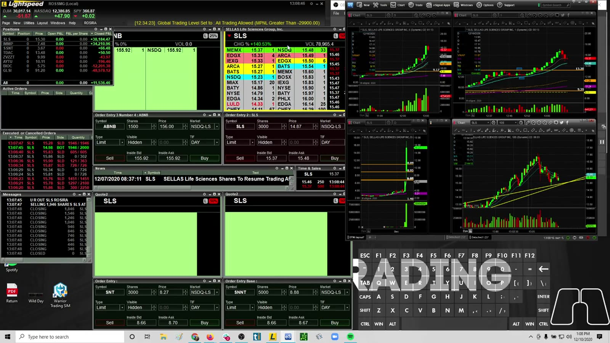
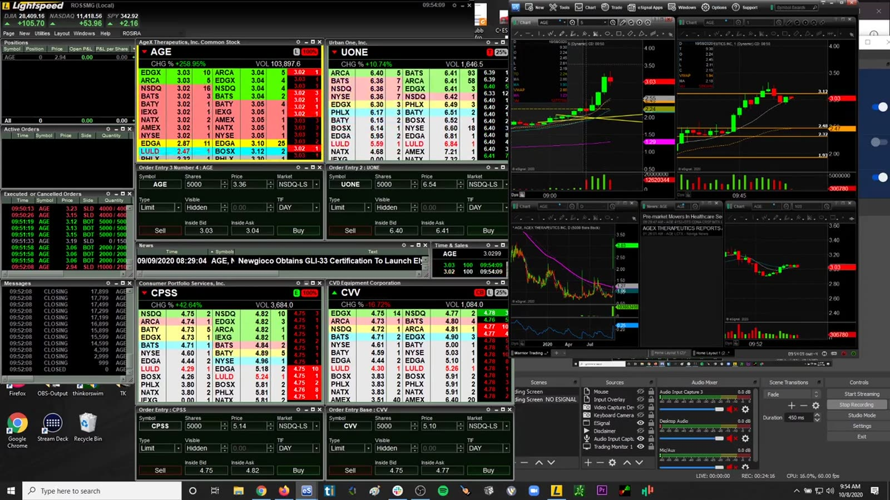
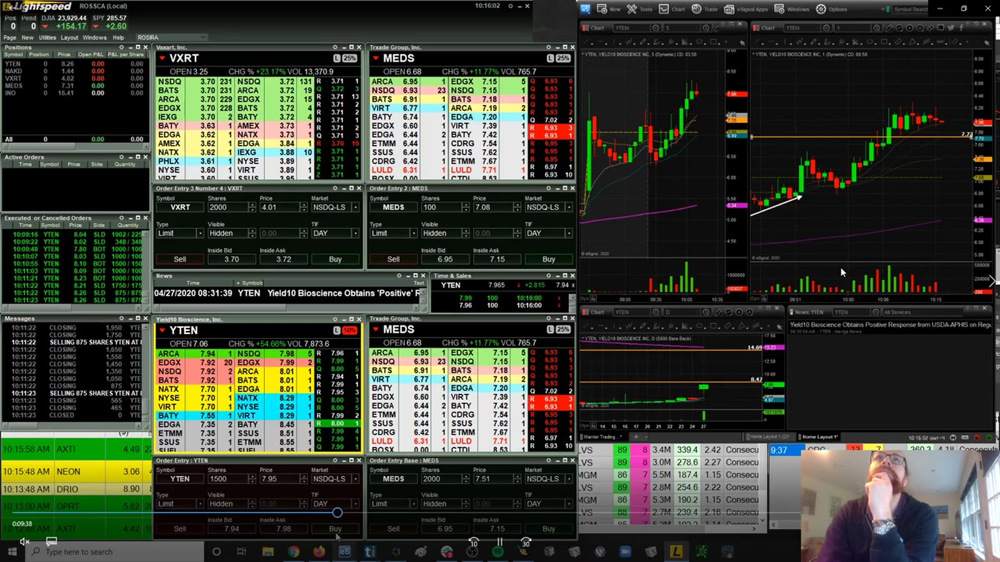
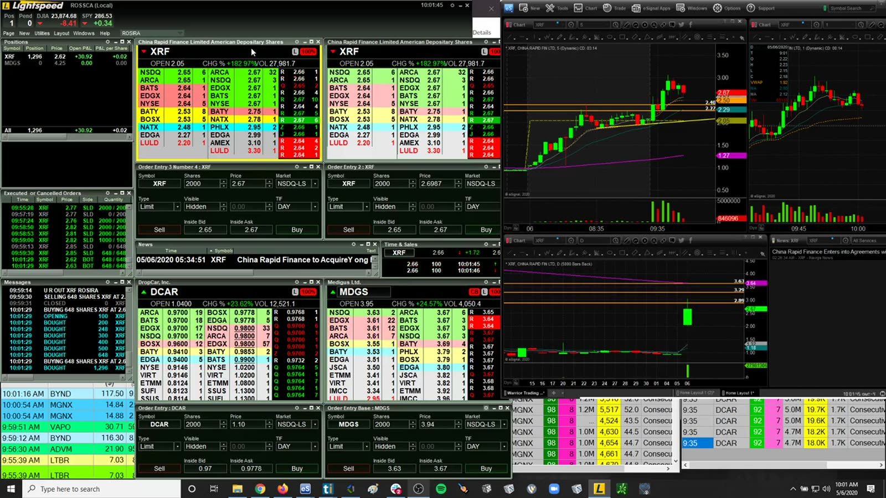
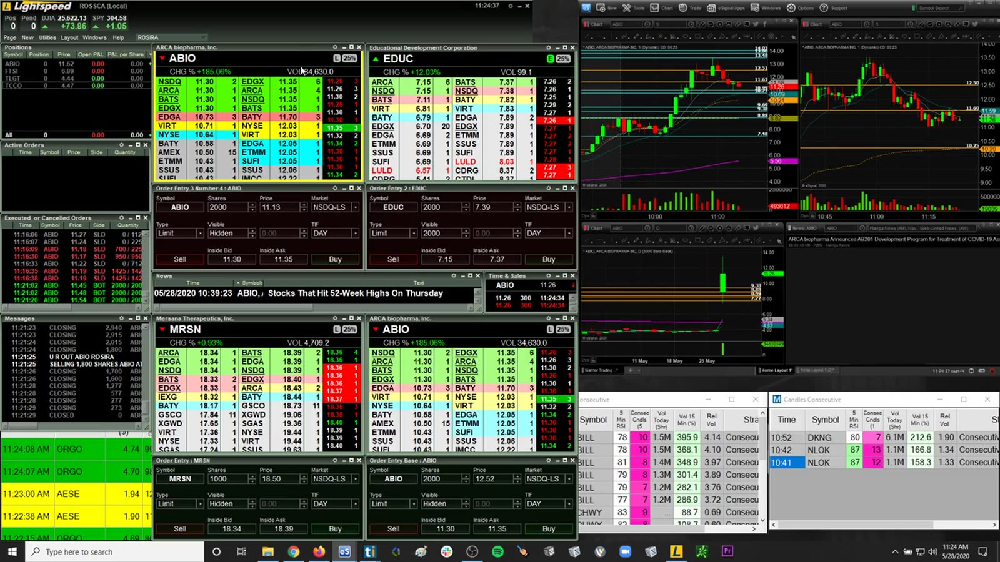
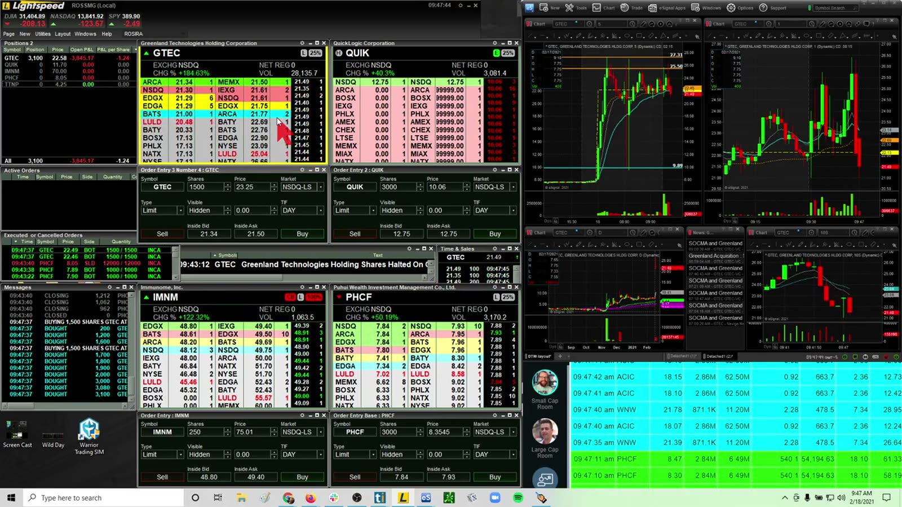
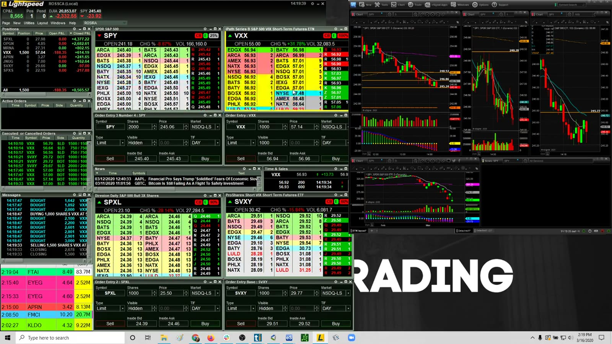
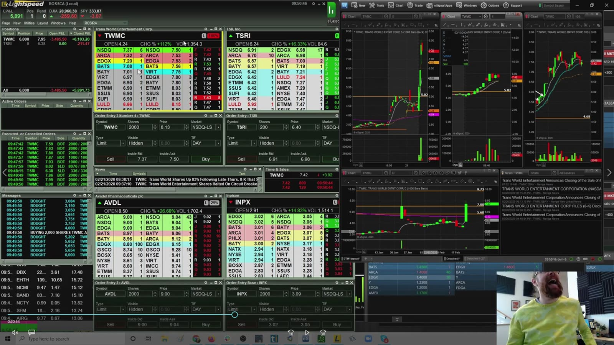

# Live Review 13：Ross Parabolic Moves and Market Products

> 对应视频：v0241–v0250，共 10 段
> 本组包括 GLSI/WNW 这类 parabolic move、IPO、dip buying，以及 VXX/SVXY/SPXS 等市场产品。最后一类不是普通股票，产品结构和持有风险必须先查清。

## v0241：GLSI 极端上涨



**图怎么看：**

- 价格从低位快速进入远高区域，图表尺度被极端行情拉伸。
- 涨幅 2000% 是异常样本，不能用于估计普通交易日收益。
- 停牌、宽 spread 和深度消失会让图上 stop 与成交结果严重偏离。

**复盘：** 将 parabolic/limit-up-like session 排除在普通策略统计外，单独报告实际滑点和最坏复牌风险。

## v0242：WNW 138k day



**图怎么看：**

- 大额美元 P&L 同时反映行情、仓位和账户规模，不能直接迁移。
- WNW 的垂直走势会让每股 stop 迅速变宽。
- 在 winner 上 add 会提高加权成本，回撤时风险非线性增加。

**复盘：** 隐去 P&L 重看一遍，按 entry 时可见信息评分；再用 R-multiple 恢复结果。

## v0243：Airbnb IPO 与 SLS



**图怎么看：**

- 同一 session 同时处理 IPO 与 small-cap，两者微观结构不同。
- IPO 首日没有稳定历史阻力；small-cap 则可能有清楚 bag-holder 区域。
- 切换策略族时仍沿用同样 size/hotkey 会产生风险。

**复盘：** 为 IPO 和 low-float 使用不同 checklist、size 上限和统计，不合并胜率。

## v0244：CARV，大仓与末尾亏损



**图怎么看：**

- 源视频的音轨接近静音，无法可靠转写；本段依据文件标题、可见图表与订单窗口整理。
- 60k shares 一类仓位对 Level 2 深度要求很高，屏幕报价不等于可全部成交。
- 末尾单笔损失说明 peak P&L 后仍在承担显著风险。
- 大仓分批 exit 的平均价通常差于首档 bid。

**复盘：** 用实际 fills 重建 market impact；设置最大 shares、最大 ADV 比例和 peak giveback。

## v0245：momentum dip buying



**图怎么看：**

- Dip 质量取决于前段动能、支撑清晰度和回撤成交量。
- “Bounce off support” 只有在支撑事前定义时才可验证。
- 同板块多只股票同时转弱时，个股支撑更可能失败。

**复盘：** 截下 entry 前画面，遮住后续价格，让自己实时决定是否入场；减少 hindsight bias。

## v0246：XRF dip trades



**图怎么看：**

- 多次回撤说明 volatility 高，早期有效的 dip 规则不一定适用于后段。
- 每次反弹高度若下降，代表 demand 可能在衰减。
- 高频重入会累积滑点和手续费。

**复盘：** 给 touch number、bounce height 和 volume ratio 建字段，测试第几次回撤后 edge 消失。

## v0247：ABIO dips 与 breakouts



**图怎么看：**

- 128 分钟内市场 regime 会变化，早盘 breakout 与午后 dip 不是同一 setup。
- 图中多次拉升和回落应拆为独立 trades。
- 当 range 扩张时，固定热键股数会扩大风险。

**复盘：** 按时间段和 setup 拆分，报告每笔 R，而非用整日 +40k 覆盖中间过程。

## v0248：GTEC 75k day



**图怎么看：**

- 走势强不代表任意 entry 都好；晚入场面对更差的 stop distance。
- 高 P&L 可能来自重仓，必须同时查看 peak drawdown。
- 单只股票的幸运尾部样本会显著扭曲平均收益。

**复盘：** 同时报告 median trade、最大赢家占比和去掉最大一笔后的结果，检查 edge 是否依赖 outlier。

## v0249：VXX、SVXY 与 SPXS



**图怎么看：**

- VXX、SVXY、SPXS 都是交易所交易产品，不等同于持有普通公司股票。
- 反向/杠杆产品通常围绕每日目标设计，长期表现会受复利路径与产品结构影响。
- 多产品同时下单可能是在重复表达同一市场观点，相关风险会叠加。

**复盘：** 交易前阅读当前 prospectus，确认目标、杠杆、再平衡、期限和极端风险；按组合 beta/vol exposure 计算，而非分别看仓位。

官方风险说明可参考 [SEC/Investor.gov 的杠杆与反向 ETF 公告](https://www.investor.gov/introduction-investing/general-resources/news-alerts/alerts-bulletins/investor-alerts/sec) 和 [ETN 公告](https://www.investor.gov/introduction-investing/general-resources/news-alerts/alerts-bulletins/investor-bulletins-50)。

## v0250：TWMC 实盘与讲解



**图怎么看：**

- Commentary 有助于知道当时观察，但讲者也可能在结果后重新解释。
- TWMC 的 spread、volume 与关键水平应从画面/成交记录独立验证。
- 单日 +7k 不能确认策略可靠，需要同规则的完整样本。

**复盘：** 把实时陈述按时间戳写入 journal，与事后 recap 对照；只统计 entry 前出现的理由。

## 尾部样本的处理

```text
普通样本统计
├── regular momentum
├── IPO
├── halt-heavy
├── parabolic outlier
└── market / leveraged / volatility products
```

这些组的分布不同。把 GLSI、IPO 和普通 gapper 混在一起计算平均收益，会同时夸大收益并低估尾部风险。
