# Live Review 14：Ross Reversals and Full-Session Reviews

> 对应视频：v0251–v0262，共 12 段
> 本组从 momentum 延伸到 reversal、完整交易日 replay 和问答。Reversal 不是“跌多了就买”；它需要 exhaustion、结构变化和可验证的 trigger。

## v0251：CRIS morning momentum

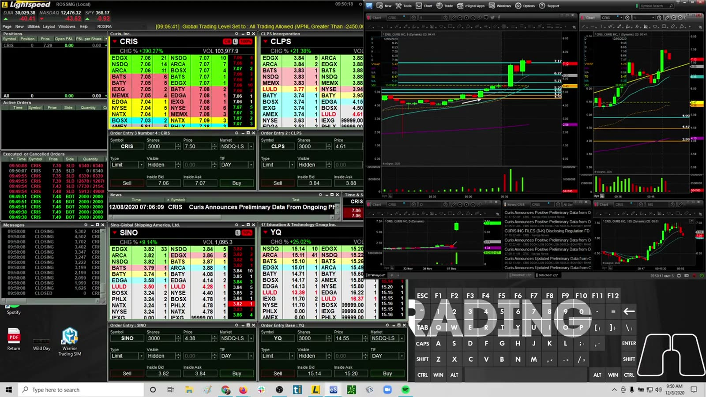

**图怎么看：**

- CRIS 早盘快速扩张后出现多次回撤，短周期 range 明显放大。
- Momentum entry 需要接受较宽的结构止损，或相应降低 size。
- 大额 P&L 不能说明每个 entry 都合理。

**复盘：** 按 opening drive、first pullback、later breakout 拆分，比较哪一段实际贡献 edge。

## v0252：Warrior Pro Q&A

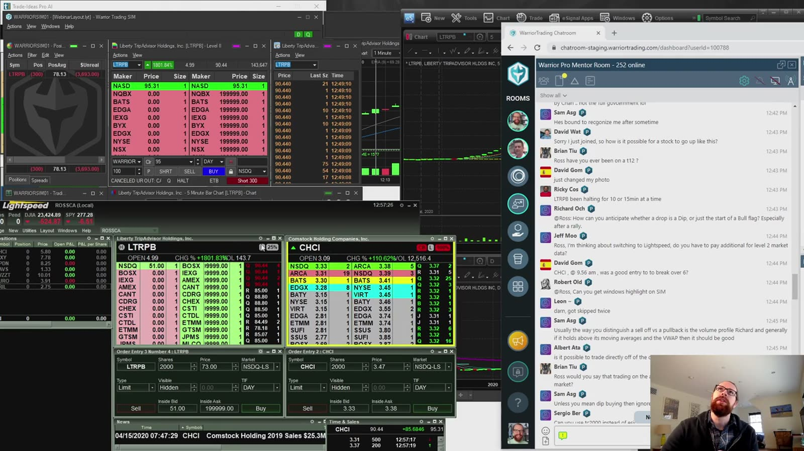

**图怎么看：**

- 问答内容应当作为概念索引，不作为回测数据。
- 学员问题往往省略账户限制、broker、时段和 setup context，答案不能无条件套用。
- 若规则只能靠口头例外解释，说明规则还不够可测试。

**复盘：** 将问题改写成“条件—动作—失效—风险”的规则，并用历史样本验证，而不是收藏一句结论。

## v0253：完整交易日 replay

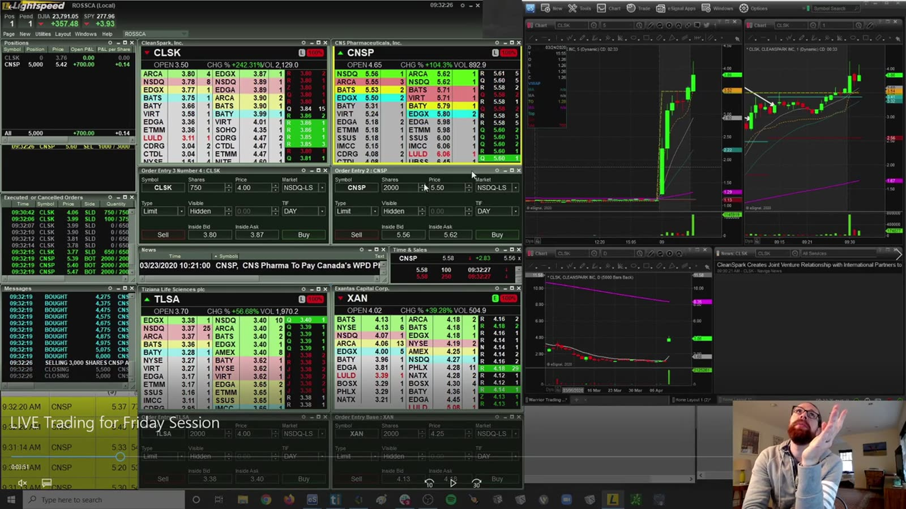

**图怎么看：**

- Full-day replay 保留了等待、错过和亏损，比只看精选交易更接近真实过程。
- 回放时已知道结果，仍会有 hindsight bias；最好遮住右侧未发生走势。
- 多窗口需用统一时钟对齐图表、Level 2、Time & Sales 和订单。

**复盘：** 逐段暂停，在看到后续前写出行动；再与原交易比较，统计计划一致性而非猜涨跌准确率。

## v0254：NCLH reversal

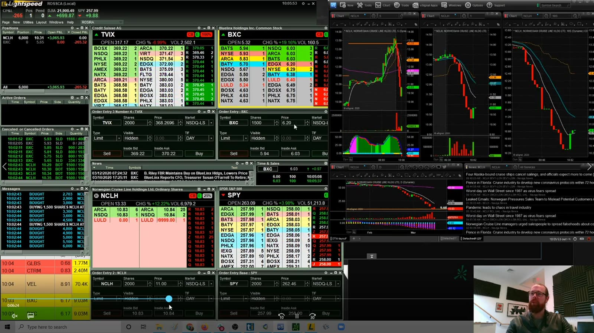

**图怎么看：**

- 下跌后的第一根绿柱不是充分反转证据。
- 更强确认包括卖压衰竭、higher low、关键位 reclaim 和 retest hold。
- Large-cap reversal 还要观察市场/行业是否同步转向。

**复盘：** 区分 anticipation entry 与 confirmation entry，比较早入的好价格是否足以补偿更低胜率。

## v0255：WKHS 低位反转

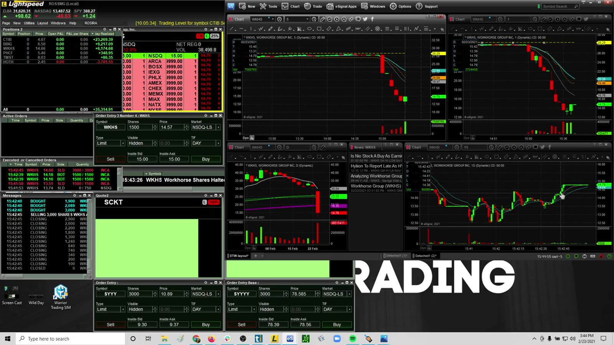

**图怎么看：**

- 价格从低点反弹约 55% 的结果不能倒推出低点可预测。
- Entry 时只能看到 base、higher low 或 reclaim 等有限证据。
- 反弹幅度越大，后来追入越接近另一种 momentum trade。

**复盘：** 固定 reversal trigger，并记录从最低点到 trigger 的“放弃利润”；确认成本是降低 catching-a-falling-knife 风险。

## v0256：SRNE，高 float / 厚成交

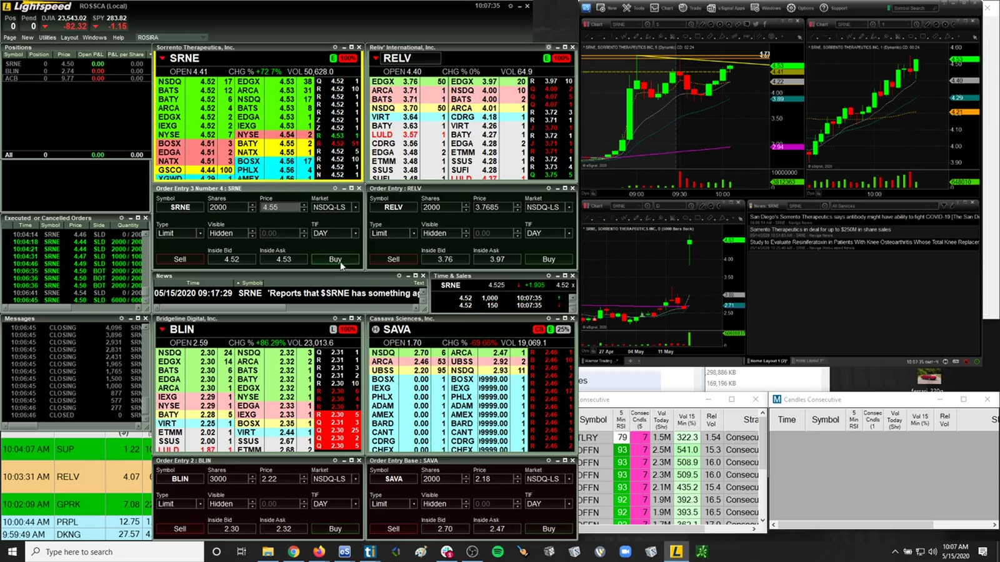

**图怎么看：**

- 约 127M float 的厚交易标的与极低 float squeeze 的速度不同。
- 更厚 depth 可降低单笔冲击，但也可能需要更大真实 demand 才能突破。
- 不能把 low-float hotkey size 和目标直接复制到 SRNE。

**复盘：** 按 float/liquidity bucket 统计 follow-through、spread 和 hold time，分别校准策略参数。

## v0257：MRNA / VXX reversal failure

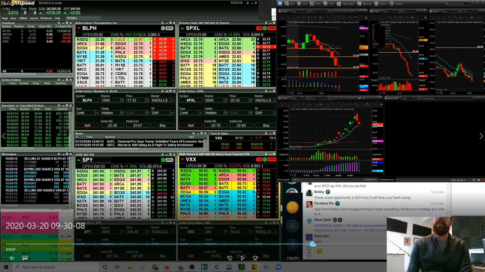

**图怎么看：**

- MRNA 和 VXX 都强烈受大盘/消息影响，逆趋势 entry 容易被持续卖压压制。
- “已经跌很多”不是 demand 出现的证据。
- VXX 属产品结构复杂的 ETP，其风险不能只从普通股票图形理解。

**复盘：** 要求 higher low + reclaim + market confirmation；任一缺失时将 reversal 视为 anticipation，并降低 size。

## v0258：APOP opening range

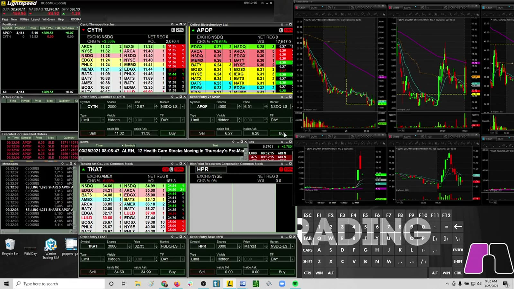

**图怎么看：**

- 开盘最初几分钟 range 极宽，买卖双方尚未形成稳定结构。
- 第一根大蜡烛内追单会让 stop 选择困难。
- Opening range 只有在边界形成后才可定义，不能在中间随意命名。

**复盘：** 比较等待 1/5 分钟 range 完成后的交易与直接开盘 entry，统计 slippage 和假突破。

## v0259：EDSA / KNDI / TAOP 多标的 session

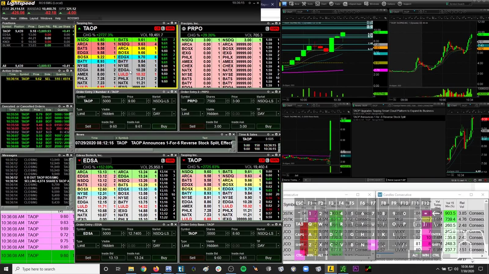

**图怎么看：**

- 原文件名为哈希值；语音可确认开盘先选 KODK、错过 EDSA 停牌，随后交易 KNDI，并继续处理 TAOP、EDSA、PRPO 等候选。
- 讲解直接指出“很多股票同时拉升时很难决定跳哪一只”，这正是 scanner overload 与追价风险。
- 后段把 EDSA 误记成自己历史最大亏损标的，随后才更正为 ESTR，说明记忆不能替代交易记录。

**复盘：** 用 broker ledger 核对每只实际成交，单独标记因错过 EDSA 后产生的 FOMO、KNDI 追价止损，以及多标的切换是否突破最大风险。

## v0260：DPW / JFIN / CRIS session

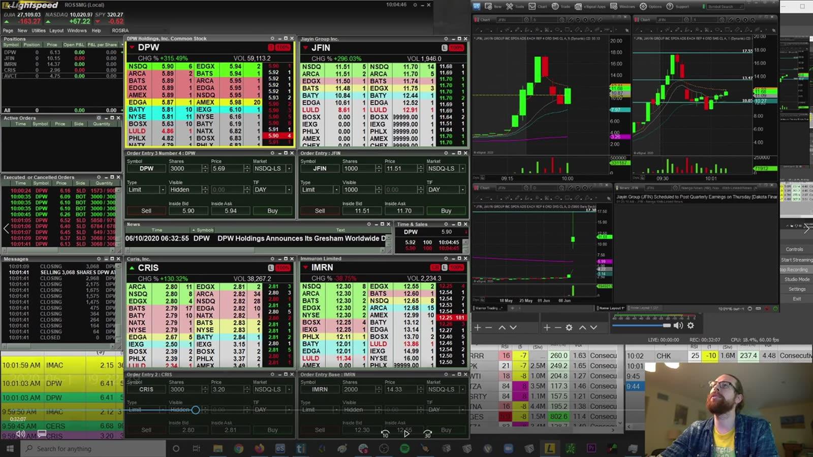

**图怎么看：**

- 原文件无描述性标题，画面显示多个 momentum ticker 同时活跃。
- 语音可确认这是在连续两个极强盈利日后的 recap，重点包括 DPW、JFIN/IMRN，以及“热 streak 何时结束”的 FOMO。
- 同类股票可能受共同主题推动，相关仓位不是独立风险；101 次交易一类高频结果也不能只按日净利润评价。
- 不同窗口的时间周期和缩放不同，视觉涨幅不能直接比较。

**复盘：** 对齐 ticker、timestamp 和订单记录，计算交易次数、最大赢家占比和 peak giveback；检查前一日“少赚”的感觉是否推动当天过度交易。

## v0261：困难市场 Q&A 与 IGC / NTN 实盘

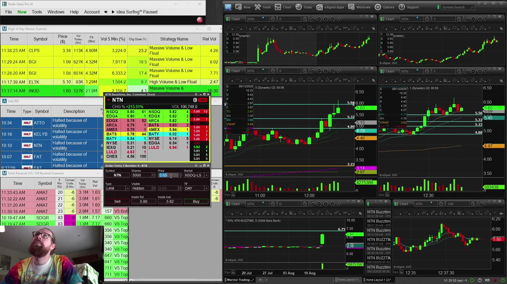

**图怎么看：**

- 原文件名为哈希值；音频确认前半是困难市场 Q&A，讨论连续红日、市场降温时缩小目标，以及小账户不要过早 add。
- 中段用 IGC、NTN 讲 VWAP、Level 2、limit order、float/liquidity 与 overnight gap risk，后段转入实盘并保留 broker 订单记录。
- 讲师在 IGC 亏损后通过 NTN 盈利补回部分损失；仍需分别评价两组交易，不能让净结果覆盖 earlier mistakes。

**复盘：** 从 broker record 重建 IGC 与 NTN 的逐笔 ledger，核对课堂规则与 live adds 是否一致；将“市场困难”量化为 follow-through、topping tail 和 VWAP failure，而非只看个人 P&L。

## v0262：HUGE / GNUS / WISA session

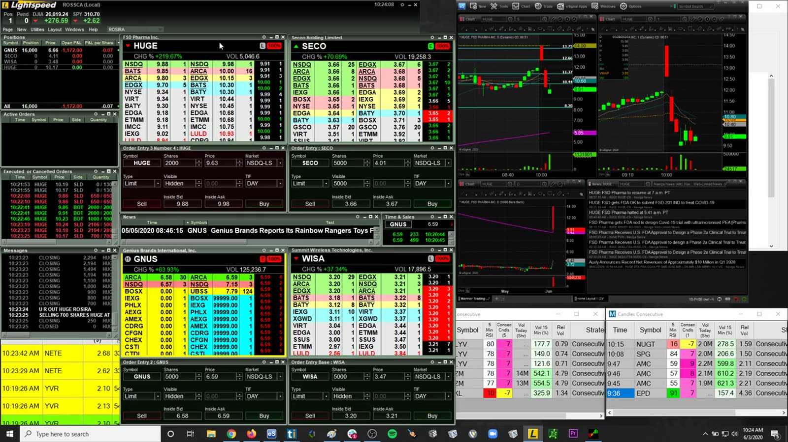

**图怎么看：**

- 原文件无描述性标题；HUGE、GNUS、WISA 在画面中呈现不同强弱。
- 一只突破时另一只可能已回落，scanner 同时出现不代表信号等价。
- 需要确认 catalyst、relative volume 与 entry 前的结构，而非按最终涨幅选择赢家。

**复盘：** 保存当时完整 watchlist，统计所有符合规则的候选，避免只复盘事后上涨的 ticker。

## Reversal 最小定义

```text
extended decline
→ selling pressure slows
→ failed new low / higher low
→ key level reclaim
→ retest holds
→ entry with structural invalidation
```

越早入场，价格越好但证据越少；越晚确认，胜率可能更高但止损/盈亏空间会变化。两者应作为不同策略分别统计。
