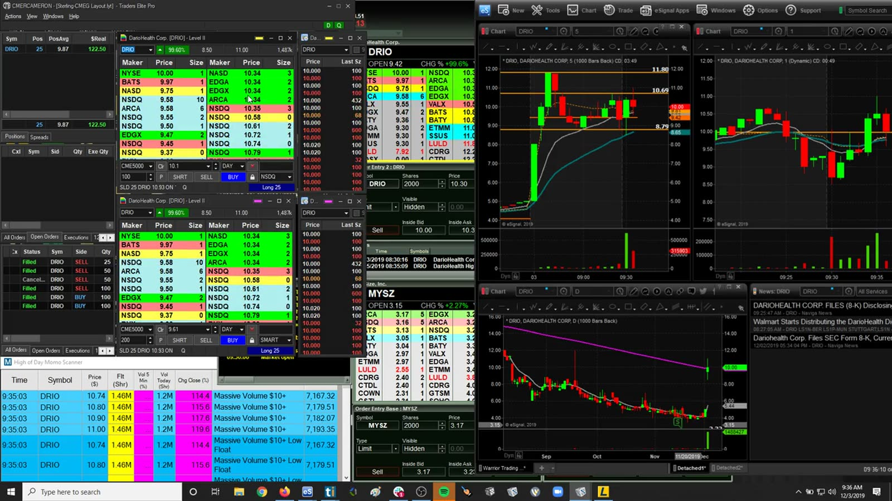
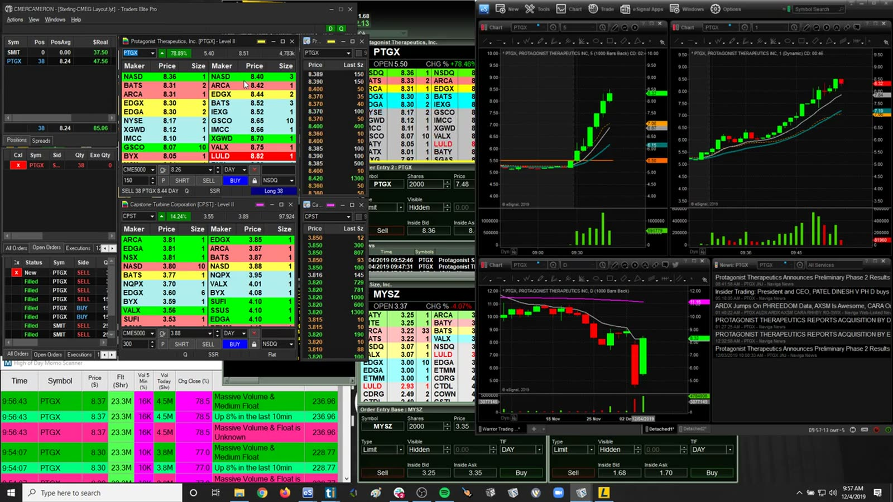
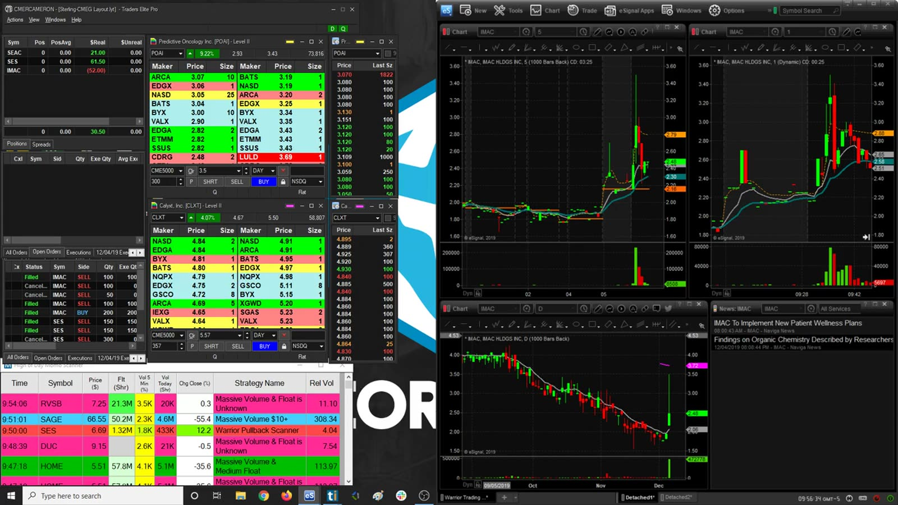
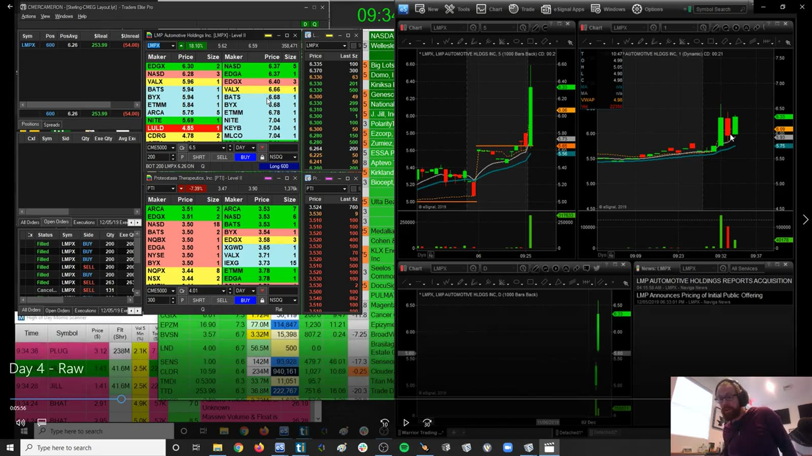
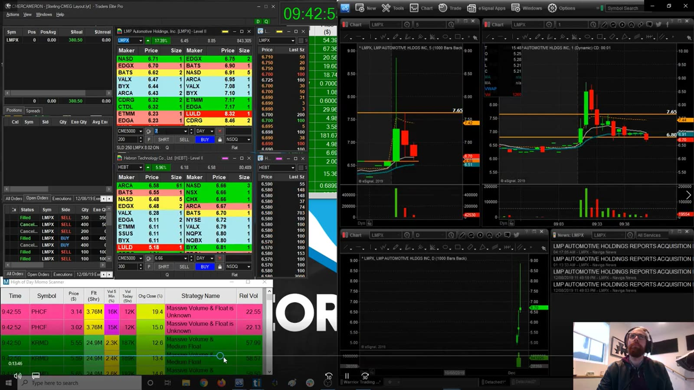
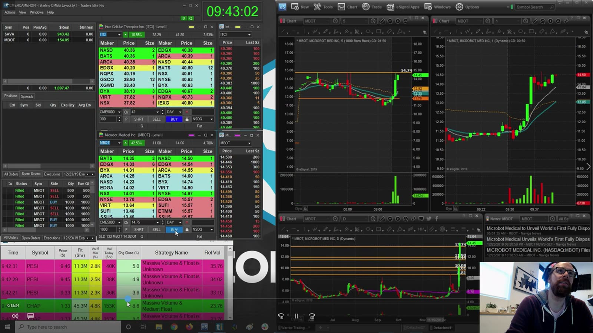
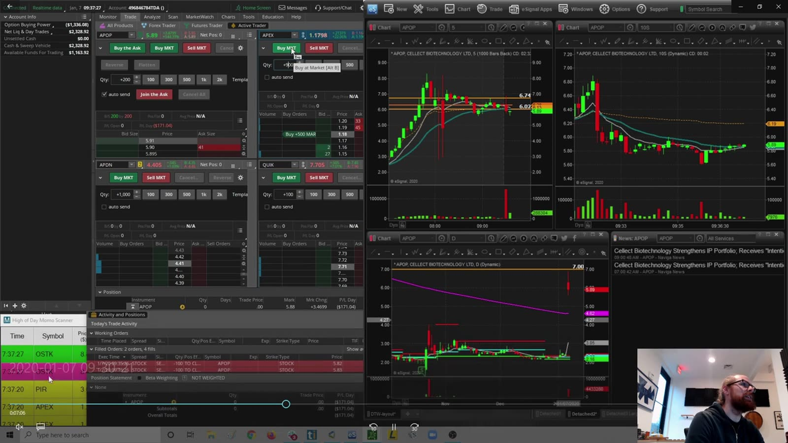

# Live Review 15：Small Account Challenges

> 对应视频：v0263–v0269，共 7 段
> 前 6 段是 2019 年 12 月 small-account 记录，最后一段是 TD Ameritrade challenge。它们展示账户限制如何改变下单，但不是把小账户快速放大的收益承诺。课程年代的结算、日内交易和经纪商规则可能已变化，应以当前账户协议与监管规则为准。

## v0263：December challenge，Day 1

**图怎么看：**

- 小账户的 buying power 有限，单笔手续费/费用和滑点占比更高。
- DRIO 的快速走势会诱导用过大仓位追求有意义的美元收益。
- 第一天的结果没有统计意义，重点是流程是否能持续。

**视频内容：** Challenge Day 1 的主交易是 DRIO。画面同时显示小账户平台、DRIO 的 Level 2、多周期图和 scanner，能看到价格从低位放量推进后进入快速波动。视频首先建立账户可用资金与下单限制，再选择 DRIO、执行入场和退出；学习重点应是每股止损如何换算成小账户可承受的股数，而不是为了让美元利润显得“值得”就使用接近全部 buying power。

**复盘：** 用账户净值百分比和 R 表示风险，记录所有费用；先设置每日最大亏损，不设置每日必须盈利。

## v0264：Day 2

**图怎么看：**

- 画面显示强势标的、scanner 与订单窗口，但账户限制会影响是否能及时重用资金。
- 不能为了“账户小”而放宽 setup 标准。
- 一次盈利后可用资金变化，不等于风险承受能力同比例上升。

**视频内容：** Day 2 保留帧以 PTGX 为主要窗口，同时可见其他 scanner 候选。PTGX 先在盘前/早盘形成强势推进，随后有回撤和再次尝试上行；账户平台则显示可用 buying power 与持仓受限。视频延续 Day 1 的流程，重点是前一日结果如何影响当天可下单规模，以及是否仍按同一 setup 标准选择交易，而不是因账户刚增长就立刻按更大的固定股数执行。

**复盘：** 每日开始前按净值重算固定风险百分比；禁止按目标美元利润反推股数。

## v0265：Day 3，-74.50

**图怎么看：**

- 小额美元亏损也要判断是否违反规则，不能因金额小忽略过程。
- 多标的快速切换可能增加不必要交易和费用。
- 账户净值较小时，几次连续小亏会显著压缩后续仓位。

**视频内容：** 标题记录 Day 3 最终约 -74.50；画面中可见 IMAC、SES 等持仓/候选以及多只 scanner 股票，说明亏损来自一个完整的选择与切换过程，而非只看最终金额。应按顺序记录第一只选择、止损、是否换股和所有费用。对小账户而言，几十美元可能已是显著 R 值；若过程违反最大次数或 setup 标准，就不能因绝对金额看似不大而忽略。

**复盘：** 记录亏损占净值比例、setup quality 和是否达到停止条件；次日不提高 risk 追补。

## v0266：Day 4，-427

**图怎么看：**

- -427 对小账户可能是显著百分比回撤，不能只与讲师大账户数字比较。
- 开盘大波动中的实际成交可能远差于计划 stop。
- 连续挑战叙事容易制造“必须在今天翻回去”的压力。

**视频内容：** Day 4 标题记录约 -427，保留画面显示小账户持仓窗、LMP 等活跃股票及开盘后的宽幅蜡烛。视频的转折不是金额本身，而是账户在前三天之后继续面对高波动开盘时，单次止损和滑点占净值的比例已经很高。应逐笔核对哪一次把正常交易变成大幅回撤，以及触发停止条件后是否还继续尝试，不能用挑战进度要求自己当天翻回。

**复盘：** 若单日损失超过预定百分比，暂停并审查；恢复时降低 size，不以回本为目标。

## v0267：Day 5

**图怎么看：**

- 多日结果会受到市场 regime 影响，五天仍是很小样本。
- 图上的强势走势不能说明每个账户都能获得相同 fills。
- 需要把未成交、部分成交和错过也保留，避免幸存者偏差。

**视频内容：** Day 5 的画面保留了早盘 scanner、持仓/订单窗口，以及 PHCF、ITP 等活跃候选和多周期图。它展示的是从 watchlist 到下单的完整筛选，而不是某一只股票的宣传片。复盘时要把“看见但没成交”“订单只成交一部分”“主动放弃”与实际 trades 一起记录；否则五天样本会只剩成功获得 fill 的股票，严重高估小账户的可复制执行。

**复盘：** 连续记录至少同一规则下的足够样本，再判断 expectancy；不要因短期 streak 修改策略。

## v0268：Day 13，8,163.71

**图怎么看：**

- 大额单日结果可能由少数 outlier、较大 size 或特殊行情贡献。
- 随账户增长快速提高仓位会放大回撤路径。
- 一天的极端赢家会拉高平均值，应查看 median 和去掉最大赢家后的结果。

**视频内容：** 标题记录 challenge Day 13 当日约 8,163.71；保留帧中账户持仓窗、scanner 与多只突破图表并列，显示收益来自多笔执行和更大的可用规模，而非一个可直接复制的固定 setup。学习时应还原当天最大赢家、其他普通交易和任何回撤，再比较 Day 1 到 Day 13 的 shares 是如何变化的；若仓位增速快于账户可承受风险，极端赢家会掩盖未来同尺度亏损。

**复盘：** 把当日所有 trades 换算为 R，并报告最大一笔占总利润比例、peak drawdown 和 rule adherence。

## v0269：TD Ameritrade challenge，Day 1

**图怎么看：**

- 不同 broker 的订单路由、平台、费用、可交易时段和账户限制可能不同。
- 课程中的界面与规则属于录制年代，不能作为当前经纪商功能说明。
- Broker 改变不会自动创造 edge；它只改变执行条件。

**视频内容：** 最后一段转到 TD Ameritrade challenge Day 1，画面与前六天的平台不同：可见新的订单票、买卖按钮、持仓和图表布局。视频实际在演示同一交易流程迁移到另一经纪商后，订单类型、热键/按钮、成交反馈和 buying power 如何变化。学习重点是先用小规模确认订单行为与费用，再执行原有 setup；不能把换平台后的任何盈利或亏损误认为策略 edge 发生改变。

**复盘：** 开始前核对当前账户类型、结算资金、日内交易限制、short locate 和订单类型；用小规模实测实际 fills。

## 小账户规则

1. 风险按账户净值百分比与结构止损共同决定，不按想赚多少决定。
2. 将佣金、监管费用、平台费、borrow/locate 和滑点计入结果。
3. 保留未成交与错过的信号，防止只挑成功 fills。
4. 不为挑战进度追单；daily max loss 触发后停止。
5. 只有在足够样本显示正 expectancy 且执行稳定时，才逐级加仓。

## 当前规则提醒

- 自 2024-05-28 起，多数美国 broker-dealer 证券交易的标准结算周期已从 T+2 改为 T+1；现金账户仍须按实际 settled funds 与本人券商规则操作。参见 [SEC T+1 说明](https://www.sec.gov/newsroom/press-releases/2024-62)。
- FINRA 的新 intraday margin requirements 已于 2026-06-04 生效，但会员公司可在过渡期内迁移，最迟到 2027-10-20。因此当前账户可能仍执行旧 PDT 框架，也可能已采用新框架；以本人券商当日通知为准。参见 [FINRA 当前说明](https://syndication.finra.org/content/understanding-new-intraday-margin-requirements)。
- 具体限制最终取决于当前监管要求、账户类型和经纪商实施方式；实盘前重新查官方资料。
