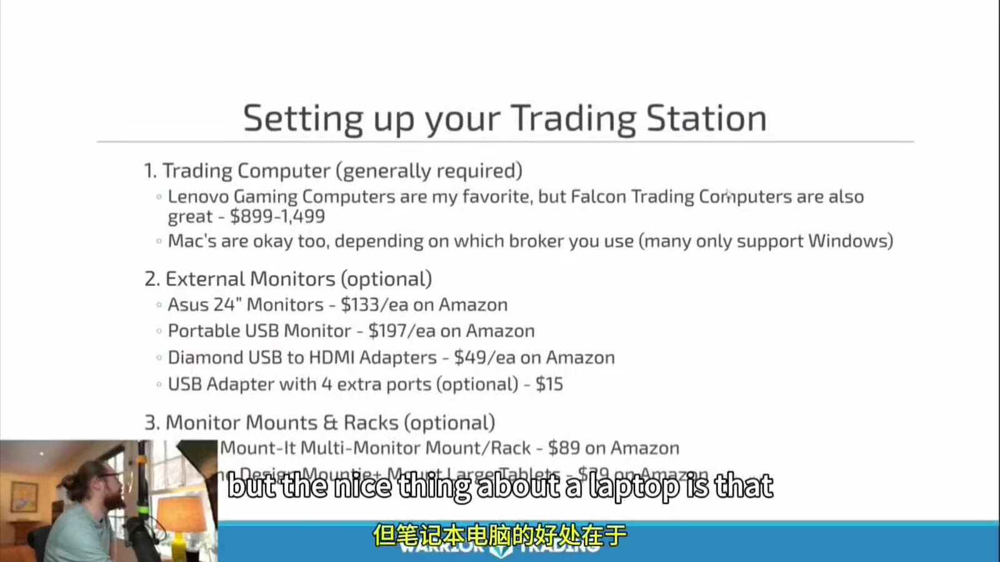
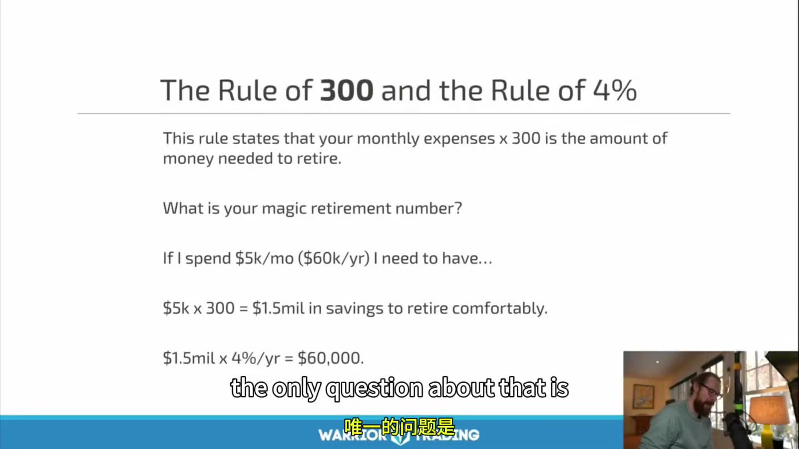

# Starter 01：课程边界、学习流程与现实目标

> 对应视频：Onboarding（00:54）与 Chapter 1 Becoming a Day Trader（64:57）
> 本节重点：先确定这套课程能解决什么、不能解决什么，再建立模拟、记录、复盘和转入实盘的最低门槛。

## 1. Onboarding 不是交易策略

**图怎么看：**

- 画面列的是会员内容、登录、教育门户和客服联系方法，属于平台使用说明。
- 这些信息不能证明策略有效，也不影响交易规则；原平台入口失效时可以直接跳过。
- 真正需要保留的是后续课程中的概念、图表、执行过程和风险边界。

## 2. 先承认这件事很难

课程开头明确承认多数主动交易者无法持续盈利，也没有承诺完成课程就能赚钱。这一点比后面的收益案例更重要。

学习目标不应该写成“看完后每天赚多少”，而应分成四层：

1. **识别**：能准确说出 setup、trigger、invalidation 和 exit。
2. **执行**：在模拟盘中按计划下单，不临时改变规则。
3. **统计**：能用足够样本计算胜率、平均盈利、平均亏损和成本。
4. **适应**：发现策略失效或市场环境变化时，能缩小仓位或停止交易。

单笔盈利只能说明那一笔赚钱，不能证明已经掌握策略。

## 3. 课程地图的正确用法

Chapter 1 给出的路线从市场基础、账户、基本面和技术面，逐步进入订单、Level 1、Level 2、Time & Sales、停牌、扫描器、风险和心理。

合理顺序是：

`概念 → 看图 → 模拟下单 → 记录 → 复盘 → 小规模验证`

不合理顺序是：

`快速看完视频 → 直接模仿老师下单 → 用盈亏判断自己是否学会`

课程建议不要在 48 小时内快速刷完。原因不是记忆力，而是交易概念需要经过三种验证：

- 能不能在静态图上解释；
- 能不能在实时变化中识别；
- 能不能在有仓位和盈亏波动时仍按规则执行。

## 4. 不要 Mirror Trade

视频明确反对盲目复制老师、群聊或知名投资者的交易。即使股票代码和方向相同，下面这些变量仍可能完全不同：

| 变量 | 为什么会改变结果 |
|---|---|
| 入场时间 | 延迟数秒就可能改变止损距离和赔率 |
| 仓位占比 | 相同股数对不同账户不是相同风险 |
| 持仓成本 | 别人可能已经有很厚的浮盈缓冲 |
| 退出计划 | 对方可能分批、对冲或使用其他账户 |
| 信息时点 | 你看到披露时，原交易可能早已发生 |
| 流动性 | 后进入者可能承担更大的点差和滑点 |

看到别人买入只能作为研究线索，不能替代自己的交易计划。

## 5. 模拟盘是流程测试，不是盈利证明

课程建议先用 simulator，并至少证明一段时间可以盈利后再考虑实盘。这个方向正确，但“模拟盈利一个月”仍不是充分条件。

模拟盘常常低估：

- 点差突然扩大；
- 排队得不到成交；
- 部分成交；
- 停牌和跳空；
- 借股困难与 locate 成本；
- 真实亏损带来的冲动下单。

更完整的实盘前门槛应包括：

- 至少覆盖不同市场状态，而不只是连续几周顺风行情；
- 每个 setup 有独立样本，不能把所有交易混在一起；
- 计入佣金、平台费、监管费、借股费和合理滑点；
- 最大单笔亏损与最大日亏损都在计划范围内；
- 没有靠一两笔异常大盈利撑起全部结果；
- 能连续执行止损，而不是只在模拟环境中“事后画止损”。

## 6. 设备的目标是可靠，不是堆屏幕

**图怎么看：**

- 画面把交易电脑列为基本设备，外接屏幕和支架列为可选项。
- 多屏只是增加同时可见的信息量，不会自动增加策略优势。
- 真正影响风险的是行情是否延迟、网络是否稳定、下单平台是否有应急退出通道。
- 视频中的品牌、价格和平台来自录制当时，不能当作当前采购建议。

最小可靠配置应优先保证：

1. 有线或稳定网络；
2. 行情、图表和订单时间同步；
3. 主平台失效时能用网页或手机撤单、平仓；
4. 开盘前确认 buying power、持仓和活动订单；
5. 不在飞机、移动网络不稳定或无法处理停牌的位置持有高风险仓位。

“可以在任何地方交易”描述的是技术可行性，不代表任何地点都适合承担实时仓位。

## 7. 软件只是工具

视频展示了 eSignal、Lightspeed、扫描器、新闻源和交易日志服务。应把它们按功能理解，而不是记品牌：

| 功能 | 最低要求 |
|---|---|
| 图表 | 时间周期、成交量、价格调整和数据源清楚 |
| 券商 | 受谁监管、资金和证券如何托管、订单如何路由 |
| 扫描器 | 条件定义可解释，不能只看“热门”标签 |
| 新闻 | 能区分公司公告、监管文件和二手标题 |
| 日志 | 保存原始成交、费用、截图、计划与执行偏差 |

课程提到使用境外券商绕开当时的 PDT 限制。这里不能只比较账户门槛：还必须核实监管辖区、投资者保护、出入金、做空规则、平台稳定性和争议处理机制。

## 8. 2026 年的日内保证金规则不能照搬旧视频

视频按旧规则描述“美国保证金账户低于 25,000 美元时，五个交易日内只能有限次数日内交易”。FINRA 已发布新的 intraday margin standards，自 2026 年 6 月 4 日生效；允许券商最晚在 2027 年 10 月 20 日前完成过渡。因此当前实际限制取决于券商是否已经迁移，不能只背旧的“四次/五日”和 25,000 美元门槛。

开户或改变交易频率前，应直接查看券商当前的：

- intraday margin 计算方式；
- 实施或过渡日期；
- 账户类型和产品覆盖范围；
- margin call 与强平政策。

官方说明：[FINRA — Understanding the New Intraday Margin Requirements](https://syndication.finra.org/content/understanding-new-intraday-margin-requirements)

## 9. 收益案例不能替代基准

课程用较大日盈利和小账户增长描述可能性。这些数字最多说明讲师声称自己曾达到某个结果，不能推导出学习者的成功概率。

尤其要警惕三个错觉：

- **忽略基数**：从少数成功者反推所有学习者。
- **忽略尾部损失**：只看平均日盈利，不看最大回撤和爆仓路径。
- **忽略容量**：小盘股策略放大仓位后，自己的订单会改变成交价格。

更有用的目标单位是 `R`：

`R = 单笔交易预先允许的最大亏损`

如果计划风险为 50 美元，那么 `+2R` 是 100 美元，`-1R` 是 50 美元。用 R 可以比较不同账户和不同价格股票，而不是把“每天 1,000 美元”当成普遍目标。

## 10. 4% Rule 与 Rule of 300

**图怎么看：**

- 图中的例子是月支出 5,000 美元，年支出 60,000 美元。
- `5,000 × 300 = 1,500,000`，而 `1,500,000 × 4% = 60,000`，所以两个写法在算术上等价。
- 这只是长期资产提取的粗略规划方法，不是账户可以“永远不耗尽”的保证。
- 实际结果受投资组合、估值、通胀、税、费用、退休年限和回报顺序影响。

这个公式可以帮助把模糊目标转换为支出预算，但不能用于证明日内交易能稳定替代退休资产。

## 11. 把财务目标与交易目标分开

财务目标回答：

- 每月必要支出是多少？
- 应急资金是否独立？
- 可以承受全部损失的交易资本是多少？
- 多久需要从账户提款？

交易目标回答：

- 只交易哪些 setup？
- 每个 setup 需要多少样本？
- 单笔、单日和单周最多亏多少？
- 出现什么条件必须停止？

如果生活费用依赖当天盈利，交易者更容易强行找机会、放大仓位和报复交易。交易资本不应替代应急资金。

## 12. 第一阶段检查表

在继续后续章节前，应能完成：

- 用一句话描述自己要研究的市场和持仓周期；
- 解释为什么不复制群聊里的交易；
- 配置模拟盘、行情、图表和交易日志；
- 写下单笔风险与单日停止线；
- 区分学习目标、财务目标和收益愿望；
- 接受“最终可能不适合主动交易”也是有效结论。

Chapter 1 最值得保留的不是收益数字，而是三条边界：不保证成功、不盲目跟单、未验证前不使用真实资金。
