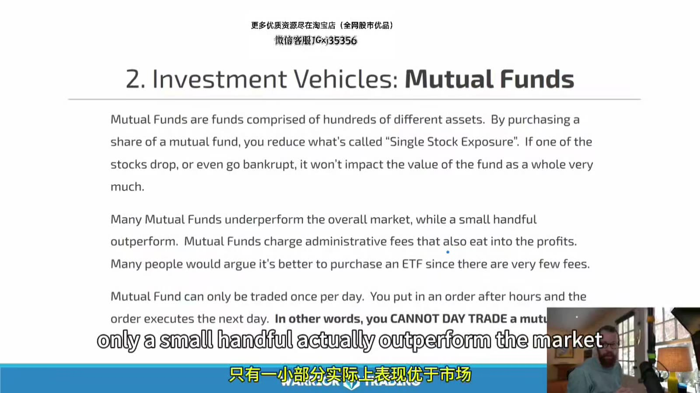
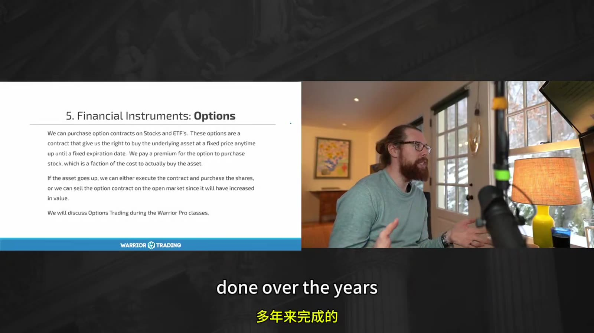
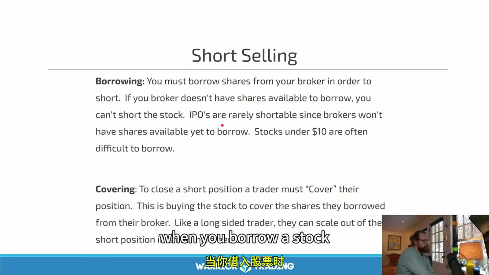
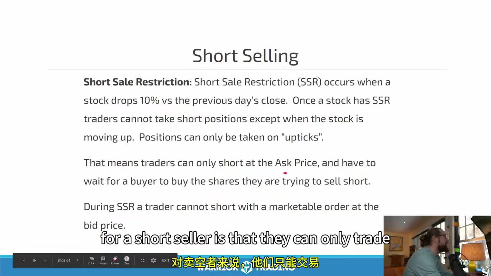
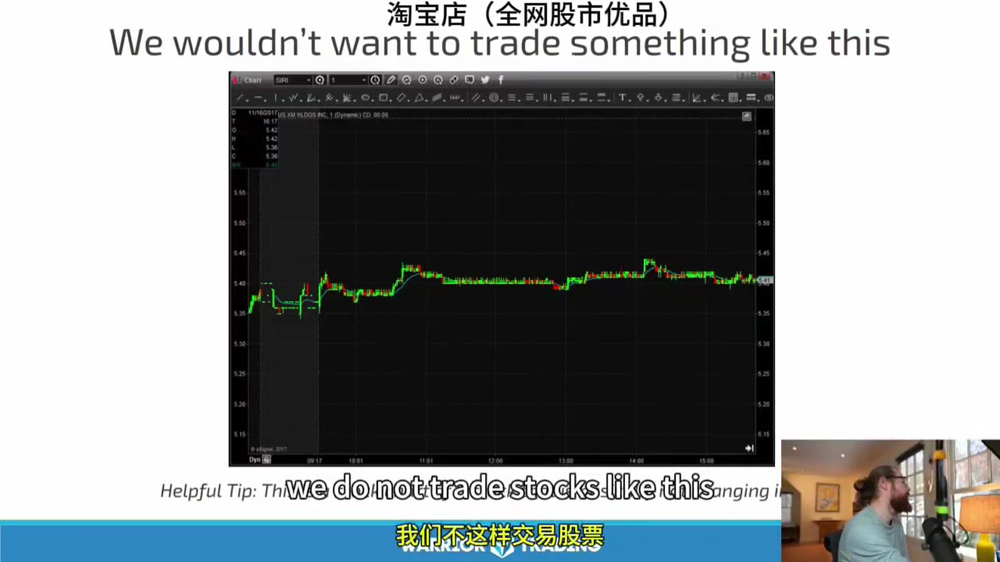
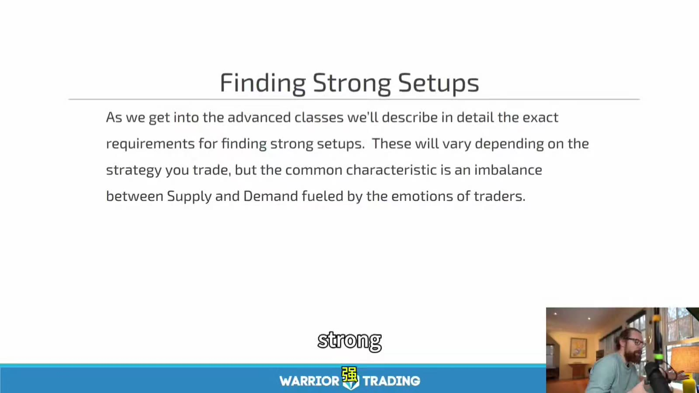

# Starter 02：交易品种、Long/Short 与股票质量

> 对应视频：Chapter 2 Part 1–3（34:07、21:06、33:34）
> 本节重点：区分不同金融工具，理解做多与做空的现金流，并把“强势股”拆成可核验的流通盘、催化、相对成交量和价格行为。

## 1. 先区分工具，不要把所有市场当成同一种交易

课程依次介绍股票、共同基金、指数、ETF、期权、商品和外汇。判断一个工具是否适合日内交易，至少要看：

- 是否能在盘中连续成交；
- 买卖价差和深度；
- 价格波动是否足以覆盖成本；
- 是否有杠杆、到期、保证金或强制平仓；
- 数据和交易时段；
- 自己是否被券商批准交易该产品。

**图怎么看：**

- 画面强调共同基金由多项资产构成，可以降低单一股票敞口。
- 共同基金通常按每日净值处理，不像交易所上市股票和 ETF 那样盘中连续报价，所以不是常规日内交易工具。
- 课件把“共同基金通常跑输市场”写得过于笼统；主动基金表现取决于类别、基准、费用和观察区间，不能用一句话概括全部产品。

### 股票

股票代表公司的权益。日内交易关注的是可交易价格、流动性和事件驱动，不等于对公司长期价值作出判断。

### ETF

ETF 在交易所盘中成交，可以跟踪指数、行业、商品或其他资产。即使底层指数波动不大，杠杆或反向 ETF 仍可能有很高路径风险和持有成本。

### 期权

**图怎么看：**

- 画面把期权描述为以权利金换取按约定价格买卖底层资产的权利。
- 买方有权利而非义务；卖方收到权利金，同时承担被指派后的履约义务。
- 期权价格不只受方向影响，还受剩余时间、隐含波动率、利率和底层价格相对执行价的位置影响。
- “买方最大亏损是权利金”只适用于没有额外融资或复杂腿部风险的单纯多头期权；卖方风险结构完全不同。

美国券商通常要求单独批准期权权限。FINRA 提醒，未平仓的短期权可能在到期前被指派，多腿策略也可能因其中一腿被指派而暴露新的股票或保证金风险。
官方说明：[FINRA — Options](https://www.finra.org/investors/investing/investment-products/options)

## 2. Market Cap、Shares Outstanding 与 Float

三者不能混用：

`Market capitalization = 当前股价 × 已发行在外股份数`

- **Shares outstanding**：公司已发行、目前由投资者持有的股份。
- **Public float**：通常指排除内部人、控股股东等受限持股后，公众可交易的部分。
- **实际盘中供给**：当日真正愿意在当前价格附近卖出的数量，通常小于名义 float。

课程把 float 近似说成“shares outstanding”会造成误解。低 float 只是名义供给较少，不代表 Level 2 上一定没有卖单，也不代表价格必然上涨。

## 3. 为什么课程偏好低价、低 Float 股票

课程策略集中在：

- 较低股价；
- 较小 public float；
- 当日上涨幅度大；
- 有新闻或其他催化；
- 成交量显著高于过去；
- 成为市场主要关注对象。

其逻辑是：有限可交易供给遇到突然增加的需求，价格更容易快速移动。

但同一特征也会放大：

- 点差；
- 滑点与部分成交；
- 停牌；
- 融资或增发风险；
- 借股成本；
- 做空挤压；
- 单一大订单对市场的影响。

因此“波动大”是机会来源，也是执行风险来源，不能只保留前半句。

## 4. Long 的现金流

做多流程：

1. 买入股票；
2. 账户承担股票下跌风险；
3. 通过卖出平仓。

每股损益：

`P&L = 卖出价 - 买入价 - 每股交易成本`

极端情况下普通股票价格可接近零，所以无杠杆多头的理论最大损失接近投入资本。使用保证金后，还要考虑强平和欠款。

## 5. Short 的现金流

**图怎么看：**

- 做空前需要有合理的 locate/borrow 安排；券商没有可借股份时，不能因为看跌就直接卖出。
- 开仓时卖出借来的股份，平仓时买回并归还，即 buy to cover。
- 低价股、IPO 和高拥挤度股票可能 hard to borrow，但不能用固定“10 美元以下”作为普遍边界。
- 借股可用性和费用会随券商、日期甚至盘中时点变化。

每股损益：

`Short P&L = 卖空价 - 回补价 - 借股与交易成本`

股票上涨没有理论上限，因此裸露空头损失也没有固定上限。风险预算必须按止损后的美元损失计算，不能按收到的卖空收入计算。

## 6. SSR：课件的“只能在上涨时做空”不够精确

**图怎么看：**

- 课件正确指出：当上市市场确认股票相对前收盘价盘中下跌至少 10% 后，会触发 Rule 201 的价格测试。
- 但“只能在 uptick/ask 做空”是交易口语，不是规则的精确定义。
- 核心限制是：在 SSR 生效时，受覆盖的非豁免卖空单通常不能在当前 national best bid 或更低价格被显示或执行。
- 这不代表价格每一跳都必须上涨，也不能把 ask、last price 和 national best bid 混为一谈。

限制通常持续到触发当日剩余时间以及下一交易日；触发判定由上市市场作出。
官方说明：[SEC — Rule 201 FAQ](https://www.sec.gov/rules-regulations/staff-guidance/trading-markets-frequently-asked-questions-7)

## 7. Relative Volume 要先定义比较基准

课程使用的基本概念是：

`Relative volume = 当前成交量 ÷ 同期或日均基准成交量`

如果过去平均每日成交 250,000 股，而今天成交 2,500,000 股，按“整日对整日”口径就是 10 倍。

实际平台可能采用：

- 当前时刻与过去同一时刻比较；
- 当前整日累计量与 30 日平均整日量比较；
- 不同回看窗口；
- 是否排除盘前盘后。

所以看到 `RVOL 5` 时先确认平台定义，不能直接把不同扫描器的数字横向比较。

## 8. Catalyst、Attention 与可交易性

课程提出一个常见链条：

`新闻出现 → 算法和快速交易者反应 → 成交量增加 → 涨幅榜曝光 → 更多交易者加入`

这个链条可能成立，但不能据此断言每次最早买入都来自算法，也不能只因为股票上榜就认为新闻有效。

需要区分：

- 公司原始公告；
- SEC 文件；
- 交易所通知；
- 媒体二次报道；
- 社交媒体转述；
- 纯粹因为价格上涨而产生的关注。

“价格已经涨了很多”可以继续吸引需求，也可能意味着晚到交易者正在为早期持仓者提供退出流动性。

## 9. 什么是强势股票

**图怎么看：**

- 图中价格长时间窄幅横盘，没有明显扩张的成交区间。
- 对动量策略而言，利润空间可能不足以覆盖点差、滑点和错误退出。
- 但“不适合这套动量策略”不等于股票质量差，也不等于不能用于其他策略。
- 评价必须带上策略和持仓周期，不能把“无波动”写成绝对坏事。

课程的候选条件可以整理为：

| 条件 | 想捕捉什么 | 需要防什么 |
|---|---|---|
| 显著涨幅 | 当日方向性 | 追在情绪末端 |
| 高 RVOL | 新关注与流动性 | 放量出货 |
| 低 float | 供给有限 | 剧烈跳空和停牌 |
| 新闻催化 | 需求来源 | 误读、旧闻、融资 |
| 历史曾大涨 | 市场记忆 | 样本选择偏差 |
| “明显” | 注意力集中 | 拥挤交易 |

**图怎么看：**

- 画面强调供需失衡和交易者情绪，这是价格快速扩张的概念框架。
- 图上看不到“所有买方是谁”，只能看到成交后的价格和数量。
- 真正可执行的信息是：突破是否有成交量支持、回撤是否守住结构、点差是否可接受。
- 供需解释不能替代明确 trigger、invalidation 和仓位计算。

## 10. “最明显的股票”为什么有时更好交易

当大量交易者同时观察同一个高成交量标的时，常见图形可能更容易被共同识别，订单也更集中。

但注意力集中有两面：

- 更多流动性可能改善成交；
- 更拥挤也可能造成假突破、抢跑和快速反转；
- 多只股票同时活跃时，资金和注意力会分散；
- 当天涨幅榜第一名仍可能完全不符合自己的价格或风险规则。

所以问题不是“它是不是全市场最热”，而是：

`它是否同时满足我的策略条件，并且还能以可接受风险成交？`

## 11. Base Hit 不能忽略成本

课程建议先追求较小、可重复的每股利润，而不是用小仓位等待不现实的大行情。这个执行思想有价值，但课程中“先证明手续费前盈利，再放大股数”的说法需要修正。

如果一个策略在现实成本后没有正期望，单纯放大股数通常会放大亏损；仓位增加还会恶化滑点。

正确验证顺序：

1. 用实际或保守估算的全部成本回测；
2. 按真实成交规则模拟部分成交；
3. 确认成本后期望值为正；
4. 再逐级增加仓位；
5. 每一级重新评估滑点和成交率。

期望值近似为：

`EV = 胜率 × 平均盈利 - 败率 × 平均亏损 - 平均全部成本`

## 12. 盘前与盘后不是普通交易时段的延长版

视频提到课程策略后来开始参与盘前交易。延长时段常见：

- 流动性更低；
- 价差更宽；
- 可见报价可能只来自部分场所；
- 券商允许的订单类型不同；
- 新闻导致价格跳跃；
- 常规时段开盘价可能与盘前最后价差异很大。

官方风险说明：[SEC — After-Hours Trading](https://www.sec.gov/about/reports-publications/investorpubsafterhourshtm)

## 13. 最小候选检查表

进入图形分析前先回答：

- 交易的是股票、ETF 还是期权？
- 当前时段和券商规则是什么？
- 新闻的原始来源是什么？
- public float 和 shares outstanding 的口径是什么？
- RVOL 平台如何计算？
- 当前点差、深度和预计滑点是多少？
- 是否停牌、SSR、hard to borrow 或临近融资事件？
- 这只股票符合自己的 setup，还是仅仅“很热”？

这三节的真正重点不是记住“低于 10 美元、float 小于 10M”等固定筛选数字，而是学会把供给、需求、注意力、成本和执行风险同时放进筛选过程。
