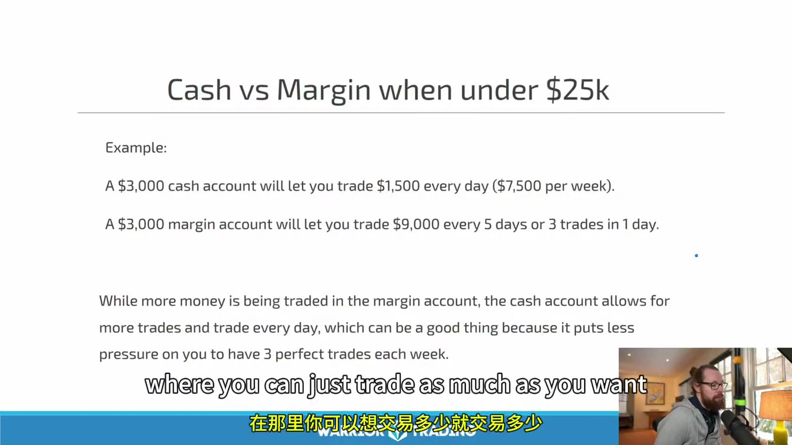
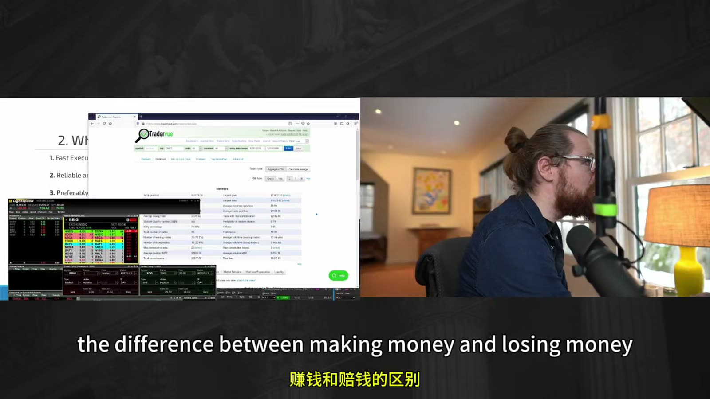
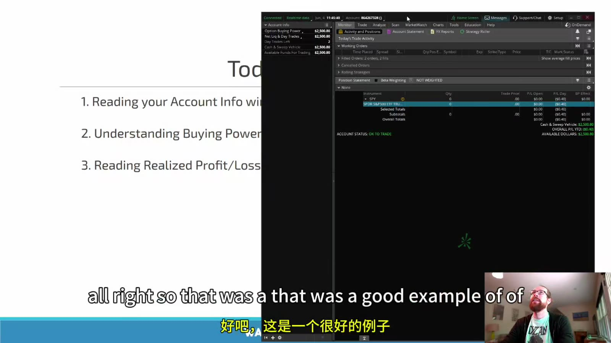
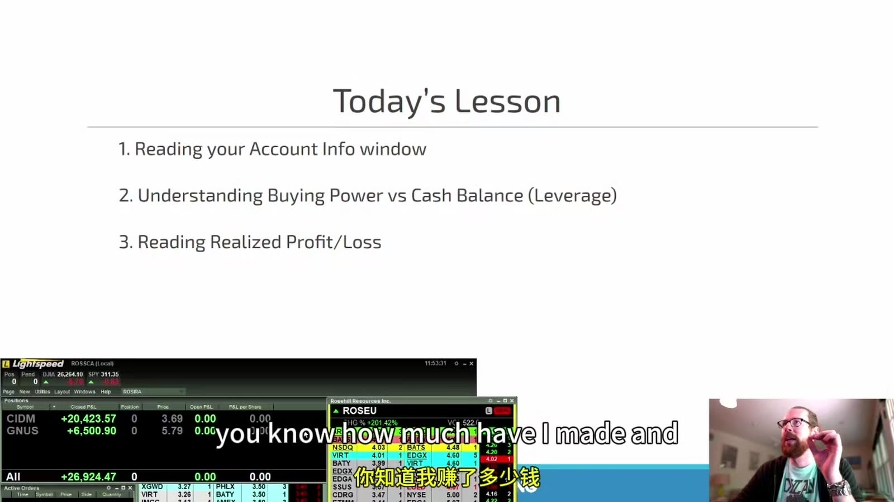

# Starter 03：账户、券商、购买力与余额

> 对应视频：Chapter 3 Part 1–2、Chapter 6（42:16、38:05、20:35）
> 本节重点：弄清账户类型、结算、保证金和购买力之间的关系，并学会从券商界面核对自己真正能承担的风险。

## 1. 账户名称不等于风险边界

课程介绍了现金账户、保证金账户和退休账户。三者最重要的差异不是界面名称，而是：

- 能否借用券商资金；
- 卖出所得何时变成 settled cash；
- 是否允许卖空、期权或其他复杂产品；
- 是否存在税务和提前取款限制；
- 券商对单只证券使用什么 house margin；
- 发生亏损时，券商是否可以直接减仓。

账户开好以后，仍需阅读本人的客户协议和保证金披露。视频中的账户规模、购买力倍数和可交易次数只是当时特定券商、特定监管阶段下的例子，不是通用参数。

## 2. 现金账户：先区分 Cash 与 Settled Cash

现金账户没有融资，并不等于所有卖出所得都能立刻再次使用。对美国股票和多数相关证券，标准结算周期已经从视频时代的 `T+2` 改为 `T+1`：通常在成交日后的一个工作日完成结算。
官方说明：[SEC — T+1 Settlement Cycle](https://www.sec.gov/newsroom/press-releases/2024-62)

至少分清：

- **Cash balance**：账户账面现金；
- **Settled cash**：已经完成结算、可用于下一笔交易的资金；
- **Unsettled proceeds**：刚卖出证券、尚未结算的所得；
- **Cash available to trade**：券商按本账户限制计算的可下单金额。

视频用一笔 SPY 买卖说明：现金账户卖出后，界面上的总资产恢复了，但可再次用于交易的金额没有完全恢复。这个现象的核心是结算，而不是“钱消失了”。

现金账户也可能出现 good-faith violation、freeriding 等问题。不要只观察订单是否被系统接受；下单前应按券商给出的 settled-cash 字段核对。

## 3. 保证金账户：购买力不是你的现金

保证金账户允许在符合条件时借用资金。最基本的关系可以写成：

`账户权益 = 证券市值 + 现金 - 保证金借款`

`可用购买力 = 券商按监管要求、house margin、持仓集中度和证券风险计算的额外容量`

购买力会随着价格、持仓和券商风控实时变化。它不等于：

- 可以承受的最大亏损；
- 每只股票都能使用的固定倍数；
- 可以安全下满的仓位；
- 不会被盘中调整的承诺。

**图怎么看：**

- 画面用约 25,000 美元权益控制约 90,000 美元股票，再遭遇约 40,000 美元亏损，说明杠杆会让亏损超过初始存款。
- 例子里的具体倍数不是承诺；实际初始保证金、维持保证金和集中持仓附加要求由证券与券商共同决定。
- 如果股价跳空越过止损，平台无法保证按预定价格成交；清仓后仍可能欠券商钱。
- 所以仓位上限应由“止损失效时可能亏多少”决定，而不是由界面还能提供多少购买力决定。

## 4. 课程中的旧 PDT 规则需要标注时间

**图怎么看：**

- 图中比较的是课程录制时的美国 pattern day trader 框架：低于 25,000 美元的保证金账户受“五个工作日内三次日内交易”等限制。
- 这张图不能当作 2026 年所有券商账户的现行说明。
- FINRA 的新 intraday margin standards 于 2026 年 6 月 4 日生效，但会员公司获准在过渡期内迁移，最迟可到 2027 年 10 月 20 日。
- 因此当前实际规则取决于券商是否已完成迁移；开户和加仓前必须查看本人券商当日公布的制度。

官方说明：[FINRA — Understanding the New Intraday Margin Requirements](https://syndication.finra.org/content/understanding-new-intraday-margin-requirements)

视频建议资金较少者比较现金账户、受 PDT 限制的保证金账户或境外券商。这里不能把境外券商当成绕开限制的快捷方案。需要额外核对：

- 监管机构与注册状态；
- 客户资产由谁托管；
- 是否有适用的投资者保护；
- 提现、争议和破产处理；
- 路由、报价、借股和强平规则；
- 本人税务居民身份下的申报义务。

## 5. 退休账户不是普通账户的免税版本

课程提到 IRA 等退休账户。具体税务待遇、可交易产品、保证金能力和提前取款后果取决于辖区、账户类型和券商。常见限制包括：

- 通常不能像普通保证金账户一样借款；
- 卖空和裸露期权可能不允许；
- 某些有限保证金只解决结算或价差占用，不提供普通融资；
- 取款可能触发税款或罚金；
- 亏损留在账户内，也可能无法像普通应税账户那样处理。

因此退休账户应按长期税务和流动性目标设计，不应只因为“交易收益可能延税或免税”就用来承担高频高波动风险。

## 6. 行情订阅中的 Professional / Non-professional

视频把行情费用分类和是否拥有证券从业执照联系起来，这只能作为例子。交易所对 professional subscriber 的定义可能还涉及：

- 是否以投资顾问、经纪商等身份注册或合格；
- 是否为他人管理资金；
- 是否代表公司或机构使用数据；
- 数据用于个人投资还是商业活动；
- 交易所协议中的其他条件。

不要自行选择更便宜的类别。应按真实身份填写，并保留券商或数据商的确认。

## 7. 选券商先看资产安全，再看按钮速度

**图怎么看：**

- 画面说明个人订单通常通过券商接入市场，而不是直接把订单发送给交易所。
- 券商不仅提供界面，还执行合规检查、购买力检查、订单路由、清算和账户报告。
- “可以下单”不代表订单得到最佳成交，也不代表所有路由、流动性提供者和费用相同。
- 对日内交易，订单被拒绝、部分成交、路由延迟和券商风险控制都属于策略结果的一部分。

筛选顺序可以是：

1. 监管注册、托管安排与适用的客户资产保护；
2. 财务状况、账户协议和提现机制；
3. 订单路由、执行质量与盘前盘后规则；
4. 保证金、集中度、低价股和 hard-to-borrow 政策；
5. 平台稳定性、热键、风控和灾备退出方式；
6. 佣金、ECN/路由费、平台费、数据费和借股费；
7. 报表、税务文件和交易日志导出。

佣金为零不代表交易成本为零。点差、滑点、price improvement、payment for order flow、借股费用和机会成本都可能更重要。

**图怎么看：**

- 右侧是执行平台，左侧是用于统计和复盘的 TraderVue；两类工具解决不同问题。
- 执行界面负责行情、订单和仓位，复盘工具负责聚合成交、标签和绩效。
- 第三方工具导入后仍要和券商正式成交报告核对，尤其是部分成交、费用、拆股和公司行动。
- 不应根据课程画面直接选择某家券商；软件、所有权、支持范围和收费都可能已经变化。

## 8. 账户窗口里每个数字代表什么

建议至少固定显示或能够快速找到：

| 字段 | 含义 | 常见误读 |
|---|---|---|
| Cash | 账面现金 | 不一定全部已结算 |
| Settled cash | 已结算现金 | 不等于账户总权益 |
| Equity / Net liquidation | 按当前价格估算的净资产 | 市场快速波动时会变化 |
| Stock buying power | 股票可用购买力 | 不代表所有股票都可用 |
| Option buying power | 期权相关容量 | 不能替代最大风险计算 |
| Realized P&L | 已平仓损益 | 可能尚未扣齐全部费用 |
| Unrealized P&L | 未平仓浮动损益 | 不是可锁定的现金 |
| Open orders | 尚未完成的订单 | 也可能占用购买力 |
| Day-trade / intraday status | 券商对日内权限的状态 | 规则正处于迁移期 |

**图怎么看：**

- 左上账户信息同时列出 option buying power、cash/sweep vehicle 和 available funds；这些字段不能互相替代。
- 中间订单区要同时检查 working、filled 和 cancelled orders，防止以为订单未成交而重复下单。
- 持仓为零后仍显示当日损益，说明 realized P&L 与当前 position 是两个概念。
- 画面是旧版 TD Ameritrade 平台；字段位置、品牌和计算方式都不应视为当前产品说明。

**图怎么看：**

- 持仓窗口把每个 symbol 的 closed P&L、position、cost basis 和 open P&L 分列。
- `Position = 0` 只说明当前没有股票，不说明当日没有做过交易。
- 课程讲者选择不持续盯着总账户价值，以免被“必须回到某个盈利数字”的心理锚定影响决策。
- 隐藏总 P&L 可以降低情绪干扰，但仓位、风险限额、订单状态和可用资金仍必须可监控。

## 9. 界面数字对不上时，不要猜

视频演示中，讲者看到约 8,336 美元的 stock buying power，自己也无法从账户余额推导出来源。这个片段反而说明了重要原则：

1. 暂停新增订单；
2. 检查未完成订单、未结算资金和现有持仓；
3. 查看证券是否可保证金交易，以及对应 requirement；
4. 查看券商是否给了盘中购买力、overnight buying power 或特殊限制；
5. 用正式账户报表核对；
6. 仍无法解释就联系券商，不用“测试大单”反推规则。

课程中用真实订单测试购买力，不适合作为操作方法。即使马上平仓，也会产生市场风险、费用、日内交易计数或其他账户后果。

## 10. 低价股不一定可使用保证金

一只股票是否 marginable，可能受以下因素影响：

- 价格；
- 上市地点和证券类型；
- 波动率与流动性；
- 券商的 house rules；
- 账户集中度；
- 当日风险事件。

同样的账户在 SPY 上显示的购买力，不能直接套到低价小盘股。最安全的做法是查证券详情、保证金表或询问券商，并按全现金占用做保守预案。

## 11. 开盘前账户检查

- 账户状态是否正常，是否有 margin call 或交易限制；
- settled cash、equity 和可用购买力是否能解释；
- 昨日持仓、盘前持仓和 open orders 是否为预期；
- 单笔、单日和总风险限额是否已设置；
- 目标股票是否 marginable、是否 hard to borrow；
- 行情订阅和路由是否正常；
- 主平台失效时，网页端、电话或备用退出方式是什么；
- 券商当前采用旧 PDT 框架还是新 intraday margin standards。

这一组视频最值得保留的不是某个平台的字段位置，而是：**先把现金、权益、借款、购买力和损益分开；任何一个数字解释不通，就先停止加风险。**
