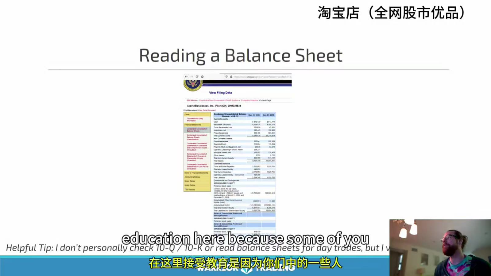
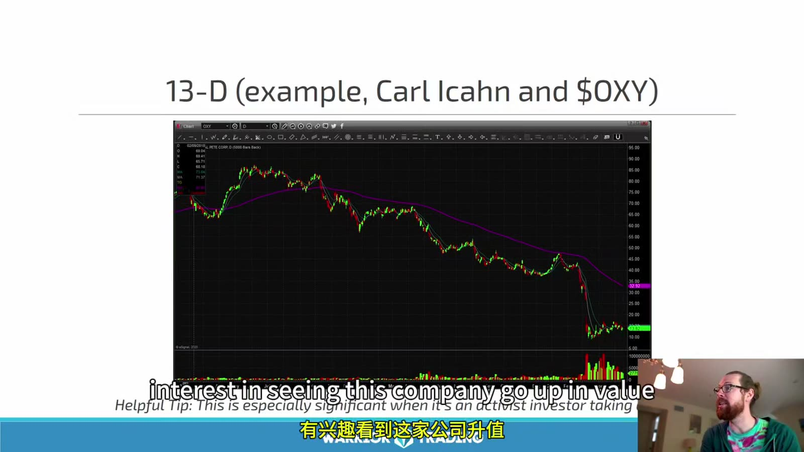

# Starter 04：基本面、SEC 文件与催化

> 对应视频：Chapter 4（41:08）
> 本节重点：不把日内交易变成长篇公司研究，但能找到原始公告、识别融资风险，并判断“有新闻”是否真的能支持当日成交量。

## 1. 日内、波段与长期投资使用基本面的方式不同

课程把分析重心概括为：

- 日内交易：以价格、成交量和执行为主，基本面用于确认催化与突发风险；
- 波段交易：持有时间变长，需要更多考虑财务状况、行业和后续事件；
- 长期投资：公司竞争力、现金流、资产负债和估值成为核心。

这不是说日内交易可以忽略基本面。低价小盘公司可能在盘中宣布融资、收到交易所通知或发布临床结果；这些事件会立即改变供给、波动和停牌风险。

## 2. 先从原始信息源开始

建议的信息层级：

1. SEC EDGAR 文件；
2. 公司投资者关系页面和正式新闻稿；
3. 交易所公告、停复牌通知；
4. 监管机构或政府部门公告；
5. 专业新闻服务；
6. 媒体摘要和社交平台。

越靠后越需要回到原文验证。标题里的 “positive”“strategic”“breakthrough” 是措辞，不是交易结论。

SEC 官方入口：[EDGAR Search Filings](https://www.sec.gov/search-filings)

## 3. 常见文件分别回答什么问题

| 文件 | 常见用途 | 日内交易先看什么 |
|---|---|---|
| 10-K | 年度报告 | 业务、风险、财务、股份数量 |
| 10-Q | 季度报告 | 最新财务、现金消耗、股份变化 |
| 8-K | 重大事件的当前报告 | 协议、管理层变化、融资、重大公告 |
| S-3 | 注册声明，常用于 shelf offering | 可注册证券的类型与规模 |
| Prospectus supplement | 对具体发行条款的补充 | 数量、价格、承销商、用途 |
| Schedule 13D | 超过特定门槛的实益所有权及意图 | 持有人、比例、资金来源、目的 |
| Form 4 | 内部人权益变动 | 买卖性质、数量、价格、持有变化 |

视频口误把 `8-K` 说成 “8-Q”；不存在与此语境对应的常规 “8-Q”。此外，S-3 本身通常只是提供发行框架，不能看到一个 shelf 就断言公司一定马上融资。

## 4. 10-K / 10-Q：不必逐字读，但要能定点查找

**图怎么看：**

- 画面是 SEC 文件的交互式财务数据，资产、负债和股东权益按报告期排列。
- 日内交易不必为每个候选完整建模，但可以定点查 cash、debt、operating cash flow、shares outstanding 和 going-concern 风险。
- `Shares outstanding` 不能直接等同于 public float；内部人、受限股和大股东持仓会影响 float 估算。
- 一份旧季度报告只代表报告期末；后续融资、行权、转换和拆股都可能使股份数发生变化。

快速搜索词：

- `cash and cash equivalents`
- `net cash used in operating activities`
- `going concern`
- `shares outstanding`
- `warrants` / `convertible`
- `subsequent events`
- `risk factors`

目标不是给公司算出“正确价值”，而是回答：它是否急需现金、是否存在大量潜在新增股份、这条新闻对公司规模是否真正重要。

## 5. Shelf、发行与稀释要分三步

视频把 S-3 比作“手榴弹已经拔销”，这个比喻过于确定。应拆成：

1. **注册能力**：公司提交 shelf registration，获得未来发行某些证券的框架；
2. **具体交易**：通过 prospectus supplement、8-K 或新闻稿公布数量、价格、费用和参与方；
3. **实际影响**：新增股份进入市场、债务或认股权证发生转换，才改变真实供给和每股经济权益。

检查具体发行时看：

- 是 common stock、preferred、debt、warrant 还是组合；
- registered direct、underwritten、ATM 或其他结构；
- 发行价相对当前价；
- 新增股数相对现有 shares outstanding；
- 是否附带低执行价认股权证；
- 募资净额和用途；
- closing 条件及日期；
- 是否还有旧 shelf、可转换债和已注册转售股份。

“融资必跌”也不是规则。折价和稀释通常造成压力，但融资可能缓解破产风险；真正的盘中反应由条款、预期差、持仓和流动性共同决定。

## 6. Stock Split 与 Reverse Split 不创造价值

拆股只是按比例调整价格和股数：

`拆股后持仓市值 ≈ 拆股前持仓市值`

例如 1:10 reverse split 后，理论上股数变成十分之一、价格变成十倍。它可以让报价重新高于交易所最低价格，也会机械地降低 shares outstanding 和 float 数字，但不会自动改善业务。

比较历史图表和 float 时必须使用调整后的口径，并检查拆股后是否紧接着发行新股。

## 7. 13D：看申报人的计划，不要只看名字

**图怎么看：**

- 图中长期下跌与某位激进投资者申报持股同时被讨论，但不能仅凭两者同屏就推导因果。
- 13D 的价值在于披露实益所有权、资金来源和 `Purpose of Transaction`，应直接阅读申报人的具体计划。
- 知名投资者持股不保证价格上涨；建仓成本、投资期限、对冲和治理影响力都可能与散户不同。
- 课程举出的 OXY 价格和持仓是历史案例，不能作为当前交易信号。

还要区分 13D 与 13G；后者通常用于符合条件的被动或特定机构持有人。文件出现后，先确认申报日期、交易发生日期和市场是否已经消化。

## 8. Form 4：买入、授予与卖出不是一回事

内部人交易需要查看 transaction code 和脚注：

- 公开市场主动买入与薪酬授予不同；
- 卖出可能来自预设计划、税务代扣或真实减持；
- 单笔金额应相对其总持仓和薪酬判断；
- 文件公布有时间差，市场可能已经反应。

所以“CEO 买了”或“内部人在卖”只能成为研究入口，不能直接成为多空指令。

## 9. 新闻催化的五层验证

读到新闻后依次问：

1. **来源**：公司原文、监管文件，还是媒体转述？
2. **新旧**：首次发布，还是旧消息重新包装？
3. **确定性**：已经完成、签署、获批，还是计划、申请、意向？
4. **规模**：金额相对公司收入、市值和现金消耗是否重要？
5. **市场确认**：成交量、点差、趋势和回撤结构是否支持？

生物科技尤其要区分：

- preclinical、Phase 1/2/3；
- enrollment、interim result、top-line result；
- FDA submission、acceptance、approval；
- endpoint 是否达到；
- 样本量和安全性；
- 公司自己的新闻稿与完整研究数据。

“positive results”不等于产品获批，“FDA related”也不等于 FDA approval。

## 10. Sector Sympathy 只能是辅助催化

同一行业可能因共同输入价格、政策或重大公司新闻一起波动。例如油价变化会影响能源企业，也可能通过成本影响航空公司。但两家公司仍有不同：

- 资产负债；
- 套期保值；
- 收入地区；
- 业务组合；
- float 和做空拥挤度。

因此板块龙头上涨并不自动让所有小盘同业成为好交易。先找到 leader，再检查 sympathy stock 是否有独立成交量与结构。

## 11. 基本面与技术面的结合方式

课程使用约 `25% fundamental + 75% technical` 的比喻。不要把它当成可计算权重，更实用的流程是：

1. 扫描出异动；
2. 找到并核验催化；
3. 检查融资、股份和停牌等尾部风险；
4. 画出盘前高低、日线位置和关键价；
5. 只有出现符合计划的 trigger 才下单；
6. 催化变强不能取消技术止损。

新闻回答“为什么今天有人看它”，技术和订单执行回答“现在是否值得用明确风险参与”。两者缺一时，应该降低仓位或放弃，而不是用故事填补证据。

## 12. 盘前催化检查卡

- 原始链接和发布时间；
- headline 与正文是否一致；
- 事件是完成、批准，还是仅计划；
- 金额与公司规模的比例；
- 最新 10-Q 的 cash burn；
- 最新 shares outstanding 与近期变化；
- shelf、ATM、warrant、convertible；
- 盘前成交量、点差和关键价；
- 是否存在停牌、退市或合规风险；
- 技术 trigger、invalidation 和最大美元损失。

本节真正要训练的是快速验证：**先确认消息是真的、是新的、是重要的，再看市场是否愿意用成交量为它定价。**
