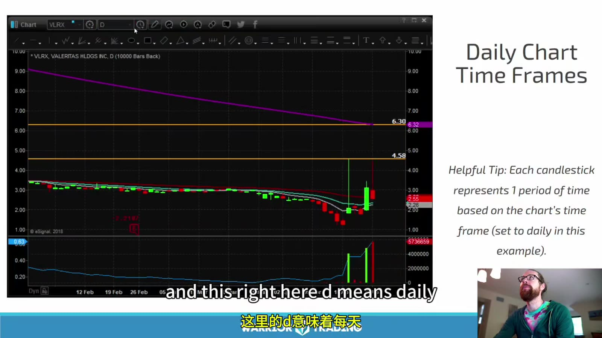
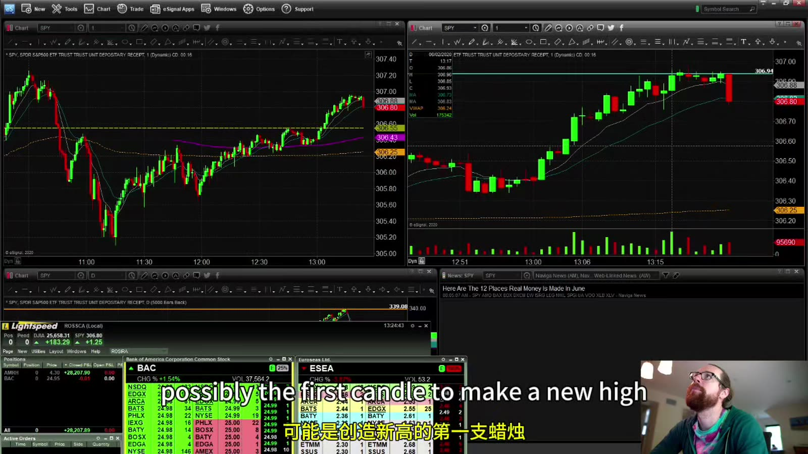
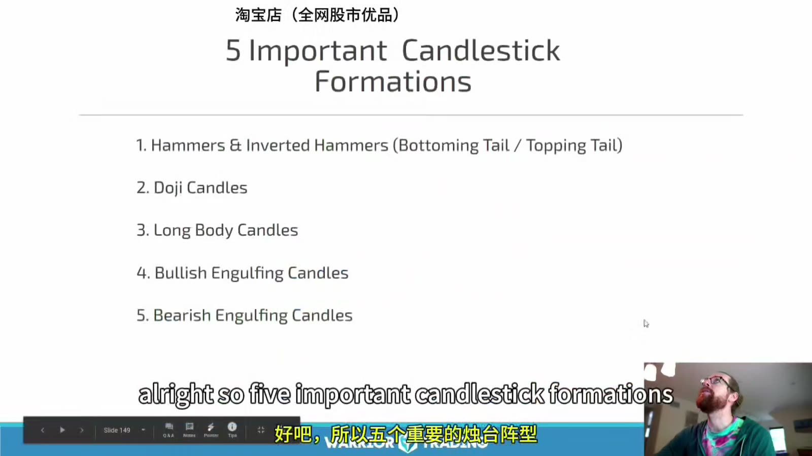
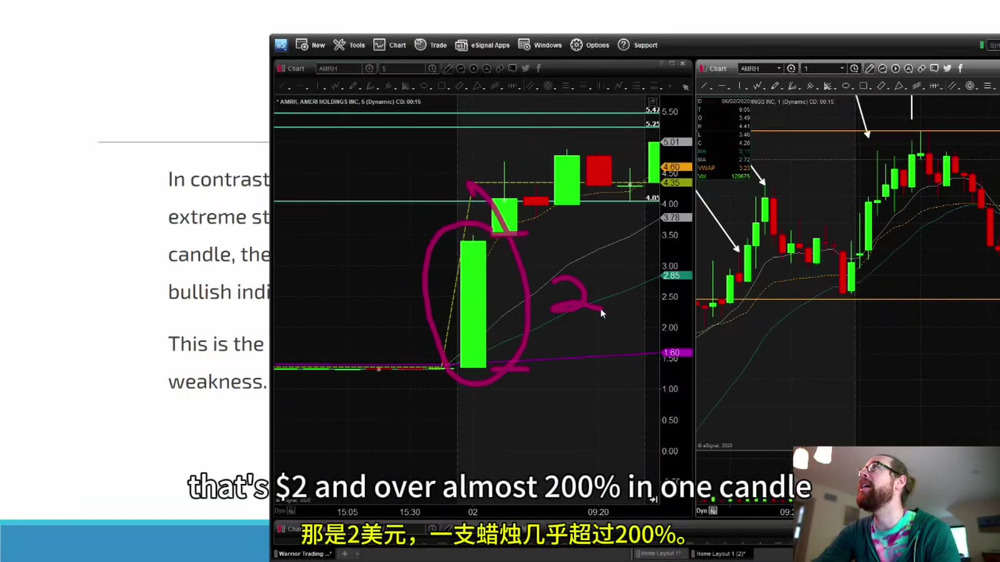
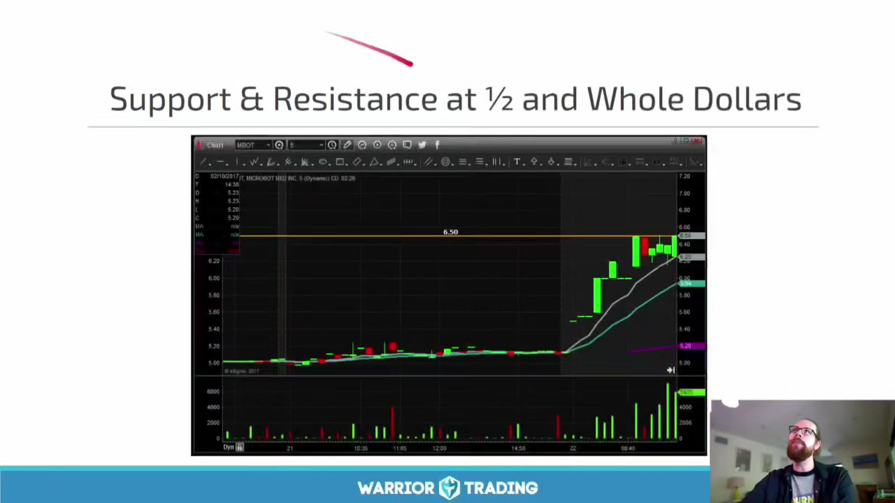
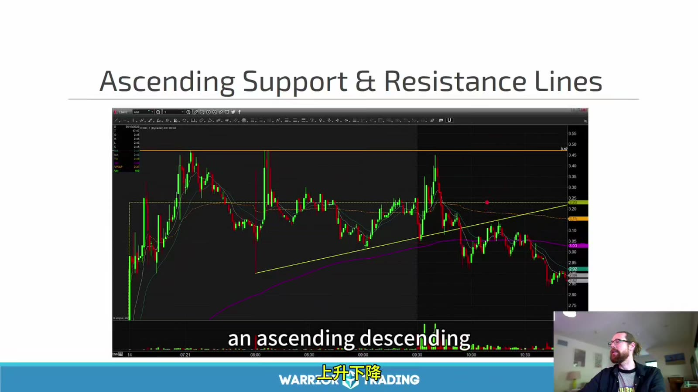
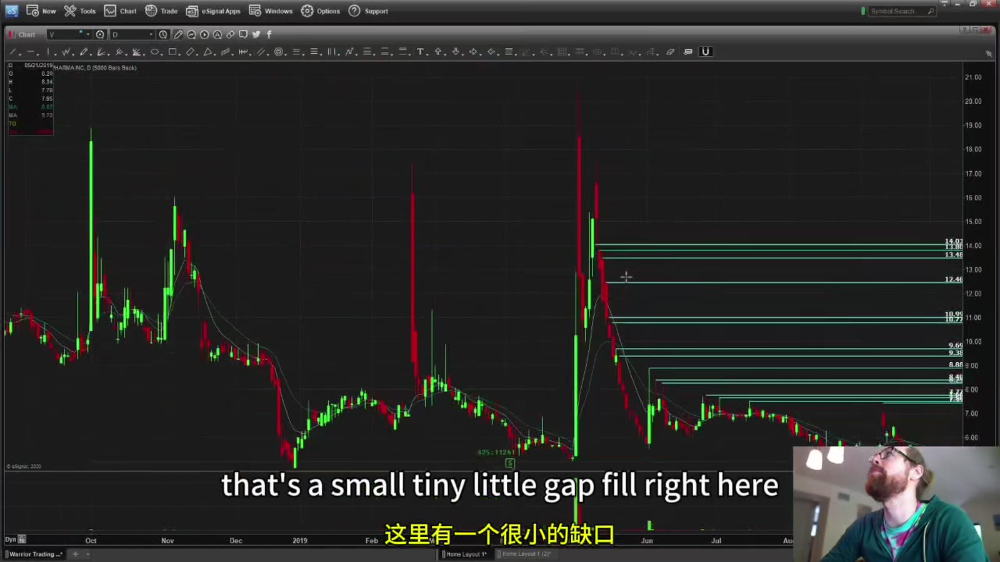
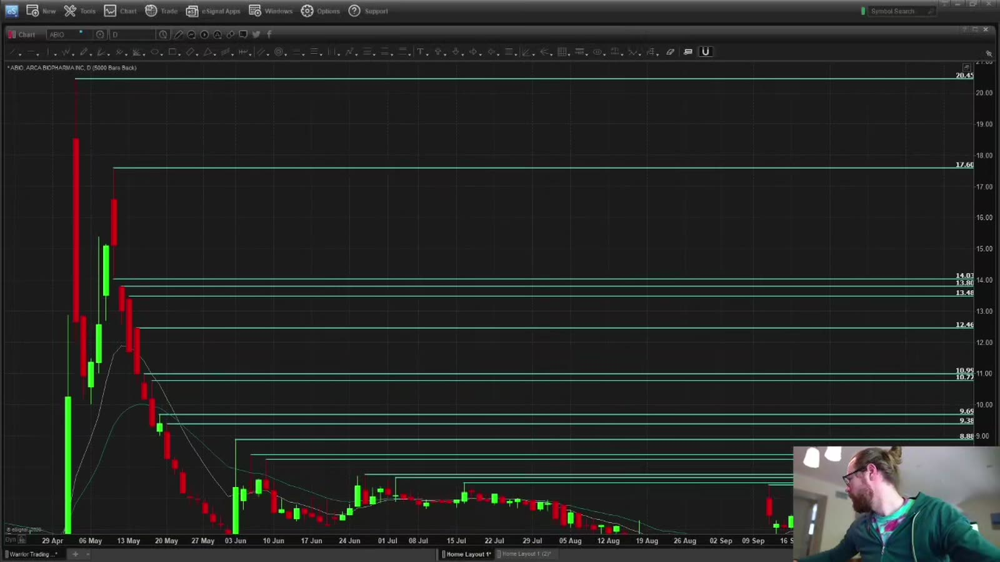

# Starter 05：图表、K 线、支撑阻力与缺口

> 对应视频：Chapter 5 Part 1–4（21:04、26:04、16:21、29:19）
> 本节重点：从时间周期和单根 K 线开始，逐步画出真正可执行的价位；不把图形名称误当成完整策略。

## 1. Technical Analysis 是条件化观察，不是预测机器

技术分析用历史价格和成交量描述市场已经发生的行为，再提出条件式计划：

`如果价格突破 A 且成交量、点差符合要求，就在 B 失效前尝试；否则不交易。`

一张图本身不能告诉你：

- 谁在买卖；
- 下一根 K 线必然怎么走；
- 你的订单能否在图示价格成交；
- 新闻或停牌何时出现。

课程说 K 线像根据云判断天气，这个类比有用，但“过去出现过”只能形成概率假设，必须配合样本统计和风险上限。

## 2. 时间周期决定一根 K 线代表什么

**图怎么看：**

- 图上 `D` 表示日线，每根 K 线聚合一个交易日；课程主要同时看日线、5 分钟和 1 分钟。
- 日线用于判断更大的位置和历史阻力，5 分钟用于观察盘中结构，1 分钟用于细化触发与退出。
- 画面中的历史日线默认可能只含常规时段；平台是否把盘前盘后纳入 OHLC 必须单独确认。
- 紫色、橙色等线是指标或人工水平线，不属于 K 线本身。

同一个价格动作在不同周期会长得不同。例如一根 5 分钟长上影，拆到 1 分钟后可能是先冲高、横盘，再快速下跌。不能在不同周期之间随意选择最支持自己持仓的那一张。

课程说“绝大多数日内交易者都用 1 分钟、5 分钟和日线”是经验性表述，不是市场事实。关键是：

- 在交易前固定周期；
- 用同一口径收集样本；
- 了解信号以哪一周期收盘确认；
- 不因一次失败临时换周期。

## 3. 未收盘 K 线会继续变化

**图怎么看：**

- 左上与右上展示不同时间周期；同一笔成交会同时更新两张图。
- “上一根 K 线高点”只有在上一根已经收盘后才固定；当前 K 线的 high、low、close 都可能继续改变。
- 图中还同时出现 Level 2、持仓和新闻区域，说明真实决策不能只盯 K 线。
- 若计划要求 candle close confirmation，就不能在盘中触及价位时假装已经确认。

以“第一根创新高 K 线”为例：

1. 先记录已收盘上一根的 high；
2. 决定是触价触发还是收盘确认；
3. 预先指定失效点，是上一根 low、结构 low，还是固定风险；
4. 把点差和滑点加入风险；
5. 触发后若无法获得合理成交，放弃追价。

课程也提到提前 anticipatory entry。它不是更便宜的免费选择：更早进场意味着信号尚未确认、假突破概率更高，必须单独统计。

## 4. 一根 K 线包含四个价格

每根 K 线至少包含：

- `Open`
- `High`
- `Low`
- `Close`

绿色通常表示 close 高于 open，红色相反，但颜色可自定义。实体描述 open 与 close 的距离，影线描述期间到达但未维持到收盘的极值。

K 线没有记录路径。只有 OHLC 时，无法知道先到 high 还是先到 low；回测止盈与止损都在同一根触发时，必须采用更细数据或保守规则。

## 5. 五种课程重点形态

**图怎么看：**

- Hammer / inverted hammer 的长影线表示价格曾被推远又收回，但名称需要结合所处趋势判断。
- Doji 只表示 open 和 close 接近，不能单独证明反转。
- Long body 表示该周期内方向移动大，仍需与平均波幅和成交量比较。
- Bullish / bearish engulfing 比较相邻实体；不同资料对是否必须吞没影线有不同定义。
- 形态清单是观察语言，不是看到名字就下单的策略。

### Hammer 与长影线

下影很长说明低价曾出现、随后买盘或空头回补把价格推回。它可能是拒绝下跌，也可能只是高波动；要看：

- 是否位于已知支撑；
- 收盘位置是否接近高位；
- 下一根是否确认；
- 形成时的成交量和点差；
- 下影低点到入场的距离是否使风险过大。

### Doji

Doji 表示该周期净变化小，不代表期间没有剧烈波动。趋势末端的 doji 可能提示犹豫，区间中间的 doji 可能没有信息。

### Engulfing

吞没形态展示前一根实体被下一根反向实体覆盖。真正需要测试的是：在特定股票池、特定位置和成交量条件下，后续收益分布是否改善。

**图怎么看：**

- 左图被圈出的长阳实体体现价格在一个周期内快速扩张。
- 右图显示大阳线之后出现多根整理，随后下跌；大阳线本身并不保证延续。
- 突然扩大约 200% 的单根波幅会同时增加机会和止损距离。
- 如果只能把止损放在长阳线低点，仓位必须按更宽风险相应缩小，不能仍使用固定股数。

## 6. Support / Resistance 是区域，不是保证

支撑是过去买盘、空头回补或关注曾增加的区域；阻力是过去卖盘、获利了结或供应曾增加的区域。它们常来自：

- 盘前高低；
- 前一日高低与收盘；
- 日线明显转折；
- 当前区间高低；
- VWAP 和常用均线；
- 整数、半美元等心理价位；
- 停牌参考价或发行价格。

同一水平被触碰越多，不一定越强；反复测试也可能消耗挂单。把它理解为潜在反应区，而不是碰到就必然反转。

**图怎么看：**

- 图中价格向 6.50 靠近，课程把 half-dollar 与 whole-dollar 当作共同关注点。
- 整数效应来自订单聚集和人类报价习惯，但不是每只股票都有相同强度。
- 水平线应结合此前真实高低点，而不是仅因数字“好看”就画。
- 若 spread 已经接近 0.20 美元，精确到一两美分的水平线可能没有实际执行意义。

## 7. 趋势线的画法与局限

**图怎么看：**

- 黄色斜线连接多个抬高的低点，试图表示 ascending support。
- 两点可以画线，第三次及以后测试才提供更多验证；选择不同端点会得到不同斜率。
- 图中价格后来跌破趋势线，说明线是结构描述，不是墙。
- 跌破是否有效还受时间周期、收盘确认、成交量和回抽影响。

避免为了贴合价格不断重画趋势线。应保存最初画法，记录：

- 端点时间和价格；
- 是否允许穿影线；
- 触发按触及、突破还是收盘；
- 跌破后的退出规则；
- 是否在回测中使用了事后才知道的点。

## 8. 课程的 “left and up” 方法

寻找上方日线阻力时，课程采用：

1. 从最新价格向左看；
2. 遇到挡住视线的大 K 线，不跨过其价格范围去挑内部小点；
3. 从该 K 线 high 再向左、向上找下一个明显 high；
4. 依次标出可能的阻力。

这个方法的优点是减少图上密密麻麻的水平线，优先保留明显价位。缺点是“挡住”“明显”的判断主观，而且以前被突破的价位仍可能因持仓成本或市场记忆再次产生反应，不能机械删除。

更稳妥的标注分级：

- A：近期且多次有反应；
- B：较远但明显的日线高低；
- C：只有单次或较弱证据；
- 已突破：保留灰色，观察是否发生 role reversal；
- 与当前价过近：合并为区域。

## 9. Gap 与课程所称 Window

严格的 price gap 是两个相邻交易时段之间没有重叠的价格区间。课程另外把历史长 K 线内部、几乎没有转折阻力的宽区间称为 `window`。后者是本课程的观察术语，不是所有技术分析资料统一采用的定义。

**图怎么看：**

- 画面指向两段日线价格之间的小空白，属于相邻交易日形成的 gap。
- 缺口大小要相对该股票通常波幅判断；很小的缺口可能被 spread 和噪声淹没。
- 图中历史上发生过 gap，不等于今天一定会回去 fill。
- 拆股、分红和数据复权也可能制造视觉缺口，分析前要核对公司行动。

**图怎么看：**

- 多条青色水平线表示向左寻找的历史 high；线与线之间较空的区域被视为潜在 `window`。
- 线越多不代表分析越精确，反而可能无法形成清晰的风险收益计划。
- 入场前只保留最近失效点、第一目标和下一重要目标，其他远端水平用于情景参考。
- 这是历史图上的事后标注；练习时应只用当时可见数据重画，防止 hindsight bias。

## 10. “Gap Fill” 不是必然回归

缺口可能：

- 很快回补；
- 部分回补后反转；
- 数周或数年不回补；
- 因公司价值重估永久留在图上；
- 在复权后消失。

把 gap 当目标前，至少确认：

- 缺口为何形成；
- 目前价格到 gap 边界的距离；
- 中间是否真的缺少阻力；
- 当日成交量能否支持；
- 到目标前的 reward 是否大于现实 risk；
- 是否接近停牌、发行或财报。

## 11. 从图形到交易计划

一个完整计划应写成：

| 项目 | 示例写法 |
|---|---|
| Context | 盘前有新催化，日线接近历史高 |
| Setup | 5 分钟第一次有序回撤 |
| Trigger | 突破已收盘前一根 5 分钟 high |
| Invalidation | 跌破回撤 low，且计入滑点 |
| First target | 盘前高 |
| Next target | 日线下一个阻力区 |
| Position size | 最大美元风险 ÷ 每股风险 |
| No-trade | spread 过宽、停牌、无成交量确认 |

图形名称只填 `Setup` 一栏。没有 context、trigger、invalidation、size 和 exit 的“形态”，仍然不是可以执行的策略。

## 12. 图表练习方法

1. 隐藏未来 K 线；
2. 只画三到五个最重要水平；
3. 写下对上破、下破和横盘三种情景；
4. 再逐根推进；
5. 记录计划价与现实可成交价；
6. 统计同一 setup 至少几十个样本；
7. 失败样本和成功样本同样保留。

这四节的核心不是背 hammer、doji 或 gap，而是建立一套不会随持仓改变的读图顺序：**先周期，再位置，再结构，最后才是触发。**
