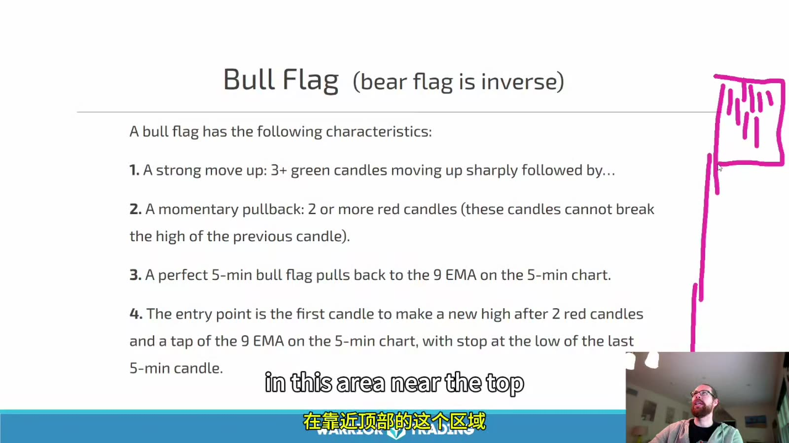
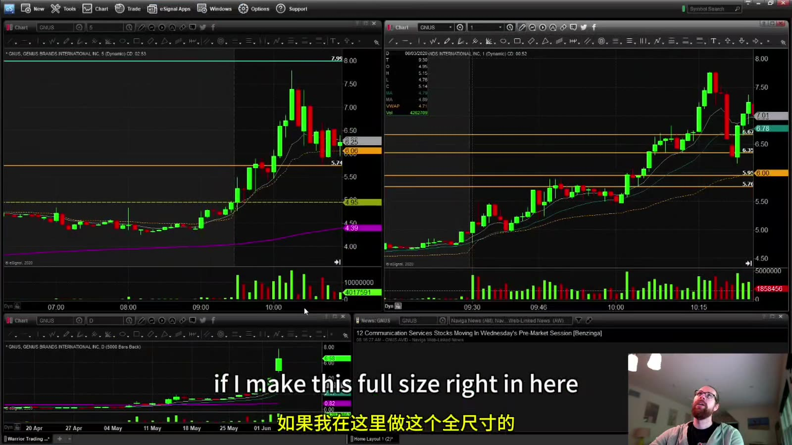

# Starter 06：多 K 线形态与多周期共振

> 对应视频：Chapter 5 Part 5（26:25）
> 本节重点：准确描述 bull flag 等常见结构，并把“第一根创新高”从口号还原成可验证的触发条件。

## 1. Pattern 只是重复形状，Strategy 才能执行

同一个 bull flag 可以出现在：

- 有真实催化、高相对成交量的低 float 股票；
- 没有新闻、点差很宽的冷门股票；
- 大盘 ETF；
- 盘前薄量阶段；
- 高位第三、第四次拉升之后。

形状相似，后续分布和成交质量可能完全不同。完整策略至少需要：

`股票池 + 市场环境 + setup + trigger + invalidation + sizing + exit + 成本`

课程也明确说 Starter 只介绍形态；不能把屏幕上一次成功的实时示范当作统计验证。

## 2. 第一根创新高到底指什么

课程定义是：回撤过程中，当前 K 线第一次突破前一根已收盘 K 线的 high。它不要求当前 K 线先收盘。

例如：

- 前一根 high：7.00；
- 计划触价触发：成交出现 7.01；
- 结构 low：6.78；
- 估计入场含滑点：7.04；
- 每股风险：`7.04 - 6.78 = 0.26`。

这个触发只说明短期方向重新向上，不说明：

- 一定突破整个旗形；
- 能在 7.01 成交；
- 风险固定为 0.10；
- high 上方没有大卖单；
- 假突破后能按 low 平仓。

如果提前在 6.95 anticipatory entry，必须把它定义为另一种 setup。不能在回测时把成功样本算“提前买”，失败样本又说“尚未触发”。

## 3. Bull Flag 的结构



**图怎么看：**

- 旗杆是前面的快速上行，旗面是高位短暂、相对有序的回撤或横盘。
- 课件提出常见特征：多根上涨 K 线、至少两根回撤 K 线、回撤靠近 9 EMA，再由第一根创新高触发。
- 这些数字是课程的筛选偏好，不是 bull flag 的唯一市场定义。
- 手绘形状只表达结构；没有价格、成交量、时间和失效点，不能直接计算交易。

课程偏好的较强版本：

- 旗杆有价格和成交量扩张；
- 回撤量缩；
- 回撤深度不超过旗杆约一半；
- 在高位而非完全跌回起点；
- 靠近 9 EMA 或前一个结构支撑；
- 再突破时成交量重新扩大；
- 1 分钟与 5 分钟没有相互冲突。

“不超过一半”是启发式规则，不是自然定律。需要在自己的股票池中测试不同 retracement 深度。

## 4. 量柱颜色不等于买卖量

很多平台把上涨 K 线对应的总成交量涂绿、下跌 K 线涂红。红量柱不表示该周期每一股都是主动卖出，绿量柱也不表示全是主动买入。

观察 volume contraction / expansion 时应比较：

- 本周期总量与前几根；
- 相同日内时段的正常量；
- 突破价附近实际成交速度；
- 点差与可见深度；
- 突破后能否维持，而不只是瞬间打印。

量缩回撤的解释是抛压可能较轻；它仍可能只是买方消失。

## 5. Multi-timeframe Alignment



**图怎么看：**

- 左右图显示同一标的在不同周期下的结构；5 分钟的一根 K 线包含五根 1 分钟 K 线。
- 5 分钟看起来刚开始突破时，1 分钟可能已经连续拉升、离短期支撑很远。
- 日线上还有历史水平和 200 EMA；盘中形态不能覆盖更大周期阻力。
- 多周期共振不是“指标越多越好”，而是各周期对同一个风险位置没有明显冲突。

一个具体检查法：

1. **日线**：上方最近阻力和潜在空间；
2. **5 分钟**：当前是第一次有序回撤，还是已经多次延伸；
3. **1 分钟**：触发是否过度延伸，是否有清晰 micro pullback；
4. **Tape / Level 2**：点差、成交速度和拒绝位置；
5. **订单计划**：哪个周期的 low 是真正失效点。

一笔交易只能有一个主风险周期。如果以 5 分钟 low 为止损，却按 1 分钟很窄风险计算仓位，实际损失会被低估。

## 6. Flat-top Breakout

结构：

- 多次在接近同一 high 受阻；
- low 逐步抬高或价格在 high 附近收紧；
- 突破水平线后才进入新价格区。

需要防：

- 每次测试都在消耗买盘而非卖盘；
- 可见卖单撤单造成假象；
- 突破只有一笔小成交；
- 入场价离最近 low 太远；
- 整数位上方立即有日线阻力。

有效触发应明确是 trade-through、bid hold、收盘确认，还是突破后回踩；不能事后任选。

## 7. Moving-average Pullback

价格在趋势中回到 9 EMA、20 EMA 或 VWAP 附近，再恢复方向。均线只是动态参考，不是天然支撑。

较好的观察条件：

- 均线斜率与趋势一致；
- 回撤有序、量能收缩；
- 均线附近同时有结构 low 或此前突破位；
- 价格不是第一次触碰就直接盲买；
- 失效点放在价格结构，而不只是均线下方一分钱。

不同平台的 EMA 和 VWAP 输入数据可能不同，实际价位要以自己下单时使用的数据为准。

## 8. ABCD / 1-2-3-4

常见描述：

- A→B：第一段上涨；
- B→C：回撤；
- C→D：恢复上涨并测试或突破 B；
- D：目标区，不是保证到达的位置。

ABCD 很宽泛。必须额外定义：

- B→C 最大回撤；
- C 是否必须高于 A；
- C 处成交量；
- D 用等距投射还是前高；
- 超过多长时间失效；
- 是否允许 C 下破某个支撑。

否则几乎任何走势都能事后标成 ABCD。

## 9. Top / Bottom Reversal

反转形态是逆着当前延伸方向交易，风险来自“看起来已经很高/很低”但仍继续延伸。

不要仅因：

- RSI overbought；
- 连续多根绿色 K 线；
- 整数位；
- 一根 topping tail；

就判断顶部成立。至少等待结构变化，例如 lower high 后跌破 higher-low sequence，并用反转失效点控制风险。

同样，抄底前需要看到卖压减弱和结构恢复；“已经跌很多”不是支撑。

## 10. VWAP Break / VWAP Fade

- **VWAP break**：价格从下方向上突破 VWAP，并尝试在其上方维持；
- **VWAP fade**：价格反弹到 VWAP 附近受阻，再转弱。

检查：

- VWAP 是否含盘前数据；
- 当天 anchored 起点；
- 穿越时成交量；
- 突破后 bid 是否能保持；
- 距离下一水平位有多少空间。

在 VWAP 附近来回穿越的横盘日，信号会反复失效。

## 11. Head and Shoulders

经典结构包含左肩、较高头部、右肩以及 neckline。实盘问题是右肩形成前并不知道它一定是右肩，neckline 也可能是斜线或区域。

较客观的记录：

- 三个 swing high 的时间和价格；
- neckline 两个锚点；
- 触发是跌破还是回抽失败；
- 头顶以上的 invalidation；
- 到目标的空间是否覆盖 stop 与成本。

不能看到三个凸起就自动预测目标等于“头到颈线”的高度；那只是待验证的测量方法。

## 12. Bull Trap / Bear Trap

Bull trap：

1. 价格突破明显阻力；
2. 追价买盘进入；
3. 价格无法维持，快速跌回原区间；
4. 被套多头止损进一步增加卖压。

Bear trap 是反向结构。

关键不是猜“主力故意诱多”，而是观察：

- 突破是否被接受；
- 成交量增加后价格是否有 progress；
- 回落是否重新跌破触发位；
- 失败后反方向是否出现可定义风险的 setup。

## 13. 第一次与后续 Pullback

课程偏好第一、第二次回撤，警惕第三次以后。逻辑是：

- 早期动量尚新；
- 后续买方可能逐渐耗尽；
- 趋势离 VWAP 和基础支撑越来越远；
- 高位持仓和获利盘增加。

但“第几次”必须按固定周期和固定 reset 规则计数。跨 1 分钟、5 分钟混着数会让统计没有意义。

## 14. 形态记录模板

```text
symbol:
date/time:
market session:
catalyst:
daily context:
primary timeframe:
setup:
trigger:
expected entry:
invalidation:
per-share risk:
max dollar risk:
share size:
first/second target:
spread/slippage:
reason to skip:
actual fills:
```

本节的实用结论是：**形态只负责提出假设；价格接受、成交量、执行成本和明确失效点才决定它是否成为一笔交易。**
